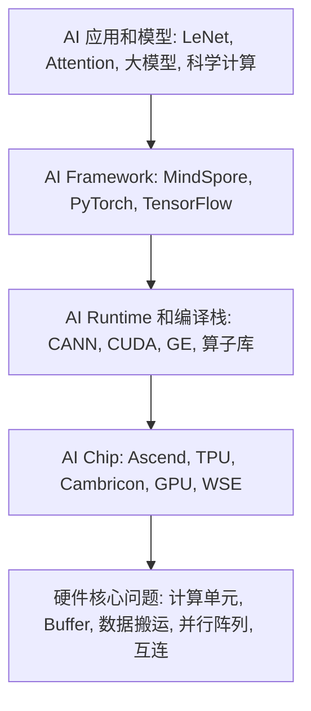
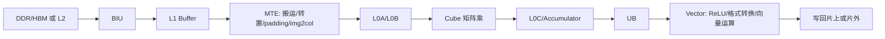
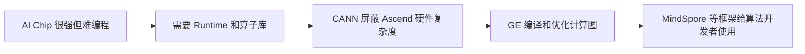
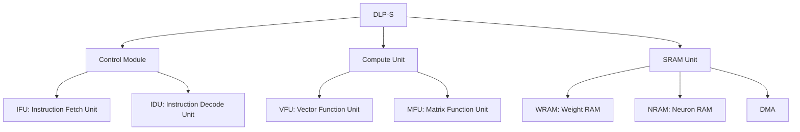
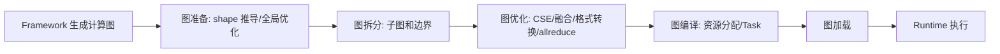

# 12-davinci-tpu 与 13-hwj-cann-mindspore 完整零基础讲义

来源课件：

- `12-davinci-tpu [自动保存的].pptx`，122 页。
- `13-hwj-cann-mindspore.pptx`，93 页。

本讲义的目标不是做摘要，而是把两份 PPT 中的硬件、运行时、框架三层知识串成一条从零开始能学懂的线。原始逐页抽取保存在：

- `extracted/12-davinci-tpu__raw_extract.md`
- `extracted/13-hwj-cann-mindspore_raw_extract.md`

幻灯片图片已导出到：

- `slide_images/12-davinci-tpu/`
- `slide_images/13-hwj-cann-mindspore/`

## 0. 先建立总框架

这两讲其实讲的是同一件事的两面。

第 12 讲站在硬件角度回答：深度学习为什么需要专用 AI 加速器？AI 芯片内部为什么会有很多 Buffer、Cube、Vector、Scalar、MTE、BIU、脉动阵列？为什么 TPU、Ascend、Cerebras 这些芯片看起来和 CPU/GPU 很不一样？

第 13 讲站在系统软件角度回答：即使有了很强的 AI 芯片，普通深度学习开发者也不能直接手写芯片指令，那么中间需要什么？答案是 Runtime、算子库、图编译器和 AI Framework，例如 CANN 与 MindSpore。

可以用下面这张图理解两讲关系：



学习时一定要抓住一个总主题：AI 加速不是只靠“算得快”，更靠“少搬数据、搬得近、搬得有规律、让数据被重复使用”。

## 1. 零基础预备概念

### 1.1 MAC 是什么

MAC 是 Multiply-Accumulate，乘加运算，形式是：

```text
C = C + A * B
```

深度学习中大量计算都可以归结为许多 MAC。例如矩阵乘法、卷积、全连接层、Attention 里的 QK^T 和 PV 等，本质都在做大量乘加。

AI 芯片喜欢 MAC，是因为它规则、重复、可并行。规则意味着硬件可以被做得简单，重复意味着同一套计算单元可以一直满负荷工作，可并行意味着可以堆很多 PE 或矩阵乘单元。

### 1.2 Tensor、向量、矩阵、算子

Tensor 可以先理解为多维数组。

- 标量：一个数，例如 `3.14`。
- 向量：一维数组，例如 `[1, 2, 3]`。
- 矩阵：二维数组，例如 `[[1,2],[3,4]]`。
- 高维 Tensor：三维、四维或更高维数组，例如一批 RGB 图片可以是 `(N, H, W, C)`。

算子是神经网络中的一个计算节点。例如 Conv2D、ReLU、BatchNorm、MatMul、Attention 都是算子。框架中的模型不是直接变成芯片指令，而是先被表示成由很多算子组成的计算图。

### 1.3 访存为什么比计算更重要

课件给出的能耗表非常关键：

| 32-bit 操作 | 能耗 pJ | 相对整数 ADD |
|---|---:|---:|
| ADD int | 0.1 | 1 |
| ADD float | 0.9 | 9 |
| Register File | 1 | 10 |
| MULT int | 3.1 | 31 |
| MULT float | 3.7 | 37 |
| SRAM Cache | 5 | 50 |
| DRAM | 640 | 6400 |

意思是：从 DRAM 搬一次 32-bit 数据，能耗大约是整数加法的 6400 倍。很多初学者会以为“计算最贵”，但在 AI 芯片中，真正经常卡住性能和功耗的是数据搬运。

因此 AI 芯片设计的主线是：

```text
外部内存 DRAM/HBM 访问最贵
    -> 尽量搬到片上 Buffer
    -> 在片上尽量复用
    -> 在 PE/寄存器里尽量停留
    -> 一次搬入，多次计算
```

### 1.4 Cache 和 Buffer 的根本差别

Cache 和 Buffer 都可以用 SRAM 做，但使用方式不同。

| 项目 | Cache | Buffer / Scratchpad |
|---|---|---|
| 是否程序员可见 | 通常不可见 | 可见 |
| 管理方式 | 硬件自动管理 | 软件/编译器/程序员手动管理 |
| 能耗和面积 | 需要 tag、替换策略、一致性等，较高 | 控制简单，较低 |
| 优点 | 编程简单 | 更可控、更高效 |
| 缺点 | 对固定数据流不一定最优 | 编程更难 |

CPU 偏向 Cache，因为 CPU 要跑各种程序，追求通用性和低延迟。AI 加速器偏向 Buffer，因为深度学习计算模式相对固定，愿意牺牲一部分可编程性换取吞吐和能耗效率。

## 2. 第 12 讲：AI Processors

### 2.1 深度学习计算和访存特性

课件首先回顾了不同深度学习算子的特性：

| Operator | 计算特性 | 访存特性 |
|---|---|---|
| Conv | 矩阵相乘 | Burst + stride |
| Attention | 矩阵相乘 | Burst + stride |
| Activation | 单向量操作 | Sequential |
| Pooling | 单矩阵 Reduce | Burst + stride |
| FC | 矩阵相乘 | Sequential |

这里有三个关键词。

矩阵相乘：说明主要计算是大量 MAC，很适合堆专用矩阵乘单元。

Burst + stride：Burst 指连续成块访问，stride 指按固定步长访问。它们都比随机访问更容易被硬件优化。

Fixed Memory Access Pattern：访存模式固定，说明可以提前安排数据搬运。只要知道模型结构和 Tensor shape，编译器或程序员就可以大致知道每一步要搬哪些数据。

课件强调：AI 相关计算中，矩阵乘法计算量占比高于 90%。这就是为什么 AI 芯片中几乎都会出现矩阵乘单元、张量核、Cube、systolic array 等结构。

### 2.2 AI 加速器五条设计原则

课件列出五条设计原则：

1. Global Buffer：用专有存储器减少数据搬运距离和开销，用 scratchpad/global buffer 替代复杂 cache。
2. 简化控制模块：减少高级微架构特性，把面积用在更多运算单元或片上存储。
3. 并行计算模块：使用符合领域需求的简单并行形式，例如单条指令直接支持小矩阵运算。
4. 量化：降低数据位宽和类型，例如推理使用 int8。
5. 专用编程语言：使用 DSA 专用语言或专用编程模型。

这五条的共同含义是：AI 芯片不是“小 CPU”，而是领域专用架构 DSA。它不追求什么程序都能跑，而是追求深度学习这类程序跑得又快又省电。

### 2.3 CPU 和 DSA 的差别

课件表格：

| 维度 | CPU | DSA |
|---|---|---|
| On-chip Memory | Cache | Global Buffer |
| Instruction Issue | Superscalar | In-order/simple |
| Parallelism | Inter-instruction | Intra-instruction |
| Functionality | Full | Partial |
| Optimization Purpose | Low Latency | High Throughput |
| Programming Language | General | Domain-specific |

逐项解释：

CPU 的并行主要是指令之间的并行。例如乱序执行、超标量发射、多级流水线。它需要复杂控制逻辑，因为 CPU 不知道未来会运行什么程序。

DSA 的并行更多是单条指令内部的并行。例如一条矩阵乘指令内部并行完成很多 MAC。它可以把控制做简单，因为深度学习算子的结构很固定。

CPU 优化低延迟：一个请求尽快返回。AI 加速器优化高吞吐：大量数据连续进入，硬件持续工作。

### 2.4 AI 加速器的两个主要属性和主要挑战

AI 加速器面对两个核心问题：

- 计算：很多矩阵、向量计算，需要足够算力。
- 访存：很多外存访问，数据搬运代价巨大。

课件说当前主要挑战是：不足的算力，访存代价太大。

但更深一层是：只增加算力不一定有用。如果数据喂不进计算单元，计算单元就会空转。AI 芯片设计必须同时平衡计算和 I/O。

### 2.5 为什么需要片上 Buffer

课件用 AlexNet 举例：最差情况下，所有读写都访问外部内存，AlexNet 需要 724M MAC 和 2896M 次外部内存访问。也就是说，如果不做数据复用，访存次数可能远大于计算次数。

外部内存访问贵，所以要把数据搬到片上 Buffer 中。典型流程是：

```text
DRAM/HBM
  -> Global Buffer / L2 Buffer
  -> L1 Buffer / UB / L0 Buffer
  -> Register File / PE
  -> 计算
```

Buffer 并不自动解决所有问题，它只是把数据搬近。真正的优化还包括：什么时候搬、搬多少、停在哪里、被谁复用、什么时候写回。

### 2.6 Buffer 编程模型

课件给出两个对比代码。

Cache 模型像普通 C 代码：

```c
uint32_t a[32] = {0, 1, 2, ..., 31};
uint32_t b[32] = {0, 1, 2, ..., 31};
uint32_t c[32];

for (uint i = 0; i < 32; i++) {
    c[i] = a[i] + b[i];
}
```

程序员只写计算，数据什么时候进 cache 由硬件自动处理。

Buffer 模型需要显式搬运：

```c
DDR uint32_t a[32] = {0, 1, 2, ..., 31};
DDR uint32_t b[32] = {0, 1, 2, ..., 31};
DDR uint32_t c[32];

Unified_Buffer uint32_t a_ub[32];
Unified_Buffer uint32_t b_ub[32];
Unified_Buffer uint32_t c_ub[32];

Dma_Mov(a_ub, a);
Dma_Mov(b_ub, b);
Vector_add(c_ub, a_ub, b_ub);
Dma_Mov(c, c_ub);
```

这说明 AI 芯片编程要考虑“数据在哪里”。初学者可以把它想成厨房做饭：普通 CPU 代码只写“炒菜”，Buffer 编程还要写“从仓库拿菜到案板、切好、放锅里、炒完端出去”。

### 2.7 Ascend Buffer 层次

课件指出：

- L1：给 MTE 使用。
- UB：给 Vector 使用。
- L0A/L0B/L0C：给 Cube 使用。

因此程序或编译器必须知道数据应该放在哪个 Buffer。难点也在这里：Buffer 位置对程序员可见，编程门槛变高。

### 2.8 减少 Global Buffer 访问

即使从 DRAM 搬到了 Global Buffer，Global Buffer 访问仍然昂贵。因此还要提高 Register File 和 PE 内部复用。

课件讲了四类数据流。

#### 2.8.1 Weight Stationary, WS

核心思想：尽量把 Weight 留在 PE 内，减少从 Global Buffer 读取 Weight。Activation 被广播，partial sum 沿 PE 水平方向累加。

适合场景：权重被许多输入反复使用时。TPU 脉动阵列就是典型例子。

#### 2.8.2 Output Stationary, OS

核心思想：尽量把 Psum 留在 PE 内，减少 Psum 的读写。Weight 被广播，Activation 沿 PE 水平方向复用。

Psum 是 partial sum，中间累加结果。例如矩阵乘 `C[i][j] = sum_k A[i][k] * B[k][j]`，在所有 k 加完之前，C[i][j] 就是 Psum。

#### 2.8.3 Input Stationary, IS

核心思想：尽量把 Activation 留在 PE 内，减少从 Global Buffer 读 Activation。Weight 并行读，Psum 沿 PE 水平方向累加。

#### 2.8.4 Row Stationary, RS

核心思想：把 Filter 的一行和 Activation 的一个滑窗留在 PE 内，尽量减少整体 Global Buffer 读出量，而不只优化某一种数据。

Row Stationary 常用于卷积，因为卷积天然包含“滑窗”和“滤波器行”。

### 2.9 数据流的共同目标

四种 stationary 策略不是记名字，而是理解目标：

```text
要么让 weight 少动
要么让 activation 少动
要么让 psum 少动
要么综合权衡三者
```

所有策略最终都是为了 Data Reuse：一份数据搬进来后尽量被多次使用。

### 2.10 计算模块：Scalar、Vector、Matrix

课件用 16x16 矩阵乘解释不同计算粒度。

Scalar 写法：

```c
for (int i = 0; i < 16; i++)
    for (int j = 0; j < 16; j++)
        for (int k = 0; k < 16; k++)
            C[i][j] += A[i][k] * B[k][j];
```

周期数：16 * 16 * 16 = 4096。灵活，但慢。

Vector 写法：

```c
for (int i = 0; i < 16; i++)
    for (int j = 0; j < 16; j++)
        C[i][j] = A[i][:] * B[:][j];
```

周期数：16 * 16 = 256。一次做一段向量点积。

Matrix 写法：

```c
C[:][:] = A[:][:] * B[:][:]
```

周期数：1。硬件直接支持小矩阵乘，算力密度最高，但灵活性最低。

这正是 AI 芯片的取舍：用不灵活换高效率。

### 2.11 华为 Ascend 与 DaVinci Core

课件中的 Ascend 部分主要讲 DaVinci AI Core。它是 Ascend 芯片内部真正做 AI 计算的核心。

#### 2.11.1 Ascend 310 和 Ascend 910

课件区分：

- Ascend 310：推理芯片，使用 DDR，带宽较低、成本较低。
- Ascend 910：训练芯片，使用 HBM，带宽高、成本高。

课件第 35 页原文写到“训练芯片310中”，从上下文看应理解为训练侧对应 910。学习时应按“310 偏推理、910 偏训练”来把握。

#### 2.11.2 DaVinci Core 主结构

导出的第 39 页图中，DaVinci Core 包含：

- L1 Buffer：1MB，较大的片上中转区。
- MTE：Memory Transfer Engine，负责 Buffer 间搬运和格式转换。
- BIU：Bus Interface Unit，负责 AI Core 和外部总线交互。
- L0A/L0B：各 64KB，为 Cube 提供左右矩阵输入。
- Cube：`16^3 Cube`，矩阵乘核心。
- Accumulator 和 Accum DFF：保存矩阵乘中间结果。
- L0C：256KB，保存 Cube 输出和中间结果。
- Unified Buffer, UB：256KB，主要服务 Vector。
- Vector Unit：做向量运算、激活、转换等。
- Scalar Unit / AGU / Mask Gen：控制循环、分支、地址生成、掩码。
- SPR/GPR：专用寄存器和通用寄存器。
- I Cache：指令缓存。
- Instr Dispatch：指令分发。
- Cube Queue、Vector Queue、MTE Queue：不同流水的指令队列。
- Event Sync：队列间同步。
- System Control：系统控制。

可以用下面流程理解一段典型计算：



#### 2.11.3 Cube 模块

Cube 是算力担当。

课件细节：

- FP16 输入时，一拍完成两个 16x16 矩阵相乘，形式是 `C = A * B`。
- INT8 输入时，一拍完成 `16x32` 与 `32x16` 矩阵乘。
- Accumulator 把当前矩阵乘结果和前次中间结果相加，形式是 `C = A * B + C`。
- 这个累加可用于卷积中的 bias 或多段累加。
- L0A 存左矩阵，L0B 存右矩阵，L0C 存结果和中间结果。
- A/B DFF 缓存当前 16x16 左右子矩阵。
- Accum DFF 缓存当前 16x16 结果矩阵。

初学者要抓住：Cube 不是通用 ALU，而是小矩阵乘专用机器。

#### 2.11.4 Vector 模块

Vector 是多面手。

课件细节：

- 支持 FP16、FP32、int32、int8 等类型。
- 支持连续寻址、固定间隔寻址，也支持 VA 寄存器寻址来处理不规则向量。
- SIMD 长度：一条 Vector 指令可完成两个 128 长度 FP16 向量相加/相乘，或 64 个 FP32/int32 向量相加/相乘。
- UB 保存 Vector 运算源操作数和目的操作数。
- 通常要求 32 Byte 对齐。
- 从 L0C 到 UB 搬运时，Vector Unit 可完成 ReLU、数据格式转换等随路计算。

Cube 做大块矩阵乘，Vector 做矩阵乘前后的向量类操作。神经网络层往往不是只有 MatMul，还有激活、归一化、格式转换、逐元素加减乘除等。

#### 2.11.5 Scalar 模块

Scalar 是司令部。

课件细节：

- Scalar Unit 可看作一个小 CPU。
- 负责循环控制、分支判断、Cube/Vector 指令地址和参数计算、基本算术。
- Ascend 310/910 的 Scalar Unit 不能直接访问外部 DDR/HBM。
- 310 需要预留 UB 一部分做 Scalar 堆栈空间。
- 910 使用专门 Scalar Buffer。
- GPR：32 个通用寄存器。
- SPR：专用寄存器，如 CoreID、BLOCKID、VA、STATUS、CTRL。

简单说，Scalar 不负责主要算力，但负责组织计算。

#### 2.11.6 MTE 和 BIU

BIU 是 AICore 的大门，负责和总线交互。读写外部 L2、DDR、HBM 都要经过它。

MTE 又叫 LSU，负责 AICore 内部不同 Buffer 之间的读写管理，还能做格式转换：

- padding
- transpose
- Img2Col
- decompression

L1 Buffer 是 AICore 内最大的数据中转区，课件标注为 1MB。MTE 的一些格式转换功能要求源数据位于 L1 Buffer。

这里要特别理解 Img2Col：卷积可以转换成矩阵乘，Img2Col 就是把图像滑窗重排成矩阵，方便 Cube 做矩阵乘。

#### 2.11.7 指令和控制系统

课件强调 Event Sync，用于控制不同队列或不同指令流水之间的依赖和同步。

示例：

```text
barrier()
set_flag.PIPE_dst.PIPE_src
wait_flag.PIPE_dst.PIPE_src
```

为什么需要同步？因为 MTE、Cube、Vector 可能并行工作。例如 MTE 正在搬下一块数据，Cube 正在算当前块，Vector 正在处理上一块结果。它们之间如果没有同步，就可能出现数据还没搬完就开始算、结果还没写完就被读走。

#### 2.11.8 DaVinci 架构优缺点

优点：

- Cube 极致算力高。课件说在同等功耗面积下，DaVinci Core 比 Nvidia V100/TPU 极致算力高，Ascend 910 算力是 Nvidia V100 的 2.1 倍。
- Buffer 访问和管理效率高。Cube、Vector、MTE 并行，加上丰富片上 Buffer 和带宽，有利于发挥算力并控制功耗。
- 硬件随路计算指令强。Img2Col、格式转换等由硬件支持，方便程序设计。

不足：

- 难编程。程序员要理解事件同步、Buffer 使用、数据搬运。
- 生态不完善。工具链、Debug、PMU 等需要成熟。

这个优缺点直接引出第 13 讲的 CANN 和 MindSpore：硬件强但难用，所以需要软件栈屏蔽复杂性。

### 2.12 Google TPU

#### 2.12.1 TPU 代际

课件给出：

- TPU v1：只支持推理。
- TPU v2：支持训练。
- TPU v3：支持训练，算力更强。
- TPU v4：TPU4 用于训练，TPU4i 用于推理。
- 课件还列出 TPU v5/v6 的图示页。

TPU 的核心思想是用脉动阵列加速矩阵乘。

#### 2.12.2 TPU v1 架构

课件细节：

- Matrix Multiply Unit：256x256 MACs。
- Systolic Array，占 24% 面积。
- Unified Buffer：24MB，占 29% 面积。
- TPU v1 用于推理，模型预存在 DDR3 中，数据通过 PCIe 从 host 来。

TPU v1 不是独立训练机器，更像一个数据中心推理加速卡。

### 2.13 Systolic Array 脉动阵列

#### 2.13.1 动机

目标：

- 设计简单、规则。
- 高并发、高性能。
- 平衡计算和 I/O 带宽。
- 用规则 PE 阵列替代单个 PE。
- 精心安排数据在 PE 间流动，让数据离开内存前被尽可能多次使用。

#### 2.13.2 直觉

H. T. Kung 在 1982 年提出 “Why Systolic Architectures?”。Systolic 来自心脏搏动类比：

- Memory 像心脏。
- Data 像血液。
- PE 像细胞。
- Memory 按节拍把数据泵入许多 PE，PE 同时处理。

普通 CPU 往往是一个计算单元不断从内存取数据。脉动阵列是数据像波一样穿过很多计算单元，一路被复用。

#### 2.13.3 AI 加速器里的二维脉动阵列

二维脉动阵列中，每个 PE 的更新规则是：

```text
Right = Left
Down  = Upper
Cell  = Cell + Upper * Left
```

也就是：

- 从左边来的 A 元素，传到右边。
- 从上方来的 B 元素，传到下方。
- 本 PE 用 A 和 B 做乘法，并累加到 Cell。

矩阵乘 `C = A * B` 中，`C[i][j] = sum_k A[i][k] * B[k][j]`。在二维阵列中，第 i 行 PE 接收 A 的第 i 行，第 j 列 PE 接收 B 的第 j 列。每个 PE 累加后得到一个 C[i][j]。

#### 2.13.4 3x3 矩阵乘动画页

第 57 到 64 页展示 T=0 到 T=7。

要点：

- A 的元素按行从左侧进入。
- B 的元素按列从上方进入。
- 输入不是一次性全部进入，而是按 cycle 错开进入，这叫 skewing。
- 每个 PE 不断做 `累加 += A元素 * B元素`。
- 到 T=7 时，每个 PE 里保留一个输出矩阵元素。

为什么要错开？因为要让正确的 `A[i][k]` 和 `B[k][j]` 在同一时刻到达 PE(i,j)。脉动阵列的难点不是乘法，而是数据编排。

### 2.14 TPU v1 到 TPU v2

课件列出多个变化：

- TPU1：固定功能单元之间有多个 Buffer。
- TPU2：使用单一 Vector Memory。
- TPU1：固定功能 activation pipeline。
- TPU2：通用 Vector Unit。
- TPU1：MMU 连接 Vector Memory。
- TPU2：MMU 连接 Vector Unit。
- TPU1：DDR3 连接 MMU。
- TPU2：HBM 连接 Vector Memory。
- TPU2 Interconnect：每 link 500Gbps，总计 2Tbps。

理解方式：TPU v1 更像固定推理流水线；TPU v2 为训练增强了通用性、向量能力、内存带宽和互连。

### 2.15 TPU v2、v3、v4、v5/v6 图示页

课件第 71 到 75 页主要是图示页。抽取到的文字较少，但结合前后文应理解为 TPU 代际演进：

- v2/v3 强调训练能力和 Pod 互连。
- v3 比 v2 有更强算力和内存配置。
- v4、v5/v6 表示 Google 后续 TPU 继续沿着大规模互连和训练/推理分化方向演进。

这里不应死记图片形状，而要记住演进主线：从单芯片推理加速，到多芯片训练系统，再到更大规模互连。

### 2.16 GB200 NVL72 和 CloudMatrix 384

课件用现代系统对比说明：AI 加速已不只是单芯片，而是机柜级、集群级系统。

GB200 NVL72：

- 18 个 1U Compute Tray。
- 每个 Compute Tray 有 2 个 Bianca board。
- 每块板有 1 个 Grace CPU + 2 个 Blackwell GPU。
- 9 个 1U NVSwitch5 Tray。
- 每个 NVSwitch5 Tray 有两个 28.8Tb/s NVSwitch5 ASIC。
- 14.4Tb/s 向后到 backplane，14.4Tb/s 向前到 front plate。
- 任意两个 72 GPUs 之间 900GB/s。
- 4 个 1U Power Shelf，33KW。

Huawei AI CloudMatrix 384：

- 384 个 Ascend 910C NPU。
- 300 PFLOPs dense BF16 compute，是 GB200 NVL72 的 2 倍。
- 3.6 倍 aggregate memory capacity。
- 2.1 倍 memory bandwidth。
- 不足：功耗是 GB200 NVL72 的 4.1 倍；每 FLOP 功耗差 2.5 倍；每 TB/s 内存带宽功耗差 1.9 倍；每 TB HBM 容量功耗差 1.2 倍。

这部分说明一个现实：规模上去后，互连、内存容量、功耗、带宽效率都会变成系统级瓶颈。

### 2.17 为什么推理加速更容易获得 10 倍以上能效

课件第 79、80 页说：

AI 模型训练中，内存带宽往往是整体性能瓶颈，而 AI 加速器并不能很明显地提高内存带宽利用效率。

AI 推理加速器提高 10 倍以上能耗比，因为推理加速器能把模型存到 AI 芯片上。而训练加速器不能显著提高能耗比，因为训练不能把模型和中间结果都存到芯片上。

核心理解：

- 推理：权重固定，不需要反向传播，中间结果相对少，更容易放进片上或高带宽存储。
- 训练：要存激活、中间梯度、优化器状态，还要反向传播，数据量和通信量远大于推理。
- 所以推理更容易专用化，训练更依赖大内存和互连。

### 2.18 第 12 讲补充材料：卷积、CNN 和更广义的 Systolic Array

第 82 到 122 页是一段补充材料，很多内容来自 systolic array 相关课程。它不是新主线，而是帮助理解 TPU 为什么用脉动阵列。

#### 2.18.1 TPU 中的 Systolic Array

课件指出：

- TPU1 有一个 256x256 matrix multiply unit。
- TPU2/TPU3 有两个 128x128 matrix multiply units。
- 问题是 tradeoff：大阵列利用率高时吞吐强，但对不匹配 shape 可能浪费；小阵列更灵活，但单阵列峰值较低。

#### 2.18.2 卷积基础

2D 卷积示例：

- Input：5x5。
- Kernel/filter：3x3。
- Output：5x5。
- Stride：1。
- Padding：1。

输出尺寸公式：

```text
Output Dim = (Input + 2 * Padding - Kernel) / Stride + 1
```

对于 5x5 输入、3x3 卷积核、padding=1、stride=1：

```text
(5 + 2*1 - 3) / 1 + 1 = 5
```

所以输出仍然是 5x5。

#### 2.18.3 CNN 发展例子

课件提到：

- LeNet-5：手写数字识别。
- AlexNet 2012：ImageNet 分类竞赛比当时最先进方法高约 10 个百分点。
- GoogLeNet 2014：从 AlexNet 的 8 层增加到 22 层。
- ResNet 2015：残差网络，进一步推进深层网络。

这部分不是 AI 芯片细节，而是说明为什么卷积成为重要 workload，进而解释为什么硬件要支持卷积和矩阵乘。

#### 2.18.4 卷积可转成矩阵乘

课件有 “Implementing a Convolutional Layer with Matrix Multiplication”。核心就是把卷积滑窗展开，把输入局部区域变成矩阵行或列，把卷积核也展开，然后用矩阵乘完成。

这就是 Ascend MTE 支持 Img2Col、TPU 支持矩阵乘阵列的原因。

#### 2.18.5 Systolic Computation Example: Convolution

课件给出一维卷积式：

```text
y1 = w1*x1 + w2*x2 + w3*x3
y2 = w1*x2 + w2*x3 + w3*x4
y3 = w1*x3 + w2*x4 + w3*x5
```

每个输入 x 被多个输出复用，每个权重 w 也被多个位置复用。脉动阵列适合这种有规律的数据复用。

课件还说：可以把 adder 和 multiplier 分开实现，让加法和乘法重叠执行。这是流水线思想。

#### 2.18.6 Systolic Array 的优缺点

优点：

- 多次使用同一数据，减少重复 fetch。
- 更好利用内存带宽。
- 高并发。
- 规则设计，数据流和控制流都简单。

缺点：

- 不擅长不规则并行。
- 比较专用。
- 要成为通用编程模型，需要软件和程序员支持。

#### 2.18.7 更可编程的 Systolic Array

课件说每个 PE 可以存多个 weights，并按需选择；每个 PE 还可以有自己的数据和指令存储。这样会走向 stream processing、pipeline parallelism、更一般的 staged execution。

这说明脉动阵列不是只有“固定乘加矩阵”。当 PE 更复杂时，它会变成更可编程的流处理结构，但硬件和编译器复杂度也会上升。

#### 2.18.8 WARP Computer

WARP 是早期 systolic array 系统：

- CMU，1984-1988。
- 线性阵列，10 个 cell。
- 每个 cell 是 10 Mflop 可编程处理器。
- 连接到通用 host。
- 使用高级语言和优化编译器编程。
- 用于视觉和机器人任务。

这说明 systolic array 并不是 TPU 才有，TPU 是把这个老思想用于现代深度学习矩阵乘。

#### 2.18.9 Cerebras WSE / WSE-2

第 117、118 页和第 13 讲末尾也出现 Cerebras。

WSE 2019：

- 1.2 万亿晶体管。
- 46,225 mm^2。
- 400,000 cores。

WSE-2 2021：

- 2.6 万亿晶体管。
- 46,225 mm^2。
- 850,000 cores。

第 13 讲还补充：

- WSE：18GB on-chip memory，9PB/s memory bandwidth。
- WSE-2：40GB on-chip memory，20PB/s memory bandwidth。
- 每 tile 48KB scratchpad，总计 18GB。
- scratchpad 通过 2D mesh 分布，单周期 16-byte read 和 8-byte write。
- No shared memory。

这仍然回到本课主线：把大量存储和计算做在片上，减少芯片外通信。

## 3. 第 13 讲：AI Chip + Runtime + Framework

### 3.1 第 13 讲的逻辑

第 13 讲先回顾 Ascend 和 TPU，然后引入 Cambricon，最后转到 AI Runtime、CANN、算子库、图优化、MindSpore。

主线是：



### 3.2 Cambricon 的目标

课件说 Cambricon 想解决两个问题：

1. How to increase performance/power ratio?
2. How to increase programmability?

目标：设计高性能功耗比、高可编程性的深度学习加速器。

相比 Ascend 和 TPU 更强调极致矩阵乘和数据流，Cambricon 这里被用来说明另一种方向：在专用化和可编程性之间找平衡。

### 3.3 DLP-S 单核深度学习处理器

DLP-S 的结构按三大模块理解：



#### 3.3.1 Control Module

控制模块包含：

- IFU：Instruction Fetch Unit。
- IDU：Instruction Decode Unit。

课件还提到：

- Simple control。
- Register Renaming。

这说明 DLP-S 仍保留一定处理器结构，但指令语义是面向深度学习 Tensor 的。

#### 3.3.2 IFU

IFU 包含：

- Address Generator Unit。
- Instruction Cache。
- Refill Buffer。
- Instruction Queue。

作用：从 DRAM 读取程序指令，处理取指和缓冲。

#### 3.3.3 IDU

IDU 包含：

- Decoder。
- ALU。
- Issue Queue。
- Control IQ。
- Compute IQ。
- Memory IQ。

第 22 页强调 Instruction Issue Queue：

- 队列之间可以 out-of-order。
- 通过在队列之间插入 SYNC 指令处理依赖。
- 队列内部 in-order。

这与 Ascend 的 Cube/Vector/MTE 队列和 Event Sync 很像：不同功能流水可并行，但依赖需要同步。

#### 3.3.4 Compute Module

计算模块包含：

- Matrix instruction。
- Vector instruction。
- Quantization。

具体单元：

- MFU：Matrix Function Unit。
- VFU：Vector Function Unit。

MFU 做矩阵计算，VFU 做向量计算和前后处理。

#### 3.3.5 SRAM Module

存储模块包含：

- WRAM：Weight RAM，存权重 tensor。
- NRAM：Neuron RAM，存神经元/激活 tensor。
- DMA：Direct Memory Access，负责 DRAM 和片上 SRAM 之间搬运。

课件说 Separate management for performance and efficiency。把权重和神经元分开管理，可以更贴合神经网络数据流。

### 3.4 DLP-S 执行流程

课件第 26 到 33 页列出 7 步，非常重要。

整体数据流：

```text
神经元 tensor:
DRAM -> NRAM -> VFU -> (MFU -> VFU ->) NRAM -> DRAM

权值 tensor:
DRAM -> WRAM -> MFU
```

逐步解释：

1. IFU 通过 DMA 从 DRAM 读取程序指令，IDU 译码后分发给 DMA、VFU、MFU。
2. DMA 接收访存指令，从 DRAM 读取神经元 tensor 到 NRAM，读取权值 tensor 到 WRAM。
3. VFU 从 NRAM 读取神经元 tensor，并做预处理，例如边界扩充，然后发送给 MFU。
4. MFU 从 VFU 接收预处理后的神经元 tensor，从 WRAM 读取权重 tensor，完成矩阵运算后把结果发送给 VFU。
5. VFU 对输出神经元 tensor 做后处理，例如激活、池化。
6. VFU 将结果写回 NRAM。
7. DMA 将输出神经元 tensor 从 NRAM 写回 DRAM。

这个流程体现了典型 AI 加速器结构：DMA 搬数据，矩阵单元算主干，向量单元做前后处理，片上 SRAM 做中转。

### 3.5 DLP ISA

课件第 35 到 39 页讲 DLP 指令集。

#### 3.5.1 Control ISA

控制指令：

- JUMP：立即跳转。
- CB：条件分支。

#### 3.5.2 Data Movement ISA

访存和片上搬运指令：

- Load/Store：主存和片上存储交互。
- MLOAD/MSTORE：矩阵数据，变长。
- VLOAD/VSTORE：向量数据，变长。
- SLOAD/SSTORE：标量数据。
- MOVE：片上数据传输。
- MMOVE、VMOVE、SMOVE：分别对应矩阵、向量、标量搬运。

#### 3.5.3 Compute ISA

计算指令分三类。

矩阵运算：

- MMV
- VMM
- MMS
- OP：外积。
- MAM
- MSM

向量运算：

- VAV
- VSV
- VMV
- VDV
- VEXP：向量指数。
- VLOG：向量对数。
- IP：内积。
- RV：随机向量生成。
- VMAX/VMIN：向量最值。

标量运算：

- 加、减、乘、除。
- 标量超越函数。

课件还示例 MMV：Matrix-Multiply-Vector。

#### 3.5.4 Logic ISA

向量逻辑：

- 比较：VGT、VE。
- 逻辑：VAND、VOR、VNOT。
- 最值归约：VGTM。

标量逻辑：

- 标量比较。
- 标量逻辑运算。

课件给出最值归约：

```text
Vout[i] = (Vin0[i] > Vin1[i]) ? Vin0[i] : Vin1[i]
```

### 3.6 DLP-M 和 DLP-C 多核结构

DLP-M 是多核处理器。课件说：

- 一个 DLP-M 由多个 DLP-C 构成。
- 一个 DLP-C 由多个 DLP-S 构成。
- 分层结构设计可减少 NoC 的负载和开销。

DLP-C：

- 四个 DLP-S。
- MEMCORE：Memory Core。
- SMEM：多个 DLP-S 共享数据。
- GDMA：DLP-C 和片外 DRAM 通信。
- CDMA：DLP-C 之间、多个 DLP-S 之间通信。

这与现代多核设计的共同原则一致：不能让所有小核都直接抢全局互连，否则 NoC 负载过大。需要分层通信和共享存储。

### 3.7 同构架构和异构架构

课件提出：

- Homogeneous Architecture：Huawei 和 Nvidia。
- Heterogeneous Architecture：Cambricon。

同构架构指许多相似计算核心重复堆叠，编程和调度模型相对统一。例如 GPU 有大量 SM，Ascend 有多个 AI Core。

异构架构指系统内部有不同类型核心，可能有 DLP-S、MEMCORE 等分工。它可能更贴合任务，但编程和调度更复杂。

这不是谁绝对更好，而是取舍：

| 方向 | 优点 | 缺点 |
|---|---|---|
| 同构 | 易扩展、调度统一、软件模型清晰 | 对某些特殊任务不够贴合 |
| 异构 | 可以按功能专门优化 | 编译、调度、数据搬运更复杂 |

### 3.8 AI Architecture 软件栈

课件第 50 页非常关键，它把 AI 系统分成几层：

```text
Parallel Training
AI Framework
AI Runtime
AI Chip
```

对应内容：

- AI Framework：MindSpore、TensorFlow、PyTorch、PaddlePaddle 等。
- AI Runtime：CANN、CUDA。
- AI Chip：Ascend、GPU、Cambricon 等。
- Parallel Training：Data parallel、Model parallel、Pipeline parallel、Hybrid parallel。

CANN 全称 Compute Architecture for Neural Network。CUDA 全称 Compute Unified Device Architecture。

Runtime 是中间层。上面接框架，下面接芯片。它提供计算加速库、芯片算子库和自动化算子开发工具。

### 3.9 为什么需要 NN Operator Library

课件问：Why NN Operator Library?

原因：

1. NN tasks are composed of NN operators。
2. AI chips are difficult to program，不能让 AI programmer 直接编 AI chips。

目标：

```text
Performance + Usability
```

也就是给上层框架提供高性能、文档完善的神经网络库，例如服务 MindSpore。

如果没有算子库，模型开发者写一个 Conv2D 就要自己处理 Buffer、DMA、Cube、Vector、同步、数据格式，这几乎不可接受。

### 3.10 Ascend NN Operator Library

课件列出 Ascend 算子库：

- NN 算子库：覆盖 TensorFlow、PyTorch、MindSpore、ONNX 等框架常用深度学习计算类型，占最大比重。
- BLAS：Basic Linear Algebra Subprograms，基础线性代数库。
- DVPP：Digital Video Pre-Processor，视频编解码、图片编解码、图像裁剪缩放等预处理。
- AIPP：AI Pre-Processing，改变图像尺寸、色域转换、减均值/乘系数，并与模型推理融合。
- HCCL：Huawei Collective Communication Library，Broadcast、allreduce、reducescatter、allgather 等集合通信，用于分布式训练。

这说明 CANN 不是只有一个“运行时”，而是包含算子、通信、预处理、开发工具的整套生态。

### 3.11 算子基本概念

#### 3.11.1 Name

算子名称用于标识网络中的某个算子，同一网络中名称要唯一。例如 Conv1、Pool1、Conv2。

#### 3.11.2 Type

算子类型用于匹配实现逻辑。多个算子可以同类型。例如 Conv1 和 Conv2 名称不同，但类型都可以是 Convolution。

#### 3.11.3 Tensor

Tensor 是承载算子输入和输出数据的容器。算子执行时输入是 tensor，输出也是 tensor。

### 3.12 TensorDesc 属性

课件列出 TensorDesc 属性：

| 属性 | 定义 |
|---|---|
| name | 对 Tensor 索引，不同 Tensor 名称需唯一 |
| shape | Tensor 形状，例如 `(10,)`、`(1024,1024)`、`(2,3,4)` |
| dtype | 数据类型，例如 float16、float32、int8、int16、int32、uint8、uint16、bool |
| format | 数据物理排布格式，定义如何解读维度 |

#### 3.12.1 Shape 例子

| 张量 | shape |
|---|---|
| `1` | `(0,)`，课件原表如此；一般学习时可理解为标量特殊情况 |
| `[1,2,3]` | `(3,)` |
| `[[1,2],[3,4]]` | `(2,2)` |
| `[[[1,2],[3,4]], [[5,6],[7,8]]]` | `(2,2,2)` |

课件说明：shape 中有多少个数字，就代表多少维。第一个数字看最外层有几个元素，第二个数字看第二层有几个元素，依此类推。

#### 3.12.2 shape=(4,20,20,3)

物理含义：

- 4：有 4 张照片。
- 20,20：每张照片宽高都是 20，即 400 个像素。
- 3：每个像素由 RGB 三色组成。

编程含义：可以把 shape 理解成循环层次。

```text
for i in 0..4:
  for j in 0..20:
    for p in 0..20:
      for q in 0..3:
        A[i,j,p,q] = a_tensor[i,j,p,q]
```

### 3.13 数据排布格式 NCHW 和 NHWC

Feature Map 常用 4D 格式：

- N：Batch 数量。
- H：Height。
- W：Width。
- C：Channels。

不同框架顺序不同：

- Caffe：NCHW，`[Batch, Channels, Height, Width]`。
- TensorFlow：NHWC，`[Batch, Height, Width, Channels]`。

为什么这对芯片重要？因为同一个逻辑 Tensor，物理内存排列不同，连续访问方向不同，会影响带宽利用和算子实现。

### 3.14 Weight 和 Bias

Weight 是输入进入计算单元时乘的权重。例如输入 X1 和权重 W1，通过计算单元变成 `X1 * W1`。

Bias 是除了权重之外的线性分量，加到乘法结果上，形式：

```text
X1 * W1 + B1
```

深度学习中的卷积层、全连接层通常都有 weight，有时也有 bias。

### 3.15 CANN 算子开发方式

课件列出三种方式：

#### 3.15.1 TBE 算子

TBE 是 Tensor Boost Engine。运行在 Ascend AI Core 上，主要执行矩阵、向量、标量的计算密集型算子。TBE 基于 TVM 框架提供自定义算子开发能力。

#### 3.15.2 AI CPU 算子

运行在 Ascend AI CPU 上。适合不适合跑在 AI Core 上的算子，例如：

- 非矩阵类复杂计算。
- 分支密集型算子。
- 需要 AI Core 不支持的数据类型。

AI CPU 性能较低，但更通用。

#### 3.15.3 TBE DSL

DSL 接口高度封装。用户只要表达计算过程，后续调度、优化和编译可以一键完成。适合初级开发用户。

#### 3.15.4 TIK

TIK 是 Tensor Iterator Kernel。开发者用 Python API 编写自定义算子，TIK 编译器编译成适配 Ascend SoC 的二进制。

TIK 更灵活，性能更可能做高，但需要手动控制数据搬运和计算流程，门槛高。

#### 3.15.5 三种方式对比

| 参数 | TBE DSL | TIK | AI CPU |
|---|---|---|---|
| 语言 | Python | Python | C++ |
| 计算单元 | AI Core | AI Core | AI CPU |
| 适用场景 | 简单算术逻辑向量运算、内置矩阵运算、池化 | 各类算子，尤其复杂计算和无法用 lambda 描述的场景，例如排序 | AI Core 无法实现或需要快速打通网络 |
| 入门难度 | 较低 | 较高 | 中等 |
| 人群 | 入门用户 | 高级用户 | C++ 开发者 |
| 特点 | 封装高，Schedule、优化、编译自动化 | 灵活，可手工控制数据搬运和 Schedule | 不需要理解 AI Core 内部 |
| 不足 | 复杂算子表达有限，性能可能较低 | 需要手控搬运和 Schedule | 计算过程繁琐，AI CPU 性能低 |

### 3.16 Ascend C 和 SPMD

课件说 Ascend C 算子编程是 SPMD 模型，类似 CUDA。

SPMD 是 Single Program Multiple Data：

- 多个 AI Core 运行同一份指令代码。
- 每个核处理不同数据块。
- 每个运行实例的唯一区别是 `block_idx`。
- 编程中用 `GetBlockIdx()` 获取 ID。
- block 类似进程，`block_idx` 类似进程 ID。

这和 CUDA kernel 中不同 thread/block 运行同一 kernel 但处理不同数据类似。

### 3.17 In-network Computing 的动机

课件问：算子的输入输出都是 tensor，tensor 在哪里？

答案是 Device memory。

这提醒我们：上层框架看到的是 Tensor 和算子，底层 Runtime 必须决定 Tensor 在设备内存、UB、L1、L0、寄存器之间如何移动。算子融合和图优化都是为了让 Tensor 少离开片上。

### 3.18 CANN 平台：计算图引擎 GE

GE 是 Graph Engine。课件列出核心功能：

1. 图准备：全局优化，完成 shape 推导，维测类算子并行拆分。
2. 图拆分：引擎子图切分和边界连接。
3. 图优化：引擎/部件级优化，权值格式转换，图聚合 allreduce。
4. 图编译：资源分配和 Task 生成。
5. 图加载：把 Task 加载到 Runtime。
6. 图执行：在 Runtime 上运行 Task。

可以理解为：



### 3.19 LeNet5 计算图例子

课件用 MindSpore 写的 LeNet5 代码为入口，展示计算图节点：

```text
x
 -> conv1
 -> relu
 -> max_pool2d
 -> conv2
 -> flatten
 -> fc1
 -> fc2
 -> fc3
 -> output
```

这说明框架代码最终会变成有向图。图中的每个节点是算子，边是 Tensor 数据流。

### 3.20 图优化：CSE

CSE 是 Common Subexpression Elimination，公共子表达式消除。

如果计算图中有重复的子计算，例如同样的 `B*C` 被多处使用，就可以只计算一次，然后复用结果。

这和编译器优化思想一致：减少重复计算。

### 3.21 图优化：算子融合

课件以 Conv2D + BatchNorm + ReLU 为例。

未融合时：

```text
Data -> Conv2D -> 写回内存
     -> BatchNorm -> 写回内存
     -> ReLU -> 写回内存
```

融合后：

```text
Data -> Conv2D_BatchNorm_ReLU -> 写回内存
```

为什么有用？因为每个算子都要从内存读数据、算完再写回。融合后，中间结果可以留在片上 Buffer 中，不必反复访问主存。

这就是第 12 讲“减少数据搬运”的软件版本。

### 3.22 内存层次回顾

课件比较：

| 存储 | 容量级别 | 延迟/带宽直觉 |
|---|---|---|
| SRAM | 约 10MB | 约 1ns，带宽最高 |
| HBM | 约 10GB | 约 100ns，约 1TB/s |
| DRAM | 约 100GB | 约 1us，约 100GB/s |
| SSD | 约 1TB | 约 1ms，约 10GB/s |
| DISK | 约 10TB | 很慢，约 10MB/s 到 1GB/s 级别 |

越近越快越贵，越远越大越慢。AI 系统优化常常就是在这些层次之间安排数据。

### 3.23 UB 融合

普通 Vector 算子流程：

1. 计算任务和数据在片上的上下文切换。
2. 新算子所需数据从主存搬到 UB。
3. Vector 读取 UB 数据计算，并把结果存回 UB。
4. 结果从 UB 搬回主存。

UB 融合的 Key Idea：把多个小算子融合成一个大算子，数据搬进芯片后，在 UB 中连续完成算子 1、算子 2、算子 3，最后一次性搬出。

融合后：

```text
主存 -> UB
UB -> 算子1 -> UB
UB -> 算子2 -> UB
UB -> 算子3 -> UB
UB -> 主存
```

减少了中间结果在主存和片上之间来回搬。

### 3.24 Attention 和 FlashAttention

课件用 PyTorch 版 Attention 和 FlashAttention 解释“计算复杂度 vs 内存复杂度”。

标准 Attention 的计算复杂度：

```text
O(S^2 * D)
```

S 是序列长度，D 是隐藏维度。主要来自 QK^T 和之后的矩阵乘。

标准 Attention 的内存复杂度：

```text
O(S^2)
```

因为直接实现会显式存 Score 和 Probability 中间矩阵，它们大小和 `S x S` 成正比。

FlashAttention 没有改变理论计算复杂度，仍需要计算所有 Q-K 相似度。它改变的是数据搬运方式：通过 Tiling 和重组计算流程，避免把完整 `S x S` 矩阵写入 HBM，用少量额外计算换大量内存读写减少。

核心洞察：

```text
计算复杂度看运算次数
内存复杂度看搬运数据量
现代 AI 芯片上，内存带宽常常比算力更早成为瓶颈
```

### 3.25 为什么需要 AI Framework

课件给出原因：

- AI algorithms are gaining great attention。
- More and more companies and programmers are using them。

AI 任务还有两个性质：

1. 任务很多变，但建立在共同算子上。
2. 实现复杂度高。

所以需要把常用操作封装为组件，提高开发效率和性能。

Framework 的作用是让算法开发者写模型，而不是手动写芯片程序。

### 3.26 MindSpore 逻辑架构

课件第 85 页是 MindSpore 逻辑架构大图。

主要组件：

- Model Zoo：模型库。
- MindSpore Extend：GNN、深度概率编程、强化学习、微分方程。
- MindArmour：密态 AI、可信 AI。
- MindData：数据处理。
- MindExpression。
- 仓颉前端。
- MindCompiler：类型推导、自动微分、自动并行、二阶优化、内存优化、图算融合、流水线执行、量化/剪枝等。
- MindIR：中间表示。
- MindAKG：算子自动生成。
- 硬件相关优化。
- MindRT：分布式 DAG 并行执行。
- MindRT Lite/Micro：轻量运行时。
- MindInsight：网络调试、精度调优、性能调优。
- 后端：CANN 昇腾、CUDA、Eigen、Android、iOS。

右侧列出的四个关键技术：

1. 自动并行。
2. 二阶优化。
3. 动静态图结合。
4. AI + 科学计算。

### 3.27 关键技术：自动并行

需求：训练超大模型和超大数据集，需要数据并行 + 模型并行的混合并行。

挑战：

- 传统 graph-level 模型切分资源利用率不高，需要 operator-level 模型切分提高加速比。
- 高效切分方式需要专家经验。
- 混合并行复杂，传统 API 难写。
- 算法逻辑和并行逻辑耦合，改并行策略就要改代码。
- 算法科学家被迫关注集群拓扑、网络带宽、并行实现细节。

MindSpore 自动并行的目标：整图切分，感知集群拓扑，减少通信开销，融合数据并行和模型并行。

### 3.28 关键技术：二阶优化

课件图中出现：

- 学习率。
- 二阶信息矩阵。
- 一阶梯度。
- 参数。
- 二阶矩阵近似表达。
- 二阶矩阵降频。
- 二阶矩阵降维。
- 软硬协同。
- 高性能算子加速。

零基础理解：

普通梯度下降主要看一阶梯度，也就是“往哪个方向下降”。二阶优化还利用曲率信息，试图更准确地判断下降路径。问题是二阶矩阵很大、计算很贵，所以需要近似、降频、降维，并靠硬件加速。

### 3.29 关键技术：动静态图结合

动态图：

- 更适合调试和调优。
- 代码执行灵活，像普通 Python。

静态图：

- 更适合执行和部署。
- 可以提前做全局优化、编译和融合。

MindSpore 提供统一自动微分引擎，保证动态图和静态图语法一致，并可一行代码切换。

课件示例：

```python
# 切换为动态图模式
context.set_context(mode=context.PYNATIVE_MODE)

# 切换为静态图模式
context.set_context(mode=context.GRAPH_MODE)
```

课件中 `contex` 少了一个 `t`，学习时应按 `context` 理解。

典型使用：

- 待调试代码用动态图模式。
- 调试通过后用静态图模式执行，提高效率。

### 3.30 关键技术：AI + 科学计算

课件说科学计算核心问题是微分方程求解，算力消耗巨大。大规模求解器垄断历年戈登贝尔奖，近年来结合 AI 方法成为趋势。

传统数值方法：

- 高维微分方程求解计算量大。
- 边界条件复杂。
- 求解不稳定。

AI 方法：

- 非线性拟合。
- 无需显式解高维方程。
- 神经网络模拟。
- 不需要手工处理复杂边界条件。

课件应用例子：

- 台风公里级风速预报：从 40 小时到分钟级。
- 手机电磁场模拟：从 10 小时到 1 小时。

这说明 AI 芯片和框架不只服务图像/文本，也服务科学计算。

## 4. 两讲之间的关键联系

### 4.1 Buffer 是硬件主题，算子融合是软件主题

第 12 讲说要减少 DRAM、Global Buffer 访问。第 13 讲说要做算子融合、UB 融合、FlashAttention。

它们其实是同一件事：

```text
硬件层：让数据留在 L0/L1/UB/PE
编译层：把多个算子合并，让中间 Tensor 不写回 HBM
框架层：让开发者不用手写这些优化
```

### 4.2 Ascend 难编程，所以 CANN/MindSpore 必不可少

第 12 讲说 DaVinci 的不足是难编程、生态不完善。第 13 讲就是在回答如何解决：

- CANN 提供算子库、GE、Runtime。
- TBE DSL/TIK/AI CPU 提供不同层次算子开发方式。
- MindSpore 给算法开发者提供框架和自动并行。

### 4.3 TPU 和 Ascend 的共同点

虽然名字不同，但共同点很多：

- 都把矩阵乘作为核心。
- 都强调片上 Buffer。
- 都让数据按规律流动。
- 都把控制逻辑简化，把面积给计算和存储。
- 都需要软件栈帮助利用硬件。

### 4.4 Cambricon 的特殊价值

Cambricon 在课件中强调可编程性。它用 DLP-S、DLP-C、DLP-M、ISA 和分层结构展示另一类思路：不是只做固定矩阵乘，而是提供面向 Tensor 的指令和处理器结构。

## 5. 逐页覆盖索引

### 5.1 第 12 讲逐页索引

| 页 | 主题 | 你需要掌握 |
|---:|---|---|
| 1 | Lecture 12: AI Processors | 本讲研究 AI 处理器硬件架构。 |
| 2 | 深度学习计算和访存特性 | Conv/Attention/FC 多为矩阵乘；Activation/Pooling 访存模式不同；矩阵乘占比高。 |
| 3 | 五条 AI 加速器设计原则 | Global Buffer、简化控制、并行计算、量化、专用语言。 |
| 4 | AI Accelerator vs CPU | DSA 用 Buffer、简单发射、指令内并行、高吞吐、领域语言。 |
| 5 | 目录 | 设计目标、减少内存访问、减少 Global Buffer、增加计算、芯片比较。 |
| 6 | 两个主要属性 | 计算和访存是 AI 加速器两大问题。 |
| 7 | 主要挑战 | DRAM 读能耗远高于浮点乘法，目标是减少高能耗操作。 |
| 8 | 目录 | 进入减少外部内存访问部分。 |
| 9 | Why On-chip Buffer | AlexNet 例子说明外存访问巨大，Buffer 可缩短数据搬运距离。 |
| 10 | Where Are We | 章节过渡。 |
| 11 | Cache or Buffer | Cache 自动但贵，Buffer 手动但省；AI 加速器可牺牲可编程性。 |
| 12 | Cache vs Buffer 编程模型 | Cache 代码只写计算，Buffer 代码显式 DMA 搬运。 |
| 13 | How to Use Buffer | L1 给 MTE，UB 给 Vector，L0A/B/C 给 Cube。 |
| 14 | External Memory Access Solved | 片上 Global Buffer 缓解外存问题。 |
| 15 | 目录 | 进入减少 Global Buffer 访问。 |
| 16 | Data Movement Energy | DRAM 访问相对整数加法约 6400 倍能耗。 |
| 17 | FF/SRAM/DRAM/Flash | 越快越贵越小，越慢越便宜越大。 |
| 18 | Reducing Global Buffer Accesses | Global Buffer 仍贵，要提升寄存器和 PE 内复用。 |
| 19 | Weight Stationary | 权重留 PE，减少 weight 读取，TPU 是例子。 |
| 20 | Output Stationary | Psum 留 PE，减少中间结果读写。 |
| 21 | Input Stationary | Activation 留 PE，减少输入读。 |
| 22 | Row Stationary | Filter 行和 activation 滑窗留 PE，综合减少读。 |
| 23 | Goal | 核心是 Data Reuse。 |
| 24 | 目录 | 进入增加计算。 |
| 25 | Where Are We | 章节过渡。 |
| 26 | 计算和访存特性 | 再次强调矩阵乘和固定访存模式。 |
| 27 | 计算模块设计原则 | 尽量多定制计算单元。 |
| 28 | Matrix Multiplication Unit | Scalar/Vector/Matrix 三种粒度，周期数从 4096 到 1。 |
| 29 | 增加计算模块 | Cube 做矩阵，Vector 做向量和 activation。 |
| 30 | 增加计算模块图 | 图示补充计算模块。 |
| 31 | 目录 | 进入常见 AI 芯片。 |
| 32 | AI Chips | TPU、Ascend、Cambricon 三类案例。 |
| 33 | 目录 | 芯片比较章节。 |
| 34 | AI Chips | 再次定位三类芯片。 |
| 35 | Ascend 310/910 结构 | L2 Buffer/Cache、DDR/HBM、推理/训练差异。 |
| 36 | Ascend 310 | 推理芯片图示。 |
| 37 | Ascend 910 | 训练芯片图示。 |
| 38 | DaVinci AI Core | 引出 AI Core 内部结构。 |
| 39 | Huawei Ascend 主图 | L1、MTE、BIU、L0、Cube、UB、Vector、Scalar、Event Sync。 |
| 40 | Cube | FP16/INT8 小矩阵乘、Accumulator、L0A/B/C、DFF。 |
| 41 | Vector | 多数据类型 SIMD，UB，L0C 到 UB 随路 ReLU/格式转换。 |
| 42 | Scalar | 小 CPU，循环、分支、地址参数、GPR/SPR。 |
| 43 | Buffer 模块问题 | 引出 Buffer 工作方式。 |
| 44 | MTE/BIU 和 Buffer | BIU 是大门，MTE 搬运和格式转换，L1 是中转区。 |
| 45 | 控制模块问题 | 引出指令控制系统。 |
| 46 | 指令控制系统图 | 多队列和控制系统图示。 |
| 47 | Event Sync | barrier、set_flag、wait_flag 管队列依赖。 |
| 48 | Ascend Pros/Cons | 算力和 Buffer 强，难编程、生态待完善。 |
| 49 | 目录 | 进入 Google TPU。 |
| 50 | Google TPU | v1 推理，v2/v3 训练，v4 训练/推理分化。 |
| 51 | TPU v1 | 256x256 MAC、24MB UB、DDR3、PCIe、推理。 |
| 52 | Systolic Motivation | 规则 PE 阵列，高并发，平衡计算和带宽。 |
| 53 | Systolic Intuition | 心脏/血液/细胞类比。 |
| 54 | Systolic Benefit | 数据流经 PE，类似流水重叠。 |
| 55 | Systolic in AI | 2D 阵列，PE 更新规则 Right/Down/Cell。 |
| 56 | 2D Systolic Example | 3x3 矩阵乘，输出留在 PE 累加器。 |
| 57-64 | Systolic T=0..7 | A 从左进入，B 从上进入，按 cycle 错开，最终每 PE 存一个 C 元素。 |
| 65 | TPU v1 to v2 | 从推理到训练芯片。 |
| 66 | Vector Memory | TPU2 单一 vector memory 替代固定单元间 buffer。 |
| 67 | Vector Unit | TPU2 引入通用 vector unit。 |
| 68 | MMU 与 Vector | TPU2 连接方式更适合训练。 |
| 69 | Memory | 从 DDR3 到 HBM。 |
| 70 | Interconnect | 每 link 500Gbps，总计 2Tbps。 |
| 71 | TPU v2 | 图示页。 |
| 72 | TPU v3 | 图示页。 |
| 73 | TPU v2 vs v3 | 图示比较。 |
| 74 | TPU v4 | 图示页。 |
| 75 | TPU v5/v6 | 图示页。 |
| 76 | GB200 NVL72 | 72 GPU 机柜系统、NVSwitch、功耗和带宽。 |
| 77 | Bianca Board | GB200 板卡图示。 |
| 78 | CloudMatrix 384 | 384 Ascend 910C，与 GB200 NVL72 性能和功耗比较。 |
| 79 | 训练瓶颈 | 训练常受内存带宽限制，推理更容易提能效。 |
| 80 | 推理 vs 训练 | 推理模型可放芯片上，训练中间结果难全放片上。 |
| 81 | END | 主线结束。 |
| 82 | TPU Systolic Array | TPU1 256x256，TPU2/3 两个 128x128，讨论 tradeoff。 |
| 83 | Modern TPU | TPU 是现代 systolic array AI 加速器例子。 |
| 84 | Convolution | 卷积用于滤波、匹配、相关、CNN。 |
| 85 | Pros/Cons | Systolic 减少带宽需求，高并发，但不适合不规则。 |
| 86 | LeNet-5 | CNN 早期手写数字识别例子。 |
| 87 | 2D Convolution | 输入、kernel、output、stride、padding、输出尺寸公式。 |
| 88 | 2D Convolution 图 | 输入层、卷积核、输出层图示。 |
| 89 | CNN Demo | LeNet demo 链接。 |
| 90 | Conv with MatMul | 卷积层可用矩阵乘实现。 |
| 91 | Convolution 应用 | GPU 课程和 ImageNet 训练历史。 |
| 92 | AlexNet | 2012 ImageNet 大幅提升。 |
| 93 | GoogLeNet | 层数从 8 到 22。 |
| 94 | ResNet | 残差网络，深层 CNN。 |
| 95 | NN Layer Examples | 神经网络层图示。 |
| 96 | Convolution I | 卷积作为 systolic computation 例子。 |
| 97 | Convolution II | y1/y2/y3 展示滑窗复用。 |
| 98 | Convolution III | 加法器和乘法器分离可重叠执行。 |
| 99 | Convolution IV | 需要精心安排输入和输出缓冲。 |
| 100 | 2D Systolic | R = R + M*N。 |
| 101 | 2D Systolic Arrays | 二维阵列图示。 |
| 102 | Combinations | Systolic arrays 可串联成系统。 |
| 103 | Pros/Cons | 原理化、专用、高并发，但适用受 PE 组织限制。 |
| 104 | More Programmability | PE 可存多权重、局部数据和指令，走向流处理。 |
| 105 | Pipeline Parallel | 流水并行程序。 |
| 106 | Stages | 循环被拆成 stages，不同 core 执行不同阶段。 |
| 107 | File Compression | 流水压缩例子。 |
| 108 | WARP Computer | 10 个可编程 cell 的早期 systolic 系统。 |
| 109 | WARP Computer 图 | 系统图示。 |
| 110 | WARP Cell | cell 图示。 |
| 111 | TPU I | TPU 作为现代 systolic array。 |
| 112 | TPU II | TPU 图示。 |
| 113 | Recall 2D Example | 回顾 3x3 矩阵乘。 |
| 114 | TPU III | TPU 图示。 |
| 115 | TPU2 | 4 芯片、HBM、浮点、45 TFLOPS、训练推理。 |
| 116 | TPU3 | 32GB HBM、4 Matrix Units、90 TFLOPS。 |
| 117 | WSE 2019 | 1.2T 晶体管、46,225mm^2、400k cores。 |
| 118 | WSE-2 2021 | 2.6T 晶体管、850k cores。 |
| 119 | Systolic Arrays 课程页 | 补充材料标题。 |
| 120 | 并发方式 | pipeline、multithreading、OOO、dataflow、VLIW、SIMD、systolic 等。 |
| 121 | Systolic Arrays | 再次心脏类比。 |
| 122 | Systolic Architectures | PE 阵列、平衡计算和内存带宽，与流水线不同。 |

### 5.2 第 13 讲逐页索引

| 页 | 主题 | 你需要掌握 |
|---:|---|---|
| 1 | Lecture 13 | 本讲研究 AI Chip + Runtime + Framework。 |
| 2 | Recall Cube | Cube、Accumulator、L0A/B/C、DFF。 |
| 3 | Recall Vector | Vector 数据类型、SIMD、UB、随路计算。 |
| 4 | Recall Scalar | Scalar 控制、堆栈空间、GPR/SPR。 |
| 5 | Recall Ascend Pros/Cons | 算力强但难编程、生态不足。 |
| 6 | Recall TPU | v1 到 v4 概览。 |
| 7 | Recall TPU v1 | 256x256 MAC、24MB UB、DDR3 推理。 |
| 8 | Recall Systolic Intuition | 心脏/血液/PE 类比。 |
| 9 | Recall Systolic in AI | 2D PE 更新规则。 |
| 10 | TPU v1 to v2 | 推理到训练。 |
| 11 | TPU v2 vs v3 | 图示比较。 |
| 12 | Where Are We | 章节过渡。 |
| 13 | AI Chips | TPU、Ascend、Cambricon。 |
| 14 | Cambricon | 提升 performance/power 和 programmability。 |
| 15 | Cambricon 目录 | 单核、多核、架构、数据流、ISA、Cluster。 |
| 16 | DLP-S 原则 | 控制、运算、存储都按 tensor 语义设计。 |
| 17 | DLP-S 架构 | Control、Compute、SRAM 三模块。 |
| 18 | DLP-S 图 | Control、Compute、SRAM 关系。 |
| 19 | Control Module | Simple control、register renaming。 |
| 20 | IFU | 地址生成、指令缓存、refill buffer、指令队列。 |
| 21 | IDU | Decoder、ALU、Control/Compute/Memory IQ。 |
| 22 | Issue Queue | 队列间乱序，队列内顺序，SYNC 处理依赖。 |
| 23 | Compute Module | 矩阵、向量、量化。 |
| 24 | SRAM Module | DMA、WRAM、NRAM 分开管理。 |
| 25 | Cambricon 目录 | 进入数据流。 |
| 26 | Overall Execution Flow | 神经元和权重 tensor 数据流。 |
| 27 | Step 1 | IFU 取指，IDU 译码分发。 |
| 28 | Step 2 | DMA 从 DRAM 读 neuron 到 NRAM、weight 到 WRAM。 |
| 29 | Step 3 | VFU 预处理 neuron，例如 padding。 |
| 30 | Step 4 | MFU 做矩阵运算，结果给 VFU。 |
| 31 | Step 5 | VFU 做激活、池化等后处理。 |
| 32 | Step 6 | VFU 写回 NRAM。 |
| 33 | Step 7 | DMA 从 NRAM 写回 DRAM。 |
| 34 | Cambricon 目录 | 进入指令集。 |
| 35 | DLP ISA | 指令集总览图。 |
| 36 | Control ISA | JUMP、CB。 |
| 37 | Data Movement ISA | MLOAD/MSTORE、VLOAD/VSTORE、MOVE 等。 |
| 38 | Compute ISA | 矩阵、向量、标量计算指令。 |
| 39 | Logic ISA | 向量逻辑、标量逻辑、最值归约。 |
| 40 | Cambricon 目录 | 进入 cluster。 |
| 41 | DLP-M | DLP-M 由 DLP-C 构成，DLP-C 由 DLP-S 构成。 |
| 42 | Cambricon 目录 | Cluster 继续。 |
| 43 | DLP-C | 4 个 DLP-S、MEMCORE、SMEM、GDMA/CDMA。 |
| 44 | 同构 vs 异构 | Huawei/Nvidia vs Cambricon。 |
| 45 | Huawei Ascend 910 | 图示回顾。 |
| 46 | NVIDIA A100 | 108 cores、40MB L2 等。 |
| 47 | 同构 vs 异构 | 再次提出比较问题。 |
| 48 | Where Are We | 过渡到软件栈。 |
| 49 | AI Architecture | 从 chip 引出 runtime/framework。 |
| 50 | AI Architecture 分层 | Chip、Runtime、Framework、Parallel Training。 |
| 51 | CANN | CANN 章节标题。 |
| 52 | CANN | 图示页。 |
| 53 | Why Operator Library | Caffe layer/TensorFlow node 都是 operator。 |
| 54 | 开发难点 | 功能逻辑、硬件适配、输入类型/大小、性能、不同芯片。 |
| 55 | Why Operator Library | 算子组成 NN 任务，AI 芯片难编程，目标性能+易用。 |
| 56 | Ascend Operator Library | NN、BLAS、DVPP、AIPP、HCCL。 |
| 57 | 算子概念总览 | Name、Type、Tensor。 |
| 58 | TensorDesc | name、shape、dtype、format。 |
| 59 | Shape | shape 维度和嵌套数组关系。 |
| 60 | shape=(4,20,20,3) | 图片 batch、高宽、RGB；shape 对应循环层次。 |
| 61 | format | N/H/W/C，NCHW vs NHWC。 |
| 62 | Weight | 输入乘权重。 |
| 63 | Bias | 输入乘权重后加偏置。 |
| 64 | 算子开发方式 | TBE 和 AI CPU。 |
| 65 | TBE DSL/TIK | DSL 易用，TIK 灵活但难。 |
| 66 | 开发方式比较 | TBE DSL、TIK、AI CPU 表格。 |
| 67 | CANN 能力 | 框架兼容、图编译、算子融合、Ascend C、迁移工具。 |
| 68 | SPMD | 多 AI Core 同代码、不同 block_idx。 |
| 69 | In-network Computing | tensor 在 device memory。 |
| 70 | CANN | 过渡页。 |
| 71 | GE | 图准备、拆分、优化、编译、加载、执行。 |
| 72 | GE 例子 | 用 MindSpore LeNet5 代码看计算图。 |
| 73 | 图构建 | x、conv、relu、pool、fc 到 output。 |
| 74 | CSE | 公共子表达式消除。 |
| 75 | 算子融合 intuition | Conv2D、BatchNorm、ReLU 融合减少访存。 |
| 76 | Memory comparison | SRAM/HBM/DRAM/SSD/DISK 容量延迟带宽。 |
| 77 | UB 融合前 | 每个 Vector 算子都搬入/算/搬出。 |
| 78 | UB 融合后 | 多个小算子在 UB 内连续完成。 |
| 79 | PyTorch Attention | Attention 实现图示。 |
| 80 | FlashAttention | O(S^2D) 计算不变，O(S^2) 中间矩阵搬运被优化。 |
| 81 | Where Are We | 进入框架。 |
| 82 | AI Architecture | 再次定位 framework/runtime/chip。 |
| 83 | Why AI Framework | AI 算法广泛使用。 |
| 84 | Why AI Framework | 任务多变但算子通用，实现复杂。 |
| 85 | MindSpore 架构 | Extend、MindData、MindCompiler、MindRT、MindInsight、后端。 |
| 86 | 自动并行 | 超大模型训练、混合并行、operator-level 切分挑战。 |
| 87 | 二阶优化 | 利用二阶信息、近似/降频/降维、软硬协同。 |
| 88 | 动静态图结合 | 动态调试、静态执行，一行切换。 |
| 89 | AI + 科学计算 | 微分方程求解，AI 方法趋势。 |
| 90 | AI + 科学计算场景 | 台风预报、手机电磁仿真等。 |
| 91 | Cerebras WSE | 1.2T 晶体管、400k cores、18GB、9PB/s。 |
| 92 | WSE Scratchpad | 2D mesh、每 tile 48KB、无共享内存。 |
| 93 | WSE-2 | 2.6T 晶体管、850k cores、40GB、20PB/s。 |

## 6. 最容易混淆的点

### 6.1 Buffer 和 Cache 不是材料差别，而是管理方式差别

两者都可能用 SRAM。Cache 重点是硬件自动管理，Buffer 重点是软件显式管理。

### 6.2 Cube、Vector、Scalar 分工不同

- Cube：矩阵乘，算力核心。
- Vector：向量和逐元素操作，激活、格式转换等。
- Scalar：控制逻辑，循环、分支、地址和参数。

不要把 Scalar 当成主要算力单元。

### 6.3 Global Buffer 不是终点

把数据从 DRAM 搬到 Global Buffer 只是第一步。Global Buffer 访问仍然比寄存器/PE 内部贵，所以还要 WS/OS/IS/RS 等数据流。

### 6.4 脉动阵列的难点是数据时序

每个 PE 的计算很简单，难的是让正确的 A 和 B 在正确 cycle 同时到达同一 PE。

### 6.5 CANN 不是 MindSpore

MindSpore 是 AI Framework。CANN 是 Runtime/芯片软件栈，向上支持框架，向下驱动 Ascend 芯片。

### 6.6 算子融合和 FlashAttention 的共同点

它们都不是简单减少计算量，而是减少中间结果读写。FlashAttention 甚至可能用少量额外计算换更少 HBM 访问。

## 7. 自测题

1. 为什么 AI 加速器更倾向使用 Buffer 而不是复杂 Cache？

参考答案：深度学习数据访问模式固定，Buffer 可由软件或编译器显式安排，省去 tag、替换策略等复杂控制，面积和能耗更低，更适合高吞吐和数据复用。

2. DaVinci Core 中 Cube、Vector、Scalar 分别负责什么？

参考答案：Cube 负责矩阵乘；Vector 负责向量/逐元素运算、激活、格式转换等；Scalar 负责控制、循环、分支、地址和参数计算。

3. 为什么 Weight Stationary 可以减少 Global Buffer 访问？

参考答案：把权重留在 PE 内部，被多个 activation 反复使用，避免每次都从 Global Buffer 重新读取权重。

4. TPU 的 PE 更新规则是什么？

参考答案：`Right = Left`，`Down = Upper`，`Cell = Cell + Upper * Left`。

5. TPU v1 到 v2 的关键变化是什么？

参考答案：从推理扩展到训练，引入更通用 Vector Unit，使用 Vector Memory，使用 HBM，增强互连。

6. DLP-S 的三大模块是什么？

参考答案：Control Module、Compute Unit、SRAM Unit。

7. DLP-S 中 NRAM 和 WRAM 分别存什么？

参考答案：NRAM 存 neuron/activation tensor，WRAM 存 weight tensor。

8. 为什么需要 NN Operator Library？

参考答案：神经网络由算子组成，而 AI 芯片编程太复杂，需要算子库把高性能硬件实现封装给上层框架使用。

9. NCHW 和 NHWC 的差别是什么？

参考答案：NCHW 顺序是 Batch、Channel、Height、Width；NHWC 顺序是 Batch、Height、Width、Channel。它们影响数据在内存中的物理排列。

10. UB 融合为什么能提升性能？

参考答案：多个小算子在 UB 内连续执行，减少中间结果写回主存和再读回 UB 的次数。

11. FlashAttention 的核心优化是什么？

参考答案：不改变 Attention 的 O(S^2D) 计算复杂度，而是通过 tiling 和重组计算避免完整 SxS 中间矩阵写入 HBM，降低 O(S^2) 内存读写压力。

12. MindSpore 动静态图结合的意义是什么？

参考答案：动态图便于调试，静态图便于优化和部署；统一自动微分引擎让两者语法一致，可一行切换。

## 8. 学习路线建议

第一遍只抓主线：AI 加速器为什么以数据搬运为核心问题。把 DRAM、Global Buffer、UB、L0、PE 这条线画出来。

第二遍学 Ascend：从第 39 页 DaVinci Core 图出发，记住 L1、MTE、BIU、Cube、Vector、Scalar、Event Sync 的位置和职责。

第三遍学 TPU：手推 3x3 矩阵乘脉动阵列，理解为什么 A 从左进、B 从上进、PE 内累加。

第四遍学 CANN：把 Framework、Runtime、Chip 三层关系画出来，理解算子库和 GE 为什么存在。

第五遍学 MindSpore：把自动并行、二阶优化、动静态图、AI+科学计算当作框架层对硬件复杂性的进一步封装。

学完这两讲后，你应该能用一句话概括课程核心：

AI 芯片通过专用矩阵/向量计算单元和多级片上 Buffer 提高吞吐与能效，而 CANN、GE、算子库和 MindSpore 负责把这种复杂硬件能力封装成上层开发者能使用的框架能力。
