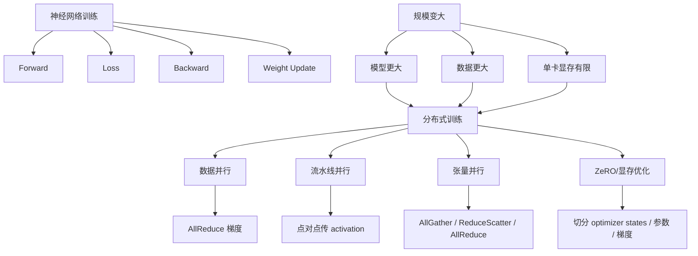
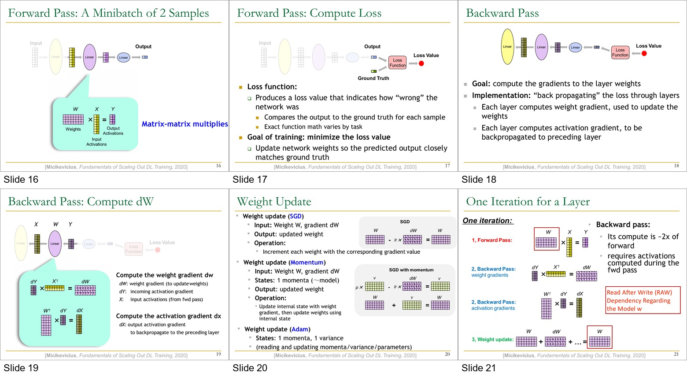
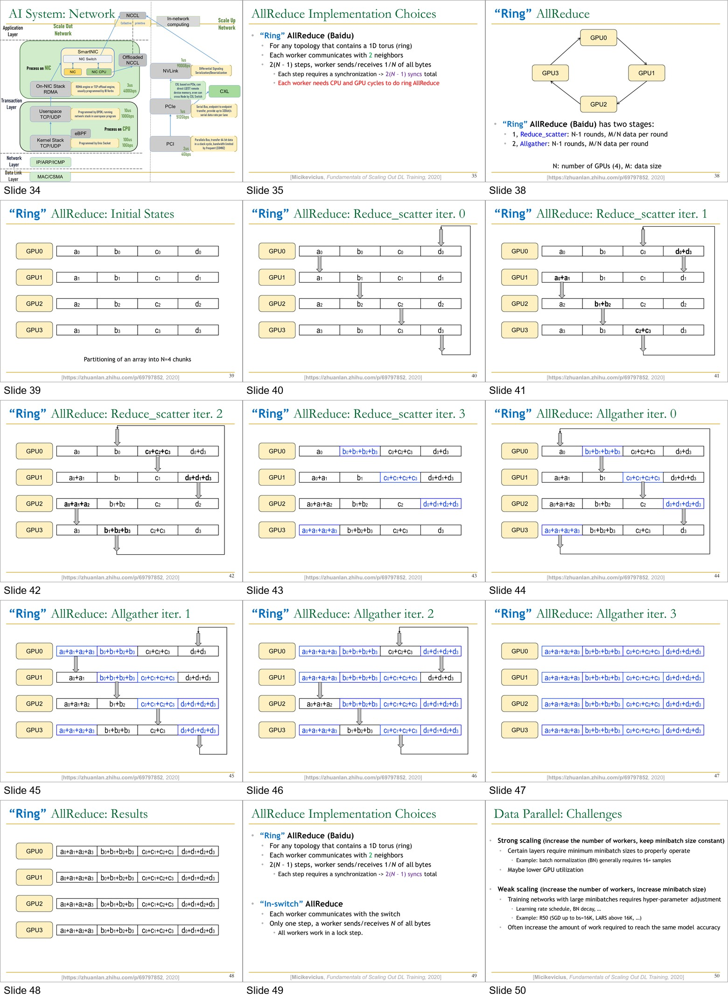
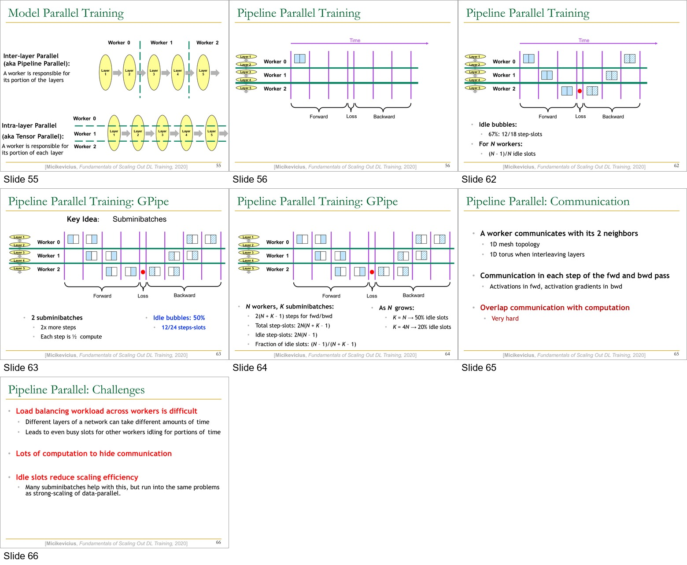
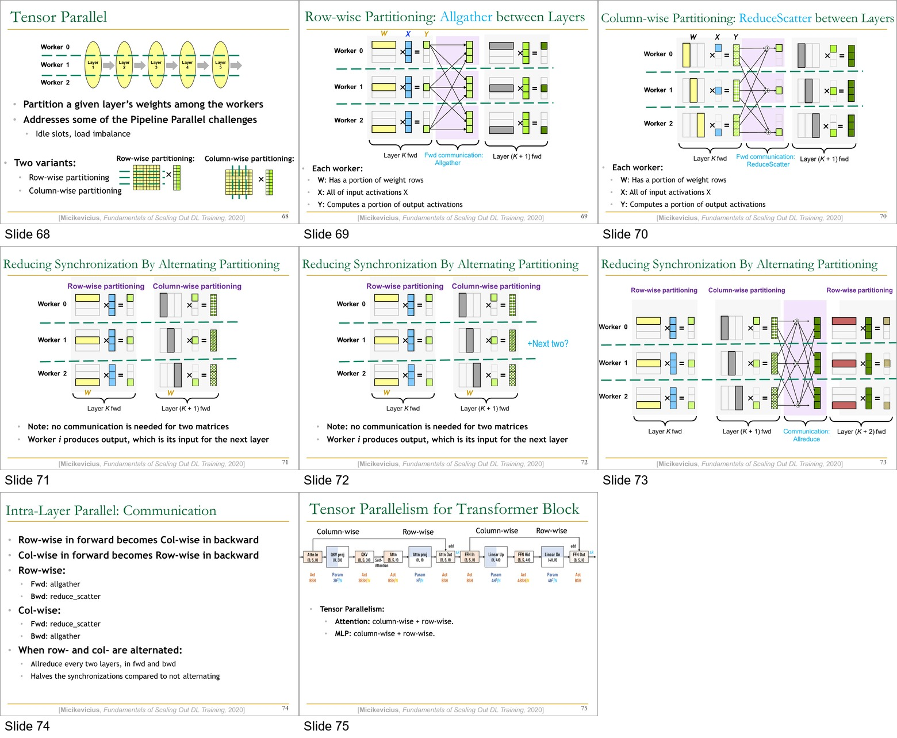
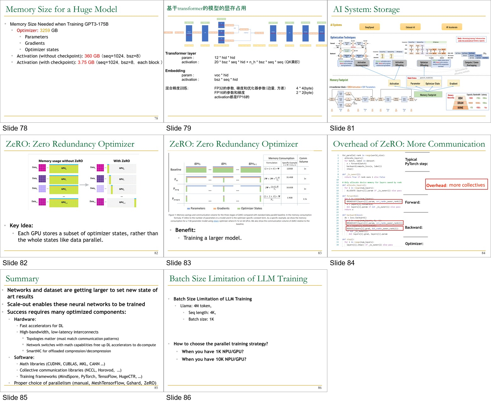

# Lecture 14: Parallel Training 完整讲义

来源课件：`14-parallel-training.pptx`  
课件页数：86 页  
本讲主题：深度学习/大模型训练为什么需要分布式并行，以及数据并行、流水线并行、张量并行、ZeRO 等方法如何解决算力、通信和显存瓶颈。

我已将 PPT 图像导出到：

- `14_parallel_training_slides_png/`：86 页逐页原图。
- `14_parallel_training_contact_sheets/`：按章节拼接的总览图。
- `14_parallel_training_key_sheets/`：关键公式、通信和显存图的放大拼图。

本讲图非常重要，下面的讲解会把文字和图一起解释。你可以一边读讲义，一边打开对应页图。

---

## 0. 先建立整节课的主线

这节课不是单纯讲“怎么多用几张 GPU”。它真正想讲的是：

1. 神经网络训练本质上由 forward、loss、backward、weight update 组成。
2. 模型、数据集和显存需求越来越大，单卡已经装不下或算不动。
3. 分布式训练要同时处理三个问题：
   - 算力如何分摊；
   - 模型/激活/梯度/优化器状态如何放进显存；
   - 多个 GPU/NPU 之间如何通信。
4. 不同并行方式对应不同通信模式：
   - 数据并行：主要做梯度 AllReduce。
   - 流水线并行：相邻 stage 传 activation 和 activation gradient。
   - 张量并行：层内做 AllGather、ReduceScatter、AllReduce。
   - ZeRO：减少显存冗余，但增加 collective 通信。
5. 大规模训练能不能跑起来，取决于硬件互连、通信库、框架、并行策略和内存优化的共同设计。

一张简化总图：



---

## 1. Slides 1-8：从 AI 芯片系统回顾进入并行训练

### Slide 1：课程标题

标题是 `Computer Arch. & AI System, Lecture 14: Parallel Training`。老师给出的日期是 2026 年 6 月 8 日，授课人为浙江大学 Zeke Wang。

这一页只说明本讲属于“计算机体系结构与 AI 系统”，主题是并行训练。并行训练不是纯算法内容，而是算法、系统、架构、通信、存储共同作用的问题。

### Slide 2：DLP-S 总体结构回顾

PPT 回顾了 Cambricon DLP-S 的整体架构：

- Control Module：
  - IFU：Instruction Fetch Unit，取指单元。
  - IDU：Instruction Decode Unit，译码单元。
- Compute Unit：
  - VFU：Vector Function Unit，向量功能单元。
  - MFU：Matrix Function Unit，矩阵功能单元。
- SRAM Unit：
  - WRAM：Weight RAM，存放权重。
  - NRAM：Neuron RAM，存放神经元/激活。
  - DMA：Direct Memory Access，负责内存直接搬运。

零基础理解：一颗 AI 加速器内部并不是只有“算乘法”的部分。它需要取指、译码、执行、临时存储、搬运数据。深度学习训练里最贵的是矩阵乘法和数据搬运，所以 DLP-S 把权重、激活、矩阵运算和 DMA 都作为专门部件。

### Slide 3：Cambricon DLP ISA 回顾

这一页是指令集表格图。重点不是要背每条指令，而是理解：AI 芯片通常会提供面向神经网络计算的数据搬运、向量运算、矩阵运算、控制等指令。  

ISA 是 Instruction Set Architecture，即“软件能看到的硬件指令接口”。如果把 AI 训练看作软件栈，最底层需要硬件指令支持矩阵乘、向量操作、数据搬运；更上层框架才可能高效训练。

### Slide 4：DLP-M 多核架构回顾

图里显示 DLP-M、DLP-C、DLP-S 的层级关系：

- 一个 DLP-M 由多个 DLP-C 构成。
- 一个 DLP-C 由多个 DLP-S 构成。
- 这是多核处理器的分层结构设计。

零基础类比：一台工厂不是只有一个工人，而是多个车间、每个车间多个工位。DLP-S 是基础工位，DLP-C 是一组工位，DLP-M 是更大的组织。并行训练也遵循类似思想：一个大任务拆给多个计算单元。

### Slide 5：AI Architecture 回顾

这页图把 AI 系统分层：

- Parallel Training：
  - Data parallel
  - Model parallel
  - Pipeline parallel
  - Hybrid parallel
- AI Framework：
  - MindSpore
  - TensorFlow
  - PyTorch
  - PaddlePaddle
  - 等
- AI Runtime：
  - CANN：Compute Architecture for Neural Network，华为昇腾相关运行时。
  - CUDA：Compute Unified Device Architecture，NVIDIA 生态运行时。
  - 计算加速库、芯片算子库、自动化算子开发工具。
- AI Chip：
  - Ascend、GPU、AI IP 和芯片等。

核心思想：并行训练不是框架单独完成的，也不是芯片单独完成的。框架决定模型图和并行策略，runtime 决定算子如何执行和通信，芯片/互连决定实际吞吐和延迟。

### Slide 6：MindSpore 回顾

这页展示 MindSpore 的系统结构，涉及：

- Model Zoo：模型库。
- MindSpore Extend：扩展领域，例如 GNN、深度概率编程、强化学习、微分方程。
- MindData：数据处理。
- MindExpression：前端表达。
- MindCompiler：编译器，包含类型推导、自动微分、自动并行、内存优化、图算融合、流水线执行、二阶优化、量化/剪枝等。
- MindIR：中间表示。
- MindAKG：算子自动生成。
- MindRT：运行时，支持分布式 DAG 并行执行。
- 后端：CANN 昇腾、CUDA、Eigen、Android、iOS 等。
- MindInsight：网络调试、精度调优、性能调优。
- MindArmour：安全、可信 AI。

课件备注中的重点包括：

- 自动并行：整图切分、感知集群拓扑、实现通信开销最小，融合数据并行与模型并行。
- 二阶优化：利用二阶信息修正梯度更新方向，寻找更优下降路径，加速收敛。
- 动静态图结合：统一自动微分引擎支持动/静态图，一行代码完成模式切换，兼顾开发效率和执行效率。
- AI+科学计算：拓展 MindSpore 应用边界。

这页和后面的并行训练关系很强：自动并行就是希望框架自动决定哪些维度切、怎么通信、怎么映射到设备。

### Slide 7：关键技术 4：AI + 科学计算

PPT 说科学计算的核心问题常常是微分方程求解，算力消耗巨大；传统大规模求解器多年垄断 Gordon Bell 奖。近年结合 AI 方法成为趋势。

图中对比：

- 传统数值方法：
  - 需要求解高维微分方程；
  - 计算量大；
  - 边界条件复杂；
  - 求解不稳定。
- AI 方法：
  - 用非线性拟合替代显式求解；
  - 神经网络模拟；
  - 不需要直接处理复杂边界条件。

业界状态：

- TensorFlow：通过众筹/生态方式构建 AI 求解模型，在典型应用领域取得突破；但面向 DNN 的自动微分在计算高阶微分时效率偏低。
- NVIDIA：支持高精度计算，构建 cuBLAS、cuFFT 等基础数学库；上层依赖 TensorFlow，因此会继承部分上层框架限制。

这页说明 AI 系统不只是做 CV/NLP，也开始进入科学计算；这会进一步推高模型和数据规模，推动并行训练。

### Slide 8：Where Are We?

图中红框标出当前位置：并行训练属于大 AI 系统图谱中的 Model Training / Parallel Training 部分。  

你可以把本讲定位为：前面课程讲过芯片、ISA、缓存、GPU、加速器、框架，现在进入训练系统中的“如何把训练扩展到很多设备”。

---

## 2. Slides 9-21：神经网络训练基础

关键图拼接：



### Slide 9：AI System 的四个组件

PPT 用菱形图表示 Model Training 周围有四个系统组件：

- Computing：计算。
- Storage：存储。
- Networking：网络通信。
- Compiling：编译。

并行训练同时依赖这四件事：

- 计算决定每张卡能多快做矩阵乘。
- 存储决定模型参数、激活、梯度、优化器状态能否放下。
- 网络决定 GPU/NPU 之间交换梯度和激活的成本。
- 编译决定计算图如何切分、调度、融合、重排。

### Slide 10：训练流程示例

PPT 用 3 个 Linear 层的网络介绍训练：

1. 从随机初始化的权重开始。
2. 每次取一个 minibatch 训练样本，反复迭代：
   - Forward pass：前向传播。
   - Backward pass：反向传播。
   - Weight update：权重更新。

零基础理解：

- 权重一开始是随机的，所以模型预测很差。
- 每轮训练先预测，再计算预测错了多少，再根据错误方向修改权重。
- minibatch 是一小批样本，不是一条样本，也不是整个数据集。这样可以提高矩阵计算效率，并让梯度估计更稳定。

### Slide 11：3 个线性层网络

每一层都有：

- Input：输入向量。
- Output：输出向量。
- Learned parameters：可学习参数，即 projection matrix / 权重矩阵。
- Operations：
  1. 输入向量乘以矩阵。
  2. 应用逐点非线性函数，例如 ReLU。

如果一层是 `Y = ReLU(WX)`，那么：

- `X` 是输入激活。
- `W` 是权重。
- `Y` 是输出激活。
- ReLU 是逐元素函数：负数变 0，正数保留。

为什么需要非线性？如果神经网络只有很多线性层，多个线性变换叠起来仍然只是一个线性变换，表达能力很弱。ReLU 等非线性让模型能拟合复杂函数。

### Slides 12-14：前向传播

图逐步展示输入经过第 1、2、3 个 Linear 层，最后得到 output。  

前向传播的含义：

```text
X0 -> Layer1 -> X1 -> Layer2 -> X2 -> Layer3 -> Y
```

每层都做矩阵乘和非线性。最终输出 `Y` 用来和真实标签比较。

### Slides 15-16：minibatch 把矩阵-向量乘变成矩阵-矩阵乘

Slide 15 先对比：

- minibatch 为 1 时，每层是 matrix-vector multiply。
- minibatch 为 2 或更多时，可以把多个样本的输入堆成矩阵，变成 matrix-matrix multiply。

Slide 16 图中写：

```text
W x X = Y
Weights x Input Activations = Output Activations
Matrix-matrix multiplies
```

这里要非常重视矩阵形状：

- `W`：权重矩阵，例如形状 `[输出维度, 输入维度]`。
- `X`：输入激活矩阵，包含多个样本，例如 `[输入维度, batch_size]`。
- `Y`：输出激活矩阵，例如 `[输出维度, batch_size]`。

为什么矩阵-矩阵乘重要？GPU/NPU 最擅长 GEMM。batch 越大，计算越规整，硬件利用率通常越高。但 batch 太大会影响收敛和显存。

### Slide 17：计算 Loss

Loss function 的作用：

- 产生一个 loss value，表示网络预测有多“错”。
- 对每个样本，把输出和 ground truth 比较。
- 精确函数取决于任务：
  - 分类常用 cross entropy。
  - 回归常用 MSE。
  - 语言模型常用 token-level cross entropy。

训练目标：minimize the loss value。也就是更新网络权重，让预测输出尽可能接近真实答案。

### Slide 18：反向传播

Backward pass 的目标：计算每层权重的梯度。

PPT 写了两件事：

- 每一层计算 weight gradient，用于更新权重。
- 每一层计算 activation gradient，用于继续往前一层反传。

零基础理解：

- weight gradient：告诉我们“这个权重应该往哪个方向改，loss 会下降”。
- activation gradient：告诉前一层“你输出给我的激活对最终错误有多大影响”。

反向传播从 loss 开始，沿着网络反方向传回输入端。

### Slide 19：反向传播中的两个核心矩阵乘

这一页图非常关键。对一层 `Y = W X`，反向传播有两个计算：

1. 权重梯度：

```text
dW = dY x X^T
```

- `dW`：weight gradient，用于更新权重。
- `dY`：从后一层传来的 activation gradient。
- `X`：前向传播时保存的输入激活。

2. 输入激活梯度：

```text
dX = W^T x dY
```

- `dX`：传给前一层的 activation gradient。
- `W^T`：权重矩阵转置。
- `dY`：当前层输出端收到的梯度。

这一页还暗示了一个训练系统问题：反向传播需要前向传播时的激活 `X`。所以训练不能只存参数，还要存很多 activation。后面显存分析中 activation 会成为巨大开销。

### Slide 20：权重更新

PPT 对比了三类优化器：

#### SGD

输入：

- 权重 `W`
- 梯度 `dW`

输出：

- 更新后的权重

操作：

```text
W_new = W - lr * dW
```

其中 `lr` 是 learning rate，学习率。PPT 写成“Increment each weight with corresponding gradient value”，图中实际表达是用梯度乘学习率去更新。

#### Momentum

输入：

- 权重 `W`
- 梯度 `dW`

额外状态：

- 1 份 momentum，大小约等于模型参数量。

思想：

- 不直接只看当前梯度；
- 维护一个速度/动量 `v`；
- 用历史梯度平滑更新方向。

图中大意：

```text
v = μ * v - lr * dW
W = W + v
```

#### Adam

额外状态：

- 1 份 momentum。
- 1 份 variance。

也就是 Adam 通常需要保存一阶矩和二阶矩。对大模型来说，这会让 optimizer states 非常大。后面 ZeRO 就是针对这种冗余做优化。

### Slide 21：一层的一次完整迭代

这一页把训练顺序画成：

1. Forward pass：

```text
Y = W x X
```

2. Backward pass：weight gradients

```text
dW = dY x X^T
```

3. Backward pass：activation gradients

```text
dX = W^T x dY
```

4. Weight update：

```text
W_new = W + update(dW)
```

PPT 强调：

- Backward pass 的计算大约是 forward 的 2 倍。
- Backward 需要 forward 中计算并保存的 activations。
- 存在关于模型权重 `W` 的 RAW dependency：Read After Write。

RAW 依赖是什么意思？下一轮 forward 要读更新后的 `W`，但只有上一轮 backward 和 weight update 写完 `W` 后才能读。所以训练迭代之间不能随便乱序。

---

## 3. Slides 22-26：为什么需要分布式训练

### Slide 22：Outline

本讲大纲：

- Why Distributed Training?
- Data Parallelism
- Model Parallelism
  - Pipeline
  - Intra-layer
- Communication Pattern Review
- Summary

### Slide 23：分布式训练的三类挑战

PPT 列出三类挑战：

1. Model Side：模型越来越大。
   - GPT-3：175B 参数。
   - 推荐模型：最大的已经达到 `O(1B)` 参数。
   - 视觉模型：ResNet、ResNeXt 越来越深、越来越宽。
2. Dataset Side：数据集越来越大。
   - 推荐系统用户行为数据：TB 到 PB。
   - 图像数据：Instagram 1B dataset，JFT 300M images。
3. System Side：单个加速器显存有限。
   - 例如 GPU 显存 80GB。

核心矛盾：模型、数据和中间状态都在增长，但单卡显存和单卡算力增长有限。

### Slide 24：为什么 GPU 显存是 80GB？

这一页是黑底问题页：`Why GPU memory size is 80GB?`

它引导你思考：为什么不是 800GB 或 8TB？原因不是软件不想要，而是硬件受制于 HBM 容量、封装、成本、功耗、带宽、良率等工程约束。AI 训练因此必须面对“单卡显存不够”的现实。

### Slide 25：NVIDIA A100 Block Diagram

图中展示 A100 芯片结构，并标注：

- A100 上有 108 个 cores。
- 完整芯片最多 128 cores。
- 40MB L2 cache。

这页的作用：让你看到现代 GPU 已经非常复杂，单卡算力很强，但显存仍然有限；大模型训练不能只靠“更强的一张卡”。

### Slide 26：解决方向：scale out computing

PPT 再次列出模型、数据、系统挑战，并给出结论：

```text
Solution: scale out computing
```

Scale out 是横向扩展：用更多 GPU/NPU 组成集群。对应的是 scale up：把单个设备做得更强。

分布式训练就是 scale out 在深度学习训练中的实现。

---

## 4. Slides 27-32：数据并行 Data Parallelism

### Slide 27：进入 Data Parallelism

大纲中高亮 Data Parallelism。

### Slide 28：并行训练分类

图中分类：

```text
Parallel Training
├── Data Parallel
└── Model Parallel
    ├── Intra Layer / Tensor
    └── Inter Layer / Pipeline
```

要区分两个核心问题：

- Data Parallel：每张卡都有完整模型，但处理不同数据。
- Model Parallel：模型本身被切开，分到不同卡。

### Slide 29：数据并行定义

每个 worker：

- Model：拥有整个神经网络模型的一份完整拷贝。
- Dataset：负责训练 minibatch 中的一部分数据。

假设有 4 张 GPU，global batch size 是 128，每张 GPU 可以处理 32 个样本。每张 GPU 都有同样的模型参数 `W`，但输入 `X` 不同。

### Slide 30：数据并行前向传播

图中每个 worker 都有：

```text
W x X_i = Y_i
```

其中：

- `W` 是完整模型。
- `X_i` 是 worker i 的部分 minibatch。
- `Y_i` 是这部分样本的输出。

PPT 强调：

- Forward pass：计算自己那部分 minibatch 的 output activations。
- No communication is needed。

为什么前向不需要通信？因为每个 worker 有完整模型，自己的样本可以独立算。

### Slide 31：数据并行反向传播

每个 worker 根据自己的样本计算：

```text
dW_i = dY_i x X_i^T
```

图中 worker 0/1/2/3 分别得到 `dW1, dW2, dW3, dW4`。

PPT 强调：

- 每个 worker 计算自己那部分 minibatch 的 activation gradients。
- 每个 worker 基于自己那部分 minibatch 计算 weight gradient contribution。
- 所有 worker 的梯度贡献必须在 weight update 前求和。

也就是最终要：

```text
dW_global = dW_0 + dW_1 + dW_2 + ... + dW_{N-1}
```

有的实现会求平均：

```text
dW_avg = (dW_0 + dW_1 + ... + dW_{N-1}) / N
```

### Slide 32：数据并行权重更新

PPT 写：

1. 每个 N worker 累积梯度：
   - 从其他 `N-1` 个 peer 收集梯度并求和。
2. 每个 worker 更新自己的模型：
   - 所有 worker 都用合并后的梯度更新模型拷贝。

图中写 `(a+b+c+d)/4`。也就是所有 worker 的梯度平均后，每张卡更新到相同的新权重。这样下一轮训练开始时，所有模型拷贝仍然一致。

数据并行最重要的问题：如何高效做梯度 AllReduce。

---

## 5. Slides 33-49：网络与 AllReduce

关键图拼接：



### Slide 33：回到 AI System 四组件

这页再次显示 Computing、Storage、Networking、Compiling。此时重点转到 Networking，因为数据并行的瓶颈是梯度同步。

### Slide 34：AI System: Network

这页图非常密集，展示从软件到网络硬件的多层栈。

主要元素：

- Scale Out Network：节点之间的网络。
- Scale Up Network：节点内设备之间的高速互连。
- Kernel Stack TCP/UDP：
  - 通过 Unix Socket 编程；
  - 典型延迟/带宽大约图中写 100us / 10Gbps。
- Userspace TCP/UDP：
  - 用 DPDK 等方式在用户态跑网络栈；
  - 图中写约 10us / 100Gbps。
- RDMA：
  - 通过 RDMA engine 或 TCP offload engine；
  - 通常用 IB Verbs 编程；
  - 图中写约 3us / 400Gbps。
- SmartNIC / NIC Switch / Offloaded NCCL：
  - 把部分网络处理或 collective 操作下沉到网卡/交换机。
- NCCL：
  - NVIDIA Collective Communications Library，做 AllReduce、AllGather 等 collective primitive。
- NVLink：
  - 节点内 GPU 高速互连；
  - 图中标注 1us / 900GBps。
- PCIe：
  - 图中标注 1us / 512Gbps。
- PCI：
  - 老式并行总线，图中标注 2us / 4Gbps。
- CXL：
  - 基于 PCIe，可直接 load/store 远端设备内存，甚至通过 CXL switch 跨节点。

这一页想说明：不同通信路径延迟和带宽差异巨大。并行训练性能不仅取决于 GPU 算力，还取决于通信拓扑和通信栈。

### Slide 35：AllReduce 实现选择：Ring AllReduce

PPT 介绍 Baidu Ring AllReduce：

- 适用于包含 1D torus / ring 的任意拓扑。
- 每个 worker 只和 2 个邻居通信。
- 总共 `2(N-1)` 步。
- 每一步每个 worker 发送/接收全部数据的 `1/N`。
- 每一步都需要同步，所以总同步次数是 `2(N-1)`。
- 每个 worker 需要 CPU 和 GPU cycles 来做 Ring AllReduce。

几个术语：

- AllReduce：所有 worker 各自有一份向量，先 reduce 求和/平均，再把结果发给所有 worker。
- Ring：把 N 个 worker 排成环，每个 worker 只和左邻右舍通信。
- N：GPU 数量。
- M：数据大小。

### Slides 36-38：Ring AllReduce 两个阶段

图中 4 个 GPU 构成环：

```text
GPU0 -> GPU1 -> GPU2 -> GPU3 -> GPU0
```

Ring AllReduce 有两个阶段：

1. Reduce_scatter：
   - N-1 轮；
   - 每轮传 `M/N` 数据；
   - 结果是每个 GPU 得到一块已经 reduce 完成的数据。
2. Allgather：
   - N-1 轮；
   - 每轮传 `M/N` 数据；
   - 把每个 GPU 手里的完整 reduce 块传播给所有 GPU。

### Slide 39：初始状态

每个 GPU 的数组被分成 4 块：

```text
GPU0: a0 b0 c0 d0
GPU1: a1 b1 c1 d1
GPU2: a2 b2 c2 d2
GPU3: a3 b3 c3 d3
```

目标 AllReduce 结果是每个 GPU 最后都拥有：

```text
a0+a1+a2+a3, b0+b1+b2+b3, c0+c1+c2+c3, d0+d1+d2+d3
```

### Slides 40-43：Reduce_scatter 迭代 0-3

每轮每个 GPU 沿环发送一块给邻居，接收一块并做加法。经过数轮后：

- 某个 GPU 负责得到完整的 a 块和；
- 某个 GPU 负责得到完整的 b 块和；
- 某个 GPU 负责得到完整的 c 块和；
- 某个 GPU 负责得到完整的 d 块和。

以 Slide 43 的结果为例，可以看到蓝框标出的完整求和块：

- GPU0 有 `b0+b1+b2+b3`。
- GPU1 有 `c0+c1+c2+c3`。
- GPU2 有 `d0+d1+d2+d3`。
- GPU3 有 `a0+a1+a2+a3`。

这就是 reduce_scatter：既做 reduce，又把结果 scatter 分散在不同 GPU。

### Slides 44-47：Allgather 迭代 0-3

Allgather 阶段不再求和，而是把已经求和完成的块在环上继续传播。  

每一轮，每个 GPU 把自己已有的完整块发给邻居。经过 `N-1` 轮后，每个 GPU 都收齐所有完整块。

### Slide 48：Ring AllReduce 结果

最终每个 GPU 都有：

```text
a0+a1+a2+a3, b0+b1+b2+b3, c0+c1+c2+c3, d0+d1+d2+d3
```

这就是 AllReduce 的结果。数据并行中，这些块可以代表梯度向量的不同分块。

### Slide 49：Ring AllReduce vs In-switch AllReduce

PPT 对比：

#### Ring AllReduce

- 每个 worker 和 2 个邻居通信。
- `2(N-1)` 步。
- 每步发送/接收 `1/N` 数据。
- 每步同步一次，总同步 `2(N-1)`。

#### In-switch AllReduce

- 每个 worker 和 switch 通信。
- 只有一步。
- worker 发送/接收 `N` of all bytes（PPT 原文如此，表达的是交换机参与聚合，通信模式不同）。
- 所有 worker lock step。

直观理解：Ring 把计算和通信分摊到 GPU/节点上，交换机只转发；In-switch 把 reduce 计算下沉到交换机，可能减少同步和释放加速器，但需要特殊网络硬件支持。

---

## 6. Slides 50-52：数据并行挑战

### Slide 50：Strong scaling 和 Weak scaling

#### Strong scaling

定义：增加 worker 数量，但保持 minibatch size 不变。

问题：

- 每个 worker 分到的本地 batch 更小。
- 有些层需要最小 batch size 才能正常工作，例如 BatchNorm 通常需要 16+ samples。
- GPU 利用率可能下降。

例子：总 batch 是 64，worker 从 4 张变成 16 张，则每张卡从 16 个样本变成 4 个样本。每张卡矩阵乘规模变小，硬件可能吃不满。

#### Weak scaling

定义：增加 worker 数量，同时增加 minibatch size。

问题：

- 大 batch 训练需要调超参数。
- 学习率 schedule、BN decay 等都可能要改。
- 例子：ResNet-50，SGD 可到 batch size 16K，超过 16K 可能需要 LARS。
- 为达到同样模型精度，常常需要更多工作量。

一句话：数据并行简单但不是无限可扩展。通信、batch size、优化稳定性都会限制它。

### Slides 51-52：batch size 增大带来的工作量变化

图中展示 MLPerf v0.7 提交结果：batch size 与达到相同精度所需 epochs 的关系。

PPT 说明：

- Epoch = 1 processing pass through entire dataset。
- batch size 增大后，单步处理样本更多，但可能需要更多 epoch 才达到相同精度。

所以“更大 batch”不一定总是更快。你减少了 step 数，但可能增加了收敛难度。

---

## 7. Slides 53-66：模型并行与流水线并行

关键图拼接：



### Slide 53：进入 Model Parallelism / Pipeline

大纲高亮 Model Parallelism 下的 Pipeline。

### Slide 54：并行分类再强调

Model Parallel 分成：

- Intra Layer / Tensor：层内切分。
- Inter Layer / Pipeline：层间切分。

### Slide 55：模型并行训练

图中对比：

#### Inter-layer Parallel，也叫 Pipeline Parallel

- 一个 worker 负责一部分层。
- 例如 worker 0 负责 layer 1-2，worker 1 负责 layer 3-4，worker 2 负责 layer 5。

#### Intra-layer Parallel，也叫 Tensor Parallel

- 一个 worker 负责每一层的一部分。
- 每层权重被切到多个 worker 上。

流水线并行解决的是“模型层数太多/单卡装不下整模型”的问题；张量并行解决的是“单层太大/矩阵太大”的问题。

### Slides 56-61：朴素流水线并行的时间轴

图中横轴是 Time，纵向是 Worker 0/1/2。每个 worker 对应不同层段。

朴素流水线训练过程：

1. Forward：
   - worker 0 先算前几层。
   - 把 activation 发给 worker 1。
   - worker 1 算中间层。
   - 再发给 worker 2。
2. Loss：
   - 最后一个 worker 计算 loss。
3. Backward：
   - 梯度从后往前传。
   - worker 2 先反传，再发 activation gradient 给 worker 1，再给 worker 0。

图中蓝色块表示 forward 计算，斜线块表示 backward 计算，红点表示 loss。

问题：很多时间槽是空的。某个 worker 正在等前一个 worker 传 activation，或者等后一个 worker 传 gradient。

### Slide 62：Idle bubbles

PPT 给出：

- Idle bubbles：67%，即 `12/18 step-slots`。
- 对 N workers：`(N-1)/N` idle slots。

step-slot 可以理解为“一个 worker 的一个时间槽”。如果 worker 没有活干，这个 step-slot 就是空闲。

N 越大，朴素流水线的气泡越严重。例如 N=4 时空闲比例约 75%。这会让加速器资源浪费。

### Slide 63：GPipe 的关键思想：Subminibatches

GPipe 把 minibatch 再切成多个 subminibatches，也常叫 microbatches。

PPT 示例：

- 2 subminibatches。
- 2x more steps。
- Each step is 1/2 compute。
- Idle bubbles：50%，即 `12/24 step-slots`。

为什么有效？  
原来一个大 batch 只有一个“任务流”穿过 pipeline；切成 microbatch 后，worker 0 在处理第二个 microbatch 时，worker 1 可以同时处理第一个 microbatch，流水线被填得更满。

### Slide 64：GPipe 公式

对 N workers、K subminibatches：

- Forward/backward 总步数：

```text
2(N + K - 1)
```

- Total step-slots：

```text
2N(N + K - 1)
```

- Idle step-slots：

```text
2N(N - 1)
```

- Idle fraction：

```text
(N - 1) / (N + K - 1)
```

当 N 增大时：

- `K = N`，约 50% idle slots。
- `K = 4N`，约 20% idle slots。

直观理解：microbatch 越多，流水线越容易填满；但 microbatch 太多也会带来调度、显存、同步和优化问题。

### Slide 65：流水线并行的通信

PPT 写：

- 一个 worker 与它的两个邻居通信。
  - 1D mesh topology。
  - interleaving layers 时可看作 1D torus。
- forward 和 backward 的每一步都要通信。
  - forward 传 activations。
  - backward 传 activation gradients。
- Overlap communication with computation：Very hard。

为什么难 overlap？因为相邻 stage 有强数据依赖。worker 1 必须等 worker 0 的 activation 才能算；反向也必须等后一个 stage 的 gradient。

### Slide 66：流水线并行挑战

PPT 总结三个挑战：

1. Load balancing workload across workers is difficult。
   - 不同层耗时可能不同。
   - 即使某些 worker 看似 busy，其他 worker 也可能在等。
2. Lots of computation to hide communication。
   - 要想把通信藏在计算后面，需要每个阶段有足够计算量。
3. Idle slots reduce scaling efficiency。
   - subminibatches 能缓解，但会遇到类似数据并行 strong scaling 的问题。

---

## 8. Slides 67-75：张量并行 Tensor Parallelism

关键图拼接：



### Slide 67：进入 Tensor Parallelism

大纲高亮 Model Parallelism 下的 Tensor Parallelism，也就是 intra-layer parallel。

### Slide 68：Tensor Parallel 基本思想

PPT 定义：

- Partition a given layer's weights among the workers。
- 解决一些 Pipeline Parallel 的问题：
  - idle slots；
  - load imbalance。

两种变体：

- Row-wise partitioning。
- Column-wise partitioning。

注意：这里“行切分/列切分”要结合矩阵乘法形状理解。不同教材可能对 W 的摆放方式略有差异，PPT 图中重点是：切分方式决定输出 activation 是否完整，以及下一层是否需要 AllGather/ReduceScatter。

### Slide 69：Row-wise Partitioning：层间 AllGather

PPT 写：

- 每个 worker：
  - `W`：有一部分 weight rows。
  - `X`：有全部 input activations X。
  - `Y`：计算一部分 output activations。
- Forward communication：Allgather。

图中含义：

1. 每个 worker 拿完整输入 `X`。
2. 每个 worker 只持有权重的一部分行。
3. 每个 worker 只能算出输出 `Y` 的一部分。
4. 下一层如果需要完整 `Y`，就要把所有 worker 的 `Y` 部分收集起来。
5. 这个收集操作就是 AllGather。

一句话：行切分让每张卡只产生部分输出，所以层间需要 AllGather 合成完整 activation。

### Slide 70：Column-wise Partitioning：层间 ReduceScatter

PPT 标题写 Column-wise Partitioning: ReduceScatter between Layers。图中有多个 `+`，表示部分结果需要求和。

核心含义：

1. 权重按列方向切分后，每个 worker 只处理输入的一部分贡献。
2. 每个 worker 计算的是对输出的 partial contribution。
3. 完整输出需要把这些 partial contribution 相加。
4. 如果下一层也被切分，不一定需要每个 worker 得到完整输出，而是可以把求和后的结果分散给各 worker。
5. 因此通信模式是 ReduceScatter。

ReduceScatter = reduce + scatter：

- reduce：把多个 partial output 求和；
- scatter：把求和后的不同分块分给不同 worker。

### Slides 71-72：交替切分减少同步

PPT 标题：Reducing Synchronization By Alternating Partitioning。

图中先做 Row-wise partitioning，再做 Column-wise partitioning。PPT 写：

- Note: no communication is needed for two matrices。
- Worker i produces output, which is its input for the next layer。

意思是：如果第 K 层的输出刚好是 worker i 持有的一部分，而第 K+1 层的输入切分方式也刚好需要这部分，那么中间不需要做 AllGather 或 ReduceScatter。

这就是 alternating partitioning 的价值：切分方式交替设计，让连续两层之间的数据布局匹配，减少一次同步。

### Slide 73：每两层需要一次 AllReduce

当继续到下一层时，PPT 图中显示 Communication: Allreduce。

交替切分不是永远不通信。它可以让两层之间不通信，但每两层需要一次 AllReduce 来恢复/同步数据布局。

这页是老师记忆点之一：

- 行切分 + 列切分可以减少层间同步。
- 但会转化为每两层一次 AllReduce。

### Slide 74：Intra-Layer Parallel 通信总结

PPT 总结：

```text
Row-wise in forward becomes Col-wise in backward
Col-wise in forward becomes Row-wise in backward
```

也就是说前向的切分方式，在反向传播中会变成相反方向的问题。

具体通信：

#### Row-wise

- Fwd：allgather。
- Bwd：reduce_scatter。

#### Col-wise

- Fwd：reduce_scatter。
- Bwd：allgather。

#### row 和 col 交替时

- forward 和 backward 中，每两层做一次 AllReduce。
- 相比不交替，同步次数减半。

### Slide 75：Transformer Block 的张量并行

图中展示 Transformer block 中 attention 和 MLP 的张量并行：

- Attention：column-wise + row-wise。
- MLP：column-wise + row-wise。

图里有 Q/K/V projection、attention、linear、FFN 等模块。典型 Transformer 中：

- Attention 里 Q/K/V projection 可以按列切分，让不同 GPU 负责不同 head 或 hidden 分块。
- 后面的 output projection 再按行切分/聚合。
- MLP 中 first linear 扩展 hidden 维度，可以 column-wise；second linear 收回 hidden 维度，可以 row-wise。

Megatron-LM 等大模型张量并行就是利用这种结构：相邻矩阵乘的切分方式设计成匹配，从而减少通信。

---

## 9. Slides 76-77：通信模式总复习

### Slide 76：进入 Communication Pattern Review

大纲高亮 Communication Pattern Review。

### Slide 77：三种并行的通信总结

#### Data Parallel

- AllReduce of weights / gradients。
- Can be overlapped with computation。

准确说，数据并行通常 AllReduce 的是 gradients。因为每个 worker 已有相同权重，反向后需要同步梯度，再更新权重。PPT 写 weights，结合上下文应理解为与模型权重更新相关的梯度/参数同步。

#### Pipeline Parallel

- Point-wise communication of activations and activation gradients。
- Hard to overlap with computation。
- Hard to load-balance。

Point-wise 指相邻 stage 之间点对点通信，不是所有 worker 一起 collective。

#### Tensor Parallel

- AllGather、ReduceScatter of activations and activation gradients。
- 如果 row-wise 和 col-wise 交替，会出现 AllReduce。
- Hard to overlap with computation。

这页是考试/复习最重要的对照表之一。

---

## 10. Slides 78-84：显存、存储与 ZeRO

关键图拼接：



### Slide 78：巨大模型训练需要多少显存

PPT 给出训练 GPT-3 175B 的显存需求：

- Optimizer：3259 GB。
  - Parameters。
  - Gradients。
  - Optimizer states。
- Activation without checkpoint：360 GB，条件是 `seq=1024, bsz=8`。
- Activation with checkpoint：3.75 GB，条件是 `seq=1024, bsz=8, each block`。

重点：显存不是只存参数。

训练显存通常包括：

1. Parameters：模型参数。
2. Gradients：参数梯度。
3. Optimizer states：优化器状态，例如 Adam 的 momentum 和 variance。
4. Activations：前向传播保存的中间激活，反向传播要用。
5. 临时 buffer、通信 buffer、碎片等。

Activation checkpointing 的思想：前向时少存一些 activation，反向时需要时重新计算。它用更多计算换更少显存。

### Slide 79：基于 Transformer 的模型显存占用

PPT 给出公式：

#### Transformer layer

参数量：

```text
param = 12 * hid * hid
```

这里 `hid` 是 hidden size。Transformer 一层通常包含 attention 的 Q/K/V/O 投影和 MLP 两个线性层。粗略估计参数量与 `hid^2` 成正比。

激活量：

```text
activation = 20 * bsz * seq * hid + n_h * bsz * seq * seq
```

其中：

- `bsz`：batch size。
- `seq`：sequence length。
- `hid`：hidden size。
- `n_h`：number of heads。
- `n_h * bsz * seq * seq` 来自 QK 乘积，即 attention score 矩阵。

为什么 `seq^2` 可怕？  
如果 sequence length 翻倍，attention score 显存大约变 4 倍。这是长上下文训练很吃显存的重要原因。

#### Embedding

参数量：

```text
param = voc * hid
```

其中 `voc` 是 vocabulary size。

激活量：

```text
activation = bsz * seq * hid
```

#### 混合精度训练

PPT 写：

- FP32 的参数、梯度和优化器参数（动量、方差）：`4 * 4 byte`。
- FP16 的参数和梯度：`2 * 2 byte`。
- activation 都是 FP16。

这句话表达混合精度训练时，同一个参数可能同时存在 FP16 和 FP32 版本，并且还要存梯度和优化器状态。以 Adam 为例，常见开销包括：

- FP16 参数。
- FP16 梯度。
- FP32 master parameter。
- FP32 gradient 或累积梯度。
- FP32 momentum。
- FP32 variance。

所以大模型显存常常被 optimizer states 吃掉。

### Slide 80：再次回到 AI System 四组件

这页把关注点转到 Storage。

### Slide 81：AI System: Storage

图中展示了多个大模型系统/框架和内存优化技术，例如：

- DeepSpeed。
- Colossal-AI。
- HF Accelerate。
- Activation recomputation。
- Activation offloading。
- Optimizer offloading。
- Compute/communication overlapping。
- Memory footprint。
- 不同存储层级：HBM、DRAM、NVMe。

核心思想：

- HBM 快但贵且容量小。
- DRAM 容量更大但慢。
- NVMe 容量更大但更慢。
- 大模型训练会把参数、梯度、optimizer states、activation 在不同层级之间调度。

### Slide 82：ZeRO 的核心思想

ZeRO = Zero Redundancy Optimizer。

PPT Key Idea：

```text
Each GPU stores a subset of optimizer states, rather than the whole states like data parallel.
```

普通数据并行中，每张 GPU 都存一整份：

- parameters；
- gradients；
- optimizer states。

这造成巨大冗余。ZeRO 的思想是把这些状态切分到不同 GPU 上，每张卡只存一部分，从而减少每卡显存。

### Slide 83：ZeRO 的阶段和收益

图中展示 ZeRO 相比 baseline 的内存消耗。常见理解：

- Baseline：每张卡都有完整参数、完整梯度、完整优化器状态。
- `P_os` / ZeRO stage 1：切分 optimizer states。
- `P_os+g` / ZeRO stage 2：切分 optimizer states 和 gradients。
- `P_os+g+p` / ZeRO stage 3：进一步切分 parameters。

PPT 写 Benefit：

```text
Training a larger model.
```

也就是 ZeRO 不是为了减少总计算量，而是为了降低每张卡的显存压力，让更大模型能训练。

### Slide 84：ZeRO 的代价：更多通信

PPT 标题：Overhead of ZeRO: More Communication。

图中伪代码旁边红框标出：

- Forward 中需要 broadcast/gather layer 参数。
- Backward 中需要 reduce/scatter 或相关 collective。
- Optimizer 阶段也会有额外同步。

ZeRO 的本质 tradeoff：

- 好处：每张 GPU 存的模型状态更少。
- 代价：需要更多 collective 通信，因为某张卡要计算某层时，可能临时需要从其他卡拿参数或汇总梯度。

一句话：ZeRO 用通信换显存。

---

## 11. Slides 85-86：总结与开放问题

### Slide 85：Summary

PPT 总结：

- Networks and dataset are getting larger to set new state of art results。
- Scale-out enables these neural networks to be trained。
- 成功需要很多优化组件。

#### Hardware

- Fast accelerators for DL。
- High-bandwidth, low-latency interconnects。
- Topologies matter，必须匹配通信模式。
- Network switches with math capabilities 能释放 DL accelerators，让加速器专注计算。
- SmartNIC for offloaded compression/decompression。

#### Software

- Math libraries：
  - CUDNN、CUBLAS、MKL、CANN 等。
- Collective communication libraries：
  - NCCL、Horovod 等。
- Training frameworks：
  - MindSpore、PyTorch、TensorFlow、HugeCTR 等。
- Proper choice of parallelism：
  - manual、MeshTensorFlow、GShard、ZeRO。

这页真正的结论：分布式训练是系统工程。算法模型、并行方式、通信库、网络拓扑、显存管理、框架编译都必须配合。

### Slide 86：LLM 训练的 batch size 限制

PPT 给出：

- Llama：4M token。
- Seq length：4K。
- Batch size：1K。

然后提出问题：

- 当你有 1K NPU/GPU，如何选择并行训练策略？
- 当你有 10K NPU/GPU，如何选择并行训练策略？

这不是让你给唯一答案，而是引导你综合考虑：

- 数据并行能否继续增大 batch？
- 单卡显存是否能放下参数/activation/optimizer states？
- 是否需要 tensor parallel 切单层？
- 是否需要 pipeline parallel 切层？
- 是否需要 ZeRO 减少状态冗余？
- 通信拓扑是否能承受 AllReduce / AllGather / ReduceScatter？

---

## 12. 三种并行方式的最终对比

| 并行方式 | 切分对象 | 每卡是否有完整模型 | 主要通信 | 优点 | 难点 |
|---|---|---:|---|---|---|
| 数据并行 Data Parallel | 数据/minibatch | 是 | 梯度 AllReduce | 最简单，适合扩展吞吐 | batch size、AllReduce、收敛问题 |
| 流水线并行 Pipeline Parallel | 层/模型 stage | 否 | 相邻 stage 传 activation / activation gradient | 可训练层数多、模型大 | idle bubbles、负载均衡、通信难隐藏 |
| 张量并行 Tensor Parallel | 单层权重矩阵/hidden 维 | 否 | AllGather、ReduceScatter、AllReduce | 解决单层太大 | 通信频繁、与模型结构强相关 |
| ZeRO | optimizer states/gradients/parameters | 取决于 stage | broadcast、reduce-scatter、all-gather 等 | 显著降低每卡显存 | 更多通信和调度复杂度 |

---

## 13. 你必须掌握的通信原语

### AllReduce

所有 worker 都有一份数据，先做 reduce，再让所有 worker 都得到结果。

例子：

```text
GPU0: a0
GPU1: a1
GPU2: a2
GPU3: a3

AllReduce sum 后：
GPU0/GPU1/GPU2/GPU3 都有 a0+a1+a2+a3
```

数据并行梯度同步最常见。

### ReduceScatter

先 reduce，再把结果分片 scatter 给不同 worker。

例子：

```text
求和后有 [A_sum, B_sum, C_sum, D_sum]
GPU0 得 A_sum
GPU1 得 B_sum
GPU2 得 C_sum
GPU3 得 D_sum
```

Ring AllReduce 第一阶段就是 reduce_scatter。

### AllGather

每个 worker 有一片数据，把所有片收集到每个 worker。

例子：

```text
GPU0 有 A
GPU1 有 B
GPU2 有 C
GPU3 有 D

AllGather 后：
每个 GPU 都有 [A,B,C,D]
```

Ring AllReduce 第二阶段就是 allgather。

### Point-to-point

不是所有 worker 一起通信，而是相邻两个 worker 通信。流水线并行中常见。

---

## 14. 从零开始的直观例子

假设训练一个很大的 Transformer，有 8 张 GPU。

### 只用数据并行

- 每张 GPU 都放完整模型。
- 每张 GPU 处理 batch 的 1/8。
- 反向传播后做一次梯度 AllReduce。
- 如果模型太大，单张 GPU 放不下，数据并行失败。

### 加上张量并行

- 把每层大矩阵切到多张 GPU。
- 每张 GPU 只算一部分矩阵乘。
- 层间要 AllGather 或 ReduceScatter。
- 适合单层矩阵很大的 Transformer。

### 加上流水线并行

- 把 Transformer 的层分成几段。
- 每段放到不同 GPU 组上。
- microbatch 穿过 pipeline。
- 适合层数很多、整模型太大的情况。

### 加上 ZeRO

- 把 optimizer states、gradients、甚至 parameters 切开存。
- 每张 GPU 显存压力下降。
- 但每步需要更多通信。

真实大模型训练通常不是单选，而是混合并行：

```text
Data Parallel + Tensor Parallel + Pipeline Parallel + ZeRO
```

---

## 15. 本讲最容易混淆的点

1. 数据并行不是把模型切开，而是每张卡都有完整模型。
2. 模型并行不是处理不同数据，而是把模型本身切开。
3. Pipeline parallel 切的是层，Tensor parallel 切的是层内矩阵。
4. AllReduce 最终每个 worker 都有完整 reduce 结果。
5. ReduceScatter 最终每个 worker 只有一片 reduce 结果。
6. AllGather 最终每个 worker 都有所有片。
7. Row-wise forward 需要 AllGather，backward 变成 ReduceScatter。
8. Column-wise forward 需要 ReduceScatter，backward 变成 AllGather。
9. 交替 row/col 可以减少同步，但不是无通信，而是每两层 AllReduce。
10. ZeRO 省显存，但会增加通信。
11. Activation 显存可能很大，尤其 Transformer attention 中有 `seq^2` 项。
12. 大 batch 不一定等于更快收敛，可能需要更多 epoch 或复杂调参。

---

## 16. 一页纸复习版

这节课可以压缩成下面这条链：

```text
训练一层：
Y = W X
dW = dY X^T
dX = W^T dY

训练一轮：
forward -> loss -> backward -> weight update

为什么分布式：
模型大 + 数据大 + 单卡显存有限

数据并行：
每卡完整模型 + 不同数据
forward 无通信
backward 后梯度 AllReduce

Ring AllReduce：
reduce_scatter N-1 轮
allgather N-1 轮
总共 2(N-1) 步

流水线并行：
按层切模型
相邻 worker 传 activation / gradient
问题是 idle bubbles 和负载均衡
GPipe 用 subminibatches 减少气泡

张量并行：
按层内矩阵切权重
row-wise: fwd AllGather, bwd ReduceScatter
col-wise: fwd ReduceScatter, bwd AllGather
交替 row/col: 每两层 AllReduce，同步次数减半

显存：
参数 + 梯度 + optimizer states + activation
Transformer activation 含 seq^2 项
ZeRO 切 optimizer/gradient/parameter 冗余，用通信换显存
```

---

## 17. 自测题

### 题 1

为什么数据并行的 forward pass 通常不需要通信，而 backward pass 后需要通信？

答案：因为每个 worker 都有完整模型，可以独立对自己的数据做前向；但每个 worker 只基于自己的 minibatch 子集计算梯度，最终更新模型前必须把所有 worker 的梯度求和/平均，所以需要 AllReduce。

### 题 2

Ring AllReduce 为什么分成 ReduceScatter 和 AllGather 两阶段？

答案：ReduceScatter 先把每个分块的求和结果分散到不同 worker 上，AllGather 再把这些已经求和完成的分块传播给所有 worker。这样每步只传 `1/N` 数据，并沿 ring 分摊通信。

### 题 3

流水线并行中的 idle bubble 是什么？

答案：某些时间槽中 worker 因为等待前一 stage 的 activation 或后一 stage 的 gradient 而无事可做，这些空闲时间槽就是 idle bubbles。

### 题 4

GPipe 为什么要把 minibatch 切成 subminibatches？

答案：为了让多个 microbatch 错峰通过 pipeline，使不同 worker 在同一时间处理不同 microbatch，从而减少 idle bubbles，提高 pipeline 利用率。

### 题 5

Row-wise partitioning 在 forward 中为什么需要 AllGather？

答案：因为每个 worker 只持有一部分权重行，只能算出输出 activation 的一部分。下一层如果需要完整输入，就要把各 worker 的输出片段收集到一起，因此需要 AllGather。

### 题 6

Column-wise partitioning 在 forward 中为什么需要 ReduceScatter？

答案：因为列切分后每个 worker 计算的是输出的部分贡献，完整输出需要把不同 worker 的 partial results 求和。如果下一层只需要某个分片，就可以边求和边分发，因此是 ReduceScatter。

### 题 7

ZeRO 的核心 tradeoff 是什么？

答案：ZeRO 减少每张 GPU 上 optimizer states、gradients、parameters 的冗余存储，降低显存占用；但因为数据被切分，计算时需要更多 broadcast、allgather、reduce-scatter 等 collective 通信。

### 题 8

为什么 Transformer 的 activation 显存和 sequence length 强相关？

答案：attention 中有 QK 乘积，会产生与 `seq x seq` 相关的 attention score 矩阵。PPT 公式里有 `n_h * bsz * seq * seq` 项，所以 sequence length 增大时显存可能平方增长。

---

## 18. 学习建议

如果你是零基础，建议按下面顺序复习：

1. 先完全弄懂 Slides 16-21 的矩阵乘和反向传播公式。
2. 再学数据并行 Slides 29-32，理解为什么要 AllReduce。
3. 单独花时间看 Slides 39-48，手动追踪 Ring AllReduce 中 a/b/c/d 四块怎么移动。
4. 学流水线 Slides 56-64，重点理解时间轴和 idle bubbles。
5. 学张量并行 Slides 68-75，重点记住 row-wise/col-wise 的通信对照。
6. 最后看 Slides 78-84，理解显存组成和 ZeRO 为什么有用。

学会这节课的标志不是能背名词，而是看到一个大模型训练配置时，你能回答：

- 模型为什么需要切？
- 数据为什么需要并行？
- 梯度在哪里同步？
- activation 在哪里传？
- 参数/优化器状态放在哪里？
- 通信会不会成为瓶颈？
