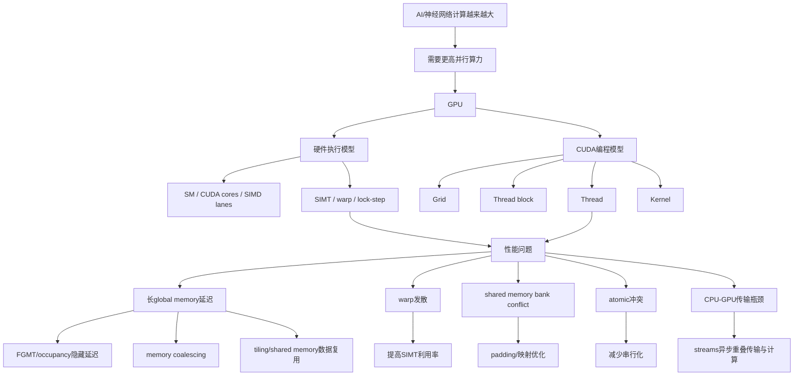
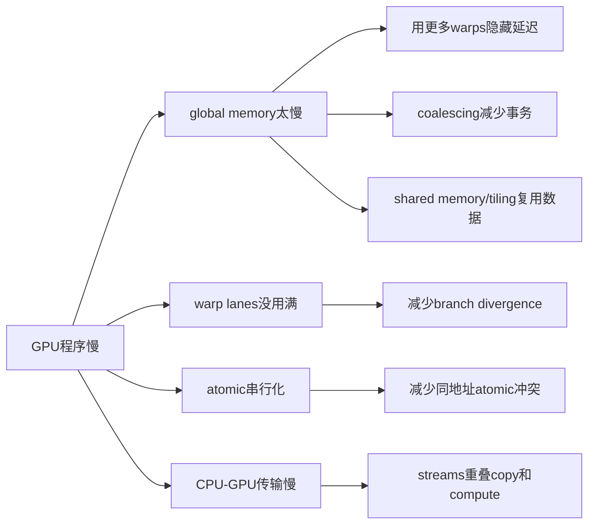

# Lecture 6-7: GPU Architecture and GPU Optimization 完整零基础讲义

来源课件：`6-gpus-architecture.pptx`、`7-gpus-optimization.pptx`

课件页数：Lecture 6 共 91 页；Lecture 7 共 120 页。

本讲主题：GPU 为什么适合 AI 计算，GPU 的硬件执行模型和 CUDA 编程模型如何对应，以及如何围绕 memory、warp、shared memory、divergence、atomic、CPU-GPU transfer 做性能优化。

本地提取与核对文件：

- `extracted/6-gpus-architecture_raw_extract.md`：第 6 讲完整原始抽取。
- `extracted/7-gpus-optimization_raw_extract.md`：第 7 讲完整原始抽取。
- `extracted/gpu_6_7_slide_digest.md`：两份课件的逐页精简索引，保留每页文字、表格、代码、备注和媒体引用。
- `extracted/6-gpus-architecture_slides/`：第 6 讲 91 页逐页 PNG。
- `extracted/7-gpus-optimization_slides/`：第 7 讲 120 页逐页 PNG。
- `extracted/contact_sheets/`：两份课件的缩略图总览与低文本图片页核对图。

这份讲义的目标不是“总结一下”，而是把 PPT 中每个概念放回完整知识体系里，让零基础同学能读懂 GPU 为什么这样设计、CUDA 程序为什么这样写、优化为什么有效。

---

## 0. 两节课的总主线

这两节课可以合成一个逻辑闭环：

1. Lecture 6 先回答“GPU 是什么、为什么需要 GPU、GPU 怎么执行程序”。
2. Lecture 7 再回答“既然 GPU 这么执行程序，程序应该怎样写才快”。
3. 第 6 讲偏架构：CPU、GPU、FPGA 的定位；GPU many-core；CUDA grid/block/thread；SIMT/warp；branch divergence。
4. 第 7 讲偏优化：global memory 延迟、occupancy、memory coalescing、shared memory bank conflict、tiling、atomic、CUDA streams。
5. 两讲共同核心是：GPU 的软件抽象是很多 scalar threads，硬件本质上却用 SIMD/SIMT pipeline 批量执行这些 threads。

一张总图：



---

## 1. 零基础前置概念

### 1.1 CPU、GPU、FPGA 到底有什么区别

CPU 是通用处理器，擅长复杂控制、分支、操作系统、串行任务。它的核心数量少，但每个核心很复杂，有强大的 cache、乱序执行、分支预测等机制。CPU 的设计目标是让各种程序都能较快运行，尤其是单线程或中等并行度的程序。

GPU 是吞吐量处理器，擅长把同一种操作同时施加到大量数据上。它有很多简单执行单元，cache 相对小，更依赖大量线程和高带宽内存来支撑吞吐。AI 训练和推理里有大量矩阵乘、向量加、卷积、归约等数据并行任务，所以 GPU 很合适。

FPGA 是可编程硬件。它不像 CPU/GPU 那样固定执行一套指令流水线，而是可以把硬件电路结构配置成适合某个应用的形式。优点是可定制、可探索架构，缺点是频率较低、开发复杂。

第 6 讲 Slide 19 用表格比较了当代 CPU、GPU、FPGA：

| 设备 | 并行资源 | 算力 | 内存 | PCIe | 网络 |
|---|---:|---:|---:|---:|---|
| AMD Threadripper 3995WX CPU | 64 cores / 128 threads | FP32 2.8 TFLOPS，FP64 1.4 TFLOPS | 512GB，80GB/s | PCIe 4.0 x16 32GB/s | 无 |
| NVIDIA H100 GPU | 18432 CUDA cores，约 128K threads | FP32 67T，FP64 34T，Tensor FP32 989T，Tensor FP16 1979T | 80GB，3350GB/s | PCIe 5.0 x16 64GB/s | 无 |
| Xilinx U280 FPGA | 9024 个 25x18 乘法器 | FP32 1.8 TFLOPS | 40GB，460GB/s | PCIe 4.0 x8 16GB/s | 有 |

重点不是死背数字，而是看趋势：GPU 的计算吞吐和显存带宽远高于 CPU，但显存容量远小于 CPU 主存，CPU-GPU 之间的 PCIe 带宽又远低于 GPU 内部 HBM 带宽。

### 1.2 什么叫 latency、bandwidth、throughput

Latency 是一次操作从发出到完成的等待时间。比如访问寄存器可能约 1 cycle，访问 shared memory/L1 约几 cycle，访问 global memory 可能数百 cycle。

Bandwidth 是单位时间能搬多少数据。比如 HBM 可能达到 TB/s 级，PCIe 通常只有几十 GB/s。GPU 依赖高带宽，因为它要同时喂饱大量并行计算单元。

Throughput 是总体吞吐能力。GPU 优化常常不追求让单个 thread 的 latency 极低，而是让大量 warp 交错执行，让整体吞吐高。

### 1.3 为什么内存层次会反复出现

第 6 讲一开始回顾 memory，是因为 GPU 架构和优化基本都围绕内存展开。PPT 给出的粗略层次是：

| 层次 | 大小 | 延迟 | 带宽/特点 |
|---|---:|---:|---|
| SRAM | 约 10MB | 约 1ns | 片上，快，贵，容量小 |
| HBM | 约 10GB | 约 100ns | GPU/AI 芯片常用，高带宽 |
| DDR | 约 100GB | 更高 | CPU 主存容量大、带宽低于 HBM |
| SSD | 约 1TB | 约 us/ms 级 | 容量大但延迟高 |
| Disk | 约 10TB | 更慢 | 持久化存储 |

PPT 的一个重要结论是：memory optimization 主要追求 size 和 bandwidth，不是单纯降低 latency。尤其是 DRAM/HBM，单次访问延迟不容易变成寄存器那么低，所以更实际的是提高命中率、合并访问、复用数据、隐藏延迟。

---

## 2. Lecture 6: GPU Architecture

### 2.1 Slides 1-14：从内存回顾进入 GPU

Slide 1 是课程标题：`AI Chip & Systems, Lecture 6: Graphics Processing Units`，授课人为浙江大学 Zeke Wang，日期为 2026 年 4 月 9 日。

Slides 2-13 复习存储层次：SRAM、HBM、DDR、SSD、Disk 的容量、延迟、带宽差异。这里要理解一个核心事实：AI 计算不仅缺算力，也缺“把数据及时送到算力单元”的能力。GPU 的核心优势之一就是 HBM 带来的超高内存带宽。

Slide 3 比较 Flip-Flops、SRAM、DRAM、Flash：

- Flip-Flops：极快、可并行访问，但每 bit 需要很多晶体管，极贵，只适合很少量状态。
- SRAM：较快，常用作 cache、shared memory、AI accelerator on-chip buffer；通常 6T cell，容量有限。
- DRAM：密度高、便宜，但电容会漏电，需要 refresh；读操作会破坏内容，需要恢复。
- Flash/SSD：容量大、非易失，但访问慢，适合持久存储，不适合直接喂计算核心。

Slide 4 强调 SRAM 的目标：在片上缓存数据，减少外部内存访问。SRAM 的优点是 random access 仍然高性能，缺点是容量小。GPU 中 shared memory 本质上就是一种显式管理的片上 SRAM/scratchpad。

Slides 5-8 继续说明：CPU 很大面积用于 SRAM cache；DRAM 容量和带宽增长远快于延迟改善；不同 DRAM 访问序列带来不同吞吐，顺序访问通常比随机访问好，因为 row buffer hit 更多。

Slides 9-11 讲 HBM：

- HBM stack 通常由 4/8 层 DRAM die 加 logic die 构成。
- 常与高端 GPU、AI ASIC、FPGA 一起封装。
- A100 上 HBM2 stack 位于 GPU 左右两侧。
- HBM 优点：每 stack 约 500GB/s，高带宽，距离计算芯片近，功耗较低，不需要长距离信号 termination。
- HBM 缺点：容量相对有限，和计算芯片封装绑定，灵活性差，成本高。

Slide 12 讲 NVMe SSD：优点是容量大，例如 16TB/SSD；缺点是低吞吐、高延迟、难以直接用于高性能计算核心。SSD 内部包含 SSD controller、request handler、ECC/randomizer、encryption engine、NAND packages、LPDDR DRAM 等。

Slide 14 是课程地图。图中 GPU 对应的是从 CPU 的多核并行继续发展到 many-core，并位于 AI 芯片系统路径中：AI chip、AI runtime、AI framework、parallel training。它也连接到 scratchpad RAM、SIMD、SMT、multi-core、many-core 等体系结构主题。你可以把它理解为：GPU 是前面存储、流水线、并行、SIMD、多线程、多核知识的一次综合应用。

### 2.2 Slides 15-24：为什么需要 GPU

Slide 15 给出第 6 讲议程：Why GPU、Hardware Execution Model、Programming Model、SISD vs SIMD vs SPMD、GPU Programming Example、SIMT and Warp。

Slide 16 的动机很直接：Need More Computing Power。AI 模型越来越大，CPU 或普通 SIMD CPU 难以承受。

Slide 17 用 VGG19 和 GPT-3 说明神经网络计算量：

| 模型 | 参数规模 | 每 iteration/forward 计算量 |
|---|---:|---:|
| VGG19 | 114M | 约 19.6B OPs |
| GPT-3 | 175B | 约 250T OPs |

PPT 备注强调单位：K、M、B、T，其中 1B=10 亿。对零基础来说，OPs 是 operations，表示加法、乘法等基本运算次数。深度网络的一次 forward 就可能要 billions/trillions 级操作，因此需要 GPU 这种吞吐机器。

Slide 18 对比 CPU 和 GPU 的设计取向：

| 维度 | CPU | GPU |
|---|---|---|
| 核心 | 少量复杂核心 | 大量简单核心 |
| cache | 较大，降低内存延迟 | 较小，更多靠并发隐藏延迟 |
| 内存 | 大但相对慢 | 小但快，尤其 HBM 带宽高 |
| 适合任务 | 串行、复杂控制、中等并行 | 大规模数据并行、高吞吐 |

Slide 20 讲 CPU 和 GPU 的关系：GPU 不是独立替代 CPU。典型系统中 CPU 是 host，GPU 是 device，二者通过 PCIe bus 连接。CPU 负责调度、串行逻辑、启动 kernel；GPU 负责大规模并行 kernel。

Slide 21 提醒：more cores 带来 more trouble。核心越多，问题越多：如何分配任务、如何同步、如何避免通信瓶颈、如何让程序员不用手动管理成千上万个硬件细节。

Slide 22 给出 GPU computing 三步：

1. CPU-GPU data transfer：把输入从 CPU host memory 拷贝到 GPU device/global memory。
2. GPU kernel execution：在 GPU 上执行并行 kernel。
3. GPU-CPU data transfer：把结果从 GPU 拷回 CPU。

Slide 23 用 CPU-GPU co-processing 展示程序形态：CPU 执行串行或中等并行部分，GPU 执行 massively parallel sections。CUDA 里 kernel 启动形式是：

```cpp
KernelA<<<nBlk, nThr>>>(args);
KernelB<<<nBlk, nThr>>>(args);
```

`nBlk` 是 block 数，`nThr` 是每个 block 的 thread 数。

Slide 24 复习 Amdahl's Law：

```text
Speedup = 1 / ((1 - f) + f / N)
```

其中 `f` 是可并行部分比例，`N` 是处理器数量。即使 N 很大，串行部分 `(1-f)` 也会限制最大加速比。并行部分也不是完美并行，还会有 synchronization overhead、load imbalance overhead、resource sharing overhead。

考试常见理解：GPU 不是把任何程序都自动变快。只有当任务中可并行部分足够大、数据传输开销相对小、并行实现开销可控时，GPU 才值得用。

### 2.3 Slides 25-41：GPU 硬件执行模型和 NVIDIA GPU 演进

Slide 25 给出一句非常重要的话：GPUs are SIMD engines underneath。GPU 底层像 SIMD pipeline/array processor，但程序员不是直接写 SIMD 指令，而是写 threads。

Slide 26 区分 programming model 和 hardware execution model：

- Programming model：程序员如何表达代码。例如 sequential、SIMD、dataflow、multithreaded、SPMD。
- Hardware execution model：硬件实际如何执行。例如 out-of-order processor、vector processor、array processor、dataflow processor、multiprocessor、multithreaded processor。

这两个可以不同。典型例子：程序员写 von Neumann sequential code，但 CPU 内部用乱序执行；程序员写 SPMD threads，但 GPU 内部用 SIMD/SIMT pipeline 执行。

Slide 27/50/57/66 反复出现 GPU programming model 和 hardware execution model 的映射：

| CUDA 编程模型 | 硬件执行模型的大致对应 |
|---|---|
| Grid | 整个 GPU device 上的一次 kernel 的所有线程集合 |
| Thread block | 调度单位，可被分配到某个 SM |
| Thread | 程序员看到的标量执行实体 |
| Warp | 硬件实际批量执行的 thread 组，通常 32 threads |
| SM / Streaming Multiprocessor | GPU core，包含 warp scheduler、SIMD pipelines、register file、shared memory 等 |
| CUDA core / streaming processor | 执行一个 thread lane 的功能单元 |

Slides 29-32 以 GTX 285 为例：NVIDIA 说有 240 stream processors/CUDA cores，泛化理解则是 30 个 core，每个 core 有 8 个 SIMD functional units。第 31 页备注指出一个 SM 里有 64KB storage for thread contexts/registers，16KB shared scratch，合计约 80KB/core 可由软件使用。第 32 页强调 GTX 285 有 30 个 cores，可以容纳约 30K threads；如果 CUDA 程序没有启动足够多 threads，就不能充分隐藏 latency。

Slide 33 展示 NVIDIA GPU compute 演进：GTX 285、GTX 480、GTX 780、GTX 980、P100、V100、A100。图中 functional units 和 GFLOPS 总体快速上升。要点是 GPU 通过不断增加并行执行资源和专用 tensor cores，提高吞吐。

Slides 34-39 讲 V100、A100、H100：

- V100：5120 stream processors，泛化为 80 cores，每 core 64 SIMD functional units；包含 tensor cores for machine learning。
- A100：6912 stream processors，泛化为 108 cores，每 core 64 SIMD functional units；支持 tensor cores、sparsity、TF32。A100 L2 cache 为 40MB，约为 V100 的 6.7 倍，L2 带宽相比 V100 提升 2.3 倍。
- H100：8448 stream processors，泛化为 132 cores，每 core 64 SIMD functional units；支持 sparsity 和 transformer 相关能力。

Slide 40 比较 H100 和 A100：

| GPU | FP8 | FP16 | FP32 | FP64 | Memory bandwidth | Memory capacity |
|---|---:|---:|---:|---:|---:|---:|
| H100 | 4000T | 2000T | 1000T | 60T | 3TB/s | 80GB |
| A100 | 666T | 666T | 333T | 20T | 2TB/s | 80GB |

PPT 的结论：compute power scales well，GPU memory capacity does not scale well。也就是说算力翻得很快，但显存容量没有同样快速增长。AI 大模型里经常“算力还可以，但显存不够”，就是这个趋势导致的。

### 2.4 Slides 42-48：SISD、SIMD、SPMD 三种编程方式

PPT 用向量加法作为例子：

```cpp
for (i = 0; i < N; i++)
    C[i] = A[i] + B[i];
```

每次循环之间互不依赖，所以可以并行。

Slide 43：Sequential/SISD。SISD 是 Single Instruction Single Data。程序是普通标量顺序代码。硬件可以用 pipeline、out-of-order、superscalar、VLIW 在内部挖掘 instruction-level parallelism，但程序员看到的仍是单线程循环。

Slide 44：Data Parallel/SIMD。SIMD 是 Single Instruction Multiple Data。程序员或编译器生成向量指令，例如：

```text
VLD A -> V1
VLD B -> V2
VADD V1 + V2 -> V3
VST V3 -> C
```

一条 VADD 指令同时处理多个元素。缺点是软件/ISA 需要知道 vector length 或 SIMD width。

Slides 45-47：Multithreaded/SPMD。SPMD 是 Single Program Multiple Data，即多个 processing elements 执行同一个程序，但处理不同数据。每个 thread 做同样代码，但可以因为数据不同走不同控制流路径。SPMD 是 programming model，不是 hardware organization。

SPMD 的核心：multiple instruction streams execute the same program。它常用于科学计算，也用于现代 GPU：程序员写很多 scalar threads，GPU 在底层把这些 threads 组织成 warp，用 SIMD/SIMT 硬件执行。

### 2.5 Slides 49-64：CUDA 编程模型与向量加法/索引

Slide 49 讲 CUDA/OpenCL 编程模型：

- CUDA 是 SPMD 模型。
- Device/GPU 执行 kernel。
- Grid 是一次 kernel 的所有 threads。
- Thread block 是一组可并行执行的 threads，是 CUDA runtime 的调度粒度。
- Thread block 内部可以使用 shared memory 和 synchronization。
- Thread 通常对应一次循环 iteration 或一个数据元素。
- CUDA 是 bulk synchronous programming：kernel 之间存在粗粒度全局同步。

Slide 51 是 CUDA memory hierarchy 图：

- Host 在 GPU 外部，通过 PCIe 与 device 交互。
- Device/Grid 内有多个 blocks。
- 每个 block 内有多个 threads。
- 每个 thread 有自己的 registers。
- 一个 block 内的 threads 共享 shared memory。
- 所有 threads/blocks 可以访问 global/texture/surface memory 和 constant memory。

零基础理解：registers 是每个 thread 的私人物品；shared memory 是一个 block 小组的公共白板；global memory 是整个 GPU 都能访问的大仓库；constant memory 是只读常量区；host memory 是 CPU 那边的内存。

Slide 52 给出传统 CUDA 程序结构：

1. 函数原型：CPU 函数如 `float serialFunction(...)`，GPU kernel 如 `__global__ void kernel(...)`。
2. `main()` 中用 `cudaMalloc(&d_in, bytes)` 在 device 上分配空间。
3. 用 `cudaMemcpy(d_in, h_in, ...)` 从 host 拷贝到 device。
4. 设置 execution configuration：blocks 和 threads。
5. 用 `kernel<<<execution configuration>>>(args...)` 启动 kernel。
6. 用 `cudaMemcpy(h_out, d_out, ...)` 把结果拷回 host。
7. Kernel 内 automatic variables 通常进 registers，`__shared__` 声明 shared memory，`__syncthreads()` 做 block 内同步。

Slide 53 列出常用 CUDA API：

```cpp
cudaMalloc((void**)&d_in, bytes);
cudaMemcpy(d_in, h_in, bytes, cudaMemcpyHostToDevice);
kernel<<<numBlocks, numThreads>>>(args);
cudaFree(d_in);
cudaDeviceSynchronize();
```

Slides 54-56 用 vector addition 说明 grid/block/thread：一个 GPU thread 负责一个元素加法。Grid 是所有 threads，threads 被分组为 blocks。示例中每个 block 有 4 个 threads，则 blockIdx 表示第几个 block，threadIdx 表示 block 内第几个 thread，blockDim 表示每个 block 有多少 threads。

Slides 58-60 给出完整 vector add 代码。Host code 负责分配 GPU 内存、拷贝 A/B 到 GPU、启动 kernel、拷回 C、释放 GPU 内存。Kernel code 是：

```cpp
__global__ void vecadd_kernel(float* A, float* B, float* C, int N) {
    int i = blockDim.x * blockIdx.x + threadIdx.x;
    C[i] = A[i] + B[i];
}
```

这里 `i = blockDim.x * blockIdx.x + threadIdx.x` 是 CUDA 一维索引的基本公式：前面所有 block 的 thread 数，加上当前 block 内 thread 的编号。

Slide 60 讲 boundary condition。如果 N 不是每个 block thread 数的整数倍，不能直接 `N / numThreadsPerBlock`，否则最后剩余元素会漏掉。正确方式是向上取整：

```cpp
const unsigned int numBlocks =
    (N + numThreadsPerBlock - 1) / numThreadsPerBlock;
```

然后 kernel 内判断：

```cpp
if (i < N) {
    C[i] = A[i] + B[i];
}
```

Slides 62-64 讲二维图像在内存中的一维布局。图像是 `height x width` 的二维数据，`Image[j][i]` 表示第 j 行第 i 列。row-major layout 中：

```text
Image[j][i] = Image[j * width + i]
```

如果用一维 grid，一个 thread 负责一个 pixel，则全局 thread id 仍然是：

```cpp
int tid = blockIdx.x * blockDim.x + threadIdx.x;
```

如果要转成二维坐标：

```cpp
int row = tid / width;
int col = tid % width;
```

### 2.6 Slides 65-91：SIMT、Warp、分支发散与 H100 扩展

Slide 67 定义 SIMT 和 warp：

- SIMT：Single Instruction Multiple Thread。
- 更精确地说，SIMT 使用 SIMD 式硬件执行多个 threads。
- 一个 SM 内的多个 CUDA cores 以 lock-step 执行。
- Warp 是基本执行单位，通常由 32 个连续 threads 组成。
- Thread block 会被划分成多个 warps 来执行。

Slide 68 问为什么需要 SIMT 和 warp：reduce GPU scheduling overhead。如果逐个 thread 调度，开销太大；按 warp 批量调度，可以大幅降低控制逻辑成本。

Slides 69-72 解释 warp 如何执行：warp 是一组执行同一条指令、处于同一 PC 的 threads。若一个 warp 有 32 threads，32K iterations 就可以变成 1K warps。多个 warps 可以在同一 pipeline 上交错执行，这就是 warp-level fine-grained multithreading。第 72 页还说明同一时间可让不同 warp 的 load、multiply、add 等指令在不同功能单元上重叠，提高吞吐。

Slides 73-77 是本讲最重要的概念区分：SIMT is not SIMD。

SIMD 的特点：

- 单一顺序 instruction stream。
- 指令本身就是 vector/SIMD 指令。
- 每条指令指定多个 data input 和 vector length。
- 例子：`[VLD, VLD, VADD, VST], VLEN`。

SIMT 的特点：

- 多个 scalar threads，各自有 scalar instruction stream。
- 线程动态组成 warp，warp 内同一时刻执行相同 instruction。
- 软件不直接写 vector width，只启动足够多 threads。
- 例子：`[LD, LD, ADD, ST], NumThreads`。

SIMT 的两个主要优势：

1. 可以把每个 thread 当作独立 scalar thread 来处理，因此在需要时接近 MIMD。
2. 可以把真正执行同一 instruction 的 threads 动态组成 warp，从而获得 SIMD 的面积/能效优势。

Jim Keller 的引用可以理解为：GPU 的“天才抽象”是让普通程序员写 scalar program，但硬件把大量 scalar programs 组合成 vector-like execution。

Slide 76 对比 CPU scalar code、CUDA code、CPU vector code。CPU vector code 需要程序员/编译器显式写 vector load/add/store，CUDA code 只需要为每个元素开一个 thread：

```cpp
int tid = blockDim.x * blockIdx.x + threadIdx.x;
C[tid] = A[tid] + B[tid];
```

Slide 77 的结论是：warp-based SIMD 本质上是 SPMD programming model implemented on SIMD hardware。

Slides 78-85 讲 branch divergence 和 SIMT utilization。Warp 内 threads 可以因为条件分支走不同路径，但硬件 SIMD pipeline 一次只能高效执行同一路径。如果 warp 内有的 thread 走 A、有的走 B，GPU 通常要先执行 A 路径并屏蔽 B 路径 threads，再执行 B 路径并屏蔽 A 路径 threads，于是 SIMD lanes 被浪费，这叫 intra-warp divergence 或 branch divergence。

示例 1：低利用率写法：

```cpp
Compute(threadIdx.x);
if (threadIdx.x % 2 == 0) {
    Do_this(threadIdx.x);
} else {
    Do_that(threadIdx.x);
}
```

如果连续 thread 0,1,2,3,... 在同一 warp 内，奇偶线程交错走不同分支，warp 内严重发散。

示例 2：较好写法：

```cpp
Compute(threadIdx.x);
if (threadIdx.x < 32) {
    Do_this(threadIdx.x * 2);
} else {
    Do_that((threadIdx.x % 32) * 2 + 1);
}
```

这个写法把同一 warp 内 threads 尽量放到同一分支里，提高 SIMT utilization。

Slides 82-85 用 vector reduction 说明：naive mapping 中 `if (t % (2*stride) == 0)` 会让活跃 threads 分散，导致低 SIMD utilization；divergence-free mapping 用 `if (t < stride)` 让活跃 threads 尽量连续属于同一 warp，从而提高利用率。

Slides 87-90 讲 H100 新特性：

- Full GH100 有 144 cores，60MB L2 cache。
- H100 core 估计有 48 TFLOPS single precision、24 TFLOPS double precision、800 TFLOPS FP16 tensor cores。
- Tensor Memory Accelerator/TMA 可以高效在 global memory 和 shared memory 之间搬大块 tensor，减少地址计算开销；一个 warp 中单个 thread 可发起 TMA 操作；支持 1D-5D tensor layouts。
- Distributed Shared Memory 允许 thread block cluster 内跨 SM 的 shared memory 访问，支持 load、store、atomic 到其他 SM 的 shared memory，并通过 cooperative_groups API、TMA、asynchronous transaction barriers 使用。

Slide 91 回到 GTX 285 core，强调 groups of 32 threads share instruction stream，each group is a warp；最多 32 warps 同时交错，最多 1024 thread contexts 可存储。结论：为了隐藏延迟，需要大量 warps/threads。

---

## 3. Lecture 7: GPU Optimization

### 3.1 Slides 1-13：复习架构并引出优化目标

Lecture 7 标题是 `GPU Optimization`，日期为 2026 年 4 月 20 日。

Slides 2-12 复习第 6 讲：CPU vs GPU、CPU-GPU PCIe 关系、SPMD、CUDA programming model vs hardware execution model、SIMT、warp、warp execution、SIMT vs SIMD。这里不是重复，而是为优化做铺垫：所有 GPU 优化都必须服从 GPU 的执行方式。

Slide 13 给出优化议程：SIMT and Warp、Optimization of Memory System、Multi-threading、Memory Coalescing、Shared Memory、SIMT Efficiency / Divergence、Atomic、CPU-GPU Transfer。

这份 PPT 的主线可以总结为：



### 3.2 Slides 14-30：GPU memory hierarchy 与 DRAM 延迟

Slides 15-17 讲 GPU architecture 里的 memory：

- Registers：每个 thread 私有，约 1 cycle。
- Shared memory/L1 cache：片上，block 内共享或缓存，约几 cycle。
- L2 cache：所有 SM 共享，容量更大。
- Global memory/HBM：容量大、带宽高，但访问 latency 很高，约数百 cycles。
- Constant cache：常量只读缓存。

第 16 页以 H100 为例：HBM3 memory subsystem 提供约 3TB/s，L2 cache 约 50MB。备注强调 H100 SXM5 是早期提供 HBM3 的 GPU，50MB L2 可缓存大模型和数据集片段，减少访问 HBM3。

第 17 页提到 A100 的一个特性：direct copy from L2 to scratchpad/shared memory，bypassing L1 and register file。也就是说不一定要先把 global memory 数据读进 register，再写 shared memory；可以用新 load instruction 直接搬到 shared memory，减少中间开销。

Slide 18 是 CUDA variable type qualifiers，非常重要：

| 声明方式 | 存储位置 | 作用域 | 生命周期 |
|---|---|---|---|
| `int LocalVar;` | register | thread | thread |
| `int localArr[N];` | global | thread | thread |
| `__device__ __shared__ int SharedVar;` | shared | block | block |
| `__device__ int GlobalVar;` | global | grid | application |
| `__device__ __constant__ int ConstantVar;` | constant | grid | application |

注意：普通 scalar automatic variable 通常在 register；但 local array 可能放到 global/local memory，因为 register 不能方便支持动态索引数组。

Slide 19 再次展示 CUDA program memory hierarchy：host、device、block、thread、register、shared memory、global/texture/surface memory、constant memory 的层级关系。

Slides 21-28 讲 DRAM subsystem：channel、DIMM、rank、chip、bank、row/column。虽然 GPU 使用 HBM 而不是传统 DIMM，但理解 DRAM bank/row buffer 对 GPU global memory 优化也重要。

DRAM 层次可以这样理解：

```text
Memory subsystem
  -> Channel
    -> DIMM/module 或 HBM stack/channel
      -> Rank
        -> Chip
          -> Bank
            -> Row / Column
              -> DRAM cells
```

Slide 27 显示 DRAM cell：一个 transistor 加一个 capacitor，依靠 wordline、bitline、sense amplifier 读写。Slide 28 显示 row buffer：如果连续访问同一 row 的不同 column，是 row buffer hit；如果切换到另一 row，是 conflict，需要额外 activate/precharge 等操作。PPT 前面说过：顺序访问往往比随机访问吞吐高，就是因为 row buffer hit 更多。

Slides 29-30 给出问题：global memory latency 很长，如何优化？答案有三类：multithreading、memory coalescing、shared memory。

### 3.3 Slides 31-33：用多线程和 occupancy 隐藏延迟

Slide 32 讲 Latency Hiding via Warp-Level FGMT。FGMT 是 fine-grained multithreading，细粒度多线程。GPU 的做法是：当一个 warp 因 memory miss 阻塞时，把它从 ready warps 中移走，调度其他 ready warp 继续执行。这样单个 warp 等内存很慢，但整个 SM 不闲着。

关键点：

- Warp 是一组执行同一 instruction 的 threads。
- Register values of all threads stay in register file，所以切换 warp 不像 CPU 线程上下文切换那么贵。
- 大量 warps 可以容忍长 latency。
- GPU 甚至可以简化 interlocking 和 bypassing 逻辑，因为每个 thread 在 pipeline 中一次最多一条 instruction。

Slide 33 定义 occupancy：active warps / maximum warps per GPU core。occupancy 越高，通常越容易隐藏 latency。但这不是绝对越高越好，因为 occupancy 受 registers、shared memory、block size 限制；过高 occupancy 如果导致寄存器溢出或 shared memory 不够，也可能降低性能。

考试常见问法：为什么 GPU 不像 CPU 那样强力降低单次 memory latency？答：GPU 倾向用大量 warp 的 fine-grained multithreading 隐藏 latency，提高 throughput。

### 3.4 Slides 34-39：Memory Coalescing

Memory coalescing 是 GPU global memory 优化最重要概念之一。

Slide 35 定义：如果同一个 warp 中 threads 访问同一 burst 中连续或相邻 memory locations，这些访问可以被合并，用一个或少数几个 DRAM/cache transaction 服务。若访问分散，不能合并，需要多个 memory transactions，warp 等待更久。

Slide 36 进一步说明：当 concurrent threads access nearby memory locations 时，带宽利用率最高。Peak bandwidth utilization occurs when all threads in a warp access one cache line or several consecutive cache lines。

简单例子：假设 thread `t` 访问 `A[t]`，warp 内 thread 0-31 访问 `A[0]` 到 `A[31]`，地址连续，容易 coalesce。若 thread `t` 访问 `A[t * stride]` 且 stride 很大，地址分散，就可能 uncoalesced。

Slides 37-38 用矩阵访问方向说明。对于 row-major matrix，连续行内元素在内存中相邻。如果 warp 内 threads 沿行访问，容易 coalesced；如果沿列访问，每个地址相隔 `width`，容易 uncoalesced。

Slide 39 强调 SIMT memory access：同一 instruction 在不同 threads 中用 thread id 访问不同 data elements。优化重点就是让这些 thread id 映射到连续地址。

一句话记忆：global memory 优化的第一原则是让同一 warp 的 threads 访问相邻地址。

### 3.5 Slides 40-49：Shared Memory、Bank Conflict、Tiling

Slide 41 定义 shared memory：

- Shared memory 是 interleaved/banked memory。
- 每个 bank 每 cycle 能服务一个地址。
- NVIDIA GPU 典型有 32 banks。
- 连续 32-bit words 分配到连续 banks。
- `bank = address % 32`。
- Bank conflicts 只发生在一个 warp 内；不同 warps 之间没有 bank conflicts。

Slide 42 显示无冲突：stride = 1 时 thread 0 访问 bank 0，thread 1 访问 bank 1，thread 2 访问 bank 2，依次分散到不同 banks，可以并行服务。

Slide 43 显示 N-way bank conflicts：

- stride = 2 时，可能出现 2-way bank conflict。
- stride = 8 时，可能出现 8-way bank conflict。
- 多个 threads 同时访问同一 bank 的不同地址时，shared memory 访问会被串行化。

这里要区分两个概念：

| 层次 | 优化问题 | 坏情况 | 好情况 |
|---|---|---|---|
| Global memory | coalescing | warp 访问分散地址，多事务 | warp 访问连续 cache line，少事务 |
| Shared memory | bank conflict | warp 多个 threads 打到同一 bank | threads 分散到不同 banks |

Slide 44 讲用 shared memory 改善 coalescing：先把 global memory 中访问模式不友好的数据 tiled copy into scratchpad/shared memory，再在 shared memory 里以更适合计算的方式访问。这是 GPU 优化的经典套路。

Slide 45 给出减少 bank conflicts 的方法：padding、randomized mapping、hash functions。Padding 最常见，比如把二维 shared array 的列数从 `TILE_DIM` 改成 `TILE_DIM + 1`，打破 stride 正好等于 bank 数或其因子的模式。

Slides 46-47 用 3x3 图像卷积说明 data reuse。无复用时，每个 thread 都从 global memory 读自己的 3x3 邻域，共 9 elements/thread。相邻输出像素的 3x3 窗口高度重叠，却重复从 global memory 读取。

Tiling 做法：把一个 tile 连同 halo 边界一起加载到 shared memory：

```cpp
__shared__ int l_data[(L_SIZE + 2) * (L_SIZE + 2)];
Load tile into shared memory l_data
__syncthreads();
for (int i = 0; i < 3; i++) {
    for (int j = 0; j < 3; j++) {
        sum += gauss[i][j] * l_data[(i + l_row - 1) * (L_SIZE + 2) + j + l_col - 1];
    }
}
```

Loading amount 从 `9 elements per thread` 下降到 `(L_SIZE+2)^2 / L_SIZE^2 elements per thread`，计算量不变，但 global memory traffic 大幅减少。

Slide 48 讲 `__syncthreads()`：它同步一个 block 内所有 threads。所有 threads 到达这个点后，才继续执行。它用于避免 shared/global memory 访问中的 RAW、WAR、WAW hazards。

- RAW：Read After Write，某线程要读其他线程刚写的数据，必须等写完。
- WAR：Write After Read，某线程要写，不能覆盖其他线程还没读完的数据。
- WAW：Write After Write，多个写操作顺序需要控制。

Slide 49 定义 tiling/blocking：把数组循环拆成能放进 on-chip RAM/cache/scratchpad/register file 的小块，减少片上 RAM 冲突，提高 locality。它的本质是把 working set 分块，让每一块能在快存储中被反复使用。

### 3.6 Slides 50-63：矩阵乘法从 naive 到 tiled GPU kernel

矩阵乘法是理解 GPU 优化最好的例子。设：

- A 是 M x P。
- B 是 P x N。
- C 是 M x N。
- C = A x B。

每个 C(i,j) 的计算是：

```text
C(i,j) = sum over k of A(i,k) * B(k,j)
```

Slide 51 的 CPU naive code：

```cpp
#define A(i,j) matrix_A[i * P + j]
#define B(i,j) matrix_B[i * N + j]
#define C(i,j) matrix_C[i * N + j]
for (i = 0; i < M; i++) {
    for (j = 0; j < N; j++) {
        C(i, j) = 0;
        for (k = 0; k < P; k++)
            C(i, j) += A(i, k) * B(k, j);
    }
}
```

问题：row-major 下，`A(i,k)` 随 k 连续访问，但 `B(k,j)` 随 k 变化时跨行访问，连续访问之间相距 N，cache locality/row buffer locality 差。

Slides 52-53 讲 CPU tiled matrix multiplication：把 A、B、C 切成 `tile_dim x tile_dim` 小块，每次把小块放进 cache/scratchpad/RF 中计算，提高 locality。

Slides 54-56 讲 GPU naive matrix multiplication。并行策略是：assign one thread to each element in output matrix C。Kernel：

```cpp
__global__ void mm_kernel(float* A, float* B, float* C, unsigned int N) {
    unsigned int row = blockIdx.y * blockDim.y + threadIdx.y;
    unsigned int col = blockIdx.x * blockDim.x + threadIdx.x;
    float sum = 0.0f;
    for (unsigned int i = 0; i < N; ++i) {
        sum += A[row * N + i] * B[i * N + col];
    }
    C[row * N + col] = sum;
}
```

`row` 和 `col` 的含义：一个二维 thread block/grid 中，`threadIdx.y` 和 `blockIdx.y` 决定输出矩阵的行，`threadIdx.x` 和 `blockIdx.x` 决定输出矩阵的列。

Slides 57-58 指出同一个 thread block 中多个 threads 会用到相同输入数据。例如同一行 C 的多个元素会复用 A 的同一行元素，同一列 C 的多个元素会复用 B 的同一列元素。Naive kernel 会让这些数据被多个 threads 重复从 global memory 读取。

Slides 59-63 展示 tiled GPU matrix multiplication：

1. 每个 block 负责 C 的一个 tile。
2. 每轮从 A 和 B 中加载一对 tile 到 shared memory。
3. `__syncthreads()` 等所有 threads 加载完成。
4. 每个 thread 用 shared memory 中的 tile 数据累加自己的 `sum`。
5. `__syncthreads()` 等所有 threads 计算完，再覆盖 shared memory 加载下一对 tile。
6. 最后把 `sum` 写回 C。

关键代码：

```cpp
__shared__ float A_s[TILE_DIM][TILE_DIM];
__shared__ float B_s[TILE_DIM][TILE_DIM];

unsigned int row = blockIdx.y * blockDim.y + threadIdx.y;
unsigned int col = blockIdx.x * blockDim.x + threadIdx.x;
float sum = 0.0f;

for (unsigned int tile = 0; tile < N / TILE_DIM; ++tile) {
    A_s[threadIdx.y][threadIdx.x] =
        A[row * N + tile * TILE_DIM + threadIdx.x];
    B_s[threadIdx.y][threadIdx.x] =
        B[(tile * TILE_DIM + threadIdx.y) * N + col];
    __syncthreads();

    for (unsigned int i = 0; i < TILE_DIM; ++i) {
        sum += A_s[threadIdx.y][i] * B_s[i][threadIdx.x];
    }
    __syncthreads();
}

C[row * N + col] = sum;
```

第一处 `__syncthreads()` 防止某些 threads 还没把 tile 数据加载到 shared memory，其他 threads 就开始读取。第二处 `__syncthreads()` 防止某些 threads 还在读取当前 tile，其他 threads 已经开始加载下一轮 tile 并覆盖 shared memory。

这段代码体现了本讲优化思想：用 shared memory 换取 global memory traffic 减少，用同步保证正确性，用 thread/block 索引映射输出元素。

### 3.7 Slides 64-72：SIMT efficiency 与 divergence 优化

Slides 65-68 复习 branch divergence。GPU 使用 SIMT/SIMD pipeline 节省控制逻辑，但 warp 内 threads 分支不同会导致串行执行不同路径，降低 lane utilization。

低效写法：

```cpp
if (threadIdx.x % 2 == 0) {
    Do_this(threadIdx.x);
} else {
    Do_that(threadIdx.x);
}
```

较好写法：

```cpp
if (threadIdx.x < 32) {
    Do_this(threadIdx.x * 2);
} else {
    Do_that((threadIdx.x % 32) * 2 + 1);
}
```

后者的本质是让同一 warp 内 threads 尽量走同一路径。注意这不是改变计算结果，而是改变 thread 到数据/任务的映射。

Slides 69-72 再次用 reduction 对比：

Naive reduction：

```cpp
for (int stride = 1; stride < blockDim.x; stride *= 2) {
    __syncthreads();
    if (t % (2 * stride) == 0)
        partialSum[t] += partialSum[t + stride];
}
```

问题是活跃 threads 分散，低 SIMT utilization。

Divergence-free reduction：

```cpp
for (int stride = blockDim.x; stride > 0; stride >>= 1) {
    __syncthreads();
    if (t < stride)
        partialSum[t] += partialSum[t + stride];
}
```

活跃 threads 连续，更容易让完整 warp 保持活跃。

### 3.8 Slides 73-78：Atomic Operations

Slide 75 定义 atomic operation：CUDA 提供 shared memory 和 global memory 上的 atomic instructions，它们执行 read-modify-write 并保证原子性。

常见 arithmetic atomics：add、sub、max、min、exch、inc、dec、CAS。例如：

```cpp
int atomicAdd(int* address, int val);
```

参数指向 shared/global memory 中的位置，`val` 是要加的值，返回 old value。还有 bitwise atomics：and、or、xor。数据类型支持 int、uint、ull、float 等，具体视操作和 CUDA 版本而定。

Slide 76 强调：atomic conflict 会串行化。如果多个 threads 对同一 memory location 做 atomic update，硬件必须一个一个执行，保证结果正确，但性能会下降。如果 threads 更新不同位置，冲突少，可以并发。

Slide 77 讲 atomic 用途：

- 防止 data race：多个 threads 更新同一内存位置时需要 atomic。
- 计算场景：histogram、reduction。
- 同步/协调场景：counters、locks、flags。

Slide 78 用 image histogram 说明：每个 pixel 根据值投票到 histogram bin：

```cpp
for (each pixel i in image I) {
    Pixel = I[i];
    PixelPrime = Computation(Pixel);
    Histogram[PixelPrime]++;
}
```

并行时很多 threads 可能同时更新同一个 bin，因此需要 atomic add；但如果大量 pixel 落在相同 bin，会出现严重 atomic conflict。

优化 atomic 的一般思路：先在 block 内 shared memory 做局部 histogram/reduction，再合并到 global memory；减少全局 atomic 冲突；或者改变数据分布/分桶策略。

### 3.9 Slides 79-85：CPU-GPU 异步传输与 CUDA Streams

CPU-GPU 数据传输经常是瓶颈，因为 PCIe 带宽远低于 GPU 内部 HBM 带宽。第 7 讲 Slide 86-87 的 A100 例子中，A100 HBM 带宽约 1935GB/s，而 PCIe 4.0 x16 约 32GB/s。这意味着如果 kernel 计算不够重，数据来回传输可能吃掉全部收益。

Slide 81 定义 CUDA streams：CUDA stream 类似 OpenCL command queue，是按顺序执行的一串操作：

1. CPU-GPU data transfer。
2. Kernel execution。
3. GPU-CPU data transfer。

一个 stream 内操作有序；不同 streams 之间可以在硬件允许时重叠。

Slide 82 讲把计算分成 `#Streams` 份：如果有 D 个 input data instances、B 个 blocks，则每个 stream 处理 `D/#Streams` 数据实例和 `B/#Streams` blocks。默认 stream 中 copy 和 execute 串行；多个 streams 可以让 copy data 和 execute 在时间上重叠。

PPT 给出两个估计：

- 若 kernel dominates，`tE >= tT`，总时间约 `tE + tT / #Streams`。
- 若 transfers dominate，`tT > tE`，总时间约 `tT + tE / #Streams`。

这里 `tE` 是 execution time，`tT` 是 transfer time。直观理解：重叠后，总时间大致由较长的那部分主导，较短部分被切碎并尽量藏进去。

Slide 83 给出 stream 代码：

```cpp
int number_of_streams = 32;
cudaStream_t stream[number_of_streams];
for (int i = 0; i < number_of_streams; ++i)
    cudaStreamCreate(&stream[i]);

for (int i = 0; i < number_of_streams; ++i)
    cudaMemcpyAsync(inputDevPtr + i * size,
                    hostPtr + i * size,
                    size,
                    cudaMemcpyHostToDevice,
                    stream[i]);

for (int i = 0; i < number_of_streams; ++i)
    MyKernel<<<num_blocks / number_of_streams, num_threads, 0, stream[i]>>>
        (outputDevPtr + i * size, inputDevPtr + i * size, size);

for (int i = 0; i < number_of_streams; ++i)
    cudaMemcpyAsync(hostPtr + i * size,
                    outputDevPtr + i * size,
                    size,
                    cudaMemcpyDeviceToHost,
                    stream[i]);

cudaDeviceSynchronize();

for (int i = 0; i < number_of_streams; ++i)
    cudaStreamDestroy(stream[i]);
```

Slide 84 说明 video processing 适合 streams：不同帧或不同数据实例相互独立，可以一边传下一帧，一边处理当前帧，一边拷回上一帧。

Slide 85 回到 H100 TMA：现代 GPU 不仅支持 CPU-GPU stream overlap，也增强了 GPU 内部 global/shared memory 的异步搬运能力。

### 3.10 Slides 86-90：GPU 的限制和 NVIDIA 成功原因

Slide 86 再次比较 CPU/GPU/FPGA，强调 GPU 虽然算力和带宽强，但 PCIe 连接和显存容量是限制。

Slide 87 显示 A100 内部 HBM 带宽 1935GB/s，而 PCIe 只有 32GB/s。这是一个巨大差距。结论：不要频繁把小任务 offload 到 GPU，也不要在 CPU/GPU 之间反复来回搬数据。

Slide 88 用 prefix sum 说明 GPU 的限制。Prefix sum 是前缀和：

```cpp
prefixSum[0] = arr[0];
for (int i = 1; i < n; i++)
    prefixSum[i] = prefixSum[i - 1] + arr[i];
```

它存在强依赖：第 i 个结果依赖第 i-1 个结果。虽然可以设计并行 prefix sum 算法，但通常需要 multi-pass，比完全独立的 element-wise add 更复杂。这说明不是所有任务都天然适合 GPU。

Slide 89 讲 NVIDIA 成功的一个关键：transparent scalability。CUDA 代码中的 grid 被分成 blocks，硬件可以自由调度 blocks。不同代 GPU 有更多 SM/cores 时，同样 CUDA 程序可以在新硬件上获得性能提升，而不需要程序员重写为具体硬件数量。

Slide 90 给出 key messages：

- NVIDIA 成功的关键是 programming model，而不只是 GPU 硬件本身。
- GPU 比 CPU 有数量级更高的 memory bandwidth 和 compute power。
- 只有任务 compute intensity 足够高时，offloading to GPU 才划算。
- AI task 需要 compute-intensive accelerators，例如 GPU 和 AI processor。

### 3.11 Slides 91-120：补充复习、术语澄清和性能总结

Slides 91-105 是对 SPMD、SIMT、warp、GPU architecture 的补充复习。重要结论：

- GPU 是 SIMD/SIMT machine，但不通过 SIMD 指令编程。
- 程序员写 threads，硬件把 threads 动态组成 warp。
- Warp 本质上是硬件形成的 SIMD operation。
- Warps 不直接暴露给 GPU programmer；程序员主要管理 grid、block、thread。

Slide 96 给出不同代 GPU 的 SM x SP 数量：

| 架构 | 年份 | SM x SP |
|---|---:|---:|
| Tesla | 2007 | 30 x 8 |
| Fermi | 2010 | 16 x 32 |
| Kepler | 2012 | 15 x 192 |
| Maxwell | 2014 | 24 x 128 |
| Pascal | 2016 | 56 x 64 |
| Volta | 2017 | 80 x 64 |

Slide 100 再次强调 FGMT 隐藏 memory latency。Slide 101-102 展示 SIMD execution unit structure：多个 lanes，每个 lane 有 functional unit 和对应 thread registers。这个图帮助理解为什么 warp 内 thread id 可能按 lane 分布。

Slides 106-109 讲 Dynamic Warp Formation/Merging。这是更高级的控制流优化思想：branch divergence 后，把等待中执行同一 instruction 的 threads 动态合并成新的 warps。Fung 等人在 MICRO 2007 提出相关方法。但 Slide 109 也提醒：硬件约束限制 warp grouping 的灵活性，因为 registers 和 lanes 的布局并不是任意可重排的。

Slide 110 澄清 GPU 术语：

| 通用术语 | NVIDIA 术语 | AMD 术语 | 含义 |
|---|---|---|---|
| Vector length | Warp size | Wavefront size | SIMD functional unit 上 lock-step 并行运行的 thread 数 |
| Pipelined functional unit / scalar pipeline | Streaming processor / CUDA core | - | 执行一个 GPU thread 指令的功能单元 |
| SIMD functional unit / SIMD pipeline | 一组 N 个 streaming processors | Vector ALU | 执行整个 warp 指令的 SIMD 单元 |
| GPU core | Streaming multiprocessor | Compute unit | 包含 warp schedulers 和一个或多个 SIMD pipelines |

Slides 112-114 再次讲 H100：full GH100 有 144 cores、60MB L2；H100 core 有 FP32/FP64/FP16 tensor core 性能；distributed shared memory 支持 cluster 内跨 SM 共享内存访问。

Slides 115-116 讲 optimized parallel reduction：CUDA samples 里 tree-based reduction 逐步优化，从 version 0 到 6：

- Version 0：没有完整 warp 活跃。
- Version 1：连续 threads，但有很多 bank conflicts。
- Version 2：消除 bank conflicts。
- Version 3：读取 global memory 时做第一层 reduction。
- Version 4：warp shuffle 或 final warp unrolling。
- Version 5：warp shuffle 或 complete unrolling。
- Version 6：每 thread 顺序处理多个 elements。

随后又有 versions 7/8/9，用 shared memory atomic operation 替换 tree-based reduction 的 for loop。这里的重点不是背版本号，而是看到优化方向：减少 divergence、减少 bank conflict、提高每 thread 工作量、利用 warp shuffle/unrolling/atomic 等机制。

Slides 117-118 给出 video processing 性能结果：256-bin histogram calculation 中有 44% 和 21% 的提升标注；RGB-to-grayscale conversion 中有 63% 和 18% 的提升标注。对应前面 async transfer/streams 论文，说明在独立数据实例上重叠 transfer 和 compute 可以带来实际收益。

Slide 119 是整讲性能总结：

- CPU-GPU data transfers。
- Global memory access。
- Memory access latency。
- Occupancy 和 latency hiding。
- Memory coalescing。
- Data reuse。
- Shared memory usage。
- SIMD/warp utilization 和 divergence。
- Atomic operations serialization。
- Communication-computation overlap。

Slide 120 推荐阅读：Hwu and Kirk, `Programming Massively Parallel Processors`, Third Edition, 2017，Chapter 5 Performance considerations，Chapter 18 Programming a heterogeneous computing cluster，Section 18.5。

---

## 4. 两节课必须掌握的核心对照表

| 概念 | 一句话定义 | 为什么重要 |
|---|---|---|
| Kernel | 在 GPU 上执行的并行函数 | GPU 计算以 kernel 为单位启动 |
| Host | CPU 端 | 负责控制、分配、拷贝、启动 kernel |
| Device | GPU 端 | 执行并行 kernel |
| Grid | 一个 kernel 的所有 threads | 最大的软件线程集合 |
| Block | 一组 threads，调度单位 | block 内可共享 shared memory 和同步 |
| Thread | 程序员写的标量执行单元 | 通常对应一个数据元素或一个输出元素 |
| Warp | 硬件执行单位，通常 32 threads | SIMT 执行、coalescing、divergence 都以 warp 为核心 |
| SM | Streaming Multiprocessor | GPU core，执行 blocks/warps |
| CUDA core | 执行 lane/标量操作的功能单元 | NVIDIA marketing 里的 stream processor |
| SIMT | Single Instruction Multiple Thread | GPU 的硬件执行方式 |
| SPMD | Single Program Multiple Data | CUDA 程序员使用的编程模型 |
| Global memory | GPU 大容量显存/HBM | 容量大但 latency 高 |
| Shared memory | block 内共享片上 SRAM | 低延迟，可显式复用数据 |
| Register | thread 私有最快存储 | 存放局部标量变量 |
| Occupancy | active warps / maximum warps | 影响能否隐藏 memory latency |
| Coalescing | warp 内访问相邻 global memory 地址 | 减少 memory transactions，提高带宽 |
| Bank conflict | shared memory 多 thread 打到同一 bank | 造成 shared memory 串行化 |
| Divergence | warp 内 threads 走不同分支 | 降低 SIMT lane utilization |
| Atomic | 原子 read-modify-write | 保证正确性，但冲突时串行化 |
| Stream | 有序操作队列 | 可重叠数据传输和 kernel 执行 |

---

## 5. 最容易混淆的地方

### 5.1 CUDA core 不等于 CPU core

CPU core 是复杂处理器核心，可以独立取指、乱序执行、预测分支、运行操作系统线程。CUDA core 更接近 SIMD lane 或 scalar functional unit。GPU 真正类似“core”的通常是 SM。

### 5.2 Thread block 是软件抽象，也是调度粒度

程序员创建 block，硬件把 block 调度到 SM 上。一个 block 内 threads 可以通过 shared memory 和 `__syncthreads()` 协作。不同 blocks 之间通常不能在同一个 kernel 内直接同步。

### 5.3 Warp 不是你直接创建的，但你必须为它优化

CUDA 代码里通常不写“创建 warp”，硬件会把连续 threads 分成 warp。但 memory coalescing、branch divergence、bank conflict 都以 warp 为单位发生，所以写代码时必须有 warp 思维。

### 5.4 Shared memory 快，但不是免费

Shared memory 快是因为在片上 SRAM，但它容量小、需要程序员显式加载、需要同步、可能有 bank conflict。如果数据没有复用，或者 bank conflict 严重，shared memory 可能收益有限。

### 5.5 高 occupancy 不保证高性能

Occupancy 高可以隐藏 latency，但如果程序主要受 bandwidth、bank conflict、atomic conflict 或 instruction throughput 限制，盲目提高 occupancy 不一定有效。

### 5.6 GPU offload 不一定划算

如果数据量小、计算强度低、CPU-GPU 传输频繁，PCIe 传输开销可能超过 GPU 计算收益。GPU 适合高 compute intensity、大规模并行、数据可批处理的任务。

---

## 6. 期末复习重点和答题模板

### 6.1 问：为什么 GPU 适合 AI 计算？

答题框架：

1. AI 计算有大量矩阵乘、卷积、向量操作，数据并行度高。
2. GPU 有大量简单执行单元和高吞吐 SIMD/SIMT pipeline。
3. GPU HBM 带宽远高于 CPU 主存带宽，适合喂饱并行计算。
4. CUDA SPMD 编程模型让程序员写 scalar threads，硬件自动组成 warp，兼顾易编程和高吞吐。
5. 但 GPU 受显存容量、global memory latency、PCIe 传输限制，只有 compute intensity 足够高时才划算。

### 6.2 问：解释 programming model 和 hardware execution model 的区别

答题框架：

- Programming model 是程序员如何表达程序，例如 CUDA 里的 grid/block/thread、SPMD。
- Hardware execution model 是硬件实际如何执行，例如 SM、warp、SIMT/SIMD pipeline。
- 二者可以不同。GPU 程序员写 SPMD scalar threads，但硬件把 threads 组成 warp，用 SIMT/SIMD pipeline lock-step 执行。
- 这种分离让程序更容易写，同时硬件仍能获得 SIMD 的吞吐和面积效率。

### 6.3 问：SIMD 和 SIMT 有什么区别？

答题框架：

| 项目 | SIMD | SIMT |
|---|---|---|
| 软件表达 | 显式 vector/SIMD 指令 | 大量 scalar threads |
| 指令流 | 单一 vector instruction stream | 多个 scalar instruction streams |
| 宽度 | 指令/ISA 常需知道 vector length | 程序员指定 threads 数，不显式指定 warp 宽度 |
| 硬件执行 | lock-step vector lanes | threads 动态组成 warp，在 SIMD pipeline 上执行 |
| 优势 | 简洁高效 | 易编程，可独立处理 threads，又能动态获得 SIMD 效益 |

一句话：SIMT 是 SPMD programming model implemented on SIMD hardware。

### 6.4 问：什么是 warp divergence，如何优化？

答题框架：

- Warp divergence 是同一 warp 内 threads 因条件分支走不同路径。
- GPU warp 使用 SIMT/SIMD pipeline，不能同时高效执行多个不同路径。
- 硬件会串行执行各路径并屏蔽不活跃 threads，导致 lane utilization 下降。
- 优化方法：改变 thread 到数据的映射，让同一 warp 内 threads 尽量走同一分支；减少复杂分支；使用 divergence-free reduction；把活跃 threads 聚集到连续 warp。

### 6.5 问：什么是 memory coalescing？

答题框架：

- Memory coalescing 是同一 warp 内 threads 访问相邻 global memory 地址时，硬件把多个访问合并成一个或少数几个 memory transaction。
- 它减少 DRAM/cache transaction 数，提高带宽利用率。
- 若 threads 访问分散地址，则 uncoalesced，需要多个 transaction，性能差。
- 在 row-major 矩阵中，沿行连续访问通常更容易 coalesced，沿列跨 stride 访问通常较差。

### 6.6 问：什么是 shared memory bank conflict？

答题框架：

- Shared memory 被分成多个 banks，NVIDIA 常见 32 banks。
- 每个 bank 每 cycle 通常服务一个地址。
- 连续 32-bit word 映射到连续 banks，`bank = address % 32`。
- 同一 warp 内多个 threads 访问同一 bank 的不同地址会发生 bank conflict，访问被串行化。
- stride=1 通常无冲突，stride=2 可能 2-way conflict，stride=8 可能 8-way conflict。
- 优化方法包括 padding、改变数据布局、随机化/hash mapping。

### 6.7 问：为什么 tiled matrix multiplication 更快？

答题框架：

1. Naive matrix multiplication 中，A/B 数据会被多个 threads 重复从 global memory 读取。
2. Global memory latency 高，虽然带宽大，但重复读浪费 bandwidth。
3. Tiling 把 A/B 的小 tile 加载到 shared memory。
4. 一个 block 内多个 threads 复用 shared memory 中 tile 数据。
5. `__syncthreads()` 保证加载完成再计算、计算完成再覆盖 shared memory。
6. 结果是 global memory traffic 减少，data reuse 增加，性能提升。

### 6.8 问：atomic operation 为什么可能慢？

答题框架：

- Atomic operation 保证 read-modify-write 原子性，避免 data race。
- 如果多个 threads 更新同一地址，必须串行化，称为 atomic conflict。
- Histogram/reduction/counter/lock/flag 常用 atomic。
- 优化方向是减少同一地址冲突，例如 block-local aggregation、shared memory 局部统计、分层 reduction。

### 6.9 问：CUDA streams 如何提升性能？

答题框架：

- Stream 是有序操作队列，包括 H2D copy、kernel、D2H copy。
- 单个 default stream 中 copy 和 compute 往往串行。
- 多 streams 可把数据分块，使不同 stream 的 copy 和 kernel 重叠。
- 对视频处理等独立数据实例，stream 可隐藏部分 PCIe 传输开销。
- 收益取决于 kernel time、transfer time、硬件是否支持 concurrent copy/execute、stream 数和数据划分。

---

## 7. 自测题

1. 为什么 GPU 使用大量简单核心而不是少量复杂核心？
2. CPU-GPU 程序执行一般包含哪三步？哪一步可能成为瓶颈？
3. Amdahl's Law 说明了 GPU 加速的什么限制？
4. 解释 grid、block、thread、warp、SM 的关系。
5. 为什么说 CUDA 是 SPMD programming model，而 GPU 硬件是 SIMT execution model？
6. SIMD 和 SIMT 的区别是什么？SIMT 为什么更容易编程？
7. `i = blockDim.x * blockIdx.x + threadIdx.x` 的含义是什么？
8. 为什么 vector add kernel 中需要 `if (i < N)`？
9. Row-major layout 中 `Image[j][i]` 的一维地址是什么？
10. 什么是 warp-level fine-grained multithreading？它如何隐藏 global memory latency？
11. 什么是 occupancy？为什么不是越高越好？
12. 什么是 memory coalescing？给一个 coalesced 和 uncoalesced 的例子。
13. Shared memory bank conflict 与 global memory uncoalescing 有什么区别？
14. 为什么 `stride = 8` 可能造成 8-way bank conflict？
15. Tiling 为什么能提升矩阵乘法性能？
16. Tiled matrix multiplication 中两个 `__syncthreads()` 分别防止什么问题？
17. 为什么 branch divergence 会降低 SIMT utilization？
18. Reduction 的 naive mapping 为什么低效？divergence-free mapping 如何改善？
19. Atomic operation 解决什么 correctness 问题？为什么可能变慢？
20. CUDA streams 如何让 CPU-GPU data transfer 和 kernel execution 重叠？
21. 为什么 GPU 不适合所有任务？请结合 prefix sum 或 PCIe 传输说明。
22. 为什么说 NVIDIA 成功的关键是 programming model？

---

## 8. 一句话总复习

GPU 的核心思想是：让程序员用 SPMD 写很多简单 threads，硬件把 threads 组成 warps 在 SIMT/SIMD pipeline 上高吞吐执行；性能优化则围绕让 warps 足够多、访存足够连续、数据尽量复用、分支尽量一致、atomic 冲突尽量少、CPU-GPU 传输尽量与计算重叠展开。

---

## 9. 逐页索引

这一节用于逐页回查 PPT，不替代前面的讲解。更完整的原文抽取见 `extracted/gpu_6_7_slide_digest.md`。

### Lecture 6 逐页索引

| 页码 | 内容 |
|---:|---|
| 1 | 课程标题：Graphics Processing Units。 |
| 2 | 存储层次比较：SRAM、HBM、DDR、SSD、Disk 的容量、延迟、带宽。 |
| 3 | Flip-Flop、SRAM、DRAM、Flash 的速度、成本、容量、工艺差异。 |
| 4 | SRAM 用途：CPU cache、GPU shared memory、AI accelerator on-chip buffer。 |
| 5 | CPU 很大面积用于 SRAM/cache。 |
| 6 | DRAM 容量、带宽、延迟趋势：容量/带宽增长远快于延迟。 |
| 7 | Memory optimization 主要针对 size/bandwidth；顺序访问优于随机访问。 |
| 8 | DRAM vs SRAM：电容、密度、刷新、成本、工艺。 |
| 9 | HBM stack：多层 DRAM dies 加 logic die，用于 GPU/AI ASIC/FPGA。 |
| 10 | A100 左右侧 HBM2 stacks。 |
| 11 | HBM 优点：高带宽、低功耗；缺点：容量、成本、灵活性。 |
| 12 | NVMe SSD：容量大但低吞吐高延迟；SSD controller/NAND/LPDDR 等结构。 |
| 13 | 再次比较存储层次。 |
| 14 | 课程地图：GPU 位于 many-core/AI chip/parallel training 路线中。 |
| 15 | 第 6 讲议程。 |
| 16 | Why GPU：need more computing power。 |
| 17 | VGG19 和 GPT-3 计算需求。 |
| 18 | CPU vs GPU compute perspective。 |
| 19 | CPU/GPU/FPGA 规格比较。 |
| 20 | CPU-GPU 通过 PCIe 协同。 |
| 21 | More cores -> more trouble，如何操控大量核心。 |
| 22 | GPU computing 三步：H2D copy、kernel、D2H copy。 |
| 23 | CPU-GPU co-processing：CPU 串行，GPU 大并行 kernel。 |
| 24 | Amdahl's Law 和并行加速上限。 |
| 25 | GPU 底层是 SIMD engine，但程序员写 threads。 |
| 26 | Programming model vs hardware execution model。 |
| 27 | CUDA grid/block/thread 和 GPU/SM/CUDA core 映射。 |
| 28 | 进入 hardware execution model。 |
| 29 | Many-core GPU。 |
| 30 | GTX 285：240 CUDA cores，泛化为 30 cores x 8 SIMD units。 |
| 31 | GTX 285 SM/core 内部：register storage、shared scratch、functional units。 |
| 32 | GTX 285 有 30 cores，可容纳大量 threads 隐藏延迟。 |
| 33 | NVIDIA GPU compute 演进。 |
| 34 | V100：80 cores x 64 SIMD units，tensor cores。 |
| 35 | V100 block diagram。 |
| 36 | A100：108 cores，sparsity，TF32，tensor cores。 |
| 37 | A100 block diagram，40MB L2 cache。 |
| 38 | H100：132 cores，transformer support。 |
| 39 | H100 block diagram。 |
| 40 | H100 vs A100：算力显著增长，显存容量不随算力同速增长。 |
| 41 | 进入 programming model。 |
| 42 | 向量加法例子，三种并行表达：SISD/SIMD/SPMD。 |
| 43 | Sequential/SISD 可由 pipeline/OoO/superscalar 执行。 |
| 44 | Data parallel/SIMD：vector load/add/store。 |
| 45 | Multithreaded：每个 iteration 一个 thread。 |
| 46 | SPMD：Single Program Multiple Data。 |
| 47 | SPMD 定义、同步、不同数据和不同控制流。 |
| 48 | 进入 CUDA programming example。 |
| 49 | CUDA/OpenCL：grid、thread block、thread、bulk synchronous。 |
| 50 | CUDA 编程模型与 GPU 硬件模型映射。 |
| 51 | CUDA memory hierarchy。 |
| 52 | CUDA 程序结构：cudaMalloc、cudaMemcpy、kernel launch、__shared__、__syncthreads。 |
| 53 | CUDA 常用 API。 |
| 54 | Vector addition：一个 thread 负责一个元素。 |
| 55 | Grid 是所有 threads，需要映射到 GPU cores。 |
| 56 | Threads grouped into blocks；blockIdx/threadIdx/blockDim。 |
| 57 | 再次映射 CUDA model 和 hardware model。 |
| 58 | Vector add host code。 |
| 59 | Vector add kernel code 和全局索引公式。 |
| 60 | N 非 block size 整数倍时的 boundary condition。 |
| 61 | Matrix multiplication 示例入口。 |
| 62 | 2D image indexing：Image[j][i]。 |
| 63 | Row-major layout：Image[j*width+i]。 |
| 64 | 1D grid indexing：blockIdx.x*blockDim.x+threadIdx.x。 |
| 65 | 进入 SIMT and warp。 |
| 66 | CUDA model 到 warp/SIMT。 |
| 67 | SIMT 和 warp 定义。 |
| 68 | Warp 目的：减少调度开销。 |
| 69 | Warp 是处于同一 PC 的 threads。 |
| 70 | Warp 映射到 SIMT hardware。 |
| 71 | 多 warps 交错执行隐藏延迟。 |
| 72 | Warp instruction-level parallelism。 |
| 73 | SIMT is not SIMD。 |
| 74 | SIMD vs SIMT execution model。 |
| 75 | SPMD 是 genius abstraction。 |
| 76 | SIMT code vs SIMD code。 |
| 77 | Warp-based SIMD vs traditional SIMD。 |
| 78 | Warp-based SIMD 中 threads 可走不同路径。 |
| 79 | Branch divergence 问题。 |
| 80 | Intra-warp divergence 示例。 |
| 81 | Divergence-free execution 示例。 |
| 82 | Vector reduction naive mapping 图。 |
| 83 | Naive reduction 代码，低 SIMD utilization。 |
| 84 | Divergence-free mapping 图。 |
| 85 | Divergence-free reduction 代码，高 SIMD utilization。 |
| 86 | Programming model vs hardware model 总结。 |
| 87 | H100 full GH100：144 cores，60MB L2。 |
| 88 | H100 core 性能。 |
| 89 | H100 TMA。 |
| 90 | H100 distributed shared memory。 |
| 91 | GTX 285 core：32-thread warp、32 warps interleaved、1024 thread contexts。 |

### Lecture 7 逐页索引

| 页码 | 内容 |
|---:|---|
| 1 | 课程标题：GPU Optimization。 |
| 2 | 复习 CPU vs GPU compute perspective。 |
| 3 | 复习 CPU-GPU PCIe 关系。 |
| 4 | 复习 SPMD。 |
| 5 | 复习 CUDA model vs hardware model。 |
| 6 | 复习 SIMT and warp。 |
| 7 | 为什么 SIMT/warp：减少调度开销。 |
| 8 | Warp 映射到 SIMT hardware。 |
| 9 | Warp execution and FGMT。 |
| 10 | Warp instruction-level parallelism。 |
| 11 | SIMT is not SIMD。 |
| 12 | SIMT code vs SIMD code。 |
| 13 | 第 7 讲议程。 |
| 14 | GPU memories。 |
| 15 | GPU memory architecture：register/shared/L1/L2/global。 |
| 16 | H100 memory：50MB L2、80GB HBM、3TB/s。 |
| 17 | V100/A100 memory hierarchy，A100 direct copy L2 to scratchpad。 |
| 18 | CUDA variable type qualifiers。 |
| 19 | CUDA program memory hierarchy。 |
| 20 | 存储层次比较。 |
| 21 | DRAM subsystem top-down。 |
| 22 | Channel、DIMM、Rank、Chip、Bank、Row/Column。 |
| 23 | Memory channel 和 DIMM。 |
| 24 | DIMM module、front/back、rank。 |
| 25 | Rank 由多个 chips 组成，形成 data bus。 |
| 26 | Chip 里有 banks。 |
| 27 | DRAM chip/cell/bank/row buffer。 |
| 28 | DRAM bank operation、row buffer hit/conflict。 |
| 29 | Global memory latency 很长。 |
| 30 | 优化 global memory：multithreading、shared memory、coalescing。 |
| 31 | 进入 multithreading。 |
| 32 | Warp-level FGMT 隐藏 latency。 |
| 33 | Occupancy。 |
| 34 | 进入 memory coalescing。 |
| 35 | Coalescing vs memory divergence 定义。 |
| 36 | Concurrent threads access nearby memory locations。 |
| 37 | Uncoalesced memory accesses。 |
| 38 | Coalesced memory accesses。 |
| 39 | SIMT memory access。 |
| 40 | 进入 shared memory。 |
| 41 | Shared memory banks，bank=address%32。 |
| 42 | Bank conflict free。 |
| 43 | 2-way/8-way bank conflict。 |
| 44 | 用 shared memory 改善 coalescing。 |
| 45 | 减少 bank conflict：padding、randomized mapping、hash。 |
| 46 | No data reuse，3x3 stencil 每 thread 读 9 元素。 |
| 47 | Data reuse via tiling。 |
| 48 | `__syncthreads()` 同步函数。 |
| 49 | Tiling/blocking in on-chip memories。 |
| 50 | CPU naive matrix multiplication 设定。 |
| 51 | CPU naive matrix multiplication，B 访问 locality 差。 |
| 52 | CPU tiled matrix multiplication 思路。 |
| 53 | CPU tiled matrix multiplication 代码框架。 |
| 54 | GPU matrix multiplication I。 |
| 55 | GPU matrix multiplication II：一个 thread 负责 C 的一个元素。 |
| 56 | GPU naive matrix multiplication kernel。 |
| 57 | 同 block threads 复用相同输入数据 I。 |
| 58 | 同 block threads 复用相同输入数据 II。 |
| 59 | Tiled GPU matmul step 1：load first tile to shared memory。 |
| 60 | Step 2：compute partial sum from shared memory。 |
| 61 | Accumulate second tile。 |
| 62 | Accumulate third tile。 |
| 63 | Tiled matmul 完整 kernel 代码。 |
| 64 | 进入 SIMT efficiency。 |
| 65 | Threads can take different paths。 |
| 66 | Branch divergence。 |
| 67 | Intra-warp divergence 示例。 |
| 68 | Divergence-free execution 示例。 |
| 69 | Vector reduction naive mapping。 |
| 70 | Naive reduction 代码，低利用率。 |
| 71 | Divergence-free mapping。 |
| 72 | Divergence-free reduction 代码。 |
| 73 | 进入 atomic。 |
| 74 | Atomic operations 标题。 |
| 75 | CUDA atomic instructions。 |
| 76 | Atomic conflicts lead to serialization。 |
| 77 | Atomic 用途：data race、histogram、reduction、counters、locks。 |
| 78 | Image histogram。 |
| 79 | 进入 CPU-GPU transfer。 |
| 80 | Asynchronous data transfers 标题。 |
| 81 | CUDA streams。 |
| 82 | 多 streams 重叠 copy 和 execute，估计公式。 |
| 83 | `cudaMemcpyAsync` 和 stream kernel launch 代码。 |
| 84 | Video processing use case。 |
| 85 | H100 TMA。 |
| 86 | CPU/GPU/FPGA 规格比较，A100 版本。 |
| 87 | GPU limitation：PCIe 32GB/s vs GPU HBM 1935GB/s。 |
| 88 | Prefix sum 说明某些任务依赖强、需 multi-pass。 |
| 89 | Transparent scalability：block 调度让代码跨代扩展。 |
| 90 | Key messages。 |
| 91 | SPMD executed on SIMT machine。 |
| 92 | GPU 是 SIMD/SIMT machine，但用 threads 编程。 |
| 93 | SIMD vs SIMT。 |
| 94 | GPU architecture brief review I。 |
| 95 | SM/SP/block/warp review。 |
| 96 | 不同架构 SM x SP 数量。 |
| 97 | SIMD not exposed to programmer。 |
| 98 | SIMD vs SIMT 再复习。 |
| 99 | High-level view of GPU。 |
| 100 | FGMT latency hiding 再讲。 |
| 101 | Warp execution with one/four pipelined functional units。 |
| 102 | SIMD execution unit structure。 |
| 103 | CPU threads and GPU kernels，warps not exposed。 |
| 104 | From blocks to warps。 |
| 105 | SPMD 再定义。 |
| 106 | Dynamic warp formation/merging 思路。 |
| 107 | Dynamic warp formation 文献。 |
| 108 | Dynamic warp formation example。 |
| 109 | 硬件约束限制 warp grouping 灵活性。 |
| 110 | GPU 术语澄清。 |
| 111 | Programming model vs hardware execution model 总结图。 |
| 112 | H100 block diagram。 |
| 113 | H100 core 性能。 |
| 114 | H100 distributed shared memory。 |
| 115 | Optimized parallel reduction 版本 0-6。 |
| 116 | Reduction with atomic operations 版本 7-9。 |
| 117 | Video processing histogram performance results。 |
| 118 | RGB-to-grayscale performance results。 |
| 119 | Performance considerations 总结。 |
| 120 | 推荐阅读。 |
