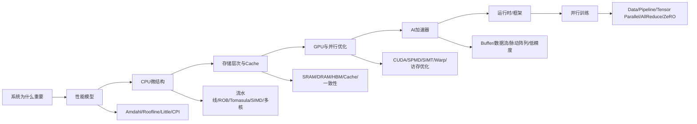

# 人工智能芯片与系统期末复习资料使用说明

本目录根据 1-16 讲 PPT 抽取结果整理。原始逐页抽取结果保存在 `extracted/`，按课件一一对应；本目录是面向期末考试的学习版讲义，不把明显前沿拓展内容当作重点。第 15 讲 FlashAttention 部分按老师说明不作为考试重点，只保留它和 ZeRO、算子融合、内存复杂度之间的衔接。

## 建议阅读顺序

1. 先读 `01_完整零基础讲义.md` 的第 0-3 章，建立计算机系统、性能模型、CPU 流水线和乱序执行的主线。
2. 再读第 4-6 章，掌握存储层次、GPU、cache/coherence/consistency。
3. 最后读第 7-9 章，掌握 AI 加速器、运行时/框架、并行训练。
4. 读 `07_第16讲总复习到前15讲重点映射.md`。第 16 讲总复习中出现的所有知识点，都按重点回到前 1-15 讲对应页复习。
5. 读 `04_逐讲图示与细节补充讲义.md`，专门补 PPT 图片、结构图、时序表和状态表的读法。
6. 用 `05_逐页图文索引.md` 查漏。每一页 PPT 都有标题、图表数量、截图链接和摘要；含图/含表页至少扫一遍。
7. 做 `02_重点题型与例题详解.md`。老师点名的四类题都在这里：Roofline、pipelined/OOO CPU、performance analysis、cache。
8. 用 `03_自测题与闪卡.md` 做闭卷自测。答不出来的题回到 `01`、`04` 和 `07` 对应章节。

## 考试主线

## 老师额外划重点

- Tomasula 的 register renaming table 和 reservation station：含义、字段、何时更新、如何更新。
- Parallel training 的 tensor parallel：按行/按列切参数、Alternating Partitioning、每种切法对应通信。
- AllReduce：Ring AllReduce 的轮数、每轮通信量、总通信量。
- 第 16 讲四道例题：Roofline、pipelined CPU、performance analysis、cache。

## 资料完整性说明

- 16 份 PPT 当前验证共抽取 1708 页，抽取文件在 `extracted/*.md` 和 `extracted/*.json`。
- 所有 PPT 页已渲染为截图，保存在 `rendered_slides/`；每讲还有总览拼图，保存在 `slide_contact_sheets/`。
- `04_逐讲图示与细节补充讲义.md` 负责讲清关键图；`05_逐页图文索引.md` 负责逐页可追溯查漏。
- `07_第16讲总复习到前15讲重点映射.md` 负责把总复习 PPT 中出现的知识点逐一回指到前 1-15 讲，作为重点复习清单。
- 第 15 讲 FlashAttention 主体页按老师说明标为不考，但 ZeRO 和系统存储/通信衔接部分仍保留。
- 如需查某页原始文字，可打开对应 `extracted/<课件名>.md`。
