# 人工智能芯片与系统完整零基础讲义

这份讲义按第 16 讲总复习的脉络组织，同时回到 1-15 讲补充定义、公式、硬件结构、数据结构、通信模式和常见考法。你可以把它当作“从零开始的期末复习课”。

## 0. 这门课到底在讲什么

人工智能芯片与系统不是只讲“某个芯片长什么样”，也不是只讲“深度学习算法”。它讲的是：一个 AI 程序从高级框架写出来以后，如何一路变成芯片上的电路活动，并且为什么性能、能耗、带宽、通信会成为瓶颈。

课程主线可以理解为一条转换链：

```mermaid
flowchart TB
    A[AI算法/程序] --> B[框架: PyTorch/MindSpore/TensorFlow]
    B --> C[运行时/编译器/算子库: CANN/CUDA/NCCL]
    C --> D[指令和编程模型: ISA/SPMD/SIMT]
    D --> E[微结构: CPU/GPU/NPU/TPU]
    E --> F[存储系统: cache/SRAM/DRAM/HBM]
    F --> G[电路和电子运动]
```



### 0.1 为什么不能一上来只讲 AI 芯片

因为 AI 芯片仍然是计算机系统的一部分。你必须先理解：

- 为什么计算机会有“指令、寄存器、内存、流水线”这些抽象。
- 为什么程序看起来是顺序执行，底层却可能流水、乱序、并行。
- 为什么算力很高时，内存和通信反而变成瓶颈。
- 为什么深度学习加速器喜欢矩阵乘、低精度、片上 buffer、数据复用。
- 为什么训练大模型时，一个 GPU 不够，需要数据并行、流水并行、张量并行和 collective communication。

### 0.2 体系结构和微结构

狭义的 computer architecture 常指 ISA，也就是软件可见的接口：有哪些指令、寄存器、内存地址规则、异常机制。Microarchitecture 是 ISA 的实现方式：单周期、多周期、流水线、乱序、cache、分支预测、GPU warp 调度等。

同一个 ISA 可以有不同微结构。例如同样执行 `ADD`，可以：

- 单周期 CPU：一个很长的周期做完取指、译码、读寄存器、执行、写回。
- 多周期 CPU：一条指令拆成多个短周期。
- 流水线 CPU：多条指令在不同阶段重叠。
- 乱序 CPU：准备好的指令先执行，最后按程序顺序提交。

### 0.3 期末复习时最重要的能力

考试通常不会只问“背定义”。更可能考：

- 给你一个公式或硬件参数，让你算性能。
- 给你一串指令，让你判断 RAW/WAR/WAW、ROB、Tomasula 表、执行周期。
- 给你一个 cache 配置和地址序列，让你判定 hit/miss 和 miss 类型。
- 给你一个并行训练切分方式，让你说出需要 AllReduce、AllGather 还是 ReduceScatter。
- 给你一个硬件/算法场景，让你判断瓶颈在算力、访存、同步还是通信。

## 1. 性能模型：Amdahl、Roofline、Little、CPI

性能模型是这门课的第一根主线。你需要用它判断“优化哪里最有效”。

### 1.1 Amdahl's Law

Amdahl 定律回答的是：如果一个程序中只有一部分能被加速，那么总加速比最多是多少。

设程序中可被加速部分比例为 `f`，这部分加速 `S` 倍，则总加速比：

```text
Speedup = 1 / ((1 - f) + f / S)
```

关键含义：

- 串行部分会限制总加速比。
- 即使把某个部分加速到无限快，程序仍然要花 `1-f` 的时间。
- 因此系统优化不能只盯一个局部，要看整体瓶颈。

常见考法：给出“80% 可并行，加速 10 倍”，问总加速比。答案是 `1/(0.2+0.8/10)=3.57`。

### 1.2 Roofline Model

Roofline 是期末最重要性能模型之一。它回答：一个 kernel 的性能上限由算力限制还是内存带宽限制。

核心定义：

```text
Arithmetic Intensity (AI) = Total FLOPs / Total Memory Bytes
Attainable FLOP/s = min(Peak FLOP/s, AI * Peak Memory Bandwidth)
```

解释：

- `Peak FLOP/s` 是机器算力屋顶。
- `Peak Memory Bandwidth` 是内存带宽斜线的斜率。
- `AI` 越大，说明每搬一个 byte 能做更多计算，越可能 compute-bound。
- `AI` 越小，说明计算少、搬数据多，越可能 memory-bound。

判断规则：

```text
如果 AI * Bandwidth < Peak Compute，则 memory-bound
如果 AI * Bandwidth >= Peak Compute，则 compute-bound
拐点 AI* = Peak Compute / Bandwidth
```

### 1.3 Roofline 的三步

PPT 中强调 Roofline 的三个步骤：

1. Machine characterization：测机器的 peak compute 和 memory bandwidth。
2. Application characterization：算应用的 arithmetic intensity。
3. Application execution monitoring：测真实吞吐，看距离 roof 有多远。

优化方向：

- memory-bound：优先减少访存、提升局部性、用 cache/shared memory/tiling、提高数据复用。
- compute-bound：优先向量化、用 FMA、提高并行度、使用 tensor core/cube 等专用计算单元。
- 如果真实性能远低于 roof：说明还有额外问题，例如分支、同步、访存不合并、occupancy 低、cache miss 高。

### 1.4 PPT 中的 Roofline 例子

7-point stencil：

```text
Memory = 16 bytes/iteration
Compute = 7 flops/iteration
AI = 7 / 16 = 0.4375 flops/byte
```

STREAM Triad：

```text
Memory = 24 bytes/iteration
Compute = 2 flops/iteration
AI = 2 / 24 = 0.083 flops/byte
```

STREAM Triad 的 AI 更小，通常更 memory-bound。考题不会一定给原题，但你必须会：

- 数 FLOPs。
- 数 bytes。
- 算 AI。
- 代入 `min(peak, AI * bandwidth)`。
- 判断优化方向。

### 1.5 Little's Law

Little 定律：

```text
L = λ * W
```

其中：

- `L`：系统中平均有多少个请求。
- `λ`：吞吐率，单位时间完成多少请求。
- `W`：每个请求平均停留时间，也就是延迟。

硬件中的直觉：

```text
需要的并发请求数 = 目标吞吐率 * 单个请求延迟
```

例如内存访问延迟很长，如果想保持高带宽，就必须同时发出很多未完成请求。这也是 GPU 需要大量线程/warp 来隐藏内存延迟的根本原因。

### 1.6 CPI 和 CPU Time

基础公式：

```text
CPU time = Instruction Count * Average CPI * Clock Cycle Time
Average CPI = Σ(指令比例 * 该类指令CPI)
```

单周期 CPU：

- CPI = 1。
- 但 clock cycle time 很长，因为一个周期要容纳最慢指令。

多周期 CPU：

- 每类指令 CPI 不同。
- clock cycle time 可以变短。
- 平均 CPI 要按指令比例加权。

流水线 CPU：

- 理想情况下 CPI 接近 1。
- 真实情况下会有 structural/data/control hazards，导致 stall。

## 2. CPU 基础：冯诺依曼、ISA、单周期、多周期、流水线

### 2.1 冯诺依曼模型

冯诺依曼模型的关键性质：

- 程序和数据都存在内存中。
- CPU 按指令周期处理：fetch、decode、execute、memory、write back。
- 指令按程序顺序定义语义。
- ISA 定义软件可见状态：寄存器、PC、内存、指令格式。

抽象上，程序执行就是把 architectural state `AS` 变成 `AS'`。

### 2.2 单周期 CPU

单周期 CPU 每条指令一个周期完成。优点是概念简单，缺点是周期必须足够长，以便最慢指令也能完成。

典型数据通路包含：

- PC：保存当前指令地址。
- Instruction Memory：取指。
- Register File：读/写寄存器。
- ALU：算术逻辑。
- Data Memory：load/store。
- Control：根据 opcode 产生控制信号。

考试可能给一条 MIPS 指令，让你说数据从哪里流到哪里、控制信号如何设置。

### 2.3 多周期 CPU

多周期 CPU 把一条指令拆成多个阶段。优点：

- 每个周期更短。
- 不同指令可用不同周期数。
- 硬件单元可以在不同周期复用。

例如：

- load：取指、译码、地址计算、读内存、写回。
- store：取指、译码、地址计算、写内存。
- arithmetic：取指、译码、ALU、写回。
- branch：取指、译码、比较/改 PC。

### 2.4 流水线基本思想

流水线把指令处理拆成阶段，让多条指令重叠执行。经典五级：

```text
IF -> ID -> EX -> MEM -> WB
```

理想情况下，流水线填满后每周期完成一条指令，吞吐提高。但单条指令延迟不一定变短。

### 2.5 Pipeline hazards

三类 hazard：

1. Structural hazard：硬件资源冲突。例如同一个周期两条指令都要访问同一块 memory 或 register file 端口不够。
2. Data hazard：数据依赖导致后一条指令需要前一条结果。
3. Control hazard：分支跳转导致取错指令。

PPT 中重点讲 data dependence：

- RAW = Read After Write，真依赖/flow dependence。后指令读前指令写的值。
- WAR = Write After Read，反依赖/anti dependence。后指令写的寄存器是前指令要读的寄存器。
- WAW = Write After Write，输出依赖/output dependence。两条指令写同一寄存器，写入顺序必须正确。

RAW 是真正的数据依赖，不能靠改名消除；WAR/WAW 是 false dependence，来自 architectural register 名字不够，可以靠 register renaming 消除。

### 2.6 处理 data hazard：stall、compiler、forwarding

三种基本方法：

- Hardware stall：硬件检测到依赖，暂停后一条指令。
- Compiler scheduling：编译器插入 NOP 或重排独立指令。
- Forwarding/bypassing：结果尚未写回寄存器时，直接从后级流水线转发给前级使用。

Forwarding 不是万能的。例如 load-use hazard 中，数据要到 MEM 后才出来，下一条紧跟使用时可能仍需 stall。

### 2.7 精确异常 precise exception

Precise exception 的含义：发生异常时，architectural state 看起来像是按程序顺序执行到某条指令边界：

- 异常之前的指令都已经提交。
- 异常之后的指令都没有改变 architectural state。
- PC、寄存器、内存状态一致。

这就是为什么乱序执行还需要 in-order commit。

## 3. ROB、Tomasula、乱序执行

这是老师额外强调的重点，必须会表格和更新规则。

### 3.1 为什么需要 ROB

Reorder Buffer 的作用：

- 支持 out-of-order completion，但 in-order retirement/commit。
- 保存未提交指令的结果。
- 保证 precise exception。
- 通过把 architectural register 映射到 ROB entry，消除 WAR/WAW false dependence。

PPT 中 ROB 的基本流程：

1. Decode 时按程序顺序分配 ROB entry，并重命名目的寄存器。
2. 指令执行完成后，可以乱序把结果写入 ROB entry。
3. 当指令成为 ROB 中最老指令且无异常，按程序顺序 commit，把结果写入 register file 或 memory。

ROB entry 通常要保存：

- 指令类型。
- 目的寄存器或 store 地址。
- 结果值。
- ready/valid bit。
- exception 状态。
- 程序顺序信息。

### 3.2 只有 ROB 还不够

只有 ROB 的 in-order dispatch 机器可以消除 false dependence，但遇到 true dependence 时，年轻的独立指令仍可能被挡住。问题是：

```text
ADD 依赖一个长延迟 load，后面的独立指令也无法越过它去执行。
```

解决：reservation station，让等待数据的指令先进入“等待区”，独立指令可以继续进入并在 ready 后先执行。

### 3.3 Reservation Station 的含义

Reservation Station 是功能单元前的等待队列/缓冲区。它保存一条已经发射但还没开始执行或正在等待操作数的指令。

核心思想：

- 依赖指令不要堵住流水线前端。
- 操作数 ready 的指令可以按 dataflow order 执行。
- 指令执行顺序由“数据是否 ready”决定，而不是完全由程序顺序决定。

RS entry 常见字段：

```text
Busy / Op / DestTag
Source1: V, Tag, Value
Source2: V, Tag, Value
```

PPT 中简化为：

```text
Source 1: V, Tag, Value
Source 2: V, Tag, Value
```

含义：

- `V=1`：这个源操作数的值已经 ready，直接看 `Value`。
- `V=0`：值还没 ready，需要等某个 producer，producer 的名字在 `Tag`。
- `Tag`：不是寄存器名，而是 producer 的 reservation station entry 或 ROB entry。
- `Value`：操作数真实数值。

### 3.4 Register Rename Table / Register Alias Table

Register Rename Table 记录 architectural register 当前最新值在哪里。

PPT 中字段：

```text
Register | Valid | Tag | Value
```

含义：

- `Valid=1`：该寄存器当前 architectural value 已经在 register file，可以直接读 `Value`。
- `Valid=0`：该寄存器将由某个尚未完成的指令产生；`Tag` 指向那个 producer。
- `Tag`：RS entry 或 ROB entry 的编号。
- `Value`：当 valid 时保存寄存器值。

为什么能消除 WAR/WAW：

- 同一个寄存器名在不同时刻可以被重命名为不同 tag。
- 后续消费者不再看“寄存器名”，而看“产生它的 tag”。
- 写回时只有 tag 匹配当前 rename table 的项，才更新 register file；否则说明这个结果已经被更新的写者覆盖，不能把老值写回。

### 3.5 Tomasula 的四个阶段

按 PPT 整理：

1. ID/Issue/Rename：
   - 如果有空 RS entry，指令占用一个 RS。
   - 对每个源寄存器：若 RF/RAT valid=1，则把值复制到 RS 的 source.value，并置 source.V=1；否则把 producer tag 复制到 RS.source.tag，并置 source.V=0。
   - 对目的寄存器：把 RAT 的 tag 改成当前 RS/ROB tag，valid 置 0。
   - 如果没有空 RS，则 stall。

2. RS 等待和 wakeup：
   - RS 监听 Common Data Bus (CDB)。
   - 如果 CDB 上广播的 tag 等于某个 source.tag，就抓取 value，把 source.V 置 1。

3. Dispatch/Execute：
   - 当所有 source.V 都为 1，且对应功能单元可用，该指令可以发给 FU。
   - 这就是 wakeup and select。

4. Writeback/Broadcast：
   - FU 产生结果后，在 CDB 上广播 `(tag, value)`。
   - RAT/RF 如果当前 tag 匹配广播 tag，则写入 value 并 valid=1。
   - 所有 RS 也用广播 tag 更新等待的 source。

如果加上 ROB，还要区分“写回临时结果”和“提交 architectural state”：

- 执行完成：结果进 ROB。
- commit：ROB 头部 ready 且无异常，才写 architectural register/memory。

### 3.6 两个 hump

现代乱序流水线的两个关键 hump：

- Hump 1：Reservation stations，实现 in-order issue 后的 out-of-order dispatch/execute。
- Hump 2：Reorder buffer，实现 out-of-order completion 后的 in-order commit。

### 3.7 Tomasula 必背总结

```text
Register renaming eliminates false dependences.
Reservation stations buffer waiting instructions.
Tag broadcast communicates produced values to consumers.
Wakeup and select enables out-of-order dispatch.
ROB enables precise exception through in-order commit.
```

## 4. Superscalar、SIMD、Multithreading、Multicore

### 4.1 Superscalar

Superscalar 指一个周期可以发射/执行多条指令。它提高 instruction-level parallelism，但硬件复杂度高：

- 需要多端口 register file。
- 需要更复杂依赖检测。
- 需要多个功能单元。
- 需要更宽的 fetch/decode/issue/commit。

对 Roofline 的影响：

- 可能提高 peak compute roof。
- 如果应用 memory-bound，单纯提高 superscalar 宽度不一定有用。

### 4.2 Flynn 分类

- SISD：单指令单数据，传统顺序机。
- SIMD：单指令多数据，一条指令同时处理多个数据。
- MISD：多指令单数据，实际少见，PPT 提到最接近形式可联系 systolic/streaming。
- MIMD：多指令多数据，多核/多处理器。

### 4.3 SIMD

SIMD 的直觉：一个操作对多个数据元素重复执行。例如 256-bit AVX2 可以一次处理 8 个 32-bit float。

优点：

- 控制开销低。
- 数据级并行高。
- 提高 peak FLOP/s。

限制：

- 需要数据规整。
- 分支/不规则访存会降低利用率。
- 受向量宽度影响。

### 4.4 Fine-grained multithreading

细粒度多线程通过在多个线程/warp 间切换，隐藏长延迟操作。GPU 的 warp-level FGMT 是典型例子：

- 一个 warp 等内存时，调度另一个 ready warp。
- 需要大量线程上下文保存在 register file 中。
- 用吞吐换延迟隐藏。

### 4.5 Multicore

多核相比超大单核：

- 更容易扩展吞吐。
- 每个小核简单、能效更好。
- 需要处理共享 cache、DRAM、公平性、coherence/consistency。

## 5. 存储系统：SRAM、DRAM、HBM、SSD 与数据移动瓶颈

### 5.1 理想存储不存在

理想存储需要四个性质：

- zero latency。
- infinite capacity。
- infinite bandwidth。
- zero cost。

现实中这些目标相互矛盾：

- 越大通常越慢。
- 越快通常越贵。
- 越高带宽需要更多 bank、port、channel 或更先进技术。

### 5.2 存储技术比较

从快到慢、从小到大大致是：

```text
Register/FF -> SRAM -> HBM/DRAM -> SSD -> Disk
```

PPT 中的典型数量级：

- SRAM：KB-MB，纳秒级，贵，片上 cache/shared memory/buffer。
- DRAM：GB，约几十 ns，便宜，主存。
- HBM：容量比片上 SRAM 大，带宽远高于普通 DDR，常在 GPU/NPU 上。
- SSD：TB，延迟更高，吞吐低于 HBM/DRAM，但容量大。

### 5.3 数据移动比计算更贵

PPT 给出的能耗表强调：

- 32-bit integer ADD 约 0.1 pJ。
- SRAM cache 约 5 pJ，约 50 倍。
- DRAM 约 640 pJ，约 6400 倍。

所以 AI 加速器设计的核心不是“只堆算力”，而是减少数据搬运：

- 尽量在片上复用数据。
- 用 tiling/blocking。
- 用 scratchpad/global buffer。
- 用低精度减少字节数。
- 用算子融合减少中间结果写回 HBM。

### 5.4 SRAM

SRAM 位单元通常由交叉耦合反相器保存数据，再用访问晶体管连接 bitline。特点：

- 快。
- 不需要 refresh。
- 成本高、面积大。
- 适合片上 cache、GPU shared memory、AI accelerator on-chip buffer。

Banking：

- 把存储分成多个 bank。
- 不同 bank 可并行访问。
- 若多个访问落到同一个 bank，就发生 bank conflict。

### 5.5 DRAM

DRAM 单元由电容和访问晶体管构成。特点：

- 密度高，容量大。
- 电容会漏电，需要 refresh。
- 读操作会破坏电荷，需要感放和恢复。
- 访问延迟较高。

DRAM 层次：

```text
Channel -> DIMM -> Rank -> Chip -> Bank -> Row/Column
```

DRAM bank 有 row buffer。三种访问状态：

- Row buffer hit：要访问的 row 已经打开，延迟最低。
- Row closed/conflict：要打开新 row，可能需要 precharge 和 activate，延迟更高。
- Refresh 冲突：refresh 期间 bank/rank 不可用，访问延迟变长。

### 5.6 HBM

HBM 把多层 DRAM die 堆叠在一起，通过硅中介层和 GPU/NPU 靠近连接。优点：

- 很高带宽，PPT 中提到每 stack 可达约数百 GB/s。
- 与加速器距离近，适合高吞吐 AI 计算。

缺点：

- 成本高。
- 容量仍有限。
- 封装复杂。

## 6. Cache、Coherence、Consistency

### 6.1 为什么 cache 有用

Cache 利用 locality：

- Temporal locality：刚访问过的数据很可能很快再次访问。
- Spatial locality：访问某地址附近的数据也可能被访问。

Cache block/line 是 cache 管理的基本单位。访问某个地址 miss 时，通常把整个 block 搬入 cache。

### 6.2 Cache 设计三问

1. Placement：一个 memory block 可以放到 cache 的哪里？
2. Replacement：cache 满了替换谁？
3. Write policy：写操作如何处理？

### 6.3 三种映射

Direct-mapped：

- 一个 memory block 只能放一个 cache line。
- 硬件简单、快。
- 容易 conflict miss。

Fully associative：

- 一个 memory block 可放任意 cache line。
- 冲突最少。
- 硬件比较复杂，需要多路 tag 比较。

N-way set-associative：

- cache 分成多个 set，每个 set 有 N 个 way。
- block 先由 index 定位 set，再在 N 个 way 中选择。
- 是直接映射和全相联之间的折中。

公式：

```text
Cache data capacity C
Block size b
Number of cache blocks B = C / b
Associativity N
Number of sets S = B / N
Offset bits = log2(b)
Index bits = log2(S)
Tag bits = address bits - index bits - offset bits
```

### 6.4 Miss 类型

- Compulsory/cold miss：第一次访问该 block，无法避免。
- Capacity miss：cache 总容量不够，即使全相联也放不下工作集。
- Conflict miss：总容量够，但映射到同一 set/line 发生冲突。

判断技巧：

- 第一次出现一定是 compulsory。
- 如果 fully associative 同容量也 miss，可能是 capacity。
- 如果 fully associative 能 hit，而 direct/set-assoc miss，就是 conflict。

### 6.5 Replacement

Set-associative cache 中 miss 后如果 set 满了，要选 victim：

- Invalid block first。
- Random。
- FIFO。
- LRU。
- Pseudo-LRU。
- Belady OPT 理论最优：替换未来最晚再访问的 block，但实际无法在线实现。

注意：LRU 不总是最好。若 4-way cache 循环访问 A/B/C/D/E，LRU 可能一直 thrashing。

### 6.6 Write policy

两个维度：

写 miss 时：

- Write-allocate：先把 block 读入 cache，再写。
- Write-no-allocate：直接写内存，不放 cache。

写 hit 时：

- Write-back：先写 cache，等 eviction 时写回内存。需要 dirty bit，节省带宽。
- Write-through：同时写 cache 和 memory。简单但带宽压力大。

### 6.7 Cache performance

常见公式：

```text
AMAT = Hit time + Miss rate * Miss penalty
```

注意题目可能说“miss access time”而不是“miss penalty”。若 miss access time 是 miss 总访问时间，则：

```text
AMAT = HitRate * HitTime + MissRate * MissTime
```

若 miss penalty 是额外惩罚，则用 `HitTime + MissRate * MissPenalty`。

### 6.8 Private vs shared cache

Private cache：

- 每个 core 有自己的 cache。
- 低延迟。
- 多个 cache 可能保存同一 block，需要 coherence。

Shared cache：

- 多个 core 共用。
- 容量可动态共享。
- coherence 更简单。
- 访问更慢，且不同 core 会相互污染 cache。

### 6.9 Coherence vs Consistency

这是易混点。

Cache coherence：

- 关注不同处理器对同一个 memory location 的操作顺序。
- 本质是“同一个地址的最后写入值，各 core 看到要一致”。

Memory consistency：

- 关注不同处理器对所有 memory locations 的操作顺序。
- 本质是“多地址操作在全局上以什么顺序可见”。

Coherence 的三个特征：

- Program order preservation：同一 core 写 X 后读 X，应读到自己写的值。
- Coherent memory view：一个 core 写 X 后，足够长时间后其他 core 能读到新值。
- Write serialization：多个 core 对同一地址的写，所有 core 看到的顺序一致。

### 6.10 MSI

MSI 三态：

- I Invalid：cache 中没有有效副本。
- S Shared：一个或多个 cache 有干净副本，可读。
- M Modified：只有一个 cache 有该 block，且已修改，可读写。

问题：MSI 中第一次 read miss 后进入 S，即使实际上只有一个副本。随后本地写还要发 invalidate，可能多余。

### 6.11 MESI

MESI 加入 E Exclusive：

- E：只有一个 cache 有干净副本。
- 在 E 状态本地写可以无 bus action 地变成 M。
- 远程 read miss 会使 E 变 S。
- 远程 write miss 会使 E 变 I。

MESI 相比 MSI 减少了独占干净数据上的无用 invalidate。

### 6.12 Snoop vs Directory

Snoop-based：

- 基于 bus。
- 每个 bus action 广播给所有 cache。
- bus 是全局串行点。
- 简单但扩展性差。

Directory-based：

- directory 记录每个 block 被哪些 cache 持有。
- local node 发 getS/getEx 给 home node。
- directory 决定是否发 invalidate、是否从 memory 或其他 cache 取数据。
- 每个 block 有自己的 serialization point，更可扩展。

Directory entry 可包含：

- 状态位。
- owner。
- sharer bit vector。

## 7. GPU 架构与优化

### 7.1 CPU 和 GPU 的关系

CPU：

- 少量强核。
- 大 cache。
- 擅长复杂控制流、低延迟任务。

GPU：

- 大量简单计算单元。
- 高内存带宽。
- 擅长规则数据并行、高吞吐任务。

GPU 本质上是 SIMD/SIMT 机器，但程序员写的是线程。

### 7.2 Programming model vs hardware execution model

Programming model 是程序员看到的模型，例如 CUDA 的 thread/block/grid。

Hardware execution model 是硬件实际如何执行，例如 SIMT、warp、SM、scheduler。

PPT 重点：

- GPU 用 SPMD 编程：Single Program Multiple Data。
- 每个线程执行相同 kernel，但处理不同数据。
- 硬件把线程动态分组成 warp。
- Warp 中线程 lock-step 执行同一指令。

### 7.3 CUDA 基本概念

- Kernel：在 GPU 上执行的函数。
- Thread：最小编程执行单元。
- Block：线程组；同一个 block 内可共享 shared memory，可用 `__syncthreads()` 同步。
- Grid：一次 kernel launch 中所有 blocks。
- `threadIdx`：线程在 block 内编号。
- `blockIdx`：block 在 grid 中编号。
- `blockDim`：每个 block 的线程数。

常见一维索引：

```c
int i = blockIdx.x * blockDim.x + threadIdx.x;
if (i < N) { ... }
```

若 N 不是 block size 的整数倍，要 launch 多一点线程，并用边界判断过滤。

### 7.4 SIMT 与 warp

SIMT = Single Instruction Multiple Thread。

Warp：

- 通常 32 个连续线程。
- 是硬件调度基本单位。
- 同一个 warp 中线程同一时刻执行同一指令。

传统 SIMD 和 warp-based SIMD 区别：

- 传统 SIMD 对程序员暴露向量宽度。
- GPU 程序员写标量线程，硬件动态把线程分成 warp。
- SIMT 可以把每个线程当作独立上下文，也能把同指令线程合并执行。

### 7.5 Branch divergence

如果同一个 warp 中不同线程走不同分支，就发生 divergence。硬件通常串行执行各分支路径，并 mask 掉不活跃线程，导致利用率下降。

优化原则：

- 尽量让同 warp 线程走相同控制流。
- 用 `threadIdx.x < 32` 这类 warp-aligned 条件比 `threadIdx.x % 2 == 0` 更好。

### 7.6 Latency hiding and occupancy

GPU 不靠让单个内存访问变快，而靠大量 warp 隐藏延迟。

Fine-grained multithreading：

- 当一个 warp 等内存时，scheduler 切换到另一个 ready warp。
- 足够多 active warps 才能隐藏长延迟。

Occupancy：

- SM 上 active warps/blocks 与硬件最大值的比例。
- occupancy 太低会导致延迟隐藏不足。
- occupancy 受 registers、shared memory、block size 等限制。

### 7.7 GPU memory hierarchy

CUDA 程序常见内存：

- Global memory：HBM/DRAM，容量大，延迟高。
- Shared memory：片上 scratchpad，block 内共享，快，但容量小。
- Registers：每线程私有，最快。
- Constant/texture memory：特殊用途。
- L1/L2 cache：硬件管理。

优化核心：减少 global memory 访问，提升 coalescing，用 shared memory 做数据复用。

### 7.8 Memory coalescing

当一个 warp 中线程访问连续地址，硬件可合并成少数 memory transaction。若访问分散，需要多个 transaction，带宽利用率低。

规则直觉：

- 连续线程访问连续数据最好。
- stride 访问、乱序访问、非对齐访问会降低 coalescing。

### 7.9 Shared memory bank conflict

Shared memory 分成多个 bank。若同一 warp 中多个线程访问同一个 bank 的不同地址，会发生 bank conflict，访问被串行化。

PPT 中强调：

- Bank conflict 只在 warp 内考虑。
- 常见 bank 映射可近似理解为 `bank = address % number_of_banks`。
- 可以通过 padding、改变 layout、XOR/hash 等减少冲突。

### 7.10 Tiled matrix multiplication

Naive matrix multiplication 每个输出元素反复从 global memory 读 A 和 B。Tiling 的思想：

1. 每个 block 负责 C 的一个 tile。
2. 把 A 和 B 的小 tile 搬到 shared memory。
3. `__syncthreads()` 等所有线程加载完。
4. 在 shared memory 上反复复用数据做乘加。
5. 再加载下一块 tile。

这对应 Roofline 中提高 AI：同样的 global memory bytes 支撑更多 FLOPs。

### 7.11 Reduction 和 atomic

Reduction 要把多个元素合并为一个结果。优化点：

- tree-based reduction 减少串行依赖。
- shared memory 减少 global memory 访问。
- warp shuffle/unrolling 减少同步开销。
- atomic 可避免 data race，但冲突高时会慢。

### 7.12 CUDA streams、异步拷贝、TMA

CUDA streams 是命令队列，可用于重叠数据传输和计算。

新 GPU 支持 global memory 到 shared memory 的异步拷贝，如 LDGSTS/TMA：

- 减少 register 中转。
- TMA 可更高效搬运大块多维数据。
- 目标仍然是让计算单元少等数据。

## 8. AI 加速器

### 8.1 为什么需要 AI 加速器

深度学习有几个特点：

- 大量矩阵乘、卷积、向量运算。
- 可容忍一定低精度。
- 数据复用机会大。
- 内存带宽和能耗是瓶颈。

CPU 通用性强，但为复杂控制和通用程序付出面积/能耗；AI 加速器牺牲部分通用性，换更高能效。

### 8.2 深度学习算子特点

卷积层：

- 核心是滑动窗口乘加。
- 计算量大。
- input feature map、weight、output feature map 都有复用。
- 可转成矩阵乘实现。

激活函数：

- 逐元素操作。
- 计算简单，访存相对占比高。

池化：

- 局部窗口取 max/avg。
- 计算不复杂，但要读多个输入。

全连接：

- 本质矩阵向量/矩阵矩阵乘。
- weight 量大。

Attention：

- 核心是矩阵乘，例如 QK^T、softmax、PV。
- 标准 attention 计算复杂度约 `O(S^2 D)`。
- 中间 score/probability 矩阵内存复杂度约 `O(S^2)`。

第 15 讲 FlashAttention 不考，但它的思想可作为理解内存瓶颈的例子：不改变理论计算量，而通过 tiling 避免完整 `S x S` 矩阵写入 HBM，用更多片上复用减少数据搬运。

### 8.3 AI 加速器设计原则

从 PPT 抽象出的核心原则：

- 使用简单并行计算模块满足领域需求，例如矩阵乘单元。
- 使用低精度减少数据尺寸和能耗。
- 使用片上 buffer/scratchpad 减少外部内存访问。
- 针对数据流组织复用。
- 提供运行时/算子库/编译器，让程序员能使用硬件。

### 8.4 Cache or Buffer

CPU 喜欢 cache：

- 程序透明。
- 硬件自动管理。
- 适合不可预测访问。

AI 加速器喜欢 buffer/scratchpad：

- 程序/编译器显式管理。
- 可控数据搬运。
- 去掉复杂 tag、coherence、replacement 逻辑。
- 更适合规则张量计算。

缺点是编程更难，需要知道数据在哪个 buffer。

### 8.5 数据流：WS、OS、IS、RS

目标：减少 global buffer/HBM 访问，最大化片上复用。

Weight Stationary：

- weight 尽量停留在 PE/阵列中。
- input/output 流过。
- 适合权重复用高的场景，例如 TPU systolic array。

Output Stationary：

- partial sum/output 留在 PE 中不断累加。
- 减少部分和反复写回。

Input Stationary：

- input 留在本地，复用多个 weight。

Row Stationary：

- 尝试综合利用 input、weight、partial sum 的复用。

考试可能问“stationary 是什么意思”：不是数据完全不动，而是某类数据尽量保持在低层存储/PE，减少昂贵搬运。

### 8.6 Ascend/Davinci Core

PPT 中 Ascend AI Core 关键模块：

- Cube：矩阵运算核心。负责高吞吐矩阵乘，如 FP16 16x16 矩阵乘，int8 可支持不同形状。
- Vector：向量运算，多面手，支持 FP16/FP32/int32/int8 等，处理激活、逐元素、格式转换等。
- Scalar：小 CPU/司令部，负责循环控制、分支、地址和参数计算。
- MTE：数据搬运引擎。
- L0A/L0B/L0C、UB、Scalar Buffer：不同层级片上存储。

重点不是背每个硬件细节，而是理解：

```text
Cube 做密集矩阵乘
Vector 做逐元素/后处理
Scalar 做控制
MTE 做搬运
Buffer 承载显式数据复用
```

### 8.7 TPU 和 systolic array

Systolic array 的基本原则：

```text
用规则 PE 阵列替代单个 PE，并精心安排数据在 PE 间流动。
```

像心脏泵血一样，数据有节奏地从一个 PE 流到下一个 PE。优点：

- 规则结构，适合 VLSI。
- 局部通信，减少全局连线。
- 高数据复用。
- 适合矩阵乘/卷积。

TPU v1 使用大规模矩阵乘单元。PPT 中提到：

- TPU1 有 256 x 256 matrix multiply unit。
- TPU2/TPU3 有两个 128 x 128 matrix multiply units。
- TPU 从 v1 到 v2/v3 增强训练能力、HBM、vector unit、interconnect。

### 8.8 低精度

为什么低精度可行：

- ML 任务常容忍近似。
- 推理中 int8 量化常可保持可接受精度。
- 训练中 FP16/BF16/TF32/FP8 等降低带宽和算力压力。

硬件支持低精度的意义：

- 每次搬运更少 bytes。
- 同样面积/功耗下更多 MAC。
- 降低能耗。

注意：低精度不是随便降。不同模型、层、任务需要不同精度；过低会损失精度或收敛质量。

## 9. Runtime、CANN、MindSpore、算子和图优化

### 9.1 为什么需要 AI Framework

AI 任务变化多，但建立在共同算子上。框架把常用操作封装，降低开发复杂度，并把模型交给后端编译/运行时优化。

典型层次：

```text
AI Framework: MindSpore/PyTorch/TensorFlow
Runtime/Compiler/Graph Engine: CANN/GE/CUDA runtime
Operator Library: NN/CUBLAS/cuDNN/Ascend NN
Hardware: GPU/NPU/TPU
```

### 9.2 Tensor 和算子

Tensor 是多维数组。CNN feature map 常用 4D 格式，例如 NCHW 或 NHWC。

Operator 是计算图节点，例如 Conv、Pool、ReLU、MatMul、AllReduce。一个网络就是多个算子组成的图。

### 9.3 CANN 算子开发

PPT 中比较：

- TBE DSL：Python，封装高，适合简单向量/矩阵/池化算子，入门低。
- TIK：Python API，手工控制数据搬运和 schedule，灵活但难，性能潜力更高。
- AI CPU：C++，用于 AI Core 不适合或临时打通场景，性能较低。

### 9.4 Graph Engine

GE 的阶段：

- 图准备：构建计算图，shape 推导。
- 图拆分：子图切分和边界连接。
- 图优化：算子融合、权值格式转换、allreduce 聚合等。
- 图编译：资源分配和 task 生成。
- 图加载：加载到 runtime。
- 图执行：runtime 调度执行。

### 9.5 算子融合

算子融合把多个小算子合并成一个大算子，减少中间结果写回主存。

例子：

```text
Conv2D -> BatchNorm -> ReLU
融合为 Conv2D_BatchNorm_ReLU
```

未融合：

- Conv 写主存。
- BN 读主存再写主存。
- ReLU 读主存再写主存。

融合：

- 数据进片上 buffer 后连续完成多个操作。
- 减少 HBM/DRAM 读写。

### 9.6 MindSpore 关键技术

PPT 中列出：

- 自动并行：整图切分，结合数据并行和模型并行，考虑集群拓扑，降低通信。
- 二阶优化：利用二阶信息改善梯度方向，加快收敛。
- 动静态图结合：兼顾开发灵活性和执行效率。
- AI+科学计算：拓展框架边界。

期末更可能考概念关系，而不是深挖框架 API。

## 10. 并行训练

这是老师点名重点，尤其 tensor parallel 和 AllReduce。

### 10.1 神经网络训练一轮

一个 layer 的训练包括：

1. Forward pass：
   - 输入 activation `X`。
   - 用 weight `W` 计算输出 activation `Y`。

2. Backward pass：
   - 输入来自后一层的 activation gradient `dY`。
   - 计算 weight gradient `dW`，用于更新参数。
   - 计算 activation gradient `dX`，传给前一层。

3. Weight update：
   - SGD：`W = W - lr * dW`。
   - Adam 等优化器还要维护 optimizer states。

### 10.2 为什么需要 distributed training

原因：

- 模型参数太大，单卡显存放不下。
- activation、gradient、optimizer state 占显存。
- 数据集和训练时间巨大，需要多卡提高吞吐。
- 单卡算力/带宽有限。

### 10.3 Data Parallel

Data parallel：

- 每个 worker 有完整模型副本。
- minibatch 被切成多份，每个 worker 处理一部分数据。
- Forward 不需要通信。
- Backward 每个 worker 产生局部梯度。
- Weight update 前要把所有 worker 的梯度求和/平均。

通信：

```text
AllReduce of gradients/weights
```

优点：

- 简单。
- 适合模型能放进单卡的情况。

挑战：

- AllReduce 通信量大。
- batch size 变大后可能影响收敛。
- optimizer state 在每张卡上重复，占显存。

### 10.4 Ring AllReduce

Ring AllReduce 两阶段：

1. ReduceScatter：`N-1` 轮，每轮每个 worker 发送/接收 `M/N` 数据。
2. AllGather：`N-1` 轮，每轮每个 worker 发送/接收 `M/N` 数据。

总轮数：

```text
2(N - 1)
```

每个 worker 总发送量：

```text
2(N - 1) * M/N = 2M(N-1)/N
```

其中：

- `N` 是 GPU/worker 数。
- `M` 是需要 AllReduce 的数据大小。

N=4 时：

- ReduceScatter 3 轮。
- AllGather 3 轮。
- 总 6 轮。
- 每个 worker 每轮发 `M/4`，总发 `6M/4=1.5M`。

### 10.5 Pipeline Parallel

Pipeline parallel：

- 把模型不同层放到不同 worker。
- 一个 minibatch 分成 microbatches，让流水线填起来。

通信：

- forward 传 activations。
- backward 传 activation gradients。
- 是相邻 stage 的 point-to-point communication。

挑战：

- pipeline bubbles，硬件空闲。
- stage 之间 load imbalance。
- 通信难完全 overlap。

GPipe 用 microbatch 减少 bubble，但 bubble 仍存在。

### 10.6 Tensor Parallel

Tensor parallel / intra-layer parallel：

- 把同一层的 weight 切到多个 worker 上。
- 每个 worker 负责该层计算的一部分。
- 解决单层太大或单卡算力不足问题。

重点是 row-wise 和 column-wise partitioning。

#### 10.6.1 Row-wise partitioning

按 weight 的行切：

```text
W = [W0; W1; W2; ...]
```

每个 worker：

- 拿到一部分 weight rows。
- 通常需要完整 input activation `X`。
- 计算一部分 output activation `Y_i`。

结果：

- output activation 被分片。
- 如果下一层需要完整 `Y`，就要 AllGather。

PPT 对应通信：

```text
Row-wise forward communication: AllGather between layers
```

#### 10.6.2 Column-wise partitioning

按 weight 的列切：

```text
W = [W0, W1, W2, ...]
```

每个 worker：

- 拿到一部分 weight columns。
- 输入 activation 也可按对应列/特征分片。
- 计算对输出的 partial sum。

因为每个 worker 只算了输出的一部分贡献，需要把 partial sums 加起来。

PPT 对应通信：

```text
Column-wise forward communication: ReduceScatter between layers
```

若每个 worker 都需要完整输出，则可能是 AllReduce；若下一层能接受分片输出，则 ReduceScatter 更合适。

### 10.7 Alternating Partitioning

交替切分的核心：让一层输出的分片形式正好成为下一层需要的输入分片，从而减少层间通信。

典型模式：

```text
Layer K: row-wise
Layer K+1: column-wise
```

row-wise 产生的 `Y_i` 分片可直接作为 column-wise 下一层的输入分片，因此两层之间不需要 AllGather。

但连续多层交替后，某些边界仍需要通信，例如 AllReduce 或 ReduceScatter，取决于下一层期望的 activation 布局。

PPT 总结：

- Data parallel：AllReduce of weights/gradients，可与计算 overlap。
- Pipeline parallel：point-wise communication of activations and activation gradients，难 overlap，难 load-balance。
- Tensor/intra-layer parallel：AllGather、ReduceScatter of activations and activation gradients；若 row-wise 和 column-wise 交替，可能出现 AllReduce。

### 10.8 ZeRO

ZeRO = Zero Redundancy Optimizer。

普通 data parallel 中，每张 GPU 都保存完整：

- parameters。
- gradients。
- optimizer states。

ZeRO 的思想：

- 每张 GPU 只保存 optimizer states 等状态的一部分。
- 减少显存冗余。

代价：

- 需要更多通信。
- 需要在显存节省和通信开销之间权衡。

### 10.9 Batch size 限制

大 batch 可提高吞吐，但不是无限好：

- BatchNorm 等可能需要足够 batch。
- 过大 batch 可能影响泛化/收敛。
- 大模型训练受显存限制，microbatch、gradient accumulation、parallelism 都是在折中显存、算力和通信。

## 11. 考前必背速查

### 11.1 公式

```text
Amdahl: Speedup = 1 / ((1-f) + f/S)
Little: L = λW
CPU time = IC * CPI * CycleTime
Average CPI = Σ fraction_i * CPI_i
Roofline: Attainable FLOP/s = min(Peak FLOP/s, AI * Bandwidth)
AI = FLOPs / Bytes
AMAT = HitTime + MissRate * MissPenalty
Cache blocks B = C / b
Sets S = B / Associativity
Ring AllReduce rounds = 2(N-1)
Ring AllReduce per-worker bytes = 2M(N-1)/N
```

### 11.2 易混概念

| 概念 A | 概念 B | 区别 |
|---|---|---|
| ISA | Microarchitecture | ISA 是软件可见接口；微结构是实现方式 |
| Latency | Throughput | 单个任务耗时 vs 单位时间完成多少任务 |
| RAW | WAR/WAW | RAW 是真依赖；WAR/WAW 是名字造成的 false dependence |
| ROB | RS | ROB 保证按序提交/精确异常；RS 等待操作数并乱序发射 |
| Cache | Buffer/Scratchpad | cache 硬件自动管理；buffer 显式管理 |
| Coherence | Consistency | 同一地址顺序 vs 所有地址全局顺序 |
| SIMD | SIMT | SIMD 暴露向量；SIMT 写线程，硬件组 warp |
| Data Parallel | Tensor Parallel | 切 batch vs 切模型参数/层内矩阵 |
| AllGather | ReduceScatter | 收集完整分片 vs 归约后分发分片 |
| AllReduce | ReduceScatter+AllGather | AllReduce 可由这两阶段组成 |

### 11.3 不要犯的错

- Roofline 中不要只看 peak FLOP/s，必须看 AI 和 bandwidth。
- Tomasula 中不要把 architectural register 名当作 producer；重命名后依赖看 tag。
- RS 中 `V=0` 时不要看 value，要等 tag 广播。
- ROB commit 必须按程序顺序，不是哪个先算完哪个先写 architectural state。
- cache 题先算 block number，再算 index/tag，不要直接用 byte address 做 index。
- 第一次访问某 block 一定是 compulsory miss。
- Row-wise/column-wise tensor parallel 的通信不要混：row-wise 产生 output shards，常 AllGather；column-wise 产生 partial sums，常 ReduceScatter/AllReduce。
- Ring AllReduce 总轮数是 `2(N-1)`，不是 `N`。
