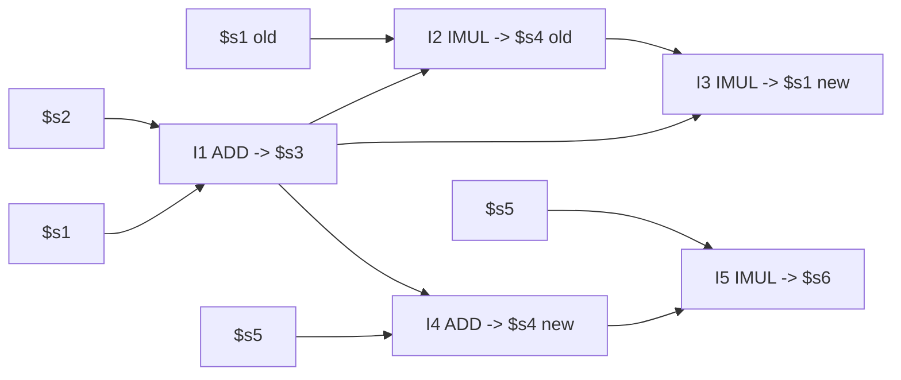

# 重点题型与例题详解

本文件围绕老师点名的四类例题和额外重点。考试不会照抄原题，但题型逻辑高度稳定。

## 1. Roofline 题

### 1.1 解题模板

1. 数计算量：总 FLOPs。
2. 数访存量：总 memory bytes。
3. 算 `AI = FLOPs / Bytes`。
4. 算内存上限：`AI * bandwidth`。
5. 和 peak compute 取最小值。
6. 判断瓶颈：
   - `AI * bandwidth < peak`：memory-bound。
   - `AI * bandwidth >= peak`：compute-bound。

### 1.2 常见陷阱

- FLOPs 不等于指令数；一次 FMA 通常算 2 FLOPs。
- bytes 要按数据类型算：float 4B，double 8B，short 2B。
- 有些数据可能被 cache 复用，题目若明确“从内存读写量”，按题目给定；若问 naive 算法，要自己按访问次数估算。
- Roofline 给的是性能上限，不保证真实性能达到。

### 1.3 PPT 例子

STREAM Triad：

```c
Z[i] = X[i] + alpha * Y[i];
```

double 情况下：

- 读 X：8B。
- 读 Y：8B。
- 写 Z：8B。
- 总 memory = 24B/iteration。
- 乘法 1 次，加法 1 次，总 2 FLOPs。

```text
AI = 2 / 24 = 0.083 FLOPs/Byte
```

7-point stencil：

```text
Compute = 7 FLOPs/iteration
Memory = 16 Bytes/iteration
AI = 7/16 = 0.4375 FLOPs/Byte
```

若机器 bandwidth = 100 GB/s，peak = 10 TFLOP/s：

```text
STREAM upper bound = 0.083 * 100 = 8.3 GFLOP/s
Stencil upper bound = 0.4375 * 100 = 43.75 GFLOP/s
```

都远低于 10 TFLOP/s，所以都是 memory-bound。

## 2. Tomasula / pipelined CPU 题

### 2.1 老师例题指令序列

题设：

- Out-of-order dispatch。
- Precise exception。
- 1 个 adder，latency = 2 cycles，fully pipelined。
- 1 个 multiplier，latency = 4 cycles，fully pipelined。

指令：

```text
I1 ADD  $s3, $s1, $s2
I2 IMUL $s4, $s1, $s3
I3 IMUL $s1, $s3, $s4
I4 ADD  $s4, $s5, $s3
I5 IMUL $s6, $s4, $s5
```

### 2.2 依赖分析

RAW 真依赖：

- I2 读 `$s3`，依赖 I1 写 `$s3`。
- I3 读 `$s3`，依赖 I1。
- I3 读 `$s4`，依赖 I2。注意这里是 I2 的 `$s4`，不是 I4 的 `$s4`，因为 I3 在 I4 之前。
- I4 读 `$s3`，依赖 I1。
- I5 读 `$s4`，依赖 I4。因为 I5 在 I4 之后，看到的是 I4 写的 `$s4`。

WAW false dependence：

- I2 写 `$s4`，I4 也写 `$s4`。

WAR false dependence：

- I2 读 `$s1`，I3 写 `$s1`。如果乱序写回不处理，I3 可能覆盖 I2 还没读的 `$s1`。

解决：

- RAW 必须等待 producer。
- WAR/WAW 用 register renaming 解决。
- Precise exception 用 ROB in-order commit 解决。

### 2.3 数据流图



### 2.4 一种合理调度

按 PPT 表格约定：

- F：fetch。
- D：decode/rename/allocate。
- E：execute。
- R：结果写入 ROB/完成。
- W：按程序顺序 commit/writeback。
- R 后下一周期消费者可开始执行。
- FU fully pipelined：同一个 FU 可每周期接收一条新指令，但每条指令仍占 latency 个 E 周期。

| Instruction | Schedule |
|---|---|
| I1 ADD | F1 D2 E3-E4 R5 W6 |
| I2 IMUL | F2 D3 等 I1，E6-E9 R10 W11 |
| I3 IMUL | F3 D4 等 I1/I2，E11-E14 R15 W16 |
| I4 ADD | F4 D5 等 I1，E6-E7 R8 W17 |
| I5 IMUL | F5 D6 等 I4，E9-E12 R13 W18 |

关键解释：

- I4 可在 I2、I3 之前完成，因为它只依赖 I1，且 adder 空闲。
- I5 可在 I3 前完成，因为它依赖 I4，而 I4 很早完成。
- 但 commit 必须按 I1、I2、I3、I4、I5 顺序，所以 I4/I5 即使早完成，也要等 I3 commit 后才能 W。

### 2.5 如果变成 in-order dispatch 且无 ROB

若题目要求 in-order dispatch、无 ROB、还要 precise exception，最保守做法是：

- 指令不能越过前面未 ready 指令发射。
- 结果直接进入 architectural state。
- 为保证精确异常，完成/写回也要保持程序顺序。

按“E 后下一周期 W”的常见约定：

| Instruction | Schedule |
|---|---|
| I1 ADD | E3-E4 W5 |
| I2 IMUL | 等 I1，E6-E9 W10 |
| I3 IMUL | 等 I2，E11-E14 W15 |
| I4 ADD | in-order，E16-E17 W18 |
| I5 IMUL | 等 I4，E19-E22 W23 |

所以大约 23 cycles。若考试给了不同 forwarding/writeback 约定，按题目约定调整一周期。

### 2.6 Tomasula 表格题怎么做

看到 RAT/RS 表格题，按这个顺序：

1. 先处理 issue/rename：
   - 分配 RS/ROB tag。
   - 源寄存器 valid 则复制 value；invalid 则复制 tag。
   - 目的寄存器 RAT 改成新 tag，valid=0。

2. 再处理 CDB broadcast：
   - RS 中所有 source.tag 匹配者置 V=1，写 value。
   - RAT 中 tag 匹配当前广播者，才写 register value 并 valid=1。
   - 如果 RAT tag 不匹配，说明有更新的 writer，不能覆盖。

3. 再判断 ready：
   - 两个 source.V 都为 1。
   - FU 可用。
   - ready 的指令可乱序执行。

4. 最后处理 commit：
   - ROB head ready 且无 exception 才能提交。
   - 非 head 指令不能提前改 architectural state。

## 3. Performance analysis 题

### 3.1 老师例题

题设：

- 多周期处理器 P，clock cycle = 2 ns。
- hit rate 100% 的理想情况下：
  - load：4 cycles。
  - store：6 cycles。
  - arithmetic：2 cycles。
  - branch：3 cycles。
- 应用 A：
  - 20% load。
  - 10% store。
  - 50% arithmetic。
  - 20% branch。

### 3.2 (a) 理想 CPI

```text
CPI = 0.2*4 + 0.1*6 + 0.5*2 + 0.2*3
    = 0.8 + 0.6 + 1.0 + 0.6
    = 3.0
```

### 3.3 (b) AMAT

题设：

- hit time = 1 cycle = 2 ns。
- direct-mapped miss rate = 1.4%。
- miss access time = 100 ns。

如果把 100 ns 理解为 miss 总访问时间：

```text
AMAT = HitRate * HitTime + MissRate * MissTime
     = 0.986 * 2 + 0.014 * 100
     = 1.972 + 1.4
     = 3.372 ns
```

如果题目把 100 ns 写成 miss penalty，则：

```text
AMAT = 2 + 0.014 * 100 = 3.4 ns
```

本题原文说的是 miss access time，推荐用 3.372 ns，并在答题中写明解释。

### 3.4 (c) 运行 100 条指令的 CPU time

理想执行时间：

```text
100 instructions * 3 cycles/instruction * 2 ns = 600 ns
```

每条指令平均 1.3 次 memory access，因此总访存：

```text
100 * 1.3 = 130 accesses
```

理想 CPI 已经包含 hit time，所以只加 miss 相对 hit 的额外惩罚：

```text
Extra time = 130 * 0.014 * (100 - 2) ns
           = 178.36 ns
Total = 600 + 178.36 = 778.36 ns
```

若按 miss penalty=100 ns 解释，则 extra = `130*0.014*100=182 ns`，total = 782 ns。考试中要看题目措辞。

### 3.5 (d) 2-way set-associative 是否更快

题设：

- 2-way miss rate = 1.0%。
- 多路选择使 clock cycle 变成原来的 1.05 倍。

新 cycle time：

```text
2 ns * 1.05 = 2.1 ns
```

理想时间：

```text
100 * 3 * 2.1 = 630 ns
```

miss extra：

```text
130 * 0.01 * (100 - 2.1) = 127.27 ns
```

总时间：

```text
630 + 127.27 = 757.27 ns
```

比较：

```text
direct-mapped: 778.36 ns
2-way:         757.27 ns
```

2-way 更快。虽然 cycle time 变长，但 miss rate 降低带来的收益更大。

## 4. Cache 映射题

### 4.1 老师例题

题设：

- Cache size = 32 bytes。
- Block size = 4 bytes。
- Byte addressable。
- 初始 cache empty。
- 访问序列：

```text
S1: 0x8, 0x28, 0x8, 0x88, 0x8, 0x28
```

### 4.2 预处理：先算 block number

Block size = 4B，所以 offset bits = 2。

```text
0x8  = 8 decimal   -> block 8/4   = 2
0x28 = 40 decimal  -> block 40/4  = 10
0x88 = 136 decimal -> block 136/4 = 34
```

Cache blocks：

```text
B = 32 / 4 = 8 blocks
```

### 4.3 Direct-mapped

Direct-mapped 有 8 个 set，每个 set 1 way。

```text
index = block_number mod 8
block 2  -> index 2
block 10 -> index 2
block 34 -> index 2
```

三个 block 都抢同一个 index。

| Access | Block | Hit/Miss | Miss type | Explanation |
|---|---:|---|---|---|
| 0x8 | 2 | Miss | Compulsory | 第一次访问 block 2 |
| 0x28 | 10 | Miss | Compulsory | 第一次访问 block 10，替换 block 2 |
| 0x8 | 2 | Miss | Conflict | block 2 见过，但被同 index 的 block 10 替换 |
| 0x88 | 34 | Miss | Compulsory | 第一次访问 block 34，替换 block 2 |
| 0x8 | 2 | Miss | Conflict | block 2 又被 block 34 替换 |
| 0x28 | 10 | Miss | Conflict | block 10 见过，总容量够，但映射冲突 |

Hit rate：

```text
0 / 6 = 0%
```

### 4.4 2-way set-associative + LRU

总 blocks = 8，2-way，因此 sets = 4。

```text
index = block_number mod 4
block 2  -> set 2
block 10 -> set 2
block 34 -> set 2
```

三个 block 仍在同一个 set，但 set 有 2 个 way。

| Access | Set state after access | Hit/Miss | Miss type |
|---|---|---|---|
| block 2 | [2] | Miss | Compulsory |
| block 10 | [2,10] | Miss | Compulsory |
| block 2 | [10,2] | Hit | - |
| block 34 | [2,34] | Miss | Compulsory，LRU evict 10 |
| block 2 | [34,2] | Hit | - |
| block 10 | [2,10] | Miss | Conflict，LRU evict 34 |

Hit rate：

```text
2 / 6 = 33.3%
```

### 4.5 Fully associative + LRU

8 个 blocks 可放任意位置，序列里只有 3 个不同 block，容量足够。

| Access | Cache content | Hit/Miss | Miss type |
|---|---|---|---|
| block 2 | [2] | Miss | Compulsory |
| block 10 | [2,10] | Miss | Compulsory |
| block 2 | [10,2] | Hit | - |
| block 34 | [10,2,34] | Miss | Compulsory |
| block 2 | [10,34,2] | Hit | - |
| block 10 | [34,2,10] | Hit | - |

Hit rate：

```text
3 / 6 = 50%
```

结论：fully associative 最高，其次 2-way，direct-mapped 最低。

### 4.6 Cache 题通用流程

1. 把 byte address 转成 block number：`block = address / block_size`。
2. 算 offset bits、sets、index。
3. 对每次访问更新 cache 状态。
4. 第一次出现的 block 是 compulsory miss。
5. 如果同容量 fully associative 能命中而当前映射 miss，就是 conflict miss。
6. 如果全相联同容量也放不下，就是 capacity miss。

## 5. AllReduce 和 Tensor Parallel 题

### 5.1 Ring AllReduce 必背

输入：

- N 个 worker。
- 每个 worker 有 M bytes 梯度。

过程：

```text
ReduceScatter: N-1 rounds, each round M/N bytes
AllGather:     N-1 rounds, each round M/N bytes
```

结论：

```text
Total rounds = 2(N-1)
Per-worker send bytes = 2M(N-1)/N
Per-worker receive bytes = 2M(N-1)/N
```

N=4：

```text
Rounds = 6
Each round = M/4
Each worker send total = 1.5M
```

### 5.2 Row-wise vs Column-wise

| 切法 | 每个 worker 有什么 | 本地算什么 | forward 后通信 |
|---|---|---|---|
| Row-wise | 一部分 weight rows，通常需要完整 X | 一部分 output Y | AllGather |
| Column-wise | 一部分 weight columns/input features | output 的 partial sums | ReduceScatter 或 AllReduce |

### 5.3 Alternating Partitioning

如果一层 row-wise 后接一层 column-wise：

- row-wise 输出本来就是分片。
- column-wise 下一层正好可以吃分片输入。
- 两层之间可不通信。

但交替多层后，某些地方仍要 AllReduce/ReduceScatter 来把 partial sums 合并或转换布局。

答题时不要只写“减少通信”，要写清楚：

- 哪一层产生的是 full activation 还是 sharded activation。
- 下一层需要 full input 还是 sharded input。
- 因此需要 AllGather、ReduceScatter、AllReduce，还是不需要通信。
