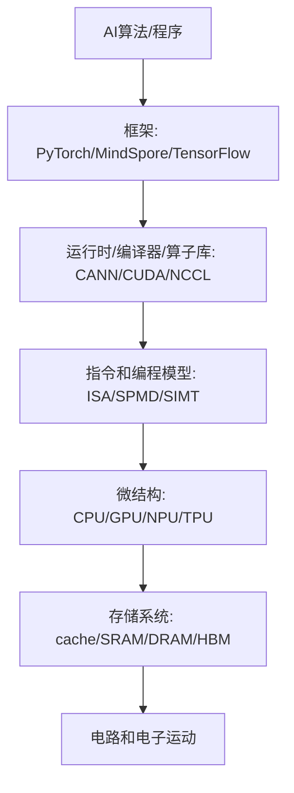
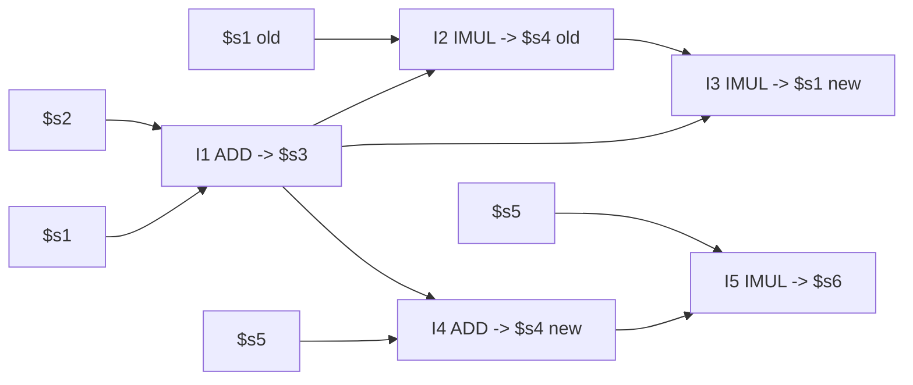

# 人工智能芯片与系统：完整知识点讲解版

这是一份单文件讲义。它不要求你再去翻 Markdown 链接，也不把原 PPT 截图当作主要内容。正文按“从零理解 -> 期末重点 -> 图表含义 -> 例题方法”的顺序组织，目标是让你能直接从头读到尾完成复习。

考试边界按老师说明处理：第 1-16 讲 PPT 都纳入复习；第 15 讲 FlashAttention 主体部分不作为考试重点；明显前沿研究介绍只保留“它想解决什么瓶颈”的直觉，不作为公式、状态表或主背内容。

阅读方法很简单：先读第一部分建立完整知识体系；再读第二部分理解 PPT 图和表背后的含义；第三部分按第 16 讲总复习检查重点；最后用第四部分掌握老师点名的题型。

# 第一部分：完整知识点讲解

这份讲义按第 16 讲总复习的脉络组织，同时回到 1-15 讲补充定义、公式、硬件结构、数据结构、通信模式和常见考法。你可以把它当作“从零开始的期末复习课”。

## 0. 这门课到底在讲什么

人工智能芯片与系统不是只讲“某个芯片长什么样”，也不是只讲“深度学习算法”。它讲的是：一个 AI 程序从高级框架写出来以后，如何一路变成芯片上的电路活动，并且为什么性能、能耗、带宽、通信会成为瓶颈。

课程主线可以理解为一条转换链：



### 0.1 为什么不能一上来只讲 AI 芯片

因为 AI 芯片仍然是计算机系统的一部分。你必须先理解：

- 为什么计算机会有“指令、寄存器、内存、流水线”这些抽象。
- 为什么程序看起来是顺序执行，底层却可能流水、乱序、并行。
- 为什么算力很高时，内存和通信反而变成瓶颈。
- 为什么深度学习加速器喜欢矩阵乘、低精度、片上 buffer、数据复用。
- 为什么训练大模型时，一个 GPU 不够，需要数据并行、流水并行、张量并行和 collective communication。

### 0.2 体系结构和微结构

狭义的 computer architecture 常指 ISA，也就是软件可见的接口：有哪些指令、寄存器、内存地址规则、异常机制。Microarchitecture 是 ISA 的实现方式：单周期、多周期、流水线、乱序、cache、分支预测、GPU warp 调度等。

同一个 ISA 可以有不同微结构。例如同样执行 `ADD`，可以：

- 单周期 CPU：一个很长的周期做完取指、译码、读寄存器、执行、写回。
- 多周期 CPU：一条指令拆成多个短周期。
- 流水线 CPU：多条指令在不同阶段重叠。
- 乱序 CPU：准备好的指令先执行，最后按程序顺序提交。

### 0.3 期末复习时最重要的能力

考试通常不会只问“背定义”。更可能考：

- 给你一个公式或硬件参数，让你算性能。
- 给你一串指令，让你判断 RAW/WAR/WAW、ROB、Tomasula 表、执行周期。
- 给你一个 cache 配置和地址序列，让你判定 hit/miss 和 miss 类型。
- 给你一个并行训练切分方式，让你说出需要 AllReduce、AllGather 还是 ReduceScatter。
- 给你一个硬件/算法场景，让你判断瓶颈在算力、访存、同步还是通信。

## 1. 性能模型：Amdahl、Roofline、Little、CPI

性能模型是这门课的第一根主线。你需要用它判断“优化哪里最有效”。

### 1.1 Amdahl's Law

Amdahl 定律回答的是：如果一个程序中只有一部分能被加速，那么总加速比最多是多少。

设程序中可被加速部分比例为 `f`，这部分加速 `S` 倍，则总加速比：

```text
Speedup = 1 / ((1 - f) + f / S)
```

关键含义：

- 串行部分会限制总加速比。
- 即使把某个部分加速到无限快，程序仍然要花 `1-f` 的时间。
- 因此系统优化不能只盯一个局部，要看整体瓶颈。

常见考法：给出“80% 可并行，加速 10 倍”，问总加速比。答案是 `1/(0.2+0.8/10)=3.57`。

### 1.2 Roofline Model

Roofline 是期末最重要性能模型之一。它回答：一个 kernel 的性能上限由算力限制还是内存带宽限制。

核心定义：

```text
Arithmetic Intensity (AI) = Total FLOPs / Total Memory Bytes
Attainable FLOP/s = min(Peak FLOP/s, AI * Peak Memory Bandwidth)
```

解释：

- `Peak FLOP/s` 是机器算力屋顶。
- `Peak Memory Bandwidth` 是内存带宽斜线的斜率。
- `AI` 越大，说明每搬一个 byte 能做更多计算，越可能 compute-bound。
- `AI` 越小，说明计算少、搬数据多，越可能 memory-bound。

判断规则：

```text
如果 AI * Bandwidth < Peak Compute，则 memory-bound
如果 AI * Bandwidth >= Peak Compute，则 compute-bound
拐点 AI* = Peak Compute / Bandwidth
```

### 1.3 Roofline 的三步

PPT 中强调 Roofline 的三个步骤：

1. Machine characterization：测机器的 peak compute 和 memory bandwidth。
2. Application characterization：算应用的 arithmetic intensity。
3. Application execution monitoring：测真实吞吐，看距离 roof 有多远。

优化方向：

- memory-bound：优先减少访存、提升局部性、用 cache/shared memory/tiling、提高数据复用。
- compute-bound：优先向量化、用 FMA、提高并行度、使用 tensor core/cube 等专用计算单元。
- 如果真实性能远低于 roof：说明还有额外问题，例如分支、同步、访存不合并、occupancy 低、cache miss 高。

### 1.4 PPT 中的 Roofline 例子

7-point stencil：

```text
Memory = 16 bytes/iteration
Compute = 7 flops/iteration
AI = 7 / 16 = 0.4375 flops/byte
```

STREAM Triad：

```text
Memory = 24 bytes/iteration
Compute = 2 flops/iteration
AI = 2 / 24 = 0.083 flops/byte
```

STREAM Triad 的 AI 更小，通常更 memory-bound。考题不会一定给原题，但你必须会：

- 数 FLOPs。
- 数 bytes。
- 算 AI。
- 代入 `min(peak, AI * bandwidth)`。
- 判断优化方向。

### 1.5 Little's Law

Little 定律：

```text
L = λ * W
```

其中：

- `L`：系统中平均有多少个请求。
- `λ`：吞吐率，单位时间完成多少请求。
- `W`：每个请求平均停留时间，也就是延迟。

硬件中的直觉：

```text
需要的并发请求数 = 目标吞吐率 * 单个请求延迟
```

例如内存访问延迟很长，如果想保持高带宽，就必须同时发出很多未完成请求。这也是 GPU 需要大量线程/warp 来隐藏内存延迟的根本原因。

### 1.6 CPI 和 CPU Time

基础公式：

```text
CPU time = Instruction Count * Average CPI * Clock Cycle Time
Average CPI = Σ(指令比例 * 该类指令CPI)
```

单周期 CPU：

- CPI = 1。
- 但 clock cycle time 很长，因为一个周期要容纳最慢指令。

多周期 CPU：

- 每类指令 CPI 不同。
- clock cycle time 可以变短。
- 平均 CPI 要按指令比例加权。

流水线 CPU：

- 理想情况下 CPI 接近 1。
- 真实情况下会有 structural/data/control hazards，导致 stall。

## 2. CPU 基础：冯诺依曼、ISA、单周期、多周期、流水线

### 2.1 冯诺依曼模型

冯诺依曼模型的关键性质：

- 程序和数据都存在内存中。
- CPU 按指令周期处理：fetch、decode、execute、memory、write back。
- 指令按程序顺序定义语义。
- ISA 定义软件可见状态：寄存器、PC、内存、指令格式。

抽象上，程序执行就是把 architectural state `AS` 变成 `AS'`。

### 2.2 单周期 CPU

单周期 CPU 每条指令一个周期完成。优点是概念简单，缺点是周期必须足够长，以便最慢指令也能完成。

典型数据通路包含：

- PC：保存当前指令地址。
- Instruction Memory：取指。
- Register File：读/写寄存器。
- ALU：算术逻辑。
- Data Memory：load/store。
- Control：根据 opcode 产生控制信号。

考试可能给一条 MIPS 指令，让你说数据从哪里流到哪里、控制信号如何设置。

### 2.3 多周期 CPU

多周期 CPU 把一条指令拆成多个阶段。优点：

- 每个周期更短。
- 不同指令可用不同周期数。
- 硬件单元可以在不同周期复用。

例如：

- load：取指、译码、地址计算、读内存、写回。
- store：取指、译码、地址计算、写内存。
- arithmetic：取指、译码、ALU、写回。
- branch：取指、译码、比较/改 PC。

### 2.4 流水线基本思想

流水线把指令处理拆成阶段，让多条指令重叠执行。经典五级：

```text
IF -> ID -> EX -> MEM -> WB
```

理想情况下，流水线填满后每周期完成一条指令，吞吐提高。但单条指令延迟不一定变短。

### 2.5 Pipeline hazards

三类 hazard：

1. Structural hazard：硬件资源冲突。例如同一个周期两条指令都要访问同一块 memory 或 register file 端口不够。
2. Data hazard：数据依赖导致后一条指令需要前一条结果。
3. Control hazard：分支跳转导致取错指令。

PPT 中重点讲 data dependence：

- RAW = Read After Write，真依赖/flow dependence。后指令读前指令写的值。
- WAR = Write After Read，反依赖/anti dependence。后指令写的寄存器是前指令要读的寄存器。
- WAW = Write After Write，输出依赖/output dependence。两条指令写同一寄存器，写入顺序必须正确。

RAW 是真正的数据依赖，不能靠改名消除；WAR/WAW 是 false dependence，来自 architectural register 名字不够，可以靠 register renaming 消除。

### 2.6 处理 data hazard：stall、compiler、forwarding

三种基本方法：

- Hardware stall：硬件检测到依赖，暂停后一条指令。
- Compiler scheduling：编译器插入 NOP 或重排独立指令。
- Forwarding/bypassing：结果尚未写回寄存器时，直接从后级流水线转发给前级使用。

Forwarding 不是万能的。例如 load-use hazard 中，数据要到 MEM 后才出来，下一条紧跟使用时可能仍需 stall。

### 2.7 精确异常 precise exception

Precise exception 的含义：发生异常时，architectural state 看起来像是按程序顺序执行到某条指令边界：

- 异常之前的指令都已经提交。
- 异常之后的指令都没有改变 architectural state。
- PC、寄存器、内存状态一致。

这就是为什么乱序执行还需要 in-order commit。

## 3. ROB、Tomasula、乱序执行

这是老师额外强调的重点，必须会表格和更新规则。

### 3.1 为什么需要 ROB

Reorder Buffer 的作用：

- 支持 out-of-order completion，但 in-order retirement/commit。
- 保存未提交指令的结果。
- 保证 precise exception。
- 通过把 architectural register 映射到 ROB entry，消除 WAR/WAW false dependence。

PPT 中 ROB 的基本流程：

1. Decode 时按程序顺序分配 ROB entry，并重命名目的寄存器。
2. 指令执行完成后，可以乱序把结果写入 ROB entry。
3. 当指令成为 ROB 中最老指令且无异常，按程序顺序 commit，把结果写入 register file 或 memory。

ROB entry 通常要保存：

- 指令类型。
- 目的寄存器或 store 地址。
- 结果值。
- ready/valid bit。
- exception 状态。
- 程序顺序信息。

### 3.2 只有 ROB 还不够

只有 ROB 的 in-order dispatch 机器可以消除 false dependence，但遇到 true dependence 时，年轻的独立指令仍可能被挡住。问题是：

```text
ADD 依赖一个长延迟 load，后面的独立指令也无法越过它去执行。
```

解决：reservation station，让等待数据的指令先进入“等待区”，独立指令可以继续进入并在 ready 后先执行。

### 3.3 Reservation Station 的含义

Reservation Station 是功能单元前的等待队列/缓冲区。它保存一条已经发射但还没开始执行或正在等待操作数的指令。

核心思想：

- 依赖指令不要堵住流水线前端。
- 操作数 ready 的指令可以按 dataflow order 执行。
- 指令执行顺序由“数据是否 ready”决定，而不是完全由程序顺序决定。

RS entry 常见字段：

```text
Busy / Op / DestTag
Source1: V, Tag, Value
Source2: V, Tag, Value
```

PPT 中简化为：

```text
Source 1: V, Tag, Value
Source 2: V, Tag, Value
```

含义：

- `V=1`：这个源操作数的值已经 ready，直接看 `Value`。
- `V=0`：值还没 ready，需要等某个 producer，producer 的名字在 `Tag`。
- `Tag`：不是寄存器名，而是 producer 的 reservation station entry 或 ROB entry。
- `Value`：操作数真实数值。

### 3.4 Register Rename Table / Register Alias Table

Register Rename Table 记录 architectural register 当前最新值在哪里。

PPT 中字段：

```text
Register | Valid | Tag | Value
```

含义：

- `Valid=1`：该寄存器当前 architectural value 已经在 register file，可以直接读 `Value`。
- `Valid=0`：该寄存器将由某个尚未完成的指令产生；`Tag` 指向那个 producer。
- `Tag`：RS entry 或 ROB entry 的编号。
- `Value`：当 valid 时保存寄存器值。

为什么能消除 WAR/WAW：

- 同一个寄存器名在不同时刻可以被重命名为不同 tag。
- 后续消费者不再看“寄存器名”，而看“产生它的 tag”。
- 写回时只有 tag 匹配当前 rename table 的项，才更新 register file；否则说明这个结果已经被更新的写者覆盖，不能把老值写回。

### 3.5 Tomasula 的四个阶段

按 PPT 整理：

1. ID/Issue/Rename：
   - 如果有空 RS entry，指令占用一个 RS。
   - 对每个源寄存器：若 RF/RAT valid=1，则把值复制到 RS 的 source.value，并置 source.V=1；否则把 producer tag 复制到 RS.source.tag，并置 source.V=0。
   - 对目的寄存器：把 RAT 的 tag 改成当前 RS/ROB tag，valid 置 0。
   - 如果没有空 RS，则 stall。

2. RS 等待和 wakeup：
   - RS 监听 Common Data Bus (CDB)。
   - 如果 CDB 上广播的 tag 等于某个 source.tag，就抓取 value，把 source.V 置 1。

3. Dispatch/Execute：
   - 当所有 source.V 都为 1，且对应功能单元可用，该指令可以发给 FU。
   - 这就是 wakeup and select。

4. Writeback/Broadcast：
   - FU 产生结果后，在 CDB 上广播 `(tag, value)`。
   - RAT/RF 如果当前 tag 匹配广播 tag，则写入 value 并 valid=1。
   - 所有 RS 也用广播 tag 更新等待的 source。

如果加上 ROB，还要区分“写回临时结果”和“提交 architectural state”：

- 执行完成：结果进 ROB。
- commit：ROB 头部 ready 且无异常，才写 architectural register/memory。

### 3.6 两个 hump

现代乱序流水线的两个关键 hump：

- Hump 1：Reservation stations，实现 in-order issue 后的 out-of-order dispatch/execute。
- Hump 2：Reorder buffer，实现 out-of-order completion 后的 in-order commit。

### 3.7 Tomasula 必背总结

```text
Register renaming eliminates false dependences.
Reservation stations buffer waiting instructions.
Tag broadcast communicates produced values to consumers.
Wakeup and select enables out-of-order dispatch.
ROB enables precise exception through in-order commit.
```

## 4. Superscalar、SIMD、Multithreading、Multicore

### 4.1 Superscalar

Superscalar 指一个周期可以发射/执行多条指令。它提高 instruction-level parallelism，但硬件复杂度高：

- 需要多端口 register file。
- 需要更复杂依赖检测。
- 需要多个功能单元。
- 需要更宽的 fetch/decode/issue/commit。

对 Roofline 的影响：

- 可能提高 peak compute roof。
- 如果应用 memory-bound，单纯提高 superscalar 宽度不一定有用。

### 4.2 Flynn 分类

- SISD：单指令单数据，传统顺序机。
- SIMD：单指令多数据，一条指令同时处理多个数据。
- MISD：多指令单数据，实际少见，PPT 提到最接近形式可联系 systolic/streaming。
- MIMD：多指令多数据，多核/多处理器。

### 4.3 SIMD

SIMD 的直觉：一个操作对多个数据元素重复执行。例如 256-bit AVX2 可以一次处理 8 个 32-bit float。

优点：

- 控制开销低。
- 数据级并行高。
- 提高 peak FLOP/s。

限制：

- 需要数据规整。
- 分支/不规则访存会降低利用率。
- 受向量宽度影响。

### 4.4 Fine-grained multithreading

细粒度多线程通过在多个线程/warp 间切换，隐藏长延迟操作。GPU 的 warp-level FGMT 是典型例子：

- 一个 warp 等内存时，调度另一个 ready warp。
- 需要大量线程上下文保存在 register file 中。
- 用吞吐换延迟隐藏。

### 4.5 Multicore

多核相比超大单核：

- 更容易扩展吞吐。
- 每个小核简单、能效更好。
- 需要处理共享 cache、DRAM、公平性、coherence/consistency。

## 5. 存储系统：SRAM、DRAM、HBM、SSD 与数据移动瓶颈

### 5.1 理想存储不存在

理想存储需要四个性质：

- zero latency。
- infinite capacity。
- infinite bandwidth。
- zero cost。

现实中这些目标相互矛盾：

- 越大通常越慢。
- 越快通常越贵。
- 越高带宽需要更多 bank、port、channel 或更先进技术。

### 5.2 存储技术比较

从快到慢、从小到大大致是：

```text
Register/FF -> SRAM -> HBM/DRAM -> SSD -> Disk
```

PPT 中的典型数量级：

- SRAM：KB-MB，纳秒级，贵，片上 cache/shared memory/buffer。
- DRAM：GB，约几十 ns，便宜，主存。
- HBM：容量比片上 SRAM 大，带宽远高于普通 DDR，常在 GPU/NPU 上。
- SSD：TB，延迟更高，吞吐低于 HBM/DRAM，但容量大。

### 5.3 数据移动比计算更贵

PPT 给出的能耗表强调：

- 32-bit integer ADD 约 0.1 pJ。
- SRAM cache 约 5 pJ，约 50 倍。
- DRAM 约 640 pJ，约 6400 倍。

所以 AI 加速器设计的核心不是“只堆算力”，而是减少数据搬运：

- 尽量在片上复用数据。
- 用 tiling/blocking。
- 用 scratchpad/global buffer。
- 用低精度减少字节数。
- 用算子融合减少中间结果写回 HBM。

### 5.4 SRAM

SRAM 位单元通常由交叉耦合反相器保存数据，再用访问晶体管连接 bitline。特点：

- 快。
- 不需要 refresh。
- 成本高、面积大。
- 适合片上 cache、GPU shared memory、AI accelerator on-chip buffer。

Banking：

- 把存储分成多个 bank。
- 不同 bank 可并行访问。
- 若多个访问落到同一个 bank，就发生 bank conflict。

### 5.5 DRAM

DRAM 单元由电容和访问晶体管构成。特点：

- 密度高，容量大。
- 电容会漏电，需要 refresh。
- 读操作会破坏电荷，需要感放和恢复。
- 访问延迟较高。

DRAM 层次：

```text
Channel -> DIMM -> Rank -> Chip -> Bank -> Row/Column
```

DRAM bank 有 row buffer。三种访问状态：

- Row buffer hit：要访问的 row 已经打开，延迟最低。
- Row closed/conflict：要打开新 row，可能需要 precharge 和 activate，延迟更高。
- Refresh 冲突：refresh 期间 bank/rank 不可用，访问延迟变长。

### 5.6 HBM

HBM 把多层 DRAM die 堆叠在一起，通过硅中介层和 GPU/NPU 靠近连接。优点：

- 很高带宽，PPT 中提到每 stack 可达约数百 GB/s。
- 与加速器距离近，适合高吞吐 AI 计算。

缺点：

- 成本高。
- 容量仍有限。
- 封装复杂。

## 6. Cache、Coherence、Consistency

### 6.1 为什么 cache 有用

Cache 利用 locality：

- Temporal locality：刚访问过的数据很可能很快再次访问。
- Spatial locality：访问某地址附近的数据也可能被访问。

Cache block/line 是 cache 管理的基本单位。访问某个地址 miss 时，通常把整个 block 搬入 cache。

### 6.2 Cache 设计三问

1. Placement：一个 memory block 可以放到 cache 的哪里？
2. Replacement：cache 满了替换谁？
3. Write policy：写操作如何处理？

### 6.3 三种映射

Direct-mapped：

- 一个 memory block 只能放一个 cache line。
- 硬件简单、快。
- 容易 conflict miss。

Fully associative：

- 一个 memory block 可放任意 cache line。
- 冲突最少。
- 硬件比较复杂，需要多路 tag 比较。

N-way set-associative：

- cache 分成多个 set，每个 set 有 N 个 way。
- block 先由 index 定位 set，再在 N 个 way 中选择。
- 是直接映射和全相联之间的折中。

公式：

```text
Cache data capacity C
Block size b
Number of cache blocks B = C / b
Associativity N
Number of sets S = B / N
Offset bits = log2(b)
Index bits = log2(S)
Tag bits = address bits - index bits - offset bits
```

### 6.4 Miss 类型

- Compulsory/cold miss：第一次访问该 block，无法避免。
- Capacity miss：cache 总容量不够，即使全相联也放不下工作集。
- Conflict miss：总容量够，但映射到同一 set/line 发生冲突。

判断技巧：

- 第一次出现一定是 compulsory。
- 如果 fully associative 同容量也 miss，可能是 capacity。
- 如果 fully associative 能 hit，而 direct/set-assoc miss，就是 conflict。

### 6.5 Replacement

Set-associative cache 中 miss 后如果 set 满了，要选 victim：

- Invalid block first。
- Random。
- FIFO。
- LRU。
- Pseudo-LRU。
- Belady OPT 理论最优：替换未来最晚再访问的 block，但实际无法在线实现。

注意：LRU 不总是最好。若 4-way cache 循环访问 A/B/C/D/E，LRU 可能一直 thrashing。

### 6.6 Write policy

两个维度：

写 miss 时：

- Write-allocate：先把 block 读入 cache，再写。
- Write-no-allocate：直接写内存，不放 cache。

写 hit 时：

- Write-back：先写 cache，等 eviction 时写回内存。需要 dirty bit，节省带宽。
- Write-through：同时写 cache 和 memory。简单但带宽压力大。

### 6.7 Cache performance

常见公式：

```text
AMAT = Hit time + Miss rate * Miss penalty
```

注意题目可能说“miss access time”而不是“miss penalty”。若 miss access time 是 miss 总访问时间，则：

```text
AMAT = HitRate * HitTime + MissRate * MissTime
```

若 miss penalty 是额外惩罚，则用 `HitTime + MissRate * MissPenalty`。

### 6.8 Private vs shared cache

Private cache：

- 每个 core 有自己的 cache。
- 低延迟。
- 多个 cache 可能保存同一 block，需要 coherence。

Shared cache：

- 多个 core 共用。
- 容量可动态共享。
- coherence 更简单。
- 访问更慢，且不同 core 会相互污染 cache。

### 6.9 Coherence vs Consistency

这是易混点。

Cache coherence：

- 关注不同处理器对同一个 memory location 的操作顺序。
- 本质是“同一个地址的最后写入值，各 core 看到要一致”。

Memory consistency：

- 关注不同处理器对所有 memory locations 的操作顺序。
- 本质是“多地址操作在全局上以什么顺序可见”。

Coherence 的三个特征：

- Program order preservation：同一 core 写 X 后读 X，应读到自己写的值。
- Coherent memory view：一个 core 写 X 后，足够长时间后其他 core 能读到新值。
- Write serialization：多个 core 对同一地址的写，所有 core 看到的顺序一致。

### 6.10 MSI

MSI 三态：

- I Invalid：cache 中没有有效副本。
- S Shared：一个或多个 cache 有干净副本，可读。
- M Modified：只有一个 cache 有该 block，且已修改，可读写。

问题：MSI 中第一次 read miss 后进入 S，即使实际上只有一个副本。随后本地写还要发 invalidate，可能多余。

### 6.11 MESI

MESI 加入 E Exclusive：

- E：只有一个 cache 有干净副本。
- 在 E 状态本地写可以无 bus action 地变成 M。
- 远程 read miss 会使 E 变 S。
- 远程 write miss 会使 E 变 I。

MESI 相比 MSI 减少了独占干净数据上的无用 invalidate。

### 6.12 Snoop vs Directory

Snoop-based：

- 基于 bus。
- 每个 bus action 广播给所有 cache。
- bus 是全局串行点。
- 简单但扩展性差。

Directory-based：

- directory 记录每个 block 被哪些 cache 持有。
- local node 发 getS/getEx 给 home node。
- directory 决定是否发 invalidate、是否从 memory 或其他 cache 取数据。
- 每个 block 有自己的 serialization point，更可扩展。

Directory entry 可包含：

- 状态位。
- owner。
- sharer bit vector。

## 7. GPU 架构与优化

### 7.1 CPU 和 GPU 的关系

CPU：

- 少量强核。
- 大 cache。
- 擅长复杂控制流、低延迟任务。

GPU：

- 大量简单计算单元。
- 高内存带宽。
- 擅长规则数据并行、高吞吐任务。

GPU 本质上是 SIMD/SIMT 机器，但程序员写的是线程。

### 7.2 Programming model vs hardware execution model

Programming model 是程序员看到的模型，例如 CUDA 的 thread/block/grid。

Hardware execution model 是硬件实际如何执行，例如 SIMT、warp、SM、scheduler。

PPT 重点：

- GPU 用 SPMD 编程：Single Program Multiple Data。
- 每个线程执行相同 kernel，但处理不同数据。
- 硬件把线程动态分组成 warp。
- Warp 中线程 lock-step 执行同一指令。

### 7.3 CUDA 基本概念

- Kernel：在 GPU 上执行的函数。
- Thread：最小编程执行单元。
- Block：线程组；同一个 block 内可共享 shared memory，可用 `__syncthreads()` 同步。
- Grid：一次 kernel launch 中所有 blocks。
- `threadIdx`：线程在 block 内编号。
- `blockIdx`：block 在 grid 中编号。
- `blockDim`：每个 block 的线程数。

常见一维索引：

```c
int i = blockIdx.x * blockDim.x + threadIdx.x;
if (i < N) { ... }
```

若 N 不是 block size 的整数倍，要 launch 多一点线程，并用边界判断过滤。

### 7.4 SIMT 与 warp

SIMT = Single Instruction Multiple Thread。

Warp：

- 通常 32 个连续线程。
- 是硬件调度基本单位。
- 同一个 warp 中线程同一时刻执行同一指令。

传统 SIMD 和 warp-based SIMD 区别：

- 传统 SIMD 对程序员暴露向量宽度。
- GPU 程序员写标量线程，硬件动态把线程分成 warp。
- SIMT 可以把每个线程当作独立上下文，也能把同指令线程合并执行。

### 7.5 Branch divergence

如果同一个 warp 中不同线程走不同分支，就发生 divergence。硬件通常串行执行各分支路径，并 mask 掉不活跃线程，导致利用率下降。

优化原则：

- 尽量让同 warp 线程走相同控制流。
- 用 `threadIdx.x < 32` 这类 warp-aligned 条件比 `threadIdx.x % 2 == 0` 更好。

### 7.6 Latency hiding and occupancy

GPU 不靠让单个内存访问变快，而靠大量 warp 隐藏延迟。

Fine-grained multithreading：

- 当一个 warp 等内存时，scheduler 切换到另一个 ready warp。
- 足够多 active warps 才能隐藏长延迟。

Occupancy：

- SM 上 active warps/blocks 与硬件最大值的比例。
- occupancy 太低会导致延迟隐藏不足。
- occupancy 受 registers、shared memory、block size 等限制。

### 7.7 GPU memory hierarchy

CUDA 程序常见内存：

- Global memory：HBM/DRAM，容量大，延迟高。
- Shared memory：片上 scratchpad，block 内共享，快，但容量小。
- Registers：每线程私有，最快。
- Constant/texture memory：特殊用途。
- L1/L2 cache：硬件管理。

优化核心：减少 global memory 访问，提升 coalescing，用 shared memory 做数据复用。

### 7.8 Memory coalescing

当一个 warp 中线程访问连续地址，硬件可合并成少数 memory transaction。若访问分散，需要多个 transaction，带宽利用率低。

规则直觉：

- 连续线程访问连续数据最好。
- stride 访问、乱序访问、非对齐访问会降低 coalescing。

### 7.9 Shared memory bank conflict

Shared memory 分成多个 bank。若同一 warp 中多个线程访问同一个 bank 的不同地址，会发生 bank conflict，访问被串行化。

PPT 中强调：

- Bank conflict 只在 warp 内考虑。
- 常见 bank 映射可近似理解为 `bank = address % number_of_banks`。
- 可以通过 padding、改变 layout、XOR/hash 等减少冲突。

### 7.10 Tiled matrix multiplication

Naive matrix multiplication 每个输出元素反复从 global memory 读 A 和 B。Tiling 的思想：

1. 每个 block 负责 C 的一个 tile。
2. 把 A 和 B 的小 tile 搬到 shared memory。
3. `__syncthreads()` 等所有线程加载完。
4. 在 shared memory 上反复复用数据做乘加。
5. 再加载下一块 tile。

这对应 Roofline 中提高 AI：同样的 global memory bytes 支撑更多 FLOPs。

### 7.11 Reduction 和 atomic

Reduction 要把多个元素合并为一个结果。优化点：

- tree-based reduction 减少串行依赖。
- shared memory 减少 global memory 访问。
- warp shuffle/unrolling 减少同步开销。
- atomic 可避免 data race，但冲突高时会慢。

### 7.12 CUDA streams、异步拷贝、TMA

CUDA streams 是命令队列，可用于重叠数据传输和计算。

新 GPU 支持 global memory 到 shared memory 的异步拷贝，如 LDGSTS/TMA：

- 减少 register 中转。
- TMA 可更高效搬运大块多维数据。
- 目标仍然是让计算单元少等数据。

## 8. AI 加速器

### 8.1 为什么需要 AI 加速器

深度学习有几个特点：

- 大量矩阵乘、卷积、向量运算。
- 可容忍一定低精度。
- 数据复用机会大。
- 内存带宽和能耗是瓶颈。

CPU 通用性强，但为复杂控制和通用程序付出面积/能耗；AI 加速器牺牲部分通用性，换更高能效。

### 8.2 深度学习算子特点

卷积层：

- 核心是滑动窗口乘加。
- 计算量大。
- input feature map、weight、output feature map 都有复用。
- 可转成矩阵乘实现。

激活函数：

- 逐元素操作。
- 计算简单，访存相对占比高。

池化：

- 局部窗口取 max/avg。
- 计算不复杂，但要读多个输入。

全连接：

- 本质矩阵向量/矩阵矩阵乘。
- weight 量大。

Attention：

- 核心是矩阵乘，例如 QK^T、softmax、PV。
- 标准 attention 计算复杂度约 `O(S^2 D)`。
- 中间 score/probability 矩阵内存复杂度约 `O(S^2)`。

第 15 讲 FlashAttention 不考，但它的思想可作为理解内存瓶颈的例子：不改变理论计算量，而通过 tiling 避免完整 `S x S` 矩阵写入 HBM，用更多片上复用减少数据搬运。

### 8.3 AI 加速器设计原则

从 PPT 抽象出的核心原则：

- 使用简单并行计算模块满足领域需求，例如矩阵乘单元。
- 使用低精度减少数据尺寸和能耗。
- 使用片上 buffer/scratchpad 减少外部内存访问。
- 针对数据流组织复用。
- 提供运行时/算子库/编译器，让程序员能使用硬件。

### 8.4 Cache or Buffer

CPU 喜欢 cache：

- 程序透明。
- 硬件自动管理。
- 适合不可预测访问。

AI 加速器喜欢 buffer/scratchpad：

- 程序/编译器显式管理。
- 可控数据搬运。
- 去掉复杂 tag、coherence、replacement 逻辑。
- 更适合规则张量计算。

缺点是编程更难，需要知道数据在哪个 buffer。

### 8.5 数据流：WS、OS、IS、RS

目标：减少 global buffer/HBM 访问，最大化片上复用。

Weight Stationary：

- weight 尽量停留在 PE/阵列中。
- input/output 流过。
- 适合权重复用高的场景，例如 TPU systolic array。

Output Stationary：

- partial sum/output 留在 PE 中不断累加。
- 减少部分和反复写回。

Input Stationary：

- input 留在本地，复用多个 weight。

Row Stationary：

- 尝试综合利用 input、weight、partial sum 的复用。

考试可能问“stationary 是什么意思”：不是数据完全不动，而是某类数据尽量保持在低层存储/PE，减少昂贵搬运。

### 8.6 Ascend/Davinci Core

PPT 中 Ascend AI Core 关键模块：

- Cube：矩阵运算核心。负责高吞吐矩阵乘，如 FP16 16x16 矩阵乘，int8 可支持不同形状。
- Vector：向量运算，多面手，支持 FP16/FP32/int32/int8 等，处理激活、逐元素、格式转换等。
- Scalar：小 CPU/司令部，负责循环控制、分支、地址和参数计算。
- MTE：数据搬运引擎。
- L0A/L0B/L0C、UB、Scalar Buffer：不同层级片上存储。

重点不是背每个硬件细节，而是理解：

```text
Cube 做密集矩阵乘
Vector 做逐元素/后处理
Scalar 做控制
MTE 做搬运
Buffer 承载显式数据复用
```

### 8.7 TPU 和 systolic array

Systolic array 的基本原则：

```text
用规则 PE 阵列替代单个 PE，并精心安排数据在 PE 间流动。
```

像心脏泵血一样，数据有节奏地从一个 PE 流到下一个 PE。优点：

- 规则结构，适合 VLSI。
- 局部通信，减少全局连线。
- 高数据复用。
- 适合矩阵乘/卷积。

TPU v1 使用大规模矩阵乘单元。PPT 中提到：

- TPU1 有 256 x 256 matrix multiply unit。
- TPU2/TPU3 有两个 128 x 128 matrix multiply units。
- TPU 从 v1 到 v2/v3 增强训练能力、HBM、vector unit、interconnect。

### 8.8 低精度

为什么低精度可行：

- ML 任务常容忍近似。
- 推理中 int8 量化常可保持可接受精度。
- 训练中 FP16/BF16/TF32/FP8 等降低带宽和算力压力。

硬件支持低精度的意义：

- 每次搬运更少 bytes。
- 同样面积/功耗下更多 MAC。
- 降低能耗。

注意：低精度不是随便降。不同模型、层、任务需要不同精度；过低会损失精度或收敛质量。

## 9. Runtime、CANN、MindSpore、算子和图优化

### 9.1 为什么需要 AI Framework

AI 任务变化多，但建立在共同算子上。框架把常用操作封装，降低开发复杂度，并把模型交给后端编译/运行时优化。

典型层次：

```text
AI Framework: MindSpore/PyTorch/TensorFlow
Runtime/Compiler/Graph Engine: CANN/GE/CUDA runtime
Operator Library: NN/CUBLAS/cuDNN/Ascend NN
Hardware: GPU/NPU/TPU
```

### 9.2 Tensor 和算子

Tensor 是多维数组。CNN feature map 常用 4D 格式，例如 NCHW 或 NHWC。

Operator 是计算图节点，例如 Conv、Pool、ReLU、MatMul、AllReduce。一个网络就是多个算子组成的图。

### 9.3 CANN 算子开发

PPT 中比较：

- TBE DSL：Python，封装高，适合简单向量/矩阵/池化算子，入门低。
- TIK：Python API，手工控制数据搬运和 schedule，灵活但难，性能潜力更高。
- AI CPU：C++，用于 AI Core 不适合或临时打通场景，性能较低。

### 9.4 Graph Engine

GE 的阶段：

- 图准备：构建计算图，shape 推导。
- 图拆分：子图切分和边界连接。
- 图优化：算子融合、权值格式转换、allreduce 聚合等。
- 图编译：资源分配和 task 生成。
- 图加载：加载到 runtime。
- 图执行：runtime 调度执行。

### 9.5 算子融合

算子融合把多个小算子合并成一个大算子，减少中间结果写回主存。

例子：

```text
Conv2D -> BatchNorm -> ReLU
融合为 Conv2D_BatchNorm_ReLU
```

未融合：

- Conv 写主存。
- BN 读主存再写主存。
- ReLU 读主存再写主存。

融合：

- 数据进片上 buffer 后连续完成多个操作。
- 减少 HBM/DRAM 读写。

### 9.6 MindSpore 关键技术

PPT 中列出：

- 自动并行：整图切分，结合数据并行和模型并行，考虑集群拓扑，降低通信。
- 二阶优化：利用二阶信息改善梯度方向，加快收敛。
- 动静态图结合：兼顾开发灵活性和执行效率。
- AI+科学计算：拓展框架边界。

期末更可能考概念关系，而不是深挖框架 API。

## 10. 并行训练

这是老师点名重点，尤其 tensor parallel 和 AllReduce。

### 10.1 神经网络训练一轮

一个 layer 的训练包括：

1. Forward pass：
   - 输入 activation `X`。
   - 用 weight `W` 计算输出 activation `Y`。

2. Backward pass：
   - 输入来自后一层的 activation gradient `dY`。
   - 计算 weight gradient `dW`，用于更新参数。
   - 计算 activation gradient `dX`，传给前一层。

3. Weight update：
   - SGD：`W = W - lr * dW`。
   - Adam 等优化器还要维护 optimizer states。

### 10.2 为什么需要 distributed training

原因：

- 模型参数太大，单卡显存放不下。
- activation、gradient、optimizer state 占显存。
- 数据集和训练时间巨大，需要多卡提高吞吐。
- 单卡算力/带宽有限。

### 10.3 Data Parallel

Data parallel：

- 每个 worker 有完整模型副本。
- minibatch 被切成多份，每个 worker 处理一部分数据。
- Forward 不需要通信。
- Backward 每个 worker 产生局部梯度。
- Weight update 前要把所有 worker 的梯度求和/平均。

通信：

```text
AllReduce of gradients/weights
```

优点：

- 简单。
- 适合模型能放进单卡的情况。

挑战：

- AllReduce 通信量大。
- batch size 变大后可能影响收敛。
- optimizer state 在每张卡上重复，占显存。

### 10.4 Ring AllReduce

Ring AllReduce 两阶段：

1. ReduceScatter：`N-1` 轮，每轮每个 worker 发送/接收 `M/N` 数据。
2. AllGather：`N-1` 轮，每轮每个 worker 发送/接收 `M/N` 数据。

总轮数：

```text
2(N - 1)
```

每个 worker 总发送量：

```text
2(N - 1) * M/N = 2M(N-1)/N
```

其中：

- `N` 是 GPU/worker 数。
- `M` 是需要 AllReduce 的数据大小。

N=4 时：

- ReduceScatter 3 轮。
- AllGather 3 轮。
- 总 6 轮。
- 每个 worker 每轮发 `M/4`，总发 `6M/4=1.5M`。

### 10.5 Pipeline Parallel

Pipeline parallel：

- 把模型不同层放到不同 worker。
- 一个 minibatch 分成 microbatches，让流水线填起来。

通信：

- forward 传 activations。
- backward 传 activation gradients。
- 是相邻 stage 的 point-to-point communication。

挑战：

- pipeline bubbles，硬件空闲。
- stage 之间 load imbalance。
- 通信难完全 overlap。

GPipe 用 microbatch 减少 bubble，但 bubble 仍存在。

### 10.6 Tensor Parallel

Tensor parallel / intra-layer parallel：

- 把同一层的 weight 切到多个 worker 上。
- 每个 worker 负责该层计算的一部分。
- 解决单层太大或单卡算力不足问题。

重点是 row-wise 和 column-wise partitioning。

#### 10.6.1 Row-wise partitioning

按 weight 的行切：

```text
W = [W0; W1; W2; ...]
```

每个 worker：

- 拿到一部分 weight rows。
- 通常需要完整 input activation `X`。
- 计算一部分 output activation `Y_i`。

结果：

- output activation 被分片。
- 如果下一层需要完整 `Y`，就要 AllGather。

PPT 对应通信：

```text
Row-wise forward communication: AllGather between layers
```

#### 10.6.2 Column-wise partitioning

按 weight 的列切：

```text
W = [W0, W1, W2, ...]
```

每个 worker：

- 拿到一部分 weight columns。
- 输入 activation 也可按对应列/特征分片。
- 计算对输出的 partial sum。

因为每个 worker 只算了输出的一部分贡献，需要把 partial sums 加起来。

PPT 对应通信：

```text
Column-wise forward communication: ReduceScatter between layers
```

若每个 worker 都需要完整输出，则可能是 AllReduce；若下一层能接受分片输出，则 ReduceScatter 更合适。

### 10.7 Alternating Partitioning

交替切分的核心：让一层输出的分片形式正好成为下一层需要的输入分片，从而减少层间通信。

典型模式：

```text
Layer K: row-wise
Layer K+1: column-wise
```

row-wise 产生的 `Y_i` 分片可直接作为 column-wise 下一层的输入分片，因此两层之间不需要 AllGather。

但连续多层交替后，某些边界仍需要通信，例如 AllReduce 或 ReduceScatter，取决于下一层期望的 activation 布局。

PPT 总结：

- Data parallel：AllReduce of weights/gradients，可与计算 overlap。
- Pipeline parallel：point-wise communication of activations and activation gradients，难 overlap，难 load-balance。
- Tensor/intra-layer parallel：AllGather、ReduceScatter of activations and activation gradients；若 row-wise 和 column-wise 交替，可能出现 AllReduce。

### 10.8 ZeRO

ZeRO = Zero Redundancy Optimizer。

普通 data parallel 中，每张 GPU 都保存完整：

- parameters。
- gradients。
- optimizer states。

ZeRO 的思想：

- 每张 GPU 只保存 optimizer states 等状态的一部分。
- 减少显存冗余。

代价：

- 需要更多通信。
- 需要在显存节省和通信开销之间权衡。

### 10.9 Batch size 限制

大 batch 可提高吞吐，但不是无限好：

- BatchNorm 等可能需要足够 batch。
- 过大 batch 可能影响泛化/收敛。
- 大模型训练受显存限制，microbatch、gradient accumulation、parallelism 都是在折中显存、算力和通信。

## 11. 考前必背速查

### 11.1 公式

```text
Amdahl: Speedup = 1 / ((1-f) + f/S)
Little: L = λW
CPU time = IC * CPI * CycleTime
Average CPI = Σ fraction_i * CPI_i
Roofline: Attainable FLOP/s = min(Peak FLOP/s, AI * Bandwidth)
AI = FLOPs / Bytes
AMAT = HitTime + MissRate * MissPenalty
Cache blocks B = C / b
Sets S = B / Associativity
Ring AllReduce rounds = 2(N-1)
Ring AllReduce per-worker bytes = 2M(N-1)/N
```

### 11.2 易混概念

| 概念 A | 概念 B | 区别 |
|---|---|---|
| ISA | Microarchitecture | ISA 是软件可见接口；微结构是实现方式 |
| Latency | Throughput | 单个任务耗时 vs 单位时间完成多少任务 |
| RAW | WAR/WAW | RAW 是真依赖；WAR/WAW 是名字造成的 false dependence |
| ROB | RS | ROB 保证按序提交/精确异常；RS 等待操作数并乱序发射 |
| Cache | Buffer/Scratchpad | cache 硬件自动管理；buffer 显式管理 |
| Coherence | Consistency | 同一地址顺序 vs 所有地址全局顺序 |
| SIMD | SIMT | SIMD 暴露向量；SIMT 写线程，硬件组 warp |
| Data Parallel | Tensor Parallel | 切 batch vs 切模型参数/层内矩阵 |
| AllGather | ReduceScatter | 收集完整分片 vs 归约后分发分片 |
| AllReduce | ReduceScatter+AllGather | AllReduce 可由这两阶段组成 |

### 11.3 不要犯的错

- Roofline 中不要只看 peak FLOP/s，必须看 AI 和 bandwidth。
- Tomasula 中不要把 architectural register 名当作 producer；重命名后依赖看 tag。
- RS 中 `V=0` 时不要看 value，要等 tag 广播。
- ROB commit 必须按程序顺序，不是哪个先算完哪个先写 architectural state。
- cache 题先算 block number，再算 index/tag，不要直接用 byte address 做 index。
- 第一次访问某 block 一定是 compulsory miss。
- Row-wise/column-wise tensor parallel 的通信不要混：row-wise 产生 output shards，常 AllGather；column-wise 产生 partial sums，常 ReduceScatter/AllReduce。
- Ring AllReduce 总轮数是 `2(N-1)`，不是 `N`。

# 第二部分：PPT 图表与细节的文字解释

## 1. 读图总方法

### 1.1 系统分层图

系统分层图不是背景介绍，而是整门课的总逻辑。最上层是问题、算法和程序，最下层是逻辑门、器件和电子。中间依次经过编程语言、系统软件、ISA、微结构和硬件。考试中如果问“为什么学 AI 芯片要先学体系结构”，答案就是：AI 性能不是由单个矩阵乘公式决定，而是由算法、编译、运行时、微结构、存储和通信共同决定。

读这类图时要抓三件事：

- 上层给下层“需求”：例如 Transformer 需要大矩阵乘、Attention、AllReduce。
- 下层给上层“约束”：例如 HBM 带宽、cache miss、同步延迟、片上 buffer 容量。
- 课程每一讲都对应一层或一类约束：CPU 微结构解决指令级并行，存储层次解决容量/延迟矛盾，GPU/AI 加速器解决数据并行和矩阵计算，并行训练解决单卡算力/显存不够。

### 1.2 性能模型图

Roofline 图横轴是 arithmetic intensity，纵轴是 throughput。斜线是内存带宽上限，水平线是峰值算力上限。读图步骤固定：

1. 算 `AI = FLOPs / Bytes`。
2. 算 `AI * bandwidth`。
3. 和 `peak compute` 取最小值。
4. 如果落在斜线段，是 memory-bound；落在水平段，是 compute-bound。
5. 如果真实性能远低于上限，说明还存在利用率、访存合并、同步、分支、occupancy 等问题。

Little 定律图用银行柜台类比：吞吐率固定、服务延迟很大时，需要足够多的并发请求才能填满系统。硬件里对应的是：DRAM/HBM 延迟几十到几百周期，GPU 必须有很多 warp 同时驻留，才能在一个 warp 等内存时切换到另一个 warp。

### 1.3 数据通路和流水线图

读 datapath 图时按一条指令走数据：

- `lw`：PC 取指，寄存器读 base，ALU 算地址，data memory 读，写回 register file。
- `sw`：PC 取指，寄存器读 base 和待写数据，ALU 算地址，data memory 写，不写回寄存器。
- R-type：PC 取指，读两个寄存器，ALU 计算，写回寄存器，不访问 data memory。
- branch：PC 取指，读寄存器比较，决定 PC 是否跳转。

流水线图要区分 latency 和 throughput。单条指令要经过 IF/ID/EX/MEM/WB 多个阶段，流水线不一定缩短单条指令延迟，但理想情况下每个周期完成一条指令，提升吞吐。PPT 的洗衣图强调：瓶颈阶段决定节拍，阶段不均衡、资源冲突、依赖和分支都会让理想加速打折。

### 1.4 状态表和时序表

读表的通用方法：

- 行通常表示对象：指令、寄存器、RS entry、GPU、cache line。
- 列通常表示时间、字段或状态：cycle、valid/tag/value、chunk、MSI/MESI state。
- 不要只看最后答案，要问“哪一格在什么时候被谁更新”：这正是期末会考的地方。

## 2. 第1讲：从系统到 CPU 微结构

本讲可考核心：系统分层、Amdahl、Roofline、Little、冯诺依曼模型、ISA、指令格式、单周期/多周期/流水线 CPU。

系统和课程定位图说明：AI 训练和推理的性能问题不能只在模型层解决。深度学习长期没有爆发，PPT 用算法、数据、算力三因素说明：算法和数据成熟后，算力成为关键瓶颈。系统层把 PyTorch/TensorFlow/MindSpore、运行时、编译器、GPU/NPU/TPU、内存和互连连起来。

Roofline 图要会从图上读出两个屋顶：斜屋顶由内存带宽决定，平屋顶由峰值算力决定。PPT 里的 7-point stencil 和 STREAM Triad 是典型比较：stencil 的 AI 比 triad 高，但两者都可能远低于 peak compute，所以优化重点是访存复用而非盲目增加 ALU。图上的 HBM/cache roof 还说明：同一个 kernel 放到更高带宽层次，memory-bound 上限会抬高。

Little 定律页把“延迟隐藏”讲清楚：`需要并发量 = 目标吞吐率 * 延迟`。如果内存吞吐目标是 12GB/s、一次访问延迟 100ns，就必须允许大量 outstanding memory requests。这个思想后来直接对应 GPU occupancy 和 warp-level FGMT。

冯诺依曼图要背五部分：memory、processing unit、control unit、input、output。PPT 中强调 stored program 和 sequential instruction processing：程序和数据都存在内存中，指令按 PC 顺序取出执行。软件看到的是 architectural state，包括 PC、寄存器和内存；微结构可以内部流水、乱序，但最终必须保持 ISA 语义。

ISA 页要掌握三件事：内存组织、寄存器组织、指令集合/格式。MIPS 的例子体现 byte-addressable、base+offset load/store、R/I-type 编码、opcode 和 operands。ABI 表不太可能要求逐项背 `$at/$v0/$a0`，但要知道 ABI 是二进制模块之间关于寄存器使用、调用约定等的约定。

单周期 datapath 图的读法：所有组合逻辑必须在一个 clock cycle 内完成，所以 CPI=1 不代表快，因为周期被最慢指令决定。图里的 state elements 包括 PC、register file、memory；control logic 根据 opcode 产生 ALUOp、MemRead、MemWrite、RegWrite、MemtoReg、Branch 等信号。

多周期图的读法：一条指令拆成若干短阶段，每个阶段结束把中间结果存在内部寄存器。好处是周期变短，不同指令用不同周期数，并且硬件可复用；坏处是控制 FSM 更复杂，寄存器开销和 setup/hold 开销增加。

流水线图的读法：IF/ID/EX/MEM/WB 是时间重叠，不是把每条指令变短。PPT 中 `4 independent ADDs` 用来说明理想 steady state；resource view 用来检查同一周期有没有两条指令抢同一资源；control signal 图说明控制信号在 decode 后要随指令流过 pipeline registers，不能只在 ID 阶段使用。

LLM compute estimation 页属于系统动机。公式强调 Transformer 训练计算量和参数数 `N`、token 数 `D` 近似成正比，常见估算 `C_F+B ≈ 6ND`。考试若出现这类题，重点是会识别训练算力随模型和数据规模线性放大，而不是背某个模型表格。

## 3. 第2讲：Pipeline Hazard 与 ROB

本讲可考核心：三类 hazard、RAW/WAR/WAW、stall/forwarding/compiler scheduling、precise exception、ROB 的意义和字段。

Pipeline hazard 定义页给出总分类：structural hazard 是资源冲突，data hazard 是前序结果未 ready，control hazard 是下一条 PC 未确定。考试常让你判断某段代码属于哪类 hazard。

Structural hazard 图要看“同一周期谁抢资源”。例如 unified memory 同时取指和访存会冲突，寄存器堆读写端口不足会冲突，功能单元没 fully pipelined 也会冲突。解决办法是复制资源、增加端口、让功能单元流水化。

Data dependence 图要严格区分：

- RAW / flow dependence：后指令读前指令写的值，是真依赖，不能靠改名消除。
- WAR / anti dependence：后指令写了前指令要读的名字，是假依赖。
- WAW / output dependence：两条指令写同一名字，是假依赖。

Stall 图里的硬件动作要会说：stall 时 PC 和 IF/ID 保持不变，被阻塞的指令留在原阶段；同时向后一级注入 bubble，即清空/禁用控制信号，让后面像执行 NOP。PPT 的 `StallF/StallD/FlushE` 就是在做这件事。

Forwarding 图要抓“结果还没写回 register file，但已经在 EX/MEM 或 MEM/WB pipeline register 里”。旁路网络把这个值直接送到 ALU 输入。易错点：load-use hazard 中 load 数据通常到 MEM 末尾才可用，紧跟下一条使用时仍可能需要一个 bubble。

Precise exception 图说明：异常发生时，机器状态必须像顺序执行到某条指令边界。多周期/流水线/乱序执行都可能让后面的指令先完成，所以必须有机制保证提交顺序。

ROB 图的核心：decode 时按程序顺序分配 entry，执行可以乱序完成，结果先写进 ROB；只有 ROB head ready 且无异常时，才把结果提交到 architectural state。ROB 同时解决三类问题：

- multi-cycle execution 中结果完成时间不同。
- exception/interrupt 需要 precise state。
- WAR/WAW false dependence 可通过把目的寄存器重命名到 ROB entry 消除。

ROB entry 常见字段：busy/valid、instruction type、destination register 或 store address、value、ready/done bit、exception bit。考试给表格时，不要把 ROB ready 和 register file valid 混为一谈。

## 4. 第3讲：Tomasula、RAT、RS

本讲是老师点名重点。必须能解释 RAT 和 RS 的字段含义、何时更新、如何更新。

Two humps 图是整讲主线：第一个 hump 是 reservation stations/scheduling window，让指令 in-order issue 之后可以 out-of-order dispatch/execute；第二个 hump 是 reorder buffer/active window，让指令 out-of-order completion 之后仍然 in-order commit。图里 `TAG and VALUE Broadcast Bus` 对应 CDB，是唤醒等待者的关键。

Reservation Station 页的核心句子：把依赖指令移出主流水线，让独立指令绕过去。RS 不是寄存器文件，它是“等待区”。每个 RS entry 通常保存：

- op：要执行的操作。
- destination tag：本指令结果将以哪个 tag 广播。
- source1/source2 的 `V/tag/value`。
- busy/ready 状态。

RAT / Register Alias Table 页的核心：architectural register 不一定直接保存最新值，可能指向一个未来 producer。每个寄存器项可理解为：

- valid=1：寄存器文件中的 value 是最新 architectural/rename-visible 值。
- valid=0：最新值还没产生，要等 tag 对应的 RS/ROB entry 广播。
- tag：最新 producer 的名字。
- value：当 valid=1 时可直接读；当 valid=0 时通常旧值不能作为当前源操作数使用。

Tomasula issue/rename 规则：

1. 如果没有空闲 RS entry，不能 issue。
2. 为指令占用一个 RS entry，entry id 就是这条指令结果的 tag。
3. 对每个源寄存器查 RAT/RF：如果 valid=1，把 value 放入 RS.source.value 并设 `V=1`；如果 valid=0，把 producer tag 放入 RS.source.tag 并设 `V=0`。
4. 对目的寄存器，把 RAT[dest] 改成新 tag，valid 置 0。

CDB broadcast 规则：

1. 功能单元完成后广播 `(tag, value)`。
2. 所有 RS entry 的 source tag 若匹配，就填入 value 并设 `V=1`。
3. RAT 中如果某寄存器当前 tag 仍等于广播 tag，才把 value 写入并设 valid=1。
4. 如果 RAT tag 已被更年轻的 writer 改掉，则不能覆盖 RAT，因为这个广播值已不是该 architectural register 的最新名字。

Dispatch/wakeup 规则：RS 中所有源操作数 `V=1` 且对应 FU 可用时，该指令 ready，可以按数据流顺序 dispatch，而不是按程序顺序。PPT cycle 0-20 的表格就是这个规则的逐周期演示。读这些表时按三列走：RAT 哪些寄存器 valid 变 0，RS 哪些源等待 tag，CDB 广播后哪些 tag 被唤醒。

考试最容易错的是把 “register renaming table 更新” 和 “reservation station 更新” 混在一起：

- issue 时：RAT 的 dest 改成新 tag；RS 记录源的 value 或 tag。
- broadcast 时：RS 的等待源被唤醒；RAT 只有在 tag 仍匹配时才可 valid=1。
- commit 时：若有 ROB，则 architectural state 按 ROB 顺序更新；Tomasula 讲义页强调 CDB，但精确异常仍需要 ROB。

## 5. 第4讲：Superscalar、SIMD、多线程、多核

本讲可考核心：提高吞吐的几种路线及其瓶颈。

Superscalar 图说明：N-wide superscalar 可以每周期 fetch/decode/execute/retire 多条指令，但依赖检查、端口、调度窗口、重命名、ROB 和 bypass 网络复杂度都上升。PPT 的 in-order superscalar 例子显示：没有足够独立指令时，理想 IPC 达不到。Roofline 问法中，superscalar 增加的是 peak compute，如果程序仍 memory-bound，性能上限可能不变。

Flynn taxonomy 和 SIMD 图要会比较 SISD、SIMD、MIMD、SPMD。SIMD 是一条指令操作多个数据元素，适合向量加、图像处理、科学计算和深度学习。支持 SIMD 需要 vector register file、vector ALU、vector memory 访问。局限是内存带宽和数据布局常成为瓶颈。

Fine-grained multithreading 图说明：硬件保存多个线程上下文，每个周期换一个线程取指/执行，让单线程的依赖和内存等待被其他线程填补。它简化依赖检查、提高延迟容忍，但单线程 latency 可能变差，而且需要足够线程。

Multicore 图说明：把更多晶体管用于多个较简单核心，而不是无限扩大单个 OoO superscalar。Piranha、Niagara、POWER 系列图体现不同设计点：小核多线程强调吞吐和能效，大核强调单线程性能。考题常问 tradeoff：多核提高并行程序吞吐，但需要软件有线程级并行，并会带来 cache coherence、memory bandwidth 和 synchronization 问题。

## 6. 第5讲：Memory Overview、DRAM、HBM、Refresh

本讲可考核心：理想内存四属性、存储技术层次、SRAM/DRAM 结构、DRAM hierarchy、HBM、refresh、能耗/可靠性瓶颈。

Ideal memory 图提出四个互相冲突的目标：zero latency、infinite capacity、infinite bandwidth、zero cost。现实规律是 bigger is slower、faster is more expensive，所以必须分层。

存储技术比较图从快到慢大致是 FF、SRAM、HBM/DRAM、SSD、disk。FF 很快但面积/能耗昂贵；SRAM 快且可做 cache/buffer；DRAM 容量大但延迟高，需要 refresh；SSD/disk 容量更大但延迟跨数量级。

Memory array / SRAM 图要看 wordline、bitline、decoder、sense amplifier。读操作一般是 decoder 选中 wordline，整行 bit cell 影响 bitline，sense amplifier 放大，再由 mux 选择需要的列。Banking 图说明多个 bank 可独立访问，提升带宽，但共享总线/端口仍可能冲突。

Memory bottleneck 图从 performance、energy、reliability 三个角度说明内存重要。能耗表的核心信息是数据搬移常比计算贵得多，尤其片外 DRAM 访问远比片上计算耗能。这是 AI 加速器强调片上 buffer、tiling、data reuse 的根本原因。

DRAM subsystem 图层次：channel -> DIMM -> rank -> chip -> bank -> row/bank buffer -> column。访问状态：

- page hit：目标 row 已经 open，只需 column access，延迟最低。
- page closed：bank 没有 open row，需要 activate 后访问。
- page miss/conflict：另一个 row 已经 open，要 precharge 关闭旧 row，再 activate 新 row，再 column access，延迟最高。

Transferring a cache block 表格页说明一次 cache line 传输不是一个抽象动作，而是被 DRAM burst、channel width、chip/rank/bank 组织拆成多个周期。读图时要把“cache block 大小”和“每次 DRAM 数据总线能给多少字节”联系起来。

HBM 图强调高带宽来自 3D stacking、宽接口、多通道和靠近 compute。HBM 的优势是 bandwidth，高成本和容量限制仍存在。A100/HBM 图与 GPU/AI 加速器性能绑定很紧。

Refresh 图说明 DRAM 电容漏电，需要周期性刷新。刷新带来性能和能耗开销，并且容量越大越严重。RAIDR 思想是不同 row retention time 不同，不必所有行按最坏情况刷新；通过 profiling 找出保留时间短的行，减少刷新次数。老师若把这视为拓展，考试可能不考细节，但“refresh 是 DRAM 特有可靠性/性能开销”应掌握。

## 7. 第6讲：GPU Architecture

本讲可考核心：CPU-GPU 协处理、SPMD 编程模型、SIMT 硬件执行、CUDA grid/block/thread、memory hierarchy、warp、branch divergence。

CPU-GPU relationship 图说明 CPU 负责串行/控制复杂部分，GPU 负责大规模数据并行 kernel。Amdahl 定律提醒：不能并行或必须留在 CPU 的部分会限制总加速比。

Programming model vs hardware execution model 图是本讲重点：程序员写的是 SPMD，多线程执行同一 kernel，每个线程用 `threadIdx/blockIdx` 处理不同数据；硬件底层把线程分组成 warp，用 SIMD/SIMT pipeline 执行。也就是说，GPU 是“用线程接口暴露的 SIMD 机器”。

CUDA memory hierarchy 图要掌握：global memory/HBM 容量大但慢；L2 全芯片共享；每个 SM 有 registers、shared memory/L1；constant/texture 等是特殊缓存。变量限定符 `__global__`、`__shared__`、local/register 的本质是控制数据放在哪个层次。

Vector addition 图和 kernel code 图要会把索引公式读出来：`i = blockIdx.x * blockDim.x + threadIdx.x`。边界条件页强调线程总数通常向上取整，kernel 内要判断 `i < N`，否则越界。

Matrix multiplication 图里，每个线程计算 C 的一个元素或一个 tile 内元素。地址计算要区分 row-major 下 `A[row * N + k]`、`B[k * N + col]`、`C[row * N + col]`。这为第 7 讲 tiling 做铺垫。

SIMT/warp 图的关键：

- warp 是一组执行同一指令的线程，NVIDIA 常见 32 threads。
- 每个线程有自己的寄存器上下文和 thread id。
- 同一 warp 走不同分支时，硬件要串行执行路径并 mask 掉不活跃线程，称 branch divergence。
- 传统 SIMD 的 vector length 暴露给软件；SIMT 把 SIMD lane 组织隐藏在 warp/thread 模型后面。

H100 图页中的 LDGSTS/TMA、distributed shared memory 属于较新架构细节。考试如果不考前沿，一般只需知道它们都是为了减少全局内存访问开销、提高异步数据搬运和片上数据共享效率。

## 8. 第7讲：GPU Optimization

本讲可考核心：latency hiding/occupancy、memory coalescing、shared memory bank conflict、tiling、SIMT divergence、atomic、streams/async transfer。

Occupancy 图要读成“一个 SM 上同时驻留多少 warp”。occupancy 受 threads/block、registers/thread、shared memory/block、SM 最大 blocks/warps 等限制。高 occupancy 不自动等于高性能，但低 occupancy 可能无法隐藏长访存延迟。

Memory coalescing 图：同一 warp 内连续线程访问连续地址，硬件可合并成少数 memory transactions；如果 stride 大、地址散乱或未对齐，会变成多个 transactions，带宽利用率下降。考试常给 `A[threadIdx.x]`、`A[threadIdx.x * stride]` 判断是否 coalesced。

Shared memory bank conflict 图：shared memory 分 bank；同一 warp 多线程访问不同 bank 可并行，访问同一 bank 的不同地址会串行化。例外是 broadcast：多个线程读同一地址通常可广播。优化方法包括 padding、改变数据布局、让连续线程访问连续 bank。

Tiling 图是矩阵乘优化核心。Naive MM 每个 C 元素重复从 global memory 读 A 的一行和 B 的一列；tiled MM 把 A/B 的 tile 先搬到 shared memory，线程块内多次复用。图里的 `__syncthreads()` 用于保证 tile 加载完再计算，以及下一轮覆盖 shared memory 前所有线程都完成本轮计算。

SIMT utilization 图说明分支和 reduction 写法会影响活跃 lane。Naive reduction 用 `if (tid % (2*stride)==0)` 会让活跃线程分散，warp 利用率差；优化写法让活跃线程连续，减少 divergence。Atomic 图强调多个线程对同一地址 atomic 会串行化，histogram 是典型冲突场景。

CUDA streams 图说明一个 stream 内操作有序，不同 stream 可重叠 H2D/D2H transfer 和 kernel execution。是否能重叠取决于硬件 copy engine、数据依赖和任务划分。H100 TMA 属于异步搬运硬件，用于减少搬运指令开销。

## 9. 第8讲：Memory Hierarchy and Caches

本讲可考核心：memory hierarchy、locality、cache hit/miss、address decomposition、direct-mapped/fully-associative/set-associative。

Memory hierarchy 图的读法：越靠近 CPU/GPU core 越快、越小、越贵；越远越慢、越大、越便宜。cache 让程序“看起来”拥有又快又大的内存，但前提是 locality。

Locality 图：

- temporal locality：刚访问过的数据很可能很快再次访问，所以 cache 保留最近用过的 block。
- spatial locality：访问某地址附近的数据概率高，所以 cache 按 block/cache line 搬运，而不是只搬一个字节。

Cache abstraction 图要掌握：memory 被分成 blocks，cache 存若干 blocks；访问时先查 tag，hit 则直接用，miss 则从下层取回并可能替换旧 block。

Addressing the cache 图是计算题核心。地址拆成：

```text
---------+-------+--------+
|  tag    | index | offset |
+---------+-------+--------+
```

- offset bits = `log2(block size)`。
- cache blocks `B = C / b`。
- associativity `N`。
- sets `S = B / N`。
- index bits = `log2(S)`。
- tag bits = address bits - index bits - offset bits。

三种组织图：

- direct-mapped：每个 memory block 只能去一个 cache line，硬件简单、命中快，但 conflict miss 多。
- fully associative：block 可放任意位置，冲突少，但要比较所有 tag，硬件复杂。
- set-associative：block 映射到一个 set，可放该 set 的 N 个 way，是折中。

Associativity tradeoff 图要记：提高 associativity 通常降低 conflict miss，但增加 comparator、mux、tag 延迟和能耗，可能拉长 cycle time。所以性能题要同时算 miss rate 和 hit time/cycle time。

## 10. 第9讲：Cache Policies and Coherence

本讲可考核心：replacement policy、write policy、miss classification、cache performance、多核 cache、coherence 基本问题、MSI/MESI、snoop/directory。

Replacement 图：

- invalid block 优先替换。
- LRU 近似利用 temporal locality，但精确 LRU 在高 associativity 下硬件昂贵。
- Random/FIFO 简单，可能性能略差但硬件成本低。
- Optimal replacement 需要知道未来，只能作为理论下界。

Write policy 图：

- write-through：写 cache 同时写 lower level，简单、内存较新，但带宽压力大。
- write-back：只写 cache，置 dirty bit，evict 时写回，节省带宽但一致性和替换更复杂。
- write-allocate：write miss 时把 block 读入 cache 后再写，常配 write-back。
- no-write-allocate：write miss 直接写下层，常配 write-through。

Miss classification 图：

- compulsory/cold miss：第一次访问某 block，任何 cache 都避免不了。
- capacity miss：工作集超过 cache 容量，即使 fully associative 也会 miss。
- conflict miss：容量够，但映射到同一 set/line 互相挤掉，提高 associativity 可缓解。

Cache performance 图的题型：平均访问时间 `AMAT = hit time + miss rate * miss penalty`，或按题目措辞用 `hit_rate*hit_time + miss_rate*miss_access_time`。多级 cache 时要逐级展开。第 16 讲 performance/cache 例题已经在 `02` 中详细算过。

多核 cache 图说明 private cache 快但会有重复数据和 coherence 问题；shared cache 容量池化、减少重复，但可能延迟高、带宽争用、互相污染。resource sharing 优点和缺点都要会说。

Coherence 图要先区分两个问题：同一地址可能在多个 private cache 中有副本；一个 core 写后，其他 core 不能继续读旧值。硬件 coherence 要提供 write propagation 和 write serialization。

MSI 状态图：

- I invalid：本 cache 没有有效副本。
- S shared：可能多个 cache 有干净副本，可本地读。
- M modified：唯一且脏，本地可读写，memory 不是最新。

MESI 比 MSI 多 E/exclusive：本 cache 是唯一干净副本。读 miss 后如果没有别人共享，可进 E；E 状态下本地写可静默变 M，不必发 invalidation。这减少了单核/私有数据写时的 bus traffic。

Snoop 图：总线广播所有 coherence 请求，每个 cache 监听 bus。优点简单，bus 给出天然序列化；缺点是广播和单总线不可扩展。Directory 图：每个 cache line 的 directory 记录 sharers/owner/state，请求定向发送给相关节点，更可扩展，但 directory storage 和协议复杂。

## 11. 第10讲：Coherence + Consistency

本讲可考核心：snoop/directory 具体过程、coherence vs consistency、memory barriers、SC/TSO/PSO、store buffer、write coalescing、GPU memory model。

Coherence vs consistency 图是必背：

- coherence：不同处理器对同一 memory location 的操作顺序。它是 per-location 的。
- consistency：不同处理器对所有 memory locations 的全局可见顺序。它是 whole-memory ordering contract。

Snoop/direct 例子图中，C1 写 `X=888` 后，其他 cache 对 X 的旧副本要失效或更新；C3 读 X 时可能从 owner cache 或 memory 得到最新值。Directory 例子图中，home node 记录 X 的 owner/sharers，GetS/GetM 请求通过 directory 定向转发，不需要全系统广播。

Sequential consistency 图：每个处理器内部顺序遵守程序顺序，整个多处理器执行结果等价于所有处理器操作按某个单一顺序交织执行。它最容易理解，但限制硬件优化。

Store buffer 图解释 TSO：store commit 到本地 store buffer 后，core 可继续执行后续 load，因此 Store->Load 顺序可能被打破。两个 core 都先 store 再 load 对方变量时，可能都读到旧值，于是两个 critical section 都进入。这不是 cache coherence 错，而是 memory consistency model 允许的重排。

PSO/write coalescing 图：同一 cache line 或 write buffer 中的多个 store 可合并，Store->Store 顺序也可能被打破，以节省带宽。barrier 表展示不同模型需要保留哪些 Load-Load、Load-Store、Store-Store、Store-Load 顺序。

GPU memory model 图说明每个 SM 有自己的 L1/shared memory 和全局 L2/HBM。一个 SM 的写入可能先停留在局部层次，不立即对其他 SM 可见，因此需要合适的 memory fence/barrier 或使用保证可见性的指令/内存空间。

Multi-level caching 图要记设计取舍：L1 小、快、低 associativity，tag/data 常并行访问，受 cycle time 影响大；L2/L3 大、可更高 associativity，延迟不那么关键，可能串行访问 tag/data。上级 cache 会过滤 locality，所以下级看到的访问流不同。

## 12. 第11讲：为什么需要 AI 加速器

本讲可考核心：深度学习算子的计算/访存特性、DSA、AI accelerator vs CPU、cache vs buffer、低精度。

VGG19/卷积/全连接/Transformer 图说明深度学习工作负载有固定重复模式：卷积、矩阵乘、向量操作、attention/FFN。分析时看两件事：计算模式是否规则、数据是否可复用。卷积和 GEMM 规则且复用高，非常适合专用阵列和片上 buffer。

DSA 图的核心：CPU 面向通用性，很多面积和能耗用于 branch prediction、cache、复杂控制、异常、权限等；AI accelerator 面向特定领域，把更多资源给矩阵/向量计算、片上 buffer 和数据搬运。

AI accelerator vs CPU 表要掌握：

- on-chip memory：CPU 多用自动 cache，AI accelerator 多用 global buffer/scratchpad。
- instruction issue：CPU 强调 superscalar/OoO，AI accelerator 通常分 Cube/Vector/Scalar/MTE 队列，顺序 issue 较多。
- compute：CPU 有少量通用 ALU/SIMD，AI accelerator 有大量矩阵单元。
- programming：CPU 程序员不用显式管理数据搬运；AI accelerator 性能更依赖显式 tiling、buffer 管理和算子库。

Cache vs buffer 图要会解释：cache 对程序员透明，有 tag、replacement、coherence 等硬件开销，适合不规则访问；buffer/scratchpad 对软件可见，地址空间可与 DDR/HBM 不重合，软件显式搬运，适合规则张量计算，能减少 tag 和替换开销，提高可预测性。

低精度图的直觉：ML 任务对数值误差有一定容忍度，低精度减少存储、带宽和计算能耗。不同层/任务可能需要不同精度。MLWeaving/bit-serial 部分偏研究扩展，期末若不考细节，掌握“低精度提升吞吐和降低带宽压力，但要保证精度/收敛”即可。

## 13. 第12讲：DaVinci、TPU、Systolic Array

本讲可考核心：buffer 数据流、WS/OS/IS/RS、Ascend DaVinci 模块、TPU/systolic array。

Cache or Buffer 图延续第 11 讲：AI accelerator 使用 on-chip buffer 的目标是减少 global buffer/HBM 访问。数据流页给出四种 stationary：

- Weight Stationary：weight 留在 PE/local storage 中，输入流过，减少权重读。
- Output Stationary：partial sum/output 留在 PE 中累加，减少中间结果写回。
- Input Stationary：input 留在本地，复用输入。
- Row Stationary：试图在卷积中同时利用 row 方向的 input、weight、partial sum 复用，是一种折中数据流。

Matrix multiplication unit 图：矩阵乘 `C=A*B` 的核心是大量 MAC。增加计算模块不够，必须让数据供得上；否则 roofline 仍会被 memory bandwidth 限制。

Ascend/DaVinci 图要会说模块职责：

- Cube：矩阵乘/卷积等张量核心计算，算力担当。
- Vector：激活、逐元素、归一化、格式转换等向量计算，多面手。
- Scalar：控制、分支、循环、地址和参数计算，司令部。
- MTE/BIU：负责 DDR/HBM、L2、L1/L0/UB 之间的数据搬运。
- Buffer：L0A/L0B/L0C、UB、L1/L2 等承载不同粒度数据复用。

TPU v1 图体现脉动阵列：数据在 PE 阵列中有节奏地流动，每个 PE 做 MAC 并把数据传给邻居。优势是局部通信、规则控制、高复用；缺点是灵活性较差，对数据布局和 tile 大小敏感。TPU v2/v3/v4/v5/v6 演进页如果作为拓展，不必背型号参数，但要知道趋势：训练支持、vector memory/unit、interconnect、更多芯片互连。

Systolic array 计算示例图要能口头模拟：A 的元素从一边流入，B 的元素从另一边流入，每个 PE 每拍接收输入、做乘加、传递数据，经过若干拍后得到 C 的不同元素。卷积转 GEMM 图说明 CNN 也可通过 im2col/矩阵化映射到矩阵乘单元。

Cerebras/WSE 等大芯片页偏拓展，建议知道它代表“把大量 SRAM/compute 放在 wafer-scale 上，减少跨芯片通信”，但考试若明确排除前沿研究，不作为主背内容。

## 14. 第13讲：AI Chip + Runtime + Framework

本讲可考核心：Cambricon DLP-S 架构、ISA 类型、CANN/算子库、Tensor/属性、算子开发方式、图优化、MindSpore 架构。

Cambricon DLP-S 架构图要看控制模块、计算模块、SRAM 模块、DMA/访存路径之间的关系。控制模块负责取指、译码、issue queue；计算模块执行深度学习算子；SRAM 模块承载片上数据；执行流程 Step 1-7 展示从取指到数据搬运、计算、写回的顺序。

DLP ISA 图把指令分成 control、data movement、compute、logic。这个分类和 Ascend 的 Scalar/MTE/Cube/Vector 很像：AI 芯片 ISA 不只是算术指令，还要显式表达数据搬运和片上协同。

AI Architecture 图给出层次：AI chip 在底层，CANN/runtime/operator library 在中间，framework 和 parallel training 在上层。考试若问 CANN 作用：向下使能处理器并行加速，向上给框架/开发者提供算子、图引擎、编译和运行接口。

算子概念图要掌握：Tensor 是 n 维数组，具有 shape、dtype、format/layout；属性 attribute 是算子的静态参数；算子库封装常用 NN operator，避免用户每次手写底层搬运和调度。

CANN 算子开发方式比较：

- TBE DSL：Python/DSL，开发效率高，适合规则算子。
- TIK：更接近底层，控制更细，性能潜力高但开发复杂。
- AI CPU：跑在通用控制核上的算子，适合不规则/控制复杂但性能要求不高的部分。

GE/CSE/算子融合图：计算图引擎把框架图转成可优化图。CSE 消除公共子表达式；算子融合把 Conv/BatchNorm/ReLU 等连续算子合并，减少中间结果写回 HBM 再读回的访存开销。第 13 讲第 80 页用 compute complexity vs memory complexity 强调：很多优化不是减少 FLOPs，而是减少 HBM I/O。

MindSpore 架构图属于框架层：MindData、MindIR、MindCompiler、MindRT 等模块分别处理数据、IR、编译和运行。考试一般不要求背完整框图，但要理解框架和 CANN/runtime 的上下关系。

## 15. 第14讲：Parallel Training

本讲是老师点名重点。必须掌握 data/pipeline/tensor parallel 的通信，以及 Ring AllReduce 轮数和通信量。

训练示例图从 3 个 linear layer 开始：forward 计算 `Y = XW`，loss 后 backward 计算 `dY`、`dW`，最后 optimizer 更新 W。理解 parallel training 前，必须知道训练中同步的对象通常是 gradient、activation、parameter/optimizer state。

Why distributed training 图：模型变大、batch/token 变多、单卡显存和算力有限，所以需要多卡/多机。A100 block 图用于提醒：单卡内部也有 SM、L2、HBM、NVLink/PCIe 等资源，跨卡通信会成为瓶颈。

Parallelism taxonomy 图：

- Data parallel：每卡有完整模型，处理不同 mini-batch shard；反向后需要合并梯度，典型通信是 AllReduce。
- Pipeline/inter-layer parallel：不同层放不同 worker；相邻 stage 传 activation 和 activation gradient。
- Tensor/intra-layer parallel：同一层权重切到多个 worker；通信取决于按行切还是按列切。

Data parallel weight update 图：每个 worker 本地算梯度，然后所有 worker 求平均/求和，之后每个 worker 用相同 combined gradients 更新自己的完整模型副本。通信可用 AllReduce。

Ring AllReduce 图必须会：

- 数据大小 `M`，GPU 数 `N`。
- 先把数据切成 N 个 chunk，每块 `M/N`。
- ReduceScatter：`N-1` 轮，每轮每 worker 向邻居发送/接收一个 chunk，并累加，结束后每个 worker 持有一个 reduce 完成的 chunk。
- AllGather：`N-1` 轮，每轮传播已 reduce 的 chunk，结束后每个 worker 拥有完整 reduce 结果。
- 总轮数 `2(N-1)`。
- 每个 worker 发送量/接收量都是 `2M(N-1)/N`。
- 每轮有同步，ring 适合有 1D torus/ring 的拓扑；in-switch AllReduce 可减少轮数但依赖网络交换机能力。

Pipeline parallel 图要会读 bubble。N 个 worker、K 个 microbatch/subminibatch 时，GPipe 公式：

```text
fwd+bwd steps = 2(N + K - 1)
total step-slots = 2N(N + K - 1)
idle step-slots = 2N(N - 1)
idle fraction = (N - 1)/(N + K - 1)
```

K 越大 bubble fraction 越小，但 activation memory 和调度复杂度增加。通信是相邻 stage 间的 activations 和 activation gradients，拓扑类似 1D mesh/torus。

Tensor parallel 图是重点中的重点。PPT 的 row-wise/column-wise 以线性层 `Y = XW` 为例：

- Row-wise partitioning：每个 worker 持有一部分 weight rows，输入 X 通常每卡都有完整副本，每卡计算一部分 output activations `Y_i`。下一层如果需要完整 Y，就要 AllGather。PPT 明确写：`Fwd communication: Allgather`。
- Column-wise partitioning：每个 worker 产生对输出的 partial contribution，需要把 partial sums 合并/分散。PPT 明确写：`Fwd communication: ReduceScatter`；如果后续每卡都要完整输出，也可能用 AllReduce/AllGather，按题目要求判断。
- Alternating Partitioning：连续两层交替使用 row-wise 和 column-wise，使 worker i 的输出分片正好成为下一层需要的输入分片，从而两个相邻 layer 之间不通信。到下一组边界仍可能需要 AllReduce。PPT 第 71-73 页就是这个过程。

Transformer memory 图提醒：训练显存不仅是 parameters，还有 gradients、optimizer states、activations。大模型训练常常先被 memory 卡住，再被通信卡住。

ZeRO 图在第 14、15 讲都出现。核心思想：数据并行下每卡冗余保存 optimizer states/gradients/parameters，ZeRO 把这些状态分片存储，减少每卡显存，使更大模型可训。代价是更多 collectives 和通信复杂度。

## 16. 第15讲：ZeRO 与 FlashAttention 的考试边界

需要保留的是第 3-9 页和前面并行训练的衔接：

- AI system 四组件：storage、computing、model/training、compiling。
- ZeRO：每个 GPU 存 optimizer states 的子集，而不是像普通 data parallel 那样完整复制。
- ZeRO benefit：能训练更大模型。
- ZeRO overhead：典型 PyTorch step 中 forward/backward/optimizer 周围会增加 collectives。
- Batch size limitation：LLM 训练中 token 数、sequence length、batch size 共同决定显存和并行策略。

FlashAttention 页如果你自己感兴趣，可以作为“IO-bound attention 如何通过 tiling/recomputation 降低 HBM 访问”的例子，但不纳入考试重点。

## 17. 第16讲：总复习和四类例题

第 16 讲是复习脉络。它把课程压缩成几条主线：

- 性能模型：Amdahl、Roofline、Little、CPI。
- CPU 微结构：single-cycle、multi-cycle、pipeline、hazard、ROB、Tomasula。
- GPU：SIMT、warp、memory hierarchy、coalescing、tiling、occupancy。
- Memory/cache：DRAM、HBM、cache organization、replacement、write policy、coherence、consistency。
- AI accelerator：buffer、dataflow、Ascend/TPU/Cambricon、operator/runtime/framework。
- Parallel training：data/pipeline/tensor parallel、AllReduce、ZeRO。

四道例题的图页入口：

考试不会是原题，但稳定能力是：会把图转成公式、表格和状态更新过程。做题时先写约定，例如 miss access time 是否含 hit time、CDB 广播后消费者是否下一周期可执行、commit 是否必须 in-order。题目约定优先于你背的默认答案。

## 18. 面向期末的查漏清单

### 18.1 必须能闭卷解释

- Amdahl：为什么串行部分限制总加速比。
- Roofline：`AI = FLOPs/Bytes`，`Performance <= min(Peak, AI*Bandwidth)`。
- Little：为什么高延迟系统需要高并发。
- ISA vs microarchitecture：软件接口与硬件实现的区别。
- 单周期、多周期、流水线：CPI、cycle time、throughput 的权衡。
- 三类 hazard：structural/data/control。
- RAW/WAR/WAW：真依赖和假依赖。
- ROB：乱序完成、顺序提交、precise exception。
- Tomasula：RAT、RS、CDB、tag/value/valid 的更新规则。
- SIMD/SIMT/SPMD：编程模型和执行模型差异。
- GPU 优化：occupancy、coalescing、bank conflict、tiling、divergence、atomic。
- Memory hierarchy：locality、cache block、tag/index/offset。
- Cache organization：direct/full/set associative。
- Cache policy：LRU/random/FIFO、write-back/write-through、write-allocate/no-write-allocate。
- Coherence vs consistency：同一地址顺序 vs 全局内存顺序。
- MSI/MESI：状态含义与 E 状态优势。
- Snoop vs directory：广播简单但不可扩展；directory 定向可扩展但复杂。
- AI accelerator：DSA、buffer、dataflow、systolic array、低精度。
- Ascend：Cube/Vector/Scalar/MTE/Buffer。
- CANN/framework：operator library、Tensor/attribute、TBE/TIK/AI CPU、GE、operator fusion。
- Parallel training：data/pipeline/tensor parallel 的切分对象和通信对象。
- Ring AllReduce：`2(N-1)` 轮，每 worker `2M(N-1)/N` 发送/接收。
- ZeRO：切 optimizer/gradient/parameter 状态以省显存，代价是通信。

### 18.2 必须能看图做题

- 给 Roofline 图或机器参数，判断 memory-bound/compute-bound。
- 给流水线图，指出 stall、bubble、forwarding 的位置。
- 给 Tomasula RAT/RS 表，更新 issue 和 broadcast 后的字段。
- 给 cache 地址序列，算 block、set、tag、hit/miss 和 miss 类型。
- 给 MSI/MESI 状态转移表，判断 bus action。
- 给 Ring AllReduce 图，写出 ReduceScatter 和 AllGather 的轮数/通信量。
- 给 row-wise/column-wise tensor parallel 图，判断 AllGather、ReduceScatter 或 AllReduce。

### 18.3 可降优先级但不能完全陌生

- 具体芯片历史型号参数，如 Piranha/Niagara/POWER 的年份和所有规格。
- RAIDR、MLWeaving、Cerebras、FlashAttention 主体等研究拓展。老师说明显前沿拓展不考，但这些页常承载“为什么存储/通信重要”的直觉，所以至少知道它们在解决什么瓶颈。

# 第三部分：第16讲总复习重点回灌清单

## 1. 系统定位、课程总问题、transformation hierarchy
- 必须掌握：
  - AI 芯片不是孤立硬件；它位于算法、编程模型、运行时、ISA、微结构、存储和器件之间。
  - 系统优化要看整条链，不能只看算子 FLOPs。
  - 第 16 讲把这部分放在开头，说明它是答解释题时的总框架。
- 常见考法：可能考简答：为什么 AI 芯片课要学体系结构；为什么 Nvidia/系统软件/硬件共同决定 AI 性能。

## 2. Amdahl、Roofline、Little、LLM compute 和性能上限
- 必须掌握：
  - Amdahl：串行部分限制总加速比，优化要看全程序比例。
  - Roofline：`AI = FLOPs / Bytes`，`attainable = min(peak, AI * bandwidth)`。
  - Roofline 图上斜线是带宽上限，水平线是算力上限；HBM/cache 会抬高 memory roof。
  - Little：高延迟要靠高并发隐藏，GPU warp/occupancy 的直觉来自这里。
  - LLM compute estimation 说明参数数、token 数和训练总计算量的数量级关系。
- 常见考法：一定要会计算 Roofline；能解释 memory-bound/compute-bound；能把 Little 定律用于内存并发请求。

## 3. 冯诺依曼、ISA、单周期、多周期、流水线
- 必须掌握：
  - 冯诺依曼五组成：memory、processing unit、control unit、input、output；stored program 和顺序语义。
  - ISA 是软件可见接口；microarchitecture 是实现方式。
  - 单周期 CPI=1，但 cycle time 被最慢指令决定。
  - 多周期缩短 cycle time，不同指令用不同周期，但控制更复杂。
  - 流水线提高吞吐，不一定降低单条指令 latency；真实流水线会被 hazard 打断。
- 常见考法：可能给 datapath 或指令问数据流、控制信号、CPI/cycle time 权衡。

## 4. 依赖、ROB、Tomasula 和期末 CPU 例题
- 必须掌握：
  - RAW 是真依赖；WAR/WAW 是名字造成的 false dependence，可由 renaming 消除。
  - ROB：乱序完成、顺序提交，保证 precise exception。
  - RS：等待区/调度窗口，保存 op、source valid/tag/value，源 ready 后发射。
  - RAT：把 architectural register 映射到当前最新 producer tag 或 ready value。
  - CDB 广播 `(tag,value)` 后，RS 中匹配 tag 的源变 ready；RAT 只有 tag 仍匹配才更新。
  - 第 16 讲 61-62 页 CPU 调度题对应第 3 讲 cycle 表，必须会自己画时序。
- 常见考法：高概率考 Tomasula 表格更新、ROB/precise exception、pipelined/OOO schedule。

## 5. Performance analysis 例题和 CPI/AMAT
- 必须掌握：
  - `CPU time = IC * CPI * cycle time`。
  - `Average CPI = sum(fraction_i * CPI_i)`。
  - `AMAT = hit time + miss rate * miss penalty`，但如果题目写 miss access time，要注意是否已包含 hit time。
  - 比较两个 cache/processor 配置时，必须同时考虑 miss rate 和 cycle time/hit time。
- 常见考法：老师点名例题之一；`02_重点题型与例题详解.md` 已给完整计算。

## 6. SIMD、SIMT、GPU 架构、A100/H100 和 GPU 编程模型
- 必须掌握：
  - SIMD 是一条指令处理多个数据；SIMT 是多线程编程模型在 SIMD-like 硬件上执行。
  - SPMD：每个线程执行同一 kernel，用 thread/block id 选择数据。
  - warp 是 SIMT 执行粒度；branch divergence 会降低 lane utilization。
  - A100/H100 框图要服务于理解 SM、L2、HBM、tensor core、shared memory，不必死背所有型号参数。
- 常见考法：可能考 SIMD vs SIMT、warp divergence、CUDA indexing、GPU 为什么能隐藏延迟。

## 7. 存储系统、DRAM/HBM、memory hierarchy
- 必须掌握：
  - 理想内存四目标互相冲突：zero latency、infinite capacity、infinite bandwidth、zero cost。
  - DRAM 层次：channel/DIMM/rank/chip/bank/row buffer/column。
  - Page hit/page closed/page miss 对延迟影响不同。
  - HBM 的核心价值是高带宽，不是低成本或无限容量。
  - 数据搬移能耗常远大于计算能耗，是后续 buffer/tiling/dataflow 的原因。
- 常见考法：可能作为解释题、Roofline 背景题或 cache/AI accelerator 设计理由。

## 8. GPU 优化：occupancy、coalescing、bank conflict、tiling
- 必须掌握：
  - Occupancy 是 SM 上活跃 warp/block 的程度，用来隐藏内存延迟，但不是越高一定越好。
  - Coalescing：同一 warp 连续线程访问连续地址，减少 memory transactions。
  - Shared memory bank conflict：同一 warp 多线程访问同 bank 不同地址会串行化。
  - Tiling：把 A/B tile 搬到 shared memory 多次复用，减少 HBM 访问。
  - Atomic 冲突会串行化；streams 可尝试重叠拷贝和计算。
- 常见考法：可能考代码片段判断访存是否合并、为什么 tiling 提速、bank conflict 怎么避免。

## 9. Cache：locality、组织方式、地址划分、替换和写策略
- 必须掌握：
  - Locality：temporal 和 spatial。
  - `B=C/b`，`S=B/N`，offset/index/tag 位数会算。
  - direct-mapped、fully associative、N-way set-associative 的映射规则和 tradeoff。
  - LRU/random/FIFO/optimal 的含义和硬件成本。
  - write-back/write-through、write-allocate/no-write-allocate 的组合。
  - compulsory/capacity/conflict miss 的区分。
- 常见考法：老师点名 cache 例题；必须能手算地址序列 hit/miss。

## 10. Coherence、MSI/MESI、snoop/directory、consistency
- 必须掌握：
  - Coherence 是同一地址的可见顺序；consistency 是所有地址的全局内存顺序约定。
  - MSI 三态和 MESI 的 E 状态意义。
  - Snoop：广播简单、天然序列化但扩展性差。
  - Directory：记录 sharers/owner，定向通信更可扩展但状态和协议复杂。
  - SC 强、容易理解但性能差；TSO 加 store buffer；PSO 加 write coalescing。
  - Memory barrier 分 Load-Load、Load-Store、Store-Store、Store-Load。
- 常见考法：可能考状态转换、coherence vs consistency 区分、store buffer 例子。

## 11. AI 加速器设计原则、Ascend、TPU、systolic array
- 必须掌握：
  - AI accelerator 设计原则：global buffer/scratchpad、简化控制、并行计算模块、低精度、数据复用。
  - Cache vs buffer：cache 透明但有 tag/replacement/coherence 开销；buffer 显式管理、适合规则张量。
  - Ascend Cube/Vector/Scalar/MTE 各自职责。
  - TPU systolic array：PE 阵列局部通信、节奏化数据流、高复用。
  - WS/OS/IS/RS dataflow 的 stationary 对象和减少哪类访存。
- 常见考法：可能考模块职责、为什么 buffer 适合 AI、systolic array 怎么工作。

## 12. CANN、算子、图优化、MindSpore
- 必须掌握：
  - AI architecture 层次：AI chip、CANN/runtime、framework、parallel training。
  - Tensor 的 shape/dtype/format，attribute 是算子静态参数。
  - TBE DSL、TIK、AI CPU 三种算子开发方式的抽象层次和取舍。
  - GE 做图准备和优化；CSE 消除公共子表达式；operator fusion 减少中间结果 HBM 往返。
  - MindSpore 逻辑架构不必死背所有模块，但要知道 framework/runtime/compiler/operator 的关系。
- 常见考法：可能考 CANN 的上下承接作用、算子融合为什么提升性能。

## 13. 并行训练：data/pipeline/tensor parallel、AllReduce、ZeRO
- 必须掌握：
  - Data parallel：每卡完整模型、不同数据，梯度 AllReduce。
  - Ring AllReduce：ReduceScatter `N-1` 轮 + AllGather `N-1` 轮；每轮 `M/N`；每 worker 通信 `2M(N-1)/N`。
  - Pipeline parallel：相邻 stage 传 activation 和 activation gradient；GPipe bubble 公式要会。
  - Tensor parallel row-wise：每卡算一部分 output，层间常 AllGather。
  - Tensor parallel column-wise：partial output 需要 ReduceScatter/合并。
  - Alternating Partitioning：row-wise 和 column-wise 交替，减少相邻两层之间同步；边界仍可能 AllReduce。
  - ZeRO：切分 optimizer states/gradients/parameters，省显存但增加 collectives。
  - 第 15 讲 FlashAttention 主体不考；第 3-9 页作为 ZeRO/系统存储通信衔接保留。
- 常见考法：高概率考老师点名的 tensor parallel、AllReduce 轮数/通信量、每种切法对应通信。

# 第四部分：重点题型与例题详解

本文件围绕老师点名的四类例题和额外重点。考试不会照抄原题，但题型逻辑高度稳定。

## 1. Roofline 题

### 1.1 解题模板

1. 数计算量：总 FLOPs。
2. 数访存量：总 memory bytes。
3. 算 `AI = FLOPs / Bytes`。
4. 算内存上限：`AI * bandwidth`。
5. 和 peak compute 取最小值。
6. 判断瓶颈：
   - `AI * bandwidth < peak`：memory-bound。
   - `AI * bandwidth >= peak`：compute-bound。

### 1.2 常见陷阱

- FLOPs 不等于指令数；一次 FMA 通常算 2 FLOPs。
- bytes 要按数据类型算：float 4B，double 8B，short 2B。
- 有些数据可能被 cache 复用，题目若明确“从内存读写量”，按题目给定；若问 naive 算法，要自己按访问次数估算。
- Roofline 给的是性能上限，不保证真实性能达到。

### 1.3 PPT 例子

STREAM Triad：

```c
Z[i] = X[i] + alpha * Y[i];
```

double 情况下：

- 读 X：8B。
- 读 Y：8B。
- 写 Z：8B。
- 总 memory = 24B/iteration。
- 乘法 1 次，加法 1 次，总 2 FLOPs。

```text
AI = 2 / 24 = 0.083 FLOPs/Byte
```

7-point stencil：

```text
Compute = 7 FLOPs/iteration
Memory = 16 Bytes/iteration
AI = 7/16 = 0.4375 FLOPs/Byte
```

若机器 bandwidth = 100 GB/s，peak = 10 TFLOP/s：

```text
STREAM upper bound = 0.083 * 100 = 8.3 GFLOP/s
Stencil upper bound = 0.4375 * 100 = 43.75 GFLOP/s
```

都远低于 10 TFLOP/s，所以都是 memory-bound。

## 2. Tomasula / pipelined CPU 题

### 2.1 老师例题指令序列

题设：

- Out-of-order dispatch。
- Precise exception。
- 1 个 adder，latency = 2 cycles，fully pipelined。
- 1 个 multiplier，latency = 4 cycles，fully pipelined。

指令：

```text
I1 ADD  $s3, $s1, $s2
I2 IMUL $s4, $s1, $s3
I3 IMUL $s1, $s3, $s4
I4 ADD  $s4, $s5, $s3
I5 IMUL $s6, $s4, $s5
```

### 2.2 依赖分析

RAW 真依赖：

- I2 读 `$s3`，依赖 I1 写 `$s3`。
- I3 读 `$s3`，依赖 I1。
- I3 读 `$s4`，依赖 I2。注意这里是 I2 的 `$s4`，不是 I4 的 `$s4`，因为 I3 在 I4 之前。
- I4 读 `$s3`，依赖 I1。
- I5 读 `$s4`，依赖 I4。因为 I5 在 I4 之后，看到的是 I4 写的 `$s4`。

WAW false dependence：

- I2 写 `$s4`，I4 也写 `$s4`。

WAR false dependence：

- I2 读 `$s1`，I3 写 `$s1`。如果乱序写回不处理，I3 可能覆盖 I2 还没读的 `$s1`。

解决：

- RAW 必须等待 producer。
- WAR/WAW 用 register renaming 解决。
- Precise exception 用 ROB in-order commit 解决。

### 2.3 数据流图



### 2.4 一种合理调度

按 PPT 表格约定：

- F：fetch。
- D：decode/rename/allocate。
- E：execute。
- R：结果写入 ROB/完成。
- W：按程序顺序 commit/writeback。
- R 后下一周期消费者可开始执行。
- FU fully pipelined：同一个 FU 可每周期接收一条新指令，但每条指令仍占 latency 个 E 周期。

| Instruction | Schedule |
|---|---|
| I1 ADD | F1 D2 E3-E4 R5 W6 |
| I2 IMUL | F2 D3 等 I1，E6-E9 R10 W11 |
| I3 IMUL | F3 D4 等 I1/I2，E11-E14 R15 W16 |
| I4 ADD | F4 D5 等 I1，E6-E7 R8 W17 |
| I5 IMUL | F5 D6 等 I4，E9-E12 R13 W18 |

关键解释：

- I4 可在 I2、I3 之前完成，因为它只依赖 I1，且 adder 空闲。
- I5 可在 I3 前完成，因为它依赖 I4，而 I4 很早完成。
- 但 commit 必须按 I1、I2、I3、I4、I5 顺序，所以 I4/I5 即使早完成，也要等 I3 commit 后才能 W。

### 2.5 如果变成 in-order dispatch 且无 ROB

若题目要求 in-order dispatch、无 ROB、还要 precise exception，最保守做法是：

- 指令不能越过前面未 ready 指令发射。
- 结果直接进入 architectural state。
- 为保证精确异常，完成/写回也要保持程序顺序。

按“E 后下一周期 W”的常见约定：

| Instruction | Schedule |
|---|---|
| I1 ADD | E3-E4 W5 |
| I2 IMUL | 等 I1，E6-E9 W10 |
| I3 IMUL | 等 I2，E11-E14 W15 |
| I4 ADD | in-order，E16-E17 W18 |
| I5 IMUL | 等 I4，E19-E22 W23 |

所以大约 23 cycles。若考试给了不同 forwarding/writeback 约定，按题目约定调整一周期。

### 2.6 Tomasula 表格题怎么做

看到 RAT/RS 表格题，按这个顺序：

1. 先处理 issue/rename：
   - 分配 RS/ROB tag。
   - 源寄存器 valid 则复制 value；invalid 则复制 tag。
   - 目的寄存器 RAT 改成新 tag，valid=0。

2. 再处理 CDB broadcast：
   - RS 中所有 source.tag 匹配者置 V=1，写 value。
   - RAT 中 tag 匹配当前广播者，才写 register value 并 valid=1。
   - 如果 RAT tag 不匹配，说明有更新的 writer，不能覆盖。

3. 再判断 ready：
   - 两个 source.V 都为 1。
   - FU 可用。
   - ready 的指令可乱序执行。

4. 最后处理 commit：
   - ROB head ready 且无 exception 才能提交。
   - 非 head 指令不能提前改 architectural state。

## 3. Performance analysis 题

### 3.1 老师例题

题设：

- 多周期处理器 P，clock cycle = 2 ns。
- hit rate 100% 的理想情况下：
  - load：4 cycles。
  - store：6 cycles。
  - arithmetic：2 cycles。
  - branch：3 cycles。
- 应用 A：
  - 20% load。
  - 10% store。
  - 50% arithmetic。
  - 20% branch。

### 3.2 (a) 理想 CPI

```text
CPI = 0.2*4 + 0.1*6 + 0.5*2 + 0.2*3
    = 0.8 + 0.6 + 1.0 + 0.6
    = 3.0
```

### 3.3 (b) AMAT

题设：

- hit time = 1 cycle = 2 ns。
- direct-mapped miss rate = 1.4%。
- miss access time = 100 ns。

如果把 100 ns 理解为 miss 总访问时间：

```text
AMAT = HitRate * HitTime + MissRate * MissTime
     = 0.986 * 2 + 0.014 * 100
     = 1.972 + 1.4
     = 3.372 ns
```

如果题目把 100 ns 写成 miss penalty，则：

```text
AMAT = 2 + 0.014 * 100 = 3.4 ns
```

本题原文说的是 miss access time，推荐用 3.372 ns，并在答题中写明解释。

### 3.4 (c) 运行 100 条指令的 CPU time

理想执行时间：

```text
100 instructions * 3 cycles/instruction * 2 ns = 600 ns
```

每条指令平均 1.3 次 memory access，因此总访存：

```text
100 * 1.3 = 130 accesses
```

理想 CPI 已经包含 hit time，所以只加 miss 相对 hit 的额外惩罚：

```text
Extra time = 130 * 0.014 * (100 - 2) ns
           = 178.36 ns
Total = 600 + 178.36 = 778.36 ns
```

若按 miss penalty=100 ns 解释，则 extra = `130*0.014*100=182 ns`，total = 782 ns。考试中要看题目措辞。

### 3.5 (d) 2-way set-associative 是否更快

题设：

- 2-way miss rate = 1.0%。
- 多路选择使 clock cycle 变成原来的 1.05 倍。

新 cycle time：

```text
2 ns * 1.05 = 2.1 ns
```

理想时间：

```text
100 * 3 * 2.1 = 630 ns
```

miss extra：

```text
130 * 0.01 * (100 - 2.1) = 127.27 ns
```

总时间：

```text
630 + 127.27 = 757.27 ns
```

比较：

```text
direct-mapped: 778.36 ns
2-way:         757.27 ns
```

2-way 更快。虽然 cycle time 变长，但 miss rate 降低带来的收益更大。

## 4. Cache 映射题

### 4.1 老师例题

题设：

- Cache size = 32 bytes。
- Block size = 4 bytes。
- Byte addressable。
- 初始 cache empty。
- 访问序列：

```text
S1: 0x8, 0x28, 0x8, 0x88, 0x8, 0x28
```

### 4.2 预处理：先算 block number

Block size = 4B，所以 offset bits = 2。

```text
0x8  = 8 decimal   -> block 8/4   = 2
0x28 = 40 decimal  -> block 40/4  = 10
0x88 = 136 decimal -> block 136/4 = 34
```

Cache blocks：

```text
B = 32 / 4 = 8 blocks
```

### 4.3 Direct-mapped

Direct-mapped 有 8 个 set，每个 set 1 way。

```text
index = block_number mod 8
block 2  -> index 2
block 10 -> index 2
block 34 -> index 2
```

三个 block 都抢同一个 index。

| Access | Block | Hit/Miss | Miss type | Explanation |
|---|---:|---|---|---|
| 0x8 | 2 | Miss | Compulsory | 第一次访问 block 2 |
| 0x28 | 10 | Miss | Compulsory | 第一次访问 block 10，替换 block 2 |
| 0x8 | 2 | Miss | Conflict | block 2 见过，但被同 index 的 block 10 替换 |
| 0x88 | 34 | Miss | Compulsory | 第一次访问 block 34，替换 block 2 |
| 0x8 | 2 | Miss | Conflict | block 2 又被 block 34 替换 |
| 0x28 | 10 | Miss | Conflict | block 10 见过，总容量够，但映射冲突 |

Hit rate：

```text
0 / 6 = 0%
```

### 4.4 2-way set-associative + LRU

总 blocks = 8，2-way，因此 sets = 4。

```text
index = block_number mod 4
block 2  -> set 2
block 10 -> set 2
block 34 -> set 2
```

三个 block 仍在同一个 set，但 set 有 2 个 way。

| Access | Set state after access | Hit/Miss | Miss type |
|---|---|---|---|
| block 2 | [2] | Miss | Compulsory |
| block 10 | [2,10] | Miss | Compulsory |
| block 2 | [10,2] | Hit | - |
| block 34 | [2,34] | Miss | Compulsory，LRU evict 10 |
| block 2 | [34,2] | Hit | - |
| block 10 | [2,10] | Miss | Conflict，LRU evict 34 |

Hit rate：

```text
2 / 6 = 33.3%
```

### 4.5 Fully associative + LRU

8 个 blocks 可放任意位置，序列里只有 3 个不同 block，容量足够。

| Access | Cache content | Hit/Miss | Miss type |
|---|---|---|---|
| block 2 | [2] | Miss | Compulsory |
| block 10 | [2,10] | Miss | Compulsory |
| block 2 | [10,2] | Hit | - |
| block 34 | [10,2,34] | Miss | Compulsory |
| block 2 | [10,34,2] | Hit | - |
| block 10 | [34,2,10] | Hit | - |

Hit rate：

```text
3 / 6 = 50%
```

结论：fully associative 最高，其次 2-way，direct-mapped 最低。

### 4.6 Cache 题通用流程

1. 把 byte address 转成 block number：`block = address / block_size`。
2. 算 offset bits、sets、index。
3. 对每次访问更新 cache 状态。
4. 第一次出现的 block 是 compulsory miss。
5. 如果同容量 fully associative 能命中而当前映射 miss，就是 conflict miss。
6. 如果全相联同容量也放不下，就是 capacity miss。

## 5. AllReduce 和 Tensor Parallel 题

### 5.1 Ring AllReduce 必背

输入：

- N 个 worker。
- 每个 worker 有 M bytes 梯度。

过程：

```text
ReduceScatter: N-1 rounds, each round M/N bytes
AllGather:     N-1 rounds, each round M/N bytes
```

结论：

```text
Total rounds = 2(N-1)
Per-worker send bytes = 2M(N-1)/N
Per-worker receive bytes = 2M(N-1)/N
```

N=4：

```text
Rounds = 6
Each round = M/4
Each worker send total = 1.5M
```

### 5.2 Row-wise vs Column-wise

| 切法 | 每个 worker 有什么 | 本地算什么 | forward 后通信 |
|---|---|---|---|
| Row-wise | 一部分 weight rows，通常需要完整 X | 一部分 output Y | AllGather |
| Column-wise | 一部分 weight columns/input features | output 的 partial sums | ReduceScatter 或 AllReduce |

### 5.3 Alternating Partitioning

如果一层 row-wise 后接一层 column-wise：

- row-wise 输出本来就是分片。
- column-wise 下一层正好可以吃分片输入。
- 两层之间可不通信。

但交替多层后，某些地方仍要 AllReduce/ReduceScatter 来把 partial sums 合并或转换布局。

答题时不要只写“减少通信”，要写清楚：

- 哪一层产生的是 full activation 还是 sharded activation。
- 下一层需要 full input 还是 sharded input。
- 因此需要 AllGather、ReduceScatter、AllReduce，还是不需要通信。

# 第五部分：考前最后一遍怎么背

不要把这门课当成纯背诵课。闭卷复习时，优先保证自己能主动写出以下内容：性能模型公式、流水线和乱序执行状态更新、cache 地址拆分、coherence 状态含义、GPU 优化瓶颈、AI 加速器为什么用 buffer/dataflow/systolic array、并行训练每种切法对应什么通信。

最容易丢分的地方通常不是“完全没见过”，而是概念混在一起：ISA 和 microarchitecture 混淆，latency 和 throughput 混淆，RAW 和 WAR/WAW 混淆，ROB 和 RS 混淆，coherence 和 consistency 混淆，row-wise 和 column-wise tensor parallel 的通信混淆。每遇到一道题，先写清对象、状态、时间和通信，再代公式或更新表格。
