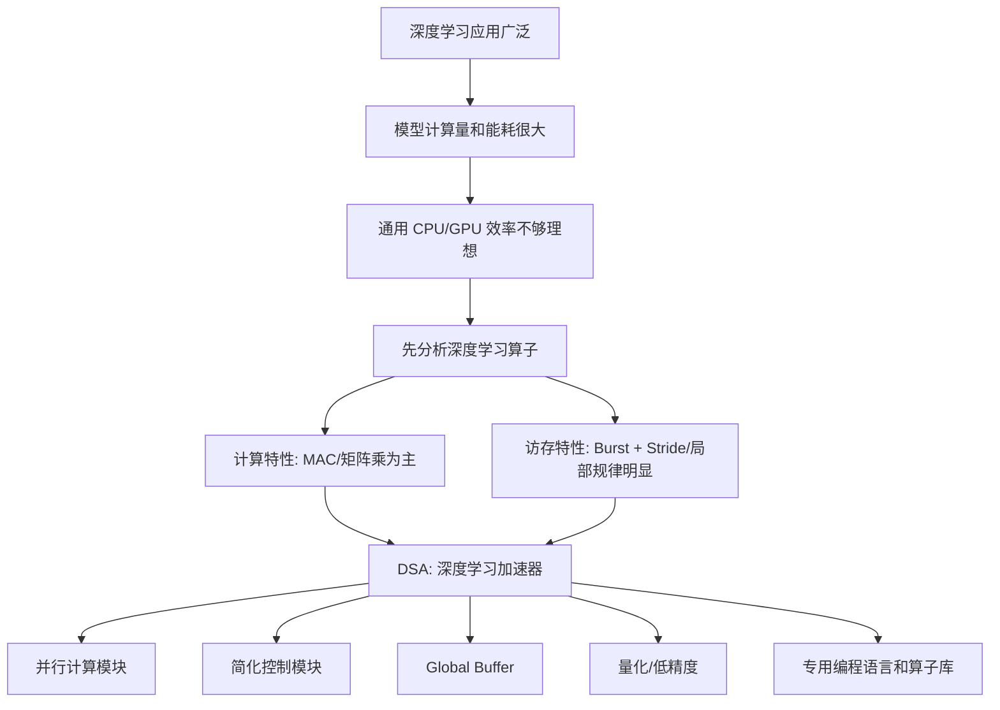
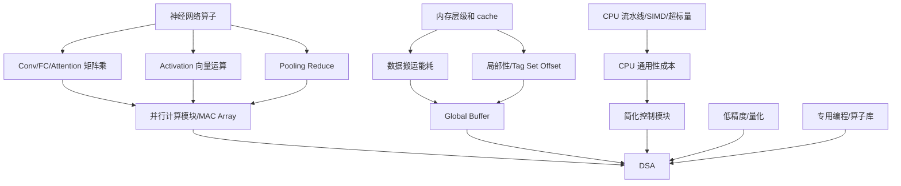

# Lecture 11: Accelerator Motivation 完整零基础讲义

来源课件：`11--accelerator_motivation.pptx`
课件页数：136 页
主题：为什么深度学习需要专用加速器，以及 AI 加速器为什么通常采用 DSA、并行计算模块、简化控制、Global Buffer、低精度/量化和专用编程模式。

说明：我按 PPT 的可见内容、表格、备注和渲染图进行了整理。PPT 后半部分有不少 speaker notes 是从 MLWeaving 相关页复制到其他页的重复备注，和当前页可见内容不完全对应；本讲义把这些备注完整放在附录中，但正文讲解以可见课件内容为主。

---

## 0. 先建立整节课的主线

这节课不是单纯讲“AI 芯片很快”，而是在建立一个体系结构判断：

深度学习计算有很强的规律性。大量算子最终都可以归结为矩阵乘法、矩阵向量乘法、向量运算、二维 reduce，以及固定的 Burst/Stride 访存模式。既然任务规律很强，就没有必要让硬件像 CPU 那样为所有可能的程序付出巨大通用性成本。我们可以把硬件设计成“偏科但极强”的 DSA，也就是 Domain Specific Architecture，面向特定领域优化。

整节课可以串成下面这条链：



你可以把这节课理解为一个硬件设计问题：如果我们知道考试范围只考矩阵乘、卷积、池化、Attention，那还要不要像复习全课程一样准备所有知识点？CPU 就像“全课程地毯式复习”的通才；AI 加速器就像“按老师划重点准备”的偏科高手。

---

## 1. Slides 1-10：先复习 cache coherence 和 memory consistency

PPT 前 10 页不是新主题，而是在衔接前面课程：CPU 和多核系统为了通用性、正确性、透明性，需要付出很多硬件复杂度。理解这些复杂度，才能理解为什么 AI 加速器愿意放弃一部分通用性。

### 1.1 Coherence 和 Consistency 的区别

课件给出两句话：

- Cache coherence 关注不同处理器对同一个内存位置的操作顺序。
- Memory consistency 关注不同处理器对所有内存位置的内存操作顺序。

初学者最容易混淆这两个词。可以这样分：

Coherence 是“同一份数据的多个副本要一致”。例如两个 CPU core 都缓存了地址 `x`，一个 core 写了 `x=1`，另一个 core 以后读 `x`，就不能一直读旧值。这是针对同一个 cache block 的局部顺序。

Consistency 是“程序看到的所有内存操作顺序是什么”。例如线程 1 写 `x` 再写 `y`，线程 2 先读 `y` 再读 `x`，硬件是否允许线程 2 看见 `y` 已更新但 `x` 没更新？这涉及跨地址的全局顺序。

一句话记忆：

| 概念 | 关注对象 | 关键词 | 程序员关心的问题 |
|---|---|---|---|
| Coherence | 同一 cache block/同一地址 | 副本一致 | 我读到的是不是这个地址的最新合理值 |
| Consistency | 所有内存操作/多个地址 | 全局顺序 | 多线程程序中操作顺序是否符合约定 |

### 1.2 Cache coherence 的硬件组成

PPT 说 cache coherence 依赖 cores、caches、interconnect、memory 共同工作。关键组件包括：

- Interconnect：可以是 snoop/bus，也可以是 directory/switch。
- Cache updating：可以 invalidate，也可以 update。
- Cache tags：用 MESI 等状态记录每个 cache line 的状态。

核心理解：coherence 不是“某一个缓存自己决定”的事情。一个 core 的读写会影响其他 core 的 cache line 状态，所以 cache、互连网络和内存控制都必须配合。

### 1.3 MESI 协议

MESI 是四个 cache line 状态：

| 状态 | 英文 | 含义 | 本地 core 是否可直接读/写 |
|---|---|---|---|
| I | Invalid | 该 cache 中没有有效副本，需要从内存或其他 cache 获取 | 不能直接读写 |
| S | Shared | 多个 cache 可能有该 block，内容干净 | 可以直接读，写前要通知/失效别人 |
| E | Exclusive | 只有本 cache 有该 block，内容干净 | 可直接读；写时无需 bus action，转 M |
| M | Modified | 只有本 cache 有该 block，且内容已被修改 | 可直接读写，必要时写回或响应别人 |

MESI 比 MSI 多了 E 状态。E 状态的价值是：如果一个 block 只有我有，而且还没改，那么我写它时不需要发 invalidate，因为没有别人要失效。PPT 的表格说明 MSI 中某些写操作需要 bus action，而 MESI 可以省掉。

要点：

- Local core writes block in E：转为 M，不需要 bus action。
- Remote core reads block in E：E 转 S，因为别人也开始共享。
- Remote core writes block in E：E 转 I，因为别人要独占修改。

### 1.4 Bus-based protocol 和 Directory

Bus-based protocol 的流程：

1. cache 仲裁总线访问权。
2. cache 获得 bus access。
3. cache 把命令放到总线上。
4. 其他 cache 在总线上响应。

总线的特点是简单，但一次只能有一个 transaction，扩展性差。core 数变多时，所有人抢一条路，容易拥塞。

Directory 的思想是：每个 cache block 有一个 home node 维护目录，记录谁有副本、谁是 owner。PPT 中每个 cache line 的 directory 需要：

- 2-bit cache states。
- N-bit sharer list：每个 cache 一个 bit，记录是否共享。
- `log2N` owner bits：记录唯一 owner 是谁。

目录协议比总线更适合多核扩展，因为不需要每次广播给所有节点，但需要额外目录存储和协议复杂度。

### 1.5 Memory consistency 与四类 barrier

PPT 复习四类内存操作顺序：

- Load-Load：读后读顺序。
- Load-Store：读后写顺序。
- Store-Store：写后写顺序。
- Store-Load：写后读顺序。

内存模型越强，程序员越容易理解，但硬件性能开销越高。课件表格：

| 内存模型 | 保留顺序 | 例子 |
|---|---|---|
| Sequential Consistency | LL、LS、SS、SL 都保留 | Dual 386 |
| Total Store Order | LL、LS、SS 保留，SL 放松 | x86/64 |
| Partial Store Order | LL、LS 保留，SS、SL 放松 | Arm |
| Really weak memory model | 更弱 | DEC Alpha |

这一段和 AI 加速器的关系：CPU 为了通用程序正确性，需要支持复杂一致性、cache、乱序执行、load-store queue 等机制。AI 加速器面对的算子更固定，可以把这些复杂资源减少，把面积和功耗转给矩阵计算和片上 buffer。

---

## 2. Slides 11-17：为什么需要深度学习处理器

### 2.1 深度学习应用广泛，所以市场和需求足够大

PPT 用 “AI for X” 表达深度学习已进入大量应用：

- 图像识别。
- 语音处理。
- 自然语言处理。
- 云服务器。
- 智能手机。

如果一种计算只用于很小众场景，专门做硬件可能不划算。但深度学习已经广泛渗透，足以支撑专用硬件生态。

### 2.2 通用 CPU/GPU 处理神经网络效率低

课件列出两个例子：

- Google Brain 用 1.6 万个 CPU 核跑数天完成猫脸识别训练。
- AlphaGo 与李世石下棋用了 1202 个 CPU 和 176 个 GPU。

这些数字不只是“看起来很大”，它们说明神经网络计算如果只靠通用处理器，会消耗巨大算力和电力。深度学习的瓶颈不是“能不能算”，而是“能不能以可接受成本算”。

### 2.3 CPU、GPU、DL Accelerator 的直观类比

PPT 给出三个类比：

- CPU：Central Processing Unit，一个大学生。
- GPU：Graphics Processing Unit，100 个小学生。
- DL Accelerator：Deep Learning Accelerator，一个偏科生。

这个类比很重要：

- CPU 像大学生：理解力强，能处理各种复杂任务，但做大量重复简单计算时成本高。
- GPU 像很多小学生：每个人能力简单，但人数多，适合大量相似任务。
- DL Accelerator 像偏科生：只擅长某些题型，但在这些题型上极强。

### 2.4 四个性能指标

| 指标 | PPT 定义 | 初学者解释 |
|---|---|---|
| 延时 latency | AI 模型做出决定的时间 | 单次请求从输入到输出要多久 |
| 通用性 generality | 适合运行的应用程序范围 | 能不能跑各种程序 |
| 能效 energy efficiency | 单位能量支持的计算量 | 同样电量能做多少计算 |
| 可迭代性 iterability | AI 模型变化时硬件适应能力 | 算法变了硬件是否还能跟上 |

### 2.5 不同计算平台的取舍

能效 vs 通用性图：

- CPU 通用性最好，但能效较低。
- GPU 通用性低于 CPU，能效更高。
- FPGA 可重构，通用性/能效在中间。
- ASIC 能效很高，但通用性低。
- 深度学习处理器位于 CPU/GPU 与 ASIC 之间，专门针对深度学习提升能效，同时保留一定可编程性。

延时 vs 可迭代性图：

- CPU/GPU 可迭代性好，因为软件改一改就能跑新模型，但延时可能更高。
- ASIC 延时低，但如果算法变了，硬件难改。
- FPGA 可迭代性比 ASIC 好，但通常不如 ASIC 极致。
- 深度学习处理器追求低延时和一定可迭代性的平衡。

核心结论：AI 加速器不是单方面“比 CPU/GPU 好”，而是在通用性、能效、延时、可迭代性之间选择更适合深度学习的点。

---

## 3. Slides 18-44：深度学习算子分析

设计加速器前，必须先知道目标应用是什么。PPT 说分析深度学习算法时关心两大特性：

1. 计算特性：是否存在固定、重复的计算模式。
2. 访存特性：数据访问是否有局部性，数据访问和后续计算之间有什么关系，对带宽有什么真实需求。

### 3.1 VGG19 作为典型 CNN

PPT 用 VGG19 作为例子：

- 参数：1.14 亿。
- 层类型：卷积、池化、全连接。
- 计算过程：简洁。
- 层数：25 = 16 + 5 + 3 + 1。
- 卷积层：16 个，3x3 卷积核，图大小不变。
- 池化层：5 个，Max Pooling。
- 全连接层：3 个。
- SoftMax：1 个。

为什么用 VGG19？因为它结构清楚，能代表 CNN 中常见的 Conv、Activation、Pooling、FC 等算子。讲清这些算子，就能看出 AI 加速器应该优化什么。

### 3.2 卷积层 Conv

PPT 从一个 `32x32x3` 图像和 `5x5x3` filter 开始。`3` 表示 RGB 三个通道。卷积的基本动作是：filter 在输入图像上滑动，每次拿出一个局部窗口，与 filter 对应位置相乘并求和，得到输出 feature map 的一个点。

课件用 `1` 和 `-1` 的小例子演示卷积：

- 输入局部窗口可以看成一个向量，例如 `(1, -1, -1, 1)`。
- filter 也可以看成一个向量，例如 `(1, -1, -1, 1)`。
- 对应相乘再求和：`1*1 + (-1)*(-1) + (-1)*(-1) + 1*1 = 4`。
- 如果输入变成 `(-1, 1, 1, -1)`，同一个 filter 得到 `-4`。

这说明卷积本质上可以展开成矩阵乘向量或矩阵乘矩阵：

- 1 个 filter：处理后的数据矩阵 × filter 向量 = 输出向量。
- 多个 filters：处理后的数据矩阵 × filters 矩阵 = 输出矩阵。

卷积层的结论：

- 计算特性：矩阵乘向量或矩阵乘矩阵。
- 访存特性：Burst + Stride。

Burst 是连续突发访问，例如一次读一段连续内存。Stride 是跳着访问，例如每隔固定距离取一个元素。卷积滑窗会导致既有连续访问，也有固定步长访问。

### 3.3 Activation 激活函数

课件总结：

- 计算特性：向量运算。
- 访存特性：Burst。

激活函数例如 ReLU、sigmoid、tanh，通常对每个元素独立操作。比如 ReLU 是 `max(0, x)`。它不需要复杂矩阵乘，只要把一串数据读出来逐个处理，所以是向量运算，访存多为连续 Burst。

### 3.4 Pooling 池化层

PPT 用 `2x2 pooling, stride=2` 演示：

输入局部块 `(3, 5, 6, 2)`：

- Max Pooling = `max(3, 5, 6, 2) = 6`。
- Average Pooling = `avg(3, 5, 6, 2) = 4`。

后续窗口：

- `(2, 4, 5, 1)` 得到 max=5, avg=3。
- `(5, 7, 8, 4)` 得到 max=8, avg=6。
- `(6, 8, 9, 5)` 得到 max=9, avg=7。

池化层的结论：

- 计算特性：二维空间上的 reduce 操作。
- 访存特性：Burst + Stride。

Reduce 指“把多个值合成一个值”，例如 max、sum、average。池化不像卷积那样做大量乘法，但它仍然有固定窗口和步长。

### 3.5 Fully Connected 全连接层

PPT 说：

- Flatten：把 output map 摊平，用于输入全连接层。
- Fully Connected：输入向量中的每个元素都和输出层神经元相连。
- 计算特性：矩阵乘向量。
- 访存特性：Burst + Stride。

从数学上看，全连接层就是：

```text
y = W x + b
```

其中 `x` 是输入向量，`W` 是权重矩阵，`b` 是偏置，`y` 是输出向量。每个输出元素都是一行权重和输入向量的点积。

### 3.6 Transformer、Attention、Feed Forward

课件也把 Transformer 纳入分析。

Transformer Block 的流程：

1. Tokenization：文本转 token。
2. Input Layer：输入嵌入。
3. Attention。
4. Feed Forward。
5. Output Layer。

Attention 页给出张量维度：

- `Q (H x H)`、`K (H x H)`、`V (H x H)`：投影矩阵。
- `a (S x H)`：输入序列表示，S 是序列长度，H 是隐藏维度。
- `Qa, Ka, Va (S x H)`：输入乘 Q/K/V 后的结果。
- `A (S x S)`：attention score 矩阵。
- `Atten (S x H)`、`Ao (S x H)`：注意力输出。

Attention 的结论：

- 计算特性：矩阵乘矩阵。
- 访存特性：Burst + Stride。

Feed Forward 页给出：

- `Ao (S x H)` 输入。
- `L2 (H x 4H)`、`L3 (H x 4H)` 相关矩阵。
- `F1 (S x 4H)` 中间结果。
- `Fo (S x H)` 输出。

Feed Forward 的结论：

- 计算特性：矩阵乘矩阵。
- 访存特性：Burst + Stride。

### 3.7 算子总结表

PPT 的总结非常关键：

| Operator | 计算特性 | 访存特性 |
|---|---|---|
| Conv | 矩阵相乘 | Burst + stride |
| Activation | 单向量操作 | Burst |
| Pooling | 单矩阵 Reduce 操作 | Burst + stride |
| FC | 矩阵相乘 | Burst |
| Attention | 矩阵相乘 | Burst + stride |

另外两个结论：

- MAC（Multiply-Accumulate，乘加）是核心操作。
- 矩阵乘法计算量占比高于 90%。
- 深度学习有 Fixed Memory Access Pattern，固定内存访问模式。

所以 DSA 的设计重点就很自然：

1. 强化矩阵/向量乘法。
2. 针对固定访存模式优化数据搬运。

---

## 4. Slides 45-50：DSA 设计思想

DSA 是 Domain Specific Architecture，领域专用体系结构。PPT 给出五个设计思想。

### 4.1 Global Buffer

使用专有存储器减少数据搬运距离与开销，例如用 scratchpad memory/global buffer 替换复杂 cache。

初学者理解：CPU cache 是硬件自动猜“你等下可能用什么”；Global Buffer 是程序/编译器明确安排“这块数据放这里，等下计算单元直接用”。前者省程序员，后者省硬件和能耗。

### 4.2 简化控制模块

减少高级微架构特性，把节省出来的面积用于更多运算单元或片上存储。

CPU 需要分支预测、乱序执行、复杂调度，因为它不知道程序会怎么跑。AI 加速器面对大量规则矩阵计算，控制逻辑可以简单很多。

### 4.3 并行计算模块

使用符合特定领域加速需求的最简单并行形式。例如对于矩阵运算，单条指令直接支持小矩阵运算。

CPU 的 SIMD 是“一个指令处理多个数据”；AI 加速器更进一步，可以把矩阵乘做成硬件核心能力。

### 4.4 量化

减少计算数据尺寸与类型，以符合性能要求。深度学习推理可采用 int8 量化。

数值位宽越低：

- 每个数占用存储更少。
- 内存带宽压力更小。
- 乘法器面积和功耗更低。
- 并行度更高。

### 4.5 专用编程语言

使用 DSA 专用语言进行编程。因为 DSA 的存储和计算方式不同于 CPU，普通 C/C++ 的抽象不一定能表达高性能数据搬运。

---

## 5. Slides 49-66：并行计算模块，为什么 CPU 流水线不够适合深度学习

### 5.1 CPU 的冯诺依曼结构

PPT 回顾五大基本组件：

- 输入设备：输入数据和程序。
- 存储器：记忆程序和数据。
- 运算器：完成数据加工处理。
- 控制器：控制程序执行。
- 输出设备：输出处理结果。

CPU 支持的功能非常多：

- Load：内存加载到寄存器。
- Store：寄存器存回内存。
- Integer 运算：ADD/SUB/MUL 等。
- Float 运算：fADD/fSUB/fMUL 等。
- Logical 运算：AND/OR/NOT 等。
- Conditional Jump：有条件跳转。
- Unconditional Jump：无条件跳转。
- 辅助功能：Cache、分支预测、预取、中断、权限等。

CPU 的问题不是功能少，而是功能太全。为通用性付出的面积、功耗和控制复杂度，在深度学习这种规则计算里未必划算。

### 5.2 CPU 经典 5 级流水线

五级流水线：

| 阶段 | 全称 | 含义 |
|---|---|---|
| IF | Instruction Fetch | 取指令 |
| ID | Instruction Decode | 指令解码 |
| EXE | Execute | 执行 |
| MEM | Memory Operand Fetch | 取内存操作数 |
| WB | Writeback | 写回 |

PPT 用洗衣房类比：

- 洗衣机洗涤。
- 干衣机烘干。
- 折叠衣服。
- 放进柜子。

非流水线是洗完一件完整流程再处理下一件；流水线是不同衣服处在不同阶段，总吞吐更高。

但对深度学习来说，问题在于：一条 CPU 指令通常只操作一个数或有限几个数，五级流水线中真正做计算的是 EXE，其余阶段服务于指令管理和数据搬运。对于海量矩阵乘，这些指令级开销太大。

PPT 总结：

- 优势：一条指令操作一个数，灵活，可实现任意功能函数。
- 劣势：效率低，五个流水线模块只有 EXE 真正在计算。

### 5.3 SIMD 是 CPU 的并行方式，但还不够激进

SIMD = Single Instruction Multiple Data，单指令多数据。

PPT 示例：

- Scalar：一个周期完成一个加法。
- SIMD：一个周期完成多个加法。

Intel CPU 上：

- 256-bit AVX2：可容纳 8 个 32-bit float。
- 512-bit AVX512：可容纳 16 个 32-bit float。

但 PPT 说 “Not aggressive enough”。原因是深度学习需要的不是 8 个或 16 个 float 的小并行，而是大规模矩阵乘的持续高吞吐。AI Processor 应该有更 aggressive 的 custom computing unit。

### 5.4 深度学习加速器处理矩阵乘法

PPT 说：

- FC 和 Conv 相关计算占据 99% 的计算。
- Conv 层数多。
- FC 参数多。
- 专门支持矩阵计算的电路会大幅提高整体性能。
- 专门支持向量计算的电路也会提高整体性能。

这就是 AI 加速器中 Cube/Tensor Core/MAC array 的动机：既然大部分时间都在矩阵乘，就把矩阵乘做成硬件主角。

---

## 6. Slides 67-72：简化控制模块

### 6.1 CPU 的超标量 Superscalar

CPU 为了提升单线程性能，会用复杂控制逻辑挖掘指令级并行。PPT 以 Intel Core 2 为例：

- CISC 指令内部 RISC 化。
- 读入 CISC 指令。
- 转换成 RISC 指令后执行。
- 6 条 CISC 指令一起解析。
- 4 条 uop 并发。
- 在 96 条 uop 间寻找并行。

这非常强大，但也非常复杂。CPU 不知道程序里哪些指令能并行，所以硬件要动态分析依赖、乱序调度、预测分支。

### 6.2 AI Processor 的控制逻辑

PPT 说 AI Processor：

- 多 instruction queue 管理指令。
- Scalar/Vector/Cube/MTE 有单独 instruction queue。
- 每个 instruction queue 顺序 issue。
- 没有特别优化 instruction 之间的并行。
- 优化重点不在提升指令间并行，即不在控制模块。

这句话很关键。AI 加速器不是完全没有控制，而是控制模块不做 CPU 那种极复杂的动态调度。它把重点放在：

- 指令内部并行，例如一条 Cube 指令完成大量矩阵乘。
- 数据搬运和计算流水。
- 编译器/程序员提前安排好执行顺序。

换句话说，CPU 靠硬件“临场发挥”；AI 加速器靠编译器和算子库“提前排练”。

---

## 7. Slides 73-97：Global Buffer，为什么 AI 加速器不用复杂 cache 作为核心

### 7.1 数据搬运比计算更耗能

PPT 引用 EIE/ISCA 2016 的能耗表：

| 32-bit Operation | Energy (pJ) | 相对 int ADD 成本 |
|---|---:|---:|
| ADD int | 0.1 | 1 |
| ADD float | 0.9 | 9 |
| Register File | 1 | 10 |
| MULT int | 3.1 | 31 |
| MULT float | 3.7 | 37 |
| SRAM Cache | 5 | 50 |
| DRAM | 640 | 6400 |

重点：一次 DRAM 访问约等于一次整数加法能耗的 6400 倍。很多初学者以为“计算最贵”，但在现代体系结构里，数据搬运常常更贵。AI 加速器必须减少数据从远处搬来搬去。

### 7.2 DRAM、SRAM、FF、Flash 的特点

PPT 复习不同存储：

- Flip-Flops：非常快、可并行访问，但非常贵，一个 bit 需要几十个晶体管。
- SRAM：较快，一次一个 data word，贵，一个 bit 需要 6+ 个晶体管。
- DRAM：较慢，一次一个 data word，读取会破坏内容，需要 refresh，制造需要特殊工艺，但便宜，一个 bit 只需一个晶体管加一个电容。
- Flash：更慢，非易失，非常便宜。

结论：越快越贵，越便宜越慢。AI 加速器要在芯片上放足够的 SRAM/global buffer，让高频访问尽量不去 DRAM。

### 7.3 CPU 为什么需要 cache

PPT 给出 CPU 访问时间：

- Main memory/DRAM：约 100 ns。
- ALU/register 附近：约 0.4 ns。
- Cache：约 2-12 ns。

内存访问延时比寄存器访问长两个数量级。Cache 放在 CPU 和 DRAM 中间，用 SRAM 缓存最近/常用数据，给程序员“又大又快”的存储幻觉。

### 7.4 Cache 的图书馆类比

PPT 类比：

- 学生坐在图书馆桌前写论文。
- 桌上最多放 10 本参考书。
- 大多数情况下桌上的书够用。
- 找不到材料时去远处书架找书。
- 桌子满了就把最少用的书放回书架，换新书。
- 找书换书花 10 分钟。

对应关系：

| Cache 概念 | 图书馆类比 |
|---|---|
| Cache hit | 桌上找到想要的书 |
| Cache miss | 桌上没有，需要去书架 |
| 内存访问 latency | 去书架找书的时间 |
| 替换策略 Random/FIFO/LRU | 决定哪本书放回书架 |
| Cache 容量 | 桌子能放几本书 |

### 7.5 Cache 的本质与局部性

PPT 定义：

Cache 是任何“记住 frequently used results，从而避免重复长延时操作”的结构。

Cache 能工作的依据是 locality：

- 时间局部性 Temporal Locality：最近访问过的位置容易再次访问。例如函数本地参数可能反复使用。
- 空间局部性 Spatial Locality：最近访问位置附近的位置容易被访问。例如数组循环中访问第 3 个元素后，可能访问第 4 个。

### 7.6 Tag、Set、Offset

PPT 图中 16-bit memory address 被拆成：

- Tag：10 bit。
- Set：2 bit。
- Offset：4 bit。

Cache 是 2-way、4-set，每条 cache line 为 16B。

理解方式：

- Offset：在一个 cache line 内取哪个字节/位置。
- Set：这个地址应该映射到 cache 的哪个 set。
- Tag：进入 set 后，用 tag 判断这个 line 是否真的是目标内存块。

访问流程：

1. 用 set 位找到对应 set。
2. 比较 set 内各 way 的 tag。
3. tag 相等则 cache hit。
4. tag 不相等则 cache miss，需要从内存取对应 line。

PPT 备注还提到 associativity：

- Direct mapped cache：更多地址位用于 set selection。
- 2-way set associative：tag 和 set 分配如图。
- Fully associative：没有 set selection bit，任何 line 可放任何位置，但比较更贵。

### 7.7 CPU cache 面积问题

PPT 指出 Intel 4 核 CPU 中，近一半芯片空间花在 L3 cache 上，L3 大小约 2.5MB/core。问题是：cache 对通用程序很有用，但芯片面积利用率对深度学习不一定最优。

CPU cache 的好处：

- Automatic：硬件自动管理层级间数据搬运。
- 对程序员透明。
- 平均程序员不懂 cache 也能受益。
- 简单启发式：保留最近使用的数据。

但 AI 加速器的目标不同：提高算力、降低功耗，可以牺牲一部分可编程性。

### 7.8 为什么 Global Buffer 更适合 AI 加速器

PPT 问：“复杂 cache 设计是否适合深度学习？”

结论：

- Strided 内存访问容易竞争同一个 cache set，引起 eviction。
- Strided 访问 pattern 比较固定，无需 cache 这么精致的结构，人工控制即可。
- 举例：当 stride = 2^6、2^7、2^8 等时，可能反复访问同一个 set，导致冲突。

AI Accelerator 的 Global Buffer：

- 分块使用。
- 降低单位内存访问功耗。
- 编程更难，因为要考虑 buffer 位置。

PPT 对比 Cache 和 Buffer：

| 项目 | Cache | Buffer |
|---|---|---|
| 能耗 | 高 | 低 |
| 芯片面积 | 大 | 小 |
| 管理方式 | 自动 | 手动 |

一句话：cache 让程序员舒服，global buffer 让硬件高效。AI 加速器选择高性能和低功耗，所以接受更难的编程/编译。

---

## 8. Slides 98-131：低精度、任意精度和 MLWeaving

### 8.1 为什么低精度对机器学习可行

PPT 的直觉例子：

- 模型输出在 0 到 1。
- 大于 0.5 就判断为 cat。
- 全精度计算：`1.310245 * 0.602069 = 0.788857897`，大于 0.5。
- 低精度近似：`about 1.3 * about 0.6 = about 0.78`，仍然大于 0.5。

所以如果最终决策边界没有改变，低精度误差可以接受。PPT 用一句话总结：“Relax, It is only Machine Learning.” 意思不是机器学习随便算，而是很多 ML 任务对小数值误差有容忍度。

### 8.2 不同任务需要不同精度

PPT 说不同输入可能需要不同 bit：

- 某些图像 3-bit 就够。
- 另一些图像可能需要 9-bit。

这说明固定只支持 int8/fp16 不是最理想。若任务只需 4-bit，而硬件只能 8-bit，就浪费带宽和计算资源。

### 8.3 当前硬件的低精度支持

PPT 分两类：

CPU/GPU：

- CPU：Char 8-bit、Short 16-bit。
- GPU：FP8、FP16。
- 对低精度支持不是很好。
- 容易缺对应指令支持。
- 没有资源倾斜。
- 主要优化浮点操作、32 位定点操作。

AI Processor/TPU/Ascend：

- TPU：INT8。
- Ascend：INT8 等。
- 对低精度支持更好。
- 有完备指令支持。
- 有资源倾斜。
- 主要优化低精度指令操作。

PPT 进一步提出：用第一性原理重新考虑低精度，应支持任意精度。

### 8.4 SGD 中低精度的机会

PPT 用线性回归和 SGD 说明：

SGD 有三部分：

- Training Data：Database/Sensor。
- Computing Device：FPGA/GPU/CPU。
- Model：DRAM/Cache。

流程：

1. `Ar = get_data()`：取一行数据。
2. `x = get_model()`：取模型。
3. `g = comp_grad(x, Ar)`：计算梯度，例如 `dot(Ar, x)Ar`。
4. `x = x - g`，再 `set_model(x)`：更新模型。

PPT 备注指出两个性质：

- 多核运行时 model `x` 可能 stale。
- dataset 和 gradient 可以低精度，不一定总是 32-bit float。

本节重点是第二点：数据和梯度可低精度，为任意精度加速提供空间。

### 8.5 MLWeaving 的三个观察

PPT 提出任意精度 NN Accelerator：

- New Memory Layout (Software)。
- New Hardware Design (Hardware)。

引用：

- Zeke Wang 等，MLWeaving，VLDB 2019。
- Zhenhao He、Zeke Wang、Gustavo Alonso，BiS-KM，FPGA 2020。

三个观察：

1. 经常 memory bandwidth bound，内存带宽是瓶颈。
2. 低精度如 8-bit fixed point 通常能提供合理质量。
3. 同一数据集上的不同 inference/training task 可能需要不同精度。

问题：能不能只存一份数据，但高效支持任意精度的数据搬运？

### 8.6 传统数据布局 vs MLWeaving 新布局

传统系统存 ML 数据：

- 按 row 存。
- 对第 1 行 A，先存第 1 个 feature 的 bit1、bit2、bit3、bit4。
- 再存第 2 个 feature 的 bit1、bit2、bit3、bit4。
- 再存第 2 行 B。

MLWeaving：

- 仍按 row，但在 row 内按 bit-plane 组织。
- 先把第 1 行所有 feature 的第 1 位存一起。
- 再把所有 feature 的第 2 位存一起。
- 再存第 3 位、第 4 位。
- 然后处理第 2 行。

好处：

- 如果只需要 1-bit，只读第一组 bit。
- 如果需要 3-bit，只读前三组 bit。
- 不浪费内存带宽读取不需要的低位。

局限：

- 在 CPU 上不好用。
- CPU 没有针对新 memory layout 的 custom instruction。
- CPU 需要从不同内存位置 group bits，再进入后续计算，开销很大。

所以 MLWeaving 必须结合新硬件设计，例如 FPGA 上的 bit-serial multiplier。

### 8.7 Bit-Serial Multiplier (BSM)

PPT 用十进制数字帮助理解，但说明真实每一位应该是 binary。

例子：`4321 x 0020`。

不同精度含义：

- 4-bit：`4321`。
- 3-bit：`4320`。
- 2-bit：`4300`。
- 1-bit：`4000`。

普通乘法会一次处理完整数。Bit-serial multiplier 的思想是逐位累加：

```text
Sum += P * S[i]
```

其中：

- S 是 bit-serial part，彩色部分，一次读一位/一组 bit-plane。
- P 是 bit-parallel part，黑色部分，例如 `0020`。
- Sum 保存累加结果。

PPT 展示四个周期：

1-bit precision：

- 第 1 cycle 取最高位 `4`。
- `4` 表示 `4000`。
- `Sum += 20 * 4000`。
- 得到 `80000`，完成 1-bit precision。

2-bit precision：

- 第 2 cycle 取第二位 `3`。
- `3` 表示 `300`。
- `Sum += 20 * 300`。
- 累加得到 `86000`，完成 2-bit precision。

3-bit precision：

- 第 3 cycle 取第三位 `2`。
- `2` 表示 `20`。
- `Sum += 20 * 20`。
- 累加得到 `86400`，完成 3-bit precision。

4-bit precision：

- 第 4 cycle 取第四位 `1`。
- `1` 表示 `1`。
- `Sum += 20 * 1`。
- 累加得到 `86420`，完成 4-bit precision。

这个例子要学到的不是十进制乘法，而是思想：精度越低，需要处理的 bit-plane 越少；硬件能在任意精度处停下。

### 8.8 MLWeaving 性能

PPT 的图显示：

- Computing time vs Precision：精度越低，计算时间近似线性降低。
- Memory traffic vs Precision：精度越低，内存流量近似线性降低。

备注指出：

- MLWeaving 可实现几乎线性的低精度加速。
- 1-bit 情况没有达到理想线性加速，原因是 pipeline latency 太长，无法被摊销。
- 实际训练中很少用 1-bit，因为数据会丢失太多有用信息。

---

## 9. Slides 132-135：AI 加速器编程模式

### 9.1 CPU 编程 vs AI Accelerator 编程

CPU 代码：

```c
uint32_t a[32] = {0, 1, 2, ..., 31};
uint32_t b[32] = {0, 1, 2, ..., 31};
uint32_t c[32];
for (uint i = 0; i < 32; i++) {
    c[i] = a[i] + b[i];
}
```

程序员只写数组和循环，不需要显式管理数据从 DDR 到片上 buffer 的搬运。cache 和内存层级由硬件透明处理。

AI Accelerator 代码思想：

```c
DDR uint32_t a[32] = {0, 1, 2, ..., 31};
DDR uint32_t b[32] = {0, 1, 2, ..., 31};
DDR uint32_t c[32];

Unified_Buffer uint32_t a_ub[32];
Unified_Buffer uint32_t b_ub[32];
Unified_Buffer uint32_t c_ub[32];

Dma_Mov(a_ub, a);
Dma_Mov(b_ub, b);
Vector_add(c_ub, a_ub, b_ub);
Dma_Mov(c, c_ub);
```

这里程序员/编译器必须显式：

- 在 DDR 和 Unified Buffer 之间搬数据。
- 调用向量计算单元。
- 再把结果搬回 DDR。

这就是显式 buffer 管理。

### 9.2 高性能但难编程

PPT 问：“那 AI 加速器的编程模式怎么样？”

答案：

- 高性能。
- 难编程。

解决方式：

- 厂商提供算子库。
- 用户直接调用库。

所以多数用户不会手写最底层 DMA 和 vector/cube 指令，而是通过 CANN、CUDA、cuDNN、算子库、深度学习框架间接使用。

### 9.3 整体比较：AI Accelerator vs CPU

PPT 最后一张总结表：

| 维度 | CPU | DSA/AI Accelerator |
|---|---|---|
| On-chip Memory | Cache | Global Buffer |
| Instruction Issue | Superscalar | In-order/simple |
| Parallelism | Inter-instruction | Intra-instruction |
| Functionality | Full | Partial |
| Optimization Purpose | Low Latency | High Throughput |
| Programming Language | General | Domain-specific |

逐项解释：

- On-chip Memory：CPU 用 cache 自动管理；AI 加速器用 global buffer 手动/编译器管理。
- Instruction Issue：CPU 复杂超标量乱序/并发发射；AI 加速器更简单、有序。
- Parallelism：CPU 挖掘指令之间的并行；AI 加速器让一条指令内部做大量并行。
- Functionality：CPU 功能完整；DSA 功能不完整但针对领域强。
- Optimization Purpose：CPU 常优化单任务低延时；AI 加速器常优化大批量高吞吐。
- Programming Language：CPU 用通用语言；DSA 需要领域专用语言、DSL 或算子库。

---

## 10. 本节课最重要的知识点压缩

如果你只背结论，至少要会下面这些：

1. 深度学习加速器的动机：深度学习应用广泛，计算量巨大，通用 CPU/GPU 能效不够，专用处理器能在能效、延时、吞吐上更好。
2. CPU/GPU/加速器类比：CPU 是通才，GPU 是大量简单并行，加速器是偏科高手。
3. 深度学习算子分析看两点：计算特性和访存特性。
4. Conv/FC/Attention 主要是矩阵乘；Activation 是向量运算；Pooling 是 reduce。
5. MAC 和矩阵乘占比极高，这是并行计算模块的依据。
6. DSA 五个思想：Global Buffer、简化控制、并行计算模块、量化、专用编程语言。
7. CPU 五级流水线灵活但深度学习效率低，因为大量阶段不是实际计算。
8. SIMD 是 CPU 并行方式，但对 AI 大规模矩阵乘还不够激进。
9. CPU 超标量用复杂控制挖指令间并行；AI 加速器把重点放在指令内大并行。
10. 数据搬运比计算耗能得多，DRAM 访问约为 int add 的 6400 倍。
11. Cache 自动、易用、面积/能耗较大；Global Buffer 手动、难编程、低能耗。
12. Stride 访存可能导致 cache set 冲突；深度学习访存 pattern 固定，适合人工/编译器控制。
13. 低精度可行，因为 ML 对小误差有一定容忍度。
14. 任意精度的意义：不同任务需要不同 bit，固定 int8/fp16 可能浪费。
15. MLWeaving 通过 bit-plane 式 memory layout 支持按需读取精度。
16. Bit-serial multiplier 可以逐位累加，精度越低处理周期越少。
17. AI 加速器编程需要显式管理数据搬运，因此通常依赖厂商算子库和框架。

---

## 11. 初学者概念依赖图



学习顺序建议：

1. 先懂 cache 为什么存在：DRAM 慢，cache 用局部性隐藏延迟。
2. 再懂深度学习算子为什么规则：矩阵乘、向量操作、reduce、固定访存。
3. 再懂 DSA 为什么要牺牲通用性：把通用控制/cache 的成本换成 MAC 和 buffer。
4. 最后懂低精度和编程模型：数值位宽、数据布局、DMA、算子库。

---

## 12. 易错点

### 易错 1：把 GPU 和 AI 加速器混为一谈

GPU 也能跑深度学习，但它仍比专用 AI processor 更通用。AI processor 更偏向矩阵/张量计算、片上 buffer、低精度和专用指令。

### 易错 2：以为 cache 一定比 buffer 高级

cache 对程序员友好，但不是所有场景都最高效。深度学习访存 pattern 固定，global buffer 手动控制反而能减少面积和能耗。

### 易错 3：以为低精度一定降低正确率

低精度可能降低精度，但机器学习有误差容忍。关键是任务需要多少 bit，而不是永远越高越好。

### 易错 4：以为 CPU 慢是因为没有并行

CPU 有流水线、SIMD、超标量、乱序执行。问题是它的并行形式和控制开销不是为大规模矩阵乘专门设计的。

### 易错 5：只背 DSA 五点，不会解释为什么

每一点都来自前面的算子和硬件分析：

- 矩阵乘多，所以要并行计算模块。
- 控制规律，所以可简化控制。
- 数据搬运贵，所以要 global buffer。
- ML 容忍误差，所以要量化。
- 硬件特殊，所以需要专用语言/库。

---

## 13. 自测题

### 题 1

问：Cache coherence 和 memory consistency 的区别是什么？

答：coherence 关注不同处理器对同一内存位置/cache block 的操作顺序和副本一致性；consistency 关注不同处理器对所有内存位置的操作顺序，是程序员与微架构之间关于内存可见顺序的约定。

### 题 2

问：为什么 MESI 比 MSI 多一个 E 状态可以减少 bus action？

答：E 表示该 cache 独占且干净。如果本地 core 写 E 状态 block，不需要通知别人，因为没有其他 cache 共享该 block，只需本地转为 M。

### 题 3

问：深度学习算子分析主要看哪两类特性？

答：计算特性和访存特性。计算特性看是否有固定重复计算模式，如矩阵乘；访存特性看数据访问局部性、Burst/Stride 模式以及带宽需求。

### 题 4

问：卷积为什么能看成矩阵乘？

答：把每个滑动窗口展开为一行，把 filter 展开为向量，所有窗口组成矩阵。一个 filter 时是矩阵乘向量；多个 filters 时是矩阵乘矩阵。

### 题 5

问：为什么 AI 加速器更偏向 Global Buffer 而不是复杂 Cache？

答：深度学习访存模式相对固定，可由程序/编译器提前安排；cache 自动但面积和能耗较高，stride 访问还可能造成 set 冲突。Global Buffer 手动管理更难编程，但能降低数据搬运功耗和芯片面积。

### 题 6

问：CPU 超标量和 AI Processor 简化控制的区别是什么？

答：CPU 用复杂硬件在很多 uop 中动态寻找指令间并行；AI Processor 通常用多个 instruction queue 顺序 issue，把重点放在 scalar/vector/cube/MTE 等指令内部的大并行，而不是复杂控制逻辑。

### 题 7

问：为什么低精度能用于机器学习？

答：很多 ML 任务只需保持最终分类/回归结果足够正确，对小数值误差有容忍度。若全精度和低精度结果都位于同一决策边界侧，低精度计算就可能足够。

### 题 8

问：MLWeaving 的 memory layout 解决什么问题？

答：解决同一份数据需要支持不同精度读取的问题。它按 bit-plane 组织数据，需要 1-bit 就读第一组 bit，需要 3-bit 就读前三组 bit，从而减少不必要内存流量。

### 题 9

问：Bit-serial multiplier 的核心思想是什么？

答：不一次处理完整数，而是按位读取 bit-serial 部分并与 bit-parallel 部分相乘累加。精度越低，读取和累加的位数越少，因此可节省计算和内存流量。

### 题 10

问：CPU 编程和 AI Accelerator 编程的主要差异是什么？

答：CPU 编程通常不显式管理数据在内存层级中的转移，cache 自动处理；AI Accelerator 编程常需要显式把数据从 DDR 搬到 Unified Buffer，计算后再搬回，性能高但编程难，因此依赖算子库。

---

## 14. 逐页学习索引

下面是按 slide 范围整理的学习索引。完整逐页抽取文本在后面的“逐页原文附录”中。

| 页码 | 内容 | 学习重点 |
|---|---|---|
| 1 | 深度学习加速器介绍 | 本讲主题 |
| 2-10 | cache coherence、MESI、directory、memory consistency | CPU 通用正确性机制很复杂 |
| 11-17 | 为什么需要深度学习处理器 | 应用广、能耗高、平台取舍 |
| 18-23 | 深度学习算子分析入口，VGG19 | 先分析目标应用再设计硬件 |
| 24-30 | 卷积层 | 卷积转矩阵乘，Burst+Stride |
| 31 | 激活函数 | 向量运算，Burst |
| 32-36 | 池化层 | 二维 reduce，Burst+Stride |
| 37-38 | 全连接层 | 矩阵乘向量 |
| 39-41 | Transformer Attention/FFN | 矩阵乘矩阵，Burst+Stride |
| 42-44 | 算子总结 | MAC、矩阵乘、固定访存模式 |
| 45-50 | DSA 和 CPU 功能 | 五个 DSA 思想 |
| 51-66 | 并行计算模块 | CPU 流水线/SIMD vs aggressive custom unit |
| 67-72 | 控制模块 | CPU 超标量 vs AI 加速器简单 issue |
| 73-97 | Global Buffer | 数据搬运能耗、cache 原理、buffer 取舍 |
| 98-131 | 低精度与 MLWeaving | 任意精度、bit-plane layout、BSM |
| 132-135 | 编程模式和总比较 | 显式 buffer 管理、专用语言 |
| 136 | 结束 | 复习总结 |

---

## 15. 关键词表

| 词 | 中文解释 | 本节课中的作用 |
|---|---|---|
| DSA | 领域专用体系结构 | AI 加速器总体设计范式 |
| MAC | Multiply-Accumulate，乘加 | 深度学习核心计算 |
| Burst | 连续突发访问 | 常见高效访存模式 |
| Stride | 固定步长跳跃访问 | 卷积/池化/Attention 中常见 |
| SIMD | 单指令多数据 | CPU 的向量并行方式 |
| Superscalar | 超标量 | CPU 挖掘指令间并行 |
| Global Buffer | 全局/统一片上缓冲 | AI 加速器替代复杂 cache 的关键 |
| Scratchpad Memory | 显式管理片上存储 | Global Buffer 的典型形式 |
| Quantization | 量化 | 用更低位宽表示数据和计算 |
| INT8/FP16/FP8 | 低精度数值格式 | 提高吞吐和能效 |
| MLWeaving | 任意精度数据布局方案 | 按 bit-plane 支持不同精度读取 |
| BSM | Bit-Serial Multiplier | 支持逐位任意精度计算 |
| DMA | Direct Memory Access | AI 编程中显式数据搬运 |
| Unified Buffer | 统一片上 buffer | DaVinci/AI Core 中放临时数据 |
| Cube Unit | 矩阵/张量计算单元 | 负责高吞吐矩阵计算 |
| MTE | Memory Transfer Engine | 数据搬运模块 |

---

## 16. 一句话总复习

深度学习加速器的本质，是利用深度学习算子“计算模式固定、矩阵乘占比高、访存规律明显、低精度可接受”的特点，牺牲 CPU 式通用性和透明编程，换取更多矩阵计算单元、更简单控制、更高效片上 buffer、更低精度计算和更高吞吐/能效。

---

## 17. 逐页原文附录

这一部分从 `extracted/11--accelerator_motivation.json` 自动生成，用于逐页核对 PPT 中的文字、表格和备注。正文讲解已按逻辑重组；如果你要检查某一页是否遗漏，优先看这里。


### Slide 1: 深度学习加速器介绍

- 图片数量：1
- 表格数量：0

**页面文字/表格：**

- 深度学习加速器介绍
- 王则可 浙大百人计划研究员
- 浙大计算机学院、人工智能协同创新中心

**Speaker notes：**

- I am Zeke. I am now a post-doc researcher at Systems group, ETH, Zurich. It is my pleasure to have
- a chance to talk about database technologies for Machine learning systems.
- 1


### Slide 2: Recall: Memory Consistency vs. Cache Coherence

- 图片数量：0
- 表格数量：0

**页面文字/表格：**

- Recall: Memory Consistency vs. Cache Coherence
- Coherence is about ordering of operations from different processors to the same memory location
- Local ordering of accesses to each cache block
- Consistency is about ordering of all memory operations from different processors (i.e., to different memory locations)
- Global ordering of accesses to all memory locations

**Speaker notes：**

- Coherence;
- 一致性
- Consistency:
- 连贯性
- 2


### Slide 3: Recall: Hardware Architecture for Cache Coherence

- 图片数量：0
- 表格数量：0

**页面文字/表格：**

- Recall: Hardware Architecture for Cache Coherence
- Hardware architecture for Cache Coherence:
- Cores, caches, interconnect, memory work together to achieve cache coherence from core’s point of view.
- Interconnect: Snoop/Directory
- Cache Updating: invl./update
- Cache Tags: MESI
- Core
- Interconnection Network
- Main Memory
- Core
- Core
- Cache
- Interconnect
- Memory
- CPU action
- Bus action
- CPU action
- Bus action
- Cache blocks
- Tags
- Cache blocks
- Tags
- R: read
- W:write
- I: invalidate
- U: update


### Slide 4: MESI Protocol: Illinois protocol (ISCA, 84)

- 图片数量：0
- 表格数量：0

**页面文字/表格：**

- MESI Protocol: Illinois protocol (ISCA, 84)
- I(nvalid): block is not in cache, need to fetch from memory or other cache
- S(hared): in >1 caches, clean, local cores directly reads it w/o bus action
- M(odified): in 1 cache, local core can read/write it w/o bus action
- E(xclusive): in 1 cache, clean, local core reads/writes it w/o bus action
- Key Differences from MSI Protocol:
- Local core writes block in state E, the state holds
- Local core writes block in state E  state M, without bus action
- Remote core reads, via read miss on bus, block in state E  state S
- Remote core writes, via write miss on bus, block in state E  state I
- Recall: MESI Protocol

**Speaker notes：**

- To fully take advantage of MLWeaving memory layout, we have to rely on the custom computation, in our case, it is FPGA.
- 4


### Slide 5: Recall: MESI over MSI

- 图片数量：0
- 表格数量：2

**页面文字/表格：**

- Recall: MESI over MSI

| Time | P1 op. | P2 op. | State A in P1 | State B in P2 | Bus action |
| --- | --- | --- | --- | --- | --- |
| t0 |  |  | I | I |  |
| t1 | Read A |  | S | I | Read miss A |
| t2 | Write A |  | M | I | Invalidate |
| t3 |  | Read B | M | S | Read miss B |
| t4 |  | Write B | M | M | Invalidate |

- MSI:

| Time | P1 op. | P2 op. | State A in P1 | State B in P2 | Bus action |
| --- | --- | --- | --- | --- | --- |
| t0 |  |  | I | I |  |
| t1 | Read A |  | E | I | Read miss A |
| t2 | Write A |  | M | I |  |
| t3 |  | Read B | M | E | Read miss B |
| t4 |  | Write B | M | M |  |

- MESI:

**Speaker notes：**

- To fully take advantage of MLWeaving memory layout, we have to rely on the custom computation, in our case, it is FPGA.
- 5


### Slide 6: Recall: Bus-based Protocol

- 图片数量：0
- 表格数量：0

**页面文字/表格：**

- Recall: Bus-based Protocol
- Core
- Bus (One trans. a time)
- Main Memory
- Core
- CPU action
- Bus action
- CPU action
- Bus action
- Cache blocks
- Tags
- Cache blocks
- Tags
- Bus-based protocol:
- 1, A cache arbitrates for bus access, waiting until 2 happens
- 2, A cache is granted bus access
- 3, A cache places command on bus, waiting until 4 happens
- 4, Other caches place responses on bus

**Speaker notes：**

- To fully take advantage of MLWeaving memory layout, we have to rely on the custom computation, in our case, it is FPGA.
- 6


### Slide 7: Recall: Directory

- 图片数量：0
- 表格数量：0

**页面文字/表格：**

- Recall: Directory
- Cache
- C2
- Switch (peer to peer)
- Cache
- C1
- Cache
- C4
- Cache
- C3
- …
- Regarding a cache block:
- Home Node: the node owns the corresponding directory, a different node for a different cache block.
- Local Node: the node initiates the cache read/write requests
- Remote Node: the node passively responses to the action from the home node

**Speaker notes：**

- To fully take advantage of MLWeaving memory layout, we have to rely on the custom computation, in our case, it is FPGA.
- 7


### Slide 8: Recall: Directory for Each Cache Line

- 图片数量：0
- 表格数量：1

**页面文字/表格：**

- Recall: Directory for Each Cache Line
- Detailed directory for each cache line:
- Each cache block needs N+log2N + 2 bits for its directory, which resides at the home node.
- 2-bit cache states: a block is owned by the directory unless the block is in a cache in state M. State M means a node writes to it.
- One shared bit for each cache: indicating whether the block is shared in a cache
- log2N owner bit: indicates that the cache that has the only copy of the block and can update it without notifying others

| states | Owner | Sharer list (one-hot bit vector) |
| --- | --- | --- |

- 2-bit log2N-bit N-bit

**Speaker notes：**

- To fully take advantage of MLWeaving memory layout, we have to rely on the custom computation, in our case, it is FPGA.
- 8


### Slide 9: Recall: Ordering of Operations

- 图片数量：0
- 表格数量：0

**页面文字/表格：**

- Recall: Ordering of Operations
- Operations: A, B, C, D
- In what order should the hardware execute (and report the results of) these operations?
- Consistency： A contract between programmer and microarchitect.
- Preserving an “expected” (more accurately, “agreed upon”) order simplifies programmer’s life
- Ease of debugging; ease of state recovery, exception handling
- Preserving an “expected” order usually makes the hardware designer’s life difficult
- Especially if the goal is to design a high-performance processor: Recall load-store queues in out of order execution and their complexity


### Slide 10: Recall: Four Memory Barriers vs. Consistence Model

- 图片数量：0
- 表格数量：1

**页面文字/表格：**

- Recall: Four Memory Barriers vs. Consistence Model
- Comparison of memory models:
- The stronger memory model leads to lower performance/higher overhead
- The stronger memory model makes programmers’ life easier

| Load-Load | Load-Store | Store-Store | Store-Load | Consistence Model | CPU |
| --- | --- | --- | --- | --- | --- |
| √ | √ | √ | √ | Sequential Consistency | Dual 386 |
| √ | √ | √ |  | Total Store Order | X86/64 |
| √ | √ |  |  | Partial Store Order | Arm |
|  |  |  |  | Really weak memory model | DEC Alpha |


### Slide 11: Where are We?

- 图片数量：1
- 表格数量：0

**页面文字/表格：**

- Where are We?

**Speaker notes：**

- To fully take advantage of MLWeaving memory layout, we have to rely on the custom computation, in our case, it is FPGA.
- 11


### Slide 12: 目录

- 图片数量：0
- 表格数量：0

**页面文字/表格：**

- 目录
- 为什么需要深度学习处理器
- 深度学习算子分析
- 深度学习加速器设计思路

**Speaker notes：**

- To fully take advantage of MLWeaving memory layout, we have to rely on the custom computation, in our case, it is FPGA.
- 12


### Slide 13: 为啥需要AI加速器?

- 图片数量：0
- 表格数量：0

**页面文字/表格：**

- 为啥需要AI加速器?
- ?

**Speaker notes：**

- 现在大家都在讨论
- Ai
- for
- 任意应用，如金融，医疗，数据库等等
- 那我们能不能反过来想想这个事，别的技术也用于
- AI
- 呢？事实上这个也很有必要，
- 13


### Slide 14: 为什么需要深度学习处理器?

- 图片数量：2
- 表格数量：0

**页面文字/表格：**

- 为什么需要深度学习处理器?
- 深度学习应用广泛(市场大)
- AI for X: 图像识别、语音处理、自然语言处理
- 平台：已渗透到云服务器和智能手机
- 通用CPU/GPU处理人工神经网络效率低下(费电)
- 谷歌大脑：1.6万个CPU核跑数天完成猫脸识别训练
- AlphaGo：和李世石下棋用了1202个CPU和176个GPU

**Speaker notes：**

- 为啥需要深度学习处理器呢？
- 深度学习应用到很多应用，图像识别，语音处理，自然语言处理、博弈游戏等领域，
- AI for X
- 。
- 深度学习已在云服务器和智能手机上广泛应用。解读一下，本质上，人是懒惰，深度学习一定程度上能帮我们做一些事情，允许咋们懒惰。
- 通用
- CPU/GPU
- 处理人工神经网络效率非常低下，例如 谷歌大脑需要
- 1.6
- 万个
- CPU
- 核跑数天完成猫脸识别训练，
- 14


### Slide 15: 处理器&性能指标

- 图片数量：0
- 表格数量：0

**页面文字/表格：**

- 处理器&性能指标
- CPU: Central Processing Unit (一个大学生)
- GPU: Graphics Processing Unit (100个小学生)
- DL Accelerator: Deep Learning Accelerator (一个偏科生)
- 延时: AI模型做出决定的时间。
- 通用性: 适合运行的应用程序范围。
- 能效: 单位能量所支持的计算量。
- 可迭代性: AI模型变化时的硬件适应能力。

**Speaker notes：**

- 15


### Slide 16: 不同计算平台：能效 vs. 通用性

- 图片数量：1
- 表格数量：0

**页面文字/表格：**

- 不同计算平台：能效 vs. 通用性
- ASICs
- 通用性
- 能效
- CPU
- 深度学习处理器
- GPU
- FPGA
- 好

**Speaker notes：**

- To fully take advantage of MLWeaving memory layout, we have to rely on the custom computation, in our case, it is FPGA.
- 16


### Slide 17: 不同计算平台：延时 vs. 可迭代性

- 图片数量：0
- 表格数量：0

**页面文字/表格：**

- 不同计算平台：延时 vs. 可迭代性
- ASICs
- 可迭代性
- 延时
- CPU
- 深度学习处理器
- GPU
- FPGA
- 好

**Speaker notes：**

- To fully take advantage of MLWeaving memory layout, we have to rely on the custom computation, in our case, it is FPGA.
- 17


### Slide 18: 目录

- 图片数量：0
- 表格数量：0

**页面文字/表格：**

- 目录
- 为什么需要深度学习处理器
- 深度学习算子分析
- Conv
- Activation
- Pooling
- Fully Connection
- Attention
- 深度学习加速器设计思路

**Speaker notes：**

- To fully take advantage of MLWeaving memory layout, we have to rely on the custom computation, in our case, it is FPGA.
- 18


### Slide 19: 在分析深度学习算法的时候，我们关心啥？

- 图片数量：0
- 表格数量：0

**页面文字/表格：**

- 在分析深度学习算法的时候，我们关心啥？
- 在设计深度学习加速器的时候，
- 咋们先得搞清楚目标应用：深度学习算法。
- 两大特性！

**Speaker notes：**

- 现在的计算世界往三个方向发展
- 19


### Slide 20: 深度学习算法分析

- 图片数量：0
- 表格数量：0

**页面文字/表格：**

- 深度学习算法分析
- 计算特性
- 是否存在固定的、重复的计算模式？
- 访存特性
- 数据访问的局部性
- 数据访问和后续计算的关系（对于带宽的实际需求）
- 分析深度学习算法的两大特性:

**Speaker notes：**

- 那我们的
- mlweaving
- 是怎么存储的呢，还是以行为单位，先把第一行的每个
- feature
- 的第一位存到一起，接着存每个
- 第二位，第三位，第四位。
- 20


### Slide 21: 典型卷积神经网络：VGG19

- 图片数量：1
- 表格数量：0

**页面文字/表格：**

- 典型卷积神经网络：VGG19
- Conv: 卷积层
- Maxpool: 最大池化层
- FC: 全链接层

**Speaker notes：**

- 21


### Slide 22: 典型卷积神经网络：VGG19

- 图片数量：0
- 表格数量：1

**页面文字/表格：**

- 典型卷积神经网络：VGG19

| VGG19 |  |
| --- | --- |
| 参数 | 1.14 （亿） |
| 层类型 | 卷积，池化，全连接 |
| 计算过程 | 简洁 |
|  |  |
| 层数 | 25（16+5+3+1) |
| 卷积层 | 16（3x3卷积核，图大小不变） |
| 池化层 | 5（Max Pooling） |
| 全连接层 | 3 |
| SoftMax | 1 |


**Speaker notes：**

- 那我们的
- mlweaving
- 是怎么存储的呢，还是以行为单位，先把第一行的每个
- feature
- 的第一位存到一起，接着存每个
- 第二位，第三位，第四位。
- 22


### Slide 23: 目录

- 图片数量：0
- 表格数量：0

**页面文字/表格：**

- 目录
- 为什么需要深度学习处理器
- 通用处理器CPU的工作原理与特性
- 深度学习算子分析
- Conv
- Activation
- Pooling
- Fully Connection
- 深度学习加速器设计思路

**Speaker notes：**

- To fully take advantage of MLWeaving memory layout, we have to rely on the custom computation, in our case, it is FPGA.
- 23


### Slide 24: 卷积层

- 图片数量：0
- 表格数量：0

**页面文字/表格：**

- 卷积层
- 3
- 32
- 32
- 28
- 28
- 1
- 32x32x3图像
- 5x5x3 Filter
- 3
- 5
- 5

**Speaker notes：**

- 那我们的
- mlweaving
- 是怎么存储的呢，还是以行为单位，先把第一行的每个
- feature
- 的第一位存到一起，接着存每个
- 第二位，第三位，第四位。
- 24


### Slide 25: 卷积层

- 图片数量：0
- 表格数量：0

**页面文字/表格：**

- 卷积层
- 1
- -1
- 1
- -1
- 1
- -1
- 1
- -1
- 1
- X
- +1
- -1
- -1
- +1
- Image
- +
- +
- -
- -
- 4
- (1, -1, -1, 1)
- 1
- -1
- -1
- 1
- =
- 4

**Speaker notes：**

- 那我们的
- mlweaving
- 是怎么存储的呢，还是以行为单位，先把第一行的每个
- feature
- 的第一位存到一起，接着存每个
- 第二位，第三位，第四位。
- 25


### Slide 26: 卷积层

- 图片数量：0
- 表格数量：0

**页面文字/表格：**

- 卷积层
- 1
- -1
- 1
- -1
- 1
- -1
- 1
- -1
- 1
- X
- +1
- -1
- -1
- +1
- Image
- +
- +
- -
- -
- 4
- (-1, 1, 1 , -1)
- 1
- -1
- -1
- 1
- =
- -4
- -4

**Speaker notes：**

- 那我们的
- mlweaving
- 是怎么存储的呢，还是以行为单位，先把第一行的每个
- feature
- 的第一位存到一起，接着存每个
- 第二位，第三位，第四位。
- 26


### Slide 27: 卷积层

- 图片数量：0
- 表格数量：0

**页面文字/表格：**

- 卷积层
- 1
- -1
- 1
- -1
- 1
- -1
- 1
- -1
- 1
- X
- +1
- -1
- -1
- +1
- Image
- +
- +
- -
- -
- 4
- (-1, 1, 1 , -1)
- 1
- -1
- -1
- 1
- =
- -4
- -4
- -4

**Speaker notes：**

- 那我们的
- mlweaving
- 是怎么存储的呢，还是以行为单位，先把第一行的每个
- feature
- 的第一位存到一起，接着存每个
- 第二位，第三位，第四位。
- 27


### Slide 28: 卷积层

- 图片数量：0
- 表格数量：0

**页面文字/表格：**

- 卷积层
- 1
- -1
- 1
- -1
- 1
- -1
- 1
- -1
- 1
- X
- +1
- -1
- -1
- +1
- Image
- +
- +
- -
- -
- 4
- (1, -1, -1 , 1)
- 1
- -1
- -1
- 1
- =
- 4
- -4
- -4
- 4

**Speaker notes：**

- 那我们的
- mlweaving
- 是怎么存储的呢，还是以行为单位，先把第一行的每个
- feature
- 的第一位存到一起，接着存每个
- 第二位，第三位，第四位。
- 28


### Slide 29: 卷积层

- 图片数量：1
- 表格数量：0

**页面文字/表格：**

- 卷积层
- 3 channels下的卷积计算:

**Speaker notes：**

- 那我们的
- mlweaving
- 是怎么存储的呢，还是以行为单位，先把第一行的每个
- feature
- 的第一位存到一起，接着存每个
- 第二位，第三位，第四位。
- 29


### Slide 30: 卷积层计算和访存特性

- 图片数量：0
- 表格数量：0

**页面文字/表格：**

- 卷积层计算和访存特性
- 处理后的数据
- 1, -1, -1 , 1
- 1
- -1
- -1
- 1
- =
- -1, 1, 1 , -1
- -1, 1, 1 , -1
- 1, -1, -1 , 1
- 4
- -4
- -4
- 4
- 1 Filter
- 计算特性: 矩阵乘向量
- 处理后的数据
- 1, -1, -1 , 1
- 1
- -1
- -1
- 1
- =
- -1, 1, 1 , -1
- -1, 1, 1 , -1
- 1, -1, -1 , 1
- 4,
- -4,
- -4,
- 4,
- 2 Filters
- 1
- -1
- -1
- 1
- -4
- 4
- 4
- -4
- 计算特性: 矩阵乘矩阵
- 访存特性: Burst+Stride
- Burst: 突发传输访问， Stride: 跳着访问

**Speaker notes：**

- 那我们的
- mlweaving
- 是怎么存储的呢，还是以行为单位，先把第一行的每个
- feature
- 的第一位存到一起，接着存每个
- 第二位，第三位，第四位。
- 30


### Slide 31: 激活函数的计算和访存特性

- 图片数量：1
- 表格数量：0

**页面文字/表格：**

- 激活函数的计算和访存特性
- 计算特性: 向量运算
- 访存特性: Burst

**Speaker notes：**

- 那我们的
- mlweaving
- 是怎么存储的呢，还是以行为单位，先把第一行的每个
- feature
- 的第一位存到一起，接着存每个
- 第二位，第三位，第四位。
- 31


### Slide 32: 池化层

- 图片数量：0
- 表格数量：0

**页面文字/表格：**

- 池化层
- 3
- 5
- 2
- 6
- 2
- 5
- 5
- 7
- 6
- 4
- 8
- 4
- 1
- 9
- 5
- 8
- 2x2 Pooling
- stride=2
- Max Pooling
- Average Pooling
- 6
- 4
- Max Pooling = Max (3, 5, 6, 2) = 6
- Average Pooling = AVG (3, 5, 6, 2) = 4

**Speaker notes：**

- 那我们的
- mlweaving
- 是怎么存储的呢，还是以行为单位，先把第一行的每个
- feature
- 的第一位存到一起，接着存每个
- 第二位，第三位，第四位。
- 32


### Slide 33: 池化层

- 图片数量：0
- 表格数量：0

**页面文字/表格：**

- 池化层
- 3
- 5
- 2
- 6
- 2
- 5
- 5
- 7
- 6
- 4
- 8
- 4
- 1
- 9
- 5
- 8
- 2x2 Pooling
- stride=2
- Max Pooling
- Average Pooling
- 6
- 4
- 5
- 3
- Max Pooling = Max (2, 4, 5, 1) = 5
- Average Pooling = AVG (2, 4, 5, 1) = 3

**Speaker notes：**

- 那我们的
- mlweaving
- 是怎么存储的呢，还是以行为单位，先把第一行的每个
- feature
- 的第一位存到一起，接着存每个
- 第二位，第三位，第四位。
- 33


### Slide 34: 池化层

- 图片数量：0
- 表格数量：0

**页面文字/表格：**

- 池化层
- 3
- 5
- 2
- 6
- 2
- 5
- 5
- 7
- 6
- 4
- 8
- 4
- 1
- 9
- 5
- 8
- 2x2 Pooling
- stride=2
- Max Pooling
- Average Pooling
- 6
- 4
- 5
- 3
- 8
- 6
- Max Pooling = Max (5, 7, 8, 4) = 8
- Average Pooling = AVG (5, 7, 8, 4) = 6

**Speaker notes：**

- 那我们的
- mlweaving
- 是怎么存储的呢，还是以行为单位，先把第一行的每个
- feature
- 的第一位存到一起，接着存每个
- 第二位，第三位，第四位。
- 34


### Slide 35: 池化层

- 图片数量：0
- 表格数量：0

**页面文字/表格：**

- 池化层
- 3
- 5
- 2
- 6
- 2
- 5
- 5
- 7
- 6
- 4
- 8
- 4
- 1
- 9
- 5
- 8
- 2x2 Pooling
- stride=2
- Max Pooling
- Average Pooling
- 6
- 4
- 5
- 3
- 8
- 6
- 9
- 7
- Max Pooling = Max (6, 8, 9, 5) = 9
- Average Pooling = AVG (6, 8, 9, 5) = 7

**Speaker notes：**

- 那我们的
- mlweaving
- 是怎么存储的呢，还是以行为单位，先把第一行的每个
- feature
- 的第一位存到一起，接着存每个
- 第二位，第三位，第四位。
- 35


### Slide 36: 池化层计算和访存特性

- 图片数量：0
- 表格数量：0

**页面文字/表格：**

- 池化层计算和访存特性
- 处理后的数据
- 3, 5, 6, 2
- 6
- 5
- 8
- 9
- Max
- 计算特性: 二维空间上reduce
- 2, 4, 5, 1
- 5, 7, 8, 4
- 6, 8, 9, 5
- =
- 4
- 3
- 6
- 7
- Avg
- 访存特性: Burst+Stride

**Speaker notes：**

- 那我们的
- mlweaving
- 是怎么存储的呢，还是以行为单位，先把第一行的每个
- feature
- 的第一位存到一起，接着存每个
- 第二位，第三位，第四位。
- 36


### Slide 37: 全连接层

- 图片数量：0
- 表格数量：0

**页面文字/表格：**

- 全连接层
- Flatten
- Fully Connected
- Flatten: 把output map摊平，用于输入全连接层。
- Fully Connection: 把output map摊平，用于输入全连接层。
- Input
- Output

**Speaker notes：**

- 那我们的
- mlweaving
- 是怎么存储的呢，还是以行为单位，先把第一行的每个
- feature
- 的第一位存到一起，接着存每个
- 第二位，第三位，第四位。
- 37


### Slide 38: 全连接层的计算和访存特性

- 图片数量：1
- 表格数量：0

**页面文字/表格：**

- 全连接层的计算和访存特性
- *Source from Feifei Li CS231N (http://cs231n.stanford.edu/slides/2018/cs231n_2018_lecture05.pdf)
- 输入：x
- 输出：y
- 计算特性: 矩阵乘向量
- 访存特性: Burst+Stride

**Speaker notes：**

- 那我们的
- mlweaving
- 是怎么存储的呢，还是以行为单位，先把第一行的每个
- feature
- 的第一位存到一起，接着存每个
- 第二位，第三位，第四位。
- 38


### Slide 39: Introduction to Transformer

- 图片数量：0
- 表格数量：0

**页面文字/表格：**

- Introduction to Transformer
- *Source from Feifei Li CS231N (http://cs231n.stanford.edu/slides/2018/cs231n_2018_lecture05.pdf)
- 1.
- Tokenization
- 2. Input
- Layer
- 3.
- Attention
- 4. Feed
- Forward
- 5. Output
- Layer
- Transformer Block
- X N
- Token
- Output
- Text2Token

**Speaker notes：**

- 那我们的
- mlweaving
- 是怎么存储的呢，还是以行为单位，先把第一行的每个
- feature
- 的第一位存到一起，接着存每个
- 第二位，第三位，第四位。
- 39


### Slide 40: Attention

- 图片数量：0
- 表格数量：0

**页面文字/表格：**

- Attention
- Q
- (HxH)
- K
- (HxH)
- V
- (HxH)
- a
- (SxH)
- Qa
- (SxH)
- Ka
- (SxH)
- Va
- (SxH)
- A
- (SxS)
- dot
- L1
- (HxH)
- dot
- Atten
- (SxH)
- Ao
- (SxH)
- 计算特性: 矩阵乘矩阵
- 访存特性: Burst+Stride

**Speaker notes：**

- 那我们的
- mlweaving
- 是怎么存储的呢，还是以行为单位，先把第一行的每个
- feature
- 的第一位存到一起，接着存每个
- 第二位，第三位，第四位。
- 40


### Slide 41: Feed Forward

- 图片数量：0
- 表格数量：0

**页面文字/表格：**

- Feed Forward
- L2
- (Hx4H)
- L3
- (Hx4H)
- Ao
- (SxH)
- F1
- (Sx4H)
- Fo
- (SxH)
- 计算特性: 矩阵乘矩阵
- 访存特性: Burst+Stride

**Speaker notes：**

- 那我们的
- mlweaving
- 是怎么存储的呢，还是以行为单位，先把第一行的每个
- feature
- 的第一位存到一起，接着存每个
- 第二位，第三位，第四位。
- 41


### Slide 42: 目录

- 图片数量：0
- 表格数量：0

**页面文字/表格：**

- 目录
- 为什么需要深度学习处理器
- 通用处理器CPU的工作原理与特性
- 深度学习算子分析
- 深度学习加速器设计思路

**Speaker notes：**

- To fully take advantage of MLWeaving memory layout, we have to rely on the custom computation, in our case, it is FPGA.
- 42


### Slide 43: 深度学习算法计算和访存特性分析

- 图片数量：0
- 表格数量：2

**页面文字/表格：**

- 深度学习算法计算和访存特性分析
- MAC (Multiply–Accumulate)

| Operator | 计算特性 | 访存特性 |
| --- | --- | --- |
| Conv | 矩阵相乘 | Burst+stride |
| Activation | 单向量操作 | Burst |
| Pooling | 单矩阵Reduce操作 | Burst+stride |
| FC | 矩阵相乘 | Burst |

- Fixed Memory Access Pattern
- 计算特性：矩阵乘法计算量的占比高于90%。

| Attention | 矩阵相乘 | Burst+stride |
| --- | --- | --- |

- 访存特性：Burst + Stride

**Speaker notes：**

- 43


### Slide 44: 1，矩阵、向量乘法

- 图片数量：0
- 表格数量：0

**页面文字/表格：**

- 1，矩阵、向量乘法
- 2，固定的内存访问方式
- 那怎么设计深度学习加速器呢？
- 类似考前划重点！

**Speaker notes：**

- 现在的计算世界往三个方向发展
- 44


### Slide 45: 目录

- 图片数量：0
- 表格数量：0

**页面文字/表格：**

- 目录
- 为什么需要深度学习处理器
- 深度学习算子分析
- 深度学习加速器设计思路
- 并行计算模块
- 简化控制模块
- Global Buffer
- 量化
- 专用编程语言

**Speaker notes：**

- To fully take advantage of MLWeaving memory layout, we have to rely on the custom computation, in our case, it is FPGA.
- 45


### Slide 46: 深度学习加速器: DSA (Domain Specific Architecture)

- 图片数量：0
- 表格数量：0

**页面文字/表格：**

- 深度学习加速器: DSA (Domain Specific Architecture)
- 5个DSA设计思想:
- Global Buffer: 使用专有的存储器来减少数据搬运的距离与开销，比如将复杂的cache设计替换成scratchpad memory (global buffer)。
- 简化控制模块: 将缩减的高级微架构特性而节省出的面积，用于增加更多的运算单元或者片上存储。
- 并行计算模块: 使用能够符合特定领域加速需求最简单的并行形式，例如，对于矩阵运算的加速，单条指令直接支持小矩阵运算。
- 量化: 减少计算数据尺寸与类型来符合特定领域性能要求，例如，深度学习中，推理可以采用int8量化方式进行。
- 专用编程语言: 使用DSA专用语言进行编程。

**Speaker notes：**

- 为啥需要深度学习处理器呢？
- 深度学习应用到很多应用，图像识别，语音处理，自然语言处理、博弈游戏等领域，
- AI for X
- 。
- 深度学习已在云服务器和智能手机上广泛应用。解读一下，本质上，人是懒惰，深度学习一定程度上能帮我们做一些事情，允许咋们懒惰。
- 通用
- CPU/GPU
- 处理人工神经网络效率非常低下，例如 谷歌大脑需要
- 1.6
- 万个
- CPU
- 核跑数天完成猫脸识别训练，
- 46


### Slide 47: 如何理解DSA 设计思想

- 图片数量：2
- 表格数量：0

**页面文字/表格：**

- 如何理解DSA 设计思想
- 利用CPU上的对应设计，来说明基于DSA设计的AI处理器的特殊之处

**Speaker notes：**

- 为啥需要深度学习处理器呢？
- 深度学习应用到很多应用，图像识别，语音处理，自然语言处理、博弈游戏等领域，
- AI for X
- 。
- 深度学习已在云服务器和智能手机上广泛应用。解读一下，本质上，人是懒惰，深度学习一定程度上能帮我们做一些事情，允许咋们懒惰。
- 通用
- CPU/GPU
- 处理人工神经网络效率非常低下，例如 谷歌大脑需要
- 1.6
- 万个
- CPU
- 核跑数天完成猫脸识别训练，
- 47


### Slide 48: Example AI Processor: 华为DaVinci AI Core

- 图片数量：1
- 表格数量：0

**页面文字/表格：**

- Example AI Processor: 华为DaVinci AI Core
- 我们用DaVinci Core来说明AI Core的特性。

**Speaker notes：**

- 为啥需要深度学习处理器呢？
- 深度学习应用到很多应用，图像识别，语音处理，自然语言处理、博弈游戏等领域，
- AI for X
- 。
- 深度学习已在云服务器和智能手机上广泛应用。解读一下，本质上，人是懒惰，深度学习一定程度上能帮我们做一些事情，允许咋们懒惰。
- 通用
- CPU/GPU
- 处理人工神经网络效率非常低下，例如 谷歌大脑需要
- 1.6
- 万个
- CPU
- 核跑数天完成猫脸识别训练，
- 48


### Slide 49: CPU 冯.诺依曼架构简介

- 图片数量：1
- 表格数量：0

**页面文字/表格：**

- CPU 冯.诺依曼架构简介
- 冯.诺依曼结构的五大基本组件：
- 输入设备: 输入数据和程序
- 存储器: 记忆程序和数据
- 运算器: 完成数据加工处理
- 控制器: 控制程序执行
- 输出设备: 输出处理结果

**Speaker notes：**

- 为啥需要深度学习处理器呢？
- 深度学习应用到很多应用，图像识别，语音处理，自然语言处理、博弈游戏等领域，
- AI for X
- 。
- 深度学习已在云服务器和智能手机上广泛应用。解读一下，本质上，人是懒惰，深度学习一定程度上能帮我们做一些事情，允许咋们懒惰。
- 通用
- CPU/GPU
- 处理人工神经网络效率非常低下，例如 谷歌大脑需要
- 1.6
- 万个
- CPU
- 核跑数天完成猫脸识别训练，
- 49


### Slide 50: CPU支持的功能

- 图片数量：0
- 表格数量：0

**页面文字/表格：**

- CPU支持的功能
- CPU很多资源用在辅助功能: Cache、分支预测、预取、中断、权限等。
- 数据读存
- Load
- 将数据从内存加载到寄存器
- Store
- 将寄存器中的数据存到内存
- 算术与逻辑运算
- Integer（整数运算）
- 如ADD/SUB/MUL/etc…
- Float（浮点运算）
- 如fADD/fSUB/fMUL/etc…
- Logical（二进制逻辑运算）
- 如AND/OR/NOT/etc…
- 分支跳转
- Conditional Jump
- 有条件跳转
- Unconditional Jump
- 无条件跳转

**Speaker notes：**

- 为啥需要深度学习处理器呢？
- 深度学习应用到很多应用，图像识别，语音处理，自然语言处理、博弈游戏等领域，
- AI for X
- 。
- 深度学习已在云服务器和智能手机上广泛应用。解读一下，本质上，人是懒惰，深度学习一定程度上能帮我们做一些事情，允许咋们懒惰。
- 通用
- CPU/GPU
- 处理人工神经网络效率非常低下，例如 谷歌大脑需要
- 1.6
- 万个
- CPU
- 核跑数天完成猫脸识别训练，
- 50


### Slide 51: 目录

- 图片数量：0
- 表格数量：0

**页面文字/表格：**

- 目录
- 为什么需要深度学习处理器
- 深度学习算子分析
- 深度学习加速器设计思路
- 并行计算模块
- 简化控制模块
- Global Buffer
- 量化
- 专用编程语言

**Speaker notes：**

- To fully take advantage of MLWeaving memory layout, we have to rely on the custom computation, in our case, it is FPGA.
- 51


### Slide 52: 目标：并行计算模块

- 图片数量：1
- 表格数量：0

**页面文字/表格：**

- 目标：并行计算模块

**Speaker notes：**

- 为啥需要深度学习处理器呢？
- 深度学习应用到很多应用，图像识别，语音处理，自然语言处理、博弈游戏等领域，
- AI for X
- 。
- 深度学习已在云服务器和智能手机上广泛应用。解读一下，本质上，人是懒惰，深度学习一定程度上能帮我们做一些事情，允许咋们懒惰。
- 通用
- CPU/GPU
- 处理人工神经网络效率非常低下，例如 谷歌大脑需要
- 1.6
- 万个
- CPU
- 核跑数天完成猫脸识别训练，
- 52


### Slide 53: CPU?

- 图片数量：0
- 表格数量：0

**页面文字/表格：**

- CPU?

**Speaker notes：**

- 现在的计算世界往三个方向发展
- 53


### Slide 54: CPU经典5级流水线

- 图片数量：0
- 表格数量：0

**页面文字/表格：**

- CPU经典5级流水线
- IF: 取指令 (Instruction Fetch )
- ID: 指令解码 (Instruction Decode)
- EXE: 执行 (Execute)
- MEM: 取内存操作数(Memory Operand Fetch)
- WB: 写回 (Writeback)
- IF
- ID
- EXE
- MEM
- WB

**Speaker notes：**

- 为啥需要深度学习处理器呢？
- 深度学习应用到很多应用，图像识别，语音处理，自然语言处理、博弈游戏等领域，
- AI for X
- 。
- 深度学习已在云服务器和智能手机上广泛应用。解读一下，本质上，人是懒惰，深度学习一定程度上能帮我们做一些事情，允许咋们懒惰。
- 通用
- CPU/GPU
- 处理人工神经网络效率非常低下，例如 谷歌大脑需要
- 1.6
- 万个
- CPU
- 核跑数天完成猫脸识别训练，
- 54


### Slide 55: 流水线类比

- 图片数量：2
- 表格数量：0

**页面文字/表格：**

- 流水线类比
- 洗衣房洗衣服类比:
- 洗衣机洗涤，
- 干衣机烘干，
- 折叠烘干的衣服，
- 放进柜子。
- 非流水线
- 流水线

**Speaker notes：**

- 为啥需要深度学习处理器呢？
- 深度学习应用到很多应用，图像识别，语音处理，自然语言处理、博弈游戏等领域，
- AI for X
- 。
- 深度学习已在云服务器和智能手机上广泛应用。解读一下，本质上，人是懒惰，深度学习一定程度上能帮我们做一些事情，允许咋们懒惰。
- 通用
- CPU/GPU
- 处理人工神经网络效率非常低下，例如 谷歌大脑需要
- 1.6
- 万个
- CPU
- 核跑数天完成猫脸识别训练，
- 55


### Slide 56: CPU经典5级流水线

- 图片数量：0
- 表格数量：0

**页面文字/表格：**

- CPU经典5级流水线
- IF: 取指令 (Instruction Fetch )
- ID: 指令解码 (Instruction Decode)
- EXE: 执行 (Execute)
- MEM: 取内存操作数(Memory Operand Fetch)
- WB: 写回 (Writeback)
- t0
- t1
- t2
- t3
- t4
- t5
- t6
- t7
- IF
- ID
- EXE
- MEM
- WB
- 1, ADD
- IF
- ID
- EXE
- MEM
- WB
- 2, MUL
- IF
- ID
- EXE
- MEM
- WB
- 3, SUB
- IF
- ID
- EXE
- MEM
- WB
- 1, ADD
- 2, MUL
- 3, SUB
- 程序：

**Speaker notes：**

- 为啥需要深度学习处理器呢？
- 深度学习应用到很多应用，图像识别，语音处理，自然语言处理、博弈游戏等领域，
- AI for X
- 。
- 深度学习已在云服务器和智能手机上广泛应用。解读一下，本质上，人是懒惰，深度学习一定程度上能帮我们做一些事情，允许咋们懒惰。
- 通用
- CPU/GPU
- 处理人工神经网络效率非常低下，例如 谷歌大脑需要
- 1.6
- 万个
- CPU
- 核跑数天完成猫脸识别训练，
- 56


### Slide 57: CPU经典5级流水线

- 图片数量：0
- 表格数量：0

**页面文字/表格：**

- CPU经典5级流水线
- IF
- ID
- EXE
- MEM
- WB
- IF
- ID
- EXE
- MEM
- WB
- IF
- ID
- EXE
- MEM
- WB
- t0
- t1
- t2
- t3
- t4
- t5
- t6
- t7
- 1, ADD
- 2, MUL
- 3, SUB
- 1, ADD
- 2, MUL
- 3, SUB
- 程序：
- 优势：一条指令操作一个数，灵活，可实现任意功能函数。
- 劣势：效率很低，五个流水线模块只要EXE模块是真正计算的。

**Speaker notes：**

- 为啥需要深度学习处理器呢？
- 深度学习应用到很多应用，图像识别，语音处理，自然语言处理、博弈游戏等领域，
- AI for X
- 。
- 深度学习已在云服务器和智能手机上广泛应用。解读一下，本质上，人是懒惰，深度学习一定程度上能帮我们做一些事情，允许咋们懒惰。
- 通用
- CPU/GPU
- 处理人工神经网络效率非常低下，例如 谷歌大脑需要
- 1.6
- 万个
- CPU
- 核跑数天完成猫脸识别训练，
- 57


### Slide 58: CPU 并行方式SIMD (Single Instruction Multiple Data)

- 图片数量：0
- 表格数量：0

**页面文字/表格：**

- CPU 并行方式SIMD (Single Instruction Multiple Data)
- 计算任务 (A[6:0] + B[6:0])
- Scalar: 一个周期完成一个加法
- SIMD : 一个周期完成多个加法
- +
- t0
- A[0]
- B[0]
- t1
- A[1]
- B[1]
- t2
- A[2]
- B[2]
- t3
- A[3]
- B[3]
- t4
- A[4]
- B[4]
- t5
- A[5]
- B[5]
- t6
- A[6]
- B[6]
- t1
- A[4]
- B[4]
- A[5]
- B[5]
- A[6]
- B[6]
- +
- +
- +
- +
- t0
- A[0]
- B[0]
- A[1]
- B[1]
- A[2]
- B[2]
- A[3]
- B[3]
- Scalar
- SIMD

**Speaker notes：**

- 为啥需要深度学习处理器呢？
- 深度学习应用到很多应用，图像识别，语音处理，自然语言处理、博弈游戏等领域，
- AI for X
- 。
- 深度学习已在云服务器和智能手机上广泛应用。解读一下，本质上，人是懒惰，深度学习一定程度上能帮我们做一些事情，允许咋们懒惰。
- 通用
- CPU/GPU
- 处理人工神经网络效率非常低下，例如 谷歌大脑需要
- 1.6
- 万个
- CPU
- 核跑数天完成猫脸识别训练，
- 58


### Slide 59: 1, 256-bit AVX2 (8个32-bit float)

- 图片数量：0
- 表格数量：0

**页面文字/表格：**

- 1, 256-bit AVX2 (8个32-bit float)
- 2, 512-bit AVX512 (16个32-bit float)
- Intel CPU上的SIMD：
- Not aggressive enough!
- Linus Torvalds: “I hope AVX512 dies a painful death, and that Intel starts fixing real problems instead of trying to create magic instructions to then create benchmarks that they can look good on…”

**Speaker notes：**

- 现在的计算世界往三个方向发展
- 59


### Slide 60: CPU：样样行，样样不精

- 图片数量：0
- 表格数量：0

**页面文字/表格：**

- CPU：样样行，样样不精

**Speaker notes：**

- 现在的计算世界往三个方向发展
- 60


### Slide 61: AI Processor上的并行计算模块?

- 图片数量：0
- 表格数量：0

**页面文字/表格：**

- AI Processor上的并行计算模块?
- Aggressive enough!

**Speaker notes：**

- 现在的计算世界往三个方向发展
- 61


### Slide 62: 经典5级流水线是否适合深度学习计算？

- 图片数量：0
- 表格数量：0

**页面文字/表格：**

- 经典5级流水线是否适合深度学习计算？
- t0
- t1
- t2
- t3
- t4
- t5
- t6
- t7
- IF
- ID
- EXE
- MEM
- WB
- IF
- ID
- EXE
- MEM
- WB
- IF
- ID
- EXE
- MEM
- WB
- 灵活性 (优点)
- 一个指令可以操作一个数据，可以实现任意功能。
- 性能差(缺点)
- 一个数的操作都需要5级流水线，只有1级流水线是真正在计算的。
- 类比: 考前老师划重点了，你非得全课程地毯式复习！

**Speaker notes：**

- 为啥需要深度学习处理器呢？
- 深度学习应用到很多应用，图像识别，语音处理，自然语言处理、博弈游戏等领域，
- AI for X
- 。
- 深度学习已在云服务器和智能手机上广泛应用。解读一下，本质上，人是懒惰，深度学习一定程度上能帮我们做一些事情，允许咋们懒惰。
- 通用
- CPU/GPU
- 处理人工神经网络效率非常低下，例如 谷歌大脑需要
- 1.6
- 万个
- CPU
- 核跑数天完成猫脸识别训练，
- 62


### Slide 63: 深度学习加速器处理矩阵乘法

- 图片数量：0
- 表格数量：0

**页面文字/表格：**

- 深度学习加速器处理矩阵乘法
- FC和Conv相关计算占据了99%的计算!
- Conv层数多
- FC的参数多
- 专门支持矩阵计算的电路会很大程度地提高整体性能!
- 专门支持向量计算的电路会很大程度地提高整体性能!

**Speaker notes：**

- 为啥需要深度学习处理器呢？
- 深度学习应用到很多应用，图像识别，语音处理，自然语言处理、博弈游戏等领域，
- AI for X
- 。
- 深度学习已在云服务器和智能手机上广泛应用。解读一下，本质上，人是懒惰，深度学习一定程度上能帮我们做一些事情，允许咋们懒惰。
- 通用
- CPU/GPU
- 处理人工神经网络效率非常低下，例如 谷歌大脑需要
- 1.6
- 万个
- CPU
- 核跑数天完成猫脸识别训练，
- 63


### Slide 64: 经典5级流水线是否适合深度学习？

- 图片数量：0
- 表格数量：0

**页面文字/表格：**

- 经典5级流水线是否适合深度学习？
- t0
- t1
- t2
- t3
- t4
- t5
- t6
- t7
- IF
- ID
- EXE
- MEM
- WB
- IF
- ID
- EXE
- MEM
- WB
- IF
- ID
- EXE
- MEM
- WB
- 灵活性 (优点)
- 一个指令可以操作一个数据，可以实现任意功能。
- 性能差(缺点)
- 一个数的操作都需要5级流水线，只有1级流水线是真正在计算的。

**Speaker notes：**

- 为啥需要深度学习处理器呢？
- 深度学习应用到很多应用，图像识别，语音处理，自然语言处理、博弈游戏等领域，
- AI for X
- 。
- 深度学习已在云服务器和智能手机上广泛应用。解读一下，本质上，人是懒惰，深度学习一定程度上能帮我们做一些事情，允许咋们懒惰。
- 通用
- CPU/GPU
- 处理人工神经网络效率非常低下，例如 谷歌大脑需要
- 1.6
- 万个
- CPU
- 核跑数天完成猫脸识别训练，
- 64


### Slide 65: 目标：并行计算模块

- 图片数量：1
- 表格数量：0

**页面文字/表格：**

- 目标：并行计算模块

**Speaker notes：**

- 为啥需要深度学习处理器呢？
- 深度学习应用到很多应用，图像识别，语音处理，自然语言处理、博弈游戏等领域，
- AI for X
- 。
- 深度学习已在云服务器和智能手机上广泛应用。解读一下，本质上，人是懒惰，深度学习一定程度上能帮我们做一些事情，允许咋们懒惰。
- 通用
- CPU/GPU
- 处理人工神经网络效率非常低下，例如 谷歌大脑需要
- 1.6
- 万个
- CPU
- 核跑数天完成猫脸识别训练，
- 65


### Slide 66: AI Processor:

- 图片数量：3
- 表格数量：0

**页面文字/表格：**

- AI Processor:
- Aggressive Custom Computing Unit

**Speaker notes：**

- 现在的计算世界往三个方向发展
- 66


### Slide 67: 目录

- 图片数量：0
- 表格数量：0

**页面文字/表格：**

- 目录
- 为什么需要深度学习处理器
- 深度学习算子分析
- 深度学习加速器设计思路
- 并行计算模块
- 简化控制模块
- Global Buffer
- 量化
- 专用编程语言

**Speaker notes：**

- To fully take advantage of MLWeaving memory layout, we have to rely on the custom computation, in our case, it is FPGA.
- 67


### Slide 68: 目标：控制模块

- 图片数量：1
- 表格数量：0

**页面文字/表格：**

- 目标：控制模块

**Speaker notes：**

- 为啥需要深度学习处理器呢？
- 深度学习应用到很多应用，图像识别，语音处理，自然语言处理、博弈游戏等领域，
- AI for X
- 。
- 深度学习已在云服务器和智能手机上广泛应用。解读一下，本质上，人是懒惰，深度学习一定程度上能帮我们做一些事情，允许咋们懒惰。
- 通用
- CPU/GPU
- 处理人工神经网络效率非常低下，例如 谷歌大脑需要
- 1.6
- 万个
- CPU
- 核跑数天完成猫脸识别训练，
- 68


### Slide 69: Control Logic on the CPU?

- 图片数量：0
- 表格数量：0

**页面文字/表格：**

- Control Logic on the CPU?

**Speaker notes：**

- 现在的计算世界往三个方向发展
- 69


### Slide 70: CPU: 超标量Superscalar

- 图片数量：1
- 表格数量：0

**页面文字/表格：**

- CPU: 超标量Superscalar
- CISC指令内部RISC化
- 读入CISC指令
- 转换成RISC指令后执行
- 指令多并发
- 4条uop并发
- 6 条CISC指令一起解析
- 指令之间的并行执行
- 96条uop间找并行

**Speaker notes：**

- Intel core 2:
- 蛮久之前之前的设计了
- 。。。
- 70


### Slide 71: AI Processor?

- 图片数量：0
- 表格数量：0

**页面文字/表格：**

- AI Processor?

**Speaker notes：**

- 现在的计算世界往三个方向发展
- 71


### Slide 72: AI Processor: 超标量Superscalar

- 图片数量：1
- 表格数量：0

**页面文字/表格：**

- AI Processor: 超标量Superscalar
- 多instruction queue管理指令
- Scalar/Vector/Cube/MTE有单独的instruction queue
- 每个instruction queue顺序issue
- 没有特别优化instruction之间的并行
- AI Processor : 优化重点不在提升指令间并行，即不在控制模块。

**Speaker notes：**

- 72


### Slide 73: 目录

- 图片数量：0
- 表格数量：0

**页面文字/表格：**

- 目录
- 为什么需要深度学习处理器
- 深度学习算子分析
- 深度学习加速器设计思路
- 并行计算模块
- 简化控制模块
- Global Buffer
- 量化
- 专用编程语言

**Speaker notes：**

- To fully take advantage of MLWeaving memory layout, we have to rely on the custom computation, in our case, it is FPGA.
- 73


### Slide 74: 目标：Global Buffer模块

- 图片数量：1
- 表格数量：0

**页面文字/表格：**

- 目标：Global Buffer模块

**Speaker notes：**

- 为啥需要深度学习处理器呢？
- 深度学习应用到很多应用，图像识别，语音处理，自然语言处理、博弈游戏等领域，
- AI for X
- 。
- 深度学习已在云服务器和智能手机上广泛应用。解读一下，本质上，人是懒惰，深度学习一定程度上能帮我们做一些事情，允许咋们懒惰。
- 通用
- CPU/GPU
- 处理人工神经网络效率非常低下，例如 谷歌大脑需要
- 1.6
- 万个
- CPU
- 核跑数天完成猫脸识别训练，
- 74


### Slide 75: Why Cache on the CPU?

- 图片数量：0
- 表格数量：0

**页面文字/表格：**

- Why Cache on the CPU?

**Speaker notes：**

- 现在的计算世界往三个方向发展
- 75


### Slide 76: Recall: Data Movement vs. Computation

- 图片数量：0
- 表格数量：1

**页面文字/表格：**

- Recall: Data Movement vs. Computation

| 32-bit Operation | Energy (pJ) | ADD (int) Relative Cost |
| --- | --- | --- |
| ADD (int) | 0.1 | 1 |
| ADD (float) | 0.9 | 9 |
| Register File | 1 | 10 |
| MULT (int) | 3.1 | 31 |
| MULT (float) | 3.7 | 37 |
| SRAM Cache | 5 | 50 |
| DRAM | 640 | 6400 |

- Han+, “EIE: Efficient Inference Engine on Compressed Deep Neural Network,” ISCA 2016.
- A memory access consumes ~6400X
- the energy of an integer addition

**Speaker notes：**

- 为什么要这个新的数据存储结构呢，这个是基于三个发现。第一个发现是现在的数据处理平台经常内存带宽是瓶颈。第二，低精度通常也可以提供一个合理的训练质量，一般情况下，
- 8
- 位就完全足够了。第三，即使是同一个数据集，不同的训练任务可能需要不同的精度。而且事先可能不知道是多少精度，这个就可能把数据集存不同的精度，这样会大大加大存储的需求量。那问题来了，我们能不能只存一份数据，然后可以非常高效的取出任意精度的数据。答案就是我所要讲的
- mlweaving
- 。接着我来讲讲
- 是怎么工作的？我们先来看看现在的机器学习系统是怎么存数据的，其实是按行来存储的，先存第一个
- feature
- 的第一位，然后第二位，第三位，第四位，然后是第二个
- 的第一位，第二位，第三位，第四位。然后是第二行。这里我们假设每行有两个
- ，每个
- 有四位。
- 76


### Slide 77: Recall: DRAM Capacity, Bandwidth & Latency

- 图片数量：0
- 表格数量：0

**页面文字/表格：**

- Recall: DRAM Capacity, Bandwidth & Latency
- 128x
- 20x
- 1.3x

**Speaker notes：**

- 为什么要这个新的数据存储结构呢，这个是基于三个发现。第一个发现是现在的数据处理平台经常内存带宽是瓶颈。第二，低精度通常也可以提供一个合理的训练质量，一般情况下，
- 8
- 位就完全足够了。第三，即使是同一个数据集，不同的训练任务可能需要不同的精度。而且事先可能不知道是多少精度，这个就可能把数据集存不同的精度，这样会大大加大存储的需求量。那问题来了，我们能不能只存一份数据，然后可以非常高效的取出任意精度的数据。答案就是我所要讲的
- mlweaving
- 。接着我来讲讲
- 是怎么工作的？我们先来看看现在的机器学习系统是怎么存数据的，其实是按行来存储的，先存第一个
- feature
- 的第一位，然后第二位，第三位，第四位，然后是第二个
- 的第一位，第二位，第三位，第四位。然后是第二行。这里我们假设每行有两个
- ，每个
- 有四位。
- 77


### Slide 78: Recall: FF vs. SRAM vs. DRAM vs. Flash

- 图片数量：0
- 表格数量：0

**页面文字/表格：**

- Recall: FF vs. SRAM vs. DRAM vs. Flash
- Flip-Flops
- Very fast, parallel access
- Very expensive (one bit costs tens of transistors)
- Static RAM
- Relatively fast, only one data word at a time
- Expensive (one bit costs 6+ transistors)
- Dynamic RAM
- Slower, one data word at a time, reading destroys content (refresh), needs special process for manufacturing
- Cheap (one bit costs only one transistor plus one capacitor)
- Flash Memory
- Much slower, access takes a long time, non-volatile
- Very cheap (one transistor stores 16 bits or no transistors involved)

**Speaker notes：**

- 为什么要这个新的数据存储结构呢，这个是基于三个发现。第一个发现是现在的数据处理平台经常内存带宽是瓶颈。第二，低精度通常也可以提供一个合理的训练质量，一般情况下，
- 8
- 位就完全足够了。第三，即使是同一个数据集，不同的训练任务可能需要不同的精度。而且事先可能不知道是多少精度，这个就可能把数据集存不同的精度，这样会大大加大存储的需求量。那问题来了，我们能不能只存一份数据，然后可以非常高效的取出任意精度的数据。答案就是我所要讲的
- mlweaving
- 。接着我来讲讲
- 是怎么工作的？我们先来看看现在的机器学习系统是怎么存数据的，其实是按行来存储的，先存第一个
- feature
- 的第一位，然后第二位，第三位，第四位，然后是第二个
- 的第一位，第二位，第三位，第四位。然后是第二行。这里我们假设每行有两个
- ，每个
- 有四位。
- 78


### Slide 79: Motivation: CPU超长的内存访问时间

- 图片数量：0
- 表格数量：0

**页面文字/表格：**

- Motivation: CPU超长的内存访问时间
- Main memory (DRAM)
- CPU
- ALU
- ~100ns
- ~0.4ns
- Memory access latency is two orders of magnitude longer than register access.

**Speaker notes：**

- 为什么要这个新的数据存储结构呢，这个是基于三个发现。第一个发现是现在的数据处理平台经常内存带宽是瓶颈。第二，低精度通常也可以提供一个合理的训练质量，一般情况下，
- 8
- 位就完全足够了。第三，即使是同一个数据集，不同的训练任务可能需要不同的精度。而且事先可能不知道是多少精度，这个就可能把数据集存不同的精度，这样会大大加大存储的需求量。那问题来了，我们能不能只存一份数据，然后可以非常高效的取出任意精度的数据。答案就是我所要讲的
- mlweaving
- 。接着我来讲讲
- 是怎么工作的？我们先来看看现在的机器学习系统是怎么存数据的，其实是按行来存储的，先存第一个
- feature
- 的第一位，然后第二位，第三位，第四位，然后是第二个
- 的第一位，第二位，第三位，第四位。然后是第二行。这里我们假设每行有两个
- ，每个
- 有四位。
- 79


### Slide 80: Cache的位置和作用

- 图片数量：0
- 表格数量：0

**页面文字/表格：**

- Cache的位置和作用
- Main memory (DRAM)
- CPU
- ALU
- ~100ns
- ~0.4ns
- Main memory (DRAM)
- CPU
- ALU
- Cache
- ~100ns
- ~2-12 ns
- ~0.4ns

**Speaker notes：**

- 为什么要这个新的数据存储结构呢，这个是基于三个发现。第一个发现是现在的数据处理平台经常内存带宽是瓶颈。第二，低精度通常也可以提供一个合理的训练质量，一般情况下，
- 8
- 位就完全足够了。第三，即使是同一个数据集，不同的训练任务可能需要不同的精度。而且事先可能不知道是多少精度，这个就可能把数据集存不同的精度，这样会大大加大存储的需求量。那问题来了，我们能不能只存一份数据，然后可以非常高效的取出任意精度的数据。答案就是我所要讲的
- mlweaving
- 。接着我来讲讲
- 是怎么工作的？我们先来看看现在的机器学习系统是怎么存数据的，其实是按行来存储的，先存第一个
- feature
- 的第一位，然后第二位，第三位，第四位，然后是第二个
- 的第一位，第二位，第三位，第四位。然后是第二行。这里我们假设每行有两个
- ，每个
- 有四位。
- 80


### Slide 81: Cache的类比

- 图片数量：0
- 表格数量：0

**页面文字/表格：**

- Cache的类比

**Speaker notes：**

- 现在的计算世界往三个方向发展
- 81


### Slide 82: Analogy of Cache

- 图片数量：0
- 表格数量：0

**页面文字/表格：**

- Analogy of Cache
- Main memory (DRAM)
- CPU
- ALU
- Cache
- 大臣
- 皇宫
- 皇帝
- 太监

**Speaker notes：**

- 82


### Slide 83: Cache vs. 太监

- 图片数量：0
- 表格数量：0

**页面文字/表格：**

- Cache vs. 太监
- Cache
- “ALU” talks to cache for its
- main memory access.
- 太监
- “皇帝” 通过 太监 去传唤大臣。
- Cache does not have address.
- 太监 没有编制。
- Cache is extremely important to performance.
- 太监 的地位很高（明朝）。

**Speaker notes：**

- 讲完了背景，我现在想讲讲我的贡献
- mlweaving
- 。这个
- 包括两个部分，新的数据存储结构和新的定制硬件设计。首先我讲讲这个新的数据存储结构，这个用于任意精度的读取数据。
- 83


### Slide 84: Cache基本原理

- 图片数量：0
- 表格数量：0

**页面文字/表格：**

- Cache基本原理
- Cache(高速缓存):
- 在处理器与DRAM之间的存储器, 主要使用SRAM技术。
- Cache的设计思想：
- 让硬件结构对程序员透明(硬件抽象)
- 给程序员一个拥有“快且大”存储空间的“幻觉”
- Cache基本工作原理（图书馆类比）：
- 一个学生坐在图书馆中的桌前写论文，桌上放着10本参考书。
- 大多数情况下，这10本参考书足够他参考。
- 当这个学生写到一个主题时，发现桌上10本参考书都找不到参考材料，所以他需要再去书架上找书。
- 由于桌子容量有限，最多只能放10本书，因此他将使用最少的那本书放回书架，并取回新书。
- 由于书架距离桌子较远，找书换书的过程中花费了他10分钟。

**Speaker notes：**

- 那我们的
- mlweaving
- 是怎么存储的呢，还是以行为单位，先把第一行的每个
- feature
- 的第一位存到一起，接着存每个
- 第二位，第三位，第四位。
- 84


### Slide 85: Cache基本原理（Cont.）

- 图片数量：0
- 表格数量：0

**页面文字/表格：**

- Cache基本原理（Cont.）
- Cache Hit(缓存中找到想要的数据)
- 桌子上找到想要的书
- Cache Miss(缓存中无想要的数据)
- 桌子上不到想要的书
- 内存
- 去书架找书
- 性能开销
- (访问内存的latency)
- 替换策略（Random/FIFO/LRU/…）：Cache满时，将已有数据替换出去
- 将使用最少的书放回书架并拿取新书
- 高速缓存（Cache）
- 桌子
- Cache容量
- 桌子最多放10本书

**Speaker notes：**

- 举个例子，假如现在
- CS
- 有
- 100
- 门课，每门课有
- 10
- 本教材，例如我们今天讲人工智能芯片，都在
- 本里，这样一整天都只要读桌子上的书就行，不需要去书架上找书了。
- 85


### Slide 86: What is Cache?

- 图片数量：0
- 表格数量：0

**页面文字/表格：**

- What is Cache?
- Generically, any structure that “memorizes” frequently used results to avoid repeating the long-latency operations required to reproduce the results from scratch, e.g., a web cache.

**Speaker notes：**

- 为什么要这个新的数据存储结构呢，这个是基于三个发现。第一个发现是现在的数据处理平台经常内存带宽是瓶颈。第二，低精度通常也可以提供一个合理的训练质量，一般情况下，
- 8
- 位就完全足够了。第三，即使是同一个数据集，不同的训练任务可能需要不同的精度。而且事先可能不知道是多少精度，这个就可能把数据集存不同的精度，这样会大大加大存储的需求量。那问题来了，我们能不能只存一份数据，然后可以非常高效的取出任意精度的数据。答案就是我所要讲的
- mlweaving
- 。接着我来讲讲
- 是怎么工作的？我们先来看看现在的机器学习系统是怎么存数据的，其实是按行来存储的，先存第一个
- feature
- 的第一位，然后第二位，第三位，第四位，然后是第二个
- 的第一位，第二位，第三位，第四位。然后是第二行。这里我们假设每行有两个
- ，每个
- 有四位。
- 86


### Slide 87: Cache的运行机理？

- 图片数量：0
- 表格数量：0

**页面文字/表格：**

- Cache的运行机理？
- Locality!

**Speaker notes：**

- 现在的计算世界往三个方向发展
- 87


### Slide 88: Cache运行机制的依据：局部性Locality

- 图片数量：0
- 表格数量：0

**页面文字/表格：**

- Cache运行机制的依据：局部性Locality
- 时间局部性 (Temporal Locality)
- 程序在运行时，最近刚刚被引用过的一个内存位置容易再次被引用。比如在调取一个函数的时候，前不久才调取过的本地参数容易再度被调取使用。
- 空间局部性 (Spatial Locality)
- 最近引用过的内存位置以及其周边的内存位置容易再次被使用。空间局部性比较常见于循环中，比如在一个数列中，如果上一个循环中使用第3个元素，那么本次循环中极有可能会使用第4个元素。

**Speaker notes：**

- 那我们的
- mlweaving
- 是怎么存储的呢，还是以行为单位，先把第一行的每个
- feature
- 的第一位存到一起，接着存每个
- 第二位，第三位，第四位。
- 88


### Slide 89: Tag

- 图片数量：0
- 表格数量：0

**页面文字/表格：**

- Tag
- 16B Cache Line
- Set 0
- Set 1
- Set 2
- Set 3
- Line 0
- Line 1
- Line 2
- Line 3
- Line 4
- Line 5
- Line 6
- Line 7
- Line 8
- Line 9
- Line 10
- Line 11
- Memory Op
- Memory
- Cache (2-way, 4-set)
- Tag
- Set
- Offset
- Equal?
- 10
- 2
- 4
- Memory Address (16bits)

**Speaker notes：**

- 我们将
- ddr
- 以
- cache
- size
- 进行分割，这里
- memory
- 的地址为
- 5bit
- ，我们通过合理的地址划分，建立
- 与
- 的映射关系。
- tag
- 用来指定数据来源于
- 中的哪一块，
- set
- 用来指定数据放在
- 中的哪个位置。当
- 地址高位与对应
- 中的
- 可以匹配上时，我们就认为是
- Cache hit
- ，否则认为是
- cache miss
- 。
- direct mapped cache
- 使用高
- 2-bit
- 为
- ，低
- 3bit
- set selection
- 2-way set associative cache
- 3-bit
- 2bit
- 4-way set associative cache
- 4-bit
- 1bit
- 8-way set associative cache
- ，在上图中也就是
- fully associative cache
- ，使用全部
- 5-bit
- 地址作为
- ，没有
- set selection bit
- 课程名称


### Slide 90: Intel 4核CPU中的cache面积

- 图片数量：1
- 表格数量：0

**页面文字/表格：**

- Intel 4核CPU中的cache面积
- Intel CPU内近一半芯片空间都花在L3 cache上，L1、L2呢？
- L3 cache大小： 2.5MB/core
- Cache的芯片面积利用率太低!

**Speaker notes：**

- 那我们的
- mlweaving
- 是怎么存储的呢，还是以行为单位，先把第一行的每个
- feature
- 的第一位存到一起，接着存每个
- 第二位，第三位，第四位。
- 90


### Slide 91: Benefit of Cache

- 图片数量：1
- 表格数量：0

**页面文字/表格：**

- Benefit of Cache
- Automatic: Hardware manages data movement across levels, transparently to the programmer.
- The programmer’s life is easier.
- A simple heuristic: keep most recently used items in cache.
- The average programmer doesn’t need to know about cache, but can still get benefit from it.

**Speaker notes：**

- 那我们的
- mlweaving
- 是怎么存储的呢，还是以行为单位，先把第一行的每个
- feature
- 的第一位存到一起，接着存每个
- 第二位，第三位，第四位。
- 91


### Slide 92: Global Buffer on AI Processor?

- 图片数量：0
- 表格数量：0

**页面文字/表格：**

- Global Buffer on AI Processor?
- Manual Control & High Performance!

**Speaker notes：**

- 现在的计算世界往三个方向发展
- 92


### Slide 93: 目标应用: 深度学习算子访存特性分析

- 图片数量：0
- 表格数量：1

**页面文字/表格：**

- 目标应用: 深度学习算子访存特性分析

| Operator | 计算特性 | 访存特性 |
| --- | --- | --- |
| Conv | 矩阵相乘 | Burst+stride |
| Activation | 单向量操作 | Sequential |
| Pooling | 单矩阵Reduce操作 | Burst+stride |
| FC | 矩阵相乘 | Sequential |


**Speaker notes：**

- 那我们的
- mlweaving
- 是怎么存储的呢，还是以行为单位，先把第一行的每个
- feature
- 的第一位存到一起，接着存每个
- 第二位，第三位，第四位。
- 93


### Slide 94: 复杂的cache设计是否适合深度学习？

- 图片数量：0
- 表格数量：0

**页面文字/表格：**

- 复杂的cache设计是否适合深度学习？
- Tag
- 16B Cache Line
- Set 0
- Set 1
- Set 2
- Set 3
- Tag
- Set
- Offset
- Equal?
- 10
- 2
- 4
- Memory Address (16bits)
- Strided内存访问容易竞争同一个cache set。
- Strided内存访问的pattern比较固定，无需cache这么精致的结构，人工控制即可。

**Speaker notes：**

- 举个
- 例子，当
- stride=2^6,7,8,…
- 时，会访问同一个
- set
- ，引起
- cache
- eviction
- 94


### Slide 95: AI Accelerator: Global Buffer

- 图片数量：1
- 表格数量：0

**页面文字/表格：**

- AI Accelerator: Global Buffer
- 分块使用、降低单位内存访问的功耗!
- 编程真的会比较难，因为要考虑Buffer位置!

**Speaker notes：**

- 分
- 块使用
- 95


### Slide 96: Cache or Buffer

- 图片数量：6
- 表格数量：1

**页面文字/表格：**

- Cache or Buffer
- Main memory (DRAM)
- Mat
- Cache or Buffer
- Vec
- Scalar
- AI加速器

|  | Cache | Buffer |
| --- | --- | --- |
| 能耗 | 高 | 低 |
| 芯片面积 | 大 | 小 |
| 管理方式 | 自动 | 手动 |


**Speaker notes：**

- Tensor computing
-  buffer….
- 96


### Slide 97: Main memory (DRAM)

- 图片数量：6
- 表格数量：1

**页面文字/表格：**

- Main memory (DRAM)
- Mat
- Cache or Buffer
- Vec
- Scalar
- AI加速器

|  | Cache | Buffer |
| --- | --- | --- |
| 能耗 | 高 | 低 |
| 芯片面积 | 大 | 小 |
| 管理方式 | 自动 | 手动 |

- AI加速器的主要目标: 提高算力、降低功耗!
- 隐含的意思:可以牺牲可编程性!
- Cache or Buffer

**Speaker notes：**

- 为什么要这个新的数据存储结构呢，这个是基于三个发现。第一个发现是现在的数据处理平台经常内存带宽是瓶颈。第二，低精度通常也可以提供一个合理的训练质量，一般情况下，
- 8
- 位就完全足够了。第三，即使是同一个数据集，不同的训练任务可能需要不同的精度。而且事先可能不知道是多少精度，这个就可能把数据集存不同的精度，这样会大大加大存储的需求量。那问题来了，我们能不能只存一份数据，然后可以非常高效的取出任意精度的数据。答案就是我所要讲的
- mlweaving
- 。接着我来讲讲
- 是怎么工作的？我们先来看看现在的机器学习系统是怎么存数据的，其实是按行来存储的，先存第一个
- feature
- 的第一位，然后第二位，第三位，第四位，然后是第二个
- 的第一位，第二位，第三位，第四位。然后是第二行。这里我们假设每行有两个
- ，每个
- 有四位。
- 97


### Slide 98: 目录

- 图片数量：0
- 表格数量：0

**页面文字/表格：**

- 目录
- 为什么需要深度学习处理器
- 深度学习算子分析
- 深度学习加速器设计思路
- 并行计算模块
- 简化控制模块
- Global Buffer
- 量化
- 专用编程语言

**Speaker notes：**

- To fully take advantage of MLWeaving memory layout, we have to rely on the custom computation, in our case, it is FPGA.
- 98


### Slide 99: Intuition: Why Low Precision Works for ML

- 图片数量：1
- 表格数量：0

**页面文字/表格：**

- Intuition: Why Low Precision Works for ML
- ML
- 0
- 0.5
- 1
- “cat”
- “Not cat”

**Speaker notes：**

- Suppose the output of machine learning model ranges from 0 to 1. If the prediction result is from 0.5 to 1, we can say that the machine learning model predict that the figure contains a cat.
- 99


### Slide 100: Intuition: Why Low Precision Works for ML

- 图片数量：1
- 表格数量：0

**页面文字/表格：**

- Intuition: Why Low Precision Works for ML
- “It is a cat” (>0.5)
- 1.310245
- X 0.602069
- 0.788857897
- about 1.3
- X about 0.6
- about 0.78
- Full precision
- Low precision
- Relax, It is only Machine Learning.

**Speaker notes：**

- Suppose the machine learning model contains a simple multiplication. The multiplication can be done in full precision, like the left side. It is larger than 0.5, it means the figure is a cat. Actually, we can also use low precision, the result is 0.78, which is also larger than 0.5. The low precision computation is able to show that the figure contains a cat.
- 100


### Slide 101: Different Precision Levels are Required

- 图片数量：2
- 表格数量：0

**页面文字/表格：**

- Different Precision Levels are Required
- “It is a cat”
- “It is a cat”
- 3-bit
- 9-bit

**Speaker notes：**

- Now we know why low precision works. We may need different precision levels for different input images. For this figure, we may need 3-bit. For the other figure, it may need 9 bits.
- 101


### Slide 102: Current Hardware Supports Limited Precision Levels

- 图片数量：2
- 表格数量：0

**页面文字/表格：**

- Current Hardware Supports Limited Precision Levels
- Char (8-bit),
- Short (16-bit)
- FP8 (8-bit),
- FP16 (16-bit)
- CPU
- GPU
- 对低精度支持得不是很好
- 容易缺对应指令支持
- 没有资源倾斜
- 主要优化浮点操作、32位定点操作

**Speaker notes：**

- We know that machine learning training can benefit from low precision, but the current commercial hardware only support limited precision levels. CPU can only support 8-bit and 16-bit. GPU can only support FP8 and FP16. TPU can only support 8-bit. The problem of limited precision levels is that we cannot fully take advantage of low precision. For instance, if your machine learning training needs only 4-bit precision, you have to pad it to 8-bit to compute in the modern hardware.
- 102


### Slide 103: AI Processor?

- 图片数量：0
- 表格数量：0

**页面文字/表格：**

- AI Processor?

**Speaker notes：**

- 现在的计算世界往三个方向发展
- 103


### Slide 104: Current Hardware Supports Limited Precision Levels

- 图片数量：2
- 表格数量：0

**页面文字/表格：**

- Current Hardware Supports Limited Precision Levels
- INT8 (8-bit)
- TPU
- 对低精度支持得很好
- 有完备的指令支持
- 有资源倾斜
- 主要优化低精度指令操作
- Ascend
- INT8 (8-bit)
- INT8 (16-bit)

**Speaker notes：**

- We know that machine learning training can benefit from low precision, but the current commercial hardware only support limited precision levels. CPU can only support 8-bit and 16-bit. GPU can only support FP8 and FP16. TPU can only support 8-bit. The problem of limited precision levels is that we cannot fully take advantage of low precision. For instance, if your machine learning training needs only 4-bit precision, you have to pad it to 8-bit to compute in the modern hardware.
- 104


### Slide 105: 用第一性原理重新考虑低精度:

- 图片数量：0
- 表格数量：0

**页面文字/表格：**

- 用第一性原理重新考虑低精度:
- 支持任意精度

**Speaker notes：**

- 所以
- AI
- 计算系统得是异构
- +
- 分布式。
- 105


### Slide 106: Stochastic Gradient Descent (SGD)

- 图片数量：3
- 表格数量：0

**页面文字/表格：**

- Stochastic Gradient Descent (SGD)
- Linear Regression
- Training Data:
- Database,
- Sensor
- Computing Device:
- FPGA, GPU,
- CPU
- Model:
- DRAM,
- Cache
- Data Ar
- Model x
- Gradient: dot(Ar, x)Ar
- Ar = get_data()
- 1
- 2
- 3
- One Interesting Property:
- g = comp_grad(x,Ar)
- x = x – g
- Can be done in low precision
- (not 32-bit floating point)
- x = get_model()
- 4
- set_model(x)

**Speaker notes：**

- Typically, SGD has three components: training data, computing device and model. OK. how
- sgd
- works? First, SGD read one row Ar. Second, SGD read the model x. Third, compute the gradient. Fourth, accumulate gradient to the model x. Then, SGD repeats such a process until it converges. SGD has two interesting properties. First, the model x can be staled, especially when running on multiple cores. Second, the dataset and gradient can be low precision, not always full precision.
- 106


### Slide 107: 我们的低精度方案

- 图片数量：1
- 表格数量：0

**页面文字/表格：**

- 我们的低精度方案
- Arbitrary-precision NN Accelerator [1, 2]
- New Memory Layout (Software)
- New Hardware Design (Hardware)
- [1] Zeke Wang, et.al. Accelerating generalized linear models with MLWeaving: a one-size-fits-all system for any-precision learning. VLDB. 2019.
- [2] Zhenhao He, Zeke Wang, and Gustavo Alonso. BiS-KM: Enabling Any-Precision K-Means on FPGAs. FPGA. 2020.

**Speaker notes：**

- To fully take advantage of MLWeaving memory layout, we have to rely on the custom computation, in our case, it is FPGA.
- 107


### Slide 108: Data

- 图片数量：0
- 表格数量：0

**页面文字/表格：**

- Data
- Compute
- Observation 2: Low precision (e.g., 8 bit fixed point) often provides reasonable quality
- Observation 3: Different inference task might need different precision level even on the same dataset
- Can we store the data in a new data structure that efficiently supports arbitrary precision data movement?
- How most systems store ML data today:
- 1
- 1
- 1
- 1
- 1
- 1
- 2
- 2
- 2
- 2
- 2
- 2
- 2
- 1st row A
- 2nd row B
- 1st feature
- 2nd feature
- MLWeaving:
- 1st row A
- New Memory Layout
- Observation 1:
- Often memory bandwidth bound

**Speaker notes：**

- Why we need MLWeaving memory layout? Because we have three observations. First, memory bandwidth is always the bottleneck. Second, low precision dataset always provides reasonable training quality, for example, 8-bit is typically enough. The third observation is that even on the same dataset, different training task might need different precision level, then we have to store the same dataset in several precisions. It increases the storage requirement. Here is the question: can we store the data in a new memory layout that supports arbitrary precision data movement? Our answer is yes. It is MLWeaving. Before talking about MLWeaving, we first talk about how the most systems store ML data today. It is stored row-wise. We first store the first row, first bit of the first feature, the second bit of the first feature, the third bit and the fourth bit. Then the first bit of the second feature, the second bit of the second feature, the third bit and the fourth bit. Now comes to the second row, first feature, followed by the second feature. Then, How MLWeaving store the data? It is also row-wise. We first store the first row.
- 108


### Slide 109: New Memory Layout

- 图片数量：0
- 表格数量：0

**页面文字/表格：**

- New Memory Layout
- Data
- Compute
- Observation 1:
- Often memory bandwidth bound
- Observation 2: Low precision (e.g., 8 bit fixed point) often provides reasonable quality
- Observation 3: Different inference task might need different precision level even on the same dataset
- Can we store the data in a new data structure that efficiently supports arbitrary precision data movement?
- How most systems store ML data today:
- 1
- 1
- 1
- 1
- 1
- 1
- 1
- 2
- 2
- 2
- 2
- 2
- 2
- 2
- 1st row A
- 2nd row B
- 1st feature
- 2nd feature
- 1st row A
- MLWeaving:

**Speaker notes：**

- 109


### Slide 110: Data

- 图片数量：0
- 表格数量：0

**页面文字/表格：**

- Data
- Compute
- Observation 1:
- Often memory bandwidth bound
- Observation 2: Low precision (e.g., 8 bit fixed point) often provides reasonable quality
- Observation 3: Different inference task might need different precision level even on the same dataset
- Can we store the data in a new data structure that supports arbitrary precision data movement?
- How most systems store ML data today:
- 1
- 1
- 1
- 1
- 1
- 1
- 1
- 2
- 2
- 2
- 2
- 2
- 2
- 2
- 1st row A
- 2nd row B
- 1st feature
- 2nd feature
- 1st row A
- New Memory Layout
- MLWeaving:

**Speaker notes：**

- Here
- is the difference. We store the first bits of all the features of the first row together, just the blue bits. Next store the second bits of the first row, yellow bits followed by the third and fourth bits. When the first row is done, we begin to deal with the second row.
- 110


### Slide 111: Data

- 图片数量：0
- 表格数量：0

**页面文字/表格：**

- Data
- Compute
- Observation 1:
- Often memory bandwidth bound
- Observation 2: Low precision (e.g., 8 bit fixed point) often provides reasonable quality
- Observation 3: Different inference task might need different precision level even on the same dataset
- Can we store the data in a new data structure that supports arbitrary precision data movement?
- How most systems store ML data today:
- 1
- 1
- 1
- 1
- 1
- 1
- 1
- 2
- 2
- 2
- 2
- 2
- 2
- 2
- 1st row A
- 2nd row B
- 1st feature
- 2nd feature
- 1st row A
- New Memory Layout
- MLWeaving:

**Speaker notes：**

- 111


### Slide 112: Data

- 图片数量：0
- 表格数量：0

**页面文字/表格：**

- Data
- Compute
- Observation 1:
- Often memory bandwidth bound
- Observation 2: Low precision (e.g., 8 bit fixed point) often provides reasonable quality
- Observation 3: Different inference task might need different precision level even on the same dataset
- Can we store the data in a new data structure that supports arbitrary precision data movement?
- How most systems store ML data today:
- 1
- 1
- 1
- 1
- 1
- 1
- 1
- 2
- 2
- 2
- 2
- 2
- 2
- 2
- 1st row A
- 2nd row B
- 1st feature
- 2nd feature
- 1st row A
- New Memory Layout
- 2nd row B
- MLWeaving:

**Speaker notes：**

- 112


### Slide 113: Data

- 图片数量：0
- 表格数量：0

**页面文字/表格：**

- Data
- Compute
- Observation 1:
- Often memory bandwidth bound
- Observation 2: Low precision (e.g., 8 bit fixed point) often provides reasonable quality
- Observation 3: Different inference task might need different precision level even on the same dataset
- Can we store the data in a new data structure that supports arbitrary precision data movement?
- How most systems store ML data today:
- 1
- 1
- 1
- 1
- 1
- 1
- 2
- 2
- 2
- 2
- 2
- 2
- 2
- 1st row A
- 2nd row B
- 1st feature
- 2nd feature
- 1st row A
- New Memory Layout
- 2nd row B
- More complicated when a row has thousands of features, but you get the idea.
- If we need 1-bit?
- If we need 3-bits?
- Does not work out on CPUs. CPU does not have custom instruction for new memory layout and then we have to group bits from different memory locations before the further computing.
- MLWeaving:

**Speaker notes：**

- It will be more complicated when we have thousands of feature, but I am sure you get the basic idea now. What is the benefit of such a data structure? Let me give you one concreate example. If FPGA needs 1-bit precision, actually, we only need to read the bits in blue. If we need 3-bit precision, we only fetch the necessary bits, without wasting any memory bandwidth. So far so good?
- Everything looks perfect right now?
- MLWeaving does not work out on CPUs
- . CPU does not have custom instruction for MLWeaving and then we have to
- group bits from different memory locations
- before the further computing.
- 113


### Slide 114: 我们的方案

- 图片数量：1
- 表格数量：0

**页面文字/表格：**

- 我们的方案
- Arbitrary-precision NN Accelerator [1, 2]
- New Memory Layout (Software)
- New Hardware Design (Hardware)
- [1] Zeke Wang, et.al. Accelerating generalized linear models with MLWeaving: a one-size-fits-all system for any-precision learning. VLDB. 2019.
- [2] Zhenhao He, Zeke Wang, and Gustavo Alonso. BiS-KM: Enabling Any-Precision K-Means on FPGAs. FPGA. 2020.

**Speaker notes：**

- To fully take advantage of MLWeaving memory layout, we have to rely on the custom computation, in our case, it is FPGA.
- 114


### Slide 115: New memory layout:

- 图片数量：0
- 表格数量：0

**页面文字/表格：**

- New memory layout:
- Key idea of hardware design:
- Key Idea of Hardware Design
- To use bit-serial multiplier to enable efficient data processing from the new memory layout.
- How bit-serial multiplier works?
- 1st row A
- 2nd row B

**Speaker notes：**

- According to the properties of MLWeaving memory layout, the key idea of MLWeaving hardware design is to use FPGA to efficiently process data in the MLWeaving memory layout using bit-serial multiplier. Let me briefly talk about how bit-serial multiplier works.
- 115


### Slide 116: 4 3 2 1

- 图片数量：0
- 表格数量：0

**页面文字/表格：**

- 4 3 2 1
- 4 3 2 0
- 4 0 0 0
- 4 3 0 0
- How Bit-serial Multiplier Deals with Low Precision?
- Normal Multiplier
- X 0 0 2 0
- 8 6 4 2 0
- X 0 0 2 0
- 8 6 4 0 0
- 4-bit:
- 3-bit:
- X 0 0 2 0
- 8 6 0 0 0
- 2-bit:
- X 0 0 2 0
- 8 0 0 0 0
- 1-bit:
- Each bit should be binary, but we use decimal for ease of understanding.

**Speaker notes：**

- I will use one concrete example to illustrate how bit-serial multiplier works, say 4-bit times 4-bit multiplication.
- In this example, we use decimal number for ease of understanding, it should be binary. The full precision is 4 bits 43
- handred
- 21 times 20. When the precision becomes 3-bit, we mean 4321 becomes 4320, 2-bit means 4300, and 1-bit means 4000
- 116


### Slide 117: 4 3 2 1

- 图片数量：0
- 表格数量：0

**页面文字/表格：**

- 4 3 2 1
- 4 3 2 0
- 4 0 0 0
- 4 3 0 0
- How Bit-serial Multiplier Deals with Low Precision?
- Normal Multiplier
- X 0 0 2 0
- 8 6 4 2 0
- X 0 0 2 0
- 8 6 4 0 0
- 4-bit:
- 3-bit:
- X 0 0 2 0
- 8 6 0 0 0
- 2-bit:
- X 0 0 2 0
- 8 0 0 0 0
- 1-bit:
- Bit-serial Multiplier (BSM)
- 1
- 2
- 3
- 4
- BSM
- X 0020
- Initialization:
- 0
- 0
- 0
- 0
- 0
- Sum =

**Speaker notes：**

- . Now we can see how bit-serial multiplier works. Bit serial multiplier has two parts.
- 117


### Slide 118: 4 3 2 1

- 图片数量：0
- 表格数量：0

**页面文字/表格：**

- 4 3 2 1
- 4 3 2 0
- 4 0 0 0
- 4 3 0 0
- How Bit-serial Multiplier Deals with Low Precision?
- Normal Multiplier
- X 0 0 2 0
- 8 6 4 2 0
- X 0 0 2 0
- 8 6 4 0 0
- 4-bit:
- 3-bit:
- X 0 0 2 0
- 8 6 0 0 0
- 2-bit:
- X 0 0 2 0
- 8 0 0 0 0
- 1-bit:
- Bit-serial Multiplier (BSM)
- BSM
- X 0020
- Initialization:
- Bit-Serial (S)
- Bit-Parallel (P)
- 1
- 2
- 3
- 4
- 0
- 0
- 0
- 0
- 0
- Sum =
- Sum += P *
- [i]
- S

**Speaker notes：**

- The first part is bit-serial part, which is shown in color. The second part is the bit-parallel part which is in black. The bit-serial multiplier does not do a multiplication as a whole, but accumulates bit by bit and stores the accumulation result in the variable sum.
- 118


### Slide 119: 4 3 2 1

- 图片数量：0
- 表格数量：0

**页面文字/表格：**

- 4 3 2 1
- 4 3 2 0
- 4 0 0 0
- 4 3 0 0
- Bit-serial Multiplier: 1-Bit Precision
- Normal Multiplier
- X 0 0 2 0
- 8 6 4 2 0
- X 0 0 2 0
- 8 6 4 0 0
- 4-bit:
- 3-bit:
- X 0 0 2 0
- 8 6 0 0 0
- 2-bit:
- X 0 0 2 0
- 8 0 0 0 0
- 1-bit:
- Bit-serial Multiplier (BSM)
- BSM
- X 0020
- Memory
- Hardware
- 1
- 2
- 3
- 4
- 1st Cycle:
- 0
- 0
- 0
- 0
- 0
- 1
- 2
- 3
- 4
- Sum =

**Speaker notes：**

- 119


### Slide 120: 4

- 图片数量：0
- 表格数量：0

**页面文字/表格：**

- 4
- 4 3 2 1
- 4 3 2 0
- 4 0 0 0
- 4 3 0 0
- Bit-serial Multiplier: 1-Bit Precision
- Normal Multiplier
- X 0 0 2 0
- 8 6 4 2 0
- X 0 0 2 0
- 8 6 4 0 0
- 4-bit:
- 3-bit:
- X 0 0 2 0
- 8 6 0 0 0
- 2-bit:
- X 0 0 2 0
- 8 0 0 0 0
- 1-bit:
- Bit-serial Multiplier (BSM)
- BSM
- X 0020
- 1
- 2
- 3
- 4
- 1st Cycle:
- 0
- 0
- 0
- 0
- 0
- 1
- 2
- 3
- 4 means 4000.
- Sum += 20 * 4000
- Sum =
- Hardware
- Memory

**Speaker notes：**

- What if we we want 1-bit precision? At the first cycle, we fetch the most significant bit 4 out of memory and feed it into the bit-serial multiplier in the FPGA.
- 120


### Slide 121: BSM

- 图片数量：0
- 表格数量：0

**页面文字/表格：**

- BSM
- 4 3 2 1
- 4 3 2 0
- 4 0 0 0
- 4 3 0 0
- Bit-serial Multiplier: 1-Bit Precision
- Normal Multiplier
- X 0 0 2 0
- 8 6 4 2 0
- X 0 0 2 0
- 8 6 4 0 0
- 4-bit:
- 3-bit:
- X 0 0 2 0
- 8 6 0 0 0
- 2-bit:
- X 0 0 2 0
- 8 0 0 0 0
- 1-bit:
- Bit-serial Multiplier (BSM)
- X 0020
- 1
- 2
- 3
- 4
- 1st Cycle:
- 0
- 0
- 0
- 8
- 0
- 1
- 2
- 3
- Done with 1-bit precision, or proceed to the next bit.
- Sum =
- Hardware
- Memory

**Speaker notes：**

- Then the result becomes 80000. It is done with 1-bit precision. If we want higher precision, we try to read the second bit.
- 121


### Slide 122: BSM

- 图片数量：0
- 表格数量：0

**页面文字/表格：**

- BSM
- 4 3 2 1
- 4 3 2 0
- 4 0 0 0
- 4 3 0 0
- Bit-serial Multiplier: 2-Bit Precision
- Normal Multiplier
- X 0 0 2 0
- 8 6 4 2 0
- X 0 0 2 0
- 8 6 4 0 0
- 4-bit:
- 3-bit:
- X 0 0 2 0
- 8 6 0 0 0
- 2-bit:
- X 0 0 2 0
- 8 0 0 0 0
- 1-bit:
- Bit-serial Multiplier (BSM)
- X 0020
- 1
- 2
- 3
- 4
- 2nd Cycle:
- 0
- 0
- 0
- 8
- 0
- 1
- 2
- 3
- Sum =
- Hardware
- Memory

**Speaker notes：**

- In the second cycle, we fetch the second bit 3 from memory and feed it into the bit-serial multiplier.
- 122


### Slide 123: 3

- 图片数量：0
- 表格数量：0

**页面文字/表格：**

- 3
- BSM
- 4 3 2 1
- 4 3 2 0
- 4 0 0 0
- 4 3 0 0
- Bit-serial Multiplier: 2-Bit Precision
- Normal Multiplier
- X 0 0 2 0
- 8 6 4 2 0
- X 0 0 2 0
- 8 6 4 0 0
- 4-bit:
- 3-bit:
- X 0 0 2 0
- 8 6 0 0 0
- 2-bit:
- X 0 0 2 0
- 8 0 0 0 0
- 1-bit:
- Bit-serial Multiplier (BSM)
- X 0020
- 1
- 2
- 3
- 4
- 2nd Cycle:
- 0
- 0
- 0
- 8
- 0
- 1
- 2
- 3 means 300.
- Sum += 20 * 300
- Sum =
- Hardware
- Memory

**Speaker notes：**

- 3 here means 300.
- 123


### Slide 124: BSM

- 图片数量：0
- 表格数量：0

**页面文字/表格：**

- BSM
- 4 3 2 1
- 4 3 2 0
- 4 0 0 0
- 4 3 0 0
- Bit-serial Multiplier: 2-Bit Precision
- Normal Multiplier
- X 0 0 2 0
- 8 6 4 2 0
- X 0 0 2 0
- 8 6 4 0 0
- 4-bit:
- 3-bit:
- X 0 0 2 0
- 8 6 0 0 0
- 2-bit:
- X 0 0 2 0
- 8 0 0 0 0
- 1-bit:
- Bit-serial Multiplier (BSM)
- X 0020
- 1
- 2
- 3
- 4
- 2nd Cycle:
- 0
- 0
- 6
- 8
- 0
- 1
- 2
- Done with 2-bit precision, or proceed to the next bit.
- Sum =
- Hardware
- Memory

**Speaker notes：**

- Then the accumulation result becomes 86000. It is done with 2-bit precision. If we want higher precision, we try to read the third bit.
- 124


### Slide 125: BSM

- 图片数量：0
- 表格数量：0

**页面文字/表格：**

- BSM
- 4 3 2 1
- 4 3 2 0
- 4 0 0 0
- 4 3 0 0
- Bit-serial Multiplier: 3-Bit Precision
- Normal Multiplier
- X 0 0 2 0
- 8 6 4 2 0
- X 0 0 2 0
- 8 6 4 0 0
- 4-bit:
- 3-bit:
- X 0 0 2 0
- 8 6 0 0 0
- 2-bit:
- X 0 0 2 0
- 8 0 0 0 0
- 1-bit:
- Bit-serial Multiplier (BSM)
- X 0020
- 1
- 2
- 3
- 4
- 3th Cycle:
- 0
- 0
- 6
- 8
- 0
- 1
- 2
- Sum =
- Hardware
- Memory

**Speaker notes：**

- In the third cycle, we fetch the third bit 2 from memory and feed it into the bit-serial multiplier.
- 125


### Slide 126: 2

- 图片数量：0
- 表格数量：0

**页面文字/表格：**

- 2
- BSM
- 4 3 2 1
- 4 3 2 0
- 4 0 0 0
- 4 3 0 0
- Bit-serial Multiplier: 3-Bit Precision
- Normal Multiplier
- X 0 0 2 0
- 8 6 4 2 0
- X 0 0 2 0
- 8 6 4 0 0
- 4-bit:
- 3-bit:
- X 0 0 2 0
- 8 6 0 0 0
- 2-bit:
- X 0 0 2 0
- 8 0 0 0 0
- 1-bit:
- Bit-serial Multiplier (BSM)
- X 0020
- 1
- 2
- 3
- 4
- 3th Cycle:
- 0
- 0
- 6
- 8
- 0
- 1
- 2 means 20.
- Sum += 20 * 20
- Sum =
- Hardware
- Memory

**Speaker notes：**

- Here 2 means 20.
- 126


### Slide 127: BSM

- 图片数量：0
- 表格数量：0

**页面文字/表格：**

- BSM
- 4 3 2 1
- 4 3 2 0
- 4 0 0 0
- 4 3 0 0
- Bit-serial Multiplier: 3-Bit Precision
- Normal Multiplier
- X 0 0 2 0
- 8 6 4 2 0
- X 0 0 2 0
- 8 6 4 0 0
- 4-bit:
- 3-bit:
- X 0 0 2 0
- 8 6 0 0 0
- 2-bit:
- X 0 0 2 0
- 8 0 0 0 0
- 1-bit:
- Bit-serial Multiplier (BSM)
- X 0020
- 1
- 2
- 3
- 4
- 3th Cycle:
- 0
- 4
- 6
- 8
- 0
- 1
- Done with 3-bit precision, or proceed to the next bit.
- Sum =
- Hardware
- Memory

**Speaker notes：**

- Then the accumulation result becomes 86400. It is done with 3-bit precision. If we want full-precision, we have to proceed to the next bit.
- 127


### Slide 128: BSM

- 图片数量：0
- 表格数量：0

**页面文字/表格：**

- BSM
- 4 3 2 1
- 4 3 2 0
- 4 0 0 0
- 4 3 0 0
- Bit-serial Multiplier: 4-Bit Precision
- Normal Multiplier
- X 0 0 2 0
- 8 6 4 2 0
- X 0 0 2 0
- 8 6 4 0 0
- 4-bit:
- 3-bit:
- X 0 0 2 0
- 8 6 0 0 0
- 2-bit:
- X 0 0 2 0
- 8 0 0 0 0
- 1-bit:
- Bit-serial Multiplier (BSM)
- X 0020
- 1
- 2
- 3
- 4
- 4th Cycle:
- 0
- 4
- 6
- 8
- 0
- 1
- Sum =
- Hardware
- Memory

**Speaker notes：**

- I will use one concrete example to illustrate how bit-serial multiplier works, say 4-bit times 4-bit multiplication.
- 128


### Slide 129: 1

- 图片数量：0
- 表格数量：0

**页面文字/表格：**

- 1
- BSM
- 4 3 2 1
- 4 3 2 0
- 4 0 0 0
- 4 3 0 0
- Bit-serial Multiplier: 4-Bit Precision
- Normal Multiplier
- X 0 0 2 0
- 8 6 4 2 0
- X 0 0 2 0
- 8 6 4 0 0
- 4-bit:
- 3-bit:
- X 0 0 2 0
- 8 6 0 0 0
- 2-bit:
- X 0 0 2 0
- 8 0 0 0 0
- 1-bit:
- Bit-serial Multiplier (BSM)
- X 0020
- 1
- 2
- 3
- 4
- 4th Cycle:
- 0
- 4
- 6
- 8
- 0
- 1 means 1.
- Sum += 20 * 1
- Sum =
- Hardware
- Memory

**Speaker notes：**

- 1 means 1.
- 129


### Slide 130: BSM

- 图片数量：0
- 表格数量：0

**页面文字/表格：**

- BSM
- 4 3 2 1
- 4 3 2 0
- 4 0 0 0
- 4 3 0 0
- Bit-serial Multiplier: 4-Bit Precision
- Normal Multiplier
- X 0 0 2 0
- 8 6 4 2 0
- X 0 0 2 0
- 8 6 4 0 0
- 4-bit:
- 3-bit:
- X 0 0 2 0
- 8 6 0 0 0
- 2-bit:
- X 0 0 2 0
- 8 0 0 0 0
- 1-bit:
- Bit-serial Multiplier (BSM)
- X 0020
- 1
- 2
- 3
- 4
- 4th Cycle:
- 2
- 4
- 6
- 8
- 0
- Done with 4-bit precision
- Sum =
- Hardware
- Memory

**Speaker notes：**

- Then the accumulation result becomes 86420. It is done, and we can proceed to the multiplication.
- 130


### Slide 131: MLWeaving’s Performance: Almost Linear Speedup with Lower Precision

- 图片数量：2
- 表格数量：0

**页面文字/表格：**

- MLWeaving’s Performance: Almost Linear Speedup with Lower Precision
- Computing time vs. Precision
- Memory traffic vs. Precision

**Speaker notes：**

- What is the real performance characteristics of MLWeaving? It can achieve almost linear speedup with lower precision, illustrated in black. Except when the precision is 1 bit. The underlying reason why 1-bit cannot achieve linear speedup is due to the long pipeline latency, which cannot be amortized. However, people rarely use 1-bit precision to train because the dataset will loses too much useful information.
- 131


### Slide 132: 目录

- 图片数量：0
- 表格数量：0

**页面文字/表格：**

- 目录
- 为什么需要深度学习处理器
- 深度学习算子分析
- 深度学习加速器设计思路
- 并行计算模块
- 简化控制模块
- Global Buffer
- 量化
- 专用编程语言

**Speaker notes：**

- To fully take advantage of MLWeaving memory layout, we have to rely on the custom computation, in our case, it is FPGA.
- 132


### Slide 133: CPU编程 vs. AI Accelerator编程

- 图片数量：0
- 表格数量：0

**页面文字/表格：**

- CPU编程 vs. AI Accelerator编程
- CPU编程 : 程序员不需要显式管理数据转移
- AI Accelerator编程: 程序员需要显式管理数据转移
- DDR uint32_t a[32] = {0, 1, 2, …, 31};
- DDR uint32_t b[32] = {0, 1, 2, …, 31};
- DDR uint32_t c[32];
- Unified_Buffer uint32_t a_ub[32];
- Unified_Buffer uint32_t b_ub[32];
- Unified_Buffer uint32_t c_ub[32];
- Dma_Mov(a_ub, a);
- Dma_Mov(b_ub, b);
- Vector_add(c_ub, a_ub, b_ub);
- Dma_Mov(c, c_ub);
- uint32_t a[32] = {0, 1, 2, …, 31};
- uint32_t b[32] = {0, 1, 2, …, 31};
- uint32_t c[32];
- for(uint i = 0; i < 32; i++){
- c[i] = a[i] + b[i];
- }
- 显式buffer管理
- CPU编程
- AI Accelerator编程

**Speaker notes：**

- To fully take advantage of MLWeaving memory layout, we have to rely on the custom computation, in our case, it is FPGA.
- 133


### Slide 134: 那AI加速器的编程模式怎么样？

- 图片数量：0
- 表格数量：0

**页面文字/表格：**

- 那AI加速器的编程模式怎么样？
- 高性能
- 难编程
- 怎么处理编程难这个问题？
- 厂商提供算子库，用户直接调用库

**Speaker notes：**

- 现在的计算世界往三个方向发展
- 134


### Slide 135: 整体比较: AI Accelerator vs. CPU

- 图片数量：0
- 表格数量：1

**页面文字/表格：**

- 整体比较: AI Accelerator vs. CPU

|  | CPU | DSA |
| --- | --- | --- |
| On-chip Memory | Cache | Global Buffer |
| Instruction Issue | Superscalar | In-order/simple |
| Parallelism | Inter-instruction | Intra-instruction |
| Fuctionality | Full | Partial |
| Optimization Purpose | Low Latency | High Throughput |
| Programming Language | General | Domain-specific |


**Speaker notes：**

- 为啥需要深度学习处理器呢？
- 深度学习应用到很多应用，图像识别，语音处理，自然语言处理、博弈游戏等领域，
- AI for X
- 。
- 深度学习已在云服务器和智能手机上广泛应用。解读一下，本质上，人是懒惰，深度学习一定程度上能帮我们做一些事情，允许咋们懒惰。
- 通用
- CPU/GPU
- 处理人工神经网络效率非常低下，例如 谷歌大脑需要
- 1.6
- 万个
- CPU
- 核跑数天完成猫脸识别训练，
- 135


### Slide 136: 谢谢

- 图片数量：0
- 表格数量：0

**页面文字/表格：**

- 谢谢

**Speaker notes：**

- 那线性模型和
- sgd
- 是怎么工作的呢？
- 136
