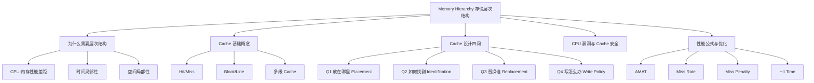

# Chapter 3 Memory Hierarchy 零基础完整讲义

资料来源：`chapter 3-1(11).pdf`、`chapter 3-2(6).pdf`、`chapter 3-3(3).pdf`、`chapter 3-4(2).pdf`。我已用 `pdftotext` 提取文字层，并渲染检查了关键图页，包括缓存层次结构、地址划分、直接映射示例、写缓冲冲突、Meltdown/Spectre 图示、blocking 图示和性能公式页。

这章的核心问题只有一句话：CPU 很快，内存和存储很慢，计算机系统怎样用一层一层的“小而快”的存储，假装自己拥有“大而快”的存储？

## 0. 先建立整章知识地图



你应该按这个顺序学：

1. 先懂“局部性”和“层次结构”。
2. 再懂 Cache 访问一次到底发生什么。
3. 再学四个设计问题：放哪、怎么找、替换谁、写怎么办。
4. 再学安全：为什么 Cache 这种性能优化会造成侧信道漏洞。
5. 最后学性能公式：怎样定量评价和优化 Cache。

## 1. 存储器是什么：从寄存器到外存

PPT 开头把 Memory 分成很多类型：

| 层次或技术 | PPT 中出现的内容 | 零基础解释 |
|---|---|---|
| Register 寄存器 | CPU 内部寄存器 | 最快、最小，CPU 指令直接操作的数据临时位置 |
| Cache 高速缓存 | L1/L2/L3 Cache | 比主存小很多，但更快，用来暂存最近可能用到的数据 |
| Memory 主存 | SRAM、DRAM、SDRAM、DDR SDRAM | 通常说“内存条”主要是 DRAM/DDR，断电丢失 |
| Storage 存储 | Flash、SSD、HDD、Tape、Optane DCPMM | 更大、更慢，用来长期保存数据 |
| Mechanical memory 机械存储 | delay line、magnetic drum、magnetic core | 历史上的存储技术 |
| Electronic memory 电子存储 | SRAM、DRAM、Flash、ROM、PROM、EPROM | 现代主流存储技术 |
| Optical memory 光存储 | 光盘类 | 用光学方式读写 |

### 1.1 CPU 访问内存的基本指令

PPT 给了两条典型指令：

```asm
Load  R2, 0(R1)
Store R2, 0(R1)
```

零基础解释：

- `Load R2, 0(R1)`：把内存地址 `R1 + 0` 处的数据读出来，放进寄存器 `R2`。
- `Store R2, 0(R1)`：把寄存器 `R2` 里的数据写回内存地址 `R1 + 0`。
- CPU 真正计算时，通常先把数据从内存搬到寄存器；计算完成后，再写回内存。

这就是为什么存储层次结构重要：每次 `Load/Store` 如果都去很慢的主存，CPU 会大量等待。

## 2. 为什么需要 Memory Hierarchy

PPT 用一组层次说明速度和容量的矛盾：

| 层次 | 大小示例 | 速度示例 | 特点 |
|---|---:|---:|---|
| Register | 约 1000-2000 bytes | 约 300 ps | 极快、极小 |
| L1 Cache | 约 64 KB | 约 1 ns | 离 CPU 最近 |
| L2 Cache | 约 256 KB | 约 5-10 ns | 比 L1 大但慢 |
| L3 Cache | 约 4-32 MB | 约 10-20 ns | 多核心常共享 |
| Memory | 约 GB 级 | 约 50-100 ns | 主存 |
| Flash/SSD | 约百 GB 到 TB | 约 50-100 us | 外存，慢很多 |

单位换算：

- `1000 picoseconds = 1 nanosecond`
- `1 ns = 10^-6 millisecond`
- 微秒 `us` 比纳秒 `ns` 慢约 1000 倍。

层次结构的设计目标：

- 用最便宜的技术提供尽可能大的容量。
- 用最快的技术提供尽可能快的平均访问速度。
- 关键是“平均”：不是每次访问都最快，而是大多数访问命中上层。

### 2.1 Processor-Memory Performance Gap

CPU 速度长期增长很快，但内存访问速度跟不上，这叫处理器-内存性能差距。

直觉例子：

- CPU 像一个做题极快的人。
- 主存像远处书架。
- Cache 像书桌上的小纸堆。
- 如果每做一步都去书架取书，速度很慢。
- 如果把最近常用的书放在桌上，多数时候直接拿桌上的书，整体会快很多。

## 3. 局部性 Locality：Cache 能工作的根本原因

PPT 强调两种 locality。

### 3.1 Temporal locality 时间局部性

定义：如果一个数据刚刚被访问，它很可能很快又被访问。

PPT 的类比：你刚把一本书拿到桌上看，短时间内大概率还会再看这本书。

程序例子：

```c
for (int i = 0; i < 1000; i++) {
    sum += x;
}
```

变量 `sum` 和 `x` 会被反复使用，所以它们适合放在寄存器或 Cache 里。

### 3.2 Spatial locality 空间局部性

定义：如果一个地址被访问，它附近地址的数据很可能也会很快被访问。

程序例子：

```c
for (int i = 0; i < 1000; i++) {
    a[i] = a[i] + 1;
}
```

访问了 `a[0]` 后，马上会访问 `a[1]`、`a[2]`。所以 Cache 不只取一个字，而是取一整块连续数据，这块叫 block 或 line。

## 4. Cache 的基础概念

PPT 对 Cache 的定义：

> Small, fast storage used to improve average access time to slow memory.

也就是：Cache 是一小块很快的存储，用来降低访问慢速存储的平均时间。

PPT 还说：在计算机体系结构里，几乎一切都可以看成 Cache：

- 寄存器是变量的 Cache，由软件/编译器管理。
- L1 Cache 是 L2 Cache 的 Cache。
- L2 Cache 是内存的 Cache。
- 内存是磁盘的 Cache，也就是虚拟内存。
- TLB 是页表的 Cache。
- 分支预测也可以看成预测信息的 Cache。

### 4.1 Cache hit 和 Cache miss

| 概念 | 含义 |
|---|---|
| Cache hit 命中 | CPU 要的数据已经在 Cache 里 |
| Cache miss 失效/未命中 | CPU 要的数据不在 Cache 里，需要去下层取 |

读内存时可能发生三种情况：

1. Cache hit：Cache 中对应块有效，并且 tag 匹配，直接读。
2. Cache miss：该位置没有有效数据，从主存取。
3. Cache miss with replacement：该位置有别的数据，但不是想要的数据，必须替换。

### 4.2 Block / Line

PPT 定义：Block/Line 是固定大小的一组数据，包含被请求的 word，从主存取出后放入 Cache。

重要点：

- Cache 通常不是只取 1 byte 或 1 word。
- 它取一整块，比如 16B、32B、64B。
- 这样可以利用空间局部性。

例子：

如果 block size = 16 bytes，访问地址 `1200` 时，Cache 会把 `1200-1215` 这一整段放入某个 Cache block。

### 4.3 没有 Cache 与有 Cache 的访存过程

PPT 示例：

```asm
lw t0, 0(t1)
```

假设：

- `t1 = 1022`
- `Memory[1022] = 99`

没有 Cache：

1. CPU 向内存发出地址 `1022`。
2. 内存读取地址 `1022` 的 word，也就是 `99`。
3. 内存把 `99` 发回 CPU。
4. CPU 把 `99` 放进寄存器 `t0`。

有 Cache：

1. CPU 先向 Cache 发出地址 `1022`。
2. Cache 检查自己有没有地址 `1022` 的副本。
3. 如果 hit，Cache 直接把 `99` 给 CPU。
4. 如果 miss，Cache 向主存请求地址 `1022`。
5. 主存把 `99` 给 Cache。
6. Cache 用新数据替换某个旧块，并把 `99` 给 CPU。
7. CPU 把 `99` 放进 `t0`。

## 5. 失效类型：Compulsory、Capacity、Conflict

PPT 中出现了 3C miss：

| Miss 类型 | 中文 | 原因 | 常见解决 |
|---|---|---|---|
| Compulsory miss | 强制性失效 / 冷启动失效 | 第一次访问某个块，Cache 不可能提前有它 | 增大 block size、预取 |
| Capacity miss | 容量失效 | 程序工作集大于 Cache 容量 | 增大 Cache |
| Conflict miss | 冲突失效 | 多个内存块映射到同一个 Cache 位置或 set，相互挤掉 | 提高相联度、增大 Cache、优化布局 |

Cache miss 的代价由两部分决定：

- Latency：取回第一个 word 的时间。
- Bandwidth：取回这个 block 剩余部分的速度。

## 6. 不同计算机对 Memory Hierarchy 的关注点

PPT 区分三类计算机：

### 6.1 Desktop computers 桌面电脑

- 主要为单个用户运行一个或少数应用。
- 更关注平均延迟 average latency。
- 直觉：用户希望应用响应快。

### 6.2 Server computers 服务器

- 可能有几百个用户，同时运行几十个应用。
- 更关注 memory bandwidth。
- 直觉：服务器不只是一次访问快，而是要同时支撑大量访问。

### 6.3 Embedded computers 嵌入式系统

- 常运行实时应用。
- 关注 worst-case performance，而不是只看 best case。
- 关注功耗和电池寿命。
- 常运行单一应用和简单 OS。
- 主存很小，甚至没有磁盘。
- Memory hierarchy 的保护作用可能弱化。

## 7. Unified Cache 与 Split I/D Cache

PPT 对比了统一 Cache 和分离 Cache。

### 7.1 Unified cache

- 指令请求和数据请求都走同一个 Cache。
- 硬件少，设计简单。
- 性能较低，因为取指令和取数据会争用同一个 Cache。

### 7.2 Split I & D cache

- I-cache 存指令。
- D-cache 存数据。
- 额外硬件更多，但性能更好。
- I-cache 只读，所以有些设计能简化。

现代 CPU 的 L1 通常分成 L1I 和 L1D，L2/L3 往往统一。

## 8. Cache 设计四问总览

PPT 的 Four Questions for Cache Designers：

| 问题 | 英文 | 关注点 | 常见答案 |
|---|---|---|---|
| Q1 | Where can a block be placed? | 一个主存 block 能放到 Cache 哪里 | Direct mapped、Fully associative、Set associative |
| Q2 | How is a block found? | 如果数据在 Cache 中，怎样判断并找到 | Tag、Index、Offset、Valid bit |
| Q3 | Which block should be replaced? | miss 时替换谁 | Random、LRU、FIFO、OPT |
| Q4 | What happens on a write? | 写命中/写失效时怎么办 | Write-through、Write-back、Write allocate、No-write allocate、Write buffer |

这四问不仅适用于 CPU Cache，也适用于操作系统、文件系统、应用程序里的缓存。

## 9. Q1 Block Placement：一个块可以放在哪里

### 9.1 Direct mapped 直接映射

定义：每个主存块只能映射到 Cache 中唯一一个位置。

公式：

```text
cache block index = block address modulo number of blocks in cache
```

优点：

- 硬件最简单。
- 命中时间短。
- 查找快。

缺点：

- 冲突严重。
- 两个常用内存块如果映射到同一位置，就会反复互相替换。

### 9.2 Fully associative 全相联

定义：一个主存块可以放到 Cache 的任意位置。

优点：

- 冲突失效最少。
- Cache 空间利用率高。

缺点：

- 查找时要和很多 tag 比较。
- 硬件复杂、功耗高、命中时间可能更长。

### 9.3 Set associative 组相联

定义：Cache 被分成若干 set。一个主存块先映射到某个 set，然后可以放在这个 set 中的任意一路 way。

公式：

```text
set index = block address modulo number of sets in cache
```

如果每个 set 有 `n` 个 block，就叫 `n-way set associative`。

特殊情况：

- Direct mapped = 1-way set associative。
- Fully associative = 只有 1 个 set 的 m-way set associative，其中 m 是 Cache 总 block 数。

PPT 结论：

- 相联度越高，Cache 空间利用率越高。
- block collision 概率越低。
- miss rate 越低。
- 但相联度越高，硬件越复杂，命中时间和功耗可能增加。
- PPT 写到多数 Cache 的 `n <= 4`，后面性能优化部分又指出现代实际设计常见 2-way 到 8-way，有些 L3 可更高。

### 9.4 为什么用地址中间位作为 index

PPT 提到：如果用高位做 index，连续内存块可能映射到同一个 Cache set。

零基础解释：

- 连续数组访问依赖空间局部性。
- 如果连续地址总挤到同一个 set，就会人为制造冲突。
- 用中间位做 index 可以让连续 block 更均匀地分散到不同 set。

## 10. Q2 Block Identification：如何知道 Cache 里有没有想要的数据

Cache 不只存数据，还要存元数据。

| 字段 | 作用 |
|---|---|
| Valid bit | 表示这一行是否有有效数据。刚开机时通常全 invalid |
| Tag | 存主存地址的高位，用来判断是不是想要的那个主存块 |
| Index | 选择 Cache 中哪个 set 或哪一行 |
| Block/Byte Offset | 在一个 block 内选择具体 word/byte |
| Dirty bit | 写回策略中使用，表示 Cache 数据被改过但还没写回主存 |

物理地址格式：

```text
| Tag | Index | Byte Offset |
```

字段位数：

```text
Index bits = log2(number of sets)      # 组相联
Index bits = log2(number of blocks)    # 直接映射
Offset bits = log2(block size in bytes)
Tag bits = address size - index bits - offset bits
```

### 10.1 Direct-mapped 查找过程

1. 用 index 找到唯一一行。
2. 看 valid bit 是否为 1。
3. 比较该行 tag 是否等于地址 tag。
4. 如果 valid=1 且 tag match，则 hit。
5. 用 offset 选出 block 中的具体 byte/word。

### 10.2 Set-associative 查找过程

1. 用 index 找到某个 set。
2. 同时比较该 set 中多个 way 的 tag。
3. 哪一路 tag match 且 valid=1，就命中哪一路。
4. 如果都不匹配，miss。

### 10.3 Fully-associative 查找过程

没有 index 或者可以看成只有一个 set。

1. 请求地址的 tag 要和所有 Cache 行比较。
2. 任意一行匹配就 hit。
3. 硬件比较器最多，所以复杂。

## 11. 地址映射例题 1：16 KiB 直接映射 Cache

PPT 示例：

- Cache 数据容量：16 KiB。
- Direct-mapped。
- Block size：4 words。
- 通常 1 word = 4 bytes，所以 block size = 16 bytes。
- 访问地址：
  - `0x00000014`
  - `0x0000001C`
  - `0x00000034`
  - `0x00008014`

先计算：

```text
16 KiB = 16 * 1024 bytes
block size = 4 words = 16 bytes
number of blocks = 16 KiB / 16 B = 1024 = 2^10
offset bits = log2(16) = 4
index bits = log2(1024) = 10
```

### 11.1 访问 `0x00000014`

```text
byte address = 0x14 = 20
block address = floor(20 / 16) = 1
index = 1 mod 1024 = 1
tag = floor(1 / 1024) = 0
offset = 20 mod 16 = 4
```

刚开始 Cache 为空，valid bit 为 0，所以 miss。系统从主存取 block 1 放入 Cache index 1，设置 tag=0，valid=1。offset=4 指向该 block 中第 2 个 word，PPT 图中返回 `b`。

### 11.2 访问 `0x0000001C`

```text
byte address = 0x1C = 28
block address = floor(28 / 16) = 1
index = 1
tag = 0
offset = 12
```

它和 `0x14` 属于同一个 16B block。刚才已经把 block 1 放入 Cache，所以 valid=1 且 tag=0 匹配，hit。offset=12 指向第 4 个 word，PPT 图中返回 `d`。

这就是空间局部性。

### 11.3 访问 `0x00000034`

```text
byte address = 0x34 = 52
block address = floor(52 / 16) = 3
index = 3
tag = 0
offset = 4
```

index 3 还没有有效数据，所以 miss。加载 block 3，返回 PPT 图中的 `f`。

### 11.4 访问 `0x00008014`

```text
byte address = 0x8014 = 32788
block address = floor(32788 / 16) = 2049 = 0x801
index = 2049 mod 1024 = 1
tag = floor(2049 / 1024) = 2
offset = 4
```

Cache index 1 已经有数据，但 tag 是 0，不是 2，所以这是 conflict miss。必须替换 index 1 的旧 block，写入 tag=2 的新 block，返回 PPT 图中的 `j`。

## 12. Cache 位数计算例题

PPT 例题：

> How many total bits are required for a direct-mapped cache with 16 KiB of data and four-word blocks, assuming a 64-bit address?

已知：

```text
16 KiB = 4096 words = 2^12 words
block size = 4 words = 2^2 words
number of blocks = 2^12 / 2^2 = 2^10
n = 10
m = 2
```

地址字段：

```text
byte offset = 2 bits       # 一个 word 4 bytes
word offset = m = 2 bits   # 一个 block 4 words
index = n = 10 bits
tag = 64 - (10 + 2 + 2) = 50 bits
```

每个 Cache line 需要：

```text
data = 4 * 32 = 128 bits
tag = 50 bits
valid = 1 bit
total per line = 179 bits
```

总 Cache 位数：

```text
2^10 * 179 = 183296 bits = 179 Kib = 22.375 KiB
```

注意：16 KiB 是纯数据容量；22.375 KiB 是完整实现需要的数据位 + tag 位 + valid 位。

## 13. 地址映射例题 2：byte address 1200 映射到哪一块

PPT 例题：

- Cache 有 64 blocks。
- Block size = 16 bytes。
- byte address = 1200。

计算：

```text
block address = byte address / bytes per block = 1200 / 16 = 75
cache block number = 75 mod 64 = 11
```

所以地址 1200 映射到 Cache block 11。因为 block size 是 16 bytes，所以地址 `1200-1215` 都属于同一个主存 block，也都映射到这个 Cache block。

## 14. Q3 Block Replacement：失效时替换谁

### 14.1 Direct-mapped 没得选

在直接映射 Cache 中，一个主存块只能去一个位置。miss 时，如果该位置已有旧块，就只能替换它。

### 14.2 Set-associative / Fully-associative 要选择

一个 set 中有多个 way，或者全相联中有多个位置可放，所以 miss 时要决定替换哪一个。

PPT 列出三种常见策略：

| 策略 | 含义 | 优点 | 缺点 |
|---|---|---|---|
| Random | 随机替换一个 block | 硬件简单，分布均匀 | 可能替换马上要用的数据 |
| LRU | 替换最近最少使用的 block | 符合时间局部性 | 需要额外硬件记录访问顺序 |
| FIFO | 替换最早进入 Cache 的 block | 简单 | 不关心最近是否使用，可能效果差 |
| OPT | 替换未来最久不用的 block | 理论最优 | 现实不能提前知道未来，常用于分析上限 |

### 14.3 指令 Cache miss 的处理步骤

PPT 给出 instruction cache miss 的步骤：

1. 把原始 PC 值发送给内存。PPT 注了 `PC-4`，意思是取指失败后要重新从那条指令开始。
2. 指示主存执行读操作，并等待内存访问完成。
3. 写 Cache entry：把内存数据写入 data 部分，把地址高位写入 tag 字段，打开 valid bit。
4. 重新开始指令执行第一步，这次重新取指时会在 Cache 中命中。

### 14.4 FIFO / LRU / OPT 示例

PPT 示例：

```text
Cache block size = 3
access sequence = 2, 3, 2, 1, 5, 2, 4, 5, 3, 4
```

直观结果：

- FIFO 命中约 3 次。
- LRU 命中约 4 次。
- OPT 命中约 5 次。

为什么不同？因为替换策略决定了哪个旧数据被保留。

### 14.5 Thrashing 抖动

PPT 示例：

```text
sequence = 1, 2, 3, 4, 1, 2, 3, 4
```

如果 Cache 只有 3 个块，而程序循环访问 4 个块，就可能每次都刚好把马上要用的数据挤掉，导致几乎没有 hit。这叫 thrashing。

### 14.6 Stack replacement algorithm 与 Belady anomaly

PPT 定义：

```text
Bt(n) represents the set of access sequences contained in a cache block of size n at time t.
Bt(n) is the subset of Bt(n+1).
```

意思：如果替换算法满足“容量为 n 的 Cache 中保留的内容，一定是容量 n+1 的 Cache 内容的子集”，就有 stack property。

LRU 是 stack replacement algorithm，因此对 LRU 来说，Cache block 数增加，hit ratio 总是不下降。

FIFO 不是 stack algorithm，所以会出现 Belady anomaly：Cache 更大，命中反而可能更少。PPT 用序列：

```text
1, 2, 3, 4, 1, 2, 5, 1, 2, 3, 4, 5
```

展示了 FIFO 在 `n=3` 和 `n=4` 下命中次数可能反常。

## 15. LRU 的硬件实现：Comparison Pair Method

PPT 问题：

> How can I implement the LRU replacement algorithm with only ordinary gates and triggers?

方法：比较对触发器。

以 3 个 Cache block：A、B、C 为例。

可能的 pair 有：

```text
AB, BA, AC, CA, BC, CB
```

因为 AB 和 BA 是同一对，只需要：

```text
TAB, TAC, TBC
```

定义：

- `TAB = 1`：A 比 B 最近访问。
- `TAB = 0`：B 比 A 最近访问。
- `TAC`、`TBC` 同理。

每次访问某个 block 后更新触发器：

- 访问 A 后：`TAB=1, TAC=1`
- 访问 B 后：`TAB=0, TBC=1`
- 访问 C 后：`TAC=0, TBC=0`

按照定义，如果 C 是最久未访问，需要 A 比 C 新、B 比 C 新：

```text
C_LRU = TAC & TBC
```

同理可推出 A 和 B 是否为 LRU。PPT 的重点不是要求你死记布尔式，而是理解：LRU 需要维护“谁比谁更新”的关系，所以硬件开销随 block 数快速增长。

PPT 的硬件用量分析：

如果 block 数为 `p`：

```text
comparison pair flip-flops = C(p,2) = p * (p - 1) / 2
AND gates = p
inputs per AND gate = p - 1
```

表格：

| Block Number | Flip-flop 数 | AND gate 数 | 每个 AND gate 输入数 |
|---:|---:|---:|---:|
| 3 | 3 | 3 | 2 |
| 4 | 6 | 4 | 3 |
| 6 | 15 | 6 | 5 |
| 8 | 28 | 8 | 7 |
| 16 | 120 | 16 | 15 |
| 64 | 2016 | 64 | 63 |
| 256 | 32640 | 256 | 255 |

结论：精确 LRU 对高相联度 Cache 很贵，所以实际硬件常用近似 LRU。

## 16. Q4 Write Strategy：写操作怎么办

读 miss 已经麻烦，写更麻烦，因为写会改变数据，涉及 Cache 与主存一致性。

### 16.1 Write hit：写命中

#### Write-through 写直达

PPT 定义：写命中时，同时写 Cache 和主存。

特点：

- 主存总是最新数据。
- 数据一致性强。
- Cache 控制位只需要 valid bit。
- 缺点是写操作慢，消耗内存带宽。
- 典型场景：实时系统，如飞控，数据完整性关键。

#### Write-back 写回

PPT 定义：写命中时，只写 Cache。主存要等该 block 被替换时才更新。

特点：

- 需要 dirty bit。
- 能减少内存带宽。
- Cache 控制位需要 valid bit 和 dirty bit。
- 缺点是断电或崩溃时，如果 dirty block 还没写回，主存中没有最新数据。
- 典型场景：通用处理器，如桌面 CPU，优先性能。

### 16.2 Dirty bit 脏位

Dirty bit 是每个 Cache line 的状态位。

- `dirty = 0`：Cache 中的数据和主存一致，替换时不用写回。
- `dirty = 1`：Cache 中的数据被改过，主存不是最新，替换前必须写回主存。

Dirty bit 是 write-back 策略必需的。

### 16.3 Write miss：写失效

#### Write allocate

PPT 定义：写 miss 时，先把目标地址所在 block 从主存加载到 Cache，然后在 Cache 中执行写。

优点：

- 利用时间局部性和空间局部性。
- 如果之后还会读写同一地址，会 hit。

典型搭配：

```text
write-back + write-allocate
```

#### No-write allocate / Write around

PPT 定义：写 miss 时，不把 block 加入 Cache，而是直接写主存。

优点：

- 避免一次性写入污染 Cache。

典型场景：

- 日志系统。
- 流式数据。
- 写完很少再读的数据。

典型搭配：

```text
write-through + no-write-allocate
```

### 16.4 两种常见组合

| 组合 | 写 miss 行为 | 优点 | 后续读同地址 |
|---|---|---|---|
| Write-back + Write-allocate | 先把 block 读入 Cache，再写 Cache，dirty=1 | 重复写性能好 | 容易 hit |
| Write-through + No-write-allocate | 直接写主存，不放入 Cache | 一致性强，避免污染 | 仍可能 miss |

### 16.5 Write stall 与 Write buffer

Write stall：CPU 必须等待写操作完成，尤其常见于 write-through。

Write buffer：一个小缓冲区，暂存等待写入主存的数据，使 CPU 不必立刻停下来等主存。

PPT 要点：

- Write buffer 可以减轻 write-through 的性能惩罚。
- 当写操作成簇出现时很有用。
- 但不能完全消除 stall，因为如果突发写入超过 buffer 容量，buffer 会满。

### 16.6 写策略例题

PPT 选择题：

1. 哪种策略在 write hit 时同时更新 Cache 和主存？
   - 答案：Write-through。

2. Write-back 下某个 modified block 在被替换前断电丢失，会怎样？
   - 答案：数据可能丢失，因为更新只存在 Cache 中。

PPT 表格题：

```text
Strategy A = Write-back + Write-allocate
Strategy B = Write-through + No-write-allocate
```

在 write miss 时：

| 行为 | Strategy A | Strategy B |
|---|---|---|
| 从主存加载 block 到 Cache | Yes | No |
| 立即更新主存 | No | Yes |
| 更新 Cache | Yes | No |
| 后续读同地址是否 hit | Yes | No |

PPT 序列题：

```text
1 write Mem[100]
2 write Mem[100]
3 read  Mem[200]
4 write Mem[200]
5 write Mem[100]
```

假设 fully associative write-back cache，很多 entries，开始为空。

| 操作 | No-write allocate | Write allocate |
|---|---|---|
| write Mem[100] | miss | miss |
| write Mem[100] | miss | hit |
| read Mem[200] | miss | miss |
| write Mem[200] | hit | hit |
| write Mem[100] | miss | hit |

统计：

- No-write allocate：1 hit，4 misses。
- Write allocate：3 hits，2 misses。

## 17. Virtual Memory 预告：内存层次结构也有四问

3-2 后半部分引入虚拟内存：

- 程序可以使用不连续的内存位置。
- 可以结合 secondary/non-memory storage。
- 为了支持更多进程，需要更大的“看起来可用”的内存。

虚拟内存同样可以问四个问题：

1. 一个 block/page 可以放在主存哪里？
2. 如果在主存中，如何找到？
3. 虚拟内存 miss/page fault 时替换谁？
4. 写操作怎么办？

也就是说，Cache 和虚拟内存是同一种层次化思想在不同层面的应用。

## 18. CPU 漏洞与 Cache 安全：为什么性能优化会变成安全问题

3-3 主题：Meltdown & Spectre。

### 18.1 背景：Cache 是 CPU 与主存之间的数据桥梁

PPT 强调：

- Cache 中可能短暂存储敏感数据、密钥等。
- 不同应用的数据可能共享同一块 Cache，并且互相替换。
- 多核心之间可能共享 Cache。
- 处理器之间可能共享 Cache。
- 同一核心内不同进程之间也可能共享 Cache。

缓存侧信道攻击：攻击者利用访存时延差异，推测受害者访存行为或泄露机密信息。

特点：

- 细粒度。
- 高隐蔽性。
- 可突破安全隔离边界。
- 可跨平台和 CPU，影响范围广。

### 18.2 关键安全直觉：Cache 本身不能直接读，但能通过时间猜

用户态程序不能直接读内核数据，也不能直接查看 Cache 中有什么。

但 Cache hit 和 miss 的时间不同：

- hit 很快。
- miss 慢。

攻击者可以反复测量访问时间，从而推断“某个地址对应的数据是不是被加载进 Cache 了”。这就是侧信道。

### 18.3 CPU 缓存缺陷分析

PPT 的核心逻辑：

- 现代 CPU 有预测执行/乱序执行。
- 某些后续指令的内存加载，不一定等前面指令确认合法后才开始。
- 从内存加载到 Cache 的阶段，可能还没完成权限检查。
- 即使最终指令因为权限错误被丢弃，Cache 状态可能已经被改变。

这就造成一个漏洞：

```text
架构状态被恢复了，但微架构状态 Cache 没有完全恢复。
```

攻击者不能直接得到非法数据，但能观察 Cache 的变化来推断非法数据。

## 19. Meltdown

### 19.1 原理

PPT 定义：Meltdown 利用现代 CPU 的乱序执行，突破硬件保证的内存隔离，使普通权限进程能读取内核内存。

乱序执行 out-of-order execution：

- 某些指令等待内存时，CPU 不闲着，会先执行后面的指令。
- 这样提高计算资源利用率。
- 为保证程序结果正确，最终提交 retirement 必须按程序顺序。
- 安全检查也常在 retirement 阶段发生。

问题：

- 在安全检查前，后续指令可能已经提前执行。
- 提前执行的结果会被丢弃。
- 但 Cache 状态可能留下痕迹。

### 19.2 Meltdown 攻击过程

PPT 的阶段：

1. 获取指令，解码后放入 Reservation Stations。
2. 乱序执行指令，结果保存在结果序列中。
3. Retirement 阶段重新排列结果序列并做安全检查，例如地址访问权限检查，然后提交到寄存器。

PPT 的攻击示例有 4 步：

1. 指令获取解码。
2. 乱序执行多条指令。某些后续指令依赖非法读取到的值，并访问 `rbx[al * 4096]` 这样的数组页，使某个页进入 CPU Cache。
3. 安全检查发现访问违例，丢弃架构执行结果，恢复 CPU 状态，但不恢复 Cache 状态。
4. 攻击者遍历访问 `rbx[al * 4096]`，测哪个页访问时间远小于其他页，就知道哪个页被加载过，从而推断内核数据。

### 19.3 Meltdown 缓解

PPT 提到 KAISER：

- 一种内核修改，使内核不映射到用户空间。
- 但 x86 架构设计需要在用户空间映射若干权限内存位置，因此仍可能留下残留攻击面。

后面 CVE 表中提到：

- CVE-2017-5754 Rogue Data Cache Load，也就是 Meltdown。
- 影响：内核。
- 缓解：更新内核，使用 PTI/KPTI 补丁。
- 性能影响：低到中等。

## 20. Spectre

### 20.1 原理

PPT 定义：Spectre 利用 CPU 的预测执行攻击系统，破坏不同应用程序之间的隔离。

预测执行 speculative execution：

- 分支指令可能要等内存读取，耗费上百个 CPU 周期。
- CPU 不想等，于是预测哪个分支会执行。
- 预测后提前取指令并执行。
- 如果预测正确，性能提升。
- 如果预测错误，CPU 丢弃预测结果并重置架构状态。
- 但 Cache 状态可能保留。

BPU：Branch Prediction Unit，分支预测单元。它存储某个分支最近的跳转结果，用来预测未来分支。

### 20.2 Spectre 攻击过程

PPT 三阶段：

1. 训练 CPU 的 BPU，让它在运行漏洞代码时做特定预测。
2. 预测执行把将要访问的地址内容读入 CPU Cache。
3. 通过缓存侧信道攻击，判断哪个数组元素被访问过，也就是哪个内存页进入 Cache，从而推测地址内容。

### 20.3 Spectre 缓解

PPT 列出：

1. 序列化指令，限制预测执行。
   - 问题：不一定适用于所有 CPU 或系统配置。
2. 插入推测执行阻止指令。
   - 问题：严重降低性能。
3. 微代码修复现有处理器。
   - 问题：可能阻止推测执行或推测内存读取，性能损失大。

CVE 表：

- CVE-2017-5753：Spectre variant 1，边界检查绕过。
  - 影响：内核和所有软件。
  - 缓解：用修改后的编译器重新编译软件和内核，在适当位置插入 LFENCE。
  - 性能影响：可忽略。
- CVE-2017-5715：Spectre variant 2，分支目标注入。
  - 影响：内核。
  - 缓解 1：微代码更新的新操作码，保护 BTB。
  - 缓解 2：retpoline，重新编译软件/操作系统。
  - 性能影响：缓解 1 高，缓解 2 中等，取决于 CPU。

## 21. Meltdown 与 Spectre 对比

| 项目 | Meltdown | Spectre |
|---|---|---|
| 依赖机制 | 乱序执行 | 分支预测/预测执行 |
| 主要破坏 | 用户态与内核态隔离 | 不同应用之间隔离 |
| 典型漏洞范围 | Intel 处理器特定提权漏洞更突出 | AMD、ARM、Intel 等多数处理器受影响 |
| 利用难度 | 相对较直接 | 更难，训练分支预测成本更高 |
| KAISER/KPTI | 可缓解 Meltdown | 不能防止 Spectre |
| 共同点 | 都通过 Cache 侧信道泄露信息 | 都利用架构状态回滚但 Cache 状态残留 |

## 22. 漏洞复现实验与攻击结果

PPT 工具清单：

| 项目 | 内容 |
|---|---|
| 虚拟机 | VMware Workstation 11.0.0 |
| 系统镜像 1 | ubuntu-16.04.3-desktop-amd64.iso |
| 内核版本 1 | Linux ubuntu 4.13.0-41-generic |
| 系统镜像 2 | CentOS-7-x86_64-DVD-1708.iso |
| 内核版本 2 | Linux localhost.localdomain 3.10.0-693.el7.x86_64 |
| 物理处理器 | Intel Core i5-7300HQ @ 2.5GHz |

PPT 复现结果：

- Meltdown POC 在 CentOS 下成功读到内核 `linux_proc_banner` 地址上的数据。
- Spectre POC 读取了字符串 `"The Magic Words are Squeamish Ossifrage."`

攻击可能造成：

- 泄露本地操作系统底层信息、密钥信息等。
- 绕过内核、虚拟机 Hypervisor 的隔离防护。
- 云服务中泄露其他租户隐私。
- 通过浏览器泄露账号、密码、内容、邮箱、cookie 等。

## 23. Cache 安全增强方案

### 23.1 商用处理器已有防御

PPT 表格：

| 攻击类型 | Intel 防御 | ARM 防御 |
|---|---|---|
| 边界检查绕过 | LFENCE 内存屏障 | CSDB 新内存屏障 |
| 分支目标注入 | retpoline 返回跳板 | 无通用缓解方法 |
| 数据缓存恶意加载 | KPTI 内核页表隔离 | KPTI |
| 系统寄存器恶意加载 | 更新微码 | 非必要 |
| 推测存储绕过 | LFENCE、MSR SSBD 标识位 | SSBB、PSSBB |

PPT 结论：商用处理器主要针对已披露的 Meltdown 和 Spectre 防御，对其他缓存侧信道攻击还不充分。

### 23.2 软件防御

| 类型 | 思路 |
|---|---|
| 漏洞检测 | 静态或动态程序分析，找可能存在缓存侧信道漏洞的位置 |
| 用户级防御 | 保持特定运算时间恒定、清除缓存等 |
| 系统级防御 | 从 OS/Hypervisor 层完善内存管理、锁定缓存行等 |

优点：软件实现灵活，可快速部署。

缺点：依赖底层微架构，可能需要硬件支持降低开销，不同场景效果不同。

### 23.3 硬件防御

#### Cache partitioning 缓存分组

把 Cache 划分不同区域，给不同进程或安全域使用。

优点：从原理上隔离，能避免很多侧信道。

缺点：受硬件限制，性能影响大。

#### Cache randomization 缓存随机化

消除特定地址到 Cache index 的固定映射，使攻击者难以推断受害者访问地址。

方法：

- 基于表的随机映射。
- 基于计算或加密的随机映射。

优点：性能开销较小，有一定有效性验证。

缺点：不能完全避免侧信道，只能缓解。

#### 其他策略

- 针对目录结构的防御：增加目录项、减少冲突，或检测跨核心缓存行替换并恢复。
- 完善软件硬件协作：定义新 ISA。
- Data oblivious programming：让机密信息不影响分支和时延。
- 优化基本块执行，减少分支预测泄漏。

## 24. Cache 性能公式

3-4 进入 Memory System Performance。

### 24.1 CPU Execution Time

PPT 公式：

```text
CPU Execution time = (CPU clock cycles + Memory stall cycles) * Clock cycle time
```

内存停顿周期：

```text
Memory stall cycles
= IC * memory access refs per instruction * miss rate * miss penalty
```

所以：

```text
CPUtime = IC * (CPI_execution + MemAccess/Inst * MissRate * MissPenalty) * CycleTime
```

或者：

```text
CPUtime = IC * (CPI_execution + MemMisses/Inst * MissPenalty) * CycleTime
```

变量解释：

| 符号 | 含义 |
|---|---|
| IC | Instruction Count，指令条数 |
| CPI_execution | 不考虑内存停顿时的 CPI |
| MemAccess/Inst | 每条指令平均内存访问次数 |
| MissRate | 失效率 |
| MissPenalty | 每次 miss 的代价，单位通常是 cycle |
| CycleTime | 时钟周期时间 |

### 24.2 AMAT 平均内存访问时间

PPT 核心公式：

```text
AMAT = Hit Time + Miss Rate * Miss Penalty
```

三个核心指标：

| 指标 | 含义 |
|---|---|
| Hit Rate | CPU 在 Cache 中找到数据的概率 |
| Miss Rate | `1 - Hit Rate` |
| Hit Time | Cache hit 时访问时间 |
| Miss Penalty | miss 后从下层取数据的时间 |

记住：Cache 优化本质就是降低 AMAT。

## 25. 基础优化方法

### 25.1 Larger Block Size to Reduce Miss Rate

核心原理：利用空间局部性，一次加载更多连续数据，减少首次访问的强制性失效。

优点：

- 对数组遍历、矩阵运算等空间局部性好的程序效果明显。

缺点：

- 每次 miss 要传更多数据，miss penalty 变大。
- Cache 容量固定时，block 变大意味着 block 数变少，可能增加 conflict miss。

### 25.2 Larger Caches to Reduce Miss Rate

核心原理：Cache 更大，可容纳更多工作集，减少 capacity miss 和 conflict miss。

优点：

- 降低 miss rate 直观有效。

缺点：

- hit time 可能延长。
- 硬件成本、面积、功耗上升。

适用：

- 数据库查询。
- 科学计算。
- 大数据集应用。

### 25.3 Higher Associativity to Reduce Miss Rate

核心原理：让一个主存块有多个可放位置，减少冲突风险。

优点：

- 降低 conflict miss。

缺点：

- 需要并行比较多个 tag。
- 命中时间可能增加。
- 功耗和面积增加。

PPT 的 2:1 Cache Rule：

```text
Miss rate of direct-mapped cache of size N
≈ Miss rate of 2-way associative cache of size N/2
```

含义：提高相联度能减少冲突，有时较小的 2-way Cache 可接近较大的 direct-mapped Cache。

但 PPT 警告：

- Miss rate 不是唯一指标。
- Higher associativity may increase cache hit time。
- Hill 1988 数据：2-way 相比 1-way，外部 Cache hit time 增约 10%，内部 Cache 增约 2%。

PPT 给出的 Cache Cycle Time 假设：

```text
1-way: 1.00
2-way: 1.10
4-way: 1.12
8-way: 1.14
```

结论：

- 4-way 到 8-way 常是性能和复杂度的良好折中。
- 超过 8-way 往往硬件成本增加而收益有限。

现实例子：

- Intel Core i7：
  - L1：32KB，8-way set associative。
  - L2：256KB，4-way。
  - L3：8MB，16-way shared。

### 25.4 Pseudo-associativity

问题：怎样结合 direct mapped 的快 hit time 和 2-way set associative 的低 conflict miss？

PPT 方法：

- 把 Cache 分成两半。
- 先按 direct-mapped 查一半。
- 如果 miss，再查另一半。
- 如果另一半有，叫 pseudo-hit 或 slow hit。

缺点：

- hit 可能需要 1 或 2 cycles。
- CPU pipeline 处理困难。

适合：

- 不直接绑在处理器关键路径上的 Cache，如 L2。
- PPT 提到 MIPS R1000 L2、UltraSPARC 类似设计。

### 25.5 Multilevel Caches to Reduce Miss Penalty

核心原理：CPU 和主存之间加 L1/L2/L3。L1 miss 后先查 L2/L3，而不是直接去主存。

优点：

- 显著降低 miss penalty。
- 现代处理器标准设计。

缺点：

- 硬件复杂度和制造成本增加。

### 25.6 Giving Priority to Read Misses over Writes

核心原理：写操作先进 write buffer，读 miss 优先处理，减少 CPU 等待读数据的时间。

为什么读优先？

- CPU 通常真的需要读到数据才能继续执行。
- 写操作可以异步慢慢写回。

读 miss 策略：

| 策略 | 含义 |
|---|---|
| Read through | 直接从主存读给 CPU，不经过 Cache，PPT 标注不常用 |
| Read allocate | 先从主存读入 Cache，再从 Cache 读给 CPU |

写 miss 策略：

| 策略 | 含义 |
|---|---|
| Write allocate | 先从主存加载目标 block 到 Cache，CPU 写 Cache，之后再写回主存 |
| Write around | 直接写主存，不加载进 Cache |

RAW conflict 问题：

如果 write buffer 中有地址 A 的新值，但读 miss 又去主存读地址 A，而读 miss 不检查 write buffer，就可能读到旧值。

PPT 解决：

1. 简单办法：读 miss 等 write buffer 清空，但性能很差。
2. 更好办法：读 miss 时先检查 write buffer。
   - 如果冲突，从 write buffer 取最新数据。
   - 如果不冲突，继续访问主存。

### 25.7 Avoiding Address Translation During Indexing

核心原理：用虚拟地址进行 Cache index，而不是先等 TLB 把虚拟地址翻译成物理地址。

优点：

- 避免 TLB 查找出现在关键路径。
- 减少 hit time。
- 支持更高 CPU 频率。

缺点：

- 可能发生 aliasing：多个虚拟地址映射到同一物理地址，却在 Cache 中形成多个副本。
- 需要额外硬件或 OS 约束处理。

常见相关概念：VIPT，Virtually Indexed Physically Tagged。

## 26. 高级优化方法

### 26.1 Pipelined L1 Cache

核心原理：把 Cache 访问拆成流水线阶段，例如译码、tag 比较、数据读取。

优点：

- 每个周期可以发起新请求。
- 提高带宽。
- 支持更高 CPU 频率。

缺点：

- 单次访问延迟可能增加。
- 数据要经过多个流水线阶段才能返回。

PPT 例题比较 32KiB 2-way 和 32KiB 4-way L1：

```text
AMAT = Hit time + Miss rate * Miss penalty
```

PPT 给出的结论是 2-way 更快。注意：提取到的数字中 `1 + 0.038 * 15 = 1.38` 存在算术不一致，因为 `0.038 * 15 = 0.57`，按公式应为 `1.57`。但无论按 `1.38` 还是 `1.57`，都小于 PPT 后面对 4-way 的 `1.77`，所以结论仍是 2-way AMAT 更低。

这个例子想说明：miss rate 稍低不一定赢，因为 hit time 变长可能更伤性能。

### 26.2 Multiple Banks and Ports for L1 D-Cache

核心原理：把 Cache 分成多个独立 bank，每个 bank 有独立读写端口，支持并行访问。

优点：

- 增加 L1 D-cache 带宽。
- 适合乱序执行、多核、GPU 等高并发访问。

缺点：

- 控制逻辑复杂。
- 芯片设计与验证更难。

PPT 图中以 four-way interleaved cache banks 说明：如果 block size 是 64 bytes，block address 乘以 64 可得到 byte address。

### 26.3 Better Replacement Policies

核心原理：用更智能的替换算法预测未来访问，减少 miss。

PPT 提到：

- LRU：最近最少使用。
- LFU：最不经常使用。
- FIFO：先进先出。

优点：降低 miss rate。

缺点：硬件复杂度上升。

适用：Cache 容量有限、访问模式有明显规律的场景。

### 26.4 Multibanked L2 and L3

核心原理：把大容量 L2/L3 Cache 划分为多个 bank。

目的：

- 降低功耗。
- 降低访问延迟。
- 增加带宽。

直觉：

- 不必每次激活整个大 Cache。
- 可以只访问相关 bank。
- 多个请求可以并行去不同 bank。

### 26.5 Nonblocking Caches

核心原理：Cache miss 时，CPU 不一定完全停住；允许继续处理后续能执行的指令或其他 hit。

常见说法：

- hit under miss：一个 miss 正在处理时，后续 hit 仍可服务。
- miss under miss：多个 miss 可同时 outstanding。

优点：

- 提高 Cache 带宽和乱序执行效率。
- 用计算覆盖 miss 等待时间。

缺点：

- 控制逻辑复杂。
- 需要 MSHR 等结构跟踪未完成 miss。
- 一致性和异常处理更难。

### 26.6 Critical Word First 和 Early Restart

核心原理：Cache miss 时，不必等整个 block 都从内存传完。先把 CPU 当前急需的 word 传回来。

| 技术 | 含义 |
|---|---|
| Critical word first | 优先传回导致 miss 的那个 word |
| Early restart | 一旦 critical word 到达，CPU 就恢复执行，剩余 block 继续后台填充 |

优点：

- 降低有效 miss penalty。
- 适合对延迟敏感的程序。

缺点：

- 内存控制器和 Cache 填充逻辑更复杂。

### 26.7 Compiler Optimizations to Reduce Miss Rate

核心原理：编译器或程序员通过改变代码布局和数据访问模式，提高时间局部性和空间局部性。

优点：

- 软件层面优化，不改硬件。
- 成本低，易部署。

缺点：

- 依赖编译器智能程度。
- 依赖原始代码结构。

## 27. 编译器优化：Instruction Miss

### 27.1 Reorder procedures in memory

目标：减少指令 Cache conflict miss。

方法：

- 连续调用的函数相邻存放，尽量放进同一个 Cache line。
- 条件分支中 hot path 连续布局。
- 冷热代码分离：高频路径放一起，低频代码挪远。
- 高频函数如果不能放同一 block，就尽量分散到不同 Cache set，避免互相驱逐。

### 27.2 Profiling to look at conflicts

PPT 流程：

1. 动态分析 profiling：收集程序执行轨迹、指令访问模式、Cache miss 事件。
2. 冲突检测：通过时间关系图找出高频交替访问、且映射到同一 Cache set 的地址对。
3. 生成优化策略：
   - 连续调用链函数重排序或内联。
   - hot path 基于分支概率重排。
   - 冷热代码分离。
   - 高频函数或循环体地址对齐。
   - 分散到不同 Cache set。
4. 实施优化：可能通过链接脚本控制关键函数地址。
5. 验证反馈：效果不好则重新分析。

## 28. 编译器优化：Data Miss

### 28.1 Merging arrays

问题：

```c
val[i]
key[i]
```

如果 `val[]` 和 `key[]` 分开存，程序交替访问它们，可能造成大量 Cache miss。

优化：把相关数据合并到一个结构中。

```c
struct Item {
    int val;
    int key;
};
Item a[N];
```

这样访问 `a[i].val` 后，`a[i].key` 很可能已经在同一个 Cache line。

### 28.2 Loop interchange

PPT 强调二维数组在 C/C++ 中通常按 row-major order 行主序存储。

行主序含义：

```text
x[0][0], x[0][1], x[0][2], ...
x[1][0], x[1][1], x[1][2], ...
```

坏访问：

```c
for (col = 0; col < N; col++)
    for (row = 0; row < N; row++)
        use(x[row][col]);
```

访问顺序：

```text
x[0][0], x[1][0], x[2][0], ...
```

这些元素在内存中相隔很远，miss rate 高。

好访问：

```c
for (row = 0; row < N; row++)
    for (col = 0; col < N; col++)
        use(x[row][col]);
```

访问顺序：

```text
x[0][0], x[0][1], x[0][2], ...
```

连续访问，空间局部性好。

### 28.3 Loop fusion

合并具有相同循环范围且某些变量重叠的独立循环。

合并前：

```c
for (i = 0; i < n; i++) a[i] = a[i] + 1;
for (i = 0; i < n; i++) b[i] = a[i] * 2;
```

合并后：

```c
for (i = 0; i < n; i++) {
    a[i] = a[i] + 1;
    b[i] = a[i] * 2;
}
```

优点：`a[i]` 刚用完又用，时间局部性更好。

前提：两个循环独立，合并后程序语义不变。

### 28.4 Loop distribution

把不相关或访问方向冲突的操作拆成多个循环。

PPT 示例：

```c
for (i = 0; i < n; i++) {
    for (j = 0; j < n; j++) {
        val[i][j]++;
        key[j][i]++;
    }
}
```

问题：

- `val[i][j]` 希望按行访问。
- `key[j][i]` 也希望按它自己的行访问。
- 放在一个循环里会冲突。

拆开后可分别选择最适合的循环顺序，降低 miss rate。

### 28.5 Blocking / Tiling 循环分块

核心：把大矩阵运算拆成小块，让一小块数据在 Cache 中反复使用。

普通矩阵乘法：

```c
for (i = 0; i < N; i++)
    for (j = 0; j < N; j++) {
        r = 0;
        for (k = 0; k < N; k++)
            r = r + y[i][k] * z[k][j];
        x[i][j] = r;
    }
```

问题：

- `z[k][j]` 随 k 变化时，在行主序中不是连续访问。
- 大矩阵超过 Cache 时，反复 miss。

分块思想：

```c
for (int kk = 0; kk < n; kk += B) {
    int k_end = min(kk + B, n);
    for (int ii = 0; ii < n; ii += B) {
        int i_end = min(ii + B, n);
        for (int jj = 0; jj < n; jj += B) {
            int j_end = min(jj + B, n);
            for (int k = kk; k < k_end; ++k) {
                for (int i = ii; i < i_end; ++i) {
                    float yval = y[i * n + k];
                    for (int j = jj; j < j_end; ++j) {
                        x[i * n + j] += yval * z[k * n + j];
                    }
                }
            }
        }
    }
}
```

PPT 结论：

- 时间复杂度仍是 `O(N^3)`。
- 但简单估算 miss 次数可从 `O(N^3)` 降到 `O(N^3 / B)`。
- 实际上 L1 Cache 能包含矩阵多行数据，所以实验结果可能比简单理论估算更好。

PPT blocking 测试要点：

- 使用 Windows API 高精度计时器：
  - `QueryPerformanceFrequency()`
  - `QueryPerformanceCounter()`
- 阻止编译器优化：`#pragma optimize("", off)`
- 按一维数组方式构建二维数组，保证 row-major order。
- 禁用自动向量化。
- 禁用编译器内联优化等。
- 内存 64 位对齐，减少跨 Cache line 干扰。

## 29. Prefetching 预取

### 29.1 Hardware prefetching

硬件自动检测访问模式，例如顺序访问，并提前把未来可能用到的数据放入 Cache。

优点：

- 程序员不用改代码。
- 可降低 miss rate 和 miss penalty。

缺点：

- 预测错误会浪费总线带宽和功耗。
- 可能污染 Cache。

适用：

- 数组遍历。
- 矩阵运算。
- 顺序或固定步长访问。

### 29.2 Compiler-controlled prefetching

编译器分析代码后，插入显式预取指令，让 CPU 提前加载特定数据。

优点：

- 编译器能利用程序结构信息。

缺点：

- 需要静态分析准确。
- 对不规则访问不一定有效。

PPT 的类比：兵马未动，粮草先行。

## 30. Multiple Memory Buses and Memory Modules

核心原理：增加内存总线数量，让 CPU 通过多条总线并行访问不同内存模块。

优点：

- 增加内存带宽。
- 缓解 CPU 与内存之间的数据传输瓶颈。

缺点：

- 硬件成本上升。
- 主板布线和设计复杂。

适用：

- 服务器。
- 工作站。
- 高性能计算 HPC。

PPT 类比：内存总线像高速公路，增加车道可以缓解高并发访问拥堵。

## 31. Cache 优化总分类

PPT 总结了超过 20 种优化，可归为四类。

### 31.1 Reduce miss penalty

- Multilevel caches。
- Critical word first。
- Read miss before write miss。
- Merging write buffers。
- Victim caches。

### 31.2 Reduce miss rate

- Larger block size。
- Large cache size。
- Higher associativity。
- Way prediction and pseudo-associativity。
- Compiler optimizations。

### 31.3 Reduce hit time

- Small and simple caches。
- Avoiding address translation。
- Pipelined cache access。
- Trace caches。

### 31.4 Reduce miss penalty and miss rate via parallelism

- Non-blocking caches。
- Hardware prefetching。
- Compiler prefetching。

最终核心目标：

```text
降低 AMAT = Hit Time + Miss Rate * Miss Penalty
```

任何优化都要问：

1. 它降低 hit time 了吗？
2. 它降低 miss rate 了吗？
3. 它降低 miss penalty 了吗？
4. 它是否增加了功耗、面积、复杂度或一致性风险？

## 32. 性能计算例题

PPT 假设：

- 不考虑内存停顿时，每条指令通常需要 1.0 clock cycles。
- Cache miss penalty = 200 clock cycles。
- 平均 miss rate = 2%。
- 每条指令平均 1.5 次内存引用。
- 每 1000 条指令平均 30 次 cache miss。

### 32.1 用 misses per instruction 算

```text
misses per instruction = 30 / 1000 = 0.03
memory stall cycles per instruction = 0.03 * 200 = 6
effective CPI = 1.0 + 6 = 7.0
CPU time = IC * 7.0 * clock cycle
```

所以 with cache：

```text
CPI = 7
```

### 32.2 用 miss rate 算

```text
memory accesses per instruction = 1.5
miss rate = 0.02
misses per instruction = 1.5 * 0.02 = 0.03
stall cycles per instruction = 0.03 * 200 = 6
effective CPI = 1 + 6 = 7
```

结果相同。

### 32.3 没有 Cache 的情况

PPT 写：

```text
Without a cache CPI = 1.0 + 200 * 1.5 = 301
```

解释：

- 没 Cache 时，每次内存引用都像 miss。
- 每条指令 1.5 次内存访问。
- 每次访问 200 cycles。
- 所以额外停顿是 `1.5 * 200 = 300`。
- 加上基础 CPI 1，就是 301。

## 33. 本章 36 个术语速查

PPT 列出的 36 terms：

| 术语 | 中文解释 |
|---|---|
| Cache | 高速缓存 |
| Virtual memory | 虚拟内存 |
| Memory stall cycles | 内存停顿周期 |
| Misses per instruction | 每条指令平均失效次数 |
| Valid bit | 有效位 |
| Block address | 块地址 |
| Write through | 写直达 |
| Instruction cache | 指令 Cache |
| Random replacement | 随机替换 |
| Average memory access time | 平均内存访问时间 AMAT |
| n-way set associative | n 路组相联 |
| Least-recently used | LRU，最近最少使用 |
| Full associative | 全相联 |
| Dirty bit | 脏位 |
| Block | 块 |
| Direct mapped | 直接映射 |
| Data cache | 数据 Cache |
| Hit time | 命中时间 |
| Cache miss | Cache 失效 |
| Page fault | 缺页 |
| Index field | 索引字段 |
| Page | 页 |
| Write buffer | 写缓冲 |
| Write allocate | 写分配 |
| Unified cache | 统一 Cache |
| Block offset | 块内偏移 |
| Write back | 写回 |
| Locality | 局部性 |
| Address trace | 地址访问序列 |
| Set | 组 |
| Miss rate | 失效率 |
| Cache hit | Cache 命中 |
| Tag field | 标记字段 |
| No-write allocate | 非写分配 |
| Miss penalty | 失效开销 |
| Write stall | 写停顿 |

## 34. 做题模板

### 34.1 地址划分题

题目给：

- 地址位数。
- Cache 容量。
- block size。
- 相联度。

按顺序算：

```text
block size bytes -> offset bits
number of cache blocks = cache data size / block size
number of sets = number of blocks / associativity
index bits = log2(number of sets)
tag bits = address bits - index bits - offset bits
```

### 34.2 直接映射 hit/miss 题

每个地址：

```text
block address = floor(byte address / block size)
index = block address mod number of cache blocks
tag = floor(block address / number of cache blocks)
offset = byte address mod block size
```

然后查：

1. 该 index valid 吗？
2. tag 匹配吗？
3. 匹配就是 hit，不匹配就是 miss。
4. miss 后更新 tag、valid 和 data。

### 34.3 替换算法题

画一个表：

```text
time:      1 2 3 4 ...
access:    ...
cache row1 ...
cache row2 ...
cache row3 ...
hit/miss  ...
```

规则：

- FIFO：替换最早进入的。
- LRU：替换最久没被访问的。
- OPT：替换未来最晚再用的。

### 34.4 AMAT / CPI 题

优先写公式：

```text
AMAT = Hit Time + Miss Rate * Miss Penalty
CPUtime = IC * (CPI_execution + MemAccess/Inst * MissRate * MissPenalty) * CycleTime
```

如果给的是每 1000 条指令 miss 次数：

```text
misses per instruction = misses / 1000
stall cycles per instruction = misses per instruction * miss penalty
effective CPI = base CPI + stall cycles per instruction
```

## 35. 自测题

1. 为什么 Cache 能提高平均访存速度？请用时间局部性和空间局部性解释。
2. Direct mapped、Fully associative、Set associative 的区别是什么？
3. 一个 64-bit 地址，offset 5 bits，index 5 bits，tag 多少 bits？
4. Write-through 和 Write-back 的最大区别是什么？
5. Dirty bit 什么时候需要？
6. Write allocate 和 no-write allocate 的区别是什么？
7. 为什么 LRU 比 FIFO 更符合时间局部性？
8. 什么是 Belady anomaly？为什么 LRU 不会出现？
9. Meltdown 为什么能通过 Cache 侧信道泄露内核数据？
10. Spectre 为什么需要训练分支预测器？
11. AMAT 的三个组成量是什么？
12. 增大 block size 为什么既可能降低 miss rate，又可能增加 miss penalty？
13. 为什么更高相联度不一定让程序更快？
14. Blocking 为什么不改变 `O(N^3)`，却能显著提升矩阵乘法速度？

## 36. 最后用一句话串起来

存储层次结构的本质是用局部性把“大而慢”的存储伪装成“大而快”的存储；Cache 的四个设计问题决定了数据放哪里、怎么找、替换谁、写怎么办；性能分析用 AMAT 和 CPI 把这些设计量化；而 Meltdown/Spectre 告诉我们，性能优化留下的微架构痕迹也可能成为安全侧信道。
