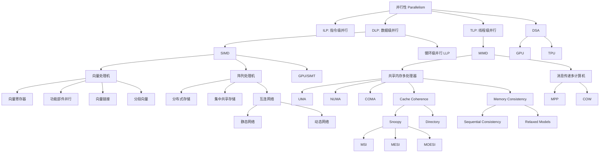

# Chapter 5: DLP and TLP 零基础完整讲解

来源文件：

- `chapter 5-1 (1).pdf`，160 页：主要讲数据级并行 DLP、SIMD、向量处理机、阵列处理机、互连网络、GPU、循环级并行。
- `chapter 5-2 (1).pdf`，84 页：主要讲线程级并行 TLP、MIMD、多处理器/多计算机、UMA/NUMA/COMA、MPP/COW、并行处理挑战、Cache 一致性、内存一致性、DSA/TPU。

这份讲义不是简单翻译 PPT，而是按照初学者学习顺序，把每页里的概念、公式、例题、细节和图中隐含含义重新组织。你可以把本章理解为一句话：

> 当单个 CPU 核心靠流水线、乱序执行、分支预测等方式继续提速越来越困难时，计算机体系结构开始系统性地利用“并行”：同一条指令同时处理很多数据叫 DLP/SIMD；多个线程或多个处理器同时跑不同指令流叫 TLP/MIMD；多核共享数据以后，还必须解决通信、一致性和同步问题。

---

## 0. 本章在整个课程知识地图中的位置

课件前几页先回顾了课程知识地图：

- 系统软件层：编译器、解释器、操作系统 OS、系统调用、中断与时钟、进程管理、CPU 调度、进程通信、同步、互斥、死锁、内存管理、存储管理、设备管理、文件系统、磁盘管理。
- 体系结构层：RISC-V 指令系统 ISA、程序执行基本原理、单周期 CPU、冯诺依曼结构、流水线实现、性能分析、流水线冲突与处理、软硬件协同、定量分析方法、ILP、DLP、TLP、Cache 设计与性能分析、虚拟存储器设计。
- 系统硬件层：Memory、Disk、I/O Device、BUS、Cache、MMU/TLB、CSR、BPU、Forwarding Unit、寄存器组、控制器、运算器、冒险检测、中断控制、ROB、RS、RAT 等。
- 门级电路层：数值表示、门电路、组合逻辑电路、时序逻辑电路、基本运算电路、硬件模块设计。

这章的核心在体系结构层中的 DLP 和 TLP：

- ILP，Instruction-Level Parallelism，指令级并行：在一个线程内部，让多条指令重叠执行，比如流水线、乱序执行、超标量。
- DLP，Data-Level Parallelism，数据级并行：对很多个数据元素做同一种操作，比如数组、向量、矩阵、图像像素、音频采样、深度学习张量。
- TLP，Thread-Level Parallelism，线程级并行：多个线程或任务并行执行，每个线程可以有自己的控制流。

从直觉上讲：

- ILP 像一个厨师把切菜、烧水、炒菜安排得更紧凑。
- DLP 像一排厨师同时切 100 根胡萝卜，而且大家做同一个动作。
- TLP 像多个厨师同时做不同菜，有的切菜，有的炒菜，有的摆盘。

---

## 1. Flynn 分类：SISD、SIMD、MISD、MIMD

PPT 在 DLP 和 TLP 前插入 Flynn，是因为 Flynn 分类用“指令流”和“数据流”两个维度划分并行体系结构。

### 1.1 指令流和数据流

- 指令流：处理器正在执行的指令序列。比如 `load`、`add`、`store`。
- 数据流：指令操作的数据。比如数组 `A[0]`、`A[1]`、`A[2]`。

两个问题决定分类：

- 是一条指令流，还是多条指令流？
- 是一个数据流，还是多个数据流？

### 1.2 四类体系结构

| 分类 | 英文 | 含义 | 典型例子 |
|---|---|---|---|
| SISD | Single Instruction Single Data | 单指令流、单数据流 | 传统单核标量处理器 |
| SIMD | Single Instruction Multiple Data | 单指令流、多数据流 | 向量处理器、阵列处理器、GPU 的 SIMD/SIMT 部分 |
| MISD | Multiple Instruction Single Data | 多指令流、单数据流 | 理论分类，实际少见 |
| MIMD | Multiple Instruction Multiple Data | 多指令流、多数据流 | 多核 CPU、多处理器、集群 |

本章主线：

- `chapter 5-1` 主要讲 SIMD，也就是 DLP。
- `chapter 5-2` 主要讲 MIMD，也就是 TLP。

---

## 2. DLP 与 SIMD 的基本思想

DLP 适合这种问题：

```c
for (int i = 0; i < N; i++) {
    D[i] = A[i] * (B[i] + C[i]);
}
```

每个 `i` 做的事情完全一样，只是数据不同：

- `D[0] = A[0] * (B[0] + C[0])`
- `D[1] = A[1] * (B[1] + C[1])`
- ...
- `D[N-1] = A[N-1] * (B[N-1] + C[N-1])`

这就是“数据级并行”：同一种操作重复作用在很多数据元素上。

SIMD 的硬件思想是：

- 只取一条指令。
- 这条指令同时作用于多个数据元素。
- 指令控制开销被摊薄。
- 运算部件可以并行工作。

---

## 3. SIMD 之一：向量处理机 Vector Processor

### 3.1 标量处理器和向量处理器

PPT 定义：

- 向量处理器：一种流水线处理器，设置了向量数据表示和相应的向量指令。
- 标量处理器：没有向量数据表示，也没有相应向量指令的流水线处理器。

初学者要抓住“向量”这个词：

- 标量 scalar：一个数，比如 `3.14`。
- 向量 vector：一串数，比如 `[1.0, 2.0, 3.0, 4.0]`。

标量指令一次处理一个元素：

```text
add f1, f2, f3     # f1 = f2 + f3，只加一个数
```

向量指令一次处理一串元素：

```text
V2 = V0 + V1       # V2[i] = V0[i] + V1[i]，很多元素一起加
```

### 3.2 向量流水线的特殊性

PPT 强调：

- 向量中各元素在运算时很少相关。
- 这使得流水线适合连续处理元素。
- 但如果向量处理方法不当，也会导致相关问题和频繁功能切换。
- 向量流水线要解决的问题是：如何处理向量和数组，才能最大化流水线效果。

为什么“元素很少相关”重要？

如果你计算：

```c
D[i] = A[i] * (B[i] + C[i]);
```

通常 `D[0]` 不依赖 `D[1]`，`D[1]` 不依赖 `D[2]`。这样硬件可以像工厂流水线一样，一个元素接一个元素进入加法器、乘法器。

但如果写成：

```c
A[i+1] = A[i] + C[i];
```

后一个迭代依赖前一个迭代，这就会限制并行。

---

## 4. 向量计算的三种处理方式

PPT 用例子：

```text
D = A * (B + C)
A, B, C, D 都是长度为 N 的向量
```

也就是：

```text
d_i = a_i * (b_i + c_i)
```

### 4.1 横向处理 Horizontal Processing

横向处理：按行从左到右处理。也就是一个元素一个元素完整算完。

处理顺序：

```text
d1 = a1 * (b1 + c1)
d2 = a2 * (b2 + c2)
...
dN = aN * (bN + cN)
```

对应循环：

```text
k_i = b_i + c_i
d_i = a_i * k_i
```

PPT 给出：

- 数据相关：N 次。
- 功能切换：2N 次。

为什么？

对每个元素：

1. 先加法：`b_i + c_i`。
2. 后乘法：`a_i * k_i`。

加法结果 `k_i` 被乘法使用，所以有 RAW 相关。

RAW 是 Read After Write，写后读相关：

- 前一条指令写出结果。
- 后一条指令要读这个结果。
- 后一条必须等前一条结果准备好。

横向处理的问题：

- 每个分量内部都会发生 RAW 相关。
- 流水线效率低。
- 如果使用静态多功能流水线，加法和乘法频繁切换，吞吐率甚至可能低于顺序串行执行。
- 因此横向处理不适合向量处理器。

直觉：你让一个工厂流水线刚做完加法工序，就改成乘法工序，再改回加法工序，如此反复，机器切换成本很高。

### 4.2 纵向处理 Vertical Processing

纵向处理：按列从上到下处理，先对整个向量做一种操作，再对整个向量做下一种操作。

处理顺序：

```text
K = B + C
D = A * K
```

PPT 给出：

- 数据相关：1 次。
- 功能切换：2 次。

为什么更好？

先让加法流水线连续处理所有元素：

```text
k1 = b1 + c1
k2 = b2 + c2
...
kN = bN + cN
```

再让乘法流水线连续处理所有元素：

```text
d1 = a1 * k1
d2 = a2 * k2
...
dN = aN * kN
```

加法器不需要来回切换，乘法器也不需要来回切换，所以适合流水线。

纵向处理对硬件结构的要求：

- PPT 说需要 memory-memory structure。
- 向量指令的源向量和目的向量都存放在内存里。
- 中间结果也要写回内存。
- 例子：STAR-100、CYBER-205。

问题：

- 中间向量 `K` 要写回内存，然后再从内存读出来。
- 内存访问压力很大。
- 如果内存带宽不够，就会拖慢。

### 4.3 纵横处理/分组处理 Vertical and Horizontal / Group Processing

分组处理：把长向量分成若干组，每组内部用纵向方式处理，组与组之间依次处理。

PPT 给出：

```text
N = S * n + r
```

含义：

- `N`：向量总长度。
- `S`：完整组数。
- `n`：每组长度。
- `r`：余数。
- 如果剩余 `r` 个元素也作为一组，总共有 `S + 1` 组。

处理过程：

```text
第一组:   d_1~n = a_1~n * (b_1~n + c_1~n)
第二组:   d_(n+1)~2n = a_(n+1)~2n * (b_(n+1)~2n + c_(n+1)~2n)
...
最后组:   d_(S*n+1)~N = a_(S*n+1)~N * (b_(S*n+1)~N + c_(S*n+1)~N)
```

PPT 给出：

- 数据相关：`S + 1` 次。
- 功能切换：`2(S + 1)` 次。

为什么要分组？

因为向量寄存器长度有限。比如寄存器只能装 64 个元素，但向量有 1000 个元素，就必须分段处理。

分组处理对硬件结构的要求：

- PPT 说需要 register-register structure。
- 设置快速访问的向量寄存器，用来存源向量、目的向量、中间结果。
- 运算部件的输入输出连接向量寄存器，形成寄存器-寄存器型运算流水线。

优点：

- 中间结果可以先放在向量寄存器里。
- 减少内存读写。
- 比 memory-memory 更适合现代向量机。

---

## 5. CRAY-1 向量处理机

PPT 用 CRAY-1 作为寄存器-寄存器型向量流水线机器的例子。

### 5.1 CRAY-1 基本信息

PPT 信息：

- 美国 CRAY 公司。
- 约 100 million FLOPS，也就是每秒约 1 亿次浮点运算。
- 时钟周期：12.5 ns。
- 有 12 条可并行工作的单功能流水线。
- 可以流水线执行地址运算、向量运算、标量运算等。

CRAY-1 结构中出现：

- Memory，8 MB，64 units。
- Vector Registers，8 个向量寄存器。
- 每个向量寄存器可以理解为存放最多 64 个 64 位元素，图中写作 `8 * 64 * 64`。
- Buffer Register，`64 * 64`。
- Instruction Buffer Registers，`4 * 64 * 16`。
- Vector Length，用来控制实际参与运算的向量长度。
- Vector Shield，常见理解是向量掩码/屏蔽相关控制。
- Scalar Register，标量寄存器。
- Backing Register，后备寄存器。
- 12 Pipeline Components，12 个流水线部件。

### 5.2 CRAY-1 的并行工作条件

PPT 强调：

- 每个向量寄存器 `Vi` 都有独立总线连接到 6 个向量功能单元。
- 每个向量功能单元也有一条总线把运算结果返回到向量寄存器总线。
- 只要没有 `Vi` 冲突和功能冲突，各个 `Vi` 和各个功能单元就可以并行工作。

这句话非常重要。向量机快，不只是因为一条指令处理多个元素，还因为：

- 多个功能单元可以同时工作。
- 不同向量寄存器可以同时提供数据。
- 流水线能连续吞吐元素。

### 5.3 Vi 冲突

Vi conflict 指并行工作的向量指令使用了相同的源向量或结果向量寄存器。

PPT 例子 1：写读相关

```text
V0 <- V1 + V2
V3 <- V0 * V4
```

第二条要读 `V0`，第一条要写 `V0`，所以有 RAW 相关。

PPT 例子 2：读数据相关/资源相关示例

```text
V0 <- V1 + V2
V3 <- V1 * V4
```

两条都读 `V1`。如果寄存器端口/总线资源不足，就会冲突。

初学者要区分两类问题：

- 数据依赖：结果没出来，后面不能用。
- 结构资源冲突：数据可能没有逻辑依赖，但硬件端口或功能部件不够。

### 5.4 功能冲突 Functional Conflict

Functional conflict 指并行工作的多条向量指令要使用同一个功能单元。

PPT 例子：

```text
V3 <- V1 * V2
V5 <- V4 * V6
```

两条都需要浮点乘法部件。如果只有一个乘法流水线，第二条必须等第一条的最后一个分量执行完，释放浮点乘法功能后才能开始。

### 5.5 CRAY-1 指令类型

PPT 给了四类形式：

```text
Vk <- Vi op Vj       # 向量-向量运算
Vk <- Si op Vj       # 标量-向量运算
Vk <- Memory         # 从内存加载向量
Memory <- Vi         # 把向量存回内存
```

含义：

- 向量-向量：两个向量逐元素运算。
- 标量-向量：一个标量和向量每个元素运算。
- Load：把内存中的一段连续或按模式的数据装入向量寄存器。
- Store：把向量寄存器写回内存。

---

## 6. 提高向量处理器性能的四种方法

PPT 列出四种：

1. 设置多个功能部件并并行工作。
2. 使用向量链接技术 vector chaining。
3. 采用分段向量 segmented vector。
4. 使用多处理器系统。

### 6.1 多功能部件并行

CRAY-1 有 4 组共 12 个单功能流水线部件：

- 向量部件：向量加法、移位、逻辑运算。
- 浮点部件：浮点加法、乘法、倒数计算。
- 标量部件：标量加法、移位、逻辑运算、数 `1`/计数。
- 地址计算部件：整数加法、乘法。

多个部件并行的效果：

- 加法和乘法可以同时做。
- 地址计算和浮点计算可以同时做。
- 向量 load/store 和算术流水线可以重叠。

### 6.2 向量链接技术 Vector Chaining

PPT 定义：

- 对两条存在“先写后读”关系的向量指令，如果没有功能部件冲突和源向量冲突，可以把功能部件链接起来流水处理。
- 目的：加速一串向量指令。
- 本质：把流水线思想引入向量执行过程。

先看问题：

```text
V2 <- V0 + V1
V4 <- V2 * V3
```

第二条乘法需要第一条加法产生的 `V2`。如果不链接，就要等整个 `V2` 向量全部算完后，乘法才开始。

向量链接的思想：

- `V2[0]` 一算出来，就立刻送给乘法部件算 `V4[0]`。
- 不必等 `V2[1]...V2[N-1]` 全部完成。

这就像流水线：

```text
第一个元素：加法完成 -> 进入乘法
第二个元素：加法完成 -> 进入乘法
...
```

### 6.3 CRAY-1 链接例题：D = A * (B + C)

PPT 条件：

- 向量长度 `N <= 64`。
- 向量元素为浮点数。
- `B` 和 `C` 已经存放在 `V0` 和 `V1`。
- 目标：计算 `D = A * (B + C)`。

用三条向量指令：

```text
V3 <- memory      # 取向量 A
V2 <- V0 + V1     # B + C，结果到 V2
V4 <- V2 * V3     # A * (B + C)，结果到 V4
```

PPT 假设：

- 发送一个向量元素到向量功能单元需要 1 拍。
- 把结果存入向量寄存器需要 1 拍。
- 从内存送数据到取数功能单元需要 1 拍。
- 浮点加法功能时间为 6 拍。
- 浮点乘法功能时间为 7 拍。

PPT 问：三种方法各需要多少拍？

#### 方法 1：三条指令串行执行

每条向量指令的时间大致是：

```text
启动/传输延迟 + 功能部件时间 + 写回延迟 + 后续 N-1 个元素
```

PPT 给出：

```text
[(1+6+1)+N-1] + [(1+6+1)+N-1] + [(1+7+1)+N-1] = 3N + 22
```

解释：

- 第一项：取 A，用图中等效的 6 拍功能时间。
- 第二项：浮点加法，6 拍。
- 第三项：浮点乘法，7 拍。
- 每条流水线装满后，每拍出一个元素，所以每条还有 `N-1`。

#### 方法 2：前两条并行，第三条串行

`V3 <- A` 和 `V2 <- V0 + V1` 没有冲突，可以并行。

第三条 `V4 <- V2 * V3` 要等 `V2` 和 `V3` 整个向量都准备好。

PPT 给出：

```text
max{[(1+6+1)+N-1], [(1+6+1)+N-1]} + [(1+7+1)+N-1] = 2N + 15
```

#### 方法 3：使用向量链接

前两条并行，同时乘法可以在第一个所需元素准备好后启动。

PPT 给出：

```text
max{(1+6+1), (1+6+1)} + (1+7+1) + N - 1 = N + 16
```

重点：

- 串行：`3N + 22`
- 前两条并行：`2N + 15`
- 链接：`N + 16`

当 `N` 很大时，向量链接把多个向量操作变成近似“一条长流水线”，速度提升明显。

### 6.4 分段向量 Segmented Vector

PPT 问：如果向量长度大于向量寄存器长度怎么办？

答案：

- 把长向量分成固定长度的段。
- 每次循环只处理一个向量段。
- 由系统硬件和软件控制。
- 对程序员透明。

例如向量寄存器最多 64 个元素，数组有 1000 个元素：

```text
第 1 段: 0..63
第 2 段: 64..127
...
最后一段: 余下元素
```

现代向量 ISA 里也常见类似思想，比如设置当前向量长度，然后循环处理剩余元素。

### 6.5 多处理器向量系统

PPT 例子：

- CRAY-2：
  - 包含 4 个向量处理器。
  - 浮点计算速度最高可达 1800 MFLOPS。
- CRAY Y-MP、C90：
  - 最多可包含 16 个向量处理器。

这说明向量并行还可以叠加处理器级并行。

---

## 7. RV64V：RISC-V 向量扩展

PPT 说 RV64V loosely based on Cray-1。

主要特点：

- 32 个 62-bit 向量寄存器。这里 PPT 写 62-bit，通常学习时注意它表达的是向量寄存器文件配置，实际 RISC-V V 扩展以 VLEN/SEW/LMUL 等参数描述。
- 寄存器文件有 16 个读端口和 8 个写端口。
- 向量功能单元 fully pipelined。
- 能检测数据冒险和控制冒险。
- 向量 load-store 单元 fully pipelined。
- 初始延迟之后，每个时钟周期一个 word。
- 标量寄存器：
  - 31 个通用寄存器。
  - 32 个浮点寄存器。

### 7.1 DAXPY 例子

DAXPY 是 Double Precision a*X plus Y：

```text
Y[i] = a * X[i] + Y[i]
```

#### 标量 RISC-V 版本

PPT 中代码：

```asm
fld     f0,a            # Load scalar a
addi    x28,x5,#256     # Last address to load
Loop:
fld     f1,0(x5)        # Load X[i]
fmul.d  f1,f1,f0        # a x X[i]
fld     f2,0(x6)        # Load Y[i]
fadd.d  f2,f2,f1        # a x X[i] + Y[i]
fsd     f2,0(x6)        # Store into Y[i]
addi    x5,x5,#8        # Increment index to X
addi    x6,x6,#8        # Increment index to Y
bne     x28,x5,Loop     # Check if done
```

逐句解释：

- `fld f0,a`：把标量 `a` 读到浮点寄存器 `f0`。
- `x5` 指向 `X` 当前元素。
- `x6` 指向 `Y` 当前元素。
- 每次处理一个 double，double 是 8 字节，所以指针加 `#8`。
- `x28` 是结束地址。
- 每个元素都要执行 load、multiply、load、add、store、指针更新、分支判断。

缺点：

- 循环控制开销大。
- 每次只处理一个元素。
- 分支每个元素都执行一次。

#### RV64V 向量版本

PPT 中代码：

```asm
vsetdcfg 4*FP64         # Enable 4 DP FP vregs
fld      f0,a           # Load scalar a
vld      v0,x5          # Load vector X
vmul     v1,v0,f0       # Vector-scalar mult
vld      v2,x6          # Load vector Y
vadd     v3,v1,v2       # Vector-vector add
vst      v3,x6          # Store the sum
vdisable                # Disable vector regs
```

解释：

- 一次向量 load 装入多个 `X[i]`。
- `vmul v1,v0,f0` 表示每个 `X[i]` 都乘同一个标量 `a`。
- `vadd v3,v1,v2` 表示逐元素相加。
- `vst` 一次写回整个向量结果。
- 循环控制从“每个元素一次”变成“每个向量段一次”。

### 7.2 多 Lane：每周期超过一个元素

PPT 说：

- 向量寄存器 A 的第 `n` 个元素硬连到向量寄存器 B 的第 `n` 个元素。
- 这允许多个硬件 lane。
- RV64V 的所有向量算术指令只允许一个向量寄存器的第 `N` 个元素和其他向量寄存器的第 `N` 个元素参与运算。
- 这极大简化了高并行向量单元设计。

什么是 lane？

可以理解为“并排的运算通道”。如果只有 1 条 lane，每拍处理 1 个元素；如果有 4 条 lane，每拍可以处理 4 个元素。

为什么只让第 `N` 个元素和第 `N` 个元素算能简化？

因为硬件不需要复杂交叉连接：

```text
v0[0] 只连 v2[0]
v0[1] 只连 v2[1]
...
```

如果允许 `v0[0]` 随便和 `v2[7]`、`v2[13]` 运算，硬件互连会复杂很多。

---

## 8. SIMD 之二：阵列处理机 Array Processor

### 8.1 阵列处理机定义

PPT 定义：

- 重复设置 `N` 个处理单元 `PE0` 到 `PE(N-1)`。
- 以某种方式互连形成阵列。
- 在单个控制单元控制下，对各处理单元分配的数据并行完成同一条指令指定的操作。
- 阵列处理机有时也叫并行处理机。

PE 是 Processing Element，处理单元。

向量处理机和阵列处理机的区别可以这样理解：

- 向量处理机：一个处理器内部有向量寄存器和向量流水线。
- 阵列处理机：很多个 PE 排成阵列，由一个控制器统一发指令。

二者都属于 SIMD，因为都是“一条指令，多份数据”。

### 8.2 ILLIAC IV

PPT 以 ILLIAC IV 为阵列处理机代表。它是早期著名 SIMD 阵列机。课件后面提到它用 `PM2±0` 和 `PM2±n/2` 形成互连网络，实现 PE 上下左右互连。

### 8.3 阵列处理机两种基本结构

按系统内存组成分：

1. 分布式存储 Distributed memory。
2. 集中式共享存储 Centralized shared memory。

#### 分布式存储结构

PPT 图示：

```text
N Memories
N Processors
```

以及更完整结构：

- CU：Control Unit，控制单元。
- CUM：控制单元存储器。
- PEM0..PEM(N-1)：每个 PE 对应的本地存储模块。
- PE0..PE(N-1)：处理单元。
- ICN：Interconnection Network，互连网络。
- Data Bus、Control Bus。
- SC、I/O、D、Back-end Computer。

PPT 明确说：

- 分布式存储结构是 SIMD 阵列处理机的主流。

原因：

- 每个 PE 有自己的本地数据。
- 并行访问本地存储，避免所有 PE 抢同一个共享内存。

#### 集中式共享存储结构

PPT 图示：

```text
N Processors
K Memories
```

结构中：

- 多个 PE 通过 ICN 访问多个存储模块 `MM0..MM(K-1)`。
- 有 I/O-CH、I/O、SM。

与分布式存储的区别：

1. 存储器分布不同。
2. 互连网络的作用不同。

集中式共享存储的问题：

- 多个 PE 可能同时访问同一存储模块。
- 需要互连网络协调访问。
- 容易出现存储冲突。

---

## 9. 为什么需要互连网络

PPT 问：

如果 `n` 个处理单元两两之间都需要直接连接，需要多少对连接？

公式：

```text
P = C(n, 2) = n(n - 1) / 2
```

例如：

- 4 个节点需要 `4*3/2 = 6` 条连接。
- 100 个节点需要 `100*99/2 = 4950` 条连接。

结论：

- 直接路径很难实现。
- 实际设计要通过间接路径尽量实现通信。

这就是互连网络存在的原因：用有限、规则、可扩展的连接方式，让任意两个处理单元能在一步或少数几步内交换信息。

---

## 10. 并行计算机设计中的通信体系结构

PPT 说：

- 并行计算机的通信体系结构是系统核心。
- 包括底层互连网络。
- 也包括上层语言、软件工具包、编译器、操作系统提供的通信支持。

并行计算机系统设计问题包括：

- 互连网络设计。
- 性能问题。
- 软件问题。

互连网络定义：

- 由交换单元按照一定拓扑和控制方式组成的网络。
- 用于实现计算机系统内部多个处理器或多个功能部件之间互连。
- 与计算机网络在原理、概念、术语上有很多相似之处。
- 某些并行系统中的互连网络就是高速 Ethernet 和 ATM 网络。

---

## 11. 互连网络的五个组成部分

PPT 列出：

```text
CPU, memory, interface, link and switch node
```

分别解释：

- CPU：发起计算和通信的处理器。
- Memory：数据存放位置。
- Interface：接口，从 CPU 和内存获取信息并发送到另一个 CPU 和内存，典型设备是网络接口卡。
- Link：物理传输通道，传输数据位。
  - 可以是电缆、双绞线、光纤。
  - 可以串行或并行。
  - 每条 link 有最大带宽。
  - 可以是 simplex 单工、half-duplex 半双工、full-duplex 全双工。
  - 时钟机制可以同步或异步。
- Switch node：交换节点。
  - 是互连网络的信息交换和控制站。
  - 有多个输入端口和多个输出端口。
  - 能进行数据缓冲和路径选择。

---

## 12. 互连网络的关键设计点

PPT 列出四类：

### 12.1 拓扑 Topology

- 静态拓扑。
- 动态拓扑。

拓扑就是节点怎么连。

### 12.2 定时模式 Timing Mode

- 同步系统：使用统一时钟。例如 SIMD 阵列处理机。
- 异步系统：没有统一时钟，各处理器独立工作。

### 12.3 交换方式 Exchange Method

- Circuit switching，电路交换。
- Packet switching，分组交换。

电路交换像打电话：先建立一条路径，再传输。

分组交换像互联网：数据拆成包，每个包通过网络转发。

### 12.4 控制策略 Control Strategy

- 集中控制：有全局控制器。
- 分布控制：没有全局控制器。

---

## 13. 静态网络和动态网络

### 13.1 静态网络

PPT 定义：

- 节点之间连接路径固定。
- 程序执行期间连接保持不变。

例如：

- 线性阵列。
- 环。
- 网格。
- 超立方体。

### 13.2 动态网络

PPT 定义：

- 由开关组成。
- 能根据应用需求动态改变连接状态。
- 例如总线、交叉开关、多级交换网络。

动态网络特点：

- 连接不是固定的。
- 开关元素是 active 的。
- 可以通过设置开关状态重构链路。
- 只有网络边界上的开关元素能连接处理器。

---

## 14. 单级互连网络和多级互连网络

PPT 目标：

- 用有限数量的连接方式，使任意两个 PE 能一步或少数几步传输信息，完成算法。

### 14.1 单级互连网络

- 只有一个层级。
- 通过有限连接方式实现任意两个处理单元之间的信息传输。

PPT 进一步说：

对所有 `N` 个输入端 `0, 1, ..., j, ..., N-1`，输入端 `j` 与输出端 `f(j)` 之间有函数对应关系。

输入 `j` 和输出 `f(j)` 一般用二进制编码，从二进制编码中找到对应规律，这个规律就是互连函数。

### 14.2 多级互连网络

- 由多个单级网络串联。
- 用来实现任意两个处理单元之间连接。

---

## 15. 单级互连网络：Cube 网络

PPT 定义：

- `N` 个输入和输出用 `n` 位二进制编码。
- `n = log2 N`。
- 编码形式：`P(n-1)...Pi...P1P0`。
- 有 `n` 个不同互连函数。

核心思想：

`Cube_i` 会翻转二进制编号的第 `i` 位。

用更清楚的公式写：

```text
Cube_i(P(n-1)...Pi...P1P0) = P(n-1)...not(Pi)...P1P0
```

### 15.1 N = 8 的 Cube 网络

`N = 8`，所以 `n = log2 8 = 3`，节点编号：

```text
0 = 000
1 = 001
2 = 010
3 = 011
4 = 100
5 = 101
6 = 110
7 = 111
```

有三个函数：

- `Cube0`：翻转最低位 `P0`。
- `Cube1`：翻转中间位 `P1`。
- `Cube2`：翻转最高位 `P2`。

例子：

```text
Cube0(000) = 001，即 0 -> 1
Cube1(000) = 010，即 0 -> 2
Cube2(000) = 100，即 0 -> 4
```

3D cube 里任意两个节点最多传输 3 次即可到达，因为两个 3 位二进制数最多 3 位不同，每次翻转一位。

### 15.2 Hypercube 超立方体

PPT 说：

- 当维度 `n > 3` 时，叫 hyper cube network。
- 单级 n 维 cube 网络最大距离为 `n`。
- 最多经过 `n` 次传输，就能实现任意两个 PE 之间数据传输。

超立方体性质：

- 节点数 `N = 2^n`。
- 每个节点度数是 `n`。
- 直径是 `n`。
- 对称性好。

---

## 16. 单级互连网络：PM2I

PM2I 是 Plus Minus `2^i`。

PPT 给出互连函数：

```text
PM2+_i(j) = j + 2^i mod N
PM2-_i(j) = j - 2^i mod N
```

条件：

```text
0 <= j <= N - 1
0 <= i <= log2 N - 1
```

含义：

- 从节点 `j` 可以连到 `j + 2^i`。
- 也可以连到 `j - 2^i`。
- 下标按 `mod N` 环绕。

### 16.1 N = 8 例子

`N = 8`，`i` 可以是 0、1、2。

#### i = 0

```text
2^0 = 1
PM2+0(j) = j + 1 mod 8
PM2-0(j) = j - 1 mod 8
```

节点 0 可以到：

- `0 + 1 = 1`
- `0 - 1 mod 8 = 7`

#### i = 1

```text
2^1 = 2
PM2+1(j) = j + 2 mod 8
PM2-1(j) = j - 2 mod 8
```

节点 0 可以到：

- 2
- 6

#### i = 2

```text
2^2 = 4
PM2±2(j) = j ± 4 mod 8
```

节点 0 可以到：

- 4
- 因为 `0 - 4 mod 8 = 4`，正负都到 4。

PPT 总结：

- 节点 0 一步可达节点 1、2、4、6、7。
- 节点 0 两步可达节点 3、5。

### 16.2 ILLIAC IV 的互连

PPT 说：

- ILLIAC IV 使用 `PM2±0` 和 `PM2±n/2` 形成互连网络。
- 实现 PE 之间上下左右互连。

图中 16 个 PE 排成 4x4：

```text
0   1   2   3
4   5   6   7
8   9   10  11
12  13  14  15
```

直觉：

- `PM2±0` 对应左右相邻。
- `PM2±n/2` 对应上下相邻，具体取决于编号方式。

---

## 17. 单级互连网络：Shuffle Exchange

Shuffle exchange 网络由两部分组成：

- Shuffle，洗牌。
- Exchange，交换。

PPT 给出 N 维 shuffle 函数：

```text
shuffle(P(n-1) P(n-2) ... P1 P0) = P(n-2) ... P1 P0 P(n-1)
```

也就是把最高位循环移到最低位，其余位左移。

其中：

```text
n = log2 N
P(n-1)...P0 是输入编号的二进制编码
```

### 17.1 N = 8 的 shuffle

`N = 8`，编号是 3 位：`P2 P1 P0`。

PPT 给出：

```text
shuffle(P2 P1 P0) = P1 P0 P2
```

第一次 shuffle：

| 初始编号 | 二进制 | shuffle 后 | 连接 PE |
|---|---|---|---|
| 0 | 000 | 000 | 0 |
| 1 | 001 | 010 | 2 |
| 2 | 010 | 100 | 4 |
| 3 | 011 | 110 | 6 |
| 4 | 100 | 001 | 1 |
| 5 | 101 | 011 | 3 |
| 6 | 110 | 101 | 5 |
| 7 | 111 | 111 | 7 |

第二次 shuffle：

| 初始编号 | 第 2 次连接 PE |
|---|---|
| 0 | 0 |
| 1 | 4 |
| 2 | 1 |
| 3 | 5 |
| 4 | 2 |
| 5 | 6 |
| 6 | 3 |
| 7 | 7 |

第三次 shuffle 回到原排列：

| 初始编号 | 第 3 次连接 PE |
|---|---|
| 0 | 0 |
| 1 | 1 |
| 2 | 2 |
| 3 | 3 |
| 4 | 4 |
| 5 | 5 |
| 6 | 6 |
| 7 | 7 |

PPT 说：

- Shuffle 函数的重要特征：经过若干次 shuffling，所有 PE 会恢复到初始排列。

从公式看，`N` 个 PE 需要 `n = log2 N` 位二进制编号，shuffle 是对这 `n` 位做循环左移，所以循环移位 `n` 次恢复原样。以 PPT 的 `N = 8` 为例，`n = 3`，第 3 次 shuffle 后回到初始排列。

### 17.2 Shuffle exchange 最大距离

PPT 说：

- 从编号全 0 的节点到编号全 1 的节点，数据最多需要：

```text
n exchanges and n - 1 shuffles
```

- 最大距离：

```text
2n - 1
```

例如 `N = 8`，`n = 3`，最大距离是 `2*3 - 1 = 5`。

---

## 18. 单级互连网络的特点

PPT 列出：

- 结构简单，成本低。
- 连接灵活，能满足算法和应用需要。
- 传输步数少，提高阵列运算速度。
- 规则性和模块性较好，有助于增强系统可扩展性。
- 有利于大规模集成。

---

## 19. 静态网络拓扑汇总

课件列了多种静态网络：线性阵列、环、带弦环、树、星、网格、二维环面、超立方体、带环立方体。

先解释几个指标：

- Scale，规模：节点数。
- Degree，度：一个节点直接连接多少条边，常看最大度。
- Diameter，直径：任意两个节点之间最短路径的最大值。
- Width，等分宽度/二分宽度：把网络切成两半时至少要切断多少连接，反映网络吞吐能力。
- Symmetry，对称性：节点地位是否相同。
- Link，链路数。

### 19.1 Linear array 线性阵列

PPT：

- `N` 个节点。
- `N - 1` 条链路。
- 直径 `N - 1`。
- 度为 2。
- 非对称。
- 等分宽度为 1。
- 当 `N` 很大时通信效率很低。

直觉：

```text
0 - 1 - 2 - 3 - ... - N-1
```

从 0 到 N-1 要走 N-1 步。

### 19.2 Circular array 环形阵列

PPT：

- 双向环：
  - 链路数 `N`。
  - 直径 `N/2`。
  - 度 2。
  - 对称。
  - 等分宽度 2。
- 单向环：
  - 链路数 `N`。
  - 直径 `N - 1`。
  - 度 2。
  - 对称。
  - 等分宽度 2。

双向环比线性阵列好，因为可以从两边绕。

### 19.3 Loop with chord 带弦环

PPT 以 12 节点为例：

- 节点度 3：
  - 链路数 18。
  - 直径 4。
  - 度 3。
  - 非对称。
  - 等分宽度 2。
- 节点度 4：
  - 链路数 24。
  - 直径 3。
  - 度 4。
  - 对称。
  - 等分宽度 8。

弦就是在环上额外加远距离连接，缩短路径。

### 19.4 Tree array 树阵列

PPT：

- `K` 层完全二叉树有：

```text
N = 2^K - 1
```

- 最大节点度为 3。
- 直径：

```text
2(K - 1)
```

也就是从最左叶子到最右叶子。

- 非对称。
- 等分宽度 1。

树的根节点容易成为瓶颈。

扩展：

- Tree with loop，带环树。
- Binary fat tree，二叉胖树。

胖树通过上层更多带宽缓解根部瓶颈。

### 19.5 Star array 星形阵列

PPT：

- 星形网络实际是两级树。
- `N` 个节点有 `N - 1` 条链路。
- 直径 2。
- 最大节点度 `N - 1`。
- 非对称。
- 等分宽度 1。

优点：

- 任意两个叶节点最多两跳。

缺点：

- 中心节点度太高，中心故障影响全网。

### 19.6 Grid 网格

PPT：

- `r * r` 网络。
- `N` 个节点。
- 链路数：

```text
2N - 2r
```

- 直径：

```text
2(r - 1)
```

- 节点度 4。
- 非对称。
- 等分宽度 `r`。
- `r = sqrt(N)`。

直觉：

从左上角到右下角，要横向走 `r-1` 步，纵向走 `r-1` 步，共 `2(r-1)`。

### 19.7 2D torus 二维环面

PPT：

- `r * r` 网络。
- `N` 个节点。
- 链路数 `2N`。
- 直径：

```text
2 * floor(r/2)
```

PPT 写成 `2 r/2` 的形式，意思是每个维度最远走半圈。

- 节点度 4。
- PPT 该页写 asymmetrical，但汇总表写 Yes，对二维环面通常应理解为对称。
- `r = sqrt(N)`。

二维环面比普通网格多了边界回绕连接。

### 19.8 Hypercube 超立方体

PPT：

- `n`-cube 由 `N = 2^n` 个节点组成。
- 分布在 `n` 个维度。
- 每个维度有两个节点。
- 直径 `n`。
- 度 `n`。
- 对称。

优点：

- 直径小。
- 对称性好。

缺点：

- 维度增加时节点度增加，硬件连接复杂。

### 19.9 Cube with loop 带环立方体

PPT：

- `n`-cube with loop 由 `N = 2^n` 个节点环组成。
- 每个节点环是一个有 `n` 个节点的环。
- 总节点数：

```text
n * 2^n
```

- 节点度 3。
- 对称。

### 19.10 PPT 汇总表

| 网络 | 规模 | 度 | 直径 | 宽度 | 对称 | 链路 |
|---|---:|---:|---:|---:|---|---:|
| Linear | N | 2 | N-1 | 1 | No | N-1 |
| Circular | N | 2 | N/2 | 1 或 2，PPT 前文说双向等分宽度 2 | Yes | N |
| Binary tree | N | 3 | 2(logN - 1) | 1 | No | N-1 |
| Star | N | N-1 | 2 | N/2 | No | N-1 |
| Grid | N | 4 | 2(sqrt(N)-1) | sqrt(N) | No | 2(N - sqrt(N)) |
| 2D torus | N | 4 | 2 floor(sqrt(N)/2) | 2sqrt(N) | Yes | 2N |
| Hypercube | N=2^n | n | n | N/2 | Yes | nN/2 |
| Cube with loop | N=k2^k | 3 | 2k-1 + floor(k/2) | N/(2k) | Yes | 3N/2 |

注意：PPT 表中 Hypercube 的 Degree 一栏显示为 N，但按标准定义应为 `n = log2 N`，前文页也写 degree is n。学习时以“超立方体每个节点有 n 条边”为准。

---

## 20. 动态互连网络

PPT 主要讲：

- Bus，总线。
- Crosspoint switches，交叉开关。
- Multi-stage interconnection network，多级互连网络。

### 20.1 Bus 总线

PPT：

- 总线实际是一组 wires and sockets，用来连接处理器、存储器、I/O 等外设。
- 某一时刻只能用于一对源和目的之间传输数据。
- 多对源/目的同时请求使用总线时，需要总线仲裁。
- CPU 数量大时，总线竞争严重。
- PPT 给出经验：`<= 32`。

总线和线性阵列区别：

- 线性阵列：不同源/目的节点可以并发使用系统不同部分。
- 总线：通过切换连接在很多节点之间实现时分特性，同一时间只有一对节点传输。

总线优点：

- 简单、便宜。

总线缺点：

- 带宽共享。
- 扩展性差。
- 节点多时争用严重。

### 20.2 Crosspoint switches 交叉开关

交叉开关可以理解为一个 `N x N` 的开关矩阵：

- 输入和输出之间可以建立很多并行连接。
- 带宽高。
- 成本高。

PPT 后面比较表说：

- 交叉开关复杂度约 `O(n^2)`。
- 链路复杂度 `O(n^2 w)`。
- 适合高性能但成本很高的场景。

### 20.3 多级互连网络的开关单元

PPT：

- 有 `m` 个输入和 `m` 个输出的开关单元记作 `m x m`。
- `m = 2^k`。
- 常见有 `2x2`、`4x4`、`8x8`。

PPT 表：

| Module Size | Legal Status | Exchange Connection |
|---|---:|---:|
| 2x2 | 2 | 2 |
| 4x4 | 256 | 24 |
| 8x8 | 16,777,216 | 40,320 |
| NxN | N^N | N! |

解释：

- Legal Status 指每个输入可以选择输出的状态数，数量增长很快。
- Exchange Connection 指全排列连接数，即 `N!`。

`2x2` 是最基本单元。

### 20.4 多级互连网络的实现方式

PPT：

为实现任意 PE 之间连接，可以用：

- 循环互连网络：单级网络循环使用多次。
- 多级互连网络：多个单级网络串联。
- 多级循环互连网络：在多级互连基础上循环使用多次。

不同多级网络的差别：

- 开关功能。
- 开关控制方式。
- 拓扑。

### 20.5 2x2 开关单元的四种状态

PPT：

- Straight，直连。
- Exchange，交换。
- Upper broadcast，上广播。
- Lower broadcast，下广播。

两功能开关：

- 只有 Straight 和 Exchange。

四功能开关：

- 包含四种基本功能。

多端开关还可加入：

- Broadcast，广播。
- Multicast，多播。

---

## 21. 多级 Cube 互连网络

PPT 特点：

- 开关单元：两功能开关。
- 控制方式：级控制、部分级控制、单元控制。
- 拓扑：cube 结构。

### 21.1 N 单元多级 Cube 拓扑画法

PPT 步骤：

1. 由 `n = log2 N` 求出多级 cube 网络级数 `n`。
2. 从输入到输出把级编号设为 `0, 1, ..., n-1`。
3. 每一级画 `N/2` 个两功能开关。
4. 令第 `i` 级所有开关的两个输入/输出端按 `Cube_i` 关系编号。
5. 把每一级相同编号的端相连。

对 `N = 8`：

- `n = 3`。
- 三个级：Cube0、Cube1、Cube2。
- 每级 `N/2 = 4` 个 2x2 开关。

### 21.2 多级 Cube 网络分类

PPT：

- Switched network。
- Mobile number network。
- Indirect binary n-cube network。

其中采用级控制方式的多级 cube 网络叫 switching network，只能实现交换函数。

### 21.3 Flip Network 与交换函数

PPT：

- Flip Network：采用 stage control mode 的多级 cube 网络。
- Exchange function：对一组元素做对称交换。

PPT 对 `N = 8` 给出 stage control signal：

```text
(K2 K1 K0)
Ki: 第 i 级
0 = connect
1 = exchange
```

控制信号从 `000` 到 `111`，可以实现不同粒度的对称交换组合。例如：

- `000`：全直连，输出等于输入。
- `001`：Cube0 交换。
- `010`：Cube1 交换。
- `100`：Cube2 交换。
- `111`：Cube0 + Cube1 + Cube2 组合交换。

### 21.4 16 处理器例题

PPT 题目：

16 个处理器，要实现：

- 4 组 4 元素交换。
- 2 组 8 元素交换。
- 1 组 16 元素交换。

输入序列：

```text
0123 4567 89AB CDEF
```

4 组 4 元素交换后：

```text
3210 7654 BA98 FEDC
```

2 组 8 元素交换后：

```text
4567 0123 CDEF 89AB
```

1 组 16 元素交换后：

```text
BA98 FEDC 3210 7654
```

互连关系：

```text
(0 B) (1 A) (2 9) (3 8)
(4 F) (5 E) (6 D) (7 C)
```

PPT 给出一般互连函数：

```text
f(P3 P2 P1 P0) = not(P3) P2 not(P1) not(P0)
```

也就是翻转 `P3`、`P1`、`P0`，保留 `P2`：

```text
0000(0) -> 1011(B)
0001(1) -> 1010(A)
0010(2) -> 1001(9)
0011(3) -> 1000(8)
```

PPT 图中各级状态：

- Cube0：Exchange。
- Cube1：Exchange。
- Cube2：Direct Connection。
- Cube3：Exchange。

这里的难点不是背图，而是掌握方法：

1. 把处理器编号写成二进制。
2. 看目标输出编号与输入编号哪些位不同。
3. 每一级 cube 能控制一位是否交换。
4. 通过设置直连/交换实现目标置换。

---

## 22. 多级 Shuffle Exchange 网络：Omega Network

PPT：

- Multi-level shuffle exchange network 也叫 Omega network。

特点：

- 开关函数有四种功能。
- 拓扑结构是 shuffle topology 后接四功能开关。
- 控制方式是 unit control，单元控制。

### 22.1 Omega 网络参数

PPT：

1. 级数：

```text
n = log2 N
```

2. 从输入到输出的级编号：

```text
n-1, ..., 1, 0
```

3. 每级单元数：

```text
N/2
```

4. 结构：

```text
Shuffle topology + four-function switch
```

四功能：

- Straight。
- Exchange。
- Upper broadcast。
- Lower broadcast。

### 22.2 Omega 与 n-cube 的区别

PPT 明确列出：

1. 数据流级别方向不同：
   - Omega：`n-1, n-2, ..., 1, 0`。
   - n-cube：`0, 1, ..., n-1`。
2. 开关单元不同：
   - Omega 使用四功能交换单元。
   - n-cube 使用两功能交换单元。
3. 广播能力不同：
   - Omega 可以实现一对多广播。
   - n-cube 不能实现。

PPT 还说：

- 如果 Omega 网络的开关单元限制为只使用 direct connect 和 exchange，就变成 n-cube 网络的逆网络。

### 22.3 Omega 网络的阻塞现象

PPT 图中问题：

- `5 -> 0` 和 `7 -> 1` 可以同时实现。
- 但 `0 -> 5` 和 `1 -> 7` 不能同时实现。

这说明 Omega 网络不是完全无阻塞网络。某些连接组合会抢同一内部链路或开关资源。

---

## 23. Benes 网络

PPT 提到：

- Example of multi-stage full array network。
- Benes network。
- 可以看作多级全阵列网络。
- 图中有 “Compress to 1 stage”。

学习重点：

- Benes 网络是一类可重排非阻塞网络。
- 和简单 Omega 网络相比，它通过更多级和对称结构实现更强连接能力。

---

## 24. 动态互连网络比较

PPT 比较表：

| 指标 | Bus System | Multi-stage Network | Crosspoint Switches |
|---|---|---|---|
| Bandwidth | `O(w/n)` 到 `O(w)` | `O(w)` 到 `O(nw)` | `O(w)` 到 `O(nw)` |
| Link Complexity | `O(w)` | `O(nw log_k n)` | `O(n^2 w)` |
| Switch Complexity | `O(n)` | `O(n log_k n)` | `O(n^2)` |
| Connection and Path Finding | 一次一对一 | 某种程度支持广播和交换 | 完全交换 |
| Explanation | n 个处理器在总线上，总线带宽 w bits | n*n MIN，k*k switch，带宽 w bits | n*n crosspoint switches，w-bit bandwidth |

解释：

- `n` 是节点/处理器数量。
- `w` 是链路宽度或总线位宽。
- `k` 是开关规模参数。

直观比较：

- 总线：最便宜，但带宽共享，扩展性差。
- 多级网络：折中，成本和性能都适中。
- 交叉开关：性能强，成本随 `n^2` 增长。

---

## 25. SIMD 总结

PPT 总结 SIMD 优点：

- SIMD 架构能利用显著的数据级并行：
  - 面向矩阵的科学计算。
  - 面向媒体的图像和声音处理器。
- SIMD 比 MIMD 更节能：
  - 每次数据操作只需取一条指令。
  - 因此 SIMD 对个人移动设备有吸引力。
- SIMD 允许程序员继续以顺序方式思考。

为什么更节能？

控制逻辑很耗能。MIMD 多个核心要分别取指、译码、控制；SIMD 一条指令控制很多数据通道，控制开销摊薄。

---

## 26. GPU 中的 DLP

PPT 补充：DLP in GPU。

### 26.1 GPU 基本思想

PPT：

- Heterogeneous execution model，异构执行模型。
  - CPU 是 host。
  - GPU 是 device。
- 为 GPU 开发类似 C 的编程语言。
- 把 GPU 中各种形式的并行统一为 CUDA thread。
- 编程模型是 Single Instruction Multiple Thread。

SIMT 是 NVIDIA 常用说法：

- Single Instruction Multiple Thread。
- 程序员看到的是很多线程。
- 硬件常把一组线程按 SIMD 方式执行。

### 26.2 CPU 与 GPU 区别

PPT 图中说 GPU：

- Many but small cores，很多但较小的核心。
- Suitable for parallelism，适合并行。
- Application：Graphics and Deep Learning，图形和深度学习。

CPU 更擅长：

- 复杂控制流。
- 低延迟单线程。
- 操作系统和通用任务。

GPU 更擅长：

- 大量相同/相似运算。
- 矩阵、向量、张量。
- 图像像素并行处理。

### 26.3 CUDA

PPT：

- CUDA = Compute Unified Device Architecture。
- NVIDIA 将各种并行统一到 CUDA Thread。
- 执行一整个 thread block 的硬件称为 multithreaded SIMD Processor。
- 实际上 GPU 可以看作 multithreaded SIMD Processors。

### 26.4 CUDA DAXPY

PPT 用 DAXPY 展示：

```c
Y[i] = a * X[i] + Y[i]
```

C 代码一般是：

```c
for (int i = 0; i < n; i++) {
    y[i] = a * x[i] + y[i];
}
```

CUDA 思想：

- 每个数据元素对应一个 thread。
- 第 `i` 个线程处理 `Y[i]`。
- CPU host 发起 kernel。
- GPU device 并行执行大量线程。

典型 CUDA kernel 形式：

```c
__global__ void daxpy(int n, double a, double *x, double *y) {
    int i = blockIdx.x * blockDim.x + threadIdx.x;
    if (i < n) {
        y[i] = a * x[i] + y[i];
    }
}
```

### 26.5 Grid、Thread Blocks、Threads

PPT：

- 一个 thread 关联一个数据元素。
- threads 组织成 blocks。
- blocks 组织成 grid。
- GPU 硬件处理线程管理，不由应用或 OS 管理。

层级：

```text
Grid
  Block 0
    Thread 0
    Thread 1
    ...
  Block 1
    Thread 0
    Thread 1
    ...
```

CUDA 中常见索引：

```c
int i = blockIdx.x * blockDim.x + threadIdx.x;
```

- `threadIdx.x`：线程在 block 内的编号。
- `blockIdx.x`：block 在 grid 内的编号。
- `blockDim.x`：每个 block 的线程数。

### 26.6 GPU 存储结构

PPT：

- GPU memory 被所有 Grids 共享。
- Local memory 被一个 Thread Block 内 SIMD 指令的所有 threads 共享。
- Private memory 是单个 CUDA Thread 私有的。

结合常见 CUDA 术语理解：

- Global memory：全局显存，所有 block 可访问，容量大但慢。
- Shared memory：一个 block 内共享，容量小但快。
- Registers/private memory：线程私有，最快但数量有限。

### 26.7 GPU Cache 层次

PPT：

- 在 GPU 和 DRAM 之间加 cache。
- 利用 spatial locality 和 temporal locality。

局部性：

- 空间局部性：访问某地址后，附近地址也可能被访问。
- 时间局部性：访问某数据后，不久可能再次访问。

PPT 的两级 Cache：

- L1 Cache 在 SM 内。
- L2 Cache 在 SM 之间共享。
- 适合 Core - SM - GPU 架构。

SM 是 Streaming Multiprocessor，GPU 中执行线程块的核心组织单元。

### 26.8 NVIDIA GPU 架构演进

PPT 列了几个例子：

- Tesla：
  - Core。
  - SM。
  - GPU。
- Fermi：
  - 集成 L1 和 Shared Memory。
  - SM 中更多 cores。
- Kepler：
  - Giant SM，192 cores。
  - PPT 提问：更大的 SM 一定更好吗？
- Maxwell：
  - 把 SM 分成 4 个 blocks。
  - 更灵活的调度和功耗控制。
  - 分离 L1 和 Shared Memory。
- Pascal：
  - 更大的 L2，4 MB，是上一代约 7 倍。
- Volta：
  - 再次集成 L1 和 Shared Memory。
  - Instruction buffer 变为 L0 Instruction Cache。
- Ampere：
  - L2 再次变大，40 MB。
  - global 和 shared memory 之间增加额外数据路径。
- Hopper：
  - PPT 给出结构图，作为进一步架构演进例子。

学习重点不是背每代参数，而是看到 GPU 架构围绕三个目标演进：

1. 更多并行算力。
2. 更高存储带宽和更好的 cache/shared memory 组织。
3. 更灵活调度和功耗控制。

### 26.9 NVIDIA GPU 与向量机相似和不同

PPT：

相似点：

- 都适合数据级并行问题。
- 都支持 scatter-gather transfers。
- 都有 mask registers。
- 都有 large register files。

解释：

- Scatter：把数据分散写到多个地址。
- Gather：从多个地址收集数据。
- Mask：某些元素参与运算，某些元素不参与。
- Large register files：大量寄存器支持并行线程/向量元素。

不同点：

- GPU 没有传统向量机那样的 scalar processor。
- GPU 使用多线程隐藏内存延迟。
- GPU 有许多功能单元，而向量处理器通常是少数深流水功能单元。

“多线程隐藏内存延迟”：

当一组线程等内存时，GPU 切换到另一组已就绪线程执行，而不是让硬件闲着。

---

## 27. LLP：循环级并行 Loop-Level Parallelism

PPT：

- 程序中的循环是很多并行类型的源头。
- 寻找和操作循环级并行，对利用 DLP、TLP、更激进的静态 ILP 方法如 VLIW 都很关键。

### 27.1 Loop-carried dependence 循环携带相关

PPT：

- 关注后续迭代的数据访问是否依赖早期迭代产生的数据。
- 这种相关叫 loop-carried dependence。

如果第 `i+1` 次循环必须等第 `i` 次循环结果，就不能简单并行。

### 27.2 Example 1：无循环携带相关

PPT：

```c
for (i=999; i>=0; i=i-1)
    x[i] = x[i] + s;
```

每次迭代只读写 `x[i]`，不同 `i` 是不同元素。

结论：

- 没有 loop-carried dependence。
- 可向量化/并行化。

### 27.3 Example 2：有循环携带相关

PPT：

```c
for (i=0; i<100; i=i+1) {
    A[i+1] = A[i] + C[i];       /* S1 */
    B[i+1] = B[i] + A[i+1];     /* S2 */
}
```

相关关系：

- `S1` 在第 `i` 次写 `A[i+1]`。
- `S1` 在第 `i+1` 次读 `A[i+1]`，所以 `S1` 依赖上一轮 `S1`。
- `S2` 在第 `i` 次写 `B[i+1]`。
- `S2` 在第 `i+1` 次读 `B[i+1]`，所以 `S2` 也依赖上一轮。
- `S2` 在同一轮还使用 `S1` 刚算出的 `A[i+1]`。

PPT 说：

- S1 和 S2 使用了前一迭代 S1 计算的值。
- S2 使用了同一迭代 S1 计算的值。

结论：

- 这个循环很难直接并行。

### 27.4 Example 3：有相关但不是循环阻塞

PPT 文字：

- S1 uses value computed by S2 in previous iteration but dependence is not circular so loop is parallel.

由于 PPT 文本层没抽出代码，但结论是重点：

- 有依赖不一定不能并行。
- 要看依赖是否形成阻止重排的循环依赖。
- 如果没有 circular dependence，可能通过重命名、调度、拆分等方法并行化。

### 27.5 Practice：变量重命名消除假相关

PPT 给了两个循环对比：

原循环：

```c
for (i=0; i<100; i=i+1) {
    Y[i] = X[i]/c;        /* S1 */
    X[i] = X[i] + c;      /* S2 */
    Z[i] = Y[i] + c;      /* S3 */
    Y[i] = c - Y[i];      /* S4 */
}
```

改写：

```c
for (i=0; i<100; i=i+1) {
    T[i] = X[i]/c;        /* S1 */
    P[i] = X[i] + c;      /* S2 */
    Z[i] = T[i] + c;      /* S3 */
    Y[i] = c - T[i];      /* S4 */
}
```

解释：

- 原循环里 `Y[i]` 被 S1 写，又被 S4 改写。
- S3 需要的是 S1 产生的旧 `Y[i]`。
- S4 会覆盖 `Y[i]`，可能给编译器分析造成额外约束。
- 改写用 `T[i]` 保存 S1 结果，用 `P[i]` 保存 S2 结果，减少名称复用。

这叫变量重命名，常用于消除假相关：

- 真相关 RAW：必须保留。
- 反相关 WAR：可通过重命名消除。
- 输出相关 WAW：可通过重命名消除。

### 27.6 Vector Chaining Practice

PPT 练习：

有一台向量机：

- 2 个 load/store 单元，功能时间 10 cycles。
- 1 个 multiplier，功能时间 7 cycles。
- 1 个 adder，功能时间 4 cycles。
- 所有向量功能单元 fully pipelined，每个时钟周期可启动一个新操作。
- 向量长度 64。

代码：

```asm
Vld   v0, x5       ; load vector X
Vmul  v1, v0, f0   ; vector-scalar multiply
Vld   v2, x6       ; load vector Y
Vadd  v3, v1, v2   ; vector-vector add
Vst   v3, x6       ; store the sum
```

问题：

1. 不使用 chaining，需要多少 cycles？
2. 使用 chaining，这段向量序列需要几个 convoy？画出 convoy 布局。
3. 如果结果元素从功能单元到 chaining register 需要 1 cycle，反向也需要 1 cycle，使用 chaining 需要多少 cycles？

解题思路：

- 不使用 chaining 时，每条指令必须等前一条相关指令整个向量完成。
- 每条向量指令时间约为：

```text
功能时间 + 向量长度 - 1
```

如果把 load/store 功能时间视为 10：

```text
Vld  : 10 + 64 - 1 = 73
Vmul :  7 + 64 - 1 = 70
Vld  : 10 + 64 - 1 = 73
Vadd :  4 + 64 - 1 = 67
Vst  : 10 + 64 - 1 = 73
```

完全串行约：

```text
73 + 70 + 73 + 67 + 73 = 356 cycles
```

但注意有 2 个 load/store 单元，独立 load 可能和其他操作进入同一 convoy。最终答案要根据课程对 convoy/chime 的精确定义写。按常见向量机分析：

可能 convoy：

```text
Convoy 1: Vld v0,x5    | Vld v2,x6
Convoy 2: Vmul v1,v0,f0
Convoy 3: Vadd v3,v1,v2
Convoy 4: Vst v3,x6
```

如果允许 chaining，相关操作可以元素级流水衔接，关键路径大致是：

```text
load X -> multiply -> add -> store
load Y -----------^
```

加上 chaining register 往返延迟，需要把每条依赖边额外加上 2 cycles。学习这题时重点掌握依赖图和 convoy，而不是死背数字。

---

## 28. 从 ILP 到 TLP

`chapter 5-2` 进入 MIMD 和 TLP。

PPT：

- Thread-level parallelism is identified at a high level by software system or programmer.
- Threads consist of hundreds to millions of instructions that may be executed in parallel.

解释：

- ILP 通常由硬件或编译器在单个线程内部发现。
- TLP 通常由程序员、操作系统、运行时系统在更高层次识别。
- 一个线程不是一两条指令，而是从几百到几百万条指令。

### 28.1 TLP 为什么意味着多个 PC

PPT：

- TLP implies the existence of multiple program counters.
- Thus TLP is exploited primarily through MIMDs.

PC 是 Program Counter，程序计数器，保存下一条要执行的指令地址。

多个线程如果真的并行执行，通常每个线程有自己的执行位置，所以需要多个 PC。

因此 TLP 主要通过 MIMD 利用：

- Multiple Instruction：不同线程可能执行不同指令。
- Multiple Data：不同线程处理不同数据。

---

## 29. MIMD 架构总览

PPT 把 MIMD 分成两大类：

### 29.1 Multi-processor system：基于共享内存

PPT：

- 系统中只有一个统一地址空间。
- 所有处理器共享这个地址空间。
- 统一地址空间不意味着物理上只有一个内存。
- 共享地址空间可以由物理共享内存实现，也可以由分布式内存加硬件/软件支持实现。

统一地址空间的意思：

如果 CPU0 和 CPU1 都访问地址 `0x1000`，它们从程序员视角看的是同一个内存位置。

### 29.2 Multi-computer system：基于消息传递

PPT：

- 每个处理器有自己的内存。
- 这个内存只能被本处理器直接访问，其他处理器不能直接访问。
- 这种内存叫 local memory 或 private memory。
- 当处理器 A 要给处理器 B 发送数据时，A 以消息形式发送给 B。

这类似集群：

- 每台机器有自己的内存。
- 机器之间通过网络通信。
- 常用 MPI 这类消息传递模型。

### 29.3 共享内存图片例子

PPT 图：

- 16 个 CPU 共享内存。
- 一张图片分成 16 份，由不同 CPU 处理。

这说明多处理器适合把大任务拆成多个子任务并行处理。

---

## 30. 多计算机系统与 NORMA

PPT：

- Multi-computer memory access model。
- NORMA = No-Remote Memory Access。

含义：

- 没有远程内存访问。
- 每个节点只能直接访问自己的本地内存。
- 远程数据必须通过消息传递网络拿到。

PPT 图中：

- 每个节点由 `P` 和 `M` 组成。
- 中间是 Message Passing Network。
- 网络拓扑可以是 network、hypercube、torus。

### 30.1 通用多计算机结构

PPT：

- 每个节点由一个或多个 CPU、RAM、磁盘、其他 I/O 设备和通信处理器组成。
- 通信处理器通过互连网络连接。
- 可以使用不同拓扑、交换策略、路径查找算法。

图中缩写：

- CPU。
- M，Memory。
- I/O + Disk。
- Communication Processor。
- ICN，Interconnection Network。

---

## 31. MIMD 多处理器内存访问模型

PPT 列出 MIMD multiprocessor system 的不同内存访问模型：

- UMA，Uniform Memory Access。
- NUMA，Non Uniform Memory Access。
- COMA，Cache Only Memory Access。

并列出 MIMD multi-computer system 的进一步划分：

- MPP，Massively Parallel Processors。
- COW，Cluster of Workstations。

---

## 32. UMA：一致内存访问

UMA = Uniform Memory Access。

PPT 图：

```text
P1 P2 ... Pn
     |
    ICN (Bus, Crossbar, Multistage Network)
     |
I/O SM1 ... SMn
```

PPT 特点：

- 物理内存被所有处理器均匀共享。
- 所有处理器访问任意内存字所需时间相同。
- 每个处理器可以配备 private cache 或 private memory。

也叫：

- SMP，symmetric shared-memory multiprocessors。
- centralized shared-memory multiprocessors。

初学者直觉：

UMA 像多个人共用一个图书馆，任何人去拿任何书的距离差不多。

### 32.1 基于总线的 UMA 多处理器

PPT 图展示：

- Shared Memory。
- CPU。
- Cache。
- BUS。
- 也可有 Private Memory。

问题：

- 总线会成为瓶颈。
- Cache 一致性问题会出现。

---

## 33. NUMA：非一致内存访问

NUMA = Non Uniform Memory Access。

PPT 图：

```text
LM1 - P1
LM2 - P2
...
LMn - Pn
     ICN
```

LM = Local Memory。

PPT 特点：

- 所有 CPU 共享一个统一地址空间。
- 使用 LOAD 和 STORE 指令访问远程内存。
- 访问远程内存比访问本地内存慢。
- NUMA 系统中的处理器可以使用 cache。

直觉：

NUMA 像一个大型图书馆联盟：

- 你本楼的书拿得快。
- 别的楼的书也能借，但要通过通道，慢一些。
- 对读者来说，书仍然在同一个总目录里。

### 33.1 NC-NUMA 与 CC-NUMA

PPT：

- NC-NUMA：Non Cache Non-Uniform Memory Access。
  - 无 Cache。
  - 远程访问时间不会被 Cache 隐藏。
- CC-NUMA：Coherent Cache Non-Uniform Memory Access。
  - 使用 Cache。
  - 需要保证 cache coherence。

### 33.2 UMA 与 NUMA 对比

PPT：

- UMA 也叫 SMP 或 centralized shared-memory multiprocessors。
- NUMA 叫 distributed shared-memory multiprocessor，PPT 写 DSP。

关键差别：

| 特性 | UMA | NUMA |
|---|---|---|
| 地址空间 | 统一 | 统一 |
| 访问时间 | 任意内存访问时间相同 | 本地快，远程慢 |
| 物理组织 | 集中共享更典型 | 分布式共享 |
| 扩展性 | 较差 | 更好 |
| 编程难度 | 较低 | 要注意数据放置 |

---

## 34. COMA：Cache Only Memory Access

PPT：

- COMA 是 NUMA 的特殊情况。
- 每个处理器节点没有传统存储层次。
- 所有 caches 形成统一地址空间。
- 使用分布式 cache directory 进行远程 cache 访问。
- 使用 COMA 时，数据开始可以任意分配，因为运行时会移动到使用它的地方。

图中：

- P：Processor。
- C：Cache。
- D：Cache Directory。
- ICN：互连网络。

直觉：

COMA 像所有数据都先放在“可移动缓存仓库”里，数据会迁移到经常使用它的处理器附近。

优点：

- 数据可根据使用位置迁移，减少远程访问。

难点：

- 目录和数据迁移管理复杂。

---

## 35. MPP：大规模并行处理器

MPP = Massively Parallel Processors。

PPT：

- MPP 是由数百个处理器组成的大规模并行计算机系统。
- 过去主要用于科学计算、工程仿真等计算密集场景。
- 也广泛用于商业和网络应用。
- 开发困难，价格高，市场有限，是国家综合实力的象征。

MPP 特点：

- 通常使用标准商用 CPU 作为处理器。
- 使用高性能专用互连网络，低延迟、高带宽传递消息。
- 有强大的 I/O 能力。
- 能进行特殊容错处理。

PPT 图中：

- LM：Local Memory。
- NIC：Network interface circuit。
- MB：Memory Bus。
- P/C：Processor/Cache。
- Custom Network。

MPP 更像超级计算机。

---

## 36. COW：工作站集群

COW = Cluster of Workstations。

PPT：

- COW 由大量 PC 或工作站通过商用网络连接而成。
- 完全可以用市售组件组装。
- 商用组件量产，所以性价比较高。
- 两种主要 COW：centralized 和 decentralized。

PPT 图中：

- B：Storage Bus and I/O Bus。
- LD：Local Disk。
- IOB：I/O Bus。
- MB：Memory Bus。
- M：Memory。
- NIC。
- Commodity network：Ethernet、Myrient、ATM 等。

### 36.1 COW 软件架构

PPT 图：

```text
Parallel Application
Parallel Application Environment
Cluster system middleware
(Single system image and high availability software)
microcomputer + communication software + NIC
High-speed internet
```

解释：

- 应用层看到的是并行应用环境。
- 中间件提供单一系统映像和高可用软件。
- 底层是多个微机/工作站和通信软件。

---

## 37. 并行处理的挑战

PPT：

多处理器应用范围很广：

- 从运行几乎不通信的独立任务。
- 到运行必须通信才能完成任务的并行程序。

两个障碍：

1. 程序中可用并行性有限。
2. 通信成本相对较高。

这两个都可以用 Amdahl 定律解释。

### 37.1 Amdahl 定律

如果一个程序有一部分不能并行，那么处理器再多，速度也会被串行部分限制。

常见形式：

```text
Speedup = 1 / (F + (1 - F) / P)
```

其中：

- `F`：串行部分比例。
- `P`：处理器数。

### 37.2 例题 1：100 个处理器想达到 80 倍加速

PPT：

假设想用 100 个处理器达到 speedup = 80，原始计算中允许多少比例是串行？

公式：

```text
80 = 1 / (F + (1 - F)/100)
```

求：

```text
1/80 = F + (1-F)/100
0.0125 = F + 0.01 - 0.01F
0.0025 = 0.99F
F = 0.002525...
```

约为：

```text
0.25%
```

PPT 结论：

- 为了用 100 个处理器达到 80 倍加速，只有 0.25% 原始计算可以是串行。

这个数字非常苛刻，说明高并行加速很难。

### 37.3 例题 2：95% 时间可用 100 个处理器，剩余时间多少必须用 50 个处理器

PPT：

- 应用运行在 100 处理器多处理器上。
- 应用可使用 1、50 或 100 个处理器。
- 假设 95% 时间可以完美使用 100 个处理器。
- 想达到 speedup = 80。
- 问剩余 5% 中多少必须使用 50 个处理器？

设原始时间比例：

- 95% 用 100 处理器。
- `x` 用 50 处理器。
- `0.05 - x` 串行。

执行时间比例：

```text
0.95/100 + x/50 + (0.05 - x)
```

目标 speedup 80：

```text
1 / [0.95/100 + x/50 + 0.05 - x] = 80
```

即：

```text
0.0095 + 0.02x + 0.05 - x = 0.0125
0.0595 - 0.98x = 0.0125
0.98x = 0.047
x = 0.047959...
```

约：

```text
4.8%
```

串行部分：

```text
5% - 4.8% = 0.2%
```

PPT 结论：

- 即使 95% 能完美使用 100 个处理器，为达到 80 倍加速，剩余时间中 4.8% 必须使用 50 个处理器，只有 0.2% 可以串行。

### 37.4 例题 3：远程内存通信成本

PPT：

- 32 处理器多处理器。
- 远程内存引用延迟 100 ns。
- 除通信引用外，所有引用都命中本地内存层次。
- 处理器等待远程请求时会 stall。
- 时钟频率 4 GHz。
- base CPI = 0.5。
- 0.2% 指令涉及远程通信引用。
- 问没有通信时多处理器快多少？

计算：

4 GHz 时钟周期：

```text
Cycle time = 1 / 4GHz = 0.25 ns
```

远程请求成本：

```text
100 ns / 0.25 ns = 400 cycles
```

CPI：

```text
CPI = Base CPI + Remote request rate * Remote request cost
    = 0.5 + 0.2% * 400
    = 0.5 + 0.002 * 400
    = 0.5 + 0.8
    = 1.3
```

没有通信时 CPI 是 0.5。

速度比：

```text
SP = CPI / Base CPI = 1.3 / 0.5 = 2.6
```

PPT 结论：

- 仅 0.2% 的远程通信引用，就能让性能变差 2.6 倍。

重点：

- 并行程序中通信比例很小也可能很贵。
- 远程访问比普通 cache hit 慢太多。

---

## 38. 共享内存多处理器的核心挑战：Cache Coherence

多核共享内存后，每个核通常有自己的 Cache。问题来了：

如果多个 Cache 里都有同一个内存地址的副本，一个核心修改了它，其他核心 Cache 里的旧副本怎么办？

这就是 Cache coherence，Cache 一致性。

### 38.1 Memory Consistency vs Cache Coherence

PPT 分成两件事：

#### Memory Consistency

需要 Memory Consistency Model。

关注：

- 一个写入值什么时候会被读返回。
- 如果一个处理器先写位置 A，再写位置 B，那么任何看到 B 新值的处理器，也必须看到 A 的新值。

它讨论的是不同地址之间、不同处理器之间的内存操作顺序。

#### Cache Coherence

需要 Cache Coherence Protocol。

关注：

- 任意处理器的读都必须返回最近写入的值。
- 任意两个处理器对同一位置的写，必须被所有处理器按相同顺序看到。
- 正确的一致性应保证程序员不能通过 load/store 结果判断系统是否有 Cache、Cache 在哪里，因为 Cache 不应改变功能行为。

它主要讨论同一个地址的数据副本一致。

一句话区分：

- Coherence：同一地址，看见的值要一致。
- Consistency：不同地址的操作顺序规则是什么。

### 38.2 Cache 的 Migration 和 Replication

PPT：

Migration：

- 数据项可以透明地移动到本地 Cache 使用。
- 减少访问远程共享数据的延迟。
- 减少共享内存带宽需求。

Replication：

- 共享数据被同时读取时，Cache 在本地复制数据项。
- 减少读共享数据的访问延迟和竞争。

这两件事是 Cache 的好处，但也导致一致性问题。

### 38.3 Cache coherence problem 的原因

PPT：

- 现代并行计算机中，处理器通常有 Cache。
- 内存数据可能在系统中有多个副本。
- 这导致 Cache coherence problem。

Cache coherence protocol：

- 由 Cache、CPU、memory 实现的一组规则。
- 防止同一数据在多个 Cache 中出现互相冲突的版本。

协议类型：

- Bus snooping protocol，总线嗅探协议。
- Directory based protocol，基于目录协议。

---

## 39. UMA 的 Snoopy Coherence Protocol

PPT：

- 对 UMA：使用 snoopy coherence protocols。
- 所有处理器 snoop 总线。
- 当一个处理器修改私有 Cache 中的数据时，通过总线广播 invalid 信息或 updated data，使其他副本无效或更新。

snoop 就是“监听”：

- 每个 Cache 都监听总线上其他核心的读写请求。
- 如果发现别人要写自己也有的块，就采取动作。

适合 UMA/总线系统，因为所有核能看到同一条总线。

---

## 40. NUMA 的 Directory Protocol

PPT：

- 对 NUMA：使用 directory protocol。
- 目录记录系统中哪些处理器的 Cache 有某些存储块副本。
- 当一个处理器要写共享块时，通过目录向拥有副本的处理器点对点发送 invalid 信号。
- 使所有其他副本无效。

目录协议适合大型系统，因为广播到所有处理器代价太大。

---

## 41. Write-through 与 Write-back

PPT 对 snoopy protocols 先区分写策略。

### 41.1 Write-through

PPT：

- 写 Cache line 数据时，也修改对应内存内容。
- 内存数据随时保持最新。

优点：

- 内存总是新。
- 一致性相对简单。

缺点：

- 每次写都写内存，带宽压力大。

### 41.2 Write-back

PPT：

- 写操作不直接写内存。
- Cache line 被修改时，在 Cache 中设置某个位，表示 Cache line 数据正确但内存过期。
- 该行最终会写回内存，但可能是在多次写之后。

优点：

- 减少内存写次数。

缺点：

- 内存可能是旧值。
- 一致性协议更复杂。

---

## 42. Write-through Cache Coherency Protocol

PPT 表格：监控 Cache 按此协议执行读写的四种情况。

| 操作 | Local Request | Remote Request |
|---|---|---|
| Read Miss | 从内存访问数据 |  |
| Read Hit | 使用本地 Cache 数据 |  |
| Write Miss | 修改内存数据 |  |
| Write Hit | 修改 Cache 和内存 | 使其他 Cache 项无效 |

PPT 还说基本协议有很多变化：

- Remote write hit 时用 update strategy 还是 invalidate strategy。
- Cache write miss 时是否把对应 word 调入 Cache，也就是是否使用 write-allocate policy。

### 42.1 Update vs Invalidate

- Update：别人写了，我把新值发给所有副本，让大家更新。
- Invalidate：别人写了，我让其他副本失效，下次要读再重新取。

现代系统多用 invalidate，因为连续写同一数据时不必不断广播新值。

### 42.2 Write-allocate

- Write-allocate：写 miss 时先把块加载进 Cache，再写。
- No-write-allocate：写 miss 时直接写内存，不把块放进 Cache。

PPT 图中对比：

- Write-through cache with no-write allocation。
- Write-back cache with write allocation。

---

## 43. Write Invalidate Protocol

PPT：

- Write invalidate protocol：写时使其他副本无效。
- Write update / write broadcast protocol：写某数据项时更新所有 Cache 副本。

写无效协议的核心：

如果我要写 `X`，我必须先获得 `X` 的独占权。其他 Cache 中的 `X` 都被 invalidated。

PPT 说它的实现是三状态 MSI protocol：

- Invalid。
- Shared。
- Modified。

---

## 44. MSI 协议

MSI 三个状态：

### 44.1 I = Invalid

- Cache 项无效。
- 不能用其中数据。
- 读/写都需要发请求。

### 44.2 S = Shared

PPT：

- 表示 private cache 中的 block 可能被共享。

进一步理解：

- 本 Cache 有该块。
- 其他 Cache 也可能有。
- 内存是最新的。
- 本地读可以直接读。
- 本地写需要先让其他副本无效，再进入 M。

### 44.3 M = Modified

PPT：

- 表示该块已在 private cache 中更新。
- 意味着该块是 exclusive。

进一步理解：

- 只有本 Cache 有最新值。
- 内存是旧值。
- 其他 Cache 没有有效副本。
- 如果别人读这个块，本 Cache 要提供/写回最新数据。

### 44.4 MSI 例题：初始状态

PPT 例题条件：

- 共享内存多处理器系统。
- 每个 core 有 4 行 direct-mapped write back cache。
- 使用基本 write invalidation snooping protocol。
- Cache state 中 I/S/M 分别是 Invalid/Shared/Modified。

初始 Cache：

Core 0：

| Num | State | Addr | Data |
|---:|---|---|---|
| 0 | I | A100 | 0000 |
| 1 | S | A104 | 0104 |
| 2 | M | A108 | 0208 |
| 3 | I | A10C | 0000 |

Core 1：

| Num | State | Addr | Data |
|---:|---|---|---|
| 0 | S | A100 | 0100 |
| 1 | S | A104 | 0104 |
| 2 | I | A108 | 0000 |
| 3 | S | A11C | 011C |

Core 2：

| Num | State | Addr | Data |
|---:|---|---|---|
| 0 | I | A000 | 0000 |
| 1 | S | A104 | 0104 |
| 2 | I | A108 | 0000 |
| 3 | M | A10C | 020C |

Memory：

| Addr | Data |
|---|---|
| A100 | 0100 |
| A104 | 0104 |
| A108 | 0108 |
| A10C | 010C |
| A110 | 0110 |
| A114 | 0114 |
| A118 | 0118 |
| A11C | 011C |

格式说明：

- `C#, R, <address Axxx>` 表示 Core # 读地址 Axxx。
- `C#, W, <address Axxx>, <value V>` 表示 Core # 把值 V 写入地址 Axxx。
- `Cx.y` 表示 core x 中 cache line y。
- `Memory A100, 0000 -> 0100` 表示内存位置 A100 从 0000 更新为 0100。

PPT 例子：

```text
Action: C0, R, A100
Result:
C0 Read Miss
Memory return 0100 to C0
C0.0 (S, A100, 0100)
```

### 44.5 Action 1：C0, R, A10C

PPT 结果：

```text
C0, R, A10C
C0 Read miss
C2 write back A10C
Memory A10C, 010C -> 020C
C2.3 (S, A10C, 020C)
Memory returns 020C to C0
C0.3 (S, A10C, 020C)
```

解释：

- C0 的 line 3 中 A10C 是 I，无效，所以读 miss。
- C2 的 line 3 中 A10C 是 M，说明 C2 有最新值 020C，内存 A10C 还是旧值 010C。
- C0 要读最新值，所以 C2 必须写回 A10C。
- 内存从 010C 更新为 020C。
- C2 的 M 降为 S，因为现在 C0 也有副本。
- C0 获得 A10C，状态 S。

### 44.6 Action 2：C1, W, A104, 0204

PPT 结果：

```text
C1, W, A104, 0204
C1 write hit
C0 invalidation
C0.1 (I, A104, 0104)
C2 invalidation
C2.1 (I, A104, 0104)
C1.1 (M, A104, 0204)
```

解释：

- C1 的 line 1 有 A104，状态 S，是 write hit。
- 但 S 表示其他 Cache 也可能有副本。
- 写无效协议要求写者独占，所以 C1 发 invalidation。
- C0 和 C2 中 A104 副本失效。
- C1 写入新值 0204，状态变 M。
- 注意内存 A104 此时仍是 0104，因为 write-back 策略下不立即写内存。

### 44.7 Action 3：C0, W, A118, 0308

PPT 结果：

```text
C0, W, A118, 0308
C0 write miss
C0 write back A108
Memory A108, 0108 -> 0208
Memory returns 0118 to C0
C0.2 (M, A118, 0118)
C0.2 (M, A118, 0308)
```

解释：

- A118 映射到 C0 的 line 2。
- C0 line 2 当前是 A108，状态 M，数据 0208。
- 要替换这行前，必须把 M 状态的脏数据写回内存。
- 所以内存 A108 从旧值 0108 更新为 0208。
- 内存返回 A118 的旧值 0118 到 C0。
- 然后 C0 对 A118 写入 0308，状态 M。

这题的关键：

- 读 miss 遇到别人 M，要让别人写回/提供最新值。
- 写 hit 在 S，要 invalid 其他共享副本并变 M。
- 写 miss 替换本地 M 行，要先写回旧脏块。

---

## 45. MESI 协议

MSI 的问题：

如果某块只有一个 Cache 有，而且内存也是最新的，MSI 只能标成 S。此时本地写 S 要在总线上发 invalidation，但其实没有别人需要失效。

MESI 增加 E 状态解决这个问题。

### 45.1 MESI 四个状态

PPT：

- Invalid：Cache 项中的数据无效。
- Shared：这行数据存在于多个 Cache 项中，内存中数据是最新的。
- Exclusive：没有其他 Cache 项包含这行数据，内存中的数据是最新的。
- Modified：该项数据有效，但内存中数据无效，并且其他 Cache 项中没有该数据副本。

### 45.2 E 状态的作用

PPT：

- exclusive 表示 cache block 只驻留在单个 Cache 中，但它是 clean。
- exclusive -> read by others -> shared。
- exclusive -> write -> modified。
- MESI writes exclusive to modified silently, without broadcast on bus。

也就是说：

- E 状态下本地读直接读。
- E 状态下本地写可以静默变 M，不需要广播。
- 如果别人读了这个块，E 变 S。

这减少了总线通信。

### 45.3 MESI 工作过程示例

PPT 图大致展示：

1. CPU1 读块 A：
   - 若其他 Cache 没有 A，CPU1 得到 E。
2. CPU2 读块 A：
   - CPU1 和 CPU2 都变 S。
3. CPU3 读块 A：
   - 多个 Cache 都是 S。
4. CPU2 写块 A：
   - 其他副本 invalid，CPU2 变 M。
5. CPU1 写块 A：
   - 需要让当前 M 拥有者写回/失效，CPU1 获得 M。

PPT 状态表：

| Processor activity | P0 | P1 | P2 | P3 |
|---|---|---|---|---|
| Initial state | I | I | I | I |
| Processor 0 reads a | E | I | I | I |
| Processor 1 reads a | S | S | I | I |
| Processor 2 reads a | S | S | S | I |
| Processor 3 writes a | I | I | I | M |
| Processor 0 reads a | S | I | I | S |

解释最后一行：

- P3 原来 M，有最新值。
- P0 读 a，P3 要提供/写回数据。
- P3 和 P0 变成 S。

### 45.4 MESI 状态转移直觉

本地处理器请求：

- I + read miss：
  - 如果无人共享，进入 E。
  - 如果有人共享，进入 S。
- I + write miss：
  - 获取独占，进入 M。
- S + read hit：
  - 保持 S。
- S + write hit：
  - 发 invalidation，进入 M。
- E + read hit：
  - 保持 E。
- E + write hit：
  - 静默进入 M。
- M + read/write hit：
  - 保持 M。

远程请求：

- E 被别人读：
  - E -> S。
- M 被别人读：
  - 写回/提供数据，M -> S。
- S/E/M 被别人写：
  - 本地副本 invalid。

---

## 46. MOESI 协议

PPT：

- MOESI 增加 Owned 状态。
- owned 表示关联 block 由该 Cache 拥有，且内存中过期。
- Modified -> Owned 时不把共享块写回内存。

Owned 状态的意义：

- 某 Cache 负责提供最新数据。
- 内存可以不是最新。
- 其他 Cache 可以有共享副本。
- 减少写回内存次数。

---

## 47. Directory Protocol 目录协议

### 47.1 目录的作用

PPT：

- 在每个节点添加 directory，以在分布式内存多处理器中实现 Cache 一致性。
- Directory 记录每个可能被缓存的 block 状态。
- Directory 信息包括：
  - 哪些 Cache 有该 block 副本。
  - 是否 dirty。
  - 等等。

目录协议解决的问题：

- 大系统中不能让每个请求广播到所有处理器。
- 目录知道谁有副本，只向相关节点发送消息。

### 47.2 每个 block 的状态

PPT：

Shared：

- 一个或多个节点缓存了该 block。
- 内存中的值是最新的。
- 目录记录 node IDs 集合。

Invalid：

- 没有有效缓存副本。

Modified：

- 恰好一个节点有该 cache block 副本。
- 内存中的值过期。
- 目录记录 owner node ID。

PPT：

- Directory maintains block states and sends invalidation messages。

### 47.3 目录协议状态转移

PPT 提到两类状态图：

- 单个 cache block 在目录系统中的状态转移图：
  - 本地处理器请求用黑色。
  - home directory 请求用灰色。
- directory 状态转移图：
  - 和单个 cache 图有相同状态和结构。
  - 所有动作都是灰色，因为它们都由外部引发。
  - 粗体表示目录响应请求采取的动作。

### 47.4 Uncached block 的处理

PPT：

For uncached block：

- Read miss：
  - 请求节点收到请求数据。
  - 请求节点成为唯一 sharing node。
  - block 现在是 shared。
- Write miss：
  - 请求节点收到请求数据。
  - 请求节点成为 sharing node。
  - block 现在是 exclusive。

这里 PPT 用 exclusive 描述目录中的独占/modified 所有权语义。

### 47.5 Shared block 的处理

PPT：

For shared block：

- Read miss：
  - 请求节点从内存收到数据。
  - 请求节点加入 sharing set。
- Write miss：
  - 请求节点收到值。
  - sharing set 中所有节点收到 invalidate messages。
  - sharing set 只包含请求节点。
  - block 现在 exclusive。

### 47.6 Exclusive/Modified block 的处理

PPT：

For exclusive block：

- Read miss：
  - owner 收到 data fetch message。
  - block 变 shared。
  - owner 发送数据到 directory。
  - 数据写回内存。
  - sharers set 包含旧 owner 和 requestor。
- Data write back：
  - block 变 uncached。
  - sharer set 为空。
- Write miss：
  - 向旧 owner 发送消息，使其 invalid 并把值发送到 directory。
  - requestor 成为新 owner。
  - block 仍保持 exclusive。

---

## 48. Memory Consistency 内存一致性

Cache coherence 解决同一地址；memory consistency 解决多地址操作顺序。

PPT 例子：

```text
Processor 1:        Processor 2:
A = 0               B = 0
...                 ...
A = 1               B = 1
if (B == 0) ...     if (A == 0) ...
```

问题：

- P1 写 A 后读 B。
- P2 写 B 后读 A。
- 两个处理器会不会都看到对方还没写？
- 哪些结果被允许？

这取决于内存一致性模型。

### 48.1 Sequential Consistency 顺序一致性

PPT：

顺序一致性会降低潜在性能。

执行结果应该等同于：

- 每个处理器上的访问保持程序顺序。
- 不同处理器上的访问可以任意交错。

也就是说，整个系统像把所有处理器的内存操作排成一个全局序列，但每个处理器自己的顺序不能乱。

优点：

- 易理解。
- 程序员直觉友好。

缺点：

- 限制硬件和编译器重排。
- 性能可能下降。

### 48.2 Relaxed Consistency Models 放松一致性模型

PPT：

- 关键思想：允许读写乱序完成。
- 但使用同步操作强制顺序。

PPT 规则：

```text
X -> Y
```

表示：

- 操作 X 必须在操作 Y 完成前完成。

顺序一致性要求：

- `R -> W`
- `R -> R`
- `W -> R`
- `W -> W`

其中：

- R = Read。
- W = Write。

放松模型：

- Relax `W -> R`：
  - Total Store Ordering。
- Relax `W -> W`：
  - Partial Store Order。
- Relax `R -> W` and `R -> R`：
  - Weak Ordering and Release Consistency。

学习重点：

- 越放松，硬件性能空间越大。
- 但程序员必须用锁、barrier、fence、release/acquire 等同步机制表达必要顺序。

---

## 49. DSA：Domain-Specific Architectures

PPT 补充 DSA。

DSA = 领域专用架构。

### 49.1 为什么出现 DSA

PPT：

摩尔定律 enabled：

- 深存储层次。
- 宽 SIMD 单元。
- 深流水线。
- 分支预测。
- 乱序执行。
- 推测预取。
- 多线程。
- 多处理。

目标：

- 从不了解架构的软件中提取性能。

传统通用处理器越来越复杂，用大量硬件机制让普通程序自动跑快。但能效提升越来越困难，于是某些领域开始使用专门架构。

### 49.2 DSA 设计指南

PPT：

- 使用专用存储器，最小化数据移动。
- 把资源投入更多算术单元或更大存储器。
- 使用最容易匹配该领域的并行形式。
- 把数据大小和类型减少到该领域所需的最简单形式。
- 使用领域专用编程语言。

核心思想：

> 数据移动通常比计算更贵。领域专用架构通过限制问题范围，换取更高性能和能效。

### 49.3 CNN 例子

PPT：从计算机体系结构视角看卷积神经网络。

Batches：

- 从内存取一次权重后，在多个输入上复用。
- 增加 operational intensity。

Operational intensity 是每字节数据搬运对应多少计算量。越高越好，因为数据搬运贵。

Quantization：

- 使用 8-bit 或 16-bit fixed point。

低精度好处：

- 存储更少。
- 带宽更少。
- 运算单元更小。
- 能耗更低。

需要的 kernels：

- Matrix-vector multiply。
- Matrix-matrix multiply。
- ReLU。
- Sigmoid。
- 等等。

---

## 50. TPU：Tensor Processing Unit

PPT：

- Google 的 DNN ASIC。
- 256 x 256 的 8-bit 矩阵乘法单元。
- 大型软件管理 scratchpad。
- PCIe 总线上的协处理器。

ASIC 是 Application-Specific Integrated Circuit，专用集成电路。

Scratchpad：

- 软件显式管理的片上存储。
- 不像 Cache 完全由硬件自动管理。

### 50.1 TPU ISA

PPT 指令：

#### Read_Host_Memory

- 从 CPU memory 读入 unified buffer。

#### Read_Weights

- 从 Weight Memory 读 weights 到 Weight FIFO。
- 作为 Matrix Unit 输入。

#### MatrixMatrixMultiply/Convolve

功能：

- 矩阵-矩阵乘。
- 向量-矩阵乘。
- 元素级矩阵乘。
- 元素级向量乘。
- 卷积。

PPT 细节：

- 从 Unified Buffer 输入到 accumulators。
- 输入大小为 `B * 256`。
- 乘以 `256 x 256` 的常量输入。
- 产生 `B * 256` 输出。
- 需要 `B` 个流水周期完成。

#### Activate

- 计算激活函数。

#### Write_Host_Memory

- 从 unified buffer 写回 host memory。

### 50.2 TPU 与 DSA 指南对应

PPT：

- 使用专用存储：
  - 24 MiB dedicated buffer。
  - 4 MiB accumulator buffers。
- 把资源投入算术单元和专用存储：
  - 相比服务器级 CPU，有 60% 的 memory 和 250x 算术单元。
- 使用匹配领域的最简单并行形式：
  - 利用 2D SIMD parallelism。
- 降低数据大小和类型：
  - 主要使用 8-bit integers。
- 使用领域专用编程语言：
  - 使用 TensorFlow。

---

## 51. 全章知识主线图



---

## 52. 初学者最容易混淆的点

### 52.1 SIMD 和向量处理器不是完全等同

- SIMD 是 Flynn 分类中的一种模式：一条指令，多份数据。
- 向量处理器是一种实现 SIMD/DLP 的架构。
- 阵列处理器、GPU 中的 SIMT/SIMD 也属于相关实现。

### 52.2 DLP 和 TLP 的差别

| 项目 | DLP | TLP |
|---|---|---|
| 并行对象 | 数据元素 | 线程/任务 |
| 控制流 | 通常相同 | 可以不同 |
| Flynn 分类 | SIMD | MIMD |
| 典型硬件 | 向量机、GPU、SIMD 扩展 | 多核、多处理器、集群 |
| 典型问题 | 矩阵、图像、音频、张量 | Web 服务、并行程序、科学计算任务分解 |

### 52.3 Coherence 和 Consistency

- Coherence：同一个地址的多个副本是否一致。
- Consistency：多个地址的读写顺序对程序员呈现什么语义。

### 52.4 UMA 和 NUMA 都可以是共享地址空间

不要以为 NUMA 就不是共享内存。

- UMA：统一地址空间，访问时间也统一。
- NUMA：统一地址空间，但本地/远程访问时间不同。

### 52.5 Write-back 下内存不一定最新

MSI/MESI 中 M 状态表示：

- Cache 中是最新。
- 内存中是旧。
- 替换或别人读时可能要写回/提供数据。

---

## 53. 建议复习顺序

1. 先掌握 Flynn 分类：SIMD 对应 DLP，MIMD 对应 TLP。
2. 学向量处理机：
   - 横向/纵向/分组处理。
   - CRAY-1。
   - Vi 冲突、功能冲突。
   - 向量链接例题 `3N+22`、`2N+15`、`N+16`。
3. 学阵列处理机：
   - 分布式存储 vs 集中共享存储。
   - 为什么需要互连网络。
   - Cube、PM2I、Shuffle exchange。
4. 学网络拓扑指标：
   - degree、diameter、width、symmetry、link。
   - 线性、环、树、星、网格、torus、hypercube。
5. 学动态网络：
   - bus、crossbar、multi-stage。
   - Omega vs n-cube。
6. 学 GPU：
   - host/device。
   - grid/block/thread。
   - memory hierarchy。
7. 学 TLP/MIMD：
   - multi-processor vs multi-computer。
   - UMA/NUMA/COMA。
   - MPP/COW。
8. 学并行挑战：
   - Amdahl 定律三个例题。
   - 通信成本 CPI 例题。
9. 学 Cache coherence：
   - write-through/write-back。
   - invalidate/update。
   - MSI 例题。
   - MESI/MOESI。
   - Directory protocol。
10. 最后学 Memory consistency 和 DSA/TPU。

---

## 54. 一页版总结

- 本章讲“如何用更多硬件同时做更多事”。
- DLP 解决“同一种操作作用于大量数据”。
- SIMD 是 DLP 的经典硬件模式。
- 向量处理器通过向量寄存器、向量功能部件、向量链接、分段向量提高吞吐。
- 阵列处理机通过很多 PE 在单控制器下并行执行同一指令。
- 互连网络决定并行系统中数据能否高效移动。
- 静态网络连接固定，动态网络靠开关重构连接。
- GPU 是现代 DLP/SIMT 的代表，靠大量线程和存储层次隐藏延迟。
- LLP 关注循环迭代之间有没有依赖，是 DLP/TLP/ILP 的共同基础。
- TLP 在更高层次由软件或程序员识别，通常意味着多个 PC，因此主要用 MIMD。
- 共享内存多处理器分 UMA、NUMA、COMA。
- 多计算机系统通过消息传递，典型有 MPP 和 COW。
- 并行加速受 Amdahl 定律和通信成本限制。
- Cache coherence 保证同一地址多副本一致。
- Memory consistency 规定不同地址读写的可见顺序。
- DSA 用领域限制换取性能和能效，TPU 是深度学习 DSA 代表。
