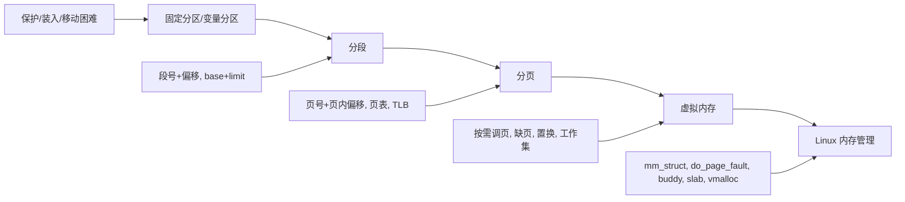

# 09-0 main memory segmentation + 09-1 main memory paging + 10-0 virtual memory + 10-1 virtual memory Linux 零基础完整讲解

这四份课件其实讲的是同一条主线:

1. 先解决“程序怎么放进内存”的老问题
2. 再解决“多个程序怎么共享内存、互不干扰”的问题
3. 再解决“程序地址和物理地址怎么翻译”的问题
4. 最后解决“内存不够时怎么办, Linux 具体怎么做”的问题

你可以把整套内容记成一句话:

> 先有连续分配, 再有分段, 再有分页, 最后有虚拟内存; Linux 把这些思想落到了具体实现里.

---

## 0. 一张总图



---

## 1. 为什么需要这些机制

课件开头先从“计算机体系结构”切入: CPU 负责算, 内存负责放程序和数据, I/O 系统负责和外部世界交互。真正麻烦的是, 内存不是“随便读写就行”的简单抽象, 它有几个现实问题:

- 程序必须先从磁盘装进内存才能运行
- CPU 只能直接访问主存和寄存器
- 主存比寄存器慢很多
- 内存需要保护, 否则进程之间会互相破坏
- 程序越来越大, 但内存并不总是足够
- 多个进程要同时存在于内存中, 还要能快速切换

所以操作系统在内存管理上必须“聪明”:

- 既要快
- 又要省
- 还要安全
- 还要支持移动、共享、换出、恢复

这就是为什么 OS 在慢层次上反而要更复杂: 因为它在替硬件和应用做“更聪明的决策”。

---

## 2. 内存硬件怎么一路演化过来

课件先讲了一点历史, 目的是让你知道“内存慢”不是抽象概念, 而是从硬件材料和访问方式决定的。

### 2.1 早期存储

- 40 年代中期, EDVAC 使用延迟线存储器
- 1948 年有 CRT 表面电荷存储
- 1970 年代以后, DRAM 成为主流
- 1990 年代出现 SDRAM, 让内存和系统时钟同步
- DDR 进一步在时钟上升沿和下降沿都传数据, 提高带宽

你只要记住三件事:

1. 内存技术一直在变快
2. 但 CPU 变快得更猛
3. 所以“内存层次结构”一直存在

### 2.2 内存层次结构

- 寄存器最快, CPU 一个时钟甚至更快能访问
- 主存慢很多, 可能要多个周期
- Cache 夹在 CPU 和主存之间, 用来减少平均访问时间
- 磁盘更慢, 但容量大

课件强调的一点很重要:

- 内存单元看到的只是一串地址和读写请求
- 它根本不关心“你这是变量名还是数组下标”

所以“地址翻译”就变成了操作系统和硬件必须协作解决的问题。

---

## 3. 早期内存分配: 连续分配

在分页和虚拟内存出现之前, 最自然的做法是把一个进程放进一段连续的物理内存里。

### 3.1 批处理时代

最早是批处理系统:

- 一次只装一个程序
- 程序运行到结束
- 简单, 但利用率低

如果程序比物理内存还大, 就只能“分而治之”:

- 把程序拆成几段
- 一次只装一段
- 跑完再装下一段

这就是更早的“装载+重定位”思想。

### 3.2 多道程序设计

后来为了提高 CPU 利用率, 内存里会同时放多个进程:

- 一个进程等 I/O 时, 切给另一个进程
- 这样 CPU 不容易空转

但一旦多个进程同住一块物理内存, 三个问题马上冒出来:

- 保护: 不能互相踩内存
- 速度: 每次访问都不能慢到离谱
- 切换: 上下文切换不能太贵

于是出现了 partitioning, 也就是分区思想。

---

## 4. 分区: fixed partition 和 variable partition

### 4.1 fixed partition: 固定分区

固定分区就是把物理内存切成若干个固定大小的块, OS 放在最前面或某个保留区, 其余给进程。

特点:

- 简单
- 一个分区通常只能放一个进程
- 可同时运行的进程数 = 分区数
- 只要进程能塞进某个分区就行

问题:

- 分区大小定死了
- 程序通常不会刚好把整个分区用满
- 于是产生 internal fragmentation, 即内部碎片

内部碎片就是:

- 已经分配给某个进程了
- 但进程没用到
- 又不能给别人用

举个直白的例子:

- 分区 100KB
- 进程只需要 73KB
- 剩下 27KB 都浪费在这个分区内部

### 4.2 variable partition: 可变分区

可变分区按进程需要动态切内存:

- 大进程拿大块
- 小进程拿小块

优点:

- 比固定分区更灵活
- 更贴近实际需求

代价:

- 管理更复杂
- 需要维护空闲块列表
- 需要考虑“从哪一块 hole 里切”

这里引入了 hole 这个词:

- hole = 空闲内存块
- 大小不一
- 分散在内存各处

可变分区会带来 external fragmentation, 即外部碎片:

- 空闲内存总量可能够
- 但不连续
- 所以放不下一个大请求

### 4.3 三种经典放置策略

#### first-fit

- 从头找
- 找到第一个足够大的 hole 就分配

优点:

- 快

缺点:

- 前面容易被切得很碎

#### best-fit

- 找最小的但仍然够大的 hole

优点:

- 试图留下最小的剩余块

缺点:

- 往往要遍历整个空闲列表
- 也可能制造很多极小碎片

#### worst-fit

- 找最大的 hole

优点:

- 想把“大块”先切掉, 避免碎得太快

缺点:

- 需要找最大块
- 仍然容易碎

课件给出的结论很明确:

- fragmentation 是三种方法的共同大问题
- first-fit 和 best-fit 通常比 worst-fit 好

### 4.4 外部碎片怎么处理

一个典型场景:

- 总空闲内存够
- 但都散落成小洞
- 新进程要一整块连续空间

这时可选方法:

- 等
- 杀进程
- 做 compaction

compaction 就是“内存整理”:

- 把已经分配的块挪到一边
- 让空闲内存挤成一大块

但它要求:

- 程序必须能在运行时重定位
- 代价高
- 会影响性能

---

## 5. base/limit: 连续分配的关键硬件支持

课件把“连续分区”进一步升级成了 base 和 limit 寄存器方案。

### 5.1 核心思想

进程看到的是逻辑地址, 实际物理地址由硬件加 base 得到:

- logical address = 从 0 开始的偏移
- physical address = base + logical address

同时, limit 负责保护:

- 如果逻辑地址超过 limit
- 就触发保护异常

也就是说, 每次访问都要做两件事:

1. 检查 offset 是否越界
2. 没越界再加 base 得到物理地址

### 5.2 为什么它很重要

它带来四个好处:

- 内建保护
- 访问快
- 上下文切换快
- 程序地址不需要在装载时全部改写

还有一个特别实用的优点:

- 进程可以在内存中被移动
- 只要 OS 更新 base 和 limit
- 进程自己不会知道

### 5.3 为什么要特权指令

加载 base/limit 的指令必须是特权指令, 因为:

- 如果用户进程能改 base/limit
- 它就能越过保护
- 直接访问别人的内存

所以 base/limit 的设置只能由内核做。

---

## 6. 分段 segmentation

分段是连续分配思想的升级版。

### 6.1 为什么需要分段

程序不是一整块均匀的东西, 它天然有结构:

- 代码段
- 只读数据段
- 数据段
- BSS 段
- 栈
- 堆

课件还提到了 ELF binary basics:

- `.text`: 代码
- `.rodata`: 初始化的只读数据
- `.data`: 已初始化数据
- `.bss`: 未初始化数据

这说明一个程序的逻辑结构本来就分层, 所以用“多个 base/limit”去对应多个逻辑段很自然。

### 6.2 C 程序的内存布局

典型进程地址空间大致是:

- 低地址: 代码、数据
- 中间: heap 向上长
- 高地址: stack 向下长
- 还会有共享库、mmap 区、vvar、vdso 等

课件用 `/proc/self/maps` 展示了一个真实 Linux 进程的虚拟地址空间:

- 地址不是一整块满的
- 中间有 holes
- 共享库和特殊区段分散排列

这正是“分段”和“虚拟内存”都必须面对的现实。

### 6.3 分段地址格式

分段逻辑地址是一个二元组:

- `<segment-number, offset>`

处理过程:

1. 用 segment-number 查段表
2. 取出该段的 base 和 limit
3. 检查 offset 是否小于 limit
4. 若合法, physical = base + offset
5. 若非法, trap/protection fault

### 6.4 段表项里有什么

课件图里段表项至少有:

- base: 物理起始地址
- limit: 段长度
- RWX: 读/写/执行权限

因此段表不只是“地址翻译”, 还是“访问控制”。

### 6.5 分段的优点

- 更符合程序结构
- 保护粒度更自然
- 可以把代码、数据、栈分开管理
- 早期 minicomputer 和 Unix 里很有用

课件还特别指出:

- x86 支持 segmentation
- Linux 也支持 segmentation

### 6.6 分段的缺点

最大的老问题仍然在:

- 段大小可变
- 还是会有 external fragmentation

所以分段虽然比固定分区高级, 但并没有彻底消灭碎片。

### 6.7 历史顺序

课件最后问了一个历史问题:

- 为什么 segmentation 比 paging 更早出现?

答案是:

- 硬件更简单
- 成本更低
- OS 也更容易实现
- 当时人们更容易理解它

分段大约在 1961 左右被提出并实现, 分页大约在 1962 左右开始用起来, 但分页后来成为主流, 因为它更适合解决碎片和虚拟内存问题。

---

## 7. 地址绑定 address binding

这个概念是分页/分段/虚拟内存的底层逻辑。

### 7.1 三个阶段

地址在程序生命周期中有三种形态:

- 编译前: 符号地址
- 编译后: relocatable address, 可重定位地址
- 链接/装载后: absolute address, 绝对地址

### 7.2 三种绑定时机

#### compile time

- 如果内存位置事先知道
- 可以直接生成绝对代码
- 但只要起始地址变了, 就得重新编译

#### load time

- 如果编译时不知道位置
- 就生成可重定位代码
- 装载时再确定绝对地址

#### execution time

- 如果进程运行时还可能移动
- 就把绑定延迟到运行时
- 这需要硬件支持

base/limit 和 MMU 就属于 execution-time binding 的硬件支撑。

### 7.3 逻辑地址和物理地址

课件给出的核心定义:

- logical address / virtual address: CPU 产生的地址
- physical address: memory unit 看到的地址

这是整门课最重要的抽象之一:

- 程序不必知道自己落在哪块物理 RAM 上
- 只要知道自己“看起来”能访问哪些逻辑地址即可

---

## 8. 分页 paging

分段之后, 下一步就是分页。

### 8.1 分页想解决什么

分页把“必须连续”这件事拆开:

- 逻辑地址空间不必连续占用物理内存
- 物理内存也不必连续

这直接解决了外部碎片问题。

### 8.2 page 和 frame

分页里有两个基本单位:

- page: 逻辑内存中的页
- frame: 物理内存中的页框

通常页和页框大小相同, 且是 2 的幂, 常见 4KB。

### 8.3 分页的基本流程

1. 把逻辑地址空间切成 pages
2. 把物理内存切成 frames
3. 维护一个 page table
4. page table 记录 page -> frame 的映射
5. 访问时通过映射把逻辑地址翻译成物理地址

### 8.4 地址翻译

逻辑地址分成两部分:

- page number p
- page offset d

page number 用来查页表:

- PTE 里有对应的 physical frame number

page offset 直接拼到 frame 后面:

- physical address = frame number + offset

### 8.5 分页的优点

- 没有 external fragmentation
- 物理分配简单
- 程序可以映射到不连续的物理块
- 非常适合稀疏地址空间

### 8.6 分页的缺点

- 仍然有 internal fragmentation
- 需要页表
- 地址翻译可能变慢

#### internal fragmentation

最后一页可能没用满, 这就是内部碎片。

课件里的例子:

- page size = 2048 bytes
- program size = 72,766 bytes
- 35 页 + 1086 bytes
- 最后一页浪费 = 2048 - 1086 = 962 bytes

最坏情况:

- 1 frame - 1 byte

平均情况:

- 大约 1/2 page

但实际通常比这个小, 因为一个程序往往有很多页, 只有最后一页浪费。

### 8.7 页大小怎么选

这是一个典型权衡问题:

- 页小: 碎片少, 但页表更大, TLB 压力更高
- 页大: 页表更小, I/O 更划算, TLB reach 更大, 但碎片更多

所以现实中常见:

- 4KB
- 64KB
- huge page: 2MB, 1GB

---

## 9. 页表 page table 和 frame table

### 9.1 page table

页表存的是:

- 逻辑页号 -> 物理页框号

### 9.2 frame table

操作系统也要知道物理内存中每个 frame 的情况:

- 哪个 frame 空闲
- 哪个 frame 被分配了
- 属于哪个进程

所以 frame table 是 OS 管理物理内存的重要数据结构。

---

## 10. 简单分页硬件

### 10.1 最简单的方式

一种很原始但很快的方法是:

- 页表直接放在专用寄存器里

优点:

- 非常快

缺点:

- 寄存器数量有限
- 页表太大就放不下
- 上下文切换时要保存/恢复很多寄存器

### 10.2 现实方式: PTBR + PTLR

更现实的办法:

- page table 放在主存
- Page-Table Base Register (PTBR) 指向页表
- Page-Table Length Register (PTLR) 记录页表长度

问题是:

- 访问一个内存字, 可能先要访问页表, 再访问真正数据
- 于是一次访存变成两次访存

这就是为什么 TLB 非常重要。

---

## 11. TLB

TLB = translation look-aside buffer

### 11.1 它做什么

TLB 缓存的是:

- page number -> frame number
- 以及权限信息

它是 MMU 的一部分。

### 11.2 工作方式

- 如果页号在 TLB 里: 直接拿 frame, 不用查页表
- 如果不在: TLB miss, 去页表里查, 再把结果装入 TLB

### 11.3 为什么叫 associative memory

TLB 的查找方式不是“给地址然后按索引访问”, 而是“按内容匹配”:

- 用页号作为 key
- 并行比较
- 命中后直接返回值

这就是 associative memory / content-addressed search 的意思。

### 11.4 TLB 很小

典型大小:

- 64 到 1024 项

所以它靠的不是容量, 而是“命中局部性”。

### 11.5 context switch 时怎么办

每个进程有自己的页表, 切换进程时 TLB 必须一致。

常见做法:

- 方案 1: 每次切换都 flush TLB
- 方案 2: 给 TLB 项打 ASID, 让不同进程项共存

还有一些内核项可以固定在 TLB 里, 比如 kernel entries。

### 11.6 体系结构差异

- MIPS: TLB miss 可能交给 OS 处理
- x86: TLB miss 通常由硬件处理

### 11.7 ARM 的一些细节

课件还提到 ARM Cortex-A73 的 TLB:

- instruction micro TLB
- data micro TLB
- main TLB

匹配时要看:

- VA 中与页大小相关的位是否匹配
- memory space 是否匹配
- ASID 是否匹配
- VMID 是否匹配

这说明现代 TLB 不只是“页号匹配”, 还带有地址空间和虚拟化上下文信息。

### 11.8 Effective Access Time

课件用一个简化模型算平均访存时间:

- hit ratio = TLB 命中率
- memory access = 100 ns

如果命中率 80%:

```text
EAT = 0.80 * 100 + 0.20 * 200 = 120 ns
```

如果命中率 99%:

```text
EAT = 0.99 * 100 + 0.01 * 200 = 101 ns
```

结论:

- TLB 命中率哪怕差几个百分点, 性能都差很多

---

## 12. 保护 protection

分页和分段都要做保护。

### 12.1 页表项中的关键位

典型保护相关位:

- present / valid bit
- read/write
- execute
- user/kernel

### 12.2 present bit

present = 1:

- 该页有合法物理 frame

present = 0:

- 该页当前不在内存
- 或者映射无效

### 12.3 代码执行保护

课件提到了 XN / XD / PXN / SMEP 这一类机制:

- XN = execute never
- XD = execute disable
- PXN = privileged execute never

作用:

- 防止数据页被当代码执行
- 防止内核在不该执行的用户页里执行代码

这类保护是现代系统安全的重要一环。

### 12.4 出错怎么办

只要违反权限:

- trap 到 kernel

也就是硬件把错误交给内核处理。

---

## 13. 页共享 sharing

分页最大的好处之一就是共享非常自然。

### 13.1 共享代码

同一个程序的只读代码页, 可以被多个进程共享:

- 文本编辑器
- 编译器
- 浏览器

这些共享页通常是 reentrant code:

- 不自修改
- 运行期间内容不变

### 13.2 共享库

共享库也能被多个进程映射到各自的虚拟地址空间中。

### 13.3 共享内存 IPC

两个进程只要把同一个物理 frame 映射进去, 就能共享数据:

- 虚拟地址可以不同
- 但物理页是同一个

这比传统的管道/消息传递更直接, 也更快。

### 13.4 fork 和 COW

fork 之后, 父进程和子进程一开始可以共享同一批页面。

只有当某一方要写时, 才复制:

- 这就是 copy-on-write

这样做非常省:

- fork 很快
- 只有真的改了的页才复制

---

## 14. 访问翻译的 4 种页表结构

### 14.1 一层页表

最直观, 但很大。

#### 32 位 + 4KB 页时的大小

- 32 位地址空间 = 4GB
- 4KB 页 = 2^12
- 页数 = 2^32 / 2^12 = 2^20 = 1M
- 如果每个 PTE 4 字节
- 页表大小 = 4MB

问题:

- 每个进程都来一份, 很浪费
- 而且页表本身必须物理连续

### 14.2 为什么层次化页表能省

因为真实程序的虚拟地址空间通常很稀疏:

- ELF 程序有 holes
- stack 和 heap 中间常常留很大空白
- 共享库和 mmap 区也不一定连续

所以没必要把整个 4MB 页表一次性都摆满。

### 14.3 二级页表

逻辑地址分成:

- page directory number
- page table number
- page offset

32 位, 4KB 页的经典 Intel 形式是:

- 10 + 10 + 12

因为:

- 4KB 页面能放 1024 个 4-byte PTE
- 所以每一级索引都是 10 位

优点:

- 只有用到的二级页表才分配
- 对稀疏地址空间更省内存

### 14.4 更高层次的页表

64 位地址空间太大, 二级不够, 于是有:

- 三级
- 四级

课件里举了几个具体例子:

- AMD-64 常见支持 48-bit
- ARM64 支持 39-bit 或 48-bit
- 4KB 页时, 48-bit 地址通常拆成 9+9+9+9+12
- 39-bit 地址通常拆成 9+9+9+12

### 14.5 hashed page table

哈希页表适合更大的地址空间:

- 把 virtual page number hash 到一个桶里
- 冲突用链表或链式结构解决
- 桶里的每个项通常包括 page#, frame#, next pointer

优点:

- 能处理 >32 位地址空间

### 14.6 inverted page table

反向页表的思路完全反过来:

- 一条记录对应一个 physical frame
- 记录里面放 pid 和 virtual page#

优点:

- 页表大小固定
- 和物理内存大小成正比

缺点:

- 查找时要搜索整个表, 很慢
- 所以非常依赖 TLB
- 共享内存映射也变麻烦

---

## 15. 体系结构例子: Intel, Linux, ARM

课件 09-1 后半部分专门讲了不同硬件和 OS 里分页/分段怎么落地。初学者容易觉得这些是“边角料”, 但它们其实是把前面的抽象概念对上真实机器。

### 15.1 Intel 32 位和 64 位架构

课件说 Intel 是工业界主流芯片之一:

- Pentium CPU 是 32-bit, 叫 IA-32
- 当前 Intel CPU 是 64-bit
- 课件文本里写了 IA-64, 但现代普通 PC 语境里更常说 x86-64 / AMD64; IA-64 原本特指 Itanium 那条线

你学习时不用纠结名字争议, 先抓住本课重点:

- 32 位时代地址空间紧张
- 64 位时代虚拟地址空间大很多
- 但真实硬件通常不实现完整 64 位虚拟地址

### 15.2 Intel IA-32: 先分段, 再分页

IA-32 支持:

- segmentation only
- segmentation + paging

它的地址翻译链路是:

```text
logical address
    -> segmentation unit
    -> linear address
    -> paging unit
    -> physical address
```

也就是说:

- CPU 先产生 logical address
- segmentation unit 把它变成 linear address
- paging unit 再把 linear address 变成 physical address

这能帮你理解一个重要概念:

- Intel 里有时会区分 logical address、linear address、physical address
- 而很多 OS 课程会把 logical/virtual address 简化合并讲

### 15.3 IA-32 的 segment

课件列出的 IA-32 segmentation 信息:

- 每个 segment 最多 4GB
- 每个进程最多 16K 个 segments
- segments 分成两部分
- 前 8K 个是进程私有的, 保存在 LDT, 即 local descriptor table
- 后 8K 个所有进程共享, 保存在 GDT, 即 global descriptor table

CPU 产生的逻辑地址里有 selector:

- selector 交给 segmentation unit
- segmentation unit 查 descriptor table
- descriptor 里有 base、limit 和其他 bits

课件还提到几个寄存器/表:

- CS: 当前执行指令所在 code segment 的段地址
- DS: data segment 的段地址
- GDTR: 指向 GDT
- LDTR: 指向 LDT

选择子里有几个字段:

- s: segment number
- g: local/global
- p: protection

### 15.4 IA-32 的 paging

segmentation 得到 linear address 后, paging unit 负责生成 physical address。

IA-32 页大小可以是:

- 4KB
- 4MB

经典 32-bit + 4KB 页的二级分页格式:

```text
10 bits page directory index
+ 10 bits page table index
+ 12 bits offset
= 32 bits
```

为什么是 10+10+12?

- 4KB = 2^12, 所以低 12 位是页内偏移
- 剩下 20 位用于页号
- 每个页表页 4KB, 每个 PTE 4B, 所以一页能放 1024 = 2^10 个表项
- 因此自然拆成 10 位目录索引 + 10 位页表索引

### 15.5 PAE: Physical Address Extension

32 位地址最多只能表达 4GB 地址空间, 于是 Intel 引入 PAE。

课件给出的 PAE 要点:

- PAE 让 32-bit app / OS 能访问超过 4GB 的物理内存
- page-directory entry 和 page-table entry 扩展为 64 bits
- 顶部两位用于 page directory pointer table
- 分页变成 3-level scheme
- 物理地址空间扩展到 36 bits, 即 64GB
- 虚拟地址空间仍然是 4GB

这点很容易考:

> PAE 扩大的是可寻址物理内存, 不是让单个 32 位进程突然拥有超过 4GB 的虚拟地址空间。

### 15.6 Linux 对 Intel Pentium 的支持

课件列出 Linux 的几个简化策略:

- Linux 只使用 6 个 segments
  - kernel code
  - kernel data
  - user code
  - user data
  - task-state segment, TSS
  - default LDT segment
- x86 有 4 个 ring, 但 Linux 只用两个
  - kernel: ring 0
  - user space: ring 3
- Linux 使用通用的四级分页抽象同时支持 32-bit 和 64-bit
  - 二级分页时, middle 和 upper directories 可以省略
  - 三级分页时, upper directory 可以省略

这说明 Linux 内核喜欢用统一抽象屏蔽硬件差异。

### 15.7 x86-64

x86-64 是当前常见桌面/服务器 Intel/AMD 架构。

课件要点:

- 理论完整 64-bit 地址巨大, 超过 16 exabytes
- 实际硬件通常只实现 48-bit addressing
- 页大小可以是 4KB, 2MB, 1GB
- 常用四级页表
- 通常不再需要 PAE

48-bit + 4KB 页常见格式:

```text
9 + 9 + 9 + 9 + 12
```

低 12 位仍是页内偏移, 其余每级 9 位, 因为一个 4KB 页表页里可放 512 个 8-byte PTE:

```text
4096 / 8 = 512 = 2^9
```

### 15.8 ARM32

课件列出的 ARM32 特点:

- 能效高
- 32-bit CPU
- 支持 4KB 和 16KB pages
- 支持 1MB 和 16MB sections
- sections 可以理解成大块映射
- sections 用 one-level paging
- 小页面用 two-level paging
- 有两级 TLB
  - 外层有 data micro TLB 和 instruction micro TLB
  - 内层是 main TLB
- 先查 micro TLB, miss 再查 main TLB, 再 miss 才 page table walk

这里你要抓住:

- ARM 不是只有一种页大小
- TLB 也不是只有一个

### 15.9 ARM64

ARM64 是移动平台主流, Apple iOS 和 Android 设备大量使用。

课件要点:

- 支持 39-bit addressing
  - 3-level page table
  - 9+9+9+12
- 支持 48-bit addressing
  - 4-level page table
  - 9+9+9+9+12
- ARM64 常见 page size 是 4KB 或 64KB

### 15.10 64KB 页时地址格式怎么想

课件最后的 quiz 问了 64KB 页。

关键公式:

```text
page size = 64KB = 2^16
```

所以:

- offset = 16 bits

如果是 32-bit VA:

```text
32-bit VA = 16-bit page number + 16-bit offset
```

如果是 39-bit VA:

```text
39-bit VA = 23-bit page number + 16-bit offset
```

具体层级怎么拆取决于体系结构, 但总原则是:

- 低 16 位永远是页内偏移

如果是 48-bit VA:

```text
48-bit VA = 32-bit page number + 16-bit offset
```

如果每个 PTE 是 8B, 一个 64KB 页表页能放:

```text
64KB / 8B = 8192 = 2^13 entries
```

所以层次化页表中每级索引可能是 13 位一组, 具体实现由架构规定。

---

## 16. 分页 + TLB + 页表的总体关系

你可以把它想成三层:

1. CPU 先发出 virtual address
2. MMU 先查 TLB
3. TLB miss 才去查 page table
4. 查到 frame 后再访问 RAM

这也是为什么页表不是“可有可无”:

- TLB 只是缓存
- 页表才是权威记录

---

## 17. 虚拟内存 virtual memory

分页讲完后, 就进入虚拟内存。

### 16.1 它到底解决什么

虚拟内存的本质是:

- 让程序看到的地址空间, 可以比物理内存更大
- 只把“当前真的需要的部分”放进内存

这带来很多好处:

- 可以运行更大的程序
- 可以同时运行更多程序
- 可以减少 I/O
- 可以共享库
- 可以更高效地 fork

### 16.2 逻辑内存和物理内存分离

这句话是整个虚拟内存的核心:

- logical / virtual memory: 程序看到的地址
- physical memory: 真正的 RAM

二者不必一一对应, 也不必连续对应。

### 16.3 地址空间布局

课件指出, 常见设计是:

- stack 放在高地址, 向下增长
- heap 放在低地址, 向上增长
- 中间留 hole

这样做有几个好处:

- 利于增长
- 利于稀疏布局
- 利于动态库映射

课件强调了:

- system libraries 可以映射进虚拟地址空间
- fork 时页可以共享
- COW 让进程创建更快

---

## 18. Demand paging: 按需调页

### 17.1 核心概念

按需调页就是:

- 只有当页真的被访问时, 才把它放进内存

如果访问的是:

- invalid page -> error, abort
- valid but not in memory -> bring it in

后者就叫 page fault。

### 17.2 谁来处理 page fault

- 触发者: MMU / CPU
- 处理者: 操作系统

### 17.3 怎么知道页不在内存

靠页表项里的 present/valid bit:

- valid = 1: 在内存
- invalid = 0: 需要 page fault

### 17.4 Linux 里怎么做

Linux 先看 VMA:

- 地址是否在 vm_area 里

如果不在:

- 非法访问
- 直接报错

如果在:

- 再去找物理 frame

### 17.5 page fault 的处理步骤

课件给了一个“最坏情况”时序, 你要记住流程:

1. trap 到 OS
2. 保存寄存器和进程状态
3. 确认是 page fault
4. 检查引用是否合法
5. 找空闲 frame
6. 从磁盘把页读到 frame
7. 等 I/O 完成
8. 期间 CPU 切去别的进程
9. 更新页表
10. 恢复进程, 重启导致 fault 的指令

### 17.6 处理 page fault 时为什么要 restart instruction

因为 fault 前那条指令可能根本没真正完成:

- 读写地址没准备好
- 需要重新执行一次

所以硬件和 OS 必须支持 instruction restart。

### 17.7 lazy swapper 和 pre-paging

#### lazy swapper

- 只有真的需要时才把页搬进来

#### pre-paging

- 预先把接下来可能用到的一批页搬进来

权衡:

- 预取太多会浪费 I/O 和内存
- 预取太少又会频繁缺页

### 17.8 zero-fill-on-demand

系统启动时, 一般会把可用 frame 放到 free-frame list。

分配时常常会清零:

- 这样安全
- 也避免泄露旧数据

### 17.9 pure demand paging

极端情况下:

- 一开始一个 frame 都不给
- 程序从第一条指令开始跑
- 用到哪页, 才把哪页调进来

这就是 pure demand paging。

---

## 19. demand paging 的代价: EAT

页 fault 很贵, 所以要看平均。

### 18.1 page fault rate

定义:

- p = 发生 page fault 的概率

### 18.2 平均访问时间

课件的公式是:

```text
EAT = (1 - p) * memory access
    + p * (page fault overhead + swap out + swap in + restart)
```

### 18.3 数字例子

如果:

- memory access = 200 ns
- page fault service = 8 ms

那么:

```text
EAT = (1 - p) * 200 + p * 8,000,000
```

如果 1000 次访问里有 1 次 fault:

- 平均 EAT 约 8.2 微秒
- 相比 200ns, 慢了约 41000 倍

课件的结论很狠:

- 如果想让 slowdown 小于 10%
- page fault 频率必须极低

也就是:

- 不能频繁缺页
- locality 特别重要

---

## 20. COW: copy-on-write

### 19.1 目标

让 fork 更快。

### 19.2 做法

- 父进程和子进程先共享同一页
- 只有当其中一个要写时才复制

### 19.3 好处

- fork 过程不需要立即复制整份内存
- 只有修改过的页以后才复制

### 19.4 vfork

vfork 针对“子进程马上 exec”的场景:

- 父进程先挂起
- 子进程共享父进程的 heap 和 stack
- 子进程应尽快 exec 或 _exit

课件提醒:

- vfork 很脆弱
- 它是 COW 还不成熟时的历史优化

---

## 21. 没有 free frame 时怎么办

这时就要 page replacement。

### 20.1 page replacement 的目标

- 找一个当前不怎么用的页
- 把它换出去
- 腾出 frame 给新页

### 20.2 dirty bit

如果页被改过:

- 写回磁盘

如果没改过:

- 可以直接丢掉

这样能减少 I/O。

### 20.3 page replacement 和 page fault 的关系

通常 page replacement 是 page fault handler 的一部分:

- fault 发生
- 没 free frame
- 选 victim
- 可能写回
- 再把新页装进来

这也是为什么一个 page fault 有时会触发两次磁盘 I/O:

- victim 写回一次
- 新页读入一次

---

## 22. 经典 page replacement 算法

### 21.1 评估方式

用 reference string 评估:

- 只看页号
- 不看完整地址

课件给的字符串是:

```text
7,0,1,2,0,3,0,4,2,3,0,3,0,3,2,1,2,0,1,7,0,1
```

### 21.2 FIFO

FIFO = 先进先出:

- 换掉最早进入内存的页

课件指出:

- 这个例子在 3 个 frame 时会有 15 次 page fault

FIFO 的大坑:

- Belady anomaly

也就是:

- frame 更多, fault 反而更多

课件例子:

```text
1,2,3,4,1,2,5,1,2,3,4,5
```

在 3 frames 下是 9 次 fault, 4 frames 下反而 10 次。

### 21.3 OPT

Optimal:

- 替换“未来最长时间内都不会再用”的页

它是理论最优, 但现实中做不到, 因为你看不到未来。

它更多用来当基准。

### 21.4 LRU

Least Recently Used:

- 替换“最久没被用过”的页

课件说它通常效果很好, 而且没有 Belady anomaly。

实现方法:

- counter-based
- stack-based

但都开销不小。

### 21.5 LRU approximation

硬件常给一个 reference bit:

- 页被访问时, bit = 1
- replacement 时优先找 bit = 0 的页

### 21.6 second chance / clock

思想:

- FIFO + reference bit

规则:

- ref = 0: 直接换
- ref = 1: 把它清 0, 给它第二次机会, 看下一个

### 21.7 enhanced second chance

进一步加上 modify bit:

- (0,0): 最佳 victim
- (0,1): 没最近用但改过了, 需要先写回
- (1,0): 最近用过但干净
- (1,1): 最近用过且改过

### 21.8 counting-based

统计访问次数:

- LFU: 换最少用的
- MFU: 换最多用的

但这两种都不常见。

### 21.9 page-buffering

做法:

- 永远保持一个 free frame pool
- page fault 时能快速拿到 frame
- 被替换的脏页可以稍后再写
- 还可以把刚腾空的 frame 先当 cache 用

### 21.10 应用知道得更多

OS 是“猜未来”, 但某些应用比如数据库知道更多。

所以有时会出现:

- double buffering

即:

- OS 自己有一份缓存
- 应用自己又有一份缓存

这会浪费内存。

因此有些场景会用 raw disk mode, 绕过部分 buffering 和 locking。

---

## 23. frame allocation

每个进程需要多少 frame, 也要分配。

### 22.1 最小 frame 数

有些指令语义本身就要求多个页同时存在。

课件举了 IBM 370 的例子:

- 一条 SS MOVE 可能需要 6 页

原因是:

- 指令本身可能跨页
- 源操作数跨页
- 目的操作数跨页

### 22.2 两种基本分配

#### equal allocation

- 平均分

#### proportional allocation

- 按进程大小或需要分配

### 22.3 global vs local

#### global replacement

- 一个进程可以从所有 frame 里挑 victim
- 吞吐量往往更高
- 但进程间相互影响大

#### local replacement

- 只能从自己的 frame 集合里换
- 更稳定
- 但可能浪费内存

### 22.4 reclaiming pages

全局策略的一种做法:

- free-frame list 低于阈值就开始回收

这样可以保证系统始终有足够的空闲页来满足新请求。

如果内存低到不行:

- 可能会杀进程
- 依赖 OOM score

---

## 24. major fault 和 minor fault

这个细节很重要, 很容易考。

### 23.1 major fault

- 页不在内存
- 必须从磁盘取

### 23.2 minor fault

- 映射缺失, 但页其实已经在内存里

常见原因:

- shared library
- reclaimed 但还没真正释放的页

### 23.3 一个很关键的点

不是所有 page fault 都意味着磁盘 I/O。

有些只是:

- 页已经在 RAM 里
- 只是页表没准备好

---

## 25. thrashing

### 24.1 什么是 thrashing

一个进程如果 frame 不够:

- 一会儿把页换进来
- 一会儿又把它换出去

大部分时间都在搬页, 不在干活。

这就叫 thrashing。

### 24.2 为什么会发生

因为进程的 locality 太大, 而总内存容不下所有 locality。

### 24.3 为什么 demand paging 还能工作

因为程序访问有 locality:

- 一段时间内只集中访问一小部分页

### 24.4 怎么缓解

#### 方案 1: local replacement

- 某个进程 thrash 不要拖累全局

#### 方案 2: working-set model

- 保证每个进程有足够的页来装下当前 locality

#### 方案 3: page-fault frequency

- fault 太高就给更多 frame
- fault 太低就收回一些 frame

---

## 26. working-set model

### 25.1 working-set window

Delta 是一个固定长度的“最近引用窗口”:

- 如果 Delta 太小, 看不全 locality
- 如果 Delta 太大, 会混进多个 locality

### 25.2 working set

WSSi:

- 进程 i 在最近 Delta 次引用里, 访问过的页数

### 25.3 总 working set

```text
D = sum(WSSi)
```

它近似表示系统当前需要的总页数。

如果:

- D > m (总可用 frame 数)

就可能 thrashing。

### 25.4 处理方式

- 暂停一些进程
- 或者 swap out 一些进程

### 25.5 如何近似跟踪 working set

课件给了一个近似方法:

- interval timer + reference bit

做法:

1. 每页一个 reference bit
2. 定时器周期性中断
3. OS 把 reference bit 复制到历史位里
4. 然后把 reference bit 清零

这会有近似误差, 因为:

- 你只能看到几个时间片的粗粒度历史

但已经比完全不看好很多。

---

## 27. page-fault frequency (PFF)

比 working-set 更直接一点:

- 定一个“可接受”的 fault 频率

如果实际太低:

- 说明 frame 可能给多了

如果实际太高:

- 说明 frame 不够

于是动态调 frame 数。

---

## 28. 其他会影响 page fault 的因素

### 27.1 page size

page size 的选择要权衡:

- 碎片
- 页表大小
- I/O 开销
- page fault 数
- locality
- TLB reach

### 27.2 TLB reach

公式:

```text
TLB reach = TLB size * page size
```

意义:

- TLB 能覆盖多少内存

如果 working set 比 TLB reach 大:

- TLB miss 就会很多

### 27.3 program structure

程序访问顺序会强烈影响 page fault。

课件的经典例子:

- 128 x 128 数组
- page size = 512B
- 每一行刚好放一页
- 127 个 frame

如果按列访问:

- 可能有 16,384 次 page fault

如果按行访问:

- 只要 128 次 page fault

这说明:

- 数据布局和循环顺序会决定性能

### 27.4 I/O interlock

做 I/O 时, 某些页必须锁在内存里:

- 不能被页置换赶出去

否则:

- 数据可能在 I/O 过程中被换走
- 事情就乱了

---

## 29. Windows XP 的课件例子

课件顺带提了 Windows XP:

- demand paging + clustering
- 维护 working set minimum / maximum
- 内存低于阈值时自动 trimming
- 从拥有超过 wsmin 的进程里收页

这个例子主要是让你知道:

- 不同 OS 都在做同类事情
- 只是策略名不同

---

## 30. Linux 内存管理的核心对象

现在来到课件 10-1 的重点。

### 29.1 三种地址

Linux 里要分清:

- user virtual address
- kernel logical address
- kernel virtual address

它们都是 virtual address, 但映射方式不同。

### 29.2 用户地址和内核地址的分界

32 位 Linux 里默认:

- 低 3GB 给用户
- 高 1GB 给内核

分界点通常是:

```text
0xC0000000
```

也就是 `CONFIG_PAGE_OFFSET`。

### 29.3 为什么要分开

- 用户态不能直接碰内核
- 内核要有自己的地址空间
- 便于保护和实现

### 29.4 kernel logical address

这是内核地址空间里的一段线性映射:

- 虚拟地址和物理地址之间是固定偏移

常见低内存系统中:

- `va(x)` / `pa(x)` 宏可以快速互转

### 29.5 kernel virtual address

比逻辑映射更高的一段区域:

- 用于非连续映射
- 常见于 `vmalloc()`

用于:

- 大缓冲区
- 不能拿到物理连续块时

### 29.6 大内存系统

在 32 位系统里, 由于内核地址空间只有 1GB, 不是所有物理 RAM 都能线性映射。

课件提到:

- 还会留出约 128MB 给非连续分配

这就是为什么大内存场景下:

- 只有 RAM 的一部分能线性映射成 kernel logical address

但在 64 位系统里通常没这个压力, 因为内核虚拟空间大得多。

---

## 30. Linux 虚拟内存的实现方式

### 30.1 MMU

MMU 是真正做地址翻译的硬件:

- CPU 发出 virtual address
- MMU 翻译成 physical address
- 同时检查权限

### 30.2 TLB

TLB 是 MMU 里的缓存:

- 缓存 VA -> PA
- 也缓存权限位

### 30.3 page fault

当访问未映射区域或权限不够时:

- CPU 触发 page fault exception

Linux 把 page fault 当成正常内存管理流程的一部分来处理。

### 30.4 lazy allocation

Linux 很常用懒分配:

- 用户申请了内存
- 但不立刻分配物理页
- 等真正 touch 到时才分配

好处:

- 省内存
- 省初始化成本
- 因为很多程序申请了内存也不一定真的用

### 30.5 触发后的流程

当那块懒分配内存第一次被访问时:

1. CPU 发现映射不存在
2. 触发 page fault
3. 内核检查这是合法的吗
4. 合法就补页表
5. 返回用户态
6. 原指令继续执行

对用户程序来说:

- 往往感觉不到

但在时间敏感场景里, 可能需要提前 prefault 或 mlock。

---

## 31. Linux 中的共享和 mmap

### 31.1 shared memory

MMU 让共享内存很容易:

- 把同一个物理 frame 映射进两个进程

需要注意:

- 两个进程的虚拟地址可以不同
- 但如果共享区域里有指针, 有时希望虚拟地址也一致

### 31.2 mmap()

`mmap()` 可以让用户请求把某块区域映射到指定虚拟地址。

但内核不一定能保证:

- 如果不能满足, `mmap()` 会失败

### 31.3 地址连续和物理连续不是一回事

这是 Linux 非常重要的设计原则:

- virtually contiguous 不一定 physically contiguous

大多数用户空间程序并不需要物理连续内存, 这让分配轻松很多。

---

## 32. Linux 的页表和 mm_struct

### 32.1 mm_struct

Linux 用 `mm_struct` 描述一个进程的内存映射。

你可以把它理解成:

- 这个进程有哪些 VMA
- 页表在哪里
- 这进程的地址空间长什么样

### 32.2 page table walk

当缺页或查地址时:

- 内核要走页表
- 逐层找到对应页表项

课件提到了:

- `do_page_fault`
- `__handle_mm_fault`

这两个函数是理解 Linux 缺页处理的关键入口。

### 32.3 switch_mm()

进程切换时, 需要切换它的内存映射上下文。

`switch_mm()` 就是在干这件事。

---

## 33. Linux 的内核内存分配器

### 33.1 buddy system

buddy 分配器是按 2 的幂分块的:

- 申请 21KB
- 先拿 32KB
- 从更大的块不断二分

优点:

- 快速合并
- 容易回收成更大块

缺点:

- internal fragmentation
- 例如 21KB 请求最后可能浪费到 32KB

### 33.2 slab allocator

slab 是对象缓存:

- 一个 cache 对应一种内核对象
- 一个 slab 里放很多等大小对象
- 对象用完就从 slab 里拿

好处:

- 快
- 几乎没有碎片
- 对象字段可复用

课件里提到:

- slab 有 full / empty / partial 三种状态
- Linux 后来有 SLAB, SLOB, SLUB

其中:

- SLOB: 面向小内存系统
- SLUB: 更偏性能优化, 元数据存 page structure 里

---

## 34. 这四讲最该背住的知识表

| 主题 | 核心问题 | 关键机制 | 最大问题 |
|---|---|---|---|
| 固定分区 | 怎么把内存切给进程 | equal-sized partitions | internal fragmentation |
| 可变分区 | 怎么按需求切 | hole, first/best/worst fit | external fragmentation |
| 分段 | 怎么按程序结构管理 | segment number + offset, base/limit | 还是有 external fragmentation |
| 分页 | 怎么消灭外部碎片 | page table, frame, TLB | 页表开销, internal fragmentation |
| 虚拟内存 | 怎么只把需要的页放内存 | demand paging, page fault, replacement | 缺页代价高, 可能 thrashing |
| Linux 实现 | 这些机制怎么落地 | mm_struct, do_page_fault, buddy, slab | 数据结构复杂, 但更灵活 |

---

## 35. 你必须会的公式

### 35.1 磁盘平均延迟

```text
average rotational latency = 1 / (2 * RPM/60)
```

更常见理解:

- 一圈时间的一半

### 35.2 页表大小

```text
page table size = number of pages * size of PTE
```

32 位, 4KB 页, 4B PTE:

- 2^20 * 4 = 4MB

### 35.3 TLB reach

```text
TLB reach = TLB entries * page size
```

### 35.4 EAT

```text
EAT = hit_ratio * hit_time + miss_ratio * miss_time
```

更完整时要把 page fault 开销算进去。

### 35.5 working set

```text
D = sum(WSSi)
```

如果 D 大于物理 frame 总数, 就有 thrashing 风险。

---

## 36. 最容易混淆的点

- page 是逻辑单位, frame 是物理单位
- virtual address 不是 physical address
- page fault 不一定都要读磁盘, 可能是 minor fault
- contiguous virtual 不等于 contiguous physical
- shared memory 可以映射到不同虚拟地址
- segmentation 仍可能碎片化
- paging 消灭外部碎片, 但引入内部碎片
- TLB 不是页表, 只是缓存
- page table 才是权威映射
- Linux 里 user / kernel / logical / virtual 这些术语一定要分清

---

## 37. 一页背诵版

如果你现在只想背最关键的, 就背这个:

1. 连续分配有 fixed partition 和 variable partition
2. fixed partition 产生 internal fragmentation
3. variable partition 产生 external fragmentation
4. segmentation = `<segment#, offset>`, 段表项有 base/limit/RWX
5. paging = `<page#, offset>`, 页表记录 page -> frame
6. TLB 缓存页表映射, 命中快, miss 慢
7. virtual memory = 逻辑内存和物理内存分离
8. demand paging = 访问时才把页调进来
9. page fault 由 MMU 触发, OS 处理
10. COW 让 fork 很快
11. page replacement 解决 free frame 不够
12. FIFO 有 Belady anomaly, LRU/OPT 没有
13. thrashing = 一直换页, 不干活
14. working set 和 PFF 用来控制 thrashing
15. Linux 里 `mm_struct` 管映射, `do_page_fault` 处理缺页, buddy/slab 管内核内存

---

## 38. 给初学者的学习顺序

建议你按这个顺序再看一遍:

1. 先理解 base/limit 和 segmentation
2. 再理解 page 和 frame, 以及页表翻译
3. 然后理解 TLB 为什么重要
4. 再看 demand paging 和 page fault
5. 接着看 page replacement 和 working set
6. 最后看 Linux 的 `mm_struct`, `mmap`, `page fault`, `buddy`, `slab`

如果你把这条线打通了, 后面的文件系统、I/O、设备管理就会更顺。
