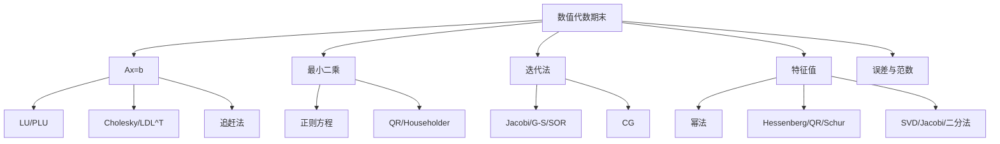

# 数值代数期末备考讲义

## 使用方式

先把每章的“识别信号”和“标准套路”背熟，再刷 `02_高频题库与预测卷.md`。这门课的纸面考试很重视：

- 能不能把算法步骤写规范；
- 能不能判断收敛、正定、可分解；
- 能不能把证明题归约到一两个核心恒等式；
- 能不能在小矩阵上手算不出错。

## 总框架

## 一、直接法：LU、PLU、平方根法

### 1. LU 分解

识别信号：

- 题目要求 `A=LU`、`PA=LU`、`PAQ=LU`
- 给 3 阶矩阵要求“写出详细步骤”
- 问为什么选主元

普通 Doolittle 分解：

\[
A=LU,\quad L \text{ 单位下三角},\quad U \text{ 上三角}.
\]

第 `k` 步：

\[
l_{ik}=\frac{a^{(k)}_{ik}}{a^{(k)}_{kk}},\quad
a^{(k+1)}_{ij}=a^{(k)}_{ij}-l_{ik}a^{(k)}_{kj}.
\]

解方程套路：

1. 分解 `A=LU`；
2. 解 `Ly=b`；
3. 解 `Ux=y`。

### 2. 列主元 PLU

列主元每步选当前列从第 `k` 行到第 `n` 行绝对值最大的元素作主元。标准写法：

\[
PA=LU,\quad Ax=b \Rightarrow LUx=Pb.
\]

答“为什么选主元”：

- 防止主元过小导致乘子过大；
- 控制舍入误差传播；
- 避免普通 LU 因前导主子式为零而失败；
- 典型无普通 LU 但非奇异例子：

\[
A=\begin{pmatrix}0&1\\1&0\end{pmatrix}.
\]

### 3. 高频母题：`[[1,4,7],[2,5,8],[3,6,10]]`

\[
A=\begin{pmatrix}1&4&7\\2&5&8\\3&6&10\end{pmatrix},\quad b=(1,1,1)^T.
\]

普通 LU：

\[
L=\begin{pmatrix}1&0&0\\2&1&0\\3&2&1\end{pmatrix},\quad
U=\begin{pmatrix}1&4&7\\0&-3&-6\\0&0&1\end{pmatrix}.
\]

解：

\[
x=(-1/3,\ 1/3,\ 0)^T.
\]

一种列主元分解：

\[
P=\begin{pmatrix}0&0&1\\1&0&0\\0&1&0\end{pmatrix},
\quad
L=\begin{pmatrix}1&0&0\\1/3&1&0\\2/3&1/2&1\end{pmatrix},
\quad
U=\begin{pmatrix}3&6&10\\0&2&11/3\\0&0&-1/2\end{pmatrix}.
\]

### 4. 平方根法与改进平方根法

适用条件：

\[
A=A^T>0.
\]

平方根法：

\[
A=LL^T.
\]

改进平方根法：

\[
A=LDL^T,
\]

其中 `L` 为单位下三角，`D` 为对角阵。优势是避免开方。

SPD 判别常用方法：

- 顺序主子式全正；
- 对称矩阵所有特征值正；
- 能成功 Cholesky 且对角元正。

答题模板：

1. 先验证 `A` 对称；
2. 用顺序主子式或配方法证明正定；
3. 写 Cholesky/LDL^T 递推；
4. 解 `Ly=b`、`L^Tx=y` 或 `Ly=b`、`Dz=y`、`L^Tx=z`。

### 5. 追赶法

三对角矩阵：

\[
a_i x_{i-1}+b_i x_i+c_i x_{i+1}=d_i.
\]

追赶法本质是三对角 LU：

\[
l_i=\frac{a_i}{u_{i-1}},\quad u_i=b_i-l_i c_{i-1}.
\]

再前代、回代。

考试中若给三对角小矩阵，直接做普通消元也可以，但写成追赶法更对题。

## 二、范数、条件数、误差

### 1. 向量范数

必须会证明三条：

1. 非负性；
2. 齐次性；
3. 三角不等式。

`p` 范数：

\[
\|x\|_p=\left(\sum_i |x_i|^p\right)^{1/p},\quad p\ge 1.
\]

\[
\|x\|_\infty=\max_i |x_i|.
\]

常用等价关系：

\[
\|x\|_\infty \le \|x\|_2 \le \sqrt n\|x\|_\infty,
\]

\[
\|x\|_2 \le \|x\|_1 \le \sqrt n\|x\|_2,
\]

\[
\|x\|_\infty \le \|x\|_1 \le n\|x\|_\infty.
\]

### 2. 矩阵范数

矩阵范数证明多一条：

\[
\|AB\|\le \|A\|\|B\|.
\]

Frobenius 范数：

\[
\|A\|_F=\left(\sum_{i,j}|a_{ij}|^2\right)^{1/2}
=\sqrt{\operatorname{tr}(A^TA)}.
\]

证明正交不变性：

\[
\|U^TAV\|_F^2
=\operatorname{tr}(V^T A^T U U^T A V)
=\operatorname{tr}(V^T A^T A V)
=\operatorname{tr}(A^T A).
\]

相似诱导范数题：

\[
\|A\|_X=\|X^{-1}AX\|_2.
\]

证明套路：

- 非负、齐次、三角不等式来自 `||.||_2`；
- 乘法性：

\[
\|AB\|_X=\|X^{-1}ABX\|_2
=\|(X^{-1}AX)(X^{-1}BX)\|_2
\le \|A\|_X\|B\|_X.
\]

注意：若题目严格要求矩阵范数的正定性，需要说明 `X` 可逆，且 `X^{-1}AX=0` 推出 `A=0`。

### 3. 谱范数

\[
\|A\|_2=\sqrt{\lambda_{\max}(A^TA)}.
\]

常用性质：

\[
\|A\|_2=\max_{\|x\|_2=1}\|Ax\|_2
=\max_{\|x\|_2=\|y\|_2=1}|y^TAx|.
\]

若 `U,V` 正交：

\[
\|UA\|_2=\|AV\|_2=\|A\|_2.
\]

### 4. 条件数与误差

\[
\kappa(A)=\|A\|\|A^{-1}\|.
\]

线性方程组扰动基本估计：

\[
\frac{\|\delta x\|}{\|x\|}
\lesssim
\kappa(A)\frac{\|\delta b\|}{\|b\|}.
\]

考试解释题常用句：

残量小不等于解准确；若 `A` 病态，前向误差可能被条件数放大。

## 三、最小二乘与正交化

### 1. 最小二乘标准问题

\[
\min_x \|Ax-b\|_2,\quad A\in \mathbb R^{m\times n},\ m\ge n.
\]

若 `A` 满列秩，正则方程：

\[
A^TAx=A^Tb.
\]

证明 `N(A^TA)=N(A)`：

- 若 `Ax=0`，显然 `A^TAx=0`；
- 若 `A^TAx=0`，左乘 `x^T` 得

\[
0=x^TA^TAx=\|Ax\|_2^2,
\]

所以 `Ax=0`。

### 2. 投影矩阵

满列秩时：

\[
P=A(A^TA)^{-1}A^T.
\]

性质：

\[
P^T=P,\quad P^2=P,\quad \|P\|_2=1
\]

只要 `P` 不是零矩阵。证明二范数为 1 的套路：

- `P` 对称幂等，所以特征值只可能是 0 或 1；
- `A` 满列秩且 `n>0`，`P` 有特征值 1；
- 因此 `||P||_2=max |lambda_i|=1`。

### 3. QR 解最小二乘

若

\[
A=Q\begin{pmatrix}R\\0\end{pmatrix},\quad Q=[Q_1,Q_2],
\]

则

\[
\|Ax-b\|_2^2
=\|Rx-Q_1^Tb\|_2^2+\|Q_2^Tb\|_2^2.
\]

所以解

\[
Rx=Q_1^Tb.
\]

### 4. Householder

定义：

\[
H=I-2ww^T,\quad \|w\|_2=1.
\]

性质：

\[
H^T=H,\quad H^TH=I,\quad H^2=I.
\]

构造 `Hx=alpha e_1`：

\[
\alpha=\pm \|x\|_2,\quad
w=\frac{x-\alpha e_1}{\|x-\alpha e_1\|_2}.
\]

实算建议：选符号避免相消。

高频母题：

\[
x=(3,1,6,4,2,2)^T,\quad Hx=(3,\alpha,4,6,0,0)^T.
\]

只需作用在第 2、5、6 个分量组成的向量

\[
y=(1,2,2)^T.
\]

取 `alpha=3`，可用

\[
H_3=
\begin{pmatrix}
1/3&2/3&2/3\\
2/3&1/3&-2/3\\
2/3&-2/3&1/3
\end{pmatrix},
\quad H_3y=(3,0,0)^T.
\]

再把 `H_3` 嵌入到第 2、5、6 坐标上即可。

### 5. Givens

二维旋转：

\[
G=
\begin{pmatrix}
c&s\\
-s&c
\end{pmatrix},\quad c^2+s^2=1.
\]

若要把 `(a,b)^T` 化为 `(r,0)^T`，取

\[
c=\frac a{\sqrt{a^2+b^2}},\quad s=\frac b{\sqrt{a^2+b^2}}.
\]

若题目要求变为 `beta(1,1)^T`，列方程：

\[
ca+sb=\beta,\quad -sa+cb=\beta,\quad c^2+s^2=1.
\]

高频母题：

\[
\begin{pmatrix}c&s\\-s&c\end{pmatrix}
\begin{pmatrix}7\\-1\end{pmatrix}
=\begin{pmatrix}\beta\\\beta\end{pmatrix}.
\]

可取

\[
c=3/5,\quad s=-4/5,\quad \beta=5.
\]

## 四、定常迭代法

### 1. 统一分裂

常用约定：

\[
A=D-L-U.
\]

Jacobi：

\[
x^{(k+1)}=D^{-1}(L+U)x^{(k)}+D^{-1}b.
\]

G-S：

\[
x^{(k+1)}=(D-L)^{-1}Ux^{(k)}+(D-L)^{-1}b.
\]

SOR：

\[
x^{(k+1)}
=(D-\omega L)^{-1}[(1-\omega)D+\omega U]x^{(k)}
+\omega(D-\omega L)^{-1}b.
\]

收敛充要条件：

\[
\rho(B)<1.
\]

### 2. 常用充分条件

严格对角占优：

\[
|a_{ii}|>\sum_{j\ne i}|a_{ij}|
\]

可推出 Jacobi、G-S 收敛。

若 `A` 对称正定，G-S 收敛；SOR 对 SPD 且 `0<omega<2` 收敛。

Homework10 还强调：

- 严格或弱严格对角占优不可约矩阵，G-S 收敛；
- 若松弛因子 `omega in (0,1]`，在相应条件下松弛迭代收敛；
- `2x2` SPD 可推出 Jacobi 收敛。

### 3. 参数矩阵模板

\[
A=\begin{pmatrix}1&0&a\\0&1&0\\a&0&1\end{pmatrix}.
\]

正定：

\[
1-a^2>0 \Rightarrow |a|<1.
\]

Jacobi 迭代矩阵：

\[
B_J=
\begin{pmatrix}0&0&-a\\0&0&0\\-a&0&0\end{pmatrix},
\]

特征值为 `0, a, -a`，所以收敛当且仅当 `|a|<1`。

G-S 迭代矩阵特征值为 `0,0,a^2`，所以同样 `|a|<1`。

### 4. 3 阶矩阵写 Jacobi 迭代矩阵

给 `A` 后直接写：

\[
B_J=-D^{-1}(L_A+U_A),
\]

其中 `L_A+U_A=A-D` 是原矩阵非对角部分。

2024-2025 题中：

\[
A_1=\begin{pmatrix}2&1&1\\1&-1&-1\\1&1&-2\end{pmatrix},
\]

\[
B_J=
\begin{pmatrix}
0&-1/2&-1/2\\
1&0&-1\\
1/2&1/2&0
\end{pmatrix},
\]

特征值为 `0, ± i sqrt(5)/2`，谱半径 `sqrt(5)/2>1`，不收敛。

\[
A_2=\begin{pmatrix}1&2&-2\\1&1&-1\\2&-2&1\end{pmatrix},
\]

\[
B_J=
\begin{pmatrix}
0&-2&2\\
-1&0&1\\
-2&2&0
\end{pmatrix},
\]

特征值全为 0，收敛。

## 五、共轭梯度法

适用条件：

\[
A=A^T>0.
\]

基本概念：

- `p_i^T A p_j=0` 称为 A-共轭；
- 残量 `r_k=b-Ax_k`；
- 在精确算术下，CG 至多 `n` 步得到精确解。

### 1. A-共轭向量线性无关

证明套路：

设

\[
\sum_i c_i p_i=0.
\]

左乘 `p_j^T A`：

\[
c_j p_j^T A p_j=0.
\]

由于 `A` SPD，`p_j^T A p_j>0`，故 `c_j=0`。

### 2. 逆矩阵展开式

若 `p_1,...,p_n` 是 A-共轭基，则

\[
A^{-1}=\sum_{k=1}^n
\frac{p_kp_k^T}{p_k^T A p_k}.
\]

证明套路：

任意 `x` 可按 `p_k` 展开：

\[
x=\sum_k \alpha_k p_k.
\]

由 A-正交性得

\[
\alpha_k=\frac{p_k^T A x}{p_k^T A p_k}.
\]

令 `x=A^{-1}y`，得到

\[
A^{-1}y=\sum_k
\frac{p_k p_k^T y}{p_k^T A p_k}.
\]

任意 `y` 成立，即矩阵等式成立。

### 3. 小矩阵 CG 手算

考试若要求“用共轭梯度法求解”，要写：

\[
\alpha_k=\frac{r_k^Tr_k}{p_k^TAp_k},\quad
x_{k+1}=x_k+\alpha_k p_k,
\]

\[
r_{k+1}=r_k-\alpha_k Ap_k,\quad
\beta_k=\frac{r_{k+1}^Tr_{k+1}}{r_k^Tr_k},\quad
p_{k+1}=r_{k+1}+\beta_kp_k.
\]

常见证明题：

\[
(r^{(k)},r^{(k)})=-\alpha_{k-1}(r^{(k)},Ap^{(k-1)}),
\]

\[
(r^{(k)},r^{(k)})=\alpha_k(p^{(k)},Ap^{(k)}).
\]

思路是把 `r_{k+1}=r_k-alpha_k Ap_k` 和 `p_k=r_k+beta_{k-1}p_{k-1}` 代入，再用残量正交、方向共轭。

## 六、特征值问题

### 1. 幂法

若

\[
|\lambda_1|>|\lambda_2|\ge \cdots
\]

且初始向量在主特征向量方向分量非零，则幂法收敛到主特征向量方向。

异常模板：

\[
A=\begin{pmatrix}\lambda&1\\0&\lambda\end{pmatrix}
\]

只有一个特征向量，幂法会带 Jordan 多项式因子，收敛速度和普通对角化情形不同。

\[
B=\begin{pmatrix}\lambda&1\\0&-\lambda\end{pmatrix}
\]

有两个等模特征值，迭代可能振荡，不满足唯一模最大特征值条件。

### 2. Householder 上 Hessenberg 化

目标：

\[
Q^TAQ=H,
\]

其中 `H` 为上 Hessenberg，即 `h_{ij}=0` 当 `i>j+1`。

算法描述：

第 `k` 步取第 `k` 列的子向量

\[
x=A_{k+1:n,k},
\]

构造 Householder `P_k` 使其尾部只剩第一个分量。嵌入为

\[
Q_k=\operatorname{diag}(I_k,P_k),
\]

做相似变换：

\[
A\leftarrow Q_k^T A Q_k.
\]

### 3. QR 迭代

基本迭代：

\[
A_k=Q_kR_k,\quad A_{k+1}=R_kQ_k=Q_k^TA_kQ_k.
\]

带位移：

\[
A_k-\mu_k I=Q_kR_k,\quad
A_{k+1}=R_kQ_k+\mu_k I.
\]

证明保持 Hessenberg：

- Hessenberg 矩阵的 QR 分解可由相邻 Givens 消去完成；
- 这些 Givens 只在相邻行列作用；
- 左乘消去次对角以下元素，右乘不会在 Hessenberg 带宽外产生新非零元；
- 因而每一步仍是上 Hessenberg。

### 4. Schur 分解

实/复版本要分清：

复 Schur：

\[
A=QTQ^*,\quad Q \text{ 酉},\quad T \text{ 上三角}.
\]

实 Schur：

\[
A=QTQ^T,
\]

`T` 为拟上三角，对角块为 `1x1` 或 `2x2`。

考试若要求“默写实数域上的 Schur 分解定理”，写实 Schur。

### 5. SVD 与 Moore-Penrose 逆

SVD：

\[
A=U\Sigma V^T,\quad
\sigma_1\ge \cdots\ge \sigma_r>0.
\]

Moore-Penrose 逆：

\[
A^+=V\Sigma^+U^T.
\]

常见不等式：

\[
\sigma_1\|v\|_2\ge \|Av\|_2\ge \sigma_n\|v\|_2
\]

满列秩时投影：

\[
AA^+=A(A^TA)^{-1}A^T.
\]

若题目说 `x=Xb` 对任意 `b` 都最小化 `||b-Ax||_2`，则 `AX` 是到 `R(A)` 的正交投影，所以：

\[
AXA=A,\quad (AX)^T=AX.
\]

## 七、证明题统一套路

### 范数证明

按四条写：

1. 非负性和零向量；
2. 齐次性；
3. 三角不等式；
4. 矩阵范数再加次乘性。

### 收敛证明

三种入口：

1. 直接算迭代矩阵 `B`，看 `rho(B)<1`；
2. 用严格对角占优或 SPD 充分条件；
3. 参数题求特征值，解不等式。

### 正定证明

三种入口：

1. 顺序主子式；
2. 配方 `x^TAx>0`；
3. 特征值全正。

### 最小二乘证明

三种入口：

1. 正交投影：残差垂直于 `R(A)`；
2. 正则方程：`A^T(Ax-b)=0`；
3. QR 分解：把残差分成可控项和不可控项。

### 正交变换证明

牢记：

\[
Q^TQ=I \Rightarrow \|Qx\|_2=\|x\|_2.
\]

Householder/Givens 都是围绕这个式子展开。

## 八、常见失分点

- `PA=LU` 和 `A=PLU` 的记号混用。卷面上先声明自己的约定。
- PLU 解方程时漏掉 `Pb`。
- 证明矩阵范数时漏掉 `||AB||<=||A||||B||`。
- 最小二乘正则方程误写成 `AA^Tx=Ab`。
- Cholesky 用在非对称或非正定矩阵上。
- Jacobi/G-S 收敛性只看对角占优，不会算谱半径；参数题最好直接求特征值。
- Householder 的 `H` 左右相似变换用于特征值问题，单侧左乘用于 QR/最小二乘。
- QR 迭代题要写“相似变换”，否则说不清特征值为什么不变。
- 残量小不等于误差小，病态矩阵必须提条件数。
