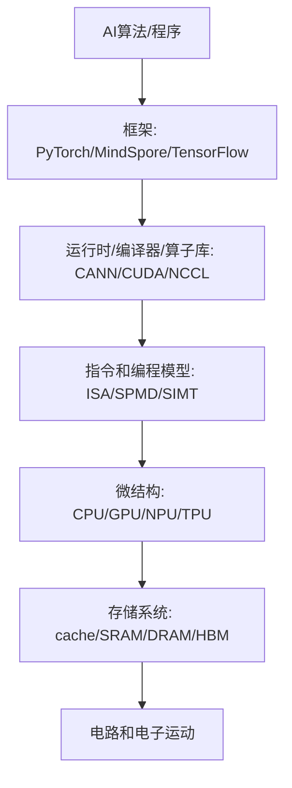
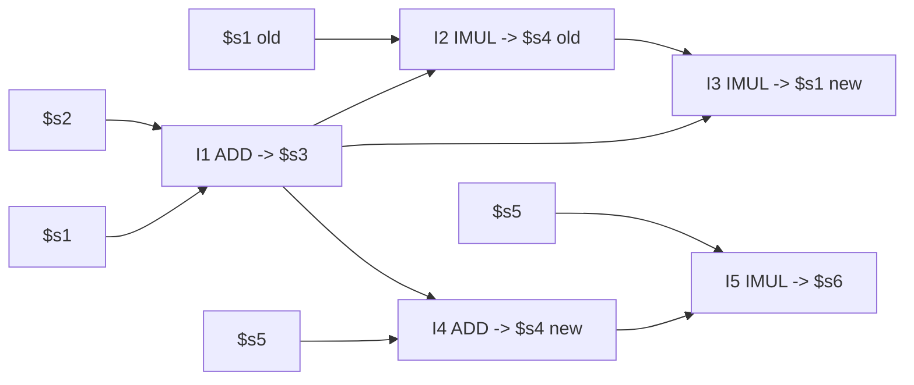

# 人工智能芯片与系统：完整细节覆盖版

这份文件是在 08_完整知识点讲解版 基础上的扩展版。它的目标不是精简，而是尽量把分章节讲义、图示补充、第 16 讲总复习映射、重点例题、以及 PPT 逐页抽取出的可考文本和表格细节放进同一份 PDF。

排除边界按老师说明执行：第 15 讲 FlashAttention 主体不纳入考试主干；明显研究拓展或历史案例不展开为主背内容，只保留其想说明的系统瓶颈。除此之外，课程主线知识、图中标签、表格字段、状态/时序/通信细节都尽量纳入。

# 第一部分：完整知识点讲解

这份讲义按第 16 讲总复习的脉络组织，同时回到 1-15 讲补充定义、公式、硬件结构、数据结构、通信模式和常见考法。你可以把它当作“从零开始的期末复习课”。

## 0. 这门课到底在讲什么

人工智能芯片与系统不是只讲“某个芯片长什么样”，也不是只讲“深度学习算法”。它讲的是：一个 AI 程序从高级框架写出来以后，如何一路变成芯片上的电路活动，并且为什么性能、能耗、带宽、通信会成为瓶颈。

课程主线可以理解为一条转换链：



### 0.1 为什么不能一上来只讲 AI 芯片

因为 AI 芯片仍然是计算机系统的一部分。你必须先理解：

- 为什么计算机会有“指令、寄存器、内存、流水线”这些抽象。
- 为什么程序看起来是顺序执行，底层却可能流水、乱序、并行。
- 为什么算力很高时，内存和通信反而变成瓶颈。
- 为什么深度学习加速器喜欢矩阵乘、低精度、片上 buffer、数据复用。
- 为什么训练大模型时，一个 GPU 不够，需要数据并行、流水并行、张量并行和 collective communication。

### 0.2 体系结构和微结构

狭义的 computer architecture 常指 ISA，也就是软件可见的接口：有哪些指令、寄存器、内存地址规则、异常机制。Microarchitecture 是 ISA 的实现方式：单周期、多周期、流水线、乱序、cache、分支预测、GPU warp 调度等。

同一个 ISA 可以有不同微结构。例如同样执行 `ADD`，可以：

- 单周期 CPU：一个很长的周期做完取指、译码、读寄存器、执行、写回。
- 多周期 CPU：一条指令拆成多个短周期。
- 流水线 CPU：多条指令在不同阶段重叠。
- 乱序 CPU：准备好的指令先执行，最后按程序顺序提交。

### 0.3 期末复习时最重要的能力

考试通常不会只问“背定义”。更可能考：

- 给你一个公式或硬件参数，让你算性能。
- 给你一串指令，让你判断 RAW/WAR/WAW、ROB、Tomasula 表、执行周期。
- 给你一个 cache 配置和地址序列，让你判定 hit/miss 和 miss 类型。
- 给你一个并行训练切分方式，让你说出需要 AllReduce、AllGather 还是 ReduceScatter。
- 给你一个硬件/算法场景，让你判断瓶颈在算力、访存、同步还是通信。

## 1. 性能模型：Amdahl、Roofline、Little、CPI

性能模型是这门课的第一根主线。你需要用它判断“优化哪里最有效”。

### 1.1 Amdahl's Law

Amdahl 定律回答的是：如果一个程序中只有一部分能被加速，那么总加速比最多是多少。

设程序中可被加速部分比例为 `f，这部分加速 S` 倍，则总加速比：

```text
Speedup = 1 / ((1 - f) + f / S)
```

关键含义：

- 串行部分会限制总加速比。
- 即使把某个部分加速到无限快，程序仍然要花 `1-f` 的时间。
- 因此系统优化不能只盯一个局部，要看整体瓶颈。

常见考法：给出“80% 可并行，加速 10 倍”，问总加速比。答案是 `1/(0.2+0.8/10)=3.57`。

### 1.2 Roofline Model

Roofline 是期末最重要性能模型之一。它回答：一个 kernel 的性能上限由算力限制还是内存带宽限制。

核心定义：

```text
Arithmetic Intensity (AI) = Total FLOPs / Total Memory Bytes
Attainable FLOP/s = min(Peak FLOP/s, AI * Peak Memory Bandwidth)
```

解释：

- `Peak FLOP/s` 是机器算力屋顶。
- `Peak Memory Bandwidth` 是内存带宽斜线的斜率。
- `AI` 越大，说明每搬一个 byte 能做更多计算，越可能 compute-bound。
- `AI` 越小，说明计算少、搬数据多，越可能 memory-bound。

判断规则：

```text
如果 AI * Bandwidth < Peak Compute，则 memory-bound
如果 AI * Bandwidth >= Peak Compute，则 compute-bound
拐点 AI* = Peak Compute / Bandwidth
```

### 1.3 Roofline 的三步

PPT 中强调 Roofline 的三个步骤：

1. Machine characterization：测机器的 peak compute 和 memory bandwidth。
2. Application characterization：算应用的 arithmetic intensity。
3. Application execution monitoring：测真实吞吐，看距离 roof 有多远。

优化方向：

- memory-bound：优先减少访存、提升局部性、用 cache/shared memory/tiling、提高数据复用。
- compute-bound：优先向量化、用 FMA、提高并行度、使用 tensor core/cube 等专用计算单元。
- 如果真实性能远低于 roof：说明还有额外问题，例如分支、同步、访存不合并、occupancy 低、cache miss 高。

### 1.4 PPT 中的 Roofline 例子

7-point stencil：

```text
Memory = 16 bytes/iteration
Compute = 7 flops/iteration
AI = 7 / 16 = 0.4375 flops/byte
```

STREAM Triad：

```text
Memory = 24 bytes/iteration
Compute = 2 flops/iteration
AI = 2 / 24 = 0.083 flops/byte
```

STREAM Triad 的 AI 更小，通常更 memory-bound。考题不会一定给原题，但你必须会：

- 数 FLOPs。
- 数 bytes。
- 算 AI。
- 代入 `min(peak, AI * bandwidth)`。
- 判断优化方向。

### 1.5 Little's Law

Little 定律：

```text
L = λ * W
```

其中：

- `L`：系统中平均有多少个请求。
- `λ`：吞吐率，单位时间完成多少请求。
- `W`：每个请求平均停留时间，也就是延迟。

硬件中的直觉：

```text
需要的并发请求数 = 目标吞吐率 * 单个请求延迟
```

例如内存访问延迟很长，如果想保持高带宽，就必须同时发出很多未完成请求。这也是 GPU 需要大量线程/warp 来隐藏内存延迟的根本原因。

### 1.6 CPI 和 CPU Time

基础公式：

```text
CPU time = Instruction Count * Average CPI * Clock Cycle Time
Average CPI = Σ(指令比例 * 该类指令CPI)
```

单周期 CPU：

- CPI = 1。
- 但 clock cycle time 很长，因为一个周期要容纳最慢指令。

多周期 CPU：

- 每类指令 CPI 不同。
- clock cycle time 可以变短。
- 平均 CPI 要按指令比例加权。

流水线 CPU：

- 理想情况下 CPI 接近 1。
- 真实情况下会有 structural/data/control hazards，导致 stall。

## 2. CPU 基础：冯诺依曼、ISA、单周期、多周期、流水线

### 2.1 冯诺依曼模型

冯诺依曼模型的关键性质：

- 程序和数据都存在内存中。
- CPU 按指令周期处理：fetch、decode、execute、memory、write back。
- 指令按程序顺序定义语义。
- ISA 定义软件可见状态：寄存器、PC、内存、指令格式。

抽象上，程序执行就是把 architectural state `AS 变成 AS'`。

### 2.2 单周期 CPU

单周期 CPU 每条指令一个周期完成。优点是概念简单，缺点是周期必须足够长，以便最慢指令也能完成。

典型数据通路包含：

- PC：保存当前指令地址。
- Instruction Memory：取指。
- Register File：读/写寄存器。
- ALU：算术逻辑。
- Data Memory：load/store。
- Control：根据 opcode 产生控制信号。

考试可能给一条 MIPS 指令，让你说数据从哪里流到哪里、控制信号如何设置。

### 2.3 多周期 CPU

多周期 CPU 把一条指令拆成多个阶段。优点：

- 每个周期更短。
- 不同指令可用不同周期数。
- 硬件单元可以在不同周期复用。

例如：

- load：取指、译码、地址计算、读内存、写回。
- store：取指、译码、地址计算、写内存。
- arithmetic：取指、译码、ALU、写回。
- branch：取指、译码、比较/改 PC。

### 2.4 流水线基本思想

流水线把指令处理拆成阶段，让多条指令重叠执行。经典五级：

```text
IF -> ID -> EX -> MEM -> WB
```

理想情况下，流水线填满后每周期完成一条指令，吞吐提高。但单条指令延迟不一定变短。

### 2.5 Pipeline hazards

三类 hazard：

1. Structural hazard：硬件资源冲突。例如同一个周期两条指令都要访问同一块 memory 或 register file 端口不够。
2. Data hazard：数据依赖导致后一条指令需要前一条结果。
3. Control hazard：分支跳转导致取错指令。

PPT 中重点讲 data dependence：

- RAW = Read After Write，真依赖/flow dependence。后指令读前指令写的值。
- WAR = Write After Read，反依赖/anti dependence。后指令写的寄存器是前指令要读的寄存器。
- WAW = Write After Write，输出依赖/output dependence。两条指令写同一寄存器，写入顺序必须正确。

RAW 是真正的数据依赖，不能靠改名消除；WAR/WAW 是 false dependence，来自 architectural register 名字不够，可以靠 register renaming 消除。

### 2.6 处理 data hazard：stall、compiler、forwarding

三种基本方法：

- Hardware stall：硬件检测到依赖，暂停后一条指令。
- Compiler scheduling：编译器插入 NOP 或重排独立指令。
- Forwarding/bypassing：结果尚未写回寄存器时，直接从后级流水线转发给前级使用。

Forwarding 不是万能的。例如 load-use hazard 中，数据要到 MEM 后才出来，下一条紧跟使用时可能仍需 stall。

### 2.7 精确异常 precise exception

Precise exception 的含义：发生异常时，architectural state 看起来像是按程序顺序执行到某条指令边界：

- 异常之前的指令都已经提交。
- 异常之后的指令都没有改变 architectural state。
- PC、寄存器、内存状态一致。

这就是为什么乱序执行还需要 in-order commit。

## 3. ROB、Tomasula、乱序执行

这是老师额外强调的重点，必须会表格和更新规则。

### 3.1 为什么需要 ROB

Reorder Buffer 的作用：

- 支持 out-of-order completion，但 in-order retirement/commit。
- 保存未提交指令的结果。
- 保证 precise exception。
- 通过把 architectural register 映射到 ROB entry，消除 WAR/WAW false dependence。

PPT 中 ROB 的基本流程：

1. Decode 时按程序顺序分配 ROB entry，并重命名目的寄存器。
2. 指令执行完成后，可以乱序把结果写入 ROB entry。
3. 当指令成为 ROB 中最老指令且无异常，按程序顺序 commit，把结果写入 register file 或 memory。

ROB entry 通常要保存：

- 指令类型。
- 目的寄存器或 store 地址。
- 结果值。
- ready/valid bit。
- exception 状态。
- 程序顺序信息。

### 3.2 只有 ROB 还不够

只有 ROB 的 in-order dispatch 机器可以消除 false dependence，但遇到 true dependence 时，年轻的独立指令仍可能被挡住。问题是：

```text
ADD 依赖一个长延迟 load，后面的独立指令也无法越过它去执行。
```

解决：reservation station，让等待数据的指令先进入“等待区”，独立指令可以继续进入并在 ready 后先执行。

### 3.3 Reservation Station 的含义

Reservation Station 是功能单元前的等待队列/缓冲区。它保存一条已经发射但还没开始执行或正在等待操作数的指令。

核心思想：

- 依赖指令不要堵住流水线前端。
- 操作数 ready 的指令可以按 dataflow order 执行。
- 指令执行顺序由“数据是否 ready”决定，而不是完全由程序顺序决定。

RS entry 常见字段：

```text
Busy / Op / DestTag
Source1: V, Tag, Value
Source2: V, Tag, Value
```

PPT 中简化为：

```text
Source 1: V, Tag, Value
Source 2: V, Tag, Value
```

含义：

- `V=1：这个源操作数的值已经 ready，直接看 Value`。
- `V=0：值还没 ready，需要等某个 producer，producer 的名字在 Tag`。
- `Tag`：不是寄存器名，而是 producer 的 reservation station entry 或 ROB entry。
- `Value`：操作数真实数值。

### 3.4 Register Rename Table / Register Alias Table

Register Rename Table 记录 architectural register 当前最新值在哪里。

PPT 中字段：

```text
Register | Valid | Tag | Value
```

含义：

- `Valid=1：该寄存器当前 architectural value 已经在 register file，可以直接读 Value`。
- `Valid=0：该寄存器将由某个尚未完成的指令产生；Tag` 指向那个 producer。
- `Tag`：RS entry 或 ROB entry 的编号。
- `Value`：当 valid 时保存寄存器值。

为什么能消除 WAR/WAW：

- 同一个寄存器名在不同时刻可以被重命名为不同 tag。
- 后续消费者不再看“寄存器名”，而看“产生它的 tag”。
- 写回时只有 tag 匹配当前 rename table 的项，才更新 register file；否则说明这个结果已经被更新的写者覆盖，不能把老值写回。

### 3.5 Tomasula 的四个阶段

按 PPT 整理：

1. ID/Issue/Rename：
   - 如果有空 RS entry，指令占用一个 RS。
   - 对每个源寄存器：若 RF/RAT valid=1，则把值复制到 RS 的 source.value，并置 source.V=1；否则把 producer tag 复制到 RS.source.tag，并置 source.V=0。
   - 对目的寄存器：把 RAT 的 tag 改成当前 RS/ROB tag，valid 置 0。
   - 如果没有空 RS，则 stall。

2. RS 等待和 wakeup：
   - RS 监听 Common Data Bus (CDB)。
   - 如果 CDB 上广播的 tag 等于某个 source.tag，就抓取 value，把 source.V 置 1。

3. Dispatch/Execute：
   - 当所有 source.V 都为 1，且对应功能单元可用，该指令可以发给 FU。
   - 这就是 wakeup and select。

4. Writeback/Broadcast：
   - FU 产生结果后，在 CDB 上广播 `(tag, value)`。
   - RAT/RF 如果当前 tag 匹配广播 tag，则写入 value 并 valid=1。
   - 所有 RS 也用广播 tag 更新等待的 source。

如果加上 ROB，还要区分“写回临时结果”和“提交 architectural state”：

- 执行完成：结果进 ROB。
- commit：ROB 头部 ready 且无异常，才写 architectural register/memory。

### 3.6 两个 hump

现代乱序流水线的两个关键 hump：

- Hump 1：Reservation stations，实现 in-order issue 后的 out-of-order dispatch/execute。
- Hump 2：Reorder buffer，实现 out-of-order completion 后的 in-order commit。

### 3.7 Tomasula 必背总结

```text
Register renaming eliminates false dependences.
Reservation stations buffer waiting instructions.
Tag broadcast communicates produced values to consumers.
Wakeup and select enables out-of-order dispatch.
ROB enables precise exception through in-order commit.
```

## 4. Superscalar、SIMD、Multithreading、Multicore

### 4.1 Superscalar

Superscalar 指一个周期可以发射/执行多条指令。它提高 instruction-level parallelism，但硬件复杂度高：

- 需要多端口 register file。
- 需要更复杂依赖检测。
- 需要多个功能单元。
- 需要更宽的 fetch/decode/issue/commit。

对 Roofline 的影响：

- 可能提高 peak compute roof。
- 如果应用 memory-bound，单纯提高 superscalar 宽度不一定有用。

### 4.2 Flynn 分类

- SISD：单指令单数据，传统顺序机。
- SIMD：单指令多数据，一条指令同时处理多个数据。
- MISD：多指令单数据，实际少见，PPT 提到最接近形式可联系 systolic/streaming。
- MIMD：多指令多数据，多核/多处理器。

### 4.3 SIMD

SIMD 的直觉：一个操作对多个数据元素重复执行。例如 256-bit AVX2 可以一次处理 8 个 32-bit float。

优点：

- 控制开销低。
- 数据级并行高。
- 提高 peak FLOP/s。

限制：

- 需要数据规整。
- 分支/不规则访存会降低利用率。
- 受向量宽度影响。

### 4.4 Fine-grained multithreading

细粒度多线程通过在多个线程/warp 间切换，隐藏长延迟操作。GPU 的 warp-level FGMT 是典型例子：

- 一个 warp 等内存时，调度另一个 ready warp。
- 需要大量线程上下文保存在 register file 中。
- 用吞吐换延迟隐藏。

### 4.5 Multicore

多核相比超大单核：

- 更容易扩展吞吐。
- 每个小核简单、能效更好。
- 需要处理共享 cache、DRAM、公平性、coherence/consistency。

## 5. 存储系统：SRAM、DRAM、HBM、SSD 与数据移动瓶颈

### 5.1 理想存储不存在

理想存储需要四个性质：

- zero latency。
- infinite capacity。
- infinite bandwidth。
- zero cost。

现实中这些目标相互矛盾：

- 越大通常越慢。
- 越快通常越贵。
- 越高带宽需要更多 bank、port、channel 或更先进技术。

### 5.2 存储技术比较

从快到慢、从小到大大致是：

```text
Register/FF -> SRAM -> HBM/DRAM -> SSD -> Disk
```

PPT 中的典型数量级：

- SRAM：KB-MB，纳秒级，贵，片上 cache/shared memory/buffer。
- DRAM：GB，约几十 ns，便宜，主存。
- HBM：容量比片上 SRAM 大，带宽远高于普通 DDR，常在 GPU/NPU 上。
- SSD：TB，延迟更高，吞吐低于 HBM/DRAM，但容量大。

### 5.3 数据移动比计算更贵

PPT 给出的能耗表强调：

- 32-bit integer ADD 约 0.1 pJ。
- SRAM cache 约 5 pJ，约 50 倍。
- DRAM 约 640 pJ，约 6400 倍。

所以 AI 加速器设计的核心不是“只堆算力”，而是减少数据搬运：

- 尽量在片上复用数据。
- 用 tiling/blocking。
- 用 scratchpad/global buffer。
- 用低精度减少字节数。
- 用算子融合减少中间结果写回 HBM。

### 5.4 SRAM

SRAM 位单元通常由交叉耦合反相器保存数据，再用访问晶体管连接 bitline。特点：

- 快。
- 不需要 refresh。
- 成本高、面积大。
- 适合片上 cache、GPU shared memory、AI accelerator on-chip buffer。

Banking：

- 把存储分成多个 bank。
- 不同 bank 可并行访问。
- 若多个访问落到同一个 bank，就发生 bank conflict。

### 5.5 DRAM

DRAM 单元由电容和访问晶体管构成。特点：

- 密度高，容量大。
- 电容会漏电，需要 refresh。
- 读操作会破坏电荷，需要感放和恢复。
- 访问延迟较高。

DRAM 层次：

```text
Channel -> DIMM -> Rank -> Chip -> Bank -> Row/Column
```

DRAM bank 有 row buffer。三种访问状态：

- Row buffer hit：要访问的 row 已经打开，延迟最低。
- Row closed/conflict：要打开新 row，可能需要 precharge 和 activate，延迟更高。
- Refresh 冲突：refresh 期间 bank/rank 不可用，访问延迟变长。

### 5.6 HBM

HBM 把多层 DRAM die 堆叠在一起，通过硅中介层和 GPU/NPU 靠近连接。优点：

- 很高带宽，PPT 中提到每 stack 可达约数百 GB/s。
- 与加速器距离近，适合高吞吐 AI 计算。

缺点：

- 成本高。
- 容量仍有限。
- 封装复杂。

## 6. Cache、Coherence、Consistency

### 6.1 为什么 cache 有用

Cache 利用 locality：

- Temporal locality：刚访问过的数据很可能很快再次访问。
- Spatial locality：访问某地址附近的数据也可能被访问。

Cache block/line 是 cache 管理的基本单位。访问某个地址 miss 时，通常把整个 block 搬入 cache。

### 6.2 Cache 设计三问

1. Placement：一个 memory block 可以放到 cache 的哪里？
2. Replacement：cache 满了替换谁？
3. Write policy：写操作如何处理？

### 6.3 三种映射

Direct-mapped：

- 一个 memory block 只能放一个 cache line。
- 硬件简单、快。
- 容易 conflict miss。

Fully associative：

- 一个 memory block 可放任意 cache line。
- 冲突最少。
- 硬件比较复杂，需要多路 tag 比较。

N-way set-associative：

- cache 分成多个 set，每个 set 有 N 个 way。
- block 先由 index 定位 set，再在 N 个 way 中选择。
- 是直接映射和全相联之间的折中。

公式：

```text
Cache data capacity C
Block size b
Number of cache blocks B = C / b
Associativity N
Number of sets S = B / N
Offset bits = log2(b)
Index bits = log2(S)
Tag bits = address bits - index bits - offset bits
```

### 6.4 Miss 类型

- Compulsory/cold miss：第一次访问该 block，无法避免。
- Capacity miss：cache 总容量不够，即使全相联也放不下工作集。
- Conflict miss：总容量够，但映射到同一 set/line 发生冲突。

判断技巧：

- 第一次出现一定是 compulsory。
- 如果 fully associative 同容量也 miss，可能是 capacity。
- 如果 fully associative 能 hit，而 direct/set-assoc miss，就是 conflict。

### 6.5 Replacement

Set-associative cache 中 miss 后如果 set 满了，要选 victim：

- Invalid block first。
- Random。
- FIFO。
- LRU。
- Pseudo-LRU。
- Belady OPT 理论最优：替换未来最晚再访问的 block，但实际无法在线实现。

注意：LRU 不总是最好。若 4-way cache 循环访问 A/B/C/D/E，LRU 可能一直 thrashing。

### 6.6 Write policy

两个维度：

写 miss 时：

- Write-allocate：先把 block 读入 cache，再写。
- Write-no-allocate：直接写内存，不放 cache。

写 hit 时：

- Write-back：先写 cache，等 eviction 时写回内存。需要 dirty bit，节省带宽。
- Write-through：同时写 cache 和 memory。简单但带宽压力大。

### 6.7 Cache performance

常见公式：

```text
AMAT = Hit time + Miss rate * Miss penalty
```

注意题目可能说“miss access time”而不是“miss penalty”。若 miss access time 是 miss 总访问时间，则：

```text
AMAT = HitRate * HitTime + MissRate * MissTime
```

若 miss penalty 是额外惩罚，则用 `HitTime + MissRate * MissPenalty`。

### 6.8 Private vs shared cache

Private cache：

- 每个 core 有自己的 cache。
- 低延迟。
- 多个 cache 可能保存同一 block，需要 coherence。

Shared cache：

- 多个 core 共用。
- 容量可动态共享。
- coherence 更简单。
- 访问更慢，且不同 core 会相互污染 cache。

### 6.9 Coherence vs Consistency

这是易混点。

Cache coherence：

- 关注不同处理器对同一个 memory location 的操作顺序。
- 本质是“同一个地址的最后写入值，各 core 看到要一致”。

Memory consistency：

- 关注不同处理器对所有 memory locations 的操作顺序。
- 本质是“多地址操作在全局上以什么顺序可见”。

Coherence 的三个特征：

- Program order preservation：同一 core 写 X 后读 X，应读到自己写的值。
- Coherent memory view：一个 core 写 X 后，足够长时间后其他 core 能读到新值。
- Write serialization：多个 core 对同一地址的写，所有 core 看到的顺序一致。

### 6.10 MSI

MSI 三态：

- I Invalid：cache 中没有有效副本。
- S Shared：一个或多个 cache 有干净副本，可读。
- M Modified：只有一个 cache 有该 block，且已修改，可读写。

问题：MSI 中第一次 read miss 后进入 S，即使实际上只有一个副本。随后本地写还要发 invalidate，可能多余。

### 6.11 MESI

MESI 加入 E Exclusive：

- E：只有一个 cache 有干净副本。
- 在 E 状态本地写可以无 bus action 地变成 M。
- 远程 read miss 会使 E 变 S。
- 远程 write miss 会使 E 变 I。

MESI 相比 MSI 减少了独占干净数据上的无用 invalidate。

### 6.12 Snoop vs Directory

Snoop-based：

- 基于 bus。
- 每个 bus action 广播给所有 cache。
- bus 是全局串行点。
- 简单但扩展性差。

Directory-based：

- directory 记录每个 block 被哪些 cache 持有。
- local node 发 getS/getEx 给 home node。
- directory 决定是否发 invalidate、是否从 memory 或其他 cache 取数据。
- 每个 block 有自己的 serialization point，更可扩展。

Directory entry 可包含：

- 状态位。
- owner。
- sharer bit vector。

## 7. GPU 架构与优化

### 7.1 CPU 和 GPU 的关系

CPU：

- 少量强核。
- 大 cache。
- 擅长复杂控制流、低延迟任务。

GPU：

- 大量简单计算单元。
- 高内存带宽。
- 擅长规则数据并行、高吞吐任务。

GPU 本质上是 SIMD/SIMT 机器，但程序员写的是线程。

### 7.2 Programming model vs hardware execution model

Programming model 是程序员看到的模型，例如 CUDA 的 thread/block/grid。

Hardware execution model 是硬件实际如何执行，例如 SIMT、warp、SM、scheduler。

PPT 重点：

- GPU 用 SPMD 编程：Single Program Multiple Data。
- 每个线程执行相同 kernel，但处理不同数据。
- 硬件把线程动态分组成 warp。
- Warp 中线程 lock-step 执行同一指令。

### 7.3 CUDA 基本概念

- Kernel：在 GPU 上执行的函数。
- Thread：最小编程执行单元。
- Block：线程组；同一个 block 内可共享 shared memory，可用 `__syncthreads()` 同步。
- Grid：一次 kernel launch 中所有 blocks。
- `threadIdx`：线程在 block 内编号。
- `blockIdx`：block 在 grid 中编号。
- `blockDim`：每个 block 的线程数。

常见一维索引：

```c
int i = blockIdx.x * blockDim.x + threadIdx.x;
if (i < N) { ... }
```

若 N 不是 block size 的整数倍，要 launch 多一点线程，并用边界判断过滤。

### 7.4 SIMT 与 warp

SIMT = Single Instruction Multiple Thread。

Warp：

- 通常 32 个连续线程。
- 是硬件调度基本单位。
- 同一个 warp 中线程同一时刻执行同一指令。

传统 SIMD 和 warp-based SIMD 区别：

- 传统 SIMD 对程序员暴露向量宽度。
- GPU 程序员写标量线程，硬件动态把线程分成 warp。
- SIMT 可以把每个线程当作独立上下文，也能把同指令线程合并执行。

### 7.5 Branch divergence

如果同一个 warp 中不同线程走不同分支，就发生 divergence。硬件通常串行执行各分支路径，并 mask 掉不活跃线程，导致利用率下降。

优化原则：

- 尽量让同 warp 线程走相同控制流。
- 用 `threadIdx.x < 32 这类 warp-aligned 条件比 threadIdx.x % 2 == 0` 更好。

### 7.6 Latency hiding and occupancy

GPU 不靠让单个内存访问变快，而靠大量 warp 隐藏延迟。

Fine-grained multithreading：

- 当一个 warp 等内存时，scheduler 切换到另一个 ready warp。
- 足够多 active warps 才能隐藏长延迟。

Occupancy：

- SM 上 active warps/blocks 与硬件最大值的比例。
- occupancy 太低会导致延迟隐藏不足。
- occupancy 受 registers、shared memory、block size 等限制。

### 7.7 GPU memory hierarchy

CUDA 程序常见内存：

- Global memory：HBM/DRAM，容量大，延迟高。
- Shared memory：片上 scratchpad，block 内共享，快，但容量小。
- Registers：每线程私有，最快。
- Constant/texture memory：特殊用途。
- L1/L2 cache：硬件管理。

优化核心：减少 global memory 访问，提升 coalescing，用 shared memory 做数据复用。

### 7.8 Memory coalescing

当一个 warp 中线程访问连续地址，硬件可合并成少数 memory transaction。若访问分散，需要多个 transaction，带宽利用率低。

规则直觉：

- 连续线程访问连续数据最好。
- stride 访问、乱序访问、非对齐访问会降低 coalescing。

### 7.9 Shared memory bank conflict

Shared memory 分成多个 bank。若同一 warp 中多个线程访问同一个 bank 的不同地址，会发生 bank conflict，访问被串行化。

PPT 中强调：

- Bank conflict 只在 warp 内考虑。
- 常见 bank 映射可近似理解为 `bank = address % number_of_banks`。
- 可以通过 padding、改变 layout、XOR/hash 等减少冲突。

### 7.10 Tiled matrix multiplication

Naive matrix multiplication 每个输出元素反复从 global memory 读 A 和 B。Tiling 的思想：

1. 每个 block 负责 C 的一个 tile。
2. 把 A 和 B 的小 tile 搬到 shared memory。
3. `__syncthreads()` 等所有线程加载完。
4. 在 shared memory 上反复复用数据做乘加。
5. 再加载下一块 tile。

这对应 Roofline 中提高 AI：同样的 global memory bytes 支撑更多 FLOPs。

### 7.11 Reduction 和 atomic

Reduction 要把多个元素合并为一个结果。优化点：

- tree-based reduction 减少串行依赖。
- shared memory 减少 global memory 访问。
- warp shuffle/unrolling 减少同步开销。
- atomic 可避免 data race，但冲突高时会慢。

### 7.12 CUDA streams、异步拷贝、TMA

CUDA streams 是命令队列，可用于重叠数据传输和计算。

新 GPU 支持 global memory 到 shared memory 的异步拷贝，如 LDGSTS/TMA：

- 减少 register 中转。
- TMA 可更高效搬运大块多维数据。
- 目标仍然是让计算单元少等数据。

## 8. AI 加速器

### 8.1 为什么需要 AI 加速器

深度学习有几个特点：

- 大量矩阵乘、卷积、向量运算。
- 可容忍一定低精度。
- 数据复用机会大。
- 内存带宽和能耗是瓶颈。

CPU 通用性强，但为复杂控制和通用程序付出面积/能耗；AI 加速器牺牲部分通用性，换更高能效。

### 8.2 深度学习算子特点

卷积层：

- 核心是滑动窗口乘加。
- 计算量大。
- input feature map、weight、output feature map 都有复用。
- 可转成矩阵乘实现。

激活函数：

- 逐元素操作。
- 计算简单，访存相对占比高。

池化：

- 局部窗口取 max/avg。
- 计算不复杂，但要读多个输入。

全连接：

- 本质矩阵向量/矩阵矩阵乘。
- weight 量大。

Attention：

- 核心是矩阵乘，例如 QK^T、softmax、PV。
- 标准 attention 计算复杂度约 `O(S^2 D)`。
- 中间 score/probability 矩阵内存复杂度约 `O(S^2)`。

第 15 讲 FlashAttention 不考，但它的思想可作为理解内存瓶颈的例子：不改变理论计算量，而通过 tiling 避免完整 `S x S` 矩阵写入 HBM，用更多片上复用减少数据搬运。

### 8.3 AI 加速器设计原则

从 PPT 抽象出的核心原则：

- 使用简单并行计算模块满足领域需求，例如矩阵乘单元。
- 使用低精度减少数据尺寸和能耗。
- 使用片上 buffer/scratchpad 减少外部内存访问。
- 针对数据流组织复用。
- 提供运行时/算子库/编译器，让程序员能使用硬件。

### 8.4 Cache or Buffer

CPU 喜欢 cache：

- 程序透明。
- 硬件自动管理。
- 适合不可预测访问。

AI 加速器喜欢 buffer/scratchpad：

- 程序/编译器显式管理。
- 可控数据搬运。
- 去掉复杂 tag、coherence、replacement 逻辑。
- 更适合规则张量计算。

缺点是编程更难，需要知道数据在哪个 buffer。

### 8.5 数据流：WS、OS、IS、RS

目标：减少 global buffer/HBM 访问，最大化片上复用。

Weight Stationary：

- weight 尽量停留在 PE/阵列中。
- input/output 流过。
- 适合权重复用高的场景，例如 TPU systolic array。

Output Stationary：

- partial sum/output 留在 PE 中不断累加。
- 减少部分和反复写回。

Input Stationary：

- input 留在本地，复用多个 weight。

Row Stationary：

- 尝试综合利用 input、weight、partial sum 的复用。

考试可能问“stationary 是什么意思”：不是数据完全不动，而是某类数据尽量保持在低层存储/PE，减少昂贵搬运。

### 8.6 Ascend/Davinci Core

PPT 中 Ascend AI Core 关键模块：

- Cube：矩阵运算核心。负责高吞吐矩阵乘，如 FP16 16x16 矩阵乘，int8 可支持不同形状。
- Vector：向量运算，多面手，支持 FP16/FP32/int32/int8 等，处理激活、逐元素、格式转换等。
- Scalar：小 CPU/司令部，负责循环控制、分支、地址和参数计算。
- MTE：数据搬运引擎。
- L0A/L0B/L0C、UB、Scalar Buffer：不同层级片上存储。

重点不是背每个硬件细节，而是理解：

```text
Cube 做密集矩阵乘
Vector 做逐元素/后处理
Scalar 做控制
MTE 做搬运
Buffer 承载显式数据复用
```

### 8.7 TPU 和 systolic array

Systolic array 的基本原则：

```text
用规则 PE 阵列替代单个 PE，并精心安排数据在 PE 间流动。
```

像心脏泵血一样，数据有节奏地从一个 PE 流到下一个 PE。优点：

- 规则结构，适合 VLSI。
- 局部通信，减少全局连线。
- 高数据复用。
- 适合矩阵乘/卷积。

TPU v1 使用大规模矩阵乘单元。PPT 中提到：

- TPU1 有 256 x 256 matrix multiply unit。
- TPU2/TPU3 有两个 128 x 128 matrix multiply units。
- TPU 从 v1 到 v2/v3 增强训练能力、HBM、vector unit、interconnect。

### 8.8 低精度

为什么低精度可行：

- ML 任务常容忍近似。
- 推理中 int8 量化常可保持可接受精度。
- 训练中 FP16/BF16/TF32/FP8 等降低带宽和算力压力。

硬件支持低精度的意义：

- 每次搬运更少 bytes。
- 同样面积/功耗下更多 MAC。
- 降低能耗。

注意：低精度不是随便降。不同模型、层、任务需要不同精度；过低会损失精度或收敛质量。

## 9. Runtime、CANN、MindSpore、算子和图优化

### 9.1 为什么需要 AI Framework

AI 任务变化多，但建立在共同算子上。框架把常用操作封装，降低开发复杂度，并把模型交给后端编译/运行时优化。

典型层次：

```text
AI Framework: MindSpore/PyTorch/TensorFlow
Runtime/Compiler/Graph Engine: CANN/GE/CUDA runtime
Operator Library: NN/CUBLAS/cuDNN/Ascend NN
Hardware: GPU/NPU/TPU
```

### 9.2 Tensor 和算子

Tensor 是多维数组。CNN feature map 常用 4D 格式，例如 NCHW 或 NHWC。

Operator 是计算图节点，例如 Conv、Pool、ReLU、MatMul、AllReduce。一个网络就是多个算子组成的图。

### 9.3 CANN 算子开发

PPT 中比较：

- TBE DSL：Python，封装高，适合简单向量/矩阵/池化算子，入门低。
- TIK：Python API，手工控制数据搬运和 schedule，灵活但难，性能潜力更高。
- AI CPU：C++，用于 AI Core 不适合或临时打通场景，性能较低。

### 9.4 Graph Engine

GE 的阶段：

- 图准备：构建计算图，shape 推导。
- 图拆分：子图切分和边界连接。
- 图优化：算子融合、权值格式转换、allreduce 聚合等。
- 图编译：资源分配和 task 生成。
- 图加载：加载到 runtime。
- 图执行：runtime 调度执行。

### 9.5 算子融合

算子融合把多个小算子合并成一个大算子，减少中间结果写回主存。

例子：

```text
Conv2D -> BatchNorm -> ReLU
融合为 Conv2D_BatchNorm_ReLU
```

未融合：

- Conv 写主存。
- BN 读主存再写主存。
- ReLU 读主存再写主存。

融合：

- 数据进片上 buffer 后连续完成多个操作。
- 减少 HBM/DRAM 读写。

### 9.6 MindSpore 关键技术

PPT 中列出：

- 自动并行：整图切分，结合数据并行和模型并行，考虑集群拓扑，降低通信。
- 二阶优化：利用二阶信息改善梯度方向，加快收敛。
- 动静态图结合：兼顾开发灵活性和执行效率。
- AI+科学计算：拓展框架边界。

期末更可能考概念关系，而不是深挖框架 API。

## 10. 并行训练

这是老师点名重点，尤其 tensor parallel 和 AllReduce。

### 10.1 神经网络训练一轮

一个 layer 的训练包括：

1. Forward pass：
   - 输入 activation `X`。
   - 用 weight `W 计算输出 activation Y`。

2. Backward pass：
   - 输入来自后一层的 activation gradient `dY`。
   - 计算 weight gradient `dW`，用于更新参数。
   - 计算 activation gradient `dX`，传给前一层。

3. Weight update：
   - SGD：`W = W - lr * dW`。
   - Adam 等优化器还要维护 optimizer states。

### 10.2 为什么需要 distributed training

原因：

- 模型参数太大，单卡显存放不下。
- activation、gradient、optimizer state 占显存。
- 数据集和训练时间巨大，需要多卡提高吞吐。
- 单卡算力/带宽有限。

### 10.3 Data Parallel

Data parallel：

- 每个 worker 有完整模型副本。
- minibatch 被切成多份，每个 worker 处理一部分数据。
- Forward 不需要通信。
- Backward 每个 worker 产生局部梯度。
- Weight update 前要把所有 worker 的梯度求和/平均。

通信：

```text
AllReduce of gradients/weights
```

优点：

- 简单。
- 适合模型能放进单卡的情况。

挑战：

- AllReduce 通信量大。
- batch size 变大后可能影响收敛。
- optimizer state 在每张卡上重复，占显存。

### 10.4 Ring AllReduce

Ring AllReduce 两阶段：

1. ReduceScatter：`N-1 轮，每轮每个 worker 发送/接收 M/N` 数据。
2. AllGather：`N-1 轮，每轮每个 worker 发送/接收 M/N` 数据。

总轮数：

```text
2(N - 1)
```

每个 worker 总发送量：

```text
2(N - 1) * M/N = 2M(N-1)/N
```

其中：

- `N` 是 GPU/worker 数。
- `M` 是需要 AllReduce 的数据大小。

N=4 时：

- ReduceScatter 3 轮。
- AllGather 3 轮。
- 总 6 轮。
- 每个 worker 每轮发 `M/4，总发 6M/4=1.5M`。

### 10.5 Pipeline Parallel

Pipeline parallel：

- 把模型不同层放到不同 worker。
- 一个 minibatch 分成 microbatches，让流水线填起来。

通信：

- forward 传 activations。
- backward 传 activation gradients。
- 是相邻 stage 的 point-to-point communication。

挑战：

- pipeline bubbles，硬件空闲。
- stage 之间 load imbalance。
- 通信难完全 overlap。

GPipe 用 microbatch 减少 bubble，但 bubble 仍存在。

### 10.6 Tensor Parallel

Tensor parallel / intra-layer parallel：

- 把同一层的 weight 切到多个 worker 上。
- 每个 worker 负责该层计算的一部分。
- 解决单层太大或单卡算力不足问题。

重点是 row-wise 和 column-wise partitioning。

#### 10.6.1 Row-wise partitioning

按 weight 的行切：

```text
W = [W0; W1; W2; ...]
```

每个 worker：

- 拿到一部分 weight rows。
- 通常需要完整 input activation `X`。
- 计算一部分 output activation `Y_i`。

结果：

- output activation 被分片。
- 如果下一层需要完整 `Y`，就要 AllGather。

PPT 对应通信：

```text
Row-wise forward communication: AllGather between layers
```

#### 10.6.2 Column-wise partitioning

按 weight 的列切：

```text
W = [W0, W1, W2, ...]
```

每个 worker：

- 拿到一部分 weight columns。
- 输入 activation 也可按对应列/特征分片。
- 计算对输出的 partial sum。

因为每个 worker 只算了输出的一部分贡献，需要把 partial sums 加起来。

PPT 对应通信：

```text
Column-wise forward communication: ReduceScatter between layers
```

若每个 worker 都需要完整输出，则可能是 AllReduce；若下一层能接受分片输出，则 ReduceScatter 更合适。

### 10.7 Alternating Partitioning

交替切分的核心：让一层输出的分片形式正好成为下一层需要的输入分片，从而减少层间通信。

典型模式：

```text
Layer K: row-wise
Layer K+1: column-wise
```

row-wise 产生的 `Y_i` 分片可直接作为 column-wise 下一层的输入分片，因此两层之间不需要 AllGather。

但连续多层交替后，某些边界仍需要通信，例如 AllReduce 或 ReduceScatter，取决于下一层期望的 activation 布局。

PPT 总结：

- Data parallel：AllReduce of weights/gradients，可与计算 overlap。
- Pipeline parallel：point-wise communication of activations and activation gradients，难 overlap，难 load-balance。
- Tensor/intra-layer parallel：AllGather、ReduceScatter of activations and activation gradients；若 row-wise 和 column-wise 交替，可能出现 AllReduce。

### 10.8 ZeRO

ZeRO = Zero Redundancy Optimizer。

普通 data parallel 中，每张 GPU 都保存完整：

- parameters。
- gradients。
- optimizer states。

ZeRO 的思想：

- 每张 GPU 只保存 optimizer states 等状态的一部分。
- 减少显存冗余。

代价：

- 需要更多通信。
- 需要在显存节省和通信开销之间权衡。

### 10.9 Batch size 限制

大 batch 可提高吞吐，但不是无限好：

- BatchNorm 等可能需要足够 batch。
- 过大 batch 可能影响泛化/收敛。
- 大模型训练受显存限制，microbatch、gradient accumulation、parallelism 都是在折中显存、算力和通信。

## 11. 考前必背速查

### 11.1 公式

```text
Amdahl: Speedup = 1 / ((1-f) + f/S)
Little: L = λW
CPU time = IC * CPI * CycleTime
Average CPI = Σ fraction_i * CPI_i
Roofline: Attainable FLOP/s = min(Peak FLOP/s, AI * Bandwidth)
AI = FLOPs / Bytes
AMAT = HitTime + MissRate * MissPenalty
Cache blocks B = C / b
Sets S = B / Associativity
Ring AllReduce rounds = 2(N-1)
Ring AllReduce per-worker bytes = 2M(N-1)/N
```

### 11.2 易混概念

| 概念 A | 概念 B | 区别 |
|---|---|---|
| ISA | Microarchitecture | ISA 是软件可见接口；微结构是实现方式 |
| Latency | Throughput | 单个任务耗时 vs 单位时间完成多少任务 |
| RAW | WAR/WAW | RAW 是真依赖；WAR/WAW 是名字造成的 false dependence |
| ROB | RS | ROB 保证按序提交/精确异常；RS 等待操作数并乱序发射 |
| Cache | Buffer/Scratchpad | cache 硬件自动管理；buffer 显式管理 |
| Coherence | Consistency | 同一地址顺序 vs 所有地址全局顺序 |
| SIMD | SIMT | SIMD 暴露向量；SIMT 写线程，硬件组 warp |
| Data Parallel | Tensor Parallel | 切 batch vs 切模型参数/层内矩阵 |
| AllGather | ReduceScatter | 收集完整分片 vs 归约后分发分片 |
| AllReduce | ReduceScatter+AllGather | AllReduce 可由这两阶段组成 |

### 11.3 不要犯的错

- Roofline 中不要只看 peak FLOP/s，必须看 AI 和 bandwidth。
- Tomasula 中不要把 architectural register 名当作 producer；重命名后依赖看 tag。
- RS 中 `V=0` 时不要看 value，要等 tag 广播。
- ROB commit 必须按程序顺序，不是哪个先算完哪个先写 architectural state。
- cache 题先算 block number，再算 index/tag，不要直接用 byte address 做 index。
- 第一次访问某 block 一定是 compulsory miss。
- Row-wise/column-wise tensor parallel 的通信不要混：row-wise 产生 output shards，常 AllGather；column-wise 产生 partial sums，常 ReduceScatter/AllReduce。
- Ring AllReduce 总轮数是 `2(N-1)，不是 N`。

# 第二部分：逐讲图示与细节补充

这份补充讲义专门弥补第一版资料的不足：PPT 中大量知识不是写成段落，而是藏在结构图、时间表、状态表、数据流箭头和硬件框图里。复习时不要只背文字，要能把图读成“谁产生数据、谁消费数据、什么时候通信、什么时候 stall、状态如何变化”。

## 0. 资料覆盖与使用方法

|---|---:|---:|---:|---|

2. 遇到不懂的图，回到对应讲次的详细页：CPU 看第 1-4 讲，存储/cache 看第 5、8-10 讲，GPU 看第 6-7 讲，AI 加速器看第 11-13 讲，并行训练看第 14-15 讲。

## 1. 读图总方法

### 1.1 系统分层图

系统分层图不是背景介绍，而是整门课的总逻辑。最上层是问题、算法和程序，最下层是逻辑门、器件和电子。中间依次经过编程语言、系统软件、ISA、微结构和硬件。考试中如果问“为什么学 AI 芯片要先学体系结构”，答案就是：AI 性能不是由单个矩阵乘公式决定，而是由算法、编译、运行时、微结构、存储和通信共同决定。

读这类图时要抓三件事：

- 上层给下层“需求”：例如 Transformer 需要大矩阵乘、Attention、AllReduce。
- 下层给上层“约束”：例如 HBM 带宽、cache miss、同步延迟、片上 buffer 容量。
- 课程每一讲都对应一层或一类约束：CPU 微结构解决指令级并行，存储层次解决容量/延迟矛盾，GPU/AI 加速器解决数据并行和矩阵计算，并行训练解决单卡算力/显存不够。

### 1.2 性能模型图

Roofline 图横轴是 arithmetic intensity，纵轴是 throughput。斜线是内存带宽上限，水平线是峰值算力上限。读图步骤固定：

1. 算 `AI = FLOPs / Bytes`。
2. 算 `AI * bandwidth`。
3. 和 `peak compute` 取最小值。
4. 如果落在斜线段，是 memory-bound；落在水平段，是 compute-bound。
5. 如果真实性能远低于上限，说明还存在利用率、访存合并、同步、分支、occupancy 等问题。

Little 定律图用银行柜台类比：吞吐率固定、服务延迟很大时，需要足够多的并发请求才能填满系统。硬件里对应的是：DRAM/HBM 延迟几十到几百周期，GPU 必须有很多 warp 同时驻留，才能在一个 warp 等内存时切换到另一个 warp。

### 1.3 数据通路和流水线图

读 datapath 图时按一条指令走数据：

- `lw`：PC 取指，寄存器读 base，ALU 算地址，data memory 读，写回 register file。
- `sw`：PC 取指，寄存器读 base 和待写数据，ALU 算地址，data memory 写，不写回寄存器。
- R-type：PC 取指，读两个寄存器，ALU 计算，写回寄存器，不访问 data memory。
- branch：PC 取指，读寄存器比较，决定 PC 是否跳转。

流水线图要区分 latency 和 throughput。单条指令要经过 IF/ID/EX/MEM/WB 多个阶段，流水线不一定缩短单条指令延迟，但理想情况下每个周期完成一条指令，提升吞吐。PPT 的洗衣图强调：瓶颈阶段决定节拍，阶段不均衡、资源冲突、依赖和分支都会让理想加速打折。

### 1.4 状态表和时序表

读表的通用方法：

- 行通常表示对象：指令、寄存器、RS entry、GPU、cache line。
- 列通常表示时间、字段或状态：cycle、valid/tag/value、chunk、MSI/MESI state。
- 不要只看最后答案，要问“哪一格在什么时候被谁更新”：这正是期末会考的地方。

## 2. 第1讲：从系统到 CPU 微结构

本讲可考核心：系统分层、Amdahl、Roofline、Little、冯诺依曼模型、ISA、指令格式、单周期/多周期/流水线 CPU。

系统和课程定位图说明：AI 训练和推理的性能问题不能只在模型层解决。深度学习长期没有爆发，PPT 用算法、数据、算力三因素说明：算法和数据成熟后，算力成为关键瓶颈。系统层把 PyTorch/TensorFlow/MindSpore、运行时、编译器、GPU/NPU/TPU、内存和互连连起来。

Roofline 图要会从图上读出两个屋顶：斜屋顶由内存带宽决定，平屋顶由峰值算力决定。PPT 里的 7-point stencil 和 STREAM Triad 是典型比较：stencil 的 AI 比 triad 高，但两者都可能远低于 peak compute，所以优化重点是访存复用而非盲目增加 ALU。图上的 HBM/cache roof 还说明：同一个 kernel 放到更高带宽层次，memory-bound 上限会抬高。

Little 定律页把“延迟隐藏”讲清楚：需要并发量 = 目标吞吐率 * 延迟。如果内存吞吐目标是 12GB/s、一次访问延迟 100ns，就必须允许大量 outstanding memory requests。这个思想后来直接对应 GPU occupancy 和 warp-level FGMT。

冯诺依曼图要背五部分：memory、processing unit、control unit、input、output。PPT 中强调 stored program 和 sequential instruction processing：程序和数据都存在内存中，指令按 PC 顺序取出执行。软件看到的是 architectural state，包括 PC、寄存器和内存；微结构可以内部流水、乱序，但最终必须保持 ISA 语义。

ISA 页要掌握三件事：内存组织、寄存器组织、指令集合/格式。MIPS 的例子体现 byte-addressable、base+offset load/store、R/I-type 编码、opcode 和 operands。ABI 表不太可能要求逐项背 `$at/$v0/$a0`，但要知道 ABI 是二进制模块之间关于寄存器使用、调用约定等的约定。

单周期 datapath 图的读法：所有组合逻辑必须在一个 clock cycle 内完成，所以 CPI=1 不代表快，因为周期被最慢指令决定。图里的 state elements 包括 PC、register file、memory；control logic 根据 opcode 产生 ALUOp、MemRead、MemWrite、RegWrite、MemtoReg、Branch 等信号。

多周期图的读法：一条指令拆成若干短阶段，每个阶段结束把中间结果存在内部寄存器。好处是周期变短，不同指令用不同周期数，并且硬件可复用；坏处是控制 FSM 更复杂，寄存器开销和 setup/hold 开销增加。

流水线图的读法：IF/ID/EX/MEM/WB 是时间重叠，不是把每条指令变短。PPT 中 `4 independent ADDs` 用来说明理想 steady state；resource view 用来检查同一周期有没有两条指令抢同一资源；control signal 图说明控制信号在 decode 后要随指令流过 pipeline registers，不能只在 ID 阶段使用。

LLM compute estimation 页属于系统动机。公式强调 Transformer 训练计算量和参数数 `N、token 数 D 近似成正比，常见估算 C_F+B ≈ 6ND`。考试若出现这类题，重点是会识别训练算力随模型和数据规模线性放大，而不是背某个模型表格。

## 3. 第2讲：Pipeline Hazard 与 ROB

本讲可考核心：三类 hazard、RAW/WAR/WAW、stall/forwarding/compiler scheduling、precise exception、ROB 的意义和字段。

Pipeline hazard 定义页给出总分类：structural hazard 是资源冲突，data hazard 是前序结果未 ready，control hazard 是下一条 PC 未确定。考试常让你判断某段代码属于哪类 hazard。

Structural hazard 图要看“同一周期谁抢资源”。例如 unified memory 同时取指和访存会冲突，寄存器堆读写端口不足会冲突，功能单元没 fully pipelined 也会冲突。解决办法是复制资源、增加端口、让功能单元流水化。

Data dependence 图要严格区分：

- RAW / flow dependence：后指令读前指令写的值，是真依赖，不能靠改名消除。
- WAR / anti dependence：后指令写了前指令要读的名字，是假依赖。
- WAW / output dependence：两条指令写同一名字，是假依赖。

Stall 图里的硬件动作要会说：stall 时 PC 和 IF/ID 保持不变，被阻塞的指令留在原阶段；同时向后一级注入 bubble，即清空/禁用控制信号，让后面像执行 NOP。PPT 的 `StallF/StallD/FlushE` 就是在做这件事。

Forwarding 图要抓“结果还没写回 register file，但已经在 EX/MEM 或 MEM/WB pipeline register 里”。旁路网络把这个值直接送到 ALU 输入。易错点：load-use hazard 中 load 数据通常到 MEM 末尾才可用，紧跟下一条使用时仍可能需要一个 bubble。

Precise exception 图说明：异常发生时，机器状态必须像顺序执行到某条指令边界。多周期/流水线/乱序执行都可能让后面的指令先完成，所以必须有机制保证提交顺序。

ROB 图的核心：decode 时按程序顺序分配 entry，执行可以乱序完成，结果先写进 ROB；只有 ROB head ready 且无异常时，才把结果提交到 architectural state。ROB 同时解决三类问题：

- multi-cycle execution 中结果完成时间不同。
- exception/interrupt 需要 precise state。
- WAR/WAW false dependence 可通过把目的寄存器重命名到 ROB entry 消除。

ROB entry 常见字段：busy/valid、instruction type、destination register 或 store address、value、ready/done bit、exception bit。考试给表格时，不要把 ROB ready 和 register file valid 混为一谈。

## 4. 第3讲：Tomasula、RAT、RS

本讲是老师点名重点。必须能解释 RAT 和 RS 的字段含义、何时更新、如何更新。

Two humps 图是整讲主线：第一个 hump 是 reservation stations/scheduling window，让指令 in-order issue 之后可以 out-of-order dispatch/execute；第二个 hump 是 reorder buffer/active window，让指令 out-of-order completion 之后仍然 in-order commit。图里 `TAG and VALUE Broadcast Bus` 对应 CDB，是唤醒等待者的关键。

Reservation Station 页的核心句子：把依赖指令移出主流水线，让独立指令绕过去。RS 不是寄存器文件，它是“等待区”。每个 RS entry 通常保存：

- op：要执行的操作。
- destination tag：本指令结果将以哪个 tag 广播。
- source1/source2 的 `V/tag/value`。
- busy/ready 状态。

RAT / Register Alias Table 页的核心：architectural register 不一定直接保存最新值，可能指向一个未来 producer。每个寄存器项可理解为：

- valid=1：寄存器文件中的 value 是最新 architectural/rename-visible 值。
- valid=0：最新值还没产生，要等 tag 对应的 RS/ROB entry 广播。
- tag：最新 producer 的名字。
- value：当 valid=1 时可直接读；当 valid=0 时通常旧值不能作为当前源操作数使用。

Tomasula issue/rename 规则：

1. 如果没有空闲 RS entry，不能 issue。
2. 为指令占用一个 RS entry，entry id 就是这条指令结果的 tag。
3. 对每个源寄存器查 RAT/RF：如果 valid=1，把 value 放入 RS.source.value 并设 `V=1；如果 valid=0，把 producer tag 放入 RS.source.tag 并设 V=0`。
4. 对目的寄存器，把 RAT[dest] 改成新 tag，valid 置 0。

CDB broadcast 规则：

1. 功能单元完成后广播 `(tag, value)`。
2. 所有 RS entry 的 source tag 若匹配，就填入 value 并设 `V=1`。
3. RAT 中如果某寄存器当前 tag 仍等于广播 tag，才把 value 写入并设 valid=1。
4. 如果 RAT tag 已被更年轻的 writer 改掉，则不能覆盖 RAT，因为这个广播值已不是该 architectural register 的最新名字。

Dispatch/wakeup 规则：RS 中所有源操作数 `V=1` 且对应 FU 可用时，该指令 ready，可以按数据流顺序 dispatch，而不是按程序顺序。PPT cycle 0-20 的表格就是这个规则的逐周期演示。读这些表时按三列走：RAT 哪些寄存器 valid 变 0，RS 哪些源等待 tag，CDB 广播后哪些 tag 被唤醒。

考试最容易错的是把 “register renaming table 更新” 和 “reservation station 更新” 混在一起：

- issue 时：RAT 的 dest 改成新 tag；RS 记录源的 value 或 tag。
- broadcast 时：RS 的等待源被唤醒；RAT 只有在 tag 仍匹配时才可 valid=1。
- commit 时：若有 ROB，则 architectural state 按 ROB 顺序更新；Tomasula 讲义页强调 CDB，但精确异常仍需要 ROB。

## 5. 第4讲：Superscalar、SIMD、多线程、多核

本讲可考核心：提高吞吐的几种路线及其瓶颈。

Superscalar 图说明：N-wide superscalar 可以每周期 fetch/decode/execute/retire 多条指令，但依赖检查、端口、调度窗口、重命名、ROB 和 bypass 网络复杂度都上升。PPT 的 in-order superscalar 例子显示：没有足够独立指令时，理想 IPC 达不到。Roofline 问法中，superscalar 增加的是 peak compute，如果程序仍 memory-bound，性能上限可能不变。

Flynn taxonomy 和 SIMD 图要会比较 SISD、SIMD、MIMD、SPMD。SIMD 是一条指令操作多个数据元素，适合向量加、图像处理、科学计算和深度学习。支持 SIMD 需要 vector register file、vector ALU、vector memory 访问。局限是内存带宽和数据布局常成为瓶颈。

Fine-grained multithreading 图说明：硬件保存多个线程上下文，每个周期换一个线程取指/执行，让单线程的依赖和内存等待被其他线程填补。它简化依赖检查、提高延迟容忍，但单线程 latency 可能变差，而且需要足够线程。

Multicore 图说明：把更多晶体管用于多个较简单核心，而不是无限扩大单个 OoO superscalar。Piranha、Niagara、POWER 系列图体现不同设计点：小核多线程强调吞吐和能效，大核强调单线程性能。考题常问 tradeoff：多核提高并行程序吞吐，但需要软件有线程级并行，并会带来 cache coherence、memory bandwidth 和 synchronization 问题。

## 6. 第5讲：Memory Overview、DRAM、HBM、Refresh

本讲可考核心：理想内存四属性、存储技术层次、SRAM/DRAM 结构、DRAM hierarchy、HBM、refresh、能耗/可靠性瓶颈。

Ideal memory 图提出四个互相冲突的目标：zero latency、infinite capacity、infinite bandwidth、zero cost。现实规律是 bigger is slower、faster is more expensive，所以必须分层。

存储技术比较图从快到慢大致是 FF、SRAM、HBM/DRAM、SSD、disk。FF 很快但面积/能耗昂贵；SRAM 快且可做 cache/buffer；DRAM 容量大但延迟高，需要 refresh；SSD/disk 容量更大但延迟跨数量级。

Memory array / SRAM 图要看 wordline、bitline、decoder、sense amplifier。读操作一般是 decoder 选中 wordline，整行 bit cell 影响 bitline，sense amplifier 放大，再由 mux 选择需要的列。Banking 图说明多个 bank 可独立访问，提升带宽，但共享总线/端口仍可能冲突。

Memory bottleneck 图从 performance、energy、reliability 三个角度说明内存重要。能耗表的核心信息是数据搬移常比计算贵得多，尤其片外 DRAM 访问远比片上计算耗能。这是 AI 加速器强调片上 buffer、tiling、data reuse 的根本原因。

DRAM subsystem 图层次：channel -> DIMM -> rank -> chip -> bank -> row/bank buffer -> column。访问状态：

- page hit：目标 row 已经 open，只需 column access，延迟最低。
- page closed：bank 没有 open row，需要 activate 后访问。
- page miss/conflict：另一个 row 已经 open，要 precharge 关闭旧 row，再 activate 新 row，再 column access，延迟最高。

Transferring a cache block 表格页说明一次 cache line 传输不是一个抽象动作，而是被 DRAM burst、channel width、chip/rank/bank 组织拆成多个周期。读图时要把“cache block 大小”和“每次 DRAM 数据总线能给多少字节”联系起来。

HBM 图强调高带宽来自 3D stacking、宽接口、多通道和靠近 compute。HBM 的优势是 bandwidth，高成本和容量限制仍存在。A100/HBM 图与 GPU/AI 加速器性能绑定很紧。

Refresh 图说明 DRAM 电容漏电，需要周期性刷新。刷新带来性能和能耗开销，并且容量越大越严重。RAIDR 思想是不同 row retention time 不同，不必所有行按最坏情况刷新；通过 profiling 找出保留时间短的行，减少刷新次数。老师若把这视为拓展，考试可能不考细节，但“refresh 是 DRAM 特有可靠性/性能开销”应掌握。

## 7. 第6讲：GPU Architecture

本讲可考核心：CPU-GPU 协处理、SPMD 编程模型、SIMT 硬件执行、CUDA grid/block/thread、memory hierarchy、warp、branch divergence。

CPU-GPU relationship 图说明 CPU 负责串行/控制复杂部分，GPU 负责大规模数据并行 kernel。Amdahl 定律提醒：不能并行或必须留在 CPU 的部分会限制总加速比。

Programming model vs hardware execution model 图是本讲重点：程序员写的是 SPMD，多线程执行同一 kernel，每个线程用 `threadIdx/blockIdx` 处理不同数据；硬件底层把线程分组成 warp，用 SIMD/SIMT pipeline 执行。也就是说，GPU 是“用线程接口暴露的 SIMD 机器”。

CUDA memory hierarchy 图要掌握：global memory/HBM 容量大但慢；L2 全芯片共享；每个 SM 有 registers、shared memory/L1；constant/texture 等是特殊缓存。变量限定符 `__global__`、`__shared__`、local/register 的本质是控制数据放在哪个层次。

Vector addition 图和 kernel code 图要会把索引公式读出来：`i = blockIdx.x * blockDim.x + threadIdx.x。边界条件页强调线程总数通常向上取整，kernel 内要判断 i < N`，否则越界。

Matrix multiplication 图里，每个线程计算 C 的一个元素或一个 tile 内元素。地址计算要区分 row-major 下 `A[row * N + k]`、`B[k * N + col]`、`C[row * N + col]`。这为第 7 讲 tiling 做铺垫。

SIMT/warp 图的关键：

- warp 是一组执行同一指令的线程，NVIDIA 常见 32 threads。
- 每个线程有自己的寄存器上下文和 thread id。
- 同一 warp 走不同分支时，硬件要串行执行路径并 mask 掉不活跃线程，称 branch divergence。
- 传统 SIMD 的 vector length 暴露给软件；SIMT 把 SIMD lane 组织隐藏在 warp/thread 模型后面。

H100 图页中的 LDGSTS/TMA、distributed shared memory 属于较新架构细节。考试如果不考前沿，一般只需知道它们都是为了减少全局内存访问开销、提高异步数据搬运和片上数据共享效率。

## 8. 第7讲：GPU Optimization

本讲可考核心：latency hiding/occupancy、memory coalescing、shared memory bank conflict、tiling、SIMT divergence、atomic、streams/async transfer。

Occupancy 图要读成“一个 SM 上同时驻留多少 warp”。occupancy 受 threads/block、registers/thread、shared memory/block、SM 最大 blocks/warps 等限制。高 occupancy 不自动等于高性能，但低 occupancy 可能无法隐藏长访存延迟。

Memory coalescing 图：同一 warp 内连续线程访问连续地址，硬件可合并成少数 memory transactions；如果 stride 大、地址散乱或未对齐，会变成多个 transactions，带宽利用率下降。考试常给 `A[threadIdx.x]`、`A[threadIdx.x * stride]` 判断是否 coalesced。

Shared memory bank conflict 图：shared memory 分 bank；同一 warp 多线程访问不同 bank 可并行，访问同一 bank 的不同地址会串行化。例外是 broadcast：多个线程读同一地址通常可广播。优化方法包括 padding、改变数据布局、让连续线程访问连续 bank。

Tiling 图是矩阵乘优化核心。Naive MM 每个 C 元素重复从 global memory 读 A 的一行和 B 的一列；tiled MM 把 A/B 的 tile 先搬到 shared memory，线程块内多次复用。图里的 `__syncthreads()` 用于保证 tile 加载完再计算，以及下一轮覆盖 shared memory 前所有线程都完成本轮计算。

SIMT utilization 图说明分支和 reduction 写法会影响活跃 lane。Naive reduction 用 `if (tid % (2*stride)==0)` 会让活跃线程分散，warp 利用率差；优化写法让活跃线程连续，减少 divergence。Atomic 图强调多个线程对同一地址 atomic 会串行化，histogram 是典型冲突场景。

CUDA streams 图说明一个 stream 内操作有序，不同 stream 可重叠 H2D/D2H transfer 和 kernel execution。是否能重叠取决于硬件 copy engine、数据依赖和任务划分。H100 TMA 属于异步搬运硬件，用于减少搬运指令开销。

## 9. 第8讲：Memory Hierarchy and Caches

本讲可考核心：memory hierarchy、locality、cache hit/miss、address decomposition、direct-mapped/fully-associative/set-associative。

Memory hierarchy 图的读法：越靠近 CPU/GPU core 越快、越小、越贵；越远越慢、越大、越便宜。cache 让程序“看起来”拥有又快又大的内存，但前提是 locality。

Locality 图：

- temporal locality：刚访问过的数据很可能很快再次访问，所以 cache 保留最近用过的 block。
- spatial locality：访问某地址附近的数据概率高，所以 cache 按 block/cache line 搬运，而不是只搬一个字节。

Cache abstraction 图要掌握：memory 被分成 blocks，cache 存若干 blocks；访问时先查 tag，hit 则直接用，miss 则从下层取回并可能替换旧 block。

Addressing the cache 图是计算题核心。地址拆成：

```text
---------+-------+--------+
|  tag    | index | offset |
+---------+-------+--------+
```

- offset bits = `log2(block size)`。
- cache blocks `B = C / b`。
- associativity `N`。
- sets `S = B / N`。
- index bits = `log2(S)`。
- tag bits = address bits - index bits - offset bits。

三种组织图：

- direct-mapped：每个 memory block 只能去一个 cache line，硬件简单、命中快，但 conflict miss 多。
- fully associative：block 可放任意位置，冲突少，但要比较所有 tag，硬件复杂。
- set-associative：block 映射到一个 set，可放该 set 的 N 个 way，是折中。

Associativity tradeoff 图要记：提高 associativity 通常降低 conflict miss，但增加 comparator、mux、tag 延迟和能耗，可能拉长 cycle time。所以性能题要同时算 miss rate 和 hit time/cycle time。

## 10. 第9讲：Cache Policies and Coherence

本讲可考核心：replacement policy、write policy、miss classification、cache performance、多核 cache、coherence 基本问题、MSI/MESI、snoop/directory。

Replacement 图：

- invalid block 优先替换。
- LRU 近似利用 temporal locality，但精确 LRU 在高 associativity 下硬件昂贵。
- Random/FIFO 简单，可能性能略差但硬件成本低。
- Optimal replacement 需要知道未来，只能作为理论下界。

Write policy 图：

- write-through：写 cache 同时写 lower level，简单、内存较新，但带宽压力大。
- write-back：只写 cache，置 dirty bit，evict 时写回，节省带宽但一致性和替换更复杂。
- write-allocate：write miss 时把 block 读入 cache 后再写，常配 write-back。
- no-write-allocate：write miss 直接写下层，常配 write-through。

Miss classification 图：

- compulsory/cold miss：第一次访问某 block，任何 cache 都避免不了。
- capacity miss：工作集超过 cache 容量，即使 fully associative 也会 miss。
- conflict miss：容量够，但映射到同一 set/line 互相挤掉，提高 associativity 可缓解。

Cache performance 图的题型：平均访问时间 `AMAT = hit time + miss rate * miss penalty，或按题目措辞用 hit_rate*hit_time + miss_rate*miss_access_time。多级 cache 时要逐级展开。第 16 讲 performance/cache 例题已经在 02` 中详细算过。

多核 cache 图说明 private cache 快但会有重复数据和 coherence 问题；shared cache 容量池化、减少重复，但可能延迟高、带宽争用、互相污染。resource sharing 优点和缺点都要会说。

Coherence 图要先区分两个问题：同一地址可能在多个 private cache 中有副本；一个 core 写后，其他 core 不能继续读旧值。硬件 coherence 要提供 write propagation 和 write serialization。

MSI 状态图：

- I invalid：本 cache 没有有效副本。
- S shared：可能多个 cache 有干净副本，可本地读。
- M modified：唯一且脏，本地可读写，memory 不是最新。

MESI 比 MSI 多 E/exclusive：本 cache 是唯一干净副本。读 miss 后如果没有别人共享，可进 E；E 状态下本地写可静默变 M，不必发 invalidation。这减少了单核/私有数据写时的 bus traffic。

Snoop 图：总线广播所有 coherence 请求，每个 cache 监听 bus。优点简单，bus 给出天然序列化；缺点是广播和单总线不可扩展。Directory 图：每个 cache line 的 directory 记录 sharers/owner/state，请求定向发送给相关节点，更可扩展，但 directory storage 和协议复杂。

## 11. 第10讲：Coherence + Consistency

本讲可考核心：snoop/directory 具体过程、coherence vs consistency、memory barriers、SC/TSO/PSO、store buffer、write coalescing、GPU memory model。

Coherence vs consistency 图是必背：

- coherence：不同处理器对同一 memory location 的操作顺序。它是 per-location 的。
- consistency：不同处理器对所有 memory locations 的全局可见顺序。它是 whole-memory ordering contract。

Snoop/direct 例子图中，C1 写 `X=888` 后，其他 cache 对 X 的旧副本要失效或更新；C3 读 X 时可能从 owner cache 或 memory 得到最新值。Directory 例子图中，home node 记录 X 的 owner/sharers，GetS/GetM 请求通过 directory 定向转发，不需要全系统广播。

Sequential consistency 图：每个处理器内部顺序遵守程序顺序，整个多处理器执行结果等价于所有处理器操作按某个单一顺序交织执行。它最容易理解，但限制硬件优化。

Store buffer 图解释 TSO：store commit 到本地 store buffer 后，core 可继续执行后续 load，因此 Store->Load 顺序可能被打破。两个 core 都先 store 再 load 对方变量时，可能都读到旧值，于是两个 critical section 都进入。这不是 cache coherence 错，而是 memory consistency model 允许的重排。

PSO/write coalescing 图：同一 cache line 或 write buffer 中的多个 store 可合并，Store->Store 顺序也可能被打破，以节省带宽。barrier 表展示不同模型需要保留哪些 Load-Load、Load-Store、Store-Store、Store-Load 顺序。

GPU memory model 图说明每个 SM 有自己的 L1/shared memory 和全局 L2/HBM。一个 SM 的写入可能先停留在局部层次，不立即对其他 SM 可见，因此需要合适的 memory fence/barrier 或使用保证可见性的指令/内存空间。

Multi-level caching 图要记设计取舍：L1 小、快、低 associativity，tag/data 常并行访问，受 cycle time 影响大；L2/L3 大、可更高 associativity，延迟不那么关键，可能串行访问 tag/data。上级 cache 会过滤 locality，所以下级看到的访问流不同。

## 12. 第11讲：为什么需要 AI 加速器

本讲可考核心：深度学习算子的计算/访存特性、DSA、AI accelerator vs CPU、cache vs buffer、低精度。

VGG19/卷积/全连接/Transformer 图说明深度学习工作负载有固定重复模式：卷积、矩阵乘、向量操作、attention/FFN。分析时看两件事：计算模式是否规则、数据是否可复用。卷积和 GEMM 规则且复用高，非常适合专用阵列和片上 buffer。

DSA 图的核心：CPU 面向通用性，很多面积和能耗用于 branch prediction、cache、复杂控制、异常、权限等；AI accelerator 面向特定领域，把更多资源给矩阵/向量计算、片上 buffer 和数据搬运。

AI accelerator vs CPU 表要掌握：

- on-chip memory：CPU 多用自动 cache，AI accelerator 多用 global buffer/scratchpad。
- instruction issue：CPU 强调 superscalar/OoO，AI accelerator 通常分 Cube/Vector/Scalar/MTE 队列，顺序 issue 较多。
- compute：CPU 有少量通用 ALU/SIMD，AI accelerator 有大量矩阵单元。
- programming：CPU 程序员不用显式管理数据搬运；AI accelerator 性能更依赖显式 tiling、buffer 管理和算子库。

Cache vs buffer 图要会解释：cache 对程序员透明，有 tag、replacement、coherence 等硬件开销，适合不规则访问；buffer/scratchpad 对软件可见，地址空间可与 DDR/HBM 不重合，软件显式搬运，适合规则张量计算，能减少 tag 和替换开销，提高可预测性。

低精度图的直觉：ML 任务对数值误差有一定容忍度，低精度减少存储、带宽和计算能耗。不同层/任务可能需要不同精度。MLWeaving/bit-serial 部分偏研究扩展，期末若不考细节，掌握“低精度提升吞吐和降低带宽压力，但要保证精度/收敛”即可。

## 13. 第12讲：DaVinci、TPU、Systolic Array

本讲可考核心：buffer 数据流、WS/OS/IS/RS、Ascend DaVinci 模块、TPU/systolic array。

Cache or Buffer 图延续第 11 讲：AI accelerator 使用 on-chip buffer 的目标是减少 global buffer/HBM 访问。数据流页给出四种 stationary：

- Weight Stationary：weight 留在 PE/local storage 中，输入流过，减少权重读。
- Output Stationary：partial sum/output 留在 PE 中累加，减少中间结果写回。
- Input Stationary：input 留在本地，复用输入。
- Row Stationary：试图在卷积中同时利用 row 方向的 input、weight、partial sum 复用，是一种折中数据流。

Matrix multiplication unit 图：矩阵乘 `C=A*B` 的核心是大量 MAC。增加计算模块不够，必须让数据供得上；否则 roofline 仍会被 memory bandwidth 限制。

Ascend/DaVinci 图要会说模块职责：

- Cube：矩阵乘/卷积等张量核心计算，算力担当。
- Vector：激活、逐元素、归一化、格式转换等向量计算，多面手。
- Scalar：控制、分支、循环、地址和参数计算，司令部。
- MTE/BIU：负责 DDR/HBM、L2、L1/L0/UB 之间的数据搬运。
- Buffer：L0A/L0B/L0C、UB、L1/L2 等承载不同粒度数据复用。

TPU v1 图体现脉动阵列：数据在 PE 阵列中有节奏地流动，每个 PE 做 MAC 并把数据传给邻居。优势是局部通信、规则控制、高复用；缺点是灵活性较差，对数据布局和 tile 大小敏感。TPU v2/v3/v4/v5/v6 演进页如果作为拓展，不必背型号参数，但要知道趋势：训练支持、vector memory/unit、interconnect、更多芯片互连。

Systolic array 计算示例图要能口头模拟：A 的元素从一边流入，B 的元素从另一边流入，每个 PE 每拍接收输入、做乘加、传递数据，经过若干拍后得到 C 的不同元素。卷积转 GEMM 图说明 CNN 也可通过 im2col/矩阵化映射到矩阵乘单元。

Cerebras/WSE 等大芯片页偏拓展，建议知道它代表“把大量 SRAM/compute 放在 wafer-scale 上，减少跨芯片通信”，但考试若明确排除前沿研究，不作为主背内容。

## 14. 第13讲：AI Chip + Runtime + Framework

本讲可考核心：Cambricon DLP-S 架构、ISA 类型、CANN/算子库、Tensor/属性、算子开发方式、图优化、MindSpore 架构。

Cambricon DLP-S 架构图要看控制模块、计算模块、SRAM 模块、DMA/访存路径之间的关系。控制模块负责取指、译码、issue queue；计算模块执行深度学习算子；SRAM 模块承载片上数据；执行流程 Step 1-7 展示从取指到数据搬运、计算、写回的顺序。

DLP ISA 图把指令分成 control、data movement、compute、logic。这个分类和 Ascend 的 Scalar/MTE/Cube/Vector 很像：AI 芯片 ISA 不只是算术指令，还要显式表达数据搬运和片上协同。

AI Architecture 图给出层次：AI chip 在底层，CANN/runtime/operator library 在中间，framework 和 parallel training 在上层。考试若问 CANN 作用：向下使能处理器并行加速，向上给框架/开发者提供算子、图引擎、编译和运行接口。

算子概念图要掌握：Tensor 是 n 维数组，具有 shape、dtype、format/layout；属性 attribute 是算子的静态参数；算子库封装常用 NN operator，避免用户每次手写底层搬运和调度。

CANN 算子开发方式比较：

- TBE DSL：Python/DSL，开发效率高，适合规则算子。
- TIK：更接近底层，控制更细，性能潜力高但开发复杂。
- AI CPU：跑在通用控制核上的算子，适合不规则/控制复杂但性能要求不高的部分。

GE/CSE/算子融合图：计算图引擎把框架图转成可优化图。CSE 消除公共子表达式；算子融合把 Conv/BatchNorm/ReLU 等连续算子合并，减少中间结果写回 HBM 再读回的访存开销。第 13 讲第 80 页用 compute complexity vs memory complexity 强调：很多优化不是减少 FLOPs，而是减少 HBM I/O。

MindSpore 架构图属于框架层：MindData、MindIR、MindCompiler、MindRT 等模块分别处理数据、IR、编译和运行。考试一般不要求背完整框图，但要理解框架和 CANN/runtime 的上下关系。

## 15. 第14讲：Parallel Training

本讲是老师点名重点。必须掌握 data/pipeline/tensor parallel 的通信，以及 Ring AllReduce 轮数和通信量。

训练示例图从 3 个 linear layer 开始：forward 计算 `Y = XW，loss 后 backward 计算 dY`、`dW`，最后 optimizer 更新 W。理解 parallel training 前，必须知道训练中同步的对象通常是 gradient、activation、parameter/optimizer state。

Why distributed training 图：模型变大、batch/token 变多、单卡显存和算力有限，所以需要多卡/多机。A100 block 图用于提醒：单卡内部也有 SM、L2、HBM、NVLink/PCIe 等资源，跨卡通信会成为瓶颈。

Parallelism taxonomy 图：

- Data parallel：每卡有完整模型，处理不同 mini-batch shard；反向后需要合并梯度，典型通信是 AllReduce。
- Pipeline/inter-layer parallel：不同层放不同 worker；相邻 stage 传 activation 和 activation gradient。
- Tensor/intra-layer parallel：同一层权重切到多个 worker；通信取决于按行切还是按列切。

Data parallel weight update 图：每个 worker 本地算梯度，然后所有 worker 求平均/求和，之后每个 worker 用相同 combined gradients 更新自己的完整模型副本。通信可用 AllReduce。

Ring AllReduce 图必须会：

- 数据大小 `M，GPU 数 N`。
- 先把数据切成 N 个 chunk，每块 `M/N`。
- ReduceScatter：`N-1` 轮，每轮每 worker 向邻居发送/接收一个 chunk，并累加，结束后每个 worker 持有一个 reduce 完成的 chunk。
- AllGather：`N-1` 轮，每轮传播已 reduce 的 chunk，结束后每个 worker 拥有完整 reduce 结果。
- 总轮数 `2(N-1)`。
- 每个 worker 发送量/接收量都是 `2M(N-1)/N`。
- 每轮有同步，ring 适合有 1D torus/ring 的拓扑；in-switch AllReduce 可减少轮数但依赖网络交换机能力。

Pipeline parallel 图要会读 bubble。N 个 worker、K 个 microbatch/subminibatch 时，GPipe 公式：

```text
fwd+bwd steps = 2(N + K - 1)
total step-slots = 2N(N + K - 1)
idle step-slots = 2N(N - 1)
idle fraction = (N - 1)/(N + K - 1)
```

K 越大 bubble fraction 越小，但 activation memory 和调度复杂度增加。通信是相邻 stage 间的 activations 和 activation gradients，拓扑类似 1D mesh/torus。

Tensor parallel 图是重点中的重点。PPT 的 row-wise/column-wise 以线性层 `Y = XW` 为例：

- Row-wise partitioning：每个 worker 持有一部分 weight rows，输入 X 通常每卡都有完整副本，每卡计算一部分 output activations `Y_i。下一层如果需要完整 Y，就要 AllGather。PPT 明确写：Fwd communication: Allgather`。
- Column-wise partitioning：每个 worker 产生对输出的 partial contribution，需要把 partial sums 合并/分散。PPT 明确写：`Fwd communication: ReduceScatter`；如果后续每卡都要完整输出，也可能用 AllReduce/AllGather，按题目要求判断。
- Alternating Partitioning：连续两层交替使用 row-wise 和 column-wise，使 worker i 的输出分片正好成为下一层需要的输入分片，从而两个相邻 layer 之间不通信。到下一组边界仍可能需要 AllReduce。PPT 第 71-73 页就是这个过程。

Transformer memory 图提醒：训练显存不仅是 parameters，还有 gradients、optimizer states、activations。大模型训练常常先被 memory 卡住，再被通信卡住。

ZeRO 图在第 14、15 讲都出现。核心思想：数据并行下每卡冗余保存 optimizer states/gradients/parameters，ZeRO 把这些状态分片存储，减少每卡显存，使更大模型可训。代价是更多 collectives 和通信复杂度。

## 16. 第15讲：ZeRO 与 FlashAttention 的考试边界

需要保留的是第 3-9 页和前面并行训练的衔接：

- AI system 四组件：storage、computing、model/training、compiling。
- ZeRO：每个 GPU 存 optimizer states 的子集，而不是像普通 data parallel 那样完整复制。
- ZeRO benefit：能训练更大模型。
- ZeRO overhead：典型 PyTorch step 中 forward/backward/optimizer 周围会增加 collectives。
- Batch size limitation：LLM 训练中 token 数、sequence length、batch size 共同决定显存和并行策略。

FlashAttention 页如果你自己感兴趣，可以作为“IO-bound attention 如何通过 tiling/recomputation 降低 HBM 访问”的例子，但不纳入考试重点。

## 17. 第16讲：总复习和四类例题

第 16 讲是复习脉络。它把课程压缩成几条主线：

- 性能模型：Amdahl、Roofline、Little、CPI。
- CPU 微结构：single-cycle、multi-cycle、pipeline、hazard、ROB、Tomasula。
- GPU：SIMT、warp、memory hierarchy、coalescing、tiling、occupancy。
- Memory/cache：DRAM、HBM、cache organization、replacement、write policy、coherence、consistency。
- AI accelerator：buffer、dataflow、Ascend/TPU/Cambricon、operator/runtime/framework。
- Parallel training：data/pipeline/tensor parallel、AllReduce、ZeRO。

四道例题的图页入口：

考试不会是原题，但稳定能力是：会把图转成公式、表格和状态更新过程。做题时先写约定，例如 miss access time 是否含 hit time、CDB 广播后消费者是否下一周期可执行、commit 是否必须 in-order。题目约定优先于你背的默认答案。

## 18. 面向期末的查漏清单

### 18.1 必须能闭卷解释

- Amdahl：为什么串行部分限制总加速比。
- Roofline：`AI = FLOPs/Bytes`，`Performance <= min(Peak, AI*Bandwidth)`。
- Little：为什么高延迟系统需要高并发。
- ISA vs microarchitecture：软件接口与硬件实现的区别。
- 单周期、多周期、流水线：CPI、cycle time、throughput 的权衡。
- 三类 hazard：structural/data/control。
- RAW/WAR/WAW：真依赖和假依赖。
- ROB：乱序完成、顺序提交、precise exception。
- Tomasula：RAT、RS、CDB、tag/value/valid 的更新规则。
- SIMD/SIMT/SPMD：编程模型和执行模型差异。
- GPU 优化：occupancy、coalescing、bank conflict、tiling、divergence、atomic。
- Memory hierarchy：locality、cache block、tag/index/offset。
- Cache organization：direct/full/set associative。
- Cache policy：LRU/random/FIFO、write-back/write-through、write-allocate/no-write-allocate。
- Coherence vs consistency：同一地址顺序 vs 全局内存顺序。
- MSI/MESI：状态含义与 E 状态优势。
- Snoop vs directory：广播简单但不可扩展；directory 定向可扩展但复杂。
- AI accelerator：DSA、buffer、dataflow、systolic array、低精度。
- Ascend：Cube/Vector/Scalar/MTE/Buffer。
- CANN/framework：operator library、Tensor/attribute、TBE/TIK/AI CPU、GE、operator fusion。
- Parallel training：data/pipeline/tensor parallel 的切分对象和通信对象。
- Ring AllReduce：`2(N-1) 轮，每 worker 2M(N-1)/N` 发送/接收。
- ZeRO：切 optimizer/gradient/parameter 状态以省显存，代价是通信。

### 18.2 必须能看图做题

- 给 Roofline 图或机器参数，判断 memory-bound/compute-bound。
- 给流水线图，指出 stall、bubble、forwarding 的位置。
- 给 Tomasula RAT/RS 表，更新 issue 和 broadcast 后的字段。
- 给 cache 地址序列，算 block、set、tag、hit/miss 和 miss 类型。
- 给 MSI/MESI 状态转移表，判断 bus action。
- 给 Ring AllReduce 图，写出 ReduceScatter 和 AllGather 的轮数/通信量。
- 给 row-wise/column-wise tensor parallel 图，判断 AllGather、ReduceScatter 或 AllReduce。

### 18.3 可降优先级但不能完全陌生

- 具体芯片历史型号参数，如 Piranha/Niagara/POWER 的年份和所有规格。
- RAIDR、MLWeaving、Cerebras、FlashAttention 主体等研究拓展。老师说明显前沿拓展不考，但这些页常承载“为什么存储/通信重要”的直觉，所以至少知道它们在解决什么瓶颈。

# 第三部分：第16讲总复习重点映射

第 16 讲总复习 PPT 是期末复习的最高优先级脉络。本文件把第 16 讲出现的所有主要知识点显式映射回前 1-15 讲对应 PPT 页，目的有两个：第一，确保总复习里出现的内容都被升级为重点；第二，复习时能从总复习页快速回到原讲义细节和原图。

## 1. 系统定位、课程总问题、transformation hierarchy

- 必须掌握：
  - AI 芯片不是孤立硬件；它位于算法、编程模型、运行时、ISA、微结构、存储和器件之间。
  - 系统优化要看整条链，不能只看算子 FLOPs。
  - 第 16 讲把这部分放在开头，说明它是答解释题时的总框架。
- 常见考法：可能考简答：为什么 AI 芯片课要学体系结构；为什么 Nvidia/系统软件/硬件共同决定 AI 性能。

## 2. Amdahl、Roofline、Little、LLM compute 和性能上限

- 必须掌握：
  - Amdahl：串行部分限制总加速比，优化要看全程序比例。
  - Roofline：`AI = FLOPs / Bytes`，`attainable = min(peak, AI * bandwidth)`。
  - Roofline 图上斜线是带宽上限，水平线是算力上限；HBM/cache 会抬高 memory roof。
  - Little：高延迟要靠高并发隐藏，GPU warp/occupancy 的直觉来自这里。
  - LLM compute estimation 说明参数数、token 数和训练总计算量的数量级关系。
- 常见考法：一定要会计算 Roofline；能解释 memory-bound/compute-bound；能把 Little 定律用于内存并发请求。

## 3. 冯诺依曼、ISA、单周期、多周期、流水线

- 必须掌握：
  - 冯诺依曼五组成：memory、processing unit、control unit、input、output；stored program 和顺序语义。
  - ISA 是软件可见接口；microarchitecture 是实现方式。
  - 单周期 CPI=1，但 cycle time 被最慢指令决定。
  - 多周期缩短 cycle time，不同指令用不同周期，但控制更复杂。
  - 流水线提高吞吐，不一定降低单条指令 latency；真实流水线会被 hazard 打断。
- 常见考法：可能给 datapath 或指令问数据流、控制信号、CPI/cycle time 权衡。

## 4. 依赖、ROB、Tomasula 和期末 CPU 例题

- 必须掌握：
  - RAW 是真依赖；WAR/WAW 是名字造成的 false dependence，可由 renaming 消除。
  - ROB：乱序完成、顺序提交，保证 precise exception。
  - RS：等待区/调度窗口，保存 op、source valid/tag/value，源 ready 后发射。
  - RAT：把 architectural register 映射到当前最新 producer tag 或 ready value。
  - CDB 广播 `(tag,value)` 后，RS 中匹配 tag 的源变 ready；RAT 只有 tag 仍匹配才更新。
  - 第 16 讲 61-62 页 CPU 调度题对应第 3 讲 cycle 表，必须会自己画时序。
- 常见考法：高概率考 Tomasula 表格更新、ROB/precise exception、pipelined/OOO schedule。

## 5. Performance analysis 例题和 CPI/AMAT

- 必须掌握：
  - `CPU time = IC * CPI * cycle time`。
  - `Average CPI = sum(fraction_i * CPI_i)`。
  - `AMAT = hit time + miss rate * miss penalty`，但如果题目写 miss access time，要注意是否已包含 hit time。
  - 比较两个 cache/processor 配置时，必须同时考虑 miss rate 和 cycle time/hit time。
- 常见考法：老师点名例题之一；02_重点题型与例题详解.md 已给完整计算。

## 6. SIMD、SIMT、GPU 架构、A100/H100 和 GPU 编程模型

- 必须掌握：
  - SIMD 是一条指令处理多个数据；SIMT 是多线程编程模型在 SIMD-like 硬件上执行。
  - SPMD：每个线程执行同一 kernel，用 thread/block id 选择数据。
  - warp 是 SIMT 执行粒度；branch divergence 会降低 lane utilization。
  - A100/H100 框图要服务于理解 SM、L2、HBM、tensor core、shared memory，不必死背所有型号参数。
- 常见考法：可能考 SIMD vs SIMT、warp divergence、CUDA indexing、GPU 为什么能隐藏延迟。

## 7. 存储系统、DRAM/HBM、memory hierarchy

- 必须掌握：
  - 理想内存四目标互相冲突：zero latency、infinite capacity、infinite bandwidth、zero cost。
  - DRAM 层次：channel/DIMM/rank/chip/bank/row buffer/column。
  - Page hit/page closed/page miss 对延迟影响不同。
  - HBM 的核心价值是高带宽，不是低成本或无限容量。
  - 数据搬移能耗常远大于计算能耗，是后续 buffer/tiling/dataflow 的原因。
- 常见考法：可能作为解释题、Roofline 背景题或 cache/AI accelerator 设计理由。

## 8. GPU 优化：occupancy、coalescing、bank conflict、tiling

- 必须掌握：
  - Occupancy 是 SM 上活跃 warp/block 的程度，用来隐藏内存延迟，但不是越高一定越好。
  - Coalescing：同一 warp 连续线程访问连续地址，减少 memory transactions。
  - Shared memory bank conflict：同一 warp 多线程访问同 bank 不同地址会串行化。
  - Tiling：把 A/B tile 搬到 shared memory 多次复用，减少 HBM 访问。
  - Atomic 冲突会串行化；streams 可尝试重叠拷贝和计算。
- 常见考法：可能考代码片段判断访存是否合并、为什么 tiling 提速、bank conflict 怎么避免。

## 9. Cache：locality、组织方式、地址划分、替换和写策略

- 必须掌握：
  - Locality：temporal 和 spatial。
  - `B=C/b`，`S=B/N`，offset/index/tag 位数会算。
  - direct-mapped、fully associative、N-way set-associative 的映射规则和 tradeoff。
  - LRU/random/FIFO/optimal 的含义和硬件成本。
  - write-back/write-through、write-allocate/no-write-allocate 的组合。
  - compulsory/capacity/conflict miss 的区分。
- 常见考法：老师点名 cache 例题；必须能手算地址序列 hit/miss。

## 10. Coherence、MSI/MESI、snoop/directory、consistency

- 必须掌握：
  - Coherence 是同一地址的可见顺序；consistency 是所有地址的全局内存顺序约定。
  - MSI 三态和 MESI 的 E 状态意义。
  - Snoop：广播简单、天然序列化但扩展性差。
  - Directory：记录 sharers/owner，定向通信更可扩展但状态和协议复杂。
  - SC 强、容易理解但性能差；TSO 加 store buffer；PSO 加 write coalescing。
  - Memory barrier 分 Load-Load、Load-Store、Store-Store、Store-Load。
- 常见考法：可能考状态转换、coherence vs consistency 区分、store buffer 例子。

## 11. AI 加速器设计原则、Ascend、TPU、systolic array

- 必须掌握：
  - AI accelerator 设计原则：global buffer/scratchpad、简化控制、并行计算模块、低精度、数据复用。
  - Cache vs buffer：cache 透明但有 tag/replacement/coherence 开销；buffer 显式管理、适合规则张量。
  - Ascend Cube/Vector/Scalar/MTE 各自职责。
  - TPU systolic array：PE 阵列局部通信、节奏化数据流、高复用。
  - WS/OS/IS/RS dataflow 的 stationary 对象和减少哪类访存。
- 常见考法：可能考模块职责、为什么 buffer 适合 AI、systolic array 怎么工作。

## 12. CANN、算子、图优化、MindSpore

- 必须掌握：
  - AI architecture 层次：AI chip、CANN/runtime、framework、parallel training。
  - Tensor 的 shape/dtype/format，attribute 是算子静态参数。
  - TBE DSL、TIK、AI CPU 三种算子开发方式的抽象层次和取舍。
  - GE 做图准备和优化；CSE 消除公共子表达式；operator fusion 减少中间结果 HBM 往返。
  - MindSpore 逻辑架构不必死背所有模块，但要知道 framework/runtime/compiler/operator 的关系。
- 常见考法：可能考 CANN 的上下承接作用、算子融合为什么提升性能。

## 13. 并行训练：data/pipeline/tensor parallel、AllReduce、ZeRO

- 必须掌握：
  - Data parallel：每卡完整模型、不同数据，梯度 AllReduce。
  - Ring AllReduce：ReduceScatter `N-1 轮 + AllGather N-1 轮；每轮 M/N；每 worker 通信 2M(N-1)/N`。
  - Pipeline parallel：相邻 stage 传 activation 和 activation gradient；GPipe bubble 公式要会。
  - Tensor parallel row-wise：每卡算一部分 output，层间常 AllGather。
  - Tensor parallel column-wise：partial output 需要 ReduceScatter/合并。
  - Alternating Partitioning：row-wise 和 column-wise 交替，减少相邻两层之间同步；边界仍可能 AllReduce。
  - ZeRO：切分 optimizer states/gradients/parameters，省显存但增加 collectives。
  - 第 15 讲 FlashAttention 主体不考；第 3-9 页作为 ZeRO/系统存储通信衔接保留。
- 常见考法：高概率考老师点名的 tensor parallel、AllReduce 轮数/通信量、每种切法对应通信。

## 14. 课程行政页和实验页

- 必须掌握：
  - 这两页不是主要知识点，但说明 final exam 是闭卷且可带一张 A4 memo。
  - 实验内容反向提示考试重点：pipelined CPU、SIMD、GPU programming、AI chip programming。
- 常见考法：不作为知识点背诵，但用来安排复习策略。

## 总复习页优先级

最高优先级：第 16 讲 16-25、48-62、64、96-111、148-174 页。这些直接对应老师点名题型和额外重点。

高优先级：第 16 讲 30-47、65-95、110-124、125-147 页。这些覆盖性能模型、CPU/GPU/存储/cache/coherence/AI accelerator/runtime 的主线。

中优先级：第 16 讲 2-15、26-29、175-176 页。它们用于建立系统视角、数量级直觉和考试安排。

## 与现有资料的对应

- 02_重点题型与例题详解.md：负责第 16 讲四类例题。

# 第四部分：重点题型与例题详解

本文件围绕老师点名的四类例题和额外重点。考试不会照抄原题，但题型逻辑高度稳定。

## 1. Roofline 题

### 1.1 解题模板

1. 数计算量：总 FLOPs。
2. 数访存量：总 memory bytes。
3. 算 `AI = FLOPs / Bytes`。
4. 算内存上限：`AI * bandwidth`。
5. 和 peak compute 取最小值。
6. 判断瓶颈：
   - `AI * bandwidth < peak`：memory-bound。
   - `AI * bandwidth >= peak`：compute-bound。

### 1.2 常见陷阱

- FLOPs 不等于指令数；一次 FMA 通常算 2 FLOPs。
- bytes 要按数据类型算：float 4B，double 8B，short 2B。
- 有些数据可能被 cache 复用，题目若明确“从内存读写量”，按题目给定；若问 naive 算法，要自己按访问次数估算。
- Roofline 给的是性能上限，不保证真实性能达到。

### 1.3 PPT 例子

STREAM Triad：

```c
Z[i] = X[i] + alpha * Y[i];
```

double 情况下：

- 读 X：8B。
- 读 Y：8B。
- 写 Z：8B。
- 总 memory = 24B/iteration。
- 乘法 1 次，加法 1 次，总 2 FLOPs。

```text
AI = 2 / 24 = 0.083 FLOPs/Byte
```

7-point stencil：

```text
Compute = 7 FLOPs/iteration
Memory = 16 Bytes/iteration
AI = 7/16 = 0.4375 FLOPs/Byte
```

若机器 bandwidth = 100 GB/s，peak = 10 TFLOP/s：

```text
STREAM upper bound = 0.083 * 100 = 8.3 GFLOP/s
Stencil upper bound = 0.4375 * 100 = 43.75 GFLOP/s
```

都远低于 10 TFLOP/s，所以都是 memory-bound。

## 2. Tomasula / pipelined CPU 题

### 2.1 老师例题指令序列

题设：

- Out-of-order dispatch。
- Precise exception。
- 1 个 adder，latency = 2 cycles，fully pipelined。
- 1 个 multiplier，latency = 4 cycles，fully pipelined。

指令：

```text
I1 ADD  $s3, $s1, $s2
I2 IMUL $s4, $s1, $s3
I3 IMUL $s1, $s3, $s4
I4 ADD  $s4, $s5, $s3
I5 IMUL $s6, $s4, $s5
```

### 2.2 依赖分析

RAW 真依赖：

- I2 读 `$s3，依赖 I1 写 $s3`。
- I3 读 `$s3`，依赖 I1。
- I3 读 `$s4，依赖 I2。注意这里是 I2 的 $s4，不是 I4 的 $s4`，因为 I3 在 I4 之前。
- I4 读 `$s3`，依赖 I1。
- I5 读 `$s4，依赖 I4。因为 I5 在 I4 之后，看到的是 I4 写的 $s4`。

WAW false dependence：

- I2 写 `$s4，I4 也写 $s4`。

WAR false dependence：

- I2 读 `$s1，I3 写 $s1。如果乱序写回不处理，I3 可能覆盖 I2 还没读的 $s1`。

解决：

- RAW 必须等待 producer。
- WAR/WAW 用 register renaming 解决。
- Precise exception 用 ROB in-order commit 解决。

### 2.3 数据流图



### 2.4 一种合理调度

按 PPT 表格约定：

- F：fetch。
- D：decode/rename/allocate。
- E：execute。
- R：结果写入 ROB/完成。
- W：按程序顺序 commit/writeback。
- R 后下一周期消费者可开始执行。
- FU fully pipelined：同一个 FU 可每周期接收一条新指令，但每条指令仍占 latency 个 E 周期。

| Instruction | Schedule |
|---|---|
| I1 ADD | F1 D2 E3-E4 R5 W6 |
| I2 IMUL | F2 D3 等 I1，E6-E9 R10 W11 |
| I3 IMUL | F3 D4 等 I1/I2，E11-E14 R15 W16 |
| I4 ADD | F4 D5 等 I1，E6-E7 R8 W17 |
| I5 IMUL | F5 D6 等 I4，E9-E12 R13 W18 |

关键解释：

- I4 可在 I2、I3 之前完成，因为它只依赖 I1，且 adder 空闲。
- I5 可在 I3 前完成，因为它依赖 I4，而 I4 很早完成。
- 但 commit 必须按 I1、I2、I3、I4、I5 顺序，所以 I4/I5 即使早完成，也要等 I3 commit 后才能 W。

### 2.5 如果变成 in-order dispatch 且无 ROB

若题目要求 in-order dispatch、无 ROB、还要 precise exception，最保守做法是：

- 指令不能越过前面未 ready 指令发射。
- 结果直接进入 architectural state。
- 为保证精确异常，完成/写回也要保持程序顺序。

按“E 后下一周期 W”的常见约定：

| Instruction | Schedule |
|---|---|
| I1 ADD | E3-E4 W5 |
| I2 IMUL | 等 I1，E6-E9 W10 |
| I3 IMUL | 等 I2，E11-E14 W15 |
| I4 ADD | in-order，E16-E17 W18 |
| I5 IMUL | 等 I4，E19-E22 W23 |

所以大约 23 cycles。若考试给了不同 forwarding/writeback 约定，按题目约定调整一周期。

### 2.6 Tomasula 表格题怎么做

看到 RAT/RS 表格题，按这个顺序：

1. 先处理 issue/rename：
   - 分配 RS/ROB tag。
   - 源寄存器 valid 则复制 value；invalid 则复制 tag。
   - 目的寄存器 RAT 改成新 tag，valid=0。

2. 再处理 CDB broadcast：
   - RS 中所有 source.tag 匹配者置 V=1，写 value。
   - RAT 中 tag 匹配当前广播者，才写 register value 并 valid=1。
   - 如果 RAT tag 不匹配，说明有更新的 writer，不能覆盖。

3. 再判断 ready：
   - 两个 source.V 都为 1。
   - FU 可用。
   - ready 的指令可乱序执行。

4. 最后处理 commit：
   - ROB head ready 且无 exception 才能提交。
   - 非 head 指令不能提前改 architectural state。

## 3. Performance analysis 题

### 3.1 老师例题

题设：

- 多周期处理器 P，clock cycle = 2 ns。
- hit rate 100% 的理想情况下：
  - load：4 cycles。
  - store：6 cycles。
  - arithmetic：2 cycles。
  - branch：3 cycles。
- 应用 A：
  - 20% load。
  - 10% store。
  - 50% arithmetic。
  - 20% branch。

### 3.2 (a) 理想 CPI

```text
CPI = 0.2*4 + 0.1*6 + 0.5*2 + 0.2*3
    = 0.8 + 0.6 + 1.0 + 0.6
    = 3.0
```

### 3.3 (b) AMAT

题设：

- hit time = 1 cycle = 2 ns。
- direct-mapped miss rate = 1.4%。
- miss access time = 100 ns。

如果把 100 ns 理解为 miss 总访问时间：

```text
AMAT = HitRate * HitTime + MissRate * MissTime
     = 0.986 * 2 + 0.014 * 100
     = 1.972 + 1.4
     = 3.372 ns
```

如果题目把 100 ns 写成 miss penalty，则：

```text
AMAT = 2 + 0.014 * 100 = 3.4 ns
```

本题原文说的是 miss access time，推荐用 3.372 ns，并在答题中写明解释。

### 3.4 (c) 运行 100 条指令的 CPU time

理想执行时间：

```text
100 instructions * 3 cycles/instruction * 2 ns = 600 ns
```

每条指令平均 1.3 次 memory access，因此总访存：

```text
100 * 1.3 = 130 accesses
```

理想 CPI 已经包含 hit time，所以只加 miss 相对 hit 的额外惩罚：

```text
Extra time = 130 * 0.014 * (100 - 2) ns
           = 178.36 ns
Total = 600 + 178.36 = 778.36 ns
```

若按 miss penalty=100 ns 解释，则 extra = `130*0.014*100=182 ns`，total = 782 ns。考试中要看题目措辞。

### 3.5 (d) 2-way set-associative 是否更快

题设：

- 2-way miss rate = 1.0%。
- 多路选择使 clock cycle 变成原来的 1.05 倍。

新 cycle time：

```text
2 ns * 1.05 = 2.1 ns
```

理想时间：

```text
100 * 3 * 2.1 = 630 ns
```

miss extra：

```text
130 * 0.01 * (100 - 2.1) = 127.27 ns
```

总时间：

```text
630 + 127.27 = 757.27 ns
```

比较：

```text
direct-mapped: 778.36 ns
2-way:         757.27 ns
```

2-way 更快。虽然 cycle time 变长，但 miss rate 降低带来的收益更大。

## 4. Cache 映射题

### 4.1 老师例题

题设：

- Cache size = 32 bytes。
- Block size = 4 bytes。
- Byte addressable。
- 初始 cache empty。
- 访问序列：

```text
S1: 0x8, 0x28, 0x8, 0x88, 0x8, 0x28
```

### 4.2 预处理：先算 block number

Block size = 4B，所以 offset bits = 2。

```text
0x8  = 8 decimal   -> block 8/4   = 2
0x28 = 40 decimal  -> block 40/4  = 10
0x88 = 136 decimal -> block 136/4 = 34
```

Cache blocks：

```text
B = 32 / 4 = 8 blocks
```

### 4.3 Direct-mapped

Direct-mapped 有 8 个 set，每个 set 1 way。

```text
index = block_number mod 8
block 2  -> index 2
block 10 -> index 2
block 34 -> index 2
```

三个 block 都抢同一个 index。

| Access | Block | Hit/Miss | Miss type | Explanation |
|---|---:|---|---|---|
| 0x8 | 2 | Miss | Compulsory | 第一次访问 block 2 |
| 0x28 | 10 | Miss | Compulsory | 第一次访问 block 10，替换 block 2 |
| 0x8 | 2 | Miss | Conflict | block 2 见过，但被同 index 的 block 10 替换 |
| 0x88 | 34 | Miss | Compulsory | 第一次访问 block 34，替换 block 2 |
| 0x8 | 2 | Miss | Conflict | block 2 又被 block 34 替换 |
| 0x28 | 10 | Miss | Conflict | block 10 见过，总容量够，但映射冲突 |

Hit rate：

```text
0 / 6 = 0%
```

### 4.4 2-way set-associative + LRU

总 blocks = 8，2-way，因此 sets = 4。

```text
index = block_number mod 4
block 2  -> set 2
block 10 -> set 2
block 34 -> set 2
```

三个 block 仍在同一个 set，但 set 有 2 个 way。

| Access | Set state after access | Hit/Miss | Miss type |
|---|---|---|---|
| block 2 | [2] | Miss | Compulsory |
| block 10 | [2,10] | Miss | Compulsory |
| block 2 | [10,2] | Hit | - |
| block 34 | [2,34] | Miss | Compulsory，LRU evict 10 |
| block 2 | [34,2] | Hit | - |
| block 10 | [2,10] | Miss | Conflict，LRU evict 34 |

Hit rate：

```text
2 / 6 = 33.3%
```

### 4.5 Fully associative + LRU

8 个 blocks 可放任意位置，序列里只有 3 个不同 block，容量足够。

| Access | Cache content | Hit/Miss | Miss type |
|---|---|---|---|
| block 2 | [2] | Miss | Compulsory |
| block 10 | [2,10] | Miss | Compulsory |
| block 2 | [10,2] | Hit | - |
| block 34 | [10,2,34] | Miss | Compulsory |
| block 2 | [10,34,2] | Hit | - |
| block 10 | [34,2,10] | Hit | - |

Hit rate：

```text
3 / 6 = 50%
```

结论：fully associative 最高，其次 2-way，direct-mapped 最低。

### 4.6 Cache 题通用流程

1. 把 byte address 转成 block number：`block = address / block_size`。
2. 算 offset bits、sets、index。
3. 对每次访问更新 cache 状态。
4. 第一次出现的 block 是 compulsory miss。
5. 如果同容量 fully associative 能命中而当前映射 miss，就是 conflict miss。
6. 如果全相联同容量也放不下，就是 capacity miss。

## 5. AllReduce 和 Tensor Parallel 题

### 5.1 Ring AllReduce 必背

输入：

- N 个 worker。
- 每个 worker 有 M bytes 梯度。

过程：

```text
ReduceScatter: N-1 rounds, each round M/N bytes
AllGather:     N-1 rounds, each round M/N bytes
```

结论：

```text
Total rounds = 2(N-1)
Per-worker send bytes = 2M(N-1)/N
Per-worker receive bytes = 2M(N-1)/N
```

N=4：

```text
Rounds = 6
Each round = M/4
Each worker send total = 1.5M
```

### 5.2 Row-wise vs Column-wise

| 切法 | 每个 worker 有什么 | 本地算什么 | forward 后通信 |
|---|---|---|---|
| Row-wise | 一部分 weight rows，通常需要完整 X | 一部分 output Y | AllGather |
| Column-wise | 一部分 weight columns/input features | output 的 partial sums | ReduceScatter 或 AllReduce |

### 5.3 Alternating Partitioning

如果一层 row-wise 后接一层 column-wise：

- row-wise 输出本来就是分片。
- column-wise 下一层正好可以吃分片输入。
- 两层之间可不通信。

但交替多层后，某些地方仍要 AllReduce/ReduceScatter 来把 partial sums 合并或转换布局。

答题时不要只写“减少通信”，要写清楚：

- 哪一层产生的是 full activation 还是 sharded activation。
- 下一层需要 full input 还是 sharded input。
- 因此需要 AllGather、ReduceScatter、AllReduce，还是不需要通信。

# 第五部分：逐讲逐页可考细节清单

本部分来自 `extracted/*.json` 的 PPT 可见文本和表格抽取，并结合重点图页清单标注。它不是让你背每一页的页码，而是把每页可能承载的概念、表格字段、图中标签和关键词纳入同一个 PDF，防止复习时只看总结而漏掉细节。

标记说明：重点 表示第 16 讲或图示讲义中反复出现；图/表 表示该页有图形或表格；拓展边界 表示明显历史案例或研究扩展，不作为主背内容，只保留解决什么瓶颈。

## 第1讲 Introduction / ISA / 单周期-多周期-流水线

- 第 1 页 [普通] Computer Arch. & AI Chip and SystemsLecture 1: Introduction：Prof. Zeke Wang Zhejiang University March 2026
- 第 3 页 [图4] 深度学习踟蹰不前的几十年：Yann LeCun；Geoffrey Hinton；为什么深度学习在基础理论早就准备好的情况下，踟蹰不前了几十年，直到2012年之后才迎来一波爆发式的迅猛发展？
- 第 4 页 [图8] Three Success Factors for Machine Learning：Algorithm；Compute Power；Moore Law is Dying；Big Data；Getting Bigger；Main Challenge: compute power cannot satisfy AI’s requirement；FPGA；GPU；TPU；…；Hot Research Topic
- 第 5 页 [重点，图1] Position of Systems：Application；System (PyTorch) & Hardware (AI Chip)；Which company makes the most money from this AI wave?
- 第 6 页 [普通] Cost of ChatGPT：OpenAI： OpenAI requires ~3,617 HGX A100 servers (28,936 GPUs) to serve Chat GPT. ChatGPT costs $694,444 per day to operate in compute hardware costs. Deploying current ChatGPT into every search done by Google： The total cost of these servers and networking exceeds $100 billion of Capex alone. (Nvidia takes the majority.) It would require 512,820 A100 HGX servers with a total of 4,102,568 A100 GPUs. Each A100 costs 10k.
- 第 7 页 [普通] Why AI Framework and Chip work?：In Computer Architecture & AI Chips and Systems Understand the basics Understand the principles (of design) Understand the precedents Based on such understanding: Learn how a modern computer and AI chip works underneath Evaluate tradeoffs of different designs and ideas Implement a principled design (a simple microprocessor) Learn to systematically understand AI chip and systems Hopefully enable you to develop novel, out-of-the-box designs The focus is on basics, principles, precedents, and how to use them to create/implement good designs
- 第 8 页 [普通] Directly Talk About AI Chip and System?：No, most of you do not take computer architecture course!；Our course also includes computer architecture!
- 第 9 页 [图1] 系统1:RISC-V单周期CPU(简单指令)：系统2:RISC-V流水线CPU(简单指令)+简易kernel；系统3:RISC-V CPU (基本指令)+kernel；软件安全；系统安全；RISC-V软硬件综合实践；系统 安全；RISC-V架构软硬件贯通教学改革:安全方向；基本能力输出；软件安全:代码分析+ 漏洞利用+高阶技术；系统安全:多种实验平台+ 全栈系统安全；RISC-V软硬件综合实践: 完整SOC搭建+ 系统攻防实战；安全能力输出
- 第 10 页 [普通] 系统1 2 3：系统1 2 3服务安全方向（单机、通构，功能性）， 而非大模型系统（多机、异构，高性能）
- 第 11 页 [表1] 融会贯通计算机系统类课程知识；打破课程壁垒，呈现AI系统的真实面貌；对AI系统有初步认识；：表格：新课程名称 | 排课学期 | 课程内容 | 能力输出；计算机系统一 | 大一下 | 数字逻辑设计基础 计算机硬件组成 RISC-V指令系统基础 | 掌握数字逻辑设计与计算机的硬件组成，能够实现简单指令的单周期CPU。；计算机系统二 | 大二上 | 处理器设计基础 流水线技术 操作系统基础 进程管理 CPU调度 | 能够用硬件描述语言设计基于RISC-V的CPU,并实现简单的流水处理；能够掌握CPU对操作系统启动加载的支持，并能够在自己设计的CPU上初步支持简易OS。；人工智能芯片与系统 | 大二下 | 指令级并行 存储管理基础 GPU架构 AI芯片架构 AI框架 | 理解AI芯片与系统基础知识：计算、互联、存储；面向AI专业的软硬件贯通课程教学内容改革
- 第 12 页 [普通] 计算：系统基础层；AI并行层；AI驱动层；AI框架层；计算库；存储；存储管理；互联；集合通信；编译；融合；数据并行；张量并行；序列并行；流水线并行；芯片与系统引言；训练；推理
- 第 14 页 [普通] Answer：To Solve Problems
- 第 15 页 [普通] Answer Reworded：To Gain Insight；Hamming, “Numerical Methods for Scientists and Engineers,” 1962.
- 第 16 页 [普通] Answer Extended：To Enable a Better Life & Future
- 第 18 页 [普通] Answer：Orchestrating Electrons；In today’s dominant technologies
- 第 20 页 [重点] The Transformation Hierarchy：Micro-architecture；SW/HW Interface；Program/Language；Algorithm；Problem；Logic；Devices；System Software；Electrons；Computer Architecture (narrow view)；LLM System (expanded view)
- 第 21 页 [重点，图1] Levels of Transformation：Microarchitecture；ISA (Architecture)；Program/Language；Algorithm；Problem；Logic；Devices；Runtime System (VM, OS, MM)；Electrons；“The purpose of computing is [to gain] insight” (Richard Hamming) We gain and generate insight by solving problems How do we ensure problems are solved by electrons?；Algorithm: Step-by-step procedure that is guaranteed to terminate where each step is precisely stated and can be carried out by a computer Finiteness Definiteness Effective computability Many algorithms for the same problem；ISA (Instruction Set Architecture): 1, Interface/contract between SW and HW. 2, What the programmer assumes hardware will satisfy.；Microarchitecture: An implementation of the ISA；Digital logic circuits: Building blocks of micro-arch (e.g., gates)
- 第 22 页 [重点] Axiom：To achieve the highest energy efficiency and performance: we must take the expanded view of LLM system；Micro-architecture；SW/HW Interface；Program/Language；Algorithm；Problem；Logic；Devices；System Software；Electrons；Co-design across the hierarchy: Algorithms to devices；Specialize as much as possible within the design goals
- 第 23 页 [图1] Textbook: Computer Architecture：David A. Patterson, John L. Hennessy, 《Computer Architecture - A Quantitative Approach》 6th Edition. July , 2019.
- 第 24 页 [图1] John L. Hennessy （Stanford）：Former President of Stanford University during 2000 - 2016 （17 billion） Current Alphabet Chairman "Godfather of Silicon Valley “, In 1981, Hennessy initiated a project at Stanford that focused on a simpler computer architecture known as RISC. During a sabbatical leave in 1984-85 he cofounded MIPS Computer Systems, now known as MIPS Technologies, which specializes in the production of microprocessors SPARC. Received Eckert-Mauchly Award in 2001 Received Turing Award in 2017
- 第 25 页 [图1] David A. Patterson （ UC Berkeley）：UC Berkeley (1976 - 2016) Currently Google TPU He led the design and implementation of RISC I (the foundation of the SPARC architecture ) Inventor of RAID involved in the Network of Workstations (NOW) project Research Accelerator for Multiple Processors (RAMP) Received ACM Eckert-Mauchly Award in ISCA 2008 Received Turing Award in 2017
- 第 27 页 [普通] Textbook: AI Chip & Systems：1, Brief Introduction 2, Computer Architecture: Reorder Buffer 3, Computer Architecture: Out-of-order CPU + Tomaluso Algorithm 4, Computer Architecture: CPU Superscalar +ＳＩＭＤ ５, AI Systems: Memory 6, AI Chip: GPU Architecture 7, AI Chip: GPU Optimization 8, Computer Architecture: Cache basics 9, Computer Architecture: Cache Coherence and Consistence 10, AI Chip: Common Patterns 11, AI Chip: Huawei Ascend, Ｇoogle TPU 12, AI Systems： Runtime (CUDA, CANN) 13, AI Systems： Parallel Training 14, AI Systems： Storage 15, AI Systems： Networking 16, Summary
- 第 28 页 [图1] Textbook: AI Chip & Systems：Zeke Wang, 《AI Chips and Systems》, 2023. Still working on it.
- 第 29 页 [表2] 新一代人工智能系列教材 （19本）：表格：教材名 | 主编 | 出版时间；人工智能导论：模型与算法 （978-7-04-053466-5） | 吴飞 | 2020. 5；可视化导论 （978-7-04-052182-5） | 陈为、张嵩、鲁爱东、赵烨；智能产品设计 （978-7-04-054311-7） | 孙凌云；自然语言处理 | 刘挺、秦兵、赵军、黄萱菁、车万翔 | 2020年；模式识别 | 周杰、郭振华、张林 | 2020年；自主智能运动系统 | 薛建儒 | 2020年；人脸图像合成与识别 | 高新波、王楠楠 | 2020年；机器感知 | 黄铁军 | 2020年；人工智能芯片与系统 | 王则可、李玺、李英明 | 2020年；物联网安全 | 徐文渊 | 2020年；表格：教材名 | 主编 | 计出版时间；神经认知学 | 唐华锦 潘纲 | 2021年；人工智能伦理与安全 | 秦湛、潘恩荣、任奎 | 2021年；金融科技概论 | 郑小林 | 2021年；媒体计算 | 韩亚洪 | 2021年；人工智能逻辑 | 廖备水 | 2021年；人工智能生物医学信息处理 | 沈红斌 | 2021年；数字不经济：人工智能与区块链 | 吴超 | 2021年；人工智能伦理 | 古天龙 | 2021年；赋能：“人工智能+”数字经济 | 王延峰 | 2021年
- 第 30 页 [普通] Major High-Level Goals of This Course：In Computer Architecture & AI Chips and Systems Understand the basics Understand the principles (of design) Understand the precedents Based on such understanding: learn how a modern computer and AI chip works underneath evaluate tradeoffs of different designs and ideas implement a principled design (a simple microprocessor) learn to systematically understand AI chip and systems Hopefully enable you to develop novel, out-of-the-box designs The focus is on basics, principles, precedents, and how to use them to create/implement good designs
- 第 31 页 [普通] Why These Goals?：Because you are here for a computer science or AI degree Regardless of your future direction, learning the principles of computer architecture & AI chip and systems will be useful to design better hardware, e.g., AI chip; design better software，e.g., CUDA; design better systems, e.g., TensorFlow, PyTorch; make better tradeoffs in design, e.g., choosing which platform for your application; understand why computers behave the way they do, e.g., principled design; solve problems better; think “in parallel”; think critically; …
- 第 32 页 [普通] Why AI Systems?：1, 卡脖子问题 2, More Design Space Exploration: Algorithm & Systems.
- 第 33 页 [普通] Principle: Teaching and Research：I try my best to teach something useful. & I hope this course well deserves your time.；Challenge: This course contains lots of stuffs: computer architecture & AI chips and systems.
- 第 43 页 [重点] Things Every Programmer Should know：Amdhal Law A formula which gives the theoretical speedup in latency of the execution of a task at fixed workload that can be expected of a system whose resources are improved. Roofline Model Theoretical performance bound of your application running on your machine. Little’s Law: L = λ *W (buffer size = throughput * latency) A theorem by John Little which states that the long-term average number L of customers in a stationary system is equal to the long-term average effective arrival rate λ multiplied by the average time W that a customer spends in the system.
- 第 44 页 [重点] Amdahl’s Law：Amdahl’s Law f: Parallelizable fraction of a program N: Number of processors Serial bottleneck of Amdahl’s Law: Maximum speedup (1/(1-f)) limited by serial portion (1 - f) Parallel portion (f) is usually not perfectly parallel Synchronization overhead (e.g., updates to shared data) Load imbalance overhead (imperfect parallelization) Resource sharing overhead (contention among N processors)；Speedup =；+；1 - f；f；N；Amdahl, “Validity of the single processor approach to achieving large scale computing capabilities,” 1967.
- 第 45 页 [普通] Things Every Programmer Should know：Amdhal Law A formula which gives the theoretical speedup in latency of the execution of a task at fixed workload that can be expected of a system whose resources are improved. Roofline Model Theoretical performance bound of your application running on your machine. Little’s Law: L = λ *W (buffer size = throughput * latency) A theorem by John Little which states that the long-term average number L of customers in a stationary system is equal to the long-term average effective arrival rate λ multiplied by the average time W that a customer spends in the system.
- 第 46 页 [重点] Why Roofline Model：Why Roofline Model? Computing regime: Latency-limited -> throughput-limited Original latency-oriented performance model does not work Roofline Model’s Two Perspectives? 1, Target processor’s perspective Showing inherent hardware limitations (or bound), in term of compute and memory 2, Compute kernel’s perspective Showing the priority of optimizations for a given compute kernel running on a given processor；Williams, Waterman, Patterson, “Roofline: An Insightful Visual Performance Model for Multicore Architectures”, CACM, 2009
- 第 47 页 [重点] Key Term in Roofline Model：Arithmetic intensity (AI) Definition: AI = Total Flops / Total Memory Bytes Arithmetic intensity describes the characteristics of a compute kernel running on a given processor Large AI -> Compute-bound Small AI -> Memory-bound；Williams, Waterman, Patterson, “Roofline: An Insightful Visual Performance Model for Multicore Architectures”, CACM, 2009
- 第 48 页 [重点] Roofline Model’s 3 Steps：Roofline model’s 3 Steps: 1, Machine characterization: Memory bandwidth, Peak compute; 2, Application Characterization: Arithmetic intensity; 3, Application execution monitoring: Real Throughput；Williams, Waterman, Patterson, “Roofline: An Insightful Visual Performance Model for Multicore Architectures”, CACM, 2009
- 第 49 页 [重点] Roofline Model’s Roof：Peak Flop/s；Throughput (Flop/s)；DRAM GB/s；Arithmetic Intensity (Flop:Byte)；Williams, Waterman, Patterson, “Roofline: An Insightful Visual Performance Model for Multicore Architectures”, CACM, 2009；Roofline model’s 3 Steps: 1, Machine characterization: Memory bandwidth, Peak compute;
- 第 50 页 [重点] How to Compute Roofline：Roofline model indicates the performance of an application is bounded by compute or memory Attainable Flop/s = min( peak Flop/s, AI * peak GB/s )；Peak Flop/s；Throughput (Flop/s)；DRAM GB/s；Arithmetic Intensity (Flop:Byte)；Memory-bound；Compute-bound
- 第 51 页 [重点] How to Compute Roofline：Peak Flop/s；Throughput (Flop/s)；DRAM GB/s；Arithmetic Intensity (Flop:Byte)；Memory-bound；Compute-bound
- 第 52 页 [普通] Compute Roofline Model：Compute roofline model: No vectorization: none Vec: vectorization code Peak Flop/s: fused multiply-add + vectorization code；Peak Flop/s；Throughput (Flop/s)；DRAM GB/s；Arithmetic Intensity (Flop:Byte)；Vec；No vectorization
- 第 53 页 [普通] HBM GB/s：Memory Roofline Model；Memory Roofline Model: DRAM: limited memory bandwidth; HBM: medium memory bandwidth; Cache: large memory bandwidth；Peak Flop/s；Throughput (Flop/s)；DRAM GB/s；Arithmetic Intensity (Flop:Byte)；Williams, Waterman, Patterson, “Roofline: An Insightful Visual Performance Model for Multicore Architectures”, CACM, 2009；Cache GB/s
- 第 54 页 [普通] Roofline Model’s 3 Steps：Roofline model’s 3 Steps: 1, Machine characterization: Memory bandwidth, Peak compute; 2, Application Characterization: Arithmetic intensity = Compute/Bytes;；Williams, Waterman, Patterson, “Roofline: An Insightful Visual Performance Model for Multicore Architectures”, CACM, 2009
- 第 55 页 [重点] Roofline Model: Examples：Williams, Waterman, Patterson, “Roofline: An Insightful Visual Performance Model for Multicore Architectures”, CACM, 2009；7-point constant coefficient stencil : Type: short Memory: 16 Bytes/iteration Compute: 7 flops/iteration Arithmetic Intensity: 0.4375 flops/byte；#pragma omp parallel for for(i=0;i<N;i++){ Z[i] = X[i] + alpha*Y[i]; }；#pragma omp parallel for for(k=1;k<dim+1;k++){ for(j=1;j<dim+1;j++){ for(i=1;i<dim+1;i++){ int ijk = i + j*jStride + k*kStride; new[ijk] = -6.0*old[ijk ] + old[ijk-1 ] + old[ijk+1 ] + old[ijk-jStride] + old[ijk+jStride] + old[ijk-kStride] + old[ijk+kStride]; }}}；STREAM Triad: Type: double Memory: 24 Bytes/iteration Compute: 2 flops/iteration Arithmetic Intensity: 0.083 flops/byte
- 第 56 页 [重点] Roofline Model: Examples：Williams, Waterman, Patterson, “Roofline: An Insightful Visual Performance Model for Multicore Architectures”, CACM, 2009；Peak Flop/s；Attainable Flop/s；DRAM GB/s；7-point Stencil；Gflop/s ≤ AI * DRAM GB/s；TRIAD；Arithmetic Intensity (Flop:Byte)；0.083；0.44
- 第 57 页 [普通] Roofline Model’s 3 Steps：Roofline model’s 3 Steps: 1, Machine characterization: Memory bandwidth, Peak compute; 2, Application Characterization: Arithmetic intensity; 3, Application execution monitoring: Real Throughput；Williams, Waterman, Patterson, “Roofline: An Insightful Visual Performance Model for Multicore Architectures”, CACM, 2009
- 第 58 页 [普通] Roofline Model: Application Monitoring：Williams, Waterman, Patterson, “Roofline: An Insightful Visual Performance Model for Multicore Architectures”, CACM, 2009；Peak Flop/s；Attainable Flop/s；DRAM GB/s；7-point Stencil；Real Gflop/s ≤ AI * DRAM GB/s；TRIAD；Arithmetic Intensity (Flop:Byte)；0.083；0.44；Which one is more optimized?
- 第 59 页 [表1] OpenAI: Compute Power Needed by NN Model：表格：Model | Model Size | Compute/iteration (OPs)；VGG 19 | 114M | ~19.6 B；“GPT-3” | 175B | ~250 T；One Forward Pass of Model:
- 第 60 页 [图1，表1] OpenAI: Compute Needed by Whole Pre-training Model：表格：Model | Model Size | Compute (Petaflop/s-days) | Compute (OPs)；GPT-3 Small | 125M | ~3 | ~3*10^20；GPT-3 2.7B | 2.7B | ~80 | ~8*10^21；“GPT-3” | 175B | ~3100 | ~3.1*10^23；Brown, Language Models are Few-Shot Learners, 2020
- 第 61 页 [表1] State-of-the-art CPU GPU and FPGA：Brown, Language Models are Few-Shot Learners, 2020；表格：Cores (Threads) | TFLOPS | Memory Size (Bandwidth) | PCIe | Network；CPU (Intel Sapphire Rapids 8490H) | 60 (120) | 2.8 (FP32), 1.4 (FP64) | 4TB (307GB/s) | 64.0GB/s (PCIe 5.0 X16) | No；GPU (Nvidia H100) | 18432 (128K) | 67 (FP32), 34 (FP64), 989 (FP32, Tensor), 1979 (FP16, Tensor) | 80GB (3350GB/s) | 64.0GB/s (PCIe 5.0 X16) | No；FPGA (U280) | 9,024 (25x18 MULs) | 1.8 (FP32) | 40GB (460GB/s) | 16.0GB/s (PCIe 4.0 X8) | Yes
- 第 62 页 [普通] Things Every Programmer Should know：Amdhal Law A formula which gives the theoretical speedup in latency of the execution of a task at fixed workload that can be expected of a system whose resources are improved. Roofline Model Theoretical performance bound of your application running on your machine. Little’s Law: L = λ *W (buffer size = throughput * latency) A theorem by John Little which states that the long-term average number L of customers in a stationary system is equal to the long-term average effective arrival rate λ multiplied by the average time W that a customer spends in the system.
- 第 63 页 [重点，图1] Little’s Law：Intuition：Image the services provided by counters in the bank. Arrival rate: one customer/min; Counter’s average serve time: 6 mins; Question: how many counters are needed for people who need the service? (Cond: The customer will leave if no counter is available. ) Answer: 6 counters (one slot for one person, then no customer will leave).；How many Counters?；Arrival rate: one person/min；Average service time: 6 mins
- 第 64 页 [重点] Little’s Law Used in Memory Subsystem：Little’s law is widely used in hardware design whose latency is larger than one cycle, e.g., memory subsystem: Throughput: 12GB/s; Latency: 100ns; Buffer Size (concurrency): 100ns * 12GB/s = 1200B；Memory；Throughput: 12GB/s；Latency: ~100ns；Buffer；Concurrency = Latency * Throughput
- 第 65 页 [普通] Outline：Von Neumann Model Instruction Set Architecture (ISA) Instruction Processing Cycle Single-Cycle CPU Multi-Cycle CPU Pipelined CPU
- 第 68 页 [重点，图1] The von Neumann Model：John von Neumann proposed a fundamental model in 1946 In order to build a computer, we need an execution model for processing computer programs. von Neumann Model consists of 5 components Memory (stores the program and data) Processing unit Input Output Control unit (controls the order in which instructions are carried out) Throughout this lecture, we will examine one example of the von Neumann model MIPS；Burks, Goldstein, von Neumann, “Preliminary discussion of the logical design of an electronic computing instrument,” 1946.
- 第 69 页 [普通] The von Neumann Model：CONTROL UNIT；PC or IP；Inst Register；PROCESSING UNIT；ALU；TEMP；MEMORY；Mem Addr Reg；Mem Data Reg；INPUT Keyboard, Mouse, Disk…；OUTPUT Monitor, Printer, Disk…
- 第 70 页 [普通] The von Neumann Model：CONTROL UNIT；PC or IP；Inst Register；PROCESSING UNIT；ALU；TEMP；MEMORY；Mem Addr Reg；Mem Data Reg；INPUT Keyboard, Mouse, Disk…；OUTPUT Monitor, Printer, Disk…
- 第 71 页 [重点，图3] A Memory Array (4 locations X 3 bits)：Di[2]；Di[1]；Di[0]；D[2]；D[1]；D[0]；Addr[1:0]；WE；Address Decoder；Multiplexer
- 第 72 页 [普通] Memory：Memory stores Programs Data Memory contains bits Bits are logically grouped into bytes (8 bits) and words (e.g., 8, 16, 32 bits) Address space: Total number of uniquely identifiable locations in memory In MIPS, the address space is 232 32-bit addresses In x86-64, the address space is (up to) 248 48-bit addresses Addressability: How many bits are stored in each location (address) E.g., 8-bit addressable (or byte-addressable) E.g., word-addressable A given instruction can operate on a byte or a word
- 第 73 页 [普通] A Simple Example：A representation of memory with 8 locations Each location contains 8 bits (one byte) Byte addressable memory; address space of 8 Value 6 is stored in address 4 & value 4 is stored in address 6；Address；Data Value
- 第 74 页 [普通] The von Neumann Model：CONTROL UNIT；PC or IP；Inst Register；PROCESSING UNIT；ALU；TEMP；MEMORY；Mem Addr Reg；Mem Data Reg；INPUT Keyboard, Mouse, Disk…；OUTPUT Monitor, Printer, Disk…
- 第 75 页 [普通] Processing Unit (PU)：PU: performs the actual computation(s) Processing unit consists of: Arithmetic and Logic Unit (ALU): Executing computation and logic operations For example MIPS (add, sub, mult, and, nor, sll, slr, slt…) Temporary Storage: Register File
- 第 76 页 [图2] ALU (Arithmetic Logic Unit)：ALU: Combines a variety of arithmetic and logical operations into a single unit ALU performs only one function at a time Usually denoted with this symbol:
- 第 78 页 [重点，图1] Fast Temporary Storage: Registers：Motivation of Registers: Memory is large but slow Registers in the Processing Unit Ensure fast access to values to be processed in the ALU Typically one register contains one word (same as word length) Register Set (Register File) Defination: Set of registers that can be manipulated by instructions MIPS has 32 general purpose registers R0 to R31: 5-bit register number (or Register ID) Register size = Word length = 32 bits
- 第 79 页 [表1] MIPS Register File: Application Binary Interface：表格：Name | Register Number | Usage；$0 | 0 | the constant value 0；$at | 1 | assembler temporary；$v0-$v1 | 2-3 | function return value；$a0-$a3 | 4-7 | function arguments；$t0-$t7 | 8-15 | temporary variables；$s0-$s7 | 16-23 | saved variables；$t8-$t9 | 24-25 | temporary variables；$k0-$k1 | 26-27 | OS temporaries；$gp | 28 | global pointer；$sp | 29 | stack pointer；$fp | 30 | frame pointer；$ra | 31 | function return address
- 第 80 页 [普通] The Von Neumann Model：CONTROL UNIT；PC or IP；Inst Register；PROCESSING UNIT；ALU；TEMP；MEMORY；Mem Addr Reg；Mem Data Reg；INPUT Keyboard, Mouse, Disk…；OUTPUT Monitor, Printer, Disk…
- 第 81 页 [普通] Input and Output：Input and output enables information to get into and out of a computer. Input and output are called peripherals Input Keyboard Mouse Scanner Disks Network Etc. Output Monitor Printer Disks Network Etc.
- 第 82 页 [普通] The Von Neumann Model：CONTROL UNIT；PC or IP；Inst Register；PROCESSING UNIT；ALU；TEMP；MEMORY；Mem Addr Reg；Mem Data Reg；INPUT Keyboard, Mouse, Disk…；OUTPUT Monitor, Printer, Disk…
- 第 83 页 [图1] Control Unit：Intuition: control unit is like the conductor of an orchestra Control unit: conducts the step-by-step process of executing (every instruction in) a program. Keeps track of which instruction being processed, via Instruction Register (IR), which contains the instruction. Keeps track of which instruction to process next, via Program Counter (PC) or Instruction Pointer (IP), another register that contains the address of the (next) instruction to process.
- 第 84 页 [重点] Programmer Visible (Architectural) States：M[0]；M[1]；M[2]；M[3]；M[4]；M[N-1]；Memory: array of storage locations indexed by an address；Program Counter；Registers: - given special names in the ISA (as opposed to addresses) - general vs. special purpose；Instructions (e.g., programs) specify how to transform the values of programmer visible states；Program Counter: memory address of the current (or next) instruction
- 第 85 页 [普通] The von Neumann Model：CONTROL UNIT；PC or IP；Inst Register；PROCESSING UNIT；ALU；TEMP；MEMORY；Mem Addr Reg；Mem Data Reg；INPUT Keyboard, Mouse, Disk…；OUTPUT Monitor, Printer, Disk…
- 第 86 页 [普通] von Neumann Model: Two Key Properties：Von Neumann model is also called stored program computer (instructions in memory). von Neumann Model has two key properties: 1，Stored program Instructions stored in a linear memory array Memory is unified between instructions and data The interpretation of a stored value depends on the control signals 2，Sequential instruction processing One instruction processed (fetched, executed, completed) at a time Program counter (instruction pointer) identifies the current instruction Program counter is advanced sequentially except for control transfer instructions
- 第 87 页 [普通] Outline：Von Neumann Model Instruction Set Architecture (ISA) Instruction Processing Cycle Single-Cycle CPU Multi-Cycle CPU
- 第 89 页 [普通] Intuition: The Instruction Set：Intuition of instruction set Instructions are words in the language of a computer Instruction Set Architecture (ISA) is the vocabulary The language of the computer can be written as Machine language: Computer-readable representation (that is, 0’s and 1’s) Assembly language: Human-readable representation High level language: C, C++, Python We will study MIPS instructions
- 第 90 页 [重点] Instruction Set Architecture：The ISA is the interface between what the software commands and what the hardware carries out. The ISA specifies three components: The memory organization Address space (MIPS: 232) Addressability (MIPS: 8 bits) Word- or Byte-addressable The register set 32 registers in MIPS The instruction set: cover all the tasks needed Opcodes Data types Addressing modes；Microarchitecture；ISA；Program；Algorithm；Problem；Circuits；Electrons
- 第 91 页 [普通] Memory Organization: A Simple Example：A representation of memory with 8 locations, Each location contains 8 bits (one byte) Byte addressable memory; address space of 8 Value 6 is stored in address 4 & value 4 is stored in address 6；Address；Data Value
- 第 92 页 [普通] Word-Addressable Memory：Each data word has a unique address In MIPS, a unique address for each 32-bit data word；00000000；00000001；00000002；00000003；. . .；Word Address；8 9 A B C D E F；F 2 F 1 F 0 F 7；1 3 C 8 1 7 5 5；D 1 6 1 7 A 1 C；Word 3；Word 2；Word 1；Word 0；Data；MIPS memory
- 第 93 页 [普通] Each byte has a unique address：Each byte has a unique address MIPS is actually byte-addressable；Word 3；Word 2；Word 1；Word 0；. . .；Data；8 9；A B；C D；E F；F 2；F 1；F 0；F 7；1 3；C 8；1 7；5 5；D 1；6 1；7 A；1 C；MIPS memory；Byte-Addressable Memory；00000000；00000004；00000008；0000000C；Byte Address of the Word
- 第 94 页 [普通] Instruction Set Architecture：The ISA is the interface between what the software commands and what the hardware carries out. The ISA specifies The memory organization Address space (MIPS: 232) Addressability (MIPS: 8 bits) Word- or Byte-addressable The register set 32 registers in MIPS The instruction set: cover all the tasks needed Opcodes Data types Addressing modes；Microarchitecture；ISA；Program；Algorithm；Problem；Circuits；Electrons
- 第 95 页 [表1] MIPS Register File + Application Binary Interface：表格：Name | Register Number | Usage；$0 | 0 | the constant value 0；$at | 1 | assembler temporary；$v0-$v1 | 2-3 | function return value；$a0-$a3 | 4-7 | function arguments；$t0-$t7 | 8-15 | temporary variables；$s0-$s7 | 16-23 | saved variables；$t8-$t9 | 24-25 | temporary variables；$k0-$k1 | 26-27 | OS temporaries；$gp | 28 | global pointer；$sp | 29 | stack pointer；$fp | 30 | frame pointer；$ra | 31 | function return address
- 第 96 页 [图1] Application Binary Interface：An application binary interface (ABI) is an interface between two binary program modules. If you are programming with high level languages, like C, C++, you do not need to be aware of ABI. If you are programming with assembler, please to be aware of ABI. Analogical to traffic light.
- 第 97 页 [普通] The Instruction Set Architecture：The ISA is the interface between what the software commands and what the hardware carries out. The ISA specifies The memory organization Address space (MIPS: 232) Addressability (MIPS: 8 bits) Word- or Byte-addressable The register set 32 registers in MIPS The instruction set: cover all the tasks needed Opcodes Data types Addressing modes；Microarchitecture；ISA；Program；Algorithm；Problem；Circuits；Electrons
- 第 98 页 [重点] Addressing Modes：An addressing mode is a mechanism for specifying where an operand is located There are five addressing modes in MIPS Immediate or literal (constant) The operand is in some bits of the instruction Register The operand is in one register Three memory addressing modes PC-relative Pseudo-direct addressing Base+offset
- 第 99 页 [普通] Why Have Different Addressing Modes?：Another example of programmer vs. microarchitect tradeoff Advantages of more addressing modes: Enables better mapping of high-level programming constructs to hardware. Reduces the number of instructions and code size. Benefits various applications: Pointer-based accesses (indirection) Sparse matrix accesses Array indexing Disadvantages: More work for the compiler More work for the microarchitect
- 第 100 页 [普通] The Instruction Set Architecture：The ISA is the interface between what the software commands and what the hardware carries out. The ISA specifies The memory organization Address space (MIPS: 232) Addressability (MIPS: 8 bits) Word- or Byte-addressable The register set 32 registers in MIPS The instruction set: cover all the tasks needed Opcodes Data types Addressing modes；Microarchitecture；ISA；Program；Algorithm；Problem；Circuits；Electrons
- 第 101 页 [普通] Instruction Set: Data Types：An ISA supports one or several data types MIPS supports 2’s complement integers Unsigned integers Floating point
- 第 102 页 [普通] Instruction Set: Data Type Tradeoffs：Comparison of Two examples: Early RISC machines: Only integer data type AI chip: tensor data type Concept of semantic gap Data types coupled tightly to the semantic level, or complexity of instructions How close are instrs. to high-level languages Disadvantage and Advantage of having more or high-level data types in the ISA? Think compiler/programmer vs. microarchitect
- 第 103 页 [普通] The Instruction Set Architecture：The ISA is the interface between what the software commands and what the hardware carries out. The ISA specifies The memory organization Address space (MIPS: 232) Addressability (MIPS: 8 bits) Word- or Byte-addressable The register set 32 registers in MIPS The instruction set: cover all the tasks needed Opcodes Data types Addressing modes；Microarchitecture；ISA；Program；Algorithm；Problem；Circuits；Electrons
- 第 104 页 [重点] The Instruction: Opcode & Operands：An instruction is made up of: Opcode and Operands Opcode: specifies what the instruction does Operands: specify who the instruction is to do it to Both are specified in instruction format (or instr. encoding) An MIPS instruction consists of 32 bits (bits [31:0]) Bits [31:26] specify the opcode Bits [25:11] are used to figure out where the operands are；R-type；0 6-bit；rs 5-bit；rt 5-bit；rd 5-bit；shamt 5-bit；funct 6-bit
- 第 105 页 [普通] Instruction: Opcodes：A large or small set of opcodes could be defined E.g, HP Precision Architecture: an instruction for A*B+C E.g, x86 ISA: multimedia extensions (MMX), later SSE and AVX E.g, VAX ISA: opcode to save all information of one program prior to switching to another program Three types of opcodes in MIPS: Operate Data movement Control
- 第 106 页 [普通] MIPS: Three Main Instruction Types：1, Operate instructions Execute instructions in the ALU 2, Data movement instructions Read from or write to memory 3, Control flow instructions Change the sequence of execution
- 第 107 页 [重点] An Example Program in MIPS：a = A[0]; c = a + b - 5; B[0] = c;；A = $s0 b = $s2 B = $s1；High-level code；MIPS registers；lw $t0, 0($s0) add $t1, $t0, $s2 addi $t2, $t1, -5 sw $t2, 0($s1)；MIPS assembly?
- 第 109 页 [普通] An Example Operate Instruction：Addition add: mnemonic to indicate the operation to perform b, c: source operands a: destination operand a ← b + c；a = b + c;；add a, b, c；High-level code；Assembly?
- 第 110 页 [普通] Addition：From Assembly to Machine Code in MIPS；op；rs；rt；rd；shamt；funct；add $s0, $s1, $s2；MIPS assembly；Field Values?；0x02328020；000000；10001；10010；10000；00000；100000；Machine Code (Instruction Encoding)；rd ← rs + rt
- 第 111 页 [普通] Add immediate：Add with one Literal in MIPS；op；rs；rt；imm；addi $s0, $s1, 5；MIPS assembly；Field Values:；001000；10001；10010；0000 0000 0000 0101；Machine Code?；0x22300005；rt ← rs + sign-extend(imm)
- 第 112 页 [普通] For efficiency reason, where to put destination operand in an instruction?：The operand slot close to opcode, because it is fixed for all instructions.
- 第 113 页 [普通] Operate Instructions：In MIPS, there are many more operate intstructions: Most of R-type instructions (they are binary operations) E.g., add, and, nor, xor… I-type versions (i.e., with one immediate operand) of the R-type operate instructions F-type operations, i.e., floating-point operations
- 第 115 页 [普通] Motivation: Reading Operands from Memory：Operate instructions, such as addition, tells the computer to execute arithmetic (or logic) computations in the ALU. Memory instructions accesses the operands from memory: Load them from memory to registers Store them from registers to memory Next, we see how to read (or load) from memory
- 第 116 页 [普通] Reading Word-Addressable Memory：Load word load: mnemonic to indicate the load word operation A: base address i: offset E.g., immediate or literal (a constant) a: destination operand Semantics: a ← Memory[A + i]；a = A[i];；load a, A, i；High-level code；Assembly
- 第 117 页 [普通] Load Word in MIPS：MIPS assembly；a = A[2];；lw $s3, 2($s0)；High-level code；$s3 ← Memory[$s0 + 2]；These instructions use a base+offset addressing mode (i.e., the way the address is calculated).
- 第 118 页 [重点] Load Word in Byte-Addressable MIPS：MIPS assembly；a = A[2];；lw $s3, 8($s0)；High-level code；$s3 ← Memory[$s0 + 8]
- 第 119 页 [重点] Store Instruction in MIPS：In MIPS, lw and sw use base+offset mode (or base addressing mode) imm is the 16-bit offset, which is sign-extended to 32 bits；A[2] = a;；sw $s3, 8($s0)；High-level code；MIPS assembly?；Memory[$s0 + 8] ← $s3；op；rs；rt；imm；Field Values:
- 第 121 页 [普通] Control Flow Instructions：A computer program executes in sequence (i.e., in program order) First instruction, second instruction, third instruction and so on. Unless we change the sequence of execution. Control instructions allow a program to execute out of sequence Changing the PC by loading it during the EXECUTE phase Instead of using the incremented PC (loaded during the FETCH phase)
- 第 122 页 [普通] Control Flow Instructions：Control flow instructions has two types: 1, Conditional branches: used to make decisions E.g., if-else statement 2, Unconditional jumps: used to implement semantics like Loops Function calls j in MIPS
- 第 123 页 [普通] Jump in MIPS：Unconditional branch or jump MIPS 2 = opcode target = target address Variations jal: jump and link (function calls) jr: jump register；target；6 bits；26 bits；j target；J-Type；jr $s0；j uses pseudo-direct addressing mode；✝This is the incremented PC；jr uses register addressing mode
- 第 124 页 [普通] Conditional Branches in MIPS：beq (Branch if Equal) 4 = opcode rs, rt = source registers offset = immediate or constant value if rs == rt then PC ← PC✝ + sign-extend(offset) * 4 Variations: beq, bne, blez, bgtz；rs；rt；offset；6 bits；5 bits；16 bits；beq $s0, $s1, offset；✝This is the incremented PC
- 第 125 页 [普通] Many Different ISAs Over Decades：x86 PDP-x: Programmed Data Processor (PDP-11) VAX IBM 360 CDC 6600 SIMD ISAs: CRAY-1, Connection Machine VLIW ISAs: Multiflow, Cydrome, IA-64 (EPIC) PowerPC, POWER RISC ISAs: Alpha, MIPS, SPARC, ARM, RISC-V, … What are the fundamental differences? E.g., how instructions are specified and what they do E.g., how complex are the instructions
- 第 126 页 [重点，图2] Complex vs. Simple Instructions：Complex instruction: An instruction does a lot of work, e.g. many operations Insert in a doubly linked list Compute FFT Matrix multiplication … Simple instruction: An instruction does little work -- it is a primitive using which complex operations can be built Add XOR Multiply …
- 第 127 页 [普通] Complex vs. Simple Instructions：Advantages of Complex instructions + Denser encoding -> smaller code size -> better memory utilization, saves off-chip bandwidth, better cache hit rate (better packing of instructions) + Simpler compiler: no need to optimize small instructions as much Disadvantages of Complex Instructions - Larger chunks of work -> compiler has less opportunity to optimize (limited in fine-grained optimizations it can do) - More complex hardware -> translation from a high level to control signals and optimization needs to be done by hardware
- 第 128 页 [普通] ISA-level Tradeoffs: Number of Registers：Register number affects: Number of bits used for encoding register address Number of values kept in fast storage (register file) (uarch) Size, access time, power consumption of register file Large number of registers: + Enables better register allocation (and optimizations) by compiler -> fewer saves/restores -- Larger instruction size -- Larger register file size
- 第 129 页 [普通] Outline：Von Neumann Model Instruction Set Architecture (ISA) Instruction Cycle Single-Cycle CPU Multi-Cycle CPU
- 第 131 页 [普通] How Are These Instructions Executed?：By using instructions we can speak the language of the computer and implement any functionality. Thus, we now know how to tell the computer to Execute computations in the ALU by using, for instance, an addition Access operands from memory by using the load word instruction But, how are these instructions executed on the computer? The process of executing an instruction is called is the instruction cycle (or, instruction processing cycle)
- 第 132 页 [普通] The Instruction Cycle：The instruction cycle is a sequence of steps or phases, that an instruction goes through to be executed INSN. FETCH (IF) INSN. DECODE (ID) EXECUTE (EXE) ACCESS MEMORY (MEM) WRITE BACK (WB) Not all instructions have the five phases LDR does not require EXECUTE ADD does not require ACCESS MEMORY Intel x86 instruction ADD [eax], edx is an example of instruction with five phases
- 第 133 页 [普通] The Instruction Cycle：INSN. FETCH (IF) INSN. DECODE (ID) EXECUTE (EXE) ACCESS MEMORY (MEM) WRITE BACK (WB)；After WB, a New IF
- 第 134 页 [普通] Outline：Von Neumann Model Instruction Set Architecture (ISA) Instruction Cycle Single-Cycle CPU Multi-Cycle CPU Pipeline
- 第 137 页 [重点] Single-cycle Machine：AS；Sequential Logic (State)；Combinational Logic；AS’；AS: Architectural State
- 第 138 页 [普通] A Very Basic Instruction Processing Engine：Each instruction takes a single clock cycle to execute. Only combinational logic is used to implement instruction execution. No intermediate, programmer-invisible state updates AS = Architectural (programmer visible) state at the beginning of a clock cycle Process instruction in one clock cycle AS’ = Architectural (programmer visible) state at the end of a clock cycle
- 第 139 页 [普通] Programmer Visible (Architectural) States：M[0]；M[1]；M[2]；M[3]；M[4]；M[N-1]；Memory: array of storage locations indexed by an address；Program Counter；Registers: - given special names in the ISA (as opposed to addresses) - general vs. special purpose；Instructions (e.g., programs) specify how to transform the values of programmer visible states；Program Counter: memory address of the current (or next) instruction
- 第 140 页 [普通] “Process Instruction” Step: Single-cycle CPU：Given an instruction and AS (Architectural State), ISA specifies abstractly what AS’ should be. It defines an abstract finite state machine where State = programmer-visible state Next-state logic = instruction execution specification From ISA point of view, there are no “intermediate states” between AS and AS’ during instruction execution One state transition per instruction Microarchitecture implements how AS is transformed to AS’ There are many choices in implementation We can have programmer-invisible state to optimize the speed of instruction execution: multiple state transitions per instruction Single-cycle: AS -> AS’ (transform AS to AS’ in a single clock cycle)
- 第 141 页 [重点，图4] Let’s Start with the State Elements：Data and control inputs；**Based on original figure from [P&H CO&D, COPYRIGHT 2004 Elsevier. ALL RIGHTS RESERVED.]
- 第 142 页 [普通] MIPS State Elements：Program counter: 32-bit register Instruction memory: Takes input 32-bit address A and reads the 32-bit data (i.e., instruction) from that address to the read data output RD. Register file: The 32-element, 32-bit register file has 2 read ports and 1 write port Data memory: If the write enable, WE, is 1, it writes 32-bit data WD into memory location at 32-bit address A on the rising edge of the clock. If the write enable is 0, it reads 32-bit data from address A onto RD.；This notation is used in H&H single-cycle MIPS implementation (H&H Chapter 7.3)
- 第 143 页 [普通] Assumption of Memory and Register File：“Magic” memory: Single-cycle, synchronous memory: Contrast this with memory that tells when the data is ready i.e., Ready signal: indicating the read or write is done “Magic” register file: Combinational read: output of the read data port is a combinational function of the register file contents and the corresponding read select port Synchronous write: the selected register is updated on the positive edge clock transition when write enable is asserted Cannot affect read output in between clock edges
- 第 144 页 [图1] Instruction Processing：Instruction Processing has 5 generic steps: Instruction fetch (IF) Instruction decode and register operand fetch (ID/RF) Execute/Evaluate memory address (EX/AG) Memory operand fetch (MEM) Store/writeback result (WB)；IF；ID/RF；EX/AG；MEM；WB；**Based on original figure from [P&H CO&D, COPYRIGHT 2004 Elsevier. ALL RIGHTS RESERVED.]
- 第 146 页 [重点，图1] What Is To Come: The Full MIPS Datapath：PCSrc2=Br Taken；PCSrc1=Jump；ALU operation；bcond；**Based on original figure from [P&H CO&D, COPYRIGHT 2004 Elsevier. ALL RIGHTS RESERVED.]；JAL, JR, JALR omitted
- 第 147 页 [普通] A Single-Cycle Microarchitecture: Analysis：Every instruction takes 1 cycle to execute CPI (Cycles per instruction) is strictly 1 How long each instruction takes is determined by how long the slowest instruction takes to execute Even though many instructions do not need that long to execute Clock cycle time of the microarchitecture is determined by how long it takes to complete the slowest instruction Critical path of the design is determined by the processing time of the slowest instruction
- 第 148 页 [普通] What is the Slowest Instruction to Process?：Let’s go back to the basics All five phases of the instruction processing cycle take a single machine clock cycle to complete Do each of the above phases take the same time (latency) for all instructions?；1. Instruction fetch (IF) 2. Instruction decode and register operand fetch (ID/RF) 3. Execute/Evaluate memory address (EX/AG) 4. Memory operand fetch (MEM) 5. Store/writeback result (WB)
- 第 149 页 [图1] Let’s Find the Critical Path：PCSrc2=Br Taken；PCSrc1=Jump；ALU operation；bcond；[Based on original figure from P&H CO&D, COPYRIGHT 2004 Elsevier. ALL RIGHTS RESERVED.]
- 第 150 页 [重点，表1] Example Single-Cycle Datapath Analysis：表格：steps | IF | ID | EX | MEM | WB | Delay；resources | mem | RF | ALU | mem | RF；R-type | 200 | 50 | 100 | 50 | 400；I-type | 200 | 50 | 100 | 50 | 400；LW | 200 | 50 | 100 | 200 | 50 | 600；SW | 200 | 50 | 100 | 200 | 550；Branch | 200 | 50 | 100 | 350；Jump | 200 | 200；Assume (for the design in the previous slide) memory units (read or write): 200 ps ALU and adders: 100 ps register file (read or write): 50 ps other combinational logic: 0 ps
- 第 151 页 [普通] Analysis of Single-cycle CPU：Single-cycle CPU: All five phases of the instruction processing cycle take a single machine clock cycle to complete The slowest instruction determines the frequency. 不卷。
- 第 153 页 [普通] Outline：Von Neumann Model Instruction Set Architecture (ISA) Instruction Cycle Single-Cycle CPU Multi-Cycle CPU Pipeline CPU
- 第 156 页 [重点] Multi-Cycle Microarchitectures：Goal: Let each instruction take (close to) only as many cycles it really needs Ideas of multi-cycle CPU: 1, Decrease clock cycle time 2, Each instruction takes as many clock cycles as it needs to take Multiple state transitions per instruction The states followed by each instruction is different
- 第 157 页 [普通] The “Process Instruction” Step of Multi-Cycle CPU：Microarchitecture implements how AS is transformed to AS’ We can have programmer-invisible state to optimize the speed of instruction execution: multiple state transitions per instruction Single-cycle: AS -> AS’ (transform AS to AS’ in a single clock cycle) Multi-cycle: AS -> AS+MS1 -> AS+MS2 -> AS+MS3 -> AS’ (take multiple clock cycles to transform AS to AS’)
- 第 158 页 [普通] Multi-Cycle Microarchitecture：AS = Architectural (programmer visible) state at the beginning of an instruction Step 1: Process a part of instruction in one clock cycle Step 2: Process next part of instruction in the next clock cycle … AS’ = Architectural (programmer visible) state at the end of a clock cycle
- 第 159 页 [重点] FSM of Multi-Cycle CPU。
- 第 160 页 [普通] Benefits of Multi-Cycle Design：1, Critical path design Can keep reducing the critical path independently of the worst-case processing time of any instruction 2, Bread and butter (common case) design Can optimize the number of states it takes to execute “important” instructions that make up much of the execution time 3, Balanced design No need to provide more capability or resources than really needed An instruction that needs resource X multiple times does not require multiple X’s to be implemented Leads to more efficient hardware: Can reuse hardware components needed multiple times for an instruction
- 第 161 页 [普通] Downsides of Multi-Cycle Design：Need to store the intermediate results at the end of each clock cycle Hardware overhead for registers Register setup/hold overhead paid multiple times for an instruction
- 第 162 页 [普通] Performance Analysis：Execution time of a single instruction {CPI} x {clock cycle time} Execution time of an entire program Sum over all instructions [{CPI} x {clock cycle time}] {# of instructions} x {Average CPI} x {clock cycle time} Single-cycle microarchitecture： CPI = 1 Clock cycle time = long Multi-cycle microarchitecture： CPI = different for each instruction Average CPI -> hopefully small Clock cycle time = short；CPI: Cycles Per Instruction
- 第 164 页 [普通] Single-cycle CPU vs. Multi-cycle machine：Single-cycle CPU: All five phases of the instruction processing cycle take a single machine clock cycle to complete The slowest instruction determines the frequency. 不卷。 Multi-cycle CPU: All five phases of the instruction processing cycle can take multiple machine clock cycles to complete． Each phase can take multiple clock cycles to complete. 开始卷
- 第 166 页 [普通] Can We Do Better?：What limitations do you see with the multi-cycle design? Reason: Limited concurrency Some hardware resources are idle during different phases of instruction processing cycle “Fetch” logic is idle when an instruction is being “decoded” or “executed”. Most of the datapath is idle when a memory access is happening.
- 第 167 页 [普通] Outline：Von Neumann Model Instruction Set Architecture (ISA) Instruction Processing Cycle Single-Cycle CPU Multi-Cycle CPU Pipelined CPU
- 第 169 页 [普通] Can We Use the Idle Hardware to Improve Concurrency?：Goal: More concurrency -> Higher instruction throughput (i.e., more “work” completed in one cycle) Key Idea: When an instruction is using some resources in its processing phase, process other instructions on idle resources not needed by that instruction E.g., when an instruction is being decoded, fetch the next instruction E.g., when an instruction is being executed, decode another instruction E.g., when an instruction is accessing data memory (ld/st), execute the next instruction E.g., when an instruction is writing its result into the register file, access data memory for the next instruction
- 第 170 页 [重点] Can Have Different Instructions in Different Stages：1. Instruction fetch (IF) 2. Instruction decode and register operand fetch (ID/RF) 3. Execute/Evaluate memory address (EX/AG) 4. Memory operand fetch (MEM) 5. Store/writeback result (WB)
- 第 171 页 [普通] Can Have Different Instructions in Different Stages：Insn 1；Insn 2；Insn 3；Insn 4
- 第 172 页 [重点，图1] The Laundry Analogy: Pipeline：“place one dirty load of clothes in the washer”, “when the washer is finished, place the wet load in the dryer”, “when the dryer is finished, take out the dry load and fold”, “when folding is finished, put the clothes away”.；Observations: 1, steps to do a load are sequentially dependent, 2, different steps do not share resources, 3, no dependence between different loads.；Based on original figure from [P&H CO&D, COPYRIGHT 2004 Elsevier. ALL RIGHTS RESERVED.]
- 第 173 页 [重点，图2] Pipelining Multiple Loads of Laundry：- latency per load is the same；- throughput increased by 4X；- 4 loads of laundry in parallel；- no additional resources；Based on original figure from [P&H CO&D, COPYRIGHT 2004 Elsevier. ALL RIGHTS RESERVED.]
- 第 174 页 [普通] Pipelining: Basic Idea：Idea of pipelining: 1, Divide the instruction processing cycle into distinct “stages” of processing 2, Ensure enough hardware resources to process one instruction in each stage 3, Process a different instruction in each stage Instructions consecutive in program order are processed in consecutive stages Benefit: Increases instruction processing throughput (1/CPI)
- 第 175 页 [普通] Example: Execution of Four Independent ADDs：Multi-cycle: 4 cycles per instruction Pipelined: 4 cycles per 4 instructions (steady state)；Time；F；D；E；W；Is life always this beautiful?；1 instruction completed per cycle
- 第 177 页 [普通] Ideal Pipelining：combinational logic (F,D,E,M,W) T psec；BW=~(1/T)；BW=~(2/T)；T/2 ps (F,D,E)；T/2 ps (M,W)；BW=~(3/T)；T/3 ps (F,D)；T/3 ps (E,M)；T/3 ps (M,W)；BW means Bandwidth, Same as Throughput (in this context)
- 第 178 页 [重点，图43] Pipelining: Dryer Takes One Hour, Not Half Hour：Observation: the slowest step (the dryer) decides throughput.；Based on original figure from [P&H CO&D, COPYRIGHT 2004 Elsevier. ALL RIGHTS RESERVED.]
- 第 179 页 [重点，图29] Pipelining Multiple Loads of Laundry: In Practice：A；B；Outcome: throughput restored (2 loads per hour) using 2 dryers.；Based on original figure from [P&H CO&D, COPYRIGHT 2004 Elsevier. ALL RIGHTS RESERVED.]；Solution: using 2 dryers
- 第 181 页 [普通] Remember: The Instruction Processing Cycle：Fetch Decode Evaluate Address Fetch Operands Execute Store Result；1. Instruction fetch (IF) 2. Instruction decode and register operand fetch (ID/RF) 3. Execute/Evaluate memory address (EX/AG) 4. Memory operand fetch (MEM) 5. Store/writeback result (WB)
- 第 182 页 [图1] Remember the Single-Cycle Uarch：PCSrc2=Br Taken；PCSrc1=Jump；ALU operation:；bcond；Based on original figure from [P&H CO&D, COPYRIGHT 2004 Elsevier. ALL RIGHTS RESERVED.]；T；BW=~(1/T)
- 第 183 页 [图1] Dividing Into Stages：200ps；Is this the correct partitioning? Why not 4 or 6 stages? Why not different boundaries?；100ps；RF write；ignore for now；Based on original figure from [P&H CO&D, COPYRIGHT 2004 Elsevier. ALL RIGHTS RESERVED.]
- 第 184 页 [图1] Instruction Pipeline Throughput：200 400 600 800 1000 1200 1400 1600 1800；200 400 600 800 1000 1200 1400；800ps；200ps；5-stage speedup is 4, not 5 as predicted by the ideal model. Why?
- 第 185 页 [重点，图1] Enabling Pipelined Processing: Pipeline Registers：No resource is used by more than one stage.；IRD；PCF；PCD+4；PCE+4；nPCM；AE；BE；ImmE；AoutM；BM；MDRW；AoutW；Based on original figure from [P&H CO&D, COPYRIGHT 2004 Elsevier. ALL RIGHTS RESERVED.]；T/k ps
- 第 186 页 [普通] Illustrating Pipeline Operation: Operation View：MEM；EX；ID；IF；Inst4；WB；t0；t1；t2；t3；t4；t5；Inst0；Inst1；Inst2；Inst3；steady state (full pipeline)
- 第 187 页 [重点，表1] Illustrating Pipeline Operation: Resource View：I0；I1；I2；I3；I4；I5；I6；I7；I8；I9；I10；表格：t0 | t1 | t2 | t3 | t4 | t5 | t6 | t7 | t8 | t9 | t10；IF；ID；EX；MEM；WB
- 第 188 页 [图1] Control Points in a Pipeline：Identical set of control points as the single-cycle datapath；Based on original figure from [P&H CO&D, COPYRIGHT 2004 Elsevier. ALL RIGHTS RESERVED.]
- 第 189 页 [重点，图1] Control Signals in a Pipeline：For a given instruction same control signals as single-cycle, but control signals required at different cycles, depending on stage Option 1: decode once using the same logic as single-cycle and buffer signals until consumed Option 2: carry relevant “instruction word/field” down the pipeline and decode locally within each or in a previous stage Which one is better?
- 第 190 页 [图1] Pipelined Control Signals：Based on original figure from [P&H CO&D, COPYRIGHT 2004 Elsevier. ALL RIGHTS RESERVED.]
- 第 192 页 [普通] Instruction Pipeline: Not An Ideal Pipeline：Identical operations ... NOT!  different instructions -> not all need the same stages Forcing different instructions to go through the same pipe stages -> external fragmentation (some pipe stages idle for some instructions) Uniform suboperations ... NOT!  different pipeline stages -> not the same latency Need to force each stage to be controlled by the same clock -> internal fragmentation (some pipe stages are too fast but all take the same clock cycle time) Independent operations ... NOT!  instructions are not independent of each other Need to detect and resolve inter-instruction dependences to ensure the pipeline provides correct results -> pipeline stalls (pipeline is not always moving)
- 第 193 页 [普通] Issues in Pipeline Design：Balancing work in pipeline stages How many stages and what is done in each stage Keeping the pipeline correct, moving, and full in the presence of events that disrupt pipeline flow Handling dependences Data Control Handling resource contention Handling long-latency (multi-cycle) operations Handling exceptions, interrupts Advanced: Improving pipeline throughput Minimizing stalls
- 第 194 页 [普通] Principle: Teaching and Research：… Teaching drives Research Research drives Teaching …
- 第 195 页 [普通] Principle: Insight and Ideas：Focus on Insight Encourage New Ideas
- 第 196 页 [普通] Principle: Environment of Freedom：Create an environment that values free exploration, openness, collaboration, hard work, creativity
- 第 197 页 [普通] Principle: Learning and Scholarship：The quality of your work defines your impact
- 第 198 页 [普通] OpenAI: Compute Needed by Whole Pre-training Model：Brown, Language Models are Few-Shot Learners, 2020
- 第 199 页 [重点，表1] LLM Compute Estimation：D >= 12*N Backward CB ≈ 48LBSD2+8LBS2D CF+B ≈ 6 * N * D Parameter Number N: 12*L*D2; Token number D: B*S；D >= 15 * N；表格：Forward | #Layer | Compute | Compute Sum；LM Head | 1 | 2BSDV | 2BSDV；Self-Attention | L | 8BSD2+4BS2D | 8LBSD2+4LBS2D；MLP FFN | L | 16BSD2 | 16LBSD2
- 第 200 页 [重点，表1] LLM Compute Estimation：Forward CF ≈ 24LBSD2+4LBS2D Backward CB ≈ 48LBSD2+8LBS2D CF+B ≈ 6 * N * D Parameter Number N: 12*L*D2; Token number D: B*S；CF+B ≈ 6 * N * D；表格：Forward | #Layer | Compute | Compute Sum；LM Head | 1 | 2BSDV | 2BSDV；Self-Attention | L | 8BSD2+4BS2D | 8LBSD2+4LBS2D；MLP FFN | L | 16BSD2 | 16LBSD2

## 第2讲 Pipeline Hazards / Reorder Buffer

- 第 1 页 [普通] Computer Arch. & AI ChipLecture 2: Pipeline Hazard +Reorder Buffer：Prof. Zeke Wang Zhejiang University 09 March 2026
- 第 2 页 [普通] Recall: Axiom：To achieve the highest energy efficiency and performance: we must take the expanded view of LLM system；Micro-architecture；SW/HW Interface；Program/Language；Algorithm；Problem；Logic；Devices；System Software；Electrons；Co-design across the hierarchy: Algorithms to devices；Specialize as much as possible within the design goals
- 第 3 页 [普通] Recall: Amdahl’s Law：Amdahl’s Law f: Parallelizable fraction of a program N: Number of processors Serial bottleneck of Amdahl’s Law: Maximum speedup (1/(1-f)) limited by serial portion (1 - f) Parallel portion (f) is usually not perfectly parallel Synchronization overhead (e.g., updates to shared data) Load imbalance overhead (imperfect parallelization) Resource sharing overhead (contention among N processors)；Speedup =；+；1 - f；f；N；Amdahl, “Validity of the single processor approach to achieving large scale computing capabilities,” 1967.
- 第 4 页 [普通] Recall: Key Term in Roofline Model：Arithmetic intensity (AI) Definition: AI = Total Flops / Total Memory Bytes Arithmetic intensity describes the characteristics of a compute kernel running on a given processor Large AI -> Compute-bound Small AI -> Memory-bound；Williams, Waterman, Patterson, “Roofline: An Insightful Visual Performance Model for Multicore Architectures”, CACM, 2009
- 第 5 页 [普通] Recall: Roofline Model’s 3 Steps：Roofline model’s 3 Steps: 1, Machine characterization: Memory bandwidth, Peak compute; 2, Application Characterization: Arithmetic intensity; 3, Application execution monitoring: Real Throughput；Williams, Waterman, Patterson, “Roofline: An Insightful Visual Performance Model for Multicore Architectures”, CACM, 2009
- 第 6 页 [图1] Recall: Little’s Law：Intuition：Image the services provided by counters in the bank. Arrival rate: one customer/min; Counter’s average serve time: 6 mins; Question: how many counters are needed for people who need the service? (Cond: The customer will leave if no counter is available. ) Answer: 6 counters (one slot for one person, then no customer will leave).；How many Counters?；Arrival rate: one person/min；Average service time: 6 mins
- 第 7 页 [普通] Recall: Little’s Law Used in Memory Subsystem：Little’s law is widely used in hardware design whose latency is larger than one cycle, e.g., memory subsystem: Throughput: 12GB/s; Latency: 100ns; Buffer Size (concurrency): 100ns * 12GB/s = 1200B；Memory；Throughput: 12GB/s；Latency: ~100ns；Buffer；Concurrency = Latency * Throughput
- 第 8 页 [普通] Recall von Neumann Model: Key Properties：Von Neumann model is also called stored program computer (instructions in memory). von Neumann Model has two key properties: 1，Stored program Instructions stored in a linear memory array Memory is unified between instructions and data The interpretation of a stored value depends on the control signals 2，Sequential instruction processing One instruction processed (fetched, executed, completed) at a time Program counter (instruction pointer) identifies the current instruction Program counter is advanced sequentially except for control transfer instructions
- 第 10 页 [重点] Outline：Pipeline Hazard Structural Hazard Data Hazard (Dependencies) Control Hazard Reorder Buffer For Multi-cycle Execution For Exception and Interrupt For False Dependencies (WAW & WAR) Definition of Reorder Buffer
- 第 11 页 [重点] Pipeline hazards：A hazard is a condition that prevents an instruction in the pipeline from executing its next scheduled pipeline stage. Taxonomy of hazard: Structural hazards Conflict due to limited hardware resources Data hazards Instruction depends on result of a prior instruction which is not ready (computed or stored) yet Control hazards Not able to fetch the next instruction for the next clock due to unsolved branch condition or unavailable branch.
- 第 12 页 [普通] Outline：Pipeline Hazard Structural Hazard Data Hazard (Dependencies) Control Hazard Reorder Buffer For Multi-cycle Execution For Exception and Interrupt For False Dependencies (WAW & WAR) Definition of Reorder Buffer
- 第 13 页 [重点] Structural hazard：Structural hazard Reason: Occurs when two or more instructions try to use the same hardware resource in the same cycle. Outcome: Causes bubble (stall) in a pipelined CPU. Solution: Can be overcome by replicating hardware resources Multiple accesses to the register file Multiple accesses to memory Fully pipeline the functional unit
- 第 14 页 [普通] Structural Hazard: Multi Ports of Register File：Condition of Register file to avoid structural hazard? Allows concurrently two reads and one write to avoid structural hazard regarding register file.
- 第 15 页 [普通] Instruction and Data Memory Ports Split：Structural hazard regarding memory? Solution: Split instruction and data memory Fetch the instruction and data using different memory ports, rather than contenting for the same port.；IM；I n s t r. O r d e r；Time (clock cycles)；Ld/St；Instr 1；Instr 2；Instr 3；ALU；Reg；DM
- 第 16 页 [普通] Outline：Pipeline Hazard Structural Hazard Data Hazard (Dependencies) Control Hazard Reorder Buffer For Multi-cycle Execution For Exception and Interrupt For False Dependencies (WAW & WAR) Definition of Reorder Buffer
- 第 17 页 [重点] Data Dependences：Three Types of data dependences Flow dependence (read after write - true data dependence) Output dependence (write after write) Anti dependence (write after read) Which ones cause stalls in a pipelined machine? Assumption: we need to ensure semantics of the program is correct. Flow dependences always need to be obeyed because they constitute true dependence on a register Anti and output dependences exist due to limited number of architectural registers. Essentially, insns are dependent on a name, not a value.
- 第 18 页 [重点] Data Dependence Types：Flow dependence r3  r1 op r2 Read-after-Write r5  r3 op r4 (RAW) Anti dependence r3  r1 op r2 Write-after-Read r1  r4 op r5 (WAR) Output-dependence r3  r1 op r2 Write-after-Write r5  r3 op r4 (WAW) r3  r6 op r7
- 第 20 页 [普通] Outline：Pipeline Hazard Structural Hazard Data Hazard (Dependencies) RAW WAW WAR Control Hazard Reorder Buffer For Multi-cycle Execution For Exception and Interrupt For False Dependencies (WAW & WAR) Definition of Reorder Buffer
- 第 21 页 [普通] Remember: Data Dependence Types：Flow dependence r3  r1 op r2 Read-after-Write r5  r3 op r4 (RAW) Anti dependence r3  r1 op r2 Write-after-Read r1  r4 op r5 (WAR) Output-dependence r3  r1 op r2 Write-after-Write r5  r3 op r4 (WAW) r3  r6 op r7
- 第 22 页 [重点] RAW Data Dependence: Example：One instruction writes a register ($s0) and next instructions read this register => read after write (RAW) dependence. add writes into $s0 in the first half of cycle 5 and reads $s0 on cycle 3, obtaining the wrong value or reads $s0 on cycle 4, again obtaining the wrong value sub reads $s0 in 2nd half of cycle 5, getting the correct value subsequent instructions read the correct value of $s0；Only if the pipeline handles data dependences incorrectly!
- 第 24 页 [普通] Hardware Pipeline Stall for Flow Dependency：The simplest way to "fix" flow dependency is to stall the pipeline. A pipeline stall, called a pipeline bubble or simply bubble. What does a pipeline stall do to: Previous instructions: go on proceeding in the pipeline. Following instructions: stalled in the pipeline by one or more clock cycles until the waiting register is ready. New instructions: Not fetched during a pipeline stall.
- 第 25 页 [普通] Hardware Pipeline Stall: An Example：Issue: dependency regarding register ra Solution: hardware pipeline stalls the second insn until the first insn. writes the latest value of ra back.；MEM；WB；IF；ID；EX；addi ra r- -；subi r- ra -；?
- 第 26 页 [普通] Pipeline Stall: Resolving Data Dependence：IF；WB；ID；ALU；MEM；t0；t1；t2；t3；t4；t5；Insti；Instj；Instk；Instl；i: rx  _ j: _  rx dist(i,j)=1；i；j；Insth；i: rx  _ bubble j: _  rx dist(i,j)=2；i: rx  _ bubble bubble j: _  rx dist(i,j)=3；i: rx  _ bubble bubble bubble j: _  rx dist(i,j)=4；Pipeline stall = make the dependent instruction wait until its source data value is available. 1. stop all up-stream stages, 2. drain all down-stream stages.
- 第 27 页 [重点，图1] How to Implement Stalling in Pipeline?：Pipeline stalling: Disables PC and IF/ID latching; ensure stalled instruction stays in its stage Pushs a bubble into next stage: Bubble = 1 and disables control signal Wreg and Wmem; Puch a nop forward into ID/EX.；Based on original figure from [P&H CO&D, COPYRIGHT 2004 Elsevier. ALL RIGHTS RESERVED.]
- 第 28 页 [重点] Hardware Needed for Stalling：Stalls are supported by the following hardware: adding enable inputs (EN) to the Fetch and Decode pipeline registers and a synchronous reset/clear (CLR) input to the Execute pipeline register or an INV bit associated with each pipeline register, indicating that contents are INValid When a lw stall occurs StallD and StallF are asserted to force the Decode and Fetch stage pipeline registers to hold their old values. FlushE is also asserted to clear the contents of the Execute stage pipeline register, introducing a bubble
- 第 31 页 [重点] Compile-Time Detection and Elimination：Insert enough NOPs for the required result to be ready Or (if you can) move independent useful instructions up Reorder/reschedule instructions at the compiler level
- 第 32 页 [普通] What is the issue of issuing NOPs from the compiler?：Insn’s latency varies, based on the context.
- 第 33 页 [普通] More on Software vs. Hardware：Software based scheduling of instructions -> static scheduling Compiler orders the instructions, hardware executes them in that order Contrast this with dynamic scheduling (in which hardware can execute instructions out of the compiler-specified order) How does the compiler know the latency of each instruction? What information does the compiler not know that makes static scheduling difficult? Answer: Anything that is determined at run time Variable-length operation latency, memory addr, branch direction How can the compiler alleviate this (i.e., estimate the unknown)? Answer: Profiling
- 第 40 页 [普通] Forwarding Is Not Always Possible：Forwarding is sufficient to resolve RAW data dependences Unfortunately, there are cases when forwarding is not possible Due to pipeline design and instruction latencies The lw instruction does not finish reading data until the end of the Memory stage -> its result cannot be forwarded to the Execute stage of the next instruction
- 第 41 页 [普通] Outline：Pipeline Hazard Structural Hazard Data Hazard (Dependencies) RAW WAW WAR Control Hazard Reorder Buffer For Multi-cycle Execution For Exception and Interrupt For False Dependencies (WAW & WAR) Definition of Reorder Buffer
- 第 42 页 [普通] Control Dependence：Control dependence Data dependence on the Instruction Pointer / Program Counter
- 第 43 页 [普通] Outline：Pipeline Hazard Structural Hazard Data Hazard (Dependencies) RAW WAW WAR Control Hazard Reorder Buffer For Multi-cycle Execution For Exception and Interrupt For False Dependencies (WAW & WAR) Definition of Reorder Buffer
- 第 45 页 [普通] Review: Single-Cycle MIPS FSM：Single-cycle machine；AS；Sequential Logic (State)；Combinational Logic；AS’；AS: Architectural State
- 第 46 页 [普通] Review: Multi-Cycle MIPS FSM：What is the shortcoming of this design?；What does this design assume about memory?
- 第 47 页 [重点，表1] Recall: Illustrating Pipeline Operation：I0；I1；I2；I3；I4；I5；I6；I7；I8；I9；I10；表格：t0 | t1 | t2 | t3 | t4 | t5 | t6 | t7 | t8 | t9 | t10；IF；ID；EX；MEM；WB
- 第 48 页 [重点] Recall: Pipelined Control：Same control unit as single-cycle processorControl delayed to proper pipeline stage
- 第 49 页 [重点] Recall: Data Dependence Types：Flow dependence r3  r1 op r2 Read-after-Write r5  r3 op r4 (RAW) Anti dependence r3  r1 op r2 Write-after-Read r1  r4 op r5 (WAR) Output-dependence r3  r1 op r2 Write-after-Write r5  r3 op r4 (WAW) r3  r6 op r7
- 第 51 页 [普通] Pipelined CPU: Ideal vs. Realistic：Ideal pipelined CPU has： One pipeline Fixed latency Dependency is known at compiler time no support for exception/interrupt Realistic Pipelined CPU has: Multiple pipelines with different latencies Unpredictable latency Unknown dependency at compiler time Support for exception/interrupt
- 第 52 页 [重点] Outline：Pipeline Hazard Structural Hazard Data Hazard (Dependencies) RAW WAW WAR Control Hazard Reorder Buffer For Multi-cycle Execution For Exception and Interrupt For False Dependencies (WAW & WAR) Definition of Reorder Buffer
- 第 53 页 [普通] Multi-Cycle Execution：Multi-Cycle Execution： Not all instructions take the same amount of time for “execution”. Question: How to address multi-cycle execution issue? Answer: Have multiple different functional units that take different number of cycles Can let independent instructions start execution on a different functional unit before a previous long-latency instruction finishes execution；F；D；E；?；. . .；Integer add；Integer mul；FP mul；Load/store
- 第 54 页 [普通] Example of Multi-Cycle Execution：Instructions take different number of cycles in EXECUTE stage Integer ADD (1 cycle) versus Integer DIVide (8 cycles) What is wrong with this picture in a Von Neumann architecture? Sequential semantics of the ISA NOT preserved!；F；D；E；W；DIV R4  R1, R2 ADD R3  R1, R2；DIV R2  R5, R6 ADD R7  R5, R6；……
- 第 55 页 [普通] Outline：Pipeline Hazard Structural Hazard Data Hazard (Dependencies) RAW WAW WAR Control Hazard Reorder Buffer For Multi-cycle Execution For Exception and Interrupt For False Dependencies (WAW & WAR) Definition of Reorder Buffer
- 第 56 页 [重点] Exceptions and Interrupts：“Unplanned” changes or interruptions in program execution Exceptions: Due to internal problems in execution of the program Interrupts: Due to external events that need to be handled by the processor Both exceptions and interrupts require 1, stopping of the current program 2, saving the architectural state 3, handling the exception/interrupt -> switch to handler 4, return back to program execution (if possible and makes sense)
- 第 57 页 [普通] Exceptions vs. Interrupts：Cause Exceptions: internal to the running thread Interrupts: external to the running thread When to Handle Exceptions: when detected (and known to be non-speculative) Interrupts: when convenient Except for very high priority ones Power failure Machine check (error)
- 第 58 页 [重点] Precise Exceptions/Interrupts：The architectural state should be consistent (precise) when the exception/interrupt is ready to be handled 1. All previous instructions should be completely retired. 2. No later instruction should be retired. Retire = commit = finish execution and update arch. state
- 第 59 页 [普通] Checking for and Handling Exceptions in Pipelining：When the oldest instruction ready-to-be-retired is detected to have caused an exception, the control logic 1，Ensures architectural state is precise (register file, PC, memory) 2，Flushes all younger instructions in the pipeline 3，Saves PC and registers (as specified by the ISA) 4，Redirects the fetch engine to the appropriate exception handling routine
- 第 60 页 [普通] Why Do We Want Precise Exceptions?：Four Goals of Precise Exception: 1. Keeps the semantics of the von Neumann model 2. Aids software debugging 3. Enables (easy) recovery from exceptions 4. Enables traps into software (e.g., software implemented opcodes)
- 第 61 页 [普通] Ensuring Precise Exceptions：Easy to do in single-cycle and multi-cycle machines Single-cycle Instruction boundaries == Cycle boundaries Multi-cycle Add special states in the control FSM that lead to the exception or interrupt handlers Switch to the handler only at a precise state -> before fetching the next instruction；See H&H Section 7.7 for a treatment of exceptions in multi-cycle uarch
- 第 62 页 [重点，图1] Precise Exceptions in Multi-Cycle FSM。
- 第 63 页 [重点，图1] Precise Exceptions in Multi-Cycle Datapath：See H&H Section 7.7 for a treatment of exceptions in multi-cycle uarch
- 第 64 页 [重点] Ensuring Precise Exceptions in Pipelining：Idea: Make each operation take the same amount of time Downside: Worst-case instruction latency determines all instructions’ latency What about memory operations? Each functional unit takes worst-case number of cycles?；F；D；E；W；DIV R3  R1, R2 ADD R4  R1, R2
- 第 65 页 [普通] Outline：Pipeline Hazard Structural Hazard Data Hazard (Dependencies) RAW WAW WAR Control Hazard Reorder Buffer For Multi-cycle Execution For Exception and Interrupt For False Dependencies (WAW & WAR) Definition of Reorder Buffer
- 第 66 页 [重点] False Dependencies: Lack of registers：Flow dependence r3  r1 op r2 Read-after-Write r5  r3 op r4 (RAW) Anti dependence r3  r1 op r2 Write-after-Read r1  r4 op r5 (WAR) Output-dependence r3  r1 op r2 Write-after-Write r5  r3 op r4 (WAW) r3  r6 op r7
- 第 68 页 [普通] Outline：Pipeline Hazard Structural Hazard Data Hazard (Dependencies) RAW WAW WAR Control Hazard Reorder Buffer For Multi-cycle Execution For Exception and Interrupt For False Dependencies (WAW & WAR) Definition of Reorder Buffer
- 第 69 页 [普通] Reorder Buffer：Reorder buffer For false dependencies For exception and interrupt For multi-cycle execute Suggested reading Smith and Plezskun, “Implementing Precise Interrupts in Pipelined Processors,” IEEE Trans on Computers 1988 and ISCA 1985.
- 第 70 页 [重点] Reorder Buffer (ROB)：Key Idea: Complete instructions out-of-order, but reorder them before writing results to architectural state (Commit). 1, When instruction is decoded in order, it reserves the next-sequential entry in the ROB, rename the destination register. 2, When instruction completes out-of-order, it writes result into ROB entry. 3, When instruction oldest in ROB and it has completed without exceptions, its result writes to reg. file or memory (In order commitment)；Register File；Func Unit；Reorder Buffer；Instruction Cache；Complete out-of-order；Commit in order；Decoded in order
- 第 71 页 [重点] Reorder buffer类似临时工，没编制。：出问题就怪临时工。
- 第 72 页 [重点] What’s in a ROB Entry?：ROBs need to: 1, correctly reorder instructions back into the program order 2, update the architectural state with the instruction’s result(s), if instruction can retire without any issues 3, handle an exception/interrupt precisely, if an exception/interrupt needs to be handled before retiring the instruction 4, use valid bits to keep track of readiness of the result(s) and find out if the instruction has completed execution；V；DestRegID；DestRegVal；StoreAddr；StoreData；PC；Valid bits for reg/data + control bits；Exception?
- 第 73 页 [重点] Reorder Buffer: Independent Operations：Indirection: 1, Result first written to ROB on instruction completion 2, Result written to register file at commit time What if a later instruction needs a value in the reorder buffer? One option: stall the operation -> stall the pipeline Better: Read the value from the reorder buffer. How?；F；D；E；W；R
- 第 74 页 [重点] Reorder Buffer: Where to put?：A register value can be in the register file, reorder buffer.；Register File；Func Unit；Reorder Buffer；Instruction Cache
- 第 75 页 [重点] Simplifying Reorder Buffer Access：Idea: Use indirection 1, Access register file first (check if the register is valid) If register not valid, register file stores the ID of the reorder buffer entry that contains (or will contain) the value of the register Mapping of the register to a ROB entry: Register file maps the register to a reorder buffer entry if there is an in-flight instruction writing to the register 2, Access reorder buffer next
- 第 76 页 [重点，图1] Reorder Buffer in Intel Pentium III：Boggs et al., “The Microarchitecture of the Pentium 4 Processor,” Intel Technology Journal, 2001.
- 第 77 页 [普通] Reorder Buffer: For False Dependencies：Output and anti dependences are not true dependences WHY? The same register refers to values that have nothing to do with each other They exist due to lack of register ID’s (i.e. names) in the ISA RB eliminates anti and output dependences Gives the illusion that there are a large number of registers HOW: The register ID is renamed to the reorder buffer entry that will hold the register’s value Register ID -> ROB entry ID Architectural register ID -> Physical register ID After renaming, ROB entry ID used to refer to the register
- 第 78 页 [普通] Reorder Buffer: For False Dependencies：Flow dependence r3  r1 op r2 Read-after-Write r5  r3 op r4 (RAW) Anti dependence r3  r1 op r2 Write-after-Read r1  r4 op r5 (WAR) Output-dependence r3  r1 op r2 Write-after-Write r5  r3 op r4 (WAW) r3  r6 op r7；RB100；RB101；RB102
- 第 79 页 [普通] To address false dependency,：To address false dependency, number of registers > number of ROB entries?；NO.
- 第 80 页 [普通] In-Order Pipeline with Reorder Buffer：In-order dispatch/execution, out-of-order completion, in-order retirement Decode (D): Access regfile/ROB, allocate entry in ROB, check if instruction can execute, if so dispatch instruction Execute (E): Instructions can complete out-of-order Completion (R): Write result to reorder buffer Retirement/Commit (W): Check for exceptions; if none, write result to architectural register file or memory; else, flush pipeline and start from exception handler；F；D；E；W；. . .；Integer add；Integer mul；FP mul；Load/store；R；Out of Order；In order
- 第 81 页 [普通] Reorder Buffer Tradeoffs：Advantages Conceptually simple for supporting precise exceptions Can eliminate false dependences Disadvantages Reorder buffer needs to be accessed to get the results that are yet to be written to the register file Indirection -> increased latency and complexity

## 第3讲 Tomasula / RAT / RS

- 第 1 页 [普通] Computer Arch. & AI ChipLecture 3: Tomasula：Prof. Zeke Wang Zhejiang University 22 March 2026
- 第 2 页 [普通] Recall: Reorder Buffer (ROB)：Key Idea: Complete instructions out-of-order, but reorder them before writing results to architectural state (Commit). 1, When instruction is decoded in order, it reserves the next-sequential entry in the ROB, rename the destination register. 2, When instruction completes out-of-order, it writes result into ROB entry. 3, When instruction oldest in ROB and it has completed without exceptions, its result writes to reg. file or memory (In order commitment)；Register File；Func Unit；Reorder Buffer；Instruction Cache；Complete out-of-order；Commit in order；Decoded in order
- 第 3 页 [普通] Recall: Reorder Buffer: For False Dependencies：Output and anti dependences are not true dependences WHY? The same register refers to values that have nothing to do with each other They exist due to lack of register ID’s (i.e. names) in the ISA This eliminates anti and output dependences Gives the illusion that there are a large number of registers HOW: The register ID is renamed to the reorder buffer entry that will hold the register’s value. Register ID -> ROB entry ID Architectural register ID -> Physical register ID After renaming, ROB entry ID used to refer to the register
- 第 4 页 [普通] Reorder Buffer: For False Dependencies：Flow dependence r3  r1 op r2 Read-after-Write r5  r3 op r4 (RAW) Anti dependence r3  r1 op r2 Write-after-Read r1  r4 op r5 (WAR) Output-dependence r3  r1 op r2 Write-after-Write r5  r3 op r4 (WAW) r3  r6 op r7；RB100；RB101；RB102
- 第 5 页 [普通] Recall: Reorder Buffer for Multi-cycle Execution and Interrupt：Indirection: 1, Result first written to ROB on instruction completion 2, Result written to register file at commit time；F；D；E；W；R
- 第 8 页 [普通] An In-order Pipeline with only ROB：Dispatch: Act of sending an instruction to a functional unit Renaming with ROB eliminates stalls due to false dependences Problem: A true data dependence stalls dispatch of younger instructions into functional (execution) units；F；D；E；R；. . .；Integer add；Integer mul；FP mul；Cache miss；W；In order dispatch；In order；Out of order
- 第 9 页 [普通] In order dispatch + precise exceptions:：In order dispatch + precise exceptions: IO: 16；Issue of In-order Dispatch；IMUL R3  R1, R2 ADD R3  R3, R1 ADD R1  R6, R7 IMUL R5  R6, R8 ADD R7  R3, R5；F；D；W；E；R；STALL；IMUL: 4 cycles, ADD： 1 cycle
- 第 11 页 [普通] How Can We Do Better?：What do the following two pieces of code have in common (with respect to execution in the previous design)? Answer: First ADD stalls the whole pipeline! ADD cannot dispatch because its source register R3 is unavailable Later independent instructions cannot get executed How are the above code portions different? Answer: Load latency is variable (unknown until runtime)；IMUL R3  R1, R2 ADD R3  R3, R1 ADD R4  R6, R7 IMUL R5  R6, R8 ADD R7  R9, R9；LD R3  R1 (0) ADD R3  R3, R1 ADD R4  R6, R7 IMUL R5  R6, R8 ADD R7  R9, R9
- 第 12 页 [普通] Preventing Dispatch Stalls：Problem: in-order dispatch (scheduling, or execution) Solution: out-of-order dispatch (scheduling, or execution) Goal of out-of-order dispatch: Like Dataflow, “fire” an instruction only when its inputs are ready；LD R3  R1 (0) ADD R3  R3, R1 ADD R4  R6, R7 IMUL R5  R6, R8 ADD R7  R9, R9；The insn “ADD R3…” will not impede insns “ADD R4…, IMUL R5…, ADD R7…”.
- 第 13 页 [重点] Reservation Station: Out-of-order Execution：Key idea of reservation station: Move the dependent instructions out of the way of independent ones (s.t. independent ones can execute) Rest areas for dependent instructions: Reservation Stations Function of Reservation Station: Monitors the source “values” of each instruction in the resting area “Fires” (i.e. dispatch) the instruction, when all source “values” of an instruction are available Instructions dispatched in dataflow (not control-flow) order Benefit of Reservation Station: Latency tolerance: Allows independent instructions to execute and complete in the presence of a long-latency operation
- 第 14 页 [普通] In order dispatch + precise exceptions:：In order dispatch + precise exceptions: Out-of-order dispatch + precise exceptions: IO: 16 vs. OoO:12 cycles；In-order vs. Out-of-order Dispatch；IMUL R3  R1, R2 ADD R3  R3, R1 ADD R1  R6, R7 IMUL R5  R6, R8 ADD R7  R3, R5；F；D；W；E；R；STALL；WAIT；IMUL: 4 cycles, ADD： 1 cycle
- 第 15 页 [拓展边界] Tomasulo’s Algorithm for OoO Execution：明显偏历史案例/研究扩展，考试一般不要求背具体型号参数或论文细节；保留其核心作用：说明系统瓶颈、存储/通信/低精度/多核设计为什么重要。
- 第 16 页 [重点] Two Humps in a Modern Pipeline：Hump 1: Reservation stations (enabling in-order issue and out-of-order dispatch/execution) Hump 2: Reorder buffer (enabling OoO completion, in-order commitment)；F；D；E；W；. . .；Integer add；Integer mul；FP mul；Load/store；R E O R D E R；Reservation Station；TAG and VALUE Broadcast Bus；In order issue；OoO dispatch；In order commitment；OoO execution
- 第 17 页 [重点，图1] Two Humps in a Modern Pipeline：Hump 1: Reservation stations (scheduling window) Hump 2: Reordering (reorder buffer, aka instruction window or active window)；F；D；E；W；. . .；Integer add；Integer mul；FP mul；Load/store；R E O R D E R；S C H E D U L E；TAG and VALUE Broadcast Bus；in order；out of order；Photo credit:
- 第 18 页 [重点] Enabling OoO Execution：1. Need to link the consumer of a value to the producer Register renaming: Associate a “tag” with each data value 2. Need to buffer instructions until they are ready to execute Insert instruction into reservation stations after renaming 3. Instructions need to keep track of readiness of source values Broadcast the “tag” when the value is produced Instructions compare their “source tags” to the broadcast tag -> if match, source value becomes ready 4. When all source values of an instruction are ready, need to dispatch the instruction to its functional unit (FU) Instruction wakes up if all sources are ready If multiple instructions are awake, need to select one per FU
- 第 19 页 [重点，图1] General Organization of an OOO Processor：Smith and Sohi, “The Microarchitecture of Superscalar Processors,” Proc. IEEE, Dec. 1995.
- 第 20 页 [重点] Tomasulo’s Machine: IBM 360/91：FP FU；from memory；load buffers；from instruction unit；FP registers；store buffers；to memory；operation bus；reservation stations；Common data bus
- 第 21 页 [重点] Recall Once More: Register Renaming：Output and anti dependences are not true dependences WHY? The same register refers to values that have nothing to do with each other They exist because not enough register ID’s (i.e. names) in the ISA The dest. register ID is renamed to the reservation station entry Destination register ID -> RS entry ID After renaming, RS entry ID used to refer to the register for the following instructions before updating the register. This eliminates anti- and output- dependences Approximates the performance effect of a large number of registers even though ISA has a small number.
- 第 22 页 [重点，表1] Register Rename Table (register alias table)：Tomasulo’s Algorithm: Three Components；R0；R1；R2；R3；tag；value；valid?；R4；R5；R6；R7；R8；R9；表格：Source 1 | Source 2；V | Tag | Value | V | Tag | Value；a；b；c；d；Reservation Station；rs.tag；IF；ID；E；W；RS；Common Data Bus: Broadcasts the tag and result to all FUs Updates the RF using the tag and result
- 第 23 页 [重点] Tomasulo’s Algorithm：ID: If reservation station entry available before renaming dest. register Occupy a RS entry for the instruction For each source register in the RS entry: if the valid bit of source register in RF is 1, RS.source.v = 1 and RS.source.value=source register; else RS.source.v = 0 and RS.source.tag = source register.tag. For dest. register in RF: Rename to the tag of the corresponding RS entry, set the valid bit to 0. Else stall RS: While in reservation station, each instruction: Update: Watches common data bus (CDB) for tag of its sources. When tag seen, grab value for the source and keep it in the reservation station (.v = 1). Issue: When both operands available, instruction ready to be dispatched to FU EXE: Execute the instruction in FU, produce its broadcast tag and value WB: After instruction finishes in the Functional Unit a, Arbitrate for CDB b, Put broadcast tag and its broadcast value onto CDB (tag broadcast) c, Update register file connected to the CDB If the tag in the RF matches the broadcast tag, write broadcast value into register (and set valid bit) d, Update reservation station connected to the CDB If the broadcast tag matches the tag of any source in a RS entry, write the broadcast value to the source and set the valid bit of the source.
- 第 24 页 [重点，表4] Our First OoO Machine Simulation：表格：Register | Valid | Tag | Value；R1 | 1 | 1；R2 | 1 | 2；R3 | 1 | 3；R4 | 1 | 4；R5 | 1 | 5；R6 | 1 | 6；R7 | 1 | 7；R8 | 1 | 8；R9 | 1 | 9；R10 | 1 | 10；R11 | 1 | 11；+；∗；表格：Source 1 | Source 2；V | Tag | Value | V | Tag | Value；a；b；c；d；表格：Source 1 | Source 2；V | Tag | Value | V | Tag | Value；x；y；z；t；表格：MUL | R1, R2 | -> | R3；ADD | R3, R4 | -> | R5；ADD | R2, R6 | -> | R7；ADD | R8, R9 | -> | R10；MUL | R7, R10 | -> | R11；ADD | R5, R11 | -> | R5；Tag；Value；RS for ADD Unit；RS for MUL Unit；Register Rename Table；Program We Will Simulate；ADD and MUL Execution Units have separate common data buses；Initially: RS’s are all Invalid (Empty) All Registers are Valid；MUL: 6 cycles, ADD： 4 cycle
- 第 25 页 [重点，表4] Cycle 0：表格：Register | Valid | Tag | Value；R1 | 1 | 1；R2 | 1 | 2；R3 | 1 | 3；R4 | 1 | 4；R5 | 1 | 5；R6 | 1 | 6；R7 | 1 | 7；R8 | 1 | 8；R9 | 1 | 9；R10 | 1 | 10；R11 | 1 | 11；+；∗；表格：Source 1 | Source 2；V | Tag | Value | V | Tag | Value；a；b；c；d；表格：Source 1 | Source 2；V | Tag | Value | V | Tag | Value；x；y；z；t；Cycle；表格：MUL | R1, R2 | -> | R3；ADD | R3, R4 | -> | R5；ADD | R2, R6 | -> | R7；ADD | R8, R9 | -> | R10；MUL | R7, R10 | -> | R11；ADD | R5, R11 | -> | R5；MUL: 6 cycles, ADD： 4 cycle
- 第 26 页 [表4] Cycle 1：表格：Register | Valid | Tag | Value；R1 | 1 | 1；R2 | 1 | 2；R3 | 1 | 3；R4 | 1 | 4；R5 | 1 | 5；R6 | 1 | 6；R7 | 1 | 7；R8 | 1 | 8；R9 | 1 | 9；R10 | 1 | 10；R11 | 1 | 11；+；∗；表格：Source 1 | Source 2；V | Tag | Value | V | Tag | Value；a；b；c；d；表格：Source 1 | Source 2；V | Tag | Value | V | Tag | Value；x；y；z；t；F；Cycle；表格：MUL | R1, R2 | -> | R3；ADD | R3, R4 | -> | R5；ADD | R2, R6 | -> | R7；ADD | R8, R9 | -> | R10；MUL | R7, R10 | -> | R11；ADD | R5, R11 | -> | R5；MUL: 6 cycles, ADD： 4 cycle
- 第 27 页 [表4] Cycle 2：表格：Register | Valid | Tag | Value；R1 | 1 | 1；R2 | 1 | 2；R3 | 1 | 3；R4 | 1 | 4；R5 | 1 | 5；R6 | 1 | 6；R7 | 1 | 7；R8 | 1 | 8；R9 | 1 | 9；R10 | 1 | 10；R11 | 1 | 11；+；∗；表格：Source 1 | Source 2；V | Tag | Value | V | Tag | Value；a；b；c；d；表格：Source 1 | Source 2；V | Tag | Value | V | Tag | Value；x；y；z；t；D；F；表格：MUL | R1, R2 | -> | R3；ADD | R3, R4 | -> | R5；ADD | R2, R6 | -> | R7；ADD | R8, R9 | -> | R10；MUL | R7, R10 | -> | R11；ADD | R5, R11 | -> | R5；Cycle；Step 2: Access the Register Alias Table；Step 3: Put source registers into reservation station x.；~；Step 4: Rename destination register R3 -> x；x；R3 is now renamed to x. Its new value will produced by the reservation station that is identified by tag x.；MUL in RS x is ready to execute in the next cycle!；Step 1: Check if reservation station available. Yes: x；MUL gets decoded and allocated into RS x；MUL: 6 cycles, ADD： 4 cycle
- 第 28 页 [重点，图1，表4] Cycle 3：表格：Register | Valid | Tag | Value；R1 | 1 | 1；R2 | 1 | 2；R3 | 0 | x；R4 | 1 | 4；R5 | 1 | 5；R6 | 1 | 6；R7 | 1 | 7；R8 | 1 | 8；R9 | 1 | 9；R10 | 1 | 10；R11 | 1 | 11；+；∗；表格：Source 1 | Source 2；V | Tag | Value | V | Tag | Value；a；b；c；d；表格：Source 1 | Source 2；V | Tag | Value | V | Tag | Value；x | 1 | ~ | 1 | 1 | ~ | 2；y；z；t；E1；D；F；Cycle；表格：MUL | R1, R2 | -> | R3；ADD | R3, R4 | -> | R5；ADD | R2, R6 | -> | R7；ADD | R8, R9 | -> | R10；MUL | R7, R10 | -> | R11；ADD | R5, R11 | -> | R5；Check readiness (Both sources ready?) -> Wakeup；Ready -> Dispatch the instruction to the MUL unit；6 Cycles；x；~；a；Same Steps 1-4 for ADD… Rename R5 -> a；ADD in RS a cannot execute in the next cycle: one source is not valid；1. MUL in RS x starts executing；2. ADD gets decoded and allocated into RS a；MUL: 6 cycles, ADD： 4 cycle
- 第 29 页 [表4] Cycle 4：+；∗；表格：Source 1 | Source 2；V | Tag | Value | V | Tag | Value；a | 0 | x | 1 | ~ | 4；b；c；d；表格：Source 1 | Source 2；V | Tag | Value | V | Tag | Value；x | 1 | ~ | 1 | 1 | ~ | 2；y；z；t；E2；-；D；F；E1；Cycle；表格：MUL | R1, R2 | -> | R3；ADD | R3, R4 | -> | R5；ADD | R2, R6 | -> | R7；ADD | R8, R9 | -> | R10；MUL | R7, R10 | -> | R11；ADD | R5, R11 | -> | R5；表格：Register | Valid | Tag | Value；R1 | 1 | 1；R2 | 1 | 2；R3 | 0 | x；R4 | 1 | 4；R5 | 0 | a；R6 | 1 | 6；R7 | 1 | 7；R8 | 1 | 8；R9 | 1 | 9；R10 | 1 | 10；R11 | 1 | 11；ADD in RS a waits because one source is not valid.；~；Rename R7 -> b；b；ADD in RS b is ready to execute in the next cycle!；It will be executed out of order in the next cycle.
- 第 30 页 [重点，图1，表4] Cycle 5：+；∗；E3；-；E1；D；F；E2；Cycle；表格：MUL | R1, R2 | -> | R3；ADD | R3, R4 | -> | R5；ADD | R2, R6 | -> | R7；ADD | R8, R9 | -> | R10；MUL | R7, R10 | -> | R11；ADD | R5, R11 | -> | R5；表格：Register | Valid | Tag | Value；R1 | 1 | 1；R2 | 1 | 2；R3 | 0 | x；R4 | 1 | 4；R5 | 0 | a；R6 | 1 | 6；R7 | 0 | b；R8 | 1 | 8；R9 | 1 | 9；R10 | 1 | 10；R11 | 1 | 11；表格：Source 1 | Source 2；V | Tag | Value | V | Tag | Value；a | 0 | x | 1 | ~ | 4；b | 1 | ~ | 2 | 1 | ~ | 6；c；d；表格：Source 1 | Source 2；V | Tag | Value | V | Tag | Value；x | 1 | ~ | 1 | 1 | ~ | 2；y；z；t；~；4 Cycles；c；ADD in RS c is ready to execute in the next cycle!；MUL: 6 cycles, ADD： 4 cycle
- 第 31 页 [表4] Cycle 6：+；∗；E4；-；E2；E1；D；F；E3；Cycle；表格：MUL | R1, R2 | -> | R3；ADD | R3, R4 | -> | R5；ADD | R2, R6 | -> | R7；ADD | R8, R9 | -> | R10；MUL | R7, R10 | -> | R11；ADD | R5, R11 | -> | R5；表格：Register | Valid | Tag | Value；R1 | 1 | 1；R2 | 1 | 2；R3 | 0 | x；R4 | 1 | 4；R5 | 0 | a；R6 | 1 | 6；R7 | 0 | b；R8 | 1 | 8；R9 | 1 | 9；R10 | 0 | c；R11 | 1 | 11；表格：Source 1 | Source 2；V | Tag | Value | V | Tag | Value；a | 0 | x | 1 | ~ | 4；b | 1 | ~ | 2 | 1 | ~ | 6；c | 1 | ~ | 8 | 1 | ~ | 9；d；表格：Source 1 | Source 2；V | Tag | Value | V | Tag | Value；x | 1 | ~ | 1 | 1 | ~ | 2；y；z；t；y；b；c；MUL: 6 cycles, ADD： 4 cycle
- 第 32 页 [重点，表4] Cycle 7：+；∗；E5；-；E3；E2；D；E4；E1；F；Cycle；表格：MUL | R1, R2 | -> | R3；ADD | R3, R4 | -> | R5；ADD | R2, R6 | -> | R7；ADD | R8, R9 | -> | R10；MUL | R7, R10 | -> | R11；ADD | R5, R11 | -> | R5；表格：Register | Valid | Tag | Value；R1 | 1 | 1；R2 | 1 | 2；R3 | 0 | x；R4 | 1 | 4；R5 | 0 | a；R6 | 1 | 6；R7 | 0 | b；R8 | 1 | 8；R9 | 1 | 9；R10 | 0 | c；R11 | 0 | y；表格：Source 1 | Source 2；V | Tag | Value | V | Tag | Value；a | 0 | x | 1 | ~ | 4；b | 1 | ~ | 2 | 1 | ~ | 6；c | 1 | ~ | 8 | 1 | ~ | 9；d；a；y；表格：Source 1 | Source 2；V | Tag | Value | V | Tag | Value；x | 1 | ~ | 1 | 1 | ~ | 2；y | 0 | b | 0 | c；z；t；All 6 instructions are now decoded and renamed；Note what happened to R5!；MUL: 6 cycles, ADD： 4 cycle
- 第 33 页 [重点，表4] Cycle 8 (First Slide)：表格：Source 1 | Source 2；V | Tag | Value | V | Tag | Value；a | 0 | x | 1 | ~ | 4；b | 1 | ~ | 2 | 1 | ~ | 6；c | 1 | ~ | 8 | 1 | ~ | 9；d | 0 | a | 0 | y；+；∗；E6；E5；-；E3；E2；D；E4；E1；F；Cycle；表格：MUL | R1, R2 | -> | R3；ADD | R3, R4 | -> | R5；ADD | R2, R6 | -> | R7；ADD | R8, R9 | -> | R10；MUL | R7, R10 | -> | R11；ADD | R5, R11 | -> | R5；表格：Register | Valid | Tag | Value；R1 | 1 | 1；R2 | 1 | 2；R3 | 0 | x；R4 | 1 | 4；R5 | 0 | d；R6 | 1 | 6；R7 | 0 | b；R8 | 1 | 8；R9 | 1 | 9；R10 | 0 | c；R11 | 0 | y；表格：Source 1 | Source 2；V | Tag | Value | V | Tag | Value；x | 1 | ~ | 1 | 1 | ~ | 2；y | 0 | b | 0 | c；z；t；Broadcast MUL’s tag (x)；Check tag；Check for invalidity；MUL in RS x is done；x；Broadcast MUL’s result (2)；ADD in RS a is ready to execute in the next cycle!
- 第 34 页 [重点，表4] Cycle 8 (Second Slide)：表格：Source 1 | Source 2；V | Tag | Value | V | Tag | Value；a | 1 | ~ | 2 | 1 | ~ | 4；b | 1 | ~ | 2 | 1 | ~ | 6；c | 1 | ~ | 8 | 1 | ~ | 9；d | 0 | a | 0 | y；+；∗；E6；E5；-；E3；E2；D；E4；E1；F；Cycle；表格：MUL | R1, R2 | -> | R3；ADD | R3, R4 | -> | R5；ADD | R2, R6 | -> | R7；ADD | R8, R9 | -> | R10；MUL | R7, R10 | -> | R11；ADD | R5, R11 | -> | R5；表格：Register | Valid | Tag | Value；R1 | 1 | 1；R2 | 1 | 2；R3 | 1 | 2；R4 | 1 | 4；R5 | 0 | d；R6 | 1 | 6；R7 | 0 | b；R8 | 1 | 8；R9 | 1 | 9；R10 | 0 | c；R11 | 0 | y；表格：Source 1 | Source 2；V | Tag | Value | V | Tag | Value；x | 1 | ~ | 1 | 1 | ~ | 2；y | 0 | b | 0 | c；z；t；Broadcast ADD’s tag (b)；Check tag；Check for invalidity；ADD in RS b is also done；Broadcast ADD’s result (8)；b；MUL in RS y is still NOT ready to execute in the next cycle!
- 第 35 页 [重点，表4] Cycle 8 (Third Slide)：+；∗；E6；-；E4；E3；E5；E2；D；E1；F；Cycle；表格：MUL | R1, R2 | -> | R3；ADD | R3, R4 | -> | R5；ADD | R2, R6 | -> | R7；ADD | R8, R9 | -> | R10；MUL | R7, R10 | -> | R11；ADD | R5, R11 | -> | R5；表格：Source 1 | Source 2；V | Tag | Value | V | Tag | Value；x | 1 | ~ | 1 | 1 | ~ | 2；y | 1 | ~ | 8 | 0 | c；z；t；表格：Source 1 | Source 2；V | Tag | Value | V | Tag | Value；a | 1 | ~ | 2 | 1 | ~ | 4；b | 1 | ~ | 2 | 1 | ~ | 6；c | 1 | ~ | 8 | 1 | ~ | 9；d | 0 | a | 0 | y；表格：Register | Valid | Tag | Value；R1 | 1 | 1；R2 | 1 | 2；R3 | 1 | 2；R4 | 1 | 4；R5 | 0 | d；R6 | 1 | 6；R7 | 1 | b | 8；R8 | 1 | 8；R9 | 1 | 9；R10 | 0 | c；R11 | 0 | y；MUL: 6 cycles, ADD： 4 cycle
- 第 36 页 [重点，表4] Cycle 9：+；∗；W；E1；E4；-；E6；E3；E5；E2；D；F；Cycle；表格：MUL | R1, R2 | -> | R3；ADD | R3, R4 | -> | R5；ADD | R2, R6 | -> | R7；ADD | R8, R9 | -> | R10；MUL | R7, R10 | -> | R11；ADD | R5, R11 | -> | R5；表格：Register | Valid | Tag | Value；R1 | 1 | 1；R2 | 1 | 2；R3 | 1 | 2；R4 | 1 | 4；R5 | 0 | d；R6 | 1 | 6；R7 | 1 | 8；R8 | 1 | 8；R9 | 1 | 9；R10 | 0 | c；R11 | 0 | y；表格：Source 1 | Source 2；V | Tag | Value | V | Tag | Value；a | 1 | ~ | 2 | 1 | ~ | 4；b | 1 | ~ | 2 | 1 | ~ | 6；c | 1 | ~ | 8 | 1 | ~ | 9；d | 0 | a | 0 | y；表格：Source 1 | Source 2；V | Tag | Value | V | Tag | Value；x | 1 | ~ | 1 | 1 | ~ | 2；y | 1 | ~ | 8 | 0 | c；z；t；~；c；Broadcast and Update；MUL in RS y is ready to execute in the next cycle!；MUL: 6 cycles, ADD： 4 cycle
- 第 37 页 [重点，表4] Cycle 10：+；∗；E2；W；E1；-；E4；E6；E3；E5；D；F；Cycle；表格：MUL | R1, R2 | -> | R3；ADD | R3, R4 | -> | R5；ADD | R2, R6 | -> | R7；ADD | R8, R9 | -> | R10；MUL | R7, R10 | -> | R11；ADD | R5, R11 | -> | R5；表格：Source 1 | Source 2；V | Tag | Value | V | Tag | Value；x | 1 | ~ | 1 | 1 | ~ | 2；y | 1 | ~ | 8 | 1 | ~ | 17；z；t；表格：Source 1 | Source 2；V | Tag | Value | V | Tag | Value；a | 1 | ~ | 2 | 1 | ~ | 4；b | 1 | ~ | 2 | 1 | ~ | 6；c | 1 | ~ | 8 | 1 | ~ | 9；d | 0 | a | 0 | y；表格：Register | Valid | Tag | Value；R1 | 1 | 1；R2 | 1 | 2；R3 | 1 | 2；R4 | 1 | 4；R5 | 0 | d；R6 | 1 | 6；R7 | 1 | 8；R8 | 1 | 8；R9 | 1 | 9；R10 | 1 | 17；R11 | 0 | y；MUL: 6 cycles, ADD： 4 cycle
- 第 38 页 [重点，表4] Cycle 11：+；∗；E3；E2；-；W；E1；E4；E6；E5；D；F；Cycle；表格：MUL | R1, R2 | -> | R3；ADD | R3, R4 | -> | R5；ADD | R2, R6 | -> | R7；ADD | R8, R9 | -> | R10；MUL | R7, R10 | -> | R11；ADD | R5, R11 | -> | R5；表格：Source 1 | Source 2；V | Tag | Value | V | Tag | Value；a | 1 | ~ | 2 | 1 | ~ | 4；b | 1 | ~ | 2 | 1 | ~ | 6；c | 1 | ~ | 8 | 1 | ~ | 9；d | 0 | a | 0 | y；表格：Source 1 | Source 2；V | Tag | Value | V | Tag | Value；x | 1 | ~ | 1 | 1 | ~ | 2；y | 1 | ~ | 8 | 1 | ~ | 17；z；t；表格：Register | Valid | Tag | Value；R1 | 1 | 1；R2 | 1 | 2；R3 | 1 | 2；R4 | 1 | 4；R5 | 0 | d；R6 | 1 | 6；R7 | 1 | 8；R8 | 1 | 8；R9 | 1 | 9；R10 | 1 | 17；R11 | 0 | y；MUL: 6 cycles, ADD： 4 cycle
- 第 39 页 [重点，表4] Cycle 12：+；∗；E4；E3；-；E2；W；E1；E6；E5；D；F；Cycle；表格：MUL | R1, R2 | -> | R3；ADD | R3, R4 | -> | R5；ADD | R2, R6 | -> | R7；ADD | R8, R9 | -> | R10；MUL | R7, R10 | -> | R11；ADD | R5, R11 | -> | R5；表格：Source 1 | Source 2；V | Tag | Value | V | Tag | Value；a | 1 | ~ | 2 | 1 | ~ | 4；b | 1 | ~ | 2 | 1 | ~ | 6；c | 1 | ~ | 8 | 1 | ~ | 9；d | 0 | a | 0 | y；表格：Source 1 | Source 2；V | Tag | Value | V | Tag | Value；x | 1 | ~ | 1 | 1 | ~ | 2；y | 1 | ~ | 8 | 1 | ~ | 17；z；t；a；表格：Register | Valid | Tag | Value；R1 | 1 | 1；R2 | 1 | 2；R3 | 1 | 2；R4 | 1 | 4；R5 | 0 | d；R6 | 1 | 6；R7 | 1 | 8；R8 | 1 | 8；R9 | 1 | 9；R10 | 1 | 17；R11 | 0 | y；~；Broadcast and Update；MUL: 6 cycles, ADD： 4 cycle
- 第 40 页 [重点，表4] Cycle 13：+；∗；W；E4；-；E3；E2；E1；E6；E5；D；F；Cycle；表格：MUL | R1, R2 | -> | R3；ADD | R3, R4 | -> | R5；ADD | R2, R6 | -> | R7；ADD | R8, R9 | -> | R10；MUL | R7, R10 | -> | R11；ADD | R5, R11 | -> | R5；表格：Source 1 | Source 2；V | Tag | Value | V | Tag | Value；a | 1 | ~ | 2 | 1 | ~ | 4；b | 1 | ~ | 2 | 1 | ~ | 6；c | 1 | ~ | 8 | 1 | ~ | 9；d | 1 | ~ | 6 | 0 | y；表格：Source 1 | Source 2；V | Tag | Value | V | Tag | Value；x | 1 | ~ | 1 | 1 | ~ | 2；y | 1 | ~ | 8 | 1 | ~ | 17；z；t；表格：Register | Valid | Tag | Value；R1 | 1 | 1；R2 | 1 | 2；R3 | 1 | 2；R4 | 1 | 4；R5 | 0 | d；R6 | 1 | 6；R7 | 1 | 8；R8 | 1 | 8；R9 | 1 | 9；R10 | 1 | 17；R11 | 0 | y；MUL: 6 cycles, ADD： 4 cycle
- 第 41 页 [重点，表4] Cycle 14：+；∗；E5；-；W；E4；E3；E2；E1；E6；D；F；Cycle；表格：MUL | R1, R2 | -> | R3；ADD | R3, R4 | -> | R5；ADD | R2, R6 | -> | R7；ADD | R8, R9 | -> | R10；MUL | R7, R10 | -> | R11；ADD | R5, R11 | -> | R5；表格：Source 1 | Source 2；V | Tag | Value | V | Tag | Value；x | 1 | ~ | 1 | 1 | ~ | 2；y | 1 | ~ | 8 | 1 | ~ | 17；z；t；表格：Register | Valid | Tag | Value；R1 | 1 | 1；R2 | 1 | 2；R3 | 1 | 2；R4 | 1 | 4；R5 | 0 | d；R6 | 1 | 6；R7 | 1 | 8；R8 | 1 | 8；R9 | 1 | 9；R10 | 1 | 17；R11 | 0 | y；表格：Source 1 | Source 2；V | Tag | Value | V | Tag | Value；a | 1 | ~ | 2 | 1 | ~ | 4；b | 1 | ~ | 2 | 1 | ~ | 6；c | 1 | ~ | 8 | 1 | ~ | 9；d | 1 | ~ | 6 | 0 | y；MUL: 6 cycles, ADD： 4 cycle
- 第 42 页 [重点，表4] Cycle 15：+；∗；E6；-；E5；W；E4；E3；E2；E1；D；F；Cycle；表格：MUL | R1, R2 | -> | R3；ADD | R3, R4 | -> | R5；ADD | R2, R6 | -> | R7；ADD | R8, R9 | -> | R10；MUL | R7, R10 | -> | R11；ADD | R5, R11 | -> | R5；表格：Source 1 | Source 2；V | Tag | Value | V | Tag | Value；a | 1 | ~ | 2 | 1 | ~ | 4；b | 1 | ~ | 2 | 1 | ~ | 6；c | 1 | ~ | 8 | 1 | ~ | 9；d | 1 | ~ | 6 | 0 | y；表格：Source 1 | Source 2；V | Tag | Value | V | Tag | Value；x | 1 | ~ | 1 | 1 | ~ | 2；y | 1 | ~ | 8 | 1 | ~ | 17；z；t；表格：Register | Valid | Tag | Value；R1 | 1 | 1；R2 | 1 | 2；R3 | 1 | 2；R4 | 1 | 4；R5 | 0 | d；R6 | 1 | 6；R7 | 1 | 8；R8 | 1 | 8；R9 | 1 | 9；R10 | 1 | 17；R11 | 0 | y；~；y；Broadcast and Update；ADD in RS d is ready to execute in the next cycle!；MUL: 6 cycles, ADD： 4 cycle
- 第 43 页 [重点，表4] Cycle 16：+；∗；W；E1；E6；-；E5；E4；E3；E2；D；F；Cycle；表格：MUL | R1, R2 | -> | R3；ADD | R3, R4 | -> | R5；ADD | R2, R6 | -> | R7；ADD | R8, R9 | -> | R10；MUL | R7, R10 | -> | R11；ADD | R5, R11 | -> | R5；表格：Source 1 | Source 2；V | Tag | Value | V | Tag | Value；a | 1 | ~ | 2 | 1 | ~ | 4；b | 1 | ~ | 2 | 1 | ~ | 6；c | 1 | ~ | 8 | 1 | ~ | 9；d | 1 | ~ | 6 | 1 | ~ | 136；表格：Source 1 | Source 2；V | Tag | Value | V | Tag | Value；x | 1 | ~ | 1 | 1 | ~ | 2；y | 1 | ~ | 8 | 1 | ~ | 17；z；t；表格：Register | Valid | Tag | Value；R1 | 1 | 1；R2 | 1 | 2；R3 | 1 | 2；R4 | 1 | 4；R5 | 0 | d；R6 | 1 | 6；R7 | 1 | 8；R8 | 1 | 8；R9 | 1 | 9；R10 | 1 | 17；R11 | 1 | 136；MUL: 6 cycles, ADD： 4 cycle
- 第 44 页 [重点，表4] Cycle 17：+；∗；E2；W；E1；E6；-；E5；E4；E3；D；F；Cycle；表格：MUL | R1, R2 | -> | R3；ADD | R3, R4 | -> | R5；ADD | R2, R6 | -> | R7；ADD | R8, R9 | -> | R10；MUL | R7, R10 | -> | R11；ADD | R5, R11 | -> | R5；表格：Source 1 | Source 2；V | Tag | Value | V | Tag | Value；x | 1 | ~ | 1 | 1 | ~ | 2；y | 1 | ~ | 8 | 1 | ~ | 17；z；t；表格：Register | Valid | Tag | Value；R1 | 1 | 1；R2 | 1 | 2；R3 | 1 | 2；R4 | 1 | 4；R5 | 0 | d；R6 | 1 | 6；R7 | 1 | 8；R8 | 1 | 8；R9 | 1 | 9；R10 | 1 | 17；R11 | 1 | 136；表格：Source 1 | Source 2；V | Tag | Value | V | Tag | Value；a | 1 | ~ | 2 | 1 | ~ | 4；b | 1 | ~ | 2 | 1 | ~ | 6；c | 1 | ~ | 8 | 1 | ~ | 9；d | 1 | ~ | 6 | 1 | ~ | 136；MUL: 6 cycles, ADD： 4 cycle
- 第 45 页 [表4] Cycle 18：+；∗；E3；E2；W；E1；E6；-；E5；E4；D；F；Cycle；表格：MUL | R1, R2 | -> | R3；ADD | R3, R4 | -> | R5；ADD | R2, R6 | -> | R7；ADD | R8, R9 | -> | R10；MUL | R7, R10 | -> | R11；ADD | R5, R11 | -> | R5；表格：Source 1 | Source 2；V | Tag | Value | V | Tag | Value；x | 1 | ~ | 1 | 1 | ~ | 2；y | 1 | ~ | 8 | 1 | ~ | 17；z；t；表格：Register | Valid | Tag | Value；R1 | 1 | 1；R2 | 1 | 2；R3 | 1 | 2；R4 | 1 | 4；R5 | 0 | d；R6 | 1 | 6；R7 | 1 | 8；R8 | 1 | 8；R9 | 1 | 9；R10 | 1 | 17；R11 | 1 | 136；表格：Source 1 | Source 2；V | Tag | Value | V | Tag | Value；a | 1 | ~ | 2 | 1 | ~ | 4；b | 1 | ~ | 2 | 1 | ~ | 6；c | 1 | ~ | 8 | 1 | ~ | 9；d | 1 | ~ | 6 | 1 | ~ | 136；MUL: 6 cycles, ADD： 4 cycle
- 第 46 页 [表4] Cycle 19：+；∗；E4；E3；E2；W；E1；E6；-；E5；D；F；Cycle；表格：MUL | R1, R2 | -> | R3；ADD | R3, R4 | -> | R5；ADD | R2, R6 | -> | R7；ADD | R8, R9 | -> | R10；MUL | R7, R10 | -> | R11；ADD | R5, R11 | -> | R5；表格：Source 1 | Source 2；V | Tag | Value | V | Tag | Value；x | 1 | ~ | 1 | 1 | ~ | 2；y | 1 | ~ | 8 | 1 | ~ | 17；z；t；表格：Register | Valid | Tag | Value；R1 | 1 | 1；R2 | 1 | 2；R3 | 1 | 2；R4 | 1 | 4；R5 | 0 | d；R6 | 1 | 6；R7 | 1 | 8；R8 | 1 | 8；R9 | 1 | 9；R10 | 1 | 17；R11 | 1 | 136；表格：Source 1 | Source 2；V | Tag | Value | V | Tag | Value；a | 1 | ~ | 2 | 1 | ~ | 4；b | 1 | ~ | 2 | 1 | ~ | 6；c | 1 | ~ | 8 | 1 | ~ | 9；d | 1 | ~ | 6 | 1 | ~ | 136；Broadcast and Update；MUL: 6 cycles, ADD： 4 cycle
- 第 47 页 [重点，表4] Cycle 20：+；∗；W；E4；E3；E2；E1；E6；-；E5；D；F；Cycle；表格：MUL | R1, R2 | -> | R3；ADD | R3, R4 | -> | R5；ADD | R2, R6 | -> | R7；ADD | R8, R9 | -> | R10；MUL | R7, R10 | -> | R11；ADD | R5, R11 | -> | R5；表格：Source 1 | Source 2；V | Tag | Value | V | Tag | Value；x | 1 | ~ | 1 | 1 | ~ | 2；y | 1 | ~ | 8 | 1 | ~ | 17；z；t；表格：Register | Valid | Tag | Value；R1 | 1 | 1；R2 | 1 | 2；R3 | 1 | 2；R4 | 1 | 4；R5 | 1 | 142；R6 | 1 | 6；R7 | 1 | 8；R8 | 1 | 8；R9 | 1 | 9；R10 | 1 | 17；R11 | 1 | 136；表格：Source 1 | Source 2；V | Tag | Value | V | Tag | Value；a | 1 | ~ | 2 | 1 | ~ | 4；b | 1 | ~ | 2 | 1 | ~ | 6；c | 1 | ~ | 8 | 1 | ~ | 9；d | 1 | ~ | 6 | 1 | ~ | 136；MUL: 6 cycles, ADD： 4 cycle
- 第 48 页 [重点] Tomasulo’s Algorithm：ID: If reservation station entry available before renaming dest. register Occupy a RS entry for the instruction For each source register in the RS entry: if the valid bit of source register in RF is 1, RS.source.v = 1 and RS.source.value=source register; else RS.source.v = 0 and RS.source.tag = source register.tag. For dest. register in RF: Rename to the tag of the corresponding RS entry, set the valid bit to 0. Else stall RS: While in reservation station, each instruction: Update: Watches common data bus (CDB) for tag of its sources. When tag seen, grab value for the source and keep it in the reservation station (.v = 1). Issue: When both operands available, instruction ready to be dispatched to FU EXE: Execute the instruction in FU, produce its broadcast tag and value WB: After instruction finishes in the Functional Unit a, Arbitrate for CDB b, Put broadcast tag and its broadcast value onto CDB (tag broadcast) c, Update register file connected to the CDB If the tag in the RF matches the broadcast tag, write broadcast value into register (and set valid bit) d, Update reservation station connected to the CDB If the broadcast tag matches the tag of any source in a RS entry, write the broadcast value to the source and set the valid bit of the source.
- 第 49 页 [普通] Some Questions：What can potentially become the critical path? Tag broadcast -> value capture -> instruction wake up How can you reduce the potential critical paths? Break down the critical path
- 第 50 页 [普通] Dataflow Graph for Our Example：MUL R3  R1, R2 ADD R5  R3, R4 ADD R7  R2, R6 ADD R10  R8, R9 MUL R11  R7, R10 ADD R5  R5, R11
- 第 51 页 [重点，表4] State of RAT and RS in Cycle 7：+；∗；E5；-；E3；E2；D；E4；E1；F；Cycle；表格：MUL | R1, R2 | -> | R3；ADD | R3, R4 | -> | R5；ADD | R2, R6 | -> | R7；ADD | R8, R9 | -> | R10；MUL | R7, R10 | -> | R11；ADD | R5, R11 | -> | R5；表格：Register | Valid | Tag | Value；R1 | 1 | 1；R2 | 1 | 2；R3 | 0 | x；R4 | 1 | 4；R5 | 0 | a；R6 | 1 | 6；R7 | 0 | b；R8 | 1 | 8；R9 | 1 | 9；R10 | 0 | c；R11 | 0 | y；表格：Source 1 | Source 2；V | Tag | Value | V | Tag | Value；a | 0 | x | 1 | ~ | 4；b | 1 | ~ | 2 | 1 | ~ | 6；c | 1 | ~ | 8 | 1 | ~ | 9；d；a；y；表格：Source 1 | Source 2；V | Tag | Value | V | Tag | Value；x | 1 | ~ | 1 | 1 | ~ | 2；y | 0 | b | 0 | c；z；t
- 第 52 页 [普通] Corresponding Dataflow Graph (Reverse Engineered)：MUL R3  R1, R2 ADD R5  R3, R4 ADD R7  R2, R6 ADD R10  R8, R9 MUL R11  R7, R10 ADD R5  R5, R11；*；R1；R2；+；R6；R8；R9；R4；R5 (d)；R11 (y)；R10 (c)；R5 (a)；R3 (x)；R7 (b)
- 第 53 页 [普通] Summary of OOO Execution Concepts：Register renaming eliminates false dependences, enables linking of producer to consumers Buffering in reservation stations enables the pipeline to move for independent instructions Tag broadcast enables communication (of readiness of produced value) between instructions Wakeup and select enables out-of-order dispatch
- 第 54 页 [普通] For You: An Exercise, wo/ Precise Exceptions：Assume ADD (4 cycle execute), MUL (6 cycle execute) One adder and one multiplier How many cycles in an in-order-dispatch pipelined machine wo reorder buffer (no forwarding and full forwarding)? in an out-of-order dispatch pipelined machine wo reorder buffer (full forwarding)?；MUL R3  R1, R3 ADD R5  R3, R4 ADD R7  R2, R6 ADD R10  R8, R9 MUL R11  R5, R6 ADD R5  R5, R3；F；D；E；W
- 第 55 页 [普通] Out-of-Order Execution with Precise Exceptions：Hump 1: Reservation stations (scheduling window) Hump 2: Reordering (reorder buffer, aka instruction window or active window)；F；D；E；W；. . .；Integer add；Integer mul；FP mul；Load/store；R E O R D E R；Reservation Station；TAG and VALUE Broadcast Bus；in order；out of order
- 第 56 页 [重点，图1] Two Humps in a Modern Pipeline：Hump 1: Reservation stations (scheduling window) Hump 2: Reordering (reorder buffer, aka instruction window or active window)；F；D；E；W；. . .；Integer add；Integer mul；FP mul；Load/store；R E O R D E R；S C H E D U L E；TAG and VALUE Broadcast Bus；in order；out of order；Photo credit:
- 第 57 页 [普通] Modern OoO Execution w/ Precise Exceptions：Most modern processors use the following Reorder buffer to support in-order retirement of instructions A single register file to store all registers Both speculative and architectural registers INT and FP are still separate Two register maps Future/frontend register map -> used for renaming Architectural register map -> used for maintaining precise state
- 第 58 页 [普通] Out-of-Order Execution with Precise Exceptions：Idea: Use a reorder buffer to reorder instructions before committing them to architectural state An instruction updates the RAT when it completes execution Also called frontend register file An instruction updates a separate architectural register file when it retires i.e., when it is the oldest in the machine and has completed execution In other words, the architectural register file is always updated in program order On an exception: flush pipeline, copy architectural register file into frontend register file
- 第 59 页 [图1] An Example from Modern Processors：Boggs et al., “The Microarchitecture of the Pentium 4 Processor,” Intel Technology Journal, 2001.
- 第 60 页 [普通] OOO Execution: Restricted Dataflow：An out-of-order engine dynamically builds the dataflow graph of a piece of the program which piece? The dataflow graph is limited to the instruction window Instruction window: all decoded but not yet retired instructions Can we do it for the whole program? Why would we like to? In other words, how can we have a large instruction window? Can we do it efficiently with Tomasulo’s algorithm?
- 第 61 页 [普通] Questions to Ponder：Why is OoO execution beneficial? What if all operations take a single cycle? Latency tolerance: OoO execution tolerates the latency of multi-cycle operations by executing independent operations concurrently What if an instruction takes 1000 cycles? How large of an instruction window do we need to continue decoding? How many cycles of latency can OoO tolerate? What limits the latency tolerance scalability of Tomasulo’s algorithm? Instruction window size: how many decoded but not yet retired instructions you can keep in the machine.
- 第 62 页 [重点，图1] General Organization of an OOO Processor：Smith and Sohi, “The Microarchitecture of Superscalar Processors,” Proc. IEEE, Dec. 1995.
- 第 63 页 [图1] A Modern OoO Design: Intel Pentium 4：Boggs et al., “The Microarchitecture of the Pentium 4 Processor,” Intel Technology Journal, 2001.
- 第 64 页 [图1] Intel Pentium 4 Simplified：Mutlu+, “Runahead Execution,” HPCA 2003.
- 第 65 页 [图1] Alpha 21264：Kessler, “The Alpha 21264 Microprocessor,” IEEE Micro, March-April 1999.
- 第 66 页 [图1] MIPS R10000：Yeager, “The MIPS R10000 Superscalar Microprocessor,” IEEE Micro, April 1996
- 第 67 页 [图1，拓展边界] IBM POWER4：明显偏历史案例/研究扩展，考试一般不要求背具体型号参数或论文细节；保留其核心作用：说明系统瓶颈、存储/通信/低精度/多核设计为什么重要。
- 第 68 页 [拓展边界] IBM POWER4：明显偏历史案例/研究扩展，考试一般不要求背具体型号参数或论文细节；保留其核心作用：说明系统瓶颈、存储/通信/低精度/多核设计为什么重要。
- 第 69 页 [图1，拓展边界] IBM POWER5：明显偏历史案例/研究扩展，考试一般不要求背具体型号参数或论文细节；保留其核心作用：说明系统瓶颈、存储/通信/低精度/多核设计为什么重要。
- 第 72 页 [普通] Approaches to Dependence Detection (I)：Scoreboarding Each register in register file has a Valid bit associated with it An instruction that is writing to the register resets the Valid bit An instruction in Decode stage checks if all its source and destination registers are Valid Yes: No need to stall… No dependence No: Stall the instruction Advantage: Simple. 1 bit per register Disadvantage: Need to stall for all types of dependences, not only flow dep.

## 第4讲 Superscalar / SIMD / Multithreading / Multicore

- 第 1 页 [普通] Computer Arch. & AI ChipLecture 4: Superscalar + SIMD + Multi-core：Prof. Zeke Wang Zhejiang University 26 March 2026
- 第 2 页 [普通] Recall: Reorder Buffer (ROB)：Key Idea: Complete instructions out-of-order, but reorder them before writing results to architectural state (Commit). 1, When instruction is decoded in order, it reserves the next-sequential entry in the ROB, rename the destination register. 2, When instruction completes out-of-order, it writes result into ROB entry. 3, When instruction oldest in ROB and it has completed without exceptions, its result writes to reg. file or memory (In order commitment)；Register File；Func Unit；Reorder Buffer；Instruction Cache；Complete out-of-order；Commit in order；Decoded in order
- 第 3 页 [普通] In order dispatch + precise exceptions:：In order dispatch + precise exceptions: Out-of-order dispatch + precise exceptions: IO: 16 vs. OoO:12 cycles；Recall: Effect of Out-of-order Dispatch；IMUL R3  R1, R2 ADD R3  R3, R1 ADD R1  R6, R7 IMUL R5  R6, R8 ADD R7  R3, R5；F；D；W；E；R；STALL；WAIT；IMUL: 4 cycles, ADD： 1 cycle
- 第 4 页 [普通] Recall: Two Humps in a Modern Pipeline：Hump 1: Reservation stations (enabling in-order issue and out-of-order dispatch/execution) Hump 2: Reorder buffer (enabling OoO completion, in-order commitment)；F；D；E；W；. . .；Integer add；Integer mul；FP mul；Load/store；R E O R D E R；Reservation Station；TAG and VALUE Broadcast Bus；In order issue；OoO dispatch；In order commitment；OoO execution
- 第 5 页 [表1] Register rename table (register alias table)：Recall: Tomasulo’s Algorithm: Components；R0；R1；R2；R3；tag；value；valid?；R4；R5；R6；R7；R8；R9；表格：Source 1 | Source 2；V | Tag | Value | V | Tag | Value；a；b；c；d；Reservation station；rs.tag；IF；ID；E；W；RS；Common Data Bus: Broadcasts the tag and result to all RSs Updates the RF using the tag and result
- 第 6 页 [普通] Recall: Tomasulo’s Algorithm：ID: If reservation station entry available before renaming dest. register Occupy a RS entry for the instruction For each source register in the RS entry: if the valid bit of source register in RF is 1, RS.source.v = 1 and RS.source.value=source register; else RS.source.v = 0 and RS.source.tag = source register.tag. For dest. register in RF: Rename to the tag of the corresponding RS entry, set the valid bit to 0. Else stall RS: While in reservation station, each instruction: Update: Watches common data bus (CDB) for tag of its sources. When tag seen, grab value for the source and keep it in the reservation station. Issue: When both operands available, instruction ready to be dispatched to FU EXE: Execute the instruction in FU, produce its broadcast tag and value WB: After instruction finishes in the Functional Unit a, Arbitrate for CDB b, Put broadcast tag and its broadcast value onto CDB (tag broadcast) c, Update register file connected to the CDB If the tag in the register file matches the broadcast tag, write broadcast value into register (and set valid bit) d, Update reservation station connected to the CDB If the broadcast tag matches the tag of any source in a RS entry, write the broadcast value to the source and set the valid bit of the source.
- 第 7 页 [普通] Outline：Superscalar Vector Insn Multithreading Multi-core
- 第 10 页 [重点] Superscalar Execution：Idea: Fetch, decode, execute, retire multiple instructions per cycle N-wide superscalar -> N instructions per cycle Issues: Need to add the hardware resources for doing so Hardware performs the dependence checking between concurrently-fetched instructions Superscalar execution and out-of-order execution are orthogonal concepts Can have all four combinations of processors: [in-order, out-of-order] x [scalar, superscalar]
- 第 11 页 [重点] In-Order Superscalar Processor Example：Idea: Multiple copies of data-path: Can fetch/decode/execute multiple instructions per cycle. Issue: Dependences make it tricky to dispatch multiple instructions in the same cycle. Need dependence detection between concurrently-fetched instructions.；Here: Ideal IPC = 2
- 第 12 页 [重点] In-Order Superscalar: Ideal：lw $t0, 40($s0) add $t1, $s1, $s2 sub $t2, $s1, $s3 and $t3, $s3, $s4 or $t4, $s1, $s5 sw $s5, 80($s0)；Ideal IPC = 2；Actual IPC = 2 (6 instructions issued in 3 cycles)
- 第 13 页 [重点] In-Order Superscalar: Dependences：lw $t0, 40($s0) add $t1, $t0, $s1 sub $t0, $s2, $s3 and $t2, $s4, $t0 or $t3, $s5, $s6 sw $s7, 80($t3)；Ideal IPC = 2；Actual IPC = 1.2 (6 instructions issued in 5 cycles)
- 第 14 页 [重点] Superscalar Execution Tradeoffs：Advantages Higher instruction throughput Higher IPC: instructions per cycle (i.e., lower CPI) Disadvantages Higher complexity for dependence checking Require checking within a pipeline stage Register renaming becomes more complex in an OoO processor Potentially lengthens critical path delay -> clock cycle time More hardware resources needed
- 第 15 页 [重点] Can superscalar tech affect the result in Roofline model?。
- 第 16 页 [普通] Outline：Superscalar Vector Insn Multithreading Multi-core
- 第 18 页 [重点] Flynn’s Taxonomy of Computers：SISD: Single instruction operates on single data element SIMD: Single instruction operates on multiple data elements Array processor Vector processor MISD: Multiple instructions operate on single data element Closest form: systolic array processor, streaming processor MIMD: Multiple instructions operate on multiple data elements (multiple instruction streams) Multiprocessor Multithreaded processor；Mike Flynn, “Very High-Speed Computing Systems,” Proc. of IEEE, 1966
- 第 19 页 [普通] Single-Instruction/Single-Data Stream (SISD)：SISD computer that exploits no parallelism in either the instruction or data streams. Examples of SISD： traditional uniprocessor machines, e.g. our trusted RISC-V pipeline；Instruction Pool；PU；Data Pool
- 第 20 页 [重点] Single-Instruction/Multiple-Data (SIMD or “sim-dee”)：SIMD computer exploits multiple data streams against a single instruction stream to operations that are naturally parallelized. Examples of SIMD: Intel SIMD instruction extensions AMD, PowerPC；Instruction Pool；PU；Data Pool
- 第 21 页 [普通] Multi-Instruction/Multiple-Data (MIMD or “mim-dee”)：MIMD computer exploits a number of processors that function asynchronously and independently for parallelism. At any time, different processors may be executing different instructions on different pieces of data. Example of MIMD: Intel Xeon Phi；Instruction Pool；PU；Data Pool
- 第 22 页 [普通] Multiple-Instruction/Single-Data Stream (MISD)：MISD computer exploits multiple instruction streams against a single data stream. Example of MISD: Historical significance, Systolic array processor, Streaming processor；Instruction Pool；PU；Data Pool
- 第 23 页 [普通] SIMD Applications & Implementations：Applications: Scientific computing Matlab, NumPy Graphics and video processing Photoshop, … Big Data Deep learning Gaming … Implementations: x86 ARM RISC-V vector extensions
- 第 24 页 [重点] Intuition of SIMD Capability：Computing task (A[6:0] + B[6:0]) Scalar: one addition per cycle SIMD : Multiple additions per cycle；+；t0；A[0]；B[0]；t1；A[1]；B[1]；t2；A[2]；B[2]；t3；A[3]；B[3]；t4；A[4]；B[4]；t5；A[5]；B[5]；t6；A[6]；B[6]；Scalar；SIMD
- 第 25 页 [普通] 1, 256-bit AVX2 (8个32-bit float)：1, 256-bit AVX2 (8个32-bit float) 2, 512-bit AVX512 (16个32-bit float)；SIMD in Intel CPU：；Linus Torvalds: “I hope AVX512 dies a painful death, and that Intel starts fixing real problems instead of trying to create magic instructions to then create benchmarks that they can look good on…”
- 第 26 页 [普通] Recall: Amdahl’s Law：Amdahl’s Law f: Parallelizable fraction of a program N: Number of processors Maximum speedup limited by serial portion: Serial bottleneck All parallel machines “suffer from” the serial bottleneck；Speedup =；+；1 - f；f；N；Amdahl, “Validity of the single processor approach to achieving large scale computing capabilities,” AFIPS 1967.
- 第 27 页 [重点] Vector Processor Limitations：-- Memory (bandwidth) can easily become a bottleneck, especially if 1. compute/memory operation balance is not maintained 2. data is not mapped appropriately to memory banks
- 第 29 页 [普通] Recall: MIPS State Elements：Program counter: 32-bit register Instruction memory: Takes input 32-bit address A and reads the 32-bit data (i.e., instruction) from that address to the read data output RD. Register file: The 32-element, 32-bit register file has 2 read ports and 1 write port Data memory: If the write enable, WE, is 1, it writes 32-bit data WD into memory location at 32-bit address A on the rising edge of the clock. If the write enable is 0, it reads 32-bit data from address A onto RD.；This notation is used in H&H single-cycle MIPS implementation (H&H Chapter 7.3)
- 第 30 页 [普通] Recall: The Full MIPS Datapath：**Based on original figure from [P&H CO&D, COPYRIGHT 2004 Elsevier. ALL RIGHTS RESERVED.]；JAL, JR, JALR omitted
- 第 31 页 [重点] MIPS State Elements When Enabling SIMD：Program counter: 32-bit register Instruction memory: Takes input 32-bit address A and reads the 32-bit data (i.e., instruction) from that address to the read data output RD. Register file (s): The 32-element, 32-bit register file has 2 read ports and 1 write port The 32-element, 128-bit register file has 2 read ports and 1 write port Data memory: If WE is 1, it writes 32-bit data WD into memory location at 32-bit address A. If WE1 = 1, writes 128-bit data WD1 to A1 address.；This notation is used in H&H single-cycle MIPS implementation (H&H Chapter 7.3)；What else parts needs to add?
- 第 32 页 [重点] What will This Graph Be to Support Vector Insns?：VRF VALU VMemory
- 第 33 页 [普通] Programmer Visible (Architectural) States：M[0]；M[1]；M[2]；M[3]；M[4]；M[N-1]；Memory: 1, array of storage locations indexed by an address; 2, Multiple bank design.；Program Counter；Registers: General purpose register file Vector register file；Program Counter: memory address of the current (or next) instruction
- 第 34 页 [重点] Roofline Model for SIMD CPU。
- 第 35 页 [普通] Outline：Superscalar Vector Insn Multithreading Multi-core
- 第 38 页 [重点，图1] Fine-Grained Multithreading：Idea: Hardware has multiple thread contexts (PC+registers). Each cycle, fetch engine fetches from a different thread. By the time the fetched branch/instruction resolves, no instruction is fetched from the same thread Branch/instruction resolution latency overlapped with execution of other threads’ instructions + No logic needed for handling control and data dependences within a thread -- Single thread performance suffers -- Extra logic for keeping thread contexts -- Does not overlap latency if not enough threads to cover the whole pipeline
- 第 39 页 [普通] Fine-Grained Multithreading (II)：Idea: Switch to another thread every cycle such that no two instructions from a thread are in the pipeline concurrently Advantages： Tolerates the control and data dependency latencies by overlapping the latency with useful work from other threads Improves pipeline utilization by taking advantage of multiple threads Thornton, “Parallel Operation in the Control Data 6600,” AFIPS 1964. Smith, “A pipelined, shared resource MIMD computer,” ICPP 1978.
- 第 40 页 [普通] Fine-Grained Multithreading: History：CDC 6600’s peripheral processing unit is fine-grained multithreaded Thornton, “Parallel Operation in the Control Data 6600,” AFIPS 1964. Processor executes a different I/O thread every cycle An operation from the same thread is executed every 10 cycles Denelcor HEP (Heterogeneous Element Processor) Smith, “A pipelined, shared resource MIMD computer,” ICPP 1978. 120 threads/processor Available queue vs. unavailable (waiting) queue for threads Each thread can have only 1 instruction in the processor pipeline; each thread independent For each thread, processor looks like a non-pipelined machine System throughput vs. single thread performance tradeoff
- 第 41 页 [重点，图2] Fine-Grained Multithreading in HEP：Cycle time: 100ns 8 stages -> 800 ns to complete an instruction assuming no memory access No control and data dependency checking；Burton Smith (1941-2018)
- 第 42 页 [重点，图1] Multithreaded Pipeline Example：Slide credit: Joel Emer
- 第 43 页 [重点，图1，拓展边界] Sun Niagara Multithreaded Pipeline：明显偏历史案例/研究扩展，考试一般不要求背具体型号参数或论文细节；保留其核心作用：说明系统瓶颈、存储/通信/低精度/多核设计为什么重要。
- 第 44 页 [重点] Fine-grained Multithreading：Advantages + No need for dependency checking between instructions (only one instruction in pipeline from a single thread) + No need for branch prediction logic + Otherwise-bubble cycles used for executing useful instructions from different threads + Improved system throughput, latency tolerance, utilization Disadvantages - Extra hardware complexity: multiple hardware contexts (PCs, register files, …), thread selection logic - Reduced single thread performance (one instruction fetched every N cycles from the same thread) - Resource contention between threads in caches and memory - Some dependency checking logic between threads remains (load/store)
- 第 45 页 [重点] Can multithreading tech affect the result in Roofline model?。
- 第 46 页 [普通] Outline：Superscalar Vector Insn Multithreading Multi-core
- 第 51 页 [图1] Gordon E. Moore Dies at 94：Intel and the Gordon and Betty Moore Foundation announce that company co-founder Gordon Moore died on March 24, 2023, at the age of 94.
- 第 52 页 [重点] Multi-Core：Idea: Put multiple cores on the same die. Technology scaling (Moore’s Law) enables more transistors to be placed on the same die area What else could you do with the die area you dedicate to multiple processors? Have a bigger, more powerful core Have larger caches in the memory hierarchy Simultaneous multithreading Integrate platform components on chip (e.g., network interface, memory controllers)
- 第 53 页 [普通] Why Multi-Core?：Alternative: Bigger, more powerful single core Larger superscalar issue width, larger instruction window, more execution units, large trace caches, large branch predictors, etc + Improves single-thread performance transparently to programmer, compiler; - Very difficult to design (Scalable algorithms for improving single-thread performance elusive); - Power hungry - many out-of-order execution structures consume significant power/area when scaled. Why? - Diminishing returns on performance; - Does not significantly help memory-bound application performance (Scalable algorithms for this elusive).
- 第 54 页 [重点，图1] Large Superscalar vs. Multi-Core：Olukotun et al., “The Case for a Single-Chip Multiprocessor,” ASPLOS 1996.；Vs.；Large Superscalar；Multi-Core
- 第 55 页 [重点] Multi-Core vs. Large Superscalar：Multi-core advantages + Simpler cores -> more power efficient, lower complexity, easier to design and replicate, higher frequency (shorter wires, smaller structures) + Higher system throughput on multiprogrammed workloads -> reduced context switches + Higher system throughput in parallel applications Multi-core disadvantages - Requires parallel tasks/threads to improve performance (parallel programming) - Resource sharing can reduce single-thread performance - Shared hardware resources need to be managed - Number of pins limits data supply for increased demand
- 第 56 页 [重点] Why Multi-Core over Large Superscalar：Technology push Instruction issue queue size limits the cycle time of the superscalar, OoO processor -> diminishing performance Quadratic increase in complexity with issue width Large, multi-ported register files to support large instruction windows and issue widths -> more resources, reduced frequency or longer RF access, diminishing performance Application pull Multiple applications run on your CPU；Olukotun et al., “The Case for a Single-Chip Multiprocessor,” ASPLOS 1996.
- 第 58 页 [重点] Can multi-core tech affect the result in Roofline model?。
- 第 59 页 [重点] Can Multi-core CPU Increase Throughput?。
- 第 61 页 [拓展边界] Piranha Chip Multiprocessor：明显偏历史案例/研究扩展，考试一般不要求背具体型号参数或论文细节；保留其核心作用：说明系统瓶颈、存储/通信/低精度/多核设计为什么重要。
- 第 62 页 [普通] Commercial Workload Characteristics：Memory system is the main bottleneck Very high CPI Execution time dominated by memory stall times Instruction stalls as important as data stalls Fast/large L2 caches are critical Very poor Instruction Level Parallelism (ILP) with existing techniques Frequent hard-to-predict branches Large L1 miss ratios Small gains from wide-issue out-of-order techniques No need for floating point and multimedia units
- 第 63 页 [重点，图15，拓展边界] Piranha Processing Node：明显偏历史案例/研究扩展，考试一般不要求背具体型号参数或论文细节；保留其核心作用：说明系统瓶颈、存储/通信/低精度/多核设计为什么重要。
- 第 64 页 [图15，拓展边界] Piranha Processing Node：明显偏历史案例/研究扩展，考试一般不要求背具体型号参数或论文细节；保留其核心作用：说明系统瓶颈、存储/通信/低精度/多核设计为什么重要。
- 第 65 页 [图15，拓展边界] Piranha Processing Node：明显偏历史案例/研究扩展，考试一般不要求背具体型号参数或论文细节；保留其核心作用：说明系统瓶颈、存储/通信/低精度/多核设计为什么重要。
- 第 66 页 [图15，拓展边界] Piranha Processing Node：明显偏历史案例/研究扩展，考试一般不要求背具体型号参数或论文细节；保留其核心作用：说明系统瓶颈、存储/通信/低精度/多核设计为什么重要。
- 第 67 页 [图15，拓展边界] Piranha Processing Node：明显偏历史案例/研究扩展，考试一般不要求背具体型号参数或论文细节；保留其核心作用：说明系统瓶颈、存储/通信/低精度/多核设计为什么重要。
- 第 68 页 [图15，拓展边界] Piranha Processing Node：明显偏历史案例/研究扩展，考试一般不要求背具体型号参数或论文细节；保留其核心作用：说明系统瓶颈、存储/通信/低精度/多核设计为什么重要。
- 第 69 页 [图15，拓展边界] Piranha Processing Node：明显偏历史案例/研究扩展，考试一般不要求背具体型号参数或论文细节；保留其核心作用：说明系统瓶颈、存储/通信/低精度/多核设计为什么重要。
- 第 70 页 [重点，图15，拓展边界] Piranha Processing Node：明显偏历史案例/研究扩展，考试一般不要求背具体型号参数或论文细节；保留其核心作用：说明系统瓶颈、存储/通信/低精度/多核设计为什么重要。
- 第 75 页 [重点，图1，拓展边界] Sun Niagara (UltraSPARC T1)：明显偏历史案例/研究扩展，考试一般不要求背具体型号参数或论文细节；保留其核心作用：说明系统瓶颈、存储/通信/低精度/多核设计为什么重要。
- 第 76 页 [重点，图1，拓展边界] Niagara Core：明显偏历史案例/研究扩展，考试一般不要求背具体型号参数或论文细节；保留其核心作用：说明系统瓶颈、存储/通信/低精度/多核设计为什么重要。
- 第 77 页 [重点，图2，拓展边界] Niagara Design Point：明显偏历史案例/研究扩展，考试一般不要求背具体型号参数或论文细节；保留其核心作用：说明系统瓶颈、存储/通信/低精度/多核设计为什么重要。
- 第 78 页 [拓展边界] Sun Niagara II (UltraSPARC T2)：明显偏历史案例/研究扩展，考试一般不要求背具体型号参数或论文细节；保留其核心作用：说明系统瓶颈、存储/通信/低精度/多核设计为什么重要。
- 第 79 页 [拓展边界] Chip Multithreading (CMT)：明显偏历史案例/研究扩展，考试一般不要求背具体型号参数或论文细节；保留其核心作用：说明系统瓶颈、存储/通信/低精度/多核设计为什么重要。
- 第 80 页 [重点] CMT (CMP + MT) vs. CMP：Advantages of adding multithreading to each core + Better memory latency tolerance when there are enough threads + Fine grained multithreading can simplify core design (no need for branch prediction, dependency checking) + Potentially better utilization of core, cache, memory resources + Shared instructions and data among threads not replicated + When one thread is not using a resource, another can Disadvantages - Reduced single-thread performance (a thread does not have the core and L1 caches to itself) - More pressure on the shared resources (cache, off-chip bandwidth) -> more resource contention - Applications with limited TLP do not benefit
- 第 81 页 [拓展边界] Sun ROCK：明显偏历史案例/研究扩展，考试一般不要求背具体型号参数或论文细节；保留其核心作用：说明系统瓶颈、存储/通信/低精度/多核设计为什么重要。
- 第 82 页 [图1，拓展边界] Sun ROCK：明显偏历史案例/研究扩展，考试一般不要求背具体型号参数或论文细节；保留其核心作用：说明系统瓶颈、存储/通信/低精度/多核设计为什么重要。
- 第 83 页 [拓展边界] Sun ROCK Cores：明显偏历史案例/研究扩展，考试一般不要求背具体型号参数或论文细节；保留其核心作用：说明系统瓶颈、存储/通信/低精度/多核设计为什么重要。
- 第 85 页 [拓展边界] More Powerful Cores in Sun ROCK：明显偏历史案例/研究扩展，考试一般不要求背具体型号参数或论文细节；保留其核心作用：说明系统瓶颈、存储/通信/低精度/多核设计为什么重要。
- 第 86 页 [图1，拓展边界] More Powerful Cores in Sun ROCK：明显偏历史案例/研究扩展，考试一般不要求背具体型号参数或论文细节；保留其核心作用：说明系统瓶颈、存储/通信/低精度/多核设计为什么重要。
- 第 87 页 [图1，拓展边界] More Powerful Cores in Sun ROCK：明显偏历史案例/研究扩展，考试一般不要求背具体型号参数或论文细节；保留其核心作用：说明系统瓶颈、存储/通信/低精度/多核设计为什么重要。
- 第 88 页 [重点，图2，拓展边界] IBM POWER4：明显偏历史案例/研究扩展，考试一般不要求背具体型号参数或论文细节；保留其核心作用：说明系统瓶颈、存储/通信/低精度/多核设计为什么重要。
- 第 89 页 [拓展边界] IBM POWER4：明显偏历史案例/研究扩展，考试一般不要求背具体型号参数或论文细节；保留其核心作用：说明系统瓶颈、存储/通信/低精度/多核设计为什么重要。
- 第 90 页 [图1，拓展边界] IBM POWER5：明显偏历史案例/研究扩展，考试一般不要求背具体型号参数或论文细节；保留其核心作用：说明系统瓶颈、存储/通信/低精度/多核设计为什么重要。
- 第 91 页 [图1，拓展边界] IBM POWER6：明显偏历史案例/研究扩展，考试一般不要求背具体型号参数或论文细节；保留其核心作用：说明系统瓶颈、存储/通信/低精度/多核设计为什么重要。
- 第 92 页 [普通] IBM POWER7：Kalla et al., “Power7: IBM’s Next-Generation Server Processor,” IEEE Micro 2010. 8 out-of-order cores, 4-way SMT in each core TurboCore mode Can turn off cores so that other cores can be run at higher frequency
- 第 93 页 [普通] Large vs. Small Cores：Out-of-order Wide fetch e.g. 4-wide Deeper pipeline Aggressive branch predictor (e.g. hybrid) Multiple functional units Trace cache Memory dependence speculation；In-order Narrow Fetch e.g. 2-wide Shallow pipeline Simple branch predictor (e.g. Gshare) Few functional units；LargeCore；SmallCore；Large Cores are power inefficient:e.g., 2x performance for 4x area (power)
- 第 94 页 [重点，图1] Large vs. Small Cores：Grochowski et al., “Best of both Latency and Throughput,” ICCD 2004.
- 第 95 页 [普通] Tile-Large Approach：Tile a few large cores IBM Power 5, AMD Barcelona, Intel Core2Quad, Intel Nehalem + High performance on single thread, serial code sections (2 units) - Low throughput on parallel program portions (8 units)；Largecore；Large core；“Tile-Large”
- 第 96 页 [拓展边界] Tile-Small Approach：明显偏历史案例/研究扩展，考试一般不要求背具体型号参数或论文细节；保留其核心作用：说明系统瓶颈、存储/通信/低精度/多核设计为什么重要。
- 第 97 页 [普通] Can We Get the Best of Both worlds?：Tile Large + High performance on single thread, serial code sections (2 units) - Low throughput on parallel program portions (8 units) Tile Small + High throughput on the parallel part (16 units) - Low performance on the serial part, single thread (1 unit), reduced single-thread performance compared to existing single thread processors Idea: Have both large and small on the same chip -> Performance asymmetry
- 第 98 页 [普通] Asymmetric Chip Multiprocessor (ACMP)：Provide one large core and many small cores + Accelerate serial part using the large core (2 units) + Execute parallel part on all cores for high throughput (14 units)；Smallcore；Large core；ACMP；“Tile-Small”；Largecore；“Tile-Large”

## 第5讲 Memory Overview / DRAM / HBM / Refresh

- 第 1 页 [普通] Computer Arch. & AI ChipLecture 5: Memory Overview, Organization & Technology：Prof. Zeke Wang Zhejiang University 2 April 2026
- 第 2 页 [普通] Recall: In-Order Superscalar Processor：Idea: Multiple copies of data-path: Can fetch/decode/execute multiple instructions per cycle. Issue: Dependences make it tricky to dispatch multiple instructions in the same cycle. Need dependence detection between concurrently-fetched instructions.；Here: Ideal IPC = 2
- 第 3 页 [普通] Recall: Flynn’s Taxonomy of Computers：SISD: Single instruction operates on single data element SIMD: Single instruction operates on multiple data elements Array processor Vector processor MISD: Multiple instructions operate on single data element Closest form: systolic array processor, streaming processor MIMD: Multiple instructions operate on multiple data elements (multiple instruction streams) Multiprocessor Multithreaded processor；Mike Flynn, “Very High-Speed Computing Systems,” Proc. of IEEE, 1966
- 第 4 页 [普通] Recall: Intuition of SIMD Capability：Computing task (A[6:0] + B[6:0]) Scalar: one addition per cycle SIMD : Multiple additions per cycle；+；t0；A[0]；B[0]；t1；A[1]；B[1]；t2；A[2]；B[2]；t3；A[3]；B[3]；t4；A[4]；B[4]；t5；A[5]；B[5]；t6；A[6]；B[6]；Scalar；SIMD
- 第 5 页 [普通] Recall: How to Support Vector Insns?：VRF VALU VMemory
- 第 6 页 [图1] Recall: Multithreaded Pipeline Example：Slide credit: Joel Emer
- 第 7 页 [图1] Recall: Large Superscalar vs. Multi-Core：Olukotun et al., “The Case for a Single-Chip Multiprocessor,” ASPLOS 1996.；Vs.；Large Superscalar；Multi-Core
- 第 8 页 [普通] Recall: Multi-Core over Large Superscalar：Technology push Instruction issue queue size limits the cycle time of the superscalar, OoO processor -> diminishing performance Quadratic increase in complexity with issue width Large, multi-ported register files to support large instruction windows and issue widths -> more resources, reduced frequency or longer RF access, diminishing performance Application pull Multiple applications run on your CPU；Olukotun et al., “The Case for a Single-Chip Multiprocessor,” ASPLOS 1996.
- 第 11 页 [普通] Computing Architecture Idealism：Instruction Supply；Pipeline (Instruction execution)；Data Supply；- Zero latency access - Infinite capacity - Zero cost - Perfect control flow；No pipeline stalls Perfect data flow (reg/memory dependencies) Zero-cycle interconnect (operand communication) Enough functional units Zero latency compute；Zero latency access Infinite capacity - Infinite bandwidth Zero cost
- 第 12 页 [重点] Ideal Memory：Four properties of ideal memory: Zero latency: zero access time Infinite capacity: no swap out Infinite bandwidth: to support multiple accesses in parallel Zero cost: provide as many as needed
- 第 13 页 [重点] The Problem of Ideal Memory：Ideal memory’s requirements oppose each other Bigger is slower Bigger -> Takes longer to determine the location Faster is more expensive Memory technology: SRAM vs. DRAM vs. SSD vs. Disk vs. Tape Higher bandwidth is more expensive Need more banks, more ports, more channels, higher frequency or faster technology
- 第 14 页 [重点] The Problem of Ideal Memory：Bigger is slower SRAM, 512 Bytes, sub-nanosec SRAM, KByte~MByte, ~nanosec DRAM, Gigabyte, ~50 nanosec PCM-DIMM (Intel Optane DC DIMM), Gigabyte, ~200 nanosec PCM-SSD (Intel Optane SSD), Gigabyte, ~10 µs Flash memory, Gigabyte~Terabyte, ~100 µs Hard Disk, Terabyte, ~10 millisec Faster is more expensive (dollars and chip area) SRAM, < 0.3$ per Megabyte DRAM, < 0.03$ per Megabyte PCM-DIMM (Intel Optane DC DIMM), < 0.004$ per Megabyte PCM-SSD, < 0.001$ per Megabyte Flash memory, < 0.00008$ per Megabyte Hard Disk, < 0.00003$ per Megabyte；These sample values (circa ~2021) scale with time.
- 第 15 页 [重点，表1] The Problem (Table View)：表格：Memory Device | Capacity | Latency | Cost per Megabyte；SRAM | 512 Bytes | sub-nanosec；SRAM | KByte~MByte | ~nanosec | < 0.3$；DRAM | Gigabyte | ~50 nanosec | < 0.03$；PCM-DIMM (Intel Optane DC DIMM) | Gigabyte | ~200 nanosec | < 0.004$；PCM-SSD (Intel Optane SSD) | Gigabyte ~Terabyte | ~10 µs | < 0.001$；Flash memory | Gigabyte ~Terabyte | ~100 µs | < 0.00008$；Hard Disk | Terabyte | ~10 millisec | < 0.00003$；These sample values (circa ~2021) scale with time；Bigger is slower；Faster is more expensive (dollars and chip area)
- 第 16 页 [普通] Comparison of Memories：SRAM；HBM；DDR；SSD；DISK；Capacity；Latency；Bandwidth；~10MB；~10GB；~100GB；~1TB；~10TB；~1ns；~100ns；~1us；~1ms；~100GB/s；~10MB/s；~1GB/s；~10GB/s；~1TB/s
- 第 17 页 [重点] FF vs. SRAM vs. DRAM vs. SSD：Flip-Flops (~K) Very fast, parallel access Very expensive (one bit costs tens of transistors) Static RAM (~M) Relatively fast, only one data word at a time Expensive (one bit costs 6+ transistors) Dynamic RAM (~G) Slow, one data word at a time, reading destroys content (refresh), needs special process for manufacturing Cheap (one bit costs only one transistor plus one capacitor) Flash Memory (~T) Much slower, access takes a long time, non-volatile Very cheap (one transistor stores 16 bits or no transistors involved)
- 第 18 页 [普通] Outline：SRAM DRAM: HBM DDR SSD Hard Disk
- 第 19 页 [图2，拓展边界] Cerebras’s Wafer Scale Engine (2019)：明显偏历史案例/研究扩展，考试一般不要求背具体型号参数或论文细节；保留其核心作用：说明系统瓶颈、存储/通信/低精度/多核设计为什么重要。
- 第 20 页 [图2，拓展边界] Cerebras’s Wafer Scale Engine-2 (2021)：明显偏历史案例/研究扩展，考试一般不要求背具体型号参数或论文细节；保留其核心作用：说明系统瓶颈、存储/通信/低精度/多核设计为什么重要。
- 第 21 页 [图2，拓展边界] Cerebras’s Wafer Scale Engine-3 (2024)：明显偏历史案例/研究扩展，考试一般不要求背具体型号参数或论文细节；保留其核心作用：说明系统瓶颈、存储/通信/低精度/多核设计为什么重要。
- 第 22 页 [重点，图2] Memory in a Modern System：CORE 1；L2 CACHE 0；SHARED L3 CACHE；DRAM INTERFACE；CORE 0；CORE 2；CORE 3；L2 CACHE 1；L2 CACHE 2；L2 CACHE 3；DRAM BANKS；DRAM MEMORY CONTROLLER
- 第 23 页 [重点，图2] Memory System: A Shared Resource View：Storage；Most of the system is dedicated to storing and moving data
- 第 26 页 [普通] Array Organization of Memories：Goal: Efficiently store large amounts of data A memory array (stores data) Address selection logic (selects one row of the array) Readout circuitry (reads data out) An M-bit value can be read or written at each unique N-bit address All values can be accessed, but only M-bits at a time Access restriction allows more compact organization
- 第 27 页 [图3] Recall: A Bigger Memory Array (4 locations X 3 bits)：Di[2]；Di[1]；Di[0]；D[2]；D[1]；D[0]；Addr[1:0]；WE；Address Decoder；Multiplexer
- 第 28 页 [重点] Memory Arrays：Two-dimensional array of bit cells Each bit cell stores one bit An array with N address bits and M data bits: 2N rows and M columns Depth: number of rows (number of words) Width: number of columns (size of word) Array size: depth × width = 2N × M
- 第 29 页 [普通] 22 × 3-bit array:：22 × 3-bit array: Number of words: 4 Word size: 3-bits For example, the 3-bit word stored at address 10 is 100；Memory Array Example
- 第 31 页 [重点] Memory Array Organization (I)：Memory Array: Bitline: Storage nodes in one column connected to one bitline Wordline: Address decoder activates only ONE wordline, content of one line of storage available at output
- 第 32 页 [重点] Memory Array Organization (II)：Memory Array: Bitline: Storage nodes in one column connected to one bitline Wordline: Address decoder activates only ONE wordline, content of one line of storage available at output；Active wordline
- 第 33 页 [普通] General Architecture of SRAM：Access transistors (that are configured as switches) connect the bit storage to the bitline Access controlled by the wordline；SRAM bit
- 第 34 页 [重点] A Bit of static random access memory (SRAM)：A Bit of static random access memory (SRAM) Two cross coupled inverters store a single bit Feedback path enables the stored value to persist in the “cell” 4 transistors for storage 2 transistors for access；A SRAM Bit；row enable；bitline；_bitline
- 第 35 页 [普通] SRAM：SRAM Goal: buffering data on chip to reduce external memory traffic Advantage: random access still keeps high performance Disadvantage: low capacity (multiple MBs) Where to Use SRAM? Cache in CPU Shared memory in GPU On-chip buffer in AI accelerator How to Use SRAM? Multiple small separate SRAMs: low latency and high throughput Banked design: wide access ports；Summary of SRAM
- 第 36 页 [重点] Memory Banking：Memory is divided into banks that can be accessed independently; banks share address and data buses (to minimize pin cost) Can start and complete one bank access per cycle Can sustain N concurrent accesses if all N go to different banks；Bank 0；Bank 1；MDR；MAR；Bank 2；Bank 15；Data bus；Address bus；CPU；Picture credit: Derek Chiou
- 第 37 页 [重点，图1] Memory Bank Organization and Operation：Read access sequence: 1. Decode row address & drive word-lines 2. Selected bits drive bit-lines • Entire row read 3. Amplify row data 4. Decode column address & select subset of row • Send to output 5. Precharge bit-lines • For next access
- 第 38 页 [重点] SRAM (Static Random Access Memory)：bit-cell array 2n row x 2m-col (nm to minimize overall latency)；sense amp and mux；2m diff pairs；2n；n；m；row enable；bitline；_bitline；n+m；Read Sequence: 1. address decode 2. drive row select 3. selected bit-cells drive bitlines (entire row is read together) 4. differential sensing and column select (data is ready) 5. precharge all bitlines (for next read or write) Access latency dominated by steps 2 and 3 Cycling time dominated by steps 2, 3 and 5 step 2 proportional to 2m step 3 and 5 proportional to 2n
- 第 39 页 [图1] A Large Fraction of CPU Chips is SRAM：SRAM (Cache) in a CPU Half chip area is occupied by cache 10MB (2.5MB/core * 4 cores)
- 第 40 页 [重点] Comparison of Memories：Capacity；SRAM；HBM；DRAM；SSD；DISK；Latency；Bandwidth；~10MB；~10GB；~100GB；~1TB；~10TB；~1ns；~100ns；~1us；~1ms；~100GB/s；~10MB/s；~1GB/s；~10GB/s；~1TB/s
- 第 41 页 [普通] Outline：SRAM DRAM: HBM DDR SSD Hard Disk
- 第 42 页 [普通] Comparison of Memories：Capacity；SRAM；HBM；DDR；SSD；DISK；Latency；Bandwidth；~10MB；~10GB；~100GB；~1TB；~10TB；~1ns；~100ns；~1us；~1ms；~100GB/s；~10MB/s；~1GB/s；~10GB/s；~1TB/s
- 第 43 页 [普通] Outline：Motivation and Goals Application Perspective Performance Perspective Reliability Perspective Background and Architecture of Memory High Level Abstraction SRAM vs. DRAM Performance Characteristics of Memory Refresh
- 第 44 页 [图5] A Computing System：Three key components Computation Communication Storage/memory；Burks, Goldstein, von Neumann, “Preliminary discussion of the logical design of an electronic computing instrument,” 1946.；Image source:
- 第 45 页 [普通] What is A Computer?：We will cover all three components；Memory (program and data)；I/O；Processing；control (sequencing)；datapath
- 第 50 页 [重点] Computation is Bottlenecked by Memory：Important workloads, e.g., AI, are all data intensive They require rapid and efficient processing of large amounts of data Data is increasing We can generate more than we can process
- 第 51 页 [普通] Outline：Motivation and Goals Application Perspective Performance Perspective Reliability Perspective Background and Architecture of Memory High Level Abstraction SRAM vs. DRAM Banking Architecture of DRAM Performance Characteristics of Memory Memory Access Address Bits Refresh
- 第 53 页 [重点，图4] Memory Is Critical for Performance (I)：In-Memory Data Analytics [Clapp+ (Intel), IISWC’15; Awan+, BDCloud’15]；Datacenter Workloads [Kanev+ (Google), ISCA’15]；In-memory Databases [Mao+, EuroSys’12; Clapp+ (Intel), IISWC’15]；Graph/Tree Processing [Xu+, IISWC’12; Umuroglu+, FPL’15]
- 第 54 页 [图4] Memory Is Critical for Performance (I)：In-Memory Data Analytics [Clapp+ (Intel), IISWC’15; Awan+, BDCloud’15]；Datacenter Workloads [Kanev+ (Google), ISCA’15]；In-memory Databases [Mao+, EuroSys’12; Clapp+ (Intel), IISWC’15]；Graph/Tree Processing [Xu+, IISWC’12; Umuroglu+, FPL’15]；Memory -> bottleneck
- 第 57 页 [图2] Genome Analysis：Sequencing；Read Mapping；Variant Calling；Scientific Discovery
- 第 58 页 [图2] Genome Analysis：Sequencing；Read Mapping；Variant Calling；Scientific Discovery；Memory -> bottleneck
- 第 59 页 [重点，图1] Memory Is Critical for DNN：Google’s web browser；Memory Capacity -> bottleneck
- 第 60 页 [普通] Outline：Motivation and Goals Application Perspective Performance Perspective Reliability Perspective Background and Architecture of Memory High Level Abstraction SRAM vs. DRAM Banking Architecture of DRAM Performance Characteristics of Memory Memory Access Address Bits Refresh
- 第 62 页 [重点，图2] Memory Bottleneck：“It’s the Memory, Stupid!” (Richard Sites, MPR, 1996)；Mutlu+, “Runahead Execution: An Alternative to Very Large Instruction Windows for Out-of-Order Processors,” HPCA 2003.
- 第 64 页 [图1] The Memory Bottleneck：All of Google’s Data Center Workloads (2015):；Kanev+, “Profiling a Warehouse-Scale Computer,” ISCA 2015.
- 第 65 页 [图1] The Memory Bottleneck：All of Google’s Data Center Workloads (2015):；Kanev+, “Profiling a Warehouse-Scale Computer,” ISCA 2015.
- 第 67 页 [重点，图1] Data Movement vs. Computation Energy：Dally, HiPEAC 2015
- 第 68 页 [图1] Data Movement vs. Computation Energy：Dally, HiPEAC 2015；A memory access consumes ~100-1000X the energy of a complex addition
- 第 69 页 [普通] Data Movement vs. Computation Energy：Han+, “EIE: Efficient Inference Engine on Compressed Deep Neural Network,” ISCA 2016.
- 第 70 页 [重点] Data Movement vs. Computation Energy：Han+, “EIE: Efficient Inference Engine on Compressed Deep Neural Network,” ISCA 2016.；A memory access consumes ~6400X the energy of an integer addition；6400X
- 第 71 页 [重点，表1] Data Movement vs. Computation Energy：表格：32-bit Operation | Energy (pJ) | ADD (int) Relative Cost；ADD (int) | 0.1 | 1；ADD (float) | 0.9 | 9；Register File | 1 | 10；MULT (int) | 3.1 | 31；MULT (float) | 3.7 | 37；SRAM Cache | 5 | 50；DRAM | 640 | 6400；Han+, “EIE: Efficient Inference Engine on Compressed Deep Neural Network,” ISCA 2016.；A memory access consumes ~6400X the energy of an integer addition
- 第 72 页 [重点，图1] Memory is Critical for Energy：Amirali Boroumand, Saugata Ghose, Youngsok Kim, Rachata Ausavarungnirun, Eric Shiu, Rahul Thakur, Daehyun Kim, Aki Kuusela, Allan Knies, Parthasarathy Ranganathan, and Onur Mutlu,"Google Workloads for Consumer Devices: Mitigating Data Movement Bottlenecks" Proceedings of the 23rd International Conference on Architectural Support for Programming Languages and Operating Systems (ASPLOS), Williamsburg, VA, USA, March 2018.；62.7% of the total system energy is spent on data movement
- 第 73 页 [普通] Outline：Motivation and Goals Application Perspective Performance Perspective Reliability Perspective Background and Architecture of Memory High Level Abstraction SRAM vs. DRAM Banking Architecture of DRAM Performance Characteristics of Memory Memory Access Address Bits Refresh
- 第 75 页 [重点，图1] Memory is Critical for Reliability：Data from all of Facebook’s servers worldwide Meza+, “Revisiting Memory Errors in Large-Scale Production Data Centers,” DSN’15.；As memory capacity increases, system reliability reduces
- 第 76 页 [普通] Outline of DRAM：Motivation and Goals Application Perspective Performance Perspective Reliability Perspective Background and Architecture of Memory High Level Abstraction DRAM Banking Architecture of DRAM Performance Characteristics of Memory Memory Access Address Bits Refresh
- 第 77 页 [重点] Abstraction: Virtual vs. Physical Memory：Programmer sees virtual memory Can assume the memory is “infinite” Reality: Physical memory size is much smaller than what the programmer assumes The system (system software + hardware, cooperatively) maps virtual memory addresses to physical memory The system automatically manages the physical memory space transparently to the programmer + Programmer does not need to know the physical size of memory nor manage it -> A small physical memory can appear as a huge one to the programmer -> Life is easier for the programmer -- More complex system software and architecture A classic example of the programmer/(micro)architect tradeoff
- 第 78 页 [普通] Idealism：Instruction Supply；Pipeline (Instruction execution)；Data Supply；- Zero latency access - Infinite capacity - Zero cost - Perfect control flow；No pipeline stalls Perfect data flow (reg/memory dependencies) Zero-cycle interconnect (operand communication) Enough functional units Zero latency compute；Zero latency access Infinite capacity - Infinite bandwidth Zero cost
- 第 79 页 [重点] DRAM Capacity, Bandwidth & Latency：128x；20x；1.3x
- 第 80 页 [重点] Key Messages behind Memory：Memory Optimizations aim at size, bandwidth, not latency. A memory read/write may need a few DDR operations, e.g., ACTIVATE, column, Prechange, within a memory chip… Different access sequence leads to different throughput, sequential > random. Random access is slow is the output, low row buffer miss rate is the source.
- 第 81 页 [普通] Outline：Motivation and Goals Application Perspective Performance Perspective Reliability Perspective Background and Architecture of Memory High Level Abstraction DRAM Banking Architecture of DRAM Performance Characteristics of Memory Memory Access Address Bits Refresh
- 第 82 页 [重点] Memory Technology: DRAM：Dynamic random access memory (DRAM) Capacitor charge state indicates stored value Whether the capacitor is charged or discharged indicates storage of 1 or 0 1 capacitor 1 access transistor Capacitor leaks through the RC path DRAM cell loses charge over time DRAM cell needs to be refreshed；row enable；bitline
- 第 83 页 [普通] Outline：Motivation and Goals Application Perspective Performance Perspective Reliability Perspective Background and Architecture of Memory High Level Abstraction DRAM Banking Architecture of DRAM Performance Characteristics of Memory Memory Access Address Bits Refresh
- 第 84 页 [普通] Building Larger Memories：Goal: Requires larger memory arrays Challenge: Large memory -> slow How do we make the memory large without making it too slow? Idea: Divide the memory into smaller arrays and interconnect the arrays to input/output buses Large memories are hierarchical array structures DRAM: Channel -> Rank -> Bank -> Subarrays -> Mats
- 第 85 页 [普通] General Principle: Interleaving (Banking)：Interleaving (banking) Problem: a single monolithic large memory array takes long to access and does not enable multiple accesses in parallel Goal: Reduce the latency of memory array access and enable multiple accesses in parallel Idea: Divide a large array into multiple banks that can be accessed independently (in the same cycle or in consecutive cycles) Each bank is smaller than the entire memory storage Accesses to different banks can be overlapped A Key Issue: How do you map data to different banks? (i.e., how do you interleave data across banks?)
- 第 86 页 [重点] Recall: Memory Banking：Memory is divided into banks that can be accessed independently; banks share address and data buses (to minimize pin cost) Can start and complete one bank access per cycle Can sustain N concurrent accesses if all N go to different banks；Bank 0；Bank 1；MDR；MAR；Bank 2；Bank 15；Data bus；Address bus；CPU；Picture credit: Derek Chiou
- 第 87 页 [普通] Outline：Motivation and Goals Application Perspective Performance Perspective Reliability Perspective Background and Architecture of Memory High Level Abstraction DRAM Banking Architecture of DRAM Performance Characteristics of Memory Memory Access Address Bits Refresh
- 第 89 页 [普通] DRAM Subsystem Organization：Channel DIMM Rank Chip Bank Row/Column
- 第 90 页 [重点，图5] The DRAM Subsystem：Memory channel；DIMM (Dual in-line memory module)；Processor；“Channel”
- 第 91 页 [重点，图4] Breaking down a DIMM (module)：DIMM (Dual in-line memory module)；Side view；Front of DIMM；Back of DIMM
- 第 92 页 [重点，图4] Breaking down a DIMM (module)：DIMM (Dual in-line memory module)；Side view；Front of DIMM；Back of DIMM；Rank 0: collection of 8 chips；Rank 1
- 第 93 页 [普通] Rank：Rank 0 (Front)；Rank 1 (Back)；Data <0:63>；CS <0:1>；Addr/Cmd；<0:63>；Memory channel
- 第 94 页 [普通] Breaking down a Rank：Rank 0；<0:63>；Chip 0；Chip 1；Chip 7；. . .；<0:7>；<8:15>；<56:63>；Data <0:63>
- 第 95 页 [重点，表2] Breaking down a Chip：Chip 0；<0:7>；表格：；8 banks；Bank 0；...
- 第 96 页 [重点，表1] Breaking down a Bank：Bank 0；<0:7>；row 0；row 32k-1；...；2kB；1B；1B (column)；表格：；Row-buffer
- 第 97 页 [普通] DRAM Subsystem Organization：Channel DIMM Rank Chip Bank Row/Column
- 第 98 页 [重点，图5] Example: Transferring a cache block：0xFFFF…F；0x00；0x40；...；64B cache block；Physical memory space；Channel 0；DIMM 0；Rank 0；Mapped to
- 第 99 页 [重点，表6] Example: Transferring a cache block：0xFFFF…F；0x00；0x40；...；64B cache block；Physical memory space；Rank 0；表格：；Chip 0；Chip 1；Chip 7；<0:7>；<8:15>；<56:63>；Data <0:63>；. . .
- 第 100 页 [重点，表6] Example: Transferring a cache block：0xFFFF…F；0x00；0x40；...；64B cache block；Physical memory space；Rank 0；表格：；Chip 0；Chip 1；Chip 7；<0:7>；<8:15>；<56:63>；Data <0:63>；Row 0 Col 0；. . .
- 第 101 页 [重点，表6] Example: Transferring a cache block：0xFFFF…F；0x00；0x40；...；64B cache block；Physical memory space；Rank 0；表格：；Chip 0；Chip 1；Chip 7；<0:7>；<8:15>；<56:63>；Data <0:63>；8B；Row 0 Col 0；. . .
- 第 102 页 [重点，表6] Example: Transferring a cache block：0xFFFF…F；0x00；0x40；...；64B cache block；Physical memory space；Rank 0；表格：；Chip 0；Chip 1；Chip 7；<0:7>；<8:15>；<56:63>；Data <0:63>；8B；Row 0 Col 1；. . .
- 第 103 页 [重点，表6] Example: Transferring a cache block：0xFFFF…F；0x00；0x40；...；64B cache block；Physical memory space；Rank 0；表格：；Chip 0；Chip 1；Chip 7；<0:7>；<8:15>；<56:63>；Data <0:63>；8B；Row 0 Col 1；. . .
- 第 104 页 [重点，表6] Example: Transferring a cache block：0xFFFF…F；0x00；0x40；...；64B cache block；Physical memory space；Rank 0；表格：；Chip 0；Chip 1；Chip 7；<0:7>；<8:15>；<56:63>；Data <0:63>；8B；Row 0 Col 1；A 64B cache block takes 8 I/O cycles to transfer. During the process, 8 columns are read sequentially.；. . .
- 第 105 页 [普通] Outline：Motivation and Goals Application Perspective Performance Perspective Reliability Perspective Background and Architecture of Memory High Level Abstraction SRAM vs. DRAM Banking Architecture of DRAM Performance Characteristics of Memory Address Bits Memory Access Refresh
- 第 106 页 [普通] Address Bits of Memory：Address Bits of SRAM SRAM always exists in the same chip with compute units. Relatively small number of address bits due its small capacity. Address Bits of DRAM DRAM has separate chips from compute units, so pin numbers can become bottleneck due to physical limitation. Large number of address bits in direct mapping due to large memory capacity Solution: Multiplex the address bits for channel, bank, row, column-> Causing performance issue…
- 第 107 页 [重点，图1] Micron’s 8Gb x8 DDR3 chip。
- 第 108 页 [普通] Outline：Motivation and Goals Application Perspective Performance Perspective Reliability Perspective Background and Architecture of Memory High Level Abstraction SRAM vs. DRAM Banking Architecture of DRAM Performance Characteristics of Memory Address Bits Memory Access Refresh
- 第 109 页 [重点，图1] Memory Bank Organization and Operation：Read access sequence: 1. Decode row address & drive word-lines 2. Selected bits drive bit-lines • Entire row read 3. Amplify row data 4. Decode column address & select subset of row • Send to output 5. Precharge bit-lines • For next access
- 第 110 页 [普通] DRAM (Dynamic Random Access Memory)：row enable；_bitline；bit-cell array 2n row x 2m-col (nm to minimize overall latency)；sense amp and mux；2m；2n；n；m；RAS；CAS；A DRAM die comprises of multiple such arrays；Read Sequence: 1. address decode 2. drive row select 3. selected bit-cells drive bitlines 4. a “flip-flopping” sense amp amplifies and regenerates the bitline, data bit is mux’ed out 5. precharge all bitlines Destructive reads Charge loss over time Refresh: A DRAM controller must periodically read each row within the allowed refresh time (10s of ms) such that charge is restored
- 第 111 页 [普通] Digging Deeper: DRAM Bank Operation：Row Buffer；(Row 0, Column 0)；Row decoder；Column mux；Row address 0；Column address 0；Data；Row 0；Empty；(Row 0, Column 1)；Column address 1；(Row 0, Column 85)；Column address 85；(Row 1, Column 0)；HIT；Row address 1；Row 1；CONFLICT !；Columns；Rows；Access Address:；This view of a bank is an abstraction. Internally, a bank consists of many cells (transistors & capacitors) and other structures that enable access to cells
- 第 112 页 [普通] Three DRAM Access States：Page Hit: Occurs when a memory transaction accesses a row that is open in its bank, so no Precharge and Activate commands are required before the column access, resulting in minimum latency. Page Closed: Occurs when a memory transaction accesses a row whose corresponding bank is closed, so the row Activate command is required before the column access. Page Miss: Occurs when a memory transaction accesses a row that does not match the active row in the bank, so one Precharge command and one Activate command are issued before the column access, resulting in maximum latency.
- 第 113 页 [重点，表1] Take-away Message：row 0；row 32k-1；...；2kB；1B；1B (column)；表格：；Row-buffer；<0:7>；App address to memory address: channel, DIMM, rank, row, column Sequential: column, column Random: pre-charge previous row, activate new row, column Sequential > Random: Row buffer hit vs. Row buffer miss.
- 第 114 页 [普通] Key Messages behind Memory：Memory Optimizations aim at size, bandwidth, not latency. A memory read/write may need a few DDR operations, e.g., ACTIVATE, Column, Prechange, within a memory chip… Different access sequence leads to different throughput, sequential (mainly row buffer hit) > random (mainly row buffer miss). Random access is slow is the output, low row buffer miss rate is the source.
- 第 115 页 [普通] DRAM vs. SRAM：DRAM Slower access (capacitor) Higher density (1T 1C cell) Lower cost Requires refresh (power, performance, circuitry) Manufacturing requires putting capacitor and logic together SRAM Faster access (no capacitor) Lower density (6T cell) Higher cost No need for refresh Manufacturing compatible with logic process (no capacitor)
- 第 116 页 [普通] Outline：Motivation and Goals Application Perspective Performance Perspective Reliability Perspective Background and Architecture of Memory High Level Abstraction SRAM vs. DRAM Banking Architecture of DRAM Performance Characteristics of Memory Memory Access Address Bits Refresh
- 第 117 页 [普通] DRAM Refresh：DRAM capacitor charge leaks over time The memory controller needs to refresh each row periodically to restore charge Activate each row every N ms Typical N = 64 ms Downsides of refresh: -- Energy consumption: Each refresh consumes energy -- Performance degradation: DRAM rank/bank unavailable while refreshed -- QoS/predictability impact: (Long) pause times during refresh -- Refresh rate limits DRAM capacity scaling
- 第 118 页 [重点，图1，拓展边界] Refresh Overhead: Performance：明显偏历史案例/研究扩展，考试一般不要求背具体型号参数或论文细节；保留其核心作用：说明系统瓶颈、存储/通信/低精度/多核设计为什么重要。
- 第 119 页 [重点，图1，拓展边界] Refresh Overhead: Energy：明显偏历史案例/研究扩展，考试一般不要求背具体型号参数或论文细节；保留其核心作用：说明系统瓶颈、存储/通信/低精度/多核设计为什么重要。
- 第 121 页 [重点，图1] HBM：HBM stack: It is used in conjunction with high-end GPUs, AI ASICs and FPGAs. Each stack has 4/8 DRAM dies and a logic die.
- 第 122 页 [重点，图1] HBM in Nvidia A100：A100 GPU: 6 HBM2 stacks at the left/right side.
- 第 123 页 [重点，图1] HBM in Nvidia A100：A100 GPU: 6 HBM2 stacks at the left/right side.
- 第 124 页 [普通] Advantage and Disadvantage of HBM：Advantage of HBM: High bandwidth: ~500GB/s per stack. Low power consumption: due to running without termination.；Disadvantage of HBM: Less flexibility: fixed, in the same package with compute chip. Low capacity: really close to compute chip. High cost: strict condition.
- 第 125 页 [重点，图1] HBM Trend。
- 第 127 页 [普通] Memory Benchmarking Tool on FPGA：CPU；FPGA；Latency；Parameter；PCIe；...；AXI；32 AXI channels；Engine 2；Write；Read；Engine 1；Engine 32；Engine 31；HBM:450MHz；PCIe:250MHz；Software Code；Parameter & Latency: run-time parameters & latency numbers；Read/Write Engine: one for each AXI channel；Shuhai: a benchmarking tool that allows to demystify details of memory, e.g., DDR4.；Wang et al., “Shuhai: Benchmarking High Bandwidth Memory on FPGAs,” FCCM 2020.
- 第 128 页 [普通] Why Benchmarking on FPGA?：1, Benchmark memory: FPGA > CPU/GPU；Memory；FPGA；ALU；CPU/GPU；Cache
- 第 129 页 [重点，图1] Effect of Refresh：X-axis: index of read transaction, Y-axis: latency of read transaction；Observations:；We Use Latency Tester: B=32, S=64, W=0x100000, N =1024；1, The memory transaction that coincides a refresh has obviously long latency.
- 第 130 页 [重点，图1] Effect of Refresh：X-axis: index of read transaction, Y-axis: latency of read transaction；Observations:；Configuration: B=32, S=64, W=0x100000, N =1024；1, The transaction that coincides a refresh has obviously long latency.；2, The Interval between any two consecutive refresh commands is roughly the same.
- 第 131 页 [普通] Comparison of Memories：Capacity；SRAM；HBM；DDR；SSD；DISK；Latency；Bandwidth；~10MB；~10GB；~100GB；~1TB；~10TB；~1ns；~100ns；~1us；~1ms；~100GB/s；~10MB/s；~1GB/s；~10GB/s；~1TB/s
- 第 132 页 [普通] Outline：SRAM DRAM: HBM DDR SSD Hard Disk
- 第 133 页 [重点，图1] NVME SSD：Advantage: Large memory size, e.g., 16TB per SSD Disadvantage: Low throughput, high latency, hard to use；Samsung PM853T 960GB Enterprise SSD (from；Core；HW Flash Ctrl.；Request Handler；ECC/Randomizer；Encryption Engine；SSD Controller；NAND Packages；8×128 GB = 1 TB；LPDDR DRAM；0.001×1,024 = 1 GB
- 第 134 页 [普通] SSD：Host Processor (CPU, GPU)；Main Memory；Write；Read；Storage；Memory Bandwidth tens to hundreds of GB/s；Storage I/O Bandwidth ~ 8 GB/s；Data Movement Bottleneck；Computation
- 第 135 页 [普通] Comparison of Memories：Capacity；SRAM；HBM；DDR；SSD；DISK；Latency；Bandwidth；~10MB；~10GB；~100GB；~1TB；~10TB；~1ns；~100ns；~1us；~1ms；~100GB/s；~10MB/s；~1GB/s；~10GB/s；~1TB/s
- 第 136 页 [重点，图1] Intel Optane Persistent Memory (2019)：Non-volatile main memory Based on 3D-XPoint Technology
- 第 137 页 [重点，图1] An Aside: Phase Change Memory：Phase change material (chalcogenide glass) exists in two states: Amorphous: Low optical reflexivity and high electrical resistivity Crystalline: High optical reflexivity and low electrical resistivity；PCM is resistive memory: High resistance (0), Low resistance (1)；Lee, Ipek, Mutlu, Burger, “Architecting Phase Change Memory as a Scalable DRAM Alternative,” ISCA 2009.
- 第 138 页 [普通] Outline：Motivation and Goals Background and Architecture of Memory Performance Characteristics of Memory
- 第 139 页 [普通] Key Messages behind Memory：Memory Optimizations aim at size, bandwidth, not latency. A memory read/write may need a few operations within a memory chip… Different access sequence leads to different throughput, sequential > random. Random access is slow due to low row buffer miss rate.
- 第 141 页 [重点，图1] DRAM in the System：CORE 1；L2 CACHE 0；SHARED L3 CACHE；DRAM INTERFACE；CORE 0；CORE 2；CORE 3；L2 CACHE 1；L2 CACHE 2；L2 CACHE 3；DRAM BANKS；Multi-Core Chip；*Die photo credit: AMD Barcelona；DRAM MEMORY CONTROLLER
- 第 142 页 [普通] A DRAM Cell：A DRAM cell consists of a capacitor and an access transistor It stores data in terms of charge status of the capacitor A DRAM chip consists of (10s of 1000s of) rows of such cells；wordline；bitline；(row enable)
- 第 143 页 [普通] How Do We Solve the Problem?：Observation: All DRAM rows are refreshed every 64ms. Critical thinking: Do we need to refresh all rows every 64ms? What if we knew what happened underneath and exposed that information to upper layers?
- 第 144 页 [重点，图2，拓展边界] Underneath: Retention Time Profile of DRAM：明显偏历史案例/研究扩展，考试一般不要求背具体型号参数或论文细节；保留其核心作用：说明系统瓶颈、存储/通信/低精度/多核设计为什么重要。
- 第 145 页 [普通] Aside: Why Do We Have Such a Profile?：Answer: Manufacturing is not perfect Not all DRAM cells are exactly the same Some are leakier than others This is called Manufacturing Process Variation
- 第 146 页 [普通] Opportunity: Taking Advantage of This Profile：Assume we know the retention time of each row exactly What can we do with this information? Who do we expose this information to? How much information do we expose? Affects hardware/software overhead, power consumption, verification complexity, cost How do we determine this profile information? Also, who determines it?；Microarchitecture；ISA (Architecture)；Program/Language；Algorithm；Problem；Logic；Devices；Runtime System (VM, OS, MM)；Electrons
- 第 147 页 [重点，图1，拓展边界] Retention Time of DRAM Rows：明显偏历史案例/研究扩展，考试一般不要求背具体型号参数或论文细节；保留其核心作用：说明系统瓶颈、存储/通信/低精度/多核设计为什么重要。
- 第 148 页 [拓展边界] RAIDR: Eliminating Unnecessary DRAM Refreshes：明显偏历史案例/研究扩展，考试一般不要求背具体型号参数或论文细节；保留其核心作用：说明系统瓶颈、存储/通信/低精度/多核设计为什么重要。
- 第 149 页 [重点，图2，拓展边界] 1. Profiling: Identify the retention time of all DRAM rows：明显偏历史案例/研究扩展，考试一般不要求背具体型号参数或论文细节；保留其核心作用：说明系统瓶颈、存储/通信/低精度/多核设计为什么重要。
- 第 150 页 [重点，图2，拓展边界] RAIDR: Results and Takeaways：明显偏历史案例/研究扩展，考试一般不要求背具体型号参数或论文细节；保留其核心作用：说明系统瓶颈、存储/通信/低精度/多核设计为什么重要。
- 第 151 页 [普通] Takeaway：Breaking the abstraction layers (between components and transformation hierarchy levels) and knowing what is underneath enables you to understand and solve problems
- 第 152 页 [图1，拓展边界] Reading for the Really Interested：明显偏历史案例/研究扩展，考试一般不要求背具体型号参数或论文细节；保留其核心作用：说明系统瓶颈、存储/通信/低精度/多核设计为什么重要。
- 第 153 页 [普通] Really Interested? … Further Readings：Onur Mutlu,"Memory Scaling: A Systems Architecture Perspective"Technical talk at MemCon 2013 (MEMCON), Santa Clara, CA, August 2013. Slides (pptx) (pdf) Video Kevin Chang, Donghyuk Lee, Zeshan Chishti, Alaa Alameldeen, Chris Wilkerson, Yoongu Kim, and Onur Mutlu,"Improving DRAM Performance by Parallelizing Refreshes with Accesses" Proceedings of the 20th International Symposium on High-Performance Computer Architecture (HPCA), Orlando, FL, February 2014. Slides (pptx) (pdf)
- 第 154 页 [普通] Detailed Lectures on Memory Refresh：Computer Architecture, Fall 2020, Lecture 2b Data Retention and Memory Refresh (ETH Zürich, Fall 2020) Computer Architecture, Fall 2020, Lecture 3b Memory Systems: Challenges & Opportunities (ETH Zürich, Fall 2020) Computer Architecture, Fall 2020, Lecture 4a Memory Systems: Solution Directions (ETH Zürich, Fall 2020)
- 第 155 页 [图1] Memory Refresh Lecture …：Computer Architecture, Fall 2020, Lecture 2b Data Retention and Memory Refresh (ETH Zürich, Fall 2020)
- 第 157 页 [图1] Multi-Core Systems：CORE 1；L2 CACHE 0；SHARED L3 CACHE；DRAM INTERFACE；CORE 0；CORE 2；CORE 3；L2 CACHE 1；L2 CACHE 2；L2 CACHE 3；DRAM BANKS；Multi-Core Chip；*Die photo credit: AMD Barcelona；DRAM MEMORY CONTROLLER
- 第 158 页 [图1，拓展边界] A Trend: Many Cores on Chip：明显偏历史案例/研究扩展，考试一般不要求背具体型号参数或论文细节；保留其核心作用：说明系统瓶颈、存储/通信/低精度/多核设计为什么重要。
- 第 159 页 [普通] Many Cores on Chip：What we want: N times the system performance with N times the cores What do we get today?
- 第 160 页 [普通] Unexpected Slowdowns in Multi-Core：Memory Performance Hog；Low priority；High priority；(Core 0)；(Core 1)；Moscibroda and Mutlu, “Memory performance attacks: Denial of memory service in multi-core systems,” USENIX Security 2007.
- 第 161 页 [普通] Three Questions：Can you figure out why the applications slow down if you do not know the underlying system and how it works? Can you figure out why there is a disparity in slowdowns if you do not know how the system executes the programs? Can you fix the problem without knowing what is happening “underneath”?
- 第 162 页 [普通] Three Questions：Why is there any slowdown? Why is there a disparity in slowdowns? How can we solve the problem if we do not want that disparity? What do we want (the system to provide)?
- 第 164 页 [普通] Why the Disparity in Slowdowns?：CORE 1；CORE 2；L2 CACHE；DRAM MEMORY CONTROLLER；DRAM Bank 0；DRAM Bank 1；DRAM Bank 2；Shared DRAM Memory System；Multi-Core Chip；INTERCONNECT；DRAM Bank 3
- 第 165 页 [普通] Why the Disparity in Slowdowns?：CORE 1；CORE 2；L2 CACHE；DRAM MEMORY CONTROLLER；DRAM Bank 0；DRAM Bank 1；DRAM Bank 2；Shared DRAM Memory System；Multi-Core Chip；unfairness；INTERCONNECT；matlab；gcc；DRAM Bank 3
- 第 166 页 [普通] DRAM Controllers：A row-conflict memory access takes significantly longer than a row-hit access Current controllers take advantage of this fact Commonly used scheduling policy (FR-FCFS) [Rixner 2000]* (1) Row-hit first: Service row-hit memory accesses first (2) Oldest-first: Then service older accesses first This scheduling policy aims to maximize DRAM throughput；*Rixner et al., “Memory Access Scheduling,” ISCA 2000. *Zuravleff and Robinson, “Controller for a synchronous DRAM …,” US Patent 5,630,096, May 1997.
- 第 167 页 [普通] The Problem：Multiple applications share the DRAM controller DRAM controllers designed to maximize DRAM data throughput DRAM scheduling policies are unfair to some applications Row-hit first: unfairly prioritizes apps with high row buffer locality Threads that keep on accessing the same row Oldest-first: unfairly prioritizes memory-intensive applications DRAM controller vulnerable to denial of service attacks Can write programs to exploit unfairness
- 第 168 页 [普通] // initialize large arrays A, B：// initialize large arrays A, B for (j=0; j<N; j++) { index = rand(); A[index] = B[index]; … }；A Memory Performance Hog；STREAM；Sequential memory access Very high row buffer locality (96% hit rate) Memory intensive；RANDOM；Random memory access Very low row buffer locality (3% hit rate) Similarly memory intensive；// initialize large arrays A, B for (j=0; j<N; j++) { index = j*linesize; A[index] = B[index]; … }；streaming (in sequence)；Moscibroda and Mutlu, “Memory Performance Attacks,” USENIX Security 2007.
- 第 169 页 [普通] What Does the Memory Hog Do?：Row Buffer；Row decoder；Column mux；Data；Row 0；T0: Row 0；T1: Row 16；T1: Row 111；T1: Row 5；Memory Request Buffer；T0: STREAM；T1: RANDOM；Row size: 8KB, request size: 64B 128 (8KB/64B) requests of STREAM serviced before a single request of RANDOM；Moscibroda and Mutlu, “Memory Performance Attacks,” USENIX Security 2007.
- 第 170 页 [普通] Now That We Know What Happens Underneath：How would you solve the problem? What is the right place to solve the problem? Programmer? System software? Compiler? Hardware (Memory controller)? Hardware (DRAM)? Circuits? Two major goals of this course: Enable you to think critically Enable you to think broadly；Microarchitecture；ISA (Architecture)；Program/Language；Algorithm；Problem；Logic；Devices；Runtime System (VM, OS, MM)；Electrons
- 第 172 页 [普通] State of the Main Memory System：Recent technology, architecture, and application trends lead to new requirements exacerbate old requirements DRAM and memory controllers, as we know them today, are (will be) unlikely to satisfy all requirements Some emerging non-volatile memory technologies (e.g., PCM) enable new opportunities: memory + storage merging Rethink the main memory system, especially for AI. to fix DRAM issues and enable emerging technologies to satisfy all requirements
- 第 173 页 [普通] Major Trends Affecting Main Memory (I)：Need for main memory capacity, bandwidth, QoS increasing Main memory energy/power is a key system design concern DRAM technology scaling is ending
- 第 175 页 [重点，图1] Consequence: The Memory Capacity Gap：Memory capacity per core expected to drop by 30% every two years Trends worse for memory bandwidth per core !；Core count doubling ~ every 2 years DRAM DIMM capacity doubling ~ every 3 years；Lim et al., ISCA 2009
- 第 176 页 [普通] Computation is Bottlenecked by Memory：Important workloads are all data intensive They require rapid and efficient processing of large amounts of data Data is increasing We can generate more than we can process
- 第 177 页 [普通] Outline：Motivation and Goals Background and Architecture of Memory Performance Characteristics of Memory
- 第 178 页 [重点，图1] Micron’s 8Gb x8 DDR3 chip：Dynamic random access memory Capacitor charge state indicates stored value Whether the capacitor is charged or discharged indicates storage of 1 or 0 Capacitor leaks through the RC path DRAM cell loses charge over time DRAM cell needs to be refreshed
- 第 179 页 [重点，图1] Micron’s 8Gb x8 DDR3 chip：Dynamic random access memory Capacitor charge state indicates stored value Whether the capacitor is charged or discharged indicates storage of 1 or 0 Capacitor leaks through the RC path DRAM cell loses charge over time DRAM cell needs to be refreshed
- 第 180 页 [重点，图1] Comparison of Memories：Three key components Computation Communication Storage/memory；SRAM；HBM；DDR；SSD；DISK；Capacity；Latency；Bandwidth；~10MB；~10GB；~100GB；~1TB；~10TB；~1ns；~100ns；~1us；~1ms；~10MB/s；~1GB/s；~10GB/s；~100GB/s；~1TB/s

## 第6讲 GPU Architecture / CUDA / SIMT

- 第 1 页 [普通] AI Chip & Systems.Lecture 6: Graphics Processing Units：Prof. Zeke Wang Zhejiang University April 9 2026
- 第 2 页 [普通] Recall: Comparison of Memories：SRAM；HBM；DDR；SSD；DISK；Capacity；Latency；Bandwidth；~10MB；~10GB；~100GB；~1TB；~10TB；~1ns；~100ns；~1us；~1ms；~100GB/s；~10MB/s；~1GB/s；~10GB/s；~1TB/s
- 第 3 页 [普通] Recall: FF vs. SRAM vs. DRAM vs. SSD：Flip-Flops (~K) Very fast, parallel access Very expensive (one bit costs tens of transistors) Static RAM (~M) Relatively fast, only one data word at a time Expensive (one bit costs 6+ transistors) Dynamic RAM (~G) Slower, one data word at a time, reading destroys content (refresh), needs special process for manufacturing Cheap (one bit costs only one transistor plus one capacitor) Flash Memory (~T) Much slower, access takes a long time, non-volatile Very cheap (one transistor stores 16 bits or no transistors involved)
- 第 4 页 [普通] SRAM：SRAM Goal: buffering data on chip to reduce external memory traffic Advantage: random access still keeps high performance Disadvantage: low capacity (multiple MBs) Where to Use SRAM? Cache in CPU Shared memory in GPU On-chip buffer in AI accelerator How to Use SRAM? Multiple small separate SRAMs: low latency and high throughput Banked design: wide access ports；Recall: SRAM Summary
- 第 5 页 [图1] Recall: A Large Fraction of CPU is SRAM：SRAM (Cache) in a CPU Half chip area is occupied by cache 10MB (2.5MB/core * 4 cores)
- 第 6 页 [普通] Recall: DRAM Capacity, Bandwidth & Latency：128x；20x；1.3x
- 第 7 页 [普通] Recall: Key Messages behind Memory：Memory Optimizations aim at size, bandwidth, not latency. A memory read/write may need a few DDR operations, e.g., ACTIVATE, Column, Prechange, within a memory chip… Different access sequence leads to different throughput, sequential (mainly row buffer hit) > random (mainly row buffer miss). Random access is slow due to low row buffer miss rate.
- 第 8 页 [普通] Recall: DRAM vs. SRAM：DRAM Slower access (capacitor) Higher density (1T 1C cell) Lower cost Requires refresh (power, performance, circuitry) Manufacturing requires putting capacitor and logic together SRAM Faster access (no capacitor) Lower density (6T cell) Higher cost No need for refresh Manufacturing compatible with logic process (no capacitor)
- 第 9 页 [图1] Recall: HBM：HBM stack: It is used in conjunction with high-end GPUs, AI ASICs and FPGAs. Each stack has 4/8 DRAM dies and a logic die.
- 第 10 页 [图1] Recall: HBM in Nvidia A100：A100 GPU: 6 HBM2 stacks at the left/right side.
- 第 11 页 [普通] Recall: Advantage and Disadvantage of HBM：Advantage of HBM: High bandwidth: ~500GB/s per stack. Low power consumption: due to running without termination.；Disadvantage of HBM: Less flexibility: fixed, in the same package with compute chip. Low capacity: really close to compute chip. High cost: strict condition.
- 第 12 页 [图1] Recall: NVME SSD：Advantage: Large memory size, e.g., 16TB per SSD Disadvantage: Low throughput, high latency, hard to use；Samsung PM853T 960GB Enterprise SSD (from；Core；HW Flash Ctrl.；Request Handler；ECC/Randomizer；Encryption Engine；SSD Controller；NAND Packages；8×128 GB = 1 TB；LPDDR DRAM；0.001×1,024 = 1 GB
- 第 13 页 [普通] Recall: Comparison of Memories：SRAM；HBM；DDR；SSD；DISK；Capacity；Latency；Bandwidth；~10MB；~10GB；~100GB；~1TB；~10TB；~1ns；~100ns；~1us；~1ms；~100GB/s；~10MB/s；~1GB/s；~10GB/s；~1TB/s
- 第 15 页 [普通] Agenda for Today：Why GPU? Hardware Execution Model Programming Model SISD vs. SIMD vs. SPMD GPU Programming Example Advance SIMT (Hardware) & Warp (Software)
- 第 16 页 [普通] Motivation of In-network Computing：Why GPU?；Need More Computing Power.
- 第 17 页 [重点，表1] OpenAI: Compute Power Needed by NN Model：表格：Model | Model Size | Compute/iteration (OPs)；VGG 19 | 114M | ~19.6 B；“GPT-3” | 175B | ~250 T；One Forward Pass of Model:
- 第 18 页 [普通] CPU:：CPU: Few complex cores Larger cache for low memory latency Large and slow memory；CPU vs GPU： Compute Perspective；GPU: Lots of simple cores Small cache for low memory latency Small and fast memory
- 第 19 页 [重点，表1] State-of-the-art CPU GPU and FPGA：表格：Cores (Threads) | TFLOPS | Memory Size (Bandwidth) | PCIe | Network；CPU (AMD Threadripper 3995WX) | 64 (128) | 2.8 (FP32), 1.4 (FP64) | 512GB (80GB/s) | 32.0GB/s (PCIe 4.0 X16) | No；GPU (Nvidia H100) | 18432 (128K) | 67 (FP32), 34 (FP64), 989 (FP32, Tensor), 1979 (FP16, Tensor) | 80GB (3350GB/s) | 64.0GB/s (PCIe 5.0 X16) | No；FPGA (U280) | 9,024 (25x18 MULs) | 1.8 (FP32) | 40GB (460GB/s) | 16.0GB/s (PCIe 4.0 X8) | Yes
- 第 20 页 [重点，图2] Relationship between CPU and GPU：PCI Bus；CPU；GPU
- 第 21 页 [普通] Motivation of In-network Computing：More cores -> More trouble；Challenge: How to manipulate them?
- 第 22 页 [重点，图1] GPU Computing：Key Idea: Computation is offloaded to the GPU Three steps: CPU-GPU data transfer (1) GPU kernel execution (2) GPU-CPU data transfer (3)
- 第 23 页 [重点] CPU-GPU Co-processing:：CPU-GPU Co-processing: CPU: Sequential or modestly parallel sections GPU: Massively parallel sections；Serial Code (CPU):；. . .；Parallel Kernel (GPU): KernelA<<<nBlk, nThr>>>(args);；Parallel Kernel (GPU): KernelB<<<nBlk, nThr>>>(args);；Programming Model: CPU and GPU
- 第 24 页 [重点] Recall: Amdahl’s Law：Amdahl’s Law f: Parallelizable fraction of a program N: Number of processors Serial bottleneck of Amdahl’s Law: Maximum speedup (1/(1-f)) limited by serial portion (1 - f) Parallel portion (f) is usually not perfectly parallel Synchronization overhead (e.g., updates to shared data) Load imbalance overhead (imperfect parallelization) Resource sharing overhead (contention among N processors)；Speedup =；+；1 - f；f；N；Amdahl, “Validity of the single processor approach to achieving large scale computing capabilities,” 1967.
- 第 25 页 [重点] GPUs are SIMD Engines Underneath：The instruction pipeline operates like a SIMD pipeline (e.g., an array processor) However, the programming is done using threads, NOT SIMD instructions To understand this, let’s go back to our parallelizable code example But, before that, let’s distinguish between Programming Model (Software) vs. Execution Model (Hardware)
- 第 26 页 [重点] Programming Model vs. Hardware Execution Model：Programming Model： how the programmer expresses the code E.g., Sequential (von Neumann), Data Parallel (SIMD), Dataflow, Multi-threaded (MIMD, SPMD), … Hardware Execution Model： how the hardware executes the code underneath E.g., Out-of-order execution, Vector processor, Array processor, Dataflow processor, Multiprocessor, Multithreaded processor, … Discussion: Execution Model can be very different from Programming Model E.g., von Neumann model implemented by an OoO processor E.g., SPMD model implemented by a SIMD processor (a GPU)
- 第 27 页 [普通] GPU: Programming Model vs. Hardware Execution Model：Hardware Execution Model；CUDA Programming Model；Streaming Multi-processor；GPU；CUDA core；Thread；Thread block；Grid；...
- 第 28 页 [普通] Agenda for Today：Where is GPU? & Key Message Hardware Execution Model Programming Model SISD vs. SIMD vs. SPMD GPU Programming Example Advance SIMT (Hardware) & Warp (Software)
- 第 29 页 [重点] A Many-core GPU (Hardware Execution Model)。
- 第 30 页 [重点，图1] NVIDIA GeForce GTX 285：NVIDIA-speak: 240 stream processors (CUDA cores) “SIMT execution” Generic speak: 30 cores 8 SIMD functional units per core NVIDIA, “NVIDIA GeForce GTX 200 GPU. Architectural Overview. White Paper,” 2008.；Slide credit: Kayvon Fatahalian
- 第 31 页 [普通] NVIDIA GeForce GTX 285 “core”(SM)：…；= instruction stream decode；= SIMD functional unit, control shared across 8 units；= execution context storage；= multiply-add；= multiply；64 KB of storage for thread contexts (registers)；Slide credit: Kayvon Fatahalian
- 第 32 页 [普通] NVIDIA GeForce GTX 285：Tex；…；30 cores on the GTX 285: 30K threads；Slide credit: Kayvon Fatahalian
- 第 34 页 [重点，图1] NVIDIA V100：NVIDIA-speak: 5120 stream processors (CUDA cores) “SIMT execution” Generic speak: 80 cores 64 SIMD functional units per core Tensor cores for Machine Learning NVIDIA, “NVIDIA Tesla V100 GPU Architecture. White Paper,” 2017.
- 第 35 页 [重点，图1] NVIDIA V100 Block Diagram：80 cores on the V100
- 第 36 页 [重点，图1] NVIDIA A100：NVIDIA-speak: 6912 stream processors (CUDA cores) “SIMT execution” Generic speak: 108 cores 64 SIMD functional units per core Tensor cores for Machine Learning Support for sparsity New floating point data type (TF32)
- 第 37 页 [重点，图1] NVIDIA A100 Block Diagram：108 cores on the A100 (Up to 128 cores in the full-blown chip) 40MB L2 cache
- 第 38 页 [重点，图1] NVIDIA H100：NVIDIA-speak: 8448 stream processors (CUDA cores) “SIMT execution” Generic speak: 132 cores 64 SIMD functional units per core Tensor cores for Machine Learning Support for sparsity Support for transformer
- 第 39 页 [重点，图1] NVIDIA H100 Block Diagram。
- 第 40 页 [重点，表1] GPU Trend: H100 vs. A100：表格：FP8 | FP16 | FP32 | FP64 | Memory bandwidth | Memory capacity；H100 | 4000T | 2000T | 1000T | 60T | 3TB/s | 80GB；A100 | 666T | 666T | 333T | 20T | 2TB/s | 80GB；Compute power scales well.；GPU memory capacity does not scale well.
- 第 41 页 [普通] Agenda for Today：Where is GPU? & Key Message Hardware Execution Model Programming Model SISD vs. SIMD vs. SPMD GPU Programming Example Advance SIMT (Hardware) & Warp (Software)
- 第 42 页 [重点] How Can You Exploit Parallelism Here?：for (i=0; i < N; i++) C[i] = A[i] + B[i];；load；add；store；Iter. 1；Iter. 2；Scalar Sequential Code；Let’s examine three programming options to exploit instruction-level parallelism present in this sequential code: 1. Sequential (SISD) 2. Data-Parallel (SIMD) 3. Multithreaded (SPMD)
- 第 43 页 [重点] Prog. Model 1: Sequential (SISD)：load；add；store；Iter. 1；Iter. 2；Scalar Sequential Code；Can be executed on thee processors: 1, Pipelined processor 2, Out-of-order execution processor Independent instructions executed when ready Different iterations are present in the instruction window and can execute in parallel in multiple functional units 3, Superscalar or VLIW processor Can fetch and execute multiple instructions per cycle；for (i=0; i < N; i++) C[i] = A[i] + B[i];
- 第 44 页 [普通] load：add；store；Iter. 1；Iter. 2；Scalar Sequential Code；Prog. Model 2: Data Parallel (SIMD)；for (i=0; i < N; i++) C[i] = A[i] + B[i];；Vector Instruction；Vectorized Code；Motivation: Each iteration is independent Idea: Programmer or compiler generates a SIMD instruction to execute the same instruction from all iterations across different data；VLD A -> V1；VLD B -> V2；VADD V1 + V2 -> V3；VST V3 -> C
- 第 45 页 [普通] load：add；store；Iter. 1；Iter. 2；Scalar Sequential Code；Prog. Model 3: Multithreaded；for (i=0; i < N; i++) C[i] = A[i] + B[i];；Motivation: Each iteration is independent Idea: Programmer or compiler generates a thread to execute each iteration. Each thread does the same thing (but on different data)
- 第 46 页 [普通] Prog. Model 3: Multithreaded：for (i=0; i < N; i++) C[i] = A[i] + B[i];；load；add；store；Iter. 1；Iter. 2；Realization: Each iteration is independent Idea: Programmer or compiler generates a thread to execute each iteration. Each thread does the same thing (but on different data)；This programming model (software) is called: SPMD: Single Program Multiple Data
- 第 47 页 [重点] SPMD：SPMD: Single procedure/program, multiple data This is a programming model rather than computer organization Each processing element executes the same procedure, except on different data elements Procedures can synchronize at certain points in program, e.g. barriers Key Idea of SPMD: multiple instruction streams execute the same program Each program/procedure 1) works on different data, 2) can execute a different control-flow path, at run-time Many scientific applications are programmed this way and run on MIMD hardware (multiprocessors) Modern GPUs programmed in a similar way on a SIMD hardware
- 第 48 页 [普通] Agenda for Today：Where is GPU? & Key Message Hardware Execution Model Programming Model SISD vs. SIMD vs. SPMD GPU Programming Example Advance SIMT (Hardware) & Warp (Software)
- 第 49 页 [重点] CUDA/OpenCL Programming Model：Single Program Multiple Data (SPMD), e.g., CUDA Bulk synchronous programming: Global (coarse-grain) synchronization between kernels The device (typically GPU) executes CUDA kernels Grid Thread Block CUDA runtime schedules at granularity of thread block. A thread block is a programming abstraction that represents a group of threads that can be executed in parallel. Within a block, shared memory, and synchronization. Thread A thread corresponds to an iteration.
- 第 50 页 [普通] GPU: Programming Model vs. Hardware Execution Model：Hardware Execution Model；CUDA Programming Model；Streaming Multi-processor；GPU；CUDA core；Thread；Thread block；Grid；...
- 第 51 页 [重点，图1] CUDA: Memory Hierarchy。
- 第 52 页 [普通] Function prototypes：Function prototypes float serialFunction(…); __global__ void kernel(…); main() 1) Allocate memory space on the device - cudaMalloc(&d_in, bytes); 2) Transfer data from host to device - cudaMemCpy(d_in, h_in, …); 3) Execution configuration setup: #blocks and #threads 4) Kernel call - kernel<<<execution configuration>>>(args…); 5) Transfer results from device to host - cudaMemCpy(h_out, d_out, …); Kernel - __global__ void kernel(type args,…) Automatic variables transparently assigned to registers Shared memory: __shared__ Intra-block synchronization: __syncthreads();；Repeat as needed；Traditional Program Structure in CUDA；Slide credit: Hwu & Kirk
- 第 53 页 [普通] CUDA Programming Language：Memory allocation cudaMalloc((void**)&d_in, #bytes); Memory copy cudaMemcpy(d_in, h_in, #bytes, cudaMemcpyHostToDevice); Kernel launch kernel<<< #blocks, #threads >>>(args); Memory deallocation cudaFree(d_in); Explicit synchronization cudaDeviceSynchronize();
- 第 54 页 [重点，图2] First GPU Example: Vector Addition (I)：Key Idea: one GPU thread to each element-wise addition
- 第 55 页 [重点，图2] First GPU Example: Vector Addition (II)：A grid: the whole set of threads We need a way to assign threads to GPU cores
- 第 56 页 [重点，图2] First GPU Example: Vector Addition (III)：We group threads into blocks；Block 0；Block 1；Block 2；Block 3；blockIdx = 0；blockIdx = 1；blockIdx = 2；blockIdx = 3；threadIdx = 0；threadIdx = 1；threadIdx = 2；blockDim = 4
- 第 57 页 [普通] GPU: Programming Model vs. Hardware Execution Model：Hardware Execution Model；CUDA Programming Model；Streaming Multi-processor；GPU；CUDA core；Thread；Thread block；Grid；...
- 第 58 页 [重点] Host Code Example: Vector Addition：void vecadd(float* A, float* B, float* C, int N) { //1, Allocate GPU memory float *A_d, *B_d, *C_d; cudaMalloc((void**) &A_d, N*sizeof(float)); cudaMalloc((void**) &B_d, N*sizeof(float)); cudaMalloc((void**) &C_d, N*sizeof(float)); //2, Copy data to GPU memory cudaMemcpy(A_d, A, N*sizeof(float), cudaMemcpyHostToDevice); cudaMemcpy(B_d, B, N*sizeof(float), cudaMemcpyHostToDevice); //3, Perform computation on GPU ... //4, Copy data from GPU memory cudaMemcpy(C, C_d, N*sizeof(float), cudaMemcpyDeviceToHost); //5, Deallocate GPU memory cudaFree(A_d); cudaFree(B_d); cudaFree(C_d); }；Slide credit: Izzat El Hajj；const unsigned int numThreadsPerBlock = 512; const unsigned int numBlocks = N/numThreadsPerBlock; vecadd_kernel<<<numBlocks, numThreadsPerBlock>>>(A_d, B_d, C_d, N);
- 第 59 页 [重点] Kernel Code Example: Vector Addition：Slide credit: Izzat El Hajj；__global__ void vecadd_kernel(float* A, float* B, float* C, int N) { int i = blockDim.x*blockIdx.x + threadIdx.x; C[i] = A[i] + B[i]; }；blockDim: block dimension；blockIdx: block index within a grid；threadIdx: thread index within a block
- 第 60 页 [重点] Boundary Conditions：Question: What if the size of the input is not a multiple of the number of threads per block? Solution: use the ceiling to launch extra threads then omit the threads after the boundary Host code: Kernel code:；const unsigned int numBlocks = (N +numThreadsPerBlock - 1)/numThreadsPerBlock;；__global__ void vecadd_kernel(float* A, float* B, float* C, int N) { int i = blockDim.x*blockIdx.x + threadIdx.x; if(i < N) { C[i] = A[i] + B[i]; } }；vecadd_kernel<<<numBlocks, numThreadsPerBlock>>>(A_d, B_d, C_d, N);
- 第 61 页 [重点，图1] Sample GPU Program: Matrix Multiplication：Slide credit: Hyesoon Kim
- 第 62 页 [重点] Indexing and Memory Access：Images are 2D data structures height x width Image[j][i], where 0 ≤ j < height, and 0 ≤ i < width；Image[0][1]；Image[1][2]
- 第 63 页 [重点，图1] Image Layout in Memory：Row-major layout Image[j][i] = Image[j x width + i]；Image[0][1] = Image[0 x 8 + 1]；Image[1][2] = Image[1 x 8 + 2]；Stride = width
- 第 64 页 [重点，图4] Indexing and Memory Access: 1D Grid：One GPU thread per pixel Grid of Blocks of Threads gridDim.x, blockDim.x blockIdx.x, threadIdx.x；Block 0；Thread 0；Thread 1；Thread 2；Thread 3；blockIdx.x；threadIdx.x；blockIdx.x * blockDim.x + threadIdx.x；6 * 4 + 1 = 25
- 第 65 页 [普通] Agenda for Today：Where is GPU? & Key Message Hardware Execution Model Programming Model SISD vs. SIMD vs. SPMD GPU Programming Example Advance SIMT (Hardware) & Warp (Software)
- 第 66 页 [普通] GPU: Programming Model vs. Hardware Execution Model：Hardware Execution Model；CUDA Programming Model；Streaming Multi-processor；GPU；CUDA core；Thread；Thread block；Grid；...；Wrap；SIMT
- 第 67 页 [重点] SIMT (Hardware) & Warp (Software)：SIMT: Single Instruction Multiple Thread Key Feature: 16 CUDA cores in a SM are executed in a lock step.；Warp: A warp, a basic execution unit, consists of 32 consecutive threads A thread block is divided into warps for SIMT execution.；…；t0 t1 t2 … t31；Block 0’s warps；Block 1’s warps；Block 2’s warps
- 第 68 页 [普通] Motivation of In-network Computing：Why SIMT and Warp?；Reduce GPU scheduling overhead
- 第 69 页 [普通] Warp 0 at PC X+3：Warp 0 at PC X+2；Warp 0 at PC X+1；How to Form Warps?；for (i=0; i < N; i++) C[i] = A[i] + B[i];；load；add；store；Iter. 1；Iter. 2；Warp 0 at PC X；Warp: A set of threads that execute the same instruction (i.e., at the same PC)；Iter. 32
- 第 70 页 [重点] Mapping Warps on a SIMT Hardware：Warp: A thread block is divided into warps. A warp executes the same instruction on different data elements SIMT Pipeline: 16 CUDA cores are executed in a lock step to serve each warp.；Thread Warp 0；Thread Warp 8；Thread Warp 7；Thread Warp；Scalar；Thread；Common PC；SIMT Pipeline；Lindholm et al., "NVIDIA Tesla: A Unified Graphics and Computing Architecture," IEEE Micro 2008.
- 第 71 页 [重点] GPU Execution with Warps：for (i=0; i < N; i++) C[i] = A[i] + B[i];；load；add；store；Iter. 1；Iter. 2；Warp 0 at PC X；Assume: a warp consists of 32 threads If you have 32K iterations, and 1 iteration/thread -> 1K warps Warps can be interleaved on the same pipeline -> Fine grained multithreading of warps.；Warp 1 at PC X；Iter. 33；Iter. 34；Warp 20 at PC X+2；Iter. 20*32 + 1；Iter. 20*32 + 2
- 第 72 页 [重点] Warp Instruction Level Parallelism：Can overlap execution of multiple instructions Example machine has 32 threads per warp and 8 lanes Completes 24 operations/cycle while issuing 1 warp/cycle；W3；W0；W1；W4；W2；W5；Load Unit；Multiply Unit；Add Unit；time；Warp issue；Slide credit: Krste Asanovic
- 第 73 页 [普通] Motivation of In-network Computing：SIMT is not SIMD!
- 第 74 页 [重点] SIMD vs. SIMT Execution Model：SIMD: A single sequential instruction stream of SIMD instructions -> each instruction specifies multiple data inputs [VLD, VLD, VADD, VST], VLEN SIMT: Multiple instruction streams of scalar instructions -> threads grouped dynamically into warps [LD, LD, ADD, ST], NumThreads Two Major SIMT Advantages: Can treat each thread separately -> i.e., can execute each thread independently on any type of scalar pipeline -> MIMD processing Can group threads into warps flexibly -> i.e., can group threads that are supposed to truly execute the same instruction -> dynamically obtain and maximize benefits of SIMD processing
- 第 75 页 [普通] Slide credit: Hyesoon Kim：GPUs were invented and gpus are a kind vector computer which is really wild because while gpus have big vectors they essentially run scalar programs on each element and you can think of them as running a vector of scalar programs which by the way was a genius abstraction because everybody can write a scalar program almost nobody can write a vector program but suddenly we had all kinds of people doing vector programs on GPUs” --- Jim Keller @DAC’24；SPMD: Genius Abstraction
- 第 76 页 [普通] SIMT Code vs. SIMD Code：for (ii = 0; ii < 100000; ++ii) { C[ii] = A[ii] + B[ii]; }；// there are 100000 threads __global__ void KernelFunction(…) { int tid = blockDim.x * blockIdx.x + threadIdx.x; int varA = aa[tid]; int varB = bb[tid]; C[tid] = varA + varB; }；CPU scalar code；CUDA code；Slide credit: Hyesoon Kim；// there are 25000 loops with SIMD=4 … v_A = vec_load (A); v_B = vec_load (B); v_C = vec_add(v_A, v_B); Vec_store(v_C, C) … }；CPU vector code
- 第 77 页 [普通] Warp-based SIMD vs. Traditional SIMD：Traditional SIMD contains a single thread Sequential instruction execution; lock-step operations in a SIMD instruction Programming model is SIMD (no extra threads) -> SW needs to know vector length ISA contains vector/SIMD instructions Warp-based SIMD consists of multiple scalar threads executing in a SIMD manner (i.e., same instruction executed by all threads) Does not have to be lock step Each thread can be treated individually (i.e., placed in a different warp) -> programming model not SIMD SW does not need to know vector length Enables multithreading and flexible dynamic grouping of threads ISA is scalar -> SIMD operations can be formed dynamically Essentially, it is SPMD programming model implemented on SIMD hardware
- 第 78 页 [普通] Threads Can Take Different Paths in Warp-based SIMD：Each thread can have conditional control flow instructions Threads can execute different control flow paths；Thread Warp；Common PC；Thread 2；Thread 3；Thread 4；Thread 1；B；C；D；E；F；A；G；Slide credit: Tor Aamodt
- 第 79 页 [普通] Control Flow Problem in GPUs/SIMT：A GPU uses a SIMD pipeline to save area on control logic Groups scalar threads into warps Branch divergence occurs when threads inside warps branch to different execution paths；Branch；Path A；Path B；Slide credit: Tor Aamodt
- 第 80 页 [重点，图1] SIMD Utilization：Intra-warp divergence；Compute(threadIdx.x); if (threadIdx.x % 2 == 0){ Do_this(threadIdx.x); } else{ Do_that(threadIdx.x); }
- 第 81 页 [重点，图1] Increasing SIMD Utilization：Divergence-free execution；Compute(threadIdx.x); if (threadIdx.x < 32){ Do_this(threadIdx.x * 2); } else{ Do_that((threadIdx.x%32)*2+1); }
- 第 82 页 [普通] Vector Reduction: Naïve Mapping (I)：0+1；2+3；4+5；6+7；10+11；8+9；0...3；4..7；8..11；0..7；8..15；iterations；Thread 0；Thread 8；Thread 2；Thread 4；Thread 6；Thread 10；Slide credit: Hwu & Kirk；…
- 第 83 页 [普通] Vector Reduction: Naïve Mapping (II)：Program with low SIMD utilization；__shared__ float partialSum[] unsigned int t = threadIdx.x; for (int stride = 1; stride < blockDim.x; stride *= 2) { __syncthreads(); if (t % (2*stride) == 0) partialSum[t] += partialSum[t + stride]; }
- 第 84 页 [普通] Divergence-Free Mapping (I)：All active threads belong to the same warp；Thread 0；…；0+16；15+31；Thread 1；Thread 2；Thread 14；Thread 15；iterations；Slide credit: Hwu & Kirk
- 第 85 页 [普通] Divergence-Free Mapping (II)：Program with high SIMD utilization；__shared__ float partialSum[] unsigned int t = threadIdx.x; for (int stride = blockDim.x; stride > 0; stride >> 1){ __syncthreads(); if (t < stride) partialSum[t] += partialSum[t + stride]; }
- 第 86 页 [普通] Programming Model vs. Hardware Execution Model：Hardware Programming Model；Programming Model；Core；Streaming Multi-processor；GPU；CUDA core:；Thread；Thread block (s)；Wrap；Thread blocks
- 第 87 页 [重点，图1] NVIDIA H100 Block Diagram：144 cores on the full GH100 60MB L2 cache
- 第 88 页 [重点，图2] NVIDIA H100 Core：48 TFLOPS Single Precision* 24 TFLOPS Double Precision* 800 TFLOPS (FP16, Tensor Cores)*；* Preliminary performance estimates
- 第 89 页 [重点，图2] Asynchronous memory copy with LDGSTS instruction vs. TMA：NVIDIA H100 Tensor Memory Accelerator；TMA unit reduces addressing overhead A single thread per warp issues the TMA operation Support for different tensor layouts (1D-5D)
- 第 90 页 [重点，图1] Shared memory virtual address space distributed across the blocks of a cluster：Shared memory virtual address space distributed across the blocks of a cluster Load, store, and atomic operations to other SM’s shared memory；NVIDIA H100 Distributed Shared Memory；Thread block clusters and distributed shared memory (DSMEM) are leveraged via cooperative_groups API TMA unit supports copies across thread blocks in a cluster Asynchronous transaction barriers
- 第 91 页 [普通] NVIDIA GeForce GTX 285 “core”：…；64 KB of storage for thread contexts (registers)；Groups of 32 threads share instruction stream (each group is a Warp) Up to 32 warps are simultaneously interleaved Up to 1024 thread contexts can be stored；Slide credit: Kayvon Fatahalian

## 第7讲 GPU Optimization

- 第 1 页 [普通] AI Chip & Systems.Lecture 7: GPU Optimization：Prof. Zeke Wang Zhejiang University April 20 2026
- 第 2 页 [普通] CPU:：CPU: Few complex cores Larger cache for low memory latency Large and slow memory；Recall: CPU vs GPU： Compute Perspective；GPU: Lots of simple cores Small cache for low memory latency Small and fast memory
- 第 3 页 [图2] Recall: Relationship between CPU and GPU：PCI Bus；CPU；GPU
- 第 4 页 [普通] Recall: SPMD：SPMD: Single procedure/program, multiple data This is a programming model rather than computer organization Each processing element executes the same procedure, except on different data elements Procedures can synchronize at certain points in program, e.g. barriers Key Idea of SPMD: multiple instruction streams execute the same program Each program/procedure 1) works on different data, 2) can execute a different control-flow path, at run-time Many scientific applications are programmed this way and run on MIMD hardware (multiprocessors) Modern GPUs programmed in a similar way on a SIMD hardware
- 第 5 页 [普通] Recall Programming Model vs. Hardware Execution Model：Hardware Execution Model；CUDA Programming Model；Streaming Multi-processor；GPU；CUDA core；Thread；Thread block；Grid；...；Warp；SIMT
- 第 6 页 [普通] Recall: SIMT (Hardware) & Warp (Software)：SIMT: Single Instruction Multiple Thread More precisely, SIMD (Single Instruction Multiple Data) Key Feature: 16 CUDA cores in a SM are executed in a lock step.；Warp: A warp, a basic execution unit, consists of 32 consecutive threads A thread block is divided into warps for SIMT execution.；…；t0 t1 t2 … t31；Block 0’s warps；Block 1’s warps；Block 2’s warps
- 第 7 页 [普通] Motivation of In-network Computing：Why SIMT and Warp?；Reduce GPU scheduling overhead
- 第 8 页 [普通] Recall: Mapping Warps on a SIMT Hardware：Warp: A thread block is divided into warps. A warp executes the same instruction on different data elements SIMT Pipeline: 16 CUDA cores are executed in a lock step to serve each warp.；Thread Warp 0；Thread Warp 8；Thread Warp 7；Thread Warp；Scalar；Thread；Common PC；SIMT Pipeline；Lindholm et al., "NVIDIA Tesla: A Unified Graphics and Computing Architecture," IEEE Micro 2008.
- 第 9 页 [普通] Recall: GPU Execution with Warps：for (i=0; i < N; i++) C[i] = A[i] + B[i];；load；add；store；Iter. 1；Iter. 2；Warp 0 at PC X；Assume: a warp consists of 32 threads If you have 32K iterations, and 1 iteration/thread -> 1K warps Warps can be interleaved on the same pipeline -> Fine grained multithreading of warps.；Warp 1 at PC X；Iter. 33；Iter. 34；Warp 20 at PC X+2；Iter. 20*32 + 1；Iter. 20*32 + 2
- 第 10 页 [普通] Recall: Warp Instruction Level Parallelism：Can overlap execution of multiple instructions Example machine has 32 threads per warp and 8 lanes Completes 24 operations/cycle while issuing 1 warp/cycle；W3；W0；W1；W4；W2；W5；Load Unit；Multiply Unit；Add Unit；time；Warp issue；Slide credit: Krste Asanovic
- 第 11 页 [普通] Motivation of In-network Computing：SIMT is not SIMD!
- 第 12 页 [普通] Recall: SIMT Code vs. SIMD Code：for (ii = 0; ii < 100000; ++ii) { C[ii] = A[ii] + B[ii]; }；// there are 100000 threads __global__ void KernelFunction(…) { int tid = blockDim.x * blockIdx.x + threadIdx.x; int varA = aa[tid]; int varB = bb[tid]; C[tid] = varA + varB; }；CPU scalar code；CUDA code；Slide credit: Hyesoon Kim；// there are 25000 loops with SIMD=4 … v_A = vec_load (A); v_B = vec_load (B); v_C = vec_add(v_A, v_B); Vec_store(v_C, C) … }；CPU vector code
- 第 13 页 [普通] Agenda for Today：SIMT (Hardware) & Warp (Software) Optimization of Memory System Multi-threading Memory Coalescing Shared Memory SIMT Efficiency Divergency Atomic CPU-GPU Transfer
- 第 14 页 [重点] GPU Memories。
- 第 15 页 [重点] Memory in the GPU Architecture：…；SM；Core；Control；L2 Cache；Global Memory；Registers；Shared Memory；L1 Cache；Constant Cache；≈1 cycle；≈5 cycles；≈500 cycles；Slide credit: Izzat El Hajj
- 第 16 页 [重点] Memory in the GPU Architecture：…；SM；Core；Control；L2 Cache；Global Memory；Registers；Shared Memory；L1 Cache；Constant Cache；≈1 cycle；≈5 cycles；≈500 cycles；Slide credit: Izzat El Hajj；50 MB；80 GB；Direct copy；3 TB/s
- 第 17 页 [重点，图1] Example of data movement between GPU global memory (DRAM) and GPU cores.：NVIDIA V100 & A100 Memory Hierarchy；A100 feature: Direct copy from L2 to scratchpad, bypassing L1 and register file.
- 第 18 页 [重点，表1] CUDA Variable Type Qualifiers：__device__ is optional when used with __shared__, or __constant__ Recall cudaMalloc(…) allocates memory from the host Constant memory can also be allocated and initialized from the host Automatic variables without any qualifier reside in a register Except arrays that reside in global memory；表格：Variable declaration | Memory | Scope | Lifetime；int LocalVar; | register | thread | thread；int localArr[N]; | global | thread | thread；__device__ __shared__ int SharedVar; | shared | block | block；__device__ int GlobalVar; | global | grid | application；__device__ __constant__ int ConstantVar; | constant | grid | application
- 第 19 页 [重点，图1] Memory Hierarchy in CUDA Programs。
- 第 20 页 [普通] Recall: Comparison of Memories：SRAM；HBM；DDR；SSD；DISK；Capacity；Latency；Bandwidth；~10MB；~10GB；~100GB；~1TB；~10TB；~1ns；~100ns；~1us；~1ms；~100GB/s；~10MB/s；~1GB/s；~10GB/s；~1TB/s
- 第 21 页 [重点] The DRAM SubsystemThe Top-Down View。
- 第 22 页 [重点] DRAM Subsystem Organization：Channel DIMM Rank Chip Bank Row/Column
- 第 23 页 [重点，图5] The DRAM Subsystem：Memory channel；DIMM (Dual in-line memory module)；Processor；“Channel”
- 第 24 页 [重点，图4] Breaking down a DIMM (module)：DIMM (Dual in-line memory module)；Side view；Front of DIMM；Back of DIMM；Rank 0: collection of 8 chips；Rank 1
- 第 25 页 [普通] Breaking down a Rank：Rank 0；<0:63>；Chip 0；Chip 1；Chip 7；. . .；<0:7>；<8:15>；<56:63>；Data <0:63>
- 第 26 页 [表2] Breaking down a Chip：Chip 0；<0:7>；表格：；8 banks；Bank 0；...
- 第 27 页 [重点，图1] Inside a DRAM Chip：Access Transistor；Storage Capacitor；Bitline；Wordline；Subarray (2D Array of DRAM Cells)；Sense Amplifiers；DRAM Module；DRAM Chips；DRAM Bank；DRAM Cells；Row Buffer
- 第 28 页 [重点] DRAM Bank Operation：Row Buffer；(Row 0, Column 0)；Row decoder；Column mux；Row address 0；Column address 0；Data；Row 0；Empty；(Row 0, Column 1)；Column address 1；(Row 0, Column 85)；Column address 85；(Row 1, Column 0)；HIT；Row address 1；Row 1；CONFLICT !；Columns；Rows；Access Address:
- 第 30 页 [普通] Motivation of In-network Computing：How to optimize global memory access?；Multithreading；Shared Memory；Memory Coalescing
- 第 31 页 [普通] Agenda for Today：SIMT (Hardware) & Warp (Software) Optimization of Memory System Multi-threading Memory Coalescing Shared Memory SIMT Efficiency Divergency Atomic CPU-GPU Transfer
- 第 32 页 [重点] Latency Hiding via Warp-Level FGMT：Warp: A set of threads that execute the same instruction (on different data elements) Fine-grained multithreading One instruction per thread in pipeline at a time (No interlocking) Interleaving warp execution to hide latencies Register values of all threads stay in register file FGMT enables long latency tolerance Millions of pixels；Decode；R；F；A；L；U；D-Cache；Thread Warp 6；Thread Warp 1；Thread Warp 2；Data；All Hit?；Miss?；Warps accessing；memory hierarchy；Thread Warp 3；Thread Warp 8；Writeback；Warps available；for scheduling；Thread Warp 7；I-Fetch；SIMD Pipeline；Slide credit: Tor Aamodt
- 第 33 页 [重点，图10] Latency Hiding and Occupancy：FGMT can hide long latency operations (e.g., memory accesses) Occupancy: ratio of active warps to the maximum number of warps per GPU core；4 active warps；2 active warps
- 第 34 页 [普通] Agenda for Today：SIMT (Hardware) & Warp (Software) Optimization of Memory System Multi-threading Memory Coalescing Shared Memory SIMT Efficiency Divergency Atomic CPU-GPU Transfer
- 第 35 页 [重点] Memory Coalescing (I)：Memory Coalescing： When threads in the same warp access consecutive memory locations in the same burst, the accesses can be combined and served by one burst Only one DRAM transaction is needed. Memory Divergence： If threads in the same warp access locations not in the same burst, accesses cannot be combined Multiple memory transactions are needed Takes longer to service data to the warp；Slide credit: Izzat El Hajj
- 第 36 页 [重点] Memory Coalescing:：Memory Coalescing: When accessing global memory, memory coalescing makes sure that concurrent threads access nearby memory locations Peak bandwidth utilization occurs when all threads in a warp access one cache line (or several consecutive cache lines)；Md；Nd；W；I；D；T；H；WIDTH；Thread 1；Thread 2；Not coalesced；Coalesced；Memory Coalescing (II)；Slide credit: Hwu & Kirk
- 第 37 页 [重点] Uncoalesced Memory Accesses：M2,0；M1,1；M1,0；M0,0；M0,1；M3,0；M2,1；M3,1；M1,2；M0,2；M2,2；M3,2；M1,3；M0,3；M2,3；M3,3；M；T1；T2；T3；T4；Warp 1；Warp 2；Access direction of each thread；…；Slide credit: Hwu & Kirk
- 第 38 页 [重点] Coalesced Memory Accesses：M2,0；M1,1；M1,0；M0,0；M0,1；M3,0；M2,1；M3,1；M1,2；M0,2；M2,2；M3,2；M1,3；M0,3；M2,3；M3,3；M；T1；T2；T3；T4；Warp 1；Warp 2；…；Slide credit: Hwu & Kirk；Access direction of each thread
- 第 39 页 [重点] Same instruction in different threads uses thread id to index and access different data elements：SIMT Memory Access；Let’s assume N=16, 4 threads per warp -> 4 warps；+；Slide credit: Hyesoon Kim；Threads；Data elements；Warp 0；Warp 1；Warp 2；Warp 3
- 第 40 页 [普通] Agenda for Today：SIMT (Hardware) & Warp (Software) Optimization of Memory System Multi-threading Memory Coalescing Shared Memory SIMT Efficiency Divergency Atomic CPU-GPU Transfer
- 第 41 页 [重点] Shared Memory：Shared memory is an interleaved (banked) memory Each bank can service one address per cycle Typically, 32 banks in NVIDIA GPUs Successive 32-bit words are assigned to successive banks Bank = Address % 32 Bank conflicts are only possible within a warp No bank conflicts between different warps
- 第 42 页 [重点] Shared Memory Bank Conflicts (I)：Bank conflict free；Bank 15；Bank 7；Bank 6；Bank 5；Bank 4；Bank 3；Bank 2；Bank 1；Bank 0；Thread 15；Thread 7；Thread 6；Thread 5；Thread 4；Thread 3；Thread 2；Thread 1；Thread 0；Linear addressing: stride = 1；Random addressing 1:1；Slide credit: Hwu & Kirk
- 第 43 页 [重点] Shared Memory Bank Conflicts (II)：N-way bank conflicts；2-way bank conflict: stride = 2；8-way bank conflict: stride = 8；Thread 11；Thread 10；Thread 9；Thread 8；Thread 4；Thread 3；Thread 2；Thread 1；Thread 0；Bank 15；Bank 7；Bank 6；Bank 5；Bank 4；Bank 3；Bank 2；Bank 1；Bank 0；Thread 15；Thread 7；Thread 6；Thread 5；Bank 9；Bank 8；x8；Slide credit: Hwu & Kirk
- 第 44 页 [普通] Use Shared Memory to Improve Coalescing：Md；Nd；W；I；D；T；H；WIDTH；Original；Access；Pattern；Tiled；Copy into；scratchpad；memory；Perform；multiplication；with scratchpad；values；Slide credit: Hwu & Kirk
- 第 45 页 [重点] Reducing Shared Memory Bank Conflicts：Bank conflicts are only possible within a warp No bank conflicts between different warps If strided accesses are needed, some optimization techniques can help Padding Randomized mapping Rau, “Pseudo-randomly interleaved memory,” ISCA 1991 Hash functions V.d.Braak+, “Configurable XOR Hash Functions for Banked Scratchpad Memories in GPUs,” IEEE TC, 2016
- 第 46 页 [重点，图1] No Data Reuse：No Data reuse: Each thread reads its only elements.；for (int i = 0; i < 3; i++){ for (int j = 0; j < 3; j++){ sum += gauss[i][j] * Image[(i+row-1)*width + (j+col-1)]; } }；Loading Amount: 9 elements per thread
- 第 47 页 [重点，图1] Data Reuse: Tiling：For data reuse, we divide the input into tiles, each of which loads L_SIZE chunks together into shared memory, then compute together；__shared__ int l_data[(L_SIZE+2)*(L_SIZE+2)]; … Load tile into shared memory l_data __syncthreads(); for (int i = 0; i < 3; i++){ for (int j = 0; j < 3; j++){ sum += gauss[i][j] * l_data[(i+l_row-1)*(L_SIZE+2)+j+l_col-1]; } }；Loading Amount: (L_SIZE+2)2/L_SIZE2 elements per thread；Compute Amount: The same
- 第 48 页 [重点] void __syncthreads();：void __syncthreads(); Synchronizes all threads in a block Once all threads in a block have reached this point, execution resumes normally Used to avoid RAW / WAR / WAW hazards when accessing shared or global memory；Synchronization Function
- 第 49 页 [重点] Tiling/Blocking in On-chip Memories：Tiling or Blocking Divide loops operating on arrays into computation chunks so that each chunk can hold its data in the on-chip RAM (or other on-chip memory, e.g., scratchpad) Avoids on-chip RAM conflicts between different chunks of computation Essentially: Divide the working set so that each piece fits in the on-chip RAMs
- 第 50 页 [重点] CPU: Naïve Matrix Multiplication (I)：Matrix multiplication: C = A x B Consider two input matrices A and B in row-major layout A size is M x P B size is P x N C size is M x N；A；B；C；P；M；N；i；j；k
- 第 51 页 [普通] CPU: Naïve Matrix Multiplication (II)：Naïve implementation of matrix multiplication Poor access locality；#define A(i,j) matrix_A[i * P + j] #define B(i,j) matrix_B[i * N + j] #define C(i,j) matrix_C[i * N + j] for (i = 0; i < M; i++){ // i = row index for (j = 0; j < N; j++){ // j = column index C(i, j) = 0; // Set to zero for (k = 0; k < P; k++) // Row x Col C(i, j) += A(i, k) * B(k, j); } }；A；B；C；P；M；N；i；j；k；Consecutive accesses to B are far from each other, in different memory lines. Every access to B is likely to cause a row buffer miss
- 第 52 页 [重点] CPU: Tiled Matrix Multiplication (I)：Tiled Matrix Multiplication: Achieve better on-chip RAM locality by computing on smaller tiles or blocks that fit in the RAMs；A；B；C；P；M；N；k；tile_dim；i；j；Lam+, "The cache performance and optimizations of blocked algorithms," ASPLOS 1991. Bansal+, "Chapter 15 - Fast Matrix Computations on Heterogeneous Streams," in "High Performance Parallelism Pearls", 2015. Kirk & Hwu, "Chapter 5 - Performance considerations," in "Programming Massively Parallel Processors (Third Edition)", 2017.
- 第 53 页 [重点] CPU: Tiled Matrix Multiplication (II)：Tiled implementation operates on submatrices (tiles or blocks) that fit fast RAMs (cache, scratchpad, RF)；#define A(i,j) matrix_A[i * P + j] #define B(i,j) matrix_B[i * N + j] #define C(i,j) matrix_C[i * N + j] for (I = 0; I < M; I += tile_dim){ for (J = 0; J < N; J += tile_dim){ Set_to_zero(&C(I, J)); // Set to zero for (K = 0; K < P; K += tile_dim) Multiply_tiles(&C(I, J), &A(I, K), &B(K, J)); } }；Multiply small submatrices (tiles or blocks) of size tile_dim x tile_dim；A；B；C；P；M；N；k；tile_dim；i；j；Lam+, "The cache performance and optimizations of blocked algorithms," ASPLOS 1991. Bansal+, "Chapter 15 - Fast Matrix Computations on Heterogeneous Streams," in "High Performance Parallelism Pearls", 2015. Kirk & Hwu, "Chapter 5 - Performance considerations," in "Programming Massively Parallel Processors (Third Edition)", 2017.
- 第 54 页 [重点，表3] N：表格：；GPU: Matrix-Matrix Multiplication (I)；C = A x B；A；B；C；Slide credit: Izzat El Hajj
- 第 55 页 [表4] N：表格：；GPU: Matrix-Matrix Multiplication (II)；A；B；C；Parallelization approach: assign one thread to each element in the output matrix (C)；Slide credit: Izzat El Hajj；C = A x B
- 第 56 页 [重点，图1] GPU: Matrix-Matrix Multiplication (III)：__global__ void mm_kernel(float* A, float* B, float* C, unsigned int N) { unsigned int row = blockIdx.y*blockDim.y + threadIdx.y; unsigned int col = blockIdx.x*blockDim.x + threadIdx.x; float sum = 0.0f; for(unsigned int i = 0; i < N; ++i) { sum += A[row*N + i]*B[i*N + col]; } C[row*N + col] = sum; }；Slide credit: Izzat El Hajj
- 第 57 页 [表3] N：表格：；GPU: Reuse in Matrix-Matrix Multiplication (I)；A；B；C；Some of the threads in the same thread block use the same input data；Slide credit: Izzat El Hajj；C = A x B
- 第 58 页 [表3] N：表格：；GPU: Reuse in Matrix-Matrix Multiplication (II)；A；B；C；Some of the threads in the same thread block use the same input data；Slide credit: Izzat El Hajj；C = A x B
- 第 59 页 [表3] N：表格：；GPU: Tiled Matrix-Matrix Multiplication (I)；A；B；C；Step 1: Load the first tile of each input matrix to shared memory (each thread loads one element)；Slide credit: Izzat El Hajj；Ctile = Atile1 x Btile1
- 第 60 页 [重点，表3] GPU: Tiled Matrix-Matrix Multiplication (II)：表格：；Ctile += Atile2 x Btile2；Atile2；Btile2；Ctile；Step 2: Each thread computes its partial sum from the tiles in shared memory (threads wait for each other to finish)；Slide credit: Izzat El Hajj
- 第 61 页 [表3] N：表格：；GPU: Tiled Matrix-Matrix Multiplication (III)；A；B；C；…accumulate the second tile；Slide credit: Izzat El Hajj；Ctile += Atile2 x Btile2
- 第 62 页 [表3] N：表格：；GPU: Tiled Matrix-Matrix Multiplication (IV)；A；B；C；…and accumulate the third tile；Slide credit: Izzat El Hajj；Ctile += Atile3 x Btile3
- 第 63 页 [重点] GPU: Tiled Matrix-Matrix Multiplication (V)：__shared__ float A_s[TILE_DIM][TILE_DIM]; __shared__ float B_s[TILE_DIM][TILE_DIM]; unsigned int row = blockIdx.y*blockDim.y + threadIdx.y; unsigned int col = blockIdx.x*blockDim.x + threadIdx.x; float sum = 0.0f; for(unsigned int tile = 0; tile < N/TILE_DIM; ++tile) { // Load tile to shared memory A_s[threadIdx.y][threadIdx.x] = A[row*N + tile*TILE_DIM + threadIdx.x]; B_s[threadIdx.y][threadIdx.x] = B[(tile*TILE_DIM + threadIdx.y)*N + col]; __syncthreads(); // Compute with tile for(unsigned int i = 0; i < TILE_DIM; ++i) { sum += A_s[threadIdx.y][i]*B_s[i][threadIdx.x]; } __syncthreads(); } C[row*N + col] = sum;；Declare arrays in shared memory；Threads wait for each other to finish loading before computing；Threads wait for each other to finish computing before loading；Slide credit: Izzat El Hajj
- 第 64 页 [普通] Agenda for Today：SIMT (Hardware) & Warp (Software) Optimization of Memory System Multi-threading Memory Coalescing Shared Memory SIMT Efficiency Divergency Atomic CPU-GPU Transfer
- 第 65 页 [重点] Threads Can Take Different Paths in Warp-based SIMT：Each thread can have conditional control flow instructions Threads can execute different control flow paths；Thread Warp；Common PC；Thread 2；Thread 3；Thread 4；Thread 1；B；C；D；E；F；A；G；Slide credit: Tor Aamodt
- 第 66 页 [重点] Control Flow Problem in GPUs/SIMT：A GPU uses a SIMT pipeline to save area on control logic Groups scalar threads into warps Branch divergence occurs when threads inside warps branch to different execution paths；Branch；Path A；Path B；Slide credit: Tor Aamodt
- 第 67 页 [重点，图1] SIMT Utilization：Intra-warp divergence；Compute(threadIdx.x); if (threadIdx.x % 2 == 0){ Do_this(threadIdx.x); } else{ Do_that(threadIdx.x); }
- 第 68 页 [重点，图1] Increasing SIMT Utilization：Divergence-free execution；Compute(threadIdx.x); if (threadIdx.x < 32){ Do_this(threadIdx.x * 2); } else{ Do_that((threadIdx.x%32)*2+1); }
- 第 69 页 [重点] Vector Reduction: Naïve Mapping (I)：0+1；2+3；4+5；6+7；10+11；8+9；0...3；4..7；8..11；0..7；8..15；iterations；Thread 0；Thread 8；Thread 2；Thread 4；Thread 6；Thread 10；Slide credit: Hwu & Kirk；…
- 第 70 页 [重点] Vector Reduction: Naïve Mapping (II)：Program with low SIMD utilization；__shared__ float partialSum[] unsigned int t = threadIdx.x; for (int stride = 1; stride < blockDim.x; stride *= 2) { __syncthreads(); if (t % (2*stride) == 0) partialSum[t] += partialSum[t + stride]; }
- 第 71 页 [重点] Divergence-Free Mapping (I)：All active threads belong to the same warp；Thread 0；…；0+16；15+31；Thread 1；Thread 2；Thread 14；Thread 15；iterations；Slide credit: Hwu & Kirk
- 第 72 页 [重点] Divergence-Free Mapping (II)：Program with high SIMD utilization；__shared__ float partialSum[] unsigned int t = threadIdx.x; for (int stride = blockDim.x; stride > 0; stride >> 1){ __syncthreads(); if (t < stride) partialSum[t] += partialSum[t + stride]; }
- 第 73 页 [普通] Agenda for Today：SIMT (Hardware) & Warp (Software) Optimization of Memory System Multi-threading Memory Coalescing Shared Memory SIMT Efficiency Divergency Atomic CPU-GPU Transfer
- 第 75 页 [重点] Atomic Operations (I)：CUDA provides atomic instructions on shared memory and global memory They perform read-modify-write operations atomically Arithmetic functions Add, sub, max, min, exch, inc, dec, CAS int atomicAdd(int*, int); Bitwise functions And, or, xor Datatypes: int, uint, ull, float (half, single, double)*；Pointer to shared memory or global memory；Value to add；Return value (old value)；* Datatypes for different atomic operations in
- 第 76 页 [重点，图2] Atomic operations serialize the execution if there are atomic conflicts：Atomic Operations (II)；tbase；tconflict；Shared memory；No atomic conflict = concurrent updates；Atomic conflict = serialized updates
- 第 77 页 [普通] Uses of Atomic Operations：Use atomic operations to prevent data races when more than one thread need to update the same memory location Computation Atomics on an array that will be the output of the kernel Example Histogram, reduction Synchronization Atomics on memory locations that are used for synchronization or coordination Example Counters, locks, flags…
- 第 78 页 [重点，图1] Histograms are widely used in image processing：Histograms are widely used in image processing Some computation before voting in the histogram may be needed Parallel threads frequently incur atomic conflicts in image histogram computation；For (each pixel i in image I){ Pixel = I[i] // Read pixel Pixel’ = Computation(Pixel) // Optional computation Histogram[Pixel’]++ // Vote in histogram bin }；Image Histogram
- 第 79 页 [普通] Agenda for Today：SIMT (Hardware) & Warp (Software) Optimization of Memory System Multi-threading Memory Coalescing Shared Memory SIMT Efficiency Divergency Atomic CPU-GPU Transfer
- 第 81 页 [重点，图1] CUDA Streams：CUDA streams (command queues in OpenCL) Sequence of operations that are performed in order 1. Data transfer CPU-GPU 2. Kernel execution D input data instances, B blocks #Streams: (D / #Streams) data instances, (B / #Streams) blocks 3. Data transfer GPU-CPU
- 第 82 页 [重点，图1] Asynchronous Transfers between CPU & GPU：Computation divided into #Streams D input data instances, B blocks #Streams D/#Streams data instances B/#Streams blocks Estimates；tE >= tT (dominant kernel)；tT > tE (dominant transfers)；Default stream；Several streams
- 第 83 页 [普通] Overlap of Data Transfers and Kernel Execution：// Create streams int number_of_streams = 32; cudaStream_t stream[number_of_streams]; // Stream declaration for(int i = 0; i < number_of_streams; ++i) cudaStreamCreate(&stream[i]); // Stream creation // CPU-GPU data transfers for (int i = 0; i < number_of_streams; ++i) cudaMemcpyAsync(inputDevPtr + i * size, hostPtr + i * size, size, cudaMemcpyHostToDevice, stream[i]); // Kernel launches for (int i = 0; i < number_of_streams; ++i) MyKernel<<<num_blocks / number_of_streams, num_threads, 0, stream[i]>>> (outputDevPtr + i * size, inputDevPtr + i * size, size); // GPU-CPU data transfers for (int i = 0; i < number_of_streams; ++i) cudaMemcpyAsync(hostPtr + i * size, outputDevPtr + i * size, size, cudaMemcpyDeviceToHost, stream[i]); cudaDeviceSynchronize(); // Explicit synchronization // Destroy streams for (int i = 0; i < number_of_streams; ++i) cudaStreamDestroy(stream[i]); // Stream destruction；Code for devices that do not support concurrent data transfers；Gomez-Luna+, “Performance Models for Asynchronous Data Transfers on Consumer Graphics Processing Units,” JPDC, 2012；Check CUDA programming guide
- 第 84 页 [重点，图1] Applications with independent computation on different data instances can benefit from asynchronous transfers：Applications with independent computation on different data instances can benefit from asynchronous transfers For instance, video processing；Use Case: Video Processing；Gomez-Luna+, “Performance Models for Asynchronous Data Transfers on Consumer Graphics Processing Units,” JPDC, 2012
- 第 85 页 [重点，图2] Asynchronous memory copy with LDGSTS instruction vs. TMA：NVIDIA H100 Tensor Memory Accelerator；TMA unit reduces addressing overhead A single thread per warp issues the TMA operation Support for different tensor layouts (1D-5D)
- 第 86 页 [表1] State-of-the-art CPU GPU and FPGA：表格：Cores (Threads) | TFLOPS | Memory Size (Bandwidth) | PCIe | Network；CPU (AMD Threadripper 3995WX) | 64 (128) | 2.8 (FP32), 1.4 (FP64) | 512GB (80GB/s) | 32.0GB/s (PCIe 4.0 X16) | No；GPU (Nvidia A100) | 8192 (128K) | 19.5 (FP32), 9.7 (FP64), 156 (FP32, Tensor), 312 (FP16, Tensor) | 40/80GB (1935GB/s) | 32.0GB/s (PCIe 4.0 X16) | No；FPGA (U280) | 9,024 (25x18 MULs) | 1.8 (FP32) | 40GB (460GB/s) | 16.0GB/s (PCIe 4.0 X8) | Yes
- 第 87 页 [普通] Limitation of GPU：CPU；GPU；PCIe；32.0GB/s；1935GB/s
- 第 88 页 [重点，图1] Serial Code of Prefix sum:：GPU Code of Prefix sum: Multi-pass (ISSUE)；Limitation of GPU；// Fills prefix sum array void fillPrefixSum(int arr[], int n, int prefixSum[]) { prefixSum[0] = arr[0]; // Adding present element for (int i = 1; i < n; i++) prefixSum[i] = prefixSum[i-1] + arr[i]; }
- 第 89 页 [普通] Nvidia’s Success: Transparent Scalability：Hardware is free to schedule thread blocks；Device；Block 0；Block 1；Block 2；Block 3；Block 4；Block 5；Block 6；Block 7；Kernel grid；Each block can execute in any order relative to other blocks.；time；Slide credit: Hwu & Kirk；Gen 1；Gen 2；The CUDA code stays the same and enjoys performance improvement while GPU hardware evolves.
- 第 90 页 [重点] Key Messages:：Programming model is the key success of Nvidia, rather than the GPU itself. GPU has an order of magnitude higher memory bandwidth and compute power than CPU. Offloading a task to GPU pays off only when the task has enough compute intensity. AI task needs compute-intensive accelerators, e.g., GPU and AI processor.
- 第 91 页 [普通] Prog. Model 3: Multithreaded：for (i=0; i < N; i++) C[i] = A[i] + B[i];；load；add；store；Iter. 1；Iter. 2；Realization: Each iteration is independent Idea: Programmer or compiler generates a thread to execute each iteration. Each thread does the same thing (but on different data)；This programming model (software) is called: SPMD: Single Program Multiple Data；Executed on a SIMT machine (hardware) Single Instruction Multiple Thread
- 第 92 页 [普通] A GPU is a SIMD (SIMT) Machine：Except it is not programmed using SIMD instructions It is programmed using threads (SPMD programming model) Each thread executes the same code but operates a different piece of data Each thread has its own context (i.e., can be treated/restarted/executed independently) A set of threads executing the same instruction are dynamically grouped into a warp (wavefront) by the hardware A warp is essentially a SIMD operation formed by hardware!
- 第 93 页 [重点] SIMD vs. SIMT Execution Model：SIMD: A single sequential instruction stream of SIMD instructions -> each instruction specifies multiple data inputs [VLD, VLD, VADD, VST], VLEN SIMT: Multiple instruction streams of scalar instructions -> threads grouped dynamically into warps [LD, LD, ADD, ST], NumThreads Two Major SIMT Advantages: Can treat each thread separately -> i.e., can execute each thread independently on any type of scalar pipeline Can group threads into warps flexibly -> i.e., can group threads that are supposed to truly execute the same instruction -> dynamically obtain and maximize benefits of SIMD processing
- 第 94 页 [重点，图1] Brief Review of GPU Architecture (I)：Streaming Processor Array Tesla architecture (G80/GT200)
- 第 95 页 [重点，图1] Brief Review of GPU Architecture (II)：Streaming Multiprocessors (SM) Streaming Processors (SP) Blocks are divided into warps SIMD unit (32 threads)；…；t0 t1 t2 … t31；Block 0’s warps；Block 1’s warps；Block 2’s warps；NVIDIA Fermi architecture
- 第 96 页 [普通] Brief Review of GPU Architecture (III)：Streaming Multiprocessors (SM) or Compute Units (CU) SIMD pipelines Streaming Processors (SP) or CUDA ”cores” Vector lanes Number of SMs x SPs across generations Tesla (2007): 30 x 8 Fermi (2010): 16 x 32 Kepler (2012): 15 x 192 Maxwell (2014): 24 x 128 Pascal (2016): 56 x 64 Volta (2017): 80 x 64
- 第 98 页 [普通] SIMD vs. SIMT Execution Model：SIMD: A single sequential instruction stream of SIMD instructions -> each instruction specifies multiple data inputs [VLD, VLD, VADD, VST], VLEN SIMT: Multiple instruction streams of scalar instructions -> threads grouped dynamically into warps [LD, LD, ADD, ST], NumThreads Two Major SIMT Advantages: Can treat each thread separately -> i.e., can execute each thread independently (on any type of scalar pipeline) -> MIMD processing Can group threads into warps flexibly -> i.e., can group threads that are supposed to truly execute the same instruction -> dynamically obtain and maximize benefits of SIMD processing
- 第 99 页 [图1] High-Level View of a GPU：Lindholm et al., "NVIDIA Tesla: A Unified Graphics and Computing Architecture," IEEE Micro 2008.
- 第 100 页 [重点] Latency Hiding via Warp-Level FGMT：Warp: A set of threads that execute the same instruction (on different data elements) Fine-grained multithreading No interlocking: One instruction per thread in pipeline at a time. Interleave warp execution to hide latencies Register values of all threads stay in register file FGMT enables long latency tolerance Millions of pixels；Decode；R；F；A；L；U；D-Cache；Thread Warp 6；Thread Warp 1；Thread Warp 2；Data；All Hit?；Miss?；Warps accessing；memory hierarchy；Thread Warp 3；Thread Warp 8；Writeback；Warps available；for scheduling；Thread Warp 7；I-Fetch；SIMD Pipeline；Slide credit: Tor Aamodt
- 第 101 页 [普通] Warp Execution (Recall the Slide)：32-thread warp executing ADD A[tid],B[tid] -> C[tid]；C[1]；C[2]；C[0]；A[3]；B[3]；A[4]；B[4]；A[5]；B[5]；A[6]；B[6]；Execution using one pipelined functional unit；C[4]；C[8]；A[12]；B[12]；A[16]；B[16]；A[20]；B[20]；A[24]；B[24]；C[5]；C[9]；A[13]；B[13]；A[17]；B[17]；A[21]；B[21]；A[25]；B[25]；C[6]；C[10]；A[14]；B[14]；A[18]；B[18]；A[22]；B[22]；A[26]；B[26]；C[7]；C[11]；C[3]；A[15]；B[15]；A[19]；B[19]；A[23]；B[23]；A[27]；B[27]；Execution using four pipelined functional units；Slide credit: Krste Asanovic；Time；Space
- 第 102 页 [普通] Lane：Functional Unit；Registers for each Thread；Memory Subsystem；Registers for thread IDs 0, 4, 8, …；Registers for thread IDs 1, 5, 9, …；Registers for thread IDs 2, 6, 10, …；Registers for thread IDs 3, 7, 11, …；Slide credit: Krste Asanovic；SIMD Execution Unit Structure
- 第 103 页 [普通] CPU threads and GPU kernels：CPU threads and GPU kernels Sequential or modestly parallel sections on CPU Massively parallel sections on GPU: Blocks of threads；Serial Code (host)；. . .；Parallel Kernel (device) KernelA<<<nBlk, nThr>>>(args);；Parallel Kernel (device) KernelB<<<nBlk, nThr>>>(args);；Warps not Exposed to GPU Programmers；Slide credit: Hwu & Kirk
- 第 104 页 [重点，图1] From Blocks to Warps：GPU cores: SIMD pipelines Streaming Multiprocessors (SM) Streaming Processors (SP) Blocks are divided into warps SIMD unit (32 threads)；…；t0 t1 t2 … t31；Block 0’s warps；Block 1’s warps；Block 2’s warps；NVIDIA Fermi architecture
- 第 105 页 [普通] SPMD：Single procedure/program, multiple data This is a programming model rather than computer organization Each processing element executes the same procedure, except on different data elements Procedures can synchronize at certain points in program, e.g. barriers Essentially, multiple instruction streams execute the same program Each program/procedure 1) works on different data, 2) can execute a different control-flow path, at run-time Many scientific applications are programmed this way and run on MIMD hardware (multiprocessors) Modern GPUs programmed in a similar way on a SIMD hardware
- 第 106 页 [普通] Dynamic Warp Formation/Merging：Idea: Dynamically merge threads executing the same instruction (after branch divergence) Form new warps from warps that are waiting Enough threads branching to each path enables the creation of full new warps；Warp X；Warp Y；Warp Z
- 第 107 页 [普通] Dynamic Warp Formation/Merging：Idea: Dynamically merge threads executing the same instruction (after branch divergence) Fung et al., “Dynamic Warp Formation and Scheduling for Efficient GPU Control Flow,” MICRO 2007.；Branch；Path A；Path B
- 第 108 页 [普通] Dynamic Warp Formation Example：A；B；G；C；D；E；F；Time；x/1111；y/1111；x/1110；y/0011；x/1000；y/0010；x/0110；y/0001；x/0001；y/1100；A new warp created from scalar threads of both Warp x and y executing at Basic Block D；Execution of Warp x；at Basic Block A；Execution of Warp y；Legend；Baseline；Dynamic Warp Formation；Slide credit: Tor Aamodt
- 第 109 页 [普通] Hardware Constraints Limit Flexibility of Warp Grouping：Lane；Functional Unit；Registers for each Thread；Memory Subsystem；Registers for thread IDs 0, 4, 8, …；Registers for thread IDs 1, 5, 9, …；Registers for thread IDs 2, 6, 10, …；Registers for thread IDs 3, 7, 11, …；Slide credit: Krste Asanovic
- 第 110 页 [重点，表1] Clarification of Some GPU Terms：表格：Generic Term | NVIDIA Term | AMD Term | Comments；Vector length | Warp size | Wavefront size | Number of threads that run in parallel (lock-step) on a SIMD functional unit；Pipelined functional unit / Scalar pipeline | Streaming processor / CUDA core | - | Functional unit that executes instructions for one GPU thread；SIMD functional unit / SIMD pipeline | Group of N streaming processors (e.g., N=8 in GTX 285, N=16 in Fermi) | Vector ALU | SIMD functional unit that executes instructions for an entire warp；GPU core | Streaming multiprocessor | Compute unit | It contains one or more warp schedulers and one or several SIMD pipelines
- 第 111 页 [普通] Programming Model vs. Hardware Execution Model：Hardware Programming Model；Programming Model；Core；Streaming Multi-processor；GPU；CUDA core:；Thread；Thread block (s)；Wrap；Thread blocks
- 第 112 页 [图1] NVIDIA H100 Block Diagram：144 cores on the full GH100 60MB L2 cache
- 第 113 页 [重点，图2] NVIDIA H100 Core：48 TFLOPS Single Precision* 24 TFLOPS Double Precision* 800 TFLOPS (FP16, Tensor Cores)*；* Preliminary performance estimates
- 第 114 页 [重点，图1] Shared memory virtual address space distributed across the blocks of a cluster：Shared memory virtual address space distributed across the blocks of a cluster Load, store, and atomic operations to other SM’s shared memory；NVIDIA H100 Distributed Shared Memory；Thread block clusters and distributed shared memory (DSMEM) are leveraged via cooperative_groups API TMA unit supports copies across thread blocks in a cluster Asynchronous transaction barriers
- 第 115 页 [重点] 7 versions in CUDA samples: Tree-based reduction in shared memory：7 versions in CUDA samples: Tree-based reduction in shared memory Version 0: No whole warps active Version 1: Contiguous threads, but many bank conflicts Version 2: No bank conflicts Version 3: First level of reduction when reading from global memory Version 4: Warp shuffle or unrolling of final warp Version 5: Warp shuffle or complete unrolling Version 6: Multiple elements per thread sequentially；Optimized Parallel Reduction；Harris, “Optimizing Parallel Reduction in CUDA,”
- 第 116 页 [普通] 3 new versions of reduction based on 3 previous versions：3 new versions of reduction based on 3 previous versions Version 0: No whole warps active Version 3: First level of reduction when reading from global memory Version 6: Multiple elements per thread sequentially New versions 7, 8, and 9 Replace the for loop (tree-based reduction) with one shared memory atomic operation per thread；Reduction with Atomic Operations
- 第 117 页 [重点，图1] 256-bin histogram calculation：Video Processing: Performance Results (I)；Gomez-Luna+, “Performance Models for Asynchronous Data Transfers on Consumer Graphics Processing Units,” JPDC, 2012；44%；21%
- 第 118 页 [重点，图1] RGB-to-grayscale conversion：Video Processing: Performance Results (II)；Gomez-Luna+, “Performance Models for Asynchronous Data Transfers on Consumer Graphics Processing Units,” JPDC, 2012；63%；18%
- 第 119 页 [普通] Performance Considerations：Main bottlenecks CPU-GPU data transfers Global memory access Memory access Latency hiding Occupancy Memory coalescing Data reuse Shared memory usage SIMD (Warp) Utilization: Divergence Other considerations Atomic operations: Serialization Data transfers between CPU and GPU Overlap of communication and computation
- 第 120 页 [图1] Recommended Readings：Hwu and Kirk, “Programming Massively Parallel Processors,” Third Edition, 2017 Chapter 5: Performance considerations Chapter 18 - Programming a heterogeneous computing cluster, Section 18.5

## 第8讲 Memory Hierarchy and Caches

- 第 1 页 [普通] Computer Arch. & AI ChipLecture 8: Memory Hierarchy and Caches：Prof. Zeke Wang Zhejiang University 23 April 2026
- 第 2 页 [普通] Recall: GPU Programming Model vs. Hardware Execution Model：Hardware Execution Model；CUDA Programming Model；Streaming Multi-processor；GPU；CUDA core；Thread；Thread block；Grid；...；Warp；SIMT
- 第 3 页 [普通] Motivation of In-network Computing：How to deal with long-latency global memory access?；Multithreading；Shared Memory；Memory Coalescing
- 第 4 页 [图10] Recall: Latency Hiding and Occupancy：FGMT can hide long latency operations (e.g., memory accesses) Occupancy: ratio of active warps to the maximum number of warps per GPU core；4 active warps；2 active warps
- 第 5 页 [普通] Same instruction in different threads uses thread id to index and access different data elements：Recall: SIMT Memory Access；Let’s assume N=16, 4 threads per warp -> 4 warps；+；Slide credit: Hyesoon Kim；Threads；Data elements；Warp 0；Warp 1；Warp 2；Warp 3
- 第 6 页 [表3] N：表格：；Recall: Naïve Matrix-Matrix Multiplication；C = A x B；A；B；C；Slide credit: Izzat El Hajj
- 第 7 页 [表3] N：表格：；Recall: GPU Tiled Matrix-Matrix Multiplication；A；B；C；Slide credit: Izzat El Hajj；C += Atile x Btile
- 第 8 页 [普通] Recall: Tiled Matrix-Matrix Multiplication with Shared Memory：__shared__ float A_s[TILE_DIM][TILE_DIM]; __shared__ float B_s[TILE_DIM][TILE_DIM]; unsigned int row = blockIdx.y*blockDim.y + threadIdx.y; unsigned int col = blockIdx.x*blockDim.x + threadIdx.x; float sum = 0.0f; for(unsigned int tile = 0; tile < N/TILE_DIM; ++tile) { // Load tile to shared memory A_s[threadIdx.y][threadIdx.x] = A[row*N + tile*TILE_DIM + threadIdx.x]; B_s[threadIdx.y][threadIdx.x] = B[(tile*TILE_DIM + threadIdx.y)*N + col]; __syncthreads(); // Compute with tile for(unsigned int i = 0; i < TILE_DIM; ++i) { sum += A_s[threadIdx.y][i]*B_s[i][threadIdx.x]; } __syncthreads(); } C[row*N + col] = sum;；Declare arrays in shared memory；Threads wait for each other to finish loading before computing；Threads wait for each other to finish computing before loading；Slide credit: Izzat El Hajj
- 第 9 页 [普通] Issue of Shared Memory Mechanism：Issue of Shared Memory: Manual: Programmer manages data movement across levels -- too painful for programmers on substantial programs Done in on-chip scratchpad SRAM: GPUs (called “shared memory”), ML accelerators, … Cache: Hardware manages data movement across levels, Automatic: transparently to the programmer ++ programmer’s life is easier The average programmer doesn’t need to know about caches You don’t need to know how big the cache is and how it works to write a “correct” program! (What if you want a “fast” program?)
- 第 10 页 [表1] Recall: Data Movement vs. Computation：表格：32-bit Operation | Energy (pJ) | ADD (int) Relative Cost；ADD (int) | 0.1 | 1；ADD (float) | 0.9 | 9；Register File | 1 | 10；MULT (int) | 3.1 | 31；MULT (float) | 3.7 | 37；SRAM Cache | 5 | 50；DRAM | 640 | 6400；Han+, “EIE: Efficient Inference Engine on Compressed Deep Neural Network,” ISCA 2016.；A memory access consumes ~6400X the energy of an integer addition
- 第 11 页 [普通] Recall: Idealism：Instruction Supply；Pipeline (Instruction execution)；Data Supply；- Zero latency access - Infinite capacity - Zero cost - Perfect control flow；No pipeline stalls Perfect data flow (reg/memory dependencies) Zero-cycle interconnect (operand communication) Enough functional units Zero latency compute；Zero latency access Infinite capacity - Infinite bandwidth Zero cost
- 第 12 页 [普通] Recall: DRAM Capacity, Bandwidth & Latency：128x；20x；1.3x
- 第 13 页 [普通] Recall: FF vs. SRAM vs. DRAM vs. Flash：Flip-Flops Very fast, parallel access Very expensive (one bit costs tens of transistors) Static RAM Relatively fast, only one data word at a time Expensive (one bit costs 6+ transistors) Dynamic RAM Slower, one data word at a time, reading destroys content (refresh), needs special process for manufacturing Cheap (one bit costs only one transistor plus one capacitor) Flash Memory Much slower, access takes a long time, non-volatile Very cheap (one transistor stores 16 bits or no transistors involved)
- 第 14 页 [表1] Recall: Memory Address Mapping：row 0；row 32k-1；...；2kB；1B；1B (column)；表格：；Row-buffer；<0:7>；App address to memory address: channel, DIMM, rank, row, column Sequential: column, column Random: pre-charge previous row, activate new row, column Sequential > Random: Row buffer hit vs. Row buffer miss.
- 第 16 页 [重点] The Memory Hierarchy。
- 第 17 页 [重点，图2] Memory Hierarchy in a Modern System (I)：CORE 1；L2 CACHE 0；SHARED L3 CACHE；DRAM INTERFACE；CORE 0；CORE 2；CORE 3；L2 CACHE 1；L2 CACHE 2；L2 CACHE 3；DRAM BANKS；DRAM MEMORY CONTROLLER；AMD Barcelona, circa 2006
- 第 18 页 [重点，图1] Memory Hierarchy in a Modern System (II)：AMD Ryzen 5000, 2020；Core Count: 8 cores/16 threads L1 Caches: 32 KB per core L2 Caches: 512 KB per core L3 Cache: 32 MB shared
- 第 19 页 [重点，图1] Memory Hierarchy in a Modern System (III)：IBM POWER10, 2020；Cores: 15-16 cores, 8 threads/core L2 Caches: 2 MB per core L3 Cache: 120 MB shared
- 第 20 页 [重点，图1] Memory Hierarchy in a Modern System (IV)：Nvidia Ampere, 2020；Cores: 108 Streaming Multiprocessors L1 Cache or Scratchpad: 192KB per SM Can be used as L1 Cache and/or Scratchpad L2 Cache: 40 MB shared
- 第 21 页 [重点] Ideal Memory：Properties of ideal memory: Zero access time (latency) Infinite capacity Infinite bandwidth (to support multiple accesses in parallel) Zero cost
- 第 22 页 [重点] The Problem of Ideal Memory：Ideal memory’s requirements oppose each other Bigger is slower Bigger -> Takes longer to determine the location Faster is more expensive Memory technology: SRAM vs. DRAM vs. SSD vs. Disk vs. Tape Higher bandwidth is more expensive Need more banks, more ports, more channels, higher frequency or faster technology
- 第 23 页 [重点] The Problem of Ideal Memory：Bigger is slower SRAM, 512 Bytes, sub-nanosec SRAM, KByte~MByte, ~nanosec DRAM, Gigabyte, ~50 nanosec PCM-DIMM (Intel Optane DC DIMM), Gigabyte, ~200 nanosec PCM-SSD (Intel Optane SSD), Gigabyte, ~10 µs Flash memory, Gigabyte~Terabyte, ~100 µs Hard Disk, Terabyte, ~10 millisec Faster is more expensive (dollars and chip area) SRAM, < 0.3$ per Megabyte DRAM, < 0.03$ per Megabyte PCM-DIMM (Intel Optane DC DIMM), < 0.004$ per Megabyte PCM-SSD, < 0.001$ per Megabyte Flash memory, < 0.00008$ per Megabyte Hard Disk, < 0.00003$ per Megabyte These sample values (circa ~2021) scale with time Other technologies have their place as well MRAM, RRAM, STT-MRAM, … (not mature yet)
- 第 24 页 [重点，表1] The Problem (Table View)：表格：Memory Device | Capacity | Latency | Cost per Megabyte；SRAM | 512 Bytes | sub-nanosec；SRAM | KByte~MByte | ~nanosec | < 0.3$；DRAM | Gigabyte | ~50 nanosec | < 0.03$；PCM-DIMM (Intel Optane DC DIMM) | Gigabyte | ~200 nanosec | < 0.004$；PCM-SSD (Intel Optane SSD) | Gigabyte ~Terabyte | ~10 µs | < 0.001$；Flash memory | Gigabyte ~Terabyte | ~100 µs | < 0.00008$；Hard Disk | Terabyte | ~10 millisec | < 0.00003$；These sample values (circa ~2021) scale with time；Bigger is slower；Faster is more expensive (dollars and chip area)
- 第 25 页 [普通] Aside: The Problem (2011 Version)：Bigger is slower SRAM, 512 Bytes, sub-nanosec SRAM, KByte~MByte, ~nanosec DRAM, Gigabyte, ~50 nanosec Hard Disk, Terabyte, ~10 millisec Faster is more expensive (dollars and chip area) SRAM, < 10$ per Megabyte DRAM, < 1$ per Megabyte Hard Disk < 1$ per Gigabyte These sample values (circa ~2011) scale with time Other technologies have their place as well Flash memory (mature), PC-RAM, MRAM, RRAM (not mature yet)
- 第 26 页 [重点，图1] Why Cache?：Challenge: DRAM latency is ~100ns, slightly decreasing over time. Our Goal: CPU wants both fast (~1ns) and large memory (GB) without modifying user code.
- 第 27 页 [普通] DRAM Capacity, Bandwidth & Latency：128x；20x；1.3x
- 第 28 页 [重点，图1] Why Cache?：Observation: we cannot achieve both with a single level of memory Idea: Have multiple levels of storage (progressively bigger and slower as the levels are farther from the processor) and Ensure most of the data the processor needed is kept in the fast(er) level(s).
- 第 29 页 [重点] Memory Hierarchy：Fundamental tradeoff Fast memory: small Large memory: slow Idea: Memory hierarchy. Latency, cost, size, bandwidth；CPU；Main Memory (DRAM)；RF；Cache；Hard Disk
- 第 30 页 [重点] The Memory Hierarchy：fast small；large but slow；move what you use here；backup everything here；With good locality of reference, memory appears as fast as and as large as；faster per byte；cheaper per byte
- 第 31 页 [重点，图1] Memory Hierarchy Example：Kim & Mutlu, “Memory Systems,” Computing Handbook, 2014
- 第 32 页 [重点] Why Cache Works? Locality：Locality: One’s recent past is a very good predictor of his/her near future. Temporal Locality: If you just did something, it is very likely that you will do the same thing again soon since you are here today, there is a good chance you will be here again and again regularly Spatial Locality: If you did something, it is very likely you will do something similar/related (in space) every time I find you in this room, you are probably sitting close to the same people
- 第 33 页 [重点] Why Cache Works? Memory Locality：A “typical” program has a lot of locality in memory references typical programs are composed of “loops” Temporal Locality: A program tends to reference the same memory location many times and all within a small window of time Spatial Locality: A program tends to reference nearby memory locations within a window of time most notable examples: 1. instruction memory references -> most sequential/streaming 2. references to arrays/vectors -> often streaming/strided
- 第 34 页 [重点] Caching Basics: Exploit Temporal Locality：Idea: Store recently accessed data in automatically-managed fast memory (called cache) Anticipation: same mem. location will be accessed again soon Temporal locality principle Recently accessed data will be again accessed in the near future This is what Maurice Wilkes had in mind: “The use is discussed of a fast core memory of, say 32000 words as a slave to a slower core memory of, say, one million words in such a way that in practical cases the effective access time is nearer that of the fast memory than that of the slow memory.” Wilkes, “Slave Memories and Dynamic Storage Allocation,” IEEE Trans. On Electronic Computers, 1965.
- 第 35 页 [重点] Caching Basics: Exploit Spatial Locality：Idea: Store data in addresses adjacent to the recently accessed one in automatically-managed fast memory Logically divide memory into equal-size blocks Fetch to cache the accessed block in its entirety Anticipation: nearby memory locations will be accessed soon Spatial locality principle Nearby data in memory will be accessed in the near future E.g., sequential instruction access, array traversal This is what IBM 360/85 implemented 16 Kbyte cache with 64 byte blocks Liptay, “Structural aspects of the System/360 Model 85 II: the cache,” IBM Systems Journal, 1968.
- 第 36 页 [重点] The Bookshelf Analogy：Book in your hand Desk Bookshelf Boxes at home Boxes in storage Recently-used books tend to stay on desk Comp Arch books, books for classes you are currently taking Until the desk gets full Adjacent books in the shelf needed around the same time If I have organized/categorized my books well in the shelf
- 第 37 页 [重点] Caching in a Pipelined Design：The cache needs to be tightly integrated into the pipeline Ideally, access in 1-cycle so that load-dependent operations do not stall High frequency pipeline -> Cannot make the cache large But, we want a large cache AND a pipelined design Idea: Cache hierarchy；CPU；Main Memory (DRAM)；RF；Level1 Cache；Level 2 Cache
- 第 38 页 [重点] A Note on Manual vs. Automatic Management：Manual: Programmer manages data movement across levels -- too painful for programmers on substantial programs “core” vs “drum” memory in the 1950s done in embedded processors (on-chip scratchpad SRAM in lieu of a cache), GPUs (called “shared memory”), ML accelerators, … Automatic: Hardware manages data movement across levels, transparently to the programmer ++ programmer’s life is easier the average programmer doesn’t need to know about caches You don’t need to know how big the cache is and how it works to write a “correct” program! (What if you want a “fast” program?)
- 第 39 页 [重点，图1] Automatic Management in Memory Hierarchy：Wilkes, “Slave Memories and Dynamic Storage Allocation,” IEEE Trans. On Electronic Computers, 1965. “By a slave memory I mean one which automatically accumulates to itself words that come from a slower main memory, and keeps them available for subsequent use without it being necessary for the penalty of main memory access to be incurred again.”
- 第 41 页 [重点] A Modern Memory Hierarchy：Register File 32 words, sub-nsec L1 cache ~10s of KB, ~nsec L2 cache 100s of KB ~ few MB, many nsec L3 cache, many MBs, even more nsec Main memory (DRAM), Many GBs, ~100 nsec Swap Disk ~100 GB or few TB, ~10s of usec-msec；manual/compiler register spilling；automatic demand paging；automatic HW cache management；Memory Abstraction
- 第 42 页 [重点] Hierarchical Latency Analysis：For a given memory hierarchy level i it has a technology-intrinsic access time of ti, The perceived access time Ti is longer than ti Except for the outer-most hierarchy, when looking for a given address there is a chance (hit-rate hri) you “hit” and access time is ti a chance (miss-rate mri) you “miss” and access time ti + Ti+1 hri + mri = 1 Thus Ti = hri·ti + mri·(ti + Ti+1) Ti = ti + mri ·Ti+1 hri and mri are defined to be the hit-rate and miss-rate of just the references that missed at Li-1
- 第 43 页 [重点] Hierarchy Design Considerations：Recursive latency equation Ti = ti + mri ·Ti+1 The goal: achieve desired Ti within allowed cost Ti  ti is desirable, when we Keep mri low increasing capacity Ci lowers mri, but beware of increasing ti lower mri by smarter cache management (replacement::anticipate what you don’t need, prefetching::anticipate what you will need) Keep Ti+1 low faster lower hierarchies, but beware of increasing cost introduce intermediate hierarchies as a compromise
- 第 44 页 [图2] Memory Bottleneck：“It’s the Memory, Stupid!” (Richard Sites, MPR, 1996)；Mutlu+, “Runahead Execution: An Alternative to Very Large Instruction Windows for Out-of-Order Processors,” HPCA 2003.
- 第 45 页 [普通] Comparison of Latency: L1 of Intel CPU：Addr；Data；Memory；L2；L1；L1: 1 cycle；Really fast
- 第 46 页 [普通] Comparison of Latency: L2 of Intel CPU：Addr；Data；Memory；L2；L1；L1: 1 cycle；Really fast；Moderate；L2: 14 cycles
- 第 47 页 [普通] Comparison of Latency: Memory of Intel CPU：Addr；Data；Memory；L2；L1；L1: 1 cycle；Really fast；Moderate；L2: 14 cycles；Extremely slow；Memory: 200 cycles
- 第 48 页 [重点] Cache Basics and Operation。
- 第 49 页 [重点] Cache：Any structure that “memorizes” frequently used results/data to avoid repeating the long-latency operations required to reproduce/fetch the results/data from scratch e.g., a web cache Most commonly in the processor design context: an automatically-managed memory structure e.g., memorize in fast SRAM the most frequently or recently accessed DRAM memory locations to avoid repeatedly paying for the DRAM access latency
- 第 50 页 [重点] Blocks：Main memory logically divided into fixed-size chunks (blocks) Cache can house only a limited number of blocks Each block address maps to a potential location in the cache, determined by the index bits in the address used to index into the tag and data stores；8-bit address；tag；index；byte in block；3 bits；2b
- 第 51 页 [重点，图1] Conceptual Picture of a Cache：Kim & Mutlu, “Memory Systems,” Computing Handbook, 2014
- 第 52 页 [重点] Cache Abstraction and Metrics：Cache hit rate = (# hits) / (# hits + # misses) = (# hits) / (# accesses) Average memory access time (AMAT) = ( hit-rate * hit-latency ) + ( miss-rate * miss-latency ) Important Aside: Is reducing AMAT always beneficial for performance?；Address；Tag Store (Valid bit + Address tag + Replacement policy bits)；Data Store (stores memory blocks)；Hit/miss?；Data
- 第 53 页 [重点，图4] Addressing the Cache：Cache access: 1) index into the tag and data stores with index bits in address; 2) checks valid bit in tag store; 3) compares tag bits in address with the stored tag in tag store; 4) If a block is in the cache (cache hit), the stored tag should be valid and match the tag of the block, and read out data.
- 第 54 页 [重点] A Toy Example for Cache：Toy example: 256-byte memory, -> 8-bit address 64-byte cache, 8-byte blocks -> least significant 3 bits within a line；Kim & Mutlu, “Memory Systems,” Computing Handbook, 2014
- 第 55 页 [重点] Caching Basics：Cache Block (line): Unit of storage in the cache Memory is logically divided into blocks that map to potential locations in the cache. On a reference: HIT: If in cache, use cached data instead of accessing memory MISS: If not in cache, bring block into cache May have to evict some other block For high cache hit rate, important cache design decisions: Placement: where and how to place/find a block in cache? Replacement: what data to remove to make room in cache? Granularity of management: large or small blocks? Subblocks? Write policy: what do we do about writes? Instructions/data: do we treat them separately?
- 第 56 页 [重点，图1] Cache: Placement：A key question: How to map chunks of the main memory address space to blocks in the cache? Which location in cache can a given “main memory chunk” be placed in?
- 第 57 页 [重点，图1] Three Cache Organization Methods：Direct-mapped: A chunk can go to only one cache block in the cache. (Another extreme) Fully-associative: A chunk can go to any cache block in the cache. (One extreme) Set-associative: A chunk can go to N cache blocks in the N-way set-associative cache. (Best choice)；Kim & Mutlu, “Memory Systems,” Computing Handbook, 2014
- 第 58 页 [重点] Direct-Mapped Cache: Placement and Access：Direct-mapped (A block can go to only one location) Assume memory: 256 bytes, 8-byte blocks -> 32 blocks Assume cache: 64 bytes, 8 blocks Blocks with same index contend for the same cache location Cause conflict misses when accessing blocks in green consecutively；Tag store；Data store；Address；tag；set；byte in block；3 bits；2b；V；=?；MUX；Hit?；Data；Block: 00000；Block: 00001；Block: 00010；Block: 00011；Block: 00100；Block: 00101；Block: 00110；Block: 00111；Block: 01000；Block: 01001；Block: 01010；Block: 01011；Block: 01100；Block: 01101；Block: 01110；Block: 01111；Block: 10000；Block: 10001；Block: 10010；Block: 10011；Block: 10100；Block: 10101；Block: 10110；Block: 10111；Block: 11000；Block: 11001；Block: 11010；Block: 11011；Block: 11100；Block: 11101；Block: 11110；Block: 11111；Main memory:
- 第 59 页 [重点] Advantage and Issue of Direct-Mapped Caches：Direct-mapped cache: Two blocks in memory that map to the same index in the cache cannot be present in the cache at the same time. One index -> one entry Main advantage of direct-mapped cache: Easy to implement Main issue of direct-mapped cache: Can lead to 0% hit rate if more than one block accessed in an interleaved manner map to the same index Assume addresses A and B have the same index bits but different tag bits A, B, A, B, A, B, A, B, … -> conflict in the cache index All accesses are conflict misses
- 第 60 页 [重点，图1] Three Cache Organization Methods：Direct-mapped: A chunk can go to only one cache block in the cache. (Another extreme) Fully-associative: A chunk can go to any cache block in the cache. (One extreme) Set-associative: A chunk can go to N cache blocks in the N-way set-associative cache. (Best choice)；Kim & Mutlu, “Memory Systems,” Computing Handbook, 2014
- 第 61 页 [重点] Full Associativity：Fully-associative cache A block can be placed in any cache location；Tag store；Data store；=?；MUX；byte in block；Logic；Hit?；Address；tag；3 bits；5 bits
- 第 62 页 [重点] Advantage and Issue of Fully-associative Caches：Fully-associative cache: A block can be placed in any cache block. Main advantage of fully-associative cache: Highly utilization of cache blocks (global view) Main issue of fully-associative cache: Can lead to extremely difficult to implement when the number of cache blocks in the cache is large. Number of cache blocks in modern CPU reaches 32M/64=512K. Choosing one out of 512K cache lines is extremely costly.
- 第 63 页 [重点，图1] Three Cache Organization Methods：Direct-mapped: A chunk can go to only one cache block in the cache. (Another extreme) Fully-associative: A chunk can go to any cache block in the cache. (One extreme) Set-associative: A chunk can go to N cache blocks in the N-way set-associative cache. (Best choice)；Kim & Mutlu, “Memory Systems,” Computing Handbook, 2014
- 第 64 页 [重点] Set-Associative Cache：Set-Associative Cache A block can be placed in any of N blocks of N-way set-associative cache Example of 2-way cache: Instead of having one column of 8, have 2 columns of 4 blocks；2-way Set-Associative Cache: Structure；Tag store；Data store；V；tag；=?；Address:；set；byte in block；3 bits；2 bits；Logic；MUX；2-way SET；Hit?
- 第 65 页 [重点] 4-way Set Associativity：4-way + Likelihood of conflict misses even lower -- More tag comparators and wider data mux; larger tags；Tag store；Data store；=?；MUX；byte in block；Logic；Hit?；Address；tag；set；bytes；3 bits；1 b；4 bits；V
- 第 66 页 [重点] Set-Associative Cache：Set-Associative Cache Key Idea: Associative memory within the set Advantage of Set-Associative Cache Accommodates conflicts better (fewer conflict misses) Assume addresses A and B have the same index bits but different tag bits A, B, A, B, A, B, A, B, … -> store in the cache set All accesses are cache hit Issue of Set-Associative Cache More complex, slower access, larger tag store How about in Deep Learning application？；Set-Associative Cache: Advantage and Issue
- 第 67 页 [重点] Associativity (and Tradeoffs)：Degree of associativity: How many blocks can map to the same index (or set)? Higher associativity ++ Higher hit rate -- Slower cache access time (hit latency and data access latency) -- More expensive hardware (more comparators) Diminishing returns from higher associativity；associativity；hit rate
- 第 68 页 [重点] HBM GB/s：Memory Roofline Model；Memory Roofline Model: DRAM: limited memory bandwidth; HBM: medium memory bandwidth; Cache: large memory bandwidth；Peak Flop/s；Throughput (Flop/s)；DRAM GB/s；Arithmetic Intensity (Flop:Byte)；Williams, Waterman, Patterson, “Roofline: An Insightful Visual Performance Model for Multicore Architectures”, CACM, 2009；Cache GB/s

## 第9讲 Cache Policies / Coherence

- 第 1 页 [普通] Computer Arch. & AI ChipLecture 9: Cache and Cache Coherence：Prof. Zeke Wang Zhejiang University 25 April 2025
- 第 2 页 [普通] HBM GB/s：Recall: Memory Roofline Model；Memory Roofline Model: DRAM: limited memory bandwidth; HBM: medium memory bandwidth; Cache: large memory bandwidth；Peak Flop/s；Throughput (Flop/s)；DRAM GB/s；Arithmetic Intensity (Flop:Byte)；Williams, Waterman, Patterson, “Roofline: An Insightful Visual Performance Model for Multicore Architectures”, CACM, 2009；Cache GB/s
- 第 3 页 [普通] Recall: The Problem of Memory：Bigger is slower SRAM, 512 Bytes, sub-nanosec SRAM, KByte~MByte, ~nanosec DRAM, Gigabyte, ~50 nanosec PCM-DIMM (Intel Optane DC DIMM), Gigabyte, ~200 nanosec PCM-SSD (Intel Optane SSD), Gigabyte, ~10 µs Flash memory, Gigabyte~Terabyte, ~100 µs Hard Disk, Terabyte, ~10 millisec Faster is more expensive (dollars and chip area) SRAM, < 0.3$ per Megabyte DRAM, < 0.03$ per Megabyte PCM-DIMM (Intel Optane DC DIMM), < 0.004$ per Megabyte PCM-SSD, < 0.001$ per Megabyte Flash memory, < 0.00008$ per Megabyte Hard Disk, < 0.00003$ per Megabyte
- 第 4 页 [普通] Recall: The Memory Hierarchy：fast small；large but slow；move what you use here；backup everything here；With good locality of reference, memory appears as fast as and as large as；faster per byte；cheaper per byte
- 第 5 页 [普通] Recall: Cache Abstraction and Metrics：Cache hit rate = (# hits) / (# hits + # misses) = (# hits) / (# accesses)；Address；Tag Store (Valid bit + Address tag + Replacement policy bits)；Data Store (stores memory blocks)；Hit/miss?；Data
- 第 6 页 [图4] Recall: Addressing the Cache：Cache access: 1) index into the tag and data stores with index bits in address; 2) checks valid bit in tag store; 3) compares tag bits in address with the stored tag in tag store; 4) If a block is in the cache (cache hit), the stored tag should be valid and match the tag of the block, and read out data.
- 第 7 页 [图1] Recall: Three Cache Organization Methods：Fully-associative: A chunk can go to any cache block in the cache. (One extreme) Direct-mapped: A chunk can go to only one cache block in the cache. (Another extreme) Set-associative: A chunk can go to N cache blocks in the N-way set-associative cache. (Best choice)；Kim & Mutlu, “Memory Systems,” Computing Handbook, 2014
- 第 8 页 [普通] Direct-Mapped Cache: Placement and Access：Direct-mapped (A block can go to only one location) Assume memory: 256 bytes, 8-byte blocks -> 32 blocks Assume cache: 64 bytes, 8 blocks Blocks with same set contend for the same cache location Cause conflict misses when accessing blocks in green consecutively；Tag store；Data store；Address；tag；set；byte in block；3 bits；2b；V；=?；MUX；Hit?；Data；Block: 00000；Block: 00001；Block: 00010；Block: 00011；Block: 00100；Block: 00101；Block: 00110；Block: 00111；Block: 01000；Block: 01001；Block: 01010；Block: 01011；Block: 01100；Block: 01101；Block: 01110；Block: 01111；Block: 10000；Block: 10001；Block: 10010；Block: 10011；Block: 10100；Block: 10101；Block: 10110；Block: 10111；Block: 11000；Block: 11001；Block: 11010；Block: 11011；Block: 11100；Block: 11101；Block: 11110；Block: 11111；Main memory:
- 第 9 页 [普通] Full Associativity：Fully-associative cache A block can be placed in any cache location；Tag store；Data store；=?；MUX；byte in block；Logic；Hit?；Address；tag；3 bits；5 bits
- 第 10 页 [普通] Set-Associative Cache：Set-Associative Cache A block can be placed in any of N blocks of N-way set-associative cache Example of 2-way cache: Instead of having one column of 8, have 2 columns of 4 blocks；2-way Set-Associative Cache: Structure；Tag store；Data store；V；tag；=?；Address:；set；byte in block；3 bits；2 bits；Logic；MUX；2-way SET；Hit?
- 第 12 页 [重点] Caching Basics：Cache Block (line): Unit of storage in the cache Memory is logically divided into blocks that map to potential locations in the cache. On a reference: HIT: If in cache, use cached data instead of accessing memory MISS: If not in cache, bring block into cache May have to evict some other block For high cache hit rate, important cache design decisions: Placement: where and how to place/find a block in cache? Replacement: what data to remove to make room in cache? Granularity of management: large or small blocks? Subblocks? Write policy: what do we do about writes? Instructions/data: do we treat them separately?
- 第 13 页 [重点] Replacement in Set-Associative Caches：Key Challenge: Which cache block in a set be replaced once new block comes?
- 第 14 页 [重点] Cache Block Replacement Policy：Which block in the set to replace on a cache miss? 1, Any invalid block first 2, If all are valid, consult the replacement policy: Random FIFO Least recently used (how to implement?) Hybrid replacement policies Optimal replacement policy?
- 第 15 页 [重点] Implementing LRU：Idea: Evict the least recently accessed block Problem: Need to keep track of access ordering of blocks Question: 2-way set associative cache: What do you need to implement LRU perfectly? Question: 4-way (or 16-way) set associative cache: What do you need to implement LRU perfectly?；Extremely challenging to implement LRU in hardware.
- 第 16 页 [重点] Approximations of LRU：Most modern processors do not implement “true LRU” (also called “perfect LRU”) in highly-associative caches Instead, approximate LRU is chosen. Why? True LRU is complex LRU is an approximation to predict locality anyway (i.e., not the best possible cache management policy)
- 第 17 页 [重点，图2] One Implementation of LRU：Pseudo LRU for 8-way set-associated cache: Assume 8 blocks (L0~L7) for a set, 7 rule bits (B0~B6). PLRU Replacement Way Selection: choosing the suitable way (L0~L7) based on the PLRU bits. PLRU Bits Updating Rule: updating PLRU bits after replacing the way (L0~L7).；PLRU Replacement Way Selection:；PLRU Bits Updating Rule:
- 第 18 页 [重点] Cache Replacement Policy: LRU or Random：LRU vs. Random: LRU is not always better. Example: 4-way cache, cyclic references to A, B, C, D, E 0% hit rate with LRU policy Set thrashing: When the “program working set” in a set is larger than set associativity Random replacement policy is better when thrashing occurs Which one is better in practice? Depends on workload Average hit rate of LRU and Random are similar Best of both Worlds: Hybrid of LRU and Random How to choose between the two? Intel CPU uses the hybrid approach.
- 第 19 页 [重点] What Is the Optimal Replacement Policy?：Belady’s OPT (Optimal Replacement) Replace the block that is going to be referenced furthest in the future by the program Belady, “A study of replacement algorithms for a virtual-storage computer,” IBM Systems Journal, 1966. How do we implement this? Simulate? No possibility to implement in theory. Lots of potential in practice
- 第 20 页 [重点] Caching Basics：Cache Block (line): Unit of storage in the cache Memory is logically divided into blocks that map to potential locations in the cache. On a reference: HIT: If in cache, use cached data instead of accessing memory MISS: If not in cache, bring block into cache May have to evict some other block For high cache hit rate, important cache design decisions: Placement: where and how to place/find a block in cache? Replacement: what data to remove to make room in cache? Granularity of management: large or small blocks? Subblocks? Write policy: write-allocate, write-back/write-through Instructions/data: do we treat them separately?
- 第 21 页 [重点] Cache Policies: Handling Memory Write：Where should you write the result of a store? One policy for each step. Step 1: store insn. -> cache, either policy works: Write-allocate policy (memory, default): Allocate the cache line (put it in the cache). Issue: Read an entire cache block from memory Write-no-allocate policy (PCIe/IO): Write it directly to memory without allocation in cache. Ignore cache. Step 2: cache -> memory, either policy works: Write-back policy (default): Writes it to the cache and wait until the cache kicks the cache block out Write-through policy (streaming write instruction): Writes it to the cache and memory right away
- 第 22 页 [重点] Cache: Write-back vs. Write-through：Write-back: Write goes to cache; cache writes to main memory (evicted) + Can combine multiple writes to the same block before eviction Potentially saves bandwidth between cache levels + saves energy -- Need a bit in the tag store indicating the block is “dirty/modified” Write-through: Write goes to memory and cache + Simpler + Evictions do not need to write to memory + All levels are up to date Consistency: Simpler cache coherence because no need to check close-to-processor caches’ tag stores for presence -- More memory bandwidth intensive; no combining of writes
- 第 23 页 [普通] Caching Basics：Cache Block (line): Unit of storage in the cache Memory is logically divided into blocks that map to potential locations in the cache. On a reference: HIT: If in cache, use cached data instead of accessing memory MISS: If not in cache, bring block into cache May have to evict some other block For high cache hit rate, important cache design decisions: Placement: where and how to place/find a block in cache? Replacement: what data to remove to make room in cache? Granularity of management: large or small blocks? Subblocks? Write policy: what do we do about writes? Instructions/data: do we treat them separately?
- 第 24 页 [重点] Instruction vs. Data Caches：Core question: Separate or Unified? Pros and Cons of Unified Cache: + Dynamic sharing of cache space: no overprovisioning that might happen with static partitioning (i.e., separate I and D caches) -- Instructions and data can thrash each other (i.e., no guaranteed space for either) -- I and D are accessed in different places in the pipeline. Where do we place the unified cache for fast access? Modern CPU: First level caches are almost always split Higher level caches are almost always unified
- 第 25 页 [重点] Classification of Cache Misses：Compulsory miss Defined as the first reference to an address (block), always resulting in a miss Capacity miss defined as the misses that would occur even in a fully-associative cache (with optimal replacement) of the same capacity Cause: cache is too small to hold everything needed Conflict miss defined as any miss that is neither a compulsory nor a capacity miss
- 第 26 页 [重点] How to Reduce Each Miss Type：Compulsory miss Caching cannot help Prefetching can: Anticipate which blocks will be needed soon Conflict miss More associativity Other ways to get more associativity without making the cache associative Victim cache Better, randomized indexing Software hints? Capacity miss Utilize cache space better: keep blocks that will be referenced Software management: divide working set and computation such that each “computation phase” fits in cache
- 第 28 页 [重点] Cache Parameters vs. Miss/Hit Rate：Cache size Block size Associativity Replacement policy Insertion/Placement policy
- 第 29 页 [重点] How to Improve Cache Performance：Three fundamental goals Reducing miss rate Caveat: reducing miss rate can reduce performance if more costly-to-refetch blocks are evicted Reducing miss latency or miss cost Reducing hit latency or hit cost The above three together affect performance
- 第 30 页 [重点] Cache Terminology：Capacity (C): the number of data bytes a cache stores Block size (b): bytes of data brought into cache at once Number of blocks (B = C/b): number of blocks in cache: B = C/b Degree of associativity (N): number of blocks in a set Number of sets (S = B/N): each memory address maps to exactly one cache set
- 第 31 页 [重点，表1] Cache Organization Recap：Main Parameters Capacity: C Block size: b Number of blocks in cache: B = C/b Number of blocks in a set: N Number of Sets: S = B/N；表格：Organization | Number of Ways (N) | Number of Sets (S = B/N)；Direct Mapped | 1 | B；N-Way Set Associative | 1 < N < B | B / N；Fully Associative | B | 1
- 第 32 页 [重点] How is data found?：Cache organized into S sets Each memory address maps to exactly one set Caches categorized by number of blocks in a set: Direct mapped: 1 block per set N-way set associative: N blocks per set Fully associative: all cache blocks are in a single set Examine each organization for a cache with: Capacity (C = 8 words) Block size (b = 1 word) So, number of blocks (B = 8)
- 第 33 页 [重点] Direct Mapped Cache。
- 第 34 页 [重点] Direct Mapped Cache Hardware。
- 第 35 页 [重点] Direct Mapped Cache Performance：# MIPS assembly code addi $t0, $0, 5 loop: beq $t0, $0, done lw $t1, 0x4($0) lw $t2, 0xC($0) lw $t3, 0x8($0) addi $t0, $t0, -1 j loop done:；Miss Rate =
- 第 36 页 [重点] Direct Mapped Cache Performance：# MIPS assembly code addi $t0, $0, 5 loop: beq $t0, $0, done lw $t1, 0x4($0) lw $t2, 0xC($0) lw $t3, 0x8($0) addi $t0, $t0, -1 j loop done:；Miss Rate = 3/15 = 20% Temporal LocalityCompulsory Misses
- 第 37 页 [重点] Direct Mapped Cache: Conflict：# MIPS assembly code addi $t0, $0, 5 loop: beq $t0, $0, done lw $t1, 0x4($0) lw $t2, 0x24($0) addi $t0, $t0, -1 j loop done:；Miss Rate =
- 第 38 页 [重点] Direct Mapped Cache: Conflict：# MIPS assembly code addi $t0, $0, 5 loop: beq $t0, $0, done lw $t1, 0x4($0) lw $t2, 0x24($0) addi $t0, $t0, -1 j loop done:；Miss Rate = 10/10 = 100% Conflict Misses
- 第 39 页 [重点] N-Way Set Associative Cache。
- 第 40 页 [重点] N-way Set Associative Performance：# MIPS assembly code addi $t0, $0, 5 loop: beq $t0, $0, done lw $t1, 0x4($0) lw $t2, 0x24($0) addi $t0, $t0, -1 j loop done:；Miss Rate =
- 第 41 页 [重点] N-way Set Associative Performance：# MIPS assembly code addi $t0, $0, 5 loop: beq $t0, $0, done lw $t1, 0x4($0) lw $t2, 0x24($0) addi $t0, $t0, -1 j loop done:；Miss Rate = 2/10 = 20% Associativity reduces conflict misses
- 第 42 页 [重点] Cache Size：Cache size: total data (not including tag) capacity bigger can exploit temporal locality better not ALWAYS better Too large a cache adversely affects hit and miss latency smaller is faster => bigger is slower access time may degrade critical path Too small a cache doesn’t exploit temporal locality well useful data replaced often Working set: the whole set of data the executing application references Within a time interval；hit rate；cache size；“working set” size
- 第 43 页 [重点] Block size is the data that is associated with an address tag：Block size is the data that is associated with an address tag Too small blocks don’t exploit spatial locality well have larger tag overhead Too large blocks too few total # of blocks -> less temporal locality exploitation waste of cache space and bandwidth/energy if spatial locality is not high；Block Size；hit rate
- 第 44 页 [重点] Associativity：How many blocks can be present in the same index (i.e., set)? Larger associativity lower miss rate (reduced conflicts) higher hit latency and area cost (plus diminishing returns) Smaller associativity lower hit rate lower cost lower hit latency Especially important for L1 caches；associativity；hit rate
- 第 45 页 [重点] Cache in a Multi-Core CPU。
- 第 46 页 [普通] Recall: Multi-Core over Large Superscalar：Technology push Instruction issue queue size limits the cycle time of the superscalar, OoO processor -> diminishing performance Quadratic increase in complexity with issue width Large, multi-ported register files to support large instruction windows and issue widths -> more resources, reduced frequency or longer RF access, diminishing performance Application pull Multiple applications run together on your CPU；Olukotun et al., “The Case for a Single-Chip Multiprocessor,” ASPLOS 1996.
- 第 47 页 [普通] Challenge from Multi-core CPU：Cache is needed to relieve the negative effect of long memory latency. How to design cache for multiple cores? Cores want a consistent view of memory.
- 第 48 页 [重点，图2] Caches in a Multi-Core System：CORE 1；L2 CACHE 0；SHARED L3 CACHE；DRAM INTERFACE；CORE 0；CORE 2；CORE 3；L2 CACHE 1；L2 CACHE 2；L2 CACHE 3；DRAM BANKS；DRAM MEMORY CONTROLLER
- 第 49 页 [重点] Caches in Multi-Core CPU：Cache efficiency becomes even more important in a multi-core/multi-threaded system Memory bandwidth is at premium Cache space is a limited resource across cores/threads How do we design the caches in a multi-core system? Many decisions: Shared vs. private caches How to preserve coherence and consistence?
- 第 50 页 [重点] Private vs. Shared Caches：Private cache: Cache belongs to one core (a shared block can be in multiple caches) Shared cache: Cache is shared by multiple cores.；CORE 0；CORE 1；CORE 2；CORE 3；L2 CACHE；DRAM MEMORY CONTROLLER
- 第 51 页 [重点] Resource Sharing Concept and Advantages：Idea: Instead of dedicating a hardware resource to a hardware context, allow multiple contexts to use it Example resources: functional units, pipeline, caches, buses, memory Why? + Resource sharing improves utilization/efficiency -> throughput When a resource is left idle by one thread, another thread can use it; no need to replicate shared data + Reduces communication latency For example, data shared between multiple threads can be kept in the same cache in multithreaded processors + Compatible with the shared memory programming model
- 第 52 页 [重点] Resource Sharing Disadvantages：Resource sharing results in contention for resources When the resource is not idle, another thread cannot use it If space is occupied by one thread, another thread needs to re-occupy it - Sometimes reduces each or some thread’s performance - Thread performance can be worse than when it is run alone - Eliminates performance isolation -> inconsistent performance across runs - Thread performance depends on co-executing threads - Uncontrolled (free-for-all) sharing degrades QoS - Causes unfairness, starvation Need to efficiently and fairly utilize shared resources
- 第 53 页 [重点] Shared Caches Between Cores：Advantages: High effective capacity Dynamic partitioning of available cache space No fragmentation due to static partitioning If one core does not utilize some space, another core can Easier to maintain coherence (a cache block is in a single location) Disadvantages Slower access (cache not tightly coupled with the core) Cores incur conflict misses due to other cores’ accesses Misses due to inter-core interference Some cores can destroy the hit rate of other cores Guaranteeing a minimum level of service (or fairness) to each core is harder (how much space, how much bandwidth?)
- 第 54 页 [普通] Caches in Multi-Core CPU：Cache efficiency becomes even more important in a multi-core/multi-threaded system Memory bandwidth is at premium Cache space is a limited resource across cores/threads How do we design the caches in a multi-core system? Many decisions: Shared vs. private caches How to preserve coherence and consistence?
- 第 55 页 [重点] Memory Consistency vs. Cache Coherence：Coherence is about ordering of operations from different processors to the same memory location Local ordering of accesses to each cache block Consistency is about ordering of all memory operations from different processors (i.e., to different memory locations) Global ordering of accesses to all memory locations
- 第 57 页 [重点] Features of Cache Coherence：Cache Coherence: Multiple cores have a consistent state of the last written value from any core to a memory address. Program order preservation: core C writes to the address and then reads from the same address, C gets value written. Coherent memory view: if C1 performs “mem[X] = 1”, after a sufficient time, C2 will read 1 from “mem[X]”. Write serialization: writes to the same address by different processors are seen in same order by all processors.；C；Memory；Write 1；Read 1；C1；C2；Write 2
- 第 58 页 [重点] Hardware Architecture for Cache Coherence：Hardware architecture for Cache Coherence: Cores, caches, interconnect, memory work together to achieve cache coherence from core’s point of view. Cache Tags: MESI (CPU action -> Bus action, Tags) Cache Updating: invl./update (Bus action) Interconnect: Bus/Switch；Core；Interconnection Network；Main Memory；Cache；Interconnect；Memory；CPU action；Bus action；Cache blocks；Tags；R: read W:write I: invalidate U: update
- 第 59 页 [重点] Cache Coherence: Interconnect：Cache Interconnect: cores communicate with each other. Bus: One valid at a time Typically used by Snooping Switch: Peer-to-peer communication Typically used by directory；Core；Interconnect network；Main Memory；CPU action；Bus action；Cache blocks；Tags；Dict.
- 第 60 页 [重点] Cache Interconnect: Bus-based Protocol：Core；Bus (One trans. a time)；Main Memory；CPU action；Bus action；Cache blocks；Tags；Bus-based protocol: 1, A cache arbitrates for bus access, waiting until 2 happens 2, A cache is granted bus access 3, A cache places command on bus, waiting until 4 happens 4, Other caches place responses on bus
- 第 61 页 [重点] Cache Interconnect: Switch-based Protocol：Core；Switch (P2P)；Main Memory；CPU action；Bus action；Cache blocks；Tags；Switch-based protocol: Each core pair can independently communicate with each other.
- 第 62 页 [重点] Cache Coherence: Cache Updating：Hardware architecture for Cache Coherence: Cores, caches, interconnect, memory work together to achieve cache coherence from core’s point of view. Cache Tags: MESI (CPU action -> Bus action, Tags) Cache Updating: invl./update (Bus action) Interconnect: Bus/Switch；Core；Interconnection Network；Main Memory；Cache；Interconnect；Memory；CPU action；Bus action；Cache blocks；Tags；R: read W:write I: invalidate U: update
- 第 63 页 [重点] Cache Coherence: Updating Policy：Cache Updating Policy: safely update replicated data in other caches. Update Protocol: Push a update command (bus action) to all copies Invalidate Protocol: Ensure only one local copy by sending out an invalidation command (bus action), then update the local copy；Core；Interconnect network；Main Memory；CPU action；Bus action；Cache blocks；Tags；Dict.
- 第 64 页 [重点] Bus Action: Update vs. Invalidate：Where and When: On a bus action write miss: 1, Update Protocol: Broadcast written data and address to cores Cores update the data in their caches if block is present 2, Invalidate Protocol: Broadcast invalidation of address to sharers Cores invalidate block in their caches if block is present
- 第 65 页 [重点] Tradeoffs: Update vs. Invalidate：Which do we want? Write frequency and sharing behavior are critical Update Protocol + If sharer set is constant and updates are infrequent, avoids the cost of invalidate-reacquire (broadcast update pattern) - If data is rewritten without intervening reads by other cores, updates would be useless - Write-through cache policy  bus becomes bottleneck Invalidate Protocol + After invalidation broadcast, core has exclusive access rights + Only cores that keep reading after each write retain a copy - If write contention is high, leads to ping-ponging (rapid invalidation-reacquire traffic from different processors)
- 第 66 页 [重点] Cache Coherence: Cache Tags：Hardware architecture for Cache Coherence: Cores, caches, interconnect, memory work together to achieve cache coherence from core’s point of view. Cache Tags: MESI (CPU action -> Bus action, Tags) Cache Updating: invl./update (Bus action) Interconnect: Bus/Switch；Core；Interconnection Network；Main Memory；Cache；Interconnect；Memory；CPU action；Bus action；Cache blocks；Tags；R: read W:write I: invalidate U: update
- 第 67 页 [重点] Cache Coherence: Cache Tags：MSI Protocol: safely update replicated data in caches (goal). I(nvalid): block is not in cache, need to fetch from memory or other cache S(hared): in >=1 caches, clean, local cores can read it w/o bus action M(odified): in 1 cache, core can read/write it w/o bus action；Core；Bus (one trans. A time)；Main Memory；CPU action；Bus action；Cache blocks；Tags
- 第 68 页 [重点] State Diagrams for CPU Requests：I；S；M；Core read miss；Read miss on bus；Core write miss；Write miss on bus；Core read hit；Core write hit；Invalidate on bus；Core memory read/write -> Cache states, Bus action: Miss in local cache Hit in local cache；Bus action (Outside) -> Cache states: Invalidate Write miss Read miss；CPU action；Bus action；Cache blocks；Tags；Bus actions affects the overall performance of multi-core CPU.；Core；Starter
- 第 69 页 [重点] State Diagrams for Bus Requests：I；S；M；Core read miss；Read miss on bus；Core write miss；Write miss on bus；Core read hit；Core write hit；Invalidate on bus；Core memory read/write -> Cache states, Bus action: Miss in local cache Hit in local cache；Bus action (Outside) -> Cache states: Invalidate Write miss Read miss；Invalidate/Write miss；Read miss；Bus action；Cache blocks；Tags；Cache response；Write back block to requesting cache and memory；Write miss；Bus actions affects the overall performance of multi-core CPU.；Cache；Starter
- 第 70 页 [重点，表1] The Problem with MSI：A block is not in cache at the beginning. On a read, the block immediately goes to the “Shared” state. Problem: The core issues a bus action invalidate before writing the block to cache, even when only one cache copy exists.；表格：Time | P1 op. | P2 op. | State A in P1 | State B in P2 | Bus action；t0 | I | I；t1 | Read A | S | I | Read miss A；t2 | Write A | M | I | Invalidate；t3 | Read B | M | S | Read miss B；t4 | Write B | M | M | Invalidate
- 第 71 页 [重点] MESI Protocol：MESI Protocol: Illinois protocol (ISCA, 84) I(nvalid): block is not in cache, need to fetch from memory or other cache S(hared): in >1 caches, clean, local cores directly reads it w/o bus action M(odified): in 1 cache, local core can read/write it w/o bus action E(xclusive): in 1 cache, clean, local core reads/writes it w/o bus action；Key Differences from MSI Protocol: Local core reads block in state E, the state holds Local core writes block in state E -> state M, without bus action Remote core reads, via read miss on bus, block in state E -> state S Remote core writes, via write miss on bus, block in state E -> state I；Papamarcos, “A low-overhead coherence solution for multiprocessors with private cache memories,” ISCA 1984.
- 第 72 页 [重点，表2] MESI over MSI：表格：Time | P1 op. | P2 op. | State A in P1 | State B in P2 | Bus action；t0 | I | I；t1 | Read A | S | I | Read miss A；t2 | Write A | M | I | Invalidate；t3 | Read B | M | S | Read miss B；t4 | Write B | M | M | Invalidate；MSI:；表格：Time | P1 op. | P2 op. | State A in P1 | State B in P2 | Bus action；t0 | I | I；t1 | Read A | E | I | Read miss A；t2 | Write A | M | I；t3 | Read B | M | E | Read miss B；t4 | Write B | M | M；MESI:
- 第 73 页 [重点] Sophisticated Cache Coherence Protocols：Intel i7: MESIF F: forward (read from remote shared instead of memory) AMD: MOESI O: owned (read from remote shared instead of memory) The protocol can be optimized with more states and prediction mechanisms to + Reduce unnecessary invalidates and transfers of blocks However, more states and optimizations -- Are more difficult to design and verify (lead to more cases to take care of, race conditions) -- Provide diminishing returns
- 第 74 页 [重点] Cache Coherence Protocols：Core；Bus (one trans. A time)；Main Memory；CPU action；Bus action；Cache blocks；Tags；Cache Coherence Snoop: [Goodman ISCA 1983] Bus-based, each bus action broadcasts on the bus, one action at a time. Each to implement Single point of serialization for all memory requests.
- 第 75 页 [重点] Snoop-Based Cache Coherence。
- 第 76 页 [重点] Cache Snoop Protocol：Core；Bus (One trans. a time)；Main Memory；CPU action；Bus action；Cache blocks；Tags；Snoop: [Goodman ISCA 1983] Single point of serialization for all memory requests One outstanding memory request per processor System interconnect is an atomic shared bus (one cache communicates at a time)
- 第 77 页 [普通] Example: How Snoop/Direct Works?：C2；Interconnect；C1；C4；C3；X:；X: I；I；X: S；…；Initial states: X is only shared by C3 and C4 Operations: C1:X=888 C3: reads X
- 第 78 页 [普通] How Snoop Works? (C1: X = 888)：C1(local) Bus C3(remote) C4(remote) …；GetEx X；Invalidate X；Ack；Reply X=111；C2；C1；C4；C3；X:；X: S；X: I；M, 888；I；X = 888；…；Bus (One transaction active at a time)
- 第 79 页 [普通] How Bus Works? (C3 reads X)：GetS X；Reply X=888；C2；Bus (One transaction active at a time)；C1；C4；C3；X:；X: S；X: I；M, 888；S, 888；…；C1(M) Bus C3(local) C4(remote)；Write X to memory；Ack
- 第 80 页 [普通] Why Needing a Bus?：Ordering Bus serializes requests, ordering some before others. However: coherence does not require ordering of requests to different address. Communication Simple, fast broadcast medium However: coherence does not require broadcast Only need to communicate with sharers Observation: most data is not shared by every cache.
- 第 81 页 [普通] Cache Coherence Protocols：Cache Coherence Snoop: [Goodman ISCA 1983] Bus-based, each bus action broadcasts on the bus, one action at a time. Single point of serialization for all memory requests. Directory:[Censier, ToC 1978] Cores make explicit requests for blocks Directory tracks which caches have each block Directory coordinates invalidation and updates Single point of serialization per block, distributed among nodes Long processing latency；Core；Switch (peer to peer)；Main Memory；CPU action；Bus action；Cache blocks；Tags；Dict.
- 第 83 页 [普通] Directory Based Coherence: Goal and Idea：Goal: address the lack of scalability of snooping protocols. All-to-all broadcast will not scale Idea: A logically-central directory keeps track of where the copies of each cache block reside. Caches consult this directory to ensure coherence. Coherence still requires single point of serialization (for write serialization) Serialization location can be different for every block (striped across nodes/memory-controllers)
- 第 84 页 [普通] Cache：Directory: Node Definition；Regarding a cache block: Home Node: the node owns the corresponding directory, each cache block can have different home node. Local Node: the node initiates the cache read/write requests Remote Node: the node passively responses to the action from the home node；C2；Switch (peer to peer)；C1；C4；C3；…
- 第 85 页 [普通] Directory: Basic Operations：Local node: On a bus read: send out getS request to directory node, after receiving the data, set the cache’s bit. On a bus write: send out getEx request to directory node invalidate all caches that have the block and reset their bits Have an “exclusive bit” associated with each block in each cache Directory node: 1, Receives getS, getEx requests from nodes 2, Based on different cache states: 2a, Sends Invalidate messages to sharers if needed 2b, Forwards request to memory if needed 3, Replies to requestor and updates sharing state
- 第 86 页 [重点，表1] Directory for Each Cache Line：Detailed directory for each cache line: Each cache block needs N+log2N + 2 bits for its directory, which resides at the home node. 2-bit cache states: a block is owned by the directory unless the block is in a cache in state M. State M means a node writes to it. One shared bit for each cache: indicating whether the block is shared in a cache log2N owner bit: indicates that the cache that has the only copy of the block and can update it without notifying others；表格：states | Owner | Sharer list (one-hot bit vector)；2-bit log2N-bit N-bit
- 第 87 页 [普通] How Directory Works?：C2；Switch (peer to peer)；C1；C4；C3；X:；X: S{C3, C4}；I；X: S；…；Initial states: Directory stays in C2 X is only shared by C3 and C4 Operations: C1:X=888 C3: reads X
- 第 88 页 [普通] How Directory Works? (C1: X = 888)：C1(local) C2(home) C3(remote) C4(remote)；GetEx X；Invalidate X；Ack；Reply X=111；C2；Switch (peer to peer)；C1；C4；C3；X:；X: S；X: S{C3, C4}；M, 888；I；X: I；X: E{C1}；X = 888；…
- 第 89 页 [普通] How Directory Works? (C3 reads X)：GetS X；Ack；Reply X=888；C2；Switch (peer to peer)；C1；C4；C3；X:；X: S；X: S{C1, C3}；M, 888；S, 888；X: I；X: E{C1}；…；Fwd-GetS X to C1；C1(owned) C2(home) C3(local) C4(remote)；Write X to memory

## 第10讲 Coherence / Consistency

- 第 1 页 [普通] Computer Arch. & AI ChipLecture 10: Cache Coherence and Cache Consistency：Prof. Zeke Wang Zhejiang University 7 May 2026
- 第 3 页 [图2] Recall: One Implementation of LRU：Pseudo LRU for 8-way set-associated cache: Assume 8 blocks (L0~L7) for a set, 7 bits for rule (B0~B6). PLRU Replacement Way Selection: choosing the suitable way (L0~L7) based on the PLRU bits. PLRU Bits Updating Rule: updating PLRU bits after replacing the way (L0~L7).；PLRU Replacement Way Selection:；PLRU Bits Updating Rule:
- 第 4 页 [普通] Recall: Cache Replacement Policy：LRU vs. Random: LRU is not always better. Example: 4-way cache, cyclic references to A, B, C, D, E 0% hit rate with LRU policy Set thrashing: When the “program working set” in a set is larger than set associativity Random replacement policy is better when thrashing occurs Which one is better in practice? Depends on workload Average hit rate of LRU and Random are similar Best of both Worlds: Hybrid of LRU and Random How to choose between the two? Intel CPU uses the hybrid approach.
- 第 5 页 [普通] Recall: Cache Policies: Memory Write：Where should you write the result of a store? One policy for each step. Step 1: store insn. -> cache, either policy works: Write-allocate policy (default): Allocate the cache line (put it in the cache). Issue: Read an entire cache block from memory Write-no-allocate policy (PCIe/IO): Write it directly to memory without allocation in cache. Ignore cache. Step 2: cache -> memory, either policy works: Write-back policy (default): Writes it to the cache and wait until the cache kicks the cache block out Write-through policy (streaming write instruction): Writes it to the cache and memory right away
- 第 6 页 [普通] Recall: Instruction vs. Data Caches：Core question: Separate or Unified? Pros and Cons of Unified Cache: + Dynamic sharing of cache space: no overprovisioning that might happen with static partitioning (i.e., separate I and D caches) -- Instructions and data can thrash each other (i.e., no guaranteed space for either) -- I and D are accessed in different places in the pipeline. Where do we place the unified cache for fast access? Modern CPU: First level caches are almost always split Higher level caches are almost always unified
- 第 7 页 [普通] Recall: Classification of Cache Misses：Compulsory miss Defined as the first reference to an address (block), always resulting in a miss Capacity miss defined as the misses that would occur even in a fully-associative cache (with optimal replacement) of the same capacity Cause: cache is too small to hold everything needed Conflict miss defined as any miss that is neither a compulsory nor a capacity miss
- 第 8 页 [普通] Recall: How to Reduce Each Miss Type：Compulsory miss Caching cannot help Prefetching can: Anticipate which blocks will be needed soon Conflict miss More associativity Other ways to get more associativity without making the cache associative Victim cache Better, randomized indexing Software hints? Capacity miss Utilize cache space better: keep blocks that will be referenced Software management: divide working set and computation such that each “computation phase” fits in cache
- 第 9 页 [普通] Block size is the data that is associated with an address tag：Block size is the data that is associated with an address tag Too small blocks don’t exploit spatial locality well have larger tag overhead Too large blocks too few total # of blocks -> less temporal locality exploitation waste of cache space and bandwidth/energy if spatial locality is not high；Recall: Block Size；hit rate；block size
- 第 10 页 [普通] Recall: Associativity：How many blocks can be present in the same index (i.e., set)? Larger associativity Lower miss rate (reduced conflicts) Higher hit latency and area cost (plus diminishing returns) Smaller associativity Lower hit rate Lower cost Lower hit latency Especially important for L1 caches；associativity；hit rate
- 第 11 页 [重点] Memory Consistency vs. Cache Coherence：Coherence is about ordering of operations from different processors to the same memory location Local ordering of accesses to each cache block Consistency is about ordering of all memory operations from different processors (i.e., to different memory locations) Global ordering of accesses to all memory locations
- 第 13 页 [重点] Features of Cache Coherence：Cache Coherence: Multiple cores have a consistent state of the last written value from any core to a memory address. Program order preservation: core C writes to the address and then reads from the same address, C gets value written. Coherent memory view: if C1 performs “mem[X] = 1”, after a sufficient time, C2 will read 1 from “mem[X]”. Write serialization: writes to the same address by different processors are seen in same order by all processors.；C；Memory；Write 1；Read 1；C1；C2；Write 2
- 第 14 页 [普通] Recall: Hardware Arch. for Cache Coherence：Hardware architecture for Cache Coherence: Cores, caches, interconnect, memory work together to achieve cache coherence from core’s point of view. Cache Tags: MESI (CPU action -> Bus action, Tags) Cache Updating: invl./update (Bus action) Interconnect: Bus/Switch；Core；Interconnection Network；Main Memory；Cache；Interconnect；Memory；CPU action；Bus action；Cache blocks；Tags；R: read W:write I: invalidate U: update
- 第 15 页 [普通] Recall: Cache Coherence: Cache Tags：Hardware architecture for Cache Coherence: Cores, caches, interconnect, memory work together to achieve cache coherence from core’s point of view. Cache Tags: MESI (CPU action -> Bus action, Tags) Cache Updating: invl./update (Bus action) Interconnect: Bus/Switch；Core；Interconnection Network；Main Memory；Cache；Interconnect；Memory；CPU action；Bus action；Cache blocks；Tags；R: read W:write I: invalidate U: update
- 第 16 页 [重点] Cache Coherence: Cache Tags：MSI Protocol: safely update replicated data in caches (goal). I(nvalid): block is not in cache, need to fetch from memory or other cache S(hared): in >=1 caches, clean, local cores can read it w/o bus action M(odified): in 1 cache, core can read/write it w/o bus action；Core；Bus (one trans. A time)；Main Memory；CPU action；Bus action；Cache blocks；Tags；Input: CPU action of one requested core Output: Bus action of one requested core Changed States: Modified cache tag
- 第 17 页 [普通] Recall: Single Core’s Cache：Address；Tag Store (Valid bit + Address tag + Replacement policy bits)；Data Store (stores memory blocks)；Hit/miss?；Data
- 第 18 页 [重点] State Diagrams for CPU and Bus Requests：I；S；M；Core read miss；Read miss on bus；Core write miss；Write miss on bus；Core read hit；Core write hit；Invalidate on bus；Core’s memory read/write -> Cache states, Bus action: 1, Miss in local cache 2, Hit in local cache；Bus action -> Cache states: 1, Invalidate 2, Write miss 3, Read miss；Invalidate/Write miss；Read miss；Write back block to requesting cache and memory；Invalidate/ Write miss；Bus action；Cache blocks；Tags；Cache response；Cache；Starter；CPU action；Core
- 第 19 页 [表1] Recall: The Problem with MSI：A block is not in cache at the beginning. On a read, the block immediately goes to the “Shared” state. Problem: Core issues a bus action “invalidate” before writing the block to cache, even when only one cache copy exists.；表格：Time | P1 op. | P2 op. | State A in P1 | State B in P2 | Bus action；t0 | I | I；t1 | Read A | S | I | Read miss A；t2 | Write A | M | I | Invalidate；t3 | Read B | M | S | Read miss B；t4 | Write B | M | M | Invalidate
- 第 20 页 [普通] Recall: MESI Protocol：MESI Protocol: Illinois protocol (ISCA, 84) I(nvalid): block is not in cache, need to fetch from memory or other cache S(hared): in >1 caches, clean, local cores directly reads it w/o bus action M(odified): in 1 cache, local core can read/write it w/o bus action E(xclusive): in 1 cache, clean, local core reads/writes it w/o bus action；Key Differences from MSI Protocol: Local core reads block in state E, the state holds Local core writes block in state E -> state M, without bus action Remote core reads, via read miss on bus, block in state E -> state S Remote core writes, via write miss on bus, block in state E -> state I；Papamarcos, “A low-overhead coherence solution for multiprocessors with private cache memories,” ISCA 1984.
- 第 21 页 [表2] Recall: MESI over MSI：表格：Time | P1 op. | P2 op. | State A in P1 | State B in P2 | Bus action；t0 | I | I；t1 | Read A | S | I | Read miss A；t2 | Write A | M | I | Invalidate；t3 | Read B | M | S | Read miss B；t4 | Write B | M | M | Invalidate；MSI:；表格：Time | P1 op. | P2 op. | State A in P1 | State B in P2 | Bus action；t0 | I | I；t1 | Read A | E | I | Read miss A；t2 | Write A | M | I；t3 | Read B | M | E | Read miss B；t4 | Write B | M | M；MESI:
- 第 22 页 [重点] Cache Coherence Protocols：Core；Bus (one trans. A time)；Main Memory；CPU action；Bus action；Cache blocks；Tags；Cache Coherence Snoop: [Goodman ISCA 1983] Bus-based, each bus action broadcasts on the bus, one action at a time. Each to implement Single point of serialization for all memory requests.
- 第 24 页 [重点] Cache Snoop Protocol：Core；Bus (One trans. a time)；Main Memory；CPU action；Bus action；Cache blocks；Tags；Snoop: [Goodman ISCA 1983] Single point of serialization for all memory requests One outstanding memory request per processor System interconnect is an atomic shared bus (one cache communicates at a time)
- 第 25 页 [重点] Example: How Snoop/Direct Works?：C2；Interconnect；C1；C4；C3；X:；X: I；I；X: S；…；Initial states: X is only shared by C3 and C4 Operations: C1:X=888 C3: reads X
- 第 26 页 [重点] How Snoop Works? (C1: X = 888)：C1(local) Bus C3(remote) C4(remote) …；GetEx X；Invalidate X；Ack；C2；C1；C4；C3；X:；X: S；X: I；M, 888；I；X = 888；…；Bus (One transaction active at a time)
- 第 27 页 [重点] How Bus Works? (C3 reads X)：GetS X；Reply X=888；C2；Bus (One transaction active at a time)；C1；C4；C3；X:；X: S；X: I；M, 888；S, 888；…；C1(M) Bus C3(local) C4(remote)；Write X to memory；Ack
- 第 28 页 [重点] Why Needing a Bus?：Ordering Bus serializes requests, ordering some before others. However: coherence does not require ordering of requests to different address. Communication Simple, fast broadcast medium However: coherence does not require broadcast Only need to communicate with sharers Observation: most data is not shared by every cache.
- 第 29 页 [重点] Cache Coherence Protocols：Cache Coherence Snoop: [Goodman ISCA 1983] Bus-based, each bus action broadcasts on the bus, one action at a time. Single point of serialization for all memory requests. Directory:[Censier, ToC 1978] Cores make explicit requests for blocks Directory tracks which caches have each block Directory coordinates invalidation and updates Single point of serialization per block, distributed among nodes Long processing latency；Core；Switch (peer to peer)；Main Memory；CPU action；Bus action；Cache blocks；Tags；Dict.
- 第 31 页 [重点] Directory Based Coherence: Goal and Idea：Goal: address the lack of scalability of snooping protocols. All-to-all broadcast will not scale Idea: A logically-central directory keeps track of where the copies of each cache block reside. Caches consult this directory to ensure coherence. Coherence still requires single point of serialization (for write serialization) Serialization location can be different for every block (striped across nodes/memory-controllers)
- 第 32 页 [普通] Cache：Directory: Node Definition；Regarding a cache block: Home Node: the node owns the corresponding directory, each cache block can have different home node. Local Node: the node initiates the cache read/write requests Remote Node: the node passively responses to the action from the home node；C2；Switch (peer to peer)；C1；C4；C3；…
- 第 33 页 [重点] Directory: Basic Operations：Local node: On a bus read: send out getS request to home node, after receiving the data, set the cache’s bit. On a bus write: send out getEx request to home node invalidate all caches that have the block and reset their bits Have an “exclusive bit” associated with each block in each cache Directory node: 1, Receives getS, getEx requests from nodes 2, Based on different cache states: 2a, Sends Invalidate messages to sharers if “Shared” 2b, Forwards request to memory if “Not valid” 3, Replies to requestor and updates sharing states
- 第 34 页 [重点，表1] Directory for Each Cache Line：Detailed directory for each cache line: Each cache block needs N+log2N + 2 bits for its directory, which resides at the home node. 2-bit cache states: a block is owned by the directory unless the block is in a cache in state M. State M means a node writes to it. One shared bit for each cache: indicating whether the block is shared in a cache log2N owner bit: indicates that the cache that has the only copy of the block and can update it without notifying others；表格：states | Owner | Sharer list (one-hot bit vector)；2-bit log2N-bit N-bit
- 第 35 页 [重点] How Directory Works?：C2；Switch (peer to peer)；C1；C4；C3；X:；X: S{C3, C4}；I；X: S；…；Initial states: Directory stays in C2 X is only shared by C3 and C4 Operations: C1:X=888 C3: reads X
- 第 36 页 [重点] How Directory Works? (C1: X = 888)：C1(local) C2(home) C3(remote) C4(remote)；GetEx X；Invalidate X；Ack；Reply X=111；C2；Switch (peer to peer)；C1；C4；C3；X:；X: S；X: S{C3, C4}；M, 888；I；X: I；X: E{C1}；X = 888；…
- 第 37 页 [重点] How Directory Works? (C3 reads X)：GetS X；Ack；Reply X=888；C2；Switch (peer to peer)；C1；C4；C3；X:；X: S；X: S{C1, C3}；M, 888；S, 888；X: I；X: E{C1}；…；Fwd-GetS X to C1；C1(owned) C2(home) C3(local) C4(remote)；Write X to memory
- 第 38 页 [重点] Memory Consistency vs. Cache Coherence：Coherence is about ordering of operations from different processors to the same memory location Local ordering of accesses to each cache block Write serialization: all cores see the same write ordering Consistency is about ordering of all memory operations from different processors (i.e., to different memory locations). Global ordering of accesses to all memory locations
- 第 40 页 [重点] Ordering of Operations：Operations: A, B, C, D In what order should the hardware execute (and report the results of) these operations? Consistency： A contract between programmer and microarchitect. Preserving an “expected” (more accurately, “agreed upon”) order simplifies programmer’s life Ease of debugging; ease of state recovery, exception handling Preserving an “expected” order usually makes the hardware designer’s life difficult Especially if the goal is to design a high performance processor: Recall load-store queues in out of order execution and their complexity
- 第 41 页 [重点] Memory Ordering in a Single Processor：Specified by the von Neumann model Sequential order Hardware executes the load and store operations in the order specified by the sequential program Out-of-order execution does not change the semantics Hardware retires (reports to software the results of) the load and store operations in the order specified by the sequential program Advantages: 1) Architectural state is precise within an execution. 2) Architectural state is consistent across different runs of the program -> Easier to debug programs. Disadvantage: Preserving order adds overhead, reduces performance, increases complexity, reduces scalability
- 第 42 页 [重点] Memory Ordering in a MIMD Processor：Each processor’s memory operations are in sequential order with respect to the “thread” running on that processor (assume each processor obeys the von Neumann model) Multiple processors execute memory operations concurrently How does the memory see the order of operations from all processors? In other words, what is the ordering of operations across different processors?
- 第 43 页 [重点] Example of Multi-threaded Program：Is it possible for both cores to enter critical section and to print “Hello” and “ZJU” on real hardware?；A = B = 0 initially.；Core 1: (1) A = 1 if (B == 0) （2） print “Hello”: <critical section>；Core 2: (3) B = 1 if (A == 0) (4) print “ZJU” : <critical section>
- 第 44 页 [重点] The Challenge：Challenge: The two processors did NOT see the same order of operations to memory The “happened before” relationship between multiple updates to memory was inconsistent between the two processors’ points of view As a result, each processor thought the other was not in the critical section
- 第 45 页 [重点] Four Types of Memory Barrier：Load-Load: Effectively prevents ordering of loads performed before the barrier with loads performed after the barrier Load-Store: Effectively prevents ordering of loads performed before the barrier with writes performed after the barrier Store-Store: Effectively prevents ordering of stores performed before the barrier with stores performed after the barrier Store-Load: Effectively prevents ordering of stores performed before the barrier with loads performed after the barrier
- 第 46 页 [重点，表1] Four Memory Barriers vs. Consistence Model：Comparison of memory models: The stronger memory model leads to lower performance/higher overhead The stronger memory model makes programmers’ life easier；表格：Load-Load | Load-Store | Store-Store | Store-Load | Consistence Model | CPU；√ | √ | √ | √ | Sequential Consistency | Dual 386；√ | √ | √ | Total Store Order | X86/64；√ | √ | Partial Store Order | Arm；Really weak memory model | DEC Alpha
- 第 47 页 [重点] Sequential Consistency：Sequential Consistency: Load-Load Load-Store Store-Store Store-Load Sequential Consistency in a multiprocessor system if: In uniprocessor: the operations of each individual processor appear in this sequence in the order specified by its program AND In multiprocessor: the result of any execution is the same as if the operations of all the processors were executed in some sequential order, as if they were manipulating a single shared memory Lamport, “How to Make a Multiprocessor Computer That Correctly Executes Multiprocess Programs,” IEEE Transactions on Computers, 1979
- 第 48 页 [普通] Sequential Consistency：Sequential Consistency: Memory is a switch that services one load or store at a time from any processor All processors see the currently serviced load or store at the same time Each processor’s operations are serviced in program order；MEMORY；P1；P3；P2；Pn
- 第 49 页 [重点] Example under Sequential Consistency：What is the reasonable execution order? (1) -> (2) -> (3) -> (4) “Hello” (3) -> (4) -> (1) -> (2) “ZJU” (1) -> (3) -> (2) -> (4) or (1) -> (3) -> (4) -> (2) (3) -> (1) -> (2) -> (4) or (3) -> (1) -> (4) -> (2)；Is it possible to print “Hello” and “ZJU” on real hardware?；A = B = 0 initially.；Core 1: (1) A = 1 if (B == 0) （2） print “Hello”: <critical section>；Core 2: (3) B = 1 if (A == 0) (4) print “ZJU” : <critical section>
- 第 50 页 [重点] Problem of Sequential Consistency：Problem of Sequential Consistency: low performance Two instructions do not conflict, but the second instruction still needs have to wait for the first one to finish before executing. Writing to memory is really slow, e.g., 100 cycles；MEMORY；P1；P3；P2；Pn
- 第 51 页 [表1] Four Memory Barriers vs. Consistence Model：Comparison of memory models: The stronger memory model leads to lower performance/higher overhead The stronger memory model makes programmers’ life easier；表格：Load-Load | Load-Store | Store-Store | Store-Load | Consistence Model | CPU；√ | √ | √ | √ | Sequential Consistency | Dual 386；√ | √ | √ | Total Store Order | X86/64；√ | √ | Partial Store Order | Arm；Really weak memory model | DEC Alpha
- 第 52 页 [重点] Total Store Order：Total Store Order: Load-Load Load-Store Store-Store Total Store Order == SC + Store buffer Committing a store instruction means the data is stored in store buffer, rather than cache hierarchy. The store instruction writes in a local store buffer and then proceed to next instruction (e.g., load) immediately. The cache will pull writes out of the store buffer when ready. Store-load order is not preserved.；C1；X:；I
- 第 53 页 [重点] Store Buffer：Idea of store buffer Overlap memory accesses with other accesses and computation. Hide long write latency in the core Reordering read before store；C1；Cache；store buffer；Writes；Reads
- 第 54 页 [重点] Example under Total Store Order：A = B = 0 initially.；Core 1: (1) A = 1 if (B == 0) （2） print “Hello”: <critical section>；Core 2: (3) B = 1 if (A == 0) (4) print “ZJU” : <critical section>；What is the reasonable execution order? (1) -> (2) -> (3) -> (4) “Hello” (3) -> (4) -> (1) -> (2) “ZJU” (1) -> (3) -> (2) -> (4) or (1) -> (3) -> (4) -> (2) (3) -> (1) -> (2) -> (4) or (3) -> (1) -> (4) -> (2)；Is it possible to print “Hello” and “ZJU” on real hardware? (2) -> (4) -> (3) -> (1) or (2) -> (4) -> (1) -> (3)
- 第 55 页 [表1] Four Memory Barriers vs. Consistence Model：Comparison of memory models: The stronger memory model leads to lower performance/higher overhead The stronger memory model makes programmers’ life easier；表格：Load-Load | Load-Store | Store-Store | Store-Load | Consistence Model | CPU；√ | √ | √ | √ | Sequential Consistency | Dual 386；√ | √ | √ | Total Store Order | X86/64；√ | √ | Partial Store Order | Arm；Really weak memory model | DEC Alpha
- 第 56 页 [重点] Partial Store Order：Total Store Order: Load-Load Load-Store Partial Store Order == Total Store Order + Write coalescing Write coalescing: merge writes to the same cache line inside the write buffer to save memory bandwidth Store-store order is not preserved.
- 第 57 页 [重点，表2] Intuitive Example of Write Coalescing：Code: A[0] = 8 A[5] = 8 A[11] = 8；表格：；Write buffer:；A[0] = 8；A[5] = 8；A[11] = 8；Executed:；Writing to A[3] and A[5] is re-ordered；Code: A[0] = 8 A[5] = 8 A[3] = 8；A[3] = 8
- 第 58 页 [重点] Example under Partial Store Order：What is the reasonable execution order? (1) -> (2) -> (3) -> (4) “Hello” (3) -> (4) -> (1) -> (2) “ZJU” (1) -> (3) -> (2) -> (4) or (1) -> (3) -> (4) -> (2) (3) -> (1) -> (2) -> (4) or (3) -> (1) -> (4) -> (2)；Is it possible to print “Hello” and “ZJU” on real hardware? (2) -> (4) -> (3) -> (1) or (2) -> (4) -> (1) -> (3)；A = B = 0 initially.；Core 1: (1) A = 1 if (B == 0) （2） print “Hello”: <critical section>；Core 2: (3) B = 1 if (A == 0) (4) print “ZJU” : <critical section>
- 第 59 页 [重点] Why Cache Consistency Even Matter?：Ease of debugging It is nice to have the same execution done at different times to have the same order of execution -> Repeatability Correctness Can we have incorrect execution if the order of memory operations is different from the point of view of different processors? Performance and overhead Enforcing a strict “sequential ordering” can make life harder for the hardware designer in implementing performance enhancement techniques (e.g., OoO execution, caches)
- 第 60 页 [普通] When Could Order Affect Correctness?：When protecting shared data
- 第 61 页 [重点] Protecting Shared Data：Threads are not allowed to update shared data concurrently For correctness purposes Accesses to shared data are encapsulated inside critical sections or protected via synchronization constructs (locks, semaphores, condition variables) Mutual exclusion principle: Only one thread can execute a critical section at a given time. A multiprocessor should provide the correct execution of synchronization primitives to enable the programmer to protect shared data
- 第 62 页 [重点] Supporting Mutual Exclusion：Programmer relies on hardware primitives to support correct synchronization If hardware primitives are not correct (or unpredictable), programmer’s life is tough If hardware primitives are correct but not easy to reason about or use, programmer’s life is still tough Programmer needs to make sure mutual exclusion (synchronization) is correctly implemented But, correct parallel programming is an important topic Coherence is cheaper than OS-level barrier
- 第 63 页 [重点] Memory Model in the GPU Architecture：…；SM；Core；L2 Cache；Global Memory；Registers；Shared Memory；L1 Cache；≈5 cycles；≈500 cycles；Slide credit: Izzat El Hajj；Cache Consistency Issue Each SM writes data to its L1 cache, which does not affect shared L2 cache immediately. Manually use PTX instructions to write data to L2 or global memory.
- 第 64 页 [图1] Recall: Cache Hierarchy：Kim & Mutlu, “Memory Systems,” Computing Handbook, 2014
- 第 65 页 [重点] Multi-level Caching in a Pipelined Design：First-level caches (instruction and data) Decisions very much affected by cycle time Small, lower associativity; latency is critical Tag store and data store usually accessed in parallel Second-level caches Decisions need to balance hit rate and access latency Usually large and highly associative; latency not as important Tag store and data store can be accessed serially Serial vs. Parallel access of levels Serial: Second level cache accessed only if first-level misses Second level does not see the same accesses as the first First level acts as a filter (filters some temporal and spatial locality) Management policies are therefore different
- 第 66 页 [重点，图1] Deeper and Larger Cache Hierarchies：AMD Ryzen 5000, 2020；Core Count: 8 cores/16 threads L1 Caches: 32 KB per core L2 Caches: 512 KB per core L3 Cache: 32 MB shared
- 第 67 页 [重点，图1] Deeper and Larger Cache Hierarchies：IBM POWER10, 2020；Cores: 15-16 cores, 8 threads/core L2 Caches: 2 MB per core L3 Cache: 120 MB shared
- 第 68 页 [重点，图1] Deeper and Larger Cache Hierarchies：Nvidia Ampere, 2020；Cores: 128 Streaming Multiprocessors L1 Cache or Scratchpad: 192KB per SM Can be used as L1 Cache and/or Scratchpad L2 Cache: 40 MB shared

## 第11讲 Accelerator Motivation

- 第 1 页 [图1] 深度学习加速器介绍：王则可 浙大百人计划研究员；浙大计算机学院、人工智能协同创新中心
- 第 2 页 [普通] Recall: Memory Consistency vs. Cache Coherence：Coherence is about ordering of operations from different processors to the same memory location Local ordering of accesses to each cache block Consistency is about ordering of all memory operations from different processors (i.e., to different memory locations) Global ordering of accesses to all memory locations
- 第 3 页 [普通] Recall: Hardware Architecture for Cache Coherence：Hardware architecture for Cache Coherence: Cores, caches, interconnect, memory work together to achieve cache coherence from core’s point of view. Interconnect: Snoop/Directory Cache Updating: invl./update Cache Tags: MESI；Core；Interconnection Network；Main Memory；Cache；Interconnect；Memory；CPU action；Bus action；Cache blocks；Tags；R: read W:write I: invalidate U: update
- 第 4 页 [普通] MESI Protocol: Illinois protocol (ISCA, 84)：MESI Protocol: Illinois protocol (ISCA, 84) I(nvalid): block is not in cache, need to fetch from memory or other cache S(hared): in >1 caches, clean, local cores directly reads it w/o bus action M(odified): in 1 cache, local core can read/write it w/o bus action E(xclusive): in 1 cache, clean, local core reads/writes it w/o bus action；Key Differences from MSI Protocol: Local core writes block in state E, the state holds Local core writes block in state E -> state M, without bus action Remote core reads, via read miss on bus, block in state E -> state S Remote core writes, via write miss on bus, block in state E -> state I；Recall: MESI Protocol
- 第 5 页 [表2] Recall: MESI over MSI：表格：Time | P1 op. | P2 op. | State A in P1 | State B in P2 | Bus action；t0 | I | I；t1 | Read A | S | I | Read miss A；t2 | Write A | M | I | Invalidate；t3 | Read B | M | S | Read miss B；t4 | Write B | M | M | Invalidate；MSI:；表格：Time | P1 op. | P2 op. | State A in P1 | State B in P2 | Bus action；t0 | I | I；t1 | Read A | E | I | Read miss A；t2 | Write A | M | I；t3 | Read B | M | E | Read miss B；t4 | Write B | M | M；MESI:
- 第 6 页 [普通] Recall: Bus-based Protocol：Core；Bus (One trans. a time)；Main Memory；CPU action；Bus action；Cache blocks；Tags；Bus-based protocol: 1, A cache arbitrates for bus access, waiting until 2 happens 2, A cache is granted bus access 3, A cache places command on bus, waiting until 4 happens 4, Other caches place responses on bus
- 第 7 页 [普通] Recall: Directory：Cache；C2；Switch (peer to peer)；C1；C4；C3；…；Regarding a cache block: Home Node: the node owns the corresponding directory, a different node for a different cache block. Local Node: the node initiates the cache read/write requests Remote Node: the node passively responses to the action from the home node
- 第 8 页 [表1] Recall: Directory for Each Cache Line：Detailed directory for each cache line: Each cache block needs N+log2N + 2 bits for its directory, which resides at the home node. 2-bit cache states: a block is owned by the directory unless the block is in a cache in state M. State M means a node writes to it. One shared bit for each cache: indicating whether the block is shared in a cache log2N owner bit: indicates that the cache that has the only copy of the block and can update it without notifying others；表格：states | Owner | Sharer list (one-hot bit vector)；2-bit log2N-bit N-bit
- 第 9 页 [普通] Recall: Ordering of Operations：Operations: A, B, C, D In what order should the hardware execute (and report the results of) these operations? Consistency： A contract between programmer and microarchitect. Preserving an “expected” (more accurately, “agreed upon”) order simplifies programmer’s life Ease of debugging; ease of state recovery, exception handling Preserving an “expected” order usually makes the hardware designer’s life difficult Especially if the goal is to design a high-performance processor: Recall load-store queues in out of order execution and their complexity
- 第 10 页 [表1] Recall: Four Memory Barriers vs. Consistence Model：Comparison of memory models: The stronger memory model leads to lower performance/higher overhead The stronger memory model makes programmers’ life easier；表格：Load-Load | Load-Store | Store-Store | Store-Load | Consistence Model | CPU；√ | √ | √ | √ | Sequential Consistency | Dual 386；√ | √ | √ | Total Store Order | X86/64；√ | √ | Partial Store Order | Arm；Really weak memory model | DEC Alpha
- 第 12 页 [普通] 目录：为什么需要深度学习处理器 深度学习算子分析 深度学习加速器设计思路
- 第 13 页 [普通] 为啥需要AI加速器?：?
- 第 14 页 [重点，图2] 为什么需要深度学习处理器?：深度学习应用广泛(市场大) AI for X: 图像识别、语音处理、自然语言处理 平台：已渗透到云服务器和智能手机 通用CPU/GPU处理人工神经网络效率低下(费电) 谷歌大脑：1.6万个CPU核跑数天完成猫脸识别训练 AlphaGo：和李世石下棋用了1202个CPU和176个GPU
- 第 15 页 [普通] 处理器&性能指标：CPU: Central Processing Unit (一个大学生)；GPU: Graphics Processing Unit (100个小学生)；DL Accelerator: Deep Learning Accelerator (一个偏科生)；延时: AI模型做出决定的时间。；通用性: 适合运行的应用程序范围。；能效: 单位能量所支持的计算量。；可迭代性: AI模型变化时的硬件适应能力。
- 第 16 页 [重点，图1] 不同计算平台：能效 vs. 通用性：ASICs；通用性；能效；CPU；深度学习处理器；GPU；FPGA；好
- 第 17 页 [普通] 不同计算平台：延时 vs. 可迭代性：ASICs；可迭代性；延时；CPU；深度学习处理器；GPU；FPGA；好
- 第 18 页 [普通] 目录：为什么需要深度学习处理器 深度学习算子分析 Conv Activation Pooling Fully Connection Attention 深度学习加速器设计思路
- 第 19 页 [普通] 在分析深度学习算法的时候，我们关心啥？：在设计深度学习加速器的时候， 咋们先得搞清楚目标应用：深度学习算法。；两大特性！
- 第 20 页 [重点] 深度学习算法分析：计算特性 是否存在固定的、重复的计算模式？ 访存特性 数据访问的局部性 数据访问和后续计算的关系（对于带宽的实际需求）；分析深度学习算法的两大特性:
- 第 21 页 [重点，图1] 典型卷积神经网络：VGG19：Conv: 卷积层 Maxpool: 最大池化层 FC: 全链接层
- 第 22 页 [重点，表1] 典型卷积神经网络：VGG19：表格：VGG19；参数 | 1.14 （亿）；层类型 | 卷积，池化，全连接；计算过程 | 简洁；层数 | 25（16+5+3+1)；卷积层 | 16（3x3卷积核，图大小不变）；池化层 | 5（Max Pooling）；全连接层 | 3；SoftMax | 1
- 第 23 页 [普通] 目录：为什么需要深度学习处理器 通用处理器CPU的工作原理与特性 深度学习算子分析 Conv Activation Pooling Fully Connection 深度学习加速器设计思路
- 第 24 页 [重点] 卷积层：32x32x3图像；5x5x3 Filter
- 第 25 页 [普通] 卷积层：-1；X；+1；Image；+；-；(1, -1, -1, 1)；1 -1 -1 1；=
- 第 26 页 [普通] 卷积层：-1；X；+1；Image；+；-；(-1, 1, 1 , -1)；1 -1 -1 1；=；-4
- 第 27 页 [普通] 卷积层：-1；X；+1；Image；+；-；(-1, 1, 1 , -1)；1 -1 -1 1；=；-4
- 第 28 页 [普通] 卷积层：-1；X；+1；Image；+；-；(1, -1, -1 , 1)；1 -1 -1 1；=；-4
- 第 29 页 [图1] 卷积层：3 channels下的卷积计算:
- 第 30 页 [重点] 卷积层计算和访存特性：处理后的数据；1, -1, -1 , 1；1 -1 -1 1；=；-1, 1, 1 , -1；4 -4 -4 4；1 Filter；计算特性: 矩阵乘向量；4, -4, -4, 4,；2 Filters；-4 4 4 -4；计算特性: 矩阵乘矩阵；访存特性: Burst+Stride；Burst: 突发传输访问， Stride: 跳着访问
- 第 31 页 [重点，图1] 激活函数的计算和访存特性：计算特性: 向量运算；访存特性: Burst
- 第 32 页 [重点] 池化层：2x2 Pooling stride=2；Max Pooling；Average Pooling；Max Pooling = Max (3, 5, 6, 2) = 6；Average Pooling = AVG (3, 5, 6, 2) = 4
- 第 33 页 [普通] 池化层：2x2 Pooling stride=2；Max Pooling；Average Pooling；Max Pooling = Max (2, 4, 5, 1) = 5；Average Pooling = AVG (2, 4, 5, 1) = 3
- 第 34 页 [普通] 池化层：2x2 Pooling stride=2；Max Pooling；Average Pooling；Max Pooling = Max (5, 7, 8, 4) = 8；Average Pooling = AVG (5, 7, 8, 4) = 6
- 第 35 页 [普通] 池化层：2x2 Pooling stride=2；Max Pooling；Average Pooling；Max Pooling = Max (6, 8, 9, 5) = 9；Average Pooling = AVG (6, 8, 9, 5) = 7
- 第 36 页 [重点] 池化层计算和访存特性：处理后的数据；3, 5, 6, 2；6 5 8 9；Max；计算特性: 二维空间上reduce；2, 4, 5, 1；5, 7, 8, 4；6, 8, 9, 5；=；4 3 6 7；Avg；访存特性: Burst+Stride
- 第 37 页 [重点] 全连接层：Flatten；Fully Connected；Flatten: 把output map摊平，用于输入全连接层。；Fully Connection: 把output map摊平，用于输入全连接层。；Input；Output
- 第 38 页 [重点，图1] 全连接层的计算和访存特性：*Source from Feifei Li CS231N (；输入：x；输出：y；计算特性: 矩阵乘向量；访存特性: Burst+Stride
- 第 39 页 [重点] Introduction to Transformer：*Source from Feifei Li CS231N (；1. Tokenization；2. Input Layer；3. Attention；4. Feed Forward；5. Output Layer；Transformer Block；X N；Token；Output；Text2Token
- 第 40 页 [重点] Attention：Q (HxH)；K (HxH)；V (HxH)；a (SxH)；Qa (SxH)；Ka (SxH)；Va (SxH)；A (SxS)；dot；L1 (HxH)；Atten (SxH)；Ao (SxH)；计算特性: 矩阵乘矩阵；访存特性: Burst+Stride
- 第 41 页 [重点] Feed Forward：L2 (Hx4H)；L3 (Hx4H)；Ao (SxH)；F1 (Sx4H)；Fo (SxH)；计算特性: 矩阵乘矩阵；访存特性: Burst+Stride
- 第 42 页 [普通] 目录：为什么需要深度学习处理器 通用处理器CPU的工作原理与特性 深度学习算子分析 深度学习加速器设计思路
- 第 43 页 [重点，表2] 深度学习算法计算和访存特性分析：MAC (Multiply-Accumulate)；表格：Operator | 计算特性 | 访存特性；Conv | 矩阵相乘 | Burst+stride；Activation | 单向量操作 | Burst；Pooling | 单矩阵Reduce操作 | Burst+stride；FC | 矩阵相乘 | Burst；Fixed Memory Access Pattern；计算特性：矩阵乘法计算量的占比高于90%。；表格：Attention | 矩阵相乘 | Burst+stride；访存特性：Burst + Stride
- 第 44 页 [普通] 1，矩阵、向量乘法：1，矩阵、向量乘法 2，固定的内存访问方式；那怎么设计深度学习加速器呢？；类似考前划重点！
- 第 45 页 [普通] 目录：为什么需要深度学习处理器 深度学习算子分析 深度学习加速器设计思路 并行计算模块 简化控制模块 Global Buffer 量化 专用编程语言
- 第 46 页 [重点] 深度学习加速器: DSA (Domain Specific Architecture)：5个DSA设计思想: Global Buffer: 使用专有的存储器来减少数据搬运的距离与开销，比如将复杂的cache设计替换成scratchpad memory (global buffer)。 简化控制模块: 将缩减的高级微架构特性而节省出的面积，用于增加更多的运算单元或者片上存储。 并行计算模块: 使用能够符合特定领域加速需求最简单的并行形式，例如，对于矩阵运算的加速，单条指令直接支持小矩阵运算。 量化: 减少计算数据尺寸与类型来符合特定领域性能要求，例如，深度学习中，推理可以采用int8量化方式进行。 专用编程语言: 使用DSA专用语言进行编程。
- 第 47 页 [重点，图2] 如何理解DSA 设计思想：利用CPU上的对应设计，来说明基于DSA设计的AI处理器的特殊之处
- 第 48 页 [重点，图1] Example AI Processor: 华为DaVinci AI Core：我们用DaVinci Core来说明AI Core的特性。
- 第 49 页 [重点，图1] CPU 冯.诺依曼架构简介：冯.诺依曼结构的五大基本组件： 输入设备: 输入数据和程序 存储器: 记忆程序和数据 运算器: 完成数据加工处理 控制器: 控制程序执行 输出设备: 输出处理结果
- 第 50 页 [重点] CPU支持的功能：CPU很多资源用在辅助功能: Cache、分支预测、预取、中断、权限等。；数据读存；Load 将数据从内存加载到寄存器 Store 将寄存器中的数据存到内存；算术与逻辑运算；Integer（整数运算） 如ADD/SUB/MUL/etc… Float（浮点运算） 如fADD/fSUB/fMUL/etc… Logical（二进制逻辑运算） 如AND/OR/NOT/etc…；分支跳转；Conditional Jump 有条件跳转 Unconditional Jump 无条件跳转
- 第 51 页 [普通] 目录：为什么需要深度学习处理器 深度学习算子分析 深度学习加速器设计思路 并行计算模块 简化控制模块 Global Buffer 量化 专用编程语言
- 第 52 页 [重点，图1] 目标：并行计算模块。
- 第 54 页 [普通] CPU经典5级流水线：IF: 取指令 (Instruction Fetch ) ID: 指令解码 (Instruction Decode) EXE: 执行 (Execute) MEM: 取内存操作数(Memory Operand Fetch) WB: 写回 (Writeback)；IF；ID；EXE；MEM；WB
- 第 55 页 [重点，图2] 流水线类比：洗衣房洗衣服类比: 洗衣机洗涤， 干衣机烘干， 折叠烘干的衣服， 放进柜子。；非流水线；流水线
- 第 56 页 [普通] CPU经典5级流水线：IF: 取指令 (Instruction Fetch ) ID: 指令解码 (Instruction Decode) EXE: 执行 (Execute) MEM: 取内存操作数(Memory Operand Fetch) WB: 写回 (Writeback)；t0；t1；t2；t3；t4；t5；t6；t7；IF；ID；EXE；MEM；WB；1, ADD；2, MUL；3, SUB；1, ADD 2, MUL 3, SUB；程序：
- 第 57 页 [普通] CPU经典5级流水线：IF；ID；EXE；MEM；WB；t0；t1；t2；t3；t4；t5；t6；t7；1, ADD；2, MUL；3, SUB；1, ADD 2, MUL 3, SUB；程序：；优势：一条指令操作一个数，灵活，可实现任意功能函数。；劣势：效率很低，五个流水线模块只要EXE模块是真正计算的。
- 第 58 页 [重点] CPU 并行方式SIMD (Single Instruction Multiple Data)：计算任务 (A[6:0] + B[6:0]) Scalar: 一个周期完成一个加法 SIMD : 一个周期完成多个加法；+；t0；A[0]；B[0]；t1；A[1]；B[1]；t2；A[2]；B[2]；t3；A[3]；B[3]；t4；A[4]；B[4]；t5；A[5]；B[5]；t6；A[6]；B[6]；Scalar；SIMD
- 第 59 页 [重点] 1, 256-bit AVX2 (8个32-bit float)：1, 256-bit AVX2 (8个32-bit float) 2, 512-bit AVX512 (16个32-bit float)；Intel CPU上的SIMD：；Not aggressive enough!；Linus Torvalds: “I hope AVX512 dies a painful death, and that Intel starts fixing real problems instead of trying to create magic instructions to then create benchmarks that they can look good on…”
- 第 61 页 [普通] AI Processor上的并行计算模块?：Aggressive enough!
- 第 62 页 [重点] 经典5级流水线是否适合深度学习计算？：t0；t1；t2；t3；t4；t5；t6；t7；IF；ID；EXE；MEM；WB；灵活性 (优点) 一个指令可以操作一个数据，可以实现任意功能。 性能差(缺点) 一个数的操作都需要5级流水线，只有1级流水线是真正在计算的。；类比: 考前老师划重点了，你非得全课程地毯式复习！
- 第 63 页 [重点] 深度学习加速器处理矩阵乘法：FC和Conv相关计算占据了99%的计算! Conv层数多 FC的参数多；专门支持矩阵计算的电路会很大程度地提高整体性能!；专门支持向量计算的电路会很大程度地提高整体性能!
- 第 64 页 [普通] 经典5级流水线是否适合深度学习？：t0；t1；t2；t3；t4；t5；t6；t7；IF；ID；EXE；MEM；WB；灵活性 (优点) 一个指令可以操作一个数据，可以实现任意功能。 性能差(缺点) 一个数的操作都需要5级流水线，只有1级流水线是真正在计算的。
- 第 66 页 [重点，图3] AI Processor:：AI Processor: Aggressive Custom Computing Unit
- 第 67 页 [普通] 目录：为什么需要深度学习处理器 深度学习算子分析 深度学习加速器设计思路 并行计算模块 简化控制模块 Global Buffer 量化 专用编程语言
- 第 70 页 [重点，图1] CPU: 超标量Superscalar：CISC指令内部RISC化 读入CISC指令 转换成RISC指令后执行 指令多并发 4条uop并发 6 条CISC指令一起解析 指令之间的并行执行 96条uop间找并行
- 第 72 页 [重点，图1] AI Processor: 超标量Superscalar：多instruction queue管理指令 Scalar/Vector/Cube/MTE有单独的instruction queue 每个instruction queue顺序issue 没有特别优化instruction之间的并行；AI Processor : 优化重点不在提升指令间并行，即不在控制模块。
- 第 73 页 [普通] 目录：为什么需要深度学习处理器 深度学习算子分析 深度学习加速器设计思路 并行计算模块 简化控制模块 Global Buffer 量化 专用编程语言
- 第 74 页 [重点，图1] 目标：Global Buffer模块。
- 第 76 页 [表1] Recall: Data Movement vs. Computation：表格：32-bit Operation | Energy (pJ) | ADD (int) Relative Cost；ADD (int) | 0.1 | 1；ADD (float) | 0.9 | 9；Register File | 1 | 10；MULT (int) | 3.1 | 31；MULT (float) | 3.7 | 37；SRAM Cache | 5 | 50；DRAM | 640 | 6400；Han+, “EIE: Efficient Inference Engine on Compressed Deep Neural Network,” ISCA 2016.；A memory access consumes ~6400X the energy of an integer addition
- 第 77 页 [普通] Recall: DRAM Capacity, Bandwidth & Latency：128x；20x；1.3x
- 第 78 页 [普通] Recall: FF vs. SRAM vs. DRAM vs. Flash：Flip-Flops Very fast, parallel access Very expensive (one bit costs tens of transistors) Static RAM Relatively fast, only one data word at a time Expensive (one bit costs 6+ transistors) Dynamic RAM Slower, one data word at a time, reading destroys content (refresh), needs special process for manufacturing Cheap (one bit costs only one transistor plus one capacitor) Flash Memory Much slower, access takes a long time, non-volatile Very cheap (one transistor stores 16 bits or no transistors involved)
- 第 79 页 [普通] Motivation: CPU超长的内存访问时间：Main memory (DRAM)；CPU；ALU；~100ns；~0.4ns；Memory access latency is two orders of magnitude longer than register access.
- 第 80 页 [重点] Cache的位置和作用：Main memory (DRAM)；CPU；ALU；~100ns；~0.4ns；Cache；~2-12 ns
- 第 82 页 [普通] Analogy of Cache：Main memory (DRAM)；CPU；ALU；Cache；大臣；皇宫；皇帝；太监
- 第 83 页 [普通] Cache vs. 太监：Cache；“ALU” talks to cache for its main memory access.；太监；“皇帝” 通过 太监 去传唤大臣。；Cache does not have address.；太监 没有编制。；Cache is extremely important to performance.；太监 的地位很高（明朝）。
- 第 84 页 [重点] Cache基本原理：Cache(高速缓存): 在处理器与DRAM之间的存储器, 主要使用SRAM技术。 Cache的设计思想： 让硬件结构对程序员透明(硬件抽象) 给程序员一个拥有“快且大”存储空间的“幻觉” Cache基本工作原理（图书馆类比）： 一个学生坐在图书馆中的桌前写论文，桌上放着10本参考书。 大多数情况下，这10本参考书足够他参考。 当这个学生写到一个主题时，发现桌上10本参考书都找不到参考材料，所以他需要再去书架上找书。 由于桌子容量有限，最多只能放10本书，因此他将使用最少的那本书放回书架，并取回新书。 由于书架距离桌子较远，找书换书的过程中花费了他10分钟。
- 第 85 页 [普通] Cache基本原理（Cont.）：Cache Hit(缓存中找到想要的数据) 桌子上找到想要的书；Cache Miss(缓存中无想要的数据) 桌子上不到想要的书；内存 去书架找书；性能开销 (访问内存的latency)；替换策略（Random/FIFO/LRU/…）：Cache满时，将已有数据替换出去 将使用最少的书放回书架并拿取新书；高速缓存（Cache） 桌子；Cache容量 桌子最多放10本书
- 第 86 页 [普通] What is Cache?：Generically, any structure that “memorizes” frequently used results to avoid repeating the long-latency operations required to reproduce the results from scratch, e.g., a web cache.
- 第 87 页 [普通] Cache的运行机理？：Locality!
- 第 88 页 [重点] Cache运行机制的依据：局部性Locality：时间局部性 (Temporal Locality) 程序在运行时，最近刚刚被引用过的一个内存位置容易再次被引用。比如在调取一个函数的时候，前不久才调取过的本地参数容易再度被调取使用。 空间局部性 (Spatial Locality) 最近引用过的内存位置以及其周边的内存位置容易再次被使用。空间局部性比较常见于循环中，比如在一个数列中，如果上一个循环中使用第3个元素，那么本次循环中极有可能会使用第4个元素。
- 第 89 页 [普通] Tag：16B Cache Line；Set 0；Set 1；Set 2；Set 3；Line 0；Line 1；Line 2；Line 3；Line 4；Line 5；Line 6；Line 7；Line 8；Line 9；Line 10；Line 11；Memory Op；Memory；Cache (2-way, 4-set)；Set；Offset；Equal?；Memory Address (16bits)
- 第 90 页 [重点，图1] Intel 4核CPU中的cache面积：Intel CPU内近一半芯片空间都花在L3 cache上，L1、L2呢？；L3 cache大小： 2.5MB/core；Cache的芯片面积利用率太低!
- 第 91 页 [重点，图1] Benefit of Cache：Automatic: Hardware manages data movement across levels, transparently to the programmer. The programmer’s life is easier. A simple heuristic: keep most recently used items in cache. The average programmer doesn’t need to know about cache, but can still get benefit from it.
- 第 92 页 [普通] Global Buffer on AI Processor?：Manual Control & High Performance!
- 第 93 页 [重点，表1] 目标应用: 深度学习算子访存特性分析：表格：Operator | 计算特性 | 访存特性；Conv | 矩阵相乘 | Burst+stride；Activation | 单向量操作 | Sequential；Pooling | 单矩阵Reduce操作 | Burst+stride；FC | 矩阵相乘 | Sequential
- 第 94 页 [重点] 复杂的cache设计是否适合深度学习？：Tag；16B Cache Line；Set 0；Set 1；Set 2；Set 3；Set；Offset；Equal?；Memory Address (16bits)；Strided内存访问容易竞争同一个cache set。 Strided内存访问的pattern比较固定，无需cache这么精致的结构，人工控制即可。
- 第 95 页 [重点，图1] AI Accelerator: Global Buffer：分块使用、降低单位内存访问的功耗!；编程真的会比较难，因为要考虑Buffer位置!
- 第 96 页 [重点，图6，表1] Cache or Buffer：Main memory (DRAM)；Mat；Vec；Scalar；AI加速器；表格：Cache | Buffer；能耗 | 高 | 低；芯片面积 | 大 | 小；管理方式 | 自动 | 手动
- 第 97 页 [重点，图6，表1] Main memory (DRAM)：Mat；Cache or Buffer；Vec；Scalar；AI加速器；表格：Cache | Buffer；能耗 | 高 | 低；芯片面积 | 大 | 小；管理方式 | 自动 | 手动；AI加速器的主要目标: 提高算力、降低功耗!；隐含的意思:可以牺牲可编程性!
- 第 98 页 [普通] 目录：为什么需要深度学习处理器 深度学习算子分析 深度学习加速器设计思路 并行计算模块 简化控制模块 Global Buffer 量化 专用编程语言
- 第 99 页 [重点，图1] Intuition: Why Low Precision Works for ML：ML；0.5；“cat”；“Not cat”
- 第 100 页 [重点，图1] Intuition: Why Low Precision Works for ML：“It is a cat” (>0.5)；1.310245；X 0.602069；0.788857897；about 1.3；X about 0.6；about 0.78；Full precision；Low precision；Relax, It is only Machine Learning.
- 第 101 页 [重点，图2] Different Precision Levels are Required：“It is a cat”；3-bit；9-bit
- 第 102 页 [重点，图2] Current Hardware Supports Limited Precision Levels：Char (8-bit), Short (16-bit)；FP8 (8-bit), FP16 (16-bit)；CPU；GPU；对低精度支持得不是很好 容易缺对应指令支持 没有资源倾斜 主要优化浮点操作、32位定点操作
- 第 104 页 [重点，图2] Current Hardware Supports Limited Precision Levels：INT8 (8-bit)；TPU；对低精度支持得很好 有完备的指令支持 有资源倾斜 主要优化低精度指令操作；Ascend；INT8 (8-bit) INT8 (16-bit)
- 第 105 页 [普通] 用第一性原理重新考虑低精度:：用第一性原理重新考虑低精度: 支持任意精度
- 第 106 页 [重点，图3] Stochastic Gradient Descent (SGD)：Linear Regression；Training Data: Database, Sensor；Computing Device: FPGA, GPU, CPU；Model: DRAM, Cache；Data Ar；Model x；Gradient: dot(Ar, x)Ar；Ar = get_data()；One Interesting Property:；g = comp_grad(x,Ar)；x = x - g；Can be done in low precision (not 32-bit floating point)；x = get_model()；set_model(x)
- 第 107 页 [重点，图1，拓展边界] 我们的低精度方案：明显偏历史案例/研究扩展，考试一般不要求背具体型号参数或论文细节；保留其核心作用：说明系统瓶颈、存储/通信/低精度/多核设计为什么重要。
- 第 108 页 [拓展边界] Data：明显偏历史案例/研究扩展，考试一般不要求背具体型号参数或论文细节；保留其核心作用：说明系统瓶颈、存储/通信/低精度/多核设计为什么重要。
- 第 109 页 [重点，拓展边界] New Memory Layout：明显偏历史案例/研究扩展，考试一般不要求背具体型号参数或论文细节；保留其核心作用：说明系统瓶颈、存储/通信/低精度/多核设计为什么重要。
- 第 110 页 [拓展边界] Data：明显偏历史案例/研究扩展，考试一般不要求背具体型号参数或论文细节；保留其核心作用：说明系统瓶颈、存储/通信/低精度/多核设计为什么重要。
- 第 111 页 [拓展边界] Data：明显偏历史案例/研究扩展，考试一般不要求背具体型号参数或论文细节；保留其核心作用：说明系统瓶颈、存储/通信/低精度/多核设计为什么重要。
- 第 112 页 [拓展边界] Data：明显偏历史案例/研究扩展，考试一般不要求背具体型号参数或论文细节；保留其核心作用：说明系统瓶颈、存储/通信/低精度/多核设计为什么重要。
- 第 113 页 [拓展边界] Data：明显偏历史案例/研究扩展，考试一般不要求背具体型号参数或论文细节；保留其核心作用：说明系统瓶颈、存储/通信/低精度/多核设计为什么重要。
- 第 114 页 [图1，拓展边界] 我们的方案：明显偏历史案例/研究扩展，考试一般不要求背具体型号参数或论文细节；保留其核心作用：说明系统瓶颈、存储/通信/低精度/多核设计为什么重要。
- 第 115 页 [重点] New memory layout:：Key idea of hardware design:；Key Idea of Hardware Design；To use bit-serial multiplier to enable efficient data processing from the new memory layout.；How bit-serial multiplier works?；1st row A；2nd row B
- 第 116 页 [普通] 4 3 2 1：4 3 2 0；4 0 0 0；4 3 0 0；How Bit-serial Multiplier Deals with Low Precision?；Normal Multiplier；X 0 0 2 0；8 6 4 2 0；8 6 4 0 0；4-bit:；3-bit:；8 6 0 0 0；2-bit:；8 0 0 0 0；1-bit:；Each bit should be binary, but we use decimal for ease of understanding.
- 第 117 页 [普通] 4 3 2 1：4 3 2 0；4 0 0 0；4 3 0 0；How Bit-serial Multiplier Deals with Low Precision?；Normal Multiplier；X 0 0 2 0；8 6 4 2 0；8 6 4 0 0；4-bit:；3-bit:；8 6 0 0 0；2-bit:；8 0 0 0 0；1-bit:；Bit-serial Multiplier (BSM)；BSM；X 0020；Initialization:；Sum =
- 第 118 页 [普通] 4 3 2 1：4 3 2 0；4 0 0 0；4 3 0 0；How Bit-serial Multiplier Deals with Low Precision?；Normal Multiplier；X 0 0 2 0；8 6 4 2 0；8 6 4 0 0；4-bit:；3-bit:；8 6 0 0 0；2-bit:；8 0 0 0 0；1-bit:；Bit-serial Multiplier (BSM)；BSM；X 0020；Initialization:；Bit-Serial (S)；Bit-Parallel (P)；Sum =；Sum += P *；[i]；S
- 第 119 页 [普通] 4 3 2 1：4 3 2 0；4 0 0 0；4 3 0 0；Bit-serial Multiplier: 1-Bit Precision；Normal Multiplier；X 0 0 2 0；8 6 4 2 0；8 6 4 0 0；4-bit:；3-bit:；8 6 0 0 0；2-bit:；8 0 0 0 0；1-bit:；Bit-serial Multiplier (BSM)；BSM；X 0020；Memory；Hardware；1st Cycle:；Sum =
- 第 120 页 [重点] 4：4 3 2 1；4 3 2 0；4 0 0 0；4 3 0 0；Bit-serial Multiplier: 1-Bit Precision；Normal Multiplier；X 0 0 2 0；8 6 4 2 0；8 6 4 0 0；4-bit:；3-bit:；8 6 0 0 0；2-bit:；8 0 0 0 0；1-bit:；Bit-serial Multiplier (BSM)；BSM；X 0020；1st Cycle:；4 means 4000.；Sum += 20 * 4000；Sum =；Hardware；Memory
- 第 121 页 [普通] BSM：4 3 2 1；4 3 2 0；4 0 0 0；4 3 0 0；Bit-serial Multiplier: 1-Bit Precision；Normal Multiplier；X 0 0 2 0；8 6 4 2 0；8 6 4 0 0；4-bit:；3-bit:；8 6 0 0 0；2-bit:；8 0 0 0 0；1-bit:；Bit-serial Multiplier (BSM)；X 0020；1st Cycle:；Done with 1-bit precision, or proceed to the next bit.；Sum =；Hardware；Memory
- 第 122 页 [普通] BSM：4 3 2 1；4 3 2 0；4 0 0 0；4 3 0 0；Bit-serial Multiplier: 2-Bit Precision；Normal Multiplier；X 0 0 2 0；8 6 4 2 0；8 6 4 0 0；4-bit:；3-bit:；8 6 0 0 0；2-bit:；8 0 0 0 0；1-bit:；Bit-serial Multiplier (BSM)；X 0020；2nd Cycle:；Sum =；Hardware；Memory
- 第 123 页 [普通] 3：BSM；4 3 2 1；4 3 2 0；4 0 0 0；4 3 0 0；Bit-serial Multiplier: 2-Bit Precision；Normal Multiplier；X 0 0 2 0；8 6 4 2 0；8 6 4 0 0；4-bit:；3-bit:；8 6 0 0 0；2-bit:；8 0 0 0 0；1-bit:；Bit-serial Multiplier (BSM)；X 0020；2nd Cycle:；3 means 300.；Sum += 20 * 300；Sum =；Hardware；Memory
- 第 124 页 [普通] BSM：4 3 2 1；4 3 2 0；4 0 0 0；4 3 0 0；Bit-serial Multiplier: 2-Bit Precision；Normal Multiplier；X 0 0 2 0；8 6 4 2 0；8 6 4 0 0；4-bit:；3-bit:；8 6 0 0 0；2-bit:；8 0 0 0 0；1-bit:；Bit-serial Multiplier (BSM)；X 0020；2nd Cycle:；Done with 2-bit precision, or proceed to the next bit.；Sum =；Hardware；Memory
- 第 125 页 [普通] BSM：4 3 2 1；4 3 2 0；4 0 0 0；4 3 0 0；Bit-serial Multiplier: 3-Bit Precision；Normal Multiplier；X 0 0 2 0；8 6 4 2 0；8 6 4 0 0；4-bit:；3-bit:；8 6 0 0 0；2-bit:；8 0 0 0 0；1-bit:；Bit-serial Multiplier (BSM)；X 0020；3th Cycle:；Sum =；Hardware；Memory
- 第 126 页 [普通] 2：BSM；4 3 2 1；4 3 2 0；4 0 0 0；4 3 0 0；Bit-serial Multiplier: 3-Bit Precision；Normal Multiplier；X 0 0 2 0；8 6 4 2 0；8 6 4 0 0；4-bit:；3-bit:；8 6 0 0 0；2-bit:；8 0 0 0 0；1-bit:；Bit-serial Multiplier (BSM)；X 0020；3th Cycle:；2 means 20.；Sum += 20 * 20；Sum =；Hardware；Memory
- 第 127 页 [普通] BSM：4 3 2 1；4 3 2 0；4 0 0 0；4 3 0 0；Bit-serial Multiplier: 3-Bit Precision；Normal Multiplier；X 0 0 2 0；8 6 4 2 0；8 6 4 0 0；4-bit:；3-bit:；8 6 0 0 0；2-bit:；8 0 0 0 0；1-bit:；Bit-serial Multiplier (BSM)；X 0020；3th Cycle:；Done with 3-bit precision, or proceed to the next bit.；Sum =；Hardware；Memory
- 第 128 页 [普通] BSM：4 3 2 1；4 3 2 0；4 0 0 0；4 3 0 0；Bit-serial Multiplier: 4-Bit Precision；Normal Multiplier；X 0 0 2 0；8 6 4 2 0；8 6 4 0 0；4-bit:；3-bit:；8 6 0 0 0；2-bit:；8 0 0 0 0；1-bit:；Bit-serial Multiplier (BSM)；X 0020；4th Cycle:；Sum =；Hardware；Memory
- 第 129 页 [普通] 1：BSM；4 3 2 1；4 3 2 0；4 0 0 0；4 3 0 0；Bit-serial Multiplier: 4-Bit Precision；Normal Multiplier；X 0 0 2 0；8 6 4 2 0；8 6 4 0 0；4-bit:；3-bit:；8 6 0 0 0；2-bit:；8 0 0 0 0；1-bit:；Bit-serial Multiplier (BSM)；X 0020；4th Cycle:；1 means 1.；Sum += 20 * 1；Sum =；Hardware；Memory
- 第 130 页 [重点] BSM：4 3 2 1；4 3 2 0；4 0 0 0；4 3 0 0；Bit-serial Multiplier: 4-Bit Precision；Normal Multiplier；X 0 0 2 0；8 6 4 2 0；8 6 4 0 0；4-bit:；3-bit:；8 6 0 0 0；2-bit:；8 0 0 0 0；1-bit:；Bit-serial Multiplier (BSM)；X 0020；4th Cycle:；Done with 4-bit precision；Sum =；Hardware；Memory
- 第 131 页 [重点，图2，拓展边界] MLWeaving’s Performance: Almost Linear Speedup with Lower Precision：明显偏历史案例/研究扩展，考试一般不要求背具体型号参数或论文细节；保留其核心作用：说明系统瓶颈、存储/通信/低精度/多核设计为什么重要。
- 第 132 页 [普通] 目录：为什么需要深度学习处理器 深度学习算子分析 深度学习加速器设计思路 并行计算模块 简化控制模块 Global Buffer 量化 专用编程语言
- 第 133 页 [重点] CPU编程 vs. AI Accelerator编程：CPU编程 : 程序员不需要显式管理数据转移 AI Accelerator编程: 程序员需要显式管理数据转移；DDR uint32_t a[32] = {0, 1, 2, …, 31}; DDR uint32_t b[32] = {0, 1, 2, …, 31}; DDR uint32_t c[32]; Unified_Buffer uint32_t a_ub[32]; Unified_Buffer uint32_t b_ub[32]; Unified_Buffer uint32_t c_ub[32]; Dma_Mov(a_ub, a); Dma_Mov(b_ub, b); Vector_add(c_ub, a_ub, b_ub); Dma_Mov(c, c_ub);；uint32_t a[32] = {0, 1, 2, …, 31}; uint32_t b[32] = {0, 1, 2, …, 31}; uint32_t c[32]; for(uint i = 0; i < 32; i++){ c[i] = a[i] + b[i]; }；显式buffer管理；CPU编程；AI Accelerator编程
- 第 134 页 [普通] 那AI加速器的编程模式怎么样？：高性能；难编程；怎么处理编程难这个问题？；厂商提供算子库，用户直接调用库
- 第 135 页 [重点，表1] 整体比较: AI Accelerator vs. CPU：表格：CPU | DSA；On-chip Memory | Cache | Global Buffer；Instruction Issue | Superscalar | In-order/simple；Parallelism | Inter-instruction | Intra-instruction；Fuctionality | Full | Partial；Optimization Purpose | Low Latency | High Throughput；Programming Language | General | Domain-specific

## 第12讲 DaVinci / TPU / Systolic Array

- 第 1 页 [普通] Computer Arch. & AI SystemsLecture 12: AI Processors：Prof. Zeke Wang Zhejiang University May 21 2026
- 第 2 页 [表2] Recall:深度学习算法计算和访存特性分析：MAC (Multiply-Accumulate)；表格：Operator | 计算特性 | 访存特性；Conv | 矩阵相乘 | Burst+stride；Activation | 单向量操作 | Sequential；Pooling | 单矩阵Reduce操作 | Burst+stride；FC | 矩阵相乘 | Sequential；Fixed Memory Access Pattern；AI相关计算内，矩阵乘法计算量的占比高于90%。；表格：Attention | 矩阵相乘 | Burst+stride
- 第 3 页 [普通] Recall: Five Design Principles of AI Accelerators：Five Design Principles: Global Buffer: 使用专有的存储器来减少数据搬运的距离与开销，比如将复杂的cache设计替换成scratchpad memory (global buffer)。 简化控制模块: 将缩减的高级微架构特性而节省出的面积，用于增加更多的运算单元或者片上存储。 并行计算模块: 使用能够符合特定领域加速需求最简单的并行形式，例如，对于矩阵运算的加速，单条指令直接支持小矩阵运算。 量化: 减少计算数据尺寸与类型来符合特定领域性能要求，例如，深度学习中，推理可以采用int8量化方式进行。 专用编程语言: 使用DSA专用语言进行编程。
- 第 4 页 [表1] Recall: AI Accelerator vs. CPU：表格：CPU | DSA；On-chip Memory | Cache | Global Buffer；Instruction Issue | Superscalar | In-order/simple；Parallelism | Inter-instruction | Intra-instruction；Fuctionality | Full | Partial；Optimization Purpose | Low Latency | High Throughput；Programming Language | General | Domain-specific
- 第 5 页 [普通] Contents：深度学习加速器设计目标 减少内存访问 减少Global Buffer访问 增加计算 常见AI加速器分析比较 华为Ascend Google TPU 寒武纪Cambridge
- 第 6 页 [重点，图2] Two Main Properties of AI Accelerators：访存；计算；很多矩阵、向量计算；当前的主要挑战: 不足的算力, 访存代价太大!；[Sze, MIT,；很多外存访问
- 第 7 页 [重点，图1] Main Challenges of AI Accelerator：能耗分析: 32bit的DRAM读比32bit的浮点乘法能耗高出2个数量级!；Mission: 减少能耗高的操作, DRAM/SRAM Read、32b Multiply。
- 第 8 页 [普通] Contents：深度学习加速器设计目标 减少内存访问 减少Global Buffer访问 增加计算 常见AI加速器分析比较 华为Ascend Google TPU 寒武纪Cambridge
- 第 9 页 [普通] Why On-chip Buffer?：最差情况：所有内存读写都是访问外部内存。 AlexNet: 需要 724M MAC操作和2896M次外部内存访问；[Sze, MIT,；MAC；ALU；Filter weight；Partial sum；Feature map；1x；DRAM；Memory Read；200x；Memory Write；Updated partial sum
- 第 11 页 [重点，图6，表1] Cache or Buffer?：表格：Cache | Buffer；能耗 | 高 | 低；芯片面积 | 大 | 小；管理方式 | 自动 | 手动；Main memory (DRAM)；Mat；Cache or Buffer；Vec；Scalar；AI加速器；AI加速器的主要目标: 提高算力、降低功耗!；隐含的意思: 可以牺牲可编程性!
- 第 12 页 [重点] Programming Model: Cache vs. Buffer：DDR uint32_t a[32] = {0, 1, 2, …, 31}; DDR uint32_t b[32] = {0, 1, 2, …, 31}; DDR uint32_t c[32]; Unified_Buffer uint32_t a_ub[32]; Unified_Buffer uint32_t b_ub[32]; Unified_Buffer uint32_t c_ub[32]; Dma_Mov(a_ub, a); Dma_Mov(b_ub, b); Vector_add(c_ub, a_ub, b_ub); Dma_Mov(c, c_ub);；uint32_t a[32] = {0, 1, 2, …, 31}; uint32_t b[32] = {0, 1, 2, …, 31}; uint32_t c[32]; for(uint i = 0; i < 32; i++){ c[i] = a[i] + b[i]; }；Manual；Cache；Buffer；Cache-based Programming Model: Automatic Buffer-based Programming Model: manual manipulation
- 第 13 页 [重点，图1] How to Use Buffer?：Global Buffer: Separate, low unit access cost! L1: for MTE module UB: for Vector module L0A/B/C: for Cube module；Difficult to program due to awareness of buffer location!
- 第 14 页 [图1] External Memory Access: Solved!：[Sze, MIT,；Global Buffer
- 第 15 页 [普通] Contents：深度学习加速器设计目标 减少内存访问 减少Global Buffer访问 增加计算 常见AI加速器分析比较 华为Ascend Google TPU 寒武纪Cambridge
- 第 16 页 [表1] Recall: Data Movement Energy：表格：32-bit Operation | Energy (pJ) | ADD (int) Relative Cost；ADD (int) | 0.1 | 1；ADD (float) | 0.9 | 9；Register File | 1 | 10；MULT (int) | 3.1 | 31；MULT (float) | 3.7 | 37；SRAM Cache | 5 | 50；DRAM | 640 | 6400；Han+, “EIE: Efficient Inference Engine on Compressed Deep Neural Network,” ISCA 2016.；A memory access consumes ~6400X the energy of an integer addition
- 第 17 页 [普通] Recall: FF vs. SRAM vs. DRAM vs. Flash：Flip-Flops Very fast, parallel access Very expensive (one bit costs tens of transistors) Static RAM Relatively fast, only one data word at a time Expensive (one bit costs 6+ transistors) Dynamic RAM Slower, one data word at a time, reading destroys content (refresh), needs special process for manufacturing Cheap (one bit costs only one transistor plus one capacitor) Flash Memory Much slower, access takes a long time, non-volatile Very cheap (one transistor stores 16 bits or no transistors involved)
- 第 18 页 [重点，图1] Reducing Global Buffer Accesses：AI Core；DRAM；Global Buffer；PE；Control；Reg File；Problem: Global Buffer access is expensive.；Solution: Increasing Register File utilization.
- 第 19 页 [重点，图1] Weight Stationary (WS)：[Sze,；Key idea (Systolic array): 最大程度地减少从Global Buffer读取Weight (conv), 广播Activations和沿着PE水平方向上累加Psum.；例子: TPU [Jouppi, ISCA, 2017]
- 第 20 页 [重点，图1] Output Stationary (OS)：Key idea: 最大程度地减少从Global Buffer读取和存储Psum, 尽量把Psum留在PE内。 广播Weight和沿着PE水平方向上复用Activation。；例子: [Moons, VLSI, 2016]；[Sze,
- 第 21 页 [重点，图1] Input Stationary (IS)：Key idea: 最大程度地减少从Global Buffer读取Activation, 尽量把Activation留在PE内。 并行读Weight, 沿着PE水平方向上累加Psum。；例子: [SCNN, ISCA, 2017]；[Sze,
- 第 22 页 [重点，图1] Row Stationary (RS)：Key idea: 从Global Buffer读出Filter中的一行和Activation的一个滑窗, 留在PE内。 尽量减少从Global Buffer的整体读出量，而不只是一个维度的。；例子: [Chen, ISCA, 2016]；[Sze,
- 第 23 页 [重点，图1] Goal of Reducing Global Buffer Accesses：Global Buffer；Data Reuse；[Sze, MIT,
- 第 24 页 [普通] Contents：深度学习加速器设计目标 减少内存访问 减少Global Buffer访问 增加计算 常见AI加速器分析比较 华为Ascend Google TPU 寒武纪Cambridge
- 第 26 页 [重点，表1] 深度学习：计算和访存特性：MAC (Multiply-Accumulate)；表格：Operator | 计算特性 | 访存特性；Conv | 矩阵相乘 | Burst+stride；Activation | 单向量操作 | Sequential；Pooling | 单矩阵Reduce操作 | Burst+stride；FC | 矩阵相乘 | Sequential；… | … | …；Fixed Memory Access Pattern；AI相关计算量里，矩阵乘法计算量的占比高于90%。
- 第 27 页 [重点，图3] 计算模块的设计原则：尽量多定制计算单元，略不择手段！
- 第 28 页 [重点] Matrix Multiplication Unit：Scalar:；for (int i = 0; i < 16; i++) for (int j = 0; j < 16; j++) for (int k = 0; k < 16; k++) C[i][j] += A[i][k] * B[k][j]；for (int i = 0; i < 16; i++) for (int j = 0; j < 16; j++) C[i][j] = A[i][:] * B[:][j]；C[:][:] = A[:][:] * B[:][:]；Vector:；Matrix:；周期数：16*16*16 = 4096 每周期内存访问量: 2 (rd), 1/16 (wr)；周期数：16*16 = 256 每周期内存访问量: 2*16 (rd), 1 (wr)；周期数：1 每周期内存访问量: 2*16*16 (rd), 16*16 (wr)；算力密度高；灵活；A；B；X；C；=；A[16][16], B[16][16], C[16][16];；float
- 第 29 页 [图1] 增加计算模块：Cube模块(算力核心) 单指令处理小矩阵乘法 Vector模块(算力核心) 单指令处理向量操作，如activation
- 第 31 页 [普通] Contents：深度学习加速器设计目标 减少内存访问 减少Global Buffer访问 增加计算 常见AI加速器分析比较 华为Ascend Google TPU 寒武纪Cambridge
- 第 32 页 [图3] AI Chips：TPU；Ascend；Cambricon
- 第 33 页 [普通] Contents：深度学习加速器设计目标 减少内存访问 减少Global Buffer访问 增加计算 常见AI加速器分析比较 华为Ascend Google TPU 寒武纪Cambridge
- 第 34 页 [图3] AI Chips：TPU；Ascend；Cambricon
- 第 35 页 [重点，图1] 晟腾310/910 芯片结构示意图：L2 Buffer vs. L2 Cache 同一个介质，两种使用模式 Buffer：程序员可见并可以直接读写（地址空间和DDR/HBM不重合） Cache: 作为DDR/HBM高速缓存，程序员不可见 DDR/HBM DDR: 普通内存，带宽低/价格低，在推理芯片310中 HBM： High Bandwidth Memory, 带宽高, 成本高，在训练芯片310中
- 第 39 页 [重点，图2] Huawei Ascend。
- 第 40 页 [重点，图1] Cube模块 （矩阵运算， 算力担当）：矩阵乘运算单元Cube : 一拍完成一个fp16的 2个16x16矩阵相乘； C = A * B; 如果是int8输入,则一拍完成 16*32 与 32*16 矩阵乘。 累加器Accumulator: 把当前矩阵乘的结果与前次计算的中间结果相加 （ C = A * B + C ）， 可以用于完成卷积中加bias操作。 L0A/L0B/L0C Buffer: L0A 存储矩阵乘的左矩阵数据，L0B 存储矩阵乘的右矩阵数据， L0C 存储矩阵乘的结果和中间结果。 A/B DFF: 数据寄存器，缓存当前计算的16*16 左/右子矩阵。 Accum DFF : 数据寄存器，缓存当前计算的16*16结果矩阵。
- 第 41 页 [重点，图1] Vector模块 （向量运算，多面手）：向量运算单元Vector Unit： 覆盖各种基本的计算类型和许多定制的计算类型，主要包括FP16/FP32/int32/Int8等数据类型的计算，支持连续或者固定间隔寻址；或者VA寄存器寻址（不规则向量运算） SIMD长度：一条Vector指令可以完成两个128长度fp16类型的向量相加/乘，或者64个fp32/int32类型的向量相加/乘 Unified Buffer(UB)： 保存Vector运算的源操作数和目的操作数； 一般要求32Byte对齐； 数据从L0C->UB：随数据搬运在Vector Unit完成一些RELU/数据格式转换等操作
- 第 42 页 [重点，图1] Scalar模块 （标量运算，司令部）：Scalar Unit： 负责完成AICore中的标量运算，功能上可以看做一个小CPU；完成整个程序的循环控制、分支判断、CUBE/Vector等指令的地址和参数计算以及基本的算术运算等‘ Unified Buffer or Scalar Buffer: 晟腾310/910 Scalar Unit不能直接访问外面的DDR/HBM, 需要预留UB的一部分(310)或者使用专门的Scalar Buffer(910)用作Scalar Unit的堆栈空间 GPR：通用寄存器，目前包含32个通用寄存器 SPR: 专用寄存器，为了支持指令集一些指令的特殊需要，Davinci设计了许多专用寄存器，比如CoreID, BLOCKID, VA, STATUS, CTRL等寄存器
- 第 44 页 [重点，图1] MTE/BIU和片上高速存储(Buffer)：BIU (Bus Interface Unit): AICore 的“大门”，与总线交互的接口。AICore从外部（L2/DDR/HBM）读取、写入数据的出入口。负责把AICore的读写请求转换为总线上的请求并完成协议交互等工作。 MTE (Memory Transfer Unit): 也被称作 LSU (Load Store Unit), 负责AICore内部数据在不同Buffer之间的读写管理，以及完成一些格式转换的操作，比如padding, 转置, Img2Col, 解压等 L1 Buffer: AICore内最大的一块数据中转区(1MB)，可以用来暂存AICore需要反复使用的一些数据从而减少从总线读写； Img2col操作等MTE的数据格式转换功能需源数据必须位于L1 Buffer L0A/L0B/L0C/UB/Scalar Buffer: 前面已介绍
- 第 46 页 [重点，图8] 指令和控制系统。
- 第 47 页 [重点，图2] 指令和控制系统：Event Sync: 用于控制不同队列指令(也叫做不同指令流水)之间的依赖和同步的模块 barrier() set_flag.PIPE_dst.PIPE_src wait_flag.PIPE_dst.PIPE_src
- 第 48 页 [重点] Ascend: Pros and Cons：Davinci架构的优势： CUBE极致算力高 -- 同等功耗和面积下，Davinci Core比Nvidia V100/TPU 极致算力都高；功耗面积相似的情况下，晟腾910算力是Nvidia V100 2.1倍 Buffer访问、管理效率高：单DavinciCore内 CUBE/VECTOR/MTE 有效并行+丰富的片上Buffer和带宽， 让Davinci 能够高效的发挥极致算力，且有效控制功耗 硬核随路计算指令：提供了硬件支持的Img2Col/格式转换等随路计算指令，方便了程序设计；Davinci架构的不足： 难编程：对编程人员要求比较高 (事件同步、Buffer使用), 编程易用性有待提升 生态不完善：软件生态才开始， 相关配套工具、包括Debug手段、PMU等都还不够丰富
- 第 49 页 [普通] Contents：深度学习加速器设计目标 减少内存访问 减少Global Buffer访问 增加计算 常见AI加速器分析比较 华为Ascend Google TPU 寒武纪Cambridge
- 第 50 页 [重点] Google TPU：TPU v1 Inference only TPU v2 Support Training TPU v3 Support Training More Computing Power TPU v4 TPU4: for Training TPU4i: for Inference
- 第 51 页 [重点，图1] TPU v1：Matrix Multiply Unit 256x256 MACs Systolic Array 24% area Unified Buffer 24 MB 29% area；[Google, In-Datacenter Performance Analysis of a Tensor Processing Unit, ISCA, 2017]；TPU v1 For inference, model is pre-stored in DDR3, and data is from the host via PCIe
- 第 52 页 [重点] Systolic Arrays: Motivation：Goal: design an accelerator that has Simple, regular design (keep # unique parts small and regular) High concurrency -> high performance Balanced computation and I/O (memory) bandwidth Idea: Replace a single processing element (PE) with a regular array of PEs and carefully orchestrate flow of data between the PEs such that they collectively transform a piece of input data before outputting it to memory Benefit: Maximizes computation done on a single piece of data element brought from memory
- 第 53 页 [重点] Systolic Arrays: Intuition：H. T. Kung, “Why Systolic Architectures?,” IEEE Computer 1982.；Normal CPU:；Systolic Array:；Memory；PE；PE3；PE2；PE1；Analogy: blood flow (heart -> many cells -> heart) Memory: heart, Data: blood, PE: cell Memory pulses data through PEs: Heart pulses the blood to different cells for “concurrent processing”.
- 第 54 页 [重点] Systolic Arrays: Benefit （Intuition）：Normal CPU:；Systolic Array:；IF；ID；SUB；MEM；WB；MUL；ADD；Memory；PE；PE3；PE2；PE1；For Loop: ADD SUB MUL；T1:；T2:；T3:；T4:；T5:；T6:；…
- 第 55 页 [重点] Systolic Arrays in AI Accelerator：Systolic array can be multi-dimensional The most popular one used by AI ａｃｃｅｌｅｒａｔｏｒ is two-dimensional．；PE；Cell；Left；Right；Upper；Down；Processing engine (PE):；How a PE updates:；Right = Left；Down = Upper；Cell = Cell + Upper * Left
- 第 56 页 [重点，图1] Example 2D Systolic Array Computation：Multiply two 3x3 matrices A and B Keep the final result in PE accumulators；=；×
- 第 57 页 [普通] Systolic Arrays：T = 0
- 第 58 页 [普通] Systolic Arrays：T = 1
- 第 59 页 [普通] Systolic Arrays：T = 2
- 第 60 页 [普通] Systolic Arrays：T = 3
- 第 61 页 [普通] Systolic Arrays：T = 4
- 第 62 页 [普通] Systolic Arrays：T = 5
- 第 63 页 [普通] Systolic Arrays：T = 6
- 第 64 页 [普通] Systolic Arrays：T = 7
- 第 65 页 [重点，图1] TPU v1-> TPU v2：[Google, Google’s Training Chips Revealed: TPUv2 and TPUv3, Hot Chips, 2020]
- 第 66 页 [重点，图2] TPU v1-> TPU v2 (Vector Memory)：TPU1:Buffers between fixed function units；-> TPU2: Single vector memory
- 第 67 页 [重点，图2] TPU v1-> TPU v2 (Vector Unit)：TPU1: A fixed function activation pipeline；-> TPU2: General purpose vector unit
- 第 68 页 [重点，图2] TPU v1-> TPU v2 (Vector Unit)：TPU1: MMU connected to vector memory；-> TPU2: MMU connected to vector unit
- 第 69 页 [重点，图2] TPU v1-> TPU v2 (Memory)：TPU1: DDR3 connected to MMU；-> TPU2: HBM connected to Vector Memory
- 第 70 页 [重点，图1] TPU v2 (Interconnect)：500Gbps per link；2Tbps
- 第 71 页 [重点，图1] Google TPU v2。
- 第 72 页 [重点，图1] Google TPU v3。
- 第 73 页 [重点，图1] TPU v2 vs. TPU v3：TPU v2；TPU v3
- 第 74 页 [重点，图1] TPU v4。
- 第 75 页 [重点，图1] TPU v5/v6。
- 第 76 页 [图1] GB200 NVL72 GPU：GB200 NVL72 GPU 18 1U Compute Tray 1 Compute Tray has 2 Bianca board A board has 1 Grace CPU + 2 Blackwell GPUs 9 1U NVSwitch5 Tray With two 28.8Tb/s NVSwitch5 ASIC chips 14.4Tb/s: backward toward the backplane 14.4Tb/s: toward the front plate 900GB/s between any two of 72 GPUs 4 1U Power Shelf 33KW
- 第 78 页 [普通] Huawei AI CloudMatrix 384：CloudMatrix 384: 384 Ascend 910C NPUs Advantages: 300 PFLOPs of dense BF16 compute (2x GB200 NVL72) 3.6x aggregate memory capacity 2.1x more memory bandwidth Disadvantages: 4.1x the power of a GB200 NVL72, 2.5x worse power per FLOPs, 1.9x worse power per TB/s memory bandwidth, 1.2x worse power per TB HBM memory capacity
- 第 79 页 [普通] AI模型训练中，内存带宽往往是整体性能的瓶颈，而AI加速器并不能很明显地提高内存带宽的利用效率。：为啥AI加速器只要集中在推理(Inference)而不是训练(Training)?；AI推理加速器才可以提高10倍以上的能耗比。
- 第 80 页 [普通] AI推理加速器提高10倍以上的能耗比，因为推理加速器能把模型存到AI芯片上.：AI推理加速器提高10倍以上的能耗比，因为推理加速器能把模型存到AI芯片上. 而AI训练加速器不能太显著地提高能耗比，而训练加速器不能把模型和中间结果都存到AI芯片上。
- 第 82 页 [重点，图1] Systolic Array in TPU：Systolic Array in TPU One 256 x 256 matrix multiply unit in TPU1. Two 128x128 matrix multiply units in TPU2/TPU3. What is the tradeoff?；Jouppi et al., “In-Datacenter Performance Analysis of a Tensor Processing Unit”, ISCA 2017.
- 第 83 页 [重点，图2] An Example Modern Systolic Array: TPU (I)：Tensor Processing Unit (ＴＰＵ) First AI accelerator adopts systolic array to accelerate matrix multiplication.；Jouppi et al., “In-Datacenter Performance Analysis of a Tensor Processing Unit”, ISCA 2017.
- 第 84 页 [重点，图1] Systolic Computation Example：Convolution Used in filtering, pattern matching, correlation, polynomial evaluation, etc … Many image processing tasks Machine learning: up to hundreds of convolutional layers in Convolutional Neural Networks (CNN)
- 第 85 页 [普通] Systolic Array: Advantages & Disadvantages：Advantages: Makes multiple uses of each data item -> reduced need for fetching/refetching -> better use of memory bandwidth High concurrency Regular design (both data and control flow) Disadvantages: Not good at exploiting irregular parallelism Relatively special purpose -> need software, programmer support to be a general purpose model
- 第 86 页 [图1] LeNet-5, a Convolutional Neural Network for Hand-Written Digit Recognition：This is a 1024*8 bit input, which will have a truth table of 2 8196 entries；Slide credit: Hwu & Kirk
- 第 87 页 [普通] An Example of 2D Convolution：Structure information Input: 5*5 (blue) Kernel (filter): 3*3 (grey) Output: 5*5 (green) Computation information Stride: 1 Padding: 1 (white) Output Dim = (Input + 2*Padding - Kernel) / Stride + 1；Input feature map；Output feature map
- 第 88 页 [普通] An Example of 2D Convolution：Input Layer；CNN kernel；Output Layer
- 第 90 页 [重点，图1] Implementing a Convolutional Layer with Matrix Multiplication：Slide credit: Reproduced from Hwu & Kirk
- 第 91 页 [普通] Power of Convolutions and Applied Courses：In 2010, Prof. Andreas Moshovos adopted Professor Hwu’s ECE498AL Programming Massively Parallel Processors Class Several of Prof. Geoffrey Hinton’s graduate students took the course These students developed the GPU implementation of the Deep CNN that was trained with 1.2M images to win the ImageNet competition；Slide credit: Hwu & Kirk
- 第 92 页 [图1] Example: AlexNet (2012)：AlexNet wins the ImageNet classification competition with ~10% points higher accuracy than state-of-the-art Krizhevsky et al., “ImageNet Classification with Deep Convolutional Neural Networks”, NIPS 2012.
- 第 93 页 [图1] Google improves accuracy by adding more network layers：Google improves accuracy by adding more network layers From 8 in AlexNet to 22 in GoogLeNet Szegedy et al., “Going Deeper with Convolutions”, CVPR 2015.；Example: GoogLeNet (2014)
- 第 94 页 [图2] He et al., “Deep Residual Learning for Image Recognition”, CVPR 2016.：Example: ResNet (2015)；Human: 5.1%；First CNN
- 第 95 页 [图1] Neural Network Layer Examples：By Cmglee - Own work, CC BY-SA 4.0,
- 第 96 页 [重点，图1] Convolution：Convolution Used in filtering, pattern matching, correlation, polynomial evaluation, etc … Many image processing tasks Machine learning: up to hundreds of convolutional layers in Convolutional Neural Networks (CNN)；Systolic Computation Example: Convolution (I)
- 第 97 页 [重点，图1] Systolic Computation Example: Convolution (II)：y1 = w1x1 + w2x2 + w3x3 y2 = w1x2 + w2x3 + w3x4 y3 = w1x3 + w2x4 + w3x5
- 第 98 页 [重点，图1] Systolic Computation Example: Convolution (III)：Worthwhile to implement adder and multiplier separately to allow overlapping of add/mul executions
- 第 99 页 [普通] Systolic Computation Example: Convolution (IV)：One needs to carefully orchestrate when data elements are input to the array And when output is buffered This gets more involved when Array dimensionality increases PEs are less predictable in terms of latency
- 第 100 页 [重点，图3] Example 2D Systolic Array Computation：Multiply two 3x3 matrices (inputs) Keep the final result in PE accumulators；P = M；Q = N；R = R + M*N
- 第 101 页 [重点，图2] Two-Dimensional Systolic Arrays。
- 第 102 页 [图1] Combinations：Systolic arrays can be chained together to form powerful systems This systolic array is capable of producing on-the-fly least-squares fit to all the data that has arrived up to any given moment
- 第 103 页 [普通] Systolic Arrays: Pros and Cons：Advantages: Principled: Efficiently makes use of limited memory bandwidth, balances computation to I/O bandwidth availability Specialized (computation needs to fit PE organization/functions) -> improved efficiency, simple design, high concurrency/ performance -> good to do more with less memory bandwidth requirement Downside: Specialized -> not generally applicable because computation needs to fit the PE functions/organization
- 第 104 页 [普通] Each PE in a systolic array：Each PE in a systolic array Can store multiple “weights” Weights can be selected on the fly Eases implementation of, e.g., adaptive filtering Taken further Each PE can have its own data and instruction memory Data memory -> to store partial/temporary results, constants Leads to stream processing, pipeline parallelism More generally, staged execution；More Programmability in Systolic Arrays
- 第 105 页 [重点，图1] Pipeline-Parallel (Pipelined) Programs：Suleman+, “Data Marshaling for Multi-core Architectures,” ISCA 2010.
- 第 106 页 [图1] Stages of Pipelined Programs：Loop iterations are divided into code segments called stages Threads execute stages on different cores；loop { Compute1 Compute2 Compute3 }；A；B；C
- 第 108 页 [普通] Example Systolic Array: The WARP Computer：HT Kung, CMU, 1984-1988 Linear array of 10 cells, each cell a 10 Mflop programmable processor Attached to a general purpose host machine HLL and optimizing compiler to program the systolic array Used extensively to accelerate vision and robotics tasks Annaratone et al., “Warp Architecture and Implementation,” ISCA 1986. Annaratone et al., “The Warp Computer: Architecture, Implementation, and Performance,” IEEE TC 1987.
- 第 111 页 [图1] An Example Modern Systolic Array: TPU (I)：Jouppi et al., “In-Datacenter Performance Analysis of a Tensor Processing Unit”, ISCA 2017.
- 第 112 页 [重点，图2] An Example Modern Systolic Array: TPU (II)：Jouppi et al., “In-Datacenter Performance Analysis of a Tensor Processing Unit”, ISCA 2017.
- 第 113 页 [重点，图3] Recall: Example 2D Systolic Array Computation：Multiply two 3x3 matrices (inputs) Keep the final result in PE accumulators；P = M；Q = N；R = R + M*N
- 第 114 页 [重点，图1] An Example Modern Systolic Array: TPU (III)。
- 第 115 页 [重点，图1] An Example Modern Systolic Array: TPU2：4 TPU chips vs 1 chip in TPU1；High Bandwidth Memory vs DDR3；Floating point operations vs FP16；45 TFLOPS per chip vs 23 TOPS；Designed for training and inference vs only inference
- 第 116 页 [重点，图1] An Example Modern Systolic Array: TPU3：32GB HBM per chip vs 16GB HBM in TPU2；4 Matrix Units per chip vs 2 Matrix Units in TPU2；90 TFLOPS per chip vs 45 TFLOPS in TPU2
- 第 117 页 [重点，图2，拓展边界] Cerebras’s Wafer Scale Engine (2019)：明显偏历史案例/研究扩展，考试一般不要求背具体型号参数或论文细节；保留其核心作用：说明系统瓶颈、存储/通信/低精度/多核设计为什么重要。
- 第 118 页 [重点，图2，拓展边界] Cerebras’s Wafer Scale Engine-2 (2021)：明显偏历史案例/研究扩展，考试一般不要求背具体型号参数或论文细节；保留其核心作用：说明系统瓶颈、存储/通信/低精度/多核设计为什么重要。
- 第 119 页 [普通] Digital Design & Computer Arch.Lecture 19b: Systolic Arrays：Prof. Onur Mutlu ETH Zürich Spring 2021 7 May 2021
- 第 120 页 [普通] Approaches to (Instruction-Level) Concurrency：Pipelining Fine-Grained Multithreading Out-of-order Execution Dataflow (at the ISA level) Superscalar Execution VLIW Systolic Arrays Decoupled Access Execute SIMD Processing (Vector and array processors, GPUs)
- 第 121 页 [重点，图1] Systolic Arrays：H. T. Kung, “Why Systolic Architectures?,” IEEE Computer 1982.；Analogy: Memory: heart Data: blood PEs: cells Memory pulses data through PEs
- 第 122 页 [重点，图1] Systolic Architectures：Basic principle: Replace a single PE with a regular array of PEs and carefully orchestrate flow of data between the PEs Balance computation and memory bandwidth Differences from pipelining: These are individual PEs Array structure can be non-linear and multi-dimensional PE connections can be multidirectional (and different speed) PEs can have local memory and execute kernels (rather than a piece of the instruction)

## 第13讲 AI Chip + Runtime + Framework

- 第 1 页 [普通] Computer Arch. & AI ChipLecture 13: AI Chip+Runtime+Framework：Prof. Zeke Wang Zhejiang University June 1 2026
- 第 2 页 [图1] Recall: Ascend Cube模块 （算力担当）：矩阵乘运算单元Cube : 一拍完成一个fp16的 2个16x16矩阵相乘； C = A * B; 如果是int8输入,则一拍完成 16*32 与 32*16 矩阵乘。 累加器Accumulator: 把当前矩阵乘的结果与前次计算的中间结果相加 （ C = A * B + C ）， 可以用于完成卷积中加bias操作。 L0A/L0B/L0C Buffer: L0A 存储矩阵乘的左矩阵数据，L0B 存储矩阵乘的右矩阵数据， L0C 存储矩阵乘的结果和中间结果。 A/B DFF: 数据寄存器，缓存当前计算的16*16 左/右子矩阵。 Accum DFF : 数据寄存器，缓存当前计算的16*16结果矩阵。
- 第 3 页 [图1] Recall: Vector模块 （多面手）：向量运算单元Vector Unit： 覆盖各种基本的计算类型和许多定制的计算类型，主要包括FP16/FP32/int32/Int8等数据类型的计算，支持连续或者固定间隔寻址；或者VA寄存器寻址（不规则向量运算） SIMD长度：一条Vector指令可以完成两个128长度fp16类型的向量相加/乘，或者64个fp32/int32类型的向量相加/乘 Unified Buffer(UB)： 保存Vector运算的源操作数和目的操作数； 一般要求32Byte对齐； 数据从L0C->UB：随数据搬运在Vector Unit完成一些RELU/数据格式转换等操作
- 第 4 页 [图1] Recall: Scalar模块 （司令部）：Scalar Unit： 负责完成AICore中的标量运算，功能上可以看做一个小CPU；完成整个程序的循环控制、分支判断、CUBE/Vector等指令的地址和参数计算以及基本的算术运算等‘ Unified Buffer or Scalar Buffer: 晟腾310/910 Scalar Unit不能直接访问外面的DDR/HBM, 需要预留UB的一部分(310)或者使用专门的Scalar Buffer(910)用作Scalar Unit的堆栈空间 GPR：通用寄存器，目前包含32个通用寄存器 SPR: 专用寄存器，为了支持指令集一些指令的特殊需要，Davinci设计了许多专用寄存器，比如CoreID, BLOCKID, VA, STATUS, CTRL等寄存器
- 第 5 页 [普通] Recall: Ascend: Pros and Cons：Davinci架构的优势： CUBE极致算力高 -- 同等功耗和面积下，Davinci Core比Nvidia V100/TPU 极致算力都高；功耗面积相似的情况下，晟腾910算力是Nvidia V100 2.1倍 Buffer访问、管理效率高：单DavinciCore内 CUBE/VECTOR/MTE 有效并行+丰富的片上Buffer和带宽， 让Davinci 能够高效的发挥极致算力，且有效控制功耗 硬核随路计算指令：提供了硬件支持的Img2Col/格式转换等随路计算指令，方便了程序设计；Davinci架构的不足： 难编程：对编程人员要求比较高 (事件同步、Buffer使用), 编程易用性有待提升 生态不完善：软件生态才开始， 相关配套工具、包括Debug手段、PMU等都还不够丰富
- 第 6 页 [普通] Recall: Google TPU：TPU v1 Inference only TPU v2 Support Training TPU v3 Support Training More Computing Power TPU v4 TPU4: for Training TPU4i: for Inference
- 第 7 页 [图1] Recall: TPU v1：Matrix Multiply Unit 256x256 MACs Systolic Array 24% area Unified Buffer 24 MB 29% area；[Google, In-Datacenter Performance Analysis of a Tensor Processing Unit, ISCA, 2017]；TPU v1 For inference, model is pre-stored in DDR3, and data is from the host via PCIe
- 第 8 页 [普通] Recall: Systolic Arrays: Intuition：H. T. Kung, “Why Systolic Architectures?,” IEEE Computer 1982.；Normal CPU:；Systolic Array:；Memory；PE；PE3；PE2；PE1；Analogy: blood flow (heart -> many cells -> heart) Memory: heart, Data: blood, PE: cell Memory pulses data through PEs: Heart pulses the blood to different cells for “concurrent processing”.
- 第 9 页 [普通] Recall: Systolic Arrays in AI Accelerator：Systolic array can be multi-dimensional The most popular one used by AI ａｃｃｅｌｅｒａｔｏｒ is two-dimensional．；PE；Cell；Left；Right；Upper；Down；Processing engine (PE):；How a PE updates:；Right = Left；Down = Upper；Cell = Cell + Upper * Left
- 第 10 页 [图2] Recall: TPU v1-> TPU v2：TPU1: for inference；-> TPU2: for training
- 第 11 页 [图1] Recall: TPU v2 vs. TPU v3：TPU v2；TPU v3
- 第 13 页 [图3] AI Chips：TPU；Ascend；Cambricon
- 第 14 页 [重点] Cambricon：Cambricon tries to solve two main problems: How to increase performance/power ratio? How to increase programmability?；Goal of Cambricon: Design high performance/power ratio, high programmability deep learning accelerator.
- 第 15 页 [普通] Cambricon AI Accelerator：单核深度学习处理器；多核深度学习处理器；整体架构；数据流；指令集；Cluster架构
- 第 16 页 [重点，图1] Cambricon AI Accelerator DLP-S：控制模块 指令的语义粒度（提供专用指令，操作粒度为tensor） 领域专用指令 vs. RISC vs. CISC 运算模块 基于tensor语义设计运算模块 存储模块 基于tensor语义设计存储模块
- 第 17 页 [重点，图1] Overall Architecture of DLP-S：Control Module IFU (Instruction Fetch Unit) IDU (Instruction Decode Unit) Compute Unit VFU (Vector Function Unit) MFU (Matrix Function Unit) SRAM Unit WRAM (Weight RAM) NRAM (Neuron RAM) DMA (Direct Memory Access)
- 第 18 页 [重点，图2] Cambricon AI Accelerator DLP-S：DLP-S Control Module Compute Unit SRAM Unit
- 第 19 页 [重点，图2] Control Module of DLP-S：Control Module Simple control Register Renaming
- 第 20 页 [重点] Instruction Fetch Unit：IFU Address Generator Unit Instruction Cache Refill Buffer Instruction Queue；Refill Buffer
- 第 21 页 [重点，图1] Instruction Decode Unit：IDU (Instruction Decode Unit) Decoder ALU Issue Queue Control IQ, Compute IQ, Memory IQ
- 第 22 页 [重点，图1] Instruction Issue Queue：Instruction Issue Queue Between queue: Out of order, inserting SYNC instructions between instruction queues In queue: in order
- 第 23 页 [重点，图2] Compute Module of DLP-S：Compute Module Matrix instruction Vector instruction Quantization
- 第 24 页 [重点，图2] SRAM Module of DLP-S：SRAM Module Separate management for performance and efficiency Access via DMA
- 第 25 页 [普通] Cambricon AI Accelerator：单核深度学习处理器；多核深度学习处理器；整体架构；数据流；指令集；Cluster架构
- 第 26 页 [重点，图1] Overall Execution Flow：控制；神经元；权重；神经元tensor数据流 DRAM->NRAM->VFU->（MFU->VFU->）NRAM->DRAM 权值tensor数据流 DRAM->WRAM->MFU
- 第 27 页 [重点，图1] Execution Flow: Step 1：Step #1：IFU 通过 DMA 从 DRAM 中读取程序指令，然后经过 IDU 进行译码后分发给DMA、VFU 和 MFU；控制
- 第 28 页 [重点，图1] Execution Flow: Step 2：Step #2： DMA 接收到访存指令（读tensor指令，包括地址，数据量等信息），从 DRAM 读取神经元tensor至 NRAM，读取权值tensor至 WRAM。；控制；神经元；权重
- 第 29 页 [重点，图1] Execution Flow: Step 3：Step #3：VFU 接收到指令后从 NRAM 中读取神经元tensor，并对神经元tensor进行预处理（如边界扩充等），然后发送给 MFU。；控制；神经元；权重
- 第 30 页 [重点，图1] Execution Flow: Step 4：Step #4： MFU 接收到指令后从 VFU 接收经过预处理的神经元tensor，并从 WRAM 中读取权重tensor，完成矩阵运算后将结果发送给 VFU。；控制；神经元；权重
- 第 31 页 [重点，图1] Execution Flow: Step 5：Step #5： VFU 对输出神经元tensor进行后处理（如激活、池化等） 。；控制；神经元；权重
- 第 32 页 [重点，图1] Execution Flow: Step 6：Step #6： VFU 将运算结果tensor写回NRAM。；控制；神经元；权重
- 第 33 页 [重点，图1] Execution Flow: Step 7：Step #7： DMA 将输出神经元tensor从 NRAM 写回到 DRAM。；控制；神经元；权重
- 第 34 页 [普通] Cambricon AI Accelerator：单核深度学习处理器；多核深度学习处理器；整体架构；数据流；指令集；Cluster架构
- 第 35 页 [重点，图1] DLP ISA。
- 第 36 页 [重点，图1] Control ISA：Control instruction JUMP：立即跳转指令 CB：条件分支指令
- 第 37 页 [重点，图1] Data Movement ISA：Data Movement instruction Load/Store指令：主存和片上存储交互 MLOAD/MSTORE：矩阵数据（变长） VLOAD/VSTORE：向量数据（变长） SLOAD/SSTORE：标量数据 MOVE指令：片上数据传输 MMOVE，VMOVE，SMOVE
- 第 38 页 [重点，图1] Compute ISA：计算指令 矩阵运算： MMV，VMM，MMS，OP（外积），MAM，MSM 向量运算： VAV，VSV，VMV，VDV，VEXP（向量指数），VLOG（向量对数），IP（内积），RV（随机向量生成），VMAX/VMIN（向量最值） 标量运算： 加减乘除基本运算，标量超越函数；MMV (Matrix-Multiply-Vector):
- 第 39 页 [重点，图1] Logic ISA：Logic ISA 向量逻辑： 比较（VGT，VE） 逻辑（VAND，VOR，VNOT） 最值归约VGTM 标量逻辑： 标量比较，标量逻辑运算；最值归约：Vout[i] = (Vin0[i] > Vin1[i])?Vin0[i] : Vin1[i]
- 第 40 页 [普通] Cambricon AI Accelerator：单核深度学习处理器；多核深度学习处理器；整体架构；数据流；指令集；Cluster架构
- 第 41 页 [重点，图1] DLP-M总体架构：多核处理器分层结构设计 一个DLP-M由多个DLP-C构成 一个DLP-C由多个DLP-S构成；DLP-M；DLP-C；为什么需要进行分层结构设计?；减少NoC的负载核开销
- 第 42 页 [普通] Cambricon AI Accelerator：单核深度学习处理器；多核深度学习处理器；整体架构；数据流；指令集；Cluster架构
- 第 43 页 [重点，图1] DLP-C总体架构：DLP-C整体架构： 四个DLP-S 存储核MEMCORE（Memory Core） 存储SMEM：DLP-S共享数据 通信： GDMA: DLP-C与片外DRAM CDMA: DLP-C之间，多个DLP-S之间
- 第 44 页 [普通] Homogeneous Architecture：Homogeneous Architecture (Huawei and Nvidia) vs. Heterogeneous architecture (Cambricon)?
- 第 46 页 [图1] Recall: NVIDIA A100 (Homogeneous)：108 cores on the A100 (Up to 128 cores in the full-blown chip) 40MB L2 cache
- 第 47 页 [普通] Homogeneous Architecture：Homogeneous Architecture (Huawei and Nvidia) vs. Heterogeneous architecture (Cambricon)?
- 第 49 页 [重点，图6] AI Architecture：AscendXX…；？；GPU
- 第 50 页 [重点，图3] AI Architecture：AI Runtime；AI Framework；Parallel Training；CANN*；AI Chip；模型训练和推理框架；Compute Architecture for Neural Network；AI IP和芯片；Ascend；计算加速库、芯片算子库和高度自动化的算子开发工具；MindSpore；TensorFlow；PyTorch；PaddlePaddle；…；Data parallel；CUDA*；Compute Unified Device Architecture；Model parallel；Pipeline parallel；Hybrid parallel
- 第 51 页 [重点，图1] Compute Architecture for Neural Network (CANN)。
- 第 52 页 [重点，图1] Compute Architecture for Neural Network (CANN)。
- 第 53 页 [重点，图2] Why NN Operator Library?：Each layer in Caffe is an operator；Each node in TensorFlow is an operator
- 第 54 页 [普通] Difficulties of Developing NN Operator Library：功能逻辑 如何实现；如何适配 对应硬件；如何处理不同 类型的输入；如何处理不同 大小的输入；如何保证算子 运行的性能；不同AI芯片
- 第 55 页 [重点] Why NN Operator Library?：The motivation of NN operator library: 1, NN tasks are composed of NN operators 2, AI chips are difficult to program, we cannot let AI programmer directly program AI chips The goal of NN operator library: Performance + Usability: provide high-performance, well-documented NN library for the upper AI framework such as MindSpore.
- 第 56 页 [重点] Ascend NN Operator Library：昇腾算子库包含了丰富的高性能算子： NN（Neural Network）算子库：覆盖了包括TensorFlow、Pytorch、MindSpore、ONNX等框架的常用深度学习算法的计算类型，在算子库中占有最大比重。 BLAS（Basic Linear Algebra Subprograms）算子库：基础线性代数程序集，是进行向量和矩阵等基本线性代数操作的数值库。 DVPP（Digital Video Pre-Processor）算子库：提供高性能的视频编解码、图片编解码、图像裁剪缩放等预处理能力。 AIPP（AI Pre-Processing）算子库：主要实现改变图像尺寸、色域转换（转换图像格式）、减均值/乘系数（图像归一化），并与模型推理过程融合，以满足推理输入要求。 HCCL（Huawei Collective Communication Library）算子库：提供单机多卡以及多机多卡间的Broadcast，allreduce，reducescatter，allgather等集合通信功能，在分布式训练中提供高效的数据传输能力。
- 第 57 页 [重点，图1] 算子基本概念-总揽：算子名称（Name）；算子的名称，用于标志网络中的某个算子，同一网络中算子的名称需要保持唯一。如右图所示Conv1，Pool1，Conv2都是此网络中的算子名称，其中Conv1与Conv2算子的类型为Convolution，表示分别做一次卷积运算。；算子类型（Type）；网络中每一个算子根据算子类型进行算子实现的匹配，相同类型的算子的实现逻辑相同。在一个网络中同一类型的算子可能存在多个，例如右图中名称为Conv1的算子与Conv2算子的类型都为Convolution。；Conv1；输入数据；输出数据；数据容器（Tensor） 张量（Tensor）是承载算子数据的容器。如右图所示，算子在网络中执行时，输入数据是一个tensor，算子执行完后，输出数据也是一个tensor。
- 第 58 页 [重点，表1] 算子基本概念-Tensor：表格：属性 | 定义；名称（name） | 用于对Tensor进行索引，不同Tensor的name需保持唯一。；形状（shape） | Tensor的形状，比如（10,）或者（1024, 1024）或者（2, 3, 4）等。 形式：(i1, i2,…in)，其中i1到in均为正整数；数据类型（dtype） | 指定Tensor对象的数据类型。 例如：float16, float32, int8, int16, int32, uint8, uint16, bool等。 不同计算操作支持的数据类型不同。；数据排布格式（format） | 数据的物理排布格式，定义了解读数据的维度。；张量（Tensor）是存储算子输入数据与输出数据的容器， 而张量描述符（TensorDesc）是对输入数据与输出数据的描述， 张量描述符的数据结构包含如下属性：
- 第 59 页 [重点，表1] 算子基本概念-Tensor：表格：张量 | 形状；1 | (0,)；[1,2,3] | (3,)；[[1,2],[3,4]] | (2,2)；[[[1,2],[3,4]], [[5,6],[7,8]]] | (2,2,2)；形状（shape）；下面分别介绍张量描述符中的形状和数据排布格式。；1，张量的形状，以(D0, D1, … ,Dn-1)的形式表示，D0到Dn是任意的正整数。 如形状(3,4)表示第一维有3个元素，第二维有4个元素，是一个3行4列的矩阵数组。 2，在形状的小括号中有多少个数字，就代表这个张量是多少维的张量。 形状的第一个元素要看张量最外层的中括号中有几个元素，形状的第二个元素要看张量中从左边开始数第二个中括号中有几个元素，依此类推。
- 第 60 页 [重点，图1] 算子基本概念-Tensor：produce A { for (i, 0, 4) { for (j, 0, 20) { for (p, 0, 20) { for (q, 0, 3) { A[((((((i*20) + j)*20) + p)*3) + q)] = a_tensor[((((((i*20) + j)*20) + p)*3) + q)] } } } } }；shape=(4, 20, 20, 3)的物理含义: shape里4的含义：假设有4张照片 shape里20,20的含义：每张照片的宽和高都是20，也就是20*20=400个像素, shape里面3的含义：每个像素点都由红/绿/蓝3色组成 shape=(4, 20, 20, 3)的运算操作: 在编程上，可以把shape理解为操作Tensor的各层循环
- 第 61 页 [重点，图2] 算子基本概念-Tensor：数据排布格式（format）: 在深度学习领域，多维数据通过多维数组存储，比如卷积神经网络的特征图（Feature Map）通常用四维数组保存，即4D格式： N：Batch数量，例如图像的数目。 H：Height，特征图高度，即垂直高度方向的像素个数。 W：Width，特征图宽度，即水平宽度方向的像素个数。 C：Channels，特征图通道，例如彩色RGB图像的Channels为3。；不同深度学习框架会按照不同的顺序存储特征图数据: Caffe的排列顺序为[Batch, Channels, Height, Width]即NCHW TensorFlow的排列顺序为[Batch, Height, Width, Channels] 即NHWC
- 第 62 页 [重点，图1] 算子基本概念-属性：权重（Weight）: 当输入数据进入计算单元时，会乘以一个权重。例如，如果一个算子有两个输入，则每个输入会分配一个关联权重，一般将认为较重要数据赋予较高的权重，不重要的数据赋予较小的权重，为零的权重则表示特定的特征是无需关注的。 如下图所示，假设输入数据为X1，与其相关联的权重为W1，那么在通过计算单元后，数据变为了X1*W1。
- 第 63 页 [重点，图1] 算子基本概念-属性：偏差（Bias）: 偏差是除了权重之外，另一个被应用于输入数据的线性分量。它被加到权重与输入数据相乘的结果中，用于改变权重与输入相乘所得结果的范围。 如下图所示，假设输入数据为X1，与其相关联的权重为W1，偏差为B1，那么在通过计算单元后，数据变为了X1*W1+B1
- 第 64 页 [重点] CANN算子开发方式：TBE （Tensor Boost Engine）算子 运行在昇腾AI处理器的AI Core上，鉴于AI Core的强大算力，主要负责执行矩阵、向量、标量的计算密集型算子。 TBE提供了基于张量虚拟机（Tensor Virtual Machine，TVM）框架的自定义算子开发能力，提供了用户开发自定义算子所需工具。 AI CPU算子 运行在昇腾AI处理器的AI CPU上，主要负责执行不适合跑在AI Core上的算子，例如非矩阵类的复杂计算，逻辑比较复杂的分支密集型算子，或者算子需要某些数据类型，但AI Core不支持，此时可通过开发AI CPU算子实现昇腾AI处理器对此算子的支持。
- 第 65 页 [重点] CANN算子开发方式-TBE：DSL（ Domain-Specific Language，基于特性域语言） DSL接口已高度封装，用户仅需要使用DSL接口完成计算过程的表达，后续的算子调度、算子优化及编译都可通过已有的接口一键式完成，适合初级开发用户。 TIK（ Tensor Iterator Kernel， 张量嵌套内核） 开发者可以通过调用TIK提供的API基于Python语言编写自定义算子，然后TIK编译器会将其编译为适配昇腾AI处理器SoC应用程序的二进制文件。但TIK需要用户手工控制数据搬运和计算流程，入门较高，但开发方式比较灵活，在性能上有一定的优势。
- 第 66 页 [重点，表1] CANN算子开发方式比较：表格：参数 | TBE DSL方式 | TIK方式 | AI CPU方式；语言 | Python | Python | C++；计算单元 | AI Core | AI Core | AI CPU；运用场景 | 常用于各种算术逻辑简单向量运算，或内置支持的矩阵运算及池化运算 | 适用各类算子的开发，对于无法通过lambda表达描述的复杂计算场景也有很好的支持，例如排序类操作 | 某些场景下，无法通过AI Core实现的自定义算子，或者需要临时快速打通网络的场景下使用；入门难度 | 较低 | 较高 | 中等；适用人群 | 入门用户，需要了解NN、TBE DSL相关知识 | 高级用户，需要了解NN，深入理解昇腾AI处理器架构、指令集、数据搬运等相关知识 | 具备C++程序开发能力，对机器学习、深度学习、AI CPU开发流程有一定的了解；特点 | TBE DSL接口已高度封装，用户仅需要使用DSL接口完成计算过程的表达，后续的Schedule创建、优化及编译都可通过已有接口一键式完成 | 入门难度高，程序员直接使用TIK提供的API完成计算过程的描述及Schedule过程，需要手工控制数据搬运的参数和Schedule。用户无须关注Buffer地址的分配及数据同步处理，由TIK工具进行管理 | 开发的流程和DSL都是类似的， 不需要了解AI Core的内部架构设计，入门较快；不足 | 某些场景下性能可能较低，复杂算子逻辑无法支持表达 | 需要开发者手工控制数据搬运的参数和Schedule过程。 | 无封装的计算接口，计算过程相对繁琐，另外AI CPU性能较低。
- 第 67 页 [重点，图3] 昇腾CANN：向下使能处理器并行加速，向上使能高效开发：全面支持业界AI框架，同步PyTorch社区版本发布；AI框架；昇腾芯片；昇腾系列处理器 ......；......；Ascend C 支持算子极简开发；支持GPU生态向NPU高效迁移；CANN；图编译加速技术使能处理器并行加速；自动流水；算子深度融合；整图下沉；自适应梯度切分；… …；周级迁移；保持AI框架不变，模型快速由GPU迁移至NPU运行；全流程工具链 适配扫描、精度调试、性能调优；支持Transformer架构融合算子高效开发；GPU；NPU；融合算子库；FlashAttention等Transformer网络加速算子，多模型/多尺寸/多shape全面支持，精度、性能持平业界；符合开发者编程习惯 遵循C/C++标准规范；简化算子编程逻辑 结构化核函数编程；自动获取最优调度 自动化流水并行调度；使能大模型并行计算加速；发挥数学力量优化算子及算法，释放澎湃算力；全面开放，生态兼容；兼容业界主流框架；高效原生开发与生态迁移；典型场景算子开发周期 <2人周
- 第 68 页 [重点，图2] 编程范式-- SPMD模型（类CUDA）：Ascend C算子编程是SPMD的编程，将需要处理的数据拆分并分布在多个计算核心上运行 多个AI Core共享相同的指令代码，每个核上的运行实例唯一的区别是block_idx不同 block的类似于进程，block_idx就是标识进程唯一性的进程ID，编程中使用函数GetBlockIdx()获取ID；昇腾AI处理器SPMD并行计算示意图；SPMD数据并行示意图
- 第 69 页 [普通] Motivation of In-network Computing：算子的输入输出都是tensor，tensor在哪里？；Device memory
- 第 71 页 [重点] CANN平台 -- 计算图引擎GE：GE的核心功能组件： 图准备：全局优化，完成shape推导，维测类算子并行拆分 图拆分：引擎子图切分&边界连接 图优化：引擎/部件级优化，权值格式转换，图聚合（allreduce） 图编译：资源分配和Task生成 图加载：将Task加载到Runtime上 图执行：在Runtime上运行Task；MindSpore
- 第 72 页 [重点，图1] 计算图引擎GE-例子：下边我们将以右侧的MindSpore编写的构建Lenet5的简单代码为入口（见左图），探究异构计算架构对计算图都做了哪些动作。；Lenet5
- 第 73 页 [重点，图1] 图准备阶段--计算图的构建：Lenet5；x；conv1；relu；max_pool2d；conv2；flatten；fc1；fc2；fc3；output
- 第 74 页 [重点] 初阶图优化-CSE：+；*；B；C；D；E；w
- 第 75 页 [重点] 图优化-算子融合（Intuition）：Data；Conv2D；BatchNorm；Relu；Conv2D_BatchNorm_Relu；算子执行的访存特性： ConvD：顺序写 BatchNorm：顺序读写 ReLU：顺序读写；算子特性： 每个算子都从内存读数；计算完成放回内存
- 第 76 页 [普通] Recall: Comparison of Memories：SRAM；HBM；DRAM；SSD；DISK；Capacity；Latency；Bandwidth；~10MB；~10GB；~100GB；~1TB；~10TB；~1ns；~100ns；~1us；~1ms；~100GB/s；~10MB/s；~1GB/s；~10GB/s；~1TB/s
- 第 77 页 [普通] 图优化-算子融合（UB融合）：NPU；Vector；Unified Buffer；Main Memory；以一个简单的Vector算子计算为例，其计算过程通常包含以下几个步骤： 计算任务和数据在片上的上下文切换 新的算子所需数据从主存搬运到Unified Buffer（以下简称UB） Vector读取UB中的数据进行计算，并将结果存回UB 计算结果从UB搬出到主存
- 第 78 页 [普通] 图优化-算子融合（UB融合）：Key Idea of UB融合：泛指片上缓存级别的融合，即数据搬进芯片后，下发的算子计算任务是由多个小算子融合而成的大算子。 UB融合具体计算步骤： 计算任务和数据在片上的上下文切换 新的算子所需数据从主存搬运到Unified Buffer（以下简称UB） Vector读取UB中的数据进行算子1计算，并将结果存回UB Vector读取UB中的数据进行算子2计算，并将结果存回UB Vector读取UB中的数据进行算子3计算，并将结果存回UB 计算结果从UB搬出到主存
- 第 79 页 [重点，图1] 算子融合-PyTorch版Attention。
- 第 80 页 [重点，图4] 算子融合-计算复杂度 vs 内存复杂度：计算复杂度 (O(S²D))；标准 Attention 的理论计算量（主要是矩阵乘法）与序列长度平方 (S²)和隐藏维度 (D)成正比。FlashAttention 并未改变这一理论复杂度，依然需要计算所有 Q-K 对的相似度。；内存复杂度 (O(S²))；直接实现时，存储 Score 和 Probability 中间矩阵所需显存与序列长度平方 (S²)成正比。随着序列变长，巨大的矩阵读写会迅速耗尽显存带宽，导致性能瓶颈。；FlashAttention 的策略；通过分块 (Tiling)和重新组织计算流程，避免将完整 S×S 矩阵写入高带宽内存(HBM)。用少量额外的计算量换取大量的内存读写优化，实现显著加速。；💡 核心区别与洞察；计算复杂度关注“运算次数”，而内存复杂度关注“数据搬运的量”。在现代 GPU 架构下，内存带宽（数据搬运）往往比算力更早成为瓶颈。FlashAttention 正是抓住了这一点，通过“以计算换内存”的思路，解决了长序列 Attention 的落地难题。
- 第 82 页 [重点，图3] AI Architecture：AI Runtime；AI Framework；Parallel Training；CANN*；AI Chip；模型训练和推理框架；Compute Architecture for Neural Network；AI IP和芯片；Ascend；计算加速库、芯片算子库和高度自动化的算子开发工具；MindSpore；TensorFlow；PyTorch；PaddlePaddle；…；Data parallel；CUDA*；Compute Unified Device Architecture；Model parallel；Pipeline parallel；Hybrid parallel
- 第 83 页 [重点，图1] Why AI Framework?：Reasons: AI algorithms are gaining great attention. More and more companies and programmers are using them.
- 第 84 页 [普通] Why AI Framework?：Two Properties of AI tasks: AI tasks are varying, but built on common operators. Implementation complexity is high；有必要将算法中的常用操作封装成组件提供给程序员，以提高深度学习算法开发效率和性能。
- 第 85 页 [普通] MindSpore逻辑架构：MindSpore Extend GNN/深度概率编程/强化学习/微分方程；Mind Armour；Model Zoo；MindData；MindRT；MindRT(分布式DAG并行执行)；MindRT Lite/Micro；MindCompiler；MindIR；量化/剪枝/….；MindAKG(算子自动生成)；仓颉 前端；图算融合；内存优化；流水线执行；自动微分；类型推导；自动并行；二阶优化；MindExpression；硬件相关优化；密态AI；可信AI；Mind Insight；网络调试；精度调优；性能调优；CANN昇腾；CUDA；Eigen；Android；iOS；自动并行：整图切分，感知集群拓扑，实现通信开销最小，融合数据并行与模型并行； 二阶优化：利用二阶计算修正梯度更新方向，找到训练梯度最优下降路径，从而加速训练收敛过程； 动静态图结合：统一自动微分引擎支持动静态图，一行代码完成模式切换，兼顾模型开发和执行效率； AI+科学计算，场景应用创新，拓展MindSpore的边界
- 第 86 页 [普通] 关键技术：自动并行：算法科学家需要训练大模型： 需求：超大模型与超大数据集的分布式训练，需通过数据并行+模型并行的混合并行方式，才能高效训练网络。 挑战： 传统graph-level模型切分，计算资源利用率不高，需通过operator-level模型切分提高并行加速比；选择一种高效的模型切分方式需要专家经验； 混合并行复杂度高，传统API难以编写混合并行代码，算法与并行逻辑耦合，修改并行策略，就要重新修改编码； 算法科学家需要关注系统（集群拓扑、网络带宽等）和并行的实现细节，才能写出高性能算法。
- 第 87 页 [普通] 关键技术2：二阶优化：学习率；二阶信息矩阵；一阶梯度；参数；二阶矩阵近似表达；二阶矩阵降频；二阶矩阵降维；软硬协同 高性能算子加速；方案
- 第 88 页 [重点，表2] 关键技术3：动静态图结合：统一的自动微分引擎；动态图 调试+调优；静态图 执行+部署；set_context；统一的自动微分引擎，保证动态图和静态图语法一致；表格：@ms_function def sub_net(self, x): x = self.conv(x) return x def construct(self, x): x = self.sub_net(x) x = self.relu(x) return x；灵活切换：一行代码完成动静态图模式切换；表格：#切换为动态图模式 context.set_context(mode=contex.PYNATIVE_MODE) #切换为静态图模式 context.set_context(mode=contex.GRAPH_MODE)；调试通过的代码 静态图模式执行；待调试的代码 动态图模式执行
- 第 89 页 [普通] 关键技术4：AI+科学计算：科学计算近况：；科学计算核心问题是微分方程求解，算力消耗巨大，大规模求解器垄断历年戈登贝尔奖，近年来结合AI方法成为趋势。；业界AI+科学计算现状： TF：众筹方式构建AI求解模型，典型应用领域取得突破；面向DNN设计的自动微分，计算高阶微分时效率低下； Nvidia：支持高精度计算；构筑cuBLAS、cuFFT等基础数学库；上层框架依赖TensorFlow，继承TF缺点；非线性拟合，无需解高维方程 神经网络模拟，不需要处理边界条件；AI方法求解；高维微分方程求解，计算量大 边界条件复杂，求解不稳定；传统数值方法
- 第 90 页 [普通] 关键技术4：AI+科学计算：异构硬件；通用（稀疏）张量代数计算加速；电磁仿真；气象；分子动力学；…；大规模高维微分方程AI求解器；应用场景；AI建模；AI求解；框架加速；MindCompiler；自动微分；MindSpore；台风灾害预警；40小时；分钟级；台风公里级风速预报；手机电磁场模拟；10小时；1小时
- 第 91 页 [重点，图2，拓展边界] Cerebras’s Wafer Scale Engine (2019)：明显偏历史案例/研究扩展，考试一般不要求背具体型号参数或论文细节；保留其核心作用：说明系统瓶颈、存储/通信/低精度/多核设计为什么重要。
- 第 92 页 [重点，图1，拓展边界] Scratchpad Memory in Cerebras WSE：明显偏历史案例/研究扩展，考试一般不要求背具体型号参数或论文细节；保留其核心作用：说明系统瓶颈、存储/通信/低精度/多核设计为什么重要。
- 第 93 页 [重点，图2，拓展边界] Cerebras’s Wafer Scale Engine-2 (2021)：明显偏历史案例/研究扩展，考试一般不要求背具体型号参数或论文细节；保留其核心作用：说明系统瓶颈、存储/通信/低精度/多核设计为什么重要。

## 第14讲 Parallel Training

- 第 1 页 [普通] Computer Arch. & AI SystemLecture 14: Parallel Training：Prof. Zeke Wang Zhejiang University June 8 2026
- 第 2 页 [图1] Recall: Overall Architecture of DLP-S：Control Module IFU (Instruction Fetch Unit) IDU (Instruction Decode Unit) Compute Unit VFU (Vector Function Unit) MFU (Matrix Function Unit) SRAM Unit WRAM (Weight RAM) NRAM (Neuron RAM) DMA (Direct Memory Access)
- 第 4 页 [图1] Recall: DLP-M Architecture：多核处理器分层结构设计 一个DLP-M由多个DLP-C构成 一个DLP-C由多个DLP-S构成；DLP-M；DLP-C
- 第 5 页 [图3] Recall: AI Architecture：AI Runtime；AI Framework；Parallel Training；CANN*；AI Chip；模型训练和推理框架；Compute Architecture for Neural Network；AI IP和芯片；Ascend；计算加速库、芯片算子库和高度自动化的算子开发工具；MindSpore；TensorFlow；PyTorch；PaddlePaddle；…；Data parallel；CUDA*；Compute Unified Device Architecture；Model parallel；Pipeline parallel；Hybrid parallel
- 第 6 页 [普通] Recall: MindSpore：MindSpore Extend GNN/深度概率编程/强化学习/微分方程；Mind Armour；Model Zoo；MindData；MindRT；MindRT(分布式DAG并行执行)；MindRT Lite/Micro；MindCompiler；MindIR；量化/剪枝/….；MindAKG(算子自动生成)；仓颉 前端；图算融合；内存优化；流水线执行；自动微分；类型推导；自动并行；二阶优化；MindExpression；硬件相关优化；密态AI；可信AI；Mind Insight；网络调试；精度调优；性能调优；CANN昇腾；CUDA；Eigen；Android；iOS；自动并行：整图切分，感知集群拓扑，实现通信开销最小，融合数据并行与模型并行； 二阶优化：利用二阶计算修正梯度更新方向，找到训练梯度最优下降路径，从而加速训练收敛过程； 动静态图结合：统一自动微分引擎支持动静态图，一行代码完成模式切换，兼顾模型开发和执行效率； AI+科学计算，场景应用创新，拓展MindSpore的边界
- 第 7 页 [普通] Recall: 关键技术4：AI+科学计算：科学计算近况：；科学计算核心问题是微分方程求解，算力消耗巨大，大规模求解器垄断历年戈登贝尔奖，近年来结合AI方法成为趋势。；业界AI+科学计算现状： TF：众筹方式构建AI求解模型，典型应用领域取得突破；面向DNN设计的自动微分，计算高阶微分时效率低下； Nvidia：支持高精度计算；构筑cuBLAS、cuFFT等基础数学库；上层框架依赖TensorFlow，继承TF缺点；非线性拟合，无需解高维方程 神经网络模拟，不需要处理边界条件；AI方法求解；高维微分方程求解，计算量大 边界条件复杂，求解不稳定；传统数值方法
- 第 9 页 [普通] Networking：Storage；Computing；Model Training；Compiling；AI System: Four Components
- 第 10 页 [重点] Neural Network Training: An Example：[Micikevicius, Fundamentals of Scaling Out DL Training, 2020]；1, Start with randomly initialized weights 2, Iterate through your data a mini-batch of training data samples at a time: Forward pass Backward pass Weight update；Linear；Input
- 第 11 页 [重点] An example: Network of 3 Linear Layers：Linear；Input；[Micikevicius, Fundamentals of Scaling Out DL Training, 2020]；Each layer: Input: vector Output: vector Learned parameters (weights): projection matrix Operations: 1, Multiply the input vector with the matrix 2, Apply a point-wise nonlinearity, say, ReLU
- 第 12 页 [重点] Network of 3 Linear Layers: Forward Pass：[Micikevicius, Fundamentals of Scaling Out DL Training, 2020]；Each layer: Input: vector Output: vector Learned parameters (weights): projection matrix Operations: 1, Multiply the input vector with the matrix 2, Apply a point-wise nonlinearity, say, ReLU；Linear
- 第 13 页 [普通] Network of 3 Linear Layers: Forward Pass：[Micikevicius, Fundamentals of Scaling Out DL Training, 2020]；Each layer: Input: vector Output: vector Learned parameters (weights): projection matrix Operations: 1, Multiply the input vector with the matrix 2, Apply a point-wise nonlinearity, say, ReLU；Linear
- 第 14 页 [普通] Network of 3 Linear Layers: Forward Pass：[Micikevicius, Fundamentals of Scaling Out DL Training, 2020]；Each layer: Input: vector Output: vector Learned parameters (weights): projection matrix Operations: 1, Multiply the input vector with the matrix 2, Apply a point-wise nonlinearity, say, ReLU；Linear；Output
- 第 15 页 [重点] Forward Pass: A Minibatch of 2 Samples：[Micikevicius, Fundamentals of Scaling Out DL Training, 2020]；Linear；Input；Output；Matrix-vector multiplies -> Matrix-matrix multiplies；A minibatch of 1 sample
- 第 16 页 [普通] Forward Pass: A Minibatch of 2 Samples：[Micikevicius, Fundamentals of Scaling Out DL Training, 2020]；Output；Input；Linear；× =；Weights；Input Activations；Output Activations；W；X；Y；Matrix-matrix multiplies
- 第 17 页 [重点] Forward Pass: Compute Loss：[Micikevicius, Fundamentals of Scaling Out DL Training, 2020]；Loss function: Produces a loss value that indicates how “wrong” the network was Compares the output to the ground truth for each sample Exact function math varies by task Goal of training: minimize the loss value Update network weights so the predicted output closely matches ground truth；Input Linear Linear Linear；Loss Value Loss Function Ground Truth；Output
- 第 18 页 [重点] Backward Pass：[Micikevicius, Fundamentals of Scaling Out DL Training, 2020]；Goal: compute the gradients to the layer weights Implementation: “back propagating” the loss through layers Each layer computes weight gradient, used to update the weights Each layer computes activation gradient, to be backpropagated to preceding layer；Linear；Loss Function；Loss Value
- 第 19 页 [重点] Backward Pass: Compute dW：[Micikevicius, Fundamentals of Scaling Out DL Training, 2020]；Linear；Loss Function；Loss Value；× =；dX；dY；W T；×；=；dW；X T；W；X；Y；Compute the weight gradient dw dW: weight gradient (to update weights) dY: incoming activation gradient X: input activations (from fwd pass) Compute the activation gradient dx dX: output activation gradient to backpropagate to the preceding layer
- 第 20 页 [重点] Weight Update：[Micikevicius, Fundamentals of Scaling Out DL Training, 2020]；=；W；dW；-；lr×；SGD；Weight update (SGD) Input: Weight W, gradient dW Output: updated weight Operation: Increment each weight with the corresponding gradient value；Weight update (Momentum) Input: Weight W, gradient dW States: 1 momenta (～model) Output: updated weight Operation: Update internal state with weight gradient, then update weights using internal state；Weight update (Adam) States: 1 momenta, 1 variance (reading and updating momenta/variance/parameters)；v；+；SGD with momentum；µ×
- 第 21 页 [重点] One Iteration for a Layer：[Micikevicius, Fundamentals of Scaling Out DL Training, 2020]；×；=；W；X；Y；1, Forward Pass:；dW；dY；X T；2, Backward Pass: weight gradients；× =；dX；W T；2, Backward Pass: activation gradients；3, Weight update:；+ … =；+；One iteration:；Backward pass: Its compute is ~2x of forward requires activations computed during the fwd pass；Read After Write (RAW) Dependency Regarding the Model w
- 第 22 页 [普通] Outline：Why Distributed Training？ Data Parallelism Model Parallelism Pipeline Intra-layer Communication Pattern Review Summary
- 第 23 页 [重点] Why Distributed Training?：Challenge from Model Side: Larger models Language models (GPT-3): 175B parameters Recommender models: largest ones are reaching O(1B) parameters Vision models: deeper and wider Resnets and ResNeXTs Challenge from Dataset Side: Larger datasets Recommender data (user behavior): terabytes to petabytes Image data: 1B Instagram dataset, JFT (300M images) Challenge from System Side: The memory size of a single accelerator, e.g., GPU, is 80GB.
- 第 24 页 [重点] Why GPU memory size is 80GB?。
- 第 25 页 [重点，图1] NVIDIA A100 Block Diagram：108 cores on the A100 (Up to 128 cores in the full-blown chip) 40MB L2 cache
- 第 26 页 [重点] Why Distributed Training?：Challenge from Model Side: Larger models Language models: in the past 2 years grew from 340M (BERT-large) to 175B (GPT-3) parameters Recommender models: largest ones are reaching O(1B) parameters Vision models: deeper and wider Resnets and ResNeXTs Challenge from Dataset Side: Larger datasets Recommender data (user behavior): terabytes to petabytes Image data: 1B Instagram dataset, JFT (300M images) Challenge from System Side: The memory size of a single accelerator, e.g., GPU, is 40GB.；Solution: scale out computing
- 第 27 页 [普通] Outline：Why Distributed Training？ Data Parallelism Model Parallelism Pipeline Parallelism Tensor Parallelism Communication Pattern Review Summary
- 第 28 页 [重点] Parallelism Taxonomy：[Micikevicius, Fundamentals of Scaling Out DL Training, 2020]；Parallel Training；Data Parallel；Model Parallel；Intra Layer/ Tensor；Inter Layer/ Pipeline
- 第 29 页 [重点] Data Parallel Training：Each worker: Model: has a copy of the entire neural network model Dataset: responsible for compute of a portion of data (training minibatch)；[Micikevicius, Fundamentals of Scaling Out DL Training, 2020]
- 第 30 页 [重点] Data Parallel: Forward Pass：[Micikevicius, Fundamentals of Scaling Out DL Training, 2020]；W；X；Y；×；=；Worker 0:；Worker 1:；Worker 2:；Worker 3:；Forward pass: Computes output activations for its portion of minibatch No communication is needed；X : input activations W : model Y : output activations；Whole Model；Partial dataset
- 第 31 页 [重点] Data Parallel: Backward Pass：[Micikevicius, Fundamentals of Scaling Out DL Training, 2020]；X : input activations W : model Y : output activations；dW1；X T；dY；×；=；Worker 0:；Worker 1:；Worker 2:；Worker 3:；Backward pass: Computes activation gradients for its portion of minibatch Computes contribution to the weight gradient based on its portion of minibatch All workers’ contributions must be summed before weight update；dW2；dW3；dW4
- 第 32 页 [重点，图4] Data Parallel Training: Weight Update：[Micikevicius, Fundamentals of Scaling Out DL Training, 2020]；Weight update:；1, Each of N workers accumulates gradients: Summing 1/N gradients collected from (N - 1) peers；2, Each worker updates its model: Each worker updates its copy of the model with combined gradients from all 4 workers；Worker a；Worker b；Worker c；Worker d；(a+b+c+d)/4
- 第 33 页 [普通] Networking：Storage；Computing；Model Training；Compiling；AI System: Four Components
- 第 34 页 [重点，图1] Kernel Stack：Kernel Stack TCP/UDP；Userspace TCP/UDP；On-NIC Stack RDMA；Programmed by Unix Socket；Programmed by DPDK, running network stack in userspace program；RDMA engine or TCP offload engine, usually programmed by IB Verbs；Scale Out Network；Scale Up Network；100us 10Gbps；3us 400Gbps；10us 100Gbps；NCCL；Collective primitive；eBPF；In-network computing；PCIe；1us 512Gbps；NVLink；1us 900GBps；PCI；2us 4Gbps；Differential Signaling Serialization/Deserialization；CXL；CXL based on PCIe, can direct LD/ST remote device memory, even can cross Node by CXL Switch；Serial Bus, endpoint to endpoint transfer, provide up to 32Gbit/s serial data rate per lane；Transaction Layer；Network Layer；IP/ARP/ICMP；MAC/CSMA；Data Link Layer；Application Layer；Parallels Bus, transfer 64 bit data in a clock cycle, bandwidth limited by frequent (33MHZ)；Process on CPU；Process on NIC；OffloadedNCCL；AI System: Network
- 第 35 页 [重点] AllReduce Implementation Choices：[Micikevicius, Fundamentals of Scaling Out DL Training, 2020]；“Ring” AllReduce (Baidu) For any topology that contains a 1D torus (ring) Each worker communicates with 2 neighbors 2(N - 1) steps, worker sends/receives 1/N of all bytes Each step requires a synchronization -> 2(N - 1) syncs total Each worker needs CPU and GPU cycles to do ring AllReduce
- 第 36 页 [重点] “Ring” AllReduce: Initial States：[ 2020]；GPU0；a0；b0；c0；d0；GPU1；a1；b1；c1；d1；GPU2；a2；b2；c2；d2；GPU3；a3；b3；c3；d3
- 第 37 页 [重点] “Ring” AllReduce: Results：[ 2020]；GPU0；a0+a1+a2+a3；b0+b1+b2+b3；c0+c1+c2+c3；d0+d1+d2+d3；GPU1；GPU2；GPU3
- 第 38 页 [重点] “Ring” AllReduce：[ 2020]；“Ring” AllReduce (Baidu) has two stages: 1, Reduce_scatter: N-1 rounds, M/N data per round 2, Allgather: N-1 rounds, M/N data per round；N: number of GPUs (4), M: data size；GPU0；GPU3；GPU1；GPU2
- 第 39 页 [重点] “Ring” AllReduce: Initial States：[ 2020]；GPU0；a0；b0；c0；d0；GPU1；a1；b1；c1；d1；GPU2；a2；b2；c2；d2；GPU3；a3；b3；c3；d3；Partitioning of an array into N=4 chunks
- 第 40 页 [重点] “Ring” AllReduce: Reduce_scatter iter. 0：[ 2020]；GPU0；a0；b0；c0；d0；GPU1；a1；b1；c1；d1；GPU2；a2；b2；c2；d2；GPU3；a3；b3；c3；d3
- 第 41 页 [重点] “Ring” AllReduce: Reduce_scatter iter. 1：[ 2020]；GPU0；a0；b0；c0；d0+d3；GPU1；a0+a1；b1；c1；d1；GPU2；a2；b1+b2；c2；d2；GPU3；a3；b3；c2+c3；d3
- 第 42 页 [重点] “Ring” AllReduce: Reduce_scatter iter. 2：[ 2020]；GPU0；a0；b0；c0+c2+c3；d0+d3；GPU1；a0+a1；b1；c1；d0+d1+d3；GPU2；a0+a1+a2；b1+b2；c2；d2；GPU3；a3；b1+b2+b3；c2+c3；d3
- 第 43 页 [重点] “Ring” AllReduce: Reduce_scatter iter. 3：[ 2020]；GPU0；a0；b0+b1+b2+b3；c0+c2+c3；d0+d3；GPU1；a0+a1；b1；c0+c1+c2+c3；d0+d1+d3；GPU2；a0+a1+a2；b1+b2；c2；d0+d1+d2+d3；GPU3；a0+a1+a2+a3；b1+b2+b3；c2+c3；d3
- 第 44 页 [重点] “Ring” AllReduce: Allgather iter. 0：[ 2020]；GPU0；a0；b0+b1+b2+b3；c0+c2+c3；d0+d3；GPU1；a0+a1；b1；c0+c1+c2+c3；d0+d1+d3；GPU2；a0+a1+a2；b1+b2；c2；d0+d1+d2+d3；GPU3；a0+a1+a2+a3；b1+b2+b3；c2+c3；d3
- 第 45 页 [重点] “Ring” AllReduce: Allgather iter. 1：[ 2020]；GPU0；a0+a1+a2+a3；b0+b1+b2+b3；c0+c2+c3；d0+d3；GPU1；a0+a1；c0+c1+c2+c3；d0+d1+d3；GPU2；a0+a1+a2；b1+b2；d0+d1+d2+d3；GPU3；b1+b2+b3；c2+c3
- 第 46 页 [重点] “Ring” AllReduce: Allgather iter. 2：[ 2020]；GPU0；a0+a1+a2+a3；b0+b1+b2+b3；c0+c2+c3；d0+d1+d2+d3；GPU1；c0+c1+c2+c3；d0+d1+d3；GPU2；a0+a1+a2；GPU3；b1+b2+b3
- 第 47 页 [重点] “Ring” AllReduce: Allgather iter. 3：[ 2020]；GPU0；a0+a1+a2+a3；b0+b1+b2+b3；c0+c1+c2+c3；d0+d1+d2+d3；GPU1；GPU2；GPU3
- 第 48 页 [重点] “Ring” AllReduce: Results：[ 2020]；GPU0；a0+a1+a2+a3；b0+b1+b2+b3；c0+c1+c2+c3；d0+d1+d2+d3；GPU1；GPU2；GPU3
- 第 49 页 [重点] AllReduce Implementation Choices：[Micikevicius, Fundamentals of Scaling Out DL Training, 2020]；“Ring” AllReduce (Baidu) For any topology that contains a 1D torus (ring) Each worker communicates with 2 neighbors 2(N - 1) steps, worker sends/receives 1/N of all bytes Each step requires a synchronization -> 2(N - 1) syncs total；“In-switch” AllReduce Each worker communicates with the switch Only one step, a worker sends/receives N of all bytes All workers work in a lock step.
- 第 50 页 [重点] Data Parallel: Challenges：[Micikevicius, Fundamentals of Scaling Out DL Training, 2020]；Strong scaling (increase the number of workers, keep minibatch size constant) Certain layers require minimum minibatch sizes to properly operate Example: batch normalization (BN) generally requires 16+ samples Maybe lower GPU utilization Weak scaling (increase the number of workers, increase minibatch size) Training networks with large minibatches requires hyper-parameter adjustment Learning rate schedule, BN decay, … Example: R50 (SGD up to bs=16K, LARS above 16K, …) Often increase the amount of work required to reach the same model accuracy
- 第 51 页 [普通] Workload Increasing with Batch Size：[Micikevicius, Fundamentals of Scaling Out DL Training, 2020]；Epochs to reach the same model accuracy (from various submissions to MLPerf v0.7) Epoch = 1 processing pass through entire dataset
- 第 52 页 [普通] Workload Increasing with Batch Size：[Micikevicius, Fundamentals of Scaling Out DL Training, 2020]；Epochs to reach the same model accuracy (from various submissions to MLPerf v0.7) Epoch = 1 processing pass through entire dataset
- 第 53 页 [普通] Outline：Why Distributed Training？ Data Parallelism Model Parallelism Pipeline Intra-layer Communication Pattern Review Summary
- 第 54 页 [普通] Parallelism Taxonomy：[Micikevicius, Fundamentals of Scaling Out DL Training, 2020]；Parallel Training；Data Parallel；Model Parallel；Intra Layer；Inter Layer/ Pipeline
- 第 55 页 [重点] Model Parallel Training：[Micikevicius, Fundamentals of Scaling Out DL Training, 2020]；Layer 1；Layer 2；Layer 3；Layer 4；Layer 5；Worker 1；Worker 2；Intra-layer Parallel (aka Tensor Parallel): A worker is responsible for its portion of each layer；Worker 0；Inter-layer Parallel (aka Pipeline Parallel): A worker is responsible for its portion of the layers
- 第 56 页 [重点，表1] Pipeline Parallel Training：[Micikevicius, Fundamentals of Scaling Out DL Training, 2020]；表格：Layer 1 Layer 2 | Worker | 0；Layer 3 Layer 4 | Worker | 1；Layer 5 | Worker | 2；Forward；Backward；Loss；Time
- 第 57 页 [重点，表1] Pipeline Parallel Training：[Micikevicius, Fundamentals of Scaling Out DL Training, 2020]；表格：Layer 1 Layer 2 | Worker | 0；Layer 3 Layer 4 | Worker | 1；Layer 5 | Worker | 2；Forward；Backward；Loss；Time
- 第 58 页 [重点，表1] Pipeline Parallel Training：[Micikevicius, Fundamentals of Scaling Out DL Training, 2020]；表格：Layer 1 Layer 2 | Worker | 0；Layer 3 Layer 4 | Worker | 1；Layer 5 | Worker | 2；Forward；Backward；Loss；Time
- 第 59 页 [重点，表1] Pipeline Parallel Training：[Micikevicius, Fundamentals of Scaling Out DL Training, 2020]；表格：Layer 1 Layer 2 | Worker | 0；Layer 3 Layer 4 | Worker | 1；Layer 5 | Worker | 2；Forward；Backward；Loss；Time
- 第 60 页 [重点，表1] Pipeline Parallel Training：[Micikevicius, Fundamentals of Scaling Out DL Training, 2020]；表格：Layer 1 Layer 2 | Worker | 0；Layer 3 Layer 4 | Worker | 1；Layer 5 | Worker | 2；Forward；Backward；Loss；Time
- 第 61 页 [重点，表1] Pipeline Parallel Training：[Micikevicius, Fundamentals of Scaling Out DL Training, 2020]；表格：Layer 1 Layer 2 | Worker | 0；Layer 3 Layer 4 | Worker | 1；Layer 5 | Worker | 2；Forward；Backward；Loss；Time
- 第 62 页 [重点，表1] Pipeline Parallel Training：[Micikevicius, Fundamentals of Scaling Out DL Training, 2020]；表格：Layer 1 Layer 2 | Worker | 0；Layer 3 Layer 4 | Worker | 1；Layer 5 | Worker | 2；Forward；Backward；Loss；Time；Idle bubbles: 67%: 12/18 step-slots For N workers: (N - 1)/N idle slots
- 第 63 页 [重点，表1] Pipeline Parallel Training: GPipe：[Micikevicius, Fundamentals of Scaling Out DL Training, 2020]；Forward；Backward；Loss；表格：Layer 1 Layer 2 | Worker | 0；Layer 3 Layer 4 | Worker | 1；Layer 5 | Worker | 2；2 subminibatches 2x more steps Each step is ½ compute；Key Idea: Subminibatches；Idle bubbles: 50% 12/24 steps-slots
- 第 64 页 [重点，表1] Pipeline Parallel Training: GPipe：[Micikevicius, Fundamentals of Scaling Out DL Training, 2020]；N workers, K subminibatches:；2(N + K - 1) steps for fwd/bwd Total step-slots: 2N(N + K - 1) Idle step-slots: 2N(N - 1) Fraction of idle slots: (N - 1)/(N + K - 1)；Forward；Backward；Loss；表格：Layer 1 Layer 2 | Worker | 0；Layer 3 Layer 4 | Worker | 1；Layer 5 | Worker | 2；As N grows:；K = N -> 50% idle slots K = 4N -> 20% idle slots
- 第 65 页 [重点] Pipeline Parallel: Communication：[Micikevicius, Fundamentals of Scaling Out DL Training, 2020]；A worker communicates with its 2 neighbors 1D mesh topology 1D torus when interleaving layers Communication in each step of the fwd and bwd pass Activations in fwd, activation gradients in bwd Overlap communication with computation Very hard
- 第 66 页 [重点] Pipeline Parallel: Challenges：[Micikevicius, Fundamentals of Scaling Out DL Training, 2020]；Load balancing workload across workers is difficult Different layers of a network can take different amounts of time Leads to even busy slots for other workers idling for portions of time Lots of computation to hide communication Idle slots reduce scaling efficiency Many subminibatches help with this, but run into the same problems as strong-scaling of data-parallel.
- 第 67 页 [普通] Outline：Why Distributed Training？ Data Parallelism Model Parallelism Pipeline Tensor Parallelism Communication Pattern Review Summary
- 第 68 页 [重点] Tensor Parallel：[Micikevicius, Fundamentals of Scaling Out DL Training, 2020]；Partition a given layer’s weights among the workers Addresses some of the Pipeline Parallel challenges Idle slots, load imbalance；Layer 1；Layer 2；Layer 3；Layer 4；Layer 5；Worker 0；Worker 1；Worker 2；×；Row-wise partitioning:；Column-wise partitioning:；Two variants: Row-wise partitioning Column-wise partitioning
- 第 69 页 [重点，表21] Row-wise Partitioning: Allgather between Layers：[Micikevicius, Fundamentals of Scaling Out DL Training, 2020]；Each worker:；W: Has a portion of weight rows X: All of input activations X Y: Computes a portion of output activations；表格：；× =；Fwd communication: Allgather；Layer K fwd；Layer (K + 1) fwd；Worker 0；Worker 1；Worker 2；X；W；Y
- 第 70 页 [重点，表11] Column-wise Partitioning: ReduceScatter between Layers：[Micikevicius, Fundamentals of Scaling Out DL Training, 2020]；Each worker:；W: Has a portion of weight rows X: All of input activations X Y: Computes a portion of output activations；Fwd communication: ReduceScatter；× =；表格：；Layer K fwd；Layer (K + 1) fwd；Worker 0；Worker 1；Worker 2；+；X；W；Y
- 第 71 页 [重点，表13] Reducing Synchronization By Alternating Partitioning：[Micikevicius, Fundamentals of Scaling Out DL Training, 2020]；表格：；× =；Layer K fwd；Worker 0；Worker 1；Worker 2；Layer (K + 1) fwd；Row-wise partitioning Column-wise partitioning；Note: no communication is needed for two matrices Worker i produces output, which is its input for the next layer；W
- 第 72 页 [重点，表13] Reducing Synchronization By Alternating Partitioning：[Micikevicius, Fundamentals of Scaling Out DL Training, 2020]；表格：；× =；Layer K fwd；Worker 0；Worker 1；Worker 2；Layer (K + 1) fwd；Row-wise partitioning Column-wise partitioning；Note: no communication is needed for two matrices Worker i produces output, which is its input for the next layer；W；+Next two?
- 第 73 页 [重点，表18] Reducing Synchronization By Alternating Partitioning：[Micikevicius, Fundamentals of Scaling Out DL Training, 2020]；表格：；× =；Layer K fwd；Worker 0；Worker 1；Worker 2；Communication: Allreduce；Layer (K + 1) fwd；+；Layer (K + 2) fwd；Row-wise partitioning Column-wise partitioning Row-wise partitioning
- 第 74 页 [重点] Intra-Layer Parallel: Communication：[Micikevicius, Fundamentals of Scaling Out DL Training, 2020]；Row-wise in forward becomes Col-wise in backward Col-wise in forward becomes Row-wise in backward Row-wise: Fwd: allgather Bwd: reduce_scatter Col-wise: Fwd: reduce_scatter Bwd: allgather When row- and col- are alternated: Allreduce every two layers, in fwd and bwd Halves the synchronizations compared to not alternating
- 第 75 页 [重点，图1] Tensor Parallelism for Transformer Block：[Micikevicius, Fundamentals of Scaling Out DL Training, 2020]；Tensor Parallelism: Attention: column-wise + row-wise. MLP: column-wise + row-wise.；Column-wise；Row-wise
- 第 76 页 [普通] Outline：Why Distributed Training？ Data Parallelism Model Parallelism Pipeline Intra-layer Communication Pattern Review Summary
- 第 77 页 [普通] Communication Pattern Summary：Data Parallel: Allreduce of weights Can be overlapped with computation Pipeline Parallel: Point-wise communication of activations and activation gradients Hard to overlap with computation Hard to load-balance Tensor Parallel: Allgather, Reduce_scatter of activations and activation gradients Allreduce if row-wise and col-wise partitioning is alternated Hard to overlap with computation
- 第 78 页 [普通] Memory Size for a Huge Model：Memory Size Needed when Training GPT3-175B Optimizer: 3259 GB Parameters Gradients Optimizer states Activation (without checkpoint): 360 GB （seq=1024，bsz=8） Activation (with checkpoint): 3.75 GB （seq=1024，bsz=8， each block ）
- 第 79 页 [重点，图1] 基于transformer的模型的显存占用：Transformer layer param : 12 * hid * hid activation : 20 * bsz * seq * hid + n_h * bsz * seq * seq （QK乘积） Embedding param : voc * hid activation : bsz * seq * hid 混合精度训练： FP32的参数，梯度和优化器参数（动量，方差） 4 * 4(byte) FP16的参数和梯度 2 * 2(byte) activation都是FP16的
- 第 80 页 [普通] Networking：Storage；Computing；Model Training；Compiling；AI System: Four Components
- 第 81 页 [重点，图1] AI System: Storage。
- 第 82 页 [重点，图1] ZeRO: Zero Redundancy Optimizer：Key Idea: Each GPU stores a subset of optimizer states, rather than the whole states like data parallel.
- 第 83 页 [重点，图1] ZeRO: Zero Redundancy Optimizer：Benefit: Training a larger model.
- 第 84 页 [重点，图1] Overhead of ZeRO: More Communication：Typical PyTorch step:；Forward:；Backward:；Optimizer:；Overhead: more collectives
- 第 85 页 [重点] Summary：Networks and dataset are getting larger to set new state of art results Scale-out enables these neural networks to be trained Success requires many optimized components: Hardware: Fast accelerators for DL High-bandwidth, low-latency interconnects Topologies matter (must match communication patterns) Network switches with math capabilities free up DL accelerators to do compute SmartNIC for offloaded compression/decompression Software: Math libraries (CUDNN, CUBLAS, MKL, CANN …) Collective communication libraries (NCCL, Horovod, …) Training frameworks (MindSpore, PyTorch, TensoFlow, HugeCTR, …) Proper choice of parallelism (manual, MeshTensorFlow, Gshard, ZeRO)
- 第 86 页 [普通] Batch Size Limitation of LLM Training：Batch Size Limitation of LLM Training Llama: 4M token, Seq length: 4K, Batch size: 1K；How to choose the parallel training strategy? When you have 1K NPU/GPU? When you have 10K NPU/GPU?

## 第15讲 ZeRO / FlashAttention

- 第 1 页 [普通] Computer Arch. & AI ChipLecture 15: Flash Attention：Prof. Zeke Wang Zhejiang University June 1 2026
- 第 2 页 [普通] Outline：Zero FlashAttention
- 第 3 页 [重点] Networking：Storage；Computing；Model Training；Compiling；AI System: Four Components
- 第 4 页 [重点，图1] AI System: Storage。
- 第 5 页 [重点，图1] ZeRO: Zero Redundancy Optimizer：Key Idea: Each GPU stores a subset of optimizer states, rather than the whole states like data parallel.
- 第 6 页 [重点，图1] ZeRO: Zero Redundancy Optimizer：Benefit: Training a larger model.
- 第 7 页 [重点，图1] Overhead of ZeRO: More Communication：Typical PyTorch step:；Forward:；Backward:；Optimizer:；Overhead: more collectives
- 第 8 页 [重点] Summary：Networks and dataset are getting larger to set new state of art results Scale-out enables these neural networks to be trained Success requires many optimized components: Hardware: Fast accelerators for DL High-bandwidth, low-latency interconnects Topologies matter (must match communication patterns) Network switches with math capabilities free up DL accelerators to do compute SmartNIC for offloaded compression/decompression Software: Math libraries (CUDNN, CUBLAS, MKL, CANN …) Collective communication libraries (NCCL, Horovod, …) Training frameworks (MindSpore, PyTorch, TensoFlow, HugeCTR, …) Proper choice of parallelism (manual, MeshTensorFlow, Gshard, ZeRO)
- 第 9 页 [重点] Batch Size Limitation of LLM Training：Batch Size Limitation of LLM Training Llama: 4M token, Seq length: 4K, Batch size: 1K；How to choose the parallel training strategy? When you have 1K NPU/GPU? When you have 10K NPU/GPU?
- 第 10 页 [普通] Outline：Zero FlashAttention

## 第16讲 Overview / Final Review

- 第 1 页 [普通] Computer Arch. & AI Chip and SystemsLecture 16: Overview：Prof. Zeke Wang Zhejiang University 9 June 2025
- 第 2 页 [图1] Position of Systems：Application；System (TensorFlow) & Hardware (AI Chip)
- 第 3 页 [普通] Directly Talk About AI Chip and System?：No, most of you do not take computer architecture course!；Our course also includes computer architecture!
- 第 5 页 [普通] Answer：To Solve Problems
- 第 7 页 [普通] Answer：Orchestrating Electrons；In today’s dominant technologies
- 第 9 页 [普通] The Transformation Hierarchy：Micro-architecture；SW/HW Interface；Program/Language；Algorithm；Problem；Logic；Devices；System Software；Electrons；Computer Architecture (narrow view)；Computer Architecture (expanded view)
- 第 10 页 [普通] Axiom：To achieve the highest energy efficiency and performance: we must take the expanded view of computer architecture；Micro-architecture；SW/HW Interface；Program/Language；Algorithm；Problem；Logic；Devices；System Software；Electrons；Co-design across the hierarchy: Algorithms to devices；Specialize as much as possible within the design goals
- 第 11 页 [普通] Why AI Systems?：1, 卡脖子问题 2, More Design Space Exploration: Algorithm & Systems.
- 第 13 页 [重点] Things Every Programmer Should know：Amdhal Law A formula which gives the theoretical speedup in latency of the execution of a task at fixed workload that can be expected of a system whose resources are improved. Roofline Model Theoretical performance bound of your application running on your machine. Little’s Law: L = λ *W (buffer size = throughput * latency) A theorem by John Little which states that the long-term average number L of customers in a stationary system is equal to the long-term average effective arrival rate λ multiplied by the average time W that a customer spends in the system.
- 第 14 页 [重点] Amdahl’s Law：Amdahl’s Law f: Parallelizable fraction of a program N: Number of processors Serial bottleneck of Amdahl’s Law: Maximum speedup (1/(1-f)) limited by serial portion (1 - f) Parallel portion (f) is usually not perfectly parallel Synchronization overhead (e.g., updates to shared data) Load imbalance overhead (imperfect parallelization) Resource sharing overhead (contention among N processors)；Speedup =；+；1 - f；f；N；Amdahl, “Validity of the single processor approach to achieving large scale computing capabilities,” 1967.
- 第 15 页 [普通] Things Every Programmer Should know：Amdhal Law A formula which gives the theoretical speedup in latency of the execution of a task at fixed workload that can be expected of a system whose resources are improved. Roofline Model Theoretical performance bound of your application running on your machine. Little’s Law: L = λ *W (buffer size = throughput * latency) A theorem by John Little which states that the long-term average number L of customers in a stationary system is equal to the long-term average effective arrival rate λ multiplied by the average time W that a customer spends in the system.
- 第 16 页 [重点] Why Roofline Model：Why Roofline Model? 1, computing regime: Latency-limited -> throughput-limited Original latency-oriented performance model does not work 2, Target processor’s perspective Showing inherent hardware limitations (or bound), in term of compute and memory 3, Compute kernel’s perspective Showing the priority of optimizations for a given compute kernel running on a given processor；Williams, Waterman, Patterson, “Roofline: An Insightful Visual Performance Model for Multicore Architectures”, CACM, 2009
- 第 17 页 [重点] Key Term in Roofline Model：Arithmetic intensity (AI) Definition: AI = Total Flops / Total Memory Bytes Arithmetic intensity describes the characteristics of a compute kernel running on a given processor Large AI -> Compute-bound Small AI -> Memory-bound；Williams, Waterman, Patterson, “Roofline: An Insightful Visual Performance Model for Multicore Architectures”, CACM, 2009
- 第 18 页 [重点] Roofline Model’s Roof：Roofline model’s Roofline: Application execution monitoring: arithmetic intensity; Machine characterization: memory bandwidth, peak compute;；Peak Flop/s；Throughput (Flop/s)；DRAM GB/s；Arithmetic Intensity (Flop:Byte)；Williams, Waterman, Patterson, “Roofline: An Insightful Visual Performance Model for Multicore Architectures”, CACM, 2009
- 第 19 页 [重点] How to Compute Roofline：Roofline model indicates the performance of an application is bounded by compute or memory Attainable Flop/s = min( peak Flop/s, AI * peak GB/s )；Peak Flop/s；Throughput (Flop/s)；DRAM GB/s；Arithmetic Intensity (Flop:Byte)；Memory-bound；Compute-bound
- 第 20 页 [重点] How to Compute Roofline：Peak Flop/s；Throughput (Flop/s)；DRAM GB/s；Arithmetic Intensity (Flop:Byte)；Memory-bound；Compute-bound
- 第 21 页 [普通] Compute Roofline Model：Compute roofline model: No vectorization: none Vec: vectorization code Peak Flop/s: fused multiply-add + vectorization code；Peak Flop/s；Throughput (Flop/s)；DRAM GB/s；Arithmetic Intensity (Flop:Byte)；Vec；No vectorization
- 第 22 页 [普通] HBM GB/s：Memory Roofline Model；Memory Roofline Model: DRAM: limited memory bandwidth; HBM: medium memory bandwidth; Cache: large memory bandwidth；Peak Flop/s；Throughput (Flop/s)；DRAM GB/s；Arithmetic Intensity (Flop:Byte)；Williams, Waterman, Patterson, “Roofline: An Insightful Visual Performance Model for Multicore Architectures”, CACM, 2009；Cache GB/s
- 第 23 页 [重点] Roofline Model: Examples：Williams, Waterman, Patterson, “Roofline: An Insightful Visual Performance Model for Multicore Architectures”, CACM, 2009；7-point constant coefficient stencil : Type: short Memory: 16 Bytes/iteration Compute: 7 flops/iteration Arithmetic Intensity: 0.4375 flops/byte；#pragma omp parallel for for(i=0;i<N;i++){ Z[i] = X[i] + alpha*Y[i]; }；#pragma omp parallel for for(k=1;k<dim+1;k++){ for(j=1;j<dim+1;j++){ for(i=1;i<dim+1;i++){ int ijk = i + j*jStride + k*kStride; new[ijk] = -6.0*old[ijk ] + old[ijk-1 ] + old[ijk+1 ] + old[ijk-jStride] + old[ijk+jStride] + old[ijk-kStride] + old[ijk+kStride]; }}}；STREAM Triad: Type: double Memory: 24 Bytes/iteration Compute: 2 flops/iteration Arithmetic Intensity: 0.083 flops/byte
- 第 24 页 [重点] Roofline Model: Examples：Williams, Waterman, Patterson, “Roofline: An Insightful Visual Performance Model for Multicore Architectures”, CACM, 2009；Peak Flop/s；Attainable Flop/s；DRAM GB/s；7-point Stencil；Gflop/s ≤ AI * DRAM GB/s；TRIAD；Arithmetic Intensity (Flop:Byte)；0.083；0.44
- 第 25 页 [普通] 9：You’re required to evaluate the performance of three operators (Conv, FC and Attention) on an AI processor. The chip manufacturer provides an empty roofline chart as below:；Performance benchmark results of the three operators are given as follow: The operator Conv has 10000 operations (OPs) per 1000-byte memory access and achieves 5.8 TOP/s on the AI processor. The operator FC has 30000 operations (OPs) per 1000-byte memory access and achieves 7.9 TOP/s on the AI processor. The operator Attention has 50000 operations (OPs) per 1000-byte memory access and achieves 6.1 TOP/s on the AI processor. (a) Please calculate theoretical computing throughput and memory bandwidth of the processor. (b) Please place each operator onto the roofline chart given above. (c) Among the three operators, which operators are almost fully optimized and which are not? Please give the reason. (d) Which operators are memory-bound and which are compute-bound? Please give the reason. (e) If there exists another implementation of the Conv operator where computing units finish convolution in fewer clock cycles, will its throughput become higher or not? Please give the reason.
- 第 26 页 [表1] OpenAI: Compute Power Needed by NN Model：表格：Model | Model Size | Compute/iteration (OPs)；VGG 19 | 114M | ~19.6 B；“GPT-3” | 175B | ~250 T；One Forward Pass of Model:
- 第 27 页 [图1，表1] OpenAI: Compute Needed by Whole Pre-training Model：表格：Model | Model Size | Compute (Petaflop/s-days) | Compute (OPs)；GPT-3 Small | 125M | ~3 | ~3*10^20；GPT-3 2.7B | 2.7B | ~80 | ~8*10^21；“GPT-3” | 175B | ~3100 | ~3.1*10^23；Brown, Language Models are Few-Shot Learners, 2020
- 第 28 页 [表1] State-of-the-art CPU GPU and FPGA：Brown, Language Models are Few-Shot Learners, 2020；表格：Cores (Threads) | TFLOPS | Memory Size (Bandwidth) | PCIe | Network；CPU (AMD Threadripper 3995WX) | 64 (128) | 2.8 (FP32), 1.4 (FP64) | 512GB (80GB/s) | 32.0GB/s (PCIe 4.0 X16) | No；GPU (Nvidia A100) | 8192 (128K) | 19.5 (FP32), 9.7 (FP64), 156 (FP32, Tensor), 312 (FP16, Tensor) | 40/80GB (1935GB/s) | 32.0GB/s (PCIe 4.0 X16) | No；FPGA (U280) | 9,024 (25x18 MULs) | 1.8 (FP32) | 40GB (460GB/s) | 16.0GB/s (PCIe 4.0 X8) | Yes
- 第 29 页 [普通] Things Every Programmer Should know：Amdhal Law A formula which gives the theoretical speedup in latency of the execution of a task at fixed workload that can be expected of a system whose resources are improved. Roofline Model Theoretical performance bound of your application running on your machine. Little’s Law: L = λ *W (buffer size = throughput * latency) A theorem by John Little which states that the long-term average number L of customers in a stationary system is equal to the long-term average effective arrival rate λ multiplied by the average time W that a customer spends in the system.
- 第 30 页 [重点，图1] Little’s Law：Intuition：Image the services provided by counters in the bank. Arrival rate: one customer/min; Counter’s average serve time: 6 mins; Question: how many counters are needed for people who need the service? (Cond: The customer will leave if no counter is available. ) Answer: 6 counters (one slot for one person, then no customer will leave).；How many counters?；Arrival rate: one person/min；Average service time: 6 mins
- 第 31 页 [重点] Little’s Law Used in Memory Subsystem：Little’s law is widely used in hardware design whose latency is larger than one cycle, e.g., memory subsystem: Throughput: 12GB/s; Latency: 100ns; Buffer Size (concurrency): 100ns * 12GB/s = 120B；Memory；Throughput: 12GB/s；Latency: ~100ns；Buffer；Concurrency = Latency * Throughput
- 第 33 页 [重点，图1] The von Neumann Model：In order to build a computer, we need an execution model for processing computer programs John von Neumann proposed a fundamental model in 1946 von Neumann Model consists of 5 components Memory (stores the program and data) Processing unit Input Output Control unit (controls the order in which instructions are carried out) Throughout this lecture, we will examine one example of the von Neumann model MIPS；Burks, Goldstein, von Neumann, “Preliminary discussion of the logical design of an electronic computing instrument,” 1946.
- 第 34 页 [重点] von Neumann Model: Two Key Properties：Von Neumann model is also called stored program computer (instructions in memory). It has two key properties: Stored program Instructions stored in a linear memory array Memory is unified between instructions and data The interpretation of a stored value depends on the control signals Sequential instruction processing One instruction processed (fetched, executed, completed) at a time Program counter (instruction pointer) identifies the current instruction Program counter is advanced sequentially except for control transfer instructions
- 第 36 页 [重点] A Single-Cycle MicroarchitectureA Closer Look。
- 第 37 页 [重点] Single-cycle Machine：AS；Sequential Logic (State)；Combinational Logic；AS’；AS: Architectural State
- 第 38 页 [普通] A Very Basic Instruction Processing Engine：Each instruction takes a single clock cycle to execute. Only combinational logic is used to implement instruction execution. No intermediate, programmer-invisible state updates AS = Architectural (programmer visible) state at the beginning of a clock cycle Process instruction in one clock cycle AS’ = Architectural (programmer visible) state at the end of a clock cycle
- 第 39 页 [重点] Multi-Cycle Microarchitectures。
- 第 41 页 [重点] Multi-Cycle Microarchitectures：Goal: Let each instruction take (close to) only as much time it really needs Idea of multi-cycle CPU: Decrease clock cycle time Each instruction takes as many clock cycles as it needs to take Multiple state transitions per instruction The states followed by each instruction is different
- 第 42 页 [重点] The “Process Instruction” Step of Multi-Cycle CPU：ISA specifies abstractly what AS’ should be, given an instruction and AS It defines an abstract finite state machine where State = programmer-visible state Next-state logic = instruction execution specification From ISA point of view, there are no “intermediate states” between AS and AS’ during instruction execution One state transition per instruction Microarchitecture implements how AS is transformed to AS’ We can have programmer-invisible state to optimize the speed of instruction execution: multiple state transitions per instruction Single-cycle: AS -> AS’ (transform AS to AS’ in a single clock cycle) Multi-cycle: AS -> AS+MS1 -> AS+MS2 -> AS+MS3 -> AS’ (take multiple clock cycles to transform AS to AS’)
- 第 43 页 [重点] Multi-Cycle Microarchitecture：AS = Architectural (programmer visible) state at the beginning of an instruction Step 1: Process part of instruction in one clock cycle Step 2: Process part of instruction in the next clock cycle … AS’ = Architectural (programmer visible) state at the end of a clock cycle
- 第 45 页 [普通] Can We Use the Idle Hardware to Improve Concurrency?：Goal: More concurrency -> Higher instruction throughput (i.e., more “work” completed in one cycle) Key Idea: When an instruction is using some resources in its processing phase, process other instructions on idle resources not needed by that instruction E.g., when an instruction is being decoded, fetch the next instruction E.g., when an instruction is being executed, decode another instruction E.g., when an instruction is accessing data memory (ld/st), execute the next instruction E.g., when an instruction is writing its result into the register file, access data memory for the next instruction
- 第 46 页 [普通] Pipelining: Basic Idea：More systematically: Pipeline the execution of multiple instructions Analogy: “Assembly line processing” of instructions Idea of pipelining: Divide the instruction processing cycle into distinct “stages” of processing Ensure enough hardware resources to process one instruction in each stage Process a different instruction in each stage Instructions consecutive in program order are processed in consecutive stages Benefit: Increases instruction processing throughput (1/CPI)
- 第 47 页 [重点] Example: Execution of Four Independent ADDs：Multi-cycle: 4 cycles per instruction Pipelined: 4 cycles per 4 instructions (steady state)；Time；F；D；E；W；1 instruction completed per cycle
- 第 48 页 [重点] Data Dependences：Types of data dependences Flow dependence (read after write - true data dependence) Output dependence (write after write) Anti dependence (write after read) Which ones cause stalls in a pipelined machine? Our goal: we need to ensure semantics of the program is correct. Flow dependences always need to be obeyed because they constitute true dependence on a register Anti and output dependences exist due to limited number of architectural registers. Essentially, insns are dependent on a name, not a value.
- 第 49 页 [重点] Data Dependence Types：Flow dependence r3  r1 op r2 Read-after-Write r5  r3 op r4 (RAW) Anti dependence r3  r1 op r2 Write-after-Read r1  r4 op r5 (WAR) Output-dependence r3  r1 op r2 Write-after-Write r5  r3 op r4 (WAW) r3  r6 op r7
- 第 50 页 [重点] Reorder Buffer: For False Dependencies：Output and anti dependences are not true dependences WHY? The same register refers to values that have nothing to do with each other They exist due to lack of register ID’s (i.e. names) in the ISA This eliminates anti and output dependences Gives the illusion that there are a large number of registers HOW: The register ID is renamed to the reorder buffer entry that will hold the register’s value Register ID -> ROB entry ID Architectural register ID -> Physical register ID After renaming, ROB entry ID used to refer to the register
- 第 51 页 [普通] Reorder Buffer: For False Dependencies：Flow dependence r3  r1 op r2 Read-after-Write r5  r3 op r4 (RAW) Anti dependence r3  r1 op r2 Write-after-Read r1  r4 op r5 (WAR) Output-dependence r3  r1 op r2 Write-after-Write r5  r3 op r4 (WAW) r3  r6 op r7；RB100；RB101；RB102
- 第 52 页 [重点] In-Order Pipeline with Reorder Buffer：Decode (D): Access regfile/ROB, allocate entry in ROB, check if instruction can execute, if so dispatch instruction Execute (E): Instructions can complete out-of-order Completion (R): Write result to reorder buffer Retirement/Commit (W): Check for exceptions; if none, write result to architectural register file or memory; else, flush pipeline and start from exception handler In-order dispatch/execution, out-of-order completion, in-order retirement；F；D；E；W；. . .；Integer add；Integer mul；FP mul；Load/store；R
- 第 54 页 [普通] Recall: Data Dependence Types：Flow dependence r3  r1 op r2 Read-after-Write r5  r3 op r4 (RAW) Anti dependence r3  r1 op r2 Write-after-Read r1  r4 op r5 (WAR) Output-dependence r3  r1 op r2 Write-after-Write r5  r3 op r4 (WAW) r3  r6 op r7
- 第 55 页 [普通] How Can We Do Better?：What do the following two pieces of code have in common (with respect to execution in the previous design)? Answer: First ADD stalls the whole pipeline! ADD cannot dispatch because its source registers unavailable Later independent instructions cannot get executed How are the above code portions different? Answer: Load latency is variable (unknown until runtime)；IMUL R3  R1, R2 ADD R3  R3, R1 ADD R4  R6, R7 IMUL R5  R6, R8 ADD R7  R9, R9；LD R3  R1 (0) ADD R3  R3, R1 ADD R4  R6, R7 IMUL R5  R6, R8 ADD R7  R9, R9
- 第 56 页 [重点] Preventing Dispatch Stalls：Problem: in-order dispatch (scheduling, or execution) Solution: out-of-order dispatch (scheduling, or execution) Goal of out-of-order dispatch: Like Dataflow, “fire” an instruction only when its inputs are ready；LD R3  R1 (0) ADD R3  R3, R1 ADD R4  R6, R7 IMUL R5  R6, R8 ADD R7  R9, R9；The insn “ADD R3…” will not impede insns “ADD R4…, IMUL R5…, ADD R7…”.
- 第 57 页 [普通] Out-of-order Execution (Dynamic Scheduling)：Idea: Move the dependent instructions out of the way of independent ones (s.t. independent ones can execute) Rest areas for dependent instructions: Reservation stations Monitor the source “values” of each instruction in the resting area When all source “values” of an instruction are available, “fire” (i.e. dispatch) the instruction Instructions dispatched in dataflow (not control-flow) order Benefit: Latency tolerance: Allows independent instructions to execute and complete in the presence of a long-latency operation
- 第 58 页 [重点，拓展边界] Tomasulo’s Algorithm for OoO Execution：明显偏历史案例/研究扩展，考试一般不要求背具体型号参数或论文细节；保留其核心作用：说明系统瓶颈、存储/通信/低精度/多核设计为什么重要。
- 第 59 页 [重点] Two Humps in a Modern Pipeline：Hump 1: Reservation station (scheduling window) Hump 2: Reorder Buffer ( aka instruction window or active window)；F；D；E；W；. . .；Integer add；Integer mul；FP mul；Load/store；R E O R D E R；S C H E D U L E；TAG and VALUE Broadcast Bus；in order；out of order
- 第 60 页 [重点] In-order vs. Out-of-order Dispatch：In order dispatch + precise exceptions: Out-of-order dispatch + precise exceptions:；IMUL R3  R1, R2 ADD R3  R3, R1 ADD R1  R6, R7 IMUL R5  R6, R8 ADD R7  R3, R5；F；D；W；E；R；STALL；WAIT；16 cycles；12 cycles
- 第 61 页 [重点] This problem deals with a processor with out-of-order dispatch and precise exception with 1 adder and 1 multiplier. The：This problem deals with a processor with out-of-order dispatch and precise exception with 1 adder and 1 multiplier. The adder has a two-cycle latency and is fully pipelined, while the multiplier has a four-cycle latency and is fully pipelined. Consider the following instruction sequence: I1 ADD $s3, $s1, $s2 I2 IMUL $s4, $s1, $s3 I3 IMUL $s1, $s3, $s4 I4 ADD $s4, $s5, $s3 I5 IMUL $s6, $s4, $s5 [2 points] Give an example of write-after-write (WAW) hazard from the instruction sequence. What’s the solution to this hazard? Draw a dataflow graph for the instruction sequence. An example is given as follows. MUL $s3, $s1, $s2 ADD $s5, $s3, $s4；×；$s1；$s2；+；$s4；$s3；$s5
- 第 62 页 [重点，表2] Please draw your own graph below.：表格：Cycle | 1 | 2 | 3 | 4 | 5 | 6；I1 | F | D | E | E | R | W；I2 | F | D；I3 | F | D；I4 | F | D；I5 | F | D；表格：Cycle | 1 | 2 | 3 | 4 | 5 | 6；I1；I2；I3；I4；I5；Please draw your own graph below. Simulate the instruction execution procedure. Complete the state of each instruction at each cycle in the following table. Use F, D, E, R and W to represent IF, ID, EXE, reorder buffer and WB stage. Use “－” to represent waiting state. You are not required to use all columns in the table. (d) Given a processor with in-order dispatch without reorder buffer, while instruction sequence and computing units keep the same, how many cycles does the in-order processor take to finish the procedure? Please give your analysis. Note that precise exception should still be guaranteed here.
- 第 63 页 [普通] Performance Analysis：Execution time of a single instruction {CPI} x {clock cycle time} Execution time of an entire program Sum over all instructions [{CPI} x {clock cycle time}] {# of instructions} x {Average CPI} x {clock cycle time} Single-cycle microarchitecture performance CPI = 1 Clock cycle time = long Multi-cycle microarchitecture performance CPI = different for each instruction Average CPI -> hopefully small Clock cycle time = short；CPI: Cycles Per Instruction
- 第 64 页 [重点] P is a multi-cycle processor with a clock cycle of 2ns. Under ideal conditions (with a hit rate of 100%), P executes a l：P is a multi-cycle processor with a clock cycle of 2ns. Under ideal conditions (with a hit rate of 100%), P executes a load instruction in 4 cycles, a store instruction in 6 cycles, an arithmetic instruction in 2 cycles, and a branch instruction in 3 cycles. Let's consider an application called A with 20% of the instructions being load instructions, 10% being store instructions, 50% being arithmetic instructions, and 20% being branch instructions. (a) What is the CPI when running application A on processor P under ideal conditions? (b) P’s memory access time for a miss is 100ns, while the hit time is 1 clock cycle. The cache is direct-mapped cache, it has a miss rate of 1.4%. What is the average memory access time of P? (c) each instruction of application A requires an average of 1.3 memory accesses, and A has 100 instructions. What is the CPU time of process P to run application A, taking into account cache misses? (d) Replace the cache of P1 with a 2-way set-associative cache. It has a miss rate of 1.0%. Due to the existence of multi-way selection, the CPU clock cycle increases to 1.05 times of the original. Which caching method has faster execution time for application A?
- 第 65 页 [普通] Flynn’s Taxonomy of Computers：Mike Flynn, “Very High-Speed Computing Systems,” Proc. of IEEE, 1966 SISD: Single instruction operates on single data element SIMD: Single instruction operates on multiple data elements Array processor Vector processor MISD: Multiple instructions operate on single data element Closest form: systolic array processor, streaming processor MIMD: Multiple instructions operate on multiple data elements (multiple instruction streams) Multiprocessor Multithreaded processor
- 第 66 页 [普通] Intuition of SIMD Capability：计算任务 (A[6:0] + B[6:0]) Scalar: 一个周期完成一个加法 SIMD : 一个周期完成多个加法；+；t0；A[0]；B[0]；t1；A[1]；B[1]；t2；A[2]；B[2]；t3；A[3]；B[3]；t4；A[4]；B[4]；t5；A[5]；B[5]；t6；A[6]；B[6]；Scalar；SIMD
- 第 67 页 [普通] GPUs are SIMD Engines Underneath：The instruction pipeline operates like a SIMD pipeline (e.g., an array processor) However, the programming is done using threads, NOT SIMD instructions To understand this, let’s go back to our parallelizable code example But, before that, let’s distinguish between Programming Model (Software) vs. Execution Model (Hardware)
- 第 68 页 [普通] Programming Model vs. Hardware Execution Model：Programming Model： how the programmer expresses the code E.g., Sequential (von Neumann), Data Parallel (SIMD), Dataflow, Multi-threaded (MIMD, SPMD), … Hardware Execution Model： how the hardware executes the code underneath E.g., Out-of-order execution, Vector processor, Array processor, Dataflow processor, Multiprocessor, Multithreaded processor, … Execution Model can be very different from Programming Model E.g., von Neumann model implemented by an OoO processor E.g., SPMD model implemented by a SIMD processor (a GPU)
- 第 69 页 [图1] NVIDIA A100：NVIDIA-speak: 6912 stream processors “SIMT execution” Generic speak: 108 cores 64 SIMD functional units per core Tensor cores for Machine Learning Support for sparsity New floating point data type (TF32)
- 第 70 页 [重点，图1] NVIDIA A100 Block Diagram：108 cores on the A100 (Up to 128 cores in the full-blown chip) 40MB L2 cache
- 第 71 页 [重点] A GPU is a SIMD (SIMT) Machine：Except it is not programmed using SIMD instructions It is programmed using threads (SPMD programming model) Each thread executes the same code but operates a different piece of data Each thread has its own context (i.e., can be treated/restarted/executed independently) A set of threads executing the same instruction are dynamically grouped into a warp (wavefront) by the hardware A warp is essentially a SIMD operation formed by hardware!
- 第 72 页 [重点] Warp-based SIMD vs. Traditional SIMD：Traditional SIMD contains a single thread Sequential instruction execution; lock-step operations in a SIMD instruction Programming model is SIMD (no extra threads) -> SW needs to know vector length ISA contains vector/SIMD instructions Warp-based SIMD consists of multiple scalar threads executing in a SIMD manner (i.e., same instruction executed by all threads) Does not have to be lock step Each thread can be treated individually (i.e., placed in a different warp) -> programming model not SIMD SW does not need to know vector length Enables multithreading and flexible dynamic grouping of threads ISA is scalar -> SIMD operations can be formed dynamically Essentially, it is SPMD programming model implemented on SIMD hardware
- 第 73 页 [重点] Control Flow Problem in GPUs/SIMT：A GPU uses a SIMD pipeline to save area on control logic Groups scalar threads into warps Branch divergence occurs when threads inside warps branch to different execution paths；Branch；Path A；Path B；Slide credit: Tor Aamodt；This is the same as conditional/predicated/masked execution.
- 第 74 页 [普通] Nvidia’s Success: Transparent Scalability：Hardware is free to schedule thread blocks；Device；Block 0；Block 1；Block 2；Block 3；Block 4；Block 5；Block 6；Block 7；Kernel grid；Each block can execute in any order relative to other blocks.；time；Slide credit: Hwu & Kirk；Gen 1；Gen 2；The CUDA code stays the same and enjoys performance improvement while GPU hardware evolves.
- 第 76 页 [普通] Idealism：Instruction Supply；Pipeline (Instruction execution)；Data Supply；- Zero latency access - Infinite capacity - Zero cost - Perfect control flow；No pipeline stalls Perfect data flow (reg/memory dependencies) Zero-cycle interconnect (operand communication) Enough functional units Zero latency compute；Zero latency access Infinite capacity - Infinite bandwidth Zero cost
- 第 77 页 [普通] DRAM Capacity, Bandwidth & Latency：128x；20x；1.3x
- 第 78 页 [普通] FF vs. SRAM vs. DRAM vs. Others：Flip-Flops Very fast, parallel access Very expensive (one bit costs tens of transistors) Static RAM Relatively fast, only one data word at a time Expensive (one bit costs 6+ transistors) Dynamic RAM Slower, one data word at a time, reading destroys content (refresh), needs special process for manufacturing Cheap (one bit costs only one transistor plus one capacitor) Other storage technology (flash memory, hard disk, tape) Much slower, access takes a long time, non-volatile Very cheap (one transistor stores 16 bits or no transistors involved)
- 第 79 页 [重点，图5] The DRAM Subsystem：Memory channel；DIMM (Dual in-line memory module)；Processor；“Channel”
- 第 80 页 [重点，图4] Breaking down a DIMM (module)：DIMM (Dual in-line memory module)；Side view；Front of DIMM；Back of DIMM
- 第 81 页 [重点，图4] Breaking down a DIMM (module)：DIMM (Dual in-line memory module)；Side view；Front of DIMM；Back of DIMM；Rank 0: collection of 8 chips；Rank 1
- 第 82 页 [普通] Rank：Rank 0 (Front)；Rank 1 (Back)；Data <0:63>；CS <0:1>；Addr/Cmd；<0:63>；Memory channel
- 第 83 页 [普通] Breaking down a Rank：Rank 0；<0:63>；Chip 0；Chip 1；Chip 7；. . .；<0:7>；<8:15>；<56:63>；Data <0:63>
- 第 84 页 [重点，表2] Breaking down a Chip：Chip 0；<0:7>；表格：；8 banks；Bank 0；...
- 第 85 页 [重点，表1] Breaking down a Bank：Bank 0；<0:7>；row 0；row 32k-1；...；2kB；1B；1B (column)；表格：；Row-buffer
- 第 86 页 [重点] Three DRAM Access States：Page Hit: Occurs when a memory transaction accesses a row that is open in its bank, so no Precharge and Activate commands are required before the column access, resulting in minimum latency. Page Closed: Occurs when a memory transaction accesses a row whose corresponding bank is closed, so the row Activate command is required before the column access. Page Miss: Occurs when a memory transaction accesses a row that does not match the active row in the bank, so one Precharge command and one Activate command are issued before the column access, resulting in maximum latency.
- 第 87 页 [重点] DRAM Refresh：DRAM capacitor charge leaks over time The memory controller needs to refresh each row periodically to restore charge Activate each row every N ms Typical N = 64 ms Downsides of refresh: -- Energy consumption: Each refresh consumes energy -- Performance degradation: DRAM rank/bank unavailable while refreshed -- QoS/predictability impact: (Long) pause times during refresh -- Refresh rate limits DRAM capacity scaling
- 第 89 页 [普通] The Problem of Ideal Memory：Bigger is slower SRAM, 512 Bytes, sub-nanosec SRAM, KByte~MByte, ~nanosec DRAM, Gigabyte, ~50 nanosec PCM-DIMM (Intel Optane DC DIMM), Gigabyte, ~200 nanosec PCM-SSD (Intel Optane SSD), Gigabyte, ~10 µs Flash memory, Gigabyte~Terabyte, ~100 µs Hard Disk, Terabyte, ~10 millisec Faster is more expensive (dollars and chip area) SRAM, < 0.3$ per Megabyte DRAM, < 0.03$ per Megabyte PCM-DIMM (Intel Optane DC DIMM), < 0.004$ per Megabyte PCM-SSD, < 0.001$ per Megabyte Flash memory, < 0.00008$ per Megabyte Hard Disk, < 0.00003$ per Megabyte
- 第 90 页 [重点] Memory Hierarchy：Fundamental tradeoff Fast memory: small Large memory: slow Idea: Memory hierarchy. Latency, cost, size, bandwidth；CPU；Main Memory (DRAM)；RF；Cache；Hard Disk
- 第 91 页 [普通] The Memory Hierarchy：fast small；large but slow；move what you use here；backup everything here；With good locality of reference, memory appears as fast as and as large as；faster per byte；cheaper per byte
- 第 92 页 [重点] Why Cache Works? Locality：Locality: One’s recent past is a very good predictor of his/her near future. Temporal Locality: If you just did something, it is very likely that you will do the same thing again soon since you are here today, there is a good chance you will be here again and again regularly Spatial Locality: If you did something, it is very likely you will do something similar/related (in space) every time I find you in this room, you are probably sitting close to the same people
- 第 93 页 [普通] Caching Basics: Exploit Temporal Locality：Idea: Store recently accessed data in automatically-managed fast memory (called cache) Anticipation: same mem. location will be accessed again soon Temporal locality principle Recently accessed data will be again accessed in the near future This is what Maurice Wilkes had in mind: “The use is discussed of a fast core memory of, say 32000 words as a slave to a slower core memory of, say, one million words in such a way that in practical cases the effective access time is nearer that of the fast memory than that of the slow memory.” Wilkes, “Slave Memories and Dynamic Storage Allocation,” IEEE Trans. On Electronic Computers, 1965.
- 第 94 页 [普通] Caching Basics: Exploit Spatial Locality：Idea: Store data in addresses adjacent to the recently accessed one in automatically-managed fast memory Logically divide memory into equal-size blocks Fetch to cache the accessed block in its entirety Anticipation: nearby memory locations will be accessed soon Spatial locality principle Nearby data in memory will be accessed in the near future E.g., sequential instruction access, array traversal This is what IBM 360/85 implemented 16 Kbyte cache with 64 byte blocks Liptay, “Structural aspects of the System/360 Model 85 II: the cache,” IBM Systems Journal, 1968.
- 第 95 页 [普通] Caching Basics：Cache Block (line): Unit of storage in the cache Memory is logically divided into blocks that map to potential locations in the cache. On a reference: HIT: If in cache, use cached data instead of accessing memory MISS: If not in cache, bring block into cache May have to evict some other block For high cache hit rate, important cache design decisions: Placement: where and how to place/find a block in cache? Replacement: what data to remove to make room in cache? Granularity of management: large or small blocks? Subblocks? Write policy: what do we do about writes? Instructions/data: do we treat them separately?
- 第 96 页 [重点，图1] Cache: Placement：A key question: How to map chunks of the main memory address space to blocks in the cache? Which location in cache can a given “main memory chunk” be placed in?
- 第 97 页 [重点，图1] Three Cache Organization Methods：Direct-mapped: A chunk can go to only one cache block in the cache. (Another extreme) Fully-associative: A chunk can go to any cache block in the cache. (One extreme) Set-associative: A chunk can go to N cache blocks in the N-way set-associative cache. (Best choice)；Kim & Mutlu, “Memory Systems,” Computing Handbook, 2014
- 第 98 页 [重点] Set-Associative Cache：Set-Associative Cache A block can be placed in any of N blocks of N-way set-associative cache Example of 2-way cache: Instead of having one column of 8, have 2 columns of 4 blocks；2-way Set-Associative Cache: Structure；Tag store；Data store；V；tag；=?；Address:；index；byte in block；3 bits；2 bits；Logic；MUX；2-way SET；Hit?
- 第 99 页 [普通] 4-way Set Associativity：4-way + Likelihood of conflict misses even lower -- More tag comparators and wider data mux; larger tags；Tag store；Data store；=?；MUX；byte in block；Logic；Hit?；Address；tag；index；3 bits；1 b；4 bits
- 第 100 页 [重点] Set-Associative Cache：Set-Associative Cache Key Idea: Associative memory within the set Advantage of Set-Associative Cache Accommodates conflicts better (fewer conflict misses) Assume addresses A and B have the same index bits but different tag bits A, B, A, B, A, B, A, B, … -> store in the cache set All accesses are cache hit Issue of Set-Associative Cache More complex, slower access, larger tag store；Set-Associative Cache: Advantage and Issue
- 第 101 页 [普通] Caching Basics：Cache Block (line): Unit of storage in the cache Memory is logically divided into blocks that map to potential locations in the cache. On a reference: HIT: If in cache, use cached data instead of accessing memory MISS: If not in cache, bring block into cache May have to evict some other block For high cache hit rate, important cache design decisions: Placement: where and how to place/find a block in cache? Replacement: what data to remove to make room in cache? Granularity of management: large or small blocks? Subblocks? Write policy: what do we do about writes? Instructions/data: do we treat them separately?
- 第 102 页 [重点] Replacement in Set-Associative Caches：Key Challenge: Which cache block in a set be replaced once new block comes?
- 第 103 页 [重点] Cache Block Replacement Policy：Which block in the set to replace on a cache miss? 1, Any invalid block first 2, If all are valid, consult the replacement policy: Random FIFO Least recently used (how to implement?) Hybrid replacement policies Optimal replacement policy?
- 第 104 页 [普通] Caching Basics：Cache Block (line): Unit of storage in the cache Memory is logically divided into blocks that map to potential locations in the cache. On a reference: HIT: If in cache, use cached data instead of accessing memory MISS: If not in cache, bring block into cache May have to evict some other block For high cache hit rate, important cache design decisions: Placement: where and how to place/find a block in cache? Replacement: what data to remove to make room in cache? Granularity of management: large or small blocks? Subblocks? Write policy: write-allocate, write-back/write-through Instructions/data: do we treat them separately?
- 第 105 页 [重点] Cache Policies: Handling Memory Write：Where should you write the result of a store? One policy for each step. Step 1: if not in cache, either policy works: Write-allocate policy (default): Allocate the cache line (put it in the cache). Issue: Read an entire cache block from memory Write-no-allocate policy (PCIe/IO): Write it directly to memory without allocation in cache. Ignore cache. Step 2: if in the cache, either policy works: Write-back policy (default): writes it to the cache and wait until we kick the cache block out Write-through policy (streaming write instruction): Writes it to the cache and memory right away
- 第 106 页 [重点] Cache: Write-back vs. Write-through：Write-back: Write goes to cache; cache writes to main memory (evicted) + Can combine multiple writes to the same block before eviction Potentially saves bandwidth between cache levels + saves energy -- Need a bit in the tag store indicating the block is “dirty/modified” Write-through: Write goes to memory and cache + Simpler + Evictions do not need to write to memory + All levels are up to date Consistency: Simpler cache coherence because no need to check close-to-processor caches’ tag stores for presence -- More memory bandwidth intensive; no combining of writes
- 第 107 页 [普通] Caching Basics：Cache Block (line): Unit of storage in the cache Memory is logically divided into blocks that map to potential locations in the cache. On a reference: HIT: If in cache, use cached data instead of accessing memory MISS: If not in cache, bring block into cache May have to evict some other block For high cache hit rate, important cache design decisions: Placement: where and how to place/find a block in cache? Replacement: what data to remove to make room in cache? Granularity of management: large or small blocks? Subblocks? Write policy: what do we do about writes? Instructions/data: do we treat them separately?
- 第 108 页 [重点] Cache Terminology：Capacity (C): the number of data bytes a cache stores Block size (b): bytes of data brought into cache at once Number of blocks (B = C/b): number of blocks in cache: B = C/b Degree of associativity (N): number of blocks in a set Number of sets (S = B/N): each memory address maps to exactly one cache set
- 第 109 页 [重点，表1] Cache Organization Recap：Main Parameters Capacity: C Block size: b Number of blocks in cache: B = C/b Number of blocks in a set: N Number of Sets: S = B/N；表格：Organization | Number of Ways (N) | Number of Sets (S = B/N)；Direct Mapped | 1 | B；N-Way Set Associative | 1 < N < B | B / N；Fully Associative | B | 1
- 第 110 页 [重点] Memory Consistency vs. Cache Coherence：Coherence is about ordering of operations from different processors to the same memory location Local ordering of accesses to each cache block Consistency is about ordering of all memory operations from different processors (i.e., to different memory locations) Global ordering of accesses to all memory locations
- 第 111 页 [重点] A computer system has a 32-byte cache, the size of each block is 4 bytes. The smallest addressable unit is 1 byte. Given：A computer system has a 32-byte cache, the size of each block is 4 bytes. The smallest addressable unit is 1 byte. Given the following access sequence S1 and the cache is empty at the beginning. S1: 0x8, 0x28, 0x8, 0x88, 0x8, 0x28 (a) If the cache is direct mapped. Analyze whether each memory access is hit, if an access causes a cache miss, what kind of miss it is, compulsory miss, capacity miss, or conflict miss? And explain why. (b) if the cache is 2-way set-associative (using LRU replacement strategy), analyze whether each memory access is hit, if an access causes a cache miss, what kind of miss it is, compulsory miss, capacity miss, or conflict miss? And explain why. (c) If the cache is fully associative (using LRU replacement strategy), analyze whether each memory access is hit, if an access causes a cache miss, what kind of miss it is, compulsory miss, capacity miss, or conflict miss? And explain why. (d) Comparing the hit rates of three caches under the given access sequence in the question, which cache mapping policy has the highest hit rate.
- 第 113 页 [重点] Hardware Architecture for Cache Coherence：Hardware architecture for Cache Coherence: Cores, caches, interconnect, memory work together to achieve cache coherence from core’s point of view. Interconnect: Snoop/Directory Cache Updating: invl./update Cache Tags: MESI；Core；Interconnection Network；Main Memory；Cache；Interconnect；Memory；CPU action；Bus action；Cache blocks；Tags；R: read W:write I: invalidate U: update
- 第 114 页 [普通] Cache Coherence Protocols：Cache Coherence Snoop: [Goodman ISCA 1983] Bus-based, each bus action broadcasts on the bus, one action at a time, each bus action broadcasts on the bus, one action at a time. Single point of serialization for all memory requests. Directory:[Censier, ToC 1978] Single point of serialization per block, distributed among nodes Cores make explicit requests for blocks Directory tracks which caches have each block Directory coordinates invalidation and updates；Core；Switch (peer to peer)；Main Memory；CPU action；Bus action；Cache blocks；Tags；Dict.
- 第 115 页 [普通] Cache Coherence: Updating Policy：Cache Updating Policy: safely update replicated data in other caches. Update Protocol: Push a update command (bus action) to all copies Invalidate Protocol: Ensure only one local copy by sending out an invalidation command (bus action), then update the local copy；Core；Interconnect network；Main Memory；CPU action；Bus action；Cache blocks；Tags；Dict.
- 第 116 页 [重点] Cache Coherence: Cache Tags：MSI Protocol: safely update replicated data in caches (goal). I(nvalid): block is not in cache, need to fetch from memory or other cache S(hared): in >=1 caches, clean, local cores can read it w/o bus action M(odified): in 1 cache, core can read/write it w/o bus action；Core；Bus (one trans. A time)；Main Memory；CPU action；Bus action；Cache blocks；Tags
- 第 117 页 [普通] Cache Coherence: Cache Tags：MSI Protocol: safely update replicated data in caches (goal). I(nvalid): block is not in cache, need to fetch from memory or other cache S(hared): in >=1 caches, clean, local cores can read it w/o bus action M(odified): in 1 cache, core can read/write it w/o bus action；Core；Bus (one trans. A time)；Main Memory；CPU action；Bus action；Cache blocks；Tags
- 第 118 页 [重点，表1] The Problem with MSI：A block is not in cache at the beginning. On a read, the block immediately goes to the “Shared” state. Problem: The core that writes the block will issue a bus action invalidate even when only one cache copy exists.；表格：Time | P1 op. | P2 op. | State A in P1 | State B in P2 | Bus action；t0 | I | I；t1 | Read A | S | I | Read miss A；t2 | Write A | M | I | Invalidate；t3 | Read B | M | S | Read miss B；t4 | Write B | M | M | Invalidate
- 第 119 页 [重点] MESI Protocol：MSI Protocol: safely update replicated data in caches (goal). I(nvalid): block is not in cache, need to fetch from memory or other cache S(hared): in >=1 caches, clean, local cores can read it w/o bus action M(odified): in 1 cache, core can read/write it w/o bus action MESI Protocol: Illinois protocol (ISCA, 84) I(nvalid): block is not in cache, need to fetch from memory or other cache S(hared): in >1 caches, clean, local cores directly reads it w/o bus action M(odified): in 1 cache, local core can read/write it w/o bus action E(xclusive): in 1 cache, clean, local core reads/writes it w/o bus action；Papamarcos, “A low-overhead coherence solution for multiprocessors with private cache memories,” ISCA 1984.
- 第 120 页 [重点，表2] MESI over MSI：表格：Time | P1 op. | P2 op. | State A in P1 | State B in P2 | Bus action；t0 | I | I；t1 | Read A | S | I | Read miss A；t2 | Write A | M | I | Invalidate；t3 | Read B | M | S | Read miss B；t4 | Write B | M | M | Invalidate；MSI:；表格：Time | P1 op. | P2 op. | State A in P1 | State B in P2 | Bus action；t0 | I | I；t1 | Read A | E | I | Read miss A；t2 | Write A | M | I；t3 | Read B | M | E | Read miss B；t4 | Write B | M | M；MESI:
- 第 121 页 [普通] Memory Consistency vs. Cache Coherence：Coherence is about ordering of operations from different processors to the same memory location Local ordering of accesses to each cache block Write serialization: all cores see the same write ordering Consistency is about ordering of all memory operations from different processors (i.e., to different memory locations). Global ordering of accesses to all memory locations
- 第 122 页 [普通] Ordering of Operations：Operations: A, B, C, D In what order should the hardware execute (and report the results of) these operations? Consistency： A contract between programmer and microarchitect Preserving an “expected” (more accurately, “agreed upon”) order simplifies programmer’s life Ease of debugging; ease of state recovery, exception handling Preserving an “expected” order usually makes the hardware designer’s life difficult Especially if the goal is to design a high performance processor: Recall load-store queues in out of order execution and their complexity
- 第 123 页 [重点] Four Types of Memory Barrier：Load-Load: Effectively prevents ordering of loads performed before the barrier with loads performed after the barrier Load-Store: Effectively prevents ordering of loads performed before the barrier with writes performed after the barrier Store-Store: Effectively prevents ordering of stores performed before the barrier with stores performed after the barrier Store-Load: Effectively prevents ordering of stores performed before the barrier with loads performed after the barrier
- 第 124 页 [重点，表1] Four Memory Barriers vs. Consistence Model：Comparison of memory models: The stronger memory model leads to lower performance/higher overhead The stronger memory model makes programmers’ life easier；表格：Load-Load | Load-Store | Store-Store | Store-Load | Consistence Model | CPU；√ | √ | √ | √ | Sequential Consistency | Dual 386；√ | √ | √ | Total Store Order | X86/64；√ | √ | Partial Store Order | Arm；Really weak memory model | DEC Alpha
- 第 126 页 [重点，表1] Recall: Five Design Principles of AI Accelerators：表格：Operator | 计算特性 | 访存特性；Conv | 矩阵相乘 | Burst+stride；Activation | 单向量操作 | Sequential；Pooling | 单矩阵Reduce操作 | Burst+stride；FC | 矩阵相乘 | Sequential；MAC (Multiply-Accumulate)；Fixed Memory Access Pattern；AI相关计算内，矩阵乘法计算量的占比高于90%。
- 第 127 页 [普通] Recall: Five Design Principles of AI Accelerators：Five Design Principles: Global Buffer: 使用专有的存储器来减少数据搬运的距离与开销，比如将复杂的cache设计替换成scratchpad memory (global buffer)。 简化控制模块: 将缩减的高级微架构特性而节省出的面积，用于增加更多的运算单元或者片上存储。 并行计算模块: 使用能够符合特定领域加速需求最简单的并行形式，例如，对于矩阵运算的加速，单条指令直接支持小矩阵运算。 量化: 减少计算数据尺寸与类型来符合特定领域性能要求，例如，深度学习中，推理可以采用int8量化方式进行。 专用编程语言: 使用DSA专用语言进行编程。
- 第 128 页 [普通] Matrix Multiplication Unit：Scalar:；for (int i = 0; i < 16; i++) for (int j = 0; j < 16; j++) for (int k = 0; k < 16; k++) C[i][j] += A[i][k] * B[k][j]；for (int i = 0; i < 16; i++) for (int j = 0; j < 16; j++) C[i][j] = A[i][:] * B[:][j]；C[:][:] = A[:][:] * B[:][:]；Vector:；Matrix:；周期数：16*16*16 = 4096 每周期内存访问量: 2 (rd), 1/16 (wr)；周期数：16*16 = 256 每周期内存访问量: 2*16 (rd), 1 (wr)；周期数：1 每周期内存访问量: 2*16*16 (rd), 16*16 (wr)；算力密度高；灵活；A；B；X；C；=；float A[16][16], B[16][16], C[16][16];
- 第 129 页 [图3] AI Chips：TPU；Ascend；Cambricon
- 第 130 页 [重点，图1] 晟腾310/910 芯片结构示意图：L2 Buffer vs. L2 Cache 同一个介质，两种使用模式 Buffer：程序员可见并可以直接读写（地址空间和DDR/HBM不重合） Cache: 作为DDR/HBM高速缓存，程序员不可见 DDR/HBM DDR: 普通内存，带宽低/价格低，在推理芯片310中 HBM： High Bandwidth Memory, 带宽高, 成本高，在训练芯片310中
- 第 133 页 [重点，图1] Recall: Ascend Cube模块 （算力担当）：矩阵乘运算单元Cube : 一拍完成一个fp16的 2个16x16矩阵相乘； C = A * B; 如果是int8输入,则一拍完成 16*32 与 32*16 矩阵乘。 累加器Accumulator: 把当前矩阵乘的结果与前次计算的中间结果相加 （ C = A * B + C ）， 可以用于完成卷积中加bias操作。 L0A/L0B/L0C Buffer: L0A 存储矩阵乘的左矩阵数据，L0B 存储矩阵乘的右矩阵数据， L0C 存储矩阵乘的结果和中间结果。 A/B DFF: 数据寄存器，缓存当前计算的16*16 左/右子矩阵。 Accum DFF : 数据寄存器，缓存当前计算的16*16结果矩阵。
- 第 134 页 [重点，图1] Recall: Vector模块 （多面手）：向量运算单元Vector Unit： 覆盖各种基本的计算类型和许多定制的计算类型，主要包括FP16/FP32/int32/Int8等数据类型的计算，支持连续或者固定间隔寻址；或者VA寄存器寻址（不规则向量运算） SIMD长度：一条Vector指令可以完成两个128长度fp16类型的向量相加/乘，或者64个fp32/int32类型的向量相加/乘 Unified Buffer(UB)： 保存Vector运算的源操作数和目的操作数； 一般要求32Byte对齐； 数据从L0C->UB：随数据搬运在Vector Unit完成一些RELU/数据格式转换等操作
- 第 135 页 [重点，图1] Recall: Scalar模块 （司令部）：Scalar Unit： 负责完成AICore中的标量运算，功能上可以看做一个小CPU；完成整个程序的循环控制、分支判断、CUBE/Vector等指令的地址和参数计算以及基本的算术运算等‘ Unified Buffer or Scalar Buffer: 晟腾310/910 Scalar Unit不能直接访问外面的DDR/HBM, 需要预留UB的一部分(310)或者使用专门的Scalar Buffer(910)用作Scalar Unit的堆栈空间 GPR：通用寄存器，目前包含32个通用寄存器 SPR: 专用寄存器，为了支持指令集一些指令的特殊需要，Davinci设计了许多专用寄存器，比如CoreID, BLOCKID, VA, STATUS, CTRL等寄存器
- 第 136 页 [重点，图1] TPU v1：Matrix Multiply Unit 256x256 MACs Systolic Array 24% area Unified Buffer 24 MB 29% area；[Google, In-Datacenter Performance Analysis of a Tensor Processing Unit, ISCA, 2017]；TPU v1 For inference, model is pre-stored in DDR3, and data is from the host via PCIe
- 第 137 页 [普通] Systolic Arrays in AI Accelerator：Systolic array can be multi-dimensional The most popular one used by AI ａｃｃｅｌｅｒａｔｏｒ is two-dimensional．；PE；Cell；Left；Right；Upper；Down；Processing engine (PE):；How a PE updates:；Right = Left；Down = Upper；Cell = Cell + Upper * Left
- 第 138 页 [重点，图2] Cambricon AI Accelerator DLP-S：DLP-S Control Module Compute Unit SRAM Unit
- 第 140 页 [重点，图3] AI Architecture：AI Runtime；AI Framework；Parallel Training；CANN*；AI Chip；模型训练和推理框架；Compute Architecture for Neural Network；AI IP和芯片；Ascend；计算加速库、芯片算子库和高度自动化的算子开发工具；MindSpore；TensorFlow；PyTorch；PaddlePaddle；…；Data parallel；CUDA*；Compute Unified Device Architecture；Model parallel；Pipeline parallel；Hybrid parallel
- 第 142 页 [重点，表1] CANN算子开发方式比较：表格：参数 | TBE DSL方式 | TIK方式 | AI CPU方式；语言 | Python | Python | C++；计算单元 | AI Core | AI Core | AI CPU；运用场景 | 常用于各种算术逻辑简单向量运算，或内置支持的矩阵运算及池化运算 | 适用各类算子的开发，对于无法通过lambda表达描述的复杂计算场景也有很好的支持，例如排序类操作 | 某些场景下，无法通过AI Core实现的自定义算子，或者需要临时快速打通网络的场景下使用；入门难度 | 较低 | 较高 | 中等；适用人群 | 入门用户，需要了解NN、TBE DSL相关知识 | 高级用户，需要了解NN，深入理解昇腾AI处理器架构、指令集、数据搬运等相关知识 | 具备C++程序开发能力，对机器学习、深度学习、AI CPU开发流程有一定的了解；特点 | TBE DSL接口已高度封装，用户仅需要使用DSL接口完成计算过程的表达，后续的Schedule创建、优化及编译都可通过已有接口一键式完成 | 入门难度高，程序员直接使用TIK提供的API完成计算过程的描述及Schedule过程，需要手工控制数据搬运的参数和Schedule。用户无须关注Buffer地址的分配及数据同步处理，由TIK工具进行管理 | 开发的流程和DSL都是类似的， 不需要了解AI Core的内部架构设计，入门较快；不足 | 某些场景下性能可能较低，复杂算子逻辑无法支持表达 | 需要开发者手工控制数据搬运的参数和Schedule过程。 | 无封装的计算接口，计算过程相对繁琐，另外AI CPU性能较低。
- 第 143 页 [普通] 初阶图优化-CSE：+；*；B；C；D；E；w
- 第 144 页 [重点] 图优化-算子融合（Intuition）：Data；Conv2D；BatchNorm；Relu；Conv2D_BatchNorm_Relu；算子执行的访存特性： ConvD：顺序写 BatchNorm：顺序读写 ReLU：顺序读写；算子特性： 每个算子都从内存读数；计算完成放回内存
- 第 146 页 [重点] MindSpore逻辑架构：MindSpore Extend GNN/深度概率编程/强化学习/微分方程；Mind Armour；Model Zoo；MindData；MindRT；MindRT(分布式DAG并行执行)；MindRT Lite/Micro；MindCompiler；MindIR；量化/剪枝/….；MindAKG(算子自动生成)；仓颉 前端；图算融合；内存优化；流水线执行；自动微分；类型推导；自动并行；二阶优化；MindExpression；硬件相关优化；密态AI；可信AI；Mind Insight；网络调试；精度调优；性能调优；CANN昇腾；CUDA；Eigen；Android；iOS；自动并行：整图切分，感知集群拓扑，实现通信开销最小，融合数据并行与模型并行； 二阶优化：利用二阶计算修正梯度更新方向，找到训练梯度最优下降路径，从而加速训练收敛过程； 动静态图结合：统一自动微分引擎支持动静态图，一行代码完成模式切换，兼顾模型开发和执行效率； AI+科学计算，场景应用创新，拓展MindSpore的边界
- 第 147 页 [普通] 关键技术4：AI+科学计算：科学计算近况：；科学计算核心问题是微分方程求解，算力消耗巨大，大规模求解器垄断历年戈登贝尔奖，近年来结合AI方法成为趋势。；业界AI+科学计算现状： TF：众筹方式构建AI求解模型，典型应用领域取得突破；面向DNN设计的自动微分，计算高阶微分时效率低下； Nvidia：支持高精度计算；构筑cuBLAS、cuFFT等基础数学库；上层框架依赖TensorFlow，继承TF缺点；非线性拟合，无需解高维方程 神经网络模拟，不需要处理边界条件；AI方法求解；高维微分方程求解，计算量大 边界条件复杂，求解不稳定；传统数值方法
- 第 148 页 [重点] One Iteration for a Layer：[Micikevicius, Fundamentals of Scaling Out DL Training, 2020]；×；=；W；X；Y；1, Forward Pass:；dW；dY；X T；2, Backward Pass: weight gradients；× =；dX；W T；2, Backward Pass: activation gradients；3, Weight update:；+ … =；+；One iteration:；Backward pass: Its compute is ~2x of forward requires activations computed during the fwd pass；Read After Write (RAW) Dependency Regarding the Model x
- 第 149 页 [普通] Why Distributed Training?：Challenge from Model Side: Larger models Language models: in the past 2 years grew from 340M (BERT-large) to 175B (GPT-3) parameters Recommender models: largest ones are reaching O(1B) parameters Vision models: deeper and wider Resnets and ResNeXTs Challenge from Dataset Side: Larger datasets Recommender data (user behavior): terabytes to petabytes Image data: 1B Instagram dataset, JFT (300M images) Challenge from System Side: The memory size of a single accelerator, e.g., GPU, is 40GB.
- 第 150 页 [重点] Parallelism Taxonomy：[Micikevicius, Fundamentals of Scaling Out DL Training, 2020]；Parallel Training；Data Parallel；Model Parallel；Intra Layer；Inter Layer/ Pipeline
- 第 151 页 [普通] Data Parallel: Forward Pass：[Micikevicius, Fundamentals of Scaling Out DL Training, 2020]；W；X；Y；×；=；Worker 0:；Worker 1:；Worker 2:；Worker 3:；Forward pass: Computes output activations for its portion of minibatch No communication is needed；X : input activations W : model Y : output activations；Whole Model；Partial dataset
- 第 152 页 [重点，图4] Data Parallel Training: Weight Update：[Micikevicius, Fundamentals of Scaling Out DL Training, 2020]；Weight update:；1, Each of N workers accumulates gradients: Summing 1/N gradients collected from (N - 1) peers；2, Each worker updates its model: Each worker updates its copy of the model with combined gradients from all 4 workers；Worker a；Worker b；Worker c；Worker d；(a+b+c+d)/4
- 第 153 页 [普通] Data Parallel: Challenges：[Micikevicius, Fundamentals of Scaling Out DL Training, 2020]；Strong scaling (increase the number of workers, keep minibatch size constant) Certain layers require minimum minibatch sizes to properly operate Example: batch normalization (BN) generally requires 16+ samples Maybe lower GPU utilization Weak scaling (increase the number of workers, increase minibatch size) Training networks with large minibatches requires hyper-parameter adjustment Learning rate schedule, BN decay, … Example: R50 (SGD up to bs=16K, LARS above 16K, …) Often increase the amount of work required to reach the same model accuracy
- 第 154 页 [普通] Parallelism Taxonomy：[Micikevicius, Fundamentals of Scaling Out DL Training, 2020]；Parallel Training；Data Parallel；Model Parallel；Intra Layer；Inter Layer/ Pipeline
- 第 155 页 [普通] Model Parallel Training：[Micikevicius, Fundamentals of Scaling Out DL Training, 2020]；Layer 1；Layer 2；Layer 3；Layer 4；Layer 5；Worker 1；Worker 2；Intra-layer Parallel A worker is responsible for its portion of each layer；Worker 0；Inter-layer Parallel (aka Pipeline Parallel): A worker is responsible for its portion of the layers
- 第 156 页 [重点，表1] Pipeline Parallel Training：[Micikevicius, Fundamentals of Scaling Out DL Training, 2020]；表格：Layer 1 Layer 2 | Worker | 0；Layer 3 Layer 4 | Worker | 1；Layer 5 | Worker | 2；Forward；Backward；Loss；Time
- 第 157 页 [表1] Pipeline Parallel Training：[Micikevicius, Fundamentals of Scaling Out DL Training, 2020]；表格：Layer 1 Layer 2 | Worker | 0；Layer 3 Layer 4 | Worker | 1；Layer 5 | Worker | 2；Forward；Backward；Loss；Time
- 第 158 页 [表1] Pipeline Parallel Training：[Micikevicius, Fundamentals of Scaling Out DL Training, 2020]；表格：Layer 1 Layer 2 | Worker | 0；Layer 3 Layer 4 | Worker | 1；Layer 5 | Worker | 2；Forward；Backward；Loss；Time
- 第 159 页 [表1] Pipeline Parallel Training：[Micikevicius, Fundamentals of Scaling Out DL Training, 2020]；表格：Layer 1 Layer 2 | Worker | 0；Layer 3 Layer 4 | Worker | 1；Layer 5 | Worker | 2；Forward；Backward；Loss；Time
- 第 160 页 [表1] Pipeline Parallel Training：[Micikevicius, Fundamentals of Scaling Out DL Training, 2020]；表格：Layer 1 Layer 2 | Worker | 0；Layer 3 Layer 4 | Worker | 1；Layer 5 | Worker | 2；Forward；Backward；Loss；Time
- 第 161 页 [表1] Pipeline Parallel Training：[Micikevicius, Fundamentals of Scaling Out DL Training, 2020]；表格：Layer 1 Layer 2 | Worker | 0；Layer 3 Layer 4 | Worker | 1；Layer 5 | Worker | 2；Forward；Backward；Loss；Time
- 第 162 页 [表1] Pipeline Parallel Training：[Micikevicius, Fundamentals of Scaling Out DL Training, 2020]；表格：Layer 1 Layer 2 | Worker | 0；Layer 3 Layer 4 | Worker | 1；Layer 5 | Worker | 2；Forward；Backward；Loss；Time；Idle bubbles: 67%: 12/18 step-slots For N workers: (N - 1)/N idle slots
- 第 163 页 [重点，表1] Pipeline Parallel Training: GPipe：[Micikevicius, Fundamentals of Scaling Out DL Training, 2020]；Forward；Backward；Loss；表格：Layer 1 Layer 2 | Worker | 0；Layer 3 Layer 4 | Worker | 1；Layer 5 | Worker | 2；2 subminibatches 2x more steps Each step is ½ compute；Key Idea: Subminibatches；Idle bubbles: 50% 12/24 steps-slots
- 第 164 页 [重点，表1] Pipeline Parallel Training: GPipe：[Micikevicius, Fundamentals of Scaling Out DL Training, 2020]；N workers, K subminibatches:；2(N + K - 1) steps for fwd/bwd Total step-slots: 2N(N + K - 1) Idle step-slots: 2N(N - 1) Fraction of idle slots: (N - 1)/(N + K - 1)；Forward；Backward；Loss；表格：Layer 1 Layer 2 | Worker | 0；Layer 3 Layer 4 | Worker | 1；Layer 5 | Worker | 2；As N grows:；K = N -> 50% idle slots K = 4N -> 20% idle slots
- 第 165 页 [重点] Pipeline Parallel: Communication：[Micikevicius, Fundamentals of Scaling Out DL Training, 2020]；A worker communicates with its 2 neighbors 1D mesh topology 1D torus when interleaving layers Communication in each step of the fwd and bwd pass Activations in fwd, activation gradients in bwd Overlap communication with computation Very hard
- 第 166 页 [普通] Pipeline Parallel: Challenges：[Micikevicius, Fundamentals of Scaling Out DL Training, 2020]；Load balancing workload across workers is difficult Different layers of a network can take different amounts of time Leads to even busy slots for other workers idling for portions of time Lots of computation to hide communication Idle slots reduce scaling efficiency Many subminibatches help with this, but run into the same problems as strong-scaling of data-parallel.
- 第 167 页 [普通] Outline：Why Distributed Training？ Data Parallelism Model Parallelism Pipeline Intra-layer Communication Pattern Review Summary
- 第 168 页 [普通] Intra-layer Parallel：[Micikevicius, Fundamentals of Scaling Out DL Training, 2020]；Partition a given layer’s weights among the workers Addresses some of the Pipeline Parallel challenges Idle slots, load imbalance；Layer 1；Layer 2；Layer 3；Layer 4；Layer 5；Worker 0；Worker 1；Worker 2；×；Row-wise partitioning:；Column-wise partitioning:；Two variants: Row-wise partitioning Column-wise partitioning
- 第 169 页 [重点，表21] Row-wise Partitioning: Allgather between Layers：[Micikevicius, Fundamentals of Scaling Out DL Training, 2020]；Each worker:；W: Has a portion of weight rows X: All of input activations X Y: Computes a portion of output activations；表格：；× =；Fwd communication: Allgather；Layer K fwd；Layer (K + 1) fwd；Worker 0；Worker 1；Worker 2；X；W；Y
- 第 170 页 [重点，表11] Column-wise Partitioning: ReduceScatter between Layers：[Micikevicius, Fundamentals of Scaling Out DL Training, 2020]；Each worker:；W: Has a portion of weight rows X: All of input activations X Y: Computes a portion of output activations；Fwd communication: ReduceScatter；× =；表格：；Layer K fwd；Layer (K + 1) fwd；Worker 0；Worker 1；Worker 2；+；X；W；Y
- 第 171 页 [重点，表13] Reducing Synchronization By Alternating Partitioning：[Micikevicius, Fundamentals of Scaling Out DL Training, 2020]；表格：；× =；Layer K fwd；Worker 0；Worker 1；Worker 2；Layer (K + 1) fwd；Row-wise partitioning Column-wise partitioning；Note: no communication is needed for two layers Worker i produces output, which is its input for the next layer；W
- 第 172 页 [重点，表13] Reducing Synchronization By Alternating Partitioning：[Micikevicius, Fundamentals of Scaling Out DL Training, 2020]；表格：；× =；Layer K fwd；Worker 0；Worker 1；Worker 2；Layer (K + 1) fwd；Row-wise partitioning Column-wise partitioning；Note: no communication is needed for two layers Worker i produces output, which is its input for the next layer；W；+Next two layers?
- 第 173 页 [重点，表18] Reducing Synchronization By Alternating Partitioning：[Micikevicius, Fundamentals of Scaling Out DL Training, 2020]；表格：；× =；Layer K fwd；Worker 0；Worker 1；Worker 2；Communication: Allreduce；Layer (K + 1) fwd；+；Layer (K + 2) fwd；Row-wise partitioning Column-wise partitioning Row-wise partitioning
- 第 174 页 [普通] Communication Pattern Summary：Data Parallel: Allreduce of weights Can be overlapped with computation Pipeline Parallel: Point-wise communication of activations and activation gradients Hard to overlap with computation Hard to load-balance Intra-layer Parallel: Allgather, Reduce_scatter of activations and activation gradients Allreduce if row-wise and col-wise partitioning is alternated Hard to overlap with computation

## 排除和降级边界记录

- 总 PPT 页数：1708。
- 纳入逐页细节清单页数：1527。
- 第 15 讲 FlashAttention 主体按老师说明排除页数：17。
- 行政/联系方式/评分规则等非知识点页跳过页数：31。
- 标记为拓展边界但保留瓶颈直觉的页数：57。

显式排除示例：
- 第15讲 ZeRO / FlashAttention 第 11 页：FlashAttention 主体，按老师说明不考
- 第15讲 ZeRO / FlashAttention 第 12 页：FlashAttention 主体，按老师说明不考
- 第15讲 ZeRO / FlashAttention 第 13 页：FlashAttention 主体，按老师说明不考
- 第15讲 ZeRO / FlashAttention 第 14 页：FlashAttention 主体，按老师说明不考
- 第15讲 ZeRO / FlashAttention 第 15 页：FlashAttention 主体，按老师说明不考
- 第15讲 ZeRO / FlashAttention 第 16 页：FlashAttention 主体，按老师说明不考
- 第15讲 ZeRO / FlashAttention 第 17 页：FlashAttention 主体，按老师说明不考
- 第15讲 ZeRO / FlashAttention 第 18 页：FlashAttention 主体，按老师说明不考
- 第15讲 ZeRO / FlashAttention 第 19 页：FlashAttention 主体，按老师说明不考
- 第15讲 ZeRO / FlashAttention 第 20 页：FlashAttention 主体，按老师说明不考
- 第15讲 ZeRO / FlashAttention 第 21 页：FlashAttention 主体，按老师说明不考
- 第15讲 ZeRO / FlashAttention 第 22 页：FlashAttention 主体，按老师说明不考
- 第15讲 ZeRO / FlashAttention 第 23 页：FlashAttention 主体，按老师说明不考
- 第15讲 ZeRO / FlashAttention 第 24 页：FlashAttention 主体，按老师说明不考
- 第15讲 ZeRO / FlashAttention 第 25 页：FlashAttention 主体，按老师说明不考
- 第15讲 ZeRO / FlashAttention 第 26 页：FlashAttention 主体，按老师说明不考
- 第15讲 ZeRO / FlashAttention 第 27 页：FlashAttention 主体，按老师说明不考

# 第六部分：闭卷复习检查方式

读完整细节版后，不要只问“看过没有”，要用下面方式检查：能否不看答案写出 Roofline/AMAT/AllReduce 公式；能否手动更新 Tomasula 的 RAT、RS、CDB 和 ROB；能否对 cache 地址序列拆 tag/index/offset 并判断 hit/miss；能否解释 MSI/MESI 状态转换；能否说清 GPU coalescing、bank conflict、tiling、occupancy；能否对 data/pipeline/tensor parallel 说出切分对象和通信对象。
