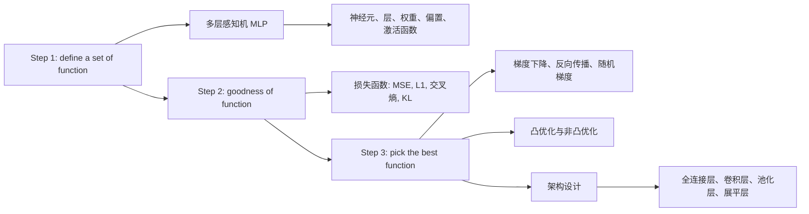

# 第四章：神经网络基础（一）零基础完整讲解

来源：`1_第四章-神经网络基础_v3.pptx`。课程名称：深度学习导论。主讲教师：王文冠。PPT 共 101 页。

这节课的主线可以概括成一句话：神经网络学习的过程，就是先定义一大类可选函数，再用损失函数衡量哪个函数更好，最后用梯度和优化算法从这类函数中选出一个效果较好的函数。



你是初学者的话，先记住一个直觉：神经网络不是“神奇机器”，它本质上是一个由许多小函数拼起来的大函数。输入一张图片、一段文字或一组特征，网络经过一层层计算，输出预测结果。训练就是不断调整这个大函数里的参数，让预测结果越来越接近真实答案。

## 0. 逐页覆盖清单

这一部分先保证 PPT 的所有页面都被覆盖。后面的章节会把这些页面合并成连贯讲解。

- 第 1 页：标题页，第四章“神经网络基础（一）”，课程为深度学习导论，主讲教师王文冠。
- 第 2 页：课程思路总览：Step 1 define a set of function，Step 2 goodness of function，Step 3 pick the best function。
- 第 3 页：再次强调课程思路，并突出 Step 1，即先定义一组候选函数。
- 第 4 页：回望神经元。1943 年 McCulloch-Pitts 模型提出第一个人工神经元数学模型；输入是二进制 0 或 1；加权求和后与阈值比较；超过或等于阈值输出 1，否则输出 0。
- 第 5 页：回望感知机。1957 年 Frank Rosenblatt 发明感知机，可以根据错误反馈学习；偏置 `b` 在感知机中可视为阈值。
- 第 6 页：感知机算法。给定数据集，若样本被错误分类，则根据错误反馈更新权重和偏置。
- 第 7 页：感知机也可从优化角度理解，目标是找到能正确分类训练样本的线性超平面；线性可分时理论上有收敛保证。
- 第 8 页：感知机无法解决线性不可分问题；相关思想与支持向量机、逻辑回归等线性分类模型联系起来。
- 第 9 页：线性回归结构：输入特征、权重、偏置，加权求和得到输出。
- 第 10 页：在线性回归后加入激活函数，得到“线性变换 + 非线性激活”的基本神经元形式。
- 第 11 页：用简单数值例子展示权重、偏置、激活函数和阈值如何共同决定输出。
- 第 12 页：异或 XOR 问题。无法用一条直线把圆和三角形分开；线性回归或单层线性模型不能解决 XOR；引用 Minsky 和 Papert 的 `Perceptrons`。
- 第 13 页：引入多层感知机 MLP。MLP 由输入层、一个或多个隐藏层、输出层组成，是前馈神经网络；示例为用于求解异或问题的 2 层感知机。
- 第 14 页：MLP 通用架构。输入层中每个神经元对应数据的一个特征，输入层本身通常不做可学习计算。
- 第 15 页：继续展示 MLP 通用架构，强调输入层、隐藏层、输出层的组织方式。
- 第 16 页：隐藏层和输出层的计算形式：每个神经元会接收前一层所有神经元的输出，做加权和，加偏置，再经过激活函数。
- 第 17 页：激活函数示例：单层感知机曾经使用阈值函数；阈值函数不连续，给优化带来问题。
- 第 18 页：Sigmoid 函数和 Tanh 函数，特点是连续且平滑。
- 第 19 页：ReLU 函数，实践中非常有效，但在 0 点不可导。
- 第 20 页：Leaky ReLU 函数，给负半轴一个小斜率，参数通常手动设置，例如 `a = 0.1`。
- 第 21 页：MLP 数学表达。输入层、隐藏层、输出层用向量和层编号表示；权重和偏置定义每一层的计算。
- 第 22 页：进一步用矩阵形式表达 MLP。把多个神经元的权重堆成矩阵，把偏置堆成向量，前向传播可写成矩阵乘法。
- 第 23 页：Sigmoid 函数的具体前向传播示例，展示神经元输出如 0.98、0.12 等。
- 第 24 页：多层网络继续前向传播，前一层输出成为后一层输入。
- 第 25 页：强调“给定参数，就定义了一个函数”。输入向量经过网络变成输出向量。
- 第 26 页：每次前向运算本质上是矩阵乘法再接激活函数；矩阵乘法具有并行性；GPU 适合并行计算；提到 ChatGPT-175B 训练需要大量 A100 GPU。
- 第 27 页：提出自然问题：网络应该 FAT or DEEP，即更宽还是更深？
- 第 28 页：通用近似定理。1989 年 George Cybenko 证明，当激活函数为 sigmoid 型函数时，单隐层 MLP 可以在任意精度下逼近紧集上的任意连续函数；其他激活函数也可满足类似性质。
- 第 29 页：解释通用近似定理的意义：它回答“简单神经网络理论上有没有足够表达能力”；足够宽的单隐层网络加非线性激活可成为通用函数逼近器。
- 第 30 页：强调非线性激活的重要性。若没有激活函数，多层线性层叠加仍等价于一个线性层。
- 第 31 页：深度 vs 宽度的理论参考：Eldan 和 Shamir 2016 年论文 `The Power of Depth for Feedforward Neural Networks`。
- 第 32 页：深度在表达能力中起关键作用；深度可以指数级减少表示某些函数所需的参数量。
- 第 33 页：对比通用近似定理与深度表达能力结果。通用近似定理回答“能不能”，深度理论回答“省不省、效率高不高”。
- 第 34 页：ImageNet 实验结果表明增大深度有助于提升神经网络性能：AlexNet 8 层错误率 16.4%，VGG 19 层 7.3%，GoogleNet 22 层 6.7%，ResNet 152 层 3.57%。
- 第 35 页：课程思路再次回到 Step 2：goodness of function，即如何判断一个函数好不好。
- 第 36 页：进入损失函数。MLP 虽有强大函数逼近能力，但要从“能表示”走向“学到目标映射”，仍需损失函数度量预测与真实目标的差异。
- 第 37 页：机器学习两大核心任务：回归 regression 和分类 classification。
- 第 38 页：回归任务的损失函数准备，预测输出与真实连续值之间需要量化差距。
- 第 39 页：继续讲回归损失，常见度量包括均方误差和绝对误差。
- 第 40 页：分类任务需要概率映射，即把模型输出变成每个类别的概率。
- 第 41 页：多分类任务定义；数据集 `D={(x_i,y_i)}_{i=1}^m`，`x_i in R^d`，`y_i in {1,2,...,k}`；MLP 输出 logits 后用 Softmax 得到概率向量。
- 第 42 页：多分类任务另一种定义方式；用最大对数似然表达分类训练目标；说明实践中 `y_i` 是类别编号，而预测 `\hat y_i` 是 `R^k` 中的概率向量。
- 第 43 页：交叉熵损失。最大化真实类别的预测概率等价于最小化负对数似然，也就是交叉熵。
- 第 44 页：手写字识别示例：16x16 图像有 256 个输入特征，经过隐藏层和输出层，Softmax 输出 “is 0, is 1, is 2, ...” 的预测概率。
- 第 45 页：手写字识别图示：输入图像到机器模型，再到输出概率。
- 第 46 页：手写字识别网络结构：输入层、隐藏层、输出层、Softmax 和预测概率。
- 第 47 页：预测概率与真实标签比较，用交叉熵损失衡量模型错误程度。
- 第 48 页：其他损失函数：回归可用均方误差 MSE、L1 损失；分类可用交叉熵和 KL 散度。
- 第 49 页：损失函数是判断好坏的标尺。它定义“好”的数学含义，提供优化方向，并隐式嵌入先验知识。
- 第 50 页：课程思路进入 Step 3：pick the best function，即如何从候选函数中选出最优函数。
- 第 51 页：参数优化同样遵循经验风险最小化原则；转化为优化问题后用梯度信息迭代求解；问题是如何计算梯度。
- 第 52 页：枚举所有参数取值不可行。语音识别示例中 8 层、每层 1000 个神经元会产生百万级参数。
- 第 53 页：随机初始化参数通常足够好；目标是找到使总损失 `L` 最小的网络参数 `theta*`。
- 第 54 页：一维参数的梯度直觉：如果导数为正，减小参数；如果导数为负，增大参数。
- 第 55 页：学习率 `eta` 控制每次更新步长；重复按负梯度方向更新。
- 第 56 页：迭代直到更新很小或损失不再明显下降。
- 第 57 页：二维损失曲面示意，颜色表示总损失 `L`，随机选择起点。
- 第 58 页：计算二维梯度，沿等高线图中的下降方向移动。
- 第 59 页：优化困难：平台区很慢、局部极小值、鞍点；这些地方可能出现梯度为 0 或近似为 0。
- 第 60 页：进入标准梯度定义。
- 第 61 页：标准梯度。对标量函数 `f:R^d -> R`，梯度是偏导数组成的向量；梯度方向是函数上升最快方向，负梯度方向是下降方向。
- 第 62 页：向量值函数的梯度更准确地说是 Jacobian 矩阵。
- 第 63 页：海森矩阵 Hessian 是二阶导数组成的矩阵，用来描述曲率。
- 第 64 页：Hessian 可用于判断驻点类型：正定为局部极小值，负定为局部极大值，不定为鞍点；也影响梯度下降收敛速度。
- 第 65 页：长而窄的谷地会导致梯度下降呈锯齿状震荡，收敛很慢。
- 第 66 页：Hessian 规模是参数量平方，深度网络中几乎不可存储和求逆；实践中很少直接用 Hessian，而使用近似或避免二阶信息。
- 第 67 页：链式法则是反向传播核心；损失对参数的梯度可分解为多个局部梯度的乘积。
- 第 68 页：计算图是由节点和边构成的有向图，节点表示变量或运算，边表示数据依赖；深度模型通常对应可微的有向无环图 DAG。
- 第 69 页：计算图例子 `z=(x+y)^2`。
- 第 70 页：MLP 梯度计算的基本对象：输入、输出、损失。
- 第 71 页：对输出层参数求梯度。
- 第 72 页：对倒数第二层参数求梯度，需要链式法则把误差从后一层传回来。
- 第 73 页：反向传播：从损失端向输入端传播梯度。
- 第 74 页：前向传播：从输入端逐层计算到输出和损失。
- 第 75 页：在前向传播中保存每层输入和输出，为反向传播计算局部导数做准备。
- 第 76 页：反向传播要解决两个问题：如何计算每一层参数的梯度，如何把误差传播到上一层；核心是局部导数。
- 第 77 页：反向传播公式汇总。
- 第 78 页：梯度爆炸和梯度消失。
- 第 79 页：Sigmoid 导致梯度消失，Tanh 也有类似问题。
- 第 80 页：ReLU 的梯度性质：正半轴梯度为 1，能缓解梯度消失；负半轴梯度为 0，可能出现神经元死亡。
- 第 81 页：Leaky ReLU 的负半轴也有小梯度，因此梯度消失程度更低。
- 第 82 页：除了激活函数导数，权重矩阵的谱范数大小也会影响梯度爆炸或消失。
- 第 83 页：优化基础。传统机器学习中很多优化问题是凸优化；提出凸集问题。
- 第 84 页：凸集定义：集合中任意两点连线上的点仍在集合内。
- 第 85 页：凸函数定义与一阶近似，凸函数局部最优也是全局最优。
- 第 86 页：平滑函数定义，梯度变化被控制。
- 第 87 页：凸性保证全局最优和下降方向正确性；平滑性控制梯度变化率和步长选择。
- 第 88 页：任何与梯度方向成钝角的向量，在局部都能保证下降。
- 第 89 页：梯度下降的收敛率与学习率设置。对凸和平滑问题，学习率可与平滑常数相关，收敛率常见为 `O(1/T)`。
- 第 90 页：深度学习几乎不直接使用全量梯度下降；原因是非凸和大规模数据；引入随机梯度。
- 第 91 页：非凸损失曲面存在局部最优。
- 第 92 页：随机梯度用小批量样本估计全量梯度，计算开销远小于全数据梯度。
- 第 93 页：非凸情况下理论保证弱于凸优化；实践经验是随机性有助于跳出局部最优。
- 第 94 页：TensorFlow Playground 仿真实验 1：网络层数为 2，Sigmoid 激活，隐藏层神经元个数为 1、2、3、4；神经元越多，拟合分类边界能力越强。
- 第 95 页：仿真实验 2：隐藏层神经元统一为 6，ReLU 激活，隐藏层数为 1、2、3、4；层数越多，拟合能力越强。
- 第 96 页：仿真实验 3：隐藏层神经元为 6，隐藏层数为 4，激活函数分别为 ReLU、Tanh、Sigmoid；Sigmoid 情况几乎没有学习。
- 第 97 页：架构设计。MLP 只考虑相邻层神经元两两全连接，这种层叫全连接层；实践中任务不同，需要不同类型的层。典型 CNN 包括卷积层、池化层、展平层、全连接层。
- 第 98 页：卷积层示意图。讲偏置项、边缘填充 Padding、跨步 Stride；示例输出为 3x3 矩阵。
- 第 99 页：池化层示意图。池化层无需学习参数。
- 第 100 页：展平层示意图。把多维特征展开成一维向量，也无需学习参数。
- 第 101 页：总结。感知机局限性、多层感知机、基本结构、激活函数、损失函数、梯度计算、优化基础、架构设计、卷积神经网络，并提示开启深度学习之旅；出现 PyTorch、TensorFlow、Keras。

## 1. 课程思路：神经网络学习到底在做什么

PPT 一开始给出三步：

```text
Step 1: define a set of function
Step 2: goodness of function
Step 3: pick the best function
```

这三步是理解神经网络的骨架。

第一步，定义一组函数。你可以把模型想象成一个函数 `f`，输入 `x`，输出预测 `y_hat`。例如输入一张手写数字图片，输出这个图片是 0 到 9 各个数字的概率。神经网络不是一个固定函数，而是一大族函数，因为权重和偏置不同，函数就不同。我们把这些可调参数记为 `theta`，于是模型可以写成：

```text
y_hat = f_theta(x)
```

第二步，定义函数好坏。模型输出和真实答案越接近，函数越好；差距越大，函数越差。这个“差距”要变成一个数，才能被计算机优化，这个数就是损失 loss。例如回归任务里可用均方误差，分类任务里常用交叉熵。

第三步，选出最好函数。既然不同参数对应不同函数，训练就是找一组参数 `theta`，让总损失尽可能小：

```text
theta* = argmin_theta L(theta)
```

这里的 `argmin` 不是最小值本身，而是“让函数达到最小值的参数”。如果 `L(theta)` 是一座山地地形，训练就是从随机起点出发，沿着下降方向一步步走到低处。

## 2. 从人工神经元到感知机

### 2.1 McCulloch-Pitts 神经元

1943 年 McCulloch 和 Pitts 提出了第一个人工神经元数学模型。它的输入是一组二进制值，也就是每个输入只能是 0 或 1。模型做三件事：

1. 每个输入乘上一个权重。
2. 把所有加权输入求和。
3. 把总和与阈值比较，超过或等于阈值输出 1，否则输出 0。

用公式写就是：

```text
s = w_1 x_1 + w_2 x_2 + ... + w_d x_d
if s >= threshold: output = 1
else: output = 0
```

这里：

- `x_i` 是第 `i` 个输入。
- `w_i` 是第 `i` 个输入的重要程度。
- `threshold` 是触发神经元的门槛。

零基础理解：这像一个投票系统。每个输入都投一票，但每票权重不同。总票数超过门槛，就激活；否则不激活。

这个模型的意义非常大：它第一次把“神经元会不会兴奋”变成了一个可以计算的数学规则。但它还不能学习，因为权重和阈值不是自动从数据中调整出来的。

### 2.2 感知机 Perceptron

1957 年 Frank Rosenblatt 发明感知机。感知机的重要变化是：它可以根据错误反馈进行学习。

感知机的基本形式是：

```text
y_hat = sign(w^T x + b)
```

其中：

- `x` 是输入特征向量。
- `w` 是权重向量。
- `b` 是偏置 bias，也可以看作阈值的另一种写法。
- `w^T x + b` 是线性加权和。
- `sign` 是符号函数，大于等于 0 输出正类，小于 0 输出负类。

偏置 `b` 为什么重要？如果没有 `b`，分类边界必须经过原点；有了 `b`，分类边界可以平移。几何上，`w` 决定超平面的方向，`b` 决定超平面的位置。

感知机的学习规则可以理解为：如果一个样本被分错了，就把分类边界往能纠正这个错误的方向推。常见写法是：

```text
if y_i (w^T x_i + b) <= 0:
    w <- w + eta y_i x_i
    b <- b + eta y_i
```

这里 `y_i` 通常取 `+1` 或 `-1`，`eta` 是学习率。条件 `y_i(w^T x_i+b)<=0` 表示样本被错分或落在边界上。

直觉上：

- 如果真实标签是正类 `+1`，但模型给出的分数太小，就让 `w` 更偏向 `x_i`。
- 如果真实标签是负类 `-1`，但模型给出的分数太大，就让 `w` 远离 `x_i`。

PPT 还强调感知机在训练线性可分数据时有理论收敛保证。线性可分的意思是：存在一条直线、一个平面或高维超平面能把两类样本完全分开。

### 2.3 感知机、SVM、逻辑回归的联系

感知机、SVM 和逻辑回归都可以看作线性分类器，但它们定义“好分类器”的方式不同。

感知机关注有没有分错，分错就修正。

SVM 的思想是让分类间隔最大。它偏好不仅分对，而且离边界尽量远的分类面。

逻辑回归把线性分数变成概率，常见损失为：

```text
log(1 + exp(-y_i(w^T x_i + b)))
```

这里如果真实标签与模型分数方向一致，损失小；如果方向相反，损失大。感知机像一个简单纠错规则，逻辑回归和 SVM 则更像把分类问题写成可优化的损失函数。

## 3. 为什么单层模型不够：线性回归、激活函数与 XOR

### 3.1 线性回归的神经元形式

第 9 页展示了线性回归：

```text
y = x_1 w_1 + x_2 w_2 + ... + x_k w_k + b
```

这就是“输入乘权重再加偏置”。如果只有这个式子，不管堆多少层，只要中间没有非线性激活，整体仍然是线性函数。

例如两层线性变换：

```text
h = W1 x + b1
y = W2 h + b2
```

代入后：

```text
y = W2(W1 x + b1) + b2 = (W2 W1)x + (W2 b1 + b2)
```

这仍然是一个线性变换。所以神经网络必须加入非线性激活函数，否则“多层”没有本质意义。

### 3.2 线性回归加激活函数

第 10 页展示了：

```text
z = w^T x + b
y = sigma(z)
```

这里 `sigma` 是激活函数 activation function。神经网络中一个神经元的常见结构就是：

```text
输入 -> 线性变换 -> 激活函数 -> 输出
```

激活函数的作用不是装饰，而是把线性模型变成非线性模型。没有激活函数，神经网络无法表示复杂边界。

### 3.3 XOR 异或问题

第 12 页展示 XOR：

```text
x1  x2  y
0   0   0
1   0   1
0   1   1
1   1   0
```

异或的含义是：两个输入不同则输出 1，相同则输出 0。

如果把四个点画在二维平面上，`(0,0)` 和 `(1,1)` 属于一类，`(1,0)` 和 `(0,1)` 属于另一类。你无法用一条直线把这两类分开。这就是线性不可分。

这说明单层线性模型有根本限制。感知机不能解决 XOR，不是因为训练不够久，而是模型表达能力不够。

解决方法就是使用多层感知机：先用隐藏层把数据变换到新的表示空间，再在新空间里分类。

## 4. 多层感知机 MLP 的基本结构

### 4.1 MLP 定义

多层感知机 Multi-layer Perceptron，简称 MLP，是由输入层、一个或多个隐藏层、输出层组成的前馈神经网络。

“前馈”表示信息只从输入向输出方向传播，不在网络中形成循环。一个典型结构是：

```text
输入层 -> 隐藏层 1 -> 隐藏层 2 -> ... -> 输出层
```

输入层中的每个神经元对应数据的一个特征。例如手写数字图片是 16x16 像素，那么输入层可以有 256 个输入特征。输入层通常只是放置数据，不做可学习计算。

隐藏层是网络真正学习复杂表示的地方。每个隐藏层神经元接收前一层的输出，做加权和、加偏置、再过激活函数。

输出层把最后一层隐藏表示转换为任务需要的输出。回归任务输出连续数值，分类任务输出类别分数或概率。

### 4.2 层的数学表达

设第 `l` 层的输出向量是：

```text
x^(l) = [x_1^(l), x_2^(l), ..., x_n_l^(l)]^T
```

第 `l` 层的线性部分是：

```text
z^(l) = W^(l) x^(l-1) + b^(l)
```

再经过激活函数：

```text
x^(l) = sigma(z^(l))
```

其中：

- `W^(l)` 是第 `l` 层的权重矩阵。
- `b^(l)` 是第 `l` 层的偏置向量。
- `z^(l)` 是激活前的值，常叫 pre-activation。
- `x^(l)` 是激活后的输出。
- `sigma` 是激活函数，可以逐元素作用在向量上。

对单个神经元 `i`，可以写成：

```text
z_i^(l) = sum_j w_ij^(l) x_j^(l-1) + b_i^(l)
x_i^(l) = sigma(z_i^(l))
```

这句话非常重要：每个神经元先把前一层所有输入加权求和，再通过非线性激活输出给下一层。

### 4.3 给定参数就定义了一个函数

第 25 页强调：This is a function. Input vector, output vector.

一旦网络结构确定，并且所有权重、偏置都确定，MLP 就是一个确定函数。输入一个向量，就会输出一个向量。

训练前，参数一般随机初始化，所以一开始定义的是一个随机函数。训练过程不断调整参数，函数形状也不断变化。最终得到的函数希望能把输入映射到正确输出。

### 4.4 为什么 GPU 对神经网络重要

第 26 页强调：神经网络每次前向计算本质上就是矩阵乘法，然后接激活函数。

矩阵乘法的特点是高度并行。例如矩阵中许多元素的乘加可以同时计算。GPU 擅长做大量并行计算，因此特别适合训练神经网络。

PPT 提到 ChatGPT-175B 需要使用大约 1400 张 A100 GPU 训练一个月。这里的重点不是记住具体数字，而是理解大模型训练的计算量巨大，而核心计算仍然大量是矩阵乘法。

## 5. 激活函数

激活函数决定神经元如何把线性输入 `z` 变成输出。它的核心作用是引入非线性。

### 5.1 阈值函数

早期感知机使用阈值函数：

```text
sigma(z) = 1, if z >= 0
sigma(z) = 0, if z < 0
```

或使用符号函数：

```text
sign(z) = 1, if z >= 0
sign(z) = -1, if z < 0
```

缺点是它不连续、不可导或几乎处处梯度为 0，不适合现代基于梯度的优化。

### 5.2 Sigmoid 函数

Sigmoid 函数：

```text
sigma(z) = 1 / (1 + exp(-z))
```

它把任意实数映射到 `(0,1)`，因此过去常用于概率输出。它连续且平滑。

Sigmoid 的导数是：

```text
sigma'(z) = sigma(z)(1 - sigma(z))
```

最大值为 `1/4`。这意味着每经过一层，梯度最多乘上 `1/4`，层数多时梯度容易越来越小，这就是梯度消失的重要原因。

第 23 页用 Sigmoid 演示前向传播，某些神经元输出接近 0.98，某些输出接近 0.12。输出接近 0 或 1 时，Sigmoid 进入饱和区，导数接近 0，训练会很慢。

### 5.3 Tanh 函数

Tanh 函数：

```text
tanh(z) = (exp(z) - exp(-z)) / (exp(z) + exp(-z))
```

它把输入映射到 `(-1,1)`。相比 Sigmoid，Tanh 是以 0 为中心的，很多场景下比 Sigmoid 更适合作为隐藏层激活。

但 Tanh 在输入绝对值很大时也会饱和，导数也会变小，所以它同样有梯度消失问题。

### 5.4 ReLU 函数

ReLU 函数：

```text
ReLU(z) = max(0, z)
```

也就是：

```text
if z > 0: output = z
else: output = 0
```

优点：

- 计算简单。
- 正半轴导数为 1，能缓解梯度消失。
- 实践中非常有效。

缺点：

- 在 `z=0` 处不可导，但实践中通常不构成大问题。
- 负半轴导数为 0，如果一个神经元长期落在负半轴，可能无法更新，称为 dead ReLU。

### 5.5 Leaky ReLU 函数

Leaky ReLU：

```text
LeakyReLU(z) = z, if z > 0
LeakyReLU(z) = a z, otherwise
```

其中 `a` 是一个很小的正数，例如 0.1。

它和 ReLU 的区别是负半轴不是完全 0，而是保留一个小斜率。这样即使 `z<0`，神经元也能得到一点梯度，减少 dead ReLU 问题。

PPT 第 20 页提示：参数 `a` 一般较小，例如 `a=0.1`，通常需要手动设置或通过变体学习。

## 6. 深度 vs 宽度：网络到底要宽还是要深

第 27 页提出问题：FAT or DEEP?

“宽”指每层神经元很多，“深”指层数很多。

### 6.1 通用近似定理

第 28 页介绍 George Cybenko 1989 年的通用近似定理：

当激活函数是 sigmoid 型函数时，只有一个隐藏层的多层感知机，只要隐藏层足够宽，就可以在任意精度下逼近定义在紧集上的任意连续函数。

拆开理解：

- “一个隐藏层”说明网络可以很浅。
- “足够宽”说明隐藏层神经元数量可能非常多。
- “任意精度”说明理论上可以逼近得非常接近。
- “紧集上的连续函数”是数学条件，可以粗略理解为在一个有限范围内的正常连续函数。

这回答了一个根本问题：神经网络理论上有没有能力表示复杂函数？答案是有。

### 6.2 非线性激活是关键

通用近似定理依赖非线性激活。如果没有非线性激活，多层线性网络仍然只是线性函数，不能逼近复杂非线性关系。

所以“多层线性变换 + 非线性激活”才是神经网络表达能力的来源。

### 6.3 通用近似定理只回答“能不能”

第 33 页强调：通用近似定理回答的是存在性，也就是“能不能”。它不关心达到某个精度需要多少神经元。

这就像说：“只要给你足够多砖头，你能盖出任何形状的房子。”这不等于说这种盖法高效。

### 6.4 深度能提高表达效率

Telgarsky、Eldan 和 Shamir 等工作说明：存在某些函数，深层网络可以用多项式级别的参数高效表示，而浅层网络要表示同样函数可能需要指数级宽度。

因此：

- 宽网络理论上可以很强。
- 深网络在某些函数上更省参数、更高效。

第 32 页总结：深度在神经网络表达能力中起关键作用，深度可以指数级减少表示某些函数所需的参数量。

### 6.5 ImageNet 经验结果

第 34 页给出 ImageNet 上的经典结果：

| 模型 | 年份 | 层数 | 错误率 |
|---|---:|---:|---:|
| AlexNet | 2012 | 8 层 | 16.4% |
| VGG | 2014 | 19 层 | 7.3% |
| GoogleNet | 2014 | 22 层 | 6.7% |
| ResNet | 2015 | 152 层 | 3.57% |

这些结果表明，增加深度有助于提升性能。但要注意，性能提升不只来自层数，也来自更好的架构设计、优化方法、正则化、数据处理等。PPT 的重点是：深度是神经网络能力提升的重要因素。

## 7. 损失函数：如何判断函数好坏

第 36 页从“能表示”转向“学到目标映射”。即使 MLP 有强大函数逼近能力，也必须有一个标准告诉它什么叫预测好，什么叫预测坏。

这个标准就是损失函数。

### 7.1 回归与分类

第 37 页定义两大任务。

回归 regression：用一组预测变量 `X` 去建模一个或多个连续响应变量 `Y`。例如根据房屋面积、位置、楼层预测房价。

分类 classification：判断一个样本属于哪个类别。比如判断图片是猫还是狗，或者手写数字是 0 到 9 中哪一个。

回归输出通常是连续值，分类输出通常是类别或类别概率。

### 7.2 回归损失：MSE 和 L1

回归任务中，模型输出 `y_hat_i`，真实值为 `y_i`。

均方误差 MSE：

```text
L(theta, D) = (1/m) sum_i ||y_hat_i - y_i||^2
```

它惩罚平方误差。误差越大，惩罚增长越快。适合希望大错误被强烈惩罚的场景。

L1 损失：

```text
L(theta, D) = (1/m) sum_i ||y_hat_i - y_i||_1
```

它惩罚绝对误差。相比 MSE，L1 对异常值不那么敏感。

零基础例子：预测房价真实值是 100 万，模型预测 110 万，误差是 10 万。MSE 会用误差平方来惩罚，L1 会用误差绝对值惩罚。

### 7.3 多分类任务形式

第 41 页定义多分类数据集：

```text
D = {(x_i, y_i)}_{i=1}^m
x_i in R^d
y_i in {1, 2, ..., k}
```

其中：

- `m` 是样本数。
- `d` 是输入特征维度。
- `k` 是类别数。
- `y_i` 是类别编号。

例如手写数字识别中，`k=10`，类别是 0 到 9。如果 PPT 用 `{1,2,...,k}` 表示类别，只是数学编号方式；实际任务可以把数字 0 映射到类别 1，把数字 9 映射到类别 10。

### 7.4 Logits 与 Softmax

多分类网络最后一层通常先输出 `k` 个实数：

```text
z^(L) = [z_1^(L), z_2^(L), ..., z_k^(L)]
```

这些值叫 logits。它们还不是概率，因为可能为负，和也不等于 1。

Softmax 函数把 logits 转成概率：

```text
softmax(z)_c = exp(z_c) / sum_{j=1}^k exp(z_j)
```

因此 MLP 的预测可以写成：

```text
y_hat_i = f_MLP(x_i)
        = [ exp(z_1^(L))/sum_c exp(z_c^(L)), ..., exp(z_k^(L))/sum_c exp(z_c^(L)) ]
```

Softmax 有三个重要性质：

- 每个输出都大于 0。
- 所有输出加起来等于 1。
- logit 越大，对应概率越大。

所以 Softmax 输出可以解释为“模型认为样本属于每个类别的概率”。

### 7.5 最大对数似然与交叉熵

第 42 页引入最大对数似然。对一个样本，如果真实类别是 `c`，我们希望模型给第 `c` 类的概率 `y_hat_{i,c}` 尽可能大。

如果用 one-hot 向量表示标签，真实类别对应位置为 1，其他位置为 0。交叉熵损失为：

```text
L(theta, D) = - sum_i sum_c y_{i,c} log(y_hat_{i,c})
```

如果 `y_i` 是类别编号，也可以写成：

```text
L(theta, D) = - sum_i log(y_hat_{i, y_i})
```

这句话很好理解：只看真实类别的预测概率。真实类别概率越高，`-log` 越小；真实类别概率越低，`-log` 越大。

例如真实类别是 “2”：

- 模型给 “2” 的概率是 0.9，损失 `-log(0.9)` 很小。
- 模型给 “2” 的概率是 0.01，损失 `-log(0.01)` 很大。

这就是分类任务常用交叉熵的原因。

### 7.6 手写数字识别例子

第 44 到 47 页用手写数字识别说明多分类流程。

输入是一张 16x16 图片，所以：

```text
16 x 16 = 256
```

可以把图片展开成 256 维向量，输入 MLP。网络经过隐藏层后，输出层产生 10 个 logits，再经过 Softmax 得到 10 个概率：

```text
is 0, is 1, is 2, ..., is 9
```

如果图片真实标签是 2，模型应该让 “is 2” 的概率最高。交叉熵会惩罚真实类别概率不够高的情况。

### 7.7 KL 散度

第 48 页提到 KL 散度。KL 散度用于衡量两个概率分布的差异：

```text
D_KL(p || q) = sum_c p_c log(p_c / q_c)
```

其中 `p` 是真实分布，`q` 是预测分布。

交叉熵和 KL 散度有关系：

```text
H(p, q) = H(p) + D_KL(p || q)
```

当真实分布 `p` 固定时，最小化交叉熵等价于最小化 KL 散度。也就是说，训练分类模型是在让预测分布尽量接近真实分布。

### 7.8 损失函数的本质

第 49 页给出非常重要的总结：损失函数是判断好坏的标尺。

它有三个作用。

第一，定义“好”的数学内涵。回归中用 MSE，意思是希望数值预测精确；分类中用交叉熵，意思是希望真实类别概率高。

第二，提供优化方向。损失函数对参数求梯度，就告诉我们参数应该增大还是减小，才能让损失下降。

第三，隐式嵌入先验知识。交叉熵对应最大似然估计，背后假设模型输出的是概率分布；对比损失强调样本相似性；不同损失会引导模型学习不同性质。

零基础要点：损失函数不是训练结束后才看的评分表，而是训练过程中直接驱动参数更新的核心。

## 8. 梯度计算与参数优化

第 50 页进入 Step 3：pick the best function。现在我们已经有了候选函数族，也有了损失函数，接下来要找参数。

### 8.1 经验风险最小化

训练集上的平均损失常叫经验风险。经验风险最小化 ERM 写成：

```text
min_theta L(theta, D)
```

这里 `theta` 是所有权重和偏置的集合。

对于 MLP，参数非常多。第 52 页举例：如果语音识别网络有 8 层，每层 1000 个神经元，相邻两层之间就可能有：

```text
1000 x 1000 = 10^6
```

个权重。整个网络有百万甚至更多参数。枚举所有可能参数取值完全不可行。

### 8.2 随机初始化

第 53 页强调，通常随机选一个初始参数就足够好。训练不是从完美起点开始，而是从随机函数开始，逐渐改好。

深度学习中初始化很重要，但基础直觉是：先随机给参数一个值，然后根据损失函数的梯度慢慢调整。

### 8.3 一维梯度下降

如果只有一个参数 `w`，损失是 `L(w)`。导数告诉我们函数在当前点往哪个方向增加。

- 如果 `dL/dw > 0`，说明 `w` 增大时损失上升，所以应该减小 `w`。
- 如果 `dL/dw < 0`，说明 `w` 增大时损失下降，所以应该增大 `w`。

梯度下降公式：

```text
w <- w - eta * dL/dw
```

其中 `eta` 是学习率 learning rate。

学习率太大，可能一步跨过低谷甚至发散；学习率太小，训练很慢。

### 8.4 多维梯度下降

神经网络有许多参数，所以用向量形式：

```text
theta <- theta - eta * grad_theta L(theta)
```

这里 `grad_theta L(theta)` 是所有参数偏导数组成的向量。

第 57 和 58 页用等高线图表示损失曲面。颜色表示总损失，参数 `w_1` 和 `w_2` 是坐标。训练就是从随机起点出发，沿着负梯度方向往低损失区域移动。

### 8.5 平台、局部极小值和鞍点

第 59 页展示三个优化困难。

平台 plateau：损失曲面很平，梯度很小，更新很慢。此时并不是最优，但模型走得很慢。

局部极小值 local minima：附近都比它高，但全局可能还有更低的地方。

鞍点 saddle point：某些方向像最低点，某些方向像最高点。梯度可能为 0，但不是局部最小。

在高维神经网络中，鞍点和平台区常常比简单局部极小值更需要关注。

## 9. 梯度、Jacobian 与 Hessian

### 9.1 标准梯度

第 61 页定义标量函数的梯度。若：

```text
f: R^d -> R
```

那么梯度是：

```text
grad f(x) = [partial f / partial x_1, ..., partial f / partial x_d]^T
```

梯度有两个含义：

- 方向：函数上升最快方向。
- 大小：函数对输入变化的敏感程度。

如果我们想下降，就走负梯度方向。

### 9.2 Jacobian 矩阵

第 62 页讲向量值函数。若：

```text
g: R^d -> R^m
```

输出不是一个数，而是一个向量。此时把每个输出分量对每个输入分量求偏导，得到 Jacobian 矩阵：

```text
J_g(x) =
[ partial g_1 / partial x_1 ... partial g_1 / partial x_d
  ...
  partial g_m / partial x_1 ... partial g_m / partial x_d ]
```

神经网络每层通常都是向量到向量的函数，所以严格说很多中间导数是 Jacobian。

### 9.3 Hessian 矩阵

第 63 页讲 Hessian。对标量函数：

```text
f: R^d -> R
```

Hessian 是所有二阶偏导数组成的矩阵：

```text
H_ij = partial^2 f / partial x_i partial x_j
```

它描述函数曲面的曲率。

第 63 页给的例子是类似：

```text
f(x) = - sum_i ln x_i
```

其二阶导会形成对角矩阵，反映每个方向上的曲率。

### 9.4 Hessian 判断极值点

第 64 页给出 Hessian 的重要用途。若某点梯度为 0，这个点叫驻点。但驻点可能是局部极小值、局部极大值或鞍点。

Hessian 可帮助判断：

- Hessian 正定：所有特征值大于 0，该点是局部极小值。
- Hessian 负定：所有特征值小于 0，该点是局部极大值。
- Hessian 不定：特征值有正有负，该点是鞍点。

梯度只能告诉你“这里平了”，Hessian 可以告诉你“这里像谷底、山顶还是马鞍面”。

### 9.5 Hessian 与收敛速度

第 64 和 65 页还讲 Hessian 条件数：

```text
condition number = 最大特征值 / 最小特征值
```

如果条件数很大，说明某个方向很陡，另一个方向很平。梯度下降容易在峡谷中左右震荡，像锯齿一样慢慢前进。

第 65 页的 long, narrow ravines 就是这种长而窄的谷地。

### 9.6 为什么深度学习很少直接用 Hessian

第 66 页说明：Hessian 规模是参数数量的平方。

如果模型有 `n` 个参数，Hessian 是 `n x n`。如果 `n` 是百万级，Hessian 有万亿级元素，无法直接存储和求逆。

所以深度网络实践中几乎不直接使用完整 Hessian，而使用近似二阶信息或完全避免二阶方法。PPT 提到 Adam 的动量等方法可以看作某种近似思想，但 Adam 不是直接求 Hessian。

## 10. 链式法则、计算图与反向传播

### 10.1 链式法则

第 67 页强调：链式法则是神经网络反向传播训练的核心。

最简单的链式法则：

```text
h(x) = f(g(x))
h'(x) = f'(g(x)) g'(x)
```

如果函数由很多层复合而成，整体导数就是一连串局部导数的乘积。

神经网络正是层层复合：

```text
x -> layer 1 -> layer 2 -> ... -> output -> loss
```

损失对前面参数的影响，要通过后面层一层层传回来。

### 10.2 计算图

第 68 和 69 页介绍计算图。计算图是由节点和边构成的有向图：

- 节点表示变量或运算。
- 边表示数据依赖关系。
- 整个图描述复杂函数如何由基本运算组合而成。

例子：

```text
z = (x + y)^2
```

可以拆成：

```text
u = x + y
z = u^2
```

计算图就是：

```text
x ----\
       + -> u -> square -> z
y ----/
```

前向传播时先算 `u`，再算 `z`。反向传播时从 `z` 的梯度开始，反过来算 `u`、`x`、`y` 的梯度。

### 10.3 前向传播

第 74 页写“前向传播”。前向传播就是：

1. 输入 `x`。
2. 逐层计算 `z^(l)=W^(l)x^(l-1)+b^(l)`。
3. 逐层计算 `x^(l)=sigma(z^(l))`。
4. 得到输出 `o(x)`。
5. 与真实标签比较，得到损失 `ell(theta,x,y)`。

前向传播不仅得到预测结果，还要保存中间变量。因为反向传播计算梯度时会用到每一层的 `x^(l)` 和 `z^(l)`。

### 10.4 反向传播

第 73 页写“反向传播”。反向传播从损失开始，沿计算图反向传播梯度。

以 MLP 为例：

```text
z^(l) = W^(l)x^(l-1) + b^(l)
x^(l) = sigma(z^(l))
```

定义误差信号：

```text
delta^(l) = partial ell / partial z^(l)
```

输出层：

```text
delta^(L) = (partial ell / partial x^(L)) ⊙ sigma'(z^(L))
```

隐藏层：

```text
delta^(l) = ((W^(l+1))^T delta^(l+1)) ⊙ sigma'(z^(l))
```

参数梯度：

```text
partial ell / partial W^(l) = delta^(l) (x^(l-1))^T
partial ell / partial b^(l) = delta^(l)
```

这里 `⊙` 表示逐元素相乘。

零基础理解：反向传播不是神秘算法，它就是高效应用链式法则。它把“最终损失有多大”这个信息，从输出层一层层传回去，告诉每个权重应该怎样调整。

### 10.5 反向传播解决的两个问题

第 76 页明确说反向传播解决两个问题：

1. 如何计算每一层参数的梯度。
2. 如何将误差传播到上一层。

局部导数是关键。每一层只需要知道自己局部的输入、输出和导数，再乘上从后一层传来的梯度，就能得到本层梯度。

这就是为什么现代深度学习框架可以自动求导：它们记录计算图，然后按链式法则自动反向传播。

## 11. 梯度消失与梯度爆炸

第 78 页引出梯度爆炸和梯度消失。

### 11.1 为什么会出现

反向传播中，梯度会经过多层相乘。粗略看：

```text
delta^(l) ≈ product of [activation derivatives and weight matrices]
```

如果每层乘上的因子都小于 1，很多层之后梯度会接近 0，这就是梯度消失。

如果每层乘上的因子都大于 1，很多层之后梯度会变得巨大，这就是梯度爆炸。

### 11.2 Sigmoid 的问题

Sigmoid 导数：

```text
sigma'(z) = sigma(z)(1-sigma(z)) <= 1/4
```

这意味着每层至少有一个不超过 `1/4` 的乘子。层数多时，梯度容易迅速变小。

例如连续乘：

```text
(1/4)^10 ≈ 0.00000095
```

梯度几乎没了，前面层学不动。

第 79 页强调 Tanh 函数有类似问题。

### 11.3 ReLU 和 Leaky ReLU

ReLU：

```text
sigma'(z) = 1, if z > 0
sigma'(z) = 0, otherwise
```

正半轴导数为 1，所以能缓解梯度消失；负半轴为 0，会导致 dead ReLU。

Leaky ReLU：

```text
sigma'(z) = 1, if z > 0
sigma'(z) = a, otherwise
```

负半轴保留小梯度，所以梯度消失程度更低。

### 11.4 权重谱范数也重要

第 82 页强调：权重谱范数大小同样重要。

即使激活函数导数合适，如果权重矩阵不断把梯度放大，也会梯度爆炸；如果权重矩阵不断把梯度压小，也会梯度消失。

谱范数可以粗略理解为矩阵对向量最大能放大多少倍。深层网络中，多层矩阵连乘会显著影响梯度稳定性。

## 12. 优化基础：凸性、平滑性与随机梯度

### 12.1 凸集

第 83 和 84 页讲凸集。

集合 `C` 是凸的，当且仅当对任意 `x,y in C` 和任意 `alpha in [0,1]`：

```text
alpha x + (1-alpha)y in C
```

几何直觉：集合里任意两点之间的线段都完全落在集合内部。

圆盘、矩形、六边形通常是凸的；月牙形、带凹陷的形状通常不是凸的。

### 12.2 凸函数

第 85 页讲凸函数。函数 `f` 是凸的，如果：

```text
f(alpha x + (1-alpha)y) <= alpha f(x) + (1-alpha)f(y)
```

直觉：函数图像在任意两点连线的下方。碗形函数通常是凸函数。

凸函数的重要性质：局部最优就是全局最优。因此在凸优化中，梯度下降如果设置合理，有较强理论保证。

一阶条件常写作：

```text
f(y) >= f(x) + grad f(x)^T (y - x)
```

意思是凸函数总在任意一点切平面的上方。

### 12.3 平滑函数

第 86 页讲平滑性。函数是 `beta`-平滑的，如果：

```text
||grad f(x) - grad f(y)|| <= beta ||x - y||
```

平滑性控制梯度变化幅度。如果梯度变化太剧烈，就很难选择安全步长；如果函数平滑，学习率选择和收敛分析更容易。

第 87 页总结：

- 凸性解决“往哪里走”的问题：负梯度方向是合理下降方向，并能最终到达全局最优。
- 平滑性解决“走多快”的问题：控制梯度变化，使我们可以安全选择步长并量化收敛速度。

### 12.4 下降方向

第 88 页说：任何与梯度方向成钝角的向量 `Delta_t`，都能在局部保证下降。

数学上，如果：

```text
grad f(x)^T Delta_t < 0
```

那么沿 `Delta_t` 走一小步，函数值会下降。

负梯度方向 `Delta_t = -grad f(x)` 一定满足：

```text
grad f(x)^T (-grad f(x)) = -||grad f(x)||^2 < 0
```

所以负梯度是最自然的下降方向。

### 12.5 梯度下降收敛率

第 89 页给出传统凸优化中的典型结论：对凸且平滑的问题，选取合适学习率，例如与 `1/beta` 同阶，可以得到类似：

```text
f(x_T) - f(x*) = O(1/T)
```

这里 `T` 是迭代次数。含义是迭代越多，函数值越接近最优值。

这个结论非常重要，因为它说明在良好数学条件下，梯度下降不是凭感觉，而是有理论保证。

### 12.6 为什么深度学习不用普通全量梯度下降

第 90 页说明，对于 MLP 和其他深度学习模型，几乎不再直接使用普通全量梯度下降，主要有两个原因。

第一，深度模型的损失函数通常非凸。凸优化强保证不再直接适用。

第二，数据规模很大。全量梯度下降每次更新都要遍历全部训练数据，开销太高。

### 12.7 随机梯度与小批量

随机梯度下降 SGD 使用一个样本或一小批样本估计梯度：

```text
theta_{t+1} = theta_t - eta_t grad ell(theta_t, B_t)
```

其中 `B_t` 是 mini-batch。

如果 mini-batch 是从训练集中随机采样，梯度估计通常可以看作全量梯度的无偏估计：

```text
E[grad ell(theta, B_t)] = grad L(theta, D)
```

优点：

- 每次更新计算更便宜。
- 可以更频繁更新参数。
- 随机噪声有时能帮助跳出局部最优或鞍点附近。

第 93 页强调：非凸情况下理论保证弱于凸优化，但实践经验是随机性有助于跳出局部最优。

## 13. 仿真实验：容量、深度和激活函数的影响

第 94 到 96 页使用 TensorFlow Playground 展示直观实验。

网址是：

```text
https://playground.tensorflow.org/
```

### 13.1 隐藏层神经元越多，拟合能力越强

第 94 页实验设置：

- 网络层数为 2，不含输入层。
- Sigmoid 激活函数。
- 隐藏层神经元个数分别为 1、2、3、4。

观察结果：随着隐藏层神经元个数增加，模型拟合实际分类边界的能力更强。

解释：更多神经元意味着更多可调函数单元，网络可以组合出更复杂的边界。

### 13.2 隐藏层越多，拟合能力越强

第 95 页实验设置：

- 隐藏层神经元个数统一为 6。
- ReLU 激活函数。
- 隐藏层数分别为 1、2、3、4。

观察结果：层数增加，模型拟合分类边界的能力也增强。

解释：更深的网络可以逐层组合特征，表达更复杂的函数。前面理论部分讲过，深度对某些函数有参数效率优势。

### 13.3 Sigmoid 可能几乎没有学习

第 96 页实验设置：

- 隐藏层神经元个数统一为 6。
- 隐藏层数统一为 4。
- 激活函数分别为 ReLU、Tanh、Sigmoid。

观察结果：使用 Sigmoid 的情况几乎没有学习。

原因通常与 Sigmoid 饱和和梯度消失有关。深层网络中如果许多神经元进入饱和区，前面层几乎收不到有效梯度，训练会停滞。

这也是现代深度网络中 ReLU 及其变体非常常用的原因。

## 14. 架构设计：从全连接层到卷积网络

第 97 页开始讲架构设计。

### 14.1 全连接层

MLP 主要考虑相邻层神经元两两都连接的情况，这种层叫全连接层 Fully Connected Layer。

如果前一层有 `n` 个神经元，后一层有 `m` 个神经元，那么权重矩阵大小是：

```text
m x n
```

全连接层的优点是通用，几乎不假设输入结构。缺点是参数多，且不利用图像等数据的局部结构。

例如图像中相邻像素关系非常重要，全连接层把所有像素直接展开，会丢失空间结构的直观利用方式。

### 14.2 典型卷积神经网络 CNN

第 97 页列出典型 CNN 层：

- 卷积层 Convolutional Layer
- 池化层 Pooling Layer
- 展平层 Flatten Layer
- 全连接层

CNN 的典型流程是：

```text
图像 -> 卷积层 -> 激活 -> 池化 -> 多次重复 -> 展平 -> 全连接 -> 分类输出
```

### 14.3 卷积层

第 98 页展示卷积层示意图。卷积层使用一个小的卷积核 kernel 在输入图像上滑动。每到一个位置，就做局部加权求和。

简化公式：

```text
output[i,j] = sum_{u,v} kernel[u,v] * input[i+u, j+v] + bias
```

卷积层的重要概念：

- 局部连接：每个输出只看输入的局部区域。
- 权重共享：同一个卷积核在整张图上滑动，参数复用。
- Padding 边缘填充：在图像边缘补 0 或其他值，控制输出尺寸。
- Stride 跨步：卷积核每次移动几个像素。
- Bias 偏置项：每个卷积核通常有偏置。

PPT 示例输出为 3x3：

```text
7   9   11
13  13  13
13  11  9
```

这个矩阵可以理解为卷积核在不同位置提取到的局部特征响应。

### 14.4 池化层

第 99 页展示池化层。池化层无需学习参数。

常见池化：

- 最大池化 Max Pooling：取局部区域最大值。
- 平均池化 Average Pooling：取局部区域平均值。

作用：

- 降低特征图尺寸。
- 减少计算量。
- 增强局部平移不变性。

例如一个 2x2 区域 `[1,3; 5,8]`，最大池化输出 8，平均池化输出 4.25。

### 14.5 展平层

第 100 页展示展平层。展平层也无需学习参数。

它做的事情是把多维特征图拉平成一维向量：

```text
feature maps -> 1D flattened vector
```

例如 PPT 中示意：

```text
1, 2, 3, 4, 5, ..., 41, 42, 43, 44
```

展平后通常接全连接层，用于最终分类或回归。

## 15. 本节课的完整知识链

这节课不是孤立讲一些术语，而是在建立深度学习训练的完整链条。

第一，单个神经元从 McCulloch-Pitts 模型开始，是加权求和加阈值判断。

第二，感知机让权重可以根据错误反馈更新，但它本质上仍是线性分类器，不能解决 XOR 这类线性不可分问题。

第三，MLP 通过隐藏层和非线性激活函数提升表达能力。没有激活函数，多层线性网络仍是线性函数。

第四，通用近似定理说明足够宽的单隐层网络理论上可以逼近任意连续函数；深度理论说明深层网络对某些函数表示更高效。

第五，模型能表示复杂函数不等于能学到目标函数。训练需要损失函数来判断预测好坏。

第六，分类中常用 Softmax 把 logits 转成概率，再用交叉熵衡量预测概率与真实标签的差异。

第七，参数优化依赖梯度下降和反向传播。反向传播本质上是高效应用链式法则。

第八，深层网络会遇到梯度消失和梯度爆炸，激活函数导数和权重矩阵谱范数都会影响梯度稳定性。

第九，传统凸优化有较强理论保证，但深度学习通常是非凸、大规模问题，所以实践中常用随机梯度和 mini-batch。

第十，MLP 的全连接结构不是唯一选择。图像任务中常用卷积层、池化层、展平层等架构组件。

## 16. 初学者最容易混淆的点

### 16.1 权重、偏置、阈值是什么关系

权重决定每个输入有多重要。偏置决定整体输出倾向。阈值可以通过偏置吸收到公式里。

例如：

```text
w^T x >= threshold
```

等价于：

```text
w^T x - threshold >= 0
```

令 `b=-threshold`，就得到：

```text
w^T x + b >= 0
```

所以偏置可以看作可学习阈值。

### 16.2 激活函数为什么不能省

如果省掉激活函数，多个线性层合起来仍然是一个线性层。网络再深也不能表示 XOR 这样的非线性问题。

激活函数让网络获得非线性表达能力。

### 16.3 Softmax 输出为什么是概率

因为 Softmax 先取指数，保证每项为正；再除以所有指数和，保证总和为 1。

```text
p_c = exp(z_c) / sum_j exp(z_j)
```

这满足概率分布的基本形式。

### 16.4 交叉熵为什么适合分类

分类任务希望真实类别概率越高越好。交叉熵对真实类别概率取负对数：

```text
loss = -log(p_true)
```

如果 `p_true` 接近 1，损失接近 0；如果 `p_true` 接近 0，损失非常大。

### 16.5 梯度下降不是“总能找到最好答案”

在凸优化中，合理条件下梯度下降有强保证。但深度学习是非凸问题，可能遇到局部极小值、鞍点、平台区。实践中靠随机初始化、随机梯度、合适架构、归一化、优化器等方法提升训练效果。

### 16.6 反向传播不是一种独立魔法

反向传播就是链式法则在计算图上的高效实现。它把复杂函数拆成很多简单局部运算，再从后往前传梯度。

## 17. 你应该掌握到什么程度

学完这节课，你至少要能做到以下几件事。

1. 能解释感知机为什么是线性分类器，以及为什么不能解决 XOR。
2. 能写出 MLP 一层的计算公式 `z=Wx+b` 和 `x=sigma(z)`。
3. 能说出 Sigmoid、Tanh、ReLU、Leaky ReLU 的基本公式和优缺点。
4. 能解释通用近似定理回答的是“能不能”，深度 vs 宽度理论回答的是“效率高不高”。
5. 能说明 Softmax 如何把 logits 变成概率。
6. 能解释交叉熵为什么惩罚真实类别概率低的情况。
7. 能写出梯度下降更新公式 `theta <- theta - eta grad L(theta)`。
8. 能用链式法则解释反向传播的基本思想。
9. 能说出梯度消失和梯度爆炸为什么会发生。
10. 能区分全连接层、卷积层、池化层、展平层。

## 18. 自测题

1. 为什么一个没有激活函数的多层网络仍然等价于线性模型？

答案要点：线性函数复合仍是线性函数。`W2(W1x+b1)+b2=(W2W1)x+(W2b1+b2)`。

2. 感知机为什么不能解决 XOR？

答案要点：XOR 的正负样本在二维平面上线性不可分，无法用一条直线分开。

3. Softmax 的作用是什么？

答案要点：把任意实数 logits 转换为非负且和为 1 的概率分布。

4. 交叉熵损失在 one-hot 分类标签下为什么等价于 `-log` 真实类别概率？

答案要点：one-hot 标签只有真实类别位置为 1，其他位置为 0，所以求和后只剩真实类别项。

5. 梯度下降中学习率太大会怎样？太小会怎样？

答案要点：太大可能震荡或发散；太小收敛很慢。

6. Hessian 正定、负定、不定分别说明什么？

答案要点：正定对应局部极小值，负定对应局部极大值，不定对应鞍点。

7. 为什么深度学习中很少直接使用完整 Hessian？

答案要点：Hessian 大小是参数量平方，深度网络参数巨大，完整 Hessian 难以存储和求逆。

8. 反向传播的核心数学工具是什么？

答案要点：链式法则。

9. Sigmoid 为什么容易导致梯度消失？

答案要点：Sigmoid 导数最大只有 `1/4`，多层连乘后梯度迅速变小；饱和区导数更接近 0。

10. 卷积层和全连接层的关键区别是什么？

答案要点：全连接层每个输出与所有输入相连；卷积层局部连接且权重共享，更适合图像等有空间结构的数据。

## 19. 公式页对照补充

这一节把 PPT 中几张公式密集页再单独对齐一次，方便你回看原 PPT 时能对应上。

第 38 页讲多变量回归任务。数据集写成：

```text
D = {(x_i, y_i)}_{i=1}^m
x_i in R^d
y_i in R^k
```

这里 `y_i in R^k` 表示每个样本的标签不是一个类别编号，而是一个 `k` 维连续向量。比如输入一个人的身体指标，输出可能是多个连续医学指标。此时输出层通常使用恒等激活：

```text
sigma^(L)(z) = z
```

所以 MLP 输出就是最后一层线性输出：

```text
y_hat_i = f_MLP(x_i) = [z_1^(L), ..., z_k^(L)]
```

第 39 页接着给出多变量均方误差：

```text
L(theta, D) = (1/m) sum_{i=1}^m ||y_hat_i - y_i||^2
```

这里 `||y_hat_i - y_i||^2` 是向量误差的平方长度。如果 `k=1`，它就退化成普通单变量回归的平方误差。

第 41 页讲多分类任务的第一种写法，标签是类别编号：

```text
y_i in {1, 2, ..., k}
```

网络最后一层先输出 logits：

```text
[z_1^(L), ..., z_k^(L)]
```

然后 Softmax 把 logits 转成概率：

```text
y_hat_i,c = exp(z_c^(L)) / sum_{j=1}^k exp(z_j^(L))
```

第 42 页讲最大对数似然。若标签是类别编号，可以用指示函数 `I(y_i=c)` 只选中真实类别：

```text
log p({y_i}|{x_i}; theta)
= sum_{i=1}^m sum_{c=1}^k I(y_i=c) log y_hat_i,c
```

最大化这个式子，就是让真实类别的预测概率尽可能大。实践中我们通常最小化它的负数。

第 43 页讲多分类任务的第二种写法，标签是 one-hot 向量：

```text
y_i = [0, ..., 1, ..., 0] in R^k
```

此时交叉熵损失写成：

```text
L(theta, D) = - sum_{i=1}^m sum_{c=1}^k y_i,c log y_hat_i,c
```

因为 one-hot 向量只有真实类别位置是 1，其他位置都是 0，所以这个式子本质上还是：

```text
L(theta, D) = - sum_{i=1}^m log y_hat_i, true_class
```

第 60 到 63 页是导数对象的层级：

- 标量函数 `f: R^d -> R` 的一阶导是梯度 `grad f(x)`。
- 向量函数 `g: R^d -> R^m` 的一阶导是 Jacobian 矩阵。
- 标量函数的二阶导是 Hessian 矩阵。

第 84 到 89 页是优化理论的层级：

- 凸集保证“两点之间的线段仍在集合内”。
- 凸函数保证局部最优也是全局最优。
- 平滑性限制梯度变化幅度，使学习率和收敛速度可以分析。
- 负梯度方向一定是局部下降方向。
- 对凸且平滑的问题，梯度下降可得到类似 `O(1/T)` 的收敛率。

## 20. 本节课一句话总结

神经网络训练就是：用多层“线性变换 + 非线性激活”定义一个强大的函数族，用损失函数衡量预测好坏，再用梯度、反向传播和随机优化方法调整参数，最终得到能在任务上表现良好的函数；后续更复杂的卷积神经网络、视觉模型和大模型，都是在这条主线之上继续扩展。
