# 第10章 语言模型：零基础完整讲解

> 来源：`第10章-语言模型.pptx`。我按 98 页课件顺序抽取了文本、备注、公式图片和关键图示，并把它整理成一份可直接学习的讲义。

## 0. 这节课到底在讲什么

这一章的核心问题是：**机器怎样理解和生成语言？**

整章可以串成一条主线：

1. 为什么语言和智能密切相关。
2. 为什么语言很复杂，所以掌握语言需要大模型。
3. 怎样把一句话变成模型能处理的东西：词元序列。
4. 语言模型到底在预测什么：一个词元或一段词元序列出现的概率。
5. 早期统计语言模型怎么做：n-grams。
6. 神经网络语言模型怎么做：RNN、LSTM、GRU、Transformer。
7. 语言模型生成文本时，怎样从概率分布里选词：贪心、波束、Top-k、Top-p、Temperature。
8. 怎样评价语言模型：困惑度、BLEU、BERTScore、G-EVAL。
9. 为什么今天的大语言模型突然变强：模型规模、数据规模、涌现能力、扩展法则。

如果你是零基础，可以先把语言模型想成一个“超级接龙器”：给它前面的词，它要猜下一个词。猜得越准，说明它越懂语言的规律；一直猜下去，就能生成一段话。

---

## 1. 为什么语言会激发智能

### 1.1 从 DeepSeek V4 和大语言模型开始

PPT 开头用 `DeepSeek V4` 和“大语言模型”引入本章。重点不是某一个具体产品，而是说明：**这一轮人工智能浪潮的核心代表，是大语言模型。**

大语言模型之所以重要，是因为它把“语言”作为入口，而语言本身承载了人类大量的思维、经验、规则、知识和文化。

### 1.2 语言之于人类

PPT 引用《人类简史：从动物到上帝》的观点：智人之所以能征服世界，是因为有独特的语言。

课件中的关键句：

- 智人曾经只是食物链中间位置的物种。
- 人类语言有灵活的表达方式。
- 社群中的“八卦”习惯让人类能够共享信息、传承经验。
- 语言帮助人类进行大规模集体协作，于是人类跃升到食物链顶端。

零基础理解：一只个体再聪明，也只能靠自己的经验；但一群人如果能用语言共享经验，就能把每个人的经验叠加起来。语言让知识可以“复制”和“传播”。

### 1.3 语言之于演化

PPT 提到七万年前的认知革命。智人拥有了用语言“虚构”的能力。

这里的“虚构”不是说谎，而是指人类能够讨论现实中不存在、但大家共同相信的东西，例如：

- 社会制度
- 法律
- 国家
- 公司
- 互联网
- 规则
- 价值观

这些东西不是石头、树木那样天然存在的实体，而是依赖语言和共同想象构建出来的。正因为能虚构和讨论抽象概念，人类绕过了缓慢的“基因演化”，进入更快的“文化演化”。

### 1.4 语言之于智能

PPT 给出两个认知心理学角度的定义。

语言：

> a system of communication that uses symbols in a regular way to create meaning.

中文意思是：**用符号来创造意义的沟通系统。**

智能：

> the ability to think, to learn from experience, to solve problems, and to adapt to new situations.

中文意思是：**思考、从经验中学习、解决问题、适应新场景的能力。**

这两个定义连起来看：语言提供符号系统，智能使用这个符号系统进行思考、学习、推理和适应。

PPT 中还引用了几个观点：

- 维特根斯坦：“我语言的界限意味着我的世界的界限。”
- 史迪芬·平克：“语言是认知学皇冠上的明珠。”
- 杨立昆的观点：语言仅仅载有小部分人类知识。
- 马斯克被问“过去五年中你研究出了什么科学？”这一页用于说明语言、知识、智能之间的复杂关系。

这一部分的核心结论：**语言和智能紧密相连，语言是智能的重要载体，但不是全部智能。**

---

## 2. 为什么掌握语言需要大模型

### 2.1 世界语言种类很多

PPT 提到：

- 世界上约有 7000 种语言。
- 巴布亚新几内亚拥有 839 种不同的“现行语言”，是语言种类最多的国家。
- 这个数量接近欧洲各国语言总和的三倍。
- 我国约有 300 种以上的语言。

这说明语言不是一个单一系统，而是由大量不同规则、不同词汇、不同文化背景组成的复杂系统。

### 2.2 不同语言之间也有关联

PPT 用“腌制鱼酱”和 ketchup 的例子说明语言之间存在历史联系。

课件内容：

- “腌制鱼酱”对应闽南话中的 `ke-tchup`。
- 16 世纪，福建商船将其带到东南亚，并开设中国酱汁工厂，发酵制作。
- 18 世纪，英国东印度公司把它带回英国。
- 在英国，人们尝试加入蘑菇、走汽啤酒、肉豆蔻等，最终加入番茄。
- 在美国，番茄酱变得更浓稠，并加入大量糖。
- 参考：《食物语言学》，上海文艺出版社，任韶堂。

这说明词语不是孤立存在的。一个词可能跨语言、跨地区、跨时代变化。

### 2.3 语言有多层歧义

PPT 说：语言在语音、词法、语法、语用等方面都可能存在歧义。

#### 词法歧义：“几个意思”

PPT 中的例子：

> 他说：“她这个人真有意思”。她说：“他这个人怪有意思的”。于是人们以为他们有了意思，并让他向她意思意思。他火了：“我根本没有那个意思！”她也生气了：“你们这么说是什么意思？”事后有人说：“真有意思”。也有人说：“真没意思”。

同一个“意思”在不同位置可能表示：

- 有趣
- 情感倾向
- 送礼或表示一下
- 真实意图
- 对别人说法的不满
- 事情很有戏剧性

模型如果只看字面，很难判断每个“意思”到底是什么意思。

#### 语音歧义：“施氏食狮史”

PPT 放了赵元任的《施氏食狮史》：

> 石室诗士施氏，嗜狮，誓食十狮。氏时时适市视狮，十时，适十狮适市，是时，适施氏适市，施氏视是十狮，拭矢试，使是十狮逝世，适石室，石室湿，氏使侍拭石室，石室拭，始食是十狮尸，始识是十狮尸，实十石狮尸，试释是事。

这段文字里大量字读音接近或相同，展示了语音层面的复杂性。

#### 语法歧义：“门把手”

PPT 给出：

- 门 / 把 / 手 / 弄 / 坏 / 了
- 门把手 / 弄 / 坏 / 了

第一种切分像是“门把手弄坏了”，但如果把“门把手”当成一个词，就是“door handle”。词元切分不同，意思就不同。

#### 语用歧义：同一句话在不同语境中意思不同

PPT 例子：

- 选课之前：我为什么要选这门课？
- 上课过程中：我为什么要选这门课？
- 课程结束后：我为什么要选这门课？

字面相同，但语气和含义可能完全不同：

- 选课前可能是在理性比较。
- 上课中可能是在后悔。
- 课程结束后可能是在总结，也可能是在吐槽。

### 2.4 语言不断产生新现象

PPT 提到语言会不断产生大量未知语言现象。

新词：

- 通义千问
- 文心一言
- I 人
- E 人

新含义：

- 抽象
- 上头
- 躺平

新用法、新句型：

- 小孩哥
- 离离原上普
- 看似很危险，实则也不安全

这说明语言模型不能只背固定词典，它必须能适应不断变化的新表达。

---

## 3. 语言建模：把语言变成词元序列

### 3.1 Token 是什么

PPT 定义：将语言建模为一系列词元 Token 组成的序列数据。其中，词元是不可再拆分的最小语义单位。

例子：

原句子：

> 我为什么要选这门课

可能的词元序列：

> {我，为，什么，要，选，这，门，课}

注意：真实大模型里的 token 不一定等于中文单字，也可能是词、子词、符号片段。但这页 PPT 为了教学，把句子切成了最直观的词元。

### 3.2 语言模型是什么

PPT 定义：语言模型旨在预测一个词元或词元序列出现的概率。现有语言模型通常基于规则、统计或学习来构建。

例子：

> {我，为，什么，要，选，这，门，课}

语言模型可以给这个序列一个概率，例如 `0.66666`。

这意味着模型在回答：

> 这句话在当前语言环境中有多可能出现？

语言模型可以分成三类：

- 基于规则的模型：人写规则。
- 基于统计的模型：从语料库里数频率。
- 基于学习的模型：用神经网络从大量数据中学习规律。

### 3.3 语言模型依赖上下文和语料库

PPT 强调：语言模型的概率预测与上下文和语料库息息相关。

上下文例子：

- `{这，课，好，难，我，为，什么，要，选，这，门，课}` 可能概率为 `0.9`。
- `{这，课，真，简，单，我，为，什么，要，选，这，门，课}` 可能概率为 `0.2`。

同一句“我为什么要选这门课”，前面如果说“这课好难”，它像是在后悔，所以更自然；如果前面说“这课真简单”，再接这句话就不一定自然。

语料库例子：

- 普通话语料库中 `{我，为，什么，要，选，这，门，课}` 可能更常见。
- 四川话语料库中 `{我，为，啥子，要，选，这，门，课}` 可能更常见。

所以一个模型认为某句话“自然不自然”，取决于它见过什么数据。

### 3.4 条件概率链式法则

设词元序列为：

```text
{w1, w2, ..., wN}
```

PPT 使用条件概率链式法则：

```text
P({w1, w2, ..., wN})
= P(w1) · P(w2 | w1) · P(w3 | w1, w2) · ... · P(wN | w1, ..., wN-1)
```

零基础理解：

- 先看第一个词出现的概率。
- 再看在第一个词已经出现的情况下，第二个词出现的概率。
- 再看在前两个词已经出现的情况下，第三个词出现的概率。
- 一直乘到最后一个词。

也就是说，一整句话的概率可以拆成很多个“下一个词概率”的乘积。这就是现代语言模型训练“预测下一个词”的数学基础。

### 3.5 n 阶马尔科夫假设

PPT 定义：当前状态只与前面 n 个状态有关。

完整链式法则的问题是：预测第 100 个词时，理论上要看前面 99 个词，太复杂。马尔科夫假设做了简化：只看最近 n 个词。

例如：

- n = 1：只看前 1 个词。
- n = 2：只看前 2 个词。
- n 越大，看得越远，但计算越复杂。

### 3.6 语言模型发展历史

PPT 的时间线：

- 1966：ELIZA，规则时代。
- 1975：n-grams，统计时代。
- 2003：Neural Probabilistic Language Model，学习时代的重要开端。
- 2018：GPT / BERT。
- 2022：ChatGPT。

语言模型经历了：

1. 基于规则的时代。
2. 基于统计的时代。
3. 基于学习的时代。

---

## 4. 基于统计的语言模型：n-grams

### 4.1 n-gram 的定义

PPT 定义：

> n-gram 指的是长度为 n 的词序列。

例子：

句子：

```text
我 为什么 要 选 这 门 课
```

unigram，即 n=1：

```text
我
为什么
要
选
这
门
课
```

bigram，即 n=2：

```text
我 为什么
为什么 要
要 选
选 这
这 门
门 课
```

trigram，即 n=3：

```text
我 为什么 要
为什么 要 选
要 选 这
选 这 门
这 门 课
```

### 4.2 n-grams 如何计算概率

PPT 公式：

```text
P_n-grams(w1:N) = Π_{i=n}^{N} P_n-grams(w_{i-n+1:i})
```

其中：

```text
P_n-grams(w_{i-n+1:i})
= C(w_{i-n+1:i}) / C(w_{i-n+1:i-1})
```

这里的 `C(...)` 表示在语料库中出现的次数。

零基础翻译：

> 一个 n-gram 的概率 = 这个完整 n 个词一起出现的次数 / 前 n-1 个词出现的次数。

如果是 bigram：

```text
P(下一个词 | 当前词)
= C(当前词, 下一个词) / C(当前词)
```

这就是“数次数然后相除”。

### 4.3 “长颈鹿脖子长”的例子

PPT 中的 bigram 例子：

```text
P_bigrams(长颈鹿, 脖子, 长)
= C(长颈鹿, 脖子) / C(长颈鹿)
  · C(脖子, 长) / C(脖子)
= 2/5 · 2/6
= 2/15
```

课件强调：虽然“长颈鹿脖子长”这整句话没有直接出现在语料库中，但 bigrams 语言模型仍可以预测出它出现的概率为 `2/15`。

这说明 n-grams 具备一定的泛化能力：它不一定要见过整句话，只要见过局部片段，就能拼出一个概率。

### 4.4 n 的选择

PPT 说：n 的选择会影响 n-grams 模型的泛化性能和计算复杂度。实际中 n 通常小于等于 5。

#### n 太小的问题

如果 n = 1，只看单词本身，不考虑上下文。模型会丢掉大量语言信息。

例如：

```text
我 / 为什么 / 要 / 选 / 这 / 门 / 课
```

每个词单独看都常见，但它们组合起来的语气、意义和上下文关系无法体现。

#### n 太大的问题

如果 n 很大，模型要求语料库中出现完全一样的长片段。现实中很多长片段从未出现，于是概率变成 0。这就是“零概率”现象。

#### 计算量问题

PPT 例子：假设语料库中包含 1000 个词汇。

- unigram 参数量约为 `1000`。
- bigram 参数量约为 `1000 * 1000`。
- trigram 参数量约为 `1000^3`。

n 越大，参数量呈指数级增长。

### 4.5 n-grams 的统计学原理

PPT 定义：

> n-grams 语言模型是在 n 阶马尔可夫假设下，对语料库中出现的长度为 n 的词序列出现概率的极大似然估计。

把它拆开：

- n 阶马尔科夫假设：只看最近 n 个词。
- 极大似然估计：选择一组概率，让当前语料库最可能被生成出来。

PPT 中的直观总结：

> 应用 n-grams 可以最大概率生成当前语料库。

也就是说，n-grams 的参数不是凭空设定的，而是让模型尽可能解释训练语料中观察到的词序列。

### 4.6 n-gram 语料与 Google Books

PPT 提到：n-gram 的效果与语料库息息相关。

Google 在 2005 年开始 Google Books Library Project，试图囊括自现代印刷术发明以来的全世界所有书刊，并提供 unigram 到 5-gram 的数据。

PPT 还提到：n-grams 推动了 Culturomics，即“文化组学”的诞生。

意思是：如果我们统计大量书籍中词语出现频率随时间的变化，就可以研究文化、社会、政治、科技概念如何演变。

### 4.7 n-grams 的应用

PPT 提到 n-grams 广泛用于：

- 输入法
- 拼写纠错
- 机器翻译
- Culturomics 文化组学

输入法例子：你输入“我为”，输入法会猜“什么”很可能接在后面。

### 4.8 n-grams 的缺点

PPT 总结了两个主要缺点：

1. 观测长度有限，无法捕捉长程依赖。
2. 逐字匹配，不能适应语言的复杂性，泛化能力不足。

课件例子：

- “这门课有点儿难，我为什么要选这门课？”
- “这门课有点儿难，我为什么要选这家店？”

如果模型只看短窗口，可能无法理解“这门课”前后应该一致。

课件还列出同义改写：

- 我为什么要选这门课？
- 为什么我要选这门课？
- 这门课我为什么要选？
- 选这门课，我是为什么？
- 为什么啊，我要选这门课？
- 这门课为什么我要选？

这些表达意思很接近，但 n-grams 依赖字面匹配，可能把它们看成完全不同的序列。

---

## 5. RNN 与 Transformer：基于学习的语言模型

### 5.1 如何把上下文输入给语言模型

PPT 提出两种方式：

1. 一个字接一个字的串行输入。
2. 一股脑的并行输入。

对应模型：

- RNN：串行输入。
- Transformer：并行输入。

例子：

```text
我 / 为 / 什么 / 要 / 选 / 这 / 门 / 课
```

RNN 像一个人一个字一个字读；Transformer 像一次性看到整句话，然后判断哪些词和哪些词关系最重要。

### 5.2 RNN 的定义

PPT 定义：

> 典型的串行输入语言模型是循环神经网络 Recurrent Neural Network, RNN。它是一类网络连接中包含环路的神经网络的总称。

“循环”的意思是：模型处理当前输入时，会把之前的历史信息通过隐藏状态带进来。

PPT 对比：

- 不记忆历史输入：每次只看当前词。
- 循环记忆历史输入：把前面的信息压缩到隐藏状态里，再用于当前预测。

### 5.3 RNN 是记忆历史的压缩器

PPT 说：RNN 在串行输入过程中，前面的元素会被循环编码成隐状态，并叠加到当前输入上。

你可以把 RNN 想成一个边读边做笔记的人：

- 读到“我”，写一点笔记。
- 读到“为什么”，把新信息加到笔记里。
- 读到“要”，继续更新笔记。
- 每一步的笔记就是隐藏状态。

课件总结：

- RNN 是“在时间维度上各种嵌套的复合函数”。
- RNN 是“记忆历史的压缩器”。
- RNN 呈现出“螺旋式前进”的模式。

### 5.4 RNN 的梯度消失和梯度爆炸

PPT 说：训练 RNN 时涉及大量矩阵联乘操作，容易引发梯度衰减或梯度爆炸问题。

PPT 给出训练损失：

```text
L = L(x, o, W_I, W_H, W_O) = Σ_{i=1}^{t} l(o_i, y_i)
```

它关于隐藏状态的梯度包含许多连乘项。直观理解：

- 如果很多小于 1 的数不断相乘，结果会越来越接近 0，这叫梯度消失。
- 如果很多大于 1 的数不断相乘，结果会越来越大，这叫梯度爆炸。

PPT 总结：

- 当 `W_H` 的最大特征值小于 1 时，会发生梯度消失。
- 当 `W_H` 的最大特征值大于 1 时，会发生梯度爆炸。

梯度消失的后果：模型学不到很久以前的信息。  
梯度爆炸的后果：训练不稳定，参数更新过大。

### 5.5 LSTM：用门控机制解决 RNN 问题

PPT 说：为解决经典 RNN 的梯度衰减/爆炸问题，带有门控机制的 LSTM 被提出。

LSTM 的关键思想：不要把所有历史信息都挤进一个复杂复合函数里，而是把状态传递解耦为“状态累加”。

PPT 提到 LSTM 有三个门：

- 遗忘门
- 输入门
- 输出门

#### 遗忘门：适度忘记“往事”

遗忘门决定哪些旧信息应该保留，哪些应该忘掉。

例子：如果前文讲的是“选课”，后文突然开始讲“晚饭”，某些选课相关信息可能就不重要了。

#### 输入门：对“新闻”选择性聆听

输入门决定当前新输入中哪些信息值得写入记忆。

不是每个新词都同等重要。比如“的”“了”可能比“语言模型”信息量小。

#### 状态相加：往事与新闻相加得到当前状态

LSTM 会把保留下来的旧状态和筛选后的新信息相加，形成新的状态。

#### 输出门：考虑“人情世故”，适度输出

输出门决定内部状态中哪些部分应该输出给下一层或下一步。

### 5.6 GRU

PPT 说：为降低 LSTM 的计算成本，GRU 将遗忘门与输入门进行合并。

GRU 可以理解成更轻量的 LSTM：

- 门更少。
- 参数更少。
- 计算更快。
- 仍然能处理一部分长期依赖问题。

### 5.7 RNN 的缺陷

PPT 总结为两个字：

1. 慢。
2. 健忘。

慢：RNN 必须按顺序处理，前一步没算完，后一步不能开始。  
健忘：长距离信息被压缩在隐藏状态里，时间一长容易丢失。

PPT 提到 2015 年 Ilya 离开谷歌加入 OpenAI 研究通用语言模型时，RNN 的长期依赖限制是一个重要困境。课件引用：

> We were using recurrent neural networks... the limitations of recurrent neural networks, of learning long-term dependencies.

### 5.8 Transformer 的提出

PPT 说：2017 年谷歌提出 Transformer，将上下文“一股脑”并行输入，对相关信息按重要度加权。

课件用一句话说明阅读中顺序有时不完全阻碍理解：

> 研表究明，汉字序顺并不定一影响读阅！

这句话虽然字序混乱，但人仍然能理解大意。PPT 用它引出：模型不一定必须严格一个词一个词串行读，也可以整体看上下文，再判断重要关系。

### 5.9 Transformer 的定义

PPT 定义：

> 典型的支持并行输入的模型是 Transformer，其是一类基于注意力机制 Attention 的模块化构建的神经网络结构。

Transformer 的两种主要模块：

1. 注意力模块。
2. 全连接前馈模块。

PPT 强调：

- 注意力模块负责对上下文进行通盘考虑。
- 全连接前馈模块占据 Transformer 近三分之二的参数，掌管着 Transformer 模型的记忆。

### 5.10 注意力模块

PPT 说：注意力模块由自注意力层、残差连接和层正则化组成。

注意力层采用加权平均的思想，将前文信息叠加到当前状态上。

零基础理解：当模型处理“它”这个词时，它需要判断“它”指代谁。注意力机制会给相关词更高权重，给无关词更低权重。

### 5.11 层正则化与残差连接

PPT 说：

- 层正则化用于加速神经网络训练过程，并取得更好的泛化性能。
- 引入残差连接可以有效解决梯度消失问题。

层正则化公式：

```text
LN(v_i) = α(v_i - μ) / δ + β
```

其中：

- `α` 和 `β` 是可学习参数。
- `μ` 是隐藏状态的均值。
- `δ` 是隐藏状态的尺度项，课件中用它表示类似标准差的归一化分母。

均值与尺度计算：

```text
μ = (1/n) Σ_{i=1}^{n} v_i
δ = sqrt((1/n) Σ_{i=1}^{n} (v_i - μ)^2)
```

直观理解：先把向量拉回到比较稳定的范围，再允许模型用 `α` 和 `β` 调整回来。这样训练更稳定。

残差连接的直觉：让网络层不仅能学“新变化”，也能把原输入直接传过去，减少深层网络训练时信息和梯度丢失的问题。

---

## 6. 基于 RNN 和 Transformer 的语言模型训练

### 6.1 语言模型的输出是概率向量

PPT 说：通常，语言模型在一次预测中，输出的是一个概率向量。向量中的每一维代表词表中对应词出现的概率。

例子：

输入：

```text
{我, 为}
```

语言模型可能输出：

```text
什么：0.066
选：0.057
这课：0.033
大家：0.027
啊：0.026
这家：0.016
...
```

这不是直接输出一个词，而是输出“每个词作为下一个词的概率”。

### 6.2 下一词预测训练

PPT 说：以预测下一词出现的概率为目标，解释基于 RNN 和 Transformer 的语言模型的训练流程及推理过程。

对词序列：

```text
{w1, w2, w3, ..., wN}
```

模型根据：

```text
{w1, w2, ..., wi}
```

预测下一个词：

```text
w_{i+1}
```

设词典 `D` 中共有 `|D|` 个词：

```text
{ŵ1, ŵ2, ..., ŵ|D|}
```

模型输出：

```text
o_i = {o_i[ŵ_d]}_{d=1}^{D}
```

其中 `o_i[ŵ_d]` 表示词典中词 `ŵ_d` 出现的概率。

训练损失是交叉熵：

```text
L(S, W) = 1 / (N|S|) Σ_{s=1}^{|S|} Σ_{i=1}^{N} l_CE(o_{i,s})
```

单步交叉熵：

```text
l_CE(o_i)
= - Σ_{d=1}^{|D|} I(ŵ_d = w_{i+1}) log o_i[w_{i+1}]
= - log o_i[w_{i+1}]
```

零基础理解：如果真正的下一个词是“什么”，模型给“什么”的概率越高，损失越小；给得越低，损失越大。

### 6.3 自回归

PPT 定义：将输出向量解码为对应单词，然后“自回归”地不断生成新的词，最终组成一段文本。

自回归过程：

1. 第一轮，把第一个词输入模型，预测输出一个词。
2. 第二轮，把第一轮输入和第一轮输出拼接起来，再输入模型。
3. 第三轮，把前面已有内容继续拼接，再预测下一个词。
4. 不断循环，生成新文本。

简化例子：

```text
输入：我
输出：为

输入：我 为
输出：什么

输入：我 为 什么
输出：要
```

最后得到：

```text
我 为什么 要 ...
```

### 6.4 自回归的两个问题

PPT 提到：

1. 错误级联放大。
2. 串行效率低。

#### 错误级联放大

如果模型第一步生成错了，第二步会把错误也当作输入，错误可能越滚越大。

#### 串行效率低

下一个词依赖上一次预测，所以生成过程必须一步一步来，难以完全并行加速。

### 6.5 Teacher Forcing

PPT 说：为了解决上述两个问题，Teacher Forcing 在语言模型预训练过程中被广泛应用。

Teacher Forcing 的意思：训练时不把模型自己生成的错误词喂回去，而是把真实答案中的前文喂给模型。

例子：

真实句子：

```text
我 为什么 要 选 这 门 课
```

训练时：

- 输入“我”，目标是“为什么”。
- 输入“我 为什么”，目标是“要”。
- 输入“我 为什么 要”，目标是“选”。

模型每一步都在真实上下文中学习预测下一个词。

### 6.6 训练 RNN/Transformer 的过程

PPT 总结：

> 在自监督学习范式下，基于训练语料，利用学习算法，从受归纳偏置限制的假设类中选取出可以达到预测下一词的假设，该假设可以泛化到语料库以外的数据上。

拆开解释：

- 自监督：不需要人工给每个样本标注标签，文本自己提供标签。前文是输入，下一个词就是标签。
- 公开语料：大量文本。
- RNN/Transformer：模型结构。
- 梯度下降：优化算法。
- 下一词预测：训练目标。
- 归纳偏置：模型结构本身带来的偏好，例如 Transformer 偏好通过注意力建模上下文关系。
- 泛化：在没见过的新文本上也能预测。

### 6.7 曝光偏差

PPT 定义：

> Teacher Forcing 的训练方式将导致曝光偏差 Exposure Bias：训练模型的过程和模型在推理过程存在差异。其易导致模型幻觉问题。

训练时，模型看到的上下文通常是真实文本。  
推理时，模型看到的上下文包含自己生成的内容。

如果模型生成了一点错误，后续会在错误上下文中继续生成，就可能出现幻觉。

---

## 7. 语言模型采样：从概率中选词

### 7.1 什么是采样

PPT 定义：

> 语言模型每轮预测输出的是一个概率向量。我们需要根据概率值从词表中选出本轮输出的词元，选择词元的过程被称为采样。

注意：模型不是直接“说出”下一个词，而是给出一张概率表。采样策略决定从这张表里怎么选。

### 7.2 两类主流采样方法

PPT 总结：

1. 概率最大化方法。
2. 随机采样方法。

概率最大化方法：尽量找概率最大的文本。  
随机采样方法：先选一组高可能候选词，再按概率随机抽取，以增加多样性。

### 7.3 概率最大化方法

PPT 说：假设生成 M 个词元，概率最大化方法的搜索空间会组合爆炸，是 NP-Hard 问题。

直观理解：如果词表有很多词，每一步都有很多选择，要生成 M 个词，就有巨大数量的组合，不可能全部枚举。

#### 贪心搜索

PPT 公式：

```text
w_{i+1} = arg max_{w ∈ D} o_i[w]
```

意思：每一轮都选当前概率最大的词。

缺点：只顾眼前利益，忽略远期效益。当前概率最大的词可能导致后续词概率很低，容易陷入局部最优。

#### 波束搜索

PPT 说：波束搜索在每轮预测中先保留 `b` 个可能性最高的词：

```text
B_i = {w^1_{i+1}, w^2_{i+1}, ..., w^b_{i+1}}
```

并满足候选集里的词概率高于候选集外的词。结束搜索时得到 M 个集合，找出最优组合，使联合概率最大。

直观理解：贪心每步只留 1 条路，波束搜索每步留 b 条路，所以更不容易错过较好的整体结果。

### 7.4 概率最大化方法的缺点

PPT 说：概率最大的文本通常是最常见的文本，这些文本会显得平庸。在开放式文本生成中，贪心搜索和波束搜索都容易生成“废话文学”，也就是重复且平庸的文本。

原因：最大概率往往意味着最安全、最常见、最模板化。

### 7.5 随机采样方法

PPT 说：为了增加生成文本的多样性，随机采样在预测时增加随机性。每轮先选一组可能性高的候选词，然后按照概率分布随机采样。

### 7.6 Top-k 采样

PPT 定义：

> Top-k 采样在每轮预测中都选取 K 个概率最高的词作为本轮候选词集合，然后依照重新归一化后的概率对这些词采样。

公式形式：

```text
p(w^1_{i+1}, ..., w^K_{i+1})
= { exp(o_i[w^1_{i+1}]) / Σ_{j=1}^{K} exp(o_i[w^j_{i+1}]), ... }
```

然后：

```text
w_{i+1} ~ p(w^1_{i+1}, ..., w^K_{i+1})
```

意思是：只在前 K 个最可能词里随机抽。

### 7.7 Top-k 的问题

PPT 说：

- 当候选词分布方差较大时，固定 K 可能把概率较小、不符合常理的词也纳入候选，从而产生“胡言乱语”。
- 当候选词分布方差较小时，固定 K 可能容纳不了更多概率相近的词，导致候选集不够丰富。

问题的根源：K 是固定数量，但不同场景下合理候选词数量并不固定。

### 7.8 Top-p 采样

PPT 定义：Top-p 设定阈值 p 来选取候选集。

候选集：

```text
S_p = {w^1_{i+1}, w^2_{i+1}, ..., w^{|S_p|}_{i+1}}
```

并满足：

```text
Σ_{w ∈ S_p} o_i[w] ≥ p
```

然后在这个候选集中重新归一化采样。

直观理解：不固定选多少个词，而是选到累计概率超过 p 为止。

### 7.9 Top-p 的优势

PPT 说：

- Top-p 可以避免选到概率较小、不符合常理的词，减少“胡言乱语”。
- Top-p 可以容纳更多具有相近概率的词，增加文本丰富度，改善“枯燥无味”。

所以 Top-p 又常被叫做 nucleus sampling，即核心采样。

### 7.10 Temperature 机制

PPT 说：Top-k 和 Top-p 的随机性由语言模型输出概率决定，不可自由调整。但不同场景对随机性要求不同。引入 Temperature 机制可以调节解码随机性。

引入 Temperature 后，Top-k 候选分布变为：

```text
exp(o_i[w] / T) / Σ exp(o_i[w] / T)
```

Top-p 也类似。

理解 Temperature：

- T 小：概率分布更尖锐，高概率词更容易被选中，输出更稳定、更保守。
- T 大：概率分布更平坦，低概率词也更可能被选中，输出更多样，但也更容易跑偏。

---

## 8. 语言模型评测

### 8.1 内在评测与外在评测

PPT 说：得到语言模型后，需要评测其生成能力。评测方法分为两类：

1. 内在评测。
2. 外在评测。

#### 内在评测

测试文本通常由与预训练文本独立同分布的文本构成，不依赖具体任务。

它问的是：模型整体上能不能更好地预测语言。

#### 外在评测

测试文本通常包括具体任务上的问题和标准答案，依赖具体任务。

它问的是：模型能不能做好某个任务，例如翻译、问答、摘要。

### 8.2 困惑度 Perplexity, PPL

PPT 说：最常用的内部评测指标是困惑度。它度量语言模型对测试文本感到“困惑”的程度。

设测试文本：

```text
s_test = w_{1:N}
```

PPT 公式：

```text
PPL(s_test)
= P(w_{1:N})^{-1/N}
= N次根号下 Π_{i=1}^{N} 1 / P(w_i | w_<i)
```

直观理解：

- 如果模型给真实句子中每个词的概率都很高，PPL 就低。
- 如果模型觉得真实句子很意外，PPL 就高。

PPT 总结：

> 困惑度减小也意味着熵减，意味着模型“胡言乱语”的可能性降低。

### 8.3 外在评测：统计指标与语言模型指标

PPT 说外在评测通常分为：

1. 基于统计指标的评测。
2. 基于语言模型的评测。

基于统计指标：构造统计指标，评估模型输出与标准答案的契合程度。  
基于语言模型：从语义理解层面判断输出与标准答案的契合程度。

### 8.4 BLEU

PPT 定义：

> BLEU, BiLingual Evaluation Understudy, 是应用最广泛的统计指标之一，最早用于机器翻译 MT。BLEU 计算多层次 n-gram 匹配精度的几何平均。

PPT 例子：

- 模型把“大语言模型”翻译成 `big language models`。
- 参考文本是 `large language models`。

BLEU 会比较生成结果和参考答案有多少 n-gram 重合。

优点：简单、自动化。  
缺点：偏字面匹配，不一定真正理解语义。`big` 和 `large` 意思接近，但字面不同。

### 8.5 基于语言模型的评测

PPT 说目前主要分两类：

1. 基于上下文词嵌入 Contextual Embeddings 的评测方法。
2. 基于生成模型的评测方法。

#### 基于上下文词嵌入

在上下文词嵌入向量的基础上，计算生成文本和参考文本之间的相似度。

#### 基于生成模型

直接用能力强大的大语言模型评估生成内容，可以不依赖标准答案。

### 8.6 BERTScore

PPT 说：典型的基于上下文词嵌入的评测方法是 BERTScore。它从 Precision、Recall 和 F1 三个方面评测生成文档。

公式：

```text
P_BERT = 1/|v_gen| Σ_i max_{v_r ∈ v_ref} v_g^i^T v_r^i
```

```text
R_BERT = 1/|v_ref| Σ_i max_{v_g ∈ v_gen} v_r^i^T v_g^i
```

```text
F_BERT = 2 P_BERT R_BERT / (P_BERT + R_BERT)
```

直观理解：

- Precision：生成文本里的每个词，能不能在参考文本中找到语义相近的对应。
- Recall：参考文本里的每个词，能不能在生成文本中找到语义相近的对应。
- F1：Precision 和 Recall 的综合。

### 8.7 G-EVAL

PPT 说：G-EVAL 利用 GPT-4 在没有参考文本的情况下对生成文本评分。它通过提示工程 Prompt Engineering 引导 GPT-4 输出评测分数。

这类方法的优点是更接近语义和人类评审；缺点是依赖评测模型本身的能力、偏好和稳定性。

### 8.8 语言模型的应用

PPT 说：语言模型的输出值以及中间结果可以直接或间接解决各类自然语言处理任务。

直接应用：

- 输入法
- 机器翻译
- 对话

直接应用的是语言模型输出的概率值。

间接应用：

- 实体识别
- 实体对齐
- 文本检索

间接应用的是语言模型中间产出的文本嵌入。

---

## 9. 大语言模型崛起

### 9.1 浪潮之巅

PPT 说：2022 年，ChatGPT 开启了本轮人工智能浪潮。科技巨头纷纷推出自己的大语言模型。目前 GPT 系列模型仍然领先。

这页的核心是：语言模型从学术技术变成了影响社会的大规模应用。

### 9.2 GPT 系列能力变强

PPT 用“鲁迅为什么要打周树人”展示 GPT 系列能力变化。

这个问题是网络梗，因为鲁迅和周树人是同一个人，鲁迅是周树人的笔名。

不同模型的回答质量不同：

- 较早模型可能胡乱续写，例如“我不知道。我只知道他是一个非常强壮的人……”
- 中间模型可能说“鲁迅和周树人之间有争论和矛盾，但没有证据表明打过”，仍然没有识别出同一人。
- 更强模型能指出这是幽默网络梗，并说明鲁迅和周树人是同一个人。

PPT 总结：能耐变大。

### 9.3 GPT 系列能力变多

PPT 对比能力：

GPT-2：

- 简单文本生成：能生成文本段落，但不保证人能看懂。
- 语言翻译：可以进行简单翻译任务。
- 文本填充：补全未完成句子，但不一定合适。

GPT-3：

- 大规模文本生成：能生成连贯且复杂的文本。
- 语言翻译：复杂翻译任务也能完成。
- 推理能力：能对用户输入进行一定程度的简单推理。

GPT-4：

- 更强的文本生成：生成连贯且符合语境的文本。
- 强大推理能力：解决复杂逻辑推理问题。
- 多模态能力：处理文本和图像。
- 编程能力：生成复杂代码解决编程问题。

PPT 总结：本领变多。

### 9.4 涌现能力

PPT 定义：

> 实验发现这些新能力随着模型规模提升凭空自然涌现出来，因此称为涌现能力 Emergent Abilities。

例子：

- 上下文学习
- 逻辑推理
- 常识推理

“涌现”的意思是：不是专门为某个能力训练出来的，而是模型规模和数据规模到一定程度后，突然表现出这种能力。

### 9.5 上下文学习 In-Context Learning

PPT 定义：

> 上下文学习指大语言模型在某些任务中无需额外训练，仅通过上下文信息中的示例或提示即可理解任务并生成输出。

PPT 例子：情感分类。

提示：

```text
判断输入为“正面评价”或“负面评价”
以下展示两个例子：
- 示例1：这家餐厅的服务太棒了 => 正面评价
- 示例2：这电影浪费了我两小时 => 负面评价
输入：“这款手机的电池续航不太行”
```

强模型可以根据示例判断输出：

```text
负面评价
```

PPT 对比：

- GPT-2 上下文学习能力弱。
- GPT-3 / GPT-4 上下文学习能力强。

### 9.6 常识推理 Commonsense Reasoning

PPT 定义：

> 常识推理指大语言模型基于常识知识和逻辑进行理解和推断的能力。

例子：

```text
小明跑步时掉进了水里，衣服都湿了。为了让衣服干，小明应该做什么？
```

弱模型可能答：

```text
小明应该继续跑步。
```

强模型会答：

```text
把衣服晾起来，或者换一件干衣服。
```

区别在于强模型知道“湿衣服要晾干或换掉”，而不是机械接续“跑步”。

### 9.7 逻辑推理 Logical Reasoning

PPT 定义：

> 逻辑推理指大语言模型基于给定信息和规则进行合乎逻辑的推断和结论的能力。

例子：

```text
小明比小红高，小红比小强高，那么谁最高？
```

弱模型可能重复局部信息：

```text
小红比小强高。
```

强模型会推理：

```text
小明最高，因为小明比小红高，小红比小强高，所以小明最高。
```

PPT 对比：

- GPT-2 / GPT-3 75B 较弱。
- GPT-3 175B / GPT-4 更强。

### 9.8 大模型 + 大数据 -> 新智能

PPT 说：GPT 系列模型能力拓展和增强，主要得益于模型规模和数据规模的增长。

核心表达：

```text
大模型 + 大数据 -> 新智能
```

模型规模更大，表示参数更多，表达能力更强。  
数据规模更大，表示模型见过更多语言现象、知识和模式。

---

## 10. 扩展法则 Scaling Law

### 10.1 为什么需要扩展法则

PPT 说：GPT 系列模型性能提升，有一系列关于模型能力与参数/数据规模之间的定量关系作为理论支撑，这就是扩展法则 Scaling Law。

著名扩展法则：

- OpenAI 的 Kaplan-McCandlish 法则。
- DeepMind 的 Chinchilla 法则。

扩展法则回答的问题是：

> 如果我有更多计算资源，应该把资源用在扩大模型参数上，还是扩大训练数据上？

### 10.2 Kaplan-McCandlish 扩展法则

PPT 内容：

> 2020 年，OpenAI 团队的 Jared Kaplan 和 Sam McCandlish 等人首次通过实验拟合了神经网络模型性能 L 与数据规模 D 以及模型规模 N 之间的函数关系，提出 Kaplan-McCandlish 扩展法则。

PPT 备注中还提到实验范围：

- 数据集规模：从 2200 万到 230 亿个 Token。
- 模型规模：从 768 到 15 亿个参数。
- L 表示交叉熵损失，值越小表明模型对数据分布拟合越精确，学习能力越强。

PPT 总结两点：

1. 模型性能与模型规模和数据规模两个因素均高度正相关。
2. 为了提高模型性能，模型规模和数据规模应同步增加，但相对而言模型规模优先级更高。

备注中还提到：

```text
C ≈ 6ND
```

其中：

- C 是总计算量。
- N 是模型规模。
- D 是数据规模。

OpenAI 的结论倾向于：计算预算增加时，模型规模增长应略快于数据规模增长。

备注中的比例：

```text
N_opt ∝ C^0.73
D_opt ∝ C^0.27
```

如果总计算预算增加 10 倍：

- 模型规模应扩大约 5.37 倍。
- 数据规模应扩大约 1.86 倍。

### 10.3 Chinchilla 扩展法则

PPT 内容：

> 2022 年，谷歌旗下 DeepMind 团队在 Kaplan-McCandlish 扩展法则基础上进行了更大范围实验探索，提出 Chinchilla 扩展法则。

备注中提到实验范围：

- 模型规模：从 7000 万到 1600 亿个参数。
- 数据规模：从 50 亿到 5000 亿个 Token。

PPT 中出现：

```text
总计算量 = 6ND
```

Chinchilla 的核心结论：

- 模型性能与数据规模、模型规模都正相关。
- 在计算预算最优分配上，数据量 D 与模型规模 N 几乎同等重要。
- 这强调了数据规模的重要性。
- 它补充和优化了 OpenAI 先前研究。
- 它开创了一个方向：不再单纯追求模型规模增加，而是优化模型规模与数据规模的比例。

### 10.4 Kaplan-McCandlish 与 Chinchilla 的区别

PPT 表格对比：

OpenAI Kaplan-McCandlish 法则：

- 模型性能与模型规模和数据规模两个因素均高度正相关。
- 模型规模更为重要。

DeepMind Chinchilla 法则：

- 模型性能与模型规模和数据规模两个因素均高度正相关。
- 模型规模与数据规模几乎同等重要。

注意：PPT 表格中有一处文字写成“模型规模与参数规模几乎同等重要”，结合上下文应理解为“模型规模与数据规模几乎同等重要”。

### 10.5 发展之路

PPT 最后一页用 2018 到 2023 的发展图说明：语言模型的发展见证了扩展法则。

图中标注：

- 年份：2018、2019、2020、2021、2022、2023。
- 模型参数数量轴：`10^8` 到 `10^12`。
- 模型预训练数据量最高标注到 `1000TB`。

核心意思：随着年份推进，模型参数规模和预训练数据量整体显著增长，语言模型能力也随之增强。

---

## 11. 全章知识结构图

```mermaid
flowchart TB
    A[语言模型] --> B[为什么语言重要]
    A --> C[如何建模语言]
    A --> D[统计语言模型 n-grams]
    A --> E[神经语言模型]
    A --> F[采样与评测]
    A --> G[大语言模型崛起]

    B --> B1[语言是智能载体]
    B --> B2[语言复杂且不断变化]

    C --> C1[Token 序列]
    C --> C2[预测词元或序列概率]
    C --> C3[上下文和语料库]
    C --> C4[条件概率链式法则]

    D --> D1[相对频率]
    D --> D2[马尔科夫假设]
    D --> D3[极大似然估计]
    D --> D4[局限: 长程依赖和泛化不足]

    E --> E1[RNN 串行输入]
    E --> E2[LSTM/GRU 门控]
    E --> E3[Transformer 并行输入]
    E --> E4[Attention + FFN + LayerNorm + Residual]

    F --> F1[贪心/波束]
    F --> F2[Top-k/Top-p/Temperature]
    F --> F3[PPL/BLEU/BERTScore/G-EVAL]

    G --> G1[涌现能力]
    G --> G2[上下文学习]
    G --> G3[常识和逻辑推理]
    G --> G4[Scaling Law]
```



---

## 12. 本章最重要的十句话

1. 语言模型的本质是预测词元或词元序列出现的概率。
2. 一整句话的概率可以用条件概率链式法则拆成一串“下一个词概率”。
3. n-grams 用语料库中的相对频率估计词序列概率。
4. n 越大，模型能看更长上下文，但计算量更大、零概率问题更严重。
5. n-grams 是 n 阶马尔科夫假设下的极大似然估计。
6. RNN 把历史信息压缩到隐藏状态里，但慢且容易遗忘。
7. LSTM 和 GRU 用门控机制缓解 RNN 的梯度和长期记忆问题。
8. Transformer 通过注意力机制并行处理上下文，是现代大语言模型的核心基础。
9. 语言模型生成文本时，采样策略决定它是保守、平庸、多样还是容易跑偏。
10. 大语言模型能力提升主要来自模型规模和数据规模增长，并受到扩展法则指导。

---

## 13. 初学者自测题

1. 什么是 Token？“我为什么要选这门课”可以怎样切成 Token？
2. 为什么语言模型输出的是概率向量，而不是直接输出一个词？
3. 条件概率链式法则为什么能把整句话概率拆开？
4. bigram 和 trigram 的区别是什么？
5. 为什么 n-grams 中 n 不能无限增大？
6. 为什么 RNN 可以记住历史？为什么它又容易“健忘”？
7. LSTM 的遗忘门、输入门、输出门分别负责什么？
8. Transformer 为什么比 RNN 更适合大规模并行训练？
9. 贪心搜索为什么容易生成平庸文本？
10. Top-k 和 Top-p 的区别是什么？
11. Temperature 变大和变小分别会发生什么？
12. 困惑度 PPL 越低表示什么？
13. BLEU 和 BERTScore 的核心区别是什么？
14. 什么是上下文学习？
15. Kaplan-McCandlish 和 Chinchilla 扩展法则的差异是什么？

---

## 14. 学习建议

如果你完全零基础，建议按这个顺序复习：

1. 先理解“语言模型 = 猜下一个词的概率模型”。
2. 再理解“整句话概率 = 每一步条件概率相乘”。
3. 然后学 n-grams，因为它最直观，就是数次数。
4. 再学 RNN/LSTM/GRU，理解“串行读句子”。
5. 再学 Transformer，理解“并行看上下文，用注意力分配权重”。
6. 最后学采样、评测和扩展法则，这些是大模型真正生成和变强的关键。

