# 第七章：深度视觉模型（二）零基础完整讲解

来源：`第七章-视觉模型2.pptx`。课程名称：深度学习导论。主讲教师：王文冠。

本讲义按 PPT 全部 91 页整理。为了适合完全零基础学习，我不会只复述页面文字，而是把每个概念背后的直觉、为什么要这样设计、各模型之间的演进关系、常见易混点都补出来。你可以把本章理解成：上一章主要讲“怎样让模型认识一张图片里是什么”，这一章进一步讲“怎样让模型知道物体在哪里、每个像素是什么、每个实例是谁，以及视频里发生了什么”。

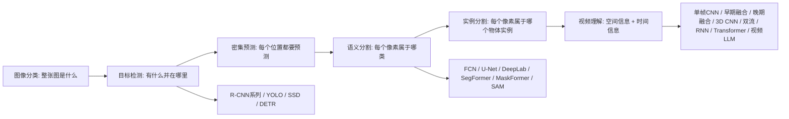

## 0. 本章先建立一个总框架

上一章讲的图像分类任务，输入是一张图片，输出一个类别，例如“猫”“狗”“汽车”。但真实视觉任务通常不止要知道“有什么”，还要知道：

- 物体在哪里：这就是目标检测。
- 每一个像素是什么类别：这就是语义分割。
- 同一类别里每一个独立个体分别是谁：这就是实例分割。
- 如果输入不是一张图，而是一段视频，还要理解动作、事件和时间顺序：这就是视频理解。

这几类任务的输出复杂度逐渐增加：

| 任务 | 输入 | 输出 | 输出粒度 | 例子 |
|---|---|---|---|---|
| 图像分类 | 一张图 | 一个或几个类别 | 图像级 | 这张图是猫 |
| 目标检测 | 一张图 | 类别 + 边界框 | 对象级 | 猫在左下角，狗在右上角 |
| 语义分割 | 一张图 | 每个像素的类别 | 像素级 | 这些像素是道路，那些像素是天空 |
| 实例分割 | 一张图 | 每个实例的像素掩码 | 实例级 + 像素级 | 第 1 个人和第 2 个人分别的轮廓 |
| 视频理解 | 一段视频 | 动作/事件类别、时间段、空间位置等 | 时空级 | 这个人在 3-8 秒正在跳跃 |

本章的核心思想是：视觉模型从“单个标签预测”走向“结构化预测”。输出不再只是一个类别，而可能是一组框、一张像素级预测图、一组对象掩码，或者一段视频中的时空事件。

## 1. 逐页覆盖清单

这一部分先保证 PPT 每一页都被覆盖，后面再把这些页面内容合并成连贯讲解。

| 页码 | 内容 |
|---:|---|
| 1 | 标题页：第七章“深度视觉模型（二）”，课程为深度学习导论，主讲教师王文冠。 |
| 2 | 目标检测定义：相比图像分类，目标检测不仅识别对象类别，还用边界框定位对象位置；应用包括自动驾驶、异常行为检测、医疗影像分析等。 |
| 3 | 单目标检测：共享卷积特征提取器加两个并行全连接头；分类头输出类别得分，用 Softmax Loss；回归头输出边界框坐标 `(x, y, w, h)`，用 L2 Loss；总损失为分类损失加 `lambda` 倍定位损失。 |
| 4 | 多目标检测：同一图像中要同时识别和定位多个目标；目标数量可变，而深度学习模型通常偏好固定维度输出，这是核心挑战。 |
| 5 | 滑动窗口朴素思路：在不同位置、尺寸、长宽比上滑动窗口，对每个窗口应用 CNN 分类器；问题是计算成本极高。 |
| 6 | 区域提议 Region Proposals：先快速找出可能包含物体的候选区域，再精细分类和定位；Selective Search 基于颜色、纹理、大小、形状等相似性，自底向上合并超像素，生成约 2000 个候选区域。 |
| 7 | R-CNN：用 Selective Search 生成 RoI，将每个 RoI 缩放到固定尺寸，例如 224x224，再分别通过预训练 CNN 提取特征。 |
| 8 | R-CNN 分类与精调：对每个 RoI 特征向量训练线性 SVM 分类器，并训练线性回归器预测边界框修正量 `(dx, dy, dw, dh)`。 |
| 9 | R-CNN 效率瓶颈：每张图约 2000 个 RoI，需要约 2000 次独立 CNN 前向传播；RoI 大量重叠，计算高度冗余。 |
| 10 | Fast R-CNN：整张图先过 ConvNet 得到共享特征图，再把 Selective Search 的 RoI 映射到特征图上裁剪特征块。 |
| 11 | Fast R-CNN 的 RoI Pooling：任意尺寸 RoI 特征块池化成固定尺寸特征图，使其能进入全连接层并支持端到端训练。 |
| 12 | Fast R-CNN 分类与精调：RoI Pooling 后接全连接层，再接 Softmax 分类器和边界框回归器；损失仍是分类损失与定位损失加权和。 |
| 13 | Fast R-CNN 优势与遗留问题：共享卷积计算、端到端训练、速度和精度提升；但 Selective Search 仍是外部 CPU 步骤，成为瓶颈。 |
| 14 | Faster R-CNN：引入 Region Proposal Network，RPN 与检测网络共享底层卷积特征，取代 Selective Search，实现 GPU 端到端训练和推理。 |
| 15 | RPN 锚点机制：在特征图每个空间位置预设 K 个不同尺度和长宽比的 Anchor Boxes，覆盖可能出现的物体形态。 |
| 16 | RPN 物体性二分类：每个锚点预测 Objectness 得分，即前景或背景，输出 `K x H x W` 概率图。 |
| 17 | RPN 边界框回归：对前景锚点预测 4 维修正量 `(dx, dy, dw, dh)`，输出 `4K x H x W` 的回归结果。 |
| 18 | Faster R-CNN 训练与推理：训练时 IoU 高的锚点为正样本，IoU 低的为负样本；推理时按 Objectness 排序，选约 300 个高分 proposal。 |
| 19 | 两阶段到单阶段：提出是否能摒弃区域提议阶段，直接从图像特征中预测类别和位置。 |
| 20 | 单阶段目标检测器：把检测转为密集预测，在特征图每个位置直接预测多个边界框和类别，代表有 YOLO、SSD、RetinaNet；每个网格单元预测框参数、置信度和 C 类得分。 |
| 21 | YOLO：You Only Look Once，把图像划分为 `S x S` 网格，每个网格直接预测边界框、置信度和类别概率，一次前向传播完成检测。 |
| 22 | YOLO 后处理：先用置信度筛掉低分框，再用非极大值抑制 NMS 去除重复框，保留最优结果。 |
| 23 | SSD 多尺度特征融合：用 CNN 不同层级特征图检测不同尺度物体；浅层高分辨率特征图检测小物体，深层低分辨率特征图检测大物体。 |
| 24 | SSD vs YOLO：YOLO 主要依赖最后特征图，对小物体和密集物体较弱；SSD 通过多尺度特征融合改善小物体检测。 |
| 25 | 单阶段检测器挑战：密集预测中绝大多数锚点或位置是背景，正负样本极端不平衡，训练被大量简单负样本主导。 |
| 26 | Focal Loss：标准交叉熵对所有样本一视同仁；Focal Loss 用调制因子降低易分样本权重，让模型更关注难分样本，从而缓解正负不平衡。 |
| 27 | DETR：CNN 主干加 Transformer 编码器-解码器，直接输出一组边界框，无需锚点和传统框变换；用匈牙利算法做二分匹配，再训练框回归。 |
| 28 | 密集预测：图像分类和目标检测属于稀疏预测；密集预测要求对每个像素预测，重点讨论语义分割和实例分割。备注给出 Springer 参考链接。 |
| 29 | 语义分割定义：为图像中每个像素分配语义类别标签，实现精细图像理解，应用于自动驾驶、医学影像、遥感等。 |
| 30 | 语义分割应用 1：自动驾驶；提供像素级环境感知，识别可行驶区域、车辆行人、车道线、交通标志；Cityscapes 数据集含 19 类像素级标注。 |
| 31 | 语义分割应用 2：医学影像；对 CT、MRI 等进行像素级标注，分割器官或病灶；BRATS 多模态脑 MRI 数据集含健康组织、水肿区、坏死区等。 |
| 32 | 语义分割应用 3：遥感图像；对卫星遥感和航空影像做像素级地物分类，识别建筑、道路、水体、植被、农田等。 |
| 33 | 语义分割引入：语义分割可以理解为像素级分类，但单个像素缺乏上下文，无法独立判断类别。 |
| 34 | 网络架构思考：是否可以借鉴图像分类，先对图片下采样，再做像素级预测。 |
| 35 | 下采样问题：分类下采样是为了增大感受野、理解语义，但语义分割需要像素级预测，过度下采样会丢位置。 |
| 36 | 另一种思路：是否可以不下采样，直接保持原分辨率预测。 |
| 37 | 不下采样问题：512x512、1024x1024 等大图会导致计算爆炸，同时影响上下文理解。 |
| 38 | 解决方案：采用下采样-上采样结构；下采样提取层次化、多尺度语义，上采样恢复空间分辨率。 |
| 39 | 上采样：把低分辨率特征图恢复到原始空间尺寸；方法包括反池化、最近邻插值、0 填充等。 |
| 40 | 线性插值：利用邻近已知点的加权平均估计未知点值，图中给出公式推导和几何意义。 |
| 41 | 双线性插值：进行两次线性插值，用目标点周围 4 个像素的加权平均计算新像素值。 |
| 42 | Max Unpooling：Max Pooling 不仅输出最大值，还记录最大值位置；Max Unpooling 用记录位置把值放回。 |
| 43 | 转置卷积：3x3 卷积核、stride=2、pad=1 等参数下，每个输入像素通过卷积核扩散到输出区域；重叠处求和，权重可学习。 |
| 44 | FCN：从图像分类到图像分割；把全连接层改成卷积层，整图分类变成像素级预测，支持任意尺寸输入，输出 heatmap 而非单一类别。 |
| 45 | FCN 架构：特征提取、全卷积化、分类层、上采样、像素级分割图；融合深层语义强但位置模糊的特征与浅层位置准但语义弱的特征。 |
| 46 | U-Net：对称编码器-解码器结构和密集跳跃连接，在恢复分辨率时保留空间细节，是小数据医学图像分割标杆。 |
| 47 | U-Net 下采样和上采样：编码器逐步压缩，解码器逐步恢复。 |
| 48 | U-Net 跳跃连接：将编码器对应阶段特征图与解码器上采样特征按通道拼接，保留边缘、纹理等空间细节，提高边界精度并实现多尺度融合。 |
| 49 | DeepLab v1/v2：针对多尺度目标和边界模糊，引入空洞卷积扩大感受野、捕获更多上下文。 |
| 50 | DeepLab v3：单一空洞率难以适配所有尺度，提出 ASPP，并行多个不同空洞率卷积加全局池化，捕获局部与全局上下文。 |
| 51 | DeepLab v3+：最终形态架构；改进 ASPP，加入 Batch Normalization，实现 Feature Map 跨 Block 融合。备注给出 arXiv 链接。 |
| 52 | SegFormer：基于 Transformer 骨干的语义分割代表；层次化 Mix Transformer Backbone 加轻量级 MLP Decoder，具有性能和效率优势。 |
| 53 | SegFormer 架构：由层次化 Transformer-based Encoder 和仅由几个 FC 构成的 Decoder 组成。 |
| 54 | SegFormer 细节：MiT-Bx Backbone 做层次化特征、重叠 Patch Embedding、Mix-FFN，具备更大感受野；All-MLP Decoder 因骨干强大而无需复杂结构。 |
| 55 | MaskFormer：提出掩码分类新范式，把问题转成预测一组 `{掩码, 类别}` 对，用 Query 和匈牙利匹配端到端训练，不再逐像素分类。 |
| 56 | MaskFormer 架构：Backbone + Pixel Decoder 生成像素嵌入，Transformer Decoder 处理 N 个 Query 生成对象级嵌入，通过 Query 与像素相似度生成候选掩码，并输出类别和掩码。 |
| 57 | MaskFormer Object Queries：N 个可学习 query 向量，每个 query 独立预测一个语义 mask 和一个全局类别标签，Transformer 解码器并行生成所有 mask。 |
| 58 | SAM：Meta Segment Anything Model，通过点、框、文本等提示实现 zero-shot 通用分割，提出“一个模型分割万物”的范式。 |
| 59 | SAM 可提示分割和 SA-1B：支持点 Prompt、框 Prompt、文本 Prompt；SA-1B 由模型加人工构建，含 11 亿以上掩码、1100 万以上图片。 |
| 60 | SAM 实验结果：突破闭集限制，可分割训练中未充分出现的类别；突破单一任务限制，可作为交互式分割、边缘检测、前景分割、语义/实例/全景分割等系统组件。 |
| 61 | 常见框架：MMEngine、Detectron2。 |
| 62 | 常见工具：WandB，用于结果曲线、Loss 曲线监控和结果可视化对比。 |
| 63 | 实例分割：为每个物体实例生成二值掩码；既要检测定位分类，又要像素级描绘；区别于图像分类、目标检测、语义分割。 |
| 64 | Mask R-CNN：在 Faster R-CNN 上增加预测掩码分支；共享主干和 RPN，含分类头、边界框回归头、掩码头；用 RoI Align 替代 RoI Pooling。 |
| 65 | RoI Pooling 问题：映射和池化中两次量化取整导致特征与原始 RoI 位置不对齐，对像素级实例分割影响明显。 |
| 66 | RoI Align：移除量化操作，用双线性插值精确采样 RoI 所需特征值，保持浮点坐标，提高像素级对齐精度。 |
| 67 | Mask R-CNN 掩码预测：掩码头为每个类别输出二值掩码，根据分类结果选择对应通道；掩码损失为预测 28x28 mask 与下采样真实 mask 的逐像素 sigmoid 交叉熵。 |
| 68 | Mask R-CNN 多功能性：可稍作修改用于人体姿态估计；Mask R-CNN 是高精度两阶段实例分割典范，也有 YOLACT、SOLO 等单阶段快速方法。 |
| 69 | 视频理解引入：从静态图像识别走向动态视频理解，应用包括监控、人机交互、内容审核等。 |
| 70 | 视频本质：按时间顺序排列的图像帧，即 2D + 时间；常表示为 `T x 3 x H x W` 或 `3 x T x H x W` 的 4D 张量。 |
| 71 | 视频动作分类：输入视频片段，输出动作类别；图像识别物体，视频识别动作或事件。 |
| 72 | 视频数据量挑战：未压缩标清约 1.5GB/分钟，高清约 10GB/分钟；实践中采样短 clips 训练，测试时多 clips 推理并平均。 |
| 73 | 单帧 CNN：把视频分类简化为每帧图像分类，再对每帧类别概率求平均；实现简单，是强基线。 |
| 74 | 早期融合：在输入层堆叠 T 帧 RGB 通道，得到 `(3T) x H x W` 超图像，送入标准 2D CNN，让第一层卷积比较不同帧像素差异。 |
| 75 | 早期融合局限：第一层 2D 卷积会把时间信息压缩掉，后续网络无法访问原始时间结构，难以捕获复杂长时序动作。 |
| 76 | 晚期融合方式 A：对每帧用 2D CNN 提取高层特征，将所有帧特征向量拼接成长向量，再送入 MLP 分类。 |
| 77 | 晚期融合方式 B：每帧提取特征后，在时间和空间维度上全局平均池化，得到视频级特征向量，再接线性分类器。 |
| 78 | 晚期融合局限：每帧独立处理，难以直接比较帧间底层运动信息，如像素位移，局部精细运动建模弱。 |
| 79 | 3D CNN：把 2D CNN 的卷积和池化替换为 3D 版本，在整个网络中逐步同步融合空间和时间信息，每层保持时空结构。 |
| 80 | 早期融合 vs 晚期融合 vs 3D CNN：3D 卷积精度更高，但计算开销极高。 |
| 81 | 运动识别与光流：运动信息对视频理解非常重要；光流是二维向量场，描述相邻帧每个像素位移 `(dx, dy)`，水平和垂直分量可用灰度图表示。 |
| 82 | 运动识别融合：在预测阶段融合两个流的 softmax 分数或使用 SVM；双流网络显著超越仅使用空间信息或早期/晚期融合方法，说明显式建模运动有效。 |
| 83 | 长期时序建模问题：3D CNN、双流网络主要处理约 2-5 秒短片段，复杂活动需要建模跨数十秒甚至数分钟的长期依赖和事件顺序。 |
| 84 | RNN/LSTM：使用 CNN 提取逐帧局部特征，再按时间顺序送入 RNN；最终状态或全部状态用于预测，理论上可捕获任意长度依赖。 |
| 85 | 循环卷积网络：把 RNN 递归思想和 CNN 权重共享结合；每层在时间步 t 的输出取决于当前时间步上一层输出和同一层上一时间步输出；参数更少并保留空间局部性，但难以并行。 |
| 86 | 时空自注意力：把自注意力机制应用于 3D CNN 特征图，捕获长距离时空依赖，并行化序列建模。 |
| 87 | I3D：将 2D 网络膨胀为 3D，复用图像上成功的 2D CNN 架构，把 2D 卷积核和池化核扩展为 3D。 |
| 88 | 从 CNN 到 Transformer：Vision Transformer 及其变体，如 MViT、VideoMAE，已成为视频理解主流和 SOTA 架构。 |
| 89 | 时序动作定位：未修剪长视频中不仅识别动作类别，还定位动作起止时间，是视频领域的一维时间轴目标检测。 |
| 90 | 时空动作检测：在未修剪长视频中，同时在空间上定位人物框、在时间上定位动作起止，并识别原子动作；挑战包括外观、姿态、运动和精确时空定位。 |
| 91 | 视频大语言模型：视频编码器如 ViViT、VideoMAE 与 LLM 结合，实现开放词汇视频问答、视频描述生成、基于指令的视频内容理解；PPT 称其为通向 AGI 的重要一步。 |

## 2. 第一部分：目标检测

### 2.1 从图像分类到目标检测

图像分类只回答一个问题：这张图里主要是什么。目标检测要回答两个问题：

1. 图像里有哪些对象。
2. 每个对象在哪里。

“在哪里”通常用边界框表示。边界框一般写成 `(x, y, w, h)`：

- `x, y`：框的位置。不同资料可能把 `(x, y)` 定义成左上角坐标，也可能定义成中心点坐标，要看具体约定。
- `w`：框宽度。
- `h`：框高度。

目标检测比分类更难，因为它的输出不是一个固定类别标签，而是一组对象，每个对象都带有类别和位置。

```text
图像分类：
输入图片 -> cat

目标检测：
输入图片 -> [
  {class: cat, box: (x1, y1, w1, h1)},
  {class: dog, box: (x2, y2, w2, h2)}
]
```

目标检测的应用非常多：

- 自动驾驶：检测行人、车辆、交通标志。
- 异常行为检测：监控视频中发现异常对象或行为。
- 医疗影像分析：定位病灶、器官或异常区域。

### 2.2 单目标检测：分类头 + 回归头

单目标检测是最简单的检测形式：一张图中只需要检测一个目标对象。PPT 中的结构是：

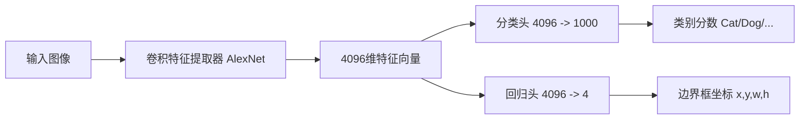

它的关键是“共享特征提取器 + 两个任务头”：

- 前面的 CNN 负责把图像变成高层特征向量，例如 4096 维。
- 分类头输出类别得分，例如 Cat 0.9、Dog 0.05。
- 回归头输出 4 个数，也就是边界框坐标。

训练时有两个损失：

```text
总损失 = 分类损失 + lambda * 定位损失
```

分类损失通常用 Softmax Loss。它衡量模型把类别分对没有。定位损失在 PPT 中写为 L2 Loss。它衡量预测框坐标和真实框坐标之间的差距。

这里的 `lambda` 是一个权重，用来平衡分类和定位的重要性。如果 `lambda` 太小，模型可能只重视分类，不重视框准不准；如果太大，模型可能过度重视定位，影响分类。

### 2.3 为什么多目标检测困难

多目标检测中，一张图片可能有 0 个、1 个、5 个、20 个目标，而且目标可能属于同一类别，也可能属于不同类别，还可能互相遮挡、大小差异很大。

这里出现了一个根本矛盾：

- 深度学习模型通常偏好固定维度输出。
- 多目标检测需要可变数量输出。

例如：

```text
图片 A：1 个目标 -> 4 个坐标 + 1 个类别
图片 B：4 个目标 -> 4 套坐标 + 4 个类别
图片 C：很多目标 -> 很多套坐标和类别
```

如果硬要把输出做成固定长度，就必须预先决定“最多检测多少个目标”，这既不自然，也不高效。因此目标检测模型需要特殊设计。

### 2.4 滑动窗口：最朴素但很慢

一个直接想法是滑动窗口：

1. 在图像上取一个窗口。
2. 用 CNN 判断这个窗口里有没有物体，是猫、狗还是背景。
3. 把窗口向右或向下移动。
4. 改变窗口大小和长宽比，再重复。

这个方法直观，但计算量巨大。因为你要尝试大量：

- 位置。
- 尺度。
- 长宽比。

每个窗口都跑一次 CNN，成本会非常高。更糟的是，很多窗口彼此重叠，CNN 重复计算了大量相同区域。

### 2.5 区域提议：先找可能有物体的地方

为了解决滑动窗口的低效，PPT 引入区域提议 Region Proposals。思想是：

> 不要在所有可能窗口上都做精细分类，先快速找出“可能包含物体”的候选区域，再对这些区域做精细判断。

经典区域提议方法是 Selective Search。它的做法大致是：

1. 先把图像分成很多小的超像素区域。
2. 根据颜色、纹理、大小、形状等相似性，把相似区域自底向上合并。
3. 得到大约 2000 个“blobby”候选区域。

这样，模型不再需要枚举海量窗口，只需要处理几百到几千个候选区域。

## 3. R-CNN 系列：从慢到快

R-CNN 系列是目标检测早期非常重要的路线。它的演进可以总结为：

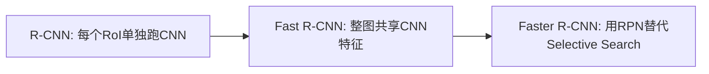

### 3.1 R-CNN：Region-based CNN

R-CNN 的完整流程：

1. 用 Selective Search 生成约 2000 个感兴趣区域 RoI。
2. 把每个 RoI 独立缩放到固定尺寸，例如 224x224。
3. 每个 RoI 独立送入预训练 CNN 提取特征。
4. 用线性 SVM 对 RoI 特征分类。
5. 用线性回归器修正边界框，预测 `(dx, dy, dw, dh)`。

RoI 是 Region of Interest，意思是“感兴趣区域”。在目标检测里，它就是模型认为可能包含物体的候选框。

R-CNN 的重要贡献是证明了：CNN 特征比传统手工特征更适合做目标检测，检测精度显著提升。

但它的问题也非常明显：太慢。

为什么慢？因为每张图约 2000 个 RoI，每个 RoI 都要单独过 CNN。假设很多 RoI 重叠，重叠区域会被反复卷积计算。模型没有共享计算。

### 3.2 Fast R-CNN：共享整图卷积特征

Fast R-CNN 的关键改进是：

> 不要让每个 RoI 单独跑 CNN，而是整张图只跑一次 CNN。

流程变成：

1. 整张图输入 ConvNet，得到共享特征图，例如 conv5。
2. Selective Search 仍然生成 RoI。
3. 把原图中的 RoI 映射到特征图上。
4. 从特征图上裁剪对应 RoI 特征块。
5. 用 RoI Pooling 把不同尺寸的 RoI 特征块变成固定尺寸。
6. 接全连接层，再接分类头和边界框回归头。

为什么要 RoI Pooling？因为 RoI 大小不一样，裁剪出来的特征块大小也不一样。但全连接层需要固定长度输入。RoI Pooling 就把任意尺寸的 RoI 特征块池化成固定尺寸特征图。

Fast R-CNN 的优势：

- 共享卷积计算，速度大幅提升。
- 可以端到端训练。
- 精度高。

遗留问题：

- Selective Search 仍然是外部算法。
- Selective Search 在 CPU 上运行。
- 它不是神经网络的一部分，成为整体系统瓶颈。

### 3.3 Faster R-CNN：让神经网络自己产生候选框

Faster R-CNN 的关键改进是 RPN，即 Region Proposal Network。

RPN 取代 Selective Search，直接在神经网络内部产生候选区域。它和检测网络共享底层卷积特征，所以可以在 GPU 上端到端训练和推理。

#### 3.3.1 Anchor Boxes

RPN 在特征图每个空间位置上预设 K 个 Anchor Boxes。Anchor 是“锚点框”，可以理解为一组默认候选框。它们有不同尺度和长宽比，用来覆盖物体可能出现的形态。

例如在某个特征图位置，可以放：

- 小正方形框。
- 大正方形框。
- 横向长框。
- 纵向长框。

如果特征图大小是 `H x W`，每个位置有 `K` 个 anchor，那么总 anchor 数是：

```text
K x H x W
```

#### 3.3.2 Objectness：这个 anchor 像不像物体

RPN 对每个 anchor 预测一个 Objectness 得分。它不是具体类别，而是“有没有物体”的二分类：

- 前景：包含物体。
- 背景：不包含物体。

因此 RPN 输出一个 `K x H x W` 的概率图。

#### 3.3.3 边界框回归

RPN 还要对前景 anchor 预测 4 个修正量：

```text
(dx, dy, dw, dh)
```

这些修正量用于把原始 anchor 调整到更接近真实物体的位置和尺寸。因此边界框回归输出维度是：

```text
4K x H x W
```

#### 3.3.4 训练和推理

训练时，需要判断哪些 anchor 是正样本、哪些是负样本。PPT 中用 IoU 来判断。

IoU 是 Intersection over Union，交并比：

```text
IoU = 预测框与真实框的交集面积 / 预测框与真实框的并集面积
```

- IoU 高的 anchor 视为正样本。
- IoU 低的 anchor 视为负样本。

推理时，对所有 `K x H x W` 个 anchor 按 Objectness 得分排序，选取得分最高的大约 300 个作为最终 proposals。

## 4. 单阶段目标检测：YOLO、SSD、RetinaNet、DETR

两阶段检测器先产生候选区域，再分类和回归。单阶段检测器试图跳过候选区域阶段，直接在特征图上密集预测。

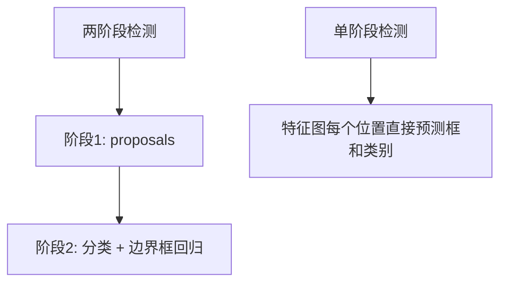

### 4.1 单阶段检测器的基本形式

单阶段检测器把检测看成密集预测问题。在特征图每个位置上，直接预测多个边界框和类别。

PPT 中提到每个网格单元会对每个 base box 回归最终边界框的 5 个参数：

```text
(dx, dy, dh, dw, confidence)
```

还会预测 `C` 个类别得分，通常包含背景类。

它看起来很像 RPN，但区别在于：

- RPN 只关心“是不是物体”，不关心具体类别。
- 单阶段检测器直接做特定类别检测。

### 4.2 YOLO：You Only Look Once

YOLO 的思想是：一眼看完整张图，一次前向传播完成检测。

流程：

1. 把输入图像划分成 `S x S` 网格。
2. 每个网格预测边界框坐标。
3. 每个网格预测置信度。
4. 每个网格预测类别概率。
5. 经过一次前向传播得到全图检测结果。

YOLO 的优点是速度快，适合实时目标检测。

但 YOLO 会产生许多候选框，所以还需要后处理。

### 4.3 NMS：非极大值抑制

YOLO 后处理包括：

1. 置信度筛选：删掉低分框。
2. 非极大值抑制 NMS：删掉重复检测框。

NMS 的直觉是：如果多个框都框住了同一个物体，只保留分数最高的那个，把与它高度重叠的其他框删掉。

```text
候选框排序 -> 取最高分框 -> 删除与它 IoU 高的低分框 -> 继续
```

NMS 解决的是“一个物体被多个框重复检测”的问题。

### 4.4 SSD：多尺度特征融合

SSD 的核心思想是：不同层级的 CNN 特征图适合检测不同尺度的物体。

- 浅层特征图分辨率高，保留更多空间细节，适合检测小物体。
- 深层特征图分辨率低，语义更强，适合检测大物体。

相比 YOLO 主要依赖最后的特征图，SSD 使用多尺度特征图，因此对小物体和密集物体更友好。

### 4.5 单阶段检测器的正负样本不平衡

单阶段检测器在特征图上密集预测，因此会产生大量候选位置和 anchor。问题是：绝大多数位置是背景。

这会带来正负样本极端不平衡：

```text
正样本：真正包含物体的位置，很少
负样本：背景位置，非常多
```

如果直接使用普通交叉熵，模型训练会被大量简单负样本主导。模型很容易学会“这里不是物体”，但真正困难的目标样本反而贡献不够。

### 4.6 Focal Loss

Focal Loss 的目的就是让模型少关注简单样本，多关注困难样本。

标准交叉熵可以写成：

```text
CE(pt) = -log(pt)
```

其中 `pt` 是模型对正确类别的预测概率。`pt` 越高，说明样本越容易、模型越有信心。

Focal Loss 在交叉熵前加调制因子：

```text
FL(pt) = -(1 - pt)^gamma log(pt)
```

有时还会加类别平衡因子 `alpha`：

```text
FL(pt) = -alpha_t (1 - pt)^gamma log(pt)
```

如果样本很容易，`pt` 接近 1，那么 `(1 - pt)^gamma` 接近 0，这个样本的损失权重会被压低。如果样本很难，`pt` 较低，调制因子不会太小，模型会继续重点学习。

Focal Loss 让单阶段检测器的精度能够媲美甚至超过两阶段检测器，是 RetinaNet 的关键思想。

### 4.7 DETR：用 Transformer 做集合预测

DETR 是另一种目标检测范式。它的核心架构是：

```text
CNN 主干 + Transformer 编码器-解码器
```

DETR 的特别之处：

- 不需要 anchor。
- 不需要传统边界框变换。
- 直接从 Transformer 输出一组边界框。
- 用匈牙利算法做预测框和真实框的一对一匹配。

目标检测本质上输出的是一个集合：图像里有若干对象，顺序并不重要。DETR 就把检测视为集合预测问题。

匈牙利匹配的作用是：模型输出 N 个预测框，真实图中有 M 个目标，训练时需要决定“哪个预测框对应哪个真实目标”。匈牙利算法会找到代价最小的一组一对一匹配。

## 5. 第二部分：密集预测与语义分割

### 5.1 从稀疏预测到密集预测

图像分类和目标检测仍然是稀疏预测：

- 图像分类输出一个类别。
- 目标检测输出若干对象框。

语义分割和实例分割属于密集预测，因为它们要求模型对每个像素做预测。

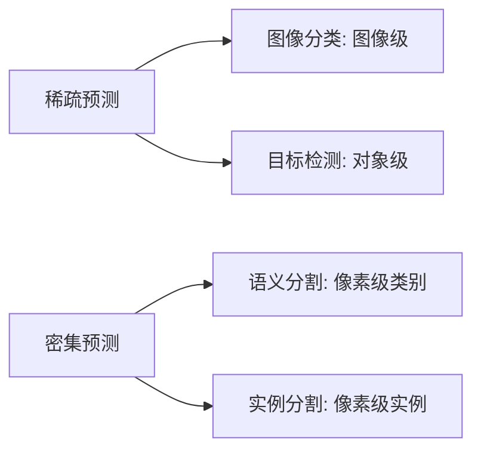

PPT 备注中给出一个密集预测相关参考链接：`https://link.springer.com/article/10.1007/s13735-017-0141-z`。

### 5.2 语义分割是什么

语义分割是为图像中的每一个像素分配一个类别标签。

例如自动驾驶图像中：

- 这些像素是道路。
- 这些像素是车。
- 这些像素是行人。
- 这些像素是天空。
- 这些像素是建筑。

它和图像分类的区别是：

```text
图像分类：这张图是街景
语义分割：每个像素分别是道路/车/行人/天空/建筑
```

### 5.3 语义分割的应用

#### 自动驾驶

语义分割为自动驾驶提供像素级环境感知能力。它能识别：

- 可行驶区域。
- 车辆和行人等动态障碍物。
- 车道线。
- 交通标志。
- 道路和背景结构。

这些结果可以为路径规划、避障决策和安全控制提供输入。PPT 提到 Cityscapes 数据集，它是城市街景语义分割标准数据集，含 19 类像素级标注。

#### 医学影像

医学影像中，语义分割可以对 CT、MRI 等图像做像素级标注，分割：

- 心脏。
- 肝脏。
- 肿瘤。
- 病灶区域。

它能辅助医生快速诊断、做量化分析，也能用于手术路径规划和治疗效果监测。

PPT 提到 BRATS 数据集：它是多模态脑部 MRI 图像数据集，内容包括健康组织、水肿区、坏死区等多区域标注。临床意义包括定位肿瘤、量化肿瘤体积和生长速度。

#### 遥感图像

遥感语义分割对卫星或航空影像做像素级地物分类，自动识别：

- 建筑物。
- 道路。
- 水体。
- 植被。
- 农田。

它可以用于土地覆盖分类、城市变化检测、灾害监测等。

### 5.4 语义分割为什么不能逐像素独立分类

你可能会想：既然语义分割是像素级分类，那能不能直接对每个像素分类？

问题是单个像素信息太少。一个绿色像素可能是：

- 草地。
- 树叶。
- 交通灯。
- 衣服。

它的类别必须结合上下文判断。因此语义分割需要既看局部细节，又看全局语义。

### 5.5 网络架构的两种朴素想法

#### 朴素想法 1：像分类网络一样下采样

分类网络通常不断下采样，因为分类只需要知道图里是什么，不需要精确恢复每个像素位置。下采样能：

- 增大感受野。
- 提取高层语义。
- 降低计算量。

但语义分割要输出像素级预测。如果下采样太多，空间分辨率变低，边界位置会模糊。

#### 朴素想法 2：完全不下采样

另一种想法是不下采样，始终保持原分辨率预测。

问题是计算量会爆炸。对于 512x512、1024x1024 这类图像，如果每一层都保持高分辨率，显存和计算成本很高。同时，不下采样也不利于扩大感受野，模型难以理解大范围上下文。

### 5.6 编码器-解码器：下采样再上采样

语义分割常用解决方案是下采样-上采样结构：

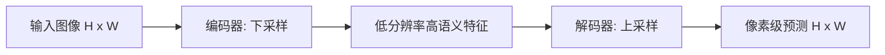

编码器负责：

- 提取层次化特征。
- 捕获多尺度上下文。
- 压缩空间尺寸，降低计算开销。

解码器负责：

- 恢复空间分辨率。
- 输出像素级预测。
- 尽可能恢复边界和位置细节。

## 6. 上采样方法

上采样就是把低分辨率特征图恢复到更高分辨率。

### 6.1 最近邻插值

最近邻插值是最简单的上采样。新位置的值直接取最近原像素的值。

优点：

- 简单。
- 快。

缺点：

- 结果容易块状化。
- 不够平滑。

### 6.2 线性插值

线性插值用邻近已知点的加权平均估计未知点。

一维情况下，如果已知 `(x0, y0)` 和 `(x1, y1)`，要估计 `x` 处的 `y`，公式是：

```text
y = ((x1 - x) / (x1 - x0)) * y0 + ((x - x0) / (x1 - x0)) * y1
```

如果 `x` 更靠近 `x0`，`y0` 权重更大；如果更靠近 `x1`，`y1` 权重更大。

### 6.3 双线性插值

双线性插值用于二维图像。它本质上是做两次线性插值：

1. 先在水平方向插值。
2. 再在垂直方向插值。

它利用目标点周围 4 个相邻像素的加权平均来计算新像素值。它比最近邻更平滑，也常用于 RoI Align 等需要精确采样的位置。

### 6.4 Max Unpooling

Max Pooling 做下采样时，通常只保留窗口里的最大值。Max Unpooling 的思路是：如果池化时记录了最大值来自哪个位置，上采样时就把这个值放回原位置。

```text
Max Pooling:
记录最大值 + 最大值位置

Max Unpooling:
按记录位置把最大值放回，其余位置补 0
```

这种方法能部分恢复池化前的位置结构。

### 6.5 转置卷积

转置卷积是一种可学习的上采样方法。PPT 中给的例子是：

- 3x3 卷积核。
- stride=2。
- pad=1。

机制是：每个输入像素通过卷积核“扩散”到输出的一个 3x3 区域。多个输入像素影响同一个输出位置时，对应位置求和。因为卷积核权重可训练，所以模型可以学习如何上采样，而不是使用固定插值规则。

注意：转置卷积常被称为 deconvolution，但它并不是真正数学意义上的反卷积。

## 7. FCN：把分类网络改成分割网络

FCN 是 Fully Convolutional Network，全卷积网络。它的核心思想是：

> 把图像分类网络中的全连接层换成卷积层，使网络输出空间热力图，而不是单一类别。

分类网络后面常有全连接层，全连接层会固定输入尺寸，并输出整张图的类别。FCN 把它改成卷积形式后，可以支持任意尺寸输入，并输出像素级预测图。

FCN 的流程：

1. 特征提取。
2. 全卷积化。
3. 分类层。
4. 上采样。
5. 像素级分割图。

### 7.1 多尺度特征融合

FCN 还强调融合不同层特征：

- 深层特征：语义强，但位置模糊。
- 浅层特征：位置准，但语义弱。

语义分割既要知道“这是什么”，又要知道“边界在哪里”。所以要把深层语义和浅层细节结合起来。

## 8. U-Net：编码器-解码器加跳跃连接

U-Net 是医学图像分割中非常经典的结构。它的名字来自网络形状像字母 U。

U-Net 的主要部分：

- 左侧编码器：不断下采样，提取语义。
- 右侧解码器：不断上采样，恢复分辨率。
- 中间瓶颈：压缩后的高层特征。
- 跳跃连接：把编码器对应层特征传给解码器。

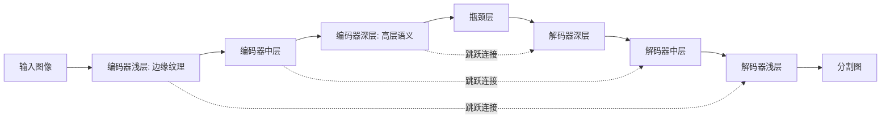

### 8.1 跳跃连接为什么重要

PPT 中强调 U-Net 的跳跃连接是按通道拼接：

```text
decoder_feature = concat(encoder_feature, upsampled_decoder_feature)
```

这样做有几个好处：

- 保留空间细节：浅层边缘、纹理信息直接传到解码端。
- 精确定位：解码时知道细节位置，提高分割边界精度。
- 多尺度融合：深层语义和浅层细节结合，让网络自己学习如何组合。

U-Net 特别适合小数据医学图像分割，因为医学图像标注昂贵，而 U-Net 的结构能高效利用有限数据。

## 9. DeepLab 系列：空洞卷积和多尺度上下文

DeepLab 是语义分割经典系列，主要解决两个问题：

1. 多尺度目标：同一类别物体可能大小差异很大。
2. 边界模糊：深层特征和上采样会让边界不够准确。

### 9.1 空洞卷积

空洞卷积也叫扩张卷积、Atrous Convolution。它在卷积核元素之间插入空洞，从而扩大感受野，但不增加太多参数。

普通 3x3 卷积看到的是连续 3x3 区域。空洞卷积可以让 3x3 卷积核覆盖更大的区域，从而捕获更多上下文。

优点：

- 增大感受野。
- 保持特征图分辨率。
- 参数量不明显增加。

### 9.2 DeepLab v3：ASPP

单一空洞率无法适配所有目标尺度。小物体需要细粒度局部信息，大物体需要更大上下文。

DeepLab v3 提出 ASPP，Atrous Spatial Pyramid Pooling。它并行使用多个不同空洞率的卷积，再加全局池化。

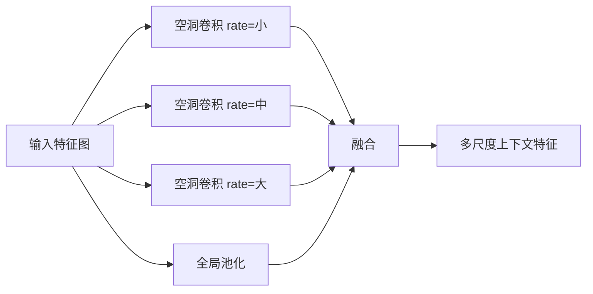

这样模型能同时捕获局部细节和全局上下文。

### 9.3 DeepLab v3+

PPT 中写到 DeepLab v3+ 的最终形态：

- 改进 ASPP。
- 加入 Batch Normalization。
- 实现 Feature Map 的跨 Block 融合。

可以把 DeepLab v3+ 理解为更完整的编码器-解码器式 DeepLab：编码器用空洞卷积和 ASPP 建模上下文，解码器进一步恢复边界细节。PPT 备注给出链接：`https://arxiv.org/pdf/2105.15203`。

## 10. Transformer 进入语义分割：SegFormer、MaskFormer、SAM

### 10.1 SegFormer

SegFormer 是基于 Transformer 骨干网络的语义分割代表工作。PPT 中强调两点：

- 层次化 Mix Transformer Backbone。
- 轻量级 MLP Decoder。

传统 CNN 通过卷积和池化自然形成层次结构。Transformer 原本更常处理序列，SegFormer 则设计了适合视觉分割的层次化结构。

#### MiT-Bx Backbone

PPT 中列出 MiT-Bx Backbone 的特点：

- 层次化特征提取。
- 重叠 Patch Embedding。
- 混合前馈网络 Mix-FFN。
- 相比传统 baseline 具备更大感受野。

“重叠 Patch Embedding”可以理解为切 patch 时不是完全不重叠，而是保留邻近 patch 的连续性，这对图像边界和局部结构更友好。

#### All-MLP Decoder

SegFormer 的解码器非常轻量，只由几个 FC 或 MLP 构成。原因是 MiT Backbone 已经提供了较强的多尺度、长距离建模能力，因此解码器不需要很复杂。

### 10.2 MaskFormer：从逐像素分类到掩码分类

传统语义分割通常是逐像素分类：每个像素独立预测一个类别。MaskFormer 改变了范式：

> 不再问每个像素属于哪个类别，而是预测一组 `{mask, class}`。

也就是说，模型输出若干个候选 mask，每个 mask 配一个类别。

MaskFormer 的关键点：

- 使用 N 个可学习 Object Queries。
- 每个 query 预测一个 mask 和一个类别。
- 用 Transformer Decoder 并行处理所有 query。
- 用匈牙利匹配实现端到端训练。

架构可以理解为：

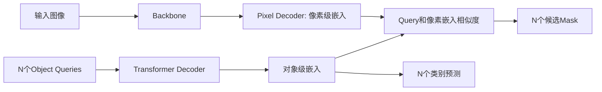

语义分割推理时，可以把同类 mask 聚合成最终分割图。

### 10.3 SAM：Segment Anything Model

SAM 是 Meta 发布的分割基础模型。PPT 称其为大模型时代的代表。

SAM 的关键特点：

- 支持提示式交互。
- 可使用点 Prompt。
- 可使用框 Prompt。
- PPT 还列出文本 Prompt。
- 实现 zero-shot 通用分割。

“zero-shot”意思是：模型没有专门针对某个新类别或新任务重新训练，也能直接泛化到它。

SAM 背后的重要数据集是 SA-1B：

- 11 亿以上掩码。
- 1100 万以上图片。
- 由模型和人工共同构建。

PPT 中还强调 SAM 的两个突破：

1. 突破闭集限制：即使某些多样化物体类别训练中没有充分出现，SAM 仍可能有效分割。
2. 突破单一任务限制：SAM 可作为更大系统中的组件，用于交互式分割、边缘检测、前景分割、语义分割、实例分割、全景分割等。

### 10.4 常见框架与工具

PPT 提到两个常见框架：

- MMEngine：OpenMMLab 生态中的训练基础框架，常与检测、分割等工具链配合。
- Detectron2：Facebook AI Research 开源的检测与分割框架，常用于目标检测、实例分割、关键点检测等。

PPT 还提到 WandB：

- 监控结果曲线。
- 监控 Loss 曲线。
- 做结果可视化对比。

对初学者来说，WandB 这类工具的价值是：训练深度模型时不能只看最终准确率，还要观察训练过程是否稳定、是否过拟合、不同实验配置之间有什么差异。

## 11. 实例分割与 Mask R-CNN

### 11.1 实例分割是什么

实例分割要为图像中的每一个物体实例生成一个二值掩码 Binary Mask。

它比语义分割更细：

- 语义分割只区分类别。
- 实例分割还要区分同一类别的不同个体。

例如图中有三个人：

- 语义分割：这些像素都是“人”。
- 实例分割：这些像素是第 1 个人，那些像素是第 2 个人，另一些像素是第 3 个人。

和前面任务的区别：

| 任务 | 能知道什么 | 不足 |
|---|---|---|
| 图像分类 | 图片里有什么 | 不知道位置和轮廓 |
| 目标检测 | 物体类别和大致框 | 不知道精确轮廓 |
| 语义分割 | 每个像素类别 | 不区分同类不同个体 |
| 实例分割 | 每个实例的像素轮廓 | 任务最复杂，要求对齐精度高 |

### 11.2 Mask R-CNN

Mask R-CNN 在 Faster R-CNN 基础上增加了掩码分支。它的结构包括：

- 共享主干网络。
- RPN。
- 分类头。
- 边界框回归头。
- 掩码头。
- RoI Align。

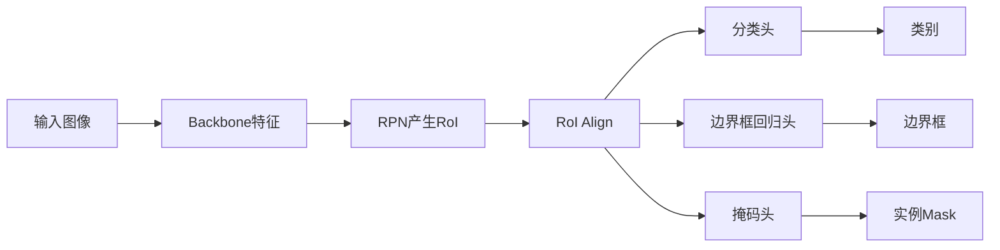

Mask R-CNN 的核心难点是：实例分割要像素级对齐。如果 RoI 特征和原图位置对不齐，mask 边界就会错。

### 11.3 RoI Pooling 的量化问题

RoI Pooling 有两次量化，也就是取整：

1. 把原图 RoI 映射到特征图时取整。
2. 把 RoI 分成固定 bins 时取整。

PPT 举例：一个 `4 x 5` 的 RoI 要池化成 `2 x 2` 输出，理想情况下每个 bin 高宽应当是 `2 x 2.5`。但 RoI Pooling 会把 2.5 取整成 2 或 3，导致实际池化区域偏离等分位置。

对于分类任务，这点偏差可能问题不大。但对于实例分割，mask 边界需要像素级准确，这种偏差会明显影响结果。

### 11.4 RoI Align

RoI Align 的解决方案是：

- 移除量化操作。
- 保留浮点坐标。
- 用双线性插值从特征图上精确采样。

例如某个 bin 左上角是 `(0, 0)`，右下角是 `(2, 2.5)`。RoI Align 不把 2.5 强行取整，而是用周围四个像素通过双线性插值计算采样值。

这保证每个特征值更准确地反映实际覆盖区域，提高 mask 的像素级对齐精度。

### 11.5 Mask R-CNN 的掩码预测

Mask R-CNN 的掩码头为每个类别输出一个二值 mask。最终使用哪个 mask？

1. 分类头先预测 RoI 属于哪个类别。
2. 掩码头输出每个类别对应的 mask。
3. 根据分类结果，只选择对应类别的 mask 通道作为最终输出。

训练目标包括：

- 分类损失：与 Faster R-CNN 相同。
- 边界框损失：与 Faster R-CNN 相同。
- 掩码损失：把 RoI 内真实 mask 下采样，与网络预测的 `28 x 28` mask 计算逐像素 sigmoid 交叉熵。

### 11.6 Mask R-CNN 的扩展

PPT 提到 Mask R-CNN 稍作修改可用于人体姿态估计。关键点，例如关节，可以视为一种特殊的“实例”来预测。

PPT 也强调：

- Mask R-CNN 是两阶段实例分割的典范，精度高。
- YOLACT、SOLO 等单阶段实例分割方法追求速度。

## 12. 第三部分：视频理解

### 12.1 从静态图像到动态视频

前面四个任务主要针对 2D 静态图像：

- 图像分类。
- 目标检测。
- 语义分割。
- 实例分割。

视频理解进一步加入时间维度。

视频本质上是一连串按时间顺序排列的图像帧：

```text
视频 = 2D 图像 + 时间
```

常见张量表示：

```text
T x 3 x H x W
```

或：

```text
3 x T x H x W
```

其中：

- `T` 是帧数。
- `3` 是 RGB 通道。
- `H, W` 是图像高和宽。

视频理解的核心挑战是：如何有效建模时间维度。

### 12.2 视频动作分类

PPT 中的视频任务定义是：给定一个视频片段，预测它所属的动作类别。

图像识别更关注“物体”：

```text
dog / cat / fish / truck
```

视频识别更关注“动作”或“事件”：

```text
swimming / running / jumping / eating / standing
```

输入是视频片段，输出是一个动作类别。

### 12.3 视频数据量太大

PPT 给出未压缩视频的数据量：

- 标清约 1.5 GB/分钟。
- 高清约 10 GB/分钟。

所以实践中通常不直接在完整长视频上训练，而是采样短片段 clips。

训练阶段：

- 从长视频中采样短片段。
- 模型学习对短片段分类。

测试阶段：

- 对多个片段分别推理。
- 平均预测结果，得到最终视频级预测。

## 13. 视频理解的几种基础模型

### 13.1 单帧 CNN

单帧 CNN 是最简单的基线：

1. 把视频拆成帧。
2. 每一帧独立送入 2D CNN。
3. 得到每帧类别概率。
4. 在时间维度上平均。

优点：

- 实现简单。
- 可以直接复用图像分类模型。
- 常作为强基线。

缺点：

- 基本没有真正建模运动。
- 如果两个动作单帧看起来相似，就容易混淆。

例如“站起来”和“坐下”某些单帧可能很像，真正区别在时间变化。

### 13.2 早期融合

早期融合在输入层融合时间信息。做法是把 T 帧 RGB 通道堆叠成一个“超图像”：

```text
T 帧，每帧 3 x H x W
堆叠后：3T x H x W
```

然后送入标准 2D CNN。

直觉是：第一层卷积可以直接比较不同帧之间的像素差异。

但局限也明显：

- 第一层卷积会把时间信息压缩成 `D x H x W`。
- 后续网络无法访问原始时间结构。
- 只有很浅的一层在处理时间，复杂长时序动作不够。

### 13.3 晚期融合

晚期融合先独立提取每帧高层特征，再在特征层面融合时间信息。

方式 A：MLP

1. 每帧用 2D CNN 提取特征。
2. 把所有帧的特征向量拼接成一个长向量。
3. 送入 MLP 分类。

方式 B：Pooling

1. 每帧用 2D CNN 提取特征。
2. 在时间和空间维度上做全局平均池化。
3. 得到紧凑的视频级特征向量。
4. 送入线性分类器。

晚期融合的局限是：每帧独立处理，模型难以直接比较帧与帧之间的底层运动信息，例如像素位移，因此对精细局部运动建模较弱。

### 13.4 3D CNN

3D CNN 把 2D CNN 中的卷积和池化换成 3D 版本。

2D 卷积核只在空间维度滑动：

```text
height x width
```

3D 卷积核在时间和空间维度滑动：

```text
time x height x width
```

这样每一层都能逐步融合时间和空间信息，特征图保留完整时空结构。

优点：

- 比早期融合和晚期融合更自然地建模视频。
- 精度通常更高。

缺点：

- 计算开销极高。
- 显存消耗大。

PPT 第 80 页总结：3D 卷积精度更高，但是计算开销也极其高昂。

## 14. 运动识别、光流和双流网络

### 14.1 光流是什么

运动信息是视频理解中非常关键的线索，有时比外观信息更重要。

光流 Optical Flow 是一个二维向量场，描述从一帧到下一帧每个像素的位移：

```text
(dx, dy)
```

- `dx` 是水平方向位移。
- `dy` 是垂直方向位移。

水平分量和垂直分量都可以用灰度图表示，共同构成运动模式。

### 14.2 双流网络

PPT 第 82 页提到融合策略：在预测阶段，将两个流的 softmax 分数平均，或使用 SVM 等方法融合。

这里的两个流通常指：

- 空间流：输入 RGB 图像，关注外观信息。
- 时间流：输入光流，关注运动信息。

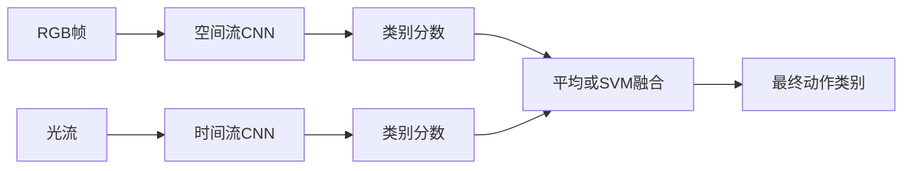

PPT 图中展示双流网络显著超越只用空间信息或早期/晚期融合方法，说明显式建模运动是有效的。图中的 UCF-101 结果大意是：3D CNN、只用空间流、只用时间流、双流平均、双流 SVM 逐步提升，其中双流 SVM 最高，约 88。

## 15. 长期时序建模

3D CNN 和双流网络通常处理短片段，大约 2-5 秒。现实中的复杂活动可能持续几十秒甚至几分钟，比如：

- 做早餐。
- 打篮球比赛。
- 完成一个手术步骤。

这些活动不仅要看局部动作，还要理解事件顺序和长期依赖。

### 15.1 RNN/LSTM

RNN/LSTM 是经典序列建模工具。视频中可这样使用：

1. 用 CNN 从每帧提取局部特征向量。
2. 按时间顺序把这些特征向量送入 RNN。
3. 用 RNN 最终状态或所有状态做最终预测。

优点：

- 理论上可以捕获任意长度的时序依赖。

缺点：

- 计算顺序依赖强，难以并行。
- 长序列训练可能困难。

### 15.2 循环卷积网络

循环卷积网络 Recurrent Convolutional Networks 把 RNN 的递归思想和 CNN 的权重共享思想结合。

每一层在时间步 `t` 的输出，不仅取决于当前时间步上一层的输出，还取决于同一层在上一时间步 `t-1` 的输出。

优点：

- 相比标准 RNN 参数更少。
- 保留空间局部性。

问题：

- RNN 式计算依赖上一时间步，难以并行。

### 15.3 时空自注意力

时空自注意力把 self-attention 应用于视频特征，捕获长距离时空依赖。

它相比 RNN 的重要优势是并行化。RNN 要按时间一步步处理，而 self-attention 可以让不同时间位置直接建立联系。

### 15.4 I3D

I3D 的全称常理解为 Inflated 3D ConvNet。PPT 写到“膨胀 2D 网络至 3D”。

核心思想是复用图像上已经成功的 2D CNN 架构，把它扩展成 3D 视频模型。

例如：

```text
2D 卷积核：K x K
3D 卷积核：T x K x K
```

2D 池化核也可以膨胀成 3D 池化核。这样可以把成熟的 2D CNN 设计迁移到视频理解。

### 15.5 从 CNN 到 Transformer

PPT 第 88 页指出趋势：Vision Transformer 及其变体，如 MViT、VideoMAE，已成为当前视频理解的主流和 SOTA 架构。

Transformer 对视频有吸引力，是因为视频天然是时空序列。自注意力可以建模：

- 帧内空间关系。
- 帧间时间关系。
- 长距离事件依赖。

当然，视频 token 数量很大，因此视频 Transformer 也要解决计算效率问题。

## 16. 超越分类：时序动作定位和时空动作检测

### 16.1 时序动作定位

动作分类只要求模型判断整个 clip 是什么动作。但真实长视频通常是未修剪的，里面可能包含多个动作和无关片段。

时序动作定位要求：

1. 识别动作类别。
2. 定位动作发生的起止时间。

它类似目标检测，只不过检测框不在二维图像平面，而在一维时间轴上。

```text
目标检测：在图像中找 x, y, w, h
时序动作定位：在时间轴上找 start_time, end_time
```

### 16.2 时空动作检测

时空动作检测更进一步。它要求在未修剪长视频中：

- 空间上定位人物边界框。
- 时间上定位动作起止。
- 识别人物正在执行的原子动作。

难点包括：

- 外观复杂。
- 姿态变化大。
- 运动模式复杂。
- 需要精确时空定位。

### 16.3 视频大语言模型

PPT 最后一页讲前沿方向：视频编码器和大语言模型结合。

趋势：

- 视频编码器，如 ViViT、VideoMAE。
- 大语言模型 LLM。

能力：

- 开放词汇视频问答。
- 视频描述生成。
- 基于指令的视频内容理解。

这类模型不再只是输出固定类别，而是可以用自然语言与用户交互。例如：

```text
问：视频中这个人为什么转身？
答：他似乎听到了身后的声音，然后转身查看。
```

PPT 称其为“通向通用人工智能（AGI）的重要一步”。学习时可以把它理解为：视觉模型正在从固定任务模型，走向可交互、可泛化、多模态理解系统。

## 17. 本章模型演进总表

| 模型/方法 | 解决什么问题 | 核心思想 | 优点 | 主要问题 |
|---|---|---|---|---|
| 滑动窗口 | 多目标检测 | 枚举窗口并分类 | 直观 | 计算量巨大 |
| Selective Search | 候选区域生成 | 基于颜色、纹理、形状合并超像素 | 减少候选数量 | 外部 CPU 算法，慢 |
| R-CNN | 高精度检测 | 每个 RoI 单独过 CNN | 精度高 | 2000 次 CNN，极慢 |
| Fast R-CNN | R-CNN 冗余计算 | 整图共享卷积特征，RoI Pooling | 快很多，端到端 | Selective Search 仍是瓶颈 |
| Faster R-CNN | 区域提议瓶颈 | RPN 生成 proposals | GPU 端到端，高精度 | 两阶段，速度不如单阶段 |
| YOLO | 实时检测 | 一次前向传播，网格预测 | 快 | 小物体、密集物体较弱 |
| SSD | 小物体检测 | 多尺度特征图检测 | 改善小物体 | 仍有密集负样本问题 |
| RetinaNet/Focal Loss | 正负样本不平衡 | 降低简单样本权重 | 单阶段精度提升 | 仍需设计 anchors 等 |
| DETR | 检测后处理复杂 | Transformer 集合预测 + 匈牙利匹配 | 简洁，少手工组件 | 训练收敛和小目标等需改进 |
| FCN | 分割网络化 | 全连接改卷积，输出 heatmap | 任意尺寸输入 | 边界和细节需改进 |
| U-Net | 小数据分割和细节恢复 | 编码器-解码器 + 跳跃连接 | 医学图像强 | 依赖结构设计 |
| DeepLab | 多尺度和上下文 | 空洞卷积 + ASPP | 感受野大，多尺度强 | 结构较复杂 |
| SegFormer | Transformer 分割 | MiT Backbone + MLP Decoder | 高效灵活 | 需要较好训练设置 |
| MaskFormer | 分割范式统一 | `{mask, class}` 集合预测 | 可统一语义/实例思路 | Query 匹配理解门槛较高 |
| SAM | 通用分割 | 提示式 zero-shot 分割 | 泛化强，可交互 | 不等于自动解决所有下游任务 |
| Mask R-CNN | 实例分割 | Faster R-CNN + mask head + RoI Align | 精度高，对齐好 | 两阶段较慢 |
| 单帧 CNN | 视频分类基线 | 每帧分类后平均 | 简单强基线 | 不建模运动 |
| 早期融合 | 输入层融合时间 | 堆叠帧通道 | 简单 | 时间信息很快被压缩 |
| 晚期融合 | 特征层融合时间 | 每帧特征拼接或池化 | 容易实现 | 低层运动建模弱 |
| 3D CNN | 时空联合建模 | 3D 卷积和池化 | 精度高 | 计算开销大 |
| 双流网络 | 显式运动建模 | RGB 流 + 光流流 | 运动识别强 | 光流计算成本高 |
| RNN/LSTM | 长期时序 | CNN 特征序列进 RNN | 可建模长序列 | 难并行 |
| 视频 Transformer | 长距离时空依赖 | 自注意力建模视频 token | 主流前沿 | token 多，计算重 |
| 视频大语言模型 | 开放式视频理解 | 视频编码器 + LLM | 问答、描述、指令理解 | 前沿系统复杂 |

## 18. 易混点集中解释

### 18.1 目标检测和语义分割的区别

目标检测输出框。语义分割输出每个像素类别。

目标检测知道“车大概在哪里”，但不知道车的精确轮廓。语义分割知道哪些像素是车，但如果有两辆车都属于“车”类别，普通语义分割不会区分第 1 辆和第 2 辆。

### 18.2 语义分割和实例分割的区别

语义分割只关心类别，不关心个体。

实例分割既关心类别，也关心个体。

```text
语义分割：所有人都是 person
实例分割：person_1、person_2、person_3
```

### 18.3 RoI Pooling 和 RoI Align 的区别

RoI Pooling 会取整，因此可能错位。

RoI Align 保留浮点坐标，用双线性插值采样，因此对像素级任务更准确。

### 18.4 两阶段和单阶段检测器的区别

两阶段：

```text
先找候选区域 -> 再分类和回归
```

单阶段：

```text
直接在特征图每个位置预测框和类别
```

两阶段通常精度高，单阶段通常速度快，但现代方法已经让这个界限变得不绝对。

### 18.5 Anchor 和 Query 的区别

Anchor 是预设框，是基于空间位置、尺度、长宽比的人为设计。

Query 是可学习向量，常见于 DETR、MaskFormer 等 Transformer 模型，用来从特征中“查询”对象或 mask。

### 18.6 上采样和下采样的角色

下采样：

- 降低分辨率。
- 增大感受野。
- 提取语义。
- 降低计算。

上采样：

- 恢复分辨率。
- 输出像素级预测。
- 需要尽量恢复边界细节。

### 18.7 3D CNN 和双流网络的区别

3D CNN 直接在 RGB 视频上用 3D 卷积学习时空特征。

双流网络显式计算光流，把外观和运动分开建模，再融合结果。

## 19. 一节课背后的大逻辑

这一章看起来模型很多，但主线很清楚：

1. 分类只输出类别，不够。
2. 检测要输出类别和位置，于是出现 R-CNN 系列。
3. R-CNN 太慢，于是共享特征、RPN、单阶段检测、Focal Loss、DETR 出现。
4. 检测只给框，不够精细，于是进入密集预测。
5. 语义分割要求每个像素分类，于是需要下采样-上采样、FCN、U-Net、DeepLab、SegFormer。
6. 语义分割不区分同类个体，于是进入实例分割和 Mask R-CNN。
7. 静态图像不够，还要理解动态世界，于是进入视频理解。
8. 视频不仅有空间，还有时间，于是出现单帧 CNN、融合方法、3D CNN、光流双流、RNN、Transformer。
9. 前沿方向从固定类别预测走向开放词汇、多模态、可交互的视频大模型。

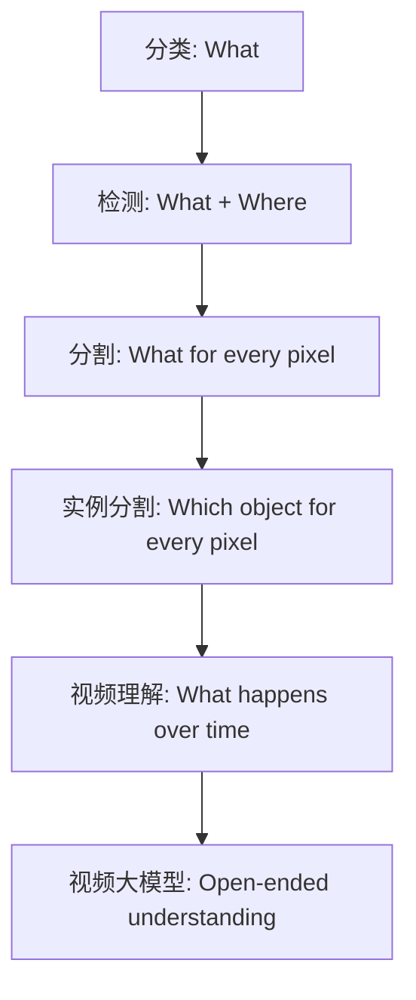

## 20. 自测题

### 题 1：为什么 R-CNN 慢？

答案：因为它先用 Selective Search 生成约 2000 个 RoI，再把每个 RoI 独立缩放后分别通过 CNN。大量 RoI 空间重叠，但 CNN 计算没有共享，导致每张图约 2000 次前向传播，极其低效。

### 题 2：Fast R-CNN 和 Faster R-CNN 的关键区别是什么？

答案：Fast R-CNN 已经共享整图卷积特征，但仍使用外部 Selective Search 产生候选区域。Faster R-CNN 用 RPN 替代 Selective Search，让候选区域生成也成为神经网络的一部分，并与检测网络共享特征，可在 GPU 上端到端训练和推理。

### 题 3：什么是 Anchor Box？

答案：Anchor Box 是在特征图每个位置预设的一组不同尺度和长宽比的候选框。RPN 或一些单阶段检测器基于这些默认框预测物体性得分和边界框修正量。

### 题 4：为什么单阶段检测器需要 Focal Loss？

答案：因为单阶段检测器在特征图上密集预测，绝大多数候选位置是背景，正负样本极端不平衡。普通交叉熵会被大量简单负样本主导。Focal Loss 降低易分样本权重，让模型更关注难分样本。

### 题 5：语义分割为什么不能只看单个像素？

答案：单个像素缺乏上下文。相同颜色或亮度的像素可能属于完全不同物体。模型必须结合局部纹理和全局语义判断像素类别。

### 题 6：U-Net 的跳跃连接有什么用？

答案：跳跃连接把编码器浅层特征直接传给解码器，对应阶段按通道拼接。浅层特征包含边缘、纹理和空间细节，能帮助解码器恢复精确边界；深层特征提供语义，两者融合能提高分割效果。

### 题 7：DeepLab 为什么要用空洞卷积和 ASPP？

答案：空洞卷积能扩大感受野而不显著增加参数，也能保持较高特征图分辨率。ASPP 并行使用不同空洞率卷积和全局池化，以适配不同尺度目标，捕获局部与全局上下文。

### 题 8：RoI Pooling 为什么不适合实例分割？

答案：RoI Pooling 在坐标映射和池化分 bin 时会取整，导致 RoI 特征与原图位置不精确对齐。实例分割要求像素级 mask 边界准确，这种错位会影响结果。

### 题 9：RoI Align 如何解决 RoI Pooling 的问题？

答案：RoI Align 移除取整操作，保留浮点坐标，并用双线性插值从特征图上精确采样，从而保持 RoI 特征与原图位置对齐。

### 题 10：视频理解为什么比图像理解更难？

答案：视频多了时间维度，数据量更大，模型不仅要理解每帧空间内容，还要理解帧间运动、动作顺序、长期依赖和事件结构。

### 题 11：早期融合、晚期融合、3D CNN 分别怎么处理时间信息？

答案：早期融合在输入层堆叠多帧通道，让第一层卷积处理时间；晚期融合先逐帧提取特征，再在高层特征融合；3D CNN 在整个网络中使用 3D 卷积和池化，逐层联合建模空间和时间。

### 题 12：光流在视频理解中有什么作用？

答案：光流显式表示相邻帧像素位移，提供运动信息。双流网络把 RGB 外观流和光流运动流结合，通常能比只看 RGB 更好地识别动作。

## 21. 本章最应该记住的 20 个关键词

1. Object Detection：目标检测。
2. Bounding Box：边界框。
3. RoI：感兴趣区域。
4. Selective Search：传统区域提议方法。
5. R-CNN：每个 RoI 独立提特征。
6. Fast R-CNN：共享整图卷积特征。
7. Faster R-CNN：RPN 产生候选框。
8. Anchor Box：预设锚点框。
9. Objectness：物体性得分。
10. YOLO：一次前向传播完成检测。
11. SSD：多尺度特征图检测。
12. Focal Loss：缓解正负样本不平衡。
13. DETR：Transformer 集合预测目标检测。
14. Dense Prediction：密集预测。
15. Semantic Segmentation：语义分割。
16. Upsampling：上采样。
17. U-Net：编码器-解码器和跳跃连接。
18. ASPP：多空洞率上下文池化。
19. Instance Segmentation：实例分割。
20. 3D CNN / Optical Flow / Video Transformer：视频理解关键路线。

## 22. 学习路线建议

如果你是完全初学者，建议按下面顺序复习：

1. 先弄懂任务差异：分类、检测、语义分割、实例分割、视频理解分别输出什么。
2. 再弄懂 R-CNN 系列：为什么 R-CNN 慢，Fast R-CNN 怎么共享计算，Faster R-CNN 怎么用 RPN。
3. 再学单阶段检测：YOLO 为什么快，SSD 为什么适合多尺度，Focal Loss 解决什么问题。
4. 再学分割基本结构：为什么要下采样-上采样，什么是上采样，FCN 和 U-Net 为什么重要。
5. 再学高级分割：DeepLab 的空洞卷积和 ASPP，SegFormer 的 Transformer，MaskFormer 的 mask classification，SAM 的提示式分割。
6. 最后学视频：先理解视频是 4D 张量，再比较单帧 CNN、早期融合、晚期融合、3D CNN、光流双流、RNN、Transformer。

真正掌握本章，不是背每个模型名字，而是能回答这三个问题：

1. 这个模型解决了前一个模型的什么痛点？
2. 它用什么结构或损失函数解决？
3. 它带来了什么新的代价或局限？

只要这三点能说清楚，本章主线就已经掌握。
