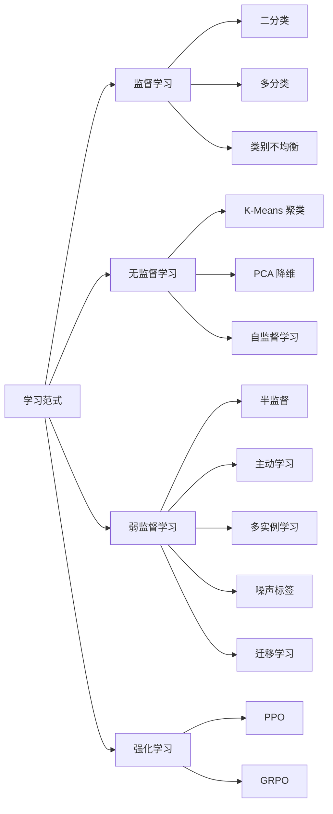
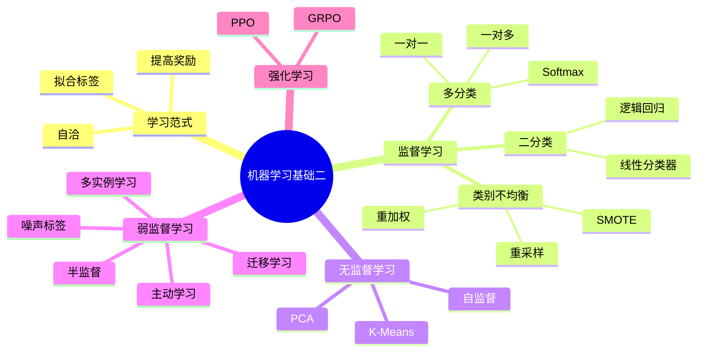

# 第三章：机器学习基础（二）零基础完整讲解

来源：`第三章-机器学习基础2.pdf`，课程名称：深度学习导论，主讲教师：毛玉仁。PPT 共 65 页。

这一讲的核心不是再抽象讨论“什么是机器学习”，而是把机器学习常见的学习范式展开：监督学习、无监督学习、弱监督学习、强化学习。你可以把本章理解成一张方法地图：当数据有标签时怎么学，当数据没标签时怎么学，当标签很少、很粗、或有错时怎么学，当模型需要靠奖励改进行为时怎么学。



## 0. 逐页覆盖清单

- 第 1 页：标题页，第三章“机器学习基础（二）”。
- 第 2 页：提出问题：什么是学习范式？
- 第 3 页：人的学习范式：自然选择、错题改正、奖励引导，分别对应筛选“天分”、进行“教育”、提升“阅历”。
- 第 4 页：人的学习范式在教育端和职业发展端都发生了变革。
- 第 5 页：机器学习范式总览：拟合标签对应监督学习；自洽对应无监督学习；提高奖励对应强化学习；其中还包含半监督、表征学习、无监督强化、世界模型、DPO、GRPO、大模型对齐和 reasoning。
- 第 6 页：机器学习发展历程：统计学习时代、表征学习时代、大模型时代。
- 第 7 页：假设空间从百家争鸣到神经网络一枝独秀：半空间、树、森林、概率图、神经网络等。
- 第 8 页：学习范式从单一到丰富，再在大模型时代趋于单一：传统监督/无监督/强化学习，到多标签、多任务、多视图、领域自适应、领域泛化、对比学习、噪声标签、PU 学习、小样本、主动学习、半监督、开放集检测，再到自监督预训练、有监督微调、新型强化学习。
- 第 9 页：本讲目录：监督学习、无监督学习、弱监督学习、强化学习。
- 第 10 页：监督学习定义：样本属性包含特征 `x` 和标签 `y`，学习从特征到标签的映射；例子包括手写数字识别、连续值预测、人脸检测。
- 第 11 页：二分类问题形式化：`D={(x_i,y_i)}_{i=1}^m`，`x_i in R^d`，`y_i in {-1,+1}`。
- 第 12 页：二分类线性分类器：超平面、距离、自信度、0-1 损失。
- 第 13 页：二分类逻辑回归：Sigmoid 概率假设、预测正确/错误时概率如何变化、数据集联合概率。
- 第 14 页：逻辑回归最大对数似然与逻辑损失，逻辑损失凸且平滑。
- 第 15 页：多分类问题形式化：`y_i in {1,2,...,k}`；例子为 MNIST 和 CIFAR10。
- 第 16 页：二分类逻辑回归形式依赖 `y in {-1,+1}`；直接为每类用 Sigmoid 会出现概率和是否为 1 的问题。
- 第 17 页：多分类逻辑回归使用 Softmax；给出类别概率和数据集联合概率。
- 第 18 页：多分类最大对数似然。
- 第 19 页：多分类逻辑损失；当 `k=2` 时等价于原来的二分类逻辑回归。
- 第 20 页：多分类转二分类框架：一对多 One-Against-Rest，测试时投票或加权投票；缺点是每个分类器处理所有训练数据，并可能类别不平衡。
- 第 21 页：一对一 One-Against-One：构造 `C(k,2)` 个二分类器；每个分类器只用两类数据，但不适合原始数据量少的场景。
- 第 22 页：罕见类/类别不均衡：准确率可能误导；信用卡 99% 正常、1% 异常例子；引入类别错分代价和重加权 SVM。
- 第 23 页：样本重采样：按类别罕见程度调采样概率；罕见类过采样、常规类降采样；单边选择；重复样本可能过拟合。
- 第 24 页：SMOTE 合成过采样：找同类近邻、随机选择近邻、在线段上生成合成样本、重复到指定数量。
- 第 25 页：目录页，进入无监督学习。
- 第 26 页：无监督学习定义：只有特征 `x`，没有人工标签 `y`，从数据内在结构或分布中学习；包括聚类和降维。
- 第 27 页：聚类具有主观性：同一批数据分成两类，可能有不同合理分法。
- 第 28 页：K-Means 是经典聚类方法；给出损失函数和算法流程。
- 第 29 页：K-Means 成功原因：每一步优化都不会增加损失，并展示证明思路。
- 第 30 页：K-Means 可视化：糟糕初始化。
- 第 31 页：K-Means 可视化：随着迭代逐渐变好。
- 第 32 页：K-Means 可视化：迭代 10 次后效果已经很好。
- 第 33 页：降维有主观性：区分杯子时可选择“是否有把”或“杯口大小”等不同特征。
- 第 34 页：PCA 动机：特征维度相关时是否要保留所有特征；无噪声二维数据可旋转到一维主方向。
- 第 35 页：噪声数据例子：相关但不完全共线的数据旋转后，大部分信息集中在第一个新坐标。
- 第 36 页：PCA 坐标轴旋转：标准坐标系、任意单位正交坐标系、新坐标。
- 第 37 页：PCA 目标：找 `k` 个单位正交向量，使投影后新坐标方差最大；通常 `k << d`。
- 第 38 页：一维 PCA：新坐标、均值、方差推导，得到 `w^T C w`。
- 第 39 页：一维 PCA 优化问题、协方差矩阵、拉格朗日求解，得到特征值问题 `Cw=lambda w`。
- 第 40 页：`k` 维 PCA：最大化 `trace(W^T C W)`，取前 `k` 大特征值对应特征向量，信息量为特征值占比。
- 第 41 页：重复强调 `k` 维 PCA 优化、求解和信息量。
- 第 42 页：Arrhythmia 数据集特征值分布：展示特征值大小和方差占比，说明真实数据中不同方向信息量差别很大。
- 第 43 页：自监督学习：深度学习时代主流无监督方法；例子为对比学习和下一词预测。
- 第 44 页：目录页，进入弱监督学习。
- 第 45 页：半监督学习：标签难获取，但常有很多无标签数据，可帮助估计数据内在结构或联合分布。
- 第 46 页：弱监督学习三类：不完全监督、非确切监督、不准确监督；对应半监督/主动学习、多实例学习、噪声标签学习。
- 第 47 页：半监督伪标签：用有标签集训练分类器，挑选高置信无标签样本赋伪标签并加入训练集；风险是错误传播。
- 第 48 页：主动学习：标签稀缺时挑选最有价值的无标签数据去标注；对比随机采样和主动采样。
- 第 49 页：主动学习关键问题和不确定性采样；用样本到线性超平面的距离衡量不确定性。
- 第 50 页：主动学习期望误差缩小：直接目标、退而求其次目标、再次之目标。
- 第 51 页：期望标签不确定性公式：用候选样本标签后验概率和加入训练后的后验概率评估标注价值。
- 第 52 页：多实例学习 MIL：训练数据按 bag 组织，只给整个 bag 的监督，不给 bag 内实例标签。
- 第 53 页：噪声标签：打标失误会导致训练集中部分标签错误。
- 第 54 页：噪声标签解决思路：提高模型鲁棒性、鲁棒损失函数、正则项；图中包括 robust architecture、sample selection、robust loss、loss adjustment、robust regularization。
- 第 55 页：噪声适应层和“自信”惩罚项；给出带熵惩罚的损失形式。
- 第 56 页：对称损失与噪声容忍性：若损失对称且噪声率小于 `(c-1)/c`，则在均匀标签噪声下噪声容忍；交叉熵不满足，对 MAE 类损失给出例子。
- 第 57 页：迁移学习定义：利用源域/源任务知识改进目标域/目标任务学习效果；引用 Pan 和 Yang 综述。
- 第 58 页：迁移学习分类表：按源数据和目标数据是否有标签，得到微调、多任务、自学习、域对抗训练、零样本学习、自聚类学习。
- 第 59 页：微调：预训练模型 `theta_S`，用它初始化目标模型，再最小化目标任务损失。
- 第 60 页：微调技巧：较小学习率、分层学习率、冻结部分参数、最后一层重新初始化。
- 第 61 页：多任务学习 MTL：给定多个任务和数据，最小化任务损失和；PPT 说明严格说 MTL 不属于迁移学习，反过来迁移学习可实现 MTL。
- 第 62 页：目录页，进入强化学习。
- 第 63 页：PPO：待对齐模型、批判模型、价值奖励模型、过程得分、结果得分、综合得分；给出 clipped objective、优势函数和概率比率。
- 第 64 页：GRPO：模型对数学题、代码题、逻辑题生成多组答案，奖励模型给相对奖励；评估答案正确性和是否在思考；用相对奖励更新模型。
- 第 65 页：目录收束页。

## 1. 学习范式到底是什么意思

学习范式就是“学习发生的基本方式”。同样是学习，不一定都是老师给标准答案然后你模仿。PPT 先从人的学习说起，因为机器学习的很多范式都能在人类学习中找到类比。

人的学习范式有三个例子：

- 自然选择：不是每个人都被同样训练，而是环境筛选出更适合的人或能力，PPT 写成筛选“天分”。
- 错题改正：先做题，发现错误，再纠正错误，PPT 写成进行“教育”。
- 奖励引导：做某些行为得到奖励或惩罚，人会逐步调整行为，PPT 写成提升“阅历”。

机器学习中对应地出现了三条主线：

- 拟合标签：给模型样本和标准答案，让它学会从输入到答案的映射。这就是监督学习。
- 自洽：不给人工标签，让模型从数据自身发现结构、规律或预测目标。这对应无监督学习和自监督学习。
- 提高奖励：让模型在与环境或评价器互动时追求更高奖励。这就是强化学习，PPO 和 GRPO 都属于这一类思想。

第 5 页还把大模型时代的几个词放进了这张图：DPO、GRPO、大模型对齐、reasoning。这说明本章不是只讲传统机器学习，也是在为后面理解大模型训练铺垫。大模型通常先用自监督预训练学“世界上的语言和知识模式”，再用有监督微调或偏好优化学“怎么按人类想要的方式回答”，最后还可能用强化学习或类似强化学习的偏好优化来提高奖励。

## 2. 机器学习发展的三阶段

PPT 用三阶段理解机器学习发展：

| 阶段 | 典型特征 | 假设空间 | 学习范式 |
|---|---|---|---|
| 统计学习时代 | 更强调手工特征、可解释模型和统计理论 | 半空间、树、森林、概率图、神经网络等百家争鸣 | 传统监督、传统无监督、传统强化学习 |
| 表征学习时代 | 模型自己学习特征表示，深度学习兴起 | 神经网络逐渐成为主流，但仍与树、森林、概率图并存 | 多标签、多任务、多视图、领域自适应、领域泛化、对比学习、噪声标签、PU 学习、小样本、主动学习、半监督、开放集检测等 |
| 大模型时代 | 大规模预训练模型成为基础设施 | 神经网络一枝独秀 | 自监督预训练、有监督预微调、新型强化学习等再次趋于统一 |

这里的关键变化有两个：

第一，假设空间从“模型类型很多”变成“神经网络占主导”。假设空间就是模型可以选择的函数范围。统计学习时代，我们会很认真地比较线性模型、树、森林、概率图、SVM 等；大模型时代，大多数前沿系统都以深度神经网络为主体。

第二，学习范式经历了“单一 - 丰富 - 再趋于单一”。早期常说监督、无监督、强化三类；后来为了处理现实数据的复杂性，出现了半监督、弱监督、多任务、对比学习、领域泛化等很多分支；大模型时代又把很多问题统一到“预训练 + 微调/对齐 + 强化或偏好优化”的大流程里。

## 3. 监督学习：从特征到标签

监督学习是指，给定的数据样本属性中包含特征 `x` 以及标签 `y`，进而学习如何建立从特征到标签的映射。

你可以把监督学习理解成“有答案的刷题”。每道题有题目 `x`，也有标准答案 `y`。模型通过大量题目和答案，学会以后遇到新题时预测答案。

PPT 给了三个例子：

- 手写数字识别：输入是一张手写数字图片，标签是 0 到 9 的数字类别，这是分类任务。
- 连续值预测：输入可能是房屋面积、位置、年份等特征，标签是价格，这是回归任务。
- 人脸检测：输入是图像，输出是是否有人脸以及人脸位置。

监督学习最重要的一句话是：模型不是直接“记答案”，而是学习 `x -> y` 的规律。训练集中有标签，测试时面对新样本也要能预测，这就回到了第二章的泛化。

## 4. 二分类：最基本的分类问题

二分类问题是分类中最基础的形式。PPT 设定：

```text
D = {(x_i, y_i)}_{i=1}^m
x_i in R^d
y_i in {-1, +1}
```

逐个解释：

- `D` 是数据集。
- `m` 是样本数。
- `x_i` 是第 `i` 个样本的特征向量。
- `R^d` 表示 `d` 维实数空间，也就是说每个样本有 `d` 个数值特征。
- `y_i` 是标签，只能取 `-1` 或 `+1`，代表两个类别。

例如猫狗分类可以设猫为 `+1`，狗为 `-1`。垃圾邮件识别可以设垃圾邮件为 `+1`，正常邮件为 `-1`。

## 5. 线性分类器、超平面和 0-1 损失

线性分类器的核心是一条线、一个平面，或高维空间中的超平面。PPT 写：

```text
H = {x in R^d : w^T x + b = 0}
```

这里：

- `w` 是权重向量，决定超平面的方向。
- `b` 是偏置，决定超平面的位置。
- `w^T x + b = 0` 是分类边界。

如果 `w^T x + b > 0`，模型预测为正类；如果 `w^T x + b < 0`，模型预测为负类。

几何直觉：

- 在二维中，`w^T x + b = 0` 是一条直线。
- 在三维中，它是一个平面。
- 在更高维中，它叫超平面。

PPT 给出样本到线性超平面 `H` 的距离：

```text
|w^T x + b| / ||w||
```

PPT 公式里展示的是分子 `w^T x + b` 除以 `||w||`，这可以理解为有符号距离；实际几何距离通常取绝对值。`||w||` 是向量 `w` 的长度。

自信度的直觉：

- 如果 `w^T x + b` 很大且为正，模型很确信它是正类。
- 如果 `w^T x + b` 很小且接近 0，样本靠近边界，模型不确定。
- 如果真实标签 `y` 与 `w^T x + b` 同号，则预测正确；不同号则预测错误。

0-1 损失写作：

```text
l_{0/1}(x,y) = I[y(w^T x + b) <= 0]
```

其中 `I[条件]` 是指示函数：条件成立为 1，不成立为 0。

- 如果预测错了，`y(w^T x+b) <= 0`，损失为 1。
- 如果预测对了，`y(w^T x+b) > 0`，损失为 0。

0-1 损失最符合“错还是对”的直觉，但它不连续、不平滑，优化很困难。所以后面会引入逻辑损失这种更好优化的替代损失。

## 6. 逻辑回归：把分类变成概率

逻辑回归 Logistic Regression 虽然名字里有“回归”，但在这里它用于分类。

PPT 的概率假设是：

```text
p(y|x) = 1 / (1 + exp(-y(w^T x + b)))
```

记 `s = w^T x + b`。那么：

- 如果 `y=+1`，公式变成 `p(+1|x)=1/(1+exp(-s))`。
- 如果 `y=-1`，公式变成 `p(-1|x)=1/(1+exp(s))`。

这里用到了 Sigmoid 函数：

```text
sigmoid(z) = 1 / (1 + exp(-z))
```

Sigmoid 会把任意实数压到 0 到 1 之间，所以可以解释成概率。

PPT 的两条解释非常重要：

- 当预测对时，即 `y(w^T x+b)>0`，`w^T x+b` 越大，`x` 标签为 `y` 的概率越大。
- 反之，如果方向错了，模型会把更大概率给到 `-y`，即 `p(-y|x)=1-p(y|x)`。

对整个数据集，假设样本独立，则联合概率为：

```text
p(y_i | x_i; w,b)
= product_{i=1}^m p(y_i | x_i; w,b)
= product_{i=1}^m 1 / (1 + exp(-y_i(w^T x_i + b)))
```

训练逻辑回归，就是选择 `w,b`，让训练集中真实标签出现的概率尽可能大。这叫最大似然估计。

## 7. 最大对数似然和逻辑损失

最大似然是最大化概率乘积，但很多小概率相乘会非常小，计算不方便，所以通常取对数，变成最大对数似然。

PPT 写出的最大对数似然形式是：

```text
sum_{i=1}^m -log(1 + exp(-y_i(w^T x_i + b)))
```

如果改成最小化损失，就是最小化负对数似然：

```text
l_LR(x,y) = log(1 + exp(-y(w^T x + b)))
```

这就是逻辑损失 Logit loss。

为什么它比 0-1 损失好：

- 它是连续的。
- 它是平滑的。
- 它是凸的，所以对线性逻辑回归来说更容易优化。
- 它不仅惩罚“错”，还惩罚“不够自信的对”。

直觉例子：

- 真实标签是 `+1`，模型输出分数 `s=10`，说明非常确信正类，损失接近 0。
- 真实标签是 `+1`，模型输出 `s=0.1`，虽然预测为正，但不够确信，仍有一定损失。
- 真实标签是 `+1`，模型输出 `s=-10`，方向完全错，损失很大。

## 8. 多分类：从二分类扩展到 k 类

多分类问题的设定是：

```text
D = {(x_i, y_i)}_{i=1}^m
x_i in R^d
y_i in {1,2,...,k}
```

这里标签不再是 `-1/+1`，而是 `k` 个类别之一。PPT 的例子：

- MNIST：10 类手写数字。
- CIFAR10：10 类彩色图片。

二分类逻辑回归公式依赖 `y in {-1,+1}`，所以不能直接套用。一个看似自然但有问题的做法是：给每个类别一个 Sigmoid：

```text
p'(y=c|x) = 1 / (1 + exp(-(w_c^T x + b_c)))
```

问题是：每个类别都独立给一个概率，这些概率加起来不一定等于 1。而多分类要求“所有类别概率之和等于 1”。所以需要 Softmax。

## 9. Softmax 多分类逻辑回归

多分类逻辑回归为每个类别 `c` 维护一个线性超平面：

```text
H_c = {x in R^d : w_c^T x + b_c = 0}
```

先计算每个类别的分数：

```text
score_c = w_c^T x + b_c
```

再用 Softmax 把分数变成概率：

```text
p(y=c|x) = exp(w_c^T x + b_c) / sum_{c'=1}^k exp(w_{c'}^T x + b_{c'})
```

Softmax 的作用：

- 分子让当前类别分数越大，概率越大。
- 分母把所有类别的指数分数加起来，负责归一化。
- 所有类别概率相加正好为 1。

记：

```text
W = [w_1, ..., w_k] in R^{d x k}
b = [b_1, ..., b_k] in R^k
```

数据集联合概率可写成：

```text
product_{i=1}^m product_{c=1}^k p(y_i=c|x_i;W,b)^{I[y_i=c]}
```

这个写法的意思是：每个样本只取真实类别那一项，因为只有真实类别满足 `I[y_i=c]=1`。

对数似然写成：

```text
sum_{i=1}^m sum_{c=1}^k I[y_i=c] log p(y_i=c|x_i;W,b)
```

多分类逻辑损失是：

```text
l_LR(x,y)
= -log( exp(w_y^T x + b_y) / sum_{c=1}^k exp(w_c^T x + b_c) )
= log(1 + sum_{c != y} exp((w_c-w_y)^T x + b_c-b_y))
```

第一行的直觉最重要：真实类别概率越大，损失越小；真实类别概率越小，损失越大。PPT 特别指出，当 `k=2` 时，它等价于二分类逻辑回归。

## 10. 多分类转二分类：一对多和一对一

有些算法天然是二分类算法，所以需要把多分类拆成多个二分类问题。

一对多 One-Against-Rest：

- 对 `k` 个类别训练 `k` 个二分类器。
- 第 `i` 个分类器把第 `i` 类当正类，其它所有类当负类。
- 测试时分别应用 `k` 个模型。
- 如果模型 `i` 判断样本属于正类，则类别 `i` 记 1 票；反之其它类别可能记票。
- 最终预测为投票或加权投票最高的类别。

缺点：

- 每个分类器都要处理所有训练数据。
- 单个分类器常常面对严重类别不平衡。例如第 1 类可能只有 10%，其它类合起来 90%，于是“第 1 类 vs 其它类”很不平衡。

一对一 One-Against-One：

- 对每两个类别训练一个二分类器。
- 总共有 `C(k,2)=k(k-1)/2` 个二分类问题。
- 每个分类器只在两类样本上训练。
- 测试时所有分类器投票，票数最高类别获胜。

优点：

- 每个分类器只处理原数据中的两类，训练数据更小。
- 单个二分类任务可能更简单。

缺点：

- 分类器数量很多。
- 如果原始数据量本来就少，每个二分类器拿到的数据会更少，因此不适合原始数据量较少的场景。

## 11. 罕见类和类别不均衡

分类任务常用准确率评价，但当类别分布不平衡时，准确率会误导。

PPT 的例子：信用卡用户中 99% 正常，只有 1% 异常。如果模型永远输出“正常”，准确率也是 99%，但它完全抓不到真正重要的异常用户。

解决思路：提高罕见类别数据的重要性。PPT 说可以为类别 `c` 赋予错分代价 `C(c)`。

样本重加权 SVM 的形式是：

```text
min_{w,b,xi}  ||w||^2/2 + C sum_{i=1}^m C(y_i) xi_i
s.t.
    w^T x_i + b >= +1 - xi_i, for y_i = +1
    w^T x_i + b <= -1 + xi_i, for y_i = -1
    xi_i >= 0
```

直觉解释：

- `||w||^2/2` 控制模型不要太复杂。
- `xi_i` 是松弛变量，允许某些样本违反间隔。
- `C(y_i)` 是类别权重，罕见类错了就罚得更重。
- 当罕见类权重大，模型会更努力把罕见类分对。

样本重采样的思路：

- 根据类别罕见程度调整采样概率。
- 采样概率通常与类别错分代价 `C(c)` 成正比。
- 对罕见类过采样，对常规类降采样。

极端情况是单边选择：

- 保留罕见类中的所有数据。
- 只采样一部分常规类数据。

问题：罕见类过采样可能只是重复已有样本。模型反复看到同样的罕见样本，可能记住它们，从而过拟合。

## 12. SMOTE：合成过采样

SMOTE 全称 Synthetic Minority Oversampling Technique，意思是“合成少数类过采样技术”。

它不是简单复制罕见类样本，而是在罕见类样本之间“插值”生成新样本。

PPT 给出的步骤：

1. 对每个罕见样本，计算它与其它同类别样本之间的距离，找到最近的 `K` 个同类别邻居。
2. 从这 `K` 个最近邻居中随机选择一个样本。
3. 计算该样本与当前样本的差异。
4. 根据差异比例，在这两个样本连成的线段中生成一个新的合成样本。
5. 重复上述过程，直到生成指定数量的合成样本。

直觉例子：如果一个罕见类样本是 `x`，它的近邻是 `x_neighbor`，可以生成：

```text
x_new = x + alpha * (x_neighbor - x),  alpha in [0,1]
```

这样 `x_new` 位于两个同类样本之间，比简单复制更能增加少数类的多样性。

## 13. 无监督学习：没有标签时学什么

无监督学习与监督学习不同。PPT 定义：

在无监督学习中，给定的数据样本属性中仅包含特征 `x`，没有经人工标注的标签 `y`，模型因此需要从数据的内在结构或分布中进行学习。

最典型的无监督任务：

- 聚类：把相似样本分到一组。
- 降维：用更少的维度保留尽可能多的信息。

无监督学习的难点是：没有标准答案。因此它常常带有主观性。PPT 第 27 页问“将下列数据聚成两类，哪种分法更正确？”这说明同一组点可能按横向分、纵向分、形状分、密度分都能说得通。没有标签时，“正确”往往取决于你想发现什么结构。

## 14. K-Means 聚类

K-Means 是最经典的聚类算法。目标是把数据分成 `k` 个簇，并让每个样本尽量靠近自己簇的中心。

PPT 给出的损失函数是：

```text
G_{k-means}((X,d),(C_1,...,C_k))
= sum_{i=1}^k sum_{x in C_i} d(x, mu_i(C_i))^2
```

这里：

- `X` 是数据集合。
- `d` 是距离函数，常用欧氏距离。
- `C_i` 是第 `i` 个簇。
- `mu_i(C_i)` 是第 `i` 个簇的中心，通常就是该簇所有样本的均值。
- 损失表示每个样本到自己簇中心距离平方的总和。

K-Means 算法流程：

```text
input: X subset R^n; number of clusters k
initialize: randomly choose initial centroids mu_1,...,mu_k
repeat until convergence:
    for each i in [k], set
        C_i = {x in X : i = argmin_j ||x - mu_j||}
        ties can be broken arbitrarily
    for each i in [k], update
        mu_i = (1/|C_i|) sum_{x in C_i} x
```

白话解释：

1. 随机选 `k` 个中心点。
2. 每个样本找离自己最近的中心，加入那个簇。
3. 每个簇重新计算均值，把均值当作新中心。
4. 重复第 2、3 步，直到分组基本不变。

PPT 的可视化页说明：开始可能初始化很糟糕，但随着迭代会逐渐变好，迭代 10 次后已经非常好。

## 15. K-Means 为什么会下降

PPT 说 K-Means 可以成功的原因是：算法的每一步优化都不会增加损失。

证明思路可以分成两步：

第一步，固定中心，重新分配样本。每个样本被分到距离最近的中心，所以样本到中心的距离不会比之前更大。因此总损失不会增加。

第二步，固定分配，重新计算中心。对于一个簇来说，使平方距离和最小的中心就是该簇样本的均值。因此把中心更新为均值，也不会增加损失。

PPT 中证明用到了：

```text
G(C_1,...,C_k) = min_{mu_1,...,mu_k} sum_{i=1}^k sum_{x in C_i} ||x - mu_i||^2
mu(C_i) = (1/|C_i|) sum_{x in C_i} x
```

并比较第 `t-1` 次迭代和第 `t` 次迭代的目标函数，得到：

```text
G(C_1^(t),...,C_k^(t)) <= G(C_1^(t-1),...,C_k^(t-1))
```

需要注意：损失不增加不等于一定找到全局最优。K-Means 可能陷入局部最优，而且结果依赖初始化、`k` 的选择和距离度量。

## 16. 降维和 PCA 的直觉

降维就是把高维数据变成低维数据，同时尽量保留重要信息。

PPT 用杯子说明降维有主观性：区分杯子时，可以选择“是否有把”，也可以选择“杯口大小”。不同特征对应不同视角，没有绝对唯一答案。

PCA 的动机是：当不同维度的特征之间存在相关性时，是否仍然需要保留所有特征？

无噪声例子：

```text
x_1 = (1,1)
x_2 = (2,2)
x_3 = (3,3)
```

这些点都落在直线 `y=x` 上。虽然它们在二维空间中表示，但实际上只有一个自由方向。把坐标轴旋转到这条直线方向后，新坐标类似：

```text
x_1' = (sqrt(2), 0)
x_2' = (2sqrt(2), 0)
x_3' = (3sqrt(2), 0)
```

第二个坐标全是 0，说明它没有额外信息，可以丢掉。

噪声数据例子：

```text
x_1 = (1, 0.9)   -> 约 (1.34,  0.07)
x_2 = (2.1, 2)   -> 约 (2.89,  0.07)
x_3 = (2.9, 3.1) -> 约 (4.24, -0.14)
```

旋转后，第一个新坐标变化很大，第二个新坐标只在小范围波动。说明大部分信息集中在第一个方向，第二个方向更像噪声或小扰动。

## 17. PCA 的坐标旋转

PPT 从坐标轴旋转开始讲 PCA。

对向量：

```text
x = (x^(1), ..., x^(d)) in R^d
```

在标准坐标系中：

```text
x = x^(1)e_1 + x^(2)e_2 + ... + x^(d)e_d
```

如果换成任意单位正交坐标系：

```text
w_1, w_2, ..., w_d
W = [w_1, w_2, ..., w_d]
```

那么：

```text
x = W W^T x
  = sum_{i=1}^d w_i w_i^T x
  = (w_1^T x) w_1 + (w_2^T x) w_2 + ... + (w_d^T x) w_d
```

新坐标就是：

```text
y = (w_1^T x, ..., w_d^T x)
```

这里的 `w_i^T x` 是把原始向量 `x` 投影到新方向 `w_i` 上。

PCA 要做的事：不是随便找新坐标，而是找一组方向，让数据投影到这些方向后方差最大。

## 18. PCA 的目标

给定数据集：

```text
D = {x_i}_{i=1}^m,  x_i in R^d
```

PCA 要找一组单位正交向量：

```text
w_1, w_2, ..., w_k
```

使得所有样本在这些向量上的新坐标方差最大。新坐标形如：

```text
y_i = (w_1^T x_i, w_2^T x_i, ..., w_k^T x_i)
```

为了降维，一般有：

```text
k << d
```

例如原始图片可能有 784 个像素维度，但 PCA 可能只保留几十个主成分。

“方差最大”为什么代表信息多？

如果某个方向上所有点投影值都差不多，那么这个方向不能区分样本；如果某个方向上投影值差异很大，那么它保留了样本之间的重要变化。PCA 就优先保留变化最大的方向。

## 19. 一维 PCA 推导

一维 PCA 只找一个方向 `w_1`。

样本的新坐标为：

```text
w_1^T x_1, w_1^T x_2, ..., w_1^T x_m
```

样本均值：

```text
x_bar = (1/m) sum_{i=1}^m x_i
```

新坐标均值：

```text
mu = w_1^T x_bar
```

新坐标方差：

```text
(1/m) sum_{i=1}^m (w_1^T x_i - w_1^T x_bar)^2
= (1/m) sum_{i=1}^m w_1^T (x_i - x_bar)(x_i - x_bar)^T w_1
= w_1^T [ (1/m) sum_{i=1}^m (x_i - x_bar)(x_i - x_bar)^T ] w_1
```

中括号里的矩阵就是协方差矩阵：

```text
C = (1/m) sum_{i=1}^m (x_i - x_bar)(x_i - x_bar)^T
```

所以一维 PCA 的目标变成：

```text
max_{w in R^d} w^T C w
s.t. ||w||^2 = 1
```

约束 `||w||^2=1` 是为了避免把 `w` 无限放大。否则 `w^T C w` 可以靠放大 `w` 变得无限大。

## 20. PCA 的特征值解法

一维 PCA 的优化问题：

```text
max w^T C w
s.t. ||w||^2 = 1
```

PPT 用拉格朗日函数求解：

```text
-w^T C w + lambda(||w||^2 - 1)
```

对 `w` 求导并令导数为 0：

```text
-2Cw + 2lambda w = 0
<=> Cw = lambda w
```

这就是特征值问题。

如果 `Cw=lambda w`，那么：

```text
w^T C w = w^T lambda w = lambda w^T w = lambda
```

因为 `||w||^2=1`，所以目标值就是 `lambda`。为了最大化方差，就选择协方差矩阵 `C` 的最大特征值对应的特征向量。

`k` 维 PCA 的优化问题：

```text
max_{W in R^{d x k}} trace(W^T C W)
s.t. W^T W = I
```

求解：

```text
W = [w_1, ..., w_k]
```

其中 `w_i` 是协方差矩阵 `C` 的第 `i` 大特征值对应的特征向量。

信息量：

```text
sum_{i=1}^k lambda_i / sum_{i=1}^d lambda_i
```

其中 `lambda_i` 是 `C` 的第 `i` 大特征值，也等于第 `i` 个新坐标的方差。

如果前 10 个特征值占总和的 95%，就说明保留 10 个主成分已经保留了大部分信息。

## 21. 自监督学习

自监督学习是深度学习时代的主流无监督学习方法。它没有人工标签，但会从数据自身构造监督信号。

PPT 给了两个代表：

- 对比学习。
- 下一词预测。

对比学习的图示中，有原始图片、增强后的正样本图片和负样本图片。目标是：

- 原始图片和它的数据增强版本应该更相似。
- 原始图片和其它不相关图片应该更不相似。

PPT 给出的对比学习损失是类似 InfoNCE 的形式：

```text
L_contrastive(f; tau, M)
= E[ -log exp(f(x)^T f(y)/tau)
      / (exp(f(x)^T f(y)/tau) + sum_i exp(f(x_i^-)^T f(y)/tau)) ]
```

直觉解释：

- `f(x)` 是图片经过模型后的表示向量。
- `tau` 是温度参数，控制相似度分布的尖锐程度。
- 正样本相似度要高。
- 负样本相似度要低。

下一词预测的直觉更接近大语言模型：

给定前面的文字，让模型预测下一个词。标签不是人工标注的，而是文本中天然存在的下一个 token。PPT 右侧引用的观点可以概括为：如果神经网络能预测下一个词，就可能学到大量无监督结构。

所以自监督学习的关键是：没有人工标签，但任务本身能自动制造标签。

## 22. 弱监督学习：标签不完美时怎么办

现实中很多数据既不是“标签完整且准确”，也不是“完全没标签”。标签可能有三种问题：

| 弱监督类型 | 英文 | PPT 对应方法 | 含义 |
|---|---|---|---|
| 不完全监督 | Incomplete Supervision | 半监督学习、主动学习 | 只有一部分样本有标签 |
| 不确切监督 | Inexact Supervision | 多实例学习 | 标签只给到粗粒度集合，不给每个实例 |
| 不准确监督 | Inaccurate Supervision | 噪声标签学习 | 标签可能是错的 |

PPT 引用了 Zhou Z H, 2018 的弱监督学习综述。强监督就是每个样本都有准确细粒度标签；弱监督则是在标签缺失、标签粗糙或标签错误的条件下学习。

## 23. 半监督学习和伪标签

半监督学习的场景：

- 标签数据很少，因为人工标注贵、慢、需要专业知识。
- 无标签数据很多，而且能帮助估计数据内在结构或特征之间的联合分布。

伪标签 Pseudo-label 的流程：

1. 有一个已标注集合 `L`。
2. 有一个未标注集合 `U`。
3. 基于 `L` 训练一个分类器。
4. 用分类器预测 `U` 中样本的标签。
5. 找出 Top-k 置信度最高的无标签样本。
6. 把分类器预测结果当作这些样本的伪标签。
7. 将这些样本从 `U` 移除，并加入 `L`。
8. 继续训练。

优点：不用人工标注，就能扩大训练集。

风险：错误预测可能出现误差传播。如果模型一开始把狗错标为猫，并且置信度很高，那么这个错误标签会被加入训练集，后续模型可能更相信错误规律。

所以伪标签通常要配合高置信筛选、阈值、数据增强、一致性正则等方法，避免错误滚雪球。

## 24. 主动学习

主动学习 Active Learning 的问题是：既然标签贵，那应该优先标哪些样本？

PPT 的定义：

除了直接利用无标签数据之外，在标签数据稀缺的情况下，可以通过主动学习去挑选最具“价值”的无标签数据，并为其添加标签。

随机采样是随便挑样本去标。主动采样是模型自己判断哪些样本更值得标。

关键问题：

```text
在给定代价的情况下，如何挑选样本使得模型的性能最好？
```

思路 1：不确定性采样 Uncertainty Sampling。

选择模型当前最不确定的样本去标注。对线性分类器，样本到超平面的距离为：

```text
|w^T x + b| / ||w||
```

距离越小，样本越靠近分类边界，模型越不确定；这种样本一旦被标注，往往更能帮助模型改进边界。

思路 2：期望误差缩小 Expected Error Reduction。

PPT 分三层说：

- 直接目标：从 `U` 中挑选样本，使模型在剩余样本上的预测误差最小。
- 退而求其次：从 `U` 中挑选样本，使模型在剩余样本上的标签不确定性最小。
- 再次之：从 `U` 中挑选样本，使模型在剩余样本上的期望标签不确定性最小。

对候选未标注数据 `x in U`：

```text
P_i(x)
```

表示它标签为 `i` 的后验概率。

对 `z in U`：

```text
P_j^{(x,i)}(z)
```

表示把 `(x,i)` 加入训练集合后，`z` 的标签为 `j` 的后验概率。

PPT 给出的期望标签不确定性形式为：

```text
E(x,z) = sum_{i=1}^k P_i(x) ( sum_{j=1}^k sum_{z in U} |P_j^{(x,i)}(z) - 0.5| )
```

学习时先抓直觉：主动学习不是直接多拿数据，而是聪明地问问题。它想问那些“最能改变模型”的样本。

## 25. 多实例学习

多实例学习 Multiple Instance Learning, MIL 处理的是 bag 级监督。

PPT 的英文定义是：训练数据被组织成集合，称为 bags；监督只提供给整个集合，集合中单个实例的标签没有提供。

例子：

- 医学图像中，一个病人的一组切片整体标为“有病”，但不知道具体哪一张切片有病灶。
- 图像分类中，一张图像被标为“有猫”，但不知道哪个局部 patch 对应猫。
- 文档分类中，一篇文章标为“正面情绪”，但不知道哪一句话贡献最大。

与普通监督学习的区别：

- 普通监督学习：每个实例都有标签。
- 多实例学习：只有一袋实例有标签，袋中每个实例未标注。

常见假设是：如果一个 bag 是正的，通常表示其中至少有一个正实例；如果 bag 是负的，通常表示所有实例都是负的。但具体设定会随任务变化。

## 26. 噪声标签

噪声标签就是标签错了。PPT 说：打标过程中的失误，会导致训练集中的数据有的是错误打标的。

为什么这很严重？

因为监督学习会把标签当标准答案。如果标准答案错了，模型可能学到错误规律。

PPT 给出的解决方向：

- 提升模型对噪声的鲁棒性。
- 选用鲁棒的损失函数。
- 添加正则项。

第 54 页图中把 robust training 拆成几个方向：

- Robust Architecture：设计对噪声更鲁棒的网络结构。
- Sample Selection：选择更可信的样本训练，减少噪声样本影响。
- Robust Loss Function：使用对错误标签不太敏感的损失函数。
- Loss Adjustment：根据噪声机制调整损失。
- Robust Regularization：加入正则项，让模型不要过度相信噪声。

第 55 页给出两个具体思路。

噪声适应层：

```text
Input x -> Base Model theta with Softmax Layer -> p(y|x;theta)
        -> Noise Adaptation Layer p(y_tilde|y;W)
        -> p(y_tilde|x;theta,W)
        -> Loss L(f(x;theta,W), y_tilde)
```

这里 `y` 是真实标签，`y_tilde` 是被污染后的噪声标签。噪声适应层试图建模“真实标签如何被污染成噪声标签”。

“自信”惩罚项：

```text
L(theta) = - sum log p_theta(y|x) - beta H(p_theta(y|x))
H(p_theta(y|x)) = - sum_i p_theta(y_i|x) log p_theta(y_i|x)
```

`H` 是熵。熵越大，预测分布越不尖锐。加入这个项可以惩罚模型过度自信，避免模型对错误标签非常确信。

## 27. 对称损失与噪声容忍

PPT 第 56 页给出一个理论结论：

如果损失函数是对称的，并且噪声率小于 `(c-1)/c`，其中 `c` 是类别数，那么该损失函数在均匀标签噪声下是噪声容忍的。

对称损失定义：

```text
sum_{j=1}^c L(f(x), j) = C,  for all x in X, for all f
```

意思是：对任意输入和任意模型，把它对所有类别的损失加起来，总和是常数。

PPT 对比了两个损失：

交叉熵：

```text
L(f(x;theta), y_x)
= -(1/n) sum_i sum_j y_{ij} log f_j(x_i;theta)
```

PPT 用红叉表示它不满足这里的对称噪声容忍条件。

MAE 类损失：

```text
L_MAE(f(x), e_j) = ||e_j - f(x)||_1 = 2 - 2 f_j(x)
```

PPT 用绿勾表示它满足更好的噪声鲁棒性质。

学习重点：不是所有常用损失都同样抗噪。交叉熵很常用，但它可能过度拟合错误标签；更鲁棒的损失能降低噪声标签的伤害。

## 28. 迁移学习

迁移学习 Transfer Learning 的定义：

给定源域 `D_S` 和学习任务 `T_S`，以及目标域 `D_T` 和学习任务 `T_T`，迁移学习旨在利用 `D_S` 和 `T_S` 的知识改进 `D_T` 和 `T_T` 上的学习效果，其中：

```text
D_S != D_T  or  T_S != T_T
```

直觉：以前学过的东西，能不能帮助现在的新任务？

例子：

- 先在 ImageNet 上训练图像模型，再迁移到医学图像分类。
- 先用大规模通用文本训练语言模型，再微调成客服机器人。
- 先学英语翻译，再帮助低资源语言翻译。

PPT 根据源数据和目标数据是否有标签，给出分类：

| 目标数据 / 源数据 | 源数据有标签 | 源数据无标签 |
|---|---|---|
| 目标数据有标签 | 微调、多任务学习 | 自学习 |
| 目标数据无标签 | 域对抗训练、零样本学习 | 自聚类学习 |

这里的重点不是死记表格，而是理解：迁移学习关心源任务和目标任务之间如何借力，标签情况不同，方法也不同。

## 29. 微调 Fine-tuning

微调是迁移学习中最常见的方法。

预训练模型：

```text
theta_S
```

表示基于公开或不公开大规模数据提前训练好的模型。

微调做法：

```text
theta_{T,0} = theta_S
theta_{T,t+1} = theta_{T,t} - eta_t grad_theta L(theta_{T,t}, D_T)
```

意思是：

1. 不从随机参数开始训练。
2. 先加载一个已经学过大量知识的模型 `theta_S`。
3. 把它作为目标任务模型的初始参数。
4. 在目标任务数据 `D_T` 上继续梯度下降。

实践技巧：

- 尝试较小学习率 `eta_t`。
- 不同层参数使用不同学习率。
- 冻结部分参数，例如冻结深度神经网络前几层。
- 最后一层重新初始化。

为什么这些技巧有用？

- 小学习率避免把预训练知识一下子破坏掉。
- 前几层常学到通用特征，例如边缘、纹理、基础语义，可以冻结。
- 最后一层通常与具体任务类别强相关，所以重新初始化更合理。

## 30. 多任务学习 MTL

多任务学习 Multi-task Learning, MTL 的标准设定：

给定 `n` 个学习任务以及相应数据：

```text
D_1, ..., D_n
```

找到一个模型，使这些任务损失和最小：

```text
min_theta sum_{i=1}^n L_i(theta, D_i)
```

直觉：让模型同时学多个相关任务，通过共享表示获得更好泛化。

PPT 图中是多种翻译任务共享一个多任务学习模型，例如英译日、英译中、英译西、英译法。它们都与语言理解和翻译有关，所以可以共享知识。

PPT 还强调：

- 严格来说，MTL 不属于迁移学习，因为 PPT 表述中迁移学习通常假设 `D_S` 未知。
- 反过来，迁移学习可以用于实现 MTL。

学习时可以这样理解：多任务学习强调“同时学多个任务”；迁移学习强调“从一个源任务/源域迁到目标任务/目标域”。二者有交叉，但关注点不同。

## 31. 强化学习、PPO 和 GRPO 的位置

强化学习的核心不是“拟合标签”，而是“提高奖励”。模型做动作，环境或奖励模型给反馈，模型调整策略，让未来奖励更高。

在大模型对齐中，强化学习常被用来让模型输出更符合人类偏好、更有帮助、更安全、更会推理。

PPT 这里只做 PPO 和 GRPO 简介，不展开完整强化学习理论。

PPO 第 63 页图示包含：

- 待对齐模型：当前要被训练和改进的大模型。
- 批判模型：也可理解为 critic/value model，估计当前状态或生成过程的价值，图中写“心里有数”。
- 价值奖励模型：对结果给奖励，图中有结果得分。
- 过程得分：生成过程中的每一步也可以评分。
- 综合得分：把过程得分和结果得分合并，用来更新模型。

PPO 的 clipped objective：

```text
L^CLIP(theta)
= E_t [ min( r_t(theta) A_hat_t,
             clip(r_t(theta), 1-epsilon, 1+epsilon) A_hat_t ) ]
```

概率比率：

```text
r_t(theta) = pi_theta(a_t|s_t) / pi_{theta_old}(a_t|s_t)
```

优势函数：

```text
A_hat_t
= (R_score - beta KL(pi, pi_ref) + gamma V(s_{t+1})) - V(s_t)
```

逐个解释：

- `pi_theta` 是当前策略，也就是当前模型。
- `pi_{theta_old}` 是更新前的旧策略。
- `r_t(theta)` 表示当前模型相对旧模型更倾向还是更不倾向某个动作。
- `A_hat_t` 表示这个动作比预期好多少。
- `R_score` 是奖励模型给分。
- `KL(pi,pi_ref)` 是与参考模型的距离惩罚，防止模型偏离太远。
- `V(s_t)` 是 critic 对当前状态价值的预测。
- `clip` 把更新幅度限制在 `[1-epsilon, 1+epsilon]`，避免一步更新太猛。

PPO 的直觉：如果某个回答比预期好，就提高模型生成它的概率；但提高不能太猛，否则模型会不稳定或偏离参考模型。

## 32. GRPO：用相对奖励训练推理

GRPO 第 64 页的图示流程：

1. 给模型数学题、代码题、逻辑题。
2. 模型生成多份答案：答案 1、答案 2、答案 3 等。
3. 价值奖励模型分别给每个答案相对奖励。
4. 根据相对奖励更新模型。

PPT 标注奖励可以看两个方面：

- 答案正确性。
- 是否在思考，也就是把思考过程写在 `<think>...</think>` 之间。

GRPO 公式的核心结构是：

```text
J_GRPO(theta)
= sum_{i=1}^G sum_{t=1}^{|a_i|}
  { min( ratio_{i,t} * a_hat_{i,t},
         clip(ratio_{i,t}, 1-epsilon, 1+epsilon) * a_hat_{i,t})
    - beta D_KL(pi_theta || pi_ref) }
```

PPT 页中 `ratio` 写成新旧策略概率比的 clipped 形式，右上角给出相对优势的标准化：

```text
a_hat_{i,t} = r_tilde_i = (r_i - mean(r)) / std(r)
```

这说明 GRPO 不是只看一个答案的绝对分，而是把同一题的一组答案放在一起比较：比组内平均更好的答案得到正相对奖励，比平均差的答案得到负相对奖励。

与 PPO 的直觉区别：

- PPO 依赖 critic/value model 去估计优势。
- GRPO 更强调 group relative，也就是在一组候选答案内部做相对比较。
- 对推理类任务，模型一次生成多个答案，用答案之间的相对优劣来训练，能减少对单独价值模型估计的依赖。

对零基础学习者来说，先记住一句话：GRPO 是为了让大模型在多个候选回答中学会“更偏向相对更好的回答”，尤其常用于推理、数学、代码等任务。

## 33. 本章概念关系总图



## 34. 本章公式速查

| 名称 | 公式 | 含义 |
|---|---|---|
| 二分类数据集 | `D={(x_i,y_i)}_{i=1}^m, x_i in R^d, y_i in {-1,+1}` | 每个样本有特征和二分类标签 |
| 线性超平面 | `H={x: w^T x+b=0}` | 线性分类边界 |
| 到超平面距离 | `|w^T x+b|/||w||` | 样本离分类边界多远 |
| 0-1 损失 | `I[y(w^T x+b)<=0]` | 错为 1，对为 0 |
| 二分类逻辑回归 | `p(y|x)=1/(1+exp(-y(w^T x+b)))` | 把线性分数转成标签概率 |
| 逻辑损失 | `log(1+exp(-y(w^T x+b)))` | 平滑可优化的分类损失 |
| Softmax | `exp(w_c^T x+b_c)/sum_{c'} exp(w_{c'}^T x+b_{c'})` | 多分类概率归一化 |
| 多分类逻辑损失 | `-log p(y|x)` | 惩罚真实类别概率低 |
| OVO 分类器数 | `k(k-1)/2` | 每两个类别训练一个二分类器 |
| 重加权 SVM | `||w||^2/2 + C sum_i C(y_i) xi_i` | 罕见类错分罚更重 |
| K-Means 损失 | `sum_i sum_{x in C_i} d(x,mu_i)^2` | 样本到簇中心距离平方和 |
| K-Means 中心 | `mu_i=(1/|C_i|)sum_{x in C_i}x` | 每个簇的均值 |
| PCA 协方差矩阵 | `C=(1/m)sum_i(x_i-x_bar)(x_i-x_bar)^T` | 描述特征共同变化 |
| 一维 PCA | `max w^T C w, s.t. ||w||^2=1` | 找最大方差方向 |
| PCA 特征值方程 | `Cw=lambda w` | 主方向是协方差矩阵特征向量 |
| k 维 PCA | `max trace(W^T C W), s.t. W^T W=I` | 找前 k 个主方向 |
| PCA 信息量 | `sum_{i=1}^k lambda_i / sum_{i=1}^d lambda_i` | 保留方差比例 |
| 主动学习超平面距离 | `|w^T x+b|/||w||` | 越小越不确定 |
| 对称损失 | `sum_{j=1}^c L(f(x),j)=C` | 对所有类别损失和为常数 |
| MAE 类噪声鲁棒损失 | `||e_j-f(x)||_1=2-2f_j(x)` | PPT 认为更噪声容忍 |
| 微调初始化 | `theta_{T,0}=theta_S` | 用预训练模型开始目标任务 |
| 微调更新 | `theta_{T,t+1}=theta_{T,t}-eta_t grad L(theta_{T,t},D_T)` | 目标任务上继续梯度下降 |
| 多任务学习 | `min_theta sum_i L_i(theta,D_i)` | 同时最小化多个任务损失 |
| PPO 比率 | `r_t=pi_theta(a_t|s_t)/pi_old(a_t|s_t)` | 当前策略与旧策略的概率比 |
| PPO clipped objective | `E[min(r_t A_t, clip(r_t,1-epsilon,1+epsilon)A_t)]` | 限制策略更新幅度 |
| GRPO 相对优势 | `(r_i-mean(r))/std(r)` | 用组内相对奖励更新模型 |

## 35. 初学者应该怎么学这一章

第一遍只抓四个大类：

- 监督学习：有标签，学 `x -> y`。
- 无监督学习：没标签，学结构。
- 弱监督学习：标签不完整、不精确或不准确。
- 强化学习：没有固定答案，通过奖励优化行为。

第二遍重点理解每类的代表方法：

- 监督学习：逻辑回归、Softmax、多分类拆分、类别不均衡。
- 无监督学习：K-Means、PCA、自监督。
- 弱监督学习：伪标签、主动学习、多实例、噪声标签、迁移学习。
- 强化学习：PPO、GRPO。

第三遍再看公式。公式不要先背，先问它回答什么问题：

- `w^T x+b` 回答“样本在线性边界哪一边”。
- Sigmoid/Softmax 回答“怎么把分数变成概率”。
- 逻辑损失回答“怎么把分类错误变成可优化目标”。
- K-Means 损失回答“聚类内部是否紧凑”。
- PCA 的 `w^T C w` 回答“投影到这个方向后方差有多大”。
- PPO/GRPO 的 clipped objective 回答“如何让模型朝高奖励方向更新但不要更新太猛”。

## 36. 自测题

1. 为什么 99% 准确率在信用卡异常检测中可能没有意义？
2. 二分类逻辑回归为什么要使用 Sigmoid？
3. 多分类为什么不能简单给每个类别单独用 Sigmoid？
4. Softmax 的分母起什么作用？
5. 一对多和一对一多分类拆分各有什么缺点？
6. 为什么简单复制罕见类样本可能过拟合？SMOTE 如何缓解？
7. K-Means 每轮为什么不会增加损失？
8. PCA 为什么选择最大特征值对应的特征向量？
9. 自监督学习为什么可以说“没有人工标签但仍然有监督信号”？
10. 半监督伪标签为什么可能产生错误传播？
11. 主动学习为什么常选择模型最不确定的样本？
12. 多实例学习和普通监督学习的标签粒度有什么不同？
13. 噪声标签为什么会让交叉熵训练变危险？
14. 微调为什么通常用较小学习率？
15. PPO 中 clip 的作用是什么？
16. GRPO 为什么要使用组内相对奖励？

## 37. 一句话总总结

本章要教你的不是某一个模型，而是遇到不同数据条件时应该选择什么学习范式：有完整准确标签时用监督学习；没标签时用无监督或自监督；标签少、粗、错时用弱监督、半监督、主动学习、噪声鲁棒和迁移学习；需要按反馈改进行为时用强化学习，PPO 和 GRPO 则是大模型对齐与推理训练中的重要代表。
