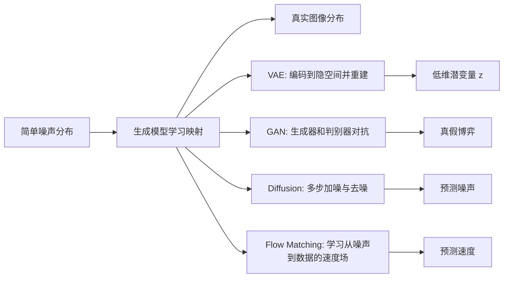
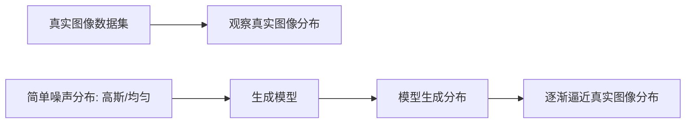

# 第九章：生成式模型 零基础完整讲解

来源：`第九章-生成式模型.pptx`。课程名称：深度学习导论。主讲教师：王文冠。PPT 共 148 页，无隐藏页。本文依据本地 PPTX 结构化抽取结果整理，公式页中部分公式在 PPT 里是数学对象或图片，我用课程上下文和标准写法补回，便于你真正看懂。

本章的核心问题是：模型怎样从“随机噪声”生成“有意义的图像”？一张图在计算机中只是 `H x W x C` 个数字；随机填数字通常只能得到噪声。生成式模型要学的不是某一张图，而是真实图像在高维空间中的分布规律。VAE、GAN、Diffusion Model 和 Flow Matching 都是在回答同一个问题：怎样把一个简单分布，例如高斯噪声，变成复杂的真实图像分布。



## 0. 逐页覆盖清单

这一部分先保证 PPT 的每一页都被覆盖。后面再把这些内容合并成连贯讲解。

| 页码 | 内容 |
|---:|---|
| 1 | 标题页：第九章“生成式模型”，课程为深度学习导论，主讲教师王文冠。 |
| 2 | 图像生成背景：无条件生成是把无意义随机噪声转为清晰逼真的图像；条件生成是根据条件，例如文字，引导生成特定内容图像。 |
| 3 | 图像在计算机底层表示为 `H x W x C` 的张量矩阵；高清图像 `1024 x 1024` 需要预测超过三百万个像素取值。图像生成不是像人在画布涂抹，而是在高维矩阵空间中找到极少数正确像素组合。 |
| 4 | 噪声与结构化图像：若只是从随机分布，例如高斯分布，直接采样并可视化，只会得到无意义噪声。要生成有意义图像，必须学习像素之间的复杂关系。 |
| 5 | 继续通过采样和可视化说明随机分布直接生成图像通常只能得到噪声图像。 |
| 6 | 图像分布近似：真实图像分布形式未知、维度高、结构复杂，不能直接求解。 |
| 7 | 大量真实图像数据集是我们观察真实图像分布的样本来源。 |
| 8 | 模型训练的目标：从初始噪声分布，例如高斯分布，逐渐逼近真实图像分布，最终得到模型分布。 |
| 9 | 随训练进行，模型生成图像越来越接近现实图像。 |
| 10 | 本章介绍四种常见生成式模型：变分自编码器 VAE、生成对抗网络 GAN、扩散模型 Diffusion Model、流匹配模型 Flow Matching。 |
| 11 | VAE 目录：图像生成难点、模型架构与训练流程、样本级对应与分布级对应、数学原理、正则项损失、训练困境与重参数化、图像生成与泛化。 |
| 12 | 图像生成难点：维度灾难。`256 x 256` 彩色图像接近二十万维，直接求解和随机采样像“大海捞针”，大多数像素组合无意义且计算量巨大。 |
| 13 | 破解维度灾难的方法是降维：把高维像素空间映射到更简单的特征空间，例如用发量、脸宽高比、眼睛大小、鼻子高度等 128 维特征表示人脸。 |
| 14 | VAE 目录页，进入模型架构与训练流程。 |
| 15 | 自编码器是基于降维的无监督学习模型，用神经网络完成压缩和重构。Encoder 将图像映射到潜空间低维特征，Code layer 记录关键特征，Decoder 将低维特征重建成图像。参考论文：Reducing the Dimensionality of Data with Neural Networks, 2006。 |
| 16 | 用重建损失训练自编码器：让 Decoder 重构出的图像尽可能接近原图，迫使模型学会高效打包和解包图像信息。 |
| 17 | 训练完成后只使用 Decoder 生成图像；核心逻辑是 Decoder 已经学会从低维特征到高维图像的解码方式。 |
| 18 | VAE 目录页，进入样本级对应与分布级对应。 |
| 19 | 关键问题：训练好的解码器能重构输入图像，但它是否能生成训练中没见过的新图像？ |
| 20 | 传统自编码器可能只是“死记硬背”：Decoder 记住特定隐向量和图像之间的对应关系。训练图像在隐空间中是孤立离散点，点之间有断层；遇到训练集外的新隐向量可能生成噪声。 |
| 21 | 破局方法：从样本级对应变成分布级对应。样本级是一个点对应一张图，点稍微偏移就崩溃；分布级是一个分布对应一类相似图像，点稍微偏移只产生合理渐变。 |
| 22 | VAE 的分布级预测：Encoder 不输出固定向量，而输出概率分布。这样隐空间被连续概率分布填满，减少未定义断层。 |
| 23 | VAE 目录页，进入数学原理。 |
| 24 | VAE 数学起点：真实图像分布复杂未知，使用潜变量模型近似；为了采样方便，引入标准正态先验 `p(z)`。目标是训练 Decoder `p_theta(x|z)`，使从先验采样的 `z` 能生成图像；优化思路来自最大似然估计。 |
| 25 | 直接积分难以计算，因此引入编码器分布 `q_phi(z|x)` 近似真实后验 `p_theta(z|x)`，帮助学习解码器分布。这就是“变分推断”，也是 VAE 中“变分”的来源。 |
| 26 | VAE 训练目标：一方面最大化真实样本生成似然，另一方面最小化编码器分布和真实隐变量后验之间的距离。合并推导得到可优化目标。 |
| 27 | VAE 损失有两部分：KL 散度正则项，让编码器输出分布贴近标准正态先验；重建误差项，例如 MSE，让解码器从采样潜变量中准确还原输入图像。 |
| 28 | VAE 目录页，进入正则项损失。 |
| 29 | 回顾 VAE 损失函数：重构损失加正则项。提出问题：如何理解 KL 正则项？如果去掉 KL，只保留重构误差会怎样？ |
| 30 | 若只追求重建精度，网络会让方差 `sigma -> 0`，把概率分布退化成点，以消除采样不确定性。KL 散度限制分布不退化为点，填补隐空间断层，赋予生成新图像的能力。 |
| 31 | 继续强调：只用重建损失会让 VAE 退回样本级预测，隐空间重新破碎，模型失去泛化生成能力。 |
| 32 | VAE 训练本质是博弈：重构约束过强会导致空间离散、生成多样性不足；正则项过强会导致后验崩溃，生成特征极度模糊。工程关键是平衡两项权重。 |
| 33 | VAE 目录页，进入训练困境与重参数化技巧。 |
| 34 | Encoder 不再直接输出特征向量 `z`，而输出隐变量分布的参数，例如均值和方差。 |
| 35 | Decoder 生成阶段需要从 Encoder 输出分布中采样隐变量；标准随机采样不可计算梯度，会导致反向传播梯度在采样节点断裂，Encoder 无法更新。 |
| 36 | 重参数化技巧：把直接采样改写为从固定噪声采样再用均值和方差变换，解决采样后梯度不能回传的问题。 |
| 37 | VAE 目录页，进入图像生成与泛化。 |
| 38 | VAE 图像生成流程：输入图像经 Encoder 得到隐空间分布，再经 Decoder 重构图像。 |
| 39 | VAE 能够生成训练集中未见过的新图像，原因是分布式预测让模型学习不同图像特征并在连续隐空间内泛化。 |
| 40 | GAN 目录：像素级重建函数缺陷、模型架构、生成器与判别器、损失函数与优化策略、理论最优解、优化流程与最终状态。 |
| 41 | VAE 缺陷：生成图像能重建大致结构，但复杂细节较差，普遍模糊。 |
| 42 | 像素级重建损失衡量生成质量，但不能有效捕捉图像中的层次化特征，例如边缘、纹理和语义。 |
| 43 | 改进思路：用表达能力更强的神经网络充当判别器，衡量生成图像与真实图像相似度。 |
| 44 | GAN 目录页，进入模型架构。 |
| 45 | GAN 通过两个网络对抗训练生成逼真数据。生成器 G 生成模拟数据，判别器 D 判断输入是真实还是生成。参考论文：Generative Adversarial Networks, NeurIPS 2014。 |
| 46 | GAN 模块：随机噪声 `z` 来自人为设定先验，真实图像 `x` 来自数据库，合成图像 `G(z)` 来自生成器。判别器区分真样本和假样本，生成器欺骗判别器。类比为造假者和警察。 |
| 47 | GAN 目录页，进入生成器与判别器。 |
| 48 | 判别器内部是神经网络，输入图像矩阵，输出标量。分数越大越像真图，越小越像假图。目标是让真实图像得分接近 1，生成图像得分接近 0。 |
| 49 | 生成器输入随机噪声向量，通过神经网络生成图像矩阵；目标是生成尽可能真实的图像以欺骗判别器。 |
| 50 | GAN 精髓在动态交互：判别器不仅给真伪评分，还通过反向传播梯度指导生成器优化参数。提出问题：判别器越强是否一定越好？ |
| 51 | 如果判别器远强于生成器，它会给所有生成图像绝对低分，导致生成器梯度接近 0，无法知道哪张图更好，失去优化方向。生成器和判别器能力不能差距过大。 |
| 52 | GAN 需要交替同步联合训练：训练 D 时冻结 G，训练 G 时冻结 D，使鉴伪能力和造假能力在博弈中共同进化。 |
| 53 | GAN 目录页，进入损失函数与优化策略。 |
| 54 | GAN 损失函数是极大极小博弈。判别器希望最大化分类正确程度 `V(D,G)`，生成器希望最小化判别器区分真伪的能力。 |
| 55 | 判别器和生成器交替优化：更新 D 时固定 G，最大化 `V(D,G)`；更新 G 时固定 D，最小化 `V(D,G)`。 |
| 56 | 判别器训练：固定生成器，判别器学习真实样本标签 1 与生成样本标签 0 的差异，通过反向传播增强鉴别能力。 |
| 57 | 生成器训练：固定判别器，生成器通过判别器传回梯度调整自身参数，争取得到更高真实性分数。 |
| 58 | GAN 目录页，进入判别器与生成器理论最优解。 |
| 59 | 从数学原理理解 GAN 优化目标和理论最优解。理论推导使用函数空间和数学推导，实际不可直接求解，只用于辅助理解。 |
| 60 | 固定 G 优化 D：把期望写成积分，将全局最优分解为每个样本点 `x` 上的逐点优化。 |
| 61 | 用 `A = p_data(x)`、`B = p_g(x)` 表示固定分布，判别器目标可写为 `f(D)=A log D + B log(1-D)`。 |
| 62 | 对 `f(D)` 求导得到最优判别器 `D*(x)=p_data(x)/(p_data(x)+p_g(x))`。它表示样本在真实分布和生成分布中的相对占比。 |
| 63 | 将最优判别器代回生成器目标，生成器优化等价于最小化真实分布 `p_data` 与生成分布 `p_G` 的 JS 散度；JS 散度越小，两个分布越相似。 |
| 64 | GAN 目录页，进入优化流程与最终状态。 |
| 65 | GAN 训练流程：初期随机初始化；判别器训练至收敛但生成器不更新、生成器训练至收敛但判别器不更新都只是理论片段，实际要交替训练。 |
| 66 | GAN 理论优化终点：理论上收敛到最优解，推导见 NeurIPS 2014 原论文。 |
| 67 | GAN 局限：对抗训练易崩溃。训练初期生成样本质量差，若判别器过强，多数生成样本得分过低。 |
| 68 | 判别器过强会让生成器倾向于只生成少数高分样本，导致生成缺乏多样性，即训练崩溃或模式崩溃。 |
| 69 | GAN 局限：单步生成难度高。生成器必须一次前向传播从低维噪声映射到高维图像空间，真实数据分布复杂，稍有偏差就影响质量。 |
| 70 | 扩散模型引入多步生成：把一次困难生成拆成多个微小去噪问题，降低学习和生成难度。 |
| 71 | 扩散模型目录：概述、去噪模型设计、训练、推理、条件生成、隐空间扩散、Stable Diffusion。 |
| 72 | 扩散模型定义：从真实图像不断加噪得到纯噪声；从纯噪声逐步去噪得到真实图像。参考论文 DDPM, NeurIPS 2020。 |
| 73 | 前向过程：图像加噪得到噪声，每个 step 随机采样高斯噪声加到图像上。 |
| 74 | 多步前向加噪逐渐覆盖原图信息，使图像趋近高斯分布，构造图像分布到高斯分布的路径。 |
| 75 | 反向过程：从高斯分布出发逐步去噪，逐渐还原图像信息，生成近似图像分布样本。 |
| 76 | 前向加噪可直接随机采样；反向去噪需要模型学习每一步如何去除噪声，因此学习去噪模型等价于学习生成图像。 |
| 77 | 扩散模型目录页，进入去噪模型设计。 |
| 78 | 问题：去噪模型输入已确定，模型内部如何设计才能得到目标去噪结果？ |
| 79 | 思路一：神经网络直接预测加噪前图像。但图像分布复杂，不同图像共性少，学习难度高。 |
| 80 | 思路二：神经网络先预测噪声再去除。图像多种多样，但噪声遵从高斯分布，学习难度更低。 |
| 81 | 扩散模型目录页，进入去噪模型训练。 |
| 82 | 训练目标：每一步去噪中，模型需要预测相邻状态之间的噪声并去除。 |
| 83 | 实现方法：在每一步加噪过程中训练模型学习加入的真实噪声。 |
| 84 | 朴素训练想法：加噪过程中按顺序加入每步噪声，同时学习预测第一步噪声。 |
| 85 | 继续朴素训练：学习第一步和第二步加入的噪声。 |
| 86 | 继续朴素训练：一直到第 `t` 步，按顺序学习每步噪声。 |
| 87 | 朴素想法缺陷：按顺序学习会导致训练任务固定，前期只学低噪声预测，后期只学高噪声预测，优化不稳，可能灾难性遗忘。 |
| 88 | 改进：随机采样时间步进行训练，打乱训练顺序。随机采样干净样本、时间步和该时刻加入的噪声。 |
| 89 | 新缺陷：若要得到随机时间 `t` 的含噪图，朴素做法需要加噪 `t` 次，计算浪费。 |
| 90 | 解决：把多步加噪推导成单步闭式公式，直接由初始图像和一个随机噪声得到任意时刻含噪图。 |
| 91 | 递归推导：展开前几步，把第 1 步代入第 2 步，继续递推。 |
| 92 | 根据归纳定义累积噪声强度，可得到一般规律，即 `x_t` 可由 `x_0` 和一个高斯噪声一步得到。 |
| 93 | 噪声合并：独立高斯的线性组合仍然是高斯，多噪声之和可等价为一个单噪声。 |
| 94 | 通过展开累积项证明噪声方差可以合并，完成从多步加噪到单步加噪的推导。 |
| 95 | 损失函数：噪声预测值和真实噪声之间使用 L2 损失，最小化二者偏差。 |
| 96 | 训练流程总结：随机采样图像、噪声和时间；用单步公式得到含噪图；噪声预测网络预测噪声；用真实噪声计算损失。 |
| 97 | 扩散模型目录页，进入推理。 |
| 98 | 推理第一步：给定时间 `t` 和该时刻含噪图 `x_t`，神经网络预测噪声并减去。 |
| 99 | 推理第二步：给去噪结果加入随机采样噪声，生成 `t-1` 时刻含噪图。这样增加多样性，并打破预测误差累积。 |
| 100 | 扩散模型不足：无法可控生成；图像生成速度慢。去噪步数多、图像分辨率高，计算代价大。`512 x 512` 像素总量为 262,144。 |
| 101 | 扩散模型目录页，进入条件生成。 |
| 102 | 不可控生成问题：随机采样噪声会生成随机图像。问题是能否在去噪过程中加入控制信号，控制最终图像。 |
| 103 | 无条件生成：模型输入随机噪声，生成结果随机。 |
| 104 | 条件生成：输入包含条件指令，例如“生成一张猫玩毛线球的图片”，因此结果可控。 |
| 105 | 文本引导：把文本作为模型输入，引导每一步去噪过程，使模型根据文本生成对应图像。 |
| 106 | 文本编码后的特征向量在噪声预测网络内部与图像特征做 cross attention，将文本语义注入去噪过程。 |
| 107 | 扩散模型目录页，进入隐空间扩散。 |
| 108 | 速度慢问题：像素空间去噪分辨率高、计算重。提出问题：能否减少像素总量，降低复杂度？ |
| 109 | 回顾 VAE：Encoder 把高维图像浓缩为低维隐变量 `z`，Decoder 从低维隐变量重建图像。 |
| 110 | 隐空间扩散：在 VAE 编码的低维隐空间进行加噪和去噪，降低计算和显存消耗；例如图像 `512 x 512` 可映射到 `64 x 64` 隐空间。 |
| 111 | 隐空间加噪：先把图像编码到隐空间，在隐空间内多步加入随机噪声，使隐空间图像变成近似高斯噪声。 |
| 112 | 隐空间去噪：去噪网络输入隐空间高斯噪声，也可输入文本等条件，去噪结果再解码成图像。 |
| 113 | 隐空间训练：在隐空间内学习预测噪声并计算损失，可额外加入文本信息作为输入。 |
| 114 | 隐空间推理：输入文本特征和隐空间随机噪声，在隐空间去噪得到干净特征图，再由 VAE Decoder 得到最终图像。 |
| 115 | 扩散模型目录页，进入典型应用 Stable Diffusion。 |
| 116 | Stable Diffusion 原理：支持文本等多种条件引导生成，并在隐空间内完成扩散过程，再解码到图像空间。参考 Latent Diffusion Models, CVPR 2022。 |
| 117 | Stable Diffusion 是生成模型里程碑。成功原因：文本能控制生成过程，便于创作；隐空间扩散让模型更快、资源占用更低，可供大量用户使用。 |
| 118 | Flow Matching 目录：刻画映射的其他方法、向量场、模型原理、训练过程、与扩散模型对比总结。 |
| 119 | 扩散模型通过多步加噪刻画图像与噪声分布之间的映射路径，噪声是两种分布之间的媒介。 |
| 120 | 扩散模型的映射路径因为噪声随机采样而弯曲、随机。 |
| 121 | 新思路：能否把映射路径拆成若干条线段之和？从每步去噪变成每步沿线段前进；路径更接近直线，因此速度更快。 |
| 122 | 若已知样本速度，就能计算每条线段，累加后得到从噪声分布到图像分布的总路径。 |
| 123 | Flow Matching 目录页，进入模型原理。 |
| 124 | 向量场定义：已知状态和时间，样本在此时此处的速度向量，包括速度大小和方向。 |
| 125 | Flow Matching 定义：从随机噪声出发，通过多步直线路径生成图像。参考 Flow Matching for Generative Modeling, ICLR 2023。 |
| 126 | Flow Matching 也采用多步生成、化整为零、降低生成难度。 |
| 127 | Flow Matching 从噪声分布经过多步路径到图像分布。 |
| 128 | 对当前步的状态和时间，FM 模型预测向量场，由此得到路径和下一步状态。 |
| 129 | 继续说明当前状态、时间、速度场预测和下一步状态之间的关系。 |
| 130 | Flow Matching 目录页，进入训练过程。 |
| 131 | 训练过程：随机采样噪声 `x_0`、样本 `x_1`、时间 `t`，计算当前状态 `x_t=(1-t)x_0+t x_1`。 |
| 132 | 类比扩散模型：扩散模型去噪时预测的噪声也是近似加噪时随机采样的噪声，并非完全一致。 |
| 133 | 根据当前状态 `x_t` 和时间 `t`，FM 模型预测速度 `v_pred`。 |
| 134 | 假设匀速通过直线路径，则真实速度 `v=x_1-x_0`；用预测速度和真实速度计算 L2 损失。 |
| 135 | 提出问题：既然真实速度固定，为什么还需要神经网络学习？ |
| 136 | 原因一：训练时可见的随机噪声和训练集图像是有限的，模型要学会泛化到未见组合。 |
| 137 | 原因二：推理时真实图像目标未知，不能直接计算真实速度。 |
| 138 | 继续强调推理时没有 `x_1` 真值，必须依赖模型预测速度场前进。 |
| 139 | 训练总结：随机采样噪声和样本，线性加权得到当前状态，预测速度并计算损失。 |
| 140 | Flow Matching 目录页，进入与扩散模型对比。 |
| 141 | 生成方式对比：扩散模型是多步去噪，从噪声生成图像。 |
| 142 | Flow Matching 生成方式从去除噪声变成样本位移，沿预测速度逐步移动。 |
| 143 | 训练过程对比：扩散模型通过单步加噪得到含噪样本；Flow Matching 通过噪声和样本线性加权得到当前状态。 |
| 144 | 继续对比训练过程：Flow Matching 在 0 到 1 之间采样时间 `t`，把 `(1-t)x_0+t x_1` 作为当前状态。 |
| 145 | 生成模型总结：VAE, 2013。原理是编码到隐空间并重建；影响是现代隐空间生成模型常用 VAE 构建潜在特征空间；缺点是图像轮廓可生成但细节模糊。 |
| 146 | GAN, 2014。原理是生成器和判别器对抗博弈；生成图像比 VAE 清晰；影响包括超分辨率和风格迁移等视觉任务。 |
| 147 | Diffusion Model, 2020。原理是噪声通过多步迭代去噪生成图像；生成更逼真，Stable Diffusion、Sora 等主流图像/视频模型建立在扩散框架上。 |
| 148 | Flow Matching, 2023。原理是学习从噪声到数据的传输路径；影响是成为新研究热点，应用于 Stable Diffusion 3、Flux.1、具身智能等前沿领域；优势是在保持高质量同时路径更直接、采样更快。 |

## 1. 先从最根本的问题开始：什么叫生成图像？

图像生成模型要做的事情可以分成两类。

第一类是无条件生成。你不给模型明确要求，只给它一段随机噪声，它自己生成一张看起来真实的图像。这里的“噪声”可以理解成一串随机数字，例如从标准正态分布 `N(0,I)` 采样出来的向量。

第二类是条件生成。你给模型一个条件，例如文字“猫玩毛线球”、草图、类别标签、另一张参考图，模型生成符合这个条件的图像。今天常见的文生图模型就是条件生成。

初学者最容易误解的一点是：生成模型不是“脑子里有画笔”。在计算机里，一张图像就是一个数字张量：

```text
图像 x 的形状 = H x W x C
H: 高度
W: 宽度
C: 通道数，例如 RGB 图像 C=3
```

例如 `1024 x 1024 x 3` 的彩色图像有超过三百万个数字。每个数字稍有不同，图像就会变化。绝大多数数字组合都不是有意义的图片，而是杂乱噪声。所以图像生成真正困难的地方是：在极其巨大的高维空间里，找到那些像真实世界图像的极少数数字组合。

这就引出本章的主线：真实图像不是随机数字，而是服从某种复杂分布。我们不知道这个分布的精确公式，只能通过数据集里的大量真实图片观察它。生成式模型训练的目标，就是让模型分布逐渐接近真实图像分布。



如果模型没有学到像素之间的关系，随机采样出来的只是噪声。如果模型学到了眼睛和鼻子怎样搭配、天空和地面怎样布局、纹理和边缘怎样组合，它就能生成结构化图像。

## 2. 四类生成式模型的总览

本章介绍四类方法，它们看似不同，本质都在学习“简单噪声分布”和“复杂图像分布”之间的关系。

| 模型 | 直观思路 | 学什么 | 典型优点 | 典型问题 |
|---|---|---|---|---|
| VAE | 把图像压缩到低维隐空间，再从隐空间重建图像 | 连续潜变量分布和解码器 | 隐空间连续，便于采样和插值 | 图像容易模糊 |
| GAN | 生成器造假，判别器鉴别真假 | 生成器分布逼近真实分布 | 图像清晰、细节好 | 训练不稳定，可能模式崩溃 |
| Diffusion | 先把图像逐步加噪，再学习逐步去噪 | 每一步如何预测噪声 | 稳定、高质量、可控生成强 | 推理步数多，速度慢 |
| Flow Matching | 学习从噪声到数据的速度场 | 每个时间和状态下该往哪里走 | 路径更直接，采样更快 | 概念更抽象，需要理解向量场 |

下面按课件顺序展开。

## 3. VAE：从“记住图像”到“学习连续隐空间”

### 3.1 为什么需要降维？

一张 `256 x 256 x 3` 图像接近二十万维。直接在这个空间里随机采样，好比在二十万维的大海里捞一根针。绝大多数点都没有意义。

但如果我们看人脸，很多信息可以用更少的因素描述：发量、脸的宽高比、眼睛大小、鼻子高度、肤色、表情、姿态等。假设用 128 维特征向量表示，这比二十万维像素空间简单得多。

这就是降维思想：

```text
高维像素图像 x  -->  低维潜变量 z  -->  重建图像 x_hat
```

`z` 也叫隐变量、潜变量、latent code。它不是人工规定的“眼睛大小=第几维”，而是模型自己学出的低维表示。

### 3.2 自编码器 AE 的基本结构

自编码器由三部分组成。

| 部分 | 作用 | 直观比喻 |
|---|---|---|
| Encoder | 把图像压缩成低维特征 | 打包压缩文件 |
| Code layer / latent code | 存储关键信息 | 压缩包内容 |
| Decoder | 从低维特征重建图像 | 解压缩 |

训练目标是让重建图像 `x_hat` 尽可能接近原图 `x`。常见重建损失为均方误差：

```text
L_recon = ||x - x_hat||^2
```

如果自编码器训练好了，Decoder 就学会了“低维特征 -> 图像”的映射。于是看起来我们可以只拿 Decoder 来生成图像：给它一个低维向量 `z`，让它输出图像。

但是这里有一个关键问题：你给 Decoder 的 `z` 从哪里来？

### 3.3 传统自编码器的问题：样本级对应导致隐空间断层

普通自编码器可能只是把每张训练图像映射到一个固定点：

```text
图像 A -> z_A -> 重建 A
图像 B -> z_B -> 重建 B
图像 C -> z_C -> 重建 C
```

这叫样本级对应：一个点对应一张图像。问题是，训练集中只有有限图片，所以隐空间里只有有限的点被训练过。点和点之间的大量区域没有定义。你随便采一个新点，Decoder 可能完全不知道该怎么解码，输出噪声或崩坏图像。

这就是课件说的“死记硬背”和“断层”。

VAE 的破局方法是：不要让 Encoder 输出一个固定点，而让它输出一个概率分布。这样每张图像不是对应一个孤立点，而是对应隐空间中的一小片连续区域。

```text
普通 AE:  x -> 一个固定 z
VAE:      x -> 一个分布 q_phi(z|x)，例如 N(mu, sigma^2)
```

分布级对应的好处是：点稍微移动，图像也只会发生合理小变化，例如毛发颜色、背景、姿态轻微改变，而不是立刻崩溃。

### 3.4 VAE 的概率模型：先验、编码器、解码器

VAE 里有三个核心分布。

| 符号 | 名称 | 含义 |
|---|---|---|
| `p(z)` | 先验分布 | 生成前从哪里采样潜变量，通常取标准正态 `N(0,I)` |
| `p_theta(x|z)` | 解码器分布 | 给定潜变量 `z` 后生成图像 `x` 的概率 |
| `q_phi(z|x)` | 编码器分布 | 给定真实图像 `x` 后推测它可能对应哪些潜变量 |

生成过程是：

```text
1. 从标准正态分布采样 z ~ p(z)
2. 用 Decoder p_theta(x|z) 生成图像 x
```

训练目标来自最大似然估计：我们希望真实图像在模型分布中出现的概率尽可能大。

理论上要最大化：

```text
log p_theta(x)
```

但 `p_theta(x)` 需要把所有可能的 `z` 都积分掉：

```text
p_theta(x) = ∫ p_theta(x|z) p(z) dz
```

这个积分在深度神经网络里通常无法直接算。所以 VAE 引入编码器 `q_phi(z|x)`，用它近似真实后验 `p_theta(z|x)`。这一步叫变分推断，也是 VAE 的“Variational”来源。

### 3.5 VAE 损失函数：重建项 + KL 正则项

标准 VAE 的训练目标常写成最大化 ELBO：

```text
ELBO = E_{q_phi(z|x)}[log p_theta(x|z)] - KL(q_phi(z|x) || p(z))
```

如果写成要最小化的损失：

```text
L_VAE = L_recon + L_KL
```

其中：

```text
L_recon = - E_{q_phi(z|x)}[log p_theta(x|z)]
L_KL    = KL(q_phi(z|x) || p(z))
```

直观理解：

| 项 | 想让模型做到什么 | 如果太弱会怎样 | 如果太强会怎样 |
|---|---|---|---|
| 重建损失 | 解码后像原图 | 图像不像输入 | 过度追求重建，隐空间离散，像普通 AE |
| KL 正则项 | 编码器输出分布贴近标准正态 | 隐空间断层，不能随机采样 | 后验崩溃，图像模糊或潜变量无信息 |

当编码器输出高斯分布：

```text
q_phi(z|x) = N(mu, sigma^2)
p(z) = N(0, I)
```

KL 项有解析解。常见写法是：

```text
KL(q_phi(z|x) || p(z))
= 1/2 * Σ_i (mu_i^2 + sigma_i^2 - log(sigma_i^2) - 1)
```

这项会惩罚编码器输出离标准正态太远。

### 3.6 为什么不能去掉 KL 项？

如果只保留重建损失，模型会发现一个作弊方法：让每张图像对应的分布方差越来越小，也就是 `sigma -> 0`。这样采样几乎不再随机，分布退化成一个点，VAE 又变回普通自编码器。

结果是：

```text
隐空间从连续分布 -> 孤立点
随机采样 z -> 很可能落在未训练区域
Decoder -> 生成噪声或无意义图像
```

所以 KL 项不是可有可无的装饰，而是 VAE 能生成新图像的关键。它强迫不同样本的隐空间分布不要太分散、太破碎，而要共同贴近标准正态先验。这样训练完以后，从 `N(0,I)` 随机采样的 `z` 才更可能落在 Decoder 会解码的区域。

### 3.7 后验崩溃是什么？

课件提到“正则项过强会引发后验崩溃”。意思是：如果 KL 项权重太大，编码器会为了贴近 `N(0,I)`，不再认真编码输入图像信息。所有输入图像都被编码成差不多的分布。

这样 Decoder 拿到的 `z` 对输入没有区分度，生成图像就会模糊、平均化。

所以 VAE 训练是在两个目标之间找平衡：

```text
重建项强：图像还原清楚，但隐空间容易碎
KL 项强：隐空间规则，但图像容易模糊
```

### 3.8 重参数化技巧：让随机采样也能反向传播

VAE 的 Encoder 输出 `mu` 和 `sigma`，然后要从分布里采样：

```text
z ~ N(mu, sigma^2)
```

问题是，直接“采样”这个操作不可微。反向传播时梯度会断在采样节点，Encoder 无法知道自己输出的 `mu` 和 `sigma` 应该怎样调整。

重参数化技巧把采样改写为：

```text
epsilon ~ N(0, I)
z = mu + sigma * epsilon
```

这样随机性来自 `epsilon`，而 `z` 对 `mu` 和 `sigma` 是可微的。梯度可以从 Decoder 传回 Encoder。

```mermaid
flowchart LR
    X[输入图像 x] --> E[Encoder]
    E --> M[mu]
    E --> S[sigma]
    N[epsilon ~ N(0,I)] --> R[z = mu + sigma * epsilon]
    M --> R
    S --> R
    R --> D[Decoder]
    D --> XH[重建图像 x_hat]
```

### 3.9 VAE 的最终理解

VAE 的一句话总结：

```text
VAE 让每张图像对应隐空间中的一个连续概率分布，并训练 Decoder 从标准正态隐空间中生成图像。
```

它的重要影响不只在 VAE 自身，而在于“隐空间生成”的思想。后面的 Stable Diffusion 也会用 VAE 把图像压到隐空间，再在隐空间做扩散，大幅降低计算量。

## 4. GAN：让模型用“鉴别真假”的方式学习生成

### 4.1 为什么 VAE 图像容易模糊？

VAE 常用像素级重建损失，例如 MSE。MSE 会逐像素比较两张图：

```text
像素 1 差多少
像素 2 差多少
...
```

这种损失能衡量大致结构，但不擅长衡量高级视觉质量。它不真正理解边缘是否锐利、纹理是否自然、语义是否合理。

一个典型问题是平均化：如果同一个模糊区域有多种可能细节，MSE 倾向于取平均，结果就变糊。

GAN 的思路是：不要用固定公式衡量图像好不好，而训练一个神经网络当判别器，让它自己学习真实图像和生成图像的差异。

### 4.2 GAN 的两个角色

GAN 有两个网络。

| 网络 | 输入 | 输出 | 目标 |
|---|---|---|---|
| Generator, G | 随机噪声 `z` | 生成图像 `G(z)` | 生成足够真实的图像，骗过判别器 |
| Discriminator, D | 真实图像 `x` 或生成图像 `G(z)` | 标量 `D(x)` | 真图给高分，假图给低分 |

直观类比：

```text
生成器 G = 造假者
判别器 D = 鉴定者/警察
```

G 越来越会造假，D 越来越会鉴别。D 的反馈通过梯度传给 G，告诉 G 如何调整参数才能更像真实图像。

### 4.3 判别器是不是越强越好？

不是。

如果 D 过强，它会对所有假图都打极低分，例如 0.001。此时 G 面临一个问题：所有结果都很差，且梯度接近 0，它不知道哪张图“稍微好一点”，也就没有有效优化方向。

这就是梯度消失问题。

GAN 需要的是对抗平衡：D 要足够强，能提供有意义反馈；但不能强到让 G 完全学不到东西。

### 4.4 交替训练策略

GAN 不能简单同时把 G 和 D 当普通网络一起训练，因为它们目标相反。实际训练通常交替进行：

1. 固定 G，训练 D。
   - 从数据集取真实图像，标签为 1。
   - 用 G 生成假图，标签为 0。
   - 更新 D，让它更会区分真假。

2. 固定 D，训练 G。
   - 从噪声采样 `z`，生成 `G(z)`。
   - 把 `G(z)` 给 D。
   - 更新 G，让 D 对假图打更高分。

这就是课件说的“交替冻结一方参数训练另一方”。

### 4.5 GAN 的极大极小目标

GAN 的经典目标函数是：

```text
min_G max_D V(D,G)
= E_{x~p_data} [log D(x)]
  + E_{z~p_z} [log(1 - D(G(z)))]
```

逐项解释：

```text
E_{x~p_data} [log D(x)]
```

真实图像 `x` 来自真实数据分布。D 希望 `D(x)` 越接近 1 越好，所以 `log D(x)` 越大。

```text
E_{z~p_z} [log(1 - D(G(z)))]
```

假图来自生成器。D 希望 `D(G(z))` 越接近 0 越好，所以 `log(1-D(G(z)))` 越大。

D 要最大化这两项。G 的目标相反，它希望假图被 D 认为是真的，也就是让 `D(G(z))` 变大，从而破坏 D 的分类能力。

### 4.6 最优判别器推导的直观解释

固定 G 时，生成分布 `p_g(x)` 已经确定。判别器要在每个样本点 `x` 判断它更像真实分布还是生成分布。

目标可写成：

```text
f(D) = p_data(x) log D(x) + p_g(x) log(1 - D(x))
```

设：

```text
A = p_data(x)
B = p_g(x)
```

则：

```text
f(D) = A log D + B log(1-D)
```

对 `D` 求导并令导数为 0，可得：

```text
D*(x) = p_data(x) / (p_data(x) + p_g(x))
```

这非常直观：如果某个 `x` 在真实数据中很常见、在生成器中很少见，则 `D*(x)` 接近 1；如果某个 `x` 在生成器中很多、真实数据中少，则 `D*(x)` 较低；如果两者一样多，则 `D*(x)=0.5`，判别器无法区分。

### 4.7 生成器理论目标：逼近真实分布

把最优判别器代回目标函数，生成器优化等价于最小化真实分布和生成分布之间的 JS 散度：

```text
JSD(p_data || p_G)
```

JS 散度越小，两个分布越相似。最理想状态是：

```text
p_G = p_data
```

此时 D 对任意样本都只能输出 0.5，因为它无法判断真假。

### 4.8 GAN 的局限

课件强调两个局限。

第一，对抗训练容易崩溃。尤其训练初期，G 生成的图普遍差，D 太强时会让所有生成样本得分极低，G 没有有效梯度。

第二，模式崩溃。G 可能发现某几类图最容易骗过 D，于是把不同噪声都映射成类似高分图像。结果生成质量看似不错，但多样性很差。

第三，单步生成难。GAN 的 G 必须一次前向传播从低维噪声到高维图像。真实图像分布太复杂，一步到位很难。

这就自然引出扩散模型：不要一步生成整张图，而是分成很多小步。

## 5. 扩散模型：把困难生成拆成很多个小去噪任务

### 5.1 基本思想

扩散模型有两个过程。

| 过程 | 方向 | 是否需要学习 |
|---|---|---|
| 前向加噪 | 真实图像 -> 纯噪声 | 不需要学习，直接随机加高斯噪声 |
| 反向去噪 | 纯噪声 -> 真实图像 | 需要学习，训练神经网络预测如何去噪 |

前向过程把图像一步步加噪：

```text
x_0 -> x_1 -> x_2 -> ... -> x_T
```

其中 `x_0` 是真实图像，`x_T` 近似纯高斯噪声。

反向过程从噪声开始：

```text
x_T -> x_{T-1} -> ... -> x_0
```

每一步只解决一个小问题：从稍微更噪的图变成稍微更干净的图。相比 GAN 一步生成，扩散模型把难题化整为零。

### 5.2 前向加噪的标准形式

常见 DDPM 前向公式为：

```text
x_t = sqrt(alpha_t) x_{t-1} + sqrt(1-alpha_t) epsilon_t
epsilon_t ~ N(0, I)
```

其中：

```text
beta_t: 第 t 步噪声强度
alpha_t = 1 - beta_t
```

如果 `beta_t` 越大，每一步加入噪声越多。多步之后，原图信息逐渐被噪声覆盖。

课件强调：加噪不难，因为我们可以直接采样高斯噪声；真正难的是反向去噪，因为模型要知道每一步该去掉什么噪声。

### 5.3 去噪模型到底预测什么？

有两种思路。

思路一：直接预测加噪前图像。例如给 `x_t`，让模型预测 `x_{t-1}` 或 `x_0`。问题是图像本身分布太复杂，不同图像差异很大，学习困难。

思路二：预测噪声。给模型 `x_t` 和时间 `t`，让它预测其中的噪声 `epsilon`。噪声服从高斯分布，比图像分布简单，学习更稳定。

所以扩散模型常训练噪声预测网络：

```text
epsilon_theta(x_t, t) ≈ epsilon
```

### 5.4 为什么训练时随机采样时间步？

朴素想法是按顺序训练：

```text
先学第 1 步噪声
再学第 2 步噪声
...
再学第 t 步噪声
```

但这样会导致训练任务不均衡。训练前期只看到低噪声图，训练后期只看到高噪声图，模型可能忘掉之前学过的情况。

深度学习通常需要打乱数据，让梯度下降看到各种情况。因此扩散模型训练时会随机采样时间步 `t`：

```text
随机取真实图像 x_0
随机取时间 t
随机取噪声 epsilon
直接构造 x_t
训练模型预测 epsilon
```

### 5.5 多步加噪如何变成单步公式？

如果每次随机一个时间 `t`，都从 `x_0` 开始加噪 `t` 次，会非常慢。扩散模型的关键技巧是推导闭式公式：可以一步直接得到任意时刻的 `x_t`。

定义：

```text
alpha_t = 1 - beta_t
bar_alpha_t = Π_{s=1}^t alpha_s
```

则：

```text
x_t = sqrt(bar_alpha_t) x_0 + sqrt(1 - bar_alpha_t) epsilon
epsilon ~ N(0, I)
```

直观理解：

```text
x_t = 保留下来的原图成分 + 新加入/累计的噪声成分
```

当 `t` 小时，`bar_alpha_t` 接近 1，图像保留很多原图信息。当 `t` 大时，`bar_alpha_t` 接近 0，图像主要是噪声。

课件第 91-94 页的推导核心是：每一步加入的高斯噪声互相独立，而独立高斯的线性组合仍是高斯，所以多步噪声可以合并成一个高斯噪声。

### 5.6 扩散模型训练损失

训练时执行：

```text
1. 采样真实图像 x_0
2. 采样时间 t
3. 采样噪声 epsilon ~ N(0,I)
4. 用闭式公式得到 x_t
5. 输入 (x_t, t) 到噪声预测网络
6. 预测 epsilon_theta(x_t,t)
7. 用 L2 损失比较预测噪声和真实噪声
```

损失函数：

```text
L = ||epsilon - epsilon_theta(x_t, t)||^2
```

这就是课件第 95-96 页的“噪声预测值与真实值的 L2 损失”。

### 5.7 扩散模型推理

推理时没有真实图像 `x_0`，只有纯噪声 `x_T`。模型从 `T` 开始一步步往回走。

每一步大致做：

```text
1. 给定 x_t 和 t
2. 模型预测噪声 epsilon_theta(x_t,t)
3. 根据公式减去预测噪声，得到更干净的图
4. 适当加入随机噪声，得到 x_{t-1}
```

为什么去噪后还要加入随机噪声？课件给出两点：

1. 增加生成多样性，否则过程太确定。
2. 打破预测噪声的误差累积。

### 5.8 扩散模型的两个不足

第一，不可控。最基础的扩散模型输入是随机噪声，所以输出也随机。实际应用中，用户希望控制结果，例如指定文本。

第二，速度慢。扩散模型要多步去噪，每一步都运行神经网络；如果直接在 `512 x 512` 像素空间处理，像素总量有 262,144，计算量大。

这两个不足分别对应两个改进：条件生成和隐空间扩散。

## 6. 条件生成：用文本控制去噪方向

无条件生成只有噪声输入：

```text
随机噪声 -> 随机图像
```

条件生成加入条件，例如文本：

```text
随机噪声 + 文本“猫玩毛线球” -> 符合文本的图像
```

扩散模型中，文本不是只在最后告诉模型“我要猫”，而是参与每一步去噪。通常流程是：

```text
文本 prompt -> 文本编码器 -> 文本特征向量
文本特征向量 + 图像/噪声特征 -> cross attention
cross attention 把文本语义注入去噪网络
```

Cross attention 可以理解成：图像特征在每一步去噪时都去“查询”文本语义，决定哪些区域该长成猫、毛线球、花园、天空等。

这就是文生图模型能够根据 prompt 控制生成的原因。

## 7. 隐空间扩散：为什么 Stable Diffusion 可以更快？

扩散模型如果直接在像素空间做去噪，会很贵。`512 x 512` 图像有 262,144 个位置，若加上通道和网络特征，显存和计算量都大。

隐空间扩散借用 VAE 的思想：

```text
图像 x --VAE Encoder--> 隐空间 z
在 z 上扩散/去噪
干净 z --VAE Decoder--> 图像 x
```

例如 `512 x 512` 的图像可被编码成 `64 x 64` 的隐空间特征。空间尺寸缩小 8 倍，面积缩小 64 倍，计算量明显下降。

### 7.1 隐空间扩散的训练

训练过程：

1. 用 VAE Encoder 把图像编码到隐空间。
2. 在隐空间加噪。
3. 噪声预测网络在隐空间预测噪声。
4. 用预测噪声和真实隐空间噪声计算损失。
5. 可加入文本特征作为条件。

### 7.2 隐空间扩散的推理

推理过程：

1. 随机采样隐空间噪声。
2. 输入文本 prompt 并编码为文本特征。
3. 在隐空间多步去噪。
4. 得到干净隐空间特征。
5. 用 VAE Decoder 解码成最终图像。

Stable Diffusion 的核心成功点正是：

```text
文本条件控制 + 隐空间扩散降低计算成本
```

因此它既能按用户文本生成，又能在较低资源下运行。

## 8. Flow Matching：从“去噪”到“沿速度场移动”

### 8.1 为什么还需要新的刻画映射方法？

扩散模型通过加噪和去噪建立图像分布与噪声分布之间的路径。但由于噪声是随机采样的，这条路径往往是弯曲、随机的。

Flow Matching 的想法是：能否让路径更直接？例如把从噪声到图像的变化看成一条或多条直线段。每一步不是“去除噪声”，而是“沿着某个速度方向前进一点”。

### 8.2 向量场是什么？

向量场可以理解成：在每个位置、每个时间，告诉样本应该往哪里走、走多快。

```text
输入：当前状态 x_t 和时间 t
输出：速度向量 v(x_t,t)
```

如果把生成过程想象成导航：

```text
当前位置 = 当前噪声/中间样本
目标 = 真实图像分布
向量场 = 每个位置的导航箭头
```

模型学会向量场后，就能从噪声出发，沿箭头一步步走到图像分布。

### 8.3 Flow Matching 的训练样本构造

课件使用的简化直线路径是：

```text
x_0: 随机噪声
x_1: 真实图像样本
t: 从 0 到 1 随机采样的时间
```

当前状态定义为线性插值：

```text
x_t = (1 - t) x_0 + t x_1
```

当 `t=0` 时：

```text
x_t = x_0
```

也就是纯噪声。

当 `t=1` 时：

```text
x_t = x_1
```

也就是真实图像。

中间时刻是从噪声到图像的线性过渡。

### 8.4 Flow Matching 预测什么？

如果假设从 `x_0` 到 `x_1` 匀速直线移动，那么真实速度是：

```text
v = x_1 - x_0
```

FM 模型输入当前状态和时间：

```text
(x_t, t)
```

输出预测速度：

```text
v_pred = model(x_t, t)
```

损失函数是预测速度和真实速度的 L2 损失：

```text
L_FM = ||v_pred - (x_1 - x_0)||^2
```

这和扩散模型预测噪声很像，只是监督目标从“噪声”换成了“速度”。

### 8.5 真实速度都知道了，为什么还要神经网络？

课件专门提出这个问题。原因有两个。

第一，训练时的噪声和真实图像样本是有限的。模型不能只记住训练对，而要学会对未见过的噪声、未见过的中间状态也预测合理速度。

第二，推理时没有目标图像 `x_1`。你只有一个随机噪声起点，不知道最终应该生成哪张真实图像，因此不能直接计算 `x_1 - x_0`。模型必须根据训练中学到的向量场，在每个状态判断下一步该往哪里走。

### 8.6 Flow Matching 和扩散模型的关键对比

| 维度 | 扩散模型 | Flow Matching |
|---|---|---|
| 生成直觉 | 从噪声中逐步去除噪声 | 从噪声沿速度场移动到数据 |
| 训练状态构造 | 用单步加噪公式得到 `x_t` | 用线性加权 `x_t=(1-t)x_0+t x_1` |
| 模型预测 | 噪声 `epsilon` | 速度 `v` |
| 路径特点 | 随机、弯曲 | 更直接，常用直线路径理解 |
| 优势 | 高质量、成熟稳定 | 采样路径更直接，速度潜力更好 |

Flow Matching 的一句话总结：

```text
它学习一个从噪声分布流向数据分布的速度场，而不是显式学习每一步该去掉多少噪声。
```

## 9. 四类模型放在一起理解

### 9.1 它们都在处理分布变换

四种模型都可以看成从简单分布到真实数据分布的变换：

```text
简单分布 p(z) 或 p(noise) -> 模型 -> 图像分布 p_data(x)
```

区别在于它们如何学习这条路。

| 模型 | 从噪声/隐变量到图像的路线 |
|---|---|
| VAE | 让 Decoder 学 `z -> x`，并用 KL 让 `z` 空间接近标准正态 |
| GAN | 让 G 生成图像，用 D 判断真假，逼迫 `p_G` 接近 `p_data` |
| Diffusion | 学习反向去噪路径，从 `x_T` 一步步到 `x_0` |
| Flow Matching | 学习速度场，从 `x_0` 噪声沿路径移动到 `x_1` 数据 |

### 9.2 质量、速度、稳定性的取舍

VAE 训练相对稳定，隐空间好用，但生成图像容易模糊。

GAN 生成清晰，曾在超分辨率、风格迁移等任务中非常重要，但对抗训练不稳定，容易模式崩溃。

Diffusion 生成质量高、训练稳定、可控性强，成为主流图像和视频生成基础，但多步采样慢。

Flow Matching 继承多步生成思想，同时让路径更直接、采样更快，成为新的研究热点。课件提到 Stable Diffusion 3、Flux.1 和具身智能等前沿应用都在使用相关思想。

## 10. 初学者必须掌握的关键词

| 术语 | 零基础解释 |
|---|---|
| 生成式模型 | 学习数据分布，并从中生成新样本的模型 |
| 数据分布 | 哪些图像更像真实世界，哪些只是噪声的规律 |
| 高维空间 | 图像由大量像素数字组成，每张图是高维空间中的一个点 |
| 潜变量 / 隐变量 `z` | 低维隐藏表示，用来概括图像关键信息 |
| 先验分布 `p(z)` | 生成前假设 `z` 来自哪里，常用标准正态 |
| Encoder | 把图像压缩成潜变量或潜变量分布 |
| Decoder | 从潜变量生成或重建图像 |
| KL 散度 | 衡量两个概率分布差距的工具 |
| 重参数化 | 把随机采样改写成可微形式，让梯度能回传 |
| 判别器 | GAN 中判断图像真假的网络 |
| 生成器 | GAN 中从噪声生成图像的网络 |
| JS 散度 | 衡量两个分布差异；GAN 理论中生成器要缩小它 |
| 前向加噪 | 扩散模型中把真实图像逐步变成噪声 |
| 反向去噪 | 扩散模型中把噪声逐步变回图像 |
| 噪声预测网络 | 输入含噪图和时间，预测其中噪声的网络 |
| 条件生成 | 加入文字、类别等条件控制生成结果 |
| Cross attention | 让图像特征在生成过程中读取文本语义的机制 |
| 隐空间扩散 | 先把图像压缩到隐空间，再在隐空间扩散，降低计算量 |
| 向量场 | 每个状态和时间对应一个速度方向，指导样本移动 |
| Flow Matching | 学习从噪声到数据的速度场的生成模型 |

## 11. 学习路线建议

如果你是零基础，建议按下面顺序掌握。

1. 先理解“图像是高维矩阵”和“真实图像分布很稀疏”。这是所有生成模型的共同背景。
2. 再理解 VAE：为什么要隐空间、为什么要分布而不是点、为什么 KL 不能去掉、为什么要重参数化。
3. 再理解 GAN：生成器和判别器如何博弈，为什么判别器不能太强，为什么会模式崩溃。
4. 再理解扩散模型：前向加噪不需要学习，反向去噪需要学习；模型预测噪声而不是直接预测图像；训练用随机时间步和单步闭式加噪。
5. 最后理解 Flow Matching：它不是预测噪声，而是预测从噪声走向数据的速度。

## 12. 一页总结

```text
VAE:
把图像映射到连续隐空间，用重建损失保证能还原图像，用 KL 正则保证隐空间可采样。

GAN:
生成器负责造图，判别器负责鉴别真假。二者对抗，让生成分布逼近真实分布。

Diffusion:
先把真实图像逐步加噪，再训练模型反向预测噪声并逐步去噪。质量高但采样慢。

Stable Diffusion:
把扩散过程搬到 VAE 隐空间，并用文本条件通过 cross attention 控制生成。

Flow Matching:
把生成看成从噪声分布流向数据分布，训练模型预测每个状态下的速度场。
```

本章最重要的统一思想是：生成模型不是背图，也不是凭空画图，而是在学习“真实数据分布”与“简单噪声分布”之间的映射。VAE 用连续潜空间，GAN 用真假对抗，Diffusion 用多步去噪，Flow Matching 用速度场。理解了这个统一视角，后面看文生图、视频生成、Stable Diffusion、Sora、Flux 等模型时，就不会只看到复杂名词，而能看出它们在解决同一个基本问题。
