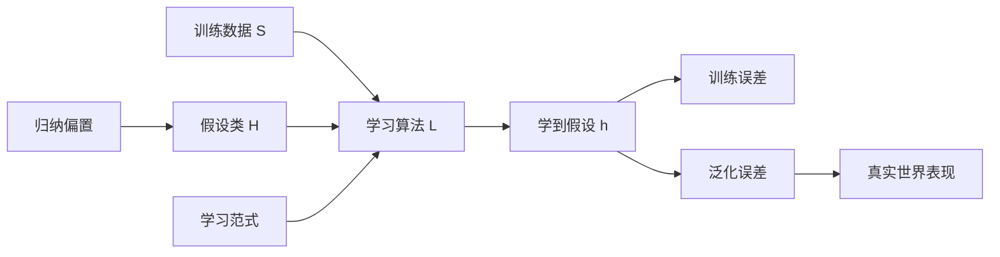

# 第二章：机器学习基础（一）零基础完整讲解

来源：`第二章-机器学习基础.pdf`，课程名称：深度学习导论，主讲教师：毛玉仁。

这份讲义按“先建立直觉，再解释概念，再讲公式，再回到深度学习”的顺序整理。PPT 一共 78 页，主线是：机器学习不是某一种模型，而是一套从经验数据中学出可泛化规律的方法论；经典统计学习理论试图用 PAC、VC 维、Rademacher 复杂度解释“为什么能泛化”；深度学习尤其大模型又突破了很多经典理论的简单假设，因此需要重新理解泛化。

## 0. 逐页覆盖清单

- 第 1 页：标题页，第二章“机器学习基础（一）”。
- 第 2-4 页：提出核心问题：什么是机器学习？大模型时代与传统机器学习有什么区别？机器学习研究“泛化”和“范式”。
- 第 5-7 页：机器学习是通用方法论；没有放之四海皆准的定义；Tom Mitchell 的 E/T/P 定义；Bill Gates 对机器学习突破价值的评价。
- 第 8 页：本章三部分：基本概念、经典泛化理论、深度学习泛化。
- 第 9-13 页：从人类学习类比机器学习：学习目的、学习要素、机器学习要素、机器学习过程、基于学习的语言模型。
- 第 14-23 页：训练数据、假设类、归纳偏置、学习范式、学习目标、损失函数、学习算法、泛化误差、训练/验证/测试集。
- 第 24-26 页：机器学习发展历程：统计学习时代、表征学习时代、大模型时代；假设空间从多样到神经网络主导；学习范式从单一到丰富再趋于统一。
- 第 27 页：进入第二部分：经典泛化理论。
- 第 28-36 页：PAC 理论和可学习性：数据分布、泛化误差、经验误差、概念、假设空间、可分性、PAC 辨识、PAC 可学习、高效 PAC、不可知 PAC。
- 第 37-41 页：轴平行矩形案例，证明一个简单概念类可以 PAC 学习，并给出样本复杂度。
- 第 42-56 页：复杂度：有限假设空间、无限假设空间、VC 维、线性分类器 VC 维、神经网络 VC 维、Rademacher 复杂度、线性超平面 Rademacher 上界。
- 第 57-62 页：泛化性：有限可分、有限不可分、VC 维泛化界、Rademacher 泛化界。
- 第 63-65 页：经验风险最小化 ERM，说明最小训练误差的假设在一定条件下接近最小泛化误差假设。
- 第 66-68 页：过拟合和欠拟合，模型容量与训练误差、泛化误差关系，奥卡姆剃刀原则。
- 第 69 页：进入第三部分：深度学习泛化。
- 第 70-72 页：深度神经网络泛化误差界：随机标签可拟合导致传统理论失效；双重下降；架构归纳偏置，CNN 与 Transformer 对比。
- 第 73-78 页：讨论问题：大模型时代 Loss 如何继续下降；OpenHospital 用 VC 还是 Rademacher 分析；传统机器学习理论是否还有用；机器学习未来与 CoT、RL、Context、Skill。

## 1. 机器学习到底是什么

PPT 一开始没有直接给定义，而是先问“什么是机器学习”。这是因为机器学习不是一个固定模型，也不是“神经网络”的同义词。机器学习是一套通用方法论，它与数据类型无关，也与模型类型无关：图像、文本、语音、表格、医疗数据都可以用机器学习；半空间、决策树、概率图、神经网络、大语言模型也都可以是机器学习模型。

本节给出的关键词是“泛化”和“范式”。泛化指模型不只是在训练样本上表现好，还能在没见过的新样本上表现好。范式指学习的基本方式，例如监督学习、无监督学习、强化学习、自监督学习等。

Tom Mitchell 的经典定义可以拆成三部分：

- 经验 E：模型从什么经历中学习，例如训练数据、交互反馈、历史样本。
- 任务 T：模型要做什么，例如分类、回归、生成文本、预测下一个词。
- 性能度量 P：怎样判断模型做得好，例如准确率、损失、错误率、奖励。

如果一个程序在任务 T 上，按照度量 P 来看，随着经验 E 增加而表现变好，就可以说它在学习。

零基础理解：如果你刷题越多，模拟考试错得越少，你就在“从经验中学习”。机器学习就是让程序也做类似的事情。

## 2. 从人类学习到机器学习

PPT 用“学习”的类比帮助理解机器学习。人类学习的目的，是在经验知识指导下求解未知问题。机器学习的目的，是基于已有训练数据学习规律，然后解决未知数据上的问题。

人类学习要素和机器学习要素可以一一对应：

| 人类学习 | 机器学习 | 解释 |
|---|---|---|
| 经验知识 | 训练数据 | 学过的题、看过的样本、历史记录 |
| 学习载体 | 假设类 | 能表达知识的载体，例如线性模型或神经网络 |
| 常识 | 归纳偏置 | 预先相信哪些规律更可能，例如图像局部相关、语言上下文相关 |
| 跟谁学/怎么学 | 学习范式 | 监督、无监督、强化、自监督等 |
| 学习方法 | 学习算法 | 梯度下降、0 阶优化、K-Means 等 |
| 模拟题少出错 | 学习目标 | 训练误差低、经验风险小、聚类距离小等 |

PPT 中机器学习过程的完整句子非常重要：在某种学习范式下，基于训练数据，利用学习算法，从受归纳偏置限制的假设类中选取出可以达到学习目标的假设，该假设可以泛化到未知数据上。

逐词解释：

- “某种学习范式”：先决定学习方式，是有标签、无标签、靠奖励，还是自己造标签。
- “训练数据”：机器学习的经验来源。
- “学习算法”：负责从数据中调整模型。
- “假设类”：允许模型在什么范围内找答案。
- “归纳偏置”：告诉模型优先找哪些更合理的规律。
- “学习目标”：优化什么，比如错误率、损失、距离、奖励。
- “泛化”：最终目的，不是背训练集，而是在新数据上也能用。

语言模型例子：给定词序列 `{我，为，什么，要，选，这，门，课}`，语言模型学习的是这个语言序列出现的概率。PPT 中示意为概率 0.66666。真实语言模型通常学习的是“给定前文，预测下一个词”的概率。

## 3. 训练数据

训练数据记为 S，是可以用于训练的数据。训练数据的数量和质量都会影响机器学习性能。对语言模型来说，训练数据可以来自公开语料。

数量：在一定范围内，训练数据越多，机器学习性能通常越好。原因是数据越多，模型越能见到真实世界中的不同情况，越不容易只记住少数样本。

质量：多样性、噪声等都会影响性能。多样性不足会导致模型只会处理一种情况；噪声太多会让模型学到错误规律。比如训练语言模型时，如果语料全是某一种文体，模型就很难泛化到其他文体；如果语料里有大量错误文本，模型也可能学坏。

## 4. 假设类和假设

假设类 Hypothesis Class，记为 H，是所有可能机器学习模型的集合，其中每个元素叫假设 h。实践中，通常把候选模型的参数空间当作假设类。

例子：

- 半空间：用一条线、一个平面或一个超平面把样本分开。二维里像一条直线分类器，高维里是超平面。
- 神经网络：由大量参数组成的复杂函数族。当前大语言模型主要选用神经网络作为假设空间。

零基础理解：假设类就是“允许答案长成什么样”。如果只允许直线，你就不可能学出复杂曲线；如果允许大型神经网络，表达能力就强很多，但也更容易复杂到难以分析。

## 5. 归纳偏置

归纳偏置 Inductive Bias 指模型或算法在选择假设时的偏好和限制。它不是坏事，而是机器学习能从有限数据中学习的必要条件。

为什么需要归纳偏置：训练数据永远有限，而能解释这些训练数据的函数可能无限多。如果没有任何偏好，算法无法判断哪个函数更可能在未来数据上有效。

PPT 中的例子：

- SVM 的归纳偏置：最大化训练样本到超平面的距离，两类分得尽量开。这对应“间隔越大，泛化可能越好”的偏好。
- CNN 的归纳偏置：局部感受野。图像中相邻像素关系更重要，边缘、纹理、局部形状很关键。
- RNN 的归纳偏置：时间序列。前后时间步存在依赖。
- Transformer 的归纳偏置：稀疏注意力或注意力结构。语言中不同位置之间有上下文关联。
- 语言模型常用归纳偏置：上下文之间存在关联。

## 6. 学习范式

广义学习范式包括监督学习、无监督学习、强化学习。大语言模型常用自监督学习，它本质上是基于自动构建标签的监督学习。

监督学习：给定样本和标签，完成分类或回归。比如给图片和类别标签，训练猫狗分类器；给房屋面积和价格，预测房价。

无监督学习：没有人工标签，让模型自己发现结构。比如聚类、降维、表示学习。

强化学习：从探索和反馈中学习。模型做动作，环境给奖励或惩罚，模型学会让长期奖励更高。

自监督学习：从数据自身构造标签。语言模型中，前文预测下一个词就是典型例子。标签不是人工标注的，而是文本中本来就存在的下一个 token。

## 7. 学习目标、损失函数、学习算法

不同学习范式有不同学习目标。

经验风险最小化 ERM 是最常见目标之一：最小化模型在训练集上的错误。PPT 举例：不带正则项的监督学习方法。

相对距离最小化是另一类目标，PPT 举例：无监督学习 K-Means。K-Means 的目标是让样本到所属簇中心的距离尽可能小。

损失函数 Loss Function 用来衡量模型在单个样本上的错误程度。训练集上损失的加权和叫训练损失 Training Loss。

很多损失函数是代理损失 Surrogate Loss。原因是我们真正关心的 0-1 损失常常不可导、不方便优化，所以用交叉熵、hinge loss、logistic loss 等可优化的损失替代。

PPT 中损失函数页包含两个核心公式：

- 0-1 损失思想：如果预测错，损失为 1；预测对，损失为 0。形式为 `L(h) = (1/n) sum I(sign(h(x_i)) != y_i)`。
- 交叉熵损失：用概率预测和真实标签之间的差异衡量错误。二分类常写为 `L(h) = -(1/n) sum [y_i log p_i + (1-y_i) log(1-p_i)]`。PPT 公式里没有显式负号，但交叉熵作为损失通常取负对数似然；核心含义是预测真实类别概率越低，损失越大。

学习算法负责优化损失，背后的理论基础是最优化理论。

- 1 阶优化：使用梯度信息，例如梯度下降。PPT 公式为 `h_{t+1} = h_t - eta grad_h L(h)`。
- 0 阶优化：不用真实梯度，使用函数值估计搜索方向。PPT 展示了近似梯度形式，核心是通过比较 `L(h + alpha d)` 和 `L(h)` 来估计往哪个方向走。

## 8. 泛化误差、训练误差、验证集、测试集

机器学习的目的不是只减小训练误差，而是减小泛化误差 Generalization Error，也叫真实误差 True Error。PPT 里写成 Ture Error，应理解为 True Error。

训练误差：模型在训练集上的错误比例。PPT 公式表达为：

`L_S(h) = |{i in [m] : h(x_i) != y_i}| / m`

泛化误差：模型在真实数据分布上的错误概率：

`L_D(h) = P_{(x,y)~D}[h(x) != y]`

关键区别：训练误差可以直接算，因为训练集在手里；泛化误差不能直接算，因为真实分布 D 不完全可见。

实践中用三类数据：

- 训练集：用于训练模型。
- 验证集：与训练集独立同分布，用于估计泛化能力、选择超参数、选择模型。
- 测试集：与训练集和验证集独立同分布，用于最终性能评测，在实际中近似真实场景。

重要纪律：测试集不能反复参与调参，否则它会被“偷看”，最终测试表现就不再可信。

## 9. 机器学习发展历程

PPT 将机器学习发展分为三阶段：

统计学习时代：假设空间百家争鸣，例如半空间、树、森林、概率图、神经网络等。学习范式主要是传统监督、无监督、强化学习。

表征学习时代：神经网络逐渐突出，学习范式变得丰富，例如多标签学习、多任务学习、多视图学习、领域自适应、领域泛化、对比学习、噪声标签、PU 学习、小样本学习、主动学习、半监督学习、开放集检测等。

大模型时代：神经网络几乎一枝独秀，学习范式又趋于统一，典型流程包括自监督预训练、有监督预微调、新型强化学习等。

理解这三阶段：早期大家研究“用什么模型”；后来研究“如何学到好的表示”；现在大模型时代大量任务通过统一的大规模预训练和微调方式解决。

## 10. PAC 理论：可学习性的基本语言

PAC 是 Probably Approximately Correct，概率近似正确。它给出一个抽象框架，用来回答：在什么条件下，一个学习任务可以被学会？需要多少样本？算法是否高效？

PAC 的关键词：

- Probably：以较大概率成功，即至少 `1 - delta`。
- Approximately：误差不一定为 0，但不超过 `epsilon`。
- Correct：学到的模型接近正确概念。

数据与分布：

- 给定数据集 `D = {(x_i, y_i)}_{i=1}^m`。
- `x_i in X`，二分类默认 `y_i in Y = {-1, +1}`。
- 独立同分布假设：样本独立地从未知分布 `D` 中采样，记为 `D ~ D^m`。

泛化误差：

`E(h) = E(h; D) = P_{x~D}[h(x) != y] = E_{x~D} I[h(x) != y]`

这里 `I(.)` 是指示函数，事件成立为 1，不成立为 0。学习的终极目标是最小化泛化误差。

经验误差：

`\hat E(h; D) = (1/m) sum_{i=1}^m I[h(x_i) != y_i]`

由于训练集从真实分布采样，对固定 h，有 `E_D[\hat E(h)] = E(h)`。意思是：如果反复抽很多训练集，经验误差的平均值等于真实泛化误差。但注意，这只对固定 h 成立；学习算法根据训练集选择 h 时，问题会更复杂。

一致性：如果 `\hat E(h)=0`，称 h 与训练集 D 一致；否则不一致。

## 11. 概念、假设空间、可分性

概念 Concept：从特征空间 X 到标记空间 Y 的映射，决定 x 的真实标记 y，通常记为 c。

目标概念：如果对任何数据点 `(x,y)` 都有 `c(x)=y`，则 c 是目标概念，也就是算法真正想学到的规律。

概念类 Concept Class：一些概念组成的集合，记为 C。PPT 举例“三角形概念”：把任意三角形映射为 1，其他图形映射为 0。

假设空间 Hypothesis Space：学习算法 L 考虑的所有可能概念构成的集合，记为 H。例如线性回归可考虑 `H = {h(x)=w^T x}`。

假设 Hypothesis：任何 `h in H` 都叫假设，因为它可能是目标概念，也可能不是。

可分性：

- 如果目标概念 `c in H`，说明假设空间中存在一个假设能完全正确描述目标规律，学习问题对 H 可分。
- 如果 `c notin H`，说明无论怎么学，H 中都没有完全正确的假设，问题不可分。

零基础例子：真实规律是二次曲线，但你只允许模型用直线，那么目标概念不在假设空间里，问题不可分。

## 12. PAC 辨识、PAC 可学习、高效 PAC、不可知 PAC

学习目标：给定数据集 D，希望算法 L 学到的假设 h 尽可能接近目标概念 c。

现实挑战：

- 训练集有限，所以很多假设在训练集上等效，算法无法区分。
- 抽样有随机性，相同大小的不同训练集可能让算法输出不同假设。

PAC 基本思想：希望以较大概率学到泛化误差满足预设上限的模型。

PAC 辨识：给定误差参数 `epsilon` 和置信参数 `delta`。如果对所有 `c in C` 和所有分布 D，存在学习算法 L，输出 `h in H` 满足：

`P(E(h) <= epsilon) >= 1 - delta`

则称算法 L 能从 H 中辨识概念类 C。因为目标概念 `E(c)=0`，这等价于大概率学到目标概念的 epsilon 近似。

PAC 可学习：令 m 为样本数。如果存在学习算法 L 和多项式函数 `poly(1/epsilon, 1/delta, size(x), size(c))`，使得当

`m >= poly(1/epsilon, 1/delta, size(x), size(c))`

时，L 能辨识 C，则称 C 对 H 是 PAC 可学习的。满足条件的最小 m 叫样本复杂度。

高效 PAC 可学习：如果算法运行时间也是上述量的多项式函数，则称高效 PAC 可学习，L 叫 PAC 学习算法。若处理每个样本时间是常数，时间复杂度可近似等价于样本复杂度。

不可知 PAC 可学习：当 `c notin H` 时，不能要求学到目标概念，只能要求学得的 h 接近 H 中最好的假设：

`P(E(h) - min_{h' in H} E(h') <= epsilon) >= 1 - delta`

这叫不可知 PAC。它更符合现实，因为真实世界的规律往往不完全在我们设定的模型类里。

## 13. 轴平行矩形案例

PPT 用二维平面中的轴平行矩形解释 PAC 可学习。

设 `X = R^2`，每个点是一个样本。目标概念 c 是某个轴平行矩形 R：矩形内点标记为 1，矩形外点标记为 -1。概念类 C 是平面上所有轴平行矩形。

学习算法 L：给定训练集 D，输出包含所有正例的最小轴平行矩形 `R_D`。

直觉：`R_D` 由训练集中正例的最左、最右、最上、最下边界确定。因为所有正例都来自真实矩形 R 内，所以 `R_D` 不会跑到 R 外面，不会把 R 外面的点误判为正例。它可能犯的错是把真实矩形 R 内、但不在 `R_D` 内的点误判为负例。

证明思想：

- 假设真实矩形 R 的概率质量 `P(R) > epsilon`。
- 沿 R 的四条边定义四个窄区域 `r_1, r_2, r_3, r_4`，每个区域概率质量为 `epsilon/4`。
- 如果训练样本在四个边缘区域都至少命中一次，则 `R_D` 会足够贴近 R，漏掉区域概率不超过 epsilon。
- 如果 `E(R_D) > epsilon`，说明至少有一个边缘区域没有被样本命中。

概率上界：

`P(E(R_D) > epsilon) <= 4(1 - epsilon/4)^m <= 4 exp(-m epsilon / 4)`

因此只要：

`m >= (4/epsilon) ln(4/delta)`

就有：

`P(E(R_D) <= epsilon) >= 1 - delta`

这说明轴平行矩形这个概念类是 PAC 可学习的，而且样本数随 `1/epsilon` 和 `ln(1/delta)` 增长。

## 14. 假设空间复杂度

根据 PAC 理论，假设空间 H 越复杂，找到目标概念的难度通常越大。因此需要刻画 H 的复杂度。

有限假设空间：复杂度可以直接看假设数量 `|H|`。

无限假设空间：不能数个数，需要别的复杂度度量。

PPT 给出两种：

- VC 维：由 Vapnik 和 Chervonenkis 命名。优点是计算相对简单；缺点是与具体数据分布无关，刻画较粗糙。
- Rademacher 复杂度：结合具体数据集特点，刻画更准确；缺点是更难计算。

## 15. VC 维

考虑二分类假设空间 H。

限制 Restriction：H 在数据集 D 上的限制，是所有假设 h 在 D 上可能产生的标记结果集合：

`H|D = {(h(x_1), h(x_2), ..., h(x_m)) | h in H}`

虽然 H 可能无限，但在 m 个二分类样本上，最多只有 `2^m` 种标记方式。

增长函数：

`Pi_H(m) = max_{|D|=m} |H|D|`

它表示 H 对 m 个数据点最多能实现多少种标记结果。

打散 Shatter：如果 H 能实现 D 上所有可能标记，即 `|H|D| = 2^m`，则称 D 被 H 打散。此时 `Pi_H(m)=2^m`。

VC 维：

`VC(H) = max {m : Pi_H(m) = 2^m}`

也就是 H 能打散的最大样本集大小。

重要性质：

- VC 维与数据分布无关。
- `VC(H)=k` 表示存在大小为 k 的样本集能被 H 打散，并且任意大小为 `k+1` 的样本集都不能被 H 打散。
- 有限假设空间也可用 VC 维衡量，并且 `VC(H) <= log_2 |H|`。

## 16. 线性分类器的 VC 维

二分类线性超平面：

`h(x) = sign(w^T x + b)`

当 `b=0` 时，是齐次线性超平面，其 VC 维为 d。

为什么至少能打散 d 个点：在 `R^d` 中取 d 个单位向量 `e_1, ..., e_d`。任意想要的标记 `y_1, ..., y_d`，令 `w_y=(y_1,...,y_d)`，就有 `w_y^T e_i = y_i`，所以能实现任意标记。

为什么不能打散 d+1 个点：`R^d` 中任意 d+1 个向量线性相关，存在不全为 0 的系数使它们线性组合为 0。把正系数集合记为 I，负系数集合记为 J，可推出若假设能把 I 标为正、J 标为负，会得到 `0 < ... < 0` 的矛盾，因此不能打散。

一般线性超平面因为有偏置 b，VC 维为 `d+1`。

神经网络的 VC 维：若 N 是网络参数量，其 VC 维上界为 `O(N log N)`。这说明参数越多，假设空间表达能力越强，经典理论中的复杂度上界也越大。

## 17. Rademacher 复杂度

PPT 从经验误差推导 Rademacher 复杂度的直觉。

二分类经验误差：

`\hat E(h) = (1/m) sum I[h(x_i) != y_i]`

如果 `y_i, h(x_i) in {-1,+1}`，则：

`\hat E(h) = 1/2 - (1/(2m)) sum y_i h(x_i)`

其中 `(1/m) sum y_i h(x_i)` 表示预测和标签的一致性，最大值为 1。

最小化经验误差等价于最大化一致性：

`argmax_{h in H} (1/m) sum y_i h(x_i)`

现在考虑真实标签可能被随机噪声影响，引入 Rademacher 随机变量 `sigma_i`，它以 0.5 概率取 -1，以 0.5 概率取 +1。把真实标签换成随机噪声后，考察：

`E_sigma sup_{h in H} (1/m) sum sigma_i h(x_i)`

直觉：如果一个假设空间连随机标签都能拟合得很好，说明它非常复杂，泛化上界会很差。

经验 Rademacher 复杂度：对实值函数空间 `F: X -> R`，关于数据集 D 的复杂度为：

`\hat R_D(F) = E_sigma sup_{f in F} (1/m) sum sigma_i f(x_i)`

期望 Rademacher 复杂度：

`R_m(F) = E_{D~D^m} \hat R_D(F)`

线性超平面例子：若数据满足 `||x|| <= r`，函数族 `F = {x -> w^T x : ||w|| <= Lambda}`，则：

`\hat R_D(F) <= sqrt(r^2 Lambda^2 / m)`

这反映 Rademacher 复杂度与数据范围 r、权重范围 Lambda、样本数 m 有关。样本越多，复杂度上界越小。

## 18. 泛化性：有限可分假设空间

有限可分假设空间条件：目标概念 `c in H`，且 `|H|` 有上界。

核心思想：任何在训练集 D 上犯错的假设都不可能是目标概念，应该被剔除。

主要结论：当样本数满足：

`m >= (1/epsilon) ln(|H|/delta)`

只要学习算法输出经验误差为 0 的假设 `h in H`，就可满足：

`P(E(h) <= epsilon) >= 1 - delta`

直觉：假设空间越大，需要更多样本排除坏假设；数据集越大，泛化上界越小，收敛速率约为 `O(1/m)`。

证明核心：若某个 h 的泛化误差大于 epsilon，但它在训练集上一个错都没有，那么 m 个样本都避开它会犯错的区域，概率不超过 `(1-epsilon)^m`。再对所有 `|H|` 个假设做并合上界，得到 `|H| e^{-epsilon m}`。

## 19. 泛化性：有限不可分假设空间

有限不可分条件：`|H|` 有上界，但目标概念 `c notin H`。

此时不能保证 `E(h) <= epsilon`，因为 H 中可能没有完美假设。我们能做的是保证经验误差和泛化误差接近：

`P(|E(h) - \hat E(h)| <= sqrt((1/(2m)) ln(2|H|/delta)), for all h in H) >= 1 - delta`

与可分情形相比，收敛速率从 `O(1/m)` 降到 `O(1/sqrt(m))`，需要更多数据才能可靠估计泛化误差。

证明工具是 Hoeffding 不等式：

`P(|E(h) - \hat E(h)| > epsilon) <= 2 exp(-2m epsilon^2)`

再对 H 中所有假设做并合上界，解出 epsilon。

## 20. 泛化性：VC 维和 Rademacher 界

无限假设空间不能直接用 `|H|`，所以用 VC 维或 Rademacher 复杂度。

VC 维泛化界：若 H 的 VC 维为 k，样本数 `m > k`，则以至少 `1-delta` 的概率，对所有 `h in H`：

`|E(h) - \hat E(h)| <= sqrt((8k ln(2em/k) + 8 ln(4/delta)) / m)`

收敛速率约为：

`O(sqrt(ln(m/k) / (m/k)))`

这比有限不可分假设空间的 `O(1/sqrt(m))` 更慢，因为还受 VC 维 k 影响。

Rademacher 泛化界：对实值函数空间 `F: X -> [0,1]`，大小为 m 的数据集 D，任意 `f in F` 以至少 `1-delta` 的概率有：

`E[f(h)] <= (1/m) sum f(h(x_i)) + 2 R_m(F) + sqrt(ln(1/delta)/(2m))`

经验版本：

`E[f(h)] <= (1/m) sum f(h(x_i)) + 2 \hat R_D(F) + 3 sqrt(ln(2/delta)/(2m))`

PPT 标注 Rademacher 界“优于 VC 维”，原因是它依赖具体数据和函数空间，而不是只给一个粗糙的分布无关上界。以线性超平面为例，`\hat R_D(F) <= sqrt(r^2 Lambda^2 / m)`，因此速率约为 `O(1/sqrt(m))`。

## 21. 经验风险最小化 ERM

ERM 的作用：提供一种统一范式，让我们通过最小化训练集上的经验误差，找到具有理想泛化误差的假设。

学习算法输出经验误差最小的假设：

`h* in argmin_{h in H} \hat E(h)`

令 g 表示 H 中泛化误差最小的假设：

`g in argmin_{h in H} E(h)`

如果 Hoeffding 不等式保证 g 的经验误差接近泛化误差，并且 VC 维相关泛化界保证 `h*` 的经验误差接近泛化误差，那么以至少 `1-delta` 的概率：

`E(h*) - E(g) <= epsilon`

结论：ERM 找到的假设 h* 大概率是 H 中最小泛化误差假设 g 的 epsilon 近似。

零基础理解：我们真正想选的是测试世界里最好的模型 g，但看不到真实世界全部数据，所以退而求其次选训练集上表现最好的 h*。泛化界告诉我们，只要样本足够多、假设空间复杂度可控，h* 不会比 g 差太多。

## 22. 过拟合、欠拟合、容量

好的学习算法应同时做到两点：

- 降低训练误差。
- 缩小训练误差和泛化误差的差距。

欠拟合 Underfitting：模型容量太小，训练集上误差也很高。例如用直线拟合明显弯曲的数据。

过拟合 Overfitting：训练误差很小，但泛化误差很大。模型记住了训练样本噪声，没学到稳定规律。

容量 Capacity：模型表达能力。PPT 用一维回归说明，在 `f(x)=wx+b` 基础上引入高阶特征：

`f(x) = b + sum_{i=1}^k w_i x^i`

k 越大，模型越灵活，容量越大。

第 67 页三图：

- Underfitting：曲线太简单，连训练点都拟合不好。
- Appropriate capacity：容量合适，既解释数据又不过度扭曲。
- Overfitting：曲线为了穿过训练点变得非常复杂，可能对新点表现差。

奥卡姆剃刀原则：在同样能够解释已知观测现象的假设中，应该挑选最简单的那个。

第 68 页容量与误差关系：

- 随容量增加，训练误差通常下降。
- 泛化误差先下降，达到最佳容量附近，再上升。
- 欠拟合区域：容量太小，训练和泛化误差都较高。
- 过拟合区域：容量太大，训练误差低，但泛化误差上升。
- Generalization gap：训练误差与泛化误差之间的差距。

## 23. 深度神经网络为何挑战经典泛化理论

第 70 页引用 Zhang et al. 2017：当用完全随机生成的标签替换 CIFAR-10 或 ImageNet 的真实标签时，Inception、AlexNet 等模型仍然能通过 SGD 达到接近 0% 的训练误差。

这非常震撼：如果一个假设空间能打散随机标签，它的 Rademacher 复杂度会接近 1，泛化误差上界会变得没有意义。PPT 直接写出“传统理论失效”。

这里的“失效”不是说传统理论完全错误，而是说传统上界太松，不能解释深度网络为什么在真实标签上仍然泛化得很好。深度网络确实有巨大容量，甚至能记住随机标签；但在真实任务上，它又不只是记忆，仍能泛化。

第 71 页讲双重下降 Double Descent：随着模型复杂度增加，测试误差先下降、再上升，进入过参数化区域后再次下降。

传统 U 型曲线只描述欠参数区域：容量太小欠拟合，容量适中最好，容量太大过拟合。但现代深度学习中，当模型大到能完美拟合训练集后，继续增大模型，测试误差可能再次下降。PPT 将其解释为：深度神经网络在函数空间中表现出内在的“奥卡姆剃刀”效应，即使参数很多，网络也倾向于表达较简单的函数。

## 24. 架构归纳偏置：CNN 与 Transformer

第 72 页指出，模型不产生严重过拟合，还因为架构内置了强归纳偏置，这些偏置在巨大参数空间中划定了合理搜索范围。

CNN 的归纳偏置：

- 基于图像的空间平稳性和局部相关性。
- 平移不变性 Translation Invariance：同一个局部模式出现在不同位置，仍应被识别。
- 局部感受野 Local Receptive Fields：模型优先关注纹理、边缘、形状等局部结构。
- 相比全连接网络，CNN 大幅缩小假设空间。

Transformer 的归纳偏置：

- 几乎没有硬编码的空间偏置。
- 依赖自注意力 Self-Attention 学习任意长程依赖。
- 小规模数据上可能更容易过拟合，因为先验约束弱。
- 超大规模数据下，较弱归纳偏置反而释放了模型捕获复杂模式的潜力。

直觉对比：

- CNN：更像“我提前知道图像局部结构很重要，所以模型别乱学”。
- Transformer：更像“我少给规则，让模型从海量数据中自己学关系”。

## 25. 讨论页的学习提示

第 73 页：大模型时代，Loss 如何继续下降？

可以从多个角度回答：

- 数据规模继续扩大，覆盖更多模式。
- 模型规模扩大，表达能力增强。
- 训练目标改进，例如更好的自监督目标、多任务目标、对齐目标。
- 优化算法和训练技巧改进，例如学习率调度、归一化、残差连接、混合精度、并行训练。
- 上下文长度增加，让模型利用更多条件信息。
- CoT 让模型在推理时展开中间步骤。
- RL 或偏好优化让模型更符合人类目标。
- 工具使用和 Skill 让模型不只靠参数记忆，而能调用外部能力。

第 74-75 页：OpenHospital 用 VC 维分析合适还是 Rademacher 合适？

如果 OpenHospital 指一个具体环境、具体数据分布、具体任务中的模型，Rademacher 通常更合适，因为它能结合数据集本身特征，刻画更精细。VC 维更适合做粗粒度、分布无关、理论入门式分析。如果只是问某个模型类最坏情况下的容量，VC 维有用；如果关心具体 OpenHospital 数据上的泛化，更应考虑 Rademacher 或其他数据依赖复杂度。

第 76 页：传统机器学习理论还有用吗？

有用，但不能机械套用。它仍然提供核心概念：训练误差、泛化误差、复杂度、样本复杂度、过拟合、归纳偏置、ERM。它的不足是很多经典上界无法解释大模型的实际泛化表现。因此现代深度学习需要在传统理论基础上继续发展新解释。

第 77 页：VC 维和 Rademacher 对大语言模型的启发意义。

VC 维提醒我们：参数越多，表达能力越强，但过拟合风险也可能变大。Rademacher 提醒我们：能拟合随机标签的能力很强时，简单泛化界会失去解释力；需要看数据分布、训练算法、架构偏置、优化过程和对齐方法如何共同约束模型。

第 78 页：机器学习未来在哪？PPT 给出 CoT、RL、Context、Skill 四个词。

- CoT：让模型显式组织推理步骤。
- RL：通过反馈优化长期行为或人类偏好。
- Context：通过更长、更有效的上下文提供外部信息。
- Skill：让模型具备可调用、可组合、可迁移的能力。

## 26. 本章公式速查

| 名称 | 公式 | 含义 |
|---|---|---|
| 泛化误差 | `E(h)=P[h(x)!=y]` | 真实分布上的错误概率 |
| 经验误差 | `\hat E(h)=(1/m) sum I[h(x_i)!=y_i]` | 训练集上的错误率 |
| 一致性 | `\hat E(h)=0` | 训练集上没有错误 |
| PAC 辨识 | `P(E(h)<=epsilon)>=1-delta` | 大概率学到小误差模型 |
| PAC 可学习 | `m >= poly(1/epsilon,1/delta,size(x),size(c))` | 样本数足够时可学习 |
| 不可知 PAC | `P(E(h)-min E(h')<=epsilon)>=1-delta` | 学到接近 H 中最好的模型 |
| 轴平行矩形样本复杂度 | `m >= (4/epsilon) ln(4/delta)` | 保证矩形学习误差小 |
| VC 维 | `VC(H)=max{m: Pi_H(m)=2^m}` | 能打散的最大样本数 |
| 有限可分界 | `m >= (1/epsilon) ln(|H|/delta)` | 可分有限 H 的样本需求 |
| 有限不可分界 | `sqrt((1/(2m))ln(2|H|/delta))` | 经验误差和泛化误差差距 |
| VC 泛化界 | `sqrt((8k ln(2em/k)+8ln(4/delta))/m)` | 无限 H 中受 VC 维影响的界 |
| Rademacher 复杂度 | `E_sigma sup_f (1/m)sum sigma_i f(x_i)` | 拟合随机噪声的能力 |
| 线性 Rademacher 上界 | `sqrt(r^2 Lambda^2/m)` | 数据半径和权重半径控制复杂度 |
| ERM | `h* in argmin \hat E(h)` | 选训练误差最小假设 |
| 多项式回归容量 | `f(x)=b+sum_{i=1}^k w_i x^i` | k 越大容量越高 |

## 27. 你应该怎么学这一章

第一遍只抓主线：机器学习的目标是泛化，不是背训练集；训练数据、假设类、归纳偏置、学习算法、学习范式共同决定学到什么；经典理论用复杂度解释泛化；深度学习让这些解释变得不够充分。

第二遍重点理解术语：训练误差、泛化误差、验证集、测试集、假设类、归纳偏置、PAC、VC 维、Rademacher、ERM、过拟合、欠拟合。

第三遍看公式：先不要硬背推导，先知道每个公式在回答什么问题。比如 `P(E(h)<=epsilon)>=1-delta` 回答“多大概率学得足够好”；VC 界回答“假设空间复杂度和样本数如何影响泛化”；Rademacher 回答“模型拟合随机噪声的能力有多强”。

最后联系深度学习：大模型参数非常多，按经典复杂度看似应该严重过拟合，但实际并不总是如此，原因包括数据规模、优化算法、架构归纳偏置、隐式正则化、双重下降、上下文和技能化能力等。这正是本章最后一部分想让你思考的地方。

