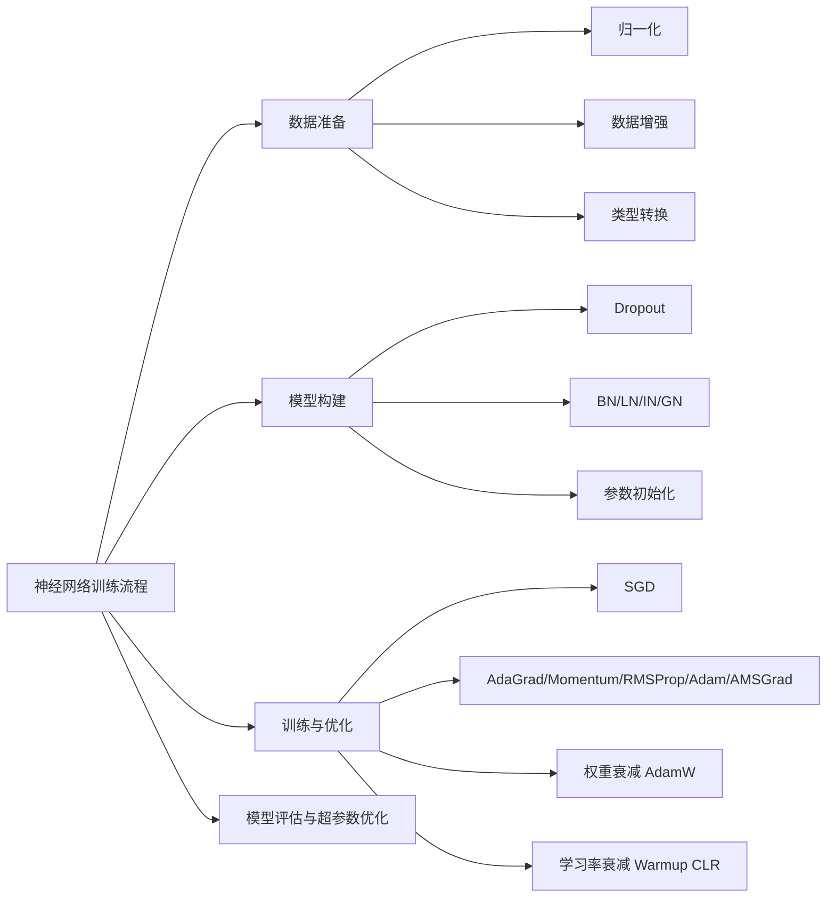

# 第五章：神经网络基础（二）零基础完整讲解

来源：`第五章-神经网络基础.pptx`。课程名称：深度学习导论。主讲教师：王文冠。PPT 共 95 页。

这一讲接在第四章“神经网络基础（一）”之后。第四章重点讲“神经网络是什么、损失函数是什么、梯度下降和反向传播怎么工作”；第五章重点讲“真正训练一个深度神经网络时，还需要哪些工程和数学技巧”。可以把本章理解成神经网络训练的实战基础：数据要怎么处理，模型内部要加哪些层，参数要怎么初始化，优化器和学习率要怎么选。



## 0. 逐页覆盖清单

这一部分先保证 PPT 的所有页面都被覆盖。后面的章节会把这些页面合并成连贯讲解。

- 第 1 页：标题页，第五章“神经网络基础（二）”，课程为深度学习导论，主讲教师王文冠。
- 第 2 页：神经网络模型训练基本流程：数据准备、模型构建、训练与优化、模型评估与超参数优化；数据准备包括归一化、数据增强、类型转换等；引用 Keras MNIST ConvNet 示例。
- 第 3 页：模型构建包括输入层、隐藏层、Dropout 层、批归一化、层归一化、输出层和初始化。
- 第 4 页：训练与优化包括损失函数、正则化项、优化器；优化器列出 SGD、Momentum、AdaGrad、RMSProp、Adam。
- 第 5 页：基本流程继续强调训练与优化、模型评估，以及 Keras 示例。
- 第 6 页：课程思路：深度神经网络训练的基本流程包括数据准备、模型架构、训练方法。
- 第 7 页：课程思路重复页，继续聚焦数据准备、模型架构、训练方法。
- 第 8 页：数据准备之归一化。定义归一化；用是否捐款预测例子说明年龄和工资尺度不同会造成梯度下降 zigzag；给出逻辑回归目标和单样本梯度。
- 第 9 页：常用归一化方法：标准化 Standardization 和 Min-Max 归一化；标准化使用均值和标准差，Min-Max 把特征映射到 `[0,1]`，且对异常值敏感。
- 第 10 页：归一化前后对比；同一逻辑回归问题中，归一化后梯度下降路径更直接，震荡更少。
- 第 11 页：数据增强定义；图像变换方法表：翻转、旋转、缩放、噪声注入、颜色空间、对比度、锐化、平移、裁剪；目标是增强训练数据多样性。
- 第 12 页：图像擦除：从训练图像中抹去一部分信息，迫使模型关注其他相关部分，而不是只盯住最有判别力的局部区域。
- 第 13 页：图像混合：混合多个图像样本，模拟多目标或多标签场景；包括把一张图的一部分贴到另一张图上、按比例像素融合、多种增强操作的加权组合、通过频率空间操作生成形状光滑自然的掩码。
- 第 14 页：文本数据增强：回译法。
- 第 15 页：文本数据增强继续：随机词替换；例子包括同义词替换、随机插入、随机交换、随机删除。
- 第 16 页：类型转换。神经网络通常要求输入特征为连续数值型；数值型数据连续有序，如图像像素值；类别型数据离散无序。
- 第 17 页：类别型数据需要二值化；示例为 1st Category、2nd Category、3rd Category。
- 第 18 页：文本数据原始形式是字符串；自然语言处理中的分词 Tokenization 把连续文本切成更小语义单位；例子 `"John likes to watch movies."` 变成词序列。
- 第 19 页：文本处理中的停止词移除：删除频率高但语义少的词，如英文 `the/a/is/at/to`，中文“的/了/在”。
- 第 20 页：文本处理中的词干提取：`running`、`runs`、`ran` 归并为 `run`。
- 第 21 页：词典和词袋模型 Bag-of-Words：建立词典 `{John, likes, to, watch, movies, Mary, too}`，记录文本中单词出现的频率或加权频率。
- 第 22 页：词袋模型缺点：丢失语序，`I love you` 和 `You love me` 的 BoW 向量可能完全一样。
- 第 23 页：嵌入 Embedding：将每个词映射成向量，再整合成矩阵；以独热编码为例，并提出长短不一的文本如何处理。
- 第 24 页：变长文本处理：填充 Padding、截断 Truncation、池化 Pooling、RNN/Transformer 通过 Masking 忽略填充位。
- 第 25 页：BPE Byte Pair Encoding 是目前主流子词分词法，介于按单词分和按字母分之间；核心逻辑是不断合并出现频率最高的相邻字符对。
- 第 26 页：BPE 算例：语料库包括 `hug/pug/pun/bun`；先拆成基础字符，再统计相邻字符对频率，合并 `un`、`ug` 等；优点是解决 OOV、词表大小可控、高效语义压缩；还提到 WordPiece 和 SentencePiece。
- 第 27 页：课程思路页，进入模型架构部分。
- 第 28 页：Dropout 定义：训练时随机丢弃神经元及连接，缓解过拟合，防止神经元产生过强共适应；解释 Co-adaptation。
- 第 29 页：Dropout 示意图和数学形式；若第 `ell` 层使用 Dropout，则掩码 `r_j^ell ~ Bernoulli(p)`，输出与掩码逐元素相乘。
- 第 30 页：Dropout 训练阶段作用：降低拟合训练集的模型容量，破坏神经元间关联性，近似训练大量不同子网络。
- 第 31 页：Dropout 测试阶段：对 Dropout 层输出进行缩放；提出“为何缩放”。
- 第 32 页：Dropout 算例：`p=0.5`，一个隐藏层后接 Dropout；训练时部分神经元输出变 0，测试时整体缩放，使输出范围与训练时对齐。
- 第 33 页：引用 Srivastava 等人的 Dropout 论文：`Dropout: A Simple Way to Prevent Neural Networks from Overfitting`，JMLR 2014。
- 第 34 页：批归一化 Batch Normalization。引入内部协变量偏移 ICS；多层感知机第 `ell` 层梯度中，前层参数变化会改变后层输入分布。
- 第 35 页：ICS 问题继续：后层需要不断适应新的输入分布，会使训练变慢，并可能出现梯度爆炸、梯度消失和不稳定。
- 第 36 页：回顾数据标准化公式，并提出如何推广到神经网络层输出。
- 第 37 页：朴素批归一化：对 mini-batch 中某层输入计算均值和方差后标准化；问题是可能削弱非线性激活函数带来的表达能力。
- 第 38 页：可学习批归一化：加入缩放参数 `gamma` 和偏移参数 `beta`，输出 `y_i = gamma * xhat_i + beta`。
- 第 39 页：质疑“BN 是否主要通过缓解 ICS 起作用”；实验表明加入随机噪声使 ICS 更严重，但使用 BN 的网络仍优于不用 BN 的普通网络；引用 `How Does Batch Normalization Help Optimization? (No, It Is Not About Internal Covariate Shift)`。
- 第 40 页：继续强调 BN 和 ICS 的关系并不是很大。
- 第 41 页：BN 的另一种解释：BN 使损失函数和梯度更满足 Lipschitz 连续，损失曲面更平滑，优化更容易。
- 第 42 页：BN 反向传播：需要计算关于输入、`gamma`、`beta` 的梯度；指出均值和方差本身也依赖输入，不能只看直接路径。
- 第 43 页：多元链式法则：若 `z=f(u,v)` 且 `u,v` 都依赖 `x`，则对 `x` 求导要分路径求导再求和。
- 第 44 页：BN 对输入 `x_i` 求导有三条路径：`x_i -> xhat_i -> loss`、`x_i -> mu_m -> loss`、`x_i -> sigma_m^2 -> loss`。
- 第 45 页：BN 反向传播中 `dL/dxhat_i = dL/dy_i * gamma`，并给出 `dL/dsigma_m^2` 的求法。
- 第 46 页：BN 反向传播中 `dL/dmu_m` 的求法。
- 第 47 页：BN 对 `gamma` 和 `beta` 的梯度：`dL/dgamma` 是上游梯度与标准化输入的乘积求和，`dL/dbeta` 是上游梯度求和。
- 第 48 页：BN 测试阶段使用训练阶段估计的均值和方差信息；均值用训练批次均值的滑动平均，方差用训练批次方差的修正平均。
- 第 49 页：BN 测试阶段可等价折叠成一次仿射变换；提出如果 batch size 太小会怎样。
- 第 50 页：层归一化 Layer Normalization：对某层不同神经元输入进行归一化，适用于任意批大小。
- 第 51 页：实例归一化 Instance Normalization：对每个样本、每个通道的 `H x W` 个值归一化；输入张量形状为 `N x C x H x W`。
- 第 52 页：IN 多用于图像风格迁移，有助于消除内容图原风格；BN 会进一步混淆不同数据，LN 会进一步混淆不同通道。
- 第 53 页：组归一化 Group Normalization：把通道等分为 `G` 组，对每个样本在组内归一化；引用 Wu and He 2018。
- 第 54 页：归一化方法对比。在 ImageNet 上，固定 batch size 为 32 时比较 BN/LN/IN/GN；不同 batch size 下 BN 小批量性能变差，而 GN 更稳定。
- 第 55 页：初始化重要性：好的参数初始化对优化算法收敛关键，尤其面对神经网络非凸目标函数；不同初始化可能导致不同局部最优。
- 第 56 页：初始化可视化：全 0 初始化与合适初始化、网络结构对比；引用 deeplearning.ai 初始化说明。
- 第 57 页：为什么不能全 0 初始化：同一层神经元参数相同会导致前向传播和反向梯度相同，等价于该层只有一个神经元，即对称权重问题。
- 第 58 页：过大初始化导致梯度爆炸，过小初始化导致梯度消失；回顾多层感知机第 `ell` 层梯度。
- 第 59 页：小随机数初始化：可以从 `[-r,r]` 均匀采样，或从均值 0、方差 `sigma^2` 的高斯分布采样；50 层、每层 256 神经元、`sigma=0.01` 时激活值随层数增加趋向于 0。
- 第 60 页：小随机数初始化的方差传播：无偏置线性层 `z^ell=W^ell x^{ell-1}`，在独立同分布假设下 `Var(z_i^ell)=n_{ell-1} sigma_W^2 sigma_x^2`。
- 第 61 页：若 `n_{ell-1} sigma_W^2 < 1`，则方差按层衰减，深层后激活容易趋近 0。
- 第 62 页：对 `tanh` 激活，0 附近 `tanh(z)≈z`，因此可用线性层方差传播近似分析。
- 第 63 页：对 ReLU 激活，`ReLU(z)=max(0,z)`，大约只有一半信号通过，因此方差近似乘 `1/2`；提出能否改进。
- 第 64 页：Xavier 初始化：适合 `tanh` 等对称或近线性激活；同时考虑前向和反向方差控制；得到 `sigma_W^2=2/(n_ell+n_{ell-1})`，均匀分布半径 `r=sqrt(6/(n_ell+n_{ell-1}))`。
- 第 65 页：He 初始化：适合 ReLU；前向方差控制给出 `sigma_W^2=2/n_{ell-1}`，均匀分布半径 `r=sqrt(6/n_{ell-1})`。
- 第 66 页：基于方差控制的初始化方法对比；合理控制方差后，即使层数增加，激活值仍远大于 0。
- 第 67 页：课程思路页，进入训练方法部分。
- 第 68 页：SGD 随机梯度下降：用 mini-batch 梯度而不是全量梯度，提高计算效率并引入随机性，沿负梯度方向更新参数；提出如何选择学习率。
- 第 69 页：深度学习目标高度非凸，但 SGD 及其变体的收敛理论最早建立在凸优化中；凸优化中可证明收敛并给出速度，如 `O(1/sqrt(T))`。
- 第 70 页：学习率选择依赖目标函数性质；非平滑函数常用 `eta_t=O(1/sqrt(t))` 或 `O(1/sqrt(T))`，平滑函数可用常数学习率。
- 第 71 页：非平滑函数若学习率不衰减，容易在最优解附近震荡；平滑函数梯度变化有界，固定学习率可在保证收敛同时提高速度。
- 第 72 页：SGD 问题一：参数无区分。所有参数共享同一全局学习率，不能按参数重要性、更新频率、梯度大小、层差异进行区分。
- 第 73 页：SGD 问题二：随机梯度方差较大。mini-batch 梯度是真实梯度的有噪声估计，可能导致更新方向不稳定、损失曲线震荡，为稳定收敛又需要小学习率。
- 第 74 页：AdaGrad：针对所有参数共享学习率的问题，按每个参数历史梯度大小动态调整学习率。
- 第 75 页：AdaGrad 机制：频繁更新参数获得较小学习率，稀疏更新参数获得较大学习率，有利于稀疏特征和不同尺度问题。
- 第 76 页：AdaGrad 全局学习率可设为常数，但累计梯度平方单调增长，导致有效学习率逐渐收敛到 0。
- 第 77 页：Momentum SGD：保留一部分之前的更新方向，使梯度估计更稳定；但仍面临 SGD 学习率问题。
- 第 78 页：AdaGrad 自适应机制细化：经常更新的参数 `v_t` 大、学习率小；很少更新的参数 `v_t` 小、学习率大；在 NLP 和推荐系统等稀疏数据中表现优异。
- 第 79 页：AdaGrad 优点和局限：无需手动调整每个参数学习率，对稀疏数据友好；但 `v_t` 单调递增导致学习率持续下降甚至趋零；RMSProp 和 Adam 用指数衰减缓解。
- 第 80 页：RMSProp：可视为带近似二阶动量的 AdaGrad，用指数滑动平均累计梯度平方，使学习率不再单调递减。
- 第 81 页：RMSProp 加一阶动量：同时维护一阶动量 `m_t` 和二阶累计 `v_t`；因为初始为 0，早期估计偏向 0。
- 第 82 页：Adam：一阶矩动量 + 二阶矩自适应 + 去偏；是最广泛使用的优化器。
- 第 83 页：Adam 实践技巧：通常设 `eta_t=eta`、`beta_{1,t}=beta_1`；原文推荐 `beta_1=0.9`、`beta_2=0.999`、`delta=10^{-8}`；理论分析中学习率和一阶动量系数随时间衰减，但工程实践少用。
- 第 84 页：Adam 原文在在线凸优化设定下给出遗憾界；数据相关项表示 Adam 可利用数据结构特性。
- 第 85 页：Adam 原文理论分析存在错误；核心问题是 `v_t` 不一定单调递增，导致有效学习率可能不满足理论要求。
- 第 86 页：AMSGrad：用历史最大二阶矩修正 Adam，保证有效学习率单调递减；引用 Reddi、Kale、Kumar 2018 ICLR Best Paper。
- 第 87 页：权重衰减 Weight Decay：除执行更新外，以比例降低权重；结合标准 SGD 且学习率为常数时，等价于对损失函数加入二范数正则。
- 第 88 页：AdamW：Adam + 权重衰减；在 Adam 中权重衰减不再等价于二范数正则，实践中 AdamW 通常优于标准 Adam 加正则项。
- 第 89 页：学习率固定衰减：早期大学习率保证速度，随后逐渐调低；包括分段衰减、逆时衰减、指数衰减、自然指数衰减、余弦衰减。
- 第 90 页：Warmup 预热：前 `T` 步学习率从 0 线性增加到 `eta_0`，预热结束后再执行衰减；降低训练前期随机性影响。
- 第 91 页：周期性学习率 CLR：训练可能陷入局部最优或鞍点，周期性增大学习率有助于跳出这些区域；学习率在上下界间周期变化。
- 第 92 页：CLR 图示继续，展示学习率周期变化。
- 第 93 页：CLR 图示继续，展示在训练过程中周期性调大学习率。
- 第 94 页：CLR 与 Snapshot Ensembles：普通学习率调整容易陷入局部极值，CLR 有助于逃离局部极值；引用 Huang 等人 `Snapshot Ensembles: Train 1, get M for free`，ICLR 2017。
- 第 95 页：总结：数据准备包括归一化、数据增强、类型转换；模型构建包括 Dropout、BN/LN 等归一化、初始化；训练与优化包括优化器、权重衰减、学习率技巧；Q&A。

## 1. 本章到底在解决什么问题

训练神经网络不只是“写一个网络然后点训练”。从真实工程角度看，一次训练至少包括四件事：

1. 数据准备：把数据变成网络能吃、容易学、不过拟合的形式。
2. 模型构建：选择层结构，并加入 Dropout、归一化层、合适初始化等组件。
3. 训练与优化：选择损失函数、正则化、优化器、权重衰减、学习率策略。
4. 模型评估与超参数优化：看模型泛化效果，并调学习率、batch size、网络结构等。

本章主要展开前三项。你可以把它们理解成训练神经网络的三个“杠杆”：

| 杠杆 | 解决的问题 | 本章关键词 |
|---|---|---|
| 数据准备 | 数据尺度不一致、数据不够、数据类型不能直接进网络 | 归一化、数据增强、类型转换 |
| 模型构建 | 过拟合、训练不稳定、深层网络梯度和激活异常 | Dropout、BN、LN、IN、GN、初始化 |
| 训练与优化 | SGD 收敛慢、学习率难选、参数更新不稳定 | AdaGrad、Momentum、RMSProp、Adam、AMSGrad、AdamW、Warmup、CLR |

初学者需要先建立一个大直觉：深度学习训练失败时，不一定是“模型太差”。很多时候是数据尺度、初始化、学习率、归一化层、优化器选择出了问题。本章就是讲这些基础但关键的训练技巧。

## 2. 数据准备

### 2.1 归一化：先让特征处在可比较尺度上

PPT 对数据归一化的定义是：把不同量纲或不同取值范围的特征变换到可比较的尺度上，避免大数值特征在训练中占主导，提高训练稳定性和特征利用公平性。

这句话的关键是“尺度”。例如是否捐款预测中有两个特征：

- `Age`：年龄，大概 20 到 60。
- `Salary`：工资，大概 25,000 到 74,000。

如果不归一化，工资的数值远大于年龄。逻辑回归的单样本梯度里有一项直接乘输入 `x`：

```text
grad_w = - y x / (1 + exp(y(w^T x + b)))
```

其中 `x` 包含年龄和工资。工资维度数值大，梯度在工资方向也容易很大；年龄维度数值小，梯度在年龄方向相对小。结果就是优化路径可能在狭长的损失谷地中来回 zigzag，下降很慢。

PPT 给出的逻辑回归目标函数可以写成：

```math
\min_{w,b} \sum_{i=1}^{m} \log(1+\exp(-y_i(w^\top x_i+b))).
```

如果特征尺度差异很大，损失函数等高线会变得很“扁长”。梯度下降每一步沿负梯度走，但负梯度不一定正对谷底方向，所以会出现左右震荡。归一化后，各维尺度接近，等高线更圆，路径更直接。

PPT 讲了两种常用归一化：

```math
\text{标准化:}\quad z_i^j = \frac{x_i^j-\mu_j}{\sigma_j}
```

其中 `mu_j` 是第 `j` 个特征的均值，`sigma_j` 是标准差。标准化后的特征通常均值约为 0、标准差约为 1。

```math
\text{Min-Max 归一化:}\quad z_i^j = \frac{x_i^j-\min_j}{\max_j-\min_j}
```

Min-Max 会把特征映射到 `[0,1]`，但 PPT 特别提醒它对异常值敏感。如果某个工资异常大，`max_j` 会被拉高，其他大多数工资会被压到很小范围里。

初学时可以这样记：

| 方法 | 结果 | 适合直觉 | 风险 |
|---|---|---|---|
| 标准化 | 均值 0，标准差 1 | 让不同特征拥有相近波动尺度 | 极端异常值仍可能影响均值和方差 |
| Min-Max | 映射到 `[0,1]` | 需要固定范围时直观 | 对异常值很敏感 |

### 2.2 数据增强：让模型见过更多“合理变化”

数据增强是通过对原始样本进行旋转、翻转、裁剪、加噪声等变换，构造更多训练样本的方法。目标是扩大训练数据分布，提升泛化能力。

泛化能力就是：模型不要只会背训练集，而要能处理没见过的新样本。数据增强的核心思想是：如果某些变化不应该改变标签，那就把这些变化加入训练。

图像增强方法包括：

| 方法 | PPT 描述 | 初学者理解 |
|---|---|---|
| 翻转 | 水平翻转、垂直翻转或同时翻转 | 猫左右翻转还是猫 |
| 旋转 | 按某个角度旋转图像 | 轻微倾斜不该改变类别 |
| 缩放 | 增大或减小图像尺寸 | 物体近一点远一点都应识别 |
| 噪声注入 | 在图像中加入噪声 | 让模型抗传感器噪声 |
| 颜色空间 | 改变颜色通道 | 光照或色彩变化不该完全误导模型 |
| 对比度 | 改变图像对比度 | 适应明暗差异 |
| 锐化 | 修改图像清晰度 | 适应清晰和模糊差异 |
| 平移 | 水平或垂直移动 | 物体位置改变但类别不变 |
| 裁剪 | 裁剪图像子区域 | 强迫模型关注局部和整体的稳定特征 |

PPT 还讲了更强的数据增强：

- 图像擦除：随机抹去图像一部分信息，迫使模型关注其他相关区域。例如识别狗时，不要只盯住脸，也要能利用身体、耳朵、轮廓等信息。
- 图像混合：把多个图像混起来，模拟多目标或多标签场景。PPT 提到的形式包括把一张图的一部分贴到另一张图上、按比例像素融合、多种增强操作加权组合、通过频率空间操作生成形状自然的掩码。

文本增强也有对应方法：

- 回译法：把中文翻成英文，再从英文翻回中文。语义大体不变，但表达方式变了。
- 随机词替换：用同义词替换词语。
- 随机插入：插入一些合理词语。
- 随机交换：交换词的位置。
- 随机删除：删除部分词语。

PPT 给的例子是：

| 操作 | 结果 |
|---|---|
| 原始文本 | 今天天气很好。 |
| 同义词替换 | 今天天气不错。 |
| 随机插入 | 今天不错天气很好。 |
| 随机交换 | 今天很好天气。 |
| 随机删除 | 今天天气好。 |

注意：增强不是越多越好。增强必须保持标签语义基本不变。如果把数字 6 旋转成 9，却还标成 6，就会制造错误标签。

### 2.3 类型转换：把各种数据变成连续数值

神经网络的输入通常是数值张量。很多原始数据不是直接可用的连续数值，所以需要类型转换。

PPT 首先区分：

- 数值型数据 Numerical Data：连续、有序。例如图像像素值。
- 类别型数据 Categorical Data：离散、无序。例如地区、颜色、商品类别。

类别型数据不能简单用 `1,2,3` 表示，因为这会让模型误以为类别有大小顺序，甚至以为第 3 类比第 1 类“大 2”。PPT 用“二值化”提示这个问题，常见做法就是独热编码 One-hot：

```text
1st Category -> [1,0,0]
2nd Category -> [0,1,0]
3rd Category -> [0,0,1]
```

文本数据更复杂，因为原始文本是字符串。PPT 讲了从字符串到数值表示的一条传统 NLP 流程。

第一步是分词 Tokenization。它把连续文本切成更小的语义单位。例如：

```text
"John likes to watch movies."
-> ["John", "likes", "to", "watch", "movies", "."]
```

分词决定了模型处理文本的最小单位。最小单位可以是词、字、子词或符号。

第二步是移除停止词。停止词是频率很高但语义信息少的词，例如英文 `the/a/is/at/to`，中文“的/了/在”。传统文本分类中常删除它们以降低噪声和维度。不过在现代大模型里，是否删除停止词要看任务，因为语法和语气有时也重要。

第三步是词干提取。PPT 举例：

```text
running, runs, ran -> run
```

这是把同一词的不同形态归并，减少词表规模。

第四步是建立词典和词袋模型 BoW。PPT 的词典例子是：

```text
{John, likes, to, watch, movies, Mary, too}
```

BoW 记录文本中每个词出现的频率或加权频率。它简单有效，但有严重缺点：丢失语序。PPT 特别指出：

```text
"I love you" 和 "You love me" 的 BoW 向量可能一模一样。
```

这说明 BoW 只知道“有哪些词”，不知道“谁对谁做了什么”。

更现代的做法是嵌入 Embedding：把每个词映射成一个向量，再把一句话整合成矩阵。例如一句 5 个 token 的话，每个 token 是 300 维向量，就得到 `5 x 300` 的矩阵。PPT 以独热编码为例说明“词到向量”的基本思想。

文本长度不一，需要额外处理。PPT 给出四类方法：

- Padding：设最大长度 `Max_Len`，短句后面补 0 或 `[PAD]`。
- Truncation：过长句子截掉尾部。
- Pooling：对 Embedding 矩阵做平均或最大池化，压成固定长度向量。
- RNN/Transformer：原生处理序列，并通过 Masking 忽略填充位。

最后是 BPE Byte Pair Encoding。PPT 说它是目前最主流的子词分词法，介于按单词分和按字母分之间。

BPE 核心逻辑是：不断合并出现频率最高的相邻字符对。PPT 算例：

```text
语料库:
"hug": 10 次
"pug": 5 次
"pun": 12 次
"bun": 4 次

初始字符词表:
h, u, g, p, n, b

统计相邻字符对:
u 和 n 出现 12 + 4 = 16 次

合并:
u + n -> un
词表变为 h, u, g, p, n, b, un

继续:
u 和 g 出现 10 + 5 = 15 次
u + g -> ug
词表变为 h, u, g, p, n, b, un, ug

直到达到预设词表大小。
```

BPE 的好处：

- 解决未知词 OOV 问题。没见过的新词也能拆成已知子词。
- 词表大小可控。不会像纯按词切分那样词表爆炸。
- 语义压缩较高效。常见词或常见片段可以合并成更短 token。

PPT 还提到其他子词方法：WordPiece、SentencePiece。

## 3. 模型构建

### 3.1 Dropout：训练时随机“关闭”一部分神经元

Dropout 是缓解过拟合的重要技术。PPT 的定义是：训练过程中随机丢弃神经网络中的一些神经元及其连接，防止神经元之间产生过强共适应。

共适应 Co-adaptation 指的是：某些神经元总是一起工作，甚至一个神经元的权重是为了弥补另一个神经元的错误而存在。这样模型会过度依赖训练数据中的特定组合，泛化变差。

Dropout 的数学形式是：假设第 `ell` 层使用 Dropout，对每个神经元采样一个伯努利随机变量：

```math
r_j^{(\ell)} \sim \mathrm{Bernoulli}(p)
```

其中 `p` 是保留概率。然后把掩码和该层输出逐元素相乘：

```math
\tilde{x}^{(\ell)} = r^{(\ell)} \odot x^{(\ell)}
```

下一层仍按普通神经网络计算：

```math
z^{(\ell+1)} = W^{(\ell+1)}\tilde{x}^{(\ell)} + b^{(\ell+1)},\quad
x^{(\ell+1)} = \sigma^{(\ell+1)}(z^{(\ell+1)}).
```

Dropout 在训练阶段有三种效果：

- 降低模型容量：每次只训练一个随机子网络，不让完整大网络完全记住训练集。
- 破坏神经元间关联：神经元不能假设某个伙伴永远存在。
- 近似集成大量子网络：每次 Dropout 掩码不同，相当于训练许多共享参数的子模型。

测试阶段不再随机丢弃神经元，否则预测会不稳定。PPT 采用的讲法是测试时对 Dropout 层输出乘以 `p`：

```math
x_{\text{test}}^{(\ell)} = p x^{(\ell)}
```

为什么要缩放？因为训练时每个神经元只有概率 `p` 被保留，输出的期望大约是原输出的 `p` 倍。测试时所有神经元都在，如果不缩放，总输出会偏大。PPT 第 32 页用 `p=0.5` 举例：训练时有些神f'f'f'f'f'f'f'f'f'f'f'f'f'f'f'f'f'f'f经元输出变 0，测试时所有神经元输出都保留但乘 0.5，例如 7 变 3.5、14 变 7、21 变 10.5、28 变 14。这样测试输出范围与训练时对齐。

实践补充：很多现代框架默认使用 inverted dropout，即训练时把保留下来的神经元除以 `p`，测试时不缩放。它和 PPT 的测试缩放讲法本质上是为了同一个目的：让训练和测试的输出尺度一致。

### 3.2 批归一化 BN：在层内部做归一化

数据归一化是在输入层之前做的，而 BN 是在网络内部对某层的激活或加权输入做归一化。PPT 的定义是：除数据归一化外，神经网络还可以对每一层输出的激活值进行归一化，减小不同维度或不同样本之间的分布差异，从而稳定训练并加快收敛。

PPT 先从内部协变量偏移 Internal Covariate Shift 讲起。多层感知机第 `ell` 层有：

```math
z^{(\ell)} = W^{(\ell)}x^{(\ell-1)} + b^{(\ell)},\quad
\theta^{(\ell)} = (W^{(\ell)}, b^{(\ell)}).
```

损失对该层参数的梯度包含：

```math
\frac{\partial \mathcal{L}}{\partial \theta^{(\ell)}} =
\frac{\partial \mathcal{L}}{\partial z^{(\ell)}}
\frac{\partial z^{(\ell)}}{\partial \theta^{(\ell)}}.
```

只看关于 `W` 的部分：fffffffffffffffffff

```math
\frac{\partial \mathcal{L}}{\partial W^{(\ell)}} =
\frac{\partial \mathcal{L}}{\partial z^{(\ell)}} \cdot x^{(\ell-1)}.
```

如果前层参数不断变化，`x^{(\ell-1)}` 的分布也会变，后层就要不断适应新的输入分布。网络越深，这种影响越明显，可能导致训练变慢、梯度爆炸、梯度消失或不稳定。

朴素想法是把层输入像数据标准化一样处理。给定 mini-batch：

```math
x_1,x_2,\ldots,x_m \in \mathbb{R}^d
```

计算：

```math
\mu_m = \frac{1}{m}\sum_{i=1}^{m} x_i
```

```math
\sigma_m^2 = \frac{1}{m}\sum_{i=1}^{m}(x_i-\mu_m)^2
```

```math
\hat{x}_i = \frac{x_i-\mu_m}{\sqrt{\sigma_m^2+\epsilon}}
```

这里 `epsilon > 0` 防止除 0。问题是：如果只标准化，可能把网络本来想表达的尺度和偏移也抹掉，削弱非线性激活带来的表达能力。

所以 BN 加入可学习参数 `gamma` 和 `beta`：

```math
y_i = \gamma \hat{x}_i + \beta \equiv \mathrm{BN}_{\gamma,\beta}(x_i)
```

这一步很重要。`gamma` 允许模型重新放大或缩小，`beta` 允许模型重新平移。最极端情况下，如果网络发现“不要归一化更好”，它也可以通过学习合适的 `gamma/beta` 把表达能力找回来。

PPT 后面特别强调：BN 的效果不一定主要来自缓解 ICS。第 39 到 41 页引用论文 `How Does Batch Normalization Help Optimization? (No, It Is Not About Internal Covariate Shift)`，指出实验中即使让 BN 网络的 ICS 更严重，它仍可能优于不用 BN 的普通网络。更合理的解释之一是：BN 让损失函数和损失梯度更平滑，更接近 Lipschitz 连续，优化过程更容易。

可以这样理解：

- ICS 解释是“后层输入分布别乱变”。
- 优化平滑解释是“损失曲面别太陡、别太扭曲，梯度变化别太剧烈”。
- 现代理解中，BN 的收益更多被认为与优化景观变好有关，而不是单纯减少 ICS。

### 3.3 BN 的反向传播：为什么不是一条链就结束

PPT 用几页讲 BN 的反向传播，是为了说明 BN 的梯度比普通层复杂。原因是：

```math
\hat{x}_i = \frac{x_i-\mu_m}{\sqrt{\sigma_m^2+\epsilon}}
```

其中 `mu_m` 和 `sigma_m^2` 都由整个 mini-batch 的 `x_i` 计算出来。也就是说，某个 `x_i` 不只直接影响自己的 `xhat_i`，还会通过 batch 均值和方差影响所有样本的标准化结果。

多元链式法则告诉我们：如果 `z=f(u,v)`，而 `u=u(x,y)`、`v=v(x,y)`，那么：

```math
\frac{\partial z}{\partial x}
= \frac{\partial z}{\partial u}\frac{\partial u}{\partial x}
+ \frac{\partial z}{\partial v}\frac{\partial v}{\partial x}.
```

所以 BN 中关于 `x_i` 的梯度有三条路径：

1. `x_i -> xhat_i -> loss`
2. `x_i -> mu_m -> loss`
3. `x_i -> sigma_m^2 -> loss`

PPT 给出的核心梯度关系包括：

```math
\frac{\partial \mathcal{L}}{\partial \hat{x}_i}
= \frac{\partial \mathcal{L}}{\partial y_i}\gamma
```

```math
\frac{\partial \mathcal{L}}{\partial \sigma_m^2}
= \sum_{i=1}^{m}
\frac{\partial \mathcal{L}}{\partial \hat{x}_i}
(x_i-\mu_m)\left(-\frac{1}{2}\right)(\sigma_m^2+\epsilon)^{-3/2}
```

```math
\frac{\partial \mathcal{L}}{\partial \mu_m}
= \sum_{i=1}^{m}
\frac{\partial \mathcal{L}}{\partial \hat{x}_i}
\left(-\frac{1}{\sqrt{\sigma_m^2+\epsilon}}\right)
+ \frac{\partial \mathcal{L}}{\partial \sigma_m^2}
\sum_{i=1}^{m}\frac{-2(x_i-\mu_m)}{m}
```

对输入的总梯度可以理解为三条路径求和：

```math
\frac{\partial \mathcal{L}}{\partial x_i}
=
\frac{\partial \mathcal{L}}{\partial \hat{x}_i}
\frac{1}{\sqrt{\sigma_m^2+\epsilon}}
+ \frac{\partial \mathcal{L}}{\partial \sigma_m^2}
\frac{2(x_i-\mu_m)}{m}
+ \frac{\partial \mathcal{L}}{\partial \mu_m}
\frac{1}{m}.
```

对可学习参数：

```math
\frac{\partial \mathcal{L}}{\partial \gamma}
= \sum_{i=1}^{m}\frac{\partial \mathcal{L}}{\partial y_i}\hat{x}_i
```

```math
\frac{\partial \mathcal{L}}{\partial \beta}
= \sum_{i=1}^{m}\frac{\partial \mathcal{L}}{\partial y_i}.
```

初学者不需要立刻手推到完全熟练，但要明白两点：

- BN 的均值和方差由 batch 共同决定，所以一个样本会影响其他样本的归一化。
- 自动微分框架会帮你算这些梯度，但理解路径有助于知道 BN 为什么依赖 batch size。

### 3.4 BN 的训练阶段和测试阶段不同

训练时，BN 使用当前 mini-batch 的均值和方差。测试时如果还用当前 batch 的统计量，会有问题：

- 测试可能一次只来一个样本。
- 测试 batch 的分布不稳定。
- 同一个样本和不同其他样本放在一起，输出可能不同。

所以测试阶段使用训练阶段累积的均值与方差。PPT 给出：

```math
E[x] = E_m[\mu_m]
```

这里 `E_m` 表示对训练阶段所有 batch 的均值做滑动平均。

方差使用：

```math
\mathrm{Var}[x] = \frac{m}{m-1}E_m[\sigma_m^2]
```

其中 `m/(m-1)` 是对 batch 方差估计的修正。

测试时 BN 输出可以折叠成一次仿射变换：

```math
y = \frac{\gamma}{\sqrt{\mathrm{Var}[x]+\epsilon}}x
+ \beta
- \frac{\gamma E[x]}{\sqrt{\mathrm{Var}[x]+\epsilon}}.
```

这解释了为什么推理阶段 BN 可以很快：均值、方差、`gamma`、`beta` 都固定后，它就是线性缩放加偏移。

PPT 问“如果 batch size 太小会如何？”答案是：batch 统计量噪声会很大，BN 的均值和方差估计不稳定，训练和测试表现可能变差。这也是后面 LN、IN、GN 的动机之一。

### 3.5 LN、IN、GN：归一化维度不同

BN、LN、IN、GN 的核心区别是“沿哪些维度计算均值和方差”。

Layer Normalization 对同一个样本中某一层的不同神经元输入归一化。设：

```math
x=(x_1,x_2,\ldots,x_d)\in\mathbb{R}^d
```

计算：

```math
\mu = \frac{1}{d}\sum_{i=1}^{d}x_i,\quad
\sigma^2 = \frac{1}{d}\sum_{i=1}^{d}(x_i-\mu)^2
```

```math
\hat{x}_i = \frac{x_i-\mu}{\sqrt{\sigma^2+\epsilon}},\quad
y_i=\gamma\hat{x}_i+\beta.
```

LN 不依赖 batch 里的其他样本，所以 PPT 强调它适用于任意 batch size。

Instance Normalization 常用于图像。设输入为：

```math
x\in\mathbb{R}^{N\times C\times H\times W}
```

其中 `N` 是图片数量，`C` 是通道数，`H,W` 是高度和宽度。IN 对每个样本 `n`、每个通道 `c` 的 `H x W` 空间位置归一化：

```math
\mu_{nc}=\frac{1}{HW}\sum_{h=1}^{H}\sum_{w=1}^{W}x_{nchw}
```

```math
\sigma_{nc}^2=\frac{1}{HW}\sum_{h=1}^{H}\sum_{w=1}^{W}(x_{nchw}-\mu_{nc})^2
```

```math
\hat{x}_{nchw}=\frac{x_{nchw}-\mu_{nc}}{\sqrt{\sigma_{nc}^2+\epsilon}}
```

```math
y_{nchw}=\gamma\hat{x}_{nchw}+\beta.
```

PPT 说 IN 多用于图像风格迁移，因为它有助于消除内容图原风格。直觉是：图像风格常体现在每个通道的整体统计量中，IN 把这些统计量规范化，有利于模型重新注入目标风格。

PPT 同时指出：

- BN 会进一步混淆不同数据，因为它跨 batch 样本统计。
- LN 会进一步混淆不同通道，因为它在同一样本内跨通道/神经元统计。

Group Normalization 将通道等分为 `G` 组，对每个样本在组内归一化。它介于 LN 和 IN 之间：

- 如果 `G=1`，接近 LN：所有通道一组。
- 如果 `G=C`，接近 IN：每个通道单独一组。
- 中间的 `G` 在稳定性和表达之间折中。

PPT 第 54 页展示 ImageNet 对比：固定 batch size 为 32 时，BN、LN、IN、GN 都能训练，但表现不同；当 batch size 变小时，BN 错误率明显上升，而 GN 更稳定。这说明小 batch 场景下，GN/LN/IN 往往比 BN 更可靠。

### 3.6 初始化：训练能不能开始得好

参数初始化决定训练从哪里出发。神经网络目标函数高度非凸，不同初始化可能走向不同局部最优，所以初始化很重要。

PPT 先讲为什么不能全 0 初始化。假设同一层所有神经元参数都一样，则它们：

- 前向传播输出一样。
- 反向传播梯度一样。
- 参数更新也一样。

它们永远学成一样，等价于这一层只有一个神经元。这叫对称权重问题。

随机初始化可以打破对称，但随机数太大或太小也有问题：

- 太大：层层相乘后梯度或激活可能爆炸。
- 太小：层层相乘后梯度或激活可能消失。

PPT 用 50 层、每层 256 神经元、`sigma=0.01` 的高斯初始化说明：随着层数增加，激活值逐渐趋向于 0。

为了理解原因，考虑无偏置线性层：

```math
z^{(\ell)} = W^{(\ell)}x^{(\ell-1)}.
```

假设输入各维独立同分布，均值 0、方差 `sigma_x^2`；权重也独立同分布，均值 0、方差 `sigma_W^2`。则：

```math
E[z_i^{(\ell)}]=0
```

```mathf'f'f'f'f'f'f'f'f'f'f'f'f'f'f'f'f'f'f
\mathrm{Var}(z_i^{(\ell)})
= n_{\ell-1}\sigma_{W}^{2}\sigma_{x}^{2}.
```

如果：

```math
n_{\ell-1}\sigma_W^2 < 1
```

方差会一层层衰减，激活越来越接近 0。如果大于 1，则可能一层层放大。

对 `tanh` 这类对称、0 附近近似线性的激活：

```math
\tanh(z)\approx z
```

所以可以直接用上面的方差传播近似。为了让前向方差不变，希望：fffffffffffffffffff

```math
\sigma_W^2 \approx \frac{1}{n_{\ell-1}}.
```

反向传播也有类似方差控制，希望：

```math
\sigma_W^2 \approx \frac{1}{n_{\ell}}.
```

两者折中得到 Xavier 初始化：

```math
\sigma_W^2 = \frac{2}{n_{\ell-1}+n_{\ell}}.
```

若使用均匀分布 `U(-r,r)`，因为方差是 `r^2/3`，所以：

```math
r = \sqrt{\frac{6}{n_{\ell-1}+n_{\ell}}}.
```

对 ReLU：

```math
\mathrm{ReLU}(z)=\max(0,z)
```

如果输入关于 0 对称，大约一半负值被置 0，因此方差近似多乘 `1/2`：

```math
\sigma_{x^{(\ell)}}^2 \approx
\frac{1}{2}n_{\ell-1}\sigma_W^2\sigma_{x^{(\ell-1)}}^2.
```

为了保持方差，得到 He 初始化：

```math
\sigma_W^2 = \frac{2}{n_{\ell-1}}.
```

若用均匀分布：

```math
r = \sqrt{\frac{6}{n_{\ell-1}}}.
```

记忆方式：

| 激活函数 | 常用初始化 | 核心原因 |
|---|---|---|
| tanh / sigmoid 附近近线性 | Xavier | 前向和反向方差折中 |
| ReLU / Leaky ReLU | He | ReLU 约丢掉一半信号，需要更大方差 |

## 4. 训练与优化

### 4.1 SGD：用小批量梯度近似全量梯度

随机梯度下降 SGD 的基本思想是：不每次用全量数据计算梯度，而用 mini-batch 估计梯度。

PPT 给出 mini-batch 梯度：

```math
g_t = \frac{1}{m}\sum_{(x_i,y_i)\in D_m}
\nabla \ell(\theta_t,x_i,y_i)
```

其中 `m` 是 batch size。参数更新为：

```math
\theta_{t+1} = \theta_t - \eta_t g_t.
```

SGD 的好处：

- 计算效率高。每步不用扫完整训练集。
- 引入随机性。随机噪声有时有助于跳出坏的局部区域。
- 适合大规模数据和深度网络。

但学习率 `eta_t` 很关键。PPT 从凸优化理论解释：

- 深度学习目标高度非凸。
- 但 SGD 理论最早在凸优化中建立。
- 凸优化中可以证明收敛并给出速度，例如 `O(1/sqrt(T))`。
- 这些理论能为学习率选择提供数学依据。

PPT 对学习率的总结是：

```text
非平滑函数: eta_t = O(1/sqrt(t)) 或 O(1/sqrt(T))
平滑函数: eta_t = alpha，alpha 为常数
```

直觉：

- 非平滑函数梯度可能剧烈变化，如果学习率不衰减，容易在最优解附近震荡。
- 平滑函数梯度变化有界，固定学习率可能更快。

### 4.2 SGD 的两个实践问题

PPT 指出 SGD 在实践中主要有两个问题。

第一，参数无区分。普通 SGD 对所有参数使用同一个全局学习率，不会根据参数重要性、更新频率、梯度大小区别对待。问题包括：

- 不同层参数尺度差异大时，一个学习率难以适配所有层。
- 稀疏特征中的罕见词更新次数少，学习率太小则学得慢，太大则可能过调。
- 深层网络不同层梯度大小可能差几个数量级，统一学习率会让某些层太快、某些层太慢。

第二，随机梯度方差较大。mini-batch 梯度是真实全量梯度的有噪声估计。噪声会导致：

- 更新方向不稳定。
- 损失曲线震荡。
- 为了稳定收敛不得不用小学习率。
- 在尖锐极小值或非平滑区域附近，参数可能无法稳定落点。

后面的优化器大多是在解决这两个问题：要么给不同参数自适应学习率，要么平滑梯度方向，要么两者都做。

### 4.3 AdaGrad：历史梯度越大，学习率越小

AdaGrad 的动机是解决“所有参数共享同一学习率”的问题。它为每个参数维护历史梯度平方和：

```math
v_0=0
```

```math
v_t = v_{t-1}+g_t\odot g_t
```

其中 `odot` 是逐元素乘法。更新为：

```math
\theta_{t+1}
= \theta_t - \frac{\eta}{\sqrt{v_t}+\delta}g_t.
```

对每个参数来说，有效学习率是：

```math
\frac{\eta}{\sqrt{v_t}+\delta}.
```

如果某个参数经常被更新，梯度平方累计大，`v_t` 大，学习率自动变小。如果某个参数很少被更新，`v_t` 小，学习率相对大。这样 AdaGrad 对稀疏数据很友好，例如 NLP 和推荐系统。

AdaGrad 的局限也很明显：`v_t` 是一直累加正数，单调递增，所以有效学习率会持续下降，最后可能接近 0，训练后期学不动。

### 4.4 Momentum：保留过去方向，让更新更稳

Momentum SGD 解决的是随机梯度方差大、方向抖动的问题。它维护一阶动量：

```math
m_0=0
```

```math
m_t = \beta m_{t-1} + (1-\beta)g_t
```

更新：

```math
\theta_{t+1} = \theta_t - \eta_t m_t.
```

可以把 `m_t` 理解成过去梯度方向的指数滑动平均。它会削弱单个 batch 的噪声，让方向更稳定。直觉像走路时带惯性：如果最近几步都往同一方向走，就继续往那里走；如果某一步梯度乱跳，不会立刻完全改变方向。

PPT 提醒：Momentum 仍面临 SGD 的学习率问题。它让方向更稳，但没有像 AdaGrad 那样给每个参数自适应学习率。

### 4.5 RMSProp：让 AdaGrad 的累计不再无限增长

RMSProp 可以看成带指数衰减的 AdaGrad。它不再把所有历史梯度平方无限累计，而是做滑动平均：

```math
v_0=0
```

```math
v_t=\beta v_{t-1}+(1-\beta)g_t\odot g_t
```

更新：

```math
\theta_{t+1}
=\theta_t-\frac{\eta}{\sqrt{v_t}+\delta}g_t.
```

因为旧梯度会被 `beta` 衰减，`v_t` 不再必然单调增长，有效学习率也不再必然单调下降。PPT 说它可被视为带有近似二阶动量的 AdaGrad。

### 4.6 Adam：Momentum + RMSProp + 去偏

Adam 是本章最重要的优化器之一，PPT 称它为“最为广泛使用的优化器”。它结合三件事：

- 一阶矩动量：平滑梯度方向。
- 二阶矩自适应：按梯度平方大小调整每个参数学习率。
- 去偏：修正早期 `m_t`、`v_t` 因从 0 开始而偏小的问题。

Adam 计算：

```math
m_t = \beta_{1,t}m_{t-1} + (1-\beta_{1,t})g_t
```

```math
v_t = \beta_2 v_{t-1} + (1-\beta_2)g_t\odot g_t
```

去偏：

```math
\hat{m}_t = \frac{m_t}{1-\beta_1^t}
```

```math
\hat{v}_t = \frac{v_t}{1-\beta_2^t}
```

更新：

```math
\theta_{t+1}
= \theta_t-\frac{\eta_t}{\sqrt{\hat{v}_t}+\delta}\hat{m}_t.
```

PPT 给出常用实践参数：

```text
beta_1 = 0.9
beta_2 = 0.999
delta = 1e-8
```

工程中通常简单设置 `eta_t=eta`、`beta_{1,t}=beta_1`。理论分析中可能需要学习率和一阶动量系数随时间衰减，但实践中很少这么用。

PPT 还指出 Adam 原文理论分析存在错误：`v_t` 不一定单调递增，因此有效学习率可能不满足原理论要求。这引出 AMSGrad。

AMSGrad 的关键改动是维护历史最大二阶矩：

```math
\tilde{v}_t = \max(\tilde{v}_{t-1}, v_t)
```

然后用 `tilde{v}_t` 做分母。这样可以保证有效学习率更符合单调递减要求。PPT 引用 Reddi、Kale、Kumar 的 `On the Convergence of Adam and Beyond`，ICLR 2018 Best Paper。

### 4.7 权重衰减和 AdamW

权重衰减 Weight Decay 的意思是：除了正常梯度更新，还让权重按比例变小。PPT 写成：

```math
\theta_{t+1} = (1-\lambda)\theta_t + \Delta_t
```

结合 SGD，若：

```math
\Delta_t = -\eta_t g_t
```

则：

```math
\theta_{t+1} = (1-\lambda)\theta_t-\eta_t g_t.
```

当 `eta_t` 是常数 `eta` 时，标准 SGD 的权重衰减等价于对损失加入二范数正则：

```math
\mathcal{L}_{Reg}(\theta,D)
= \mathcal{L}(\theta,D)+\frac{\lambda}{2\eta}\|\theta\|^2.
```

对应梯度：

```math
g_{Reg,t}
= \nabla \mathcal{L}_{Reg}(\theta_t,D)
= g_t+\frac{\lambda}{\eta}\theta_t.
```

但在 Adam 里，情况不同。因为 Adam 会对梯度做一阶和二阶自适应缩放，直接把 L2 正则项加到梯度里，并不等价于真正的权重衰减。AdamW 的做法是把权重衰减从 Adam 的梯度自适应中解耦：

```math
\theta_{t+1}
= (1-\lambda)\theta_t
-\frac{\eta_t}{\sqrt{\hat{v}_t}+\delta}\hat{m}_t.
```

PPT 结论是：AdamW 实践中优于标准 Adam 加二范数正则项。

### 4.8 学习率技巧

学习率是训练中最敏感的超参数之一。PPT 讲了三类技巧：固定衰减、Warmup、周期性学习率。

固定衰减的思想是：优化早期用较大学习率保证速度，随后逐渐调低学习率，提高收敛稳定性。

PPT 列出：

```math
\text{分段衰减：每经过一定迭代次数，调低学习率}
```

```math
\text{逆时衰减：}\quad \eta_t=\eta_0\frac{1}{1+\beta t}
```

```math
\text{指数衰减：}\quad \eta_t=\eta_0\beta^t
```

```math
\text{自然指数衰减：}\quad \eta_t=\eta_0e^{-\beta t}
```

```math
\text{余弦衰减：}\quad
\eta_t=\frac{1}{2}\eta_0\left(1+\cos\frac{t\pi}{T}\right)
```

PPT 特别标注余弦衰减是当前大模型训练主流。直觉是：开始降得慢，中间平滑下降，末尾接近 0，整体比较平滑。

Warmup 预热是训练前期先把学习率从小逐步升高。PPT 给出：

```math
\eta_t = \frac{t}{T}\eta_0,\quad t\in[1,T]
```

预热结束后再执行学习率衰减。作用是降低训练前期随机性影响。特别是在大 batch、大模型、Adam 类优化器中，训练一开始参数和动量估计都不稳定，直接用大学习率可能炸掉；Warmup 能让训练平稳启动。

周期性学习率 CLR 的动机是：神经网络可能陷入局部最优或鞍点区域，周期性增大学习率有助于跳出这些区域。设 `eta_min` 和 `eta_max` 为上下界，学习率在它们之间周期性变化。

PPT 第 94 页联系 Snapshot Ensembles：普通学习率调整容易陷入局部极值，CLR 有助于逃离局部极值。Snapshot Ensembles 的思想是一次训练中借助周期性学习率得到多个不同阶段的模型快照，再把它们集成。

## 5. 全章知识压缩表

| 模块 | 技术 | 解决什么问题 | 最重要的直觉 |
|---|---|---|---|
| 数据准备 | 归一化 | 特征尺度差异大，梯度 zigzag | 先让各维特征在可比较尺度上 |
| 数据准备 | 数据增强 | 训练数据少、泛化差 | 制造标签不变的合理变化 |
| 数据准备 | 类型转换 | 原始数据不是连续数值张量 | 类别 one-hot，文本 token/embedding |
| 模型构建 | Dropout | 过拟合、神经元共适应 | 训练随机子网络，测试做尺度对齐 |
| 模型构建 | BN | 深层训练不稳定、收敛慢 | 用 batch 统计量标准化，并学习缩放平移 |
| 模型构建 | LN | batch size 小或变长序列 | 对同一样本的层内维度归一化 |
| 模型构建 | IN | 图像风格迁移 | 对每张图每个通道的空间统计归一化 |
| 模型构建 | GN | 小 batch 下替代 BN | 通道分组，在组内归一化 |
| 模型构建 | Xavier | tanh 等激活的方差控制 | 保持前向和反向方差 |
| 模型构建 | He | ReLU 激活的方差控制 | 补偿 ReLU 丢掉约一半信号 |
| 训练优化 | SGD | 大数据全量梯度太贵 | 用 mini-batch 梯度估计 |
| 训练优化 | AdaGrad | 每个参数学习频率不同 | 历史梯度大则学习率小 |
| 训练优化 | Momentum | 随机梯度方向抖动 | 保留过去方向，平滑更新 |
| 训练优化 | RMSProp | AdaGrad 学习率过早趋零 | 用指数衰减的梯度平方平均 |
| 训练优化 | Adam | 想同时要动量和自适应学习率 | Momentum + RMSProp + 去偏 |
| 训练优化 | AMSGrad | Adam 理论收敛问题 | 使用历史最大二阶矩 |
| 训练优化 | AdamW | Adam 中 L2 正则和权重衰减不等价 | 把权重衰减从梯度自适应中解耦 |
| 训练优化 | Warmup | 训练初期不稳定 | 学习率先小后大 |
| 训练优化 | CLR | 局部极值或鞍点困住训练 | 周期性增大学习率帮助跳出 |

## 6. 初学者应该怎么学这一章

如果你完全零基础，不建议一上来背所有公式。按下面顺序学会最稳。

第一遍只抓主线：

```text
数据处理好 -> 网络结构更稳 -> 参数初始化合理 -> 优化器更新更聪明 -> 学习率调度让训练更平滑
```

第二遍掌握每个技术的“为什么”：

- 归一化：为什么尺度不同会导致 zigzag。
- 数据增强：为什么标签不变的扰动能提升泛化。
- Dropout：为什么随机丢神经元能防过拟合。
- BN：为什么层内标准化能让训练更稳，以及为什么小 batch 会有问题。
- 初始化：为什么全 0 不行，为什么方差太大/太小都会坏。
- Adam：为什么它比 SGD 多维护 `m_t` 和 `v_t`。
- AdamW：为什么权重衰减要和 Adam 的梯度自适应分开。
- Warmup：为什么训练刚开始不能急。

第三遍再看公式。公式不是为了背，而是为了让你知道每个算法“具体改了哪一步”。

最小公式集合如下：

```math
\text{SGD:}\quad \theta_{t+1}=\theta_t-\eta_t g_t
```

```math
\text{AdaGrad/RMSProp:}\quad
\theta_{t+1}=\theta_t-\frac{\eta}{\sqrt{v_t}+\delta}g_t
```

```math
\text{Momentum:}\quad
m_t=\beta m_{t-1}+(1-\beta)g_t,\quad
\theta_{t+1}=\theta_t-\eta_t m_t
```

```math
\text{Adam:}\quad
\theta_{t+1}
=\theta_t-\frac{\eta_t}{\sqrt{\hat{v}_t}+\delta}\hat{m}_t
```

```math
\text{BN:}\quad
\hat{x}_i=\frac{x_i-\mu_m}{\sqrt{\sigma_m^2+\epsilon}},\quad
y_i=\gamma\hat{x}_i+\beta
```

```math
\text{Xavier:}\quad \sigma_W^2=\frac{2}{n_{in}+n_{out}}
```

```math
\text{He:}\quad \sigma_W^2=\frac{2}{n_{in}}
```

学完这一章，你应该能回答：

- 为什么训练神经网络前要做归一化？
- 图像和文本分别有哪些增强方式？
- 类别和文本为什么不能直接输入网络？
- Dropout 训练和测试为什么不同？
- BN、LN、IN、GN 的归一化维度有什么差别？
- 为什么全 0 初始化会让一层神经元等价于一个神经元？
- Xavier 和 He 初始化分别适合什么激活函数？
- SGD、AdaGrad、Momentum、RMSProp、Adam 的差别在哪里？
- AdamW 为什么常常比 Adam + L2 正则更合适？
- Warmup、余弦衰减、CLR 分别想解决什么训练问题？

## 7. 一句话总结

第五章的核心是：神经网络能不能训练好，不只取决于网络表达能力，还取决于数据尺度是否合适、数据变化是否充分、输入类型是否正确、模型内部是否稳定、初始化是否保持信号方差、优化器是否能处理噪声和参数差异、学习率是否按训练阶段合理变化。
