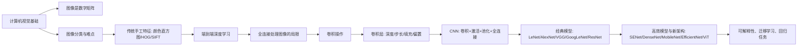

# 第六章：深度视觉模型（一）零基础完整讲解

来源：`第六章-_深度视觉模型-v3.pptx`。课程名称：深度学习导论。主讲教师：王文冠。PPT 共 124 页，无隐藏页。

这一章的主线可以概括为一句话：计算机视觉模型从“人工告诉机器看什么”，逐渐发展到“让模型从像素中自己学会看什么”，而卷积神经网络之所以有效，是因为它把图像中的局部性、平移不变性、权值共享等先验知识写进了模型结构。



## 0. 逐页覆盖清单

这一部分先保证 PPT 的每一页都被覆盖。后面章节会把这些页面合并成连贯讲解。

- 第 1 页：标题页，第六章“深度视觉模型（一）”，课程为深度学习导论，主讲教师王文冠。
- 第 2 页：课程思路：01 计算机视觉基础，02 卷积操作与卷积层，03 卷积神经网络的演进，04 其他。
- 第 3 页：计算机视觉定义：赋予计算机“看”的能力，即通过观察知道什么在哪里；例子包括《碟中谍 7》机场人脸识别系统和机器的眼睛：摄像头。
- 第 4 页：计算机视觉现实应用：人脸识别、自动驾驶、医学影像。
- 第 5 页：人类眼中的图像是连续光影，计算机眼中的图像是离散数字矩阵。
- 第 6 页：继续强调图像对人和计算机的表示差异，图像进入计算机后本质上是像素矩阵。
- 第 7 页：彩色图像由通道叠加构成；RGB 使用红绿蓝三个正交色轴，每通道 0 到 255；24 位色深约 1670 万种颜色；位深越高色彩越细腻但数据量越大；HSL 用色相 H、饱和度 S、亮度 L 表示颜色。
- 第 8 页：图像分类任务：识别图像中样本的语义并输出类别。
- 第 9 页：图像分类难点：视角、尺度、遮挡、光照、照明、形变、背景杂乱、类内变化。
- 第 10 页：线性图像分类：可以尝试用线性分类器，但图像维度极高；32 x 32 x 3 = 3072，256 x 256 x 3 = 196608。
- 第 11 页：传统图像特征提取：颜色直方图统计颜色分布；梯度方向直方图 HOG 捕捉形状与边缘信息。
- 第 12 页：SIFT 特征：David Lowe 1999 年提出，2000 到 2010 年前后最火的特征提取技术之一；对旋转、尺度缩放、亮度变化等具有稳定性。
- 第 13 页：SIFT 全称 Scale-Invariant Feature Transform；核心是在高斯尺度空间检测关键点，为每个关键点生成 128 维梯度方向直方图描述符；通过 DoG 金字塔实现尺度不变性，通过主方向分配实现旋转不变性。
- 第 14 页：手工特征 vs 端到端深度学习模型；手工特征由专家设计，如 SIFT/HOG；深度学习模型如 CNN/ViT 直接从像素学习层次化特征；本质区别是知识驱动 vs 数据驱动；提出归纳偏置是否仍然重要的问题。
- 第 15 页：回顾全连接神经网络：每个隐层由若干神经元组成，每个神经元连接前一层所有神经元；同一隐层神经元之间不互连。
- 第 16 页：全连接层处理图像输入必须先把图像展平为一维向量。
- 第 17 页：全连接处理图像的弊端一：空间信息丢失；二维图像拉直后，上下左右邻域关系丢失，局部几何特征难捕捉。
- 第 18 页：弊端二：参数量爆炸；以 3 通道 32 x 32 图像为例，每个输出都要和 3072 维输入做点积，图像越大计算复杂度越高。
- 第 19 页：仿生学启示：1962 年 Hubel 与 Wiesel 通过猫视觉皮层实验发现感知野机制，神经元只感知局部区域，为 CNN 的局部连接和层次化特征提取提供生物学启发。
- 第 20 页：卷积计算单步：卷积核是包含权重的矩阵，覆盖输入区域后逐元素相乘再累加，即点积。
- 第 21 页：卷积核从左到右、从上到下平滑移动，每移动一步重复单步计算。
- 第 22 页：继续演示卷积滑动过程，新的空间位置产生新的输出值。
- 第 23 页：继续演示卷积输出矩阵逐步填满。
- 第 24 页：卷积示例完成：3 x 3 输入与 2 x 2 卷积核得到 2 x 2 输出矩阵。
- 第 25 页：用二值图和 3 x 3 filter 演示 point-wise product 和 addition，输出第一个值 4。
- 第 26 页：卷积操作的三维/滑动可视化。
- 第 27 页：卷积核可以产生模糊、边缘等不同效果；平均核 `1/9` 产生平滑模糊，中心 8 四周 -1 的核突出边缘。
- 第 28 页：归纳偏置 Inductive Bias：Inductive 是发现共享和共同之处；Bias 是优先关注重要和本质；Inductive Bias 是从数据推断规则并作为模型基础。
- 第 29 页：归纳偏置进一步解释：它给模型提供捷径，引导模型识别数据中关键部分。
- 第 30 页：提出问题：图像中的归纳偏置是什么？
- 第 31 页：局部性 Locality：很多模式远小于整张图，神经元不必看全图；局部计算意味着更少参数。
- 第 32 页：平移不变性 Translation Invariance：相同模式可出现在不同区域，可以用同一组参数检测。
- 第 33 页：继续用猫图说明平移不变性：同一只猫移动位置后类别仍应是 cat。
- 第 34 页：多通道卷积：RGB 图像有 3 个通道，卷积核深度必须与输入通道一致；各通道卷积结果逐像素累加成单通道输出。
- 第 35 页：卷积层通过多个卷积核提取不同特征，并整合成更高层次特征表示。
- 第 36 页：继续展示多个卷积核分别输出多个特征图。
- 第 37 页：强调多个 filter 不同，每个 filter 学不同特征。
- 第 38 页：继续展示不同 filter 对输入产生不同特征图。
- 第 39 页：单个 filter 的大小为 `(FH, FW, 3)`，输入为 `(H, W, 3)`，输出一个空间特征图。
- 第 40 页：多个 filter 产生多通道输出；若 filter 数量为 4，输出尺寸为 `(OH, OW, 4)`。
- 第 41 页：控制卷积层的超参数：深度 depth、步长 stride、填充 padding、偏置 bias。
- 第 42 页：卷积层深度：depth 指卷积核数量，每个卷积核检测不同特征。
- 第 43 页：卷积层填充：边缘像素参与计算次数少，卷积会使输出变小；在输入四周补额外像素，通常补 0，称为 zero-padding；作用是提取边缘特征、控制输出尺寸。
- 第 44 页：图示 vanilla 卷积和 padding 卷积的区别。
- 第 45 页：padding 的属性：获得更多信息；提高输出分辨率。
- 第 46 页：步长 stride：卷积核每次滑动的像素距离；stride=1 提取最细腻特征，stride>1 会跳跃滑动并缩小输出；`(W-F)/S+1` 必须满足整数几何约束。
- 第 47 页：图示 stride=1 与 stride=2 的输出大小差异。
- 第 48 页：stride 的属性：允许压缩局部信息；降低输出分辨率。
- 第 49 页：输出尺寸公式：输入 `(H,W)`，filter `(FH,FW)`，padding `P`，stride `S`，输出 `(OH,OW)`，`OH=(H+2P-FH)/S+1`，`OW=(W+2P-FW)/S+1`。
- 第 50 页：卷积层偏置：每个卷积核配一个可学习偏置 `b`，加权求和后给输出特征图每个元素统一加上这个偏置。
- 第 51 页：单层卷积感受野：对单个卷积核，感受野等同于卷积核尺寸 `K`。
- 第 52 页：多层卷积感受野：对 `L` 层尺寸为 `K` 的卷积核，感受野等于 `1 + L * (K - 1)`。
- 第 53 页：卷积层优势：稀疏连接 sparsity of connections 和参数共享 parameter sharing。
- 第 54 页：权值共享：如果某特征在位置 `(x,y)` 有用，在另一个位置也可能有用；同一卷积核扫描整图，权重在所有位置共享；参数量例子：全连接 `224x224x3x1000=150,528,000`，3x3 卷积 `3x3x3x1000=27,000`。
- 第 55 页：卷积层总结：输入 `C_in x H x W`；超参数为卷积核 `K_H x K_W`、深度 `C_out`、填充 `P`、步长 `S`；权重矩阵参数量 `C_out x C_in x K_H x K_W`；偏置向量 `C_out`；输出 `C_out x H' x W'`，`H'=(H-K+2P)/S+1`，`W'=(W-K+2P)/S+1`。
- 第 56 页：PyTorch 实现：`nn.Conv2d` 是构建卷积层最核心常用接口；参数包括 `in_channels, out_channels, kernel_size, stride, padding, dilation, groups, bias, padding_mode`；PyTorch 文档说明它实际使用 2D cross-correlation。
- 第 57 页：卷积神经网络通常由卷积层、激活函数层如 ReLU、池化层、全连接层构成。
- 第 58 页：回顾感受野计算：若输入为 `3 x 224 x 224`，卷积核 `3 x 3 x 3`，用 `1+L(K-1)` 覆盖完整感受野至少需要 112 层；降低数据体尺寸可缓解问题。
- 第 59 页：池化层：为了降低数据体尺寸，CNN 通常在连续卷积层之间周期性插入池化层，最常见为 Max Pooling。
- 第 60 页：池化层也可理解为 subsampling，把图像采样变小。
- 第 61 页：池化层尺寸关系：输入 `C x H x W`；超参数为核尺寸 `K`、步长 `S`、池化操作 `max/avg`；输出 `C x H' x W'`，`H'=(H-K)/S+1`，`W'=(W-K)/S+1`；无可学习参数。
- 第 62 页：PyTorch 池化接口：`nn.MaxPool2d(kernel_size, stride=None, padding=0, dilation=1, return_indices=False, ceil_mode=False)`；padding 非 0 时两侧隐式补负无穷；dilation 控制池化窗口点间隔。
- 第 63 页：其他池化形式：average pooling、L2-norm pooling、随机池化；也可不使用池化，例如 All Convolutional Net 用更大 stride 的卷积层做下采样。
- 第 64 页：卷积与池化都有平移不变性，因此特征不应强依赖其在图像中的绝对位置。
- 第 65 页：LeNet-5：Yann LeCun 在 20 世纪 90 年代实现的第一个成功卷积神经网络应用；两个 5x5 卷积层和三个全连接层，组合卷积、非线性激活和池化。
- 第 66 页：ImageNet：李飞飞团队创建，超过 1400 万张图像、2 万多个类别；ILSVRC 成为视觉领域重要赛事，催生里程碑技术。
- 第 67 页：ILSVRC 历年冠军显示 CNN 深度逐渐增加，每次深度突破带来性能进步。
- 第 68 页：AlexNet：第一个在大规模视觉竞赛中击败传统视觉模型的大型神经网络；5 层卷积/池化加 3 层全连接，输入 `3 x 224 x 224`。
- 第 69 页：AlexNet 技术创新一：更深的网络结构。
- 第 70 页：AlexNet 技术创新二：ReLU 激活；技术创新三：局部响应归一化 LRN。
- 第 71 页：AlexNet 技术创新四：数据增强和 Dropout 防止过拟合。
- 第 72 页：AlexNet 技术创新五：分布式训练，在 GPU 上并行加速。
- 第 73 页：AlexNet 训练细节：Hinton 团队使用两块 NVIDIA GTX 580 GPU，约 6 天，用 120 万张图像训练；top-5 错误率 15.3%，第二名 SVM top-5 错误率 25.6%。
- 第 74 页：AlexNet 代码实现：PyTorch 结构包含 5 个卷积层、3 次 MaxPool、AdaptiveAvgPool2d 到 6x6、Dropout、Linear、ReLU、分类输出。
- 第 75 页：1x1 卷积：Network in Network 2013 提出；空间尺寸不变，但在通道维度对输入像素加权求和，本质为跨通道线性特征提取；可灵活调整通道数，常用于 GoogLeNet 和 ResNet bottleneck。
- 第 76 页：扩张卷积/空洞卷积/膨胀卷积：在标准卷积核中注入空洞以增大感受野；参数 dilation rate 表示卷积核点的间隔；PPT 示意 dilation rate 为 1、2、3 时感受野从 3x3 增到 7x7、15x15；参考 Multi-Scale Context Aggregation by Dilated Convolutions 2016。
- 第 77 页：VGG 设计动机与架构：用更小卷积核堆更深网络；统一 3x3 卷积；stride=1；2x2 池化，stride=2；多个卷积后接一个池化。
- 第 78 页：为什么 3x3 是好选择：3 个 3x3 卷积和 1 个 7x7 卷积感受野相同，但参数更少、层数更多、非线性更多。
- 第 79 页：参数量对比：三层 3x3 卷积每层 `9C^2`，总 `27C^2`；单层 7x7 卷积 `49C^2`，所以 `27C^2 < 49C^2`。
- 第 80 页：VGG 网络整体结构。
- 第 81 页：VGG 网络数据流图。
- 第 82 页：VGG 优点：结构简单规则，易复现迁移，成为特征提取器标准骨架；提出下一步问题：能否在网络宽度上做文章。
- 第 83 页：GoogLeNet 简介：2014 年 Google 提出，论文 Going Deeper with Convolutions，2014 ImageNet 图像识别冠军，别名 Inception v1。
- 第 84 页：GoogLeNet 核心思想：同一层中不知道该用 5x5、大/小卷积核、1x1、3x3 还是池化时，就全部并行使用。
- 第 85 页：Inception 模块结构：不同尺度特征同时提取，网络自己决定“用哪个”。
- 第 86 页：GoogLeNet 中 1x1 卷积主要用于降维，减少可训练参数，实现更深、更高效结构。
- 第 87 页：全局平均池化 GAP：用每个特征图平均值替代末端全连接层，例如 7x7 特征图变 1x1，显著减少参数并减轻过拟合。
- 第 88 页：辅助分类器：解决训练中的梯度消失；训练期间激活。结构为 5x5 stride 3 平均池化、128 个 1x1 ReLU、1024 单元全连接 ReLU、Dropout 0.7、1000 类 softmax。
- 第 89 页：GoogLeNet 整体架构包含两个辅助分类器，分别连接到 Inception 4a 和 Inception 4d 输出。
- 第 90 页：GoogLeNet 具体参数表，包括各层 patch size、output size、depth、1x1/3x3/5x5 分支通道、pool projection、参数量和运算量。
- 第 91 页：GoogLeNet ILSVRC 2014 测试结果：分类 top-5 错误率 6.67%；检测 mAP 43.9%。
- 第 92 页：GoogLeNet 优势：Inception 融合多尺度特征；1x1 降维和映射；辅助分类器；丢弃全连接，用平均池化减少参数。
- 第 93 页：小结 VGG vs GoogLeNet：VGG 简单、规则、重；GoogLeNet 复杂、高效、轻。
- 第 94 页：ResNet 引入问题：继续在普通卷积网络上加深，深层模型反而表现更差，而且不是过拟合导致。
- 第 95 页：深模型更难优化，可能有梯度消失/爆炸；直觉上深网络至少应能学得像浅网络一样好；思路是让新增层学恒等映射。
- 第 96 页：ResNet 简介：Residual Network，2015，Microsoft Research，论文 Deep Residual Learning for Image Recognition，2015 ImageNet 冠军。
- 第 97 页：ResNet 解决方案：拟合残差映射而非直接拟合目标映射，学习 `F(x)=H(x)-x`，输出 `F(x)+x`。
- 第 98 页：ResNet 整体架构特点：堆叠残差模块；每个残差块两层 3x3 卷积；用 stride=2 的卷积代替池化；开头卷积；最后 GAP 减少参数；只有最后一层全连接。
- 第 99 页：ResNet 整体结构图。
- 第 100 页：架构对比：VGG vs plain-CNN vs ResNet。
- 第 101 页：ResNet 训练效果：层数越深，效果越好。
- 第 102 页：ResNet 实验结果：ResNet-152 在 ImageNet 分类中 top-5 错误率约 3.57%，显著优于当时 VGG、GoogLeNet；首次成功训练超过 100 层网络，成为里程碑模型。
- 第 103 页：SENet：Squeeze-and-Excitation Network，通过显式建模通道依赖，自适应重新校准通道权重；SE Block 先 squeeze 获取通道统计，再 excitation 学习通道重要性。
- 第 104 页：DenseNet：Densely Connected Convolutional Networks，每层直接与前面所有层相连，实现特征重用和梯度高效传播；参数和计算更少，性能优于 ResNet，CVPR 2017 最佳论文。
- 第 105 页：MobileNet V1：移动端和嵌入式轻量 CNN；核心是深度可分离卷积，将标准卷积分解为深度卷积和逐点卷积。
- 第 106 页：MobileNet V2：引入倒残差连接 Inverted Residual 和线性瓶颈 Linear Bottleneck；先 1x1 升维，再深度卷积，再无 ReLU 的 1x1 降维，缓解低维 ReLU 表达损失。
- 第 107 页：MobileNet V3：结合 V1 深度可分离卷积、V2 倒残差和线性瓶颈，并采用 SE 注意力结构。
- 第 108 页：MobileNet 计算效率表：在 ImageNet 上，MobileNet 系列在维持性能时显著减少参数量和计算量。
- 第 109 页：EfficientNet：Google 2019 提出；核心是复合缩放 Compound Scaling，平衡同步缩放深度、宽度、分辨率，用更少参数和 FLOPs 达到当时 ImageNet SOTA。
- 第 110 页：EfficientNet 前的单维缩放：深度、宽度、分辨率分别独立缩放；单独增加深度会梯度消失且精度饱和，单独增加宽度深层能力不足，单独增加分辨率计算量剧增且深层特征利用不足；更深、更宽、更高分辨率相互依赖，需要联合平衡。
- 第 111 页：EfficientNet 复合缩放公式：深度 `d=alpha^phi`，宽度 `w=beta^phi`，分辨率 `r=gamma^phi`；约束 `alpha * beta^2 * gamma^2 ≈ 2`；B0 中 `alpha=1.2, beta=1.1, gamma=1.15`；`phi=1` 约扩大 2 倍，`phi=2` 约扩大 4 倍。
- 第 112 页：Vision Transformer：Google 2020 提出；把图像切成固定大小 patches，经线性嵌入和位置编码后送入标准 Transformer 编码器；首次证明纯注意力机制在大规模视觉任务中可超越 CNN。
- 第 113 页：小结：CNN 发展见证从简单结构到复杂架构，从只关注性能到性能与效率并重的转变。
- 第 114 页：视觉分类中特征表示：为什么把图像转成一维向量表征；剔除冗余、语义提炼、线性可分。
- 第 115 页：特征层次化演化：浅层边缘/角点/颜色斑块/简单纹理；中层基础几何形状/物体部件；深层类别特定宏观模板，如狗头、人脸、汽车。
- 第 116 页：Class Activation Map 技术：为了可解释性，可视化模型注意力焦点；摒弃 Flatten+FC，使用 GAP；把某类别权重反向投影到最后卷积特征图上并加权求和。
- 第 117 页：CAM 应用：发现场景有用物体、定位抽象概念、视觉问答可视化。
- 第 118 页：CAM 例子：哈士奇 vs 狼分类中，模型可能关注背景雪地而非动物本身，说明模型可能用错误区域做出正确分类。
- 第 119 页：特征分布可视化：分类本质是在高维特征空间中实现可分。
- 第 120 页：迁移学习：大数据集上学到的通用视觉知识可迁移到新任务；现实困难包括垂直领域标注少、从零训练算力贵；底层边缘纹理等特征具有通用性。
- 第 121 页：迁移策略：固定特征提取器、微调、部分冻结。
- 第 122 页：视觉模型支持回归任务：backbone 可不变，最后一层输出维度按任务改变；分类常接 softmax，回归通常直接输出实数向量。
- 第 123 页：经典分类和回归任务：分类包括手写数字分类、医学影像分类；回归包括年龄估计、目标检测。
- 第 124 页：总结：回顾计算机视觉基础、卷积操作与卷积层、卷积神经网络演进、其他主题。

## 1. 计算机视觉到底是什么

计算机视觉就是让计算机具备“看”的能力。这里的“看”不只是拍到图像，而是能从图像中判断“什么东西在哪里”。摄像头只是机器的眼睛，它负责采集光信号；真正的视觉模型要把这些信号转成可计算的数字，再推断图像里的语义。

比如：

- 人脸识别：图像里有没有这个人，这个人是谁。
- 自动驾驶：道路在哪里，车道线在哪里，行人和车辆在哪里。
- 医学影像：病灶在哪里，影像属于哪类疾病风险。

对初学者来说，最重要的第一步是把“图片”从直觉对象变成数学对象。人类看到的是连续的光影和物体，计算机看到的是离散数字矩阵。灰度图可以看成二维矩阵，每个数字表示一个像素的亮度；彩色图像通常是三个矩阵叠在一起，即 RGB 三个通道。

## 2. 图像在计算机里如何表示

### 2.1 灰度图：二维矩阵

一张灰度图可以写成：

```text
[
  [26, 120, 126],
  [56,  76,  99],
  [46, 106, 101]
]
```

矩阵中的每个数字就是一个像素强度。常见 8 位图像中，每个像素取值为 0 到 255：

- 0 通常表示黑。
- 255 通常表示白。
- 中间值表示不同灰度。

### 2.2 彩色图：多个通道叠加

RGB 图像有三个通道：

- R：Red，红色强度。
- G：Green，绿色强度。
- B：Blue，蓝色强度。

如果每个通道是 8 位，那么每个通道有 256 种取值，三个通道组合数为：

```text
256 x 256 x 256 = 16,777,216
```

这就是 PPT 说的约 1670 万种颜色，也称 24 位色深，因为 `8 + 8 + 8 = 24`。

位深度越高，单通道可表示的强度级别越多，颜色越细腻，但数据量也越大。例如 8 位单通道有 256 级，16 位单通道有 65536 级。

### 2.3 HSL：更贴近人类直觉的颜色表示

除了 RGB，PPT 还提到 HSL：

- H：Hue，色相，表示颜色种类，例如红、黄、蓝。
- S：Saturation，饱和度，表示颜色纯度，越高越鲜艳，越低越灰。
- L：Lightness，亮度，表示明暗程度。

RGB 更贴近显示器发光原理，HSL 更贴近人类描述颜色的方式。

## 3. 图像分类任务与困难

图像分类任务是计算机视觉中最基础的任务之一。目标是输入一张图像，输出它所属的类别。例如输入一张图片，模型输出：

```text
cat / dog / mug / hat
```

图像分类看起来简单，但困难很多：

- 视角变化：同一个物体从正面、侧面、俯视看起来都不同。
- 尺度变化：同一物体离镜头远近不同，大小变化很大。
- 遮挡：物体可能只露出一部分。
- 光照变化：白天、夜晚、背光、阴影会改变像素值。
- 形变：人、动物、衣服等对象形状会变。
- 背景杂乱：目标可能与复杂背景混在一起。
- 类内变化：同一类别内部差异很大，例如不同品种的狗。

这些困难说明，图像分类不能只记住固定模板。模型必须学到稳定的、可泛化的特征。

## 4. 为什么线性分类器直接处理图像很困难

你已经在前面课程学过线性分类器。理论上，我们可以把图像拉直成向量，然后用线性分类器分类。例如：

```text
32 x 32 x 3 = 3072
256 x 256 x 3 = 196608
```

问题是：图像维度极高。对于一张 256 x 256 RGB 图像，输入特征就有 196608 个。线性模型要在这么高维空间里直接学习类别边界，非常困难。

更关键的是，线性分类器没有天然理解图像结构。它看到的只是一个长向量，不知道哪些像素原本上下相邻、左右相邻，也不知道局部边缘、纹理、角点这些结构。

## 5. 传统计算机视觉：人工特征时代

深度学习流行之前，计算机视觉主要依赖人工设计特征提取器。流程通常是：

```text
图像 -> 人工特征提取 -> 传统分类器
```

### 5.1 颜色直方图

颜色直方图统计图像中各种颜色出现的频率。它的优点是对旋转和尺度变化比较鲁棒，因为不太关心物体具体在哪里；缺点是丢失空间结构。例如一张“蓝天白云图”和一张“蓝色物体加白色背景”的图，颜色分布可能相似，但语义完全不同。

### 5.2 HOG：梯度方向直方图

HOG 全称 Histogram of Oriented Gradients。它通过统计局部区域内梯度方向分布来捕捉边缘和形状。直觉是：物体轮廓会在图像中形成明显的亮度变化，而亮度变化方向就是梯度方向。

HOG 的特点：

- 能保留轮廓和形状信息。
- 对几何和光照变化有一定鲁棒性。
- 仍然是人工设计特征，表达能力有限。

### 5.3 SIFT：尺度不变特征变换

SIFT 全称 Scale-Invariant Feature Transform，中文常译为尺度不变特征变换。它是经典局部特征算法，由 David Lowe 在 1999 年提出，在 2000 到 2010 年前后非常流行。

SIFT 的关键点：

- 它检测图像中的局部关键点。
- 它对旋转、尺度缩放、亮度变化保持不变性。
- 对视角变化、仿射变换、噪声也有一定稳定性。
- 每个关键点会生成一个 128 维梯度方向直方图描述符。
- 使用 DoG，也就是 Difference of Gaussians，高斯差分金字塔，实现尺度不变性。
- 使用主方向分配实现旋转不变性。
- 曾广泛用于图像匹配、物体识别、三维重建。

你可以把 SIFT 理解成：人工设计一套规则，先找图像中比较稳定的局部点，再用 128 个数字描述这个点附近的纹理方向模式。

### 5.4 手工特征 vs 端到端深度学习

PPT 的关键对比是：

| 方式 | 谁决定看什么 | 特征来源 | 优点 | 缺点 |
|---|---|---|---|---|
| 手工特征 | 人类专家 | SIFT、HOG、颜色直方图 | 可解释、数据需求较小 | 表达能力有限、难泛化 |
| 深度学习 | 模型从数据中学习 | CNN、ViT 的中间层特征 | 表达能力强、端到端优化 | 需要数据和算力，解释性较弱 |

手工特征是知识驱动：人类告诉机器看边缘、看梯度、看颜色分布。深度学习是数据驱动：机器从大量样本中自己学会哪些模式重要。

但是 PPT 特别提出一个问题：深度学习时代，归纳偏置还重要吗？答案是重要。CNN 本身就把“局部性”和“平移不变性”等归纳偏置写进了模型结构里。

## 6. 全连接层为什么不适合直接处理图像

### 6.1 必须展平，导致空间信息丢失

全连接层要求输入是一维向量。所以处理图像时，要把二维或三维图像展平：

```text
H x W x C -> 一个长向量
```

展平后，原来相邻的像素关系会被破坏。比如图像中某个像素的上、下、左、右邻居在展平向量里不一定还表现为“空间邻居”。这使模型难以捕捉局部几何结构。

### 6.2 参数量爆炸

全连接层中，每个输出神经元都要连接所有输入。以 32 x 32 x 3 图像为例，输入维度是 3072。若某层有 1000 个神经元，仅这一层权重就大约是：

```text
3072 x 1000 = 3,072,000
```

如果输入是 224 x 224 x 3，则维度是 150528。连接 1000 个神经元需要：

```text
224 x 224 x 3 x 1000 = 150,528,000
```

这还只是第一层。参数太多会带来计算成本、存储成本和过拟合风险。

## 7. 感知野：来自生物视觉的启示

PPT 提到 1962 年 Hubel 与 Wiesel 的猫视觉皮层实验。他们发现：视觉皮层中的一些神经元只对视网膜上特定局部区域的光刺激有反应。这叫感知野 Receptive Field。

这个发现给 CNN 一个重要启示：神经元没有必要一开始就看整张图。很多视觉模式都是局部的，例如边缘、角点、纹理、鸟嘴、猫耳朵。先从局部模式开始，再逐层组合成更大结构，是更自然也更高效的方式。

这也解释了 CNN 的局部连接：每个卷积核只看输入的一小块区域。

## 8. 卷积计算：从最小例子开始

### 8.1 卷积核是什么

卷积核 filter/kernel 是一个小矩阵，里面的数字是权重。例如：

```text
K = [
  [1, 0],
  [0, 1]
]
```

卷积单步计算是：

1. 用卷积核覆盖输入图像的一个局部区域。
2. 对应位置逐元素相乘。
3. 把所有乘积相加。
4. 得到一个输出值。

这本质上就是局部点积。

### 8.2 PPT 的 3 x 3 输入例子

输入图像：

```text
X = [
  [26, 120, 126],
  [56,  76,  99],
  [46, 106, 101]
]
```

卷积核：

```text
K = [
  [1, 0],
  [0, 1]
]
```

左上角第一次计算：

```text
[
  [26, 120],
  [56,  76]
]
和
[
  [1, 0],
  [0, 1]
]
逐元素相乘再相加：

26*1 + 120*0 + 56*0 + 76*1 = 102
```

滑动到右上角：

```text
120*1 + 126*0 + 76*0 + 99*1 = 219
```

滑动到左下角：

```text
56*1 + 76*0 + 46*0 + 106*1 = 162
```

滑动到右下角：

```text
76*1 + 99*0 + 106*0 + 101*1 = 177
```

所以输出特征图为：

```text
[
  [102, 219],
  [162, 177]
]
```

### 8.3 为什么输出叫特征图

卷积核在原始图像上从左到右、从上到下平滑移动。每移动一步，就得到一个输出值。所有输出值按照空间位置排列起来，就形成一张新的二维矩阵。这个矩阵叫 feature map，中文常叫特征图。

一个卷积核会检测一种模式。例如某个核可能对竖直边缘敏感，另一个核可能对水平边缘敏感。特征图中数值越大，通常表示对应位置越符合该卷积核要检测的模式。

### 8.4 PPT 的二值图例子

PPT 还用一个 5 x 5 二值图和 3 x 3 filter 演示了 point-wise product 与 addition。filter 为：

```text
[
  [1, 0, 1],
  [0, 1, 0],
  [1, 0, 1]
]
```

当它覆盖左上角区域时，逐元素乘积后相加得到输出值 4。这个例子说明：卷积核可以被理解为一个局部模式模板；输入区域与模板越匹配，输出越大。

### 8.5 不同卷积核产生不同图像效果

PPT 展示了两个典型卷积核：

平均平滑核：

```text
[
  [1/9, 1/9, 1/9],
  [1/9, 1/9, 1/9],
  [1/9, 1/9, 1/9]
]
```

它会把每个像素替换为周围 3 x 3 区域的平均值，因此图像变模糊。

边缘增强核：

```text
[
  [-1, -1, -1],
  [-1,  8, -1],
  [-1, -1, -1]
]
```

它会突出中心像素与周围像素的差异，因此能强调边缘。

## 9. 归纳偏置：CNN 为什么适合图像

PPT 用英文给出归纳偏置：

```text
Inductive: Discovering what is shared, discerning what is common.
Bias: Prioritizing the significant, focusing on the essential.
Inductive Bias: Inferring rules from data and serve as the basis for models.
```

翻译成初学者能理解的话：

- Inductive：从样本中归纳共同规律。
- Bias：提前偏向某些更可能正确的假设。
- Inductive Bias：模型在学习前就带着某些结构性倾向，用这些倾向帮助它更快更稳地从数据中学规律。

CNN 的两个核心归纳偏置是局部性和平移不变性。

### 9.1 局部性 Locality

很多视觉模式比整张图小得多。例如鸟嘴、猫耳朵、车轮、边缘、纹理，都只占图像的一小块。因此一个神经元不必看全图才能发现这些模式。

局部性的好处：

- 参数更少。
- 计算更少。
- 更符合视觉结构。
- 更容易学习局部特征，再逐层组合成整体语义。

### 9.2 平移不变性 Translation Invariance

同一个模式可能出现在图像不同位置。例如鸟嘴可能在左上角，也可能在中间。我们不应该为“左上角鸟嘴”和“中间鸟嘴”学习两套完全不同的参数。

CNN 的做法是：同一个卷积核在整张图上滑动，同一组权重用于所有位置。这就是权值共享。这样无论模式出现在图像哪里，同一个 filter 都有机会检测到它。

严格说，卷积本身更接近平移等变性 translation equivariance：输入平移，特征图也相应平移。池化和后续分类头会增强近似平移不变性：目标位置变化不应改变最终类别。

## 10. 多通道卷积

彩色图像通常是 RGB 三通道。若输入尺寸为：

```text
H x W x 3
```

那么卷积核不能只是二维矩阵，而必须有同样的深度：

```text
FH x FW x 3
```

计算过程是：

1. 卷积核的 R 通道和图像 R 通道做卷积。
2. 卷积核的 G 通道和图像 G 通道做卷积。
3. 卷积核的 B 通道和图像 B 通道做卷积。
4. 把三个通道的中间结果逐像素相加。
5. 得到一个单通道输出特征图。

如果有多个卷积核，就会得到多个输出特征图。输出通道数等于卷积核数量。

## 11. 卷积层：多个卷积核的组合

单个卷积核检测一种特征，卷积层通常有多个卷积核：

```text
输入图像 -> filter 1 -> 特征图 1
输入图像 -> filter 2 -> 特征图 2
输入图像 -> filter 3 -> 特征图 3
...
```

PPT 特别提醒：这些 filter 是不同的。每个 filter 学一种不同模式。例如：

- 某个 filter 检测水平边缘。
- 某个 filter 检测竖直边缘。
- 某个 filter 检测颜色斑块。
- 更深层 filter 可能检测眼睛、轮子、鸟嘴等部件。

若输入为 `(H, W, 3)`，每个 filter 大小为 `(FH, FW, 3)`，一个 filter 产生一个 `(OH, OW)` 输出。如果有 4 个 filter，输出就是：

```text
(OH, OW, 4)
```

在深度学习框架中，常把通道放在前面，写为：

```text
C_out x OH x OW
```

## 12. 卷积层的四个重要超参数

PPT 列出控制卷积层的几个超参数：

- depth：深度，也就是卷积核数量，等于输出通道数。
- stride：步长，卷积核每次移动多少像素。
- padding：填充，在输入边缘补多少圈像素。
- bias：偏置，每个输出通道一个可学习偏置。

### 12.1 深度 depth

depth 指卷积核数量。每个卷积核检测不同特征。若第一层直接处理原始图像，不同卷积核可能分别被不同方向边界、颜色斑点、局部纹理激活。

如果 `C_out=64`，就表示这个卷积层有 64 个卷积核，输出 64 个特征图。

### 12.2 填充 padding

不加 padding 时，边缘像素参与卷积次数比中心像素少，而且输出尺寸会变小。比如 5 x 5 输入用 3 x 3 kernel、stride=1，不加 padding 时输出只有 3 x 3。

padding 的做法是在输入四周补额外像素，通常补 0，所以叫 zero-padding。

PPT 给出 padding 的两个作用：

1. Enable the acquisition of more information：让边缘信息也能被更充分提取。
2. Increase the resolution of the output：提高或保持输出分辨率，避免特征图太快变小。

常见设置：

- `3 x 3` 卷积，`padding=1`，`stride=1`，输出高宽不变。
- `5 x 5` 卷积，`padding=2`，`stride=1`，输出高宽不变。

### 12.3 步长 stride

stride 是卷积核每次滑动的像素距离。

- `stride=1`：逐像素移动，输出更大，提取更细。
- `stride>1`：跳跃移动，输出变小，起到下采样和压缩作用。

PPT 给出 stride 的属性：

1. Allow the compression of partial information：允许局部信息压缩。
2. Reduce the resolution of the output：降低输出分辨率。

几何上，输出尺寸必须能整除。PPT 提到类似 `(W-F)/S+1` 的结果必须为正整数，否则卷积核不能整齐滑过输入。

### 12.4 偏置 bias

和全连接层一样，卷积层也可以有偏置。区别是：每个卷积核对应一个 bias，这个 bias 会加到该卷积核产生的整张输出特征图上。

如果有 `C_out` 个卷积核，就有 `C_out` 个 bias。

## 13. 卷积输出尺寸公式

PPT 第 49 页给出二维输出公式。输入大小为 `(H, W)`，卷积核大小为 `(FH, FW)`，padding 为 `P`，stride 为 `S`，输出为 `(OH, OW)`：

```text
OH = (H + 2P - FH) / S + 1
OW = (W + 2P - FW) / S + 1
```

如果卷积核是正方形，大小为 `K x K`，则可以写成：

```text
H' = (H - K + 2P) / S + 1
W' = (W - K + 2P) / S + 1
```

注意：实际框架中若不能整除，通常会报错或向下取整，取决于具体算子和设置。但学习时要先掌握 PPT 的整齐滑动版本。

### 13.1 例子

输入 `H=W=32`，卷积核 `K=3`，padding `P=1`，stride `S=1`：

```text
H' = (32 - 3 + 2*1) / 1 + 1 = 32
W' = 32
```

所以 3x3 卷积加 1 圈 padding 可以保持尺寸不变。

输入 `H=W=32`，卷积核 `K=3`，padding `P=0`，stride `S=1`：

```text
H' = (32 - 3 + 0) + 1 = 30
W' = 30
```

输出变小为 30 x 30。

输入 `H=W=32`，卷积核 `K=3`，padding `P=1`，stride `S=2`：

```text
H' = (32 - 3 + 2) / 2 + 1 = 31/2 + 1
```

这不是整数，所以严格按 PPT 的整齐滑动约束，这组参数不合适。实际工程中常通过框架取整得到 16，但初学推导时要知道几何约束的来源。

## 14. 卷积层参数量总结

PPT 第 55 页总结了卷积层的输入、参数和输出。

输入：

```text
C_in x H x W
```

超参数：

```text
卷积核尺度：K_H x K_W
深度：C_out
填充：P
步长：S
```

权重矩阵参数量：

```text
C_out x C_in x K_H x K_W
```

偏置向量：

```text
C_out
```

输出：

```text
C_out x H' x W'
```

其中：

```text
H' = (H - K + 2P) / S + 1
W' = (W - K + 2P) / S + 1
```

如果考虑 bias，总参数量是：

```text
C_out * C_in * K_H * K_W + C_out
```

## 15. PyTorch 中的卷积层

PPT 展示了 PyTorch 的 `nn.Conv2d` 接口：

```python
torch.nn.Conv2d(
    in_channels,
    out_channels,
    kernel_size,
    stride=1,
    padding=0,
    dilation=1,
    groups=1,
    bias=True,
    padding_mode='zeros',
    device=None,
    dtype=None
)
```

关键参数解释：

- `in_channels`：输入通道数，例如 RGB 图像为 3。
- `out_channels`：输出通道数，也就是卷积核数量。
- `kernel_size`：卷积核大小，例如 3 或 `(3,3)`。
- `stride`：步长。
- `padding`：填充。
- `dilation`：扩张卷积的点间隔。
- `groups`：分组卷积参数，MobileNet 的深度卷积会用到。
- `bias`：是否使用偏置。
- `padding_mode='zeros'`：默认零填充。

PPT 的英文文档截图还说明：PyTorch 的 `Conv2d` 实际执行的是 2D cross-correlation。数学上严格的 convolution 会把卷积核翻转后再滑动，而深度学习框架通常不翻转。因为卷积核是可学习的，翻不翻转不影响模型表达能力，所以工程中仍然叫卷积。

## 16. 感受野 Receptive Field

感受野是输出特征中某个位置能“看到”的输入区域大小。

### 16.1 单层卷积

对单个卷积核，感受野等于卷积核大小 `K`。例如 3x3 卷积的单层感受野是 3x3。

### 16.2 多层卷积

PPT 给出简化公式：对于 `L` 层尺寸为 `K` 的卷积核，感受野为：

```text
1 + L * (K - 1)
```

例如连续堆叠 3 层 3x3 卷积：

```text
1 + 3 * (3 - 1) = 7
```

所以 3 层 3x3 卷积可以达到 7x7 感受野。

PPT 第 58 页提出：如果输入是 `3 x 224 x 224`，卷积核是 `3 x 3 x 3`，要获得完整感受野至少需要：

```text
1 + L * (3 - 1) >= 224
2L >= 223
L >= 111.5
```

所以至少 112 层。这会带来巨大参数量和训练困难。因此 CNN 常通过池化或 stride 卷积降低数据体尺寸，让后续层更快获得大感受野。

## 17. 卷积层的两大优势

### 17.1 稀疏连接

全连接层中每个神经元连接所有输入。卷积层中每个输出位置只连接输入的局部区域，例如 3x3 小块。这叫 sparse connections，稀疏连接。

好处是：

- 参数少。
- 计算少。
- 更符合图像局部结构。

### 17.2 权值共享

同一个卷积核在整张图上滑动，所有位置使用同一组权重。这叫 parameter sharing，参数共享。

PPT 的参数量例子非常重要：

全连接层：

```text
输入 224 x 224 x 3
1000 个神经元
参数量 = 224 x 224 x 3 x 1000 = 150,528,000
```

卷积层：

```text
1000 个 3 x 3 x 3 卷积核
参数量 = 3 x 3 x 3 x 1000 = 27,000
```

参数量差距极大。卷积层不是因为少看信息，而是利用了“同一特征可能出现在不同位置”这个归纳偏置。

## 18. CNN 的基本结构

PPT 第 57 页说明，卷积神经网络通常由四种层构成：

- 卷积层：提取局部特征。
- 激活函数层：例如 ReLU，引入非线性。
- 池化层：降低空间尺寸，提高鲁棒性。
- 全连接层：在末端做分类或回归。

常见模式是：

```text
输入
-> 卷积 + ReLU
-> 卷积 + ReLU
-> 池化
-> 卷积 + ReLU
-> 卷积 + ReLU
-> 池化
-> ...
-> 全连接/全局平均池化
-> 输出
```

卷积层负责把低级特征组合成高级特征；池化或 stride 负责逐渐缩小空间分辨率；最后的分类头把高级表征转成类别概率。

## 19. 池化层 Pooling

池化层的目的是降低数据体尺寸。最常见的是最大池化 Max Pooling。

### 19.1 Max Pooling

给定一个局部窗口，例如 2x2，取其中最大值作为输出：

```text
[
  [1, 5],
  [2, 3]
] -> 5
```

它保留局部最强响应。直觉上，如果某个特征在局部区域中出现了，精确位置不那么重要。

### 19.2 池化输出尺寸

PPT 第 61 页给出：

输入：

```text
C x H x W
```

超参数：

```text
核尺寸：K
步长：S
池化操作：max 或 avg
```

输出：

```text
C x H' x W'
```

公式：

```text
H' = (H - K) / S + 1
W' = (W - K) / S + 1
```

池化层没有可学习参数。

### 19.3 PyTorch MaxPool2d

PPT 展示的接口是：

```python
torch.nn.MaxPool2d(
    kernel_size,
    stride=None,
    padding=0,
    dilation=1,
    return_indices=False,
    ceil_mode=False
)
```

说明：

- `kernel_size`：池化窗口大小。
- `stride`：移动步长；若为 None，通常默认等于 kernel_size。
- `padding`：如果非 0，PyTorch 文档中说明会在两侧隐式填充负无穷，这样不会影响最大值选择。
- `dilation`：池化窗口内点之间的间隔。
- `return_indices`：是否返回最大值位置，反池化时有用。
- `ceil_mode`：输出尺寸是否用向上取整。

### 19.4 其他池化和不用池化

PPT 还提到：

- Average pooling：平均池化。
- L2-norm pooling：L2 范数池化。
- 随机池化。
- 不使用池化：例如 All Convolutional Net 通过较大 stride 的卷积完成下采样。

## 20. 卷积与池化的平移不变性

PPT 第 64 页说卷积和池化操作具有转移不变性，这里更准确地可理解为平移相关的鲁棒性。图像中的某个特征不应强依赖它的绝对位置。

例如猫在图像左侧或右侧，类别都应是 cat。卷积用同一 filter 扫描整张图，能在不同位置检测同一模式；池化会让局部位置变化对输出影响变小。

## 21. LeNet-5

LeNet-5 是第一个成功应用的卷积神经网络之一，由 Yann LeCun 在 20 世纪 90 年代实现，常用于手写数字识别。

PPT 给出的结构特点：

- 两个卷积层，卷积核为 5x5。
- 三个全连接层。
- 组合使用卷积层、非线性激活函数和池化/汇聚层。

LeNet-5 的意义在于证明：用卷积结构处理图像是有效的。

## 22. ImageNet 与 ILSVRC

ImageNet 是斯坦福大学李飞飞教授团队创建的大规模标注图像数据库：

- 超过 1400 万张图像。
- 涵盖 2 万多个类别。
- 大规模、多样性数据缓解了深度模型样本不足导致的过拟合问题。

ILSVRC 是基于 ImageNet 子集设立的竞赛，成为计算机视觉领域里程碑技术的推动器。PPT 第 67 页强调，从 ILSVRC 历年冠军可以看出，卷积神经网络深度逐渐增加，每次深度突破带来性能显著进步。

## 23. AlexNet

AlexNet 是深度学习视觉史上的关键模型。它是第一个在大规模视觉竞赛中击败传统计算机视觉方法的大型神经网络。

PPT 给出的基本信息：

- 包含 5 层卷积/池化层。
- 包含 3 层全连接层。
- 输入尺度为 `3 x 224 x 224`。
- 对深度学习发展具有里程碑意义。

### 23.1 AlexNet 技术创新

PPT 列出 5 个创新。

第一，更深的神经网络结构。AlexNet 是首个真正意义上的深度卷积神经网络之一，深度远超当时许多神经网络，因此能学习更复杂特征。

第二，使用 ReLU 激活函数。相较 sigmoid 和 tanh，ReLU 计算简单，并能缓解梯度消失，使训练更高效。

第三，使用局部响应归一化 LRN。PPT 说明 LRN 对卷积层不同特征图进行归一化，在一定程度上避免过拟合，提高泛化能力。常见公式可写为：

```text
b^i_{x,y} = a^i_{x,y} / (k + alpha * sum_j (a^j_{x,y})^2)^beta
```

其中 `a` 是归一化前响应，`b` 是归一化后响应，求和在相邻通道上进行。现代网络中 LRN 已较少使用，BatchNorm 更常见，但它是 AlexNet 当时的重要工程技巧。

第四，引入数据增强和 Dropout。数据增强通过旋转、翻转、裁剪等变换增加训练样本多样性；Dropout 随机丢弃神经元，减少过拟合。

第五，分布式训练。AlexNet 使用 GPU 并行训练，把卷积层和全连接层放到不同 GPU 上计算，大幅加快训练。

### 23.2 AlexNet 竞赛结果

PPT 第 73 页给出：

- Hinton 团队使用两块 NVIDIA GTX 580 GPU。
- 训练耗时近 6 天。
- 使用 120 万张图像训练。
- 训练后 top-5 错误率 15.3%。
- 第二名团队使用 SVM，top-5 错误率 25.6%。

这说明 AlexNet 不是小幅改进，而是对传统方法形成明显优势。

### 23.3 AlexNet 的 PyTorch 代码结构

PPT 第 74 页代码可以整理为：

```python
import torch
import torch.nn as nn

class AlexNet(nn.Module):
    def __init__(self, config):
        super(AlexNet, self).__init__()
        self._config = config

        self.features = nn.Sequential(
            nn.Conv2d(3, 64, kernel_size=11, stride=4, padding=2),
            nn.ReLU(inplace=True),
            nn.MaxPool2d(kernel_size=3, stride=2),
            nn.Conv2d(64, 192, kernel_size=5, stride=1, padding=2),
            nn.ReLU(inplace=True),
            nn.MaxPool2d(kernel_size=3, stride=2),
            nn.Conv2d(192, 384, kernel_size=3, stride=1, padding=1),
            nn.ReLU(inplace=True),
            nn.Conv2d(384, 256, kernel_size=3, stride=1, padding=1),
            nn.ReLU(inplace=True),
            nn.Conv2d(256, 256, kernel_size=3, stride=1, padding=1),
            nn.ReLU(inplace=True),
            nn.MaxPool2d(kernel_size=3, stride=2),
        )

        self.avgpool = nn.AdaptiveAvgPool2d((6, 6))

        self.classifier = nn.Sequential(
            nn.Dropout(),
            nn.Linear(256 * 6 * 6, 4096),
            nn.ReLU(inplace=True),
            nn.Dropout(),
            nn.Linear(4096, 1024),
            nn.ReLU(inplace=True),
            nn.Linear(1024, self._config['num_classes']),
        )

    def forward(self, x):
        x = self.features(x)
        x = self.avgpool(x)
        x = torch.flatten(x, 1)
        x = self.classifier(x)
        return x
```

这段代码里：

- `features` 是卷积特征提取器。
- `avgpool` 把上一层数据变成固定 6x6 大小。
- `classifier` 是全连接分类器。
- `torch.flatten(x, 1)` 保留 batch 维，把后面维度展平。

## 24. 卷积层变体

### 24.1 1x1 卷积

1x1 卷积最早在 Network in Network 2013 中提出。它的卷积核空间尺寸是 1x1，所以不改变空间高宽。但它会在通道维度做加权求和。

如果输入某个位置有 64 个通道，那么 1x1 卷积可以把这 64 个数字线性组合成新的通道。若使用 1 个 1x1 filter，输出通道变成 1；若使用 128 个 1x1 filter，输出通道变成 128。

作用：

- 调整通道数。
- 降维以减少后续 3x3 或 5x5 卷积计算量。
- 升维以增加表达能力。
- 引入跨通道信息融合。

PPT 提到它被广泛用于 GoogLeNet 和 ResNet 的 Bottleneck 模块。

### 24.2 扩张卷积 Dilated Convolution

扩张卷积又叫空洞卷积或膨胀卷积。它在标准卷积核采样点之间加入间隔，以增大感受野。

PPT 的定义重点：

- 在标准卷积核中注入空洞。
- 增加模型感受野。
- 多一个参数 dilation rate，表示卷积核点的间隔数量。
- 常规卷积 dilation rate 为 1。

PPT 图中给出示意：

```text
dilation rate = 1 -> 感受野 3x3
dilation rate = 2 -> 感受野 7x7
dilation rate = 3 -> 感受野 15x15
```

学习时你只需要记住核心：扩张卷积不显著增加参数量，却能看更大的区域，因此常用于语义分割、上下文聚合等需要大感受野的任务。

## 25. VGG

VGG 的核心思想是：用更小的卷积核，堆更深的网络。

PPT 给出的 VGG 架构特点：

- 统一使用 3x3 卷积。
- 卷积步长为 1。
- 池化使用 2x2，stride=2。
- 多个卷积后接一个池化。

### 25.1 为什么 3x3 卷积是好选择

PPT 重点解释：3 个 3x3 卷积和 1 个 7x7 卷积感受野相同，但 3 个 3x3 有更多优势。

感受野：

```text
三层 3x3：
1 + 3 * (3 - 1) = 7
```

所以三层 3x3 可以覆盖 7x7 感受野。

参数量对比，假设输入通道数和输出通道数都为 `C`，不考虑 bias：

三层 3x3：

```text
每层参数量 = 3 x 3 x C x C = 9C^2
总参数量 = 3 x 9C^2 = 27C^2
```

单层 7x7：

```text
总参数量 = 7 x 7 x C x C = 49C^2
```

所以：

```text
27C^2 < 49C^2
```

更重要的是，三层 3x3 中间有更多 ReLU，非线性更多，表达能力更强。

### 25.2 VGG 的优点

PPT 总结：

- 结构简单、规则。
- 易于复现和迁移。
- 成为“特征提取器”的标准骨架。

VGG 的缺点是参数量大，尤其末端全连接层很重。所以后续模型开始追求更高效的宽度设计和参数压缩。

## 26. GoogLeNet / Inception v1

GoogLeNet 的基本信息：

- 提出时间：2014。
- 提出机构：Google。
- 论文名称：Going Deeper with Convolutions。
- 竞赛成绩：2014 年 ImageNet 图像识别竞赛冠军。
- 别名：Inception v1。

### 26.1 核心思想：全都要

在同一层中，我们可能不知道该用：

- 大卷积核，例如 5x5。
- 小卷积核，例如 1x1、3x3。
- 池化。

GoogLeNet 的思路是：那就全部并行使用。Inception 模块同时提取不同尺度特征，然后把结果拼接，让网络自己决定哪些有用。

### 26.2 Inception 模块

一个典型 Inception 模块包含多条分支：

- 1x1 卷积分支。
- 1x1 降维后接 3x3 卷积分支。
- 1x1 降维后接 5x5 卷积分支。
- 池化后接 1x1 projection 分支。

最后把这些分支在通道维度拼接。

### 26.3 1x1 卷积降维

如果直接对高通道输入做 5x5 卷积，参数和计算量很大。先用 1x1 卷积减少通道数，再做 3x3 或 5x5 卷积，可以显著降低成本。

例如输入有 192 通道，直接做 5x5 输出 32 通道，参数是：

```text
5 x 5 x 192 x 32 = 153,600
```

若先用 1x1 降到 16 通道，再做 5x5 输出 32 通道：

```text
1x1 降维参数 = 1 x 1 x 192 x 16 = 3,072
5x5 参数 = 5 x 5 x 16 x 32 = 12,800
总计 = 15,872
```

这比 153,600 少很多。

### 26.4 全局平均池化 GAP

传统 AlexNet 末端全连接层引入大量参数。GoogLeNet 用全局平均池化 Global Average Pooling 替代这些全连接层。

如果最后一层特征图是 `7 x 7 x C`，GAP 会对每个通道的 7x7 空间位置取平均，得到 `1 x 1 x C`。这样参数极少，也能降低过拟合。

### 26.5 辅助分类器

GoogLeNet 很深，训练时会出现梯度消失风险。PPT 提到它引入辅助分类器，即网络中间接出小分类器，帮助训练。

辅助分类器结构：

- 平均池化层：5x5，stride=3。
- 1x1 卷积：128 个滤波器，ReLU。
- 全连接层：1024 个单元，ReLU。
- Dropout 层：dropout 率 0.7。
- 全连接 softmax 层：1000 个类别。

这些辅助分类器只在训练期间激活，帮助中间层也接收到监督信号。

### 26.6 GoogLeNet 参数表

PPT 第 90 页展示了 GoogLeNet 的具体参数。核心表格可整理如下：

| type | patch/stride | output size | depth | #1x1 | #3x3 reduce | #3x3 | #5x5 reduce | #5x5 | pool proj | params | ops |
|---|---:|---:|---:|---:|---:|---:|---:|---:|---:|---:|---:|
| convolution | 7x7/2 | 112x112x64 | 1 |  |  |  |  |  |  | 2.7K | 34M |
| max pool | 3x3/2 | 56x56x64 | 0 |  |  |  |  |  |  |  |  |
| convolution | 3x3/1 | 56x56x192 | 2 |  | 64 | 192 |  |  |  | 112K | 360M |
| max pool | 3x3/2 | 28x28x192 | 0 |  |  |  |  |  |  |  |  |
| inception 3a |  | 28x28x256 | 2 | 64 | 96 | 128 | 16 | 32 | 32 | 159K | 128M |
| inception 3b |  | 28x28x480 | 2 | 128 | 128 | 192 | 32 | 96 | 64 | 380K | 304M |
| max pool | 3x3/2 | 14x14x480 | 0 |  |  |  |  |  |  |  |  |
| inception 4a |  | 14x14x512 | 2 | 192 | 96 | 208 | 16 | 48 | 64 | 364K | 73M |
| inception 4b |  | 14x14x512 | 2 | 160 | 112 | 224 | 24 | 64 | 64 | 437K | 88M |
| inception 4c |  | 14x14x512 | 2 | 128 | 128 | 256 | 24 | 64 | 64 | 463K | 100M |
| inception 4d |  | 14x14x528 | 2 | 112 | 144 | 288 | 32 | 64 | 64 | 580K | 119M |
| inception 4e |  | 14x14x832 | 2 | 256 | 160 | 320 | 32 | 128 | 128 | 840K | 170M |
| max pool | 3x3/2 | 7x7x832 | 0 |  |  |  |  |  |  |  |  |
| inception 5a |  | 7x7x832 | 2 | 256 | 160 | 320 | 32 | 128 | 128 | 1072K | 54M |
| inception 5b |  | 7x7x1024 | 2 | 384 | 192 | 384 | 48 | 128 | 128 | 1388K | 71M |
| avg pool | 7x7/1 | 1x1x1024 | 0 |  |  |  |  |  |  |  |  |
| dropout 40% |  | 1x1x1024 | 0 |  |  |  |  |  |  |  |  |
| linear |  | 1x1x1000 | 1 |  |  |  |  |  |  | 1000K | 1M |
| softmax |  | 1x1x1000 | 0 |  |  |  |  |  |  |  |  |

这张表展示出 GoogLeNet 的设计重点：大量 Inception 模块用不同分支组合特征，但通过 1x1 降维控制参数和运算。

### 26.7 GoogLeNet 测试结果

PPT 第 91 页给出 ILSVRC 2014 的结果。

分类性能表：

| Team | Year | Place | Error top-5 | Uses external data |
|---|---:|---:|---:|---|
| SuperVision | 2012 | 1st | 16.4% | no |
| SuperVision | 2012 | 1st | 15.3% | ImageNet 22k |
| Clarifai | 2013 | 1st | 11.7% | no |
| Clarifai | 2013 | 1st | 11.2% | ImageNet 22k |
| MSRA | 2014 | 3rd | 7.35% | no |
| VGG | 2014 | 2nd | 7.32% | no |
| GoogLeNet | 2014 | 1st | 6.67% | no |

检测性能表：

| Team | Year | Place | mAP | external data | ensemble | approach |
|---|---:|---:|---:|---|---:|---|
| UvA-Euvision | 2013 | 1st | 22.6% | none | ? | Fisher vectors |
| Deep Insight | 2014 | 3rd | 40.5% | ImageNet 1k | 3 | CNN |
| CUHK DeepID-Net | 2014 | 2nd | 40.7% | ImageNet 1k | ? | CNN |
| GoogLeNet | 2014 | 1st | 43.9% | ImageNet 1k | 6 | CNN |

### 26.8 GoogLeNet 优势

PPT 总结：

- 引入 Inception 结构，融合不同尺度特征。
- 使用 1x1 卷积进行降维和映射。
- 添加两个辅助分类器帮助训练。
- 丢弃全连接层，使用平均池化层，大幅减少模型参数。

## 27. VGG vs GoogLeNet

PPT 用一句话总结：

```text
VGG：简单、规则、重，参数量大。
GoogLeNet：复杂、高效、轻，参数量小。
```

这两种模型代表两种设计哲学：

- VGG 追求规则堆叠，容易复现，适合作为标准骨架。
- GoogLeNet 追求多分支和效率，用结构设计减少参数。

## 28. ResNet

### 28.1 为什么需要 ResNet

PPT 第 94 页提出问题：还能继续加深吗？

直觉上，模型越深，表达能力越强。但实践中，普通卷积网络继续加深后，训练表现反而变差，而且这不是过拟合导致的。因为如果是过拟合，训练误差应该低、测试误差高；但深层 plain network 往往连训练误差都更高。

PPT 第 95 页给出推断：

- 深模型有更多参数，表示能力更强。
- 但实际表现可能不如浅模型。
- 原因是深模型更难优化，可能出现梯度消失或梯度爆炸。

一个直觉问题是：深网络至少应该能学得和浅网络一样好。因为深网络可以复制浅网络的层，再让新增层学恒等映射。

### 28.2 残差学习

ResNet 的解决方案是：不直接学习期望映射 `H(x)`，而是学习残差：

```text
F(x) = H(x) - x
```

于是：

```text
H(x) = F(x) + x
```

网络层只需要学习 `F(x)`，再通过跳跃连接 shortcut 把输入 `x` 加回来。

如果最优情况是恒等映射，那么网络只需要让 `F(x)=0`，比直接让一堆非线性层学 `H(x)=x` 容易。

### 28.3 ResNet 基本信息

PPT 给出：

- 全称：Residual Network，残差网络。
- 提出时间：2015。
- 提出机构：Microsoft Research。
- 论文名称：Deep Residual Learning for Image Recognition。
- 竞赛成绩：2015 年 ImageNet 图像识别竞赛冠军。

### 28.4 ResNet 架构特点

PPT 第 98 页总结：

- 堆叠残差模块。
- 每个残差块通常是两层 3x3 卷积。
- 使用步长为 2 的卷积层代替池化层进行下采样。
- 网络开始时进行卷积。
- 网络最后用 GAP 减少参数量。
- 只有最后一层才有全连接层。

### 28.5 ResNet 实验结果

PPT 第 102 页：

- ResNet-152 在 ImageNet 分类任务中取得约 3.57% top-5 错误率。
- 显著优于当时的 VGG、GoogLeNet 等模型。
- 首次成功训练超过 100 层的深层网络。
- 深度增加时性能还能持续提升。
- 成为计算机视觉里程碑模型。

## 29. ResNet 之后的经典结构

### 29.1 SENet

SENet 全称 Squeeze-and-Excitation Network。PPT 说它显式建模通道间依赖关系，自适应重新校准特征通道权重。

SE Block 包含两个核心步骤：

1. Squeeze：全局压缩，获取每个通道的统计信息，常用全局平均池化。
2. Excitation：通过门控机制学习每个通道的重要性。

最后根据通道重要性加权：

- 增强有用特征。
- 抑制冗余特征。

直觉：普通卷积产生很多通道，但并非每个通道都同等重要。SENet 让网络学会“哪些通道更重要”。

### 29.2 DenseNet

DenseNet 全称 Densely Connected Convolutional Networks。PPT 给出的关键是密集连接：每一层都直接与前面所有层相连。

好处：

- 特征重用更充分。
- 梯度传播更高效。
- 参数和计算成本更少时仍能获得优秀性能。

PPT 提到 DenseNet 在参数和计算成本更少的情形下实现比 ResNet 更优的性能，并获得 CVPR 2017 最佳论文奖。

## 30. MobileNet 系列

MobileNet 是面向移动端和嵌入式设备的轻量级 CNN。

### 30.1 MobileNet V1

MobileNet V1 的核心创新是深度可分离卷积 Depthwise Separable Convolution。

标准卷积同时做两件事：

- 在空间维度提取局部模式。
- 在通道维度融合信息。

深度可分离卷积把它拆成两步：

1. Depthwise convolution：每个输入通道单独做空间卷积。
2. Pointwise convolution：用 1x1 卷积融合通道。

这样能显著降低计算量和参数量，同时保持较好识别精度。

### 30.2 MobileNet V2

MobileNet V2 在 V1 基础上引入：

- Inverted Residual，倒残差连接。
- Linear Bottleneck，线性瓶颈层。

流程是：

1. 先用 1x1 卷积升维，扩展通道。
2. 再用深度卷积提取空间信息。
3. 最后用没有 ReLU 的 1x1 卷积降维。

为什么最后不用 ReLU？PPT 说这是为了缓解低维特征经过 ReLU 后造成的表达能力损失。低维空间中 ReLU 把负值截断，可能丢掉太多信息。

### 30.3 MobileNet V3

MobileNet V3 结合了：

- V1 的深度可分离卷积。
- V2 的倒残差和线性瓶颈。
- SENet 的通道注意力结构。

它通过学习每个通道的重要程度，提升有用特征，抑制对当前任务帮助不大的特征。

### 30.4 MobileNet 计算效率

PPT 第 108 页给出 ImageNet 分类任务上的性能对比：

| 网络模型 | Top-1 准确率 | 参数量 | 计算量 |
|---|---:|---:|---:|
| GoogLeNet | 69.8% | 6.8M | 1550M |
| VGG16 | 71.5% | 138M | 15300M |
| MobileNetV1 | 70.6% | 4.2M | 575M |
| ShuffleNet(1.5) | 71.5% | 3.4M | 292M |
| MobileNetV2 (1.0) | 72.0% | 3.4M | 300M |
| MobileNetV2 (1.4) | 74.7% | 6.9M | 585M |
| MnasNet-A1 | 75.2% | 3.9M | 315M |
| V3-Small 1.0 | 67.4 | 2.9M | 66M |
| V3-Large 1.0 | 75.2 | 5.4M | 219M |

这张表要读出一个结论：轻量模型不是简单地牺牲精度换速度，而是在相近精度下显著减少参数和计算。

## 31. EfficientNet

EfficientNet 是 Google 于 2019 年提出的高效 CNN 系列。PPT 说其核心创新是复合缩放 Compound Scaling。

### 31.1 三个缩放维度

在 EfficientNet 之前，提升 CNN 精度通常独立缩放三个维度之一：

- 深度 Depth：增加层数，例如 ResNet-18 到 ResNet-152。
- 宽度 Width：增加通道数，例如 Wide ResNet。
- 分辨率 Resolution：增大输入图像尺寸，例如 224x224 到 448x448。

PPT 第 110 页指出单独缩放有瓶颈：

- 只增加深度：可能梯度消失，难训练，精度很快饱和。
- 只增加宽度：容易提取更细粒度特征，但深层特征能力不足。
- 只增加分辨率：计算量剧增，但对深层特征利用不充分。

直觉是：更高分辨率需要更大感受野和更多通道来捕捉细节；更宽网络也需要足够深度组合特征。因此深度、宽度、分辨率是相互依赖的，需要联合且平衡地缩放。

### 31.2 复合缩放公式

PPT 第 111 页给出：

```text
深度：d = alpha^phi
宽度：w = beta^phi
分辨率：r = gamma^phi
```

约束条件：

```text
alpha * beta^2 * gamma^2 ≈ 2
```

含义是：当 `phi` 每增加 1，整体计算量大约扩大 2 倍。

PPT 给出 EfficientNet-B0 基线的常数：

```text
alpha = 1.2
beta = 1.1
gamma = 1.15
```

所以：

- `phi=1` 时，网络规模约扩大 2 倍。
- `phi=2` 时，网络规模约扩大 4 倍。

关键不是盲目加深或加宽，而是所有维度同时、平衡增长。

## 32. Vision Transformer

Vision Transformer，简称 ViT，是 Google 于 2020 年提出的开创性视觉模型。

PPT 给出的核心思想：

1. 把输入图像切分为固定大小的图像块 patches。
2. 每个 patch 经过线性嵌入，变成向量 token。
3. 加入位置编码，让模型知道 patch 的相对/绝对位置信息。
4. 送入标准 Transformer 编码器。
5. 用输出表征进行分类。

ViT 的意义是：它首次证明了纯注意力机制在大规模视觉任务中可以超越传统 CNN。

CNN 的核心偏置是局部性和平移不变性；Transformer 的核心机制是注意力，可以让任意位置之间直接建模关系。ViT 通常更依赖大规模数据训练，因为它不像 CNN 那样天然内置强局部视觉偏置。

## 33. CNN 发展小结

PPT 第 113 页总结：CNN 的发展历程见证了从简单网络结构到复杂架构，从专注性能到性能与效率并重的转变。

可以按这个脉络记忆：

| 阶段 | 代表模型 | 主要问题 | 关键思想 |
|---|---|---|---|
| 早期 CNN | LeNet-5 | 图像局部特征提取 | 卷积 + 池化 |
| 深度突破 | AlexNet | 大规模视觉分类 | ReLU、GPU、Dropout、数据增强 |
| 规则加深 | VGG | 简洁可复现深网络 | 堆叠 3x3 卷积 |
| 高效多尺度 | GoogLeNet | 参数量与多尺度特征 | Inception、1x1 降维、GAP |
| 超深网络 | ResNet | 深层优化困难 | 残差连接 |
| 通道注意力 | SENet | 通道重要性不同 | Squeeze-Excitation |
| 特征重用 | DenseNet | 梯度传播与参数效率 | 密集连接 |
| 移动端 | MobileNet | 低算力部署 | 深度可分离卷积 |
| 平衡缩放 | EfficientNet | 精度效率平衡 | Compound Scaling |
| 注意力视觉 | ViT | 非卷积视觉建模 | patch + Transformer |

## 34. 视觉分类中的特征表示

PPT 第 114 页问：为什么要将图像转变为单维向量表征？

原因有三点。

### 34.1 剔除冗余

原始像素包含大量背景、光照、噪声等无关信息。模型中间层要逐步把这些冗余压缩掉，保留与任务相关的信息。

### 34.2 语义提炼

CNN 的层次结构会把原始像素逐步抽象：

```text
像素 -> 边缘/纹理 -> 局部部件 -> 整体语义
```

例如从边缘和纹理逐渐变成眼睛、耳朵，再变成猫脸、狗头。

### 34.3 线性可分

复杂视觉数据原本在像素空间中难以线性划分。深度网络的目标之一，是把输入映射到一个高维特征空间，使不同类别更容易被最后的线性分类器分开。

## 35. 特征的层次化演化

PPT 第 115 页把特征分为三层：

### 35.1 浅层特征

内容：

- 边缘。
- 角点。
- 颜色斑块。
- 简单纹理。

特点：

- 感受野小。
- 分辨率高。
- 缺乏全局语义。

### 35.2 中层特征

内容：

- 基础几何形状。
- 物体特定部件。

特点：

- 由底层边缘组合而成。
- 开始具备一定结构信息。

### 35.3 深层特征

内容：

- 类别特定宏观模板。
- 例如狗头、人脸、汽车。

特点：

- 感受野覆盖全图。
- 空间分辨率低，因为经过池化或下采样压缩。
- 语义信息极其丰富。
- 直接服务最终分类。

这就是为什么 CNN 前面像“边缘检测器”，后面更像“语义检测器”。

## 36. Class Activation Map：模型到底看哪里

CAM 全称 Class Activation Map，类别激活图。PPT 第 116 页给出目的：可解释性，可视化模型的“注意力焦点”。

### 36.1 CAM 的核心方法

传统 CNN 末端常把卷积特征 Flatten 后接全连接层。CAM 要求使用全局平均池化 GAP，而不是 Flatten + FC。

假设最后一层卷积有多个特征图：

```text
A_1(x,y), A_2(x,y), ..., A_K(x,y)
```

对于某个类别 `c`，分类层有对应权重：

```text
w_1^c, w_2^c, ..., w_K^c
```

CAM 可以写成：

```text
CAM_c(x,y) = sum_k w_k^c * A_k(x,y)
```

也就是说，把该类别的权重反向投影到最后一层卷积特征图上，进行加权求和，就能得到模型认为对类别 `c` 重要的空间区域。

### 36.2 CAM 的应用

PPT 第 117 页列出：

- 发现场景中有用的物体。
- 定位抽象概念。
- 视觉问答可视化。

### 36.3 哈士奇和狼的例子

PPT 第 118 页用哈士奇 vs 狼分类说明：模型可能把注意力集中在背景上。如果背景有雪，模型倾向于判为狼；如果没有雪，倾向于判为狗。

这说明一个重要问题：模型分类正确，不代表它学到了正确原因。CAM 可以帮助我们检查模型是不是关注了合理区域。

## 37. 特征分布可视化

PPT 第 119 页说：分类的本质是在高维特征空间中实现可分。

你可以这样理解：

- 原始像素空间中，猫、狗、车、鸟的数据混在一起，很难用简单边界分开。
- 深度网络把图像映射成特征向量。
- 好的特征空间中，同类样本聚在一起，不同类样本分开。
- 最后一层分类器只需要画出相对简单的边界。

这也是为什么“特征提取器”这个说法很重要。CNN backbone 的工作就是把原始图像变成更可分的特征。

## 38. 迁移学习 Transfer Learning

PPT 第 120 页提出：能否提取通用表征，把大数据集上学到的通用知识迁移到新任务中？

### 38.1 现实困难

PPT 列出两个困难：

- 数据荒：垂直领域如医疗、工业，很难获得万级以上标注数据。
- 算力贵：从零训练大型网络耗时极长、成本极高。

### 38.2 关键观察

神经网络底层学习的是边缘、纹理等通用视觉特征。这些特征在很多任务中都能用。

例如 ImageNet 上训练好的模型，前几层学到边缘、颜色、纹理；这些在医学影像、工业缺陷检测、动物分类中都可能有用。

迁移学习就是把大数据集学到的“通用视觉常识”搬到新任务中。

### 38.3 三种迁移策略

PPT 第 121 页给出三种：

第一，固定特征提取器。冻结预训练 backbone，只训练最后分类头。适合数据很少、任务和原任务相近的情况。

第二，微调 Fine-tuning。用预训练权重初始化，然后用新数据继续训练部分或全部网络。适合有一定数据、希望模型适应新领域的情况。

第三，部分冻结。冻结底层通用特征层，只训练高层语义层和任务头。适合新任务和原任务有差异，但底层视觉特征仍通用的情况。

## 39. 如何让视觉模型支持回归任务

PPT 第 122 页说明：主干网络 backbone 往往可以不变，最后一层输出维度根据任务改变。

分类任务：

```text
backbone -> 特征 -> 全连接层 -> softmax -> 类别概率
```

回归任务：

```text
backbone -> 特征 -> 全连接层 -> 实数输出
```

分类常接 softmax，因为输出是类别概率。回归通常直接输出实数向量，不接 softmax。

PPT 第 123 页例子：

- 分类任务：手写数字分类、医学影像分类。
- 回归任务：年龄估计、目标检测。

目标检测比较特殊，它通常同时包含分类和回归：要判断物体类别，还要回归边界框坐标。

## 40. 本章最重要的公式汇总

### 40.1 卷积输出尺寸

```text
OH = (H + 2P - FH) / S + 1
OW = (W + 2P - FW) / S + 1
```

正方形卷积核时：

```text
H' = (H - K + 2P) / S + 1
W' = (W - K + 2P) / S + 1
```

### 40.2 卷积参数量

```text
不含 bias：C_out * C_in * K_H * K_W
含 bias：C_out * C_in * K_H * K_W + C_out
```

### 40.3 池化输出尺寸

```text
H' = (H - K) / S + 1
W' = (W - K) / S + 1
```

### 40.4 简化感受野

```text
RF = 1 + L * (K - 1)
```

### 40.5 VGG 参数量对比

```text
三层 3x3：3 * 3 * 3 * C^2 = 27C^2
一层 7x7：7 * 7 * C^2 = 49C^2
```

### 40.6 ResNet 残差

```text
F(x) = H(x) - x
H(x) = F(x) + x
```

### 40.7 CAM

```text
CAM_c(x,y) = sum_k w_k^c * A_k(x,y)
```

### 40.8 EfficientNet 复合缩放

```text
d = alpha^phi
w = beta^phi
r = gamma^phi
alpha * beta^2 * gamma^2 ≈ 2
```

## 41. 初学者最容易混淆的点

### 41.1 卷积核数量和卷积核深度不是一回事

卷积核深度必须等于输入通道数。例如输入 RGB 是 3 通道，那么每个卷积核深度也是 3。

卷积核数量决定输出通道数。例如有 64 个卷积核，输出就是 64 通道。

### 41.2 padding 不是为了“造假数据”

padding 是为了让边缘像素也有机会被充分利用，并控制输出尺寸。最常见的 zero-padding 只是补 0，不是增加真实图像信息。

### 41.3 stride 和 pooling 都能降采样，但方式不同

- stride 卷积：带可学习参数，边提特征边降采样。
- pooling：通常无可学习参数，用 max 或 average 汇聚局部信息。

### 41.4 1x1 卷积不是没有意义

1x1 卷积虽然不看邻域，但它会融合通道。它可以降维、升维、压缩参数，是高效网络的关键组件。

### 41.5 深度不是越深越自然好

普通网络加深会有优化困难，甚至训练误差变高。ResNet 的残差连接解决的是“深层网络怎么优化”的问题，不只是“多加层”。

### 41.6 模型预测正确不代表看对了地方

CAM 的哈士奇/狼例子说明，模型可能利用背景偏差做分类。可解释性工具能帮助我们发现这种问题。

## 42. 一套从零理解 CNN 的心智模型

你可以把 CNN 想成一个逐层抽象系统：

1. 原始图像是数字矩阵。
2. 第一层卷积学简单局部模式：边缘、颜色块、纹理。
3. 中间层把简单模式组合成部件：眼睛、耳朵、轮子。
4. 深层把部件组合成语义模板：猫脸、汽车、人脸。
5. 池化和 stride 逐渐降低空间尺寸，让模型获得更大感受野。
6. 最后一层把高级特征映射到类别或实数输出。

卷积神经网络不是“神奇黑箱”。它的强大来自三个非常具体的设计：

- 局部连接：先看局部。
- 权值共享：同一模式在不同位置共享检测器。
- 层次组合：低级特征组合成高级语义。

## 43. 自测题

你可以用下面问题检查是否真的掌握。

1. 为什么计算机眼中的图像是矩阵，而不是连续画面？
2. RGB 图像的三个通道分别表示什么？24 位色深为什么约等于 1670 万种颜色？
3. 图像分类有哪些难点？至少说出 4 个。
4. 颜色直方图、HOG、SIFT 分别解决什么问题？它们为什么仍然不如端到端深度学习灵活？
5. 为什么全连接层直接处理图像会丢失空间信息？
6. 输入 `224x224x3` 接 1000 个全连接神经元，为什么参数量是 150,528,000？
7. 什么是感知野？为什么它支持 CNN 的局部连接设计？
8. 用 2x2 卷积核在 3x3 图像上滑动，为什么输出是 2x2？
9. 卷积核数量、输入通道数、输出通道数之间是什么关系？
10. padding 有什么作用？stride 有什么作用？
11. 写出卷积输出尺寸公式。
12. 写出卷积层参数量公式。
13. 为什么 3 层 3x3 卷积可以替代 1 层 7x7 卷积？参数量如何比较？
14. AlexNet 的五个主要创新是什么？
15. 1x1 卷积为什么能降维？
16. GoogLeNet 的 Inception 模块为什么高效？
17. ResNet 为什么要学习残差 `F(x)`，而不是直接学习 `H(x)`？
18. SENet 的 squeeze 和 excitation 分别做什么？
19. MobileNet V1 的深度可分离卷积拆成哪两步？
20. EfficientNet 为什么要同时缩放深度、宽度和分辨率？
21. ViT 如何把图像输入 Transformer？
22. CAM 如何帮助发现模型是否看错区域？
23. 迁移学习的三种策略分别适合什么情况？
24. 分类任务和回归任务的最后输出层有什么区别？

## 44. 本章最终总结

本章从计算机视觉基础出发，先说明图像在计算机中是离散数字矩阵，再说明图像分类面对视角、尺度、遮挡、光照等困难。传统视觉依赖颜色直方图、HOG、SIFT 等人工特征，但深度学习通过 CNN/ViT 等模型直接从数据学习层次化特征。

CNN 的核心在于卷积操作。卷积核在图像上滑动，局部点积得到特征图；多个卷积核得到多通道输出。卷积层通过局部连接、权值共享、平移相关归纳偏置，大幅减少参数并适合图像结构。padding、stride、depth、bias 控制卷积层行为；池化层降低尺寸并增强局部鲁棒性。

经典模型演进展示了视觉深度学习的发展：LeNet 证明卷积有效，AlexNet 引爆深度视觉，VGG 用小卷积核规则加深，GoogLeNet 用 Inception 提高效率，ResNet 用残差连接解决超深网络优化，SENet/DenseNet/MobileNet/EfficientNet 继续在注意力、连接方式、轻量化、复合缩放上改进，ViT 则把 Transformer 引入视觉。

最后，本章还讲了特征表示、CAM 可解释性、迁移学习和回归任务。你应该形成一个完整认识：视觉模型不是只输出分类结果，它的中间层在逐步把像素转成可分的语义特征；这些特征既可以用于分类，也可以迁移到新任务，还可以通过 CAM 等方法观察模型到底在看哪里。
