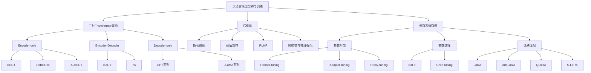

# 第十一章：大语言模型架构与训练：零基础完整讲解

> 来源：`第十一章-大语言模型架构.pptx`。本次提取到 156 页课件、761 个普通文本元素、3546 个底层 XML 文本节点、63 页有效备注讲稿，并导出 156 张幻灯片截图进行视觉核对。本讲义按 PPT 顺序重构，目标是让零基础同学不仅“知道名词”，而且能理解每个架构为什么这样设计、适合什么任务、代价在哪里。

## 0. 这一章到底讲什么

这一章的主线是：

1. 大语言模型为什么基本都建立在 Transformer 之上。
2. Transformer 为什么能分化出三种主流架构：`Encoder-only`、`Encoder-Decoder`、`Decoder-only`。
3. 三种架构的注意力矩阵有什么不同，以及这种不同为什么会决定模型适合做什么任务。
4. 典型模型如何沿着三种架构发展：BERT、RoBERTa、ALBERT、BART、T5、GPT、LLaMA。
5. 预训练之后为什么还需要“后训练”：让模型从“会接龙”变成“会说话、说好话、会推理”。
6. 大模型太大，为什么不能总是全量微调，以及参数高效微调 PEFT 如何降低成本。

先用一句话抓住全章：

**大语言模型的核心问题不是“模型越大越好”这么简单，而是：用什么架构让模型学语言，用什么训练方式让模型会回答，用什么微调方法让模型低成本适配新任务。**

## 1. 先补齐零基础概念

### 1.1 什么是 Token

大语言模型不能直接理解“汉字”“英文句子”这种人类形式。它会先把文本切成一个个单位，这些单位叫 `Token`。

例如：

- 中文句子“今天天气怎么样？”可能被切成“今天 / 天气 / 怎么样 / ？”之类的 token。
- 英文句子“How is the weather today?” 可能被切成“How / is / the / weather / today / ?”。
- 实际模型的分词可能更细，有时一个词会被拆成几个子词。

你可以把 token 理解为“模型阅读文本时看到的最小积木块”。

### 1.2 什么是 Embedding

模型不能直接计算文字，所以每个 token 会被转换成一个数字向量，这叫 `Embedding`，中文常译为“嵌入向量”或“词嵌入”。

例如“猫”这个 token 可能变成一个长度为 768 的向量：

```text
猫 -> [0.12, -0.03, 0.87, ..., 0.44]
```

这些数字不是随便写的，它们会在训练中学出来。理想情况下，意思相近的 token 在向量空间里也会比较接近。

### 1.3 什么是位置编码

Transformer 本身不像 RNN 那样天然按顺序读句子，所以它需要额外告诉模型每个 token 的位置。

例如：

```text
我   喜欢   你
第1位 第2位 第3位
```

如果没有位置信息，模型可能很难区分“我喜欢你”和“你喜欢我”。这就是位置编码存在的原因。

课件后面提到 LLaMA 使用 `RoPE`，也就是旋转位置编码，它是位置编码的一种更适合长序列建模的形式。

### 1.4 什么是注意力机制

注意力机制回答的问题是：**当前 token 在理解自己时，应该参考哪些其他 token？参考多少？**

例如句子：

```text
小明把书放进书包，因为它很重。
```

“它”到底指“书”还是“书包”？模型需要看上下文。注意力机制会让“它”去关注前面的词，并判断哪个词更相关。

课件中反复提到“注意力矩阵”。你可以把它想成一个表格：

- 行：当前正在处理的 token。
- 列：它可以看的其他 token。
- 表格里的数值：当前 token 对其他 token 的关注程度。

### 1.5 什么是“完全注意力”和“下三角注意力”

这一章最重要的直觉之一就是注意力矩阵的区别。

**完全注意力**：每个 token 都能看见整个输入序列，包括左边和右边。

例如输入：

```text
x1 x2 x3 x4
```

当模型处理 `x2` 时，可以看 `x1`，也可以看 `x3`、`x4`。这种机制适合理解一句完整的话。

**下三角注意力**：每个 token 只能看见自己之前的 token，不能偷看未来。

例如生成：

```text
y1 y2 y3 y4
```

当模型生成 `y3` 时，只能看 `y1`、`y2`，不能看 `y4`。这是因为生成文本时，未来的词本来还没有生成出来。

所以：

- `Encoder-only` 主要使用完全注意力。
- `Decoder-only` 主要使用下三角注意力。
- `Encoder-Decoder` 同时包含完全注意力、下三角注意力和交叉注意力。

### 1.6 什么是自回归

`自回归`就是“一个接一个生成”：先根据已有内容预测下一个 token，再把这个 token 放回上下文里，继续预测下一个。

例如：

```text
输入：今天天气
预测：很
继续：今天天气很
预测：好
继续：今天天气很好
```

GPT、LLaMA 这类 `Decoder-only` 模型就是典型自回归模型。

### 1.7 什么是 logits、softmax 和采样

模型在生成下一个 token 时，不是直接吐出一个词，而是先给词表里每个 token 打分。这些原始分数叫 `logits`。

然后用 `softmax` 把 logits 变成概率分布：

```text
“好”：0.45
“坏”：0.05
“热”：0.20
“冷”：0.10
...
```

最后模型从这个概率分布中选择或采样一个 token 输出。

后面讲 `Proxy-tuning`、`S-LoRA`、`QLoRA` 时，都会涉及“参数”“logits”“输出分布”这些概念。

## 2. 大语言模型的模型基础：Transformer

课件开头强调：**Transformer 灵活的并行架构为训练数据和参数的扩展提供了模型基础，推动了本轮大语言模型的发展。**

这句话可以拆成三层理解。

第一，Transformer 能并行训练。  
传统 RNN 往往要按顺序读文本，前一个词处理完才能处理下一个词。Transformer 的自注意力机制可以让一批 token 同时参与计算，更适合 GPU/TPU 并行。

第二，Transformer 能扩展参数规模。  
把更多 Transformer block 堆起来、把隐藏层维度做大、把注意力头数做多，就可以得到更大的模型。

第三，Transformer 能吃下更大规模数据。  
大语言模型变强的一个关键是数据资源和算力资源爆发。课件备注里说，随着数据资源和计算能力增长，语言模型参数规模和性能表现实现了质的飞跃，进入了大语言模型时代。

可以把 Transformer 类比成一种“标准化的语言建模发动机”。BERT、T5、GPT、LLaMA 虽然名字不同，但很多核心部件都来自 Transformer，只是选用了不同部分、注意力限制不同、训练目标不同。

## 3. 基于 Transformer 的三种主流架构

课件第 5 页给出三种架构：

| 架构 | 使用 Transformer 的哪一部分 | 代表模型 | 主要能力倾向 |
|---|---|---|---|
| `Encoder-only` | 只用 Encoder | BERT、RoBERTa、ALBERT | 理解、分类、判别 |
| `Encoder-Decoder` | Encoder 和 Decoder 都用 | T5、BART | 理解输入并生成输出 |
| `Decoder-only` | 只用 Decoder | GPT 系列、LLaMA 系列 | 自回归生成、对话、AIGC |

### 3.1 Encoder-only 架构

`Encoder-only` 只选取 Transformer 的编码器部分。课件说它包含三个部分：

1. 输入编码部分：将输入文本转化为向量序列。
2. 特征编码部分：进一步提取和深化文本特征。
3. 任务处理部分：根据任务需求生成输出。

零基础理解：

```text
输入文字 -> 分词 -> Embedding + 位置编码 -> 多层 Encoder -> 任务头 -> 输出
```

这里的“任务头”很重要。因为 Encoder-only 本身更像一个“理解器”，它会把输入文本变成上下文表示；至于最终做分类、判断、抽取，通常要在后面接一个专门的任务模块。

例如：

- 情感分类：接一个分类头，输出“积极/消极”。
- 文本匹配：接一个匹配头，输出“两句话是否相似”。
- 命名实体识别：对每个 token 输出标签。

`Encoder-only` 的关键优势是完全注意力。每个 token 都能看见整句的前后文，因此非常适合自然语言理解任务。

它的关键短板是：没有天然的解码器，不擅长一步步生成长文本。

### 3.2 Decoder-only 架构

`Decoder-only` 选取 Transformer 的解码器部分。课件强调它的核心特点：**省略了每个解码模块中的交叉注意力子模块。**

完整流程是：

```text
输入文本 -> 输入编码 -> 特征解码 -> 输出生成 -> 概率分布 -> 采样 token
```

它使用掩码自注意力，也就是下三角注意力。模型生成当前 token 时只能看前面的 token，不能看未来。

这种设计非常适合“接龙式”的语言建模：

```text
用户：请写一段介绍深度学习的话。
模型：深度学习是机器学习的一个重要分支...
```

课件第 51 页解释为什么开放式生成任务中不一定需要完整 Encoder：很多输入很简单或不明确，如果还维护一个完整编码器，可能像“大炮打蚊子”，性价比不高。

Decoder-only 的两个优势：

1. 模型更轻量：去掉编码器，减少一部分计算复杂度。
2. 可扩展性更强：结构简单，更容易通过堆叠参数、数据和算力提升生成质量。

### 3.3 Encoder-Decoder 架构

`Encoder-Decoder` 同时使用编码器和解码器，并通过交叉注意力让二者交互。

它的直觉是：

```text
Encoder：先完整理解输入
Decoder：再根据理解结果逐步生成输出
```

例如机器翻译：

```text
输入：今天天气怎么样？
Encoder：理解整句中文意思
Decoder：逐步生成 How is the weather today?
```

课件说完整架构共包含五个部分，可以理解为：

1. 输入编码。
2. 编码器特征编码。
3. 输出编码。
4. 解码器特征解码。
5. 输出生成。

Encoder-Decoder 里面有三种注意力：

| 注意力模块 | 发生在哪里 | 作用 |
|---|---|---|
| 编码器自注意力 | Encoder 内部 | 输入 token 之间完全互相看，得到完整上下文理解 |
| 解码器掩码自注意力 | Decoder 内部 | 生成时只能看已生成 token，保持自回归 |
| 交叉注意力 | Decoder 看 Encoder | 生成时参考输入文本的完整语义 |

所以它特别适合“有条件生成”任务：翻译、摘要、问答、改写等。

### 3.4 三种架构的注意力矩阵对比

课件第 9 页是全章核心图之一。

`Encoder-only`：

```text
每个输入 token 都可以看所有输入 token
注意力形状：完全矩阵
能力倾向：深度理解
```

`Decoder-only`：

```text
每个输出 token 只能看自己之前的 token
注意力形状：下三角矩阵
能力倾向：顺序生成
```

`Encoder-Decoder`：

```text
Encoder 内部：完全注意力
Decoder 内部：下三角注意力
Decoder 对 Encoder：交叉注意力
能力倾向：理解输入后生成输出
```

### 3.5 三种架构的任务倾向

课件第 10-12 页比较了三种架构在判别任务和生成任务中的倾向。

`Encoder-only`：

- 优点：双向注意力能充分考虑前后文，捕捉丰富语义。
- 适合：情感识别、文本分类、自然语言理解。
- 问题：缺少解码器，无法直接输出长序列。

`Encoder-Decoder`：

- 优点：编码器理解输入，解码器生成输出。
- 适合：机器翻译、摘要、问答等有条件生成。
- 问题：多了编码器和解码器，训练与推理成本更高。

`Decoder-only`：

- 优点：大规模预训练数据加持下能生成高质量连贯文本。
- 适合：开放式生成、对话、AIGC。
- 问题：在模型规模较小时，缺少编码器双向上下文，理解复杂输入可能不如 Encoder-Decoder。

### 3.6 架构主流趋势

课件第 13 页说，大语言模型架构经历了：

```text
Encoder-only -> Encoder-Decoder -> Decoder-only
```

Decoder-only 逐渐成为主流。

但课件第 14 页也提醒：Decoder-only 目前是主流，但 Encoder-only 和 Encoder-Decoder 仍然有重要应用价值，最终哪种架构问鼎也尚无定论。

这很重要：不要把“当前流行”误解为“其他架构没用”。不同架构是为不同任务和成本权衡服务的。

## 4. Encoder-only 代表模型：BERT、RoBERTa、ALBERT

### 4.1 BERT 是什么

BERT 属于 `Encoder-only` 架构。课件说：BERT 模型结构与 Transformer 中的编码器几乎一致，只是规模不同。

BERT 有两个经典版本：

| 模型版本 | 编码模块数量 | 隐藏层维度 | 自注意力头数量 | 总参数量 |
|---|---:|---:|---:|---:|
| BERT-Base | 12 | 768 | 12 | 1.1 亿 |
| BERT-Large | 24 | 1024 | 16 | 3.4 亿 |

零基础理解这些数字：

- 编码模块数量：堆了多少层 Encoder block。越多越深。
- 隐藏层维度：每个 token 的向量有多宽。越大表达能力越强。
- 自注意力头数量：模型同时从多少个角度看上下文。
- 参数量：模型内部可学习数字的总数。

### 4.2 BERT 的预训练数据

课件第 18 页：

- BookCorpus：小说数据集，约 8 亿 token。
- 英语维基百科：约 25 亿 token。
- 总计：约 33 亿 token，约 15GB 数据。

BERT 不是靠人工给每句话打标签学语言，而是先在大规模文本上做预训练，让模型学到语言规律。

### 4.3 BERT 的两个预训练任务

课件第 19 页讲了两个任务。

第一，`MLM`，Masked Language Model，掩码语言建模。  
把句子里一些 token 遮住，让模型根据前后文猜出来。

例如：

```text
输入：我今天去 [MASK] 吃饭。
模型要猜：[MASK] 可能是“学校”“食堂”“外面”等。
```

由于 Encoder-only 能看前后文，所以非常适合这种“完形填空”式任务。

第二，`NSP`，Next Sentence Prediction，下文预测。  
判断两个句子是否连续。

例如：

```text
句子 A：我打开了冰箱。
句子 B：里面有一瓶牛奶。
```

模型要判断 B 是否可能是 A 的下一句。

### 4.4 RoBERTa 为什么出现

课件第 20 页说：RoBERTa 是为了解决 BERT 训练不充分的问题。

RoBERTa 的改进方向：

- 使用更大数据集。
- 更长训练时间。
- 更细致的训练任务和超参数调整。
- 从静态 mask 改为动态 mask。
- 移除 NSP 任务。

对比：

| 模型 | 数据规模 | Mask 方式 | NSP |
|---|---:|---|---|
| BERT | 约 15GB | 静态 Mask | 添加 NSP |
| RoBERTa | 约 160GB | 动态 Mask | 移除 NSP |

### 4.5 RoBERTa 的模型结构

课件第 21 页：RoBERTa 在模型结构上与 BERT 基本一致，也是多个编码模块堆叠。

RoBERTa 也有两个版本：

- RoBERTa-Base：基本对标 BERT-Base。
- RoBERTa-Large：基本对标 BERT-Large。

所以 RoBERTa 的关键不是“换了新架构”，而是“更充分地训练 BERT 类架构”。

### 4.6 RoBERTa 的预训练数据

课件第 22 页：

- 在 BERT 基础上添加 CC-News：约 76GB 新闻文章。
- OpenWebText：约 38GB 网页文本。
- Stories：约 31GB 故事文本。
- 总数据量约 160GB。

数据量从 15GB 到 160GB，是非常显著的提升。

### 4.7 静态 Mask 与动态 Mask

课件第 23 页的核心是：

静态 Mask：先对整份数据随机遮盖，保存成训练数据。之后每次训练看到的遮盖位置基本固定。

动态 Mask：数据输入模型前再随机遮盖。模型每次可能看到不同遮盖位置。

例子：

```text
原句：We arrived at the airport in time.
静态 Mask：每次都可能固定遮 airport 和某个词。
动态 Mask：这次遮 arrived 和 airport，下次可能遮 time 和 at。
```

动态 Mask 的好处是训练多样性更高，模型能学习更丰富的上下文信息。

### 4.8 RoBERTa 的优缺点

课件第 24 页：

优点：

- 训练更充分。
- 泛化能力更强。
- 在文本分类、情感分析、问答系统等任务中表现好。

缺点：

- 训练时间更长。
- 训练成本更大。

### 4.9 ALBERT 为什么出现

课件第 25 页：ALBERT 是 Google 团队提出的更轻量化 BERT 模型。

它的目标是提高训练和推理效率。模型结构基本不变，但通过两种方法显著降低参数量：

1. 参数因子分解。
2. 跨层参数共享。

### 4.10 Encoder-only 模型的参数来源

课件第 26 页说，对于 Encoder-only 架构：

- 词嵌入矩阵约占整体参数量 20%。
- Encoder 块约占整体参数量 80%。

所以 ALBERT 分别针对这两大来源做优化。

### 4.11 参数因子分解

课件第 27 页讲 Embedding 模块的参数因子分解。

原始 embedding 矩阵大致是：

```text
词表大小 V × 隐藏层维度 H
```

如果词表约 3 万，隐藏层维度 768，那么参数很多。

ALBERT 的做法是加一个中间维度 E：

```text
V × E  +  E × H
```

如果 E 比 H 小很多，参数量就明显下降。课件备注提到这种方式可以减少接近七倍的相关参数。

直觉：  
原来一步把 token 直接映射到很宽的隐藏向量，现在先映射到较小空间，再映射到隐藏空间。

### 4.12 跨层参数共享

课件第 28 页：对于 Attention 与 FFN 模块，ALBERT 采用跨层参数共享。

普通 BERT：

```text
第1层有自己的参数
第2层有自己的参数
...
第12层有自己的参数
```

ALBERT 的思想：

```text
多层复用同一套参数
```

这样参数量会明显减少。

代价是：不同层的表达差异可能被压缩，因此在某些任务上效果不一定总是更好。

### 4.13 ALBERT 的预训练任务

课件第 29 页：

- 数据集与 BERT 完全相同。
- 保留 MLM。
- 将 NSP 替换为 SOP，Sentence Order Prediction，句序预测。

SOP 是判断两个句子是正序还是倒序。

例如：

```text
正序：我打开门。然后走进房间。
倒序：然后走进房间。我打开门。
```

SOP 相比 NSP 更关注句子之间的连贯顺序。

### 4.14 ALBERT 的优缺点

课件第 30 页：

优点：

- 轻量级。
- 参数量小。
- 训练速度快。

缺点：

- 在某些特定任务上表现不如 BERT。

### 4.15 Encoder-only 总结

课件第 31-32 页总结：

优势：

- 得益于全面注意力机制。
- 双向编码融合从左往右和从右往左的信息。
- 能充分捕捉每个 token 的上下文。
- 在需要深度理解的任务中能力突出。

问题：

- 模型体量相对没有向超大规模突破。
- 主要专注判别任务。
- 难以应对生成式任务。
- 在生成式人工智能中发挥作用相对有限。

一句话记忆：

**Encoder-only 像一个阅读理解高手，擅长看完整文本后做判断，但不是最自然的长文本生成器。**

## 5. Encoder-Decoder 代表模型：BART 与 T5

### 5.1 Encoder-Decoder 的基本思想

课件第 34 页说：Encoder-Decoder 在 Encoder-only 基础上添加 Decoder，使其能生成连贯输出，从而缓解 Encoder-only 在生成式任务上的局限。

流程：

```text
输入文本 -> 编码器理解输入 -> 解码器生成输出 -> 输出文本
```

这类模型非常适合：

- 翻译。
- 摘要。
- 问答。
- 改写。
- 对话系统。

### 5.2 编码器和解码器分别包含什么

课件第 35 页：

编码器：

- 多个编码模块堆叠。
- 将输入序列转变为上下文向量。
- 包含自注意力模块和全连接前馈模块。

解码器：

- 多个解码模块堆叠。
- 基于上下文向量自回归生成输出序列。
- 包含自注意力模块、交叉注意力模块、全连接前馈模块。

### 5.3 三种注意力模块再次解释

课件第 36-38 页强调 Encoder-Decoder 中的三种注意力。

1. 编码器自注意力：输入内部互相看，保证输入理解充分。
2. 解码器自注意力：输出内部只看过去，保证生成顺序合法。
3. 交叉注意力：解码器看编码器输出，保证生成内容与输入相关。

为什么交叉注意力重要？

如果没有交叉注意力，解码器可能只是在“自说自话”。有了交叉注意力，模型生成每个词时都能参考输入文本的全局上下文。

### 5.4 BART 是什么

课件第 39 页：

BART，全称 `Bidirectional and Auto-Regressive Transformers`，由 Meta AI 研究院在 2019 年提出，是 Encoder-Decoder 架构模型。

目标：

- 提升文本生成任务表现。
- 提升文本理解任务表现。
- 通过多样化预训练任务学习文本结构和语义。

### 5.5 BART 模型结构

课件第 40 页：

BART 与原始 Transformer 模型相同，包含编码器和解码器。

| 模型版本 | 编码/解码模块数量 | 隐藏层维度 | 自注意力头数量 | 总参数量 |
|---|---:|---:|---:|---:|
| BART-Small | 6 | 768 | 12 | 1.4 亿 |
| BART-Base | 12 | 1024 | 16 | 4 亿 |

### 5.6 BART 的破坏文本重建任务

课件第 41 页说，BART 使用与 RoBERTa 相同的语料库，并提出五项破坏文本重建任务。

备注里列出五种：

1. `Token Masking`：随机把 token 替换为 `[MASK]`，类似 BERT。
2. `Token Deletion`：随机删除 token。
3. `Text Infilling`：随机选择连续 token 片段 span，用一个 `[MASK]` 替换；span 长度服从泊松分布。span 长度为 0 时相当于插入一个 `[MASK]`。
4. `Sentence Permutation`：打乱一个 document 中的句子顺序。
5. `Document Rotation`：从 document 中随机选一个 token，让它成为开头，相当于旋转文档。

这些任务的共同点是：

```text
先破坏文本 -> 再让模型恢复原文
```

这会迫使模型既理解整体结构，也学会生成修复后的文本。

### 5.7 BART 的应用

课件第 42 页：

通过下游微调，BART 可以适配很多 NLP 任务：

- 文本翻译模型。
- 对话系统模型。
- 情感分析模型。
- 其他任务。

它的思路是：

```text
BART 原始模型 -> 预训练后模型 -> 针对具体任务微调
```

### 5.8 T5 是什么

课件第 43 页：

T5，全称 `Text-to-Text Transfer Transformer`，由 Google 探索，是一种把各种 NLP 任务统一成“文本到文本”的范式。

传统做法：

- 翻译任务训练一个翻译模型。
- 摘要任务训练一个摘要模型。
- 情感分类训练一个分类模型。

T5 的做法：

```text
所有任务都变成：输入一段文本，输出一段文本
```

关键技巧是构造输入前缀。

例如：

```text
翻译成英文：今天天气怎么样？
输出：How is the weather today?

总结以下内容：随着全球气候变暖，极端天气...
输出：全球变暖导致极端天气增加。
```

这就是课件说的“一模型多用”。

### 5.9 T5 模型规模

课件第 44 页：

| 模型版本 | 编码/解码模块数量 | 隐藏层维度 | 自注意力头数量 | 总参数量 |
|---|---:|---:|---:|---:|
| T5-Small | 6 | 512 | 8 | 6000 万 |
| T5-Base | 12 | 768 | 12 | 2.2 亿 |
| T5-Large | 24 | 1024 | 16 | 7.7 亿 |
| T5-3B | 24 | 1024 | 32 | 28 亿 |
| T5-11B | 24 | 1024 | 128 | 110 亿 |

### 5.10 T5 预训练数据 C4

课件第 45 页：

Google Research 团队对 Common Crawl 大规模网页数据进行清洗和过滤，生成了约 750GB 的 C4 数据集。

C4 全称：

```text
Colossal Clean Crawled Corpus
```

可以理解为：

- Common Crawl 是原始网页大矿山。
- C4 是清洗、过滤后的高质量训练语料。

### 5.11 T5 的 Span Corruption 任务

课件第 46 页：

T5 提出 `Span Corruption` 作为预训练任务。每次选择连续几个 token 作为一个小段 span 进行掩码，让模型以完形填空形式复原。

例如：

```text
原始文本：我认为这本小说非常不错。
输入：我认为 <X> 非常不错。
目标：<X> 这本小说 <Z>
```

这里不是只遮一个 token，而是遮一段连续片段。

### 5.12 Token 掩码 vs Span 掩码

课件第 47 页：

Token 级别掩码：

- 遮单个 token。
- 更像猜单词。

Span 级别掩码：

- 遮短语、子句等连续片段。
- 能覆盖更完整的语义单元。
- 更能学习句子结构和上下文复杂依赖。

例如：

```text
Token 掩码：我认为这本 [MASK] 非常不错。
Span 掩码：我认为 [MASK] 非常不错。
```

后者可能要求模型恢复“这本小说”，难度更高，也更接近真实文本生成。

### 5.13 T5 的下游任务

课件第 48 页用 Prompt 工程展示 T5 如何在架构不变的情况下适配任务：

- 翻译：`把中文翻译成英文：你真棒。` -> `You are great.`
- 情感识别：`你这次的作业完成地很不错。` -> `积极情感`
- 语义相似度：句子一“你真棒”，句子二“你很不错” -> `0.913`
- 总结：长句 -> `你非常出色，继续加油！`

所以 T5 的核心价值不是发明了全新 Transformer 部件，而是把任务接口统一了。

### 5.14 Encoder-Decoder 架构总结

课件第 49 页：

基于 Encoder-Decoder 架构的大语言模型，在模型结构和参数规模双重优势下，不仅有强大的语言理解能力，也在生成任务中表现良好。

课件列出的代表模型：

| 模型 | 发布时间 | 参数量 | 语料规模 |
|---|---|---:|---:|
| T5 | 2019.10 | 0.6-110 亿 | 750GB |
| mT5 多语言版本 | 2020.10 | 3-130 亿 | 9.7TB |
| T0 更强零样本能力 | 2021.10 | 30-110 亿 | 约 400GB |
| BART | 2019.10 | 1.4-4 亿 | 约 20GB |
| mBART 多语言版本 | 2020.06 | 0.4-6.1 亿 | 约 1TB |

一句话记忆：

**Encoder-Decoder 像一个“先读题、再作答”的学生，适合输入明确、输出也需要生成的任务。**

## 6. Decoder-only 代表模型：GPT 与 LLaMA

### 6.1 为什么 Decoder-only 成为主流

课件第 51-52 页解释：

在开放式生成任务中，输入序列通常较简单或不明确。维护一个完整编码器要消耗大量参数和算力，有时并不必要。

Decoder-only 去掉编码器，有两个直接结果：

1. 模型轻量化：一定程度提升训练和推理速度。
2. 扩展性更强：结构简单，更容易扩大参数规模，提升生成质量和能力。

所以 GPT、LLaMA 等主流大语言模型大多采用 Decoder-only。

### 6.2 GPT 与 LLaMA 的路线差异

课件第 53 页：

GPT：

- 起步最早。
- 逐渐闭源。
- 做大模型。

LLaMA：

- 起步较晚。
- 坚持开源或开放权重生态。
- 更强调效率与数据质量。

### 6.3 GPT 系列总览

课件第 54 页：

GPT，全称 `Generative Pre-trained Transformer`，由 OpenAI 开发，是 Decoder-only 架构系列模型。

演进表：

| 模型 | 发布时间 | 参数量 | 语料规模 | 阶段 |
|---|---|---:|---:|---|
| GPT-1 | 2018.06 | 1.17 亿 | 约 5GB | 初出茅庐 |
| GPT-2 | 2019.02 | 1.24/3.55/7.74/15 亿 | 40GB | 小有所成 |
| GPT-3 | 2020.05 | 1.25/3.5/7.62/13/27/67/130/1750 亿 | 1TB | 崭露头角 |
| ChatGPT | 2022.11 | 未知 | 未知 | 一鸣惊人 |
| GPT-4 | 2023.03 | 未知 | 未知 | 大放异彩 |
| GPT-4o | 2024.05 | 未知 | 未知 | 大放异彩 |

### 6.4 GPT-1

课件第 55-57 页：

Transformer 的出现解决了 OpenAI 团队长期困扰的长距离依赖问题。与 BERT 同年，OpenAI 提出 GPT-1。

GPT-1 架构：

- 选取 Transformer 的 Decoder 部分。
- 省略交叉注意力模块。
- 由 12 个解码块堆叠。
- 每个解码块包含带掩码自注意力模块和全连接前馈模块。
- 与 BERT-Base 高度类似，但注意力机制不同。

BERT-Base vs GPT-1：

| 模型 | 注意力 |
|---|---|
| BERT-Base | 双向自注意力 |
| GPT-1 | 带掩码的单向自注意力 |

GPT-1 预训练：

- 使用 BookCorpus。
- 使用下一词预测任务。
- 不需要带标签数据。
- 能学到一定语言“常识”。

局限：

- 数据量和参数量有限。
- 泛化能力有限。
- 通常还需要针对特定任务做有监督微调。

### 6.5 GPT-2

课件第 58-60 页：

OpenAI 在 Decoder-only 路线上继续深耕，2019 年发布 GPT-2。

训练方式：

- 沿用下一词预测。
- 提升预训练数据数量和质量。
- 使用 WebText 数据集。
- WebText 包含 40GB 筛选和清洗过的网络文本。

重要变化：

完成预训练后，GPT-2 在某些任务上可以不微调直接推理。这增强了下游任务灵活性，降低了任务适配成本。

GPT-2 版本：

| 模型版本 | 解码模块数量 | 隐藏层维度 | 自注意力头数量 | 总参数量 |
|---|---:|---:|---:|---:|
| GPT-2 Small | 12 | 768 | 12 | 1.24 亿 |
| GPT-2 Medium | 24 | 1024 | 16 | 3.55 亿 |
| GPT-2 Large | 36 | 1280 | 20 | 7.74 亿 |
| GPT-2 XL | 48 | 1600 | 25 | 15 亿 |

### 6.6 GPT-3

课件第 61-63 页：

为了进一步提升泛化能力，OpenAI 增大模型和语料规模，于 2020 年 6 月推出 GPT-3。

GPT-3 最高参数量达到 1750 亿。庞大参数量能捕获更细微复杂的语言模式，显著提升文本生成能力。

GPT-3 版本：

| 模型版本 | 解码模块数量 | 隐藏层维度 | 自注意力头数量 | 总参数量 |
|---|---:|---:|---:|---:|
| GPT-3 Small | 12 | 768 | 12 | 1.25 亿 |
| GPT-3 Medium | 24 | 1024 | 16 | 3.5 亿 |
| GPT-3 Large | 24 | 1536 | 16 | 7.62 亿 |
| GPT-3 XL | 24 | 2048 | 24 | 13 亿 |
| GPT-3 2.7B | 32 | 2560 | 32 | 27 亿 |
| GPT-3 6.7B | 32 | 4096 | 32 | 67 亿 |
| GPT-3 13B | 40 | 5120 | 40 | 130 亿 |
| GPT-3 175B | 96 | 12288 | 99 | 1750 亿 |

GPT-3 的关键能力：`ICL`，In-Context Learning，上下文学习。

它只通过输入中的任务描述和少量示例，就能快速适应新任务。

Zero-shot：

```text
只给任务自然语言描述，不给示例。
```

Few-shot：

```text
给任务描述，再给少量示例。
```

这是一种非常重要的能力：模型参数不变，但通过上下文临时“学会”任务形式。

### 6.7 InstructGPT 与 RLHF

课件第 64-65 页：

在 GPT-3 基础上，OpenAI 推出一系列衍生模型：

- Codex：专注代码生成。
- WebGPT：能够网页检索。
- InstructGPT：具有良好指令跟随能力。

InstructGPT 的关键是引入 `RLHF`，Reinforcement Learning from Human Feedback，人类反馈强化学习。

目的：

```text
不只是让模型会续写文本，而是让模型更愿意按照用户指令回答。
```

### 6.8 ChatGPT、GPT-4、GPT-4o

课件第 66 页：

OpenAI 推出 ChatGPT，标志着 `LLMaaS`，LLM as a Service，大模型即服务模式出现。

特点：

- 用户可以通过网页或 API 调用模型。
- 不需要本地部署。
- GPT 系列逐渐闭源，主要通过 API 进行推理和微调。

课件第 67 页：

GPT-4 相比 ChatGPT：

- 更好理解复杂语境。
- 生成更连贯文本。
- 引入图文双模态支持。
- 扩展图像描述、视觉问答等应用。

课件第 68 页：

GPT-4o：

- 2024 年 5 月提出。
- 提升响应速度。
- 降低延迟。
- 增强多模态处理能力。
- 增强多语言支持能力。

### 6.9 LLaMA 系列总览

课件第 69 页：

LLaMA，全称 `Large Language Model Meta AI`，由 Meta AI 开发。模型权重在非商业许可证下开放，推动大语言模型的“共创”和知识共享。

课件第 70 页比较 GPT 与 LLaMA：

- GPT 升级主线：模型规模与预训练语料同步提升。
- LLaMA 主线：模型规模保持相对稳定，更专注提升预训练数据规模与质量。

课件表格：

| 模型 | 发布时间 | 参数量 | 语料规模 |
|---|---|---:|---:|
| GPT-1 | 2018.06 | 1.17 亿 | 约 5GB |
| GPT-2 | 2019.02 | 1.24/3.55/7.74/15 亿 | 40GB |
| GPT-3 | 2020.05 | 1.25/3.5/7.62/13/27/67/130/1750 亿 | 1TB |
| LLaMA-1 | 2023.02 | 67/130/325/652 亿 | 约 5TB |
| LLaMA-2 | 2023.07 | 70/130/340/700 亿 | 约 7TB |
| LLaMA-3 | 2024.04 | 80/700 亿 | 约 50TB |
| LLaMA-3.1 | 课件表格写作 2027.07，但同页上下文应理解为 2024 年 7 月的后续版本 | 80/700/4050 亿 | 约 50TB |

这里要注意：课件 XML 中 LLaMA-3.1 的时间出现 `2027.07`，但课件第 76 页正文写的是 LLaMA3 在 2024 年 4 月推出，随后 7 月推出 3.1 版本，因此这行更像课件笔误。

### 6.10 LLaMA1

课件第 71 页：

LLaMA1 受 Chinchilla 扩展法则“小模型 + 大数据”的指引，Meta AI 于 2023 年 2 月推出，目标是用大规模优质数据训练相对较小的模型。

课件第 72 页：

LLaMA1 采用与 GPT-1 同样的网络架构，但优化了三个模块：

1. 词嵌入模块：使用旋转位置编码 RoPE 替代绝对位置编码，提升模型对序列顺序的理解。
2. 注意力模块：借鉴 GPT-3 的 Pre-Norm 策略，对自注意力和前馈网络输入进行正则化。
3. 全连接前馈模块：将 Transformer 的 ReLU 激活函数替换为 SwiGLU。

LLaMA1 版本：

| 模型版本 | 解码模块数量 | 隐藏层维度 | 自注意力头数量 | 总参数量 |
|---|---:|---:|---:|---:|
| LLaMA1-7B | 32 | 4096 | 32 | 67 亿 |
| LLaMA1-13B | 40 | 5120 | 40 | 130 亿 |
| LLaMA1-32B | 60 | 6656 | 52 | 325 亿 |
| LLaMA1-65B | 80 | 8192 | 64 | 652 亿 |

### 6.11 LLaMA2

课件第 74 页：

2023 年 7 月，Meta AI 发布 LLaMA2。

改进：

- 优化和扩充训练数据。
- 引入 RLHF 训练范式。
- 结合拒绝采样进一步提升性能。

课件第 75 页：

LLaMA2 引入 `GQA`，Grouped Query Attention，分组查询注意力，来提升计算效率。

LLaMA2 版本：

| 模型版本 | 解码模块数量 | 隐藏层维度 | 自注意力头数量 | 总参数量 |
|---|---:|---:|---:|---:|
| LLaMA2-7B | 32 | 4096 | 32 | 67 亿 |
| LLaMA2-13B | 40 | 5120 | 40 | 130 亿 |
| LLaMA2-32B | 60 | 6656 | 52 | 340 亿 |
| LLaMA2-70B | 80 | 8192 | 64 | 700 亿 |

### 6.12 LLaMA3 与 LLaMA3.1

课件第 76 页：

2024 年 4 月，Meta AI 推出 LLaMA3。

特点：

- 训练数据规模是上一代的七倍。
- 数据多样性更高。
- 覆盖范围更广。
- 80 亿参数版本也展示出超越第二代最大版本的性能。
- 随后 7 月推出 3.1 版本，最大规模扩大到 4050 亿参数。

参数对比：

| 模型版本 | 总参数量 |
|---|---:|
| LLaMA2-7B | 67 亿 |
| LLaMA2-13B | 130 亿 |
| LLaMA2-32B | 340 亿 |
| LLaMA2-70B | 700 亿 |
| LLaMA3-8B | 80 亿 |
| LLaMA3-70B | 700 亿 |
| LLaMA3.1-8B | 80 亿 |
| LLaMA3.1-70B | 700 亿 |
| LLaMA3.1-405B | 4050 亿 |

课件第 77 页用直观类比说明 405B 之大：

- 参数量：AlphaGo 参数量约 0.065B，LLaMA3.1 405B 约相当于 6000 多个 AlphaGo。
- 数据量：LLaMA3.1 405B 训练数据约 15 万亿 token；一部《四库全书》约 3 亿 token，约等于 50000 套《四库全书》。
- 计算量：训练计算量约 3930 万个 H100 GPU 小时。如果换成个人电脑运行，超过 500000 年。

### 6.13 LLaMA 衍生模型

课件第 78 页：

LLaMA 开源共享吸引研究者继续创作，形成多样生态。

三类衍生模型：

1. 性能改进类模型：深入微调，提升通用任务性能，如 Alpaca、Vicuna。
2. 垂域任务类模型：在特定领域微调，增强垂域能力，如 CodeLLaMA、FinLLaMA。
3. 多模态任务类模型：整合视觉等编码器，扩展到多模态任务，如 LLaVA、MiniGPT4。

### 6.14 Decoder-only 总结

课件第 79 页：

基于 Decoder-only 架构的模型凭借卓越生成能力，引领 AIGC 浪潮。随着算力和数据资源进一步丰富，这一架构将继续释放潜力。

一句话记忆：

**Decoder-only 像一个特别强的续写器：只看已经出现的内容，一步步生成后续；当数据和参数足够大时，它会表现出对话、推理、写作、代码等广泛能力。**

## 7. 后训练：从“会接龙”到“会说话、说好话、会思考”

### 7.1 为什么预训练后还需要后训练

课件第 81 页用一个例子说明：

只接受“接龙训练”的模型，可能会产生复读机效应。

示例问题：

```text
孙悟空得了肾结石算不算怀孕？
```

未经良好指令微调的小模型可能回答：

```text
孙悟空得了肾结石算不算怀孕？我老婆得了肾结石，她现在在医院治疗...
```

它像是在续写网络文本，而不是认真回答问题。

这说明：

```text
会预测下一个 token != 会按人类方式回答问题
```

### 7.2 指令微调：让模型“会说话”

课件第 82 页：

可以通过指令微调让大模型“会说话”。指令微调就是构造“说话秘籍”，然后对大模型进行监督学习。

形式类似：

```text
问：生鱼片算不算死鱼片？
答：生鱼片是指生鱼制作的片状食材，虽然鱼已经被宰杀，因此它确实是“死鱼”，但“生”指鱼肉未经烹饪或加热处理，保持原始生鲜状态。

问：等红灯算不算等绿灯？
答：……
```

微调后，模型遇到“孙悟空得了肾结石算不算怀孕？”就更可能回答：

```text
孙悟空是《西游记》中的虚构角色，他没有实际身体，所以不能怀孕；肾结石是人体内的一种疾病，与孙悟空无关。
```

### 7.3 “会说话”不等于“说好话”

课件第 83 页：

指令微调后的模型仍可能不符合人类意图或价值观。

同一个问题，如果用户加上“battle 一下”，模型可能输出攻击性强、冒犯性强的内容。它虽然“会说话”，但不一定“说好话”。

这引出价值对齐。

### 7.4 价值对齐与 3H 原则

课件第 84 页：

不说“好话”可能产生社会伦理风险，甚至带来 X-Risk。因此需要对大模型进行人类价值对齐。

人工智能 3H 原则：

| 英文 | 中文 | 含义 |
|---|---|---|
| Helpful | 有用 | 能解决用户问题 |
| Honest | 诚实 | 不胡编、不误导 |
| Harmless | 无害 | 不产生伤害性、危险性输出 |

价值对齐不是让模型“只说好听的话”，而是让模型的输出更符合人类安全、伦理和任务目标。

### 7.5 奖励模型：打造“价值判官”

课件第 85 页：

对齐第一步：人类对不同答案给出标注，训练奖励模型，蒸馏人类价值观，打造“价值判官”。

同一个问题，可能有不同回答：

- 回答 1：粗暴辱骂，给 1 分。
- 回答 2：脑洞式胡说，给 6 分。
- 回答 3：区分“神话脑洞娱乐”和“常识逻辑”，既回答问题又保持严谨，给 9 分。

奖励模型学会：

```text
什么答案更符合人类偏好
```

### 7.6 RLHF：把偏好注入模型

课件第 86 页：

对齐第二步：通过强化学习将人类价值偏好注入模型。

ChatGPT 强化学习中会用到：

- 待对齐模型。
- 奖励模型。
- 批判模型。

直觉流程：

1. 待对齐模型生成回答。
2. 奖励模型给回答打分。
3. 强化学习算法根据分数更新模型，让它更倾向于生成高分回答。

这就是 `RLHF` 的核心。

### 7.7 System 1 与 System 2

课件第 87 页：

思维过程可以分为两类：

| 类型 | 特点 |
|---|---|
| System 1 | 无意识、快速、联想式、自动化、直觉与本能 |
| System 2 | 需要努力、缓慢、逻辑性强、不易完成、理性思维 |

“会说话、说好话”更多解决 System 1 层面的回答风格和价值对齐。

但复杂数学、代码、逻辑题，需要 System 2 式推理。

### 7.8 思维链 Chain of Thought

课件第 88-89 页：

System 2 思维过程需要一条串联中间推理步骤的“思维链”。

提示语：

```text
Let's think step by step.
请一步步思考。
```

给出中间步骤可以一定程度提升复杂推理能力。

例子：

```text
1 + 2 + 2 + 3 + 4 + 5 + 6 + 7 + 9 = ?
```

如果模型不写步骤，容易算错；如果逐步计算，更可能得到正确结果。

### 7.9 从外部提示到内部学习

课件第 90-92 页：

问题：模型 System 2 思维能力有限，自行思考能力有限。

一种方法：给出思维链参考示例，引导模型思考。

但参考示例难构建，于是进一步的问题是：

```text
能不能把 System-2 思维过程学习到模型内部？
```

课件第 92 页讲到：诱导大模型尽量多输出思考过程，用强化学习把思维链刻进模型“骨子里”。

示例格式：

```text
<think>
这里写推理过程
</think>
<answer>
这里写最终答案
</answer>
```

### 7.10 DeepSeek R1 与 GRPO

课件第 93-95 页：

DeepSeek R1 的强化学习方法 `GRPO`，课件描述为“不做批判思维，直接干中学”。

训练题型包括：

- 数学题。
- 代码题。
- 逻辑题。

模型对同一道题生成多个答案：

```text
答案1
答案2
答案3
...
```

然后根据相对奖励更新。

课件列出的奖励重点：

1. 答案正确性。
2. 是否在思考，也就是是否把思考过程写在 `<think>` 标签之间。

课件第 94 页说 DeepSeek R1 成为 System 2 思维的强者，甚至出现 “Aha Moment”。第 95 页提到其训练成本、团队规模和性能对比优势。

零基础理解：

```text
普通后训练：让模型更像一个礼貌、有用的助手。
推理强化训练：让模型更像一个愿意打草稿、会检查、能多步推理的解题者。
```

## 8. 参数高效微调：为什么不能总是全量微调

### 8.1 全量监督微调的挑战

课件第 97 页：

全量监督微调需要更新所有模型参数。面对参数量庞大的大模型时，会消耗大量存储和计算资源。

两个主要问题：

1. GPU 内存不足。
2. 全量微调效率低。

例如一个 70B 模型，如果每个参数都要存权重、梯度、优化器状态，显存需求会非常高，普通消费级 GPU 很难承受。

### 8.2 什么是 PEFT

课件第 98 页：

`PEFT`，Parameter-Efficient Fine-Tuning，参数高效微调。

核心思想：

```text
不要更新全部参数，只更新很少一部分参数。
```

对比：

| 方法 | 更新哪些参数 |
|---|---|
| 全量微调 | 更新所有模型参数 |
| PEFT | 仅更新部分模型参数或新增小模块 |

目标：

- 保证微调性能尽量不下降。
- 显著减少更新参数数量。
- 降低计算开销和存储开销。

### 8.3 PEFT 的三大优势

课件第 99 页：

1. 计算效率高：减少训练时计算资源需求和计算时间。
2. 存储效率高：只保存少量微调参数，降低存储空间。
3. 适应性强：无需重新训练整个模型，可快速适应不同任务。

### 8.4 显存占用对比

课件第 100 页给出全量微调与 LoRA 的显存对比：

| 模型大小 | 全量微调 | 参数高效微调 LoRA |
|---|---:|---:|
| 7B BF16 | 60GB | 16GB |
| 13B BF16 | 120GB | 32GB |
| 30B BF16 | 300GB | 64GB |

这张表说明：PEFT 不是小优化，而是让原本完全跑不动的训练变得可行。

### 8.5 存储效率

课件第 101 页：

PEFT 只需要保存部分微调参数，显著降低存储空间。

例子：

- Llama3 13B FP16 完整模型约 26GB。
- LoRA rank=32、作用于所有 MLP 层的参数可能小于 100MB。

直觉：

```text
全量微调：每个任务都保存一个完整大模型。
LoRA：共享一个底座模型，每个任务只保存一个小插件。
```

### 8.6 适应性强

课件第 102 页：

在 T5 上，LoRA 表现出更好可扩展性和任务性能。  
在 GPT-3 上，LoRA 在所有数据集上匹配或超过全量微调基线。

这说明 PEFT 并不是“便宜但很差”，在很多场景可以接近甚至超过全量微调。

### 8.7 PEFT 方法分类

课件第 103 页：

主流 PEFT 方法分三类：

1. 参数附加方法。
2. 参数选择方法。
3. 低秩适配方法。

后面逐个讲。

## 9. 参数附加方法

### 9.1 总体思路

课件第 105 页：

参数附加方法通过增加并训练新的附加参数或模块来微调大语言模型。

按附加位置分为三类：

| 类别 | 加在哪里 | 代表方法 |
|---|---|---|
| 加在输入 | 输入嵌入中 | Prompt-tuning |
| 加在模型 | 隐藏层中 | Prefix-tuning、Adapter-tuning |
| 加在输出 | 解码输出分布 | Proxy-tuning |

### 9.2 加在输入：Prompt-tuning

课件第 106 页：

加在输入的方法把额外参数附加到模型输入嵌入中，经典方法是 `Prompt-tuning`。

### 9.3 硬提示与软提示

课件第 107 页讲 `Soft Prompt`，软提示。

先区分两类 prompt：

硬提示 `Hard Prompt`：

```text
请把下面的中文翻译成英文：你真棒。
```

它是人类手写的离散文本。

软提示 `Soft Prompt`：

```text
不是人类可读文字，而是一组可训练的连续向量。
```

课件说软提示本质是：

- 可训练的。
- 连续的。
- 嵌入向量。
- 在训练过程中动态调整。

### 9.4 Prompt-tuning 怎么工作

课件第 108 页：

Prompt-tuning 引入软提示作为模型输入的一部分，与真实文本一起送入模型。微调过程中，只更新软提示参数。

形式：

```text
[软提示向量 P1, P2, ..., Pm] + [真实输入 token 向量 X1, X2, ..., Xn]
```

模型底座参数冻结，只训练这些 P。

这像是在模型前面放一段“不可见的任务说明”，让模型根据任务需要调整行为。

### 9.5 Prompt-tuning 的关键因素

课件第 109 页：

设置合适的软提示长度和合理初始化非常重要。

两个因素：

1. 提示长度：太短可能表达能力不足，太长可能训练困难或浪费参数。
2. 初始化方式：不同初始化会影响训练效果。

课件引用 Lester 等人 2021 年论文：`The Power of Scale for Parameter-Efficient Prompt Tuning`。

### 9.6 加在输入的优势

课件第 110 页：

1. 内存效率高：降低内存需求，使模型在有限硬件上处理更大数据集。
2. 多任务能力：每个任务存储特定提示模块，原始预训练模型可混合任务推理。
3. 缩放特性：随着参数量增加，微调性能逐渐增强，在 11B T5 上甚至接近全参微调性能。

### 9.7 加在模型：Prefix-tuning 与 Adapter-tuning

课件第 111 页：

加在模型的方法把额外参数或模型添加到预训练模型隐藏层中，经典方法有：

- Prefix-tuning。
- Adapter-tuning。

Prefix-tuning 可以理解为在每层注意力计算中加入可学习的前缀信息。课件主要展开 Adapter-tuning。

### 9.8 Adapter-tuning 是什么

课件第 112 页：

Adapter-tuning 通过在预训练语言模型的每个多头注意力层和全连接层后插入新的可学习神经网络模块来扩展模型。

这个新模块叫 `Adapter`，适配器。

直觉：

```text
原模型不动
在中间插入小模块
只训练小模块
```

### 9.9 Adapter 的瓶颈结构

课件第 113 页：

Adapter 通常采用瓶颈结构，包含：

1. 下投影层：把 d 维特征压缩到低维 r。
2. 非线性映射。
3. 上投影层：把 r 维再投影回 d 维。

参数量：

```text
2dr + d + r
```

其中：

- `d` 是原始隐藏维度。
- `r` 是瓶颈维度。
- 通过设置 `r << d`，可以大幅限制每个任务所需参数。

Adapter 也可以使用多个投影层、不同激活函数、不同初始化策略。

### 9.10 Adapter-tuning 的训练方式

课件第 114 页：

固定原始模型参数，只微调：

- 适配器参数。
- 层正则化参数。
- 最后的分类层参数。

这样可以大幅缩减微调参数量和计算量。

课件引用 Houlsby 等人 2019 年论文 `Parameter-efficient transfer learning for NLP`。

### 9.11 加在模型的优势

课件第 115 页：

1. 参数效率高：只有新增参数被更新，显著减少训练参数量。
2. 任务适应性强：如 Prefix-tuning 的前缀参数可针对不同任务定制。
3. 保持预训练知识：原始参数不变，减少遗忘。

课件还提到 Adapter-tuning 可将多个下游任务适配器参数结合，以融合多个任务知识。

### 9.12 加在输出：Proxy-tuning

课件第 116 页先提出两个问题：

1. 大规模模型微调困难：小模型如 Llama7B 用 PEFT 还能微调，但 Llama70B 即使用 PEFT 也难在普通消费级 GPU 上训练。
2. 黑盒模型：用户可能无法访问模型权重，无法传统微调。

课件第 117 页：

`Proxy-tuning`，代理微调，是一种轻量级的解码时算法。

特点：

- 只微调较小专家模型。
- 只需要访问大模型输出词汇表预测分布。
- 可实现对大规模语言模型的定制化调整。

### 9.13 Proxy-tuning 的机制

课件第 118-119 页：

给定：

- 待调整的大模型或代理模型 `M`。
- 较小的反专家模型 `M-`。
- 对 `M-` 微调后得到专家模型 `M+`。
- `M-` 与 `M+` 需要相同词汇表。

每个自回归生成时间步：

1. 获取专家模型 `M+` 的 logits。
2. 获取反专家模型 `M-` 的 logits。
3. 计算二者差异：`M+ - M-`。
4. 把这个差异加到目标模型 `M` 的下一个词 logits 分布中。
5. 用 softmax 归一化并采样下一个 token。

直觉：

```text
大模型原本想怎么说
+ 小专家学到的任务方向
- 反专家原本的普通方向
= 更符合目标任务的输出
```

### 9.14 加在输出的优势

课件第 120 页：

1. 轻松微调大规模语言模型：把小模型中学到的知识以解码时约束迁移到更大模型，降低微调 LLaMA-70B 等大模型的计算成本。
2. 能微调黑盒模型：只需要输出分布，不需要原始模型权重。

### 9.15 参数附加方法小结

课件第 121 页：

三种参数附加方式：

| 方法 | 核心 | 优势 |
|---|---|---|
| 加在输入 | 输入序列添加可学习张量 | 对模型结构修改小，灵活 |
| 加在模型 | 隐藏层插入新模块 | 保持原模型参数，泛化较好 |
| 加在输出 | 修改输出分布 | 可用更小代价驱动更大或黑盒模型 |

## 10. 参数选择方法

### 10.1 总体思路

课件第 123 页：

参数选择方法选择模型中的部分参数进行微调。

两类：

| 类别 | 方法依据 | 代表方法 |
|---|---|---|
| 基于规则 | 专家知识和经验 | BitFit |
| 基于学习 | 算法自动选择参数子集 | Child-tuning |

### 10.2 BitFit

课件第 124 页：

BitFit 是基于规则的方法代表。

它只优化：

- 神经网络每一层的偏置项 Biases。
- 任务特定分类头。

为什么偏置项也能有效？  
因为很多任务可能不需要大幅改变模型全部知识，只需要轻微调整每层输出的偏移方向。

### 10.3 BitFit 的优势与局限

课件第 125 页：

优势：

1. 参数效率高：偏置项只占模型总参数约 0.08%-0.09%。
2. 性能表现好：在 GLUE Benchmark 上可与全量微调相媲美，甚至某些任务更好。
3. 过程稳定：相比全量微调允许使用更大学习率，优化更稳定。

局限：

- 主要在 BERT、RoBERTa 等小规模模型上验证。
- 在更大规模模型上的性能尚不明确。

### 10.4 其他基于规则的方法

课件第 126 页：

Lee 等人的研究：

- 回答“需要微调最后多少层”的问题。
- 仅对 BERT 和 RoBERTa 最后四分之一层微调，就能达到完全参数微调 90% 的性能。

PaFi：

- 选择具有最小绝对值的模型参数作为可训练参数。
- 只微调这部分参数。
- 其他大部分参数保持不变。

### 10.5 Child-tuning

课件第 127-128 页：

Child-tuning 是基于学习的方法代表。

核心：

- 在训练过程中自动选择可训练参数子集。
- 通过梯度掩码矩阵策略，只对选中的子网络进行梯度更新。
- 屏蔽子网络以外的梯度。

直觉：

```text
不是整个大模型都长大，而是挑一个“子网络”重点培养。
```

### 10.6 其他基于学习的方法

课件第 129 页：

Fish-Dip：

- 类似 FishMask。
- 使用 Fisher 信息计算掩码。
- 掩码会在每个训练周期动态重新计算。

LT-SFT：

- 根据参数重要性，选择初始微调阶段变化最大的参数子集形成掩码。

SAM：

- 提出二阶逼近方法。
- 通过解析求解优化函数帮助决定参数掩码。

### 10.7 参数选择方法优缺点

课件第 130 页：

优点：

- 微调成本低：显著减少需要更新的参数，降低计算成本和内存需求。
- 适应性较好：适合资源受限或需要快速适应新任务的场景。

缺点：

- 难以选择最佳参数子集。
- 难以平衡更新参数数量与模型性能。

一句话：

**参数选择方法像“只改关键零件”，关键在于怎么知道哪些零件真关键。**

## 11. 低秩适配方法：LoRA 及其变体

### 11.1 低秩适配的基本思想

课件第 132 页：

低秩适配方法通过低秩矩阵近似原始权重更新矩阵，并仅微调低秩矩阵，从而大幅降低参数量。

先看全量微调：

```text
原始权重 W
微调后权重 W' = W + ΔW
```

全量微调要直接学习一个巨大的 `ΔW`。

LoRA 的想法是：  
不要直接学完整 `ΔW`，而是把它拆成两个小矩阵相乘。

```text
ΔW ≈ A B
```

如果 `A` 和 `B` 的中间秩 `r` 很小，参数量就会大幅减少。

### 11.2 本征维度假设

课件第 133 页：

本征维度假设：预训练语言模型微调时，只在一个低维子空间中进行参数更新，也能实现与完整参数更新类似的性能。

本征维度 `intrinsic dimension`：

```text
可以使模型达到预期效果的最小参数子空间维度。
```

怎么测量？

逐渐增加子空间维度，直到模型性能达到某个阈值，例如基线性能的 90%，此时的维度就是估计的本征维度。

直觉：

虽然模型有几十亿参数，但某个具体任务可能只需要在很小的方向上调整模型。

### 11.3 LoRA 的公式和位置

课件第 134 页：

LoRA 通常施加在 Attention 层或 FFN 层的投影矩阵上。

推理公式可写作：

```text
h = xW' = x(W + AB) = xW + xAB
```

其中：

- `W` 是冻结的原始权重。
- `A`、`B` 是低秩矩阵。
- 训练时只更新 `A`、`B`。

推理阶段，LoRA 可以直接合并回原模型：

```text
W' = W + AB
```

因此不会额外增加推理延迟。

### 11.4 LoRA 的效果

课件第 135 页：

LoRA 使用更少参数量，能达到匹配甚至超过全量微调的性能。课件展示了在 GPT-3 175B 上不同模型适配方法的性能对比，并引用 Hu 等人 2021 年 LoRA 论文。

这说明低秩更新不是简单“偷工减料”，而是抓住了微调任务的低维结构。

### 11.5 LoRA 性能影响因素

课件第 136 页：

LoRA 主要受三类因素影响：

1. 权重初始化。
2. 秩 `r`。
3. 施加位置。

### 11.6 LoRA 权重初始化

课件第 137 页：

通常：

- 投影矩阵 A 用高斯分布初始化。
- 投影矩阵 B 用 0 初始化。

这样做的原因：

- A 不会太大或偏移过强。
- B 为 0 时，一开始 `AB = 0`，模型初始行为等于原模型。
- 训练更稳定，避免刚开始就扰乱模型。

### 11.7 LoRA 的秩 r

课件第 138 页：

在简单任务中，较低秩就能保证不错性能。  
在跨领域迁移或复杂任务中，较高秩往往更好。

直觉：

```text
任务越复杂，需要调整的方向越多，r 可能要更大。
```

但 r 不是越大越好。r 越大，参数越多，成本也越高。

### 11.8 LoRA 施加位置

课件第 139 页：

同样参数预算下，LoRA 施加在不同权重矩阵上会产生不同影响。

课件结论：

1. 只微调一种权重矩阵时，某些位置效果最好。
2. 保持总参数量不变，微调矩阵种类越多，效果越好。

常见施加位置包括：

- 注意力中的 Q、K、V、O 投影。
- FFN 中的上投影、下投影、门控投影。

### 11.9 微调时内存占用

课件第 140 页：

微调内存占用包括四部分：

1. 权重内存：存模型参数。
2. 激活内存：前向传播中间结果。
3. 梯度内存：反向传播梯度。
4. 优化器内存：优化器状态，如 Adam 的一阶/二阶矩估计。

课件第 141 页给出 LLaMA2-7B、batch size 1、单张 RTX4090 24GB 的全量微调和 LoRA 微调对比：

| 内存位置 | 全量 / LoRA | LoRA 优化大小 |
|---|---:|---:|
| 权重内存 | 13GB / 14GB | -1GB |
| 激活内存 | 8GB / 9GB | -1GB |
| 梯度内存 | 15GB / 2GB | 13GB |
| 优化器内存 | 22GB / 1-2GB | 20-21GB |

注意：LoRA 主要省的是梯度内存和优化器内存，因为大部分原模型参数被冻结，不需要为它们保存梯度和优化器状态。

### 11.10 LoRA 的优势

课件第 142 页：

1. 参数效率：只微调低秩参数，降低训练计算成本，不增加推理延迟。
2. 插件化特性：训练后可将 LoRA 参数与模型参数分离，便于模型分享和服务。
3. 跨任务泛化：多个任务的 LoRA 插件可以组合，获得跨任务泛化能力。

### 11.11 LoRA 变体总览

课件第 143 页：

LoRA 变体从四个角度改进：

1. 性能改进。
2. 任务泛化。
3. 训练改进。
4. 推理改进。

课件后面具体讲 AdaLoRA、LoRAHub、QLoRA、S-LoRA。

### 11.12 AdaLoRA：性能改进

课件第 144 页：

AdaLoRA 发现：微调 Transformer 时，不同模块和层中的权重矩阵重要性不同。

预实验结论：

- 微调 FFN 层权重矩阵比微调 Attention 获得更好性能。
- 顶层权重矩阵比底层权重矩阵更重要。

普通 LoRA 通常均匀分配增量更新预算，忽略了这种差异。

课件第 145 页：

AdaLoRA 将参数更新矩阵参数化为奇异值分解 `SVD` 的形式，再通过奇异值剪枝动态调整不同模块中的 LoRA 秩。

核心直觉：

```text
重要模块给更高秩
不重要模块给更低秩
```

秩越大，代表该模块参数越重要。

### 11.13 LoRAHub：任务泛化

课件第 146-147 页：

LoRAHub 的目标：组合不同任务上训练的 LoRA 模块，提高模型对未见任务的适应性。

可行性来自：

- LoRA 是低秩的，存储占用小。
- LoRA 模块之间融合相对方便。
- 可以形成平台化的 LoRA 插件生态。

LoRAHub 包括：

1. 组合：把已有任务的 LoRA 插件组合。
2. 适应：针对新任务调整组合权重。

### 11.14 QLoRA：训练改进

课件第 148 页：

模型量化：把模型参数从高精度表示，如 16 位浮点数，转换为低精度表示，如 4 位整数。

量化能显著减少存储和计算成本，同时尽量保持性能。

反量化 Dequantization：

```text
训练计算时，有时需要把低精度参数还原到高精度表示参与计算。
```

课件第 149 页：

QLoRA 做法：

- 原始模型权重从 16-bit 量化为 4-bit 存储。
- LoRA 参数保持 16-bit。
- 前向和反向传播中，为保持性能，动态将模型参数反量化为 16-bit 参与计算。
- 计算后释放。

课件第 150 页：

QLoRA 使用 4-bit 可比 LoRA 节省约 60% 内存占用。

课件第 151 页：

在 RoBERTa-large 和 T5 的 GLUE benchmark 实验中，QLoRA 使用 4-bit 达到与 16-bit LoRA 和全量微调相近的性能。

一句话：

**LoRA 省微调参数，QLoRA 进一步把底座模型压到 4-bit 存储，让单卡微调更可行。**

### 11.15 S-LoRA：推理改进

课件第 152 页：

推理时，LoRA 参数可以合并到预训练模型参数中，避免额外开销。但如果有多个 LoRA 插件共同服务，合并方式会导致一次只能调用一个插件，GPU 利用率低、吞吐下降、延迟增加。

课件第 153 页：

S-LoRA 将输入与 LLM 和 LoRA 参数的运算分离，分别计算后求和得到最终结果。

好处：

- 不同 LoRA 请求可以放在同一个 batch 中。
- 增加并行度。
- 提升 GPU 利用率。

课件第 154 页：

S-LoRA 将 KVCache 扩展到 LoRA 参数，使用统一内存池管理 KVCache 和 LoRA。

内部采用页作为存储基本单位，并会预测下一个 batch 用到的 LoRA 进行预取，让计算和数据传输重叠。

课件第 155 页：

对于需要多块 GPU 的大语言模型，S-LoRA 进一步优化 LoRA 张量并行：

- 将预训练模型的 all-reduce 通信。
- 与 LoRA 的 all-gather 通信融合。
- 从而降低通信开销。

## 12. 三类 PEFT 方法总对比

| 类别 | 代表方法 | 改哪里 | 优点 | 难点 |
|---|---|---|---|---|
| 参数附加 | Prompt-tuning、Adapter、Proxy-tuning | 新增输入、隐藏层或输出侧参数 | 不动大部分原模型，模块化强 | 怎么设计附加位置和大小 |
| 参数选择 | BitFit、Child-tuning | 只选部分原参数更新 | 参数少、成本低 | 怎么选最关键参数 |
| 低秩适配 | LoRA、AdaLoRA、QLoRA、S-LoRA | 用低秩矩阵近似权重更新 | 当前非常常用，成本低、效果好 | 秩、位置、量化、推理服务需调优 |

## 13. 全章知识网络



## 14. 最容易混淆的概念

### 14.1 BERT 和 GPT 都是 Transformer，为什么差别这么大

因为它们用的注意力方向不同。

| 模型 | 架构 | 注意力 | 主要任务 |
|---|---|---|---|
| BERT | Encoder-only | 双向完全注意力 | 理解、分类 |
| GPT | Decoder-only | 单向下三角注意力 | 生成、对话 |

同样是 Transformer，拿不同部件、加不同 mask、用不同训练目标，就会形成不同能力。

### 14.2 Encoder-Decoder 和 Decoder-only 都能生成，区别是什么

Encoder-Decoder 是“先理解输入，再生成输出”。  
Decoder-only 是“根据已有上下文继续生成”。

如果任务强依赖输入，如翻译、摘要，Encoder-Decoder 很自然。  
如果任务是开放式对话、写作、代码，Decoder-only 更容易扩展成通用大模型。

### 14.3 预训练、指令微调、价值对齐有什么区别

| 阶段 | 目标 | 类比 |
|---|---|---|
| 预训练 | 学语言规律，预测下一个 token | 读海量书，学会接龙 |
| 指令微调 | 学会按问答格式完成任务 | 学会听题作答 |
| 价值对齐 | 学会符合人类偏好和安全要求 | 学会礼貌、可靠、有边界 |
| 推理强化 | 学会多步思考 | 学会打草稿解题 |

### 14.4 PEFT 和全量微调的本质区别

全量微调：

```text
整个模型都改
```

PEFT：

```text
底座模型基本不动，只改少量新增参数或少量关键参数
```

如果把大模型看作一台巨型机器：

- 全量微调是把整台机器重新调校。
- LoRA 是给机器装一个小插件。
- Prompt-tuning 是在输入口加一段可学习说明。
- Adapter 是在中间插小模块。
- Proxy-tuning 是在输出端改变结果分布。

## 15. 按 PPT 页码的覆盖清单

这部分用于确认讲义覆盖了 PPT 的全部主线。

| 页码 | 内容 |
|---:|---|
| 1 | 第十一章标题：大语言模型架构与训练，主讲教师毛玉仁 |
| 2 | 目录：三种架构、后训练、参数高效微调 |
| 3-4 | Transformer 为训练数据和参数扩展提供模型基础 |
| 5 | Transformer 衍生三种架构：Encoder-only、Encoder-Decoder、Decoder-only |
| 6 | Encoder-only：输入编码、特征编码、任务处理 |
| 7 | Decoder-only：输入编码、特征解码、输出生成，省略交叉注意力 |
| 8 | Encoder-Decoder：编码器和解码器通过交叉注意力交互 |
| 9 | 三种架构注意力矩阵：完全、下三角、完全+下三角 |
| 10-12 | 三种架构任务倾向：判别、生成、成本与理解能力 |
| 13-14 | 主流架构从 Encoder-only 到 Encoder-Decoder 再到 Decoder-only，但三者仍各有价值 |
| 15-16 | Encoder-only 模型导入：BERT、RoBERTa、ALBERT |
| 17-19 | BERT 架构、数据集、MLM 与 NSP |
| 20-24 | RoBERTa：更大数据、动态 Mask、移除 NSP、优缺点 |
| 25-30 | ALBERT：参数因子分解、跨层共享、SOP、优缺点 |
| 31-32 | Encoder-only 优势和问题 |
| 33-38 | Encoder-Decoder 架构、编码器/解码器、三种注意力 |
| 39-42 | BART：模型、结构、破坏文本重建任务、应用 |
| 43-48 | T5：Text-to-Text、C4、Span Corruption、下游任务 |
| 49 | Encoder-Decoder 总结与代表模型表 |
| 50-53 | Decoder-only 架构动机、优势、GPT 与 LLaMA |
| 54-68 | GPT 系列：GPT-1、GPT-2、GPT-3、InstructGPT、RLHF、ChatGPT、GPT-4、GPT-4o |
| 69-79 | LLaMA 系列：开放生态、LLaMA1/2/3/3.1、衍生模型、总结 |
| 80 | 第二部分目录页：后训练 |
| 81-84 | 价值对齐动机：会接龙不等于会说话，会说话不等于说好话，3H 原则 |
| 85-86 | 奖励模型与 RLHF |
| 87-92 | System 1/System 2、思维链、step-by-step、把推理过程学进模型 |
| 93-95 | DeepSeek R1、GRPO、相对奖励、Aha Moment、成本与性能 |
| 96 | 第三部分目录页：参数高效微调 |
| 97-103 | 全量微调挑战、PEFT 定义、计算/存储/适应性优势、方法分类 |
| 104-121 | 参数附加方法：Prompt-tuning、软提示、Adapter-tuning、Proxy-tuning |
| 122-130 | 参数选择方法：BitFit、基于规则方法、Child-tuning、其他学习式选择、优缺点 |
| 131-143 | 低秩适配：本征维度假设、LoRA 公式、初始化、秩、施加位置、内存、优势、变体 |
| 144-147 | AdaLoRA 与 LoRAHub |
| 148-151 | QLoRA：量化、4-bit 存储、动态反量化、性能接近 |
| 152-155 | S-LoRA：多 LoRA 推理并行、KVCache 管理、通信融合 |
| 156 | 全章目录回顾 |

## 16. 学完本章你应该能回答的问题

1. 为什么 BERT 更适合理解任务，而 GPT 更适合生成任务？
2. 什么是完全注意力、下三角注意力、交叉注意力？
3. 为什么 Encoder-Decoder 很适合翻译和摘要？
4. BERT 的 MLM 和 NSP 分别是什么？
5. RoBERTa 相比 BERT 改了什么？
6. ALBERT 为什么能减少参数？
7. BART 的破坏文本重建任务有哪些？
8. T5 为什么叫 Text-to-Text？
9. GPT-3 的 In-Context Learning 是什么？
10. LLaMA 为什么强调数据质量和效率？
11. 为什么预训练后还要做指令微调和价值对齐？
12. RLHF 中奖励模型的作用是什么？
13. 思维链为什么能提升复杂推理？
14. 全量微调为什么显存开销大？
15. PEFT 的三大类分别是什么？
16. Prompt-tuning 的软提示和普通文字 prompt 有什么区别？
17. Adapter 为什么叫瓶颈结构？
18. Proxy-tuning 为什么能用于黑盒模型？
19. BitFit 为什么只调 bias 也可能有效？
20. LoRA 为什么能用很少参数接近全量微调？
21. QLoRA 比 LoRA 进一步省在哪里？
22. S-LoRA 主要解决什么推理服务问题？

## 17. 最后用一段话串起来

这节课从 Transformer 出发，说明大语言模型的架构可以分成三条路线：Encoder-only 重在理解，代表 BERT、RoBERTa、ALBERT；Encoder-Decoder 重在“理解输入后生成输出”，代表 BART、T5；Decoder-only 重在自回归生成，代表 GPT 和 LLaMA，并成为当前通用大语言模型的主流。模型预训练之后，还要通过指令微调、奖励模型、RLHF、思维链强化等后训练技术，让模型从“只会预测下一个词”变成“能按人类意图安全、有用、较可靠地回答”。最后，由于全量微调巨大模型成本太高，本章介绍 PEFT：通过 Prompt-tuning、Adapter、Proxy-tuning、BitFit、Child-tuning、LoRA、QLoRA、S-LoRA 等方法，只更新少量参数或低秩插件，在较低成本下完成任务适配。

