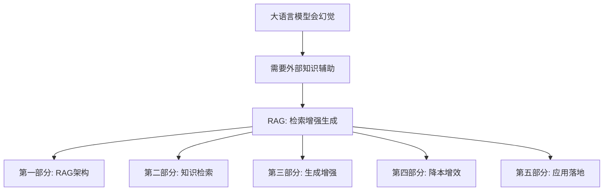
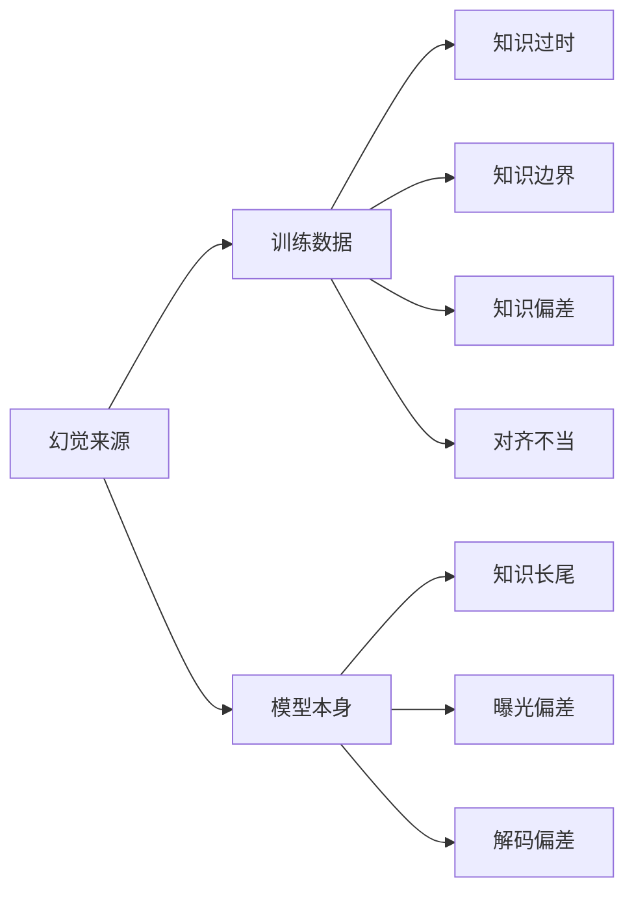
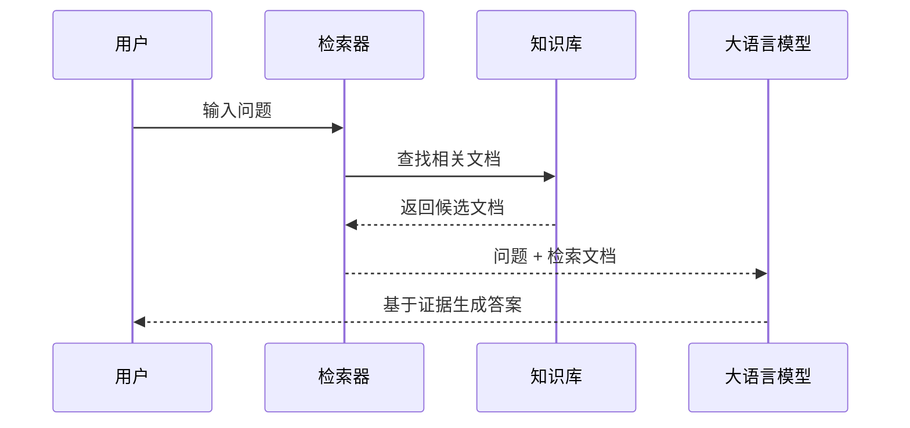
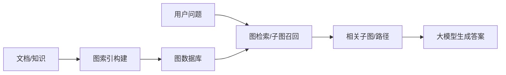
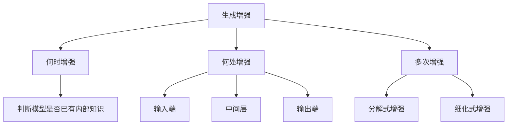
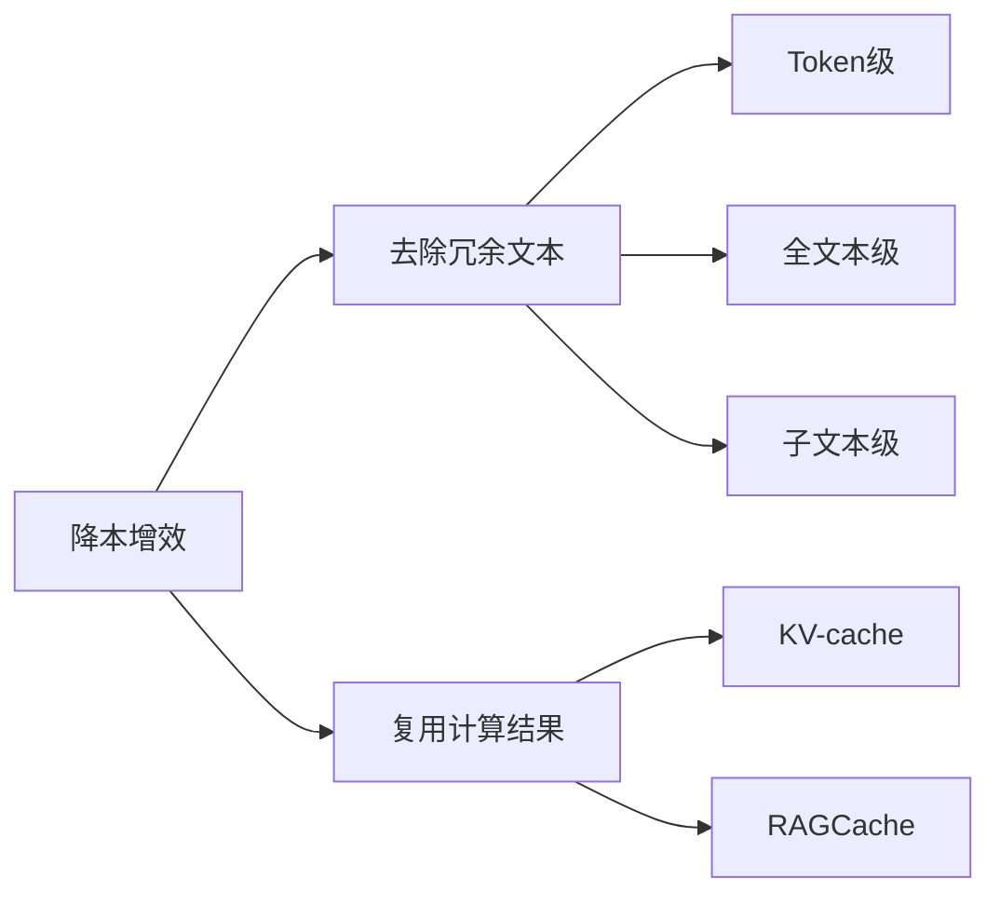

# 第十二课：检索增强生成（RAG）零基础完整讲解

资料来源：`第十二课 检索增强.pptx`

提取核对：本讲义基于 114 页 PPT 的文字框、表格、备注、XML 文本和导出的关键幻灯片图像整理。特别补充了 PPT 中以图片/公式形式出现的 TF-IDF 公式、RankGPT Prompt 模板、架构比较表、FIT-RAG 流程图和企业落地统计图。

---

## 0. 这节课到底在讲什么

这一章的核心是 **RAG：Retrieval-Augmented Generation，检索增强生成**。

如果你是完全初学者，可以先记住一句话：

> RAG 就是让大语言模型回答前，先去外部知识库里查资料，再带着查到的资料作答。

为什么要这样做？因为大语言模型虽然会生成很像真的答案，但它的知识可能过时、缺失、偏差，甚至会编造内容。RAG 的思路很像人类考试或写报告：遇到自己不确定的问题，不是硬猜，而是查书、搜资料、找证据，再组织答案。

本章主线如下：



你学习这章时不要把 RAG 只理解成“搜索 + 复制粘贴”。它其实包含一整套工程与模型设计问题：

- 应该什么时候检索？
- 应该检索哪些资料？
- 检索结果怎么排序？
- 检索到的资料放到模型哪里？
- 文档太多、太长、太贵怎么办？
- 企业里为什么大量 AI 应用都需要 RAG？

---

## 1. 大语言模型的“幻觉现象”

### 1.1 什么是幻觉

PPT 对幻觉现象的定义是：

> 大语言模型（LLMs）生成的内容可能存在“幻觉”现象：生成内容看似合理但实际上逻辑混乱或与事实相悖。

这句话有两个关键点：

1. **看似合理**：语言很流畅，语气很肯定，格式也很像正确答案。
2. **实际错误**：事实错、逻辑错、推理错、数字错，或者说了不存在的东西。

初学者容易误解的一点是：大模型不是数据库。它生成答案靠的是参数中学到的统计规律，而不是每次都查一张“事实表”。所以它会“说得像对的”，但不一定真对。

PPT 第 2 页用“9.11 和 9.9 哪个大？”举例。这类问题看起来简单，但模型可能把数字当字符串或模式来处理，导致错误判断。正确比较小数时，应把 9.9 看成 9.90，因此 **9.9 大于 9.11**。

---

## 2. 幻觉从哪里来

PPT 把幻觉来源分成两大类：



### 2.1 训练数据导致的幻觉

#### 2.1.1 知识过时

PPT 定义：

> 由于训练数据中的时间滞后，其中的知识可能在模型训练后又发生了更新，导致模型内部知识过时。

例子：某个比赛冠军、某个国家领导人、某个产品价格、某个法律规定都可能变化。模型如果只学到旧数据，就会回答旧事实。

PPT 中示例提到正确答案为“西班牙队”，并注明例子中的大语言模型采用 DeepSeek-V2.5。这里真正要学的是：**模型训练完之后，它的参数不会自动更新世界知识**。如果世界变了，模型内部知识可能还停留在训练时。

类比：你在 2020 年背了一本地图册，2026 年直接照着答高铁线路，就可能答错，因为现实更新了。

#### 2.1.2 知识边界

PPT 定义：

> 由于训练数据的有限性，无法覆盖所有范围，且知识在训练数据采集完成后仍会不断新增。

这和“知识过时”相似但不完全一样：

- 知识过时：模型知道旧答案，但旧答案变了。
- 知识边界：模型从一开始就没充分见过这个知识，或者训练后新出现了知识。

PPT 示例：考拉的基因组包含大约 26,000 个基因。例子中的模型采用 GPT-3.5。

要点：大模型不是无所不知。越冷门、越专业、越新、越局部的信息，越可能落在模型知识边界之外。

#### 2.1.3 知识偏差

PPT 定义：

> 训练数据中可能包含不实与偏见信息。

训练数据来自互联网、书籍、论坛、新闻等。如果原始材料有偏见，模型也可能学到偏见。PPT 示例强调：模型默认描述男性，忽略女性身份的成功企业家，这是不应有的性别偏见。

这里要理解：模型不是天然客观的。它学习的是数据分布。如果数据分布本身带有历史偏见、社会偏见、谣言、错误表述，模型也会受影响。

#### 2.1.4 对齐不当

PPT 定义：

> 在模型与人类偏好对齐阶段中，偏好数据标注不当可能引入不良偏好。

大模型训练通常不只包括预训练，还包括对齐阶段。对齐的目标是让模型回答更符合人类偏好，例如更有帮助、更安全、更礼貌。但如果人类标注数据本身有问题，模型就会学到不好的偏好。

PPT 中流程是：

用户问题 -> 大模型给候选答案 -> 人类标注偏好 -> 偏好数据标注过程引入偏差 -> 模型推理过程出现不良偏好。

初学者可以这样理解：如果老师批改作文时总是偏爱某种错误风格，学生就会学会迎合这种错误风格。

### 2.2 模型本身导致的幻觉

#### 2.2.1 知识长尾

PPT 定义：

> 训练数据中部分信息的出现频率较低，导致模型对这些知识的学习程度较低。

“长尾”就是大量低频知识。热门知识出现很多次，模型容易学会；冷门知识出现很少，模型学得不牢。

PPT 示例：正确答案是美国心理学家 G.W. 奥尔波特，但模型可能误答为卡尔·罗杰斯。例子中的模型采用 GPT-3.5。

要点：长尾问题不是完全没见过，而是见得太少、学得不稳定。

#### 2.2.2 曝光偏差

PPT 定义：

> 由于模型训练与推理任务存在差异，导致模型在实际推理时存在偏差。

PPT 提到训练过程采用 **Teacher Forcing**，推理过程会出现错误累积。

零基础解释：

- 训练时，模型预测下一个词时，经常能看到前面真实正确的词，也就是 Ground Truth。
- 推理时，模型只能看到自己前面已经生成的词。
- 如果模型前面生成错了，后面就会基于错误继续生成，错误会越滚越大。

类比：训练时老师每一步都给你正确答案让你接着做；考试时你只能接着自己上一题的答案做。如果上一题错了，后面可能连环错。

#### 2.2.3 解码偏差

PPT 定义：

> 模型解码策略中的随机因素可能影响输出的准确性。

大模型生成文本时，不一定每次都选概率最大的词。它可能使用采样、温度、top-k、top-p 等策略，让答案更有变化。但随机性也会带来不稳定。

PPT 表达的是：解码过程中的随机性可能导致模型输出不符合常理的内容。

要点：同一个问题，大模型多问几次可能答案不同，这不只是“模型性格”，而是生成策略决定的。

---

## 3. RAG 为什么能缓解幻觉

PPT 用人类类比：

> 当我们遇到无法回答的问题时，通常会借助搜索引擎或查阅书籍资料来寻找相关信息。

大模型也可以这样做：遇到问题时，先检索与问题相关的信息，再基于这些信息生成答案。

PPT 用考拉数量举例：

- 用户问题：2023 年的考拉数量大约有多少？
- 检索到的信息：2023 年，调整后的考拉种群估计数在 86,000 至 176,000 之间。
- 生成答案：2023 年的考拉数量在 86,000 至 176,000 之间。

RAG 的核心思想：

> 对大语言模型，通过检索与问题相关的信息进行辅助，从而有效缓解“幻觉”现象，大幅提升模型的生成质量。

### 3.1 RAG 的定义

PPT 定义：

> RAG（Retrieval-Augmented Generation），即检索增强生成，是一种从外部数据库中检索相关信息来辅助改善大语言模型生成质量的系统。

基本 RAG 框架主要包含两个模块：

1. **知识检索**：对输入问题进行编码，从大规模知识库中高效检索出相关文档。常用算法包括关键词匹配的稀疏检索算法和基于神经网络的稠密检索算法。
2. **生成增强**：利用检索文档和输入问题，生成最终输出序列。常用生成器是预训练语言模型，如 Llama。最常见方式是把外部知识放进 Prompt。

最简单流程：



---

## 4. RAG 架构分类

PPT 第 16 页进入目录：RAG 架构、知识检索、生成增强、降本增效、应用落地。

### 4.1 黑盒模型与白盒模型

PPT 说：

> 在 RAG 中，大语言模型根据参数进行感知和调节可分为“黑盒”模型与“白盒”模型。

理解：

- **黑盒模型**：你只能调用它的输入输出接口，看不到或改不了内部参数。闭源模型通常视为黑盒。
- **白盒模型**：你能访问模型结构或参数，能对它进行微调。开源模型如果允许参数微调，可以视为白盒。

开源模型也可能被当黑盒用：如果你只是调用它，不改参数，它在当前系统里也可按黑盒处理。

### 4.2 按是否更新大语言模型参数分类

PPT 把 RAG 架构分成两大类：

1. **黑盒增强架构**：大语言模型参数不更新。
2. **白盒增强架构**：大语言模型参数会更新。

进一步展开为四类：

| 大类 | 子类 | 参数更新情况 | 代表方法 |
|---|---|---|---|
| 黑盒增强 | 无微调 | 检索器和 LLM 都不更新 | In-Context RALM |
| 黑盒增强 | 检索器微调 | LLM 不更新，检索器更新 | REPLUG, AAR |
| 白盒增强 | 仅微调语言模型 | 检索器不更新，LLM 更新 | RETRO, REALM, Self-RAG |
| 白盒增强 | 协同微调 | 检索器和 LLM 同步更新 | ATLAS |

### 4.3 黑盒增强：无微调

PPT 定义：

> 检索器和大语言模型在 RAG 过程中参数不更新，二者直接组合使用来完成生成任务。

代表方法：**In-Context RALM**。

做法：直接把检索器检索到的文档放到输入问题前面作为上下文。

优点：

- 与 LLM 解耦。
- 容易实现。
- 计算成本最低。
- 相比无检索，能提升回答性能。

缺点：

- LLM 与检索器缺乏交互。
- 完全依赖大模型的指令跟随能力。
- RAG 整体效果难保证。

这里的关键是“简单”。今天很多工程系统的第一版 RAG 就是这种方式：查文档，把文档塞进 Prompt，让模型回答。

### 4.4 黑盒增强：检索器微调

PPT 定义：

> 大语言模型参数固定，检索器参数根据大语言模型的输出进行更新，使检索器能更好地适应大语言模型的需求。

代表方法：**REPLUG**。

REPLUG 的思想：使用语言模型的 **困惑度** 作为监督信号训练检索器，目标是检索出能显著降低语言模型困惑度的文档。

困惑度可以简单理解为：模型对文本有多“困惑”。困惑度越低，说明模型越容易预测、越有把握。

优点：

- 更新检索器以迎合 LLM 需求。
- 无需更新 LLM。
- 成本低。
- 效果良好。

缺点：

- LLM 参数固定，可能仍无法与检索器良好适配。

PPT 第 24 页提到指标 BPB，越低越好。

### 4.5 白盒增强：仅微调语言模型

PPT 定义：

> 检索器作为一个预先训练好的组件，其参数保持不变，大语言模型根据检索器输出对自身参数进行更新。

代表方法：**RETRO**。

PPT 说 RETRO 通过交叉编码，将检索信息动态融合到大语言模型的隐藏状态中。

优点：

- 优化语言模型生成能力。
- 让模型更好利用检索到的外部信息。
- 相较其他方法，RETRO 能显著降低困惑度。

缺点：

- 微调资源需求高。
- 微调效果依赖原生检索器性能。

### 4.6 白盒增强：协同微调

PPT 定义：

> 在检索器和语言模型协同微调的架构中，检索器和语言模型的参数更新同步进行。

代表方法：**ATLAS**。

ATLAS 使用 KL 散度损失函数联合训练检索器和语言模型，确保：

- 检索器输出的文档相关性分布；
- 与文档对语言模型的贡献分布；

二者尽量一致。

优点：

- 检索器和 LLM 在训练中深度交互。
- 能不断优化 RAG 性能。

缺点：

- 资源需求高。
- 实现与训练过程复杂。

PPT 第 28 页提到指标 EM，越高越好。EM 是 Exact Match，表示答案完全匹配的比例。

### 4.7 架构对比总表

| 架构 | 优点 | 缺点 |
|---|---|---|
| 黑盒无微调 | 与 LLM 解耦，易于实现，计算成本最低 | LLM 与检索器缺乏交互，RAG 效果难保证 |
| 黑盒检索器微调 | 更新检索器迎合 LLM 需求，成本低，效果良好 | LLM 参数固定，可能无法与检索器良好适配 |
| 白盒仅微调语言模型 | 优化语言模型生成能力，更好利用检索到的外部信息 | 计算成本高；微调效果依赖原生检索器性能 |
| 白盒协同微调 | 检索器和 LLM 在训练中深度交互，不断优化 RAG 性能 | 计算成本高；实现与训练过程复杂 |

初学者记忆方式：

- 想快速落地：黑盒无微调。
- 想提升检索器：黑盒检索器微调。
- 想让模型更会用资料：白盒仅微调语言模型。
- 想极致协同：白盒协同微调。

---

## 5. 知识检索

PPT 第 31 页进入知识检索：

> 如何检索出相关信息来辅助改善大语言模型生成质量。

知识检索通常包括四部分：


### 5.1 知识库构建

知识库构建就是把各种资料整理成模型能检索的形式。

PPT 说：

> 从不同渠道整合、转换多元数据资源，将其转换为统一的文档对象。

例子：维基百科语料库不仅有正文，还包括标题、目录、分类等元信息。

#### 5.1.1 数据采集与预处理

数据采集与预处理为构建知识库提供“原材料”。

包括：

- **数据采集**：从网页、文档、数据库、百科、企业内部系统等获取数据。
- **数据清洗**：清除文本中的干扰元素，如特殊字符、乱码、无关广告等。
- **文本分块**：将大块文本切成较小单元，例如把一篇长文章分为多个短段落。

为什么要文本分块？

因为检索通常不是把整本书作为一个文档去匹配，而是把书切成段落、章节或语义块。块越合适，越容易命中用户问题。

#### 5.1.2 文本分块方法

PPT 提到两类：

1. **固定大小分块**
2. **基于内容的分块**

固定大小分块：

- 按预先设定的长度切分。
- 简单直观。
- 例如每 500 个 token 切一块。

基于内容的分块：

- 根据文本内容和语义逻辑切分。
- 更贴合自然段落、标题、主题转换。

PPT 给出的基于内容分块方式包括：

- 句分割/递归分割：
  - 用句号和换行分割句子。
  - 借助 NLP 库进行句分割，如 NLTK、spaCy。
- 用 LLM 进行分割：
  - 利用大模型按照语义进行分块。

初学者要记住：分块太大，模型读起来贵且容易抓不住重点；分块太小，语义上下文可能断裂。

#### 5.1.3 知识库增强

PPT 定义：

> 知识库增强是通过改进和丰富知识库的内容和结构，为查询提供“抓手”。

包括两种方法：

1. **伪查询生成**
2. **标题生成**

伪查询生成：

- 利用大语言模型生成与文档内容紧密相关的伪查询。
- 这些伪查询相当于文档的“键”。
- 用户查询时，可以与这些伪查询匹配，从而找到文档。

标题生成：

- 利用大语言模型为没有标题的文档生成合适标题。
- 标题能帮助快速理解文档内容。
- 检索时更容易定位相关信息。

类比：你整理笔记时给每段笔记加标题、加关键词、加可能的问题，这样复习时更容易找。

### 5.2 查询构建

PPT 定义：

> 查询构建旨在通过查询增强的方式，扩展和丰富用户查询的语义和内容，提高检索结果的准确性和全面性，“钩”出相应内容。

查询构建分为：

1. **语义增强**
2. **内容增强**

#### 5.2.1 语义增强

语义增强旨在扩展、丰富用户查询的语义，提高检索准确性和全面性。

PPT 提到两种：

- 同义改写
- 多视角分解

同义改写：

> 通过将原始查询改写成相同语义下不同表达方式，解决用户查询单一表达形式无法覆盖知识库中多样化表达的问题。

例子：

- 原问题：RAG 怎么减少幻觉？
- 改写 1：检索增强生成如何降低大模型编造答案？
- 改写 2：外部知识检索为什么能提升 LLM factuality？

多视角分解：

> 采用分而治之的方法处理复杂查询，将复杂查询分解为不同视角的子查询。

例子：

问题：RAG 在企业落地为什么重要？

可以拆成：

- 企业 AI 产品有哪些痛点？
- RAG 如何解决知识过时？
- RAG 如何处理企业私有数据？
- RAG 在知识库问答和客服机器人中如何应用？

#### 5.2.2 内容增强

内容增强旨在挖掘与查询主题相关的内容，丰富查询广度与深度。

PPT 重点讲 **背景文档生成**：

> 利用大语言模型在原始查询基础上，生成与查询内容相关的背景文档，从而丰富查询的广度与深度。

这相当于让模型先帮你把问题的背景展开，再用展开后的内容去检索。

### 5.3 文本检索

PPT 定义：

> 给定知识库和用户查询，文本检索旨在找到知识库中与用户查询相关的知识文本；检索效率增强旨在解决检索时的性能瓶颈问题。

文本检索要看两个方面：

1. **检索质量**
2. **检索效率**

检索质量包括召回率、精度、多样性等，会直接影响大语言模型的生成质量。

检索效率会影响用户体验。PPT 中用“等不了了！”表达检索慢会让用户无法接受。

常见文本检索器分为三类：

1. 判别式检索器
2. 生成式检索器
3. 图检索器

---

## 6. 判别式检索器

PPT 定义：

> 判别式检索器对问题和文档进行特征向量提取，以得到问题和文档的相关性分数。

判别式检索器包括：

- 稀疏编码器
- 双编码器
- 交叉编码器

### 6.1 稀疏检索器与 TF-IDF

PPT 说：

> 一类经典的判别式检索器是稀疏检索器，其使用稀疏表示方法来匹配文本。其中 TF-IDF 是一种典型的稀疏检索方法。

TF-IDF 基于两个量：

- **TF（Term Frequency，词频）**：词语在文档中出现得多不多。
- **IDF（Inverse Document Frequency，逆文档频率）**：词语在整个语料库中常不常见。

公式：

```text
tfidf_i,j = tf_i,j * idf_i
```

其中：

```text
idf_i = lg( |D| / |{ j : t_i ∈ d_j }| )
```

含义：

- `|D|`：总文档数。
- `|{ j : t_i ∈ d_j }|`：包含词语 `i` 的文档数。
- 如果一个词出现在很多文档里，它的 IDF 小，说明它区分度低。
- 如果一个词只出现在少数文档里，它的 IDF 大，说明它更能代表文档特征。

TF 公式：

```text
tf_i,j = n_i,j / Σ_k n_k,j
```

含义：

- `n_i,j`：词语 `i` 在文档 `j` 中出现次数。
- `Σ_k n_k,j`：文档 `j` 中所有词语出现次数总和。

#### 6.1.1 PPT 的 TF-IDF 例子

PPT 给三个句子：

- 句 1：["家人", "们"]
- 句 2：["集美", "们"]
- 句 3：["家人", "集美", "们"]

TF 表：

| 词语 | 句1 | 句2 | 句3 |
|---|---:|---:|---:|
| 家人 | 1/2 | 0 | 1/3 |
| 集美 | 0 | 1/2 | 1/3 |
| 们 | 1/2 | 1/2 | 1/3 |

IDF 表：

| 词语 | IDF |
|---|---|
| 家人 | log(3/2) |
| 集美 | log(3/2) |
| 们 | log(3/3)=0 |

TF-IDF 表：

| 句子 | 家人 | 集美 | 们 |
|---|---|---|---|
| 句1 | 1/2 × log(3/2) | 0 | 0 |
| 句2 | 0 | 1/2 × log(3/2) | 0 |
| 句3 | 1/3 × log(3/2) | 1/3 × log(3/2) | 0 |

注意：“们”每个句子都有，所以 IDF 为 0，它不能帮助区分句子。

这就是 TF-IDF 的直觉：常见词不重要，有区分度的词更重要。

### 6.2 双编码器

PPT 定义：

> 双编码类检索器首先将查询和文档各自通过独立的编码器生成向量表示，再对两个向量之间的相似度进行计算，以评估相关性。

形式：

```text
u = Encoder(query)
v = Encoder(doc)
score = similarity(u, v)
```

优点：

- 文档向量可以预先离线计算并存储。
- 查询时只需要算 query 向量，再和文档向量匹配。
- 检索效率高。

缺点：

- 查询和文档在编码阶段缺乏交互。
- 可能错过细粒度匹配关系。

### 6.3 ColBERT：晚交互

PPT 提到：

> 为了解决双编码器查询与文档在提取特征向量时缺乏交互的问题，ColBERT 以查询和文档间 Token 级的相似度为度量，通过对比学习对双编码器进行微调。

关键思想：

- 不是只比较整个 query 向量和整个 doc 向量。
- 而是比较 query 中每个 token 的 embedding 和 doc 中每个 token 的 embedding。
- 对于 query 中每个 token，找到它在文档 token 中的最大余弦相似度。

这样既保留了双编码器的效率，又增加了 token 级匹配能力。

### 6.4 交叉编码器

PPT 定义：

> 交叉编码类检索器“端到端”地给出查询与文档的相似度。它将查询和文档结合后直接输入模型，最终输出一个 0 到 1 之间的数值，表示相似性。

优点：

- 查询和文档可以深度交互。
- 相关性判断更准确。

缺点：

- 计算量大。
- 不适合在大规模初始检索阶段使用。
- 更适合小规模重排阶段。

简单对比：

| 方法 | 怎么算 | 优点 | 缺点 |
|---|---|---|---|
| 双编码器 | query 和 doc 分开编码 | 快，可离线建库 | 交互弱 |
| 交叉编码器 | query 和 doc 一起输入 | 准，交互强 | 慢，不适合全库检索 |
| ColBERT | token 级晚交互 | 折中 | 比普通双编码复杂 |

### 6.5 判别式检索效率增强

PPT 说：

> 知识库海量文本的向量编码储存在向量数据库中，对其中编码逐一检索缓慢而低效，高效的向量索引方法可以提高检索效率。

现有向量索引方法包括：

- 基于量化的向量索引方法
- 基于哈希的向量索引方法
- 基于树的向量索引方法
- 基于图的向量索引方法

PPT 列出的向量数据库：

| 向量数据库 | LangChain 集成 | 语言 |
|---|---|---|
| Milvus | √ | Go/Python/C++ |
| Typesense | √ | C++ |
| Qdrant | √ | Rust |
| Chroma | √ | Python |
| Weaviate | √ | Go |
| Pinecone | √ | - |

初学者要知道：向量数据库不是“保存文本”的普通数据库，它重点支持“相似向量快速搜索”。

---

## 7. 生成式检索器

PPT 定义：

> 生成式检索器直接将知识库中的文档信息记忆在模型参数中。接收到查询请求时，能够直接生成相关文档的标识符（Doc ID），以完成检索。

这和判别式检索器不同：

- 判别式检索器：算 query 和 doc 的相似度。
- 生成式检索器：直接生成可能相关的 Doc ID。

### 7.1 训练方式

PPT 说训练包括两个任务：

1. **索引任务**
   - 模型学习文档内容与对应文档 ID 的映射关系。
2. **检索任务**
   - 模型学习为输入查询返回潜在相关候选文档的排名列表。

这两个任务以多任务形式端到端优化。

### 7.2 优点

PPT 提到：

- 内存效率高：仅存储文档标识符和模型参数。
- 生成速度快：仅需生成轻量的文档标识符。

### 7.3 生成式检索效率增强

PPT 提到三个方向：

1. **提升 Doc ID 构建效率**
   - 采用分层标识符生成策略。
   - 简单文档用基础规则。
   - 复杂文档用语义增强策略。
   - 平衡 Doc ID 精度和效率，可适当接受近似解。

2. **增量更新加速**
   - 构建动态记忆模块。
   - 通过记忆与新文档相似的旧文档，优化新旧文档关联学习。
   - 减少全局重新训练需求。

3. **推理优化**
   - 根据任务选择合适采样方式，如约束波束搜索、约束贪婪搜索。
   - 结合量化策略减少计算开销。

---

## 8. 图检索器

PPT 说，当传统检索器性能不佳时，可以考虑图检索器，尤其是以下场景：

- 需要捕捉结构化关系。
- 需要解决信息冗余问题。
- 需要全面获取全局信息。

### 8.1 图数据库和三元组

PPT 定义：

> 图检索器的知识库为图数据库，包括开放知识图谱和自建图两种，它们一般由 <主体、谓词、客体> 三元组构成。

例子：

```text
<考拉, 食物, 桉树叶>
<考拉, 分布地, 澳大利亚>
<大熊猫, 食物, 竹子>
```

图数据库的好处：

- 捕捉概念之间的关系。
- 支持人类和机器共同理解与推理。
- 比单纯向量相似度更容易表达结构化知识。

### 8.2 图 RAG 核心链路

PPT 说基于图数据库的 RAG 核心链路分三阶段：

1. 图索引构建
2. 图检索，即子图召回
3. 生成



### 8.3 图检索效率增强

PPT 提到多个方向：

- **检索缓存优化**：缓存查询结果，减少数据库访问。
- **检索算法优化**：采用多阶段检索策略，如先用大模型规划路径对大图剪枝，再从子图中提取满足条件的路径。
- **索引方法选择**：使用混合检索，结合图索引和向量索引优势，同时保留结构信息并实现快速向量搜索。
- **索引数据优化**：层次化数据组织，为图数据库建立多级索引，根据任务需求选择更细或更广的子图粒度。

---

## 9. 检索结果重排

PPT 定义：

> 检索阶段为了保证检索速度通常会损失一定性能，可能检索到质量较低的文档。重排的目的是对检索到的段落进行进一步排序精选。

重排可以分为：

1. 基于交叉编码的方法
2. 基于上下文学习的方法

### 9.1 基于交叉编码的重排

做法：

- 初始检索先召回一批候选文档。
- 再用交叉编码器逐个评估 query 和候选文档的语义相关性。
- 重新排序。

PPT 中提到常见交叉编码器：

- Sentence-Transformer 系列
- BGE 系列
- `cross-encoder/ms-marco-mini lm`
- `cross-encoder/ms-marco-TinyBERT-L`
- `cross-encoder/stsb-roberta-large`
- `BAAI/bge-reranker-large`

为什么交叉编码器常用于重排？

因为它太慢，不适合对全库几百万文档逐个判断；但对初检后的几十或几百个候选文档做精排很合适。

### 9.2 基于上下文学习的重排：RankGPT

PPT 定义：

> 基于上下文学习的方法是指通过设计精巧的 Prompt，使用大模型来执行重排任务。

代表方法：**RankGPT**。

PPT 图中 RankGPT Prompt 模板核心意思是：

1. 告诉模型：你是 RankGPT，是一个用于根据查询相关性对段落排序的智能助手。
2. 给模型若干段落，每段都有编号，如 `[1] {{passage_1}}`、`[2] {{passage_2}}`。
3. 给出查询 `{{query}}`。
4. 要求模型根据与查询的相关性降序排列段落。
5. 输出只包含编号顺序，例如 `[1] > [2]`。

初学者理解：RankGPT 不是训练一个新模型，而是用 Prompt 把大模型“临时变成一个排序器”。

---

## 10. 生成增强

PPT 第 65 页进入生成增强：

> 检索器得到相关信息后，需要将其传递给大语言模型以期增强模型生成能力。如何优化生成增强过程，以得到更好的 RAG 性能？

PPT 从三个角度分析：

1. 何时增强
2. 何处增强
3. 多次增强



### 10.1 何时增强

PPT 定义：

> 确定何时需要检索增强，以确保非必要不增强。

为什么非必要不增强？

因为检索也有成本，而且错误检索可能反而干扰模型。PPT 用“画蛇添足”来类比：本来模型内部知识足够解决的问题，如果强行加入不相关资料，答案可能变差。

核心判断：

> 判断大语言模型是否具有相关内部知识。

如果内部知识足够，可以不增强；如果内部知识不足，需要检索外部知识。

### 10.2 外部观测法

PPT 定义：

> 不侵入模型内部参数，通过对大模型训练数据和输出进行观测来判断模型是否具备相应知识。

类比：面试考察应聘者知识。

外部观测法包括：

#### 10.2.1 Prompt 直接询问

直接问模型：你是否知道这个问题？

局限：模型可能过度自信。它可能不知道但说自己知道。

#### 10.2.2 观察训练数据

PPT 说：

> 训练数据是大模型的知识来源，可以通过观察训练数据预测模型内部知识水平。

核心假设：

> 知识在训练数据中的出现频率与模型对该知识的记忆程度正相关。

局限：

- 很多模型无法获取训练数据。
- 闭源模型尤其如此。

#### 10.2.3 构造伪训练数据

当无法观察真实训练数据时，可以构造伪训练数据来拟合训练数据相关情况。

例如用网络流行度、维基百科访问量、搜索热度等统计量推测某个知识是否常见。

#### 10.2.4 构造伪训练数据统计量：流行度

PPT 定义：

> 流行度是指实体或知识在特定环境中被广泛关注或使用的频率。

逻辑：

- 模型对低频知识掌握不足。
- 模型对流行、高频知识掌握更好。
- 因此流行度可以作为伪训练数据统计量。

PPT 示例：

- “大熊猫”在维基百科上的热度：流行知识。
- “叶口蝠”在维基百科上的热度：非流行知识。
- 可以设定过去 30 天页面访问量超过 100 的知识为流行知识。

### 10.3 内部观测法

PPT 定义：

> 通过分析大模型在生成文本时的内部状态变化，评估其内部知识水平。

内部观测法前提是：你能访问模型内部状态，所以更适合白盒模型。

PPT 说：

> 在处理包含或不包含内部知识的不同问题时，模型的中间层（注意力层、MLP 层等）会展现出不同动态变化。

基于这个特性，可以训练分类器判断模型是否知道某个问题。这种方法叫 **探针（probe）**。

PPT 第 76 页说：利用训练好的探针，即线性分类器，根据问题对应的内部表示预测该问题属于模型已知还是未知。

类比：通过心率、血压、呼吸频率做测谎。不是直接读思想，而是看内部信号变化。

### 10.4 何处增强

PPT 定义：

> 确定在模型中的何处融入检索到的知识以最大化效用。

增强位置有三种：

1. 输入端
2. 中间层
3. 输出端

PPT 类比为：像汉堡一样，选择在哪一层加入沙拉酱。

#### 10.4.1 输入端增强

方法：

> 将问题和检索到的外部知识拼接在 Prompt 中，然后输入给大模型。

这是当前主流方式。

优点：

- 直观且易于实现。
- 模型可以直接从输入上下文中提取所需信息。
- 无需复杂处理或转换。

缺点：

- 检索文本过长时，会增加推理计算成本。
- 增加模型计算负担。

#### 10.4.2 中间层增强

方法：

> 先将检索到的外部知识转换为向量表示，然后通过交叉注意力融合到模型隐藏状态中。

代表方法：RETRO。

优点：

- 更深入影响模型内部表示。
- 减少对模型输入长度的依赖。

缺点：

- 需要对模型结构进行复杂设计和调整。
- 无法应用于黑盒模型。

#### 10.4.3 输出端增强

方法：

> 利用检索到的外部知识对大语言模型生成文本进行校准，是一种后处理方法。

优点：

- 可以确保生成文本与外部知识保持一致。
- 提高答案准确性和可靠性。

缺点：

- 效果高度依赖检索到的外部知识质量和相关性。
- 校准结果容易受检索质量影响。

三者对比：

| 增强位置 | 优点 | 缺点 |
|---|---|---|
| 输入端增强 | 直观、易实现、无需复杂处理 | 长文本会增加推理成本和负担 |
| 中间层增强 | 深入影响内部表示，减少输入长度依赖 | 结构设计复杂，不能用于黑盒模型 |
| 输出端增强 | 可保持生成文本与外部知识一致 | 依赖检索质量和相关性 |

### 10.5 多次增强

PPT 定义：

> 对复杂查询与模糊查询进行多次迭代增强，以提升 RAG 在困难问题上的效果。

为什么需要多次？

- 复杂问题涉及多个知识点，需要多跳理解。
- 模糊问题指代范围不明，一次检索不一定能理解问题含义。

#### 10.5.1 分解式增强

PPT 例子：

问题：世界上睡眠时间最长的动物爱吃什么？

分解：

1. 世界上睡眠时间最长的动物是什么？
2. 答：考拉。
3. 考拉爱吃什么？
4. 答：桉树叶。

最终答案：桉树叶。

分解式增强的核心：把复杂问题拆成子问题，在子问题间迭代检索增强。

#### 10.5.2 细化式增强

PPT 例子：

问题：国宝动物爱吃什么？

这个问题模糊，因为“国宝动物”可能指：

- 中国的国宝动物：大熊猫，爱吃竹子。
- 澳大利亚的国宝动物：考拉，爱吃桉树叶。
- 其他国家的国宝动物：可能有不同答案。

细化式增强通过探索多种细化路径，解决问题主体指代不明的问题。

---

## 11. 降本增效

PPT 第 88 页进入降本增效：

> 检索的外部知识通常包含大量文本，如何降本增效，以提升处理文本效率？

核心问题：

> 检索出的外部知识通常包含大量原始文本。如果不处理，会增加大语言模型的推理计算成本。

PPT 给出两个方向：

1. 去除冗余文本
2. 复用计算结果



### 11.1 去除冗余文本

PPT 定义：

> 去除冗余文本的方法通过对检索出的原始文本的词句进行过滤，从中选择出部分有益于增强生成的部分。

PPT 分成三类：

1. Token 级别方法
2. 全文本级别方法
3. 子文本级别方法

#### 11.1.1 Token 级别方法

PPT 举例：

> “您”、“需要”、“上”、“的”、“然后”、“会”等 Token 困惑度较低，可以去除。

直觉：有些词对回答事实问题没有太大帮助，删掉后不影响理解，还能减少 token 数。

PPT 引用 LongLLMLingua。

#### 11.1.2 全文本级别方法

PPT 定义：

> 直接从整个文档中抽取重要信息，以去除冗余信息。

可以理解为对整篇检索文档做摘要或信息抽取，只留下关键事实。

PPT 引用 PRCA。

#### 11.1.3 子文本级别方法

PPT 定义：

> 通过对文档分割后的子文本打分，删除不必要的子文本。

代表方法：**FIT-RAG**。

### 11.2 FIT-RAG

PPT 定义：

> FIT-RAG 是一款高效低资源的通用检索增强生成框架，集检索文档打分精排、内部知识检测、检索文档压缩和输入提升设计于一体。

PPT 架构图包含几个关键模块：

1. **Similarity-based Retriever**
   - 先从语料库中召回 Top-100 文档。

2. **Bi-label Document Scorer**
   - 使用基础模型和 LoRA。
   - 给文档打两个标签：
     - `Has_Answer`：是否包含答案。
     - `LLM_Prefer`：是否符合大模型偏好。

3. **Self-Knowledge Recognizer**
   - 判断模型是否已有内部知识。
   - 决定 No-Retrieve 或 Retrieve。

4. **Sub-document-level Token Reducer**
   - 将 Top 文档划分为子文档。
   - 对子文档打分。
   - 重排并筛选。
   - 保留少量高质量子文本。

5. **Input Prompt 设计**
   - 构造更有效的输入，让模型基于筛选后的 Final Doc 回答。

PPT 第 95 页进一步说明：

> FIT-RAG 的子文档压缩方法通过将文档划分为子文档，并利用预先构建的打分器对子文本进行打分，筛选出既包含事实信息又符合大模型偏好的少量子文本组合。

PPT 第 96 页给出结论：

> FIT-RAG 有效筛选出符合大模型偏好的高质量文档，极大提升回答准确率，同时平均压缩约 50% 的输入 Token，提升输入有效性并节约计算资源。

### 11.3 复用计算结果

PPT 说：

> 除了对冗余信息进行筛除，还可以对计算必需的中间结果进行复用，以优化 RAG 效率。

PPT 用炖牛肉类比：

- 我想吃土豆炖牛肉。
- 我想吃番茄炖牛肉。
- 中间结果：炖好的牛肉。
- 最终结果：土豆炖牛肉 / 番茄炖牛肉。
- 如果“炖好的牛肉”可复用，就不用每次从头做。

### 11.4 KV-cache

PPT 定义：

> 为避免每次生成新 Token 时重复计算之前的 Key 和 Value，可以将它们缓存起来，即 KV-cache，在需要时直接调用缓存结果，从而减少计算。

零基础解释：

Transformer 生成时，每个新 token 都会和前面 token 做注意力计算。前面 token 的 Key 和 Value 已经算过了，如果每一步都重算，会浪费。KV-cache 就是把它们存起来。

### 11.5 RAGCache

PPT 定义：

> RAGCache 是一种经典方法，设计了一种 RAG 系统专用的多级动态缓存机制。

三个核心部分：

1. KV 张量缓存库
2. 缓存检索器
3. RAG 控制器

总结：

- Prompt 压缩减少输入长度。
- KV-cache/RAGCache 减少重复计算。
- 二者结合，可以在保持高性能的同时显著提升效率。

---

## 12. RAG 应用落地

### 12.1 多模态 RAG

PPT 说：

> 在诸多垂直领域中，除文本数据之外，对多模态数据的处理需求也日益凸显。

多模态指结合多种感知通道，例如：

- 文本
- 图像
- 音频
- 视频
- 医疗影像
- 结构化数据

PPT 解释：

> 多模态通过结合多种感知通道，可同时理解和处理不同形态的信息，从而提供更完整的信息输入和更丰富的交互体验。

为了适配广泛应用场景，RAG 系统需要具备融合与处理不同模态数据的能力。

医疗领域例子：

- X 光片
- MRI
- CT 扫描
- 病历
- 生理监测数据

这些数据来源广泛，且相互之间存在复杂关系。RAG 可以帮助融合不同模态的数据。

### 12.2 RAG 与 Agent

PPT 说：

> 在 Agent 系统运行过程中，需要检索并整合多样化信息资源，以更精确满足用户需求，RAG 技术在其中扮演重要角色。

PPT 给出 Agent 组成：

1. **配置模块**
   - 设定 Agent 基本信息以定义角色。

2. **记忆模块**
   - 存储知识与历史信息。
   - 支持多种记忆操作。
   - RAG 辅助记忆检索与更新。

3. **计划模块**
   - 进行任务分解与规划。
   - 根据反馈调整。
   - RAG 利用信息辅助规划任务。

4. **行动模块**
   - 将 Agent 计划转化为行动，如工具调用。
   - RAG 检索信息辅助决策与行动执行。

PPT 示例：当用户询问想去抱考拉时，Agent 经过规划与行动，给出合适的出行建议。

### 12.3 企业落地

PPT 说：

> 在企业落地中，RAG 技术对下一代 AI 产品开发至关重要。

PPT 第 107 页列举企业和产品动态：

- 阿里云推出企业级大模型 RAG 解决方案。
- 百度智能云千帆大模型平台升级企业级 RAG 能力。
- 火山引擎云搜索 RAG 技术体系演进，提到 95% 向量资源节省。
- 腾讯云发布 RAG 解决方案。
- 华为云发布 KooSearch 的 RAG 解决方案。
- Google 推出 DataGemma，结合检索增强生成和检索交错生成技术。

### 12.4 企业 AI 产品痛点

PPT 引用 Retool 2023 调查，调查了 1,500 多名技术人员，包括软件工程师、工程师、商业领袖、高管、产品人员、设计师等。

开发 AI 产品痛点统计：

| 痛点 | 占比 |
|---|---:|
| 模型输出准确性 | 39.4% |
| 数据安全 | 33.4% |
| 幻觉 | 28.1% |
| 相关成本 | 27.9% |
| 模型速度和性能 | 23.8% |
| Prompt 工程 | 21.2% |
| 导入数据与 LLM 协作 | 21.0% |
| 其他 | 4.3% |

PPT 结论：

> 准确性、数据安全性以及幻觉是目前最大的三个痛点问题，而 RAG 是一种可行的解决技术手段。

### 12.5 RAG 如何解决企业痛点

PPT 第 109 页列出：

| 企业痛点 | RAG 解决方式 |
|---|---|
| 信息变化迅速，系统响应过时 | 将语言模型和知识库分开，知识库可实时更新，并始终从最新信息中提取 |
| 保护隐私和数据 | 创建仅访问批准的数据集，将敏感信息检索限制在特定本地设备的检索系统 |
| 数据类型多样 | RAG 可扩展到文本之外，检索图像、音频等多种类型数据 |
| 知识集成困难 | RAG 模块化，与微服务架构配合良好，可设单独信息检索服务 |
| 处理大量数据 | 高级索引技术和向量数据库优化大型数据集搜索 |
| 扩展时保持个性化 | 创建针对用户偏好、历史和上下文定制的检索系统，并生成定制响应 |

### 12.6 企业内部和客户场景

企业内部 AI 应用场景：

- 知识库问答：36.2%
- 支持聊天机器人：28.9%

PPT 结论：这类知识管理与支持场景在企业应用中很普遍，且均以 RAG 技术为核心。

企业面向客户 AI 应用场景：

- 客户支持聊天机器人：26.5%
- 知识库问答：26.0%

二者共计占据半数份额。

### 12.7 未来发展

PPT 最后观点：

> 在 AI 应用的未来发展中，RAG 仍将作为核心技术引领 AI 产品的进步。

PPT 说 RAG 在未来 AI 产品中必不可少，在 AI 技术栈各层次均有重要意义，有助于：

- 提升知识获取效率。
- 增强智能交互体验。
- 推动多领域应用拓展。

最后页口号：

> Let’s Embrace the Future with RAG!

---

## 13. 本章关键术语速查

| 术语 | 零基础解释 |
|---|---|
| LLM | 大语言模型，如 GPT、Claude、Llama 等 |
| 幻觉 | 模型生成看似合理但事实或逻辑错误的内容 |
| RAG | 检索增强生成，先检索外部知识，再生成答案 |
| 知识库 | 存放外部资料的集合，可以是文档库、向量库、图数据库 |
| 检索器 | 根据问题从知识库中找相关资料的模块 |
| 生成器 | 根据问题和资料生成最终答案的大语言模型 |
| 黑盒模型 | 只能调用输入输出，不能改内部参数 |
| 白盒模型 | 能访问或微调内部参数 |
| 微调 | 用新数据继续训练模型或模块，让它更适合任务 |
| 困惑度 | 衡量模型对文本预测有多不确定，越低通常越好 |
| EM | Exact Match，答案完全匹配率，越高越好 |
| TF-IDF | 用词频和逆文档频率衡量词语对文档的重要性 |
| 双编码器 | query 和 doc 分开编码再算相似度 |
| 交叉编码器 | query 和 doc 一起输入模型判断相关性 |
| ColBERT | token 级晚交互的检索方法 |
| Doc ID | 文档标识符，生成式检索器可直接生成它 |
| 知识图谱 | 用实体和关系构成的图状知识库 |
| 重排 | 对初步检索结果再次排序精选 |
| Prompt 压缩 | 删除冗余文本，减少输入 token |
| KV-cache | 缓存 Transformer 已计算过的 Key 和 Value |
| Agent | 能进行记忆、计划、工具调用和行动的智能体 |

---

## 14. 逐页知识索引

| 页码 | PPT 内容 | 本讲义位置 |
|---:|---|---|
| 1 | 第十二章：检索增强生成，主讲教师毛玉仁，课程名称深度学习导论 | 0 |
| 2 | 幻觉现象定义，9.11 和 9.9 示例，多模型表格 | 1 |
| 3 | 幻觉来源：训练数据与模型本身 | 2 |
| 4 | 训练数据导致：知识过时，DeepSeek-V2.5 示例，正确答案西班牙队 | 2.1.1 |
| 5 | 训练数据导致：知识边界，考拉基因组约 26,000 基因 | 2.1.2 |
| 6 | 训练数据导致：知识偏差，性别偏见示例 | 2.1.3 |
| 7 | 训练数据导致：对齐不当，偏好标注引入偏差 | 2.1.4 |
| 8 | 模型本身导致：知识长尾，G.W. 奥尔波特示例 | 2.2.1 |
| 9 | 模型本身导致：曝光偏差，Teacher Forcing 与错误累积 | 2.2.2 |
| 10 | 模型本身导致：解码偏差，随机性导致不合常理输出 | 2.2.3 |
| 11 | 类比人类查资料缓解幻觉，考拉数量例子 | 3 |
| 12 | RAG 核心思想：检索相关信息辅助生成 | 3 |
| 13 | RAG 概念与组成：知识检索、生成增强 | 3.1 |
| 14 | 知识检索和生成增强的具体说明 | 3.1 |
| 15 | RAG 定义图示 | 3.1 |
| 16 | 章节目录：RAG 架构、知识检索、生成增强、降本增效、应用落地 | 4 |
| 17 | RAG 架构分类：黑盒与白盒 | 4.1 |
| 18 | 黑盒增强与白盒增强 | 4.2 |
| 19 | 黑盒增强：无微调、检索器微调 | 4.2-4.4 |
| 20 | 白盒增强：仅微调语言模型、协同微调 | 4.5-4.6 |
| 21 | In-Context RALM，无微调架构 | 4.3 |
| 22 | In-Context RALM 优缺点，困惑度越低越好 | 4.3 |
| 23 | REPLUG，检索器微调，用困惑度监督检索器 | 4.4 |
| 24 | REPLUG 优缺点，BPB 越低越好 | 4.4 |
| 25 | RETRO，仅微调语言模型，交叉编码融合检索信息 | 4.5 |
| 26 | RETRO 优缺点，降低困惑度 | 4.5 |
| 27 | ATLAS，协同微调，KL 散度联合训练 | 4.6 |
| 28 | ATLAS 优缺点，EM 越高越好 | 4.6 |
| 29 | 四种架构对比表 | 4.7 |
| 30 | 目录页，进入知识检索 | 5 |
| 31 | 知识检索定义 | 5 |
| 32 | 知识检索四部分：知识库构建、查询构建、文本检索、重排 | 5 |
| 33 | 知识库构建：数据采集、存储库、元信息 | 5.1 |
| 34 | 数据清洗、文本分块、数据预处理 | 5.1.1 |
| 35 | 固定大小分块、基于内容分块、句分割、LLM 分割 | 5.1.2 |
| 36 | 知识库增强：伪查询生成、标题生成 | 5.1.3 |
| 37 | 查询构建：语义增强、内容增强 | 5.2 |
| 38 | 同义改写 | 5.2.1 |
| 39 | 多视角分解 | 5.2.1 |
| 40 | 背景文档生成，GPT-4o 示例 | 5.2.2 |
| 41 | 文本检索：知识库、用户查询、相关知识文本、检索器 | 5.3 |
| 42 | 检索质量：召回率、精度、多样性影响生成质量 | 5.3 |
| 43 | 检索效率：影响用户体验，向量数与查询时间 | 5.3 |
| 44 | 文本检索器三类：判别式、生成式、图检索器 | 5.3 |
| 45 | 判别式检索器：稀疏、交叉、双编码器 | 6 |
| 46 | 稀疏检索器，TF-IDF 定义 | 6.1 |
| 47 | TF-IDF 公式、TF 和 IDF 解释 | 6.1 |
| 48 | TF-IDF 计算例子：家人、集美、们 | 6.1.1 |
| 49 | 双编码器架构，BERT 编码，离线存储文档向量 | 6.2 |
| 50 | ColBERT，Token 级相似度，晚交互 | 6.3 |
| 51 | 交叉编码器，深度交互，适合重排 | 6.4 |
| 52 | 判别式检索效率增强，向量索引和向量数据库表 | 6.5 |
| 53 | 生成式检索器定义，生成 Doc ID | 7 |
| 54 | 生成式检索器训练：索引任务和检索任务 | 7.1 |
| 55 | 生成式检索器优点：内存效率高、生成速度快 | 7.2 |
| 56 | 生成式检索效率增强：Doc ID、增量更新、推理优化 | 7.3 |
| 57 | 图检索器适用场景：结构关系、冗余、全局信息 | 8 |
| 58 | 图数据库，开放知识图谱、自建图，三元组 | 8.1 |
| 59 | 图 RAG 链路：图索引构建、子图召回、生成 | 8.2 |
| 60 | 图检索效率增强：缓存、算法、索引、层次化数据 | 8.3 |
| 61 | 检索结果重排定义 | 9 |
| 62 | 交叉编码重排器，Sentence-Transformer、BGE 等 | 9.1 |
| 63 | RankGPT Prompt，基于上下文学习的大模型重排 | 9.2 |
| 64 | 目录页，进入生成增强 | 10 |
| 65 | 生成增强定义 | 10 |
| 66 | 生成增强三角度：何时、何处、多次 | 10 |
| 67 | 何时增强，非必要不增强，判断内部知识 | 10.1 |
| 68 | 外部观测法与内部观测法 | 10.2-10.3 |
| 69 | Prompt 直接询问，局限：过度自信 | 10.2.1 |
| 70 | 观察训练数据，频率与记忆程度正相关 | 10.2.2 |
| 71 | 构造伪训练数据 | 10.2.3 |
| 72 | 流行度作为伪训练数据统计量 | 10.2.4 |
| 73 | 流行度阈值判断内部知识 | 10.2.4 |
| 74 | 大熊猫与叶口蝠热度示例 | 10.2.4 |
| 75 | 内部观测法，隐藏状态、注意力层、MLP 层、探针 | 10.3 |
| 76 | 线性分类器探针预测已知/未知 | 10.3 |
| 77 | 何处增强，输入端、中间层、输出端 | 10.4 |
| 78 | 三种增强位置定义 | 10.4 |
| 79 | 输入端增强，Prompt 拼接 | 10.4.1 |
| 80 | 中间层增强，外部知识向量和交叉注意力，RETRO | 10.4.2 |
| 81 | 输出端增强，生成后校准 | 10.4.3 |
| 82 | 输入端、中间层、输出端优缺点对比表 | 10.4 |
| 83 | 多次增强，复杂问题和模糊问题 | 10.5 |
| 84 | 一次检索难以确保正确，需要多次迭代 | 10.5 |
| 85 | 分解式增强：睡眠最长动物爱吃什么 | 10.5.1 |
| 86 | 细化式增强：国宝动物爱吃什么 | 10.5.2 |
| 87 | 目录页，进入降本增效 | 11 |
| 88 | 降本增效引入 | 11 |
| 89 | 两个方向：去除冗余文本、复用计算结果 | 11 |
| 90 | 去除冗余文本定义 | 11.1 |
| 91 | Token 级方法，LongLLMLingua | 11.1.1 |
| 92 | 全文本级方法，PRCA | 11.1.2 |
| 93 | 子文本级方法，FIT-RAG | 11.1.3 |
| 94 | FIT-RAG 框架：打分精排、内部知识检测、压缩、输入提升 | 11.2 |
| 95 | FIT-RAG 子文档级压缩方法 | 11.2 |
| 96 | FIT-RAG 实验结果：准确率提升，平均压缩约 50% Token | 11.2 |
| 97 | 复用计算结果，炖牛肉类比 | 11.3 |
| 98 | KV-cache | 11.4 |
| 99 | RAGCache：KV 张量缓存库、缓存检索器、RAG 控制器 | 11.5 |
| 100 | Prompt 压缩 + KV-cache 结合提升效率 | 11.5 |
| 101 | 目录页，进入应用落地 | 12 |
| 102 | 多模态 RAG | 12.1 |
| 103 | 医疗多模态数据：X 光、MRI、CT、病历、生理监测 | 12.1 |
| 104 | 医疗领域 RAG 融合不同模态数据 | 12.1 |
| 105 | RAG 与 Agent，配置、记忆、计划、行动模块 | 12.2 |
| 106 | Agent 查询抱考拉出行建议示例 | 12.2 |
| 107 | 企业 RAG 解决方案与行业动态 | 12.3 |
| 108 | 企业 AI 产品痛点统计 | 12.4 |
| 109 | RAG 对企业痛点的解决方式 | 12.5 |
| 110 | 企业内部场景：知识库问答 36.2%，支持聊天机器人 28.9% | 12.6 |
| 111 | 客户场景：客服聊天机器人 26.5%，知识库问答 26.0% | 12.6 |
| 112 | RAG 在未来 AI 技术栈中的意义 | 12.7 |
| 113 | 结尾：Let’s Embrace the Future with RAG | 12.7 |
| 114 | 目录结束页 | 全章 |

---

## 15. 学完本章你应该能回答的问题

1. 什么是大模型幻觉？为什么“看似合理”反而危险？
2. 幻觉为什么可能来自训练数据，也可能来自模型本身？
3. 知识过时、知识边界、知识偏差、对齐不当有什么区别？
4. 知识长尾、曝光偏差、解码偏差分别是什么意思？
5. RAG 的两个核心模块是什么？
6. 黑盒增强和白盒增强的区别是什么？
7. In-Context RALM、REPLUG、RETRO、ATLAS 分别更新哪些参数？
8. 知识检索包括哪四部分？
9. 为什么知识库要做文本分块？
10. 查询增强中的同义改写、多视角分解、背景文档生成有什么不同？
11. TF-IDF 的 TF 和 IDF 分别表示什么？
12. 双编码器、交叉编码器、ColBERT 的区别是什么？
13. 为什么交叉编码器常用于重排，而不是全库检索？
14. 生成式检索器为什么能直接生成 Doc ID？
15. 图检索器适合什么场景？
16. RankGPT 为什么可以用 Prompt 做重排？
17. 为什么 RAG 不一定每次都要增强？
18. 外部观测法和内部观测法有什么区别？
19. 输入端、中间层、输出端增强各有什么优缺点？
20. 分解式增强和细化式增强分别解决什么问题？
21. Prompt 压缩为什么能降本？
22. KV-cache 为什么能减少重复计算？
23. FIT-RAG 的核心模块有哪些？
24. RAG 在多模态、Agent、企业应用中分别有什么作用？

---

## 16. 最短复习版

如果考前只能背一页，背这个：

RAG 是为了解决大模型幻觉和知识不足问题。大模型会幻觉，原因来自训练数据和模型本身。训练数据问题包括知识过时、知识边界、知识偏差、对齐不当；模型本身问题包括知识长尾、曝光偏差、解码偏差。RAG 的基本思想是先从外部知识库检索相关信息，再将检索结果用于增强生成。

RAG 架构可分为黑盒增强和白盒增强。黑盒无微调代表 In-Context RALM，简单低成本但交互弱；黑盒检索器微调代表 REPLUG，固定 LLM、更新检索器；白盒仅微调语言模型代表 RETRO，固定检索器、更新模型；白盒协同微调代表 ATLAS，检索器和语言模型一起训练，效果潜力大但成本高。

知识检索包括知识库构建、查询构建、文本检索、检索结果重排。知识库构建要做数据采集、清洗、分块、伪查询生成和标题生成。查询构建包括同义改写、多视角分解和背景文档生成。文本检索器包括判别式检索器、生成式检索器和图检索器。判别式检索器包括稀疏检索 TF-IDF、双编码器、交叉编码器和 ColBERT。重排可用交叉编码器或 RankGPT。

生成增强要考虑何时增强、何处增强、多次增强。何时增强要判断模型是否已有内部知识；可用外部观测法或内部观测法。何处增强包括输入端、中间层、输出端。复杂问题可用分解式增强，模糊问题可用细化式增强。降本增效主要靠去除冗余文本和复用计算结果，包括 Token 级、全文本级、子文本级压缩，以及 KV-cache、RAGCache。RAG 在多模态、Agent 和企业 AI 产品中非常重要，尤其适合知识库问答、客服机器人、隐私数据、快速更新知识等场景。
